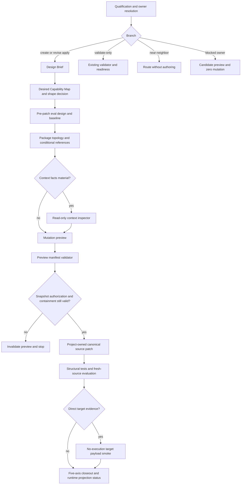

# Spec Write Skill Authoring Workbench - Plan

## Goal Capsule

- **Objective:** 将 `spec-write-skill` 从“治理型 authoring 入口 + package validator”增强为面向用户的 Skill authoring workbench，使 project-owned Skill 的创建或修订形成可审查的设计意图、能力映射、package topology、写入预览、shape-aware eval 与目标 payload 证据。
- **Authority hierarchy:** 用户本轮确认的工具定位与最新方法论要求 > `docs/10-prompt/结构化项目角色契约.md` > `docs/10-prompt/skill-prompt-设计与优化方法论-v2.md` > `docs/10-prompt/spec-first-skill-prompt压缩优化组合方法论.md` > 当前 `spec-write-skill` source/tests 与已完成的通用化计划 > 外部或历史 advisory evidence。
- **Execution profile:** single-agent authoring 为默认主干；只在 claim-critical fresh-source evaluation 中使用独立实例。结构事实由脚本准备，Skill 形状、能力边界、资源分配、语义充分性与停止判断继续由 LLM/human 负责。
- **Stop conditions:** 若实现要求新增公开 workflow、operation/effect/modifier、通用 Skill IR、持久 Design Brief schema、通用 scaffold writer、creator registry、质量总分、持续 benchmark 服务、lifecycle database、跨宿主 adapter registry、`spec-optimize` 第二套实验循环或 generated runtime 直改，停止并重新评估。
- **Tail ownership:** `spec-work` 负责 source 实施、聚焦测试、fresh-source before/after evaluation、文档更新、runtime projection 验证与 closeout。

---

## Product Contract

### Summary

`spec-write-skill` 保留现有 public identity、operation model、source ownership、validate-only 与五轴 readiness 合同，在 create/revise apply 分支中新增 authoring workbench。该工作台先把用户目标转为非持久化的 `Skill Design Brief` 与 `Desired Capability Map`，再选择 Skill 形状和最小必要模块，形成 package topology 与 pre-patch eval plan，经确定性 preview gate 通过后由宿主原生 patch primitive 写入 project-owned canonical source。

新增两个窄脚本：一个只读输出 package source-shape/context facts；另一个只验证 mutation preview、授权 root、路径 collision、snapshot/hash 与 source/runtime 边界。它们不选择 Skill 形状、不生成语义正文、不执行目标 package 代码，也不承担写文件职责。

Eval 设计按目标 Skill 形状分流。Prompt 优化只准备 baseline、protected behavior 与 handoff；实验仍由 `spec-optimize` 拥有，其当前不能表达的 treatment/paired/rollback 字段必须标记为 aspirational 或 `manual_observation`，不得宣称可 promotion。

### Problem Frame

当前 `spec-write-skill` 已经覆盖 create/revise、validate-only、migration/remediation modifier、source owner、外部 package 信任边界、portable/target/project profile、行为合同、机械 validator 和自身 promotion evidence。聚焦的三个 unit suites 共 51 个测试已通过，说明现有治理地板稳定。

但面向用户的 authoring 过程仍主要依赖 LLM 从规则直接跳到 source patch：

- Qualification 已列出 recurring job、输入输出、正负触发、source owner 与 first verification，但没有一个稳定的设计预览供用户和后续步骤共同消费。
- Portable authoring 只粗分 prose-heavy 与工具/schema 型，没有按 entry governor、deterministic tool、artifact producer、agentic loop、long-horizon 或 multi-agent/hybrid 选择不同设计与评测方法。
- Validator 能列 package inventory 和 Markdown reference，却不提供 source bytes、hash、reference edge、可达文件与 orphan candidate 等确定性 context facts。
- `evals/` 主要验证 `spec-write-skill` 自身 route/promotion，尚未给被创建 Skill 提供 shape-aware 的 baseline、protected behavior 和 negative-case 设计方法。
- 写入由 preview-first prose 约定守护，但没有独立 deterministic manifest 检查 source snapshot、dirty overlap、collision、generated mirror 与 apply 前漂移。
- Prompt 优化、target packaging 与 field feedback 有原则边界，但缺少可直接 handoff 的最小输出与失败终态。

当前默认 authoring source 组合 `SKILL.md + references/authoring-method.md` 约 16.9 KB。新增能力如果只是继续向默认热路径叠加 prose，会突破现有 20 KiB default-context 结构预算并增加 GovernanceTCO；因此本计划必须通过 conditional disclosure 与重复内容重排为新增能力腾出空间，而不是加法式扩张。

### Requirements

#### Authoring intent and shape

- R1. Create/revise apply 分支必须在大量正文写入前形成 `Skill Design Brief`，至少覆盖 recurring job、真实输入、required outputs、consumer、positive trigger、negative/near-neighbor、source owner、authority、side effects、主要 failure mode、first verification target 与 invalidation condition。
- R2. Brief 必须携带 `Desired Capability Map`，逐项记录 capability、owner、consumer、risk、hot-or-triggered、source carrier、runtime carrier、deterministic gate、semantic eval、protected behavior、TCO notes 与 `keep|extract|remove|add` disposition；它是 Markdown semantic envelope，不是持久 schema 或 checker 输入。
- R3. Shape selection 由 LLM/human 基于 direct evidence 作出，候选集合至少能表达 entry governor、knowledge/reference、deterministic setup/validation、artifact-producing workflow、prose/agentic workflow、long-horizon loop 与 multi-agent/hybrid；候选名称是决策辅助，不得成为脚本 hard enum。
- R4. 每次 shape decision 必须记录 supporting facts、selected modules、`not_applicable` modules、falsification/invalidation condition；multi-agent/hybrid 必须先通过 ArchitectureFit，否则回到 single-agent + on-demand specialist。
- R5. Operation model 保持 `base_operation=create|revise`、`effect=apply|validate-only`、`modifier=migrate|audit-remediation|none`。不得为 guided、optimization、feedback 或 lifecycle 新增 public mode/modifier/layer result。

#### Evaluation-first and package topology

- R6. Create 在 source patch 前至少设计三个代表性 eval：positive、negative/near-neighbor、主要 failure 或 adversarial；revise 还必须固定旧版 protected behavior 与 before baseline，避免按候选实现反向编写测试。
- R7. Eval family 必须按 Skill 形状选择：entry governor 验 route/collision/discipline；artifact producer 验输出合同与语义质量；deterministic tool 验 facts/reason code/failure boundary；agentic/long-horizon 验 authority/checkpoint/stop/resume/recovery；hybrid 组合各承重面而不强迫统一总分。
- R8. Workbench 必须输出 `protected_behavior → source carrier → contract assertion → semantic eval case` 映射。新增承重行为没有新增 assertion 或 semantic case 时，不能因旧测试全绿而声明有证据覆盖。
- R9. Package topology preview 必须区分 `SKILL.md` spine、triggered references、deterministic scripts、output assets、maintainer-only evals、target sidecar 与 project governance，并为每个 runtime reference 给出 consumer、trigger condition、must-read、fallback 与 eval case。
- R10. Context topology、measurement、optimization 与 lifecycle 方法只在相应信号存在时加载；未选模块记录 `not_applicable + reason`。普通 authoring 不支付完整 optimization/lifecycle context 成本。

#### Deterministic context facts

- R11. 新增独立只读 context-facts primitive，输出稳定排序的 regular-file inventory、Markdown bytes/lines/SHA-256、direct reference edges、从 `SKILL.md` 可达的 Markdown、unreferenced Markdown candidates、reference depth、预算状态与 limitations。
- R12. Context facts 只证明 source shape。它不得声称宿主实际加载、billed token、reference 语义充分性、orphan 成立或 decision sufficiency；这些结论分别需要 host evidence 或 LLM/human judgment。
- R13. Context inspector 必须复用 validator 的 no-follow、安全路径、secret-like 不读不回显、UTF-8 与预算原则；symlink、special file、path escape 或预算耗尽时 fail closed 或返回 incomplete，不执行 package scripts/hooks/binaries。
- R14. `spec-write-skill.validator/v1` 的现有默认输出与 exit semantics 保持兼容。共享 traversal 时可提取内部 helper，但 validator 默认 JSON 不得被 context-facts 新字段静默改形。

#### Preview and mutation gate

- R15. Create/revise apply 在 mutation 前必须形成 preview manifest，包含 canonical source root、authorized root、source snapshot/hash、would-change、preserve、generated、not-touch、existing collision、planned side effects 与 residual risks；Design Brief 语义正文不进入 manifest。
- R16. 新增 preview validator，只机械检查 repo-relative paths、realpath containment、source/runtime 禁区、duplicate/collision、declared preserved files、precondition hash、snapshot freshness、authorization claim 枚举的结构合法性与空 mutation list；它不能独立证明本轮用户授权，也不决定设计合理性或 patch 内容质量。
- R17. Apply 继续使用宿主原生 patch/write primitive 写 project-owned canonical source，不建设通用 scaffold writer。新增目录与文件只有在 preview 和授权均有效时创建。
- R18. Apply 前脚本重新检查 containment、source snapshot、dirty overlap 与 target ownership；宿主 workflow 重新取得并记录本轮用户授权。任一机械事实变化、授权撤销或授权无法确认都使 preview 失效并停止；不得静默重算后继续写入。
- R19. Partial failure 报告已变更与未变更 paths、当前 diff、失败原因和 rollback preview；不得自动执行破坏性回滚，也不得声明完成。

#### Target delivery, optimization and feedback

- R20. Target metadata 与 packaging 只在 direct target evidence 命中时生成或更新。基础 payload smoke 在临时 payload 中检查分发文件、reference closure、metadata 与“不依赖 evals/reports/repo-local docs”，不执行目标 package 代码。
- R21. 未运行真实宿主 invocation、runtime projection 或 target-provided validator 时，portable readiness 可独立判断，但指定 target 轴必须 `degraded|not-ready` 并给出 reason；不得用 Codex sidecar推断其他宿主等价能力。
- R22. Measurable optimization 是主要意图且尚未形成 authoring patch 时，`spec-write-skill` 以 near-neighbor `effect=not-entered` handoff `spec-optimize`；普通明确 revise 仍由本 workflow 完成 source authoring，不形成双 owner 或循环 handoff。
- R23. Optimization handoff 至少携带 source snapshot、mutable/immutable scope、trigger evidence、baseline、protected behavior、treatment、controlled variables、metric、budget、stop condition、rollback、invalidation 与 owner-contract limitations。
- R24. `spec-optimize` 当前不能持久表达 treatment arms、paired comparison 或 rollback/invalidation 时，只允许 `execution_mode=manual_observation` 或 deferred；该证据不可单独支持 default promotion，不新增旁路 experiment database/runner。
- R25. Feedback、transcript、issue 或现场失败先作为 advisory input，绑定 source/host/model 后分类为 route、behavior、tool、target 或 project failure；只有完成最小化脱敏复现、确认期望行为并获得 eval-source mutation 授权后，才转为 regression case。
- R26. 无法复现的反馈只保留 observation；post-write eval 或 payload smoke 失败时保留可审查 diff、阻断完成声明并提供修正或 rollback preview，不自动将失败经验晋级 durable knowledge。

#### Compatibility and delivery

- R27. `spec-write-skill` public name、`write-skill` command、workflow governance record、five-axis readiness 与五宿主 delivery 保持兼容；audit-only、installer、runtime maintenance、external validate-only 和 blocked-source-owner 分支不进入 authoring workbench。
- R28. 新增 runtime-required scripts/references 必须由现有 generator 投影；不得修改 `.claude/`、`.codex/`、`.agents/skills/`、`.cursor/`、`.kiro/` 或 `.qoder/` 作为 source fix。
- R29. 用户可见定位同步到 Claude/Codex metadata、workflow map、README/README.zh-CN 与 CHANGELOG；若实现不改变 governance schema 或 CLI adapter，不为“完整”修改这些 owners。
- R30. Closeout 分别报告 deterministic checks、eval adequacy、five-axis readiness、default-source bytes、field outcome 状态、not-run reasons、generated runtime 状态与 residual risks；不得把结构通过、source bytes 或 manual observation 冒充用户效率与 runtime cost 改善。

### Key Flows

- F1. **Guided create/revise:** qualify → resolve owner/effect → Design Brief → desired capability map → shape/modules → pre-patch eval/baseline → package topology → context facts when material → preview manifest → deterministic preview validation → recheck snapshot/authorization → canonical source patch → structural tests → fresh-source eval；只有 direct target evidence 命中时运行 target payload smoke，否则直接以 target not-run/degraded reason closeout。
- F2. **External validate-only:** qualify as `base_operation=revise/effect=validate-only` → no-follow inventory → bundled validator → target/project checks when evidence exists → readiness report → closeout；不生成 authoring brief、patch、eval source 或 installation action。
- F3. **Near-neighbor and blocked owner:** audit-only/installer/runtime maintenance/primary measurable optimization 直接 route；source owner blocked 只给 candidate path/package outline，would-change 与 command list 为空，零 mutation。
- F4. **Prompt optimization of an existing Skill:** verify project-owned source → establish trigger evidence/baseline/protected behavior/capability inventory → decide whether this is a direct revise or `spec-optimize` handoff → supported handoff or `manual_observation/not promotable` → no local experiment loop。
- F5. **Feedback to regression:** ingest advisory feedback → bind source/host/model → minimize/redact/reproduce → user confirms expected behavior and mutation → add regression case → revise source → before/after verification；unreproduced feedback ends as observation。
- F6. **Target delivery:** portable source ready → confirmed target profile → generate/check sidecar → build temporary target payload → no-execution payload smoke → project generator/runtime projection only with separate authorization → target/project readiness closeout。

### Acceptance Examples

- AE1. 用户在普通 Node.js repo 中说“把每周 API 兼容性检查做成 Skill”，但只给出一句目标。Workflow 先生成 Design Brief 与三个 pre-patch eval，选择 artifact-producing single-agent shape，展示 package topology 和 source-only preview，用户确认后才写 canonical package。
- AE2. 用户要创建一个包装确定性 CLI 的 Skill。Workflow 选择 deterministic setup/validation shape，把事实处理放脚本、语义解释留给 prompt，不加载 behavior-contract reference，也不生成 persona/few-shot 内容。
- AE3. 用户修改客服 Agent Skill。Workflow 选择 prose/agentic shape，加载行为合同与 shape-aware eval，覆盖 authority boundary、good/bad/why、输出合同、checkpoint 和 stop/recovery。
- AE4. 用户要求“用五个 agent 一起写 Skill”。若任务高度共享上下文且无独立证据方向，ArchitectureFit 不通过，Workflow 记录理由并回到 single-agent + claim-critical fresh reviewer，而不是按用户数字构建固定 roster。
- AE5. Preview 后目标 `SKILL.md` 被用户并行修改。Apply 前 hash/dirty-overlap gate 使 preview 失效，Workflow 停止并要求重新 preview，不覆盖用户修改。
- AE6. 外部 package 带 symlink、secret-like 文件和自带 validator。Validate-only 只运行 bundled inspector/validator，不读取 secret、不跟随 symlink、不执行 package code，也不进入 authoring workbench。
- AE7. 用户要求优化一个 Skill 的 billed token，但当前只有 source bytes，且 `spec-optimize` 无法表达所需 paired arm。Workflow 标记 `trigger_evidence=structural_only` 和 `execution_mode=manual_observation`，不得声明默认策略 promotion。
- AE8. 一段 transcript 声称 Skill 越权发送数据。Workflow 先脱敏、绑定 source/host/model 并复现；未经确认和授权不写 regression，不自动把 transcript 当 confirmed truth。
- AE9. 临时 target payload 缺少被 `SKILL.md` 引用的 runtime reference，或依赖 `evals/README.md` 才能运行。Payload smoke 失败，target readiness 为 not-ready，禁止 package-ready closeout。

### Success Criteria

- SC1. Fresh-source representative cases 能稳定产出 Design Brief、Desired Capability Map、shape decision、selected/not-applicable modules、pre-patch eval 与 package topology，且 multi-agent 不成为默认。
- SC2. Context inspector 和 preview validator 均为 dependency-free、no-follow、零 package-code execution、零 source 写入；其 JSON/human contract 有聚焦单测与稳定 reason codes。
- SC3. Existing validator v1、operation model、layer results、five-axis readiness、public workflow identity 与 external validate-only 行为不回归。
- SC4. 默认 authoring source context 保持在既有 20 KiB 结构预算内，或有明确质量/安全收益例外；该指标只证明 source shape，不声明 billed token 下降。
- SC5. 新增承重行为均有 contract assertion 与 fresh-source before/after case；本轮最高行为证据目标为 L3，field outcome 明确为 unavailable/not-run，除非执行期取得真实代表性反馈。
- SC6. Target payload smoke 证明 runtime-required closure，不执行目标 package 代码；其他宿主没有 direct evidence 时诚实 degraded。
- SC7. Runtime 只由 source generator 重建，新增 scripts/references 在所有支持宿主投影一致，maintainer-only evals 不进入 runtime。

### Scope Boundaries

**In scope**

- Design Brief、Desired Capability Map、shape/module selection 与 package topology preview。
- Pre-patch eval design、shape-aware evaluation 与 protected behavior mapping。
- 只读 context facts primitive、preview manifest validator 与 apply 前 snapshot/authorization gate。
- Target payload no-execution smoke、`spec-optimize` handoff、feedback-to-regression 门。
- `spec-write-skill` source/tests/docs/metadata/runtime projection expectations。

**Deferred**

- 有明确跨会话 consumer 后再讨论 durable Design Brief/resume receipt。
- 第二个 confirmed target delta 后再讨论 target adapter 抽象。
- `spec-optimize` 拥有 non-mutating treatment 与 paired protocol 后再支持自动 promotion。
- 取得 field outcome 后再评估用户纠正负担和真实 authoring 时间改善。

**Outside product identity**

- 通用 Skill IDE、marketplace、installer、publisher、creator registry 或中心化 SkillOps 平台。
- 通用 scaffold writer、通用 Skill IR、统一 quality score、自动语义裁决或 workflow 强状态机。
- 第三方 package 代码执行、跨 repo mutation、自动 durable knowledge promotion。
- Prompt cache、model override、lossy compressor 或其他 host accelerator 的实现。

### Sources

- `docs/10-prompt/结构化项目角色契约.md`
- `docs/10-prompt/skill-prompt-设计与优化方法论-v2.md`
- `docs/10-prompt/spec-first-skill-prompt压缩优化组合方法论.md`
- `docs/plans/2026-07-12-002-refactor-spec-write-skill-generalization-plan.md`
- `skills/spec-write-skill/SKILL.md`
- `skills/spec-write-skill/references/authoring-method.md`
- `skills/spec-write-skill/references/behavior-contract-design.md`
- `skills/spec-write-skill/references/delivery-gates.md`
- `skills/spec-write-skill/references/target-profiles.md`
- `skills/spec-write-skill/references/project-profiles.md`
- `skills/spec-write-skill/scripts/validate-skill.cjs`
- `skills/spec-write-skill/evals/trigger-cases.json`
- `skills/spec-write-skill/evals/README.md`
- `skills/spec-optimize/SKILL.md`
- `skills/spec-optimize/references/optimize-spec-schema.yaml`
- `docs/contracts/workflows/fresh-source-eval-checklist.md`
- `docs/solutions/architecture-patterns/front-controller-triggered-references-gates-eval-regression-2026-07-01.md`
- `docs/solutions/architecture-patterns/spec-plan-governance-header-capability-inventory-2026-06-11.md`
- `docs/solutions/workflow-issues/routing-skill-eval-methodology-2026-06-08.md`
- `docs/solutions/workflow-issues/skill-prose-rewrite-contract-test-coverage-2026-06-28.md`
- `docs/solutions/workflow-issues/modify-source-not-artifacts-2026-04-13.md`

---

## Planning Contract

### Key Technical Decisions

- KTD1. **Workbench 是 semantic envelope，不是新 IR。** Design Brief、Desired Capability Map 与 shape decision 只存在于 preview/closeout prose，除非未来出现稳定跨会话 consumer；这避免为一次 authoring 建立第二真相源。
- KTD2. **不建设 scaffold writer。** 宿主原生 patch/write primitive 已能创建 source；项目只建设 preview validator，机械守住路径、snapshot、collision、授权和 source/runtime 边界，避免重建 host 文件写入能力。
- KTD3. **Context facts 与 readiness validator 分离。** 新脚本输出 `spec-write-skill.context-facts/v1`，现有 `spec-write-skill.validator/v1` 默认 contract 不变；若共享 traversal，内部 helper 不成为 public API。
- KTD4. **Shape 是开放式判断标签。** Shape 集合提供代表性模式和 eval family，不作为脚本 enum、frontmatter 字段或 routing contract；新形状可以用 primary shape + secondary signals 表达。
- KTD5. **Evaluation-driven 顺序前移。** Design Brief 后先建立 baseline gap、protected behavior 和至少三个 cases，再写最小正文；patch 后的 fresh-source evaluation 只验证候选，不能替代 pre-patch baseline。
- KTD6. **新增能力由 conditional disclosure 负担。** `SKILL.md` 保留 route、effect、hard boundaries 与工作台触发；Design Brief/shape、eval design、optimization/lifecycle 进入一跳 triggered references，且通过删重与重排控制默认 source bytes。
- KTD7. **Preview manifest 只承载 mutation facts。** 语义 intent 不写入可机械校验 manifest；apply 前 snapshot/dirty overlap 重验，避免 preview 成为 universal authoring schema 或掩盖 TOCTOU。
- KTD8. **Eval 按 shape 组合，不维护通用总分。** `validate-promotion-evidence.cjs` 继续只验证 `spec-write-skill` 自身 promotion bundle；目标 Skill 使用目标项目现有 eval/test owner，缺少 owner 时只产 maintainer-only 最小 cases。
- KTD9. **Optimization 主意图在 qualification 路由。** 若用户要的是有指标的优化实验，直接 handoff `spec-optimize`；只有明确 source revise 才留在 authoring workflow。Unsupported treatment 只能 manual observation，不自动 promotion。
- KTD10. **Lifecycle 复用 revise，不增加状态系统。** Feedback 经脱敏、复现、授权后进入 target-local regression；source、diff、eval 与 snapshot 已足够支持恢复，不建立 run database 或自动 rollback subsystem。
- KTD11. **Target smoke 默认 no-execution。** 临时 payload 只验证分发闭包与 metadata；真实宿主 invocation、project init、安装、发布、网络和工具调用需要独立授权，并按 target/project readiness 单独报告。
- KTD12. **本计划不声称 runtime/token 或 field improvement。** Source bytes 是结构 countermetric；行为目标为 L3 before/after non-regression + 新能力覆盖，真实用户效率留待 field outcome。

### High-Level Technical Design

以下流程是方向性设计，不规定具体函数签名：



### Deterministic Contracts

**Context facts output**

- Producer: `skills/spec-write-skill/scripts/inspect-context.cjs`。
- Consumer: `spec-write-skill` authoring workbench，只有 references/default-context 承重时调用。
- Authority: advisory/confirmed mechanical facts；不拥有 semantic readiness。
- Required facts: root/snapshot、files、Markdown bytes/lines/hash、reference edges、reachable Markdown、unreferenced candidates、depth、budget state、findings、limitations。
- Failure: unsafe path、symlink/special file、secret-like content、invalid UTF-8、broken reference 或预算耗尽返回 fail/incomplete reason，不输出敏感值。

**Preview manifest validator**

- Producer: LLM 在 OS temp 中生成 `spec-write-skill.authoring-preview/v1` JSON；`skills/spec-write-skill/scripts/validate-authoring-preview.cjs <manifest.json> --json` 只验证 mutation facts，并从同一结果渲染 human output。
- Consumer: apply 前 mutation gate 与 closeout。
- Required facts: schema version、target repo/root、canonical source root、authorized root、requested effect、authorization claim、would-change/preserve/generated/not-touch paths、collision disposition，以及 SHA-256 snapshot。Git snapshot 记录 HEAD 与声明 path sets 的 porcelain/hash；non-Git snapshot 记录声明 regular files 的 existence/hash 和新路径最近现存父目录 entries。
- Snapshot scope: 只覆盖四组声明 paths、目标 `SKILL.md`、待创建路径的最近现存父目录与 ownership evidence；无关 dirty paths 不阻断，任何受覆盖 path 的 preview 后变化都使 manifest stale。
- Result contract: `pass|fail|incomplete` 对应 exit 0/1/2，findings 使用稳定 reason code；输入 manifest 不持久化为 project source。
- Failure: absolute/escaping/generated path、duplicate path、unresolved collision、snapshot drift、dirty overlap 或 source owner mismatch 阻断 apply。Authorization claim 只校验枚举结构；当前用户授权由宿主 workflow 重新确认，不能由脚本从 manifest 自证。
- Non-goal: 不判断 Design Brief、Skill shape、prose、eval quality 或 target readiness。

### Assumptions

- A1. 用户接受 V1 不建设 scaffold writer；宿主原生 patch 是 canonical source 的唯一写入 primitive。
- A2. 当前没有 confirmed 跨会话 consumer 需要持久 Design Brief，因此不新增 durable schema/resume receipt。
- A3. 当前 `spec-optimize` 的 mutable-scope、single experiment 与 winner integration 是 confirmed；treatment arms、paired comparison、rollback/invalidation persistence 继续按最新方法论标为 aspirational。
- A4. 最新方法论中 decision sufficiency 的统一 pass/fail 定义和方法论自身 GovernanceTCO 仍是 open question，本计划只使用 task-specific protected behavior 与 evidence adequacy，不把两者固化成全局 schema。
- A5. 外部 research 未额外运行；最新 canonical/companion 已聚合业界来源，本计划的实现选择主要由当前 source/tests、项目 learnings 与 role contract 决定。

### System-Wide Impact

- **Workflow entry:** `spec-write-skill` 的 public identity 与 near-neighbor route 不变，但 create/revise apply 的输出从直接 patch 增加为 user-visible design/eval/preview chain。
- **Runtime package:** 新增 references/scripts 属 product-bundled runtime assets，必须进入 Claude、Codex、Cursor、Kiro、Qoder 投影；`evals/` 与 validation reports 仍为 maintainer-only。
- **Tests:** 新增两个 script suites，并扩展 contract/eval fixture/projection tests；existing validator/promotion evidence tests继续防回归。
- **Prompt context:** 默认 hot path 必须通过内容迁移而非纯新增控制 source bytes；optimization/lifecycle 冷分支不得默认加载。
- **Security:** 外部 package 仍零代码执行；preview manifest 和 context inspector 只读。Target smoke 不执行 package scripts，不读取 secret-like 文件。
- **Ownership:** 不修改 CLI adapters、governance schema、installer、runtime setup、`spec-optimize` schema 或 generated runtime source ownership。

### Risks and Mitigations

| Risk | Impact | Mitigation |
| --- | --- | --- |
| Workbench 膨胀为 SkillOps 平台 | 高维护成本、职责漂移 | Stop conditions 禁止 IR/registry/database/writer；每个新增 artifact 必须有真实 consumer |
| Shape taxonomy 变成硬枚举 | 新 Skill 形状被错误拒绝 | 只作 LLM decision labels，脚本和 frontmatter 不消费 enum |
| Preview 后并发修改导致覆盖 | 用户 source 丢失 | apply 前重验 snapshot、dirty overlap、containment 与授权，漂移即失效 |
| Context inspector 与 validator 重复安全逻辑 | drift、隐私风险 | 提取 private inspection helper 或通过单一 traversal 复用；两种 public output contract 分离 |
| Orphan candidate 被误当删除结论 | 删除动态/脚本消费资源 | 明确只输出 candidate；LLM 确认 consumer 后才能 disposition |
| Eval 模板反向适配实现 | 假绿、无 baseline | pre-patch eval 和 baseline 强制前移；fresh reviewer 不接收 intended fix |
| 新 references 增加默认 context | 激活成本上升 | 一跳 conditional disclosure、删重、20 KiB structure guard、source/aggregate/host claim 分开 |
| Target smoke 被误作安装或执行 | 越权副作用 | 默认临时 payload no-execution；真实 invocation/init/发布单独授权 |
| `spec-optimize` handoff 过度承诺 | 无法恢复或 promotion 假象 | supported/aspirational 明示；manual observation 标 not promotable |
| Feedback 污染 regression | 恶意或偶发噪声固化 | 绑定 source/host/model、脱敏复现、确认期望与授权后才写 eval source |

### Sequencing

```text
U1 authoring contract and shape decision
├─ U2 context facts primitive
├─ U3 preview manifest gate
└─ U4 shape-aware evaluation
   └─ U5 optimization/lifecycle and target delivery
      └─ U6 docs, projection, fresh-source evidence and closeout
```

---

## Implementation Units

### U1. Authoring Brief, capability map and shape decision

- **Goal:** 在不改变 operation/layer-result contract 的前提下，为 create/revise apply 建立 evaluation-first authoring workbench spine。
- **Requirements:** R1-R10、R27。
- **Files:**
  - Modify: `skills/spec-write-skill/SKILL.md`
  - Modify: `skills/spec-write-skill/references/authoring-method.md`
  - Add: `skills/spec-write-skill/references/authoring-workbench.md`
  - Modify: `skills/spec-write-skill/evals/trigger-cases.json`
  - Modify: `tests/unit/spec-write-skill-contracts.test.js`
- **Approach:** 将 qualification 保留在现有 authoring method；source owner/effect 确认后才加载 workbench reference。新 reference 拥有 Design Brief、Desired Capability Map、shape/module selection、pre-patch eval、package topology 与 preview handoff；behavior contract 继续只在 prose/agentic shape 触发。
- **Patterns:** `skills/spec-write-skill/references/behavior-contract-design.md` 的 criteria-before-enumeration；`skills/spec-plan` 的 Front Controller + triggered reference；canonical v2 的 eval-first 与 STOP trigger 四件套。
- **Test Scenarios:**
  - 普通 project-owned create 产生 Brief、capability map、shape/modules、三个 pre-patch cases 和 source-only preview。
  - Deterministic tool shape 不加载 behavior contract；prose agent shape 必须加载。
  - Multi-agent 请求在 ArchitectureFit 不充分时回到 single-agent，不创建固定 roster。
  - External validate-only、audit-only、installer、runtime maintenance、blocked-source-owner 不进入 workbench。
  - Contract test 确认 operation/effect/modifier/layer-result 枚举未扩张。
- **Verification:** Source contract assertions 能定位新承重行为及其 reference trigger；existing route fixture 全部仍被消费。
- **Dependencies:** 无。

### U2. Read-only package context facts

- **Goal:** 用单一 no-follow traversal 提供 package source-shape facts，避免 LLM 重复手工统计 bytes、hash、reference reachability 与 candidate orphans。
- **Requirements:** R11-R14。
- **Files:**
  - Add: `skills/spec-write-skill/scripts/inspect-context.cjs`
  - Add: `skills/spec-write-skill/scripts/lib/package-inspection.cjs`
  - Modify: `skills/spec-write-skill/scripts/validate-skill.cjs`
  - Add: `tests/unit/spec-write-skill-context-inspector.test.js`
  - Modify: `tests/unit/spec-write-skill-validator.test.js`
- **Approach:** 从 validator 提取 private package inspection helper，保留 validator v1 默认输出；inspector 使用独立 `spec-write-skill.context-facts/v1` 输出。Shared helper 只负责 path safety、budgeted text reads、reference edges 与 facts，不包含 authoring judgment。
- **Test Scenarios:**
  - 正常 package 的 bytes/lines/hash/reference edges 稳定排序且重复运行一致。
  - Secret-like path 不读取、不回显；symlink/special file/path escape 失败关闭。
  - Broken reference、invalid UTF-8、file/byte/depth budget 返回准确 fail/incomplete reason。
  - Dynamic/script-consumed resource 只被列为 unreferenced candidate，不产生自动 delete finding。
  - Inspector 运行前后 package tree hash 不变。
  - Existing validator fixtures 的 result、findings、inventory 和 exit code 完全兼容。
- **Verification:** Context facts 只能支持 source-shape claim；测试中不出现 semantic quality、runtime loading 或 token-saving verdict。
- **Dependencies:** U1 的消费合同。

### U3. Mutation preview manifest and snapshot gate

- **Goal:** 把 preview-first 的路径、snapshot、collision 和授权边界变成可机械阻断的 mutation gate，同时继续由宿主写 canonical source。
- **Requirements:** R15-R19。
- **Files:**
  - Add: `skills/spec-write-skill/scripts/validate-authoring-preview.cjs`
  - Add: `tests/unit/spec-write-skill-authoring-preview.test.js`
  - Modify: `skills/spec-write-skill/references/authoring-workbench.md`
  - Modify: `skills/spec-write-skill/references/delivery-gates.md`
  - Modify: `tests/unit/spec-write-skill-contracts.test.js`
- **Approach:** 定义 `spec-write-skill.authoring-preview/v1` producer-local JSON，只承载 mutation facts，并以 manifest file path 作为 CLI 输入。Validator 从同一 report 渲染 JSON/human 输出，机械验证 source root、authorized root、SHA-256 snapshot、dirty overlap、path sets、collision disposition、effect 与 authorization claim 的结构；宿主 workflow 另行重新确认真实用户授权，apply 仍由 host patch primitive 完成。
- **Test Scenarios:**
  - Absolute path、parent escape、generated runtime path、symlinked ancestor、跨 repo target 被阻断。
  - would-change/preserve/generated/not-touch 重复或重叠被阻断。
  - Existing file collision 没有 disposition 时失败；unknown sidecar 默认 preserve/manual decision。
  - Preview 后 source hash 或 dirty overlap 变化时返回 stale-preview，零 mutation。
  - Invalid authorization claim enum 机械失败；真实授权撤销或无法确认时由宿主 workflow 停止，且不得把 manifest claim 报告为 confirmed authorization。
  - Empty mutation request、validate-only 和 blocked-source-owner 不能伪装成 apply-ready。
  - JSON 与 human 输出来自同一 report，`pass|fail|incomplete`、exit 0/1/2 和 reason codes 保持一致。
- **Verification:** Test fixture 对运行前后 workspace snapshot 作差，确认 validator 零写入；semantic Brief 字段不进入 machine contract。
- **Dependencies:** U1。

### U4. Shape-aware eval and evidence mapping

- **Goal:** 让被创建或修订的 Skill 在写 prose 前拥有与自身形状匹配的 baseline、protected behavior、negative cases 和 evidence adequacy。
- **Requirements:** R6-R10、R25-R26、R30。
- **Files:**
  - Add: `skills/spec-write-skill/references/evaluation-design.md`
  - Modify: `skills/spec-write-skill/references/authoring-workbench.md`
  - Modify: `skills/spec-write-skill/references/delivery-gates.md`
  - Modify: `skills/spec-write-skill/evals/trigger-cases.json`
  - Modify: `skills/spec-write-skill/evals/README.md`
  - Modify: `tests/unit/spec-write-skill-contracts.test.js`
  - Modify: `tests/unit/eval-fixture-contracts.test.js`
- **Approach:** Evaluation reference 按 shape 提供 baseline、case family、machine assertion 与 semantic rubric 的选择判据。目标项目有 native eval owner 时复用；没有时只创建 target-local maintainer cases，不升级 `spec-write-skill` promotion validator 为通用平台。
- **Test Scenarios:**
  - Entry governor 使用 with-skill vs bare-menu baseline，覆盖 collision、near-neighbor 与多 run 方差。
  - Artifact producer 检查真实 artifact contract；deterministic tool 检查 reason/failure；agentic loop 检查 authority、checkpoint、stop/recovery。
  - 每个新增 protected behavior 都有 source carrier、contract assertion 与 semantic case。
  - Fresh reviewer 只接收 raw source/request/artifact，不接收 intended fix。
  - Feedback 无法复现、未脱敏或未授权时不写 regression；确认后才进入 revise。
- **Verification:** Contract fixtures 证明 eval plan 被消费；fresh-source case 证明行为，不用 structural-only 冒充 trigger rate 或 quality improvement。
- **Dependencies:** U1；U2 facts 可选。

### U5. Optimization handoff and target payload delivery

- **Goal:** 为 prompt optimization、target metadata 和 package delivery提供诚实 handoff，不把 authoring workflow扩张成实验平台或跨宿主 adapter。
- **Requirements:** R20-R26。
- **Files:**
  - Add: `skills/spec-write-skill/references/optimization-and-lifecycle.md`
  - Modify: `skills/spec-write-skill/references/target-profiles.md`
  - Modify: `skills/spec-write-skill/references/project-profiles.md`
  - Modify: `skills/spec-write-skill/references/delivery-gates.md`
  - Modify: `skills/spec-write-skill/evals/trigger-cases.json`
  - Modify: `tests/unit/spec-write-skill-contracts.test.js`
- **Approach:** Optimization reference 只在 measurable optimization 或 field feedback 分支加载，复用最新 companion 的 supported/aspirational handoff 与 manual observation 口径。Target profile 明确临时 payload closure smoke、metadata freshness 和真实 invocation 的授权边界。
- **Test Scenarios:**
  - Primary metric optimization 在未 authoring 时 near-neighbor handoff `spec-optimize`，不写 source。
  - 普通 revise 保持单 owner；不出现 authoring→optimize→authoring 循环。
  - Unsupported treatment 输出 `execution_mode=manual_observation`、`not promotable` 与 limitations。
  - Payload 缺 runtime reference、依赖 evals/repo docs 或 metadata 漂移时 target not-ready。
  - Codex confirmed delta 可用；其他 host 无 direct evidence 时 degraded，且不生成假 adapter。
  - Target package scripts 不执行；真实 invocation/init/publish 无授权时 not-run。
- **Verification:** `spec-optimize` schema 未被修改；target/project/semantic/mutation readiness 仍分别报告。
- **Dependencies:** U1、U4。

### U6. Public positioning, projection and behavioral closeout

- **Goal:** 同步 user-visible authoring workbench 定位，完成 source-first 五宿主投影、聚焦测试和 L3 fresh-source before/after evidence。
- **Requirements:** R27-R30、SC1-SC7。
- **Files:**
  - Modify: `skills/spec-write-skill/agents/openai.yaml`
  - Modify: `templates/claude/commands/spec/write-skill.md`
  - Modify: `docs/workflow-skill-agent-map.md`
  - Modify: `README.md`
  - Modify: `README.zh-CN.md`
  - Modify: `CHANGELOG.md`
  - Generate from source: `docs/catalog/runtime-capabilities.md`
  - Add execution evidence: `docs/validation/2026-07-14-spec-write-skill-authoring-workbench/`
  - Modify as needed: `tests/unit/plugin-modules.test.js`
  - Modify as needed: `tests/smoke/cli-smoke.test.js`
- **Approach:** 先锁定 source/contract/tests，再运行 before/after representative authoring cases。只有 route/default-policy/hard-gate 发生额外变化时才升级到完整 promotion bundle；本计划默认使用纯 prose/structure 对应的 paired holdout + script tests，field outcome 保持 not-run。
- **Test Scenarios:**
  - 普通 repo create、deterministic tool、prose agent、long-horizon、multi-agent request、external validate-only、stale preview、optimization handoff、feedback-to-regression。
  - Before/after 复用同一 source snapshot、request、host/model；高歧义 case 重复运行并报告波动。
  - 宿主 source patch 在部分文件写入后失败时，closeout 精确报告 changed/unchanged paths、当前 diff、失败原因和 rollback preview，禁止自动破坏性回滚与完成声明。
  - Default source bytes、runtime-required resource closure、五宿主投影与 maintainer-only eval exclusion。
  - README/metadata/route fixtures 与 public workflow identity 一致。
- **Verification:** Fresh-source evaluation 达到 L3 或明确 `not_run:<reason>`；source/runtime、mutation、verification、handoff 和 knowledge promotion 边界无回归。
- **Dependencies:** U1-U5。

---

## Verification Contract

| Gate | Scope | Commands / Evidence | Done Signal |
| --- | --- | --- | --- |
| V1 Mechanical package | 当前 `spec-write-skill` package | `node skills/spec-write-skill/scripts/validate-skill.cjs skills/spec-write-skill --strict-portable --json` | result=pass；无新增 secret/symlink/reference finding |
| V2 Context facts | U2 | `node skills/spec-write-skill/scripts/inspect-context.cjs skills/spec-write-skill --json`；`npx jest --runTestsByPath tests/unit/spec-write-skill-context-inspector.test.js tests/unit/spec-write-skill-validator.test.js --runInBand` | facts 稳定、no-follow、zero-write；validator v1 non-regression |
| V3 Preview gate | U3 | `npx jest --runTestsByPath tests/unit/spec-write-skill-authoring-preview.test.js --runInBand` | escape/collision/snapshot drift 全部 fail closed；JSON/human、reason code、exit 0/1/2 一致；workspace unchanged；授权只作结构 claim，真实授权由 workflow 重确认 |
| V4 Source contracts | U1/U4/U5 | `npx jest --runTestsByPath tests/unit/spec-write-skill-contracts.test.js tests/unit/eval-fixture-contracts.test.js --runInBand` | 新行为逐项有 assertion；旧 route/effect/layer-result 兼容 |
| V5 Promotion evidence compatibility | Existing maintainer evidence | `npx jest --runTestsByPath tests/unit/spec-write-skill-promotion-evidence.test.js --runInBand`；验证已发布 v1/v2 bundle | 现有 bundle 语义和 validator exit contract 不回归 |
| V6 Eval fixtures | Shape-aware cases | `npm run test:eval-fixtures` | structural fixtures 消费 expected outcomes；不宣称 semantic pass |
| V7 Fresh-source behavior | U1/U4/U5/U6 | 按 `docs/contracts/workflows/fresh-source-eval-checklist.md` 运行 before/after representative cases | eval adequacy=L3；`not_run:<reason>` 只能形成 degraded 未完成 closeout，并阻断 semantic readiness 与计划完成声明 |
| V8 Target payload | U5/U6 | 临时 package payload closure + project-approved smoke；`npm run test:smoke`、`npm run test:integration` | runtime-required files complete；package code 未执行；未确认 host degraded |
| V9 Source/runtime projection | U6 | `npm run docs:runtime-catalog`；项目批准后从 source 运行五宿主 init/projection tests | catalog/generated runtime 来自 source；5-host expectations一致；无手改 mirror |
| V10 Repository quality | 全部 | `npm run typecheck`、`npm run lint:skill-entrypoints`、`npm run build`、按影响面运行 `npm test`、`git diff --check` | 聚焦与扩大验证无归属于本计划的失败；not-run/known unrelated failure 诚实记录 |

### Behavioral Evaluation Minimum

- Baseline split: development cases、iterative holdout；本计划不改变 model routing/roster，默认不要求 sealed promotion test。
- Protected decisions: correct route/effect、source ownership、validate-only zero write、external zero execution、generated runtime refusal、pre-patch eval、snapshot gate、shape/module choice、target degradation、optimization owner、feedback authorization。
- Countermetrics: source bytes、aggregate input/output/tool results when observable、duration、human correction count；没有 observed runtime/field evidence时不作改善 claim。
- Reviewer: fresh generic instance，blind to intended fix；复杂 case 至少两次 run，报告最坏分层而不是只报最佳结果。
- Partial-write failure: fresh-source case 必须验证 changed/unchanged paths、当前 diff、失败原因、rollback preview、无自动破坏性回滚和无完成声明。
- Promotion escalation: 若实施改变 description route、hard gate、public operation/layer result、target invocation policy 或 default policy，改用现有 full promotion protocol，而不是沿用简化评测。

---

## Definition of Done

- R1-R30 均有对应 Implementation Unit、source owner 与验证证据，且不存在 launch-blocking open question。
- Create/revise apply 形成 Design Brief、Desired Capability Map、shape/modules、pre-patch eval、package topology、validated preview 和 source patch；validate-only/near-neighbor/blocked-owner 分支保持短路。
- 不新增 public operation/effect/modifier/layer-result、通用 IR、scaffold writer、quality score、run database、adapter registry 或实验循环。
- Context inspector 与 preview validator 为 dependency-free、zero-write、no-follow；secret、symlink、path escape、collision 和 snapshot drift 均 fail closed。Preview validator 只校验 authorization claim 结构，真实用户授权由宿主 workflow 重新确认，无法确认时停止。
- `spec-write-skill.validator/v1` 与已发布 promotion evidence v1/v2 保持可复验；new context/preview contracts 各有独立 schema owner 和测试。
- Shape-aware eval 在 patch 前建立 baseline，在 patch 后运行 fresh-source before/after；新增承重行为没有“旧测试全绿但无新证据”的假完成。
- Default authoring source context 保持既有结构预算或记录例外；没有把 source bytes 冒充 runtime/billed savings。
- Target payload smoke 不执行 package code；其他 host 没有 direct evidence 时保持 degraded；runtime 只从 source generator 重建。
- `spec-optimize` unsupported treatment 明确 `execution_mode=manual_observation` 且 `not promotable`；feedback 只有经复现、脱敏、确认和授权后进入 regression。
- README、README.zh-CN、workflow map、Claude/Codex metadata、runtime catalog、tests 和 CHANGELOG 与新定位一致。
- Fresh-source status、five-axis readiness、field outcome、not-run reasons、generated runtime 状态和 residual risks 在 closeout 中分开报告。
- 临时 eval/payload workspace 位于 `skills/` 之外，废弃尝试、缓存与中间文件不留在最终 diff。
