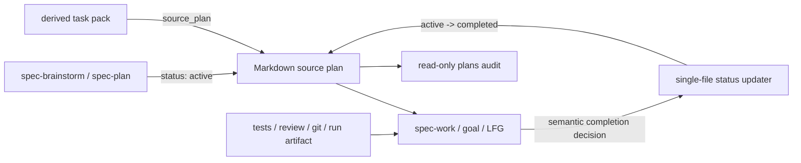

# 恢复 Plan Status Lifecycle - 计划

## Goal Capsule

- **Objective:** 用最小可维护机制恢复 Markdown software plan 的可审计状态：识别既有四态 taxonomy，新计划写入 `active`，完整 shipping tail 只执行 `active → completed`，用户可只读盘点状态。
- **Authority:** 当前 unified artifact contract 是迁移基线；`master` 只提供 `active → completed`、task-pack 更新 source plan 和 taxonomy test 的行为参考。
- **Execution profile:** Standard。只修改 status contract、producer、shipping closeout、基础 audit、测试和用户文档。
- **Stop conditions:** 不建设第二套 completion evidence、执行状态机或事件账本；不让 task pack 成为 lifecycle owner；不迁移历史计划；不把 audit 变成首期 merge gate；不手改 generated runtime mirror。

---

## Product Contract

### Summary

恢复独立于 `artifact_readiness` 的 plan `status` 字段。`spec-brainstorm` / `spec-plan` 只为适用的 Markdown software unified plan 生产 `active`，`spec-work` 或拥有完整 shipping tail 的 caller 在既有验证与 review gate 后把 source plan 从 `active` 更新为 `completed`，`spec-first plans audit` 提供 Markdown-only 只读盘点。Status 是 audit marker，不是测试、合并、发布或 field outcome proof。

### Problem Frame

当前分支为了避免把 plan 当 task tracker，禁止 mutable `status`。这保护了证据边界，却使用户无法快速回答“哪些计划已经开发完成”。

`master` 已证明核心行为不需要一套 lifecycle 平台：producer 写初始状态，shipping closeout 把 direct plan 或 task pack 的 `source_plan` 从 `active` 更新为 `completed`，taxonomy test 约束合法值。当前分支的 unified readiness、task-pack source ownership、goal/LFG tail 和多宿主 source projection 需要适配，但不构成建设 receipt chain、semantic hash、legacy baseline 或 task-pack v2 的理由。

### Requirements

**状态合同**

- R1. Markdown software plan 新增独立顶层 `status`；reader 与 audit 可识别的合法 taxonomy 保持与 `master` 一致：`active | partially-shipped | completed | superseded`。
- R2. `artifact_readiness` 只回答文档能否执行，`status` 只回答 lifecycle；任何 consumer 不得互相推断。
- R3. Producer 只在 Markdown artifact 同时满足 `artifact_contract: spec-unified-plan/v1` 与 `execution: code` 时默认写 `status: active`；knowledge-work、universal-planning、answer-seeking 与 HTML artifact 不生成 status。Requirements-only enrichment 保留 existing status，不重置。
- R4. `completed` 只表示 scoped development work 已通过 transition-time required verification、required review 和 residual gate；它不证明远端 CI、merge、release 或 field outcome。

**执行与 ownership**

- R5. Direct plan 执行完成时更新该 plan；task-pack 执行完成时更新其 `source_plan`，task pack 自身继续保持 `status: derived` 或 `draft`。
- R6. 自动 closeout 首期只执行 `active → completed`。工作未满足 completion gate 时保持 `active`；不得因为“做了一部分”自动写 `partially-shipped`。
- R7. `partially-shipped` 与 `superseded` 只作为既有 taxonomy 的读取与 audit 兼容；首期不提供产生它们的自动转换、恢复协议或 mutation API。是否允许非 `active` source plan 进入执行沿用现有 consumer 行为，本期不新增 intake gate。
- R8. 只有 orchestrator 或拥有完整 shipping tail 的 caller 可写 status；leaf worker、reviewer 和 subagent 均为只读。Return-to-Caller 模式只返回 completion candidate，由 LFG/caller tail 写回；goal 在 terminal completion 前承担同一责任。Caller 身份与单写者约束首期是未硬强制的 loud convention，helper 不能证明调用者角色或跨进程序列化。

**Audit 与兼容**

- R9. `spec-first plans audit [--status <value>] [--json]` 只读扫描 `docs/plans/*.md` 中的 unified code plan，以及兼容的 legacy `type: feat | fix | refactor` plan。`--status` 只接受 canonical taxonomy；记录输出 `path/status/readiness/validity`，其中 `validity = valid | legacy-missing | legacy-closed | invalid`；JSON 固定为 `schema_version + plans[]` envelope。Advisory 不修改文件，也不改变成功退出码。
- R10. 历史 missing/closed plan 不进入首期迁移。新 producer 落地后只保证新计划具备 status；历史清理必须由后续显式请求驱动。
- R11. 首期 lifecycle contract 仅适用于 Markdown software plan。HTML producer 与 consumer 继续可用，但 HTML 不参与 lifecycle mutation 或 audit，并明确标记为 degraded；当真实 HTML lifecycle 使用造成盘点缺口时再补 parity。
- R12. Lifecycle helper 只提供 `inspect` 与 `complete`：目标必须是 repo 内 `docs/plans/*.md` 的普通文件且不是 symlink，status 必须唯一且合法。`complete` 仅在当前状态为 `active` 时执行 `active → completed`；已经 `completed` 时返回稳定幂等 no-op 且不重写文件，其他状态 fail closed。`expected old status` 是 mutation 前置校验，不是跨进程 CAS；写入使用 mutation 时重新读取的当前文件构造结果，不得用 caller 的旧正文快照覆盖 plan 内容。LLM/human 继续判断 scope、verification 和 review 是否语义完成。
- R13. Source 变更必须更新聚焦 tests、README/用户手册、CHANGELOG，并通过现有 source/runtime projection 验证；不新增 lifecycle 专属五宿主端到端测试。

### Acceptance Examples

- AE1. `spec-brainstorm` 创建 requirements-only Markdown software plan 时同时写入 `artifact_readiness: requirements-only` 与 `status: active`；`spec-plan` enrichment 后 readiness 变为 implementation-ready，status 仍为 active。
- AE2. `spec-work` 完成 direct plan 的全部 scoped work，验证与 required review 通过后，status updater 将 `active` 更新为 `completed`；正文不保存 unit progress。
- AE3. `spec-work` 从 validated task pack 执行时，task pack 保持 derived，最终只更新 `source_plan`。
- AE4. 验证未运行、失败、required review 未闭合或 scope 未完成时，plan 保持 active，并在 closeout 说明 reason。
- AE5. `plans audit --status completed --json` 返回 completed plan 的 path/status/readiness/validity，但不声称测试或发布已经完成。
- AE6. 历史 missing/closed plan 出现在 audit advisory 中；命令零写入，实施者不需要 baseline manifest、adopt 或 normalize 动作。
- AE7. HTML plan 继续可以按现有 workflow 执行，但不出现在首期 audit 中，也不会被 lifecycle helper 修改；closeout 必须显式说明该 degraded boundary。

### Scope Boundaries

**In scope:** Markdown software unified plans、producer applicability predicate、direct/task-pack/goal/LFG tail ownership、单文件 `active → completed` helper、最小共享 frontmatter parser、Markdown-only read-only audit、聚焦测试、文档和现有 runtime projection。

**Deferred with activation conditions:**

| Capability | Activation condition |
| --- | --- |
| HTML lifecycle parity | 真实 HTML lifecycle 使用造成 audit 或 closeout 盘点缺口，并有可复现案例 |
| Partial plan 原地 resume | 至少 3 次真实原地恢复需求，并证明创建 active successor 的路径明显更差 |
| Legacy migration tooling | missing/closed advisory 反复阻塞维护，且 owner 明确要求批量清理 |
| Audit hard gate / `--check` | 至少连续 3 个发布周期 audit 保持低误报，并实际发现过需要阻断的 lifecycle 问题 |
| Durable lifecycle receipt | 至少 3 次现有 git、review、verification summary 或 run artifact 无法回答必要审计问题 |
| 强并发锁/CAS | 出现 1 次可回源的 status 或 plan 正文并发覆盖事故 |
| Task-pack envelope v2 | lifecycle facts 出现多个独立外部 consumer，无法由 source plan 直接读取 |

Activation evidence 只接受可回源的 issue、review artifact、incident 记录或 release 记录；由 project owner 在下一次 lifecycle 相关计划或发布复盘时判断阈值是否满足，不新增事件账本。

**Out of scope:** `cancelled` 新状态、`partially-shipped` / `superseded` mutation、非 `active` intake gate、receipt DAG、semantic hash、legacy baseline、partial refresh、orphan/fork merge gate、tracked/dirty/evidence-posture 综合审计、通用 issue/project 状态机、plan body progress checkbox。

---

## Planning Contract

### Key Technical Decisions

#### KTD1. Status、readiness 和 evidence 保持三轴正交

| Axis | Answers | Authority |
| --- | --- | --- |
| `artifact_readiness` | 文档能否进入执行 | unified artifact contract |
| `status` | plan 文件声明的 lifecycle marker；首期只持续维护 active/completed | plan producer + shipping-tail owner |
| evidence | completion claim 有何依据 | tests、review、git、PR、run artifact |

Status 只为索引服务。现有 verification summary、honest closeout、git history 和 spec-work run artifact 继续承担证据责任，不新增 lifecycle receipt。

#### KTD2. 提取最小共享 parser，并把 mutation 收窄为 complete

仓库没有统一 frontmatter parser。首期从 `src/cli/task-pack.js` 提取只覆盖当前 scalar 需求的 Markdown frontmatter helper，由 task-pack、plan-status 与 audit 共同使用；支持 occurrence、quoted scalar 与 inline comment 识别，重复 `status` 必须 fail closed，但不建设通用 YAML parser。

`plan-status` 只暴露 inspect 与 complete。Complete 验证目标是 repo 内 `docs/plans/*.md` 的非 symlink 普通文件和唯一合法 status：`active` 从 mutation 时重新读取的内容替换为 `completed`，already-completed 返回 no-op，其他状态拒绝。替换复用 `src/cli/atomic-write.js` 的 temp-file + rename：POSIX 为原子替换，Windows 是带短重试的 best-effort replacement；两者都必须保证成功结果中 status 行之外的字节不变，`source-plan-body-v1` hash 也不变。

Expected-old-status 只能拒绝写入前已经可见的 stale state；temp-file + rename 不提供读取到写入之间的跨进程 CAS，Windows 也不承诺 replace 原子性。首期依赖 shipping-tail 单写者治理，不增加 lock/PID/liveness 协议；若出现真实覆盖事故再增强。

Workflow 通过稳定内部入口调用 helper：`spec-first internal plan-status inspect|complete --target-repo <root> --plan <repo-relative-path> --json`。成功 inspect、完成 mutation、already-completed no-op 的退出码为 0；非法参数、非 active 状态、invalid/duplicate status、unsafe path、读写失败的退出码为 2，并分别返回稳定的 `plan-status-*` reason code。首期不把 caller identity 写入 payload，也不声称 helper 已验证 shipping-tail authority。

#### KTD3. Task pack 不升级 schema，source plan 继续拥有 lifecycle

`task-pack-validation/v1` 保持不变。`spec-work` 已能从 validated task pack 获得 `source_plan`；closeout 时直接调用 plan-status complete。Task pack 不复制 mutable status，也不新增 disposition enum；执行 intake 对 `completed`、`partially-shipped`、`superseded` 的处理不在本期改变。

#### KTD4. Audit 首期只做索引，不做 enforcement

`plans audit` 只纳入 Markdown unified code plan 和 legacy feat/fix/refactor plan，输出文件中观察到的 marker，而不是声称它已被完整 lifecycle 持续维护。逐条映射固定为：唯一 canonical status 为 `valid`；缺失为 `legacy-missing` 且 `status: null`；唯一 `closed` 为 `legacy-closed` 且保留 raw `status: closed`；其他非 canonical、duplicate 或 malformed frontmatter 为 `invalid`，仅在存在唯一可读 scalar 时保留 raw status，否则为 null。Readiness 同样只在存在唯一可读 scalar 时输出，否则为 null。`--status` 只匹配 `valid` 记录的 canonical status；JSON envelope 固定为 `schema_version: plan-status-audit/v1` 与 `plans[]`，服务显式调用 audit 的 operator/agent 做确定性盘点，不作为 workflow hard gate 或外部稳定 API。Advisory 不改变成功退出码。首期没有 HTML 扫描、`--check`、receipt posture、git history 解析或 CI gate。

### High-Level Technical Design

### Risks & Dependencies

- **Marker 被误读为 proof:** 文档、audit 和 closeout 必须持续说明 completed 不等于 tests/CI/merge/release proof。
- **HTML 暂无 lifecycle:** 这是显式 degraded boundary；既有 HTML producer/consumer 继续工作，但 lifecycle audit/closeout 不覆盖 HTML，出现真实盘点缺口后再扩展。
- **并发覆盖:** Expected-status 与 temp-file + rename 不提供 CAS，Windows replacement 也只是 best effort。Helper 必须从 mutation 时的最新磁盘内容构造替换，避免 caller 旧快照覆盖正文；读取之后发生的并发写仍依赖未硬强制的单写者约定和 git 冲突暴露。
- **兼容 taxonomy 被误读为完整状态机:** Audit 必须区分“文件中观察到的兼容 marker”和“首期能自动维护的 active/completed”；partially-shipped/superseded 不承诺持续准确。
- **Goal/LFG 漏写:** 通过 tail ownership contract 与 fresh-source eval 覆盖，不为各 engine 建独立状态协议。
- **Legacy 仍不整齐:** Audit 会显示 legacy advisory；首期价值是保证新计划不再继续产生 missing status。

### Sources & Research

- `master:skills/spec-plan/references/plan-sections.md`、`master:skills/spec-work/SKILL.md`、`master:skills/spec-work/references/shipping-workflow.md`：最小 lifecycle reference。
- `master:tests/unit/plan-status-taxonomy.test.js`：`active | partially-shipped | completed | superseded` taxonomy 与 legacy advisory pattern。
- `src/cli/task-pack.js`、`src/cli/atomic-write.js`：当前 frontmatter 与 atomic-write 复用点。
- 当前仓库快照：258 个 Markdown plan、0 个 checked-in HTML plan、1 个 `partially-shipped` marker，但没有已确认的原地恢复使用证据；数量变化只触发重新评估，不自动扩张首期范围。

---

## Implementation Units

### U1. 恢复 Markdown plan status contract 与 producer

**Goal:** 只有适用的 Markdown software unified plan 默认具有 active lifecycle marker，readiness 语义保持不变。

**Requirements:** R1-R4, R11, R13

**Dependencies:** 无

**Files:**
- `skills/spec-brainstorm/SKILL.md`
- `skills/spec-brainstorm/references/brainstorm-sections.md`
- `skills/spec-brainstorm/references/markdown-rendering.md`
- `skills/spec-plan/SKILL.md`
- `skills/spec-plan/references/plan-sections.md`
- `skills/spec-plan/references/markdown-rendering.md`
- `skills/spec-ideate/references/markdown-rendering.md`
- `tests/unit/spec-brainstorm-contracts.test.js`
- `tests/unit/spec-plan-contracts.test.js`
- `tests/unit/plan-status-taxonomy.test.js`
- `tests/unit/requirements-rendering-parity.test.js`

**Approach:** 恢复 master taxonomy，并把 generic Markdown renderer 的 no-status 规则改为“是否允许 lifecycle 由 per-skill section contract 决定”。唯一 producer applicability predicate 是 `artifact_contract: spec-unified-plan/v1` 且 `execution: code` 且输出格式为 Markdown；knowledge-work、universal-planning、answer-seeking、ideation 与 HTML 继续禁止 status。Requirements-only enrichment 保留 existing status。

**Execution note:** 先更新 producer fixtures/taxonomy assertions，再修改 skill prose，避免先改行为后补合同。

**Test scenarios:**
- Brainstorm Markdown requirements-only plan 生成 active。
- Plan bootstrap 与 implementation-ready enrichment 生成或保留 active。
- Knowledge-work、universal-planning、answer-seeking 与 HTML producer 不生成 status。
- `artifact_readiness` 继续拒绝 progress-like values。
- Plan/brainstorm/ideate Markdown rendering 保持共享文本 parity，同时 ideation contract 仍禁止 status。
- Legacy missing/closed status 只产生 advisory，不阻断 taxonomy suite。

**Verification:** Producer contract tests 证明 status/readiness 正交，existing review-closure taxonomy checks 保持不变。

### U2. 接入 shipping-tail status updater

**Goal:** 所有现有 code execution tail 在同一 completion gate 后更新正确的 Markdown source plan。

**Requirements:** R4-R8, R12-R13

**Dependencies:** U1

**Files:**
- `src/cli/helpers/plan-status.js`
- `src/cli/helpers/markdown-frontmatter.js`
- `src/cli/task-pack.js`
- `src/cli/commands/internal.js`
- `skills/spec-work/SKILL.md`
- `skills/spec-work/references/shipping-workflow.md`
- `skills/spec-work/references/execution-engines.md`
- `skills/spec-plan/references/plan-handoff.md`
- `skills/spec-lfg/SKILL.md`
- `tests/unit/plan-status-helper.test.js`
- `tests/unit/task-pack-command.test.js`
- `tests/unit/spec-work-contracts.test.js`
- `tests/unit/spec-plan-contracts.test.js`
- `tests/unit/spec-lfg-contracts.test.js`
- `tests/integration/plan-status-closeout.integration.test.js`

**Approach:** 从 task-pack 提取最小 scalar frontmatter helper，供 task-pack、inspect/complete 与 audit 复用。内部入口固定为 `plan-status inspect|complete`，JSON reason code 与退出码遵循 KTD2。Complete 在现有 Final Validation、required review 和 residual gate 后，从当前磁盘文件执行 `active → completed`；already-completed 幂等 no-op，其他状态拒绝。Task-pack input 更新 `source_plan`。Return-to-Caller 只返回 candidate，LFG/caller tail 调用同一 complete；goal objective 明确 transition 先于 terminal completion。Incomplete work 保持 active；helper 不提供 partially-shipped/superseded mutation。

**Test scenarios:**
- Direct active plan 完成后变为 completed，正文不变。
- Task pack 完成后 source plan 变为 completed，task pack 保持 derived。
- Verification not-run/failed、required review residual 或 incomplete scope 不写 completed。
- Inspect 可识别四个 canonical status；complete 对 partially-shipped/superseded 拒绝 mutation，对 already-completed 返回稳定 no-op/结果而不重写文件。
- Internal inspect/complete 对成功、already-completed、invalid arguments、status mismatch、duplicate/invalid status、unsafe path、read/write failure 返回稳定 JSON reason code 与退出码。
- Expected-status mismatch、duplicate/invalid status、`docs/plans/` 外路径和 symlink escape 均 fail closed。
- Quoted scalar 与 inline comment 可正确读取；重复 status 不被后值覆盖。
- Caller 持有旧正文快照但磁盘正文已变化时，complete 保留磁盘新正文，只修改 status 行；`source-plan-body-v1` hash 前后相同。
- Return-to-Caller 不写；LFG/caller tail 写；goal transition 先于 terminal complete。

**Verification:** Unit/integration tests 证明 helper 只修改 status 行、不会以 caller 旧快照覆盖正文，并覆盖 direct、task-pack、goal/LFG ownership；并发 serialization 明确不在首期证明范围。

### U3. 提供基础 audit，并同步测试、文档和 runtime projection

**Goal:** 用户能快速枚举已完成计划，同时 source、docs 和 generated runtime 保持一致。

**Requirements:** R9-R13

**Dependencies:** U1, U2

**Files:**
- `src/cli/commands/plans.js`
- `src/cli/index.js`
- `tests/unit/plans-command.test.js`
- `tests/smoke/cli-smoke.test.js`
- `scripts/run-ai-dev-quality-gate.js`
- `tests/unit/test-inventory-contracts.test.js`
- `tests/unit/host-runtime-projection-contracts.test.js`
- `README.md`
- `README.zh-CN.md`
- `docs/05-用户手册.md`
- `CHANGELOG.md`

**Approach:** `plans audit` 只读扫描 `docs/plans/*.md` 中的 unified code plan 与 legacy feat/fix/refactor plan，支持 canonical `--status` 和 `--json`，输出固定的 `plan-status-audit/v1` envelope 与 path/status/readiness/validity。Canonical、missing、closed、其他 invalid/duplicate/malformed frontmatter 按 KTD4 映射；HTML 完全不纳入扫描。将 focused tests 纳入现有质量门；使用现有 projection contract 覆盖全部 supported hosts，并保留一个 host-agnostic packed CLI smoke，不新增 lifecycle 专属五宿主 E2E。

**Test scenarios:**
- Mixed active/completed/partially-shipped/superseded/missing/closed/invalid plans 得到稳定输出。
- Missing 输出 `status: null`，closed 保留 raw status，duplicate/malformed 按 invalid 的 raw/null 规则输出；readiness 遵循同一唯一 scalar 规则。
- `--status completed` 只过滤展示，`--json` 可机器解析。
- 非 canonical `--status` fail fast；JSON 始终包含 `schema_version` 与 `plans[]`。
- Audit 对任何输入零写入，不把 completed 提升为 proof。
- HTML plan 不出现在 audit 输出中，文档明确这是 degraded boundary。
- Top-level CLI help 包含 `plans audit`。
- Source regeneration 后现有 host projection contract 无 drift。

**Verification:** Command unit/smoke tests、existing projection contracts、quality-gate inventory 和 build packaging 证明 audit 可发布且 source/runtime 一致。

---

## Verification Contract

| Command | Purpose |
| --- | --- |
| `npx jest tests/unit/plan-status-helper.test.js tests/unit/plan-status-taxonomy.test.js tests/unit/plans-command.test.js --runInBand` | 验证 taxonomy、conditional update 和 read-only audit |
| `npx jest tests/unit/spec-brainstorm-contracts.test.js tests/unit/spec-plan-contracts.test.js tests/unit/spec-work-contracts.test.js tests/unit/spec-lfg-contracts.test.js tests/unit/requirements-rendering-parity.test.js --runInBand` | 验证 producer、tail ownership 和 renderer contract |
| `npx jest tests/integration/plan-status-closeout.integration.test.js --runInBand` | 验证 direct/task-pack source closeout |
| `npm run typecheck` | 验证 CLI/helper 语法 |
| `npm run lint:skill-entrypoints` | 验证 workflow 入口治理 |
| `npm run test:smoke` | 验证 CLI help 和 packed command |
| `npm run test:ai-dev:gate` | 验证 focused lifecycle contracts 进入现有质量门 |
| `npm run test:unit` | 捕捉相邻 contract 回归 |
| `npm run build` | 验证 CLI/helper/docs 进入发布包 |

Fresh-source eval 只覆盖四类 load-bearing 场景：direct plan 完成、task-pack source ownership、verification/review 未满足、Return-to-Caller/LFG/goal tail ownership。HTML、partial resume、legacy migration 和 audit enforcement 不进入首期 eval。

---

## Definition of Done

- [ ] 新 Markdown software plan 生成 `status: active`，`artifact_readiness` 语义不变
- [ ] 可识别 taxonomy 固定为 `active | partially-shipped | completed | superseded`，但首期 mutation 只有 `active → completed`
- [ ] Producer 只对 `spec-unified-plan/v1` + `execution: code` 的 Markdown artifact 写 active，其他 artifact 不写 status
- [ ] 最小共享 frontmatter helper 正确处理 occurrence、quoted scalar、inline comment 与 duplicate status，不演化为通用 YAML parser
- [ ] 单文件 helper 只提供 inspect/complete，目标必须是 repo 内非 symlink 的 `docs/plans/*.md` 普通文件，status 行之外字节及 `source-plan-body-v1` hash 不变
- [ ] Complete 对 active 执行 mutation、对 completed 幂等 no-op、对其他状态 fail closed；内部 CLI 的 JSON reason code 与退出码稳定
- [ ] 文档明确 expected-old-status + temp-file/rename 不是 CAS，Windows replacement 为 best effort；helper 不用 caller 旧快照覆盖 plan 正文，首期依赖未硬强制的 shipping-tail 单写者约定
- [ ] direct plan 更新自身，task-pack execution 更新 source plan，task pack 保持 derived
- [ ] Return-to-Caller、LFG/caller 和 goal 的 tail ownership 明确，leaf workers 不写 status
- [ ] incomplete/failed/not-run verification 或未闭合 review 不产生 completed
- [ ] Markdown-only `plans audit --status completed --json` 按固定 schema/validity 合同列出 completed plans，且 marker 不被描述为 proof
- [ ] HTML lifecycle 明确 degraded，partial resume、legacy migration、audit hard gate 和强并发机制保持 deferred，不被偷偷并入首期
- [ ] focused unit/integration/fresh-source eval、typecheck、entrypoint lint、smoke、quality gate、build 通过
- [ ] README、中文 README、用户手册、CHANGELOG 和现有 runtime projection 同步
- [ ] 未手改 generated runtime mirror，diff 中无 receipt chain、semantic hash、baseline manifest、task-pack v2 或 lifecycle 专属五宿主 E2E
