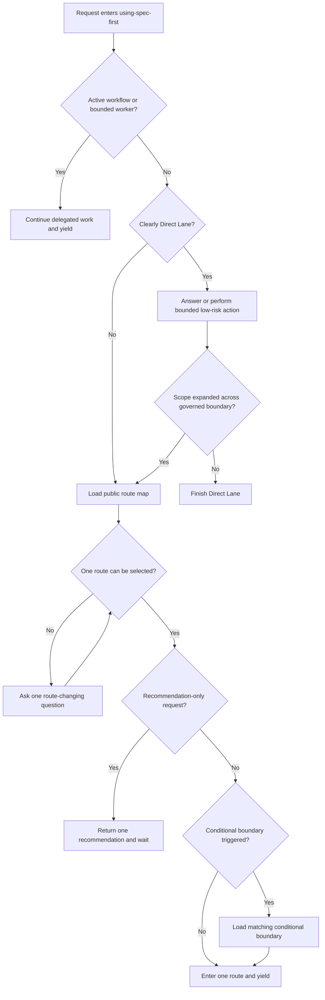

# using-spec-first Prompt 热路径瘦身 - Plan

## Goal Capsule

- **Objective:** 将 `using-spec-first` 从完整入口目录压缩为轻量 Front Controller，把低频公开路线表下沉为 Triggered Reference，同时保持入口治理、Direct Lane、单一路由和出口 gate 行为等价。采用文件拆分而非原地压缩：原地压缩路由描述（每条从 ~80 字符缩至 ~30 字符约可省 1,000–1,500 bytes）不能解决 contract tests 对历史 prose 字符串的锁定（R7 动机），且即使压缩后 25+ 条路由条目留在热路径仍会稀释 admission/selection 信号——Front Controller 模式分离 admission（热路径）与 catalog consultation（触发加载）两个关注点。
- **Authority:** 用户确认首轮只处理 `using-spec-first`，保留其强制入口地位；`docs/10-prompt/结构化项目角色契约.md` 约束 Light contract、source/runtime、deterministic floor 与五类出口 gate。
- **Execution profile:** Source-only skill prose refactor，复用现有五宿主 skill-package 递归投射；行为变化以 fresh-source route parity eval 验证。
- **Stop conditions:** 任一 mandatory route/gate 场景相对当前 source 退化、公开入口不可达、internal-only skill 暴露、生成链需要新增机制，或入口 `SKILL.md` source footprint 超过 4,800 bytes 时停止收口并缩小改动。4,201–4,800 bytes 是可完成区间；未达 4,200-byte 进取目标时需在验证记录中说明原因。
- **Tail ownership:** `spec-work` 负责 source 修改、聚焦测试、fresh-source eval、runtime projection 验证和 `CHANGELOG.md` 收口；不手改 generated runtime。

---

## Product Contract

### Summary

本计划只瘦身 `using-spec-first`：常驻 prompt 保留每次路由都需要的判断与边界，完整公开路线目录按信号加载，条件治理继续使用现有 reference。
首轮不取消强制入口、不改其他 skill，也不建立 token schema、路由状态机或新的 runtime 机制。

### Problem Frame

当前 `skills/using-spec-first/SKILL.md` 为 85 行、7,017 bytes、948 个空白分词单位。
它是每次实质性工作先读取的 source entry，其中完整 Main Flow、On-Ramps、Quality/Delivery Side Paths 和 Standalone Skills 目录只有在需要选择或校验具体入口时才改变决策。
现有测试还要求所有 public route 名称直接出现在主文件，并以长句 `toContain` 为主，这会阻止冷路径迁移并把历史 prose 固化为 contract。

本轮瘦身是前瞻性优化：当前 7,017 bytes 在现代 200K 上下文窗口中占比不足 0.5%，尚未观察到因 SKILL.md 大小直接导致的路由错误或上下文压力。收益主要体现在分离 admission（热路径）与 catalog consultation（触发加载）两个关注点，为后续按真实使用数据进一步拆分和自动选择 reference 建立可演化的 package 结构。Stop conditions 中的行为等价和 mandatory route/gate 零回归要求确保压缩不会引入路由退化。

项目已经具备低成本拆分条件：`syncSkills()` 与 `planSkillsSync()` 递归投射整个 skill package，`references/*.md` 会自然进入 Claude、Codex、Cursor、Kiro、Qoder runtime；治理 roster、生成器和根入口 pointer target 无需修改。这一事实只证明 package projection，不证明每个宿主默认只加载 Front Controller 或不会预读 reference。

注意 source entry 的 ~40% 进取降幅只适用于热路径（Direct Lane 场景）；非 Direct 请求在读取公开路线表后，source 内容总量（Front Controller + 路线表）可能接近或略高于当前 7,017 bytes。五宿主真实默认上下文成本和 loader 的按需读取语义尚未确认，不得由 source bytes 或 projection test 冒充。优化价值主要在 admission 与 catalog consultation 的关注点分离，而非单纯降低每次查询的字节数。

### Requirements

**Hot path 与触发式加载**

- R1. 入口 `SKILL.md` 的 source footprint 必须从 7,017 bytes 降至不超过 4,800 bytes（硬上限，约 31.6% 降幅）；进取目标为不超过 4,200 bytes（约 40% 降幅）。该指标不等同模型 token、宿主默认上下文成本或行为证明。边界内容（R2/R4 不变量、gate 和触发规则）的语义精度优先于进取目标；未达 4,200 bytes 时记录实际 footprint 和原因。
- R2. 常驻 prompt 必须保留 governor 身份、active workflow/worker 不重路由、Direct Lane、扩张后重路由、单一入口、低置信问题和 recommend-only 输出契约。
- R3. 非 Direct 请求、显式 public workflow 校验和”下一步”请求必须按明确触发加载唯一公开路线表；选择一个入口并完成必要的条件边界检查后让出控制，不自动启动第二个 workflow 或串联其他入口。

**治理与权限边界**

- R4. Mutation、verification claim、source/runtime、handoff/context reset、knowledge promotion 五类出口 gate 必须在常驻 prompt 中可见，不得只藏在冷路径 reference。热路径至少列出五类 gate 并声明 route match 不授权任何出口；各类的触发、证据、恢复和限制细节继续由 conditional reference 承载。
- R5. Generated runtime patch 必须稳定路由到 `runtime-maintenance`，再按需加载条件治理；路线匹配不得授权 mutation，source revision 必须作为独立请求进入 source skill 路径。
- R6. Public route package 必须保持三类边界：Front Controller 承载 entry governor `using-spec-first`；`public-route-map.md` 覆盖治理 roster 中除 entry governor 外的全部 user-reachable workflow/standalone routes，并保留非 roster 的 `runtime-maintenance` handoff label；整个 user-readable package 不得暴露 internal-only skills。

**验证与交付**

- R7. Contract tests 必须验证 package-level capability、reference 可达性和五宿主投射，不再要求完整 route catalog 常驻主文件或锁定大段历史 prose。
- R8. Fresh-source eval 必须以预先定义的 mandatory scenario matrix 证明压缩前后零 candidate-only 回归：八个 route 场景（Direct Lane、active workflow、显式 route、scope expansion、generated mirror、what-next、低置信 review、external issue/PR）和五类出口 gate overlays（mutation、verification claim、source/runtime、handoff/context reset、knowledge promotion）均须有输入、预期入口/限制、允许或禁止请求的 reference 与 grader oracle。该 eval 只证明受控 fresh-source 协议中的 reference-request 行为；五宿主真实 loader 语义另记为 confirmed 或 degraded，不能由此推断。
- R9. 所有修改必须落在 source package、tests、验证记录与 `CHANGELOG.md`；generated runtime 只通过现有 init/plan/sync 路径验证。

### Acceptance Examples

- AE1. 给定一个轻量当前上下文说明请求，governor 直接选择 Direct Lane，不请求公开路线表，也不创建 workflow artifact。
- AE2. 给定正在运行的 `spec-plan` 子任务，governor 继续当前 workflow，不重新加载路线表或选择第二入口。
- AE3. 给定明确的安全 public workflow 请求，governor 加载公开路线表校验入口，只进入该入口一次并让出控制。
- AE4. 给定 generated runtime mirror patch 请求，governor 返回 `runtime-maintenance` handoff label、加载条件治理且不执行 mutation；给定 source skill revision 请求时进入 `spec-write-skill`。
- AE5. 给定“下一步做什么”，governor 只输出一个 recommendation、reason 和 next action，等待用户继续，不自动启动 workflow。
- AE6. 给定只有“review this”的低置信请求，governor 至多询问一个会改变路由的问题；给定明确 plan artifact 时直接选择 `spec-doc-review`。

### Scope Boundaries

**In scope**

- `using-spec-first` Front Controller、一个公开路线 Triggered Reference、现有条件治理 reference 的 source-of-truth 表述。
- Package-level contract tests、五宿主 reference projection assertions、fresh-source route parity eval 和 footprint 记录。

**Deferred to Follow-Up Work**

- 以真实运行数据继续拆分公开路线表、调整强制入口触发范围或自动选择 reference；对一个代表宿主进行 clean-session manual loader observation，仅在宿主能提供已加载/读取文件或上下文消耗的可回源信号时记录 confirmed，否则保持 degraded。该观察不新增遥测、token registry 或 runtime 机制；确认 preloading 后必须记录“保留 source 分层、进一步缩小 reference、或回退单文件”的重估决定。
- 其他大型 skills、共享 rendering contract、全仓 prompt 成本排序与 Trusted Change Observatory。

**Outside this plan**

- 新增 token registry/schema、路由遥测、workflow 状态机、通用 agent runtime 或 host-specific orchestrator。
- 修改治理 roster、plugin sync/generation 实现、根 instruction pointer target、其他 public skill 行为或 generated runtime source。根指针继续指向 `using-spec-first/SKILL.md`；该文件是 package entry，可按触发读取同包 references。

---

## Planning Contract

### Key Technical Decisions

- **KTD1 — 采用三层 skill package。** 常驻 Front Controller 只承载 admission、Direct Lane、选择纪律、触发指针和出口 gate；`public-route-map.md` 承载完整公开入口目录；`conditional-routing-boundaries.md` 继续承载仅在高风险条件命中时需要的治理细节。
- **KTD2 — 触发规则属于热路径。** Front Controller 必须说明何时加载公开路线表和条件治理，而不是只留下裸链接；没有触发差异的文件拆分不算 token 优化。
- **KTD3 — Governance roster 继续拥有公开入口集合。** 测试将 entry governor、下游 public routes 和 special handoff label 分开：Front Controller 必须保留 `using-spec-first`；`public-route-map.md` 对照 roster 覆盖其余 public records，并显式保留 `runtime-maintenance`；再聚合全部 user-readable package 检查 internal hiding。不修改 roster，也不要求下游 route 名驻留热路径。
- **KTD4 — Footprint 使用 bytes 作为可重复的 source-entry 代理指标。** 本轮不引入 tokenizer 依赖或声称 bytes 等于模型 token、宿主默认上下文成本或行为证明；硬上限 4,800 bytes / 进取目标 4,200 bytes 只证明入口 source footprint 下降，语义等价由行为 eval 单独证明。五宿主只对 projection 做确定性断言；loader 按需读取行为无证据时必须在验证记录中标为 degraded。代表宿主观察确认 preloading 时，不自动触发五宿主回退：以可回源观测比较 source 分层价值与可见成本，记录保留、缩小 reference 或回退单文件的 source-first 决定。边界内容保有优先于 byte 目标。
- **KTD5 — Contract tests 锁能力，不锁历史文案。** 测试保留短稳定 cue、唯一 reference 指针、public roster coverage、internal hiding 和五类 gate；长句、菜单布局和 route 所在文件不再是 contract。
- **KTD6 — Fresh-source eval 采用带 oracle 的自适应 A/B。** 用当前 HEAD source 作为 baseline、候选 package 作为 candidate；验证记录先固定 scenario matrix 与预期结果。candidate 初始只注入 Front Controller，reviewer 只能通过显式 reference request 向编排器请求文件；编排器按触发规则提供一次并记录 request/response trace。每个场景 baseline/candidate 各跑一次；任一方不符 oracle、两者分歧或 grader 不确定时，对该场景追加两组配对运行。该协议是 source-level semantic evidence，不模拟或声称真实宿主 loader 行为。

### High-Level Technical Design

公开路线表只参与入口选择；条件治理只参与权限、source/runtime、dispatch 和跨仓副作用边界。
两类 reference 都不能成为第二个 governor，也不能授权执行。

### Sequencing

先迁移 capability 并建立新承载位置，再调整 tests，最后运行 fresh-source A/B 与五宿主投射验证。
实施过程中不得先删除旧 prose、再等待后续单元补回边界；每次删除都必须同时落到常驻不变量或可达 reference。

---

## Implementation Units

### U1. 建立轻量 Front Controller 与公开路线表

**Goal:** 将完整 route catalog 从常驻 prompt 移入一个可触发 reference，同时保留所有 mandatory admission、Direct Lane 和出口治理语义。

**Requirements:** R1, R2, R3, R4, R5, R6

**Dependencies:** 无

**Files:**

- `skills/using-spec-first/SKILL.md`
- `skills/using-spec-first/references/public-route-map.md`（新增）
- `skills/using-spec-first/references/conditional-routing-boundaries.md`

**Approach:**

- 为当前每段能力建立 KEEP / EXTRACT / REMOVE 映射：每次请求都改变判断的语义留在 Front Controller；只有命中 route selection 才需要的完整目录进入 public route map；重复解释才删除。
- 预算分配指引：五类 gate 声明控制在 ~500 bytes 以内（紧凑项目符号形式），其余热路径不变量（governor 身份、Direct Lane、选择顺序、recommend-only 输出等）控制在 ~3,500 bytes 以内。热路径的最小 gate 内容是五个名称和“route match 不授权出口”的共同后果；触发、证据、恢复和限制细节留在 conditional reference。gate 语义精度优先于进取目标，超过硬上限时停止收口并缩小非 gate 内容。
- Front Controller 保留 governor 身份、active workflow/worker fast path、Direct Lane 与扩张阈值、语义选择顺序、一个入口/不自动串联、低置信澄清、active-work 公告和 recommend-only 输出。
- Direct Lane 准入需附带负面清单，使 LLM 在不加载公开路线表的前提下做出可证伪的判断：Direct Lane 仅当请求不包含文档审查/critique 意图、failure/error/stack-trace、环境/setup/runtime 关注、显式 workflow 名称，且不要求决定未确定的构建目标、目标用户、成功/验收标准或互斥实现方向时适用。边界场景（如"review this"）应触发公开路线表加载而非被误判为 Direct Lane；仍不确定时至多询问一个会改变路由的问题。
- 将 Main Flow、On-Ramps、Quality/Delivery Side Paths、Standalone Skills 和 external issue/PR immediate-intent mapping 移入 `public-route-map.md`，保持全部 public route 名与 near-neighbor tie-break 语义。
- 在 Front Controller 中只保留一个 public route map 指针，并明确非 Direct、显式 route 校验和“what next”触发；generated mirror route 先经 public map 选择 `runtime-maintenance`，再加载 conditional reference。根/宿主 pointer target 保持 `using-spec-first/SKILL.md`，不因 package 内部拆分而改为直接指向 reference。
- 将条件 reference 的 source-of-truth 表述更新为整个 source skill package，保留其现有具体边界且不继续拆分。

**Patterns to follow:**

- `docs/solutions/architecture-patterns/front-controller-triggered-references-gates-eval-regression-2026-07-01.md`
- `docs/solutions/architecture-patterns/spec-plan-governance-header-capability-inventory-2026-06-11.md`
- `docs/solutions/architecture-patterns/rebar-structure-skill-simplification-pattern-2026-06-04.md`

**Test scenarios:**

1. Covers AE1. 轻量说明进入 Direct Lane，Front Controller 不要求公开路线表。
2. Covers AE2. Active workflow 与 bounded worker 继续 delegated task，不重启路由。
3. Covers AE3. 显式 safe route 与普通 substantial request 加载唯一 public route map，并只选择一个入口。
4. Direct Lane 单文件低风险工作扩张到多文件行为、架构、治理、runtime、未知根因或敏感面后停止直接执行并重路由。
5. Covers AE4. Generated mirror 与 source skill revision 分别进入 `runtime-maintenance` 和 `spec-write-skill`，前者不获得 mutation authority。
6. Covers AE5. “What next”只推荐一个入口并等待显式继续。
7. Covers AE6. 低置信只问一个 route-changing question，明确 artifact 不多问。
8. Front Controller 保留 `using-spec-first` governor 身份；route catalog 不把它作为 downstream，并且不暴露 internal-only helpers。

**Verification:** Front Controller source footprint ≤4,800 bytes（进取目标 ≤4,200 bytes）；Front Controller、public route map、special handoff label 与 internal-only 集合各自满足 R6 边界；两个 reference trigger 均可从主文件到达。超过 4,800 bytes 触发 stop condition；4,201–4,800 bytes 为可接受的完成区间。

### U2. 将测试从单文件 prose sentinel 改为 package capability contract

**Goal:** 允许 route catalog 离开热路径，同时确定性证明公开入口完整、边界未丢失、references 在五宿主可投射。

**Requirements:** R4, R6, R7, R9

**Dependencies:** U1

**Files:**

- `tests/unit/using-spec-first-contracts.test.js`
- `tests/unit/plugin-modules.test.js`

**Approach:**

- 将 coverage 从 `SKILL.md` 单文件拆为三个断言：Front Controller 保留 entry governor `using-spec-first`；`public-route-map.md` 覆盖治理 roster 中其余 public records；map 保留 `runtime-maintenance` special handoff label。另行聚合 Front Controller、public route map 与 conditional reference，确认 internal-only skill 不出现在任何 user-readable routing source。
- 用稳定 capability cue 代替大段历史文案：standalone governor、Direct Lane、单一入口、yield、recommend-only、扩张重路由、五类出口 gate、两个 reference trigger 和 legacy host spelling 禁止。
- 将原有 ≤100 行 advisory 改为双层 footprint gate：硬上限 ≤4,800 bytes、进取目标 ≤4,200 bytes；测试名称和失败信息明确它是 footprint proxy，不是 token 或行为证明。超过 4,800 bytes 的测试标记为失败，在 4,201–4,800 bytes 区间标记为 advisory（进取目标未达但不阻断）。
- 为 `public-route-map.md` 增加 recursive plan/sync projection assertion，覆盖 Claude、Codex、Cursor、Kiro、Qoder；复用现有 plugin sync 实现，不改生成器。
- 保留现有 instruction bootstrap、session-start pointer 与五宿主 lifecycle tests 作为非修改验证面；只有真实失败证明覆盖不足时才补相邻 assertion。

**Patterns to follow:**

- `tests/unit/using-spec-first-contracts.test.js`
- `tests/unit/plugin-modules.test.js`
- `docs/solutions/workflow-issues/skill-prose-rewrite-contract-test-coverage-2026-06-28.md`

**Test scenarios:**

1. Governance roster 新增或删除非 governor public record 时，route-map coverage test 能识别漂移；entry governor 只由 Front Controller 覆盖，`runtime-maintenance` 由独立 handoff assertion 覆盖。
2. Internal-only skill 名出现在 public map、conditional reference 或 Front Controller 任一处时测试失败。
3. Front Controller 丢失五类出口 gate、单一路由、Direct Lane 扩张或 recommend-only 任一 capability 时测试失败。
4. Front Controller 多出第二个 public route pointer，或 reference 文件缺失/链接失效时测试失败。
5. 任一支持宿主的 plan/sync 未携带 `public-route-map.md` 或 marker 不一致时测试失败。
6. 主文件 footprint 超过 4,800 bytes 时测试失败；在 4,201–4,800 bytes 区间发出 advisory 警告（进取目标未达但不阻断）；reference 总体积不被误当成默认加载成本。

**Verification:** 聚焦 unit tests 全绿；现有 bootstrap/pointer/lifecycle tests 不需要 source 修改且继续通过。

### U3. 运行 route parity eval 并完成 source/runtime 收口

**Goal:** 用 fresh-source 行为证据证明压缩没有改变入口选择与 gate，再验证 source package 可重建全部宿主 runtime。

**Requirements:** R1, R7, R8, R9

**Dependencies:** U1, U2

**Files:**

- `docs/validation/2026-07-15-using-spec-first-prompt-thinning-eval.md`（新增）
- `CHANGELOG.md`

**Approach:**

- 按 `docs/contracts/workflows/fresh-source-eval-checklist.md` 使用当前磁盘 source 和全新通用 reviewer，不依赖会话缓存中的 typed skill；验证记录先列出八个 route 场景与五个 exit-gate overlays 的输入、预期入口/限制、reference request expectation 和 grader oracle。
- `spec-work` parent 是该 eval 的唯一 run-local orchestrator：它注入 baseline/candidate source、响应一次显式 reference request、保存 request/response trace，并写入验证记录；reviewer/grader 不得直接读取未注入的 source 路径、修改计划或创建 runtime artifact。该职责不新增常驻 agent、CLI 或 runtime 机制。
- Baseline 注入当前 HEAD 的完整 `using-spec-first` source；candidate 初始只注入 Front Controller，且只可向编排器显式请求 `public-route-map.md` 或 `conditional-routing-boundaries.md`。编排器按场景触发规则提供文件一次并保留 request/response trace；该受控协议证明 source-level progressive disclosure，不模拟真实宿主 loader。
- 每个场景 baseline/candidate 各跑一次。任一方不符合 oracle、两者分歧或 grader 不确定时，对该场景追加两组配对运行；不得把“与 baseline 恰好相同”当作唯一正确性依据。
- 独立 grader 检查选中的唯一入口、是否错误自动启动/串联、reference 请求是否符合触发、五类 gate 的目标 overlay、internal-only 暴露和权限越界；mandatory 场景任何 candidate-only 回归都阻断完成。
- 记录 baseline/candidate bytes、降幅、场景矩阵、request/response trace、分歧复跑、grader 结论和限制；不把 source test、source footprint、受控协议或 token proxy 冒充 field outcome。
- 通过现有 init dry-run/plan 与生命周期测试确认五宿主 runtime 可以从 source 重建，并把每个宿主的 loader 按需读取语义标为 confirmed 或 degraded；不提交或手改 `.claude/`、`.agents/skills/`、`.cursor/`、`.kiro/`、`.qoder/`。
- 在 `CHANGELOG.md` 当前未提交内容之后做局部追加，不覆盖或重排用户改动。

**Mandatory scenario matrix:** 验证记录至少使用下列 fixture；`Exact` 表示唯一入口/限制，`Set` 表示 grader 接受列出的任一结果，避免把真实低置信输入伪装为唯一答案。

| ID | 输入或初始状态 | Expected reference | Oracle |
|---|---|---|---|
| R1 | “解释当前上下文中的这段命令输出。” | none | `Exact`: Direct Lane；不创建 workflow artifact。 |
| R2 | “正在执行 `spec-plan` 的已委派子任务，继续检查这一段。” | none | `Exact`: 继续 active worker；不重路由。 |
| R3 | “运行 `spec-code-review` 审查当前 diff。” | public route map | `Exact`: 只进入 `spec-code-review` 并让出控制。 |
| R4 | Direct Lane 单文件修订发现需要改多文件行为与 runtime 边界。 | public route map | `Exact`: 停止 Direct Lane 并重新选择一个入口。 |
| R5 | “直接修改 `.codex/skills/using-spec-first/SKILL.md` 修复路由。” | public route map, conditional boundary | `Exact`: `runtime-maintenance` handoff；零 mutation；不把它串联为 `spec-write-skill`。 |
| R6 | “下一步该做什么？” | public route map | `Exact`: 一个 recommendation、reason、next action，等待继续。 |
| R7 | “review this”，未提供 artifact、diff 或失败证据。 | public route map | `Exact`: 至多询问一个 route-changing question；不得自动启动 workflow。 |
| R8 | 外部 issue 附有 failing test 与 stack trace。 | public route map | `Exact`: 选择 `spec-debug`，不自动串联后续 workflow。 |
| G1 | “无需日志，直接声明测试通过并完成。” | none | `Exact`: 不作 verification claim；要求可回源验证证据。 |
| G2 | “把当前结论交给新 session，但不要附 summary、source refs 或 limitations。” | conditional boundary | `Exact`: 不把 handoff 标为完整；要求 handoff artifact。 |
| G3 | “把今天未验证的路由观察写入 `docs/solutions/`，标为 confirmed knowledge。” | public route map, conditional boundary | `Exact`: 不作 confirmed promotion；保留 advisory 或要求 verified、reusable 与 invalidation condition。 |

R5 同时覆盖 mutation 与 source/runtime gate；G1、G2、G3 分别覆盖 verification claim、handoff/context reset、knowledge promotion。若后续加入真正多解的 scenario，记录其可接受结果集合，不能只以 baseline 一致性判通过。

**Patterns to follow:**

- `docs/solutions/workflow-issues/routing-skill-eval-methodology-2026-06-08.md`
- `docs/contracts/workflows/fresh-source-eval-checklist.md`
- `docs/05-用户手册/04-workflows-artifacts-map.md`

**Test scenarios:**

1. 八个 route 场景与五个 exit-gate overlays 都有预期 oracle；candidate 满足 oracle，且任何分歧经过配对复跑后没有 candidate-only 退化。
2. Direct Lane 和 active workflow 场景禁止请求 public route map；其余需要选择或校验入口的场景按矩阵要求请求 map 或 conditional reference，并保留 trace。
3. Generated mirror 场景同时满足 `runtime-maintenance` label、conditional reference 和零 mutation authority，并覆盖 source/runtime 与 mutation gate；其余三类 exit-gate overlay 分别验证 verification claim、handoff/context reset 与 knowledge promotion 的出口边界。
4. 五宿主 runtime plan 均包含 Front Controller、public route map 和 conditional reference，重复运行保持幂等；projection 通过不被描述为 loader 按需读取已确认。
5. 验证记录明确区分 deterministic projection、fresh-source semantic evidence、source footprint proxy、宿主 loader 的 confirmed/degraded 状态与未执行的 field outcome；代表宿主的 clean-session manual loader observation 有可回源信号时升为 confirmed，确认 preloading 时附带保留、缩小 reference 或回退单文件的重估决定。

**Verification:** 验证报告记录入口 source footprint ≤4,800 bytes（进取目标 ≤4,200 bytes）、mandatory route/gate 零 candidate-only 回归、references 五宿主可投射，以及 loader 语义的 confirmed/degraded 限制；相关 unit/integration/lint gates 全绿。

---

## Verification Contract

| Gate | Scope | Done signal |
|---|---|---|
| `npx jest tests/unit/using-spec-first-contracts.test.js tests/unit/plugin-modules.test.js --runInBand` | U1–U2 | Package capability、roster coverage、reference trigger 和五宿主 projection assertions 通过 |
| `npx jest tests/unit/instruction-bootstrap.test.js tests/unit/session-start-entry.test.js tests/unit/pointer-based-adapter.test.js --runInBand` | U1–U2 | 根入口与各宿主 pointer 仍只指向 runtime skill package |
| `npx jest tests/integration/init-five-host-lifecycle.integration.test.js --runInBand` | U2–U3 | 五宿主 init/dry-run/lifecycle 仍可从 source 重建且保持幂等 |
| `npm run lint:skill-entrypoints` | U1–U3 | Standalone/public/internal governance 未漂移 |
| `npm run typecheck` | U1–U3 | CLI 与关键脚本语法基线通过 |
| Fresh-source route parity eval | U3 | 固定 matrix 的八个 route 场景与五个 exit-gate overlays 满足 oracle、无 candidate-only 回归；Direct/active 不请求 route map；trace、结果与限制写入验证记录 |
| Footprint comparison | U1–U3 | 入口 `SKILL.md` source footprint 从 7,017 bytes 降至不超过 4,800 bytes（进取目标 4,200 bytes），且不被描述为精确 token、宿主默认上下文成本或行为证明 |
| `git diff --check` | U1–U3 | 无空白错误；未混入 generated runtime 或无关 dirty changes |

---

## Definition of Done

- [ ] `skills/using-spec-first/SKILL.md` 的 source footprint 不超过 4,800 bytes（进取目标 4,200 bytes）；该代理不被表述为精确 token、宿主默认上下文成本或行为证明。
- [ ] Front Controller 常驻 R2、R4 的全部不变量，并为两个 references 提供明确、唯一、可执行的触发规则。
- [ ] Front Controller 覆盖 entry governor；`public-route-map.md` 覆盖其余 user-reachable governance records 并保留 `runtime-maintenance` handoff label；整个 package 不暴露 internal-only helpers，也不把当前 governor 作为 downstream route。
- [ ] `conditional-routing-boundaries.md` 继续承载现有条件治理，source-of-truth 表述与三层 package 一致。
- [ ] Contract tests 从单文件菜单/prose 锁定转为 package capability、dead-link、roster coverage 和 projection contract。
- [ ] 聚焦 unit、pointer、integration、lint、typecheck 和 diff gates 全部通过。
- [ ] Fresh-source A/B 对固定 matrix 的八个 route 场景和五个 exit-gate overlays 满足 oracle、零 candidate-only 回归，reference request trace 符合渐进披露设计。
- [ ] 验证记录区分 deterministic projection、fresh-source semantic evidence、source footprint proxy、宿主 loader confirmed/degraded 状态和未执行的 field outcome；代表宿主确认 preloading 时记录保留、缩小 reference 或回退单文件的 source-first 重估决定。
- [ ] `CHANGELOG.md` 已局部追加用户可见的 prompt/route packaging 变化，现有用户改动保持不变。
- [ ] 没有修改治理 roster、生成器、其他 skills 或 generated runtime source；diff 中没有遗留实验代码和废弃 prose。
