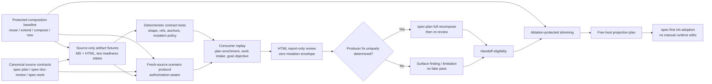

# Spec Plan Quality Closure - Plan

## Goal Capsule

| 维度 | 决策 |
| --- | --- |
| Objective | 在当前分支已经恢复 `master` 规划质量地板并补入 composition-first 架构姿态的基础上，补齐 Markdown/HTML 统一计划从生成、审查到 `spec-work`/goal handoff 的可验证质量闭环。 |
| Recommended approach | 复用 `spec-unified-plan/v1`、`spec-doc-review`、`spec-work`、现有 source-only eval 与五宿主 projection；先建立 consumer replay 与 HTML 只读审查，再验证 degraded/fresh-source 行为，最后在行为保护和 ablation evidence 下收缩 `spec-plan/SKILL.md`。 |
| Authority hierarchy | 当前 canonical `skills/**` 与 `tests/**` source > 当前分支分析报告与已完成历史方案 > `docs/solutions/**` 可复用经验 > provider/历史运行的 advisory 观察。 |
| Decision focus | HTML 审查的 mutation policy、consumer replay 的证据分层、`spec-work`/goal 的统一读取边界、无 helper 能力时的诚实降级、`reuse / extend / compose / new` 的保护，以及 prompt 瘦身的晋升门。 |
| Verification focus | 四类统一计划 fixture、HTML 零写入审查、consumer route/section replay、高风险、multi-surface 与 composition posture 样本、fresh-source scenario matrix、五宿主 projection 与 source/runtime drift。 |
| Largest risk or boundary | 静态 fixture、文本断言和 projection 只能证明 source contract；没有 fresh session 或真实宿主观测时，不能声称模型行为、loader 生效或 field outcome 已被证明。 |
| Stop conditions | HTML review 仍可能进入 Markdown mutation；任一 consumer 不能按 metadata/稳定 section 读取；degraded 场景会静默跳过研究或审查；瘦身候选出现 mandatory scenario 回归；实现试图手改 generated runtime 或新增第二套 generator/model runner。 |
| Execution profile | Deep、跨 workflow source 变更；优先由 `spec-work` 执行并拥有 review、verification、runtime adoption 与 closeout。 |

---

## Product Contract

### Summary

当前分支已经把 `master` 的首屏决策、planning-only、安全证据、source ownership、高风险、multi-surface、dispatch fallback 与最小 eval 能力集成进新的 unified-plan 架构，并进一步补入 `reuse / extend / compose / new`、thin-glue ownership、anti-wrapper/parallel-pipeline 和 wrong-owner reuse 架构思维。本方案不重复建设这些能力，而是验证它们是否能被真实 downstream consumer 稳定消费，并关闭 HTML review、degraded behavior、fresh-source evidence 与 prompt footprint 的剩余缺口。

### Current Implementation Baseline（2026-07-16）

以下能力在 U1 开始前已经完成 canonical source 集成，应作为本方案的 protected baseline，而不是 U1-U6 的完成证据：

- `skills/spec-plan/SKILL.md` 已加入 `Inventory before invention`，并把架构姿态扩展为 `reuse / extend / compose / new`。
- `skills/spec-plan/references/planning-evidence-boundaries.md` 已定义 existing capability inventory、`compose / thin-glue`、胶水层允许/禁止职责、anti-wrapper、anti-parallel-pipeline、wrong-owner reuse 与 `spec-work` recheck。
- `plan-sections.md`、`synthesis-summary.md`、`deepening-workflow.md` 已承接 composition posture 的 artifact、用户确认与深度审查边界。
- `architecture-strategist.md` 与 `pattern-recognition-specialist.md` 已增加 composition-first、reuse/extension candidate、composition seam 和 unnecessary abstraction 判断。
- `skills/spec-plan/evals/output-quality-cases.json` 当前为 14 个 cases，其中新增 thin-glue composition、extend existing owner、justified new boundary 三个对立样例；`tests/unit/spec-plan-quality-contracts.test.js` 已锁住对应 source anchors。
- 已执行的确定性验证包括聚焦 4 suites / 26 tests、eval fixtures 6 suites / 76 tests、全量 unit 102 suites / 931 tests、skill entrypoint lint、typecheck 和 diff/JSON checks；这些只证明 source contract，不证明真实模型行为或 host loader。

这项 baseline 增强没有创建 consumer replay fixtures、HTML report-only orchestration、fresh-source validation record、ablation candidate 或 runtime adoption，因此计划继续保持 `status: active`，U1-U6 仍需按下文执行。

### Problem Frame

当前 source contract 已经描述出一条完整链路，但链路仍存在四类未兑现风险：

- Markdown 与 HTML 都被声明为一等 unified artifact，但 HTML 在 `spec-plan` handoff 中仍跳过 `spec-doc-review`；`spec-doc-review` 主文件虽然写有 HTML report-only 规则，后续 synthesis reference 仍默认执行 `safe_auto` mutation，缺少单一、可测试的 mutation policy。
- `spec-work` 与 goal handoff 已声明按 metadata、稳定 heading/anchor 和 U-ID 消费两种格式，但现有测试主要保护 prose anchors，尚未用成对 artifact fixture 回放 requirements-only、implementation-ready、拒绝执行和 size-aware reading。
- source fixtures 已覆盖 dispatch/cache/high-risk 等分支，但没有把“无 subagent、无 web、cache miss/dirty profile、HTML report-only”等 degraded 条件组合成可复核的行为矩阵；静态 fixture 也不能替代 fresh-source 模型行为证据。
- `skills/spec-plan/SKILL.md` 当前约 108 KB，主干与 `plan-sections.md`、`plan-handoff.md`、`deepening-workflow.md` 仍有重复解释。刚补入的 composition-first hot-path principle 与 reference/specialist anchors 已成为新的承重行为；直接压缩会重新引入 2026-06 历史上已经发生过的质量回退，必须先建立 consumer/eval 保护和 ablation gate。

### Actors

- A1. Plan author：运行 `spec-plan`，从需求或直接输入产出 implementation-ready unified plan。
- A2. Document reviewer：运行 `spec-doc-review`，对 Markdown 提供受控 mutation，对 HTML 只返回 structural/semantic findings。
- A3. Executor：`spec-work` 或 goal-mode consumer，按 metadata、Goal Capsule、U-ID、Verification Contract 与 Definition of Done 执行。
- A4. Maintainer：维护 skill source、eval fixtures、contract tests、runtime projection 与 validation evidence。
- A5. Plan reader：只需要在 Markdown 或 HTML 中快速定位目标、决策、风险、实施单元与验证边界。

### Requirements

#### Unified artifact 与 consumer replay

- R1. 建立 Markdown 与 HTML 各一组 requirements-only、implementation-ready fixture；同格式前后两态必须保持同一 Product Contract 语义和稳定 R/A/F/AE IDs。
- R2. Replay 必须验证 `spec-plan` 对 requirements-only artifact 的 enrichment intent、格式保持或显式 conversion 行为，以及 implementation-ready artifact 的 handoff eligibility。
- R3. Replay 必须验证 `spec-work` 对 requirements-only 的拒绝、对 implementation-ready + `execution: code` 的接受、对 progress-like readiness 的 fail-closed，以及对 Markdown/HTML 的 size-aware section mapping。
- R4. Goal handoff replay 必须验证生成的是 thin objective：只引用 plan path 与稳定 section contract，不复制命令、需求、U-ID 依赖、DoD 条目或 PR 决策。
- R5. Legacy Markdown/HTML 兼容只保留当前 reader 能力；本方案不得用 legacy shape 反向限制 unified artifact，也不得恢复全局 `spec_id` 作为新计划必填字段。

#### HTML 只读审查

- R6. `spec-doc-review` 必须把 delivery mode（headless/interactive）与 mutation policy（markdown-write/report-only）分离；HTML 无条件使用 report-only，不能进入 Markdown edit、Open Questions append 或 `safe_auto` write path。
- R7. HTML headless review 必须返回与 Markdown 可比较的 findings counts、severity、coverage 与 limitation，但 `fixes_applied` 固定为 0，并显式报告 `mutation_policy: report-only` 与原因。
- R8. `spec-plan` 的 HTML handoff 必须从“未审查直接跳过”升级为“已执行只读 structural/semantic review”；HTML 仍不提供交互式 mutation walkthrough。
- R9. 当 HTML review 发现 producer 可唯一修正的问题时，修复 owner 是 `spec-plan` 的完整重组/重渲染，而不是 `spec-doc-review` 对 HTML 做局部 Markdown-style patch；最多允许两轮 producer recompose + report-only review。仍未解决且影响执行就绪度的高置信问题必须把 artifact 保持或降级为 `requirements-only`，并抑制 `spec-work`/goal handoff。

#### Degraded 与 semantic evidence

- R10. 建立 degraded scenario matrix，至少覆盖 `dispatch_authorization_missing`、无 subagent capability、无 web capability、repo-profile cache `MISS`、profile-input dirty invalidation、HTML report-only 和 reviewer partial failure。
- R11. Degraded 路径必须继续完成可在当前 agent 内完成的 planning/review intent，记录明确 reason code 或 limitation；不得静默派发、静默省略、伪造 fresh evidence 或把 degraded 当 success。至少一个 mandatory reviewer 或等价 inline review 必须完成；若两名 always-on reviewer 都没有有效结果，envelope 标记 `review_status: incomplete`，不得输出 clean verdict 或 execution handoff。
- R12. 建立高风险、multi-surface 与 architecture-posture 真实计划样本，至少覆盖 auth/privacy、migration/data integrity、async/rollout，以及 reuse existing capability as-is、extend existing owner、thin-glue composition、justified new boundary 四类 load-bearing architecture decision。
- R13. Eval 结论必须分成 mechanical source contract、fresh-source semantic judgment、host invocation/loader observation、field outcome 四层；低层证据不得晋升为高层结论。
- R14. Fresh-source eval 仅在用户或上游 workflow 明确授权 helper dispatch 时运行；没有授权时必须记录 `not_run` 与 `dispatch_authorization_missing`，不得沿用历史 pass 证明当前候选。

#### Prompt 瘦身与 runtime adoption

- R15. 瘦身前必须建立 protected-behavior map，把每个拟删除或下沉的规则映射到保留的 hot-path invariant、triggered reference、deterministic test 或 semantic scenario；`Inventory before invention`、`reuse / extend / compose / new`、thin-glue owns/does-not-own、anti-wrapper/parallel-pipeline 与 justified-new escape hatch 都是承重行为。
- R16. `spec-plan/SKILL.md` 的收缩以 hot-path footprint 和 scenario parity 为双门；不得只以行数、bytes 或 reference 数量判断成功。
- R17. 只有 fresh-source/ablation gate 通过的候选才能删除或迁移 load-bearing prose；授权缺失、结果不确定，或 reuse/extend/compose/new 四姿态 case 出现 candidate-only regression 时保留当前 source，不为达到体积目标强行修改。
- R18. Source 变更继续通过现有 `spec-first init`/plugin projection 分发至 Claude、Codex、Cursor、Kiro、Qoder；不得新建 generator、runtime writer 或手改 `.claude/`、`.codex/`、`.agents/skills/`、`.cursor/`、`.kiro/`、`.qoder/`。
- R19. 用户可见行为、验证边界与 degraded posture 必须同步进入 README/相关 docs、`CHANGELOG.md` 和 durable validation report。
- R20. U1-U6 必须把当前 composition-first source 视为 protected baseline：consumer fixture 至少携带一个 material architecture posture KTD；U3 在现有 compose/extend/new 三个对立 case 上补齐 reuse-as-is，形成四姿态行为矩阵；U5 不得删除其 hot-path/reference/specialist owners；U6 文档和 runtime projection 必须从 canonical source 反映该能力，不能把 source-only fixture 或 projection 冒充模型质量。

### Key Flows

- F1. Markdown enrichment：requirements-only Markdown → `spec-plan` enrichment → implementation-ready Markdown → `spec-doc-review mode:headless` 可安全修正 → `spec-work`/goal handoff。
- F2. HTML enrichment：requirements-only HTML → `spec-plan` enrichment → implementation-ready HTML → `spec-doc-review` report-only → producer-owned full recompose（仅必要时）→ `spec-work`/goal handoff。
- F3. Execution intake：consumer 先读 metadata，拒绝 requirements-only/非法 readiness，再 map headings/anchors，最后只读取 active U-ID 与引用的 R/F/AE/KTD。
- F4. Degraded planning/review：capability 或授权缺失 → 记录 reason code → inline/serial 完成可完成部分 → 报告未执行证据层 → 不阻断无关质量步骤。
- F5. Slimming promotion：建立 baseline → 候选迁移 → contract tests → fresh-source paired replay/ablation → 无 candidate-only regression 才晋升；否则回退候选并保留 current source。
- F6. Composition baseline preservation：fixture 中的 architecture posture KTD → `spec-work`/goal consumer section mapping → deepening/eval oracle → slimming protected-behavior gate → 五宿主 source projection；任一环节丢失 `compose / thin-glue` 边界或 justified-new escape hatch 都视为回归。

### Acceptance Examples

- AE1. 给定 Markdown requirements-only fixture，consumer replay 识别它不可执行；enrichment 后同一路径变为 implementation-ready，原有 Product Contract IDs 与语义保持。
- AE2. 给定 HTML requirements-only fixture，`spec-work` 返回 `spec-plan <path>` enrichment handoff；给定 implementation-ready sibling 后接受该 sibling，而不是停在 stale requirements-only copy。
- AE3. 给定 implementation-ready HTML，`spec-doc-review mode:headless` 返回 findings envelope，文件 hash 前后完全一致，且不调用 Open Questions append 或任何 edit path。
- AE4. 给定 HTML 的 confidence-100 `safe_auto` finding，review envelope 报告 producer fix candidate，但 `fixes_applied=0`；`spec-plan` 若选择修复，执行完整 recompose 后重新审查。
- AE5. 给定 progress-like `artifact_readiness: completed`，`spec-work` 与 replay oracle 都 fail closed，不把它当执行进度。
- AE6. 给定无 dispatch authorization 的 deep plan，research、deepening 与 doc-review 使用 inline/serial fallback，validation 记录 `dispatch_authorization_missing`，不生成伪造 helper result。
- AE7. 给定 dirty `package.json` 或 root `AGENTS.md`，repo-profile cache 不返回旧 HIT；给定仅 `docs/plans/**` 变更，cache 可以继续按现有 freshness contract 命中。
- AE8. 给定 auth/privacy 样本，计划必须落下权限不变量、数据暴露边界、失败行为与验证；信息不足时进入 blocking Open Question，而不是补写猜测。
- AE9. 给定现有 capability 已完整满足需求的样本，计划选择 `reuse` 且不增加 wrapper；给定两个 capability 可组合的样本，计划选择 `compose / thin-glue` 并限制胶水职责；给定已有 owner 已拥有边界的样本，计划选择 `extend` 而非平行 abstraction；给定复用会混合 policy truth/durable state 的样本，计划允许 `new` 并说明 rejected owner/composition shape；普通已有文件修改不被迫生成 ownership 矩阵。
- AE10. 给定瘦身 candidate，任一 route、HTML、degraded、高风险或 handoff scenario 出现 candidate-only 回归，候选不晋升，即使 bytes 显著下降。
- AE11. 给定包含 material architecture-posture KTD 的 implementation-ready Markdown/HTML fixture，consumer 能通过稳定 Planning Contract section 读取该决定，但不要求新增 schema 字段；若瘦身候选或 runtime projection 丢失 composition owner/trigger，验证失败。

### Success Criteria

- Markdown/HTML × requirements-only/implementation-ready 四个 canonical fixture 可解析，并由 manifest 明确预期 consumer route、section map、mutation policy 与 handoff eligibility。
- HTML report-only review 在至少一个含 actionable findings 的 fixture 上证明零字节 mutation，并返回完整 coverage/limitation envelope。
- `spec-work`、goal handoff 与 `spec-plan` handoff 的 source-level replay 全部满足 oracle；真实 host loader 未验证时保持 degraded 标注。
- 高风险与 multi-surface 样本没有出现“只命中关键词但未形成计划落点”的假阳性通过。
- reuse as-is、extend existing owner、thin-glue composition、justified new boundary 四类样本在 deterministic fixture、fresh-source oracle 与 slimming protected-behavior map 中都有对应落点；普通小改仍保持 lean。
- `spec-plan/SKILL.md` 候选瘦身只有在 protected behavior 与 ablation gate 通过后才落地；没有安全候选时，“不修改”是合法结果。
- 所有 canonical source 变更可由现有五宿主 projection 计划携带，source-only `evals/` 继续不进入 runtime。

### Scope Boundaries

#### In scope

- `spec-plan` 的 consumer replay、HTML review handoff、degraded/fresh-source eval、prompt slimming gate 与五宿主 adoption。
- `spec-doc-review` 的 HTML report-only mutation policy 与 headless envelope。
- `spec-work`/goal handoff 对 unified Markdown/HTML 的 source-level兼容验证，以及由 replay 发现的最小修复。
- Source-only fixtures、focused contract tests、validation report、README/Changelog 更新。

#### Deferred to Follow-Up Work

- 真实五宿主 clean-session loader 观测：仅在能获得可回源 loaded-source/context 信号时晋升为 confirmed；否则继续保持 degraded，不新增遥测系统。
- HTML 交互式 finding walkthrough 或 DOM-aware局部 patch：只有 read-only review 和 producer recompose 已积累重复使用证据后再评估。
- Goal-mode 的真实执行型 E2E：当前没有无副作用 dry-run primitive；先以 fresh-source objective replay 验证 handoff contract，后续在隔离目标和明确授权下补真实运行。

#### Outside this plan

- 恢复 Markdown-only canonical、HTML sidecar、全局 `spec_id`、固定 enterprise appendix、默认 task-pack 菜单或 Proof 双向同步。
- 新建通用 HTML AST mutator、model runner、eval database、telemetry、prompt registry、workflow 状态机或第二套 runtime generator。
- 让脚本判断计划语义充分性、架构正确性、高风险是否适用或 finding 是否真实。
- 修改 plan lifecycle taxonomy、`active → completed` closeout contract、task-pack schema 或 `spec-work` shipping tail ownership。

---

## Planning Contract

### Key Technical Decisions

- KTD1. 以当前分支为 baseline，而不是重放历史优化。Goal Capsule、planning-only、evidence/source-runtime、ownership/composition、高风险、multi-surface、dispatch fallback 与 14/14 eval cases 已视为现有能力；其中 composition-first source integration 已有 deterministic evidence，但还没有 consumer/fresh-source/runtime closure。
- KTD2. 采用成对 source-only artifact fixtures，而不是把长样例重新塞进 `SKILL.md`。Fixtures 位于 `skills/spec-plan/evals/`，由 unit tests 校验 shape 和 refs，但不投影到 host runtime。
- KTD3. 将 `spec-doc-review` 的 delivery mode 与 mutation policy 正交化。Markdown 默认 `markdown-write`；HTML 无条件 `report-only`。文件扩展名只是格式信号，最终以已读取的 artifact shape 与明确 format 为准，任何歧义都 fail closed 到 report-only。
- KTD4. HTML findings 使用现有 reviewer/persona/schema，不新建 HTML reviewer roster。差异只存在于 orchestrator mutation policy 和 presentation envelope，保持 structural/semantic judgment 一致。
- KTD5. HTML 修正由 producer-owned full recompose 承担。`spec-doc-review` 只给证据和建议；`spec-plan` 可在 final handoff 前根据唯一确定的 finding 重建整个 HTML artifact，再运行 report-only review，最多两轮。禁止对 HTML 注入 Markdown heading 或做局部字符串 patch；两轮后仍有 launch-blocking finding 时降级 readiness 并停止 execution handoff，避免无限修订循环。
- KTD6. Consumer replay 分为 deterministic contract 与 fresh-source semantic replay。前者检查 metadata、section anchors、fixture shape、source cues 和 projection；后者用当前磁盘 source 注入全新 reviewer，评估真实分类、section selection 与 handoff objective。两者结论分开记录。
- KTD7. Goal compatibility 先验证 objective generator contract，不启动真实 goal。没有无副作用 goal dry-run 时，创建真实 goal 不是普通测试步骤；真实执行观测留在隔离、授权后的 follow-up。
- KTD8. Degraded 是一等 scenario，不是 exception note。每个 degraded case 都必须定义 capability facts、预期 fallback、禁止行为、reason code、仍需完成的工作和不能声称的证据层。
- KTD9. Slimming 使用 Front Controller/Triggered Reference/Rebar 方法，但不预设必须新增 reference。先做 capability inventory，并按 `reuse / extend / compose / new` 判断 owner；重复内容优先迁回已有 owner，如 `plan-sections.md`、`plan-handoff.md`、`deepening-workflow.md`、`approach-altitude.md`。只有真实触发差异且无现有 owner 或 thin-glue seam 时才新增 reference；不得用 wrapper 或平行 source truth 伪装瘦身。
- KTD10. Runtime adoption 复用 `src/cli/plugin-sync.js` 与 `getSupportedPlatforms()`。Generator 代码默认不改；仅当 projection test 证明现有递归规则无法携带 runtime-required source 时，才做最小修复。
- KTD11. Composition-first 是 prompt-level planning judgment，不新增 plan schema、固定 reuse matrix 或独立 glue specialist。Spine 只保留 `Inventory before invention` 与四姿态显著性；详细 owns/does-not-own 在现有 evidence/composition reference，用户确认由 synthesis、深审由 architecture/pattern specialists 承担。

### High-Level Technical Design

下图描述 source contract、fixtures/eval、consumer replay、HTML review 与 runtime adoption 的依赖关系；它是方向性设计，不是实现代码。

### Artifact and Evidence Contracts

| Artifact | Owner | Authority | Consumer | 关键字段/边界 |
| --- | --- | --- | --- | --- |
| `consumer-replay-cases.json` | `skills/spec-plan/evals/` | maintainer source-only | focused unit tests、fresh-source orchestrator | case id、format、readiness、consumer、expected route、required sections、architecture-posture expectation、mutation policy、missing evidence |
| Markdown/HTML fixture pair | `skills/spec-plan/evals/fixtures/` | controlled test input | replay cases | 同一 Product Contract IDs；至少一个 material composition KTD；格式专属 metadata/anchors；不作为用户模板 |
| HTML review envelope | `spec-doc-review` orchestrator | run-local advisory findings | `spec-plan`、用户、validation report | `mutation_policy=report-only`、`fixes_applied=0`、actionable/FYI counts、coverage、limitations |
| Fresh-source validation record | `docs/validation/spec-plan/` | durable evidence with limitations | maintainer、future plans/reviews | source SHA/hash、scenario oracle、authorization、runs、disagreements、result level、not-run reason |
| Runtime projection plan | existing plugin sync | confirmed deterministic fact | five host adapters | runtime-required files present；source-only evals absent；不证明 loader behavior |

### Evidence Level Taxonomy

| Level | 可确认 | 不可声称 |
| --- | --- | --- |
| Mechanical source contract | 文件、JSON、metadata、anchor、hash、projection operations、zero-write hash | 模型理解、review finding 质量、host loader 生效 |
| Fresh-source semantic judgment | 在受控 prompt/source 注入下的 route、classification、section selection、finding 与 objective | 真实宿主默认加载、长期稳定性、field outcome |
| Host invocation/loader observation | 指定宿主/版本/session 的实际调用与可回源行为 | 其他宿主或其他版本等价、用户价值结果 |
| Field outcome | 真实使用中的质量、返工、成功率或时间收益 | 未采样人群、未观察 failure mode 的普遍结论 |

### Existing Capability / Composition / Source Ownership

| 决策面 | 选择 | 现有 owner | 理由 |
| --- | --- | --- | --- |
| HTML structural/semantic review | extend | `skills/spec-doc-review/**` | 现有 persona、schema、synthesis 已拥有文档审查；只需补 mutation policy，不新建 workflow。 |
| Plan handoff HTML behavior | extend | `skills/spec-plan/references/plan-handoff.md` | 它已拥有 5.3.8/5.4 review summary 和 menu route。 |
| Unified plan execution intake | extend only if replay fails | `skills/spec-work/SKILL.md` | 已声明 Markdown/HTML metadata 与 section mapping；先验证再修。 |
| Goal objective | reuse/clarify | `skills/spec-plan/references/plan-handoff.md`、`skills/spec-work/references/execution-engines.md` | 现有 thin objective contract 已足够，不建立 goal schema。 |
| Eval fixtures | extend | `skills/spec-plan/evals/**` | 已是 maintainer-only behavior expectation owner，且 projection 明确排除。 |
| Composition-first planning posture | extend + compose | `skills/spec-plan/{SKILL.md,references/planning-evidence-boundaries.md,references/plan-sections.md,references/synthesis-summary.md,references/deepening-workflow.md,references/agents/**,evals/**}` | 复用现有 spine/reference/specialist/eval owners，通过薄 glue 串起 trigger、artifact、review 与 regression floor；不新增独立 workflow、schema 或 glue specialist。 |
| Runtime projection | reuse | `src/cli/plugin-sync.js`、adapters | 当前递归 support-file projection 已覆盖五宿主，不建第二套 generator。 |
| Prompt slimming | extend current package | `skills/spec-plan/SKILL.md` + existing references | 按承重边界迁移，不新增并行 source truth。 |

### System-Wide Impact

- Plan producer — in-scope：HTML finalization、review summary、handoff readiness 与 prompt hot path。
- Document review — in-scope：HTML report-only mutation policy、headless envelope、interactive suppression。
- Execution consumer — in-scope：Markdown/HTML metadata/section replay；仅在证据表明 source gap 时修改。
- Goal handoff — in-scope：thin objective source-level replay；真实执行 E2E deferred。
- Architecture posture — in-scope：Planning Contract KTD、deepening/eval、consumer mapping 与 slimming gate 必须保持 `reuse / extend / compose / new` 和 thin-glue boundary；不新增 schema。
- Artifact contract — in-scope：不改 `spec-unified-plan/v1` 字段；fixtures 只实例化既有 contract。
- Runtime projection — in-scope：五宿主 source projection 与 eval exclusion；generated mirrors 只由 init 更新。
- Data/security — out-of-scope：无用户数据或持久化 schema 变更；测试 fixture 不含真实敏感内容。
- Website/release packaging — deferred：只有 README/runtime catalog 或 package file set 实际变化时进入相邻验证。

### Sequencing

1. 先建立 fixtures 与 deterministic replay floor，并在 implementation-ready pair 中携带 material composition KTD，避免后续 consumer/HTML 修改没有可复核输入或静默丢失 architecture posture。
2. 再统一 `spec-doc-review` mutation policy，并接回 `spec-plan` HTML handoff。
3. 在新合同上建立 degraded/fresh-source protocol，以及真实高风险、multi-surface、compose/extend/new 对立样本。
4. 用 replay 证据审计并最小修复 `spec-work`/goal consumer。
5. 只有前四步稳定后才进行 prompt capability inventory 与 ablation-protected slimming；composition-first hot-path/reference/specialist owners 是显式 rebar。
6. 最后完成五宿主 projection、runtime adoption、docs、validation 与发布收口。

---

## Implementation Units

### U1. 建立 Markdown/HTML unified-plan consumer replay fixtures

**Goal:** 为两种格式、两种 readiness 和主要 consumer 建立受控、可复核的 artifact 输入与 deterministic contract floor。

**Requirements:** R1, R2, R3, R4, R5, R13, R20

**Dependencies:** 无

**Files:**

- `skills/spec-plan/evals/consumer-replay-cases.json`（新增）
- `skills/spec-plan/evals/fixtures/consumer-replay/requirements-only.md`（新增）
- `skills/spec-plan/evals/fixtures/consumer-replay/implementation-ready.md`（新增）
- `skills/spec-plan/evals/fixtures/consumer-replay/requirements-only.html`（新增）
- `skills/spec-plan/evals/fixtures/consumer-replay/implementation-ready.html`（新增）
- `skills/spec-plan/evals/README.md`
- `tests/unit/spec-plan-consumer-replay-contracts.test.js`（新增）

**Approach:**

- 设计一个最小但非玩具的 Product Contract，使 Markdown/HTML 两组 fixture 使用相同 R/A/F/AE IDs、同一需求语义和同一 implementation units；格式差异只存在于 metadata、heading 与 anchor rendering。
- 在 implementation-ready pair 的 Planning Contract 中加入一个 material `compose / thin-glue` KTD，记录参与 capability authority、glue ownership、failure propagation 和 evidence boundary；requirements-only pair 不伪造 planning-owned 决定。
- Manifest 为每个 case 记录 input state、consumer、expected classification、expected route、required section map、forbidden mutation、evidence level 与 `missing_evidence`。
- Unit test 机械验证 frontmatter/visible metadata、Section ID Registry、U-ID、readiness、execution、同源 Product Contract hash 或规范化语义片段，以及 HTML anchor/Markdown heading parity。
- 明确 fixtures 是 eval input，不是 plan template、runtime asset 或 field evidence；继续由现有 projection exclusion 保持 source-only。

**Patterns to follow:**

- `skills/spec-plan/evals/examples.json`
- `skills/spec-plan/evals/output-quality-cases.json`
- `docs/contracts/workflows/eval-fixture-contract.md`
- `tests/unit/spec-plan-quality-contracts.test.js`

**Test scenarios:**

1. Covers AE1. Markdown requirements-only 与 implementation-ready 共享 Product Contract IDs；只有 planning sections、readiness 和 lifecycle-ready内容发生预期变化。
2. Covers AE2. HTML 两态使用可见 metadata 和稳定 anchors；implementation-ready sibling 能被 discovery 识别为可执行候选。
3. 四个 fixture 任一缺少必需 metadata、稳定 section、U-ID 或同源 Product Contract 时 focused test 失败。
4. Manifest 引用不存在 fixture、重复 case id、未知 consumer/readiness/mutation policy 时失败。
5. Source-only eval 目录不出现在任一支持宿主的 projection operations 中。
6. Covers AE11. Implementation-ready Markdown/HTML 都能通过稳定 Planning Contract section 定位 composition KTD；manifest 不要求新增 schema 字段或固定 reuse matrix。

**Verification:** `tests/unit/spec-plan-consumer-replay-contracts.test.js` 通过；四个 artifact 可被 JSON manifest 全量引用；`git diff --check` 无格式错误。

### U2. 为 spec-doc-review 建立 HTML report-only 审查合同

**Goal:** 让 HTML unified plan 获得真实 structural/semantic review，同时确定性阻止所有 Markdown mutation mechanics。

**Requirements:** R6, R7, R8, R9, R13, R20

**Dependencies:** U1

**Files:**

- `skills/spec-doc-review/SKILL.md`
- `skills/spec-doc-review/references/synthesis-and-presentation.md`
- `skills/spec-doc-review/references/walkthrough.md`
- `skills/spec-doc-review/references/bulk-preview.md`
- `skills/spec-doc-review/references/open-questions-defer.md`
- `skills/spec-plan/SKILL.md`
- `skills/spec-plan/references/plan-handoff.md`
- `tests/unit/spec-doc-review-contracts.test.js`
- `tests/unit/spec-plan-quality-contracts.test.js`
- `tests/unit/spec-plan-consumer-replay-contracts.test.js`

**Approach:**

- 在 Phase 0/1 解析后形成 run-local `mutation_policy`：Markdown 可为 `markdown-write`；HTML 强制 `report-only`；未知/冲突格式 fail closed 到 report-only 并报告 limitation。
- Synthesis 仍运行 validate、dedup、confidence anchoring 与 findings routing，但在 report-only 下跳过 `safe_auto` Apply、Open Questions append、walkthrough edit 与 bulk mutation。
- HTML envelope 保留 actionable/decision/FYI 计数和 P0/P1 breakdown；`fixes_applied=0`，并单列 producer-fix candidates，避免把“未写入”误报为“无 finding”。
- `spec-plan` HTML 路径从 synthetic skipped envelope 改为真实 headless report-only review。唯一确定的 producer-fix 可由 plan producer 完整 recompose，并对 recompose 后 artifact 再跑一次 review；reviewer 不直接写 HTML。
- Report-only review 与 producer recompose 必须保留 fixture 中的 architecture-posture KTD；reviewer 可指出 glue boundary 缺失，但不能把 `compose / thin-glue` 重写成固定新 abstraction 或把 source-only eval 当行为证明。
- HTML handoff 不显示 Markdown interactive walkthrough 入口；有高置信未解决 finding 时，summary 明确说明其是否阻断 implementation-ready handoff。最多执行两轮 producer recompose + review，仍有 launch-blocking finding 时把 artifact 保持或改为 `requirements-only`，不展示 `spec-work`/goal 入口。

**Patterns to follow:**

- `skills/spec-doc-review/SKILL.md` 的 unified artifact classification
- `skills/spec-doc-review/references/synthesis-and-presentation.md` 的 anchor-based routing
- `skills/spec-plan/references/plan-handoff.md` 的 headless envelope 与 format gate
- `docs/solutions/workflow-issues/doc-review-codex-multi-agent-dispatch-boundary-2026-05-05.md`

**Test scenarios:**

1. Covers AE3. 对 HTML implementation-ready fixture 运行 report-only orchestration，审查前后 SHA-256 一致，`fixes_applied=0`。
2. Covers AE4. HTML `safe_auto@100` finding 进入 producer-fix bucket，不进入 document edit；Markdown 同类 finding 仍按现有规则安全写入。
3. HTML review 不加载或调用 Open Questions append、walkthrough apply、bulk mutation；交互请求只返回 report-only limitation。
4. 格式冲突、扩展名与 content shape 不一致时，不尝试 mutation，并在 Coverage/limitations 中报告。
5. `spec-plan` HTML handoff summary 从“skipped/not reviewed”变为“report-only reviewed”，且不错误显示 interactive finding mutation option。
6. Producer recompose 后第二轮无 launch-blocking P0/P1 时可 handoff；仍有 blocker 时 artifact 为 `requirements-only`，execution options 被抑制。
7. HTML report-only review 能识别 thin-glue owns/does-not-own 缺口，同时保持文件零写入；producer recompose 后 composition KTD 的 authority 与 failure semantics 不丢失。

**Verification:** focused doc-review、plan quality 与 consumer replay tests 通过；HTML fixture 的 before/after hash 一致；Markdown existing autofix contract 无回归。

### U3. 建立 degraded 与 fresh-source 行为验证协议

**Goal:** 把无授权、无 capability、cache freshness 和 reviewer partial failure 从散落 prose 变为可复核 scenario，并诚实区分未运行与通过。

**Requirements:** R10, R11, R12, R13, R14, R20

**Dependencies:** U1, U2

**Files:**

- `skills/spec-plan/evals/examples.json`
- `skills/spec-plan/evals/output-quality-cases.json`
- `skills/spec-plan/evals/consumer-replay-cases.json`
- `tests/unit/spec-plan-quality-contracts.test.js`
- `tests/unit/repo-profile-cache-parity.test.js`
- `docs/validation/spec-plan/2026-07-16-quality-closure-eval.md`（新增）

**Approach:**

- 为每个 degraded case 固定：facts、authorization、expected fallback、forbidden behavior、reason code、remaining work、claim ceiling。
- 高风险样本使用完整 plan excerpt 或 fixture-backed prompt，不只检查关键词；oracle 要求风险决定落到 KTD/Risks/Verification/Open Questions/explicit deferment，并区分 blocking 与 deferred。
- 将现有 `existing-capabilities-compose-through-thin-glue`、`existing-owner-extends-instead-of-parallel-abstraction`、`new-boundary-wins-when-reuse-mixes-concerns` 固定为 protected baseline，并新增 `existing-capability-reused-as-is` 补齐四姿态矩阵；fresh-source oracle 检查真实方案落点，不以 source token 存在代替模型行为。
- 按 `docs/contracts/workflows/fresh-source-eval-checklist.md` 定义 source injection、session freshness、scenario oracle、paired rerun 与 disagreement handling；不新增通用 runner。
- Mandatory fresh-source matrix 同时包含 Markdown/HTML requirements-only → implementation-ready enrichment、HTML report-only review、`spec-work` intake 与 thin goal objective，避免只评 degraded 分支而遗漏主 consumer 链路。
- 若 helper dispatch 获得明确授权，使用全新通用 reviewer并最小继承上下文，记录 source hash、prompt、result、grader 和限制；若无授权，durable record 写 `not_run` 与 `dispatch_authorization_missing`。
- 对 cache 行为继续复用 deterministic Python helper和 parity test；语义 eval 只验证 planner 在 HIT/MISS/NO-CACHE/dirty facts 下选择正确 fallback，不重新实现 freshness 判断。

**Patterns to follow:**

- `docs/contracts/workflows/fresh-source-eval-checklist.md`
- `docs/solutions/workflow-issues/routing-skill-eval-methodology-2026-06-08.md`
- `docs/solutions/architecture-patterns/front-controller-triggered-references-gates-eval-regression-2026-07-01.md`
- `skills/spec-plan/references/repo-profile-cache.md`

**Test scenarios:**

1. Covers AE6. 无 dispatch authorization 时不 spawn reviewer/researcher，inline fallback 仍产出计划/审查结果，并记录 reason code。
2. 无 subagent capability 但有授权时降级 inline/serial，不停止 planning，也不声称 context isolation。
3. 无 web capability且 local source 足够时不报 blocker；外部研究 load-bearing 但不可用时记录 limitation 和 decision impact。
4. Covers AE7. Cache MISS、NO-CACHE、dirty profile input 与非 profile dirty path 均遵循现有 deterministic freshness contract。
5. Reviewer 部分失败时用已完成 findings 收口，Coverage 标记缺失 persona，不把 roster 声称为完整。
6. 两名 always-on reviewer 都失败且 inline fallback 也未完成时，返回 `review_status: incomplete`，不输出 clean verdict 或 execution handoff。
7. Covers AE8. auth/privacy、migration/data、async/rollout 样本各形成可审查决定或 blocking question。
8. Covers AE9. 现有 capability 已满足需求时选择 reuse 且不增加 wrapper；两个已有 capability 可组合时选择 thin glue；已有 owner 已拥有边界时选择 extend；复用会混合 policy truth/durable state 时允许 justified new；普通修改不产生无意义矩阵。

**Verification:** JSON parse 与 focused tests 通过；validation record 明确 `mechanical`、`fresh-source`、`host`、`field` 四层状态；未授权时不出现虚假 pass。

### U4. 回放并最小修复 spec-work 与 goal consumer compatibility

**Goal:** 用 U1/U3 的 artifact 与 scenario 证明当前 consumer 声明可执行；只有 replay 失败时才修改 consumer source。

**Requirements:** R2, R3, R4, R5, R13, R20

**Dependencies:** U1, U3

**Files:**

- `skills/spec-work/SKILL.md`（仅 replay 证明缺口时修改）
- `skills/spec-work/references/execution-engines.md`（仅 replay 证明缺口时修改）
- `skills/spec-plan/references/plan-handoff.md`
- `tests/unit/spec-work-contracts.test.js`
- `tests/unit/spec-plan-consumer-replay-contracts.test.js`
- `docs/validation/spec-plan/2026-07-16-quality-closure-eval.md`

**Approach:**

- 对四个 fixture 执行 source-level intake replay：metadata classification、requirements-only refusal、implementation-ready acceptance、invalid readiness fail-closed、legacy compatibility与 sibling discovery。
- 对长 Markdown/HTML implementation-ready fixture 验证先 map section，再读取 Goal Capsule、Verification Contract、Definition of Done、U-ID heading 和 cited IDs；不把 HTML wrapper tag 当 contract。
- Consumer replay 还需证明 material architecture-posture KTD 可从 Planning Contract 稳定读取，且 `spec-work` 不把 `compose / thin-glue` 解释为 executor-specific schema 或复制成 goal objective。
- 对 goal handoff做 objective replay和 deletion test，确认 objective 除 plan path 外保持 plan-agnostic，并携带 tail ownership/PR precedence 边界。
- 当前 source 已满足 oracle 时只补测试与 evidence，不改 prose；只有明确 gap 才对最小 owner 做修复，禁止借 consumer audit 重构整个 `spec-work`。
- 真实 goal 创建/执行不属于本单元的常规验证，避免以副作用运行冒充 dry-run。

**Patterns to follow:**

- `skills/spec-work/SKILL.md` Phase 0/Phase 1 unified-plan reader strategy
- `skills/spec-plan/references/plan-handoff.md` thin goal objective
- `skills/spec-work/references/execution-engines.md`
- `tests/unit/spec-work-contracts.test.js`

**Test scenarios:**

1. Markdown/HTML requirements-only 均返回准确 `spec-plan <path>` enrichment route。
2. Markdown/HTML implementation-ready + code 均进入 section map；knowledge-work 或未知 execution 不进入 code execution。
3. Progress-like readiness、重复/缺失关键 metadata 不被猜测修复或当作 progress。
4. 长计划只读 active unit 所需 sections；短计划允许全文读取，不强制不必要 mapping。
5. Goal objective 不包含 fixture 中的具体 command、R-ID 内容、U-ID依赖、DoD条目或 PR 指令。
6. Existing source 全部满足时，`skills/spec-work/**` 保持无 diff，validation record 记为 `verified-no-change`。
7. Covers AE11. Markdown/HTML 的 composition KTD 都能被 section mapper 定位；thin goal objective 仍只引用 plan section，不复制 posture 细节。

**Verification:** focused consumer tests 通过；validation record 逐 case 给出 source refs、oracle 和结果；任何未实际运行的 host/goal 行为保持 degraded。

### U5. 在 protected behavior 与 ablation gate 下收缩 spec-plan hot path

**Goal:** 降低 `spec-plan/SKILL.md` 的常驻认知负担，同时保持当前分支已经恢复的质量地板和 U1-U4 consumer行为。

**Requirements:** R15, R16, R17, R20

**Dependencies:** U2, U3, U4

**Files:**

- `skills/spec-plan/SKILL.md`
- `skills/spec-plan/references/plan-sections.md`
- `skills/spec-plan/references/plan-handoff.md`
- `skills/spec-plan/references/deepening-workflow.md`
- `skills/spec-plan/references/approach-altitude.md`
- `skills/spec-plan/references/universal-planning.md`
- `tests/unit/spec-plan-contracts.test.js`
- `tests/unit/spec-plan-quality-contracts.test.js`
- `tests/unit/spec-plan-consumer-replay-contracts.test.js`
- `docs/validation/spec-plan/2026-07-16-quality-closure-eval.md`

**Approach:**

- 先记录当前 baseline：entry bytes/lines、reference bytes、mandatory phase/route/gate anchors、U1-U4 scenario result与可触发 reference map。
- Protected-behavior map 必须单列 composition rebar：spine 的 `Inventory before invention` 和四姿态显著性；`planning-evidence-boundaries.md` 的 thin-glue owns/does-not-own；synthesis 的 posture confirmation；deepening 与 architecture/pattern prompts 的 anti-wrapper、parallel-pipeline、wrong-owner reuse；reuse/extend/compose/new 四个 source-only quality cases。
- 对主文件段落分类为 KEEP（每次运行必须知道）、EXTRACT（仅特定 trigger）、DEDUP（已有 canonical owner）、REMOVE（解释性重复且无行为作用）。
- 优先处理已存在 owner 的重复：unit/section细节回归 `plan-sections.md`；5.3.8/5.4 细节回归 `plan-handoff.md`；deepening评分/dispatch 回归 `deepening-workflow.md`；approach/universal分支回归各自 reference。主文件保留触发条件、不可绕过的 gate、owner 与返回点。
- 每个候选删除都写 protected-behavior mapping；tests 从“历史句子必须在主文件”调整为“hot path trigger + owner reference capability + dead-link”。
- 若候选把 `compose / thin-glue` 折叠回 `reuse / extend / new`、删除 justified-new escape hatch、让 glue 获得业务真相/持久状态，或使 architecture/pattern specialist 不再提供 composition guidance，直接判定 candidate-only regression。
- 运行 with-current-source vs candidate fresh-source paired replay；任一 mandatory case candidate-only 回归、grader不确定且复跑未收敛、reference request 违背 trigger，均回退该候选。
- Footprint 是 countermetric 之一，不是唯一目标。候选应产生可测下降，但边界保有、reference request成本、scenario稳定性优先；没有安全候选时不修改是合法结果。

**Patterns to follow:**

- `docs/solutions/architecture-patterns/front-controller-triggered-references-gates-eval-regression-2026-07-01.md`
- `docs/solutions/architecture-patterns/rebar-structure-skill-simplification-pattern-2026-06-04.md`
- `docs/solutions/workflow-issues/skill-prose-rewrite-contract-test-coverage-2026-06-28.md`
- `docs/plans/2026-06-11-004-refactor-spec-plan-skill-slimming-plan.md`

**Test scenarios:**

1. Covers AE10. Candidate 在任一路由、HTML、degraded、高风险、ownership、handoff或consumer case 回归时不晋升。
2. Main skill 每个 extracted capability 保留唯一 trigger、STOP/return point 和可解析 reference path。
3. 新旧 source 在 mandatory scenarios 上结果一致或 candidate 更强；仅 baseline 正确而 candidate 错误视为 regression。
4. 主文件删除重复 handoff/unit prose 后，owner reference 的 focused contract test 能捕获能力丢失。
5. Source bytes 下降但 reference 被每次无条件加载时，不把移动字节表述为 hot-path改进。
6. Fresh-source helper 未授权时，只完成 capability map 和 candidate draft，不删除 load-bearing source。
7. reuse/extend/compose/new 四姿态 case 任一退化时不晋升，即使 bytes/lines 指标改善；普通 lightweight change 仍不得被迫输出 architecture matrix。

**Verification:** baseline/candidate footprint、protected behavior map、scenario table、ablation result 与未晋升候选都写入 validation record；所有 focused tests 通过；无证据的瘦身不落地。

### U6. 完成五宿主 projection、runtime adoption 与文档发布收口

**Goal:** 确认 runtime-required source 在五宿主可重建，source-only evidence 不泄漏到 runtime，并向用户与维护者准确说明能力和限制。

**Requirements:** R18, R19, R20

**Dependencies:** U1, U2, U3, U4, U5

**Files:**

- `tests/unit/plugin-modules.test.js`
- `src/cli/plugin-sync.js`（仅 projection gap 被证明时修改）
- `README.md`
- `README.zh-CN.md`
- `docs/validation/spec-plan/2026-07-16-quality-closure-eval.md`
- `docs/validation/2026-07-16-spec-plan-current-vs-master-analysis.md`
- `CHANGELOG.md`
- generated runtime mirrors（仅由 `spec-first init` 生成，不手改）

**Approach:**

- 对 `getSupportedPlatforms()` 的全部宿主检查 `spec-plan`、`spec-doc-review`、`spec-work` runtime-required references 和 source path rewrite；继续断言 `evals/**`、maintainer README 与 validation docs 不投影。
- 五宿主 projection 必须携带 composition runtime owners（spine、planning-evidence、plan-sections、synthesis/deepening 和 architecture/pattern prompts），但继续排除 architecture-posture source-only quality cases 所在的 `evals/**`。
- 若现有递归 support-file projection 已满足，保持 generator 零改动；若缺文件，先确认 source reference reachable，再做最小 plugin sync 修复和相邻测试。
- 在 canonical source、focused/full tests 与 validation record 收口后运行现有 `spec-first init` 进行 runtime adoption；检查 source/runtime drift，不直接编辑 mirror。
- README 只描述用户可见的 HTML report-only review、统一计划 handoff 与诚实 degraded 边界；不宣称 fresh-source/host/field outcome 超出证据。
- README/分析报告/Changelog 同步说明 composition-first 是 plan-time judgment，不是强制矩阵、schema 或“永不新建”；runtime adoption 只能证明 source 被投影，不能证明模型稳定采用该姿态。
- 更新对比分析报告的“后续核验顺序”为已完成/未完成状态，并在 Changelog 使用仓库现有格式追加条目。

**Patterns to follow:**

- `tests/unit/plugin-modules.test.js`
- `src/cli/plugin-sync.js`
- `docs/solutions/workflow-issues/modify-source-not-artifacts-2026-04-13.md`
- 当前 `CHANGELOG.md` user-visible entry 约定

**Test scenarios:**

1. Claude、Codex、Cursor、Kiro、Qoder projection 都包含 runtime-required HTML review/consumer references。
2. 五宿主 projection 均不包含 `skills/spec-plan/evals/**` 和 `docs/validation/**`。
3. `spec-first init` 后 doctor/plan 不报告本次 source package drift；所有 mirror 变化均可追溯到 canonical source。
4. README 中不把 report-only 写成 autofix，不把 projection 写成 loader proof，不把 fresh-source单次结果写成 field outcome。
5. Changelog 保留用户已有未提交条目顺序，只局部追加本方案实现记录。
6. 五宿主 runtime-required source 均包含 composition owners，`evals/**` 仍完全不投影；任一宿主丢失 thin-glue reference 或 specialist prompt 时 projection test 失败。

**Verification:** 五宿主 projection focused tests、skill entrypoint lint、typecheck、相关 unit suite、runtime init/doctor drift check 与 `git diff --check` 通过；validation report列出实际运行命令和未运行项。

---

## Alternatives Considered

### A. 继续保持 HTML review skip

实现成本最低，但 exclusive HTML 已是一等 plan artifact；持续跳过会让“implementation-ready”在格式之间拥有不同质量地板。拒绝作为目标方案，只保留为 U2 实施失败时的 fail-closed fallback。

### B. 给 spec-doc-review 增加 HTML DOM mutation

可以追求与 Markdown 相同的 autofix 体验，但会引入 parser、serialization、format preservation、anchor稳定性和可视回归问题，超出当前已证明需求。拒绝；首期只做 report-only + producer full recompose。

### C. 新建独立 HTML plan reviewer workflow

会复制 persona、schema、synthesis 与 findings routing，形成第二套 review source truth。拒绝；扩展现有 `spec-doc-review`。

### D. 新建统一 model eval runner

可以自动跑 fresh-source scenario，但会把本次质量闭环扩张为通用实验平台。拒绝；复用现有 checklist、fixtures 和宿主 dispatch primitive，授权缺失时诚实 not-run。

### E. 先压缩 spec-plan，再补测试

能快速降低 bytes，但会重演历史上“contract test 只看保留 substring、行为回归后仍绿”的问题。拒绝；consumer/eval floor 必须先于 slimming。

---

## Risks & Dependencies

| 风险/依赖 | 影响 | 缓解 |
| --- | --- | --- |
| `spec-doc-review` 主文件与 synthesis reference 对 HTML policy 不一致 | HTML 可能被错误写入，或继续无审查 | U2 形成单一 run-local mutation policy，并用 hash/forbidden-path tests 守住。 |
| Fresh-source eval 需要 helper authorization | 当前或某些宿主无法获得语义证据 | 明确 not-run 合法路径；禁止瘦身晋升；不影响 deterministic contracts 与 HTML零写入修复。 |
| Fixture 过于玩具化 | 通过测试但无法覆盖真实长计划/高风险行为 | 使用长 implementation-ready fixture、高风险样本和 multi-surface sample；oracle 检查计划落点而非关键词。 |
| Consumer source 已经正确，计划导致无价值改写 | 增加 drift 和维护成本 | U4 使用 verify-first；通过时记录 `verified-no-change`，不修改 `spec-work`。 |
| Prompt 瘦身只把 bytes 搬到无条件 reference | 名义变短但真实上下文成本不降 | 记录 trigger request 与 hot-path load；无触发差异不算优化。 |
| Runtime adoption 影响五宿主本地资产 | source/runtime drift 或用户未预期的 generated change | U6 最后统一运行现有 init；预览 operation plan；不手改、不新增 writer。 |
| 当前工作树已有未提交 source | 覆盖用户修改或误归因验证 | 实现前记录 dirty baseline，exact write-set/overlap review，局部 patch，验证报告区分 pre-existing 与本方案变更。 |

---

## Verification Contract

| Gate | Command / Evidence | Pass condition | Evidence level |
| --- | --- | --- | --- |
| Fixture shape | `npx jest tests/unit/spec-plan-consumer-replay-contracts.test.js --runInBand` | 四个 artifact、manifest refs、section/metadata parity、source-only exclusion 全通过 | mechanical |
| Doc-review policy | `npx jest tests/unit/spec-doc-review-contracts.test.js tests/unit/spec-plan-quality-contracts.test.js --runInBand` | HTML report-only 零写入，Markdown现有 autofix合同不回归 | mechanical |
| Consumer compatibility | `npx jest tests/unit/spec-work-contracts.test.js tests/unit/spec-plan-consumer-replay-contracts.test.js --runInBand` | readiness、format、section map、goal objective oracles 全通过 | mechanical/source contract |
| Cache/degraded floor | `npx jest tests/unit/repo-profile-cache-parity.test.js tests/unit/spec-plan-quality-contracts.test.js --runInBand` | cache parity、authorization/fallback、degraded case shape 全通过 | mechanical |
| Composition protected baseline | `npx jest tests/unit/spec-plan-quality-contracts.test.js tests/unit/spec-plan-consumer-replay-contracts.test.js --runInBand` | 四姿态顺序、thin-glue owns/does-not-own、anti-wrapper/parallel-pipeline、justified-new、fixture KTD 与 consumer mapping 全通过 | mechanical/source contract |
| Eval fixtures | `npm run test:eval-fixtures -- --silent --no-cache` | 现有 fixture contract 和新增 source refs 无回归 | mechanical |
| Fresh-source semantic eval | 按 `docs/contracts/workflows/fresh-source-eval-checklist.md` 运行 scenario matrix | 有授权时 mandatory cases 无 candidate-only regression；无授权时记录 `not_run`，且 U5 不晋升删减 | semantic advisory |
| Five-host projection | `npx jest tests/unit/plugin-modules.test.js --runInBand` | `getSupportedPlatforms()` 全部携带 runtime-required source，排除 evals/validation | mechanical |
| Skill/package quality | `npm run lint:skill-entrypoints`、`npm run typecheck` | entrypoint governance 与 JS/shell syntax floor 通过 | mechanical |
| Regression scope | `npm run test:unit -- --runInBand --silent` | 本方案影响面对应 unit suite 全绿；失败须归因和修复 | mechanical |
| Runtime adoption | `spec-first init` 后运行适用 host doctor/drift check | generated runtime 可由 source 重建，无手改/残余 drift | host-local deterministic |
| Text integrity | JSON parse、`git diff --check`、plan/HTML hash checks | JSON 可解析、无 whitespace error、HTML report-only hash 不变 | mechanical |

Fresh-source 与真实 host invocation 的未执行必须显式列在 validation record；不得用上述 unit tests 替代这两层证据。

---

## Definition of Done

- [ ] U1-U4 的 mandatory requirements 与 test scenarios 全部有可回源结果；HTML 不再是“未审查”路径。
- [ ] HTML report-only review 有至少一个 actionable finding fixture 的零写入证明，并与 Markdown mutation contract 并存。
- [ ] HTML producer recompose 有两轮上限；无法关闭的 launch blocker 会降级 readiness 并抑制 execution handoff。
- [ ] Markdown/HTML 两种 readiness 对 `spec-plan`、`spec-work`、goal objective 的 route/section replay 已记录。
- [ ] Degraded matrix 覆盖授权、subagent、web、cache、HTML、partial reviewer，并区分 still-runs 与 cannot-claim；零 mandatory review coverage 不会被表述为 clean。
- [ ] 高风险、multi-surface 与 reuse/extend/compose/justified-new 样本要求计划落点，不以关键词命中冒充质量。
- [ ] composition-first baseline 在 fixture、HTML review、consumer replay、fresh-source oracle、slimming rebar 与五宿主 projection 中均有可回源落点；thin glue 不复制业务真相，职责冲突时仍允许 justified new boundary。
- [ ] U5 只有在 fresh-source/ablation gate 允许时才修改 `spec-plan/SKILL.md`；否则 validation 明确记录保留 current source 的原因。
- [ ] 五宿主 projection 从 canonical source 重建，source-only eval/validation 不进入 runtime，generated mirrors 无手改。
- [ ] README/README.zh-CN、分析报告、validation report 与 CHANGELOG 对能力、限制和证据层表述一致。
- [ ] 所有实际执行的 focused/full验证通过；未执行项有 reason code、影响与后续触发条件。
- [ ] 删除试验性 fixture、临时 eval workspace、ablation dead-end source 与无消费者 reference；最终 diff 只保留晋升后的 durable mechanism。

---

## Evidence & Limitations

- 直接 source evidence：`skills/spec-plan/SKILL.md`、`references/{plan-sections,plan-handoff,deepening-workflow,planning-evidence-boundaries,high-risk-plan-lens}.md`、`skills/spec-doc-review/**`、`skills/spec-work/SKILL.md`、相关 unit tests。
- 当前分支分析：`docs/validation/2026-07-16-spec-plan-current-vs-master-analysis.md` 已确认 evidence/high-risk/dispatch/ownership/eval source integration 完成，剩余范围是 consumer replay、fresh-source behavior 与 HTML review feasibility。
- 2026-07-16 composition-first delta 已完成 canonical source、specialist prompt、14-case output-quality fixture 与 deterministic tests；它把本方案 baseline 从 `reuse / extend / new` 提升为 `reuse / extend / compose / new`，但尚未经过本方案要求的 consumer/fresh-source/runtime closure。
- 历史方案与 durable learnings 只用于选择结构和失败模式；它们不是当前 source 行为的证明。
- 当前 repo-profile cache 在本次 planning 中从 MISS 重新派生并写入当前 HEAD cache；profile 只提供 stack/topology/convention，所有 question-specific结论均重新读取当前 source。
- 当前工作树包含用户/上一阶段未提交的 `spec-plan`、validation、test 与 CHANGELOG 变更；实施时必须保留并区分这些 pre-existing changes。
- 本方案编写阶段没有 helper-agent dispatch 授权，因此没有运行 fresh-source reviewer 或 `spec-doc-review` persona team；文档审查只能 inline 完成，不能声称 multi-persona review passed。
- 本方案阶段未运行 `spec-first init`，未修改 generated runtime，也未验证五宿主 loader 或真实 goal execution。

---

## Sources / Research

- `docs/validation/2026-07-16-spec-plan-current-vs-master-analysis.md`
- `docs/10-prompt/结构化项目角色契约.md`
- `skills/spec-plan/SKILL.md`
- `skills/spec-plan/references/plan-sections.md`
- `skills/spec-plan/references/plan-handoff.md`
- `skills/spec-plan/references/deepening-workflow.md`
- `skills/spec-plan/references/planning-evidence-boundaries.md`
- `skills/spec-plan/references/high-risk-plan-lens.md`
- `skills/spec-plan/references/agents/architecture-strategist.md`
- `skills/spec-plan/references/agents/pattern-recognition-specialist.md`
- `skills/spec-plan/evals/output-quality-cases.json`
- `skills/spec-doc-review/SKILL.md`
- `skills/spec-doc-review/references/synthesis-and-presentation.md`
- `skills/spec-work/SKILL.md`
- `tests/unit/spec-plan-quality-contracts.test.js`
- `tests/unit/spec-doc-review-contracts.test.js`
- `tests/unit/plugin-modules.test.js`
- `docs/solutions/architecture-patterns/front-controller-triggered-references-gates-eval-regression-2026-07-01.md`
- `docs/solutions/architecture-patterns/rebar-structure-skill-simplification-pattern-2026-06-04.md`
- `docs/solutions/workflow-issues/skill-prose-rewrite-contract-test-coverage-2026-06-28.md`
- `docs/contracts/workflows/fresh-source-eval-checklist.md`
