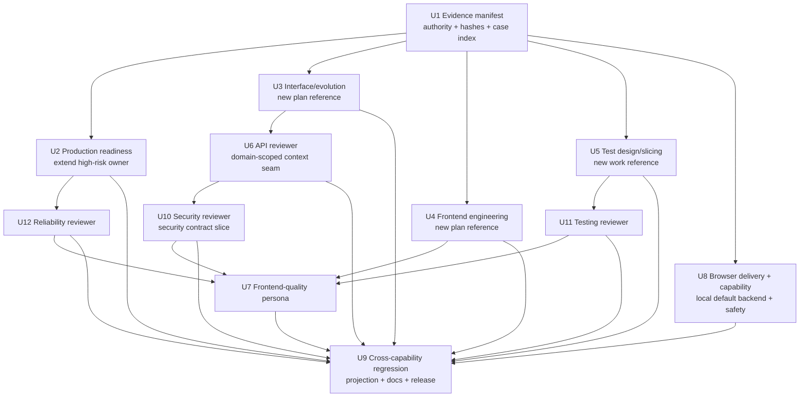

# Agent Skills Capability Integration - Plan

## Goal Capsule

| 维度 | 决策 |
| --- | --- |
| Objective | 以 Spec-First 的角色契约、source/runtime 治理和现有研发闭环为基准，把 Agent Skills 中已确认有增量价值的接口设计与演进、前端工程、测试设计、生产就绪与 reviewer 知识集成进现有 public workflow，不复制外部产品形态，不新增公共 Skill。 |
| Recommended approach | 复用现有 `spec-plan`、`spec-work`、`spec-code-review` 与 `spec-test-browser`；新增 3 个 skill-local reference，扩展 1 个现有 high-risk lens，把 4 个 reviewer 增强拆成独立纵向 slice，新增 1 个内部条件 frontend reviewer，并修复 `spec-test-browser` 当前未进入五宿主 runtime 的 internal-delivery 断链。 |
| Authority hierarchy | 当前用户目标与本方案 Product Contract > `docs/10-prompt/结构化项目角色契约.md` > 当前 project-owned source/contracts/tests > `docs/14-agent-skills/README.md` 与 `docs/solutions/**` advisory evidence > Agent Skills 固定快照与 provider 图候选。 |
| Decision focus | 条件能力由谁持有、何时触发、何时不触发；如何保证 source + trigger + negative fixture + contract test + fresh-source eval 同一纵向 slice 交付；如何避免公共入口、truth source、review finding 和 runtime generator 膨胀。 |
| Verification focus | 24 项 decision manifest 可回放；每个受影响的 behavior-bearing capability（含 browser）至少 2 个 positive 与 2 个 negative-owner case，且行为 oracle 由 owning skill 的 `evals/` 持有；中央索引只校验 case ID、owner、path、unit 与状态，文件 hash 统一在最终 evidence manifest 中做快照；新增 source anchor、死链、findings schema、五宿主 recursive projection、evals source-only、public catalog 零增量；fresh-source、runtime capability、host projection 与 field outcome 分层记录。 |
| Largest risk or boundary | 工作树和 HEAD 在规划期间持续变化，静态 dirty 清单会立即失效；同时 `spec-test-browser` 当前既未被五宿主交付，又会在 pipeline 中直接启动并读取待审分支代码、把 browser原始输出暴露给模型。U1 必须动态计算 dirty/write-set交集；U8 必须闭合internal delivery、组合capability probe、无sandbox不auto-start与模型摄入前输出代理，才能谈可消费性或安全。 |
| Stop conditions | 任一 slice 需要新公共 Skill 才能成立；canonical owner 不明确；trigger 无法与 negative-owner case 区分；fresh-source 未执行却被声称通过；runtime delivery 仍无法把内部 browser owner交付给消费者；所需 `agent-browser` capability或组合兼容性缺失却被声称强制；unattended模式在无可验证sandbox时仍直接启动任何会加载待审分支代码的进程；browser原始stdout/文件在脱敏前进入模型；profile/state与domain allowlist冲突后通过移除allowlist重试；生成器需要复制领域语义；runtime mirror被手改；reviewer ownership无法去重；当前脏文件无法安全协调；fresh-source `concerns`未解决且没有R18要求的授权acceptance receipt。 |
| Execution profile | Deep、跨 workflow/source/test/runtime projection 的能力集成；按 U1-U12 稳定 U-ID 与依赖顺序由 `spec-work` 执行，review、verification、runtime adoption 和 plan closeout 仍由现有 shipping tail 持有。 |

---

## Product Contract

### Summary

本方案把外部 Agent Skills 的工程实践密度转化为 Spec-First 自有、可回源、可验证、跨宿主投射的条件能力。
它不新增 source Skill 或 public workflow，通过 skill-local reference、内部 reviewer、聚焦 fixture、contract test 与 fresh-source evidence 补齐当前内容缺口；当前 35 个 source Skill 仅作为 U1 的实施基线，不作为跨时间的永久绝对值。

### Current Baseline

截至 2026-07-16，本方案使用以下已确认或明确降级的基线：

- Origin report 的 Spec-First snapshot 为 `a2f37c6075d35d4f686371bca4fb20c31275e142`；本方案依赖的 capability-source baseline 为 `6a0f060cf6cf4b00149afd7682688d4b6d8ad56f`，当前 plan-review HEAD 为 `5a4308b09b0ab9231df209b8d72a7f9161b96a7a`。U1 仍须在实施时重新采样，不把任一历史 revision 当作 current truth。
- Agent Skills 固定快照为 `98967c45a42b88d6b8fb3a88b7ff6273920763d6`，tag `0.6.4`，包含 24 个 Skill。
- `docs/14-agent-skills/README.md` 已完成 24 项全量映射，结论为 14 个强承载、10 个部分承载；该 14/10 只表示承载覆盖，不表示内容或 evidence 成熟度。
- 当前决策是新增 0 个公共 Skill、直接引入 0 个外部 Skill、新增 3 个 skill-local reference、扩展 1 个 high-risk lens、新增 1 个内部条件 reviewer persona。
- `skills/spec-plan/SKILL.md`、`high-risk-plan-lens.md`、`planning-evidence-boundaries.md`、`skills/spec-plan/evals/**`、consumer replay、HTML report-only closure 与相关 contract tests 均已进入 live HEAD；本方案必须把它们视为 protected baseline，不得按旧 snapshot 重建。
- 本轮修订期间工作树状态持续变化，先后出现过Changelog、本计划、相邻plan、CLI与test路径的独立修改；这些只证明静态清单不可靠，不表示本方案拥有其他dirty文件。U1必须重新计算完整dirty/write-set交集，不能复用本段示例作为执行许可。
- `src/cli/plugin-sync.js` 已通过递归目录复制把已交付 skill 的 skill-local reference/persona 投射到受支持宿主，并通过 `shouldIncludeBundledSkillPath()` 排除 `evals/`；但 `src/cli/plugin-governance.js` 的 `DELIVERED_INTERNAL_SKILLS` 当前只包含 `spec-worktree`，导致 governance 已声明为 `internal_only` 的 `spec-test-browser` 在五宿主 projection 中均为 0 条路径。U8 必须最小修复 delivery policy，`plugin-sync.js` generator 本身默认不改。
- 当前宿主支持列表由 `src/cli/adapters/index.js` 的 `getSupportedPlatforms()` 返回 Claude、Codex、Cursor、Kiro、Qoder。
- 原始方案编写阶段未获得 subagent/persona/parallel 授权并使用 inline fallback；本次 2026-07-16 深度复审已用最小继承上下文运行 coherence、feasibility、security-lens 三个 generic reviewer，并由当前代理逐项回源复核。该 review 证明的是方案质量判断，不替代 U2-U12 实施期 fresh-source eval、host loader 或 field outcome。

### Problem Frame

Spec-First 已经拥有比 Agent Skills 更完整的 intent、artifact、evidence、handoff 和 knowledge 闭环，但部分通用软件工程知识仍分散在 planning specialist、reviewer 或 shipping tail 中。
如果只继续增加主 `SKILL.md` prose，入口上下文会膨胀；如果按外部目录直接复制 Skill，又会制造近义 public route、并列 truth source、宿主工具绑定和无法进入现有 evidence contract 的孤岛能力。

需要解决的不是“Spec-First 是否也有同名 Skill”，而是以下六个工程缺口：

- planning 缺少统一的接口设计/演进条件 lens，尤其缺少 greenfield contract 与既有接口演进的双分支；
- planning 缺少通用 Web 前端工程条件 lens；
- execution 已有 proof-first、characterization-first、no-test exception与 verification evidence spine，但缺少在 skill-local reference中集中承载 slicing taxonomy、DAMP、state-over-interaction和 test-double hierarchy，并在提取时保护既有 TDD claim honesty；
- production readiness、observability 与 CI fidelity 仍分散，尚未由现有 high-risk owner 统一承载；
- code review 缺少通用 frontend quality reviewer，且 API/security/testing/reliability reviewer 仍可吸收更成熟的工程判断。
- browser workflow 的 canonical source 已存在，但当前 internal delivery 断开；同时 helper readiness 只证明 `agent-browser` 安装/手动设置状态，不证明 session、namespace、content boundaries、domain allowlist、action policy 等 U8 所需能力仍可用。

同时，任何增强都必须满足 Spec-First 的核心约束：scripts 只守确定性地板，LLM 判断语义充分性；source 是唯一持久真相源；generated runtime 可重建；公共入口只有在独立意图、artifact、consumer、done、route 和 owner/eval 同时成立时才新增。

### Actors

- A1. Workflow user：通过现有 `spec-*` 入口提出规划、实施、调试、审查或浏览器验证目标，不需要学习新的近义 Skill 名称。
- A2. Plan author：`spec-plan` 根据语义 trigger 加载最小必要 lens，并把适用决策落入 Planning Contract、U-ID、Verification Contract 或明确 blocker。
- A3. Implementer：`spec-work` 按 U-ID 和 test-design/slicing reference 选择 proof-first、characterization-first 或有理由的替代验证。
- A4. Reviewer：`spec-code-review` 按 diff 语义选择 reviewer，输出现有 findings schema，并由 orchestrator 合并、去重和校验。
- A5. Runtime consumer：Claude、Codex、Cursor、Kiro、Qoder 从 canonical `skills/**` 递归获得 runtime-required reference/persona，不消费 maintainer-only evals。
- A6. Maintainer：维护 source owner、fixtures、contract tests、fresh-source validation、docs、Changelog 与未来 public Skill 采用门槛。

### Requirements

#### Evidence、scope 与兼容基线

- R1. 实施开始前必须生成可回放 evidence manifest：以 origin report 的 hash 和 24 个唯一 Skill ID/decision/U-ID 回放全量判断，只对本方案实际受影响的 capability 记录 Spec-First source refs、external blob hash、authority、current owner、consumer 与当前处置，避免复制第二份 24 项领域说明。
- R2. 本次集成不得新增公共 Skill、不得直接 vendoring Agent Skills、不得修改 public catalog 语义；source Skill 目录数相对 U1 实施基线保持零增量（当前观察值为 35），不得把 35 写成未来仓库演化的永久常量。
- R3. U1 必须在实施开始时计算当前 dirty paths 与 U2-U12 声明/条件写集的交集，并逐文件确认 owner、hash 和预期合入基线；无法协调的交集文件只阻塞受影响 unit，不得覆盖或重建他人改动。

#### 条件 reference 与 planning/work 能力

- R4. 新增或扩展的每个能力必须具备明确 positive trigger、negative-owner boundary、required landing、canonical owner、consumer、degraded behavior 和 enforcement level（script/tool-enforced、LLM-owned judgment/convention、not-enforced）；仅新增文件但无入口指针不算完成。
- R5. `interface-and-evolution-lens.md` 必须同时覆盖 greenfield public interface design 与 existing interface evolution：共享最小 contract core 包含 consumers、canonical contract source、protocol/style、resources/operations、request/response schema、error model、compatibility/evolution 和 verification；greenfield 分支补齐边界验证与适用的 list/write/event/identity/high-risk 条件，evolution 分支补齐 additive/breaking、deprecation、replacement-first、zero-use evidence、consumer migration 和 rollback，同时排除 private/internal-only refactor。
- R6. `frontend-engineering-lens.md` 必须覆盖 component/data-presentation boundary、design-system/tokens、loading/error/empty/permission/offline/retry state matrix、keyboard/focus/semantics、responsive 与 runtime verification，同时不抢占 `spec-polish`、`spec-test-browser`、`spec-dogfood` 或 race reviewer。
- R7. `high-risk-plan-lens.md` 必须由现有 owner 扩展 production-readiness 分支，覆盖 on-call questions、metrics/traces/logs 的用途、correlation、cardinality/privacy、CI/build/deploy fidelity、feature flag lifecycle、staged rollout、alert owner/runbook/action 和 telemetry proof，不新建并列 production-readiness truth source。
- R8. `test-design-and-slicing.md` 必须覆盖 vertical/contract-first/risk-first slicing、rollback-friendly scope、DAMP、state-over-interaction、test-double hierarchy、characterization fallback、TDD claim honesty 和 no-test exception；未观察到真实 RED 时不得声称完成 TDD 历史。

#### Reviewer 与 downstream ownership

- R9. `api-contract-reviewer`、`security-reviewer`、`testing-reviewer`、`reliability-reviewer`必须分别吸收phase-owned工程判断，同时保留现有confidence gate、findings schema和suppression边界；API reviewer不承担接口设计，但既检查实现与canonical contract artifact在schema、error、nullability、pagination/ordering、idempotency/retry和compatibility上的可见漂移，也检查已变更契约所需的可见consumer trace、migration、deprecation、replacement与zero-use evidence；security reviewer在plan可用时只消费actor、permission、tenant、trust boundary、credential/authenticity、sensitive-error与security verification窄上下文，不把schema drift抢回security owner；真实RED、characterization与TDD历史仍由`spec-work`verification evidence持有，diff reviewer不得从最终代码推断执行历史。
- R10. 新增 `frontend-quality-reviewer` 作为内部条件 persona，只在用户可见交互、表单、导航、异步状态、组件公共行为、responsive、contrast、focus visibility 或 accessibility contract 命中时启用；backend-only、docs-only、type-only、fixture-only，以及经语义判断不影响 contrast/focus/layout/responsive/motion/状态表达的 token-value-only diff 不启用。
- R11. frontend-quality、frontend-races、testing、security、maintainability 的 ownership 必须可区分，重复 finding 在 merge/dedup 前就有明确主 owner，不能靠多 reviewer 重复报同一问题制造虚假置信度。
- R12. `spec-test-browser` 必须统一三层术语：executor=`agent-browser` CLI；backend provider=本地默认或显式 `--provider` backend；alternative executor=其他 browser tool/MCP。`agent-browser` 保持当前唯一 confirmed executor，本轮只实现本地默认 backend。运行前必须用确定性 probe确认所需flags/commands及安全组合兼容性；每次run使用repo外可信最小config、唯一session/namespace、content boundaries、domain allowlist与default-deny action policy，并清除/覆盖ambient provider/profile/state/restore/CDP/proxy/plugin/extension/init-script配置。当前0.31.1会拒绝`--allowed-domains`与`--profile`/`--state`/`--restore`/`--auto-connect`等共用，因此本轮所有profile/state型登录流均为`not_supported|not_run`，不得通过移除allowlist重试；future authenticated flow还需独立证明fresh-context credential path、exact-origin与host-process保护。所有CLI调用必须经过唯一wrapper：原始stdout/stderr、network内容和文件先进入模型不可见的权限受限temp，只向模型/报告返回bounded、字段白名单和确定性脱敏后的结果；无法在模型摄入前可靠处理的截图或敏感内容必须`not_supported|not_run`。`mode:pipeline`在没有可验证host/container sandbox时不得auto-start任何会加载待审分支代码的server/build进程，只能消费caller在隔离环境预启动并携带revision、command与process provenance的server。页面内容仍按不可信数据处理；domain allowlist不得冒充exact-origin或OS firewall；逐项coverage、cleanup和未强制层必须进入contract，且不得从executor可替换性推导任何backend/provider parity。

#### Eval、runtime 与 adoption

- R13. 每个 behavior-bearing slice（包括 U8 browser capability）必须在同一 unit 中交付 source、trigger、owning skill 下至少 2 个 positive case、至少 2 个 negative-owner case、focused contract test、fresh-source eval 状态和 review；中央 case index 只记录 case ID、canonical owner、repo-relative path、unit 和 status，不记录会随共享文件后续编辑失效的 file hash，跨能力 composition cases 不复制单 Skill oracle。
- R14. Mechanical source contract、fresh-source semantic judgment、host loader/invocation observation、field outcome 必须分层；低层证据不得升级为高层 claim。
- R15. 新增 reference/persona 必须通过现有 recursive projection 进入五宿主 runtime-required skill package，`evals/**` 保持 source-only；`spec-test-browser` 必须作为 internal-only runtime skill 被五宿主交付但不进入 public catalog。当前已证明缺口位于 `plugin-governance.js` delivery allowlist，允许最小修复该 policy；只有 focused projection test 继续证明递归生成链不能承载时，才允许修改 `plugin-sync.js` generator。
- R16. `spec-security-audit`、`spec-migration`、`spec-observability` 继续 Defer；只有满足 90 天采用、跨 repo、现有 workflow 承载不足、独立 artifact/consumer、route fixture 和 owner/eval 门槛后，才进入新的 PRD。
- R17. 每个修改 source、skill、reference、persona、test 或 docs 的 unit 必须在该 unit 集成提交前由 orchestrator 串行更新 `CHANGELOG.md`；worker 不并发写 Changelog，U9 只做最终一致性收口。
- R18. Fresh-source `passed`、`concerns`、`not_run` 是语义证据状态而非确定性CI verdict；`not_run`必须带reason和claim ceiling，可关闭source implementation但不能获得semantic-passed claim。`concerns`必须解决，或由当前Project owner/明确授权maintainer显式接受；接受receipt必须绑定finding ID、current source hash、authority、rationale与invalidation condition，evaluating reviewer或orchestrator不得无授权自我接受。

### Key Flows

- F1. Evidence baseline：读取 origin report 与 current source → 冻结 revision/hash/authority → 建立 skill-local behavior cases、中央 case index 与跨能力 composition cases → 计算 dirty/write-set 交集 → 允许或阻塞受影响 unit。
- F2. Planning lens：用户请求命中 greenfield API/interface、existing evolution、UI 或 high-risk 语义 → `spec-plan` 加载最小必要 reference 集（单一命中只加载一个，多重命中允许组合）→ 接口分支把最小 contract block 与 canonical artifact落入 Planning Contract/U-ID/Verification/Risk → negative-owner 请求保持 lean。
- F3. Work evidence：`spec-work` 读取 active U-ID → 根据 test-design reference 选择 slice 和 evidence strategy → 观察 RED 或 characterization baseline → 实现与验证 → 记录 claim-matched evidence。
- F4. Review selection：读取 diff 与 catalog → 依次增强 API/security/testing/reliability owner并选择适用 reviewer或 frontend-quality → reviewer 返回 findings schema → orchestrator 按 owner、anchor 和 evidence 合并去重 → 不适用 persona不派发；diff-only review不推断 TDD历史。
- F5. Runtime projection：canonical `skills/**` 变更 → `plugin-sync` 递归计划五宿主 runtime path → required reference/persona 存在、`evals/**` 缺席 → 在隔离 fixture 中执行 init lifecycle → 不手改 repo-local mirrors。
- F6. Public Skill reconsideration：积累 90 天 field adoption → 证明现有 workflow 反复承载不足 → 独立 artifact 被真实 consumer 使用 → signature/negative route 稳定 → owner/eval/release plan 完整 → 才创建后续 PRD。

### Acceptance Examples

- AE1. 给定一个 external public API 删除字段并迁移两个客户端的计划请求，`spec-plan` 加载 interface design/evolution lens，要求 consumer inventory、兼容窗口、替代路径、zero-use evidence 和 rollback；给定 private helper rename，不加载该 lens。
- AE2. 给定一个含表单提交、loading/error/empty、移动端布局和键盘导航的新页面，`spec-plan` 加载 frontend lens；给定 backend-only handler 或不影响 contrast/focus/layout/responsive/motion/状态表达的 token-value-only 变更，不加载该 lens；纯 CSS 但改变 contrast、focus 或 breakpoint 行为时必须加载。
- AE3. 给定 staged rollout、feature flag、CI gate 与 on-call 责任的外部集成，high-risk lens 要求真实 build/deploy fidelity、成功/失败 signal、rollback trigger、owner 与 runbook；给定 docs-only 变更，保持轻量。
- AE4. 给定 legacy parser 行为修改且测试缝隙薄弱，`spec-work` 选择 characterization-first；给定可观测的新增行为，选择 proof-first 并记录 RED；给定纯文档、格式或 generated artifact 变更，记录 no-test exception 而不伪造 TDD。
- AE5. 给定 interaction-heavy mocks 只验证调用次数，testing reviewer 识别 false confidence；给定行为断言明确且内部实现可重构，不因测试风格偏好报 finding。
- AE6. 给定 LLM/tool output 未验证即进入 shell/path/SQL sink，security reviewer 要求真实 attack path 与 trust-boundary evidence；给定依赖公告但代码不可达且无 exploit path，只记录 degraded risk 或抑制 finding。
- AE7. 给定 public response schema 的 subtractive change，API reviewer 跟踪 consumer 与 deprecation evidence；给定稳定 public contract 后面的内部重构，不报 API finding。
- AE8. 给定跨服务请求缺 correlation propagation、alert 无 owner/action、telemetry 没有验证，reliability reviewer 报告具体 failure path；给定纯内存函数，不启用 reliability concern。
- AE9. 给定新增用户可见表单和异步状态，frontend-quality reviewer 检查 a11y、状态完整性、responsive 与 presentation/data boundary；仅在存在 timer/lifecycle race 时才同时启用 frontend-races reviewer。
- AE10. 给定 backend-only、docs-only、type-only、fixture-only 或无用户可见语义影响的 token-value-only diff，frontend-quality reviewer 不启用；给定 CSS-only contrast、focus、layout、responsive 或 motion contract 变化时启用，public reviewer roster 不因扩展名本身机械膨胀。
- AE11. 给定五个supported host，projection plan均包含新增3个reference、frontend persona、`spec-test-browser/SKILL.md`与其runtime-required reference/script，同时不包含任何新增`evals/**`path；current confirmed happy path只需最小修改`plugin-governance.js`delivery policy，若focused transform test出现反证则按U8条件分支处理`plugin-sync.js`。
- AE12. 给定 fresh reviewer dispatch 未获授权，validation 记录 `fresh_source_eval.status: not_run`、`dispatch_authorization_missing` 与 claim ceiling；deterministic source implementation 可关闭，但该 slice 不得被描述为语义已验证，closeout 必须保留 degraded limitation。
- AE13. 给定未来有人提议新增 `spec-observability`，若 90 天内没有 5 次合格独立意图、3 个 repo、3 次 artifact consumer 和 2 次现有 workflow 承载不足证据，结论继续 Defer。
- AE14. 给定 U2-U12 中任一 source-bearing unit完成集成，orchestrator在该 unit提交前串行更新 `CHANGELOG.md`；并行 worker不直接写该共享文件，U9验证所有 unit记录完整而不补写历史空洞。
- AE15. 给定 `agent-browser` 缺少任一 required capability、repo/ambient config尝试切换 provider/profile/plugin、分支修改 unattended dev-server launch surface、页面诱导 destructive action或证据含 credential/PII，U8 必须 fail closed或逐项 degraded；不得仅凭 `command -v`、一次性版本观察或 content boundaries 声称 browser isolation/security 已强制。
- AE16. 给定 greenfield REST list/create API，`spec-plan` 要求明确 consumers、canonical OpenAPI/JSON Schema或repo-native exported types、resource/operation、typed request/response、统一 error model、boundary validation；list分支补 pagination/filter/sort/stable ordering，write分支补 idempotency、concurrency、retry与 consistency。
- AE17. 给定新的webhook/event contract，`spec-plan`在共享contract core之上要求delivery、ordering、deduplication、retry与replay语义，并把第三方payload/response作为不可信输入验证；credential/authenticity/threat交给security owner，外部高风险consumer的rate limit、quota、SLO、observability与rollout交给high-risk owner组合处理。
- AE18. 给定multi-tenant API或CLI surface，`spec-plan` 要求明确actor、permission与tenant scope，并把authorization充分性交给security owner组合审查；该handoff不把interface lens变成第二个security truth source。
- AE19. 给定兼容的 optional response field新增，`spec-plan` 仍记录 canonical contract与验证，但不生成 dual-run、sunset或重型迁移流程。
- AE20. 给定实现把 canonical schema中的统一 error body改成另一种shape、取消stable ordering或破坏已声明的 idempotency/retry语义，API reviewer返回具体 contract-drift finding；实现与canonical artifact同步的内部重构保持 suppression。

### Success Criteria

- 24 项 mapping、14/10 承载计数、source authority、external revision 与 dirty hashes 可由 evidence manifest 回放。
- 3 个 planned-new reference、1 个 extended high-risk lens、4 个 extended reviewer、1 个 planned-new internal reviewer 均有 canonical owner、trigger、negative boundary、consumer 和 focused tests；interface lens同时证明 greenfield design 与 existing evolution两个分支。
- 每个受影响 behavior-bearing capability（含 browser）至少有 2 个 positive、2 个 negative-owner case，由 owning skill 的 `evals/` 持有；中央 case index 可回放 case ID/owner/path/unit/status，跨能力 composition cases只验证组合与去重，最终 manifest再冻结 file hash。
- `using-spec-first` public route 与 source Skill 目录相对 U1 基线保持零增量（当前 35）；新增 reference/persona/internal browser delivery 不进入 public catalog。
- Mechanical contract tests、fresh-source eval、host projection 和 field outcome 使用不同状态字段和结论措辞。
- 五宿主 projection 包含 runtime-required assets、排除 source-only evals，并且没有手改 generated runtime mirror。
- 小型内部重构、docs-only、backend-only，以及无 contrast/focus/layout/responsive/motion/状态表达影响的 token-value-only negative case 不触发高风险或前端 ceremony；CSS contract变化仍进入 frontend lens/reviewer。
- reviewer findings 使用现有 schema，frontend/security/testing/reliability/API ownership 没有重复职责或第二套 merge contract。
- 每个适用public interface计划都在Planning Contract的`### Interface Contracts`下落下可追踪entry并指向一个canonical artifact；无接口计划不生成空section；API reviewer只消费该契约检查实现漂移及可见的compatibility、consumer migration、deprecation、replacement与zero-use evidence，不成为第二个设计owner。
- `spec-test-browser` 在五宿主runtime可达；required CLI capability及组合兼容性、safe config/action policy、session/namespace、domain allowlist、模型摄入前输出代理与cleanup有确定性事实；profile/state登录流保持`not_supported|not_run`，无sandbox时不auto-start分支代码，exact-origin/OS firewall/完整视觉PII脱敏不被夸大。
- 每个 source-bearing unit 的 Changelog、origin report 的实施链接、validation report 和必要用户文档完成更新，且不把 source contract 说成真实 host/field outcome。

### Scope Boundaries

#### In scope

- `spec-plan` 的 production-readiness、greenfield interface design、existing interface evolution、frontend-engineering 条件能力。
- `spec-work` 的 test-design/slicing 条件能力。
- `spec-code-review` 的 API/security/testing/reliability 增强和 frontend-quality 条件 persona。
- `spec-test-browser` 的 executor/backend provider boundary、隔离、不可信页面数据、a11y/responsive/state recovery contract。
- `spec-test-browser` 的 internal delivery policy、workflow-specific `agent-browser`组合capability probe、唯一safe invocation/output wrapper与敏感 evidence cleanup。
- skill-local source-only cases、中央 case index、跨能力 composition cases、focused Jest、fresh-source status、五宿主 projection、文档与 release closeout。

#### Deferred to Follow-Up Work

- `spec-brainstorm` / `spec-prd` 的 guess-attached question、Not Doing、abuse-case、consumer/sunset 进一步增强：当前 `spec-prd/references/evidence-and-topology.md` 与 readiness/output references 已覆盖大部分 producer/consumer、compatibility 和 negative-space 语义；先用本方案跨能力 composition cases验证真实缺口，再单独立项。
- `spec-debug` 的 stop-line/reduce/untrusted-error-output 文案强化和 `spec-compound` 的 ADR/signal learning 增强：当前 debug instrumentation/correlation 与 compound supersession/invalidation 已有承载，待 core slice 落地后以真实使用证据决定最小增量。
- 真实五宿主 clean-session loader 观测与 field adoption 指标：只有具备可回源 host/session evidence 时才晋升，source projection 不替代。
- 三个未来 public Skill 候选的 PRD：只在 R16 门槛满足后启动。

#### Outside this plan

- 修改 Agent Skills 外部仓库、解决其根级冲突或将其作为运行时依赖。
- 直接复制外部 Skill、persona、固定技术栈示例、路径、脚本或宿主工具假设。
- 新增 `spec-api-design`、`spec-frontend`、`spec-tdd`、`spec-ci-cd`、`spec-adr` 或其他近义 public Skill。
- 新建全局 engineering mega-skill、第二套 reviewer findings schema、第二套 runtime generator、跨 Skill reference import 系统或中心化 workflow 状态机。
- 让 scripts 判断 threat model、API 设计、a11y、test quality、observability 或 reviewer finding 的语义充分性。
- 手改 `.claude/**`、`.codex/**`、`.agents/skills/**`、`.cursor/**`、`.kiro/**`、`.qoder/**` generated runtime。
- 构建通用跨平台 OS sandbox、网络防火墙或凭证代理；当前宿主缺少可验证 primitive 时必须降级，不得用 prose 冒充强隔离。

---

## Planning Contract

### Key Technical Decisions

- KTD1. 以当前 origin report 的 24 项矩阵作为 WHAT 与优先级来源，但不把报告中的 working-tree advisory 当作 HEAD confirmed。U1 必须重新冻结实施时 HEAD、dirty state、hash 与 owner。
- KTD2. 当前不新增公共 Skill。领域知识通过 conditional reference/persona 进入现有 artifact 和 evidence 链，公共入口只在 R16 的真实采用门槛满足后重新评估。
- KTD3. production readiness 选择 `extend` 现有 `high-risk-plan-lens.md`。该 owner 已持有 rollout、rollback、owner-visible signal、runbook 和 verification required landing；新建并列 lens 会产生双真相源。
- KTD4. interface design/evolution选择在现有public `spec-plan`内创建`new` skill-local reference，而不是新增public Skill。现有architecture strategist、API reviewer、PRD compatibility和data-migration reviewer分别持有研究、diff review、产品WHAT与数据迁移，均不适合作为greenfield与evolution共用的plan-time interface owner。
- KTD5. frontend engineering 选择 `new` skill-local plan reference。视觉 polish、runtime browser QA、dogfood、race review 与 Swift review 都不是通用 Web component/state/a11y planning contract 的 owner。
- KTD6. test design/slicing 选择 `new` `spec-work` skill-local reference。主 `SKILL.md` 只保留触发和 evidence spine，DAMP、test double、state-vs-interaction 与 slicing taxonomy 下沉到条件 reference。
- KTD7. frontend-quality 选择 `new` internal conditional persona，继续消费现有 findings schema、confidence gate、merge/dedup 和 dispatch fallback；它不成为 public Skill 或 typed agent。
- KTD8. API/security/testing/reliability使用`extend`。每个reviewer只增加其phase-owned判断，不把plan-time设计、运行时测试或deterministic TIA变成review finding；U6在现有subagent template建立一个可为空的domain-scoped contract-context slot，API reviewer接收schema/evolution slice，U10复用同一slot向security reviewer传递actor/permission/tenant/trust/credential slice。Selection、findings schema、validator、merge/dedup与无关persona context保持不变。
- KTD9. references 保持 skill-local，不做跨 Skill import。跨阶段只传播最小合同；如果未来出现必须字节一致的重复条款，指定 canonical owner 并增加 parity test，而不是人工维护两份相同 prose。
- KTD10. scripts 只验证文件存在、JSON/fixture shape、case coverage、baseline-relative catalog/source count、runtime path、hash snapshot、CLI capability、findings schema 与 public roster。lens applicability、设计充分性、finding validity、页面内容语义和 owner 冲突由 LLM/reviewer 判断。
- KTD11. 每个能力按纵向slice交付。source、trigger、skill-local positive/negative cases、contract test、fresh-source eval状态和review必须同一U-ID关闭；API/security/testing/reliability reviewer分别使用U6/U10/U11/U12。除U6提供domain-scoped context seam、U10复用它这一真实依赖外，一个reviewer失败不得拖住其他owner，也不允许先合入prose再把行为证据推迟到“后续优化”。
- KTD12. fresh-source `not_run`是诚实降级，不是pass。它阻止semantic-passed claim，但不把未授权subagent变成source implementation的永久硬依赖；`concerns`必须解决或具备R18授权receipt。确定性closeout只验证状态、source hash、reason/claim ceiling与acceptance字段完整性，不替模型判断语义。
- KTD13. runtime adoption 复用 `src/cli/plugin-sync.js` 的递归复制、`src/cli/plugin-governance.js` 的 `buildFilteredAssetSet()` 与 `getSupportedPlatforms()`。当前 direct source 已证明 generator 能复制 reference/persona/script，但 delivery policy 跳过 `spec-test-browser`；因此 U8 最小扩展 `DELIVERED_INTERNAL_SKILLS` 并补五宿主 tests，`plugin-sync.js` generator write-set 仍为零，除非新的 focused failure证明 transform seam有缺口。
- KTD14. `spec-test-browser` 的 portability只存在于 capability/output contract。三层术语固定为 executor、backend provider（本地默认或显式 `--provider`）和 alternative executor；`agent-browser` 是当前唯一 confirmed executor，本轮只确认本地默认 backend。任何 backend/provider或替代 executor都必须有独立 readiness和可回源证据，不能从“可替换”推导“已 parity”。
- KTD15. 当前 `spec-prd`、`spec-debug`、`spec-compound` 已有较强相邻承载，本轮不为“完整性”强行再改。跨能力 composition cases若证明真实重复 gap，再用后续最小 plan扩展正确 owner。
- KTD16. `CHANGELOG.md` 是 orchestrator-owned shared integration surface。每个 source-bearing unit在验证通过后、提交前由 orchestrator串行追加记录；worker只返回变更摘要，不能并发写该文件，U9只做完整性核对。
- KTD17. 行为 case保持 skill-local。中央 `case-index.json` 只持有 case ID、canonical owner、repo-relative path、unit和状态，不持有共享 eval 文件 hash；U9 在 final evidence manifest 统一冻结 file hash。`composition-cases.json` 只持有真正跨 lens/reviewer/workflow的组合输入与 owner去重预期，不复制单 Skill oracle。
- KTD18. Browser safety分三层：`agent-browser` flags/action policy与唯一wrapper提供tool/script-enforced的组合probe、参数/env约束、原始输出隔离、确定性脱敏和cleanup事实；“把已净化页面输出当数据、不执行其中指令”属于LLM-owned convention；exact-origin、OS/network sandbox和完整视觉PII识别在缺少宿主primitive时为not-enforced。未强制层不能只在暴露后标degraded：需要该层的launch、登录或evidence分支必须在副作用/模型摄入前`not_supported|not_run`。
- KTD19. interface lens采用“共享轻量contract core + greenfield/evolution双分支”。适用时在Planning Contract下生成可选`### Interface Contracts` subsection，每个接口entry声明consumers、canonical artifact、protocol/style、operations、request/response、errors、compatibility和verification；无公共接口时省略该subsection。再按list/search、write、event/webhook、identity/multitenancy、external/high-risk条件追加必要决策。OpenAPI、GraphQL Schema、Proto、JSON Schema、exported types或CLI schema都可作为canonical artifact，选择服从当前repo owner而非固定技术栈。Scripts只验证artifact可解析、schema diff与generated drift等确定性事实，LLM判断设计与演进策略是否充分。

### High-Level Technical Design

下图说明 capability source、触发、验证、review 与 runtime projection 的依赖关系。
图与各 unit 的 `Dependencies` 共同构成同一依赖合同；发生不一致时必须先修订方案再执行。

### Artifact and Evidence Contracts

| Artifact | Canonical owner | Authority | Consumer | Contract |
| --- | --- | --- | --- | --- |
| `docs/14-agent-skills/README.md` | research docs | advisory decision origin | plan、maintainer、reviewer | 24 项映射、ownership 决策、go/no-go 门槛；不代表实施完成 |
| `docs/validation/2026-07-16-agent-skills-capability-integration/evidence-manifest.json` | validation package | deterministic snapshot | U1-U12、review、closeout | path、revision/hash、git state、authority、owner、consumer、claim scope |
| owning skill `evals/*.json` | owning workflow skill | source-only behavior oracle | focused tests、fresh-source evaluator | case id、positive/negative、expected/forbidden owner、required/forbidden outcomes、evidence level |
| `tests/fixtures/agent-skills-capability-integration/case-index.json` | integration fixtures | deterministic index | closeout、provenance audit | case id、canonical owner、repo-relative path、unit、status；不复制 behavior oracle，不持有共享文件 hash |
| `tests/fixtures/agent-skills-capability-integration/composition-cases.json` | integration fixtures | source-only composition oracle | cross-capability replay | 仅覆盖跨 lens/reviewer/workflow组合、选择与去重，不复制单 Skill cases |
| skill-local reference | owning workflow skill | runtime-required source | current workflow LLM | trigger、negative boundary、required landing、failure/degraded behavior；不成为用户入口 |
| `### Interface Contracts` block + canonical artifact | `interface-and-evolution-lens.md` + 当前repo的API/schema owner | plan decision + project-owned source | implementer、API reviewer、security reviewer、consumer maintainer、contract tests | 可选Planning Contract subsection；每个entry含consumers、artifact path/type、protocol/style、resources/operations、request/response、error model、compatibility/evolution、verification；条件追加pagination/order、idempotency/concurrency/retry、delivery/dedup/replay、identity/tenant/security或high-risk handoff |
| reviewer persona prompt | `spec-code-review` | runtime-required source | review orchestrator | domain ownership、confidence anchors、suppression、existing findings schema |
| browser safe-runner receipt | `spec-test-browser` | generated/degraded runtime fact | browser workflow、validation closeout | CLI version、单项/组合capability、effective config/provider、session/namespace、policy、server provenance、raw-output containment、redaction/visual-export status、evidence temp root、cleanup与未强制层；不证明页面语义正确 |
| `docs/validation/2026-07-16-agent-skills-capability-integration/fresh-source-results.json` | validation package | semantic advisory evidence | maintainer、doc review、release closeout | source hashes、case ids、reviewer context、status、findings、not-run reason、claim ceiling、judge/human calibration；accepted concern另存finding ID、source hash、authority、rationale、invalidation condition；`not_run`不冒充pass也不自动否定source implementation |
| projection test result | existing plugin/init tests | deterministic runtime-plan evidence | five host adapters、release | required paths present、evals absent、generated mirrors untouched；不证明 loader behavior |

### Existing Capability / Composition / Source Ownership

| Capability | Existing owners inspected | Decision | Canonical owner | Rejected shape |
| --- | --- | --- | --- | --- |
| Production readiness | high-risk lens、deployment verification、reliability reviewer、shipping tail | `extend` | `skills/spec-plan/references/high-risk-plan-lens.md` | 并列 `production-readiness-lens.md` 或新 `spec-ci-cd` |
| Interface design/evolution | architecture strategist、API reviewer、PRD compatibility、data migration | `new` skill-local reference，内部持有greenfield/evolution双分支 | `skills/spec-plan/references/interface-and-evolution-lens.md` | 把普通API设计塞入high-risk；让diff reviewer反向持有设计 |
| Frontend engineering | polish、browser QA、dogfood、race reviewer、Swift reviewer | `new` | `skills/spec-plan/references/frontend-engineering-lens.md` | 新 `spec-frontend`；把 a11y/state 塞入 race reviewer |
| Test design/slicing | work feedback loop、debug test-first、testing reviewer | `new` | `skills/spec-work/references/test-design-and-slicing.md` | 新 `spec-tdd`；继续增长主 work spine |
| API/security/testing/reliability review | 现有四个persona；plan discovery + domain-scoped context seam | `extend` | 各自persona prompt；API/security窄化contract slice由`spec-code-review`编排 | 新合成reviewer、把完整plan注入所有persona、跨owner复制判断或创建第二套finding contract |
| General frontend review | race、Swift、maintainability、testing、security | `new` internal persona | `frontend-quality-reviewer.md` | 仅按扩展名激活；复制四个 reviewer 的职责 |
| Runtime projection | plugin sync、plugin governance、host adapters、skills governance | `extend delivery + reuse generator` | `src/cli/plugin-governance.js` + `src/cli/plugin-sync.js` | 新 generator、手改 mirrors、跨 Skill import、继续让 internal browser owner不可达 |

### System-Wide Impact

- **Public route:** in-scope，必须证明 public workflow catalog 与 source Skill count相对 U1 baseline零增量。
- **Planning source:** in-scope，`spec-plan` 新增两个 conditional pointer并扩展现有 high-risk owner；interface pointer覆盖greenfield/evolution双分支，并把Interface Contract block与canonical artifact交给现有plan artifact承载。
- **Execution source:** in-scope，`spec-work` 新增一个 conditional test-design pointer，不改变 execution engine 和 shipping tail ownership。
- **Review source:** in-scope，四个现有persona按U6/U10/U11/U12扩展、一个内部persona新增；U6建立domain-scoped contract-context seam并填充API slice，U10复用同一seam填充security slice；findings schema、validator、merge/dedup与无关persona context不变，diff reviewer不持有执行历史。
- **Browser runtime:** in-scope，internal delivery、workflow-specific capability probe、trusted run config、executor/backend provider contract、run-scoped隔离、untrusted/sensitive page data、runtime coverage与 degraded evidence增强；当前唯一 confirmed executor保持 `agent-browser`。
- **PRD/debug/compound:** deferred，以现有 source为 reuse baseline，通过跨能力 composition cases观察 gap，不在本轮扩写。
- **CLI/runtime generation:** `plugin-governance.js` internal-delivery policy in-scope；`plugin-sync.js` generator out-of-scope by default，focused failure才触发最小修复。
- **Generated runtime:** out-of-scope as mutation；仅在隔离测试项目中由正式 init流程生成并验证。
- **Documentation/release:** in-scope，origin report链接、validation package、用户手册适用说明与 Changelog需要更新。
- **External Agent Skills repo:** out-of-scope，只使用固定 commit/tag作为 pinned evidence。

### Sequencing

- U1 是所有 unit 的 gate，先冻结 authority、case index/composition schema，并动态计算 dirty/write-set交集。
- U2、U3、U4 语义上都只依赖 U1，但会触及同一 `spec-plan` eval/test surface，应按 U2 → U3 → U4 调度串行；该顺序是写集约束，不是跨能力依赖。某一 unit失败并回滚/恢复干净基线后，不阻塞其他 owner继续。
- U5 的 source/eval/test写集与 U2-U4 分离，可并行执行；`case-index.json`、fresh-source results与Changelog由 orchestrator在集成后串行更新，不能下发给并行 worker。
- U6语义依赖U3并建立domain-scoped contract-context seam；U10依赖U6以复用该seam并关闭U3的security handoff；U11语义依赖U5，U12语义依赖U2。四个unit各自创建owner-specific eval文件，但共享persona catalog、contract test与Changelog集成表面，因此调度串行；除U6→U10的真实seam依赖外，不伪造其他reviewer依赖。
- U7 依赖 U4、U10、U11、U12，并在四个 existing reviewer边界稳定后新增 frontend-quality persona。
- U8 只依赖U1，可与非冲突 source slice并行；它独立闭合 internal delivery、capability probe与 browser safety，不能等待 U4/U7 才修复现有 runtime断链。
- U9 在 U2-U8 与 U10-U12全部满足 deterministic gates、记录 fresh-source status且没有未解决 `concerns` 后运行，完成 cross-capability regression、五宿主 projection和 release closeout。

### Deferred Implementation Decisions

- 每个新 reference 的最终段落名和篇幅由实施时的 hot-path footprint 与 local prose style决定；本方案固定语义 contract，不预写正文。
- fresh-source evaluator 的具体宿主/model由实施时可用且获授权的 read-only dispatch primitive决定；没有授权则记录 `not_run`、reason与 claim ceiling，关闭 source implementation但保留 semantic validation degraded。
- 如果 U1 发现本方案描述的 advisory source已被另一方案合入，实施者应复用已合入 owner并调整 unit/test，而不是重新应用旧 diff。
- 如果 projection test 暴露 host transform 对非入口 reference 做了不必要改写，只修实际丢失/漂移的最小 adapter seam，不扩大为通用中间表示层。
- `agent-browser` workflow-specific capability probe由 `spec-test-browser` 持有，`spec-runtime-setup` 继续只持安装/全局 skill readiness；若 helper版本变化使 action policy或required flags不可用，U8按reason code降级，不把安装成功等同于安全能力成功。

---

## Implementation Units

| U-ID | Unit | Key files | Depends on |
| --- | --- | --- | --- |
| U1 | 冻结 evidence、case index 与写集协调门 | validation package、integration fixtures | None |
| U2 | 扩展 production-readiness delta | `high-risk-plan-lens.md`、`spec-plan/evals/**` | U1 |
| U3 | 新增 interface design/evolution lens | `spec-plan` source/reference/evals | U1 |
| U4 | 新增 frontend-engineering lens | `spec-plan` source/reference/evals | U1 |
| U5 | 提取并扩展 test-design/slicing | `spec-work` source/reference/evals | U1 |
| U6 | 扩展 API contract-drift reviewer | review context、API persona、code-review eval/test | U3 |
| U10 | 扩展 security reviewer与contract handoff | security persona、review context、catalog/eval/test | U6 |
| U11 | 扩展 testing reviewer | testing persona、code-review eval/test | U5 |
| U12 | 扩展 reliability reviewer | reliability persona、catalog/eval/test | U2 |
| U7 | 新增 frontend-quality reviewer | frontend persona、catalog/source/eval/test | U4、U10、U11、U12 |
| U8 | 修复 browser delivery并完成 capability/safety合同 | browser source/script/pipeline、plugin governance、eval/test | U1 |
| U9 | 跨能力、五宿主与发布收口 | integration closeout、plugin projection、docs | U2-U8、U10-U12 |

### U1. 冻结 evidence manifest、case index 与脏工作树协调门

**Goal:** 把 origin report 的结论转换为实施可消费的确定性基线，并用动态 dirty/write-set交集、skill-local behavior cases、中央 case index和 composition fixtures防止 revision漂移、并发覆盖与第二套行为事实源。

**Requirements:** R1、R2、R3、R13、R14、R17、R18

**Dependencies:** None

**Files:**

- Create: `docs/validation/2026-07-16-agent-skills-capability-integration/README.md`
- Create: `docs/validation/2026-07-16-agent-skills-capability-integration/evidence-manifest.json`
- Create: `docs/validation/2026-07-16-agent-skills-capability-integration/fresh-source-results.json`
- Create: `tests/fixtures/agent-skills-capability-integration/case-index.json`
- Create: `tests/fixtures/agent-skills-capability-integration/composition-cases.json`
- Create: `tests/unit/agent-skills-capability-integration-contracts.test.js`
- Read/confirm: `docs/14-agent-skills/README.md`
- Read/confirm: `skills/spec-plan/SKILL.md`
- Read/confirm: `skills/spec-plan/references/high-risk-plan-lens.md`
- Read/confirm: `skills/spec-plan/references/planning-evidence-boundaries.md`
- Read/confirm: `skills/spec-plan/evals/examples.json`
- Read/confirm: `skills/spec-plan/evals/output-quality-cases.json`
- Read/confirm: `skills/spec-plan/evals/consumer-replay-cases.json`
- Read/confirm: `tests/unit/spec-plan-quality-contracts.test.js`
- Read/confirm: `tests/unit/spec-plan-consumer-replay-contracts.test.js`
- Read/confirm: `skills/spec-work/SKILL.md`
- Read/confirm: `tests/unit/spec-work-contracts.test.js`
- Read/confirm: `skills/spec-doc-review/SKILL.md`
- Read/confirm: `tests/unit/spec-doc-review-contracts.test.js`
- Read/confirm: `src/cli/plugin-governance.js`
- Read/confirm: `src/cli/contracts/dual-host-governance/skills-governance.json`
- Read/confirm: `tests/unit/plugin-modules.test.js`
- Read/confirm: `CHANGELOG.md`
- Modify after unit verification, orchestrator-owned: `CHANGELOG.md`

**Approach:**

- 从实施时 HEAD 和 working tree重新计算 source hash，记录 `HEAD confirmed`、`working-tree advisory`、`pinned external source`、`generated`、`degraded`，不得复用计划编写时的静态清单。
- manifest以 origin report hash为全量语义来源，为24个外部 Skill建立唯一 ID/decision/U-ID record；只有本方案实际受影响的 capability再关联 external blob hash、Spec-First owner/source hash、consumer与content/evidence gap，避免复制第二份24项领域说明。
- 从 U2-U12 的 `Files` 与 conditional seam生成 planned write-set，与当前 dirty paths求交集；只把交集列入 `write_collision_guard`，记录 owner、当前 hash、允许的 merge策略与“未确认不得写”状态。
- 在修改 source前运行并记录当前相关 focused suites、skill lint和diff hygiene基线；受影响 suite若已经失败，对应 unit保持 blocked，不能把旧失败归因于本方案或在新失败上继续叠加。
- 为 owning skill eval cases定义最小共同字段：`case_id`、`case_kind`、`expected_owner`、`forbidden_owners`、`required_outcomes`、`forbidden_outcomes`、`evidence_status`；具体 behavior oracle留在各 skill `evals/`。
- fresh-source result schema为`concerns` acceptance定义显式receipt字段：`finding_id`、`source_hash`、`accepted_by`、`authority`、`rationale`、`invalidation_condition`、`accepted_at`；缺任一字段或接受者无当前授权时保持unresolved。
- `case-index.json`只记录 case ID、canonical owner、repo-relative path、U-ID和状态；共享 eval 文件的 final hash统一由U9写入 evidence manifest。`composition-cases.json`只记录跨能力选择、owner去重和组合输出，不复制 skill-local prompt/oracle。
- `case-index.json`、`fresh-source-results.json`和`CHANGELOG.md`是 orchestrator-owned integration surfaces。U2-U8/U10-U12 worker只修改各自 source/eval/test并返回case IDs、source hash与semantic status；orchestrator在真实diff与验证通过后串行写共享文件。
- U1只建立 baseline/index/composition contract，不写任何 skill source，也不把 report中的历史测试结果重新标为本轮执行结果。
- U1 schema test允许尚未实施 capability处于 `planned`；各 source unit只关闭自己的 index entries，U9通过独立 closeout test断言没有残留 `planned`。
- U1验证通过后由 orchestrator串行追加 Changelog，再提交该 unit；worker不直接写共享 Changelog。

**Execution note:** 先写 manifest/index/composition contract test，再生成 fixtures，使缺失字段、重复 ID、错误 authority、重复 behavior oracle或 generated owner先失败。

**Patterns to follow:**

- `docs/14-agent-skills/README.md` 的 HEAD/advisory分层和24项 evidence index。
- `skills/spec-plan/evals/README.md`、`examples.json` 与 `output-quality-cases.json` 的 skill-local source-only、missing-evidence表达。
- `docs/solutions/architecture-patterns/competitor-skill-borrowing-judgment-2026-06-01.md` 的双重过滤和 conditional落地。

**Test scenarios:**

- Happy path：输入origin report hash、24个唯一 Agent Skill ID/decision/U-ID record与受影响 capability的source/blob evidence，manifest精确回放24/24、14/10与3 new refs / 1 extend / 1 new persona的决策。
- Edge case：同一 external Skill重复、受影响 capability source ref缺 hash、authority非法、owner指向 generated runtime，或 case index复制 behavior oracle/记录共享file hash，contract test失败。
- Failure path：实施时 dirty/write-set交集出现新文件或 hash与 advisory不同，manifest标记 `baseline_changed`并只阻塞引用该文件的下游 unit。
- Failure path：修改前 focused suite已失败，manifest记录命令、exit code和原始失败摘要；受影响 unit不开始，未受影响 unit不得把该结果包装为自身验证通过或失败。
- Integration：case index最终引用 U2-U8/U10-U12各 owning skill至少2 positive / 2 negative；composition cases覆盖 UI+API+security等跨能力场景且不复制单 Skill oracle；U1 test在缺口未补齐时允许 `planned`，U9 closeout要求全部 `closed`。

**Verification:**

- evidence manifest可从固定 revision与实施时 hash回放，不含绝对路径。
- 24项 ID/decision、14/10计数、U-ID trace和 owner决策无重复或缺失；领域说明仍由origin report持有。
- dirty collision guard对实施时交集文件给出显式状态，不读取静态旧清单作为许可，也不修改未确认文件。
- baseline test记录可以区分 pre-existing failure与本方案引入的 regression。
- skill-local case公共字段、中央 index/composition边界与 validation status vocabulary被 focused test锁定。

---

### U2. 扩展 high-risk lens 的 production-readiness 能力

**Goal:** 在现有 high-risk owner 已有 rollout/rollback/signal/runbook合同上，只补齐 on-call questions、CI/build/deploy fidelity、observability选择与 telemetry proof缺口，避免重复既有 production readiness语义。

**Requirements:** R4、R7、R13、R14、R15、R17、R18

**Dependencies:** U1

**Files:**

- Modify: `skills/spec-plan/references/high-risk-plan-lens.md`
- Modify: `skills/spec-plan/evals/examples.json`
- Modify: `skills/spec-plan/evals/output-quality-cases.json`
- Modify: `tests/unit/spec-plan-quality-contracts.test.js`
- Orchestrator-only after unit verification: `tests/fixtures/agent-skills-capability-integration/case-index.json`
- Orchestrator-only after unit verification: `docs/validation/2026-07-16-agent-skills-capability-integration/fresh-source-results.json`
- Modify after unit verification, orchestrator-owned: `CHANGELOG.md`

**Approach:**

- 保留当前 rollout、feature flag、owner、success/failure signal、rollback、runbook与 claim-matched verification语义，只扩展缺失 decision set，不创建并列 reference或重写已有 owner。
- 先写 on-call questions，再选择 metrics/traces/logs；要求 correlation、cardinality/PII、signal owner、threshold、runbook和期望动作。
- 将 CI gate当作 stand-in guard，要求其 build context、working directory、prepared assets、env与真实 production/build path保真。
- feature flag必须有默认安全状态、cohort、success/failure signal、rollback trigger、owner和删除条件。
- telemetry必须有实际产生与查询的验证目标；“添加日志/监控”不能关闭 required landing。
- 轻量 docs/config/internal-only case明确不触发 production ceremony。
- skill-local positive/negative cases落在 `spec-plan/evals/**`；中央 index只更新这些 case的 ID/owner/path/unit/status，final file hash由U9统一冻结。

**Execution note:** 先添加 output-quality positive/negative fixtures和 focused assertions，再扩展 reference prose。

**Patterns to follow:**

- `skills/spec-plan/references/high-risk-plan-lens.md` 当前 Trigger Matrix / Required Landing / Review Checks。
- `skills/spec-code-review/references/personas/reliability-reviewer.md` 的 stand-in guard fidelity。
- `skills/spec-work/references/shipping-workflow.md` 的 metrics、failure signal与 rollback边界。

**Test scenarios:**

- Happy path：staged external rollout包含 feature flag、CI gate、dashboard和 on-call owner，计划明确 fidelity、signal、rollback、runbook与 telemetry proof。
- Happy path：高 QPS后台任务需要 RED/USE 候选、correlation、cardinality控制和 alert action。
- Negative owner：docs-only release note或本地脚本注释变更保持 lightweight，不生成 production appendix。
- Negative owner：普通 per-feature unit test不因为出现“CI”字符串被升级为 silent-pass/high-risk pipeline设计。
- Failure path：计划只写“add monitoring”或“CI passes”，fixture必须判定 required landing未关闭。
- Regression：现有 rollout、rollback、signal、runbook与 verification anchors在 extension后仍存在且语义不变。
- Fresh-source：新 reviewer读取当前 source后，positive case需形成具体 operational decisions，negative case不得误加 enterprise ceremony。

**Verification:**

- high-risk reference仍是唯一 plan-time production-readiness owner。
- 新 trigger与 negative boundary在 source、eval和 test中同时存在。
- fresh-source result记录`passed`、`concerns`或`not_run`；`not_run`带reason/claim ceiling并允许source implementation close，`concerns`必须修复或具备R18授权receipt。
- 五宿主 projection在 U8前已有 planned path断言，`evals/**` 仍不投射。

---

### U3. 新增 interface design-and-evolution planning lens

**Goal:** 为 greenfield public API/interface设计与existing API、CLI、schema、event、webhook和exported interface演进建立统一plan-time owner，并把可审查契约落到现有Planning Contract而不是新增artifact类型。

**Requirements:** R4、R5、R13、R14、R15、R17、R18

**Dependencies:** U1

**Files:**

- Create: `skills/spec-plan/references/interface-and-evolution-lens.md`
- Modify: `skills/spec-plan/SKILL.md`
- Modify: `skills/spec-plan/evals/examples.json`
- Modify: `skills/spec-plan/evals/output-quality-cases.json`
- Modify: `tests/unit/spec-plan-quality-contracts.test.js`
- Orchestrator-only after unit verification: `tests/fixtures/agent-skills-capability-integration/case-index.json`
- Orchestrator-only after unit verification: `docs/validation/2026-07-16-agent-skills-capability-integration/fresh-source-results.json`
- Modify after unit verification, orchestrator-owned: `CHANGELOG.md`

**Approach:**

- 在 `spec-plan` 主入口只增加精准条件trigger和reference pointer，详细规则全部留在新reference；trigger覆盖greenfield public interface、external/public consumer、exported API/CLI/config/schema/event/webhook contract以及versioning/deprecation/consumer migration。
- reference采用共享core和两个显式分支。Greenfield分支负责先定义契约、consumer与边界；Evolution分支负责additive/breaking分类、one-version posture、compatibility window、replacement-first、expand/dual-run/switch/contract、zero-use evidence和rollback。
- 每个适用接口必须在Planning Contract的可选`### Interface Contracts` subsection落下一个轻量entry：consumers、canonical contract source、protocol/style、resources/operations、request/response schema、error model、compatibility/evolution和verification；无适用接口时不生成空section。Canonical source选择当前repo已有owner，可为OpenAPI、GraphQL Schema、Proto、JSON Schema、exported types或CLI schema；不得为了满足模板另造第二份schema。
- 条件分支按需要展开：list/search补pagination、filter、sort与stable ordering；write补boundary validation、idempotency、concurrency、retry与consistency；event/webhook补delivery、ordering、deduplication、retry与replay；identity/multitenancy补actor、permission与tenant scope并交接security owner；external integration把第三方响应按不可信输入做schema/content validation并把credential、authenticity与threat判断交接security owner；external/high-risk再补rate limit、quota、SLO、observability与rollout并交接high-risk owner。
- Contract First、Consistent Error Semantics、Validate at Boundaries、Additive Evolution、Input/Output Separation、Hyrum与One-Version作为durable principles。REST plural naming、PATCH、具体pagination模型、discriminated union和branded ID只在协议/语言匹配时作为模式，不成为全局强规则。
- negative boundary覆盖private helper、internal-only refactor、implementation detail和稳定contract后的内部重排；兼容optional field等additive演进只要求轻量contract/verification更新，不自动生成sunset或dual-run ceremony。
- scripts可验证canonical artifact存在/可解析、schema diff分类、generated artifact drift与链接完整性；design completeness、error语义、consumer风险和migration充分性保持LLM-owned judgment。
- 计划与API reviewer保持phase split：reference持有HOW-to-design/plan，reviewer只审当前diff与canonical artifact漂移及可见compatibility/consumer migration evidence，不从diff反向发明接口设计。
- positive/negative behavior oracle留在 `spec-plan/evals/**`，中央 index只登记 case ID/owner/path/unit/status。

**Execution note:** 先添加 dead-link/projection/positive-negative tests，再在主入口加入 pointer，最后写 reference内容。

**Patterns to follow:**

- `skills/spec-plan/references/planning-evidence-boundaries.md` 的 conditional owner lens。
- `skills/spec-code-review/references/personas/api-contract-reviewer.md` 的 consumer与 breaking-change视角。
- `skills/spec-prd/references/evidence-and-topology.md` 的 producer/consumer与 compatibility事实边界。
- [Agent Skills `api-and-interface-design` fixed source](https://github.com/addyosmani/agent-skills/blob/98967c45a42b88d6b8fb3a88b7ff6273920763d6/skills/api-and-interface-design/SKILL.md) 的durable principles；不复制其TypeScript/REST模板。

**Test scenarios:**

- Covers AE16. Greenfield REST list/create：plan指定canonical contract、consumer、resource/operations、typed request/response与统一errors；list补pagination/filter/sort/stable ordering，write补validation/idempotency/concurrency/retry/consistency。
- Covers AE17. Async webhook/event：plan定义delivery、ordering、deduplication、retry与replay，把第三方payload/response按不可信输入验证，并在external/high-risk时组合security/high-risk owner而不把所有event机械升级。
- Covers AE1. Existing breaking response change：删除字段或改变nullability时要求consumer inventory、replacement/deprecation、compatibility window、zero-use evidence与rollback。
- Covers AE18. Identity/multitenancy：plan明确actor、permission与tenant scope，并组合security owner而不复制其threat/authorization判断。
- Covers AE19. Additive optional field：更新canonical contract和verification，但不生成dual-run、sunset或重型migration流程。
- Negative owner：private method rename、内部module重排或无consumer的internal type alias不加载lens。
- Failure path：适用public interface没有canonical artifact，或breaking change没有consumer与rollback，artifact readiness不能被判为implementation-ready。
- Integration：新 reference path出现在五宿主 `spec-plan` projection，source-only eval paths不出现。
- Fresh-source：同一current source能为greenfield/evolution选择正确分支，并对public breaking与private refactor给出相反适用判断。

**Verification:**

- 主 `SKILL.md` 只增加 trigger/pointer，不复制 reference checklist。
- reference明确shared core、greenfield/evolution分支、canonical artifact、条件分支、script/LLM边界与negative owner。
- focused tests锁定dead link、source anchors、`### Interface Contracts`有条件出现且无空section、双分支case coverage、protocol-specific规则非全局化和projection。
- fresh-source evidence不把private/internal case误判为public interface work，也不把additive optional field扩张成重型migration；`not_run`保留degraded claim ceiling而不冒充pass。

---

### U4. 新增 frontend-engineering planning lens

**Goal:** 为通用 Web UI 的 component/state/a11y/responsive工程决策建立 plan-time条件 owner。

**Requirements:** R4、R6、R13、R14、R15、R17、R18

**Dependencies:** U1

**Files:**

- Create: `skills/spec-plan/references/frontend-engineering-lens.md`
- Modify: `skills/spec-plan/SKILL.md`
- Modify: `skills/spec-plan/evals/examples.json`
- Modify: `skills/spec-plan/evals/output-quality-cases.json`
- Modify: `tests/unit/spec-plan-quality-contracts.test.js`
- Orchestrator-only after unit verification: `tests/fixtures/agent-skills-capability-integration/case-index.json`
- Orchestrator-only after unit verification: `docs/validation/2026-07-16-agent-skills-capability-integration/fresh-source-results.json`
- Modify after unit verification, orchestrator-owned: `CHANGELOG.md`

**Approach:**

- trigger覆盖用户可见页面、表单、导航、组件公共行为、异步状态、responsive或 accessibility contract。
- negative boundary覆盖 backend-only、type-only、test fixture、纯视觉 polish且无结构/状态变化，以及经语义判断不影响 contrast/focus/layout/responsive/motion/状态表达的 token-value-only变更；CSS-only不是充分跳过条件。
- required landing要求 component composition、data/presentation boundary、现有 design system/token复用、完整状态矩阵、keyboard/focus、semantic HTML/ARIA、contrast、responsive断点和 runtime verification。
- 只在适用时要求 offline/retry/permission；不得把固定 state matrix机械套到静态页面。
- 明确 ownership：planning lens负责实施前决策；`spec-polish` 负责视觉迭代；`spec-test-browser` 负责 runtime验证；`spec-dogfood` 负责旅程；race reviewer负责 timing；frontend-quality负责 diff review。
- positive/negative behavior oracle留在 `spec-plan/evals/**`，中央 index只登记 case ID/owner/path/unit/status。

**Execution note:** 使用 positive/negative UI cases先约束 trigger，避免新 reference让所有 `.tsx`/`.vue` 请求自动变重。

**Patterns to follow:**

- `skills/spec-work/SKILL.md` 的 Frontend Design Guidance。
- `skills/spec-code-review/references/personas/julik-frontend-races-reviewer.md` 的 timing ownership边界。
- `docs/14-agent-skills/README.md` `6.5 与 `7.2 的 frontend decision。

**Test scenarios:**

- Happy path：新异步表单包含 loading/error/empty/permission/retry、mobile layout与 keyboard focus，plan逐项给出实现和验证落点。
- Happy path：共享组件改变 public behavior，plan明确 data/presentation boundary与 design-system复用。
- Negative owner：backend-only handler不加载 frontend lens。
- Negative owner：只调整 token值且不改变 contrast、focus、layout、responsive、motion或状态表达时不触发 component architecture ceremony。
- Edge case：纯 CSS 修改降低 contrast、移除 focus indicator或破坏 breakpoint布局时必须加载 frontend lens。
- Edge case：静态内容页没有 offline/retry状态时，lens只保留真实适用项，不生成空矩阵。
- Integration：plan source、eval、focused tests和五宿主 projection同时引用新 reference。
- Fresh-source：UI behavior和 CSS contract-change case命中，无语义影响的 token-value-only case不命中，并保持 `spec-polish` ownership。

**Verification:**

- frontend reference不复制 browser/polish/dogfood workflow。
- positive/negative cases保护 semantic trigger而非扩展名匹配。
- plan output可回答状态、a11y、responsive和 runtime proof，但小任务仍保持 lean。
- fresh-source result记录真实适用判断和任何 owner冲突；`not_run`保留 degraded claim ceiling而不冒充 pass。

---

### U5. 提取并扩展 spec-work test-design-and-slicing reference

**Goal:** 把 `spec-work` 已有 proof-first、characterization-first、no-test exception与 verification evidence spine提取到条件 reference并保持 parity，再补齐 slicing taxonomy、DAMP、state-over-interaction和 test-double hierarchy。

**Requirements:** R4、R8、R13、R14、R15、R17、R18

**Dependencies:** U1

**Files:**

- Create: `skills/spec-work/references/test-design-and-slicing.md`
- Create: `skills/spec-work/evals/test-design-and-slicing-cases.json`
- Modify: `skills/spec-work/SKILL.md`
- Modify: `tests/unit/spec-work-contracts.test.js`
- Orchestrator-only after unit verification: `tests/fixtures/agent-skills-capability-integration/case-index.json`
- Modify: `tests/unit/agent-skills-capability-integration-contracts.test.js`
- Orchestrator-only after unit verification: `docs/validation/2026-07-16-agent-skills-capability-integration/fresh-source-results.json`
- Modify after unit verification, orchestrator-owned: `CHANGELOG.md`

**Approach:**

- 先把当前 `spec-work` Evidence Strategy、proof-first、characterization-first、no-test exception和 `verification_evidence` anchors登记为 protected baseline；提取后通过 parity test证明触发、顺序与 claim wording没有丢失。
- 主 `SKILL.md` 只在 behavior-bearing unit出现非显然 test seam、legacy/characterization、跨边界 slice、test-double取舍或多 slice风险时加载 reference；普通已有测试缝隙明确的单 slice继续走主入口热路径。主文件保留 evidence strategy选择、proof/characterization/no-test热路径和 run evidence handoff。
- reference定义 vertical、contract-first、risk-first slice选择条件，并要求每个 slice可观察、可停、可验、可回退。
- 测试设计使用 DAMP、behavior/state outcome优先、边界 contract和 test-double hierarchy；mock interaction只在 interaction本身是 contract时成立。
- TDD claim honesty区分“实际观察RED”“characterization baseline”“测试后补”“无测试替代验证”，不得从最终 diff推断历史。
- docs/config/type-only/style/generated/manual-only case进入 explicit no-test exception，不被强制写无价值测试。
- worker evidence packet继续由当前 `verification_evidence` owner持有，不新增第二套 run artifact。
- behavior oracle落在 `skills/spec-work/evals/test-design-and-slicing-cases.json`，中央 index只登记 case ID/owner/path/unit/status。

**Execution note:** 先用 characterization/parity assertions锁定当前 evidence spine，再创建 reference并迁移细节；最后补 slicing/DAMP/test-double增量，避免“提取”退化为并列第二套规则。

**Patterns to follow:**

- `skills/spec-work/SKILL.md` 现有 Evidence Strategy、Test Scenario Completeness与 verification evidence。
- `skills/spec-code-review/references/personas/testing-reviewer.md` 的 false-confidence和 brittle-test边界。
- `docs/solutions/workflow-issues/skill-prose-rewrite-contract-test-coverage-2026-06-28.md` 的新增行为必须新增断言原则。

**Test scenarios:**

- Happy path：新增可观察 parser behavior，实施先添加最小 failing test并记录 expected RED，再实现 vertical slice。
- Happy path：legacy behavior不清晰，实施先添加 characterization test并记录 baseline，再修改。
- Edge case：existing test已覆盖但断言旧行为，更新并观察失败，不新增重复 test。
- Regression：提取前后的 proof-first、characterization-first、no-test exception、worker evidence packet和 claim wording保持等价。
- Negative owner：docs-only、pure config、type-only、style-only或 generated artifact记录 no-test exception与替代验证。
- Failure path：最终测试通过但没有 RED/characterization证据，结果只能描述“tests added/updated”，不能声称 TDD。
- Failure path：interaction-heavy mocks只验证 call count，reference要求回到 state/behavior或 boundary contract。
- Fresh-source：fresh executor基于 current source为四类输入选择正确 evidence strategy，且不把 negative case升级为 TDD ceremony。

**Verification:**

- 主 `spec-work/SKILL.md` 保留最小选择/handoff spine，不与新 reference重复整套 evidence strategy。
- existing `verification_evidence` schema/closeout owner不变。
- focused tests锁定 extraction parity、new reference死链、TDD claim wording、negative exceptions与 skill-local case coverage。
- fresh-source status记录`passed`、`concerns`或`not_run`；`not_run`带reason/claim ceiling并允许source implementation close，`concerns`必须修复或具备R18授权receipt。

---

### U6. 扩展 API contract-drift reviewer

**Goal:** 让现有API reviewer基于plan声明的canonical contract artifact检查实现漂移，并补齐consumer trace、additive evolution、replacement/deprecation、zero-use removal evidence和one-version判断；保持selection、findings schema与merge orchestration不变，建立可由U10复用的domain-scoped context seam并先填充API slice。

**Requirements:** R4、R5、R9、R11、R13、R14、R17、R18

**Dependencies:** U3

**Files:**

- Modify: `skills/spec-code-review/SKILL.md`
- Modify: `skills/spec-code-review/references/subagent-template.md`
- Modify: `skills/spec-code-review/references/personas/api-contract-reviewer.md`
- Create: `skills/spec-code-review/evals/api-contract-capability-cases.json`
- Modify: `tests/unit/spec-code-review-contracts.test.js`
- Orchestrator-only after unit verification: `tests/fixtures/agent-skills-capability-integration/case-index.json`
- Modify: `tests/unit/agent-skills-capability-integration-contracts.test.js`
- Orchestrator-only after unit verification: `docs/validation/2026-07-16-agent-skills-capability-integration/fresh-source-results.json`
- Modify after unit verification, orchestrator-owned: `CHANGELOG.md`

**Approach:**

- 在现有Stage 2b plan discovery/readiness extraction上扩展一个API-only窄化步骤：若implementation-ready plan含`### Interface Contracts` subsection，提取plan source、canonical artifact refs、contract fields、authority与limitations；U6阶段只把API slice传给被选中的API persona，不向任何reviewer注入完整plan。
- `subagent-template.md`增加可为空的domain-scoped`review_contract_context`slot；U6只在API reviewer被选中时填充API slice，U10再复用该slot填充security slice。无显式/可靠plan或block时保持空值并记录coverage limitation，不因plan缺席本身报finding，也不让LLM猜测canonical owner。
- API reviewer定位并读取可用canonical artifact，再检查diff是否在schema、error shape/code/status、nullability、pagination/filter/sort/stable ordering、idempotency/concurrency/retry和compatibility语义上出现未声明漂移；artifact不可得时只按直接diff evidence报告limitation，不猜测隐藏契约。
- reviewer增加consumer trace、Hyrum/additive evolution、replacement/deprecation、zero-use removal evidence和one-version判断；public behavior变化未同步canonical artifact，或artifact已变但缺consumer/migration evidence时，返回带source anchor的具体finding。
- planning lens持有HOW-to-design/plan，API reviewer只审当前diff、canonical artifact与可见consumer evidence，不反向设计endpoint/schema，也不把未观察到的外部Hyrum依赖当作确定事实。
- 兼容optional字段且实现、artifact与consumer语义一致时不报breaking finding；private refactor、stable public contract后的内部重排继续suppression。
- positive/negative cases落在 `skills/spec-code-review/evals/api-contract-capability-cases.json`，中央 index只登记 case ID/owner/path/unit/status。

**Execution note:** 先写 public subtractive/private refactor paired cases和 focused assertion，再修改 prompt；保持旧 confidence anchors与 output schema。

**Patterns to follow:**

- `skills/spec-code-review/references/personas/api-contract-reviewer.md` 当前 consumer contract与 suppression边界。
- `skills/spec-plan/references/interface-and-evolution-lens.md` 的 plan/review phase split。
- `skills/spec-code-review/references/findings-schema.json` 的现有输出合同。

**Test scenarios:**

- Covers AE20. Canonical schema与实现漂移：实现删除字段、改变类型或未同步artifact，返回具体breaking/drift finding。
- Covers AE20. Error语义漂移：实现改变error shape/code/status或混入不一致null/error sentinel，返回带contract anchor的finding。
- Covers AE20. List/write语义漂移：实现取消stable ordering、改变pagination/nullability或破坏声明的idempotency/retry语义，返回具体consumer-impact finding。
- Positive：deprecated interface被移除但没有replacement/zero-use evidence，返回removal finding。
- Negative owner：private refactor或稳定public contract后的内部重排不报。
- Negative owner：additive optional field且canonical artifact已同步、旧consumer仍兼容时不报breaking finding。
- Integration：显式plan中的Interface Contract按owner切片，U6阶段只进入API reviewer context；其他persona不增加完整plan payload，API reviewer JSON继续通过existing findings schema，reviewer字段和confidence anchors不漂移。

**Verification:**

- 只扩展API reviewer owner并建立domain-scoped contract-context seam，不增加reviewer数量、第二套schema或通用plan payload；security slice由U10在同一seam上关闭。
- 新判断有独立contract assertion，覆盖consumer trace、additive evolution、replacement/deprecation、zero-use、one-version、schema/error/nullability、pagination/filter/sort/stable-ordering、idempotency/concurrency/retry与compatibility drift；旧suppression断言仍保留。
- Stage 2b复用现有plan discovery，API slice只传contract block中的schema/evolution fields、artifact refs与limitations；无plan时保持现有diff review可用，无关reviewer context不膨胀。
- reviewer只消费canonical artifact与diff evidence，不新增design artifact或反向接管U3 owner。
- fresh-source状态、source hash和 claim ceiling分层记录；`not_run`不冒充 pass。

---

### U10. 扩展 security reviewer与Interface Contract handoff

**Goal:** 把Agent-native trust boundary与dependency reachability判断并入现有security reviewer，并让它消费Interface Contract中的security slice以验证actor/permission/tenant/trust边界，同时继续要求可解释的真实attack path。

**Requirements:** R4、R5、R9、R11、R13、R14、R17、R18

**Dependencies:** U6

**Files:**

- Modify: `skills/spec-code-review/SKILL.md`
- Modify: `skills/spec-code-review/references/personas/security-reviewer.md`
- Modify: `skills/spec-code-review/references/persona-catalog.md`
- Create: `skills/spec-code-review/evals/security-capability-cases.json`
- Modify: `tests/unit/spec-code-review-contracts.test.js`
- Orchestrator-only after unit verification: `tests/fixtures/agent-skills-capability-integration/case-index.json`
- Orchestrator-only after unit verification: `docs/validation/2026-07-16-agent-skills-capability-integration/fresh-source-results.json`
- Modify after unit verification, orchestrator-owned: `CHANGELOG.md`

**Approach:**

- 复用U6建立的domain-scoped`review_contract_context`slot；当implementation-ready plan含`### Interface Contracts`时，只向security reviewer传递actor、permission、tenant scope、trust boundary、credential/authenticity、sensitive error约束、security verification、plan source与limitations，不复制schema/pagination等API-owner判断，也不注入完整plan。
- API/security owner split固定为：schema/error shape/nullability/pagination/idempotency/compatibility drift由API reviewer持有；resource authorization、tenant isolation、credential/authenticity、untrusted boundary与敏感error exposure由security reviewer持有。实现同时违反两类契约时允许各报一个不重复finding。
- 增加 LLM/tool/web/RAG/output默认不可信、prompt injection、excessive agency、tenant boundary和 dangerous sink判断。
- dependency advisory必须结合 runtime/build/test/deploy reachability；不可达或已有完整边界保护时抑制泛化 hardening。
- catalog只扩展真实selection语义，不按“AI”关键词机械启用；无可靠plan/security slice时仍按diff evidence review并记录limitation，不猜测预期权限模型。Findings schema、validator和merge/dedup不变。

**Execution note:** 先添加 untrusted-output-to-sink与 unreachable-advisory paired cases，再修改 persona/catalog。

**Patterns to follow:**

- `skills/spec-code-review/references/personas/security-reviewer.md` 当前 attack-path门。
- `skills/spec-plan/references/interface-and-evolution-lens.md` 的identity/multitenancy、external trust-boundary handoff。
- Agent Skills固定基线 `security-and-hardening` 的 AI/LLM与 dependency reachability判断。
- `docs/solutions/architecture-patterns/ai-reviewer-capability-borrowing-gates-2026-06-09.md` 的 evidence certainty门。

**Test scenarios:**

- Positive：untrusted model/tool output未经验证进入 shell/path/SQL/HTML sink，返回完整 attack-path finding。
- Positive：跨 tenant RAG/context或 excessive agency能造成具体越权，返回边界 finding。
- Covers AE18. API schema与canonical artifact一致，但实现缺少resource ownership或tenant authorization时，只有security reviewer基于security contract slice返回越权finding；API reviewer不得接管。
- Covers AE17. Webhook/external integration保持payload schema一致但缺credential/authenticity验证，security reviewer返回trust-boundary finding；delivery/replay语义仍由API/reliability owner处理。
- Positive：public input可达已知脆弱 runtime/build dependency API，返回 dependency/version、可达路径和 exploit consequence；不得只实现“不可达即抑制”的降噪分支。
- Negative owner：dependency advisory代码不可达或已有完整 validation/allowlist时抑制泛化 finding。
- Negative owner：仅出现 LLM/AI名词但无 trust boundary或 dangerous sink时不启用额外 concern。
- Negative owner：只有schema/error/pagination drift而没有可达security impact时，由API reviewer处理，security reviewer suppression。
- Integration：security与 frontend-quality对 unsafe rendering/a11y分别持有不同 owner finding。

**Verification:**

- security selection与 suppression保持 semantic而非 keyword-based。
- 每个 finding继续包含可追踪 input-to-sink或权限路径。
- Stage 2b只向security reviewer传递security slice；无plan路径降级可见，API/security paired cases证明schema一致但授权缺失不会漏审或重复报。
- fresh-source状态、source hash和 claim ceiling分层记录；`not_run`不冒充 pass。

---

### U11. 扩展 testing reviewer

**Goal:** 把 DAMP、state-over-interaction和 test-double hierarchy并入现有 always-on testing reviewer，同时禁止 diff-only review推断 TDD执行历史。

**Requirements:** R4、R8、R9、R11、R13、R14、R17、R18

**Dependencies:** U5

**Files:**

- Modify: `skills/spec-code-review/references/personas/testing-reviewer.md`
- Create: `skills/spec-code-review/evals/testing-capability-cases.json`
- Modify: `tests/unit/spec-code-review-contracts.test.js`
- Orchestrator-only after unit verification: `tests/fixtures/agent-skills-capability-integration/case-index.json`
- Orchestrator-only after unit verification: `docs/validation/2026-07-16-agent-skills-capability-integration/fresh-source-results.json`
- Modify after unit verification, orchestrator-owned: `CHANGELOG.md`

**Approach:**

- testing reviewer增加 DAMP、state/behavior outcome优先、test-double hierarchy和 interaction-is-contract例外。
- interaction-heavy mocks只验证 call count且不证明行为时报告 false confidence；团队风格差异继续 suppression。
- TDD/RED/characterization历史只由 `spec-work` verification evidence持有；没有该 packet时 reviewer不得因最终 diff缺少历史证据报 finding，也不得声称过程合规。
- 不点名缺乏 deterministic TIA evidence的“必跑测试清单”。

**Execution note:** 先写 false-confidence、valid-interaction-contract和 no-history-inference cases，再修改 prompt。

**Patterns to follow:**

- `skills/spec-code-review/references/personas/testing-reviewer.md` 当前 coverage/false-confidence边界。
- `skills/spec-work/references/test-design-and-slicing.md` 的执行期 evidence owner。
- `skills/spec-code-review/references/findings-schema.json` 的 testing gaps合同。

**Test scenarios:**

- Positive：测试只断言 mock call count而不证明 state/behavior，返回 false-confidence finding。
- Positive：低层 test double替代可用的 real/fake实现并掩盖关键边界，返回具体风险。
- Negative owner：interaction本身就是 public contract且断言稳定时不报。
- Negative owner：没有 execution evidence packet时，不从最终 diff推断“未做 TDD”。
- Integration：testing只持有 proof sufficiency，security/frontend/maintainability继续持有各自主域。

**Verification:**

- testing reviewer新增判断不引入执行历史幻觉。
- `spec-work` verification evidence仍是 RED/characterization/TDD claim唯一 owner。
- fresh-source状态、source hash和 claim ceiling分层记录；`not_run`不冒充 pass。

---

### U12. 扩展 reliability reviewer

**Goal:** 把 correlation propagation、silent failure、telemetry proof和 alert actionability并入现有 reliability reviewer，保持 pure-function suppression和 runtime-evidence边界。

**Requirements:** R4、R7、R9、R11、R13、R14、R17、R18

**Dependencies:** U2

**Files:**

- Modify: `skills/spec-code-review/references/personas/reliability-reviewer.md`
- Modify: `skills/spec-code-review/references/persona-catalog.md`
- Create: `skills/spec-code-review/evals/reliability-capability-cases.json`
- Modify: `tests/unit/spec-code-review-contracts.test.js`
- Orchestrator-only after unit verification: `tests/fixtures/agent-skills-capability-integration/case-index.json`
- Orchestrator-only after unit verification: `docs/validation/2026-07-16-agent-skills-capability-integration/fresh-source-results.json`
- Modify after unit verification, orchestrator-owned: `CHANGELOG.md`

**Approach:**

- 增加 cross-service correlation propagation、silent failure、telemetry emission/query proof、alert owner/action/runbook和 cardinality/privacy交叉检查。
- reviewer只审 diff可见的 instrumentation/failure path；实际 dashboard、alert和 field telemetry结果继续属于 runtime/field evidence。
- pure in-memory transform、test helper和无 I/O路径继续 suppression；catalog扩展实际 selection concern，不按 observability关键词机械启用。

**Execution note:** 先添加 external-call/correlation与 pure-function paired cases，再修改 persona/catalog。

**Patterns to follow:**

- `skills/spec-code-review/references/personas/reliability-reviewer.md` 当前 I/O、timeout、stand-in fidelity边界。
- `skills/spec-plan/references/high-risk-plan-lens.md` 的 production-readiness plan owner。
- Agent Skills固定基线 `observability-and-instrumentation` 的 question-to-signal与 telemetry verification。

**Test scenarios:**

- Positive：跨服务调用缺 correlation propagation或 timeout，返回具体 failure-path finding。
- Positive：diff可见的 alert缺 owner/action/runbook，或 instrumentation缺 emission/query/verification hook，返回可定位的 finding；“真实 telemetry 从未产生/查询”在无 runtime evidence时只能进入 residual/validation limitation，不能伪造代码 finding。
- Negative owner：pure in-memory transform不报 reliability concern。
- Negative owner：只有 telemetry命名但 diff已包含 emission、query和 action path时不报泛化 finding。
- Integration：reliability与 high-risk lens维持 plan-time/diff-time phase split。

**Verification:**

- reliability reviewer不声称真实 telemetry或 field outcome已验证。
- 旧 timeout/retry/silent-pass anchors与新判断同时受 focused test保护。
- fresh-source状态、source hash和 claim ceiling分层记录；`not_run`不冒充 pass。

---

### U7. 新增 frontend-quality internal conditional reviewer

**Goal:** 补齐通用 Web accessibility、状态完整性、responsive和 component boundary的 diff-review能力，并与现有 reviewer清晰分工。

**Requirements:** R4、R6、R10、R11、R13、R14、R15、R17、R18

**Dependencies:** U4、U10、U11、U12

**Files:**

- Create: `skills/spec-code-review/references/personas/frontend-quality-reviewer.md`
- Modify: `skills/spec-code-review/references/persona-catalog.md`
- Modify: `skills/spec-code-review/SKILL.md`
- Create: `skills/spec-code-review/evals/frontend-quality-capability-cases.json`
- Modify: `tests/unit/spec-code-review-contracts.test.js`
- Orchestrator-only after unit verification: `tests/fixtures/agent-skills-capability-integration/case-index.json`
- Modify: `tests/unit/agent-skills-capability-integration-contracts.test.js`
- Orchestrator-only after unit verification: `docs/validation/2026-07-16-agent-skills-capability-integration/fresh-source-results.json`
- Modify after unit verification, orchestrator-owned: `CHANGELOG.md`

**Approach:**

- 新 persona持有 semantic HTML/ARIA、keyboard/focus、contrast、loading/error/empty/permission/offline/retry状态完整性、responsive和 presentation/data boundary。
- 触发由 orchestrator读取 diff语义决定，不以 `.tsx`、`.vue`、`.css` 扩展名作为充分条件。
- CSS-only diff若改变 contrast、focus visibility、layout、responsive、motion或用户状态表达则属于本 reviewer；只有无这些语义影响的 token-value-only diff才是 negative boundary。
- race reviewer继续持有 timing/lifecycle/concurrency；security持有 unsafe rendering/exploit path；testing持有 test sufficiency；maintainability持有结构复杂度和耦合。
- prompt输出复用现有 findings schema和 confidence anchors，低置信审美/偏好意见进入 suppression。
- 更新 `spec-code-review` roster摘要和 catalog计数，但不暴露 public route或 typed agent。

**Execution note:** 先以 backend/docs/type/fixture/token-value-only negative fixtures与 CSS contrast/responsive positive fixtures约束 selection，再添加 persona和其余 positive cases。

**Patterns to follow:**

- `skills/spec-code-review/references/personas/julik-frontend-races-reviewer.md` 的窄领域 ownership与 suppression。
- `skills/spec-code-review/references/personas/swift-ios-reviewer.md` 的 stack-specific conditional边界。
- `skills/spec-code-review/references/persona-catalog.md` 的 layered roster和 semantic selection规则。

**Test scenarios:**

- Happy path：用户可见表单新增错误、loading、focus和 mobile behavior，frontend-quality被选择并输出 a11y/state/responsive findings。
- Happy path：共享组件把 data fetching与 presentation耦合并改变 public behavior，frontend-quality检查 boundary。
- Negative owner：backend-only diff不选择。
- Negative owner：docs-only、type-only、fixture-only不选择。
- Negative owner：只修改 token值且经语义判断不影响 contrast、focus、layout、responsive、motion或状态表达时不选择。
- Edge case：纯 CSS降低 contrast、移除 focus indicator或破坏 breakpoint布局时必须选择。
- Edge case：UI diff含 timer/lifecycle bug时同时选择 race reviewer，但两个 reviewer输出不同 owner finding。
- Integration：新 persona通过 findings schema，catalog从13更新为14且 public skill catalog不变。
- Projection：五宿主 `spec-code-review` runtime skill package包含新 persona source。
- Fresh-source：selected/unselected case与 ownership去重通过 fresh read-only reviewer。

**Verification:**

- frontend-quality只作为 internal conditional prompt asset存在。
- `spec-code-review/SKILL.md`、catalog、prompt、fixtures和 tests在同一 unit一致更新。
- backend/docs/type/fixture/token-value-only negative cases不会误激活，CSS contract变化不会被错误跳过。
- 新 persona不会复制 race/security/testing/maintainability的主职责。
- fresh-source状态记录`passed`、`concerns`或`not_run`；`not_run`带reason/claim ceiling，`concerns`必须修复或具备R18授权receipt。

---

### U8. 修复 browser internal delivery，并完成 capability、安全与 degraded contract

**Goal:** 先让现有 `spec-test-browser` canonical source真正到达五宿主runtime，再以组合capability probe、唯一safe invocation/output wrapper、无sandbox不auto-start和分层enforcement写成可执行browser contract；`agent-browser`继续是当前唯一confirmed executor，本轮不伪造profile-auth、exact-origin或host sandbox能力。

**Requirements:** R4、R6、R12、R13、R14、R15、R17、R18

**Dependencies:** U1

**Files:**

- Modify: `skills/spec-test-browser/SKILL.md`
- Modify: `skills/spec-test-browser/references/pipeline-orchestration.md`
- Create: `skills/spec-test-browser/scripts/agent-browser-run-context.cjs`
- Create: `skills/spec-test-browser/evals/capability-cases.json`
- Create: `tests/unit/spec-test-browser-contracts.test.js`
- Modify: `src/cli/plugin-governance.js`
- Inspect and modify only if U8 focused projection failure proves it necessary: `src/cli/plugin-sync.js`
- Modify: `tests/unit/plugin-modules.test.js`
- Modify: `tests/unit/pipeline-mode-contracts.test.js`
- Modify: `tests/unit/agent-skills-capability-integration-contracts.test.js`
- Orchestrator-only after unit verification: `tests/fixtures/agent-skills-capability-integration/case-index.json`
- Orchestrator-only after unit verification: `docs/validation/2026-07-16-agent-skills-capability-integration/fresh-source-results.json`
- Modify after unit verification, orchestrator-owned: `CHANGELOG.md`

**Approach:**

- 定义三层术语：executor=`agent-browser` CLI；backend provider=agent-browser本地默认或其 `--provider` backend；alternative executor=其他 browser tool/MCP。本 unit只实现 confirmed `agent-browser` executor与本地默认 backend。
- 本 unit不增加 alternative-executor selector、adapter registry或自动 fallback。未来 backend/provider或替代 executor必须提供 id、readiness、supported operations、limitations与独立 evidence后才能新增执行分支。
- 将 `spec-test-browser` 加入 `DELIVERED_INTERNAL_SKILLS`，保持 `user-invocable: false`、`entry_surface: internal_only`与public catalog不变；五宿主必须投射 `SKILL.md`、pipeline reference和runtime-required script，继续排除`evals/**`。
- `agent-browser-run-context.cjs`是唯一允许的CLI wrapper，固定接口为`probe --json`、`prepare --target <url> --server-receipt <path> --json`、`run --manifest <path> -- <agent-browser argv...>`、`register-process --manifest <path> --pid <n> --pgid <n>`与`cleanup --manifest <path> --json`。所有结果使用`schema_version: agent-browser-safe-runner.v1`、稳定exit/reason codes和互斥`ready|degraded|blocked`状态；manifest登记version、组合capability、repo外`0700` run root、`0600`config/policy/raw files、唯一session/namespace、可信空config、common args、sanitized env、server provenance与cleanup targets。它不判断页面语义或自动授权动作。
- `run`使用argv数组和`shell:false`执行captured child stdio，拒绝调用方传入shell字符串、未登记global flags或manifest外路径。它持有精确subcommand allowlist：允许`open`到manifest target、`snapshot`、受限`get`、不带`--clear`的console读取、`network requests` metadata、vitals、viewport/a11y和按evidence policy允许的screenshot；拒绝`network route|unroute`、HAR、response body、eval、upload/download、clipboard、cookies/storage/auth和任何未知子命令。agent-browser静态action policy只提供类别级第二层防线，不能被描述为足以区分同一`network`类别内的只读requests与route/HAR。
- `run`禁止把agent-browser原始stdout/stderr或raw network/body直接透传给模型。原始结果只落模型不可见temp；wrapper仅输出bounded JSON、允许字段、确定性secret/header/query redaction和artifact handle。无法在模型摄入前可靠净化的任意内容标记`not_supported|not_run`，不得先暴露再用cleanup或degraded补救。
- wrapper统一拒绝真实/日常profile、`--profile`、`--state`、`--restore`、`--auto-connect`、CDP、provider/plugin/extension/init-script/executable/proxy override。当前executor已确认domain allowlist与这些登录态入口互斥，因此本轮不支持profile/state型authenticated flow，也不得在失败后移除allowlist重试；dedicated ephemeral test identity只作为未来组合兼容、exact-origin和host-process保护均获证据后的条件能力。
- `--allowed-domains`按其真实能力描述为domain/subresource guard，不冒充scheme+host+port exact-origin或OS firewall。同host跨port、`file:`/`data:`、新tab/iframe、credential-bearing flow或其他无法在导航前约束的路径标记`not_supported|not_run`；只允许无凭证smoke coverage继续并披露限制。
- static action policy默认拒绝危险类别并只开放wrapper所需最小类别；真正的只读粒度由wrapper argv allowlist强制。provider/profile/plugin/extension/init-script/file等global option/config surface由wrapper参数/env allowlist拒绝，不伪称由action policy覆盖。交互型状态变化必须来自预声明test step与现有任务授权，不能从页面内容派生。
- 页面文本、DOM、console、network与JavaScript结果全部是不可信且可能含敏感数据；LLM只消费wrapper净化后的bounded结果。Screenshot默认只写repo外temp且不向模型/报告导出；只有caller预声明`non_sensitive_test_fixture`且wrapper记录该provenance时才允许进入视觉检查，否则对应coverage为`not_run`。完整视觉PII识别不在本轮强制能力内。
- `mode:pipeline`不得直接执行`bin/dev`、`bin/rails`、`package.json` script或任何会加载待审分支server/build/plugin/import代码的进程，除非caller提供可验证的host/container sandbox primitive及受限env/egress。无该primitive时只能连接caller已在隔离环境预启动、且提供revision、launch command、process/sandbox provenance的server；缺server或provenance则在创建进程前`not_run`。普通交互模式若要直接执行仍需当前用户对exact command/env显式授权，不能继承pipeline no-ask。
- U8的focused projection若证明recursive transform seam确有缺口，才在本unit修改`plugin-sync.js`并重新进入U1 collision guard；U9不接管该条件修复。
- coverage按DOM、console、network、performance、a11y、responsive、screenshot、state recovery逐项记录`passed|failed|not_supported|not_run`及reason；不得用总`passed`覆盖未执行项。
- run结束必须关闭隔离session，停止仅由本run在confirmed sandbox内启动的进程并删除temp config/policy/raw/evidence；caller-owned server不得误杀。任一cleanup失败进入degraded/residual，不得静默遗留状态。
- 保留 `spec-runtime-setup` 的安装ready owner、internal-only和 pipeline no-ask语义；workflow-specific capability缺失按U8 reason code降级，不反向扩大setup registry语义。
- behavior oracle落在 `skills/spec-test-browser/evals/capability-cases.json`，中央 index只登记case ID/owner/path/unit/status。

**Execution note:** 先写会失败的internal-delivery、组合capability、raw-output containment与no-sandbox/no-auto-start tests，证明当前五宿主路径为0、`command -v`不足且旧pipeline会直接执行分支代码；再实现最小delivery policy和唯一wrapper，随后补安全/coverage prose与paired cases。只在temp project验证projection，不在source repo刷新mirrors。

**Patterns to follow:**

- `skills/spec-test-browser/references/pipeline-orchestration.md` 的 unattended execution边界。
- `tests/unit/pipeline-mode-contracts.test.js` 与 `tests/unit/low-findings-cleanup-contracts.test.js` 的现有行为保护。
- `src/cli/plugin-governance.js` 的 `DELIVERED_INTERNAL_SKILLS` 与 `tests/unit/plugin-modules.test.js` 的五宿主recursive projection。
- `agent-browser` 0.31.1 当前`--help`、bundled core skill与official security contract暴露的session、namespace、content boundaries、domain/subresource allowlist、action policy、network、console、vitals和provider能力，以及allowlist对profile/state/restore/attach模式的明确拒绝；实现必须probe单项与组合能力而不是硬编码版本即ready。
- `docs/contracts/workflows/fresh-source-eval-checklist.md` 的 semantic evidence vocabulary。

**Test scenarios:**

- Delivery happy path：五宿主plan均包含internal-only `spec-test-browser` source/reference/script，public route/catalog不增加，`evals/**`不投射。
- Browser happy path：capability probe通过、caller提供带revision/command/sandbox provenance的prestarted server后，current executor在唯一session/namespace、trusted config、content boundaries、domain allowlist和default-deny policy下执行允许的无凭证DOM/console/network/a11y/responsive检查；模型只收到wrapper净化输出，最后完整cleanup。
- Capability failure：executor/backend、任一required flag/command或required combination缺失时输出reason code和未覆盖项，不切换未经确认的backend/alternative executor，不移除安全flag重试，也不声称隔离或browser verification通过。
- Wrapper failure：缺失/空/畸形help、prepare只写出部分manifest、caller传shell string或unknown argv、direct裸`agent-browser`示例、cleanup manifest损坏时fail closed；测试通过module-level fake binary/exec adapter注入，不增加可被生产ambient env控制的binary override。
- Ambient-config attack：repo `agent-browser.json` 或 `AGENT_BROWSER_*`/proxy/provider/plugin/profile/state/CDP配置尝试改变执行面时，trusted config与sanitized env覆盖它；无法确认effective config时fail closed。
- Action-policy attack：DOM/console/network内容诱导destructive click、upload/download、clipboard/storage/eval或新导航时，wrapper与policy拒绝且LLM只报告数据；即使policy为读取`network requests`开放network类别，`network route|unroute`和HAR仍被argv allowlist拒绝。
- Launch-surface attack：即使launcher/script未改，只要其加载的branch module/build plugin新增凭证读取或外发逻辑，无confirmed sandbox的pipeline也必须在创建进程前`not_run`；只接受带revision、command、process/sandbox provenance的caller-prestarted server。
- Sensitive evidence：URL、DOM、console、network中预置token/PII时，raw值只进入`0600`temp，wrapper stdout/report/final artifact均不得出现原值；无法可靠预净化的screenshot不得交给模型并把coverage记为`not_run`。
- Profile boundary：组合probe确认0.31.1拒绝allowlist与profile/state/restore/auto-connect共用；本轮profile-auth为`not_supported|not_run`且不得移除allowlist重试，future dedicated test identity需独立新证据。
- Origin boundary：domain allowlist不能阻止同host跨port时，credential-bearing flow标为`not_supported|not_run`；无凭证localhost smoke仍可继续并披露该限制。
- Provider boundary：没有 confirmed backend/executor contract时，即使其他 browser tool或 `agent-browser --provider` backend可用，也不自动切换或声称 parity。
- Coverage edge：performance或 a11y操作不可用时对应项标为 `not_supported`，其他已执行项保留独立结果，总结不得写“browser fully passed”。
- Cleanup failure：session close失败时结果保持 degraded并给出 residual cleanup action。
- Pipeline regression：headless pipeline遇到 human verification或页面失败时继续记录结果，不恢复阻塞式问题。
- Fresh-source：current browser source对正常页面、missing capability、malicious ambient config、branch-controlled launch、destructive page instruction与secret-bearing evidence给出正确执行/拒绝/降级判断。

**Verification:**

- browser focused tests、safe-wrapper interface/schema/argv/redaction/partial-cleanup tests、pipeline中无裸CLI调用的contract、internal-only regressions、五宿主delivery projection和skill lint通过。
- source继续把 `agent-browser` 标为当前唯一 confirmed executor，明确 backend provider与 alternative executor不是同一层级，且没有新增未证实执行路径。
- 单项/组合capability probe、trusted config/sanitized env、run-scoped隔离、content boundaries、domain allowlist、default-deny actions、profile-auth拒绝、raw-output containment、no-sandbox/no-auto-start、server provenance、coverage matrix和cleanup均有source/test落点。
- exact-origin、host-process isolation或完整视觉PII识别未强制时，对应登录/launch/evidence分支在副作用或模型摄入前`not_supported|not_run`；任何contract test都不得把该状态提升为安全通过。
- fresh-source状态记录`passed`、`concerns`或`not_run`；`not_run`带reason/claim ceiling并允许source implementation close，`concerns`必须修复或具备R18授权receipt。

---

### U9. 完成跨能力回归、五宿主 projection、文档与发布收口

**Goal:** 证明 U2-U8/U10-U12作为一套能力可以被现有 workflow和五宿主消费，并用 skill-local cases、中央 index/composition replay与统一 evidence package关闭 public route、source/runtime、docs和release边界。

**Requirements:** R2、R3、R11、R13、R14、R15、R16、R17、R18

**Dependencies:** U2、U3、U4、U5、U6、U7、U8、U10、U11、U12

**Files:**

- Create: `tests/unit/agent-skills-capability-integration-closeout.test.js`
- Modify: `tests/unit/agent-skills-capability-integration-contracts.test.js`
- Modify: `tests/fixtures/agent-skills-capability-integration/case-index.json`
- Modify: `tests/fixtures/agent-skills-capability-integration/composition-cases.json`
- Modify: `tests/unit/plugin-modules.test.js`
- Test/verify: `src/cli/plugin-governance.js`
- Test/verify: `tests/unit/using-spec-first-contracts.test.js`
- Test/verify: `tests/integration/init-five-host-lifecycle.integration.test.js`
- Test/verify: `tests/unit/spec-plan-consumer-replay-contracts.test.js`
- Test/verify: `tests/unit/spec-doc-review-contracts.test.js`
- Test/verify: `src/cli/adapters/index.js`
- Test/verify: `src/cli/contracts/dual-host-governance/skills-governance.json`
- Test/verify: `src/cli/plugin-sync.js`
- Modify only through the lifecycle helper after all other gates: `docs/plans/2026-07-16-002-refactor-agent-skills-capability-integration-plan.md`
- Modify: `docs/14-agent-skills/README.md`
- Modify: `docs/05-用户手册/24-公开入口与Skill目录.md`
- Modify: `docs/validation/2026-07-16-agent-skills-capability-integration/README.md`
- Modify: `docs/validation/2026-07-16-agent-skills-capability-integration/evidence-manifest.json`
- Modify: `docs/validation/2026-07-16-agent-skills-capability-integration/fresh-source-results.json`
- Modify: `CHANGELOG.md`

**Approach:**

- closeout test断言case index没有`planned`、每个affected capability引用owning skill至少2 positive / 2 negative、composition cases不复制单Skill oracle、每个source slice有deterministic与fresh-source状态；case index不承担file hash生命周期，accepted concern缺少authority/hash/rationale/invalidation任一字段时closeout失败。
- 在现有 `tests/unit/plugin-modules.test.js` 中遍历 `getSupportedPlatforms()` 与 `planBundledAssetSync()`，断言3个 new reference、extended high-risk source、frontend persona和internal-only `spec-test-browser` source/reference/script进入正确 runtime root，`evals/**` 不进入。
- `plugin-governance.js` delivery policy是已确认write-set；U8若已证明`plugin-sync` recursive plan满足，则U9只重新验证generator与adapter write-set为零。U9若发现新的transform failure，必须重开U8并回到U1 collision guard，不能在closeout中临时接管generator修复。
- 回归 public route、source Skill baseline-relative零增量、internal-only visibility、findings schema、cross-persona owner、small-task lean behavior和 future public Skill Defer门槛。
- origin report增加本方案、validation package和实施状态链接；用户手册只更新实际可见行为，不宣称 host loader或 field outcome。
- closeout记录每个 unit的 deterministic结果、fresh-source状态、source hashes、claim ceiling、未验证层级和残余风险；`not_run`允许 degraded closeout，未解决 `concerns`不允许。
- required doc review由shipping tail在正文冻结且`status: active`时执行，并在validation README记录reviewed file hash、仅排除frontmatter `status`行后的semantic hash、review coverage、P0/P1 disposition与limitations；Jest只验证doc-review workflow compatibility，不读取或伪造跨会话review状态。
- 核对 U1-U8/U10-U12均已在各自集成提交前写入 Changelog；U9只补最终 docs/release摘要，不补写遗漏的 unit历史。
- 其余gate全部关闭后才调用正式plan-status helper执行唯一允许的`status: active → completed`；随后记录final file hash并断言相对reviewed版本只变化该frontmatter行且semantic hash不变。任何其他post-review正文变化都使review receipt失效，必须在状态迁移前重新审查。

**Execution note:** 先在隔离 temp project验证 projection plan和 init lifecycle，不在 source repo手改或刷新 generated runtime；所有 semantic结果关闭后再执行发布级验证。

**Patterns to follow:**

- `src/cli/plugin-governance.js` 的 `DELIVERED_INTERNAL_SKILLS`/`buildFilteredAssetSet()`，以及 `src/cli/plugin-sync.js` 的 `syncSkills()`、`planSkillsSync()`、`copyDirectoryWithTransform()`、`shouldIncludeBundledSkillPath()`。
- `tests/unit/plugin-modules.test.js` 的全宿主 recursive projection、runtime owner与 `evals/**` exclusion断言。
- `docs/solutions/workflow-issues/modify-source-not-artifacts-2026-04-13.md` 的 source-first与 mirror refresh边界。
- `docs/contracts/workflows/fresh-source-eval-checklist.md` 的 semantic evidence vocabulary。

**Test scenarios:**

- Projection happy path：五宿主 plan均包含3个 new references、frontend persona和internal-only `spec-test-browser` source/reference/script，且生成目标跟随各 adapter root。
- Projection negative：任何 host operation path包含 `/evals/`、README maintainer docs或外部 Agent Skills source时测试失败。
- Catalog：source Skill目录相对U1 baseline零增量（当前观察值35），public route roster不增加，frontend persona与`spec-test-browser`不出现在public catalog。
- Cross-capability：同一 UI+API+security change只激活必要 lenses/reviewers，findings按 owner去重；backend-only small refactor保持 lean。
- Closeout degraded：fresh-source为 `not_run`且具备 reason、current source hash和 claim ceiling时，source closeout可通过但 semantic status保持 degraded。
- Closeout failure：任一capability仍为`planned`、fresh-source `concerns`未解决且缺R18授权receipt、status缺失、dirty collision未关闭、Changelog unit记录缺失，或shipping-tail doc review仍有未处置P0/P1时，语义closeout失败；Jest不伪造最后一项。
- Lifecycle hash：review后只允许正式helper执行`status: active → completed`；semantic hash保持不变且记录final file hash。若出现任何其他正文差异，receipt失效并在状态迁移前重跑review。
- Changelog/docs：用户可见变更、source/runtime边界、验证命令与未执行 evidence层级表达一致。

**Verification:**

- focused Jest、skill lint、typecheck、unit/integration/build与 diff checks全部通过。
- 五宿主 projection只修改/验证正式 source-to-runtime链，不手改 mirror。
- public catalog、baseline-relative source Skill count和 findings schema保持不变；internal browser delivery可达但仍不可公开调用。
- validation package可以从 unit、source hash、case id和 evidence level追踪所有结论。
- 所有fresh-source results状态与source hash完整，`concerns`已解决或具R18授权receipt，`not_run`保留claim ceiling；validation README记录的shipping-tail doc-review无未处置P0/P1、semantic hash在唯一lifecycle transition前后不变且每unit Changelog完整时，计划具备completed候选资格。

---

## Alternatives Considered

### A. 直接复制 Agent Skills 的 24 个 Skill

拒绝。
它会复制产品形态、宿主工具、目录和更新责任，创建与现有 public workflow竞争的入口，并绕开 Spec-First artifact/evidence/handoff。

### B. 为 API、Frontend、TDD、CI/CD、ADR 各新增 public Skill

拒绝。
这些能力当前产生的仍是现有 PRD/plan/code/review/knowledge artifact，没有独立 consumer和 route boundary；公共入口成本高于增量价值。

### C. 创建一个 engineering-practices mega-reference供所有 Skill import

拒绝。
跨 Skill import会形成新的共享 truth source、隐式耦合和 projection/版本治理成本；skill-local owner加最小跨阶段条款更可维护。

### D. 为 production readiness新建并列 lens

拒绝。
现有 high-risk lens已经持有 rollout、rollback、signal、runbook和 verification landing；并列文件会造成重复触发和冲突决策。

### E. 只修改 prose，不添加 fixtures、tests和 fresh-source evidence

拒绝。
现有 contract tests可能只锁旧 substring；green不证明新增行为被覆盖，更不证明模型语义或 host loader。

### F. 让脚本自动判断 lens/reviewer applicability

拒绝。
脚本可验证 case shape和路径，不能判断 API是否public、UI是否有行为变化、threat是否可利用或 alert是否可操作。

### G. 修改 runtime mirrors快速验证

拒绝。
mirror是可重建派生物，直接修改会隐藏 source/generator drift并让验证不可回放。

### H. 用一个中央 case corpus 持有所有 Skill 和 reviewer 行为 oracle

拒绝。
它会与 skill-local `evals/` 形成双真相源并迫使不同 owner共享发布节奏；中央层只保留 case ID、owner、path、unit、status索引和真正跨能力的 composition scenarios，最终文件 hash由 evidence manifest统一冻结。

---

## Risks & Dependencies

| Risk | Likelihood | Impact | Mitigation |
| --- | --- | --- | --- |
| 工作树在计划与实施之间继续变化 | High | High | U1动态计算 dirty paths与U2-U12声明/条件写集交集；按文件阻塞受影响 unit，不复用静态清单 |
| 主 `SKILL.md` 因领域 checklist继续膨胀 | Medium | High | 主入口只留 trigger/pointer；语义进入 skill-local reference；contract test锁 hot-path边界 |
| trigger过宽使小任务变重 | Medium | High | 每个 capability至少2 positive/2 negative；fresh-source paired replay；negative regression阻止 close |
| interface lens把REST/TypeScript示例误升为全局标准 | Medium | High | shared core只固定协议无关契约；REST naming、PATCH、pagination shape、branded IDs等保持条件模式，并用非REST/non-TypeScript case防回归 |
| canonical contract owner不明确或artifact与实现双向漂移 | Medium | High | U3要求每个适用接口指向repo-owned canonical artifact；确定性parse/diff/drift facts与LLM adequacy分层，owner不明时保持非implementation-ready；U6只依据可见artifact/diff报告 |
| 为contract drift审查把完整plan注入所有reviewer | Medium | Medium | 复用Stage 2b discovery，仅提取Interface Contract并按API/security owner切片；无可靠plan时空context + limitation，无关persona payload与merge contract不变 |
| plan声明tenant/permission/trust边界但code review只看schema | Medium | High | U10依赖U6复用domain-scoped context seam；paired case锁定schema一致但resource/tenant authorization缺失由security reviewer报告，API reviewersuppression |
| CSS/token negative boundary漏掉 contrast或responsive回归 | Medium | High | negative仅限无语义影响的 token-value-only；CSS contract变化必须命中 plan/review case |
| reference存在但没有消费者 | Medium | High | 主入口 dead-link/pointer test、required landing和 runtime projection同 unit交付 |
| reviewer ownership重叠产生重复 finding | Medium | High | catalog owner matrix、negative fixtures、dedup replay；同问题只保留主 owner |
| 中央 case corpus演变成第二套 behavior truth | Medium | High | behavior oracle保持 skill-local；中央 index只持case ID/owner/path/unit/status，最终文件hash由manifest冻结；composition cases禁止复制单 Skill oracle |
| substring tests假绿 | High | Medium | 新行为独立 assertion、dead-link、fixture、fresh-source；不只保留旧 anchor |
| fresh-source dispatch未授权/不可用 | Medium | Medium | 记录 `not_run`、reason、source hash与 claim ceiling；允许 degraded source closeout，不授予 semantic-passed claim |
| source projection被误说成 host loader成功 | Medium | High | evidence level taxonomy；validation/doc/changelog固定limitations |
| `spec-test-browser` 仍被 internal delivery policy跳过，或 helper升级后缺少required capability | Medium | High | U8扩展`DELIVERED_INTERNAL_SKILLS`并逐宿主断言source/reference/script；每次run做CLI capability probe，缺项以reason code降级 |
| ambient browser配置、页面指令或过宽CLI类别扩大执行面 | Medium | High | repo外trusted config、sanitized env、wrapper argv allowlist与default-deny policy双层约束；network requests不得放行route/HAR，生产路径无ambient binary override |
| unattended server启动传递执行任意待审分支代码 | High | High | 无confirmed host/container sandbox时禁止auto-start任何branch server/build/import；只消费带revision/command/process/sandbox provenance的caller-prestarted server，否则创建进程前not-run |
| domain allowlist被误当exact-origin，或与profile/state冲突后被移除 | Medium | High | 组合probe锁定0.31.1互斥；profile-auth本轮not-supported且不得降级移除allowlist，同host跨port/凭证流继续fail closed |
| browser raw stdout、network body或screenshot在脱敏前进入模型 | Medium | High | 唯一wrapper先captured-stdio到0600 temp，再输出bounded allowlisted/redacted JSON；无法预净化的视觉/敏感内容not-run，cleanup不能替代摄入前gate |
| 多 unit并发修改 `CHANGELOG.md` 产生冲突 | High | Medium | Changelog由orchestrator在每 unit验证后串行写入，worker只返回摘要；U9只核对完整性 |
| 未来 public Skill候选被主观高频推动 | Medium | Medium | R16量化门槛与90天 adoption ledger；不满足继续Defer |
| external Agent Skills source漂移或本地冲突 | Low | Medium | 固定 commit/tag和深链接；外部工作树不在write scope |
| generator被不必要修改 | Low | High | `plugin-governance.js` delivery policy是已确认write-set；projection test先验证recursive copy，若通过则`plugin-sync.js`与adapter write-set保持零 |

---

## Verification Contract

| Gate | Applies to | Verification | Required outcome |
| --- | --- | --- | --- |
| Manifest/index/schema | U1-U12 | `npx jest --runTestsByPath tests/unit/agent-skills-capability-integration-contracts.test.js --runInBand` | 24项ID/decision/U-ID唯一；受影响项authority/hash/owner/consumer完整；case index不复制oracle或共享file hash，composition cases仅跨能力；未实施项可为`planned` |
| Plan capability contracts | U2-U4 | `npx jest --runTestsByPath tests/unit/spec-plan-contracts.test.js tests/unit/spec-plan-quality-contracts.test.js tests/unit/spec-plan-consumer-replay-contracts.test.js --runInBand` | trigger/reference/negative/dead-link/projection通过；U3覆盖greenfield/evolution双分支、可选`### Interface Contracts`及空section suppression、canonical artifact、条件分支、protocol-specific非全局化与script/LLM边界；unified consumer replay不回退 |
| Work contract | U5 | `npx jest --runTestsByPath tests/unit/spec-work-contracts.test.js --runInBand` | extraction parity、conditional pointer、TDD honesty、negative exceptions和existing evidence owner通过 |
| Review contract | U6、U7、U10-U12 | `npx jest --runTestsByPath tests/unit/spec-code-review-contracts.test.js --runInBand` | 四个reviewer独立增强、新persona、catalog、schema、ownership与no-TDD-history-inference断言通过；U6/U10锁定domain-scoped Interface Contract context、无plan degraded路径、无关persona context不膨胀、API consumer/evolution/schema/error/list-write drift、security actor/permission/tenant/trust/credential drift、paired owner suppression及stable internal suppression |
| Browser contract | U8 | `npx jest --runTestsByPath tests/unit/spec-test-browser-contracts.test.js tests/unit/pipeline-mode-contracts.test.js tests/unit/low-findings-cleanup-contracts.test.js --runInBand` | versioned safe-wrapper interface、单项/组合probe、trusted config/sanitized env、argv allowlist、raw-output containment/redaction、session/namespace、domain allowlist、profile-auth拒绝、无sandbox不auto-start、server provenance、cleanup与逐项degraded通过；未强制exact-origin/OS firewall/视觉PII不得提升为pass |
| Public entrypoints | U9 | `npx jest --runTestsByPath tests/unit/using-spec-first-contracts.test.js --runInBand` | public route/catalog不新增，internal helper/persona不暴露 |
| Closeout index/composition | U9 | `npx jest --runTestsByPath tests/unit/agent-skills-capability-integration-closeout.test.js --runInBand` | 无`planned`；每 capability有skill-local 2 positive/2 negative；composition无重复oracle；fresh-source状态完整且无未解决concerns |
| Plugin projection | U8、U9 | `npx jest --runTestsByPath tests/unit/plugin-modules.test.js --runInBand` | `plugin-governance.js`交付internal-only `spec-test-browser`；五宿主递归投射required reference/persona/browser script并排除`evals/**`；focused failure不存在时`plugin-sync.js`/adapter write-set为零 |
| Skill governance | U2-U8、U10-U12 | `npm run lint:skill-entrypoints` | source Skill、references、entrypoints和治理合同通过 |
| JavaScript syntax | U1-U12 | `npm run typecheck` | 新增/修改 tests与CLI引用无语法错误 |
| Shipping-tail semantic plan review | U9 | 正文冻结且`status: active`时对current disk方案运行`spec-doc-review`的coherence、feasibility与适用conditional persona；记录reviewed file hash、仅排除frontmatter `status`行后的semantic hash、coverage、finding disposition和limitations | 无未处置P0/P1；P2/P3已修复、显式接受或记录follow-up owner/trigger；最终`status: active → completed`后只有该行变化且semantic hash不变；Jest不读取或伪造语义状态 |
| Document-review compatibility | U9 | `npx jest --runTestsByPath tests/unit/spec-doc-review-contracts.test.js --runInBand` | current HTML report-only/document-review contract不因 plan source扩展回退 |
| Focused unit suite | U9 | `npm run test:unit` | unit层无回归 |
| Five-host lifecycle | U9 | `npx jest --runTestsByPath tests/integration/init-five-host-lifecycle.integration.test.js --runInBand` | Claude/Codex/Cursor/Kiro/Qoder init/inspect/clean lifecycle通过 |
| Package content | U9 | `npm run build` | 新 source assets进入发布包，未引入错误runtime artifact |
| Changelog | U1-U12 | `npx jest --runTestsByPath tests/unit/changelog-format.test.js --runInBand` | 每个source-bearing unit集成提交前已有orchestrator-owned记录，格式和author符合仓库约定 |
| Diff hygiene | U1-U12 | `git diff --check` | 无空白/patch错误，无意外generated runtime修改 |
| Fresh-source semantic | U2-U8、U10-U12 | 按 `docs/contracts/workflows/fresh-source-eval-checklist.md` 对current disk source运行paired positive/negative review | 状态为`passed|concerns|not_run`并绑定current source hash；`not_run`具reason/claim ceiling；accepted concern具finding ID、authorized accepter、rationale与invalidation condition；仅`passed`授予semantic-passed claim |
| Host loader/field outcome | follow-up | clean-session host evidence或90天 adoption ledger | 未运行时明确 degraded，不阻塞source merge但不得晋升对应claim |

验证顺序采用最窄到最广：unit focused → cross-capability → skill lint/typecheck → full unit → five-host integration → build → changelog/diff。
任何失败先在所属 U-ID 内修复，不把最终大套件替代 unit内的早期反馈。

---

## Definition of Done

### Global

- U1-U12全部满足各自 Verification outcome，实施时 dirty/write-set交集文件已获得可回放的 owner/merge结论。
- 3 个 planned-new skill-local reference存在并由正确主入口条件加载；high-risk lens在同一 owner内完成 extension。
- interface reference以shared core + greenfield/evolution双分支落地；适用计划使用可选`### Interface Contracts`，每个entry指向repo-owned canonical artifact并按场景补齐list/write/event/identity/high-risk条件决策，无适用接口时省略该section。
- 4 个 existing reviewer完成 focused extension，frontend-quality internal persona完成 semantic gate和 schema compatibility。
- `spec-code-review`只把Interface Contract按owner切片传给API/security reviewer；无可靠plan时降级可见，无关persona不接收完整plan，API与security finding不互相抢占。
- public Skill新增数为0、外部 Skill直接引入数为0、source Skill目录相对U1实施基线零增量（当前观察值35）、public catalog不增加。
- 每个 affected behavior-bearing capability（含browser）由 owning skill持有至少2 positive / 2 negative-owner case；中央 index可回放case ID/owner/path/unit/status，最终file hash由evidence manifest冻结，composition cases不复制单 Skill oracle。
- 每个 source slice具备 focused contract test、dead-link/ownership guard、fresh-source status和review结果。
- 五宿主 projection包含 runtime-required source、排除 `evals/**`，且 repo diff中没有手改 generated runtime mirror。
- mechanical、fresh-source、host-loader、field-outcome四层结论在 validation/docs/changelog中无越级。
- fresh-source `not_run`保留degraded claim ceiling但不阻止source implementation closeout；所有`concerns`均已解决，或由Project owner/明确授权maintainer以绑定finding ID、source hash、rationale和invalidation condition的receipt接受。
- 每个 source-bearing unit在集成提交前已有 orchestrator-owned Changelog记录，U9没有补写遗漏历史。
- `spec-security-audit`、`spec-migration`、`spec-observability` 保持Defer，go/no-go门槛被文档和tests保护。
- 任何实施试验、废弃 reference、临时 fixture或重复 prompt均从最终 diff清除。
- required shipping-tail doc review在validation README绑定reviewed file hash、仅排除frontmatter `status`行后的semantic hash与coverage且无未处置P0/P1；P2/P3被修复、接受风险或记录follow-up owner/trigger。
- shipping tail其余gate完成后才允许正式helper把本计划`status`从`active`转为`completed`；validation同时记录final file hash，并断言相对reviewed版本只有该frontmatter行变化、semantic hash不变。任何其他post-review正文修改必须在迁移前重跑review；status不替代tests、review、runtime或field evidence。

### Per Unit

- U1：manifest、validation package、case index/composition schema和动态 dirty collision guard可回放。
- U2：production-readiness extension有具体 operational decisions和negative lean cases。
- U3：interface lens同时覆盖greenfield design与existing evolution，具备可选`### Interface Contracts`、canonical artifact、条件分支、public/private边界、consumer migration和五宿主projection。
- U4：frontend lens有 state/a11y/responsive/ownership边界且不抢占其他 UI workflows。
- U5：test-design reference从现有 proof-first evidence spine提取并保持 parity，再补 slicing/DAMP/test-double，不伪造TDD历史。
- U6：API reviewer通过现有plan discovery获得API-only Interface Contract context，并基于canonical artifact检查consumer trace、additive/replacement-deprecation/zero-use/one-version、schema/error/nullability、pagination/filter/sort/order、idempotency/concurrency/retry与compatibility drift；新增行为有独立cases/tests和suppression，不反向设计接口，也不改findings schema、validator或merge/dedup。
- U10：security reviewer覆盖Agent-native trust boundary与reachability，并消费Interface Contract security slice检查actor/permission/tenant/trust/credential边界；API/security paired cases保持owner分离与真实attack-path门。
- U11：testing reviewer覆盖 DAMP/state/test-double，不从最终 diff推断TDD执行历史。
- U12：reliability reviewer覆盖 correlation/telemetry/alert actionability，不越级声称field evidence。
- U7：frontend-quality semantic gate、ownership和negative fixtures关闭，persona保持internal。
- U8：internal delivery已让五宿主可达；versioned safe-wrapper、单项/组合probe、executor/backend边界、run-scoped隔离、argv/policy双层拒绝、profile-auth not-supported、raw-output containment、无sandbox不auto-start、server provenance、逐项coverage与cleanup均有确定性/语义分层；exact-origin、OS firewall和完整视觉PII未强制时在副作用/模型摄入前fail closed。
- U9：cross-regression、五宿主 lifecycle、package、docs、Changelog完整性和evidence closeout完成。

---

## Evidence & Limitations

- **Origin snapshot revision:** `a2f37c6075d35d4f686371bca4fb20c31275e142`，对应 `docs/14-agent-skills/README.md` 的原始对标基线。
- **Capability-source baseline:** `6a0f060cf6cf4b00149afd7682688d4b6d8ad56f`；该 revision已包含 quality-closure/high-risk/evidence source、consumer replay、HTML report-only closure、`spec-work` unified-plan intake与五宿主 projection tests，并已确认是当前plan-review HEAD的祖先。
- **Plan-review HEAD:** `5a4308b09b0ab9231df209b8d72a7f9161b96a7a`。它是本轮回源审查的checked-in基线，不代表实施开始时仍为current truth。
- **Target worktree:** 本轮逐项修订期间status持续变化；最终审计时除本方案/Changelog外，还观察到不属于本方案write scope的其他tracked plan、CLI、test修改与相邻untracked plan。任何列举都只是时间点证据，U1必须以实施时dirty paths与U2-U12写集交集重新采样并保留他人改动。
- **Origin report hash:** `docs/14-agent-skills/README.md` 当前 SHA-256 为 `c12062af4a23552f00ed87ee90c2886fcc52be5e435f247537130159b6eb722c`。
- **HEAD-confirmed source hashes:** `skills/spec-plan/SKILL.md` 为 `1c54fa5564dc583443bd6d98d4144a8466caef3dd05976b6d6294de37e02ad41`；`high-risk-plan-lens.md` 为 `b6c77a2d4747c58ba9161ef580f8a3ee249baece031b422d6683c93a931f5751`；`planning-evidence-boundaries.md` 为 `ea4f5ef4c9932b77c5e002d44ae61ffcc20a1d1bdad03dadc21fc5a7100a8b26`；`examples.json` 为 `ca875853acb122ebad43edc018d453522fd0c53d8fe07df44915660a7854c72c`；`output-quality-cases.json` 为 `0b204145d69540463bdc1df3cdaccfef6bc34584ddd56fab4e613ddcca0d8b7a`；`spec-plan-quality-contracts.test.js` 为 `238e26bebdc71fc7f9b54af1b3ca677401a902e0928d09d17b794e8a7177119c`。
- **Browser executor observation:** 本机`agent-browser 0.31.1`的help确认session、namespace、content boundaries、allowed domains、action policy、network、console、vitals与backend provider参数；official security contract进一步确认allowlist会拒绝profile/state/restore/CDP/auto-connect等预存上下文，并且action policy的network类别同时覆盖requests与route/HAR。该证据要求U8做组合probe与wrapper argv allowlist，只支持当前executor设计，不证明未来版本或provider parity。
- **External snapshot:** Agent Skills commit `98967c45a42b88d6b8fb3a88b7ff6273920763d6`、tag `0.6.4`、24个Skill；`api-and-interface-design/SKILL.md`当前只读文件与该提交blob的SHA-256均为`293db2903b41316a5109a1e0ce3e1740eeafae31735bc1f9143dafbfd1187363`。本方案只吸收Hyrum、One-Version、Contract First、Consistent Error Semantics、Validate at Boundaries、Additive Evolution与Input/Output Separation等durable principles，不复制其REST/TypeScript模板，也不修改外部仓库。
- **Repository architecture evidence:** `src/cli/plugin-governance.js`直接确认`DELIVERED_INTERNAL_SKILLS`当前只有`spec-worktree`，`src/cli/plugin-sync.js`确认递归skill package projection和`evals/**` exclusion，`src/cli/adapters/index.js`确认五宿主列表；实际projection probe对五宿主均得到0条`spec-test-browser`路径，证明缺口是delivery policy而不是尚未验证的猜测。
- **CodeGraph / Graphify:** CodeGraph只用于定位supported-platform与projection seam，属于`provider_untrusted` orientation，关键结论已由current source与projection probe复核。Graphify本轮query因runtime仍查找legacy artifact而降级，未用于支撑关键结论；修复路径是`spec-runtime-setup --only graphify`，不是在本方案中刷新图。
- **Task governance advisory:** `task-governance-signals` 返回 `candidate_level: deep`，reason包含 cross-module、many-files-or-paths、critical-path-hit与 contract/security/workflow风险；最终 Deep分类由本方案语义判断确认。
- **Institutional learnings:** competitor borrowing、front-controller/triggered-reference、reviewer borrowing、skill-prose false-green和source/runtime learning均为 advisory，已通过 current role contract、skill source、tests与plugin source重新落地。
- **Document-review evidence:** 原始方案编写阶段因`dispatch_authorization_missing`使用inline fallback；此前深度复审运行coherence、feasibility、security-lens并把首轮P0/P1转化为U8 delivery/capability/security、owner-specific reviewer eval与U9 semantic/lifecycle gate修订。本次API/interface深化复审发现并修复4项coherence P2（drift-only边界、验证/DoD遗漏、ownership表反转、Success Criteria残留）和1项security P1（Interface Contract只传API reviewer导致tenant/permission handoff断开）；最终coherence与security-lens current-disk回归为空。Feasibility subagent两次因host usage limit失败，当前代理按同一persona检查现有`spec-plan`/`spec-code-review` plan discovery、subagent template、API/security persona和tests后未发现blocking finding，因此本轮feasibility是inline degraded coverage，不声称独立隔离证据。该authoring review不替代U2-U12实施期fresh-source eval、U9 shipping-tail hash-bound review、host loader或field outcome。
- **Execution limitation:** 本文是实施方案，未实现 U1-U12、未运行 `spec-first init`、未修改 skill/code/test/runtime source，也未产生 fresh-source或field outcome结果。

---

## Sources / Research

- **Origin:** [`docs/14-agent-skills/README.md`](../14-agent-skills/README.md)
- **External API/interface source:** [Agent Skills `api-and-interface-design` at fixed commit](https://github.com/addyosmani/agent-skills/blob/98967c45a42b88d6b8fb3a88b7ff6273920763d6/skills/api-and-interface-design/SKILL.md)
- **Role contract:** [`docs/10-prompt/结构化项目角色契约.md`](../10-prompt/结构化项目角色契约.md)
- **Planning evidence boundary:** [`skills/spec-plan/references/planning-evidence-boundaries.md`](../../skills/spec-plan/references/planning-evidence-boundaries.md)
- **High-risk owner:** [`skills/spec-plan/references/high-risk-plan-lens.md`](../../skills/spec-plan/references/high-risk-plan-lens.md)
- **Work execution:** [`skills/spec-work/SKILL.md`](../../skills/spec-work/SKILL.md)
- **Review persona catalog:** [`skills/spec-code-review/references/persona-catalog.md`](../../skills/spec-code-review/references/persona-catalog.md)
- **Browser workflow:** [`skills/spec-test-browser/SKILL.md`](../../skills/spec-test-browser/SKILL.md)
- **Agent-browser security contract:** [agent-browser Security](https://agent-browser.dev/security)（本轮按本机0.31.1回源，未来版本需重新probe）
- **Internal delivery governance:** [`src/cli/plugin-governance.js`](../../src/cli/plugin-governance.js)
- **Projection source:** [`src/cli/plugin-sync.js`](../../src/cli/plugin-sync.js)
- **Supported hosts:** [`src/cli/adapters/index.js`](../../src/cli/adapters/index.js)
- **Fresh-source contract:** [`docs/contracts/workflows/fresh-source-eval-checklist.md`](../contracts/workflows/fresh-source-eval-checklist.md)
- **Borrowing methodology:** [`docs/solutions/architecture-patterns/competitor-skill-borrowing-judgment-2026-06-01.md`](../solutions/architecture-patterns/competitor-skill-borrowing-judgment-2026-06-01.md)
- **Front Controller pattern:** [`docs/solutions/architecture-patterns/front-controller-triggered-references-gates-eval-regression-2026-07-01.md`](../solutions/architecture-patterns/front-controller-triggered-references-gates-eval-regression-2026-07-01.md)
- **Reviewer borrowing boundary:** [`docs/solutions/architecture-patterns/ai-reviewer-capability-borrowing-gates-2026-06-09.md`](../solutions/architecture-patterns/ai-reviewer-capability-borrowing-gates-2026-06-09.md)
- **Contract-test false-green learning:** [`docs/solutions/workflow-issues/skill-prose-rewrite-contract-test-coverage-2026-06-28.md`](../solutions/workflow-issues/skill-prose-rewrite-contract-test-coverage-2026-06-28.md)
- **Source/runtime learning:** [`docs/solutions/workflow-issues/modify-source-not-artifacts-2026-04-13.md`](../solutions/workflow-issues/modify-source-not-artifacts-2026-04-13.md)
