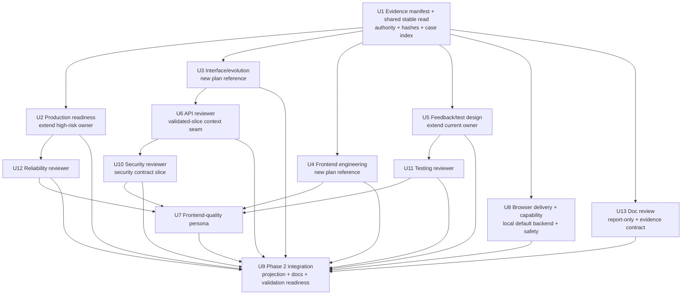

# Agent Skills Capability Integration - Plan

## Goal Capsule

| 维度 | 决策 |
| --- | --- |
| Objective | 以 Spec-First 的角色契约、source/runtime 治理和现有研发闭环为基准，把 Agent Skills 中已确认有增量价值的接口设计与演进、前端工程、测试设计、生产就绪与 reviewer 知识集成进现有 public workflow，不复制外部产品形态，不新增公共 Skill。 |
| Recommended approach | 复用现有 `spec-plan`、`spec-work`、`spec-code-review` 与 `spec-test-browser`；新增 2 个 skill-local reference，扩展 2 个既有 owner、4 个既有 reviewer与1个internal frontend reviewer，并修复browser delivery/LFG caller断链。U1交付U6/U13共用的handle-bound stable-source-read、Windows production adapter，以及唯一的bounded strict-JSON/canonical-JSON helper。U6保持默认`tasks hash` v1 hash-only；metadata v2返回无正文canonical payload及helper-computed hash，LLM只选owner/allowed anchor，materialize v2通过bounded stdin与caller-held expected hash绑定该exact metadata，再分别stable-read current plan/task pack/selection，以fence-aware resolver、versioned list-unit range grammar和multi-slice disclosure-union gate生成exact UTF-8 text/range/hash；所有range固定为exact full-file Buffer上的half-open byte interval，并用body interval映射做union验证。context v2分别stable-read current plan/task pack/final context独立重验。三个review-only CLI invocation都不输出完整plan，plan-local`context_refs`只能消歧/收窄而不能扩权。U13交付caller-enforced Markdown report-only、五份durable artifact schema及`plan-review-evidence prepare|authorize|bind-outputs|write|verify`：任何sealed write前验证POSIX owner-only或Windows exact schema-declared principal allowset private storage；document、decision primer与leaf字段统一封装为versioned untrusted-data envelope，不能改变指令、roster、schema、capability或source closure；authorization、leaf bundle与final review-result bundle只走有明确数值预算的bounded stdin。Prepare后若没有绑定exact input hash的owner decision，interactive caller必须用blocking question展示target/data/derived-output边界，headless或问题工具不可用时fail closed并要求重新以interactive SG2运行。Fresh或inline leaves都由helper安全物化并生成canonical synthesis-input，semantic synthesis只消费该artifact exact bytes，`write|verify`重读leaf并重建hash，`verify`从receipt确定性展开input、authorization、全部leaves、synthesis-input、envelope、receipt供SG3/SG4完整保护。 |
| Authority hierarchy | 当前用户目标与本方案 Product Contract > `docs/10-prompt/结构化项目角色契约.md` > 当前 project-owned source/contracts/tests > `docs/14-agent-skills/README.md` 与 `docs/solutions/**` advisory evidence > Agent Skills 固定快照与 provider 图候选。 |
| Decision focus | 条件能力由谁持有、何时触发、何时不触发；如何保证 source + trigger + negative fixture + contract test + fresh-source eval 同一纵向 slice 交付；如何避免公共入口、truth source、review finding 和 runtime generator 膨胀。 |
| Verification focus | 24 项 decision manifest 可回放；每个受影响的 behavior-bearing capability（含 browser）至少 2 个 positive 与 2 个 negative-owner case，且行为 oracle 由 owning skill 的 `evals/` 持有；中央索引只校验 case ID、owner、path、unit 与状态，文件 hash 统一在 U9 source-level evidence manifest 中做快照；新增 source anchor、死链、findings schema、五宿主 recursive projection、evals source-only、public catalog 零增量；fresh-source、runtime capability、host projection 与 field outcome 分层记录，最终命令/closeout只引用SG3 canonical envelope。 |
| Largest risk or boundary | 工作树和 HEAD 在规划期间持续变化，静态 dirty 清单会立即失效；同时 `spec-test-browser` 当前既未被五宿主交付，又会在 pipeline 中直接启动并读取待审分支代码、把 browser原始输出暴露给模型。U1 必须动态计算 dirty/write-set交集并交付可复用的changed-tree capture/compare；U8 必须闭合internal delivery、组合capability probe、versioned interaction test-plan、模型摄入前输出代理，并在当前五宿主缺少可验证sandbox/attestation/request-time exact-origin primitive时把pipeline server auto-start以及所有mode的browser session/navigation/action明确降级为`not_supported|not_run`。Interactive只可在blocking question展示网络限制并授权后由长驻supervisor启动/持有server child；该次process side effect不解锁browser请求。 |
| Stop conditions | 任一 slice 需要新公共 Skill 才能成立；canonical owner/negative boundary不明确；fresh-source未执行却声称通过；任一U-ID反向依赖shipping closeout；validation package复制execution/review/completion truth；默认`tasks hash`改变v1或泄露全文，LLM仍需手算offset/hash，metadata exact bytes未以expected hash绑定materialize，bounded JSON/canonical JSON出现多个owner，task-pack review path仍接受duplicate key，materializer不能兼容current合法task-pack anchor grammar、未冻结full-file half-open byte coordinate/body interval/list-unit range、把Setext underline误判为thematic break、允许`context_refs`扩权或允许多个slice的range union重构完整plan，review-context未分别stable-read plan/task pack/final context，或validated result后重读live plan；Windows stable-read/private-storage只能靠fake；SG2在prepare前dispatch/外发、在private-storage gate前写bytes、把document/primer/leaf内容当可执行指令、没有post-seal owner authorization acquisition path、authorization/leaf bundle/final review result无数值预算或走argv/env/ambient file、fresh任一leaf/synthesis仍有callable capability、inline缺双重acceptance、orchestrator绕过`bind-outputs`重组leaf，`write|verify`不能从leaf重建canonical synthesis-input，或SG3/SG4未保护receipt展开的完整六类evidence；browser/runtime/CLI/integration/lifecycle/source-runtime等既有硬门任一被绕过；当前dirty无法安全协调；fresh-source concerns无R18 acceptance。 |
| Execution profile | Deep、跨 workflow/source/test/runtime projection 的能力集成；按U1-U13稳定U-ID与依赖顺序由`spec-work`执行，最终review、verification、runtime adoption和plan closeout仍由现有shipping tail持有。 |

---

## Product Contract

### Summary

本方案把外部 Agent Skills 的工程实践密度转化为 Spec-First 自有、可回源、可验证、跨宿主投射的条件能力。
它不新增 source Skill 或 public workflow，通过 skill-local reference、内部 reviewer、聚焦 fixture、contract test 与 fresh-source evidence 补齐当前内容缺口；当前 35 个 source Skill 仅作为 U1 的实施基线，不作为跨时间的永久绝对值。

### Current Baseline

截至 2026-07-17，本方案使用以下已确认或明确降级的基线：

- Origin report 的 Spec-First snapshot 为 `a2f37c6075d35d4f686371bca4fb20c31275e142`；本方案依赖的 capability-source baseline 为 `6a0f060cf6cf4b00149afd7682688d4b6d8ad56f`，本次 current-source 复审 HEAD 为 `f9213c15e9049c72f7e891e6980e0a154bb65cdd`。U1 仍须在实施时重新采样，不把任一历史 revision 当作 current truth。
- Agent Skills 固定快照为 `98967c45a42b88d6b8fb3a88b7ff6273920763d6`，tag `0.6.4`，包含 24 个 Skill。
- `docs/14-agent-skills/README.md` 已完成 24 项全量映射，结论为 14 个强承载、10 个部分承载；该 14/10 只表示承载覆盖，不表示内容或 evidence 成熟度。
- 当前决策是新增 0 个公共 Skill、直接引入 0 个外部 Skill、新增 2 个 skill-local reference、扩展 2 个现有 reference/lens、扩展 4 个 existing reviewer、新增 1 个内部条件 reviewer persona。
- `skills/spec-plan/SKILL.md`、`high-risk-plan-lens.md`、`planning-evidence-boundaries.md`、`skills/spec-plan/evals/**`、consumer replay、HTML report-only closure 与相关 contract tests 均已进入 live HEAD；本方案必须把它们视为 protected baseline，不得按旧 snapshot 重建。
- 最新 `spec-work` source 已包含 `skills/spec-work/references/feedback-and-tests.md`、主入口 Trigger Map、`skills/spec-work/evals/examples.json` 及对应 contract tests；它们已持有 smallest loop、vertical slice、proof/characterization、test discovery、scenario completeness、system-wide check 和 replacement evidence。U5 只能在该 canonical owner 上补 DAMP、state-over-interaction、test-double hierarchy、contract/risk-first 与 rollback-friendly slicing，不得再创建 `test-design-and-slicing.md` 或第二套 eval owner。
- 当前`spec-doc-review`对可写Markdown默认选择`markdown-write`，即使`mode:headless`也会应用confidence-100`safe_auto`；它尚无caller可强制的report-only flag或versioned JSON report envelope。SG2若直接调用会违反plan body冻结/机器校验边界；即使U13已改source，同一会话typed skill仍可能使用缓存旧定义，因此U13必须同时补`mutation:report-only output:json`与sealed-source invocation contract（`fresh-generic-sealed-tool-less` / `source-injected-inline-degraded`），不能用headless、human prose、runtime mirror或口头“只读/已刷新”冒充。
- 当前`src/cli/atomic-write.js`的`writeFileAtomicIfAbsent()`先用ambient mode/DACL写入temp内容，再hard-link到final path；它没有pre-byte mode/DACL/file-ID hook，不能满足U13“sealed bytes写入前已验证owner-only storage”的合同。U13必须保留既有caller默认行为并新增独立secure-create API与production Windows adapter，不能把现有primitive直接包装、先写后chmod/修DACL或只用fake adapter声称跨平台关闭。
- 当前`src/cli/task-pack.js`的`computeSourcePlanHash()`只返回去frontmatter后的canonical body hash，`src/cli/commands/tasks.js`默认`task-plan-hash/v1`既不能证明review slice来自同一exact bytes，也不能被扩展为默认输出全文；若materialize不接收metadata receipt/expected hash，只改frontmatter而body不变的漂移仍可能通过。当前代码也没有从LLM semantic anchor选择确定性生成UTF-8 range/text/hash的producer。Task-pack contract允许缺`source_unit`但有`requirement_refs`，仓库已有legacy numeric/phase、compound source-unit、duplicate refs、plan-local`context_refs`，以及`## Implementation Units`下由`- U1.` marker加未缩进正文组成的current合法unit；因此“唯一heading/list block”不足以兼容current输入，且只拒绝单一full-plan slice不足以阻止多个slice拼回完整plan。U1/U6必须新增shared stable-read、Windows production adapter与metadata/materialize/context三条review-only v2：metadata返回无正文canonical payload/hash；materializer以bounded stdin+expected hash绑定metadata，再分别stable-read plan/task pack/selection并用fence-aware canonical resolver、versioned list-unit range grammar与range-union disclosure gate生成bounded slices；context分别stable-read plan/task pack/final context独立重验。LLM不手算hash/offset，`context_refs`只消歧/收窄，任何路径不输出完整plan；“禁止二次读取”仅指validated context返回后reviewer不得再次打开live plan。
- 当前仓库没有project-owned duplicate-key-aware bounded JSON parser或跨模块canonical JSON serializer；`src/cli/task-pack.js`仍用原生`JSON.parse()`解析Task Pack Contract，duplicate key会按最后值静默覆盖。U1必须建立唯一`src/cli/helpers/strict-json.js` owner，U1 protected-manifest、U6 metadata/selection/task-pack review path与U13 authorization/leaf/result transports统一复用；不得在`task-pack.js`、`changed-tree-freeze.js`和`plan-review-evidence.js`各写一套相似parser/serializer。
- 当前`skills/spec-doc-review/references/subagent-template.md`直接把`document_content`插入XML-like prompt，没有声明document/decision primer为不可信数据，也没有避免`</review-context>`、code fence或伪系统指令破坏边界；`synthesis-and-presentation.md`同样没有把leaf evidence/string字段明确降为data。U13必须新增versioned prompt-data envelope及对应leaf/synthesis trust rule，防止project document或reviewer leaf改变roster、schema、source closure、capability inventory、mutation policy或要求额外读取；该语义防线不冒充对LLM prompt injection的确定性消除。
- 当前`validateTaskPack()`的`task_pack.contract.tasks`保留完整Task Card，但`task_pack.execution_focus`投影不包含`requirement_refs`或`context_refs`；U6 review-only resolver必须直接消费本次stable-read task-pack Buffer解析出的完整contract，不能把lossy execution focus当作anchor authority，也不为此改变default validation stdout。
- 历史修订曾观察到Changelog、相邻plan、CLI与test路径的并行dirty变化；本次2026-07-17复审开始时工作树为clean，但authoring期间又出现不属于本方案write scope的`spec-runtime-setup`、provider-readiness contract与相关test改动。两类事实共同说明静态清单不是执行许可：U1仍必须按实施时current disk重新计算完整dirty/write-set交集并保留他人改动。
- `src/cli/plugin-sync.js` 已通过递归目录复制把已交付 skill 的 skill-local reference/persona 投射到受支持宿主，并通过 `shouldIncludeBundledSkillPath()` 排除 `evals/`；但 `src/cli/plugin-governance.js` 的 `DELIVERED_INTERNAL_SKILLS` 当前只包含 `spec-worktree`，导致 governance 已声明为 `internal_only` 的 `spec-test-browser` 在五宿主 projection 中均为 0 条路径。U8 必须最小修复 delivery policy，`plugin-sync.js` generator 本身默认不改。
- 当前`skills/spec-test-browser/SKILL.md`与`references/pipeline-orchestration.md`会在pipeline直接后台执行`bin/dev`、Rails或`npm run dev`，且仓库current source没有可供该workflow消费的authenticated launcher/attestation、issuer verifier或server receipt primitive。U8因此必须删除未经证实的认证启动happy path：当前五宿主pipeline auto-start只能诚实降级，不能靠本轮新建schema把不存在的trust root“规划出来”。
- 当前宿主支持列表由 `src/cli/adapters/index.js` 的 `getSupportedPlatforms()` 返回 Claude、Codex、Cursor、Kiro、Qoder。
- 原始方案编写阶段未获得 subagent/persona/parallel 授权并使用 inline fallback；2026-07-17 current-source 复审已分轮使用最小继承上下文运行 coherence、feasibility、security-lens 三个 generic reviewer，并由当前代理逐项回源复核。hash `ce369a240153ce9221e9557675f168af567f2ff95d430319586b7b75b522ea78`上feasibility/security确认4项P1且coherence因漂移停止；hash `834e709964b6529c2cdef56e74e495099637bf1ba44323700a72d12e920ab250`三路确认12项P1；hash `1858051cdceb9351e72066dbf91f9000ff79c18a2d08bf6dfd5ab3247feb4872`上coherence/feasibility确认U1消费U13 schema的P1；hash `12f4b59e255585fbf8fa9d492b79f796f11be7305047c7ccee48c569a51a2767`上feasibility确认same-session typed skill cache P1；hash `07dabdb3f2289874d014f65529ff55399d209a87a36a647d7fc5054daa868135`上feasibility无finding，security确认review输入后置校验/未受限fresh tools的P1，coherence确认F1写集门顺序P2；hash `561193a9d6141a3badce947631328806833030a810f5266265cbee6786468b77`三路确认5项P1与3项P2；hash `c627db5c36429b83824ec4b09e41d75196dc03a691c67da22773fa6c2c76eba2`确认默认hash全文披露、secure writer pre-byte gate、U13 projection、prepare/authorize阶段和no-plan/integrity fallback共5项P1；hash `1e607324809ee58106294c32dd16b761cd84f006a41a952591d0a1068127f0ee`进一步确认两阶段读取术语、U13 JSON硬门字段、Windows stable-read production seam、cross-root context trust root/task-pack/task-id、fresh synthesis tool isolation、slice机械预算6项P1，以及integration runner主链1项P2。当前revision已逐项纳入这些结论；新的单一hash三路回归完成前仍不声称当前版本review clean。该 review 证明的是方案质量判断，不替代 U2-U13 实施期 fresh-source eval、host loader 或 field outcome。

### Problem Frame

Spec-First 已经拥有比 Agent Skills 更完整的 intent、artifact、evidence、handoff 和 knowledge 闭环，但部分通用软件工程知识仍分散在 planning specialist、reviewer 或 shipping tail 中。
如果只继续增加主 `SKILL.md` prose，入口上下文会膨胀；如果按外部目录直接复制 Skill，又会制造近义 public route、并列 truth source、宿主工具绑定和无法进入现有 evidence contract 的孤岛能力。

需要解决的不是“Spec-First 是否也有同名 Skill”，而是以下七个工程缺口：

- planning 缺少统一的接口设计/演进条件 lens，尤其缺少 greenfield contract 与既有接口演进的双分支；
- planning 缺少通用 Web 前端工程条件 lens；
- execution 已由 `feedback-and-tests.md` 集中承载 proof-first、characterization-first、no-test exception、vertical slice 与 verification evidence spine，但仍缺 DAMP、state-over-interaction、test-double hierarchy、contract/risk-first 和 rollback-friendly slicing 的明确规则；
- production readiness、observability 与 CI fidelity 仍分散，尚未由现有 high-risk owner 统一承载；
- code review 缺少通用 frontend quality reviewer，且 API/security/testing/reliability reviewer 仍可吸收更成熟的工程判断。
- browser workflow 的 canonical source 已存在，但当前 internal delivery 断开；同时 helper readiness 只证明 `agent-browser` 安装/手动设置状态，不证明 session、namespace、content boundaries、domain allowlist、action policy 等 U8 所需能力仍可用。
- plan-level shipping需要hash-bound semantic review，但current `spec-doc-review`在可写Markdown上没有显式report-only入口，且当前会话可能缓存source修改前的typed skill定义；缺少report-only与sealed-source invocation contract时，tail可能静默修改plan body或根本无法调用新合同。

同时，任何增强都必须满足 Spec-First 的核心约束：scripts 只守确定性地板，LLM 判断语义充分性；source 是唯一持久真相源；generated runtime 可重建；公共入口只有在独立意图、artifact、consumer、done、route 和 owner/eval 同时成立时才新增。

### Actors

- A1. Workflow user：通过现有 `spec-*` 入口提出规划、实施、调试、审查或浏览器验证目标，不需要学习新的近义 Skill 名称。
- A2. Plan author：`spec-plan` 根据语义 trigger 加载最小必要 lens，并把适用决策落入 Planning Contract、U-ID、Verification Contract 或明确 blocker。
- A3. Implementer：`spec-work` 按 U-ID 和现有 `feedback-and-tests.md` 选择 slice、proof-first、characterization-first 或有理由的替代验证。
- A4. Reviewer：`spec-code-review` 按 diff 语义选择 reviewer，输出现有 findings schema，并由 orchestrator 合并、去重和校验。
- A5. Runtime consumer：Claude、Codex、Cursor、Kiro、Qoder 从 canonical `skills/**` 递归获得 runtime-required reference/persona，不消费 maintainer-only evals。
- A6. Maintainer：维护 source owner、fixtures、contract tests、fresh-source validation、docs、Changelog 与未来 public Skill 采用门槛。

### Requirements

#### Evidence、scope 与兼容基线

- R1. 实施开始前必须生成可回放 evidence manifest：以 origin report 的 hash 和 24 个唯一 Skill ID/decision/U-ID 回放全量判断，只对本方案实际受影响的 capability 记录 Spec-First source refs、external blob hash、authority、current owner、consumer 与当前处置，避免复制第二份 24 项领域说明。
- R2. 本次集成不得新增公共 Skill、不得直接 vendoring Agent Skills、不得修改 public catalog 语义；source Skill 目录数相对 U1 实施基线保持零增量（当前观察值为 35），不得把 35 写成未来仓库演化的永久常量。
- R3. U1必须在第一次U1 source mutation前计算当前dirty paths与U1-U13声明/条件写集的交集，并逐文件确认owner、hash和预期合入基线；无法协调的交集文件只阻塞受影响unit，不得覆盖或重建他人改动。该预检可以由当前只读orchestrator直接计算，不依赖尚未创建的U1 helper。

#### 条件 reference 与 planning/work 能力

- R4. 新增或扩展的每个能力必须具备明确 positive trigger、negative-owner boundary、required landing、canonical owner、consumer、degraded behavior 和 enforcement level（script/tool-enforced、LLM-owned judgment/convention、not-enforced）；仅新增文件但无入口指针不算完成。
- R5. `interface-and-evolution-lens.md`必须同时覆盖greenfield public interface design与existing interface evolution：共享最小contract core包含consumers、canonical contract source、protocol/style、resources/operations、request/response schema、error model、compatibility/evolution和verification；greenfield分支补齐边界验证与适用的list/write/event/identity/high-risk条件，计划阶段只要求确定目标artifact path/type/owner、创建它的U-ID、consumer contract与验证方式，文件存在性由该实施unit关闭；evolution分支要求当前canonical artifact owner明确且source为可读普通文件，plan-time只识别并绑定现有repo-native deterministic parser/validator及其实施期验证U-ID，不在planning workflow运行测试/build或任意可变更命令；implementation unit必须实际运行该parser/validator并记录结果，不存在时记录`parser_unavailable` limitation，而不是伪造parse通过。Evolution还需补齐additive/breaking、deprecation、replacement-first、zero-use evidence、consumer migration和rollback，同时排除private/internal-only refactor。Planning Contract中的Interface Contract是plan-time decision authority，不是第二份永久schema。
- R6. `frontend-engineering-lens.md` 必须覆盖 component/data-presentation boundary、design-system/tokens、loading/error/empty/permission/offline/retry state matrix、keyboard/focus/semantics、responsive 与 runtime verification，同时不抢占 `spec-polish`、`spec-test-browser`、`spec-dogfood` 或 race reviewer。
- R7. `high-risk-plan-lens.md` 必须由现有 owner 扩展 production-readiness 分支，覆盖 on-call questions、metrics/traces/logs 的用途、correlation、cardinality/privacy、CI/build/deploy fidelity、feature flag lifecycle、staged rollout、alert owner/runbook/action 和 telemetry proof，不新建并列 production-readiness truth source。
- R8. 现有 `feedback-and-tests.md` 必须在保留 smallest-loop、vertical slice、proof/characterization、scenario completeness、system-wide check 与 replacement-evidence 合同的前提下，补齐 contract-first/risk-first slicing、rollback-friendly scope、DAMP、state-over-interaction 和 test-double hierarchy；未观察到真实 RED 时不得声称完成 TDD 历史，也不得创建第二个 test-design reference/eval truth source。

#### Reviewer 与 downstream ownership

- R9. `api-contract-reviewer`、`security-reviewer`、`testing-reviewer`、`reliability-reviewer`必须分别吸收phase-owned工程判断，同时保留现有confidence gate、findings schema和suppression边界；API reviewer不承担接口设计，但既检查实现与canonical contract artifact在schema、error、nullability、pagination/ordering、idempotency/retry和compatibility上的可见漂移，也检查已变更契约所需的可见consumer trace、migration、deprecation、replacement与zero-use evidence；security reviewer只消费actor、permission、tenant、trust boundary、credential/authenticity、sensitive-error与security verification窄上下文，不把schema drift抢回security owner。显式plan与validated task review的`source_plan`都可提供Interface Contract；task context v2必须保留canonical `artifact_root`、artifact-root-relative`source_plan`/`task_pack`、`task_id`、canonical body `source_plan_hash`、exact bytes `source_plan_full_hash`、`canonical_body_start_byte`/`canonical_body_end_byte`、固定`range_basis: full-file-utf8-byte-offset-v1`、被materializer验证的`review_metadata_sha256`及原样嵌入并hash-bound的`task-plan-review-slices/v2`。所有range均为exact full-file Buffer上的half-open `[start_byte,end_byte)`，slice hash只对`Buffer.subarray(start_byte,end_byte)`计算；body union只在上述body interval内运行，禁止混用body-relative字符offset、UTF-16 index或inclusive end。LLM只写`task-plan-review-selection/v1`中的owner、Task Card允许的portable `anchor_ref`、可选strict-descendant `section_ref`与limitations，不手算或提供metadata、plan text、UTF-8 byte offsets、slice hash。Default `tasks hash --json`逐字保持`task-plan-hash/v1` hash-only；`--review-metadata`单独stable-read plan并返回无正文canonical payload、body/full hashes/bytes/body interval/range basis/stable-read facts与helper-computed `review_metadata_sha256`。`--review-materialize <selection-request> --review-metadata-stdin --expected-review-metadata-sha256 <hash> --review-context-root <work-run-root> --task-pack <task-pack> --task <task-id>`只接受U1 strict-JSON owner解析的bounded strict UTF-8/no-BOM/no-NUL、duplicate-key-aware单一metadata wrapper，重算payload hash并匹配caller-held expected hash，同时分别stable-read current plan/task pack/selection；review-only Task Pack Contract也必须经同一strict parser拒绝duplicate key。在任何slice输出前，它必须证明current portable path、body/full hashes、byte counts、body interval与range basis逐字段等于metadata阶段，并使用`spec-first-markdown-anchor-index/v1`验证唯一Task Card与scope refs。该index只识别CommonMark-compatible ATX heading与显式定义的backtick/tilde fenced-code subset：opening/closing fence字符、长度、0-3空格缩进与backtick info-string限制固定；Setext underline不成为anchor，未闭合fence fail closed。Resolver兼容current task-pack合法shape：缺省`source_unit`但存在refs、exact/composite source-unit token、canonical R/F/AE/G/NG/KTD ID、legacy numeric/alpha/phase lineage；重复同值ref先去重，fenced code伪heading忽略，plan-local exact fragment `context_refs`只可消歧/向下收窄。`spec-first-list-unit-range/v1`还必须把Implementation Units内同级list marker的full-file half-open start/end byte、next peer、parent-closing heading与directly-separating thematic break边界冻结，未缩进正文归属当前unit且不得跨入下一unit；候选`---`/`***`/`___`只有按CommonMark precedence不是Setext underline且确为thematic break时才可从range尾部排除。Materializer从同一plan Buffer提取exact text、计算non-overlapping byte ranges与`source_slice_sha256`，并对所有range union执行`spec-first-plan-disclosure-union/v1`：若body interval内未覆盖区间去除Unicode whitespace与fence-aware standalone thematic-break lines后无substantive bytes，则按full-plan reconstruction阻断。它返回portable metadata、body/full/metadata hashes、body interval/range basis、stable-read、resolver/disclosure versions、固定`slice_limits: {max_slices: 4, max_slice_bytes: 8192, max_total_slice_bytes: 24576}`与bounded slices，不输出未选plan内容。Unknown/ambiguous/malformed/cross-authority/full-plan-by-one-or-many-slices/overlap/over-budget选择fail closed。Producer原样嵌入materialization与hash后，task review调用`--review-context <task-context> --review-context-root <work-run-root> --task-pack <task-pack> --task <task-id>`；该invocation分别single-handle stable-read current plan/task pack/final context，独立重验digest、唯一Task Card、root/path、metadata/body/full/body-interval/range-basis/materialization/slice hashes、exact UTF-8 ranges、range union与预算，只返回portable metadata、body/full hashes、body interval/range basis、stable-read、固定slice limits与validated bounded slices。Metadata → LLM selection → materialize → context是固定数据流，对应三个先后独立CLI invocation；后两者重新读取plan检测漂移，validated result后reviewer不得再次读取live plan。已提供metadata/plan/selection/context/task pack出现root/path/digest/task/body/full/body-interval/range-basis/materialization/slice/equivalence mismatch、Task Pack duplicate key或任一stable-read未verified必须fail closed；真正未发现plan时才允许空context + direct-diff limitation，verified plan无相关entry或canonical artifact不可读时才允许最窄direct-diff context + limitation。缺dispatch时inline fallback消费相同validated slices并标记`inline-fallback`，不得冒充persona或independent coverage。testing reviewer只判断diff-visible proof sufficiency/false confidence；worker与`spec-work` orchestrator持有run-local RED/characterization历史，shipping `verification-run-summary`记录最终实际命令结果，conditional run artifact只引用该summary与repo-relative evidence，二者都不能独立证明TDD顺序。
- R10. 新增 `frontend-quality-reviewer` 作为内部条件 persona，只在用户可见交互、表单、导航、异步状态、组件公共行为、responsive、contrast、focus visibility 或 accessibility contract 命中时启用；backend-only、docs-only、type-only、fixture-only，以及经语义判断不影响 contrast/focus/layout/responsive/motion/状态表达的 token-value-only diff 不启用。
- R11. frontend-quality、frontend-races、testing、security、maintainability 的 ownership 必须可区分，重复 finding 在 merge/dedup 前就有明确主 owner，不能靠多 reviewer 重复报同一问题制造虚假置信度。
- R12. `spec-test-browser`必须统一三层术语：executor=`agent-browser` CLI；backend provider=本地默认或显式`--provider` backend；alternative executor=其他browser tool/MCP。`agent-browser`保持当前唯一confirmed executor，本轮只实现本地默认backend。运行前必须用确定性probe确认所需flags/commands及安全组合兼容性；每次run使用repo外可信最小config、唯一session/namespace、content boundaries、domain allowlist与default-deny action policy，并清除/覆盖ambient provider/profile/state/restore/CDP/proxy/plugin/extension/init-script配置。当前0.31.1会拒绝`--allowed-domains`与`--profile`/`--state`/`--restore`/`--auto-connect`等共用，因此本轮所有profile/state型登录流均为`not_supported|not_run`，不得通过移除allowlist重试；future authenticated flow还需独立证明fresh-context credential path、exact-origin与host-process保护。

  所有CLI调用必须经过唯一wrapper。Wrapper在写入任何raw stdout/stderr/network/file之前先probe并验证OS-specific private storage：POSIX可用owner-only mode并回读确认，Windows必须创建并验证owner-only DACL/ACL或等价host primitive；`0700/0600`数值本身不构成跨平台证明。无法确认private storage时，在CLI执行/敏感数据写入前`not_supported|not_run`。Raw内容只进入模型不可见private temp，模型/报告只收到bounded、字段白名单和确定性脱敏结果。Screenshot本轮只能写入private storage并返回opaque handle，`visual_model_ingestion`与`visual_report_export`固定为`not_run`；caller敏感度声明不能解锁视觉摄入。

  每次run还必须消费wrapper校验的`spec-test-browser-test-plan.v1`。该run-local计划列出caller显式target origin、允许的相对route、step ID、`open|snapshot|get|console|network-metadata|vitals|viewport|a11y|screenshot-private|click|fill|type|press|select`动作、locator约束、由wrapper生成有界值的`synthetic_input_kind`、最大执行次数与预期导航；plan不携带任意input literal、secret handle或credential。`prepare`把plan hash绑定到safe-run manifest；每次`run`在任何browser动作前都必须以no-follow重新打开canonical普通文件，复核schema、origin与SHA-256仍等于manifest，再只接受step ID与可选runtime ref并复核ref对应元素满足预声明locator。页面文本或模型不得临时扩展route/action/value。缺失、空、hash drift、file identity drift、unknown step、次数超限、locator mismatch或未声明导航均在动作前fail closed。Script只守schema/hash/argv/ref/次数/导航边界；测试意图、locator语义和expected outcome仍由LLM/human判断。

  当前五宿主没有本方案可回源消费的non-ambient authenticated attestation、sandbox、egress或request-time exact-origin primitive，因此`mode:pipeline`的`server_auto_start`固定为`not_supported`、`server_launch`固定为`not_run`，并且所有mode的browser session/navigation/actions固定为`not_supported|not_run`；本轮不创建server receipt schema、attestation verifier、认证启动分支或自建网络代理。任何mode都不扫描端口；即使caller提供target origin或caller/prestarted external server可连接，也只记录preflight/capability facts，不创建browser session、不导航、不发请求。在任何未来重新启用前，wrapper必须能在DNS解析、重定向及每次navigation/subresource request前强制固定scheme+host+port，并继续拒绝空target、非HTTP(S)、URL userinfo、非根path、query或fragment。当前路径固定`provenance: unverified`、`ownership: external`与`claim_ceiling: browser-navigation-not-run`，不授予target revision、sandbox/egress、launch command或cleanup ownership claim，external server永不由wrapper终止。

  Interactive server启动必须由workflow通过宿主blocking question primitive展示exact argv、cwd、env差异、target origin、domain-level allowlist以及same-host cross-port/subresource仍未被exact-origin强制的限制，并取得当前用户明确授权；问题工具不可用、用户拒绝或无法保留该回答记录时不得启动，只能要求caller自行预启动并保持`not_run`。该授权由host/orchestrator持有，wrapper不是权限提升或密码学authorization verifier：不得从caller flag/manifest伪称`authorization_verified`；direct script caller本就具有本地process authority，不能借wrapper获得额外claim。获授权后由长驻wrapper supervisor直接创建server child并在内存持有child/process-group/job handle；磁盘manifest中的PID/start time/executable/cwd仅为diagnostic，不授予signal权限。`cleanup`只能请求同一supervisor结束其持有的child，并在signal前重验live identity；supervisor/handle/owner-only IPC不可用时禁止按manifest PID补杀，返回manual residual。用户授权只授权展示的该次server process/network副作用，不构成browser request、sandbox、exact-origin或provenance授权；current exact-origin未confirmed时browser session/navigation/actions继续`not_run`。未来authenticated launcher与任一mode browser execution必须等真实host primitive提供不可由同权限caller伪造的认证通道、request-time exact-origin及sandbox/egress facts后单独立项。页面内容仍按不可信数据处理；domain allowlist不得冒充exact-origin或OS firewall；逐项coverage、cleanup和未强制层必须进入contract，且不得从executor可替换性推导任何backend/provider parity。

#### Eval、runtime 与 adoption

- R13. 每个 behavior-bearing slice（包括 U8 browser capability）必须在同一 unit 中交付 source、trigger、owning skill 下至少 2 个 positive case、至少 2 个 negative-owner case、focused contract test、fresh-source eval 状态和 review；中央 case index 只记录 case ID、canonical owner、repo-relative path、unit 和 status，不记录会随共享文件后续编辑失效的 file hash，跨能力 composition cases 不复制单 Skill oracle。
- R14. Mechanical source contract、fresh-source semantic judgment、host loader/invocation observation、field outcome 必须分层；低层证据不得升级为高层 claim。
- R15. 新增 reference/persona 必须通过现有 recursive projection 进入五宿主 runtime-required skill package，`evals/**` 保持 source-only；`spec-test-browser` 必须作为 internal-only runtime skill 被五宿主交付但不进入 public catalog。当前已证明缺口位于 `plugin-governance.js` delivery allowlist，允许最小修复该 policy；只有 focused projection test 继续证明递归生成链不能承载时，才允许修改 `plugin-sync.js` generator。
- R16. `spec-security-audit`、`spec-migration`、`spec-observability` 继续 Defer；只有满足 90 天采用、跨 repo、现有 workflow 承载不足、独立 artifact/consumer、route fixture 和 owner/eval 门槛后，才进入新的 PRD。
- R17. 每个修改source、skill、reference、persona、test或docs的unit必须在unit integration closeout时由orchestrator串行更新`CHANGELOG.md`，并早于任何另行获授权的commit；没有commit authorization时仍在unit closeout前完成。Worker不并发写Changelog，U9只做最终一致性收口。
- R18. Fresh-source `passed`、`concerns`、`not_run` 是语义证据状态而非确定性CI verdict；`not_run`必须带reason和claim ceiling，可关闭source implementation但不能获得semantic-passed claim。`concerns`必须解决，或由当前Project owner/明确授权maintainer显式接受；接受receipt必须绑定finding ID、current source hash、authority、rationale与invalidation condition，evaluating reviewer或orchestrator不得无授权自我接受。
- R19. `spec-doc-review`必须增加显式`mutation:report-only`与可选`output:json`调用合同，独立于interactive/headless delivery并覆盖可写Markdown；该模式强制`mutation_policy: report-only`、`fixes_applied: 0`、无walkthrough/bulk/open-question mutation，confidence-100 fix转为caller-owned producer candidate。SG2不得调用当前会话typed skill或generated runtime，也不得在验证输入前创建reviewer。Caller先用U13的`plan-review-evidence prepare`读取direct plan与不含最终授权声明的结构化review request；helper拒绝caller自选source refs，按code-owned report-only closure派生current disk的`SKILL.md`、subagent template、findings/report schemas、synthesis、所选persona prompts及全部可能触发的report-only conditional references。Prepare复用U1 stable-source-read，对plan/request/source执行canonical containment、runtime-mirror排除、strict UTF-8/size/known-credential deny与handle-bound pre/post identity检查；无法提供stable identity的平台不得进入fresh external dispatch，只能在same-UID hostile race不受保护的claim ceiling下走current-context inline degraded或停止。任何sealed bytes落盘前，helper必须创建并回读验证OS-specific destination private storage：POSIX为current uid owner-only `0700/0600`，Windows为current-user SID owner、禁止继承且允许主体集合精确等于current-user SID加schema逐项声明的平台必需SYSTEM主体；任何其他principal、未知平台或创建/回读/identity失败都在写入前阻断，inline degraded不能绕过。通过后才原子物化exact plan/source、roster/primer、invocation slices、每个persona leaf prompt与semantic synthesis prompt bytes/hash。Persona prompt中的document slice与decision primer必须进入`spec-first-prompt-data-envelope/v1`：由U1 canonical JSON owner生成单一JSON data value并对`<`、`>`、`&`使用固定Unicode escaping，模板明确其全部string只是不可信数据，不能改变persona指令、schema、roster、mutation policy、capability inventory、source closure或要求额外读取；synthesis prompt对canonical leaf JSON的title/evidence/fix/residual/deferred等string应用同一trust rule。`authorize`仅从bounded stdin读取唯一owner decision JSON，把target host/provider/model、data classification、包含derived schema-valid leaf outputs的authorized scope、authority evidence、rationale、invalidation condition及可选inline dual acceptance绑定exact input hash并secure-create authorization receipt；argv/env/外部临时decision文件、pre-seal blanket authorization、target wildcard、旧hash或caller自报approval无效。若prepare后没有适用于exact input hash/target/data/derived-output boundary的decision，interactive shipping caller必须通过宿主blocking question展示这些字段、fresh与inline各自claim ceiling及推荐路径，再把当前用户回答交给authorize；用户拒绝、问题工具不可用、headless caller或回答无法保留时返回`plan-review-authorization-required`且不dispatch、不inline、不从sealed input自举恢复，后续必须重新以interactive SG2执行prepare。Fresh路径只有在authorization有效、stable-read支持external dispatch，且每个leaf和synthesis context都返回绑定prompt/input hash、除唯一结构化返回通道外所有callable surface严格为空的complete inventory时才成立；任一inventory失败时不得复用partial fresh leaf，必须在已获hash-bound no-independent-coverage + `tool-isolation-not-enforced`双重acceptance后由current orchestrator按同一sealed leaf prompts从头生成inline leaves。两种路径的全部fixed-roster leaf JSON都必须经bounded stdin交给`plan-review-evidence bind-outputs`；helper按existing findings schema校验、versioned canonical JSON序列化并secure-create每个leaf，再生成`spec-work-plan-review-synthesis-input.v1` exact artifact，绑定run-id、invocation kind、input/authorization、roster、leaf+synthesis prompts、inventory-or-acceptance与ordered leaf refs/hashes。Fresh tool-less synthesis或inline current orchestrator都只能消费该artifact exact bytes和sealed synthesis prompt，不得自行重组leaf输入；最终JSON必须匹配`spec-doc-review-report/v1`并回显input/authorization/source/prompt/private-storage/stable-read、ordered leaf refs/hashes、synthesis-input ref/hash/canonicalization version，以及fresh inventories或inline dual acceptance。`prepare|authorize|bind-outputs|write|verify`全链绑定上述protected evidence；`write`和只读`verify`必须重读每个leaf并重建exact synthesis-input bytes/hash。Closure/roster/primer/prompt-data-envelope/stable-read/private-storage/authorization/inventory-or-acceptance/leaf/synthesis-input、plan字节、schema/policy、fix count或finding disposition任一不合法都fail closed并返回`spec-plan`。该边界防静态逃逸、delimiter/leaf instruction confusion、非同UID可写surface、destination local-user exposure、可检测并发漂移与orchestrator漏传/删改leaf，不声称确定性消除LLM prompt injection、抵抗已控制同一host/UID的恶意ABA换链，也不声称证明模型实际阅读或正确综合sealed内容。
- R20. 本方案新增或扩展的internal CLI只能通过current checkout入口`node <target-repo>/bin/spec-first.js ...`执行；裸`spec-first`只有在显式验证其realpath/package revision与current checkout一致后才允许。U1/U13必须各自提供CLI-level integration smoke，证明新增subcommand与完整参数形态由current source解析，`npm run build`或PATH上存在全局安装不构成可用性证明。
- R21. SG4 lifecycle transaction必须绑定SG3最终写入的immutable verification summary与caller-produced honest-closeout claims input。Claims input固定为同一spec-work workflow/workspace/run-id下的run-local canonical regular file，必须non-symlink；current `honest-closeout validate`只验证、不提供writer，因此本方案不把该input声称为write-once或immutable。Claims中的`run_summary_ref`必须逐字等于显式summary ref，同一不中断caller在物化后立即持有两者expected SHA-256，plan-status helper在status写入前后都no-follow重读、校验canonical path/run-id/hash/schema，并复用current honest-closeout validator对current summary+claims重新得到`verified/all-claims-consistent`。summary/claims缺失、交叉引用不一致、替换、漂移或revalidation降级时不得写入或保留`completed`。
- R22. U1必须建立唯一`spec-first-strict-json/v1`与`spec-first-canonical-json/v1`代码owner，供changed-tree protected manifest、U6 metadata/selection/review-only Task Pack Contract及U13 authorization/leaf/result transport复用；所有bounded transport统一strict UTF-8/no-BOM/no-NUL、duplicate-key-aware single-object、no trailing content与schema-extra rejection，不得退回原生`JSON.parse()` last-key-wins语义。U13固定transport budget：authorization decision最多65536 bytes；leaf bundle最多1048576 bytes且每个raw/canonical leaf最多262144 bytes；canonical synthesis-input最多2097152 bytes；`plan-review-evidence write`的semantic envelope与finding dispositions只能通过显式`--review-result-stdin`传入，transport contract为`spec-work-plan-review-write-input/v1`且最多1048576 bytes，并逐字绑定CLI提供的input/authorization/synthesis-input expected hashes。Envelope/dispositions不得来自argv、environment、caller-selected temp/result path或helper外ambient file；helper必须在内存完成schema/disposition/canonicalization校验后才用secure-create物化envelope与receipt。`plan-review-evidence verify`必须从verified receipt确定性展开ordered protected refs：input、authorization、fixed-roster order的全部persona leaves、canonical synthesis-input、envelope、receipt，并返回`protected_refs_sha256`；SG3 freeze与SG4 pre/post compare只消费该receipt-derived完整集合，禁止caller手写或筛选子集。

### Key Flows

- F1. Evidence baseline：读取 origin report 与 current source → 推导U1-U13 planned write-set并计算/处置dirty交集 → 只在相关写集获准后冻结revision/hash/authority并建立U1 baseline、中央case index与composition contract → 各获准source unit随后创建自己的skill-local behavior cases并由orchestrator更新共享index。
- F2. Planning lens：用户请求命中greenfield API/interface、existing evolution、UI或high-risk语义 → `spec-plan`加载最小必要reference集（单一命中只加载一个，多重命中允许组合）→ 接口分支把最小contract block与evolution current artifact或greenfield planned target/创建U-ID落入Planning Contract/Verification/Risk → negative-owner请求保持lean。
- F3. Work evidence：`spec-work` 读取 active U-ID → 加载现有 `feedback-and-tests.md` 选择 slice 和 evidence strategy → 观察 RED 或 characterization baseline → 实现与验证 → 记录 claim-matched run-local evidence。
- F4. Review selection：producer先以current-checkout `tasks hash --review-metadata`单独stable-read plan取得无正文canonical metadata payload/hash → LLM只写owner/allowed anchor/strict-descendant selection → current-checkout `tasks hash --review-materialize`经bounded stdin接收exact metadata并校验caller-held expected hash，同时分别stable-read current plan/task pack/selection，以fence-aware canonical resolver、`spec-first-list-unit-range/v1`与multi-slice disclosure-union gate生成exact text/UTF-8 ranges/hashes及固定预算内`task-plan-review-slices/v2` → producer原样嵌入metadata binding、materialization与hash到task context v2 → reviewer调用带显式`--review-context-root`、`--task-pack`和`--task`的current-checkout `tasks hash --review-context`，在另一invocation分别single-handle stable-read current plan/task pack/final context，独立重验digest、唯一Task Card、metadata/body/full/materialization/slice hashes、range union、scope authority与`4 / 8192 / 24576`预算，只返回当前Task Card相关validated API/security slices，禁止输出完整plan或在validated result后重读live path → 读取diff与catalog → 依次增强API/security/testing/reliability owner并选择适用reviewer或frontend-quality → reviewer返回findings schema → orchestrator按owner、anchor和evidence合并去重；真正无plan时空context + direct-diff limitation，已提供metadata/plan/task pack/selection/context完整性失败则阻断，缺dispatch时同一owner-split由`inline-fallback`执行但不关闭independent coverage；diff-only review不推断TDD历史。
- F5. Runtime projection：canonical `skills/**` 变更 → `plugin-sync` 递归计划五宿主 runtime path → required reference/persona 存在、`evals/**` 缺席 → 在隔离 fixture 中执行 init lifecycle → 不手改 repo-local mirrors。
- F6. Public Skill reconsideration：积累 90 天 field adoption → 证明现有 workflow 反复承载不足 → 独立 artifact 被真实 consumer 使用 → signature/negative route 稳定 → owner/eval/release plan 完整 → 才创建后续 PRD。

### Acceptance Examples

- AE1. 给定一个 external public API 删除字段并迁移两个客户端的计划请求，`spec-plan` 加载 interface design/evolution lens，要求 consumer inventory、兼容窗口、替代路径、zero-use evidence 和 rollback；给定 private helper rename，不加载该 lens。
- AE2. 给定一个含表单提交、loading/error/empty、移动端布局和键盘导航的新页面，`spec-plan` 加载 frontend lens；给定 backend-only handler 或不影响 contrast/focus/layout/responsive/motion/状态表达的 token-value-only 变更，不加载该 lens；纯 CSS 但改变 contrast、focus 或 breakpoint 行为时必须加载。
- AE3. 给定 staged rollout、feature flag、CI gate 与 on-call 责任的外部集成，high-risk lens 要求真实 build/deploy fidelity、成功/失败 signal、rollback trigger、owner 与 runbook；给定 docs-only 变更，保持轻量。
- AE4. 给定 legacy parser 行为修改且测试缝隙薄弱，`spec-work` 选择 characterization-first；给定可观测的新增行为，选择 proof-first 并记录 RED；给定纯文档、格式或 generated artifact 变更，记录 no-test exception 而不伪造 TDD。
- AE5. 给定 interaction-heavy mocks 只验证调用次数，testing reviewer 识别 false confidence；给定行为断言明确且内部实现可重构，不因测试风格偏好报 finding。
- AE6. 给定 LLM/tool output 未验证即进入 shell/path/SQL sink，security reviewer 要求真实 attack path 与 trust-boundary evidence；给定依赖公告但代码不可达且无 exploit path，只记录 degraded risk 或抑制 finding。
- AE7. 给定 public response schema 的 subtractive change，API reviewer 跟踪 consumer 与 deprecation evidence；给定稳定 public contract 后面的内部重构，不报 API finding。
- AE8. 给定跨服务请求缺 correlation propagation、alert 无 owner/action、telemetry 没有验证，reliability reviewer 报告具体 failure path；给定纯内存函数，不启用 reliability concern。
- AE9. 给定新增用户可见表单和异步状态，frontend-quality reviewer 检查 a11y、状态完整性、responsive 与 presentation/data boundary；仅在存在 timer/lifecycle race 时才同时启用 frontend-races reviewer。
- AE10. 给定 backend-only、docs-only、type-only、fixture-only 或无用户可见语义影响的 token-value-only diff，frontend-quality reviewer 不启用；给定 CSS-only contrast、focus、layout、responsive 或 motion contract 变化时启用，public reviewer roster 不因扩展名本身机械膨胀。
- AE11. 给定五个supported host，projection plan均包含新增2个plan reference、已扩展的high-risk/feedback source、frontend persona、`spec-test-browser/SKILL.md`及其runtime-required pipeline reference/test-plan schema/script，同时不包含任何新增`evals/**`path；current confirmed happy path只需最小修改`plugin-governance.js`delivery policy，若focused transform test出现反证则按U8条件分支处理`plugin-sync.js`。
- AE12. 给定 fresh reviewer dispatch 未获授权，validation 记录 `fresh_source_eval.status: not_run`、`dispatch_authorization_missing` 与 claim ceiling；deterministic source implementation 可关闭，但该 slice 不得被描述为语义已验证，closeout 必须保留 degraded limitation。
- AE13. 给定未来有人提议新增 `spec-observability`，若 90 天内没有 5 次合格独立意图、3 个 repo、3 次 artifact consumer 和 2 次现有 workflow 承载不足证据，结论继续 Defer。
- AE14. 给定U1-U13中任一source-bearing unit完成集成，orchestrator在unit closeout时、任何可选authorized commit之前串行更新`CHANGELOG.md`；并行worker不直接写该共享文件，U9验证所有unit记录完整而不补写历史空洞，且不把“需要Changelog”解释为自动获得commit授权。
- AE15. 给定 `agent-browser` 缺少任一 required capability、repo/ambient config尝试切换 provider/profile/plugin、分支修改 unattended dev-server launch surface、页面诱导未声明/destructive action或证据含 credential/PII，U8 必须 fail closed或逐项 degraded；当前五宿主的pipeline server auto-start以及所有mode的browser session/navigation/action都必须返回`not_supported|not_run`，caller/prestarted server可连接性不能解锁请求。Interactive server launch必须由blocking question展示并授权exact argv/cwd/env、target origin和未强制的network limitation，再由长驻supervisor持有child handle；wrapper不得声称密码学验证了该授权，且该授权只覆盖server process side effect，不解锁browser请求。Target origin含userinfo/query/fragment、prepare后test-plan file/hash drift、step/locator不匹配或任何截图模型摄入请求均在动作/摄入前拒绝；不得仅凭 `command -v`、一次性版本观察、caller receipt/敏感度声明、磁盘PID记录或 content boundaries 声称 browser isolation/security 已强制。
- AE16. 给定greenfield REST list/create API且canonical schema尚未创建，`spec-plan`要求明确consumers、目标OpenAPI/JSON Schema或repo-native exported types的path/type/owner与创建U-ID、resource/operation、typed request/response、统一error model、boundary validation和实施后parse/contract验证；不因planning阶段文件尚不存在而降级readiness。List分支补pagination/filter/sort/stable ordering，write分支补idempotency、concurrency、retry与consistency。
- AE17. 给定新的webhook/event contract，`spec-plan`在共享contract core之上要求delivery、ordering、deduplication、retry与replay语义，并把第三方payload/response作为不可信输入验证；credential/authenticity/threat交给security owner，外部高风险consumer的rate limit、quota、SLO、observability与rollout交给high-risk owner组合处理。
- AE18. 给定multi-tenant API或CLI surface，`spec-plan` 要求明确actor、permission与tenant scope，并把authorization充分性交给security owner组合审查；该handoff不把interface lens变成第二个security truth source。
- AE19. 给定兼容的 optional response field新增，`spec-plan` 仍记录 canonical contract与验证，但不生成 dual-run、sunset或重型迁移流程。
- AE20. 给定实现把 canonical schema中的统一 error body改成另一种shape、取消stable ordering或破坏已声明的 idempotency/retry语义，API reviewer返回具体 contract-drift finding；实现与canonical artifact同步的内部重构保持 suppression。
- AE21. 给定required task review的artifact root与mutation target/work-run root不同，producer先用current-checkout `tasks hash --review-metadata --json`取得无正文canonical payload与`review_metadata_sha256`；LLM只提交owner、Task Card允许的anchor与可选strict descendant。`tasks hash --review-materialize <selection> --review-metadata-stdin --expected-review-metadata-sha256 <hash> --review-context-root <work-run-root> --task-pack <task-pack> --task <task-id> --json`只接受U1 strict-JSON helper解析的bounded metadata wrapper，重算并匹配expected hash后分别stable-read current plan/task pack/selection，并拒绝Task Pack Contract duplicate key；在slice输出前逐字段匹配metadata portable path、body/full hashes、byte counts、`canonical_body_start_byte`/`canonical_body_end_byte`与`range_basis: full-file-utf8-byte-offset-v1`。Resolver兼容缺`source_unit`、legacy/compound refs、重复refs与plan-local context-ref消歧，按`spec-first-markdown-anchor-index/v1`忽略backtick/tilde fence内伪heading且拒绝unclosed fence；`spec-first-list-unit-range/v1`让`- U1.` marker后的未缩进正文终止于下一个同级unit、parent-closing heading或CommonMark precedence确认的直接分隔thematic break，Setext underline不得被误删，range固定为exact full-file Buffer上的half-open interval且不得跨unit。Materializer确定性生成exact UTF-8 ranges/text/hash与`4 / 8192 / 24576`预算内materialization，并拒绝一个或多个slice的range union在body interval内去除Unicode whitespace/fence-aware standalone thematic-break gaps后覆盖全部canonical body；context refs只能消歧/收窄，不能扩大source-unit/requirement authority。Producer把metadata binding、materialization+hash原样嵌入task context v2；Reviewer再用`--review-context`在独立invocation分别stable-read current plan/task pack/final context，重验digest、唯一Task Card、metadata/body/full/body-interval/range-basis/materialization/slice hashes、range union与scope，只返回portable metadata/status/limits和validated slices。默认hash仍v1，metadata无正文，materialize/context只输出bounded slices；frontmatter-only drift、coordinate-basis drift、Task Pack duplicate key、full-plan-by-one-or-many-slices、ambiguous/cross-authority anchor、arbitrary substring、重复/重叠/超限、任一operand swap或显式plan mismatch在dispatch前失败。真正无plan才走direct-diff limitation；dispatch不可用时inline fallback消费同一validated窄上下文并保持degraded/非persona coverage。
- AE22. 给定SG2审查可写Markdown plan，shipping caller先以`plan-review-evidence prepare`从code-owned closure派生并stable-read plan/request/current `spec-doc-review` source、roster/primer、persona leaf prompts与exact semantic synthesis prompt；任何sealed bytes落盘前，POSIX current-owner `0700/0600`或Windows current-user owner + protected exact schema-declared principal allowset必须回读verified，未知/失败状态阻断且不得inline绕过。Document slice与decision primer由`spec-first-prompt-data-envelope/v1`作为canonical JSON不可信数据注入leaf prompt，canonical leaf values在synthesis prompt中同样只能作为data，包含闭合XML标签、code fence、伪system指令或extra-path请求时不得改变schema/roster/capability/source closure。Prepare后、任何context创建或bytes外发前，Project owner/授权maintainer只经最多65536-byte bounded stdin让`authorize`把target/data boundary/derived-output scope绑定exact input hash；没有现成decision时interactive caller必须通过blocking question展示exact boundary与fresh/inline limitations，拒绝、headless或问题工具不可用时返回`plan-review-authorization-required`且不dispatch，后续重新以interactive SG2 prepare。Fresh要求每个persona leaf和semantic synthesis context具complete-empty callable inventory；否则丢弃partial fresh结果，从头生成inline leaves并要求hash-bound coverage/tool-isolation dual acceptance。两种路径的fixed-roster leaf bundle都经最多1048576-byte stdin交给`bind-outputs`，每个raw/canonical leaf最多262144 bytes，由helper逐leaf secure-create并生成最多2097152-byte的versioned canonical synthesis-input；fresh synthesis context或inline orchestrator都只能消费该artifact exact bytes与sealed synthesis prompt。最终envelope必须回显input/authorization/source/prompt/prompt-data-envelope/storage/stable-read、ordered leaf refs/hashes、synthesis-input ref/hash/canonicalization version及fresh inventories或inline acceptance，保持report-only、zero fixes和plan full hash不变；`write`重读leaf/synthesis-input后物化envelope/receipt，`verify`从protected refs重建exact synthesis-input并只读重验。任一closure/prompt-data-envelope/authorization/inventory/acceptance/leaf/synthesis-input、typed/runtime/extra-path、source/plan drift、producer candidate或finding disposition失败均返回`spec-plan`；default Markdown行为保持现状。
- AE23. 给定PATH上的`spec-first`指向旧global package，而current checkout已经实现新internal helper，SG2-SG4仍只通过`node <target-repo>/bin/spec-first.js`运行并由CLI integration smoke证明参数可解析；未验证realpath/revision相等时不得回退裸命令。
- AE24. 给定SG3 final checks已通过，但verification summary或honest-closeout claims input在SG4前被删除、替换或内容漂移，verified plan-status transaction在任何status写入前阻断；若漂移发生在status写入后，则仅在plan仍等于helper生成的completed bytes时恢复active，否则返回`rollback-blocked`且不声称完成。
- AE25. 给定semantic synthesis已产生schema-valid envelope与P2/P3 dispositions，caller只能把一个最多1048576-byte的`spec-work-plan-review-write-input/v1`对象经`plan-review-evidence write --review-result-stdin`提交；helper使用U1 `spec-first-strict-json/v1`与`spec-first-canonical-json/v1`在内存重算input/authorization/synthesis-input binding并校验后secure-create envelope/receipt。Authorization超过65536 bytes、leaf bundle超过1048576 bytes、单leaf超过262144 bytes、synthesis-input超过2097152 bytes，或任一transport出现BOM、NUL、duplicate key、多对象、trailing non-whitespace、argv/env字段、caller-selected ambient result path、expected hash不匹配或读取前swap，都在对应derived/final bytes写入前阻断。
- AE26. 给定U13 verify已通过，helper按receipt固定顺序返回input、authorization、全部persona leaves、canonical synthesis-input、envelope、receipt及`protected_refs_sha256`；SG3把该exact manifest整体交给changed-tree freeze，SG4只按同一freeze snapshot做preflight/post-compare。若在SG3 verify后到SG4完成前替换任一leaf或synthesis-input，即使input/authorization/envelope/receipt未变，也必须在preflight、post-compare或U13 reverify处阻断且不得写入或保留completed。

### Success Criteria

- 24 项 mapping、14/10 承载计数、source authority、external revision 与 dirty hashes 可由 evidence manifest 回放。
- 2 个 planned-new reference、2 个 extended reference/lens、4 个 extended reviewer、1 个 planned-new internal reviewer 均有 canonical owner、trigger、negative boundary、consumer 和 focused tests；interface lens同时证明 greenfield design 与 existing evolution两个分支。
- 每个受影响 behavior-bearing capability（含 browser）至少有 2 个 positive、2 个 negative-owner case，由 owning skill 的 `evals/` 持有；中央 case index 可回放 case ID/owner/path/unit/status，跨能力 composition cases只验证组合与去重，最终 manifest再冻结 file hash。
- `using-spec-first` public route 与 source Skill 目录相对 U1 基线保持零增量（当前 35）；新增 reference/persona/internal browser delivery 不进入 public catalog。
- Mechanical contract tests、fresh-source eval、host projection 和 field outcome 使用不同状态字段和结论措辞。
- 五宿主 projection 包含 runtime-required assets、排除 source-only evals，并且没有手改 generated runtime mirror。
- 小型内部重构、docs-only、backend-only，以及无 contrast/focus/layout/responsive/motion/状态表达影响的 token-value-only negative case 不触发高风险或前端 ceremony；CSS contract变化仍进入 frontend lens/reviewer。
- reviewer findings 使用现有 schema，frontend/security/testing/reliability/API ownership 没有重复职责或第二套 merge contract。
- Required task review保持default hash v1兼容；metadata v2不输出正文并返回canonical payload/hash，materialize v2以bounded stdin + expected metadata hash绑定exact bytes，再把LLM owner/anchor选择确定性转换为exact UTF-8 text/range/hash；context v2显式绑定artifact/work-run roots、task pack与Task Card并在独立invocation分别stable-read current plan/task pack/final context。Fence-aware resolver兼容current合法task-pack anchor grammar，以versioned list-unit byte-range冻结`- U1.`正文边界，plan-local context refs只消歧/收窄；`4 / 8192 / 24576`预算与multi-slice disclosure-union gate共同阻止full-plan/cross-authority披露。Checked-in Windows stable-read adapter进入package并由Win32-only integration观测；非Win32不冒充真实Windows通过。
- 每个适用public interface计划都在Planning Contract的`### Interface Contracts`下落下可追踪entry；evolution entry指向current repo-owned可读artifact，并记录repo-native parser/validator owner、plan-time可用性与implementation verification U-ID，实际运行结果只进入implementation evidence，缺少parser时记录`parser_unavailable` limitation；greenfield entry声明目标path/type/owner、创建U-ID与consumer/verification contract，并由实施unit关闭存在性。无接口计划不生成空section；API reviewer只消费该契约检查实现漂移及可见的compatibility、consumer migration、deprecation、replacement与zero-use evidence，不成为第二个设计owner。
- `spec-test-browser` 在五宿主runtime可达；required CLI capability及组合兼容性、versioned browser test-plan、safe config/action policy、模型摄入前输出代理与cleanup有确定性事实；profile/state登录流、当前五宿主pipeline server auto-start以及所有mode的browser session/navigation/action保持`not_supported|not_run`，external server可连接性只形成preflight fact且永不由wrapper清理。Interactive只在blocking question展示network limitation并授权后由长驻supervisor创建/持有server child handle并按live identity清理；current exact-origin probe未通过时不得创建browser session或执行任何step，截图/视觉摄入/报告导出同样为`not_run`，sandbox/egress、revision provenance、OS firewall与完整视觉PII脱敏不被夸大。
- 每个 source-bearing unit 的 Changelog、origin report 的实施链接、validation report 和必要用户文档完成更新，且不把 source contract 说成真实 host/field outcome。
- `spec-doc-review`具备caller-enforced Markdown report-only入口；U13同一slice交付input/authorization/synthesis-input/report/receipt五份durable schema、transient write-input contract、`plan-review-evidence prepare|authorize|bind-outputs|write|verify`、code-owned source closure、U1 stable-read复用、OS-specific private-storage attestation、bounded-stdin authorization/leaf bundle/review-result、leaf+synthesis prompt hashes、post-seal exact-input+derived-output authorization、all-semantic-context complete-empty fresh/accepted coverage+tool-isolation inline contract、receipt-derived complete protected manifest与shipping assertions。SG2的sealed input、authorization、per-persona canonical leaf artifacts、canonical synthesis-input、actual envelope和receipt位于已验证private spec-work run root而非checked-in validation package；`write|verify`重读leaf并重建synthesis-input exact bytes/hash。Typed skill/runtime mirror、caller自选closure、pre-seal blanket authorization、private-storage未验证、orchestrator重组leaf输入，或任一persona/synthesis仍带callable capability的fresh reviewer不能作为执行路径。

### Scope Boundaries

#### In scope

- `spec-plan` 的 production-readiness、greenfield interface design、existing interface evolution、frontend-engineering 条件能力。
- `spec-work` 现有 `feedback-and-tests.md` 的 test-design/slicing增强，以及U6对`work-intake-and-task-pack.md`中`spec-code-review-task-context/v2` budgeted owner-slice producer/handoff合同、default `tasks hash` v1兼容、canonical metadata wrapper/expected-hash binding、deterministic materialize v2和带显式context root/task pack/task ID的review-context v2 consumer最小扩展。
- `spec-code-review` 的 API/security/testing/reliability 增强和 frontend-quality 条件 persona。
- `spec-test-browser` 的 executor/backend provider boundary、隔离、不可信页面数据、a11y/responsive/state recovery contract。
- `spec-test-browser` 的 internal delivery policy、workflow-specific `agent-browser`组合capability probe、versioned browser test-plan、唯一safe invocation/output wrapper、interactive supervisor与敏感 evidence cleanup。
- `spec-lfg` step 7的browser applicability、caller-owned target origin、逐项status消费与lifecycle blocker合同；不改变其余pipeline阶段或commit/PR ownership。
- `spec-doc-review`的显式Markdown report-only invocation contract、versioned JSON producer与source-only eval/focused test，以及同slice的input/authorization/synthesis-input/report/receipt五份durable schema、transient write-input contract、`plan-review-evidence prepare|authorize|bind-outputs|write|verify`、code-owned report-only source closure、U1 stable-read复用、secure-create atomic writer、checked-in Windows PowerShell/.NET private-storage adapter、roster/primer/leaf+synthesis-prompt sealing、sealed-write前OS-specific destination private-storage gate、bounded-stdin authorization/leaf bundle/review-result、post-seal exact-input+derived-output target/data-boundary authorization、pre-dispatch leaf+synthesis complete-empty fresh/accepted coverage+tool-isolation inline gate、per-persona canonical leaves、rebuildable synthesis-input、receipt-derived protected manifest、JSON execution-binding字段和shipping assertions；不改变default Markdown write模式或HTML既有report-only行为，private-storage失败不允许inline降级。
- skill-local source-only cases、中央 case index、跨能力 composition cases、focused Jest、fresh-source status、五宿主 projection、文档、source-level validation readiness与plan-level shipping gates。

#### Deferred to Follow-Up Work

- `spec-brainstorm` / `spec-prd` 的 guess-attached question、Not Doing、abuse-case、consumer/sunset 进一步增强：当前 `spec-prd/references/evidence-and-topology.md` 与 readiness/output references 已覆盖大部分 producer/consumer、compatibility 和 negative-space 语义；先用本方案跨能力 composition cases验证真实缺口，再单独立项。
- `spec-debug` 的 stop-line/reduce/untrusted-error-output 文案强化和 `spec-compound` 的 ADR/signal learning 增强：当前 debug instrumentation/correlation 与 compound supersession/invalidation 已有承载，待 core slice 落地后以真实使用证据决定最小增量。
- 真实五宿主 clean-session loader 观测与 field adoption 指标：只有具备可回源 host/session evidence 时才晋升，source projection 不替代。
- Authenticated pipeline server launcher/attestation：只有真实host primitive提供non-ambient authenticated attestation、不可由同权限caller伪造的issuer scope及可验证sandbox/egress后才单独立项；本轮不预建receipt schema、verifier或不可达happy path。
- Screenshot视觉模型摄入/报告导出：只有独立方案提供可验证的synthetic-fixture provenance、数据授权与视觉敏感信息处理后才启用；本轮caller声明不能解锁。
- 三个未来 public Skill 候选的 PRD：只在 R16 门槛满足后启动。

#### Outside this plan

- 修改 Agent Skills 外部仓库、解决其根级冲突或将其作为运行时依赖。
- 直接复制外部 Skill、persona、固定技术栈示例、路径、脚本或宿主工具假设。
- 新增 `spec-api-design`、`spec-frontend`、`spec-tdd`、`spec-ci-cd`、`spec-adr` 或其他近义 public Skill。
- 新建全局 engineering mega-skill、第二套 reviewer findings schema、第二套 runtime generator、跨 Skill reference import 系统或中心化 workflow 状态机。
- 让 scripts 判断 threat model、API 设计、a11y、test quality、observability 或 reviewer finding 的语义充分性。
- 手改 `.claude/**`、`.codex/**`、`.agents/skills/**`、`.cursor/**`、`.kiro/**`、`.qoder/**` generated runtime。
- 构建通用跨平台 OS sandbox、网络防火墙或凭证代理；当前宿主缺少可验证 primitive 时必须降级，不得用 prose 冒充强隔离。

---

## Planning Contract

### Key Technical Decisions

- KTD1. 以当前 origin report 的 24 项矩阵作为 WHAT 与优先级来源，但不把报告中的 working-tree advisory 当作 HEAD confirmed。U1 必须重新冻结实施时 HEAD、dirty state、hash 与 owner。
- KTD2. 当前不新增公共 Skill。领域知识通过 conditional reference/persona 进入现有 artifact 和 evidence 链，公共入口只在 R16 的真实采用门槛满足后重新评估。
- KTD3. production readiness 选择 `extend` 现有 `high-risk-plan-lens.md`。该 owner 已持有 rollout、rollback、owner-visible signal、runbook 和 verification required landing；新建并列 lens 会产生双真相源。
- KTD4. interface design/evolution选择在现有public `spec-plan`内创建`new` skill-local reference，而不是新增public Skill。现有architecture strategist、API reviewer、PRD compatibility和data-migration reviewer分别持有研究、diff review、产品WHAT与数据迁移，均不适合作为greenfield与evolution共用的plan-time interface owner。
- KTD5. frontend engineering 选择 `new` skill-local plan reference。视觉 polish、runtime browser QA、dogfood、race review 与 Swift review 都不是通用 Web component/state/a11y planning contract 的 owner。
- KTD6. test design/slicing 选择 `extend` 现有 `skills/spec-work/references/feedback-and-tests.md`。该 reference 与 `skills/spec-work/evals/examples.json` 已是 feedback/test design canonical owner；U5只补 DAMP、test double、state-vs-interaction、contract/risk-first与rollback-friendly slicing，不新增 pointer、reference、eval文件或并列evidence spine。
- KTD7. frontend-quality 选择 `new` internal conditional persona，继续消费现有 findings schema、confidence gate、merge/dedup 和 dispatch fallback；它不成为 public Skill 或 typed agent。
- KTD8. API/security/testing/reliability使用`extend`。每个reviewer只增加其phase-owned判断，不把plan-time设计、运行时测试或deterministic TIA变成review finding；U6在现有subagent template建立可为空的domain-scoped contract-context slot，API reviewer接收schema/evolution slice，U10复用同一slot向security reviewer传递actor/permission/tenant/trust/credential slice。Plan resolution同时支持显式`plan:`与validated task context；U6把producer升级为`spec-code-review-task-context/v2`，新增canonical roots/paths/task ID、body/full hashes、`review_metadata_sha256`与hash-bound `task-plan-review-slices/v2`。默认hash保持v1；metadata v2只返回无正文canonical payload/hash；LLM只写versioned owner/anchor/strict-descendant selection。`--review-materialize`经bounded stdin接收exact metadata并匹配caller-held expected hash，再分别stable-read plan/task pack/selection，以fence-aware resolver、versioned list-unit range和multi-slice disclosure-union gate生成exact text/range/hash；`--review-context`再分别stable-read plan/task pack/final context并独立重验metadata/materialization、range union、`4 / 8192 / 24576`预算与scope。Metadata → selection → materialize → context对应三个先后独立CLI invocation，后两者重读plan检测漂移；stdout只含portable metadata/status/limits与bounded slices，不含完整plan、absolute root或transient identity，validated result后不得再次读取live plan。V1 context保持legacy facts但required-gate-ineligible；已提供metadata/plan/task pack/selection/context integrity失败必须fail closed，真正无plan才为空context。缺dispatch时orchestrator消费同一validated slice执行owner-split inline review并标记`inline-fallback`，不声称persona/independent coverage。Findings schema、validator、merge/dedup与无关persona context保持不变。
- KTD9. references 保持 skill-local，不做跨 Skill import。跨阶段只传播最小合同；必须字节一致的strict JSON/canonical JSON已经由U1的`src/cli/helpers/strict-json.js`作为唯一代码owner，U1 protected-manifest、U6 review transports/Task Pack review parser与U13 evidence transports只消费该API并共享parity fixtures。其他未来重复条款同样先指定 canonical owner 并增加 parity test，而不是人工维护多份parser、serializer或相同 prose。
- KTD10. scripts 只验证文件存在、JSON/fixture shape、case coverage、baseline-relative catalog/source count、runtime path、hash snapshot、CLI capability、findings schema 与 public roster。lens applicability、设计充分性、finding validity、页面内容语义和 owner 冲突由 LLM/reviewer 判断。
- KTD11. 每个能力按纵向slice交付。source、trigger、skill-local positive/negative cases、contract test、fresh-source eval状态和review必须同一U-ID关闭；API/security/testing/reliability reviewer分别使用U6/U10/U11/U12。除U6提供domain-scoped context seam、U10复用它这一真实依赖外，一个reviewer失败不得拖住其他owner，也不允许先合入prose再把行为证据推迟到“后续优化”。
- KTD12. fresh-source `not_run`是诚实降级，不是pass。它阻止semantic-passed claim，但不把未授权subagent变成source implementation的永久硬依赖；`concerns`必须解决或具备R18授权receipt。确定性closeout只验证状态、source hash、reason/claim ceiling与acceptance字段完整性，不替模型判断语义。
- KTD13. runtime adoption 复用 `src/cli/plugin-sync.js` 的递归复制、`src/cli/plugin-governance.js` 的 `buildFilteredAssetSet()` 与 `getSupportedPlatforms()`。当前 direct source 已证明 generator 能复制 reference/persona/script，但 delivery policy 跳过 `spec-test-browser`；因此 U8 最小扩展 `DELIVERED_INTERNAL_SKILLS` 并补五宿主 tests，`plugin-sync.js` generator write-set 仍为零，除非新的 focused failure证明 transform seam有缺口。
- KTD14. `spec-test-browser` 的 portability只存在于 capability/output contract。三层术语固定为 executor、backend provider（本地默认或显式 `--provider`）和 alternative executor；`agent-browser` 是当前唯一 confirmed executor，本轮只确认本地默认 backend。任何 backend/provider或替代 executor都必须有独立 readiness和可回源证据，不能从“可替换”推导“已 parity”。
- KTD15. 当前 `spec-prd`、`spec-debug`、`spec-compound` 已有较强相邻承载，本轮不为“完整性”强行再改。跨能力 composition cases若证明真实重复 gap，再用后续最小 plan扩展正确 owner。
- KTD16. `CHANGELOG.md` 是orchestrator-owned shared integration surface。每个source-bearing unit在验证通过后的integration closeout、任何另行获授权commit之前由orchestrator串行追加记录；worker只返回变更摘要，不能并发写该文件，U9只做完整性核对。该规则不授予commit/landing authority。
- KTD17. 行为case保持skill-local。中央`case-index.json`只持有case ID、canonical owner、repo-relative path、unit和状态，不持有共享eval文件hash；U9在source-level evidence manifest统一冻结capability source/eval/case file hash。Manifest不自哈希、不持有SG2 actual review envelope，也不把SG4会变化的plan full-file hash作为source invariant；plan semantic/review/final hash由SG2/SG4 run-local evidence持有。`composition-cases.json`只持有真正跨lens/reviewer/workflow的组合输入与owner去重预期，不复制单Skill oracle。
- KTD18. Browser safety分三层：`agent-browser` flags/action policy与唯一wrapper提供tool/script-enforced的组合probe、OS-specific private-storage attestation、target-origin预检、versioned test-plan逐action hash/step/locator/次数/导航约束、参数/env拒绝、原始输出隔离/脱敏、server mode/claim ceiling及supervisor-held child cleanup事实；“选择哪些route/step、locator语义、expected outcome，并把已净化页面输出当数据而非指令”属于LLM/human judgment。Request-time exact-origin、OS/network sandbox、revision provenance和完整视觉PII识别在当前五宿主缺少真实primitive时为not-enforced，因此pipeline auto-start以及所有mode的browser session/navigation/action、截图模型摄入/报告导出固定`not_run`。POSIX mode不是Windows ACL证明，caller自报URL/receipt/PID/PGID、磁盘manifest或敏感度声明都不能提升authority；任何mode都只记录explicit target的preflight fact，不创建browser session或请求。Interactive server launch必须由host blocking question展示并授权exact argv/cwd/env、target origin与network limitation，再由长驻supervisor在内存持有child/group/job handle；wrapper不把host回答伪装为自身可验证的authorization receipt，该授权不解锁browser request。Supervisor/handle丢失时不按manifest PID补杀；authenticated launcher/attestation、request-time exact-origin与视觉摄入留待真实primitive/授权出现后另立方案。
- KTD19. interface lens采用“共享轻量contract core + greenfield/evolution双分支”。适用时在Planning Contract下生成可选`### Interface Contracts` subsection，每个接口entry声明consumers、protocol/style、operations、request/response、errors、compatibility和verification；无公共接口时省略该subsection。Evolution必须指向current repo-owned可读普通文件；greenfield只在plan-time声明目标path/type/owner、创建U-ID和consumer/verification contract，存在性由创建unit关闭。再按list/search、write、event/webhook、identity/multitenancy、external/high-risk条件追加必要决策。OpenAPI、GraphQL Schema、Proto、JSON Schema、exported types或CLI schema都可作为canonical artifact，选择服从当前repo owner而非固定技术栈。Interface Contract只在实施前持有决策权，不替代落地后的project-owned schema。本轮明确不新增跨格式Interface Contract parser/validator：plan-time deterministic floor复用host filesystem facts与target repo已有parser/schema/test command；缺parser时显式`parser_unavailable`并绑定implementation verification，不让脚本判断owner、design completeness或U-ID语义充分性。
- KTD20. Checked-in validation package不是execution/review truth source。它只持有source/revision/hash、case index、fresh-source与runtime capability facts及claim ceiling，不持有command pass/fail、changed-set ledger、SG2 review disposition或completion status。最终执行事实复用现有`spec-work` closeout envelope；check IDs从canonical summary读取。Conditional run artifact的`artifact_refs`记录repo-relative validation/review/freeze paths；SG2 input、authorization、persona leaves、synthesis-input、envelope、receipt hashes由U13 helper输出，SG3 freeze、immutable summary与caller-produced honest-closeout claims hashes由U1 lifecycle transaction消费。Claims input没有deterministic writer或immutability claim，其完整性只由same-run canonical path、non-symlink regular-file、同一不中断caller持有的expected hash与SG4 pre/post revalidation建立。Context reset/resume无法保留expected hashes时必须重跑SG2/SG3，不从mutable run root自举信任；该链只防accidental/concurrent drift，不伪称抵抗已控制同一host/UID或agent memory的攻击者。
- KTD21. SG2不复用`spec-doc-review`隐式Markdown write policy，也不调用当前会话typed skill或generated runtime。U13新增显式report-only/JSON，同时保持default Markdown行为。Shipping caller先以`prepare`从code-owned closure和U1 stable-read形成sealed plan/source/roster/primer/leaf+synthesis prompts；任何bytes前必须验证POSIX owner-only或Windows current-user + schema-declared required SYSTEM exact principal allowset private storage。Document/primer与后续leaf string都通过`spec-first-prompt-data-envelope/v1`明确为untrusted data，不能改变prompt spine、roster、schema、capability或source closure。`authorize`只从最多65536-byte bounded stdin接收owner decision并把target/data boundary/derived-output scope绑定input hash；没有适用decision时interactive caller用blocking question取得，headless/工具不可用/拒绝则`plan-review-authorization-required`并重新走interactive SG2，不把旧sealed input当resume authority。Fresh只有每个leaf与synthesis context都具complete-empty callable inventory时成立；否则丢弃partial fresh结果，在已获hash-bound coverage/tool-isolation dual acceptance后从头生成inline leaves。两种路径的fixed-roster leaf bundle都必须经最多1048576-byte bounded stdin进入`bind-outputs`，每leaf最多262144 bytes，由helper逐leafcanonicalize/secure-create并生成最多2097152-byte的versioned canonical synthesis-input；fresh tool-less synthesis或inline orchestrator只消费其exact bytes和sealed synthesis prompt。Final envelope/dispositions同样只经最多1048576-byte的bounded `--review-result-stdin`进入write，并绑定input/authorization/synthesis-input expected hashes；`write|verify`重读leaf并重建synthesis-input hash。Protected evidence包括input、authorization、all leaf artifacts、synthesis-input、envelope与receipt，其完整列表只能由verify从receipt展开并hash-bound后交给freeze。该机制证明可回验的source/prompt/authorization/leaf/synthesis-input/storage绑定与fresh context零callable surface，不证明确定性消除prompt injection、模型实际阅读、正确综合、host loader、跨模型独立性或sameUID hostile ABA resistance；inline不授予tool-isolation claim，不新增public route或第二套reviewer orchestration，也不让脚本判断finding/authority语义。
- KTD22. SG4不再组合“先complete、后compare”两个独立动作。`plan-status complete`的verified transaction在同一code-owned helper调用内消费SG3 freeze、expected freeze SHA-256、expected active plan hash、verification summary ref/hash与honest-closeout claims input ref/hash；先验证freeze bytes/preflight与summary/claims schema/hash并复用current validator重新得到`verified/all-claims-consistent`，再写唯一status行，随后重复closeout revalidation与只允许status delta的post-compare，并在安全时条件补偿。普通helper兼容行为不变，verified failure不授予completed claim。该机制不伪称全仓CAS、crash-durable transaction或同UID tamper-proof；可观察失败无法安全补偿时以`rollback-blocked`停止并要求明确恢复，hard termination后缺same-call success result的`completed`只是不可信marker，后续必须阻断并人工核对。为保持Light contract与“不从mutable run root自举expected hash”边界，本方案不新增journal/state machine。
- KTD23. 方案内所有新增/扩展internal command以current-checkout launcher为唯一默认：`node <target-repo>/bin/spec-first.js ...`。PATH/global binary、`npm run build`产物或host runtime mirror都不是current source执行证明；只有realpath与package revision显式等于checkout时，裸`spec-first`才是等价简写。U1与U13分别用CLI integration smoke锁定其完整命令形态。
- KTD24. U13的semantic transports采用“共享strict/canonical JSON owner + bounded transport，不新增第六个durable artifact schema”。U1 `spec-first-strict-json/v1`统一解析authorization、leaf bundle、write result与protected manifest；U1 `spec-first-canonical-json/v1`统一生成prompt-data envelope、metadata/leaf/synthesis/protected hashes。U13预算固定为authorization 65536 bytes、leaf bundle 1048576 bytes、每leaf 262144 bytes、synthesis-input 2097152 bytes、write result 1048576 bytes。`spec-work-plan-review-write-input/v1`只是`write --review-result-stdin`的versioned transient transport contract，承载existing `spec-doc-review-report/v1` envelope、dispositions及input/authorization/synthesis-input hash binding；helper在内存canonicalize后才secure-create既有envelope/receipt。Protected evidence ownership由receipt而非caller清单持有；`verify`按固定类别与roster顺序展开完整refs并计算`protected_refs_sha256`，changed-tree freeze只接受该完整manifest。这样既关闭parser drift、argv/env/ambient-file与手写漏项风险，又不把临时transport或generic freeze helper升级为第二套review schema owner。

### High-Level Technical Design

下图说明 capability source、触发、验证、review 与 runtime projection 的依赖关系。
图与各 unit 的 `Dependencies` 共同构成同一依赖合同；发生不一致时必须先修订方案再执行。

### Artifact and Evidence Contracts

| Artifact | Canonical owner | Authority | Consumer | Contract |
| --- | --- | --- | --- | --- |
| `docs/14-agent-skills/README.md` | research docs | advisory decision origin | plan、maintainer、reviewer | 24 项映射、ownership 决策、go/no-go 门槛；不代表实施完成 |
| `docs/validation/2026-07-16-agent-skills-capability-integration/evidence-manifest.json` | validation package | deterministic source/case snapshot | U1-U13、maintainer、shipping input | capability source/eval/case path、revision/hash、git baseline/collision state、authority、owner、consumer、fresh-source/capability refs、claim scope；不自哈希、不持有SG2 actual review envelope或SG4 plan full hash，禁止复制command status/exit code、changed-set、review verdict或completion status |
| owning skill `evals/*.json` | owning workflow skill | source-only behavior oracle | focused tests、fresh-source evaluator | case id、positive/negative、expected/forbidden owner、required/forbidden outcomes、evidence level |
| `tests/fixtures/agent-skills-capability-integration/case-index.json` | integration fixtures | deterministic index | closeout、provenance audit | case id、canonical owner、repo-relative path、unit、status；不复制 behavior oracle，不持有共享文件 hash |
| `tests/fixtures/agent-skills-capability-integration/composition-cases.json` | integration fixtures | source-only composition oracle | cross-capability replay | 仅覆盖跨 lens/reviewer/workflow组合、选择与去重，不复制单 Skill cases |
| skill-local reference | owning workflow skill | runtime-required source | current workflow LLM | trigger、negative boundary、required landing、failure/degraded behavior；不成为用户入口 |
| `spec-first-strict-json/v1` + `spec-first-canonical-json/v1` | `src/cli/helpers/strict-json.js` | deterministic shared parsing/serialization floor | U1 protected manifest、U6 metadata/selection/task-pack review、U13 prompt/evidence transports | bounded strict UTF-8/no-BOM/no-NUL、duplicate-key-aware single JSON object、no trailing content、safe JSON value domain；canonical object keys按JavaScript UTF-16 code-unit升序递归排列、array保持顺序、string固定JSON escaping且prompt-data额外转义`<>&`、拒绝float/unsafe integer/`-0`/non-JSON。所有consumer复用同一实现与parity fixture，不自行复制parser/serializer |
| `### Interface Contracts` block + canonical artifact | `interface-and-evolution-lens.md` + 当前repo的API/schema owner | plan-time decision + project-owned source | implementer、API reviewer、security reviewer、consumer maintainer、contract tests | 可选Planning Contract subsection；每个entry含consumers、artifact path/type、protocol/style、resources/operations、request/response、error model、compatibility/evolution、verification；evolution要求current readable artifact、已识别的repo-native parser/validator owner与实施验证U-ID，实际结果在implementation evidence中记录或以`parser_unavailable`降级，greenfield要求目标owner/创建U-ID并由implementation关闭存在性；该block不成为第二份永久schema |
| `spec-code-review-task-context/v2` + review-only task-plan receipts | `spec-work` producer + `src/cli/task-pack.js` / `src/cli/commands/tasks.js` deterministic validator | LLM-selected task-scoped context + verified current-file facts | `spec-code-review` API/security owners、inline fallback、required task gate | default `task-plan-hash/v1`逐字段兼容且无正文；`task-plan-review-metadata/v2`单独stable-read plan并返回无正文canonical payload/hash/body interval/range basis；`task-plan-review-materialize/v2`以bounded stdin + expected metadata hash绑定前阶段exact facts，分别stable-read current plan/task pack/selection，以`spec-first-markdown-anchor-index/v1`、versioned list-unit range与multi-slice disclosure-union gate生成exact bounded slices；Task Pack review JSON拒绝duplicate key。所有range固定为full-file Buffer half-open interval，hash来自exact subarray，union只在canonical body interval内计算；`task-plan-review-context/v2`显式接收artifact/work-run roots、task pack与task ID，在同一invocation分别stable-read current plan/task pack/context，验证digest、唯一Task Card/source refs、metadata/body/full/body-interval/range-basis/materialization/slice hashes、exact non-overlapping byte ranges、range union及`slice_limits={4,8192,24576}`后只返回bounded slices。Frontmatter-only/coordinate drift、Setext/fence ambiguity、duplicate-key task pack、full-plan-by-one-or-many-slices、cross-unit、duplicate-overlap、超预算或任一operand/integrity drift均在stdout/dispatch前阻断；真正no-plan与verified-no-entry才走对应limitation，validated result后不得重读live plan |
| reviewer persona prompt | `spec-code-review` | runtime-required source | review orchestrator | domain ownership、confidence anchors、suppression、existing findings schema |
| `spec-test-browser-test-plan.v1` | `spec-test-browser` run-local planner + schema | LLM/human-selected intent + deterministic shape/hash fact | browser safe wrapper、fresh-source eval | explicit target origin、relative routes、step IDs、allowed action、locator constraints、wrapper-generated `synthetic_input_kind`、max executions与expected navigation；scripts校验shape/hash/bounds并生成有界输入，LLM/human持有route/step/locator语义与expected outcome；页面内容不得新增step或value，不承载任意literal、credential/profile/state |
| browser safe-run manifest | `spec-test-browser` safe wrapper | generated/degraded runtime fact | browser workflow、validation closeout、cleanup | CLI version、单项/组合capability、private-storage attestation、effective config/provider、session/namespace、policy、test-plan canonical path/hash、last revalidated hash、server mode、provenance/ownership/claim ceiling、raw-output containment、redaction/visual-export status、evidence temp root与cleanup facts；pipeline external target固定为unverified/external/browser-navigation-not-run且无server cleanup target。Interactive manifest中的PID/start time/executable/cwd仅为诊断，signal authority只存在于live supervisor持有的child/group/job handle；host授权记录由orchestrator持有且wrapper不声称验证，截图只返回private opaque handle，视觉摄入/报告导出为`not_run`；不证明target revision、exact-origin、sandbox/egress或页面语义正确 |
| `docs/validation/2026-07-16-agent-skills-capability-integration/fresh-source-results.json` | validation package | semantic advisory evidence | maintainer、doc review、shipping input | source hashes、case ids、reviewer context、status、findings、not-run reason、claim ceiling、judge/human calibration；accepted concern另存finding ID、source hash、authority、rationale、invalidation condition；`not_run`不冒充pass也不自动否定source implementation |
| sealed plan-review input + hash-bound authorization + per-persona leaf artifacts + canonical synthesis-input + `spec-doc-review-report/v1` envelope + receipt | U13的`plan-review-evidence prepare|authorize|bind-outputs|write|verify` + `spec-doc-review` JSON producer + input/authorization/synthesis-input/report/receipt schemas；`spec-work-plan-review-write-input/v1`仅为bounded transient transport；current spec-work run root必须先通过private-storage attestation | pre-dispatch deterministic input/authorization/storage fact + semantic review evidence + deterministic source/prompt-data/leaf/synthesis-input/content/disposition fact | SG2 reviewer、SG3 closeout、final handoff、plan lifecycle decision | Prepare在POSIX owner-only或Windows exact schema-declared principal allowset private storage内seal U1 stable-read得到的plan/source/roster/primer/leaf+synthesis prompts，并以`spec-first-prompt-data-envelope/v1`把document/primer固定为untrusted JSON data；synthesis同样把leaf string字段降为data。Authorize经最多65536-byte stdin把target/data boundary/derived-output scope绑定input hash；缺decision时interactive caller必须blocking-question获取，headless/工具不可用/拒绝则返回`plan-review-authorization-required`并重跑interactive SG2。Fresh要求每个leaf+synthesis context complete-empty inventory；否则丢弃partial fresh并要求inline dual acceptance。两种路径的fixed-roster leaves均经最多1048576-byte stdin交给bind-outputs，每leaf最多262144 bytes，由helper按findings schema canonicalize/secure-create并生成最多2097152-byte的`spec-work-plan-review-synthesis-input.v1` exact bytes；semantic synthesis只消费该artifact与sealed synthesis prompt。Final envelope/dispositions只能通过最多1048576-byte strict single-object `--review-result-stdin`进入write，逐字绑定input/authorization/synthesis-input expected hashes，拒绝argv/env/ambient result path。Write/verify重读leaf并重建synthesis-input；receipt绑定全部protected refs/hashes、review/plan hashes、policy、zero fixes、freshness与dispositions，P0/P1不得accept/follow-up。Verify按receipt固定展开input、authorization、all leaf artifacts、synthesis-input、envelope、receipt及`protected_refs_sha256`，SG3/SG4只保护该完整manifest，不写入checked-in validation package；producer candidates返回`spec-plan` |
| `spec-work` shipping closeout envelope + canonical run refs | existing `spec-work` shipping tail | confirmed/degraded execution closeout | completion response、plan lifecycle、release/handoff | 复用现有`verification_run_summary_ref`、`honest_closeout_verdict`、`run_artifact_path`、`run_artifact_reason_code`、limitations；check IDs从被引用summary读取，conditional run artifact的`artifact_refs`只写repo-relative package/review receipt/freeze paths，source/case hash留在manifest |
| `changed-tree-freeze.v1` | `src/cli/helpers/changed-tree-freeze.js` + existing spec-work run root | deterministic run-local integrity fact | SG3/SG4、final handoff | final checks前capture的HEAD、NUL-safe non-ignored status entries、tracked state、repo-relative path、lstat file type/mode、regular-file/link-target hash、receipt-derived protected SG2 manifest/ref hashes、ignored policy与allowed status delta；SG2 evidence存在时capture必须经bounded `--protected-manifest-stdin`接收U13 verify输出的完整ordered refs与expected `protected_refs_sha256`，拒绝caller手写子集。Capture返回freeze SHA-256，checks后zero-delta compare绑定受测tree及完整protected set。失败、context reset后expected hash丢失或不可重验时阻断，不扩展verification-run-summary/run-artifact schema，也不声称同UID hostile tamper resistance |
| verified plan-status transaction result | `src/cli/helpers/plan-status.js` | confirmed / blocked lifecycle fact | final handoff、audit | freeze ref + expected freeze SHA-256、expected active plan hash、immutable verification summary ref/hash、caller-produced claims input ref/hash、same-run canonical path/non-symlink regular-file检查、pre/post honest-closeout revalidation、preflight/post-compare reason、pre/post hash、transaction state与conditional rollback result；claims input不获得writer-enforced immutable claim。只有current summary+claims仍得到`verified/all-claims-consistent`且freeze/preflight/post-compare均通过才返回completed，rollback-blocked保留actual status/hash与manual recovery requirement，不创建standalone reverse transition |
| projection test result | existing plugin/init tests | deterministic runtime-plan evidence | five host adapters、release | required paths present、evals absent、generated mirrors untouched；不证明 loader behavior |

### Existing Capability / Composition / Source Ownership

| Capability | Existing owners inspected | Decision | Canonical owner | Rejected shape |
| --- | --- | --- | --- | --- |
| Production readiness | high-risk lens、deployment verification、reliability reviewer、shipping tail | `extend` | `skills/spec-plan/references/high-risk-plan-lens.md` | 并列 `production-readiness-lens.md` 或新 `spec-ci-cd` |
| Interface design/evolution | architecture strategist、API reviewer、PRD compatibility、data migration | `new` skill-local reference，内部持有greenfield/evolution双分支 | `skills/spec-plan/references/interface-and-evolution-lens.md` | 把普通API设计塞入high-risk；让diff reviewer反向持有设计 |
| Frontend engineering | polish、browser QA、dogfood、race reviewer、Swift reviewer | `new` | `skills/spec-plan/references/frontend-engineering-lens.md` | 新 `spec-frontend`；把 a11y/state 塞入 race reviewer |
| Test design/slicing | current work feedback loop、debug test-first、testing reviewer | `extend` | `skills/spec-work/references/feedback-and-tests.md` | 新 `test-design-and-slicing.md`/`spec-tdd`；在第二个eval owner重复proof/characterization规则 |
| API/security/testing/reliability review | 现有四个persona；plan discovery + domain-scoped context seam | `extend` | 各自persona prompt；API/security窄化contract slice由`spec-code-review`编排 | 新合成reviewer、把完整plan注入所有persona、跨owner复制判断或创建第二套finding contract |
| General frontend review | race、Swift、maintainability、testing、security | `new` internal persona | `frontend-quality-reviewer.md` | 仅按扩展名激活；复制四个 reviewer 的职责 |
| Runtime projection | plugin sync、plugin governance、host adapters、skills governance | `extend delivery + reuse generator` | `src/cli/plugin-governance.js` + `src/cli/plugin-sync.js` | 新 generator、手改 mirrors、跨 Skill import、继续让 internal browser owner不可达 |

### System-Wide Impact

- **Public route:** in-scope，必须证明 public workflow catalog 与 source Skill count相对 U1 baseline零增量。
- **Planning source:** in-scope，`spec-plan`新增两个conditional pointer并扩展现有high-risk owner；interface pointer覆盖greenfield/evolution双分支，并把Interface Contract block与current artifact或planned target/创建U-ID交给现有plan artifact承载。
- **Execution source:** in-scope，`spec-work`扩展现有`feedback-and-tests.md`与skill-local eval，并由U6最小修改`work-intake-and-task-pack.md`以生成`spec-code-review-task-context/v2`的canonical`artifact_root`、artifact-root-relative`source_plan`/`task_pack`、`task_id`、canonical body `source_plan_hash`、exact bytes `source_plan_full_hash`、`review_metadata_sha256`与budgeted owner slices；default `tasks hash --json`保持v1 hash-only。Producer-only `--review-metadata` v2单独返回无正文canonical payload/hash；`--review-materialize` v2经bounded stdin+expected hash绑定该metadata并分别stable-read current plan/task pack/selection，以versioned list-unit range和multi-slice disclosure gate物化exact slices；consumer-only `--review-context` v2要求显式work-run context root、task pack与task ID，在同一invocation分别stable-read current plan/task pack/context并只返回metadata/source-anchor/range-union/budget均验证通过的slices/portable metadata，不新增pointer/reference，不依赖cwd，不改变execution engine和shipping tail ownership。
- **Review source:** in-scope，四个现有persona按U6/U10/U11/U12扩展、一个内部persona新增；U6建立task-pack/Task Card/hash/range/budget-validated domain-scoped contract-context seam并填充API slice，U10复用同一seam填充security slice，二者都禁止输出完整plan或在validated result后重读live plan；findings schema、validator、merge/dedup与无关persona context不变，diff reviewer不持有执行历史。
- **Document review source:** in-scope，U13给`spec-doc-review`增加explicit Markdown report-only policy、reason、versioned JSON producer与eval/test，并在同slice交付input/authorization/synthesis-input/report/receipt五份durable artifact schema、transient `spec-work-plan-review-write-input/v1` stdin transport、`plan-review-evidence prepare|authorize|bind-outputs|write|verify`、code-owned source closure、U1 stable-read复用、secure-create atomic writer、checked-in Windows PowerShell/.NET adapter、roster/primer/persona-leaf/semantic-synthesis prompt binding、sealed-write前OS-specific private-storage attestation、bounded-stdin authorization/leaf bundle/final review result、post-seal exact-input target/data-boundary authorization、leaf+synthesis complete-empty-capability fresh/accepted inline contract、per-persona canonical leaves、rebuildable synthesis-input、receipt-derived protected manifest及shipping assertions；JSON envelope显式携带storage/stable-read、ordered leaf refs/hashes、synthesis-input binding及fresh inventories或inline acceptance。不改变default Markdown write、HTML report-only、findings schema、dedup或public route，也不通过runtime refresh解决当前会话cache，storage gate失败不允许降级写入。
- **Browser runtime:** in-scope，internal delivery、workflow-specific capability probe、trusted run config、executor/backend provider contract、run-scoped隔离、untrusted/sensitive page data、runtime coverage与 degraded evidence增强；`spec-lfg`同步最小扩展applicability/target/status caller合同，当前唯一 confirmed executor保持 `agent-browser`。
- **PRD/debug/compound:** deferred，以现有 source为 reuse baseline，通过跨能力 composition cases观察 gap，不在本轮扩写。
- **CLI/runtime generation:** `plugin-governance.js` internal-delivery policy in-scope；`plugin-sync.js` generator out-of-scope by default，focused failure才触发最小修复。
- **Test orchestration:** in-scope，U9把U1/U13新增的四份integration tests登记到`scripts/run-test-suite.cjs`的`INTEGRATION_TEST_PATHS`，并用`run-test-suite-contracts.test.js`证明`npm run test:integration`与`npm test`复用同一清单；不新增第二套runner。
- **Generated runtime:** out-of-scope as mutation；仅在隔离测试项目中由正式 init流程生成并验证。
- **Documentation/release:** in-scope，U1纠正origin report的过时owner/count决策，U9补validation package、用户手册与实际实施状态；最终review、structured closeout与plan lifecycle由Implementation Units之外的plan-level shipping gates持有。
- **External Agent Skills repo:** out-of-scope，只使用固定 commit/tag作为 pinned evidence。

### Sequencing

- U1 是所有 unit 的 gate，先冻结 authority、case index/composition schema、共享handle-bound stable-source-read primitive及Windows production adapter，并动态计算 dirty/write-set交集。
- U2、U3、U4 语义上都只依赖 U1，但会触及同一 `spec-plan` eval/test surface，应按 U2 → U3 → U4 调度串行；该顺序是写集约束，不是跨能力依赖。某一 unit失败并回滚/恢复干净基线后，不阻塞其他 owner继续。
- U5 对现有 `feedback-and-tests.md`、`spec-work/evals/examples.json` 与focused test的写集和 U2-U4 分离，可并行执行；`case-index.json`、fresh-source results与Changelog由 orchestrator在集成后串行更新，不能下发给并行 worker。
- U6语义依赖U3并复用U1 stable-read建立task-pack/Task Card/hash/range/budget-validated bounded-slice context seam；U10依赖U6以复用该seam并关闭U3的security handoff；U11语义依赖U5，U12语义依赖U2。四个unit各自创建owner-specific eval文件，但共享persona catalog、contract test与Changelog集成表面，因此调度串行；除U6→U10的真实seam依赖外，不伪造其他reviewer依赖。
- U7 依赖 U4、U10、U11、U12，并在四个 existing reviewer边界稳定后新增 frontend-quality persona。
- U8 只依赖U1，可与非冲突 source slice并行；它独立闭合 internal delivery、capability probe与 browser safety，不能等待 U4/U7 才修复现有 runtime断链。
- U13只依赖U1，触及`spec-doc-review` source/eval、input/authorization/synthesis-input/report/receipt五份durable schema、transient write-input contract、code-owned closure/U1 stable-read/leaf+synthesis-prompt prepare、destination private-storage adapter/attestation、bounded-stdin authorization/leaf bundle/review-result、per-persona canonical leaf与synthesis-input materialization、receipt-derived protected manifest、fresh complete-inventory或inline dual-acceptance contract、`plan-review-evidence` helper/unit+CLI integration tests、`src/cli/commands/internal.js`与shipping contract test；它只能在U1关闭后开始，并可与写集不冲突的unit并行。U1与U13共享`internal.js`及shipping test时按U1→U13串行修改，不形成反向依赖。U9必须等U13 report-only/sealed-evidence/fresh-source关闭；U13仍计入全量write-set、case index、fresh-source和Changelog closeout。
- U9在U2-U8与U10-U13全部满足unit gates、记录fresh-source status且没有未解决`concerns`后运行，只完成Phase 2 cross-capability regression、五宿主projection、main integration inventory、docs与source-level validation readiness。U9完成后才进入现有shipping tail及本方案的plan-level shipping gates；U9不得执行final review、structured closeout、run artifact或plan-status mutation。

### Deferred Implementation Decisions

- 每个新 reference 的最终段落名和篇幅由实施时的 hot-path footprint 与 local prose style决定；本方案固定语义 contract，不预写正文。
- fresh-source evaluator 的具体宿主/model由实施时可用且获授权的 read-only dispatch primitive决定；没有授权则记录 `not_run`、reason与 claim ceiling，关闭 source implementation但保留 semantic validation degraded。
- 如果 U1 发现本方案描述的 advisory source已被另一方案合入，实施者应复用已合入 owner并调整 unit/test，而不是重新应用旧 diff。
- 如果 projection test 暴露 host transform 对非入口 reference 做了不必要改写，只修实际丢失/漂移的最小 adapter seam，不扩大为通用中间表示层。
- `agent-browser` workflow-specific capability probe由 `spec-test-browser` 持有，`spec-runtime-setup` 继续只持安装/全局 skill readiness；若 helper版本变化使 action policy或required flags不可用，U8按reason code降级，不把安装成功等同于安全能力成功。

---

## Implementation Units

| U-ID | Unit | Key files | Depends on |
| --- | --- | --- | --- |
| U1 | 冻结 evidence、case index、写集协调门与共享integrity primitives | validation package、integration fixtures、stable-source-read + Windows production adapter、changed-tree/lifecycle helper | None |
| U2 | 扩展 production-readiness delta | `high-risk-plan-lens.md`、`spec-plan/evals/**` | U1 |
| U3 | 新增 interface design/evolution lens | `spec-plan` source/reference/evals | U1 |
| U4 | 新增 frontend-engineering lens | `spec-plan` source/reference/evals | U1 |
| U5 | 扩展现有 feedback/test-design owner | `feedback-and-tests.md`、`spec-work/evals/examples.json`、tests | U1 |
| U6 | 扩展 API contract-drift reviewer | default hash v1 + review-only metadata expected-hash/materialize/context v2、canonical anchor + list-unit range resolver、multi-slice disclosure-union gate、bounded task slices、API persona/eval/test | U3 |
| U10 | 扩展 security reviewer与contract handoff | security persona、review context、catalog/eval/test | U6 |
| U11 | 扩展 testing reviewer | testing persona、code-review eval/test | U5 |
| U12 | 扩展 reliability reviewer | reliability persona、catalog/eval/test | U2 |
| U7 | 新增 frontend-quality reviewer | frontend persona、catalog/source/eval/test | U4、U10、U11、U12 |
| U8 | 修复 browser delivery并完成 capability/safety合同 | browser source/script/pipeline、`spec-lfg` caller、plugin governance、eval/test | U1 |
| U13 | 增加Markdown report-only document review与sealed evidence合同 | `spec-doc-review` source/eval/test、五份durable schema + transient write-input contract、secure atomic write、Windows private-storage adapter、leaf/synthesis-input evidence、receipt-derived protected manifest helper/wiring | U1 |
| U9 | Phase 2跨能力集成与validation readiness | integration closeout tests、main integration inventory、plugin projection、docs | U2-U8、U10-U13 |

### U1. 冻结 source evidence、纠正origin决策并建立写集协调门

**Goal:** 把 origin report 的外部映射转换为实施可消费的确定性source/case基线，先纠正其已被current source取代的U5 owner/count决策，再用动态 dirty/write-set交集、skill-local behavior cases、中央 case index和 composition fixtures防止 revision漂移、并发覆盖与第二套行为或execution事实源；同时交付供U6/U13复用的handle-bound stable-source-read及checked-in Windows production adapter，以及供SG3/SG4复用的版本化 changed-tree capture/compare primitive、receipt-derived protected-manifest输入与verified lifecycle transaction。可观察的进程内post-write失败由条件补偿恢复或明确返回`rollback-blocked`；hard termination窗口仍可能留下不可信`completed` marker，必须阻断并人工核对/恢复，不声称自动补偿或crash durability。

**Requirements:** R1、R2、R3、R9、R13、R14、R17、R18、R19、R20、R21、R22

**Dependencies:** None

**Files:**

- Create: `docs/validation/2026-07-16-agent-skills-capability-integration/README.md`
- Create: `docs/validation/2026-07-16-agent-skills-capability-integration/evidence-manifest.json`
- Create: `docs/validation/2026-07-16-agent-skills-capability-integration/fresh-source-results.json`
- Create: `tests/fixtures/agent-skills-capability-integration/case-index.json`
- Create: `tests/fixtures/agent-skills-capability-integration/composition-cases.json`
- Create: `tests/unit/agent-skills-capability-integration-contracts.test.js`
- Create: `src/cli/helpers/stable-source-read.js`
- Create: `src/cli/helpers/stable-source-read-windows.ps1`
- Create: `tests/unit/stable-source-read.test.js`
- Create: `tests/integration/stable-source-read-windows.integration.test.js`（仅Win32运行production adapter；其他OS显式skip/not-observed）
- Create: `src/cli/helpers/strict-json.js`
- Create: `tests/unit/strict-json.test.js`
- Create: `src/cli/helpers/changed-tree-freeze.js`
- Create: `docs/contracts/verification/changed-tree-freeze.schema.json`
- Create: `tests/unit/changed-tree-freeze.test.js`
- Create: `tests/integration/changed-tree-plan-status-cli.integration.test.js`
- Modify: `src/cli/commands/internal.js`（仅changed-tree internal command wiring）
- Modify: `src/cli/helpers/plan-status.js`
- Modify: `tests/unit/plan-status-helper.test.js`
- Modify: `tests/integration/plan-status-closeout.integration.test.js`
- Modify: `tests/unit/spec-work-shipping-contracts.test.js`（仅changed-tree/verified lifecycle shipping assertions）
- Modify after capturing pre-change hash: `docs/14-agent-skills/README.md`
- Read/confirm: `skills/spec-plan/SKILL.md`
- Read/confirm: `skills/spec-plan/references/high-risk-plan-lens.md`
- Read/confirm: `skills/spec-plan/references/planning-evidence-boundaries.md`
- Read/confirm: `skills/spec-plan/evals/examples.json`
- Read/confirm: `skills/spec-plan/evals/output-quality-cases.json`
- Read/confirm: `skills/spec-plan/evals/consumer-replay-cases.json`
- Read/confirm: `tests/unit/spec-plan-quality-contracts.test.js`
- Read/confirm: `tests/unit/spec-plan-consumer-replay-contracts.test.js`
- Read/confirm: `skills/spec-work/SKILL.md`
- Read/confirm: `skills/spec-work/references/feedback-and-tests.md`
- Read/confirm: `skills/spec-work/evals/examples.json`
- Read/confirm: `skills/spec-work/references/execution-strategy.md`
- Read/confirm: `skills/spec-work/references/shipping-workflow.md`
- Read/confirm: `docs/contracts/verification/verification-run-summary.md`
- Read/confirm: `src/cli/helpers/verification-run-summary.js`
- Read/confirm: `src/cli/helpers/honest-closeout.js`
- Read/confirm: `docs/contracts/workflows/honest-closeout.schema.json`
- Read/confirm: `tests/unit/spec-work-contracts.test.js`
- Read/confirm: `src/cli/plugin-governance.js`
- Read/confirm: `src/cli/contracts/dual-host-governance/skills-governance.json`
- Read/confirm: `tests/unit/plugin-modules.test.js`
- Read/confirm: `CHANGELOG.md`
- Modify after unit verification, orchestrator-owned: `CHANGELOG.md`

**Approach:**

- 从实施时 HEAD 和 working tree重新计算 source hash，记录 `HEAD confirmed`、`working-tree advisory`、`pinned external source`、`generated`、`degraded`，不得复用计划编写时的静态清单。
- 先记录origin report的pre-U1 hash，再把其中“新增3个reference/新建test-design reference”的过时决策改为“新增2个reference/扩展high-risk与feedback-and-tests两个owner”，并把当前`feedback-and-tests.md`/Trigger Map/eval source标为current baseline；保留24项外部映射、固定外部commit与原始provenance，不把研究报告重写成实施日志。manifest分别记录`origin_input_hash`与修订后的`decision_report_hash`，避免循环引用或把旧hash冒充current。
- manifest以修订后的 decision report为全量语义索引，为24个外部 Skill建立唯一 ID/decision/U-ID record；只有本方案实际受影响的 capability再关联 external blob hash、Spec-First owner/source hash、consumer与content/evidence gap，避免复制第二份24项领域说明。
- 在第一次U1 source mutation前，由orchestrator从U1-U13的`Files`与conditional seam生成planned write-set并与当前dirty paths求交集；只把交集列入`write_collision_guard`，记录owner、当前hash、允许的merge策略与“未确认不得写”状态。该只读preflight不依赖U1待创建的helper；U1实现后再由focused test锁定同一算法边界。
- `stable-source-read.js`提供不直接暴露为public/internal route的共享library API，供U6 `task-pack/tasks hash`与U13 `plan-review-evidence`复用。Caller必须给出canonical trust root、root-relative path、max bytes与是否允许degraded；helper逐级`lstat`并拒绝symlink/reparse、escape、非regular leaf与可被非owner替换的ancestry（POSIX sticky-root语义需显式处理，不能把`/tmp`的sticky bit机械当普通world-writable）。POSIX以`O_NOFOLLOW`打开leaf，在同一fd上pre/post `fstat`并读取exact Buffer，读后重验root/ancestor identity与containment。Windows由checked-in `stable-source-read-windows.ps1` production adapter通过固定PowerShell/.NET P/Invoke协议打开不跟随reparse point的source handle，在同一handle读取bounded exact bytes并回传pre/post volume/file ID、root/ancestor/leaf owner与DACL replaceability facts；Node必须以`spawn`/pipe、`shell: false`捕获bounded JSON/base64 IPC，严格校验schema/size/hash且不得把adapter stdout/stderr转发到CLI stdout、普通log或transcript。Adapter脚本path必须来自current checkout/package，PowerShell/.NET API缺失、JSON多余字段、reparse/identity/DACL/ancestry drift或byte count超限都不得授予`verified`。Result包含exact Buffer、strict UTF-8 text、full SHA-256、identity/freshness facts与stable reason code；调用者从同一Buffer计算领域hash/semantic slice，禁止helper替LLM判断内容充分性。Stable handle或owner boundary无法证明时只可按caller合同返回`degraded|blocked`，不得把普通二次path read包装为verified；已控制同一host/UID与caller memory的恶意ABA不在保证内。
- `strict-json.js`是唯一project-owned deterministic JSON transport owner。`parseBoundedJsonObject(buffer, limits)`实现`spec-first-strict-json/v1`：先对exact Buffer执行byte budget、BOM/NUL与fatal UTF-8检查，再用duplicate-key-aware parser接受恰好一个JSON object且只允许trailing whitespace；拒绝duplicate key、第二个value、schema外字段由caller schema层处理。`canonicalizeJsonV1(value, { promptData })`实现`spec-first-canonical-json/v1`：object keys按JavaScript UTF-16 code-unit升序递归排列、array顺序保持、string不做Unicode normalization并按JSON escaping输出，`promptData`模式额外把`<`、`>`、`&`固定转义为Unicode escape；只接受string/boolean/null/safe integer，拒绝float、unsafe integer、`-0`、undefined/function/symbol/BigInt/NaN/Infinity与稀疏array。U1 protected-manifest、U6 metadata/selection/review-only Task Pack Contract与U13 authorization/leaf/result/prompt-data/synthesis全部复用该helper；`tests/unit/strict-json.test.js`以同一fixture matrix锁定key order、escaping、duplicate keys、multi-object、BOM/NUL、unsafe number与per-caller size ceiling，任何consumer-specific parser/serializer复制都由contract test拒绝。
- `changed-tree-freeze.js`提供仅内部使用的`capture`/`compare` API，并由`src/cli/commands/internal.js`暴露为非public `changed-tree-freeze` subcommand；实际调用统一使用`node <target-repo>/bin/spec-first.js internal changed-tree-freeze ...`。Capture在指定spec-work run root生成`changed-tree-freeze.v1`并返回该文件SHA-256，compare只接受显式目标plan/status transition参数。SG2 protected evidence存在时，capture额外要求`--protected-manifest-stdin --expected-protected-refs-sha256 <hash>`；stdin transport最多262144 bytes、strict UTF-8/no-BOM/no-NUL、duplicate-key-aware single-object，内容只能是U13 verify返回的ordered refs/hashes/run-id/`protected_refs_sha256`，helper重算后匹配expected hash。所有输入路径按repo-relative/no-follow规则解析，输出只写run-local evidence，不修改checked-in source或validation package。
- capture使用`git status --porcelain=v2 -z --untracked-files=all`与HEAD读取，解析rename/copy两端、deleted/absent和untracked path；对当前条目使用`lstat`，regular file hash bytes、symlink hash link target text、directory只记录type/mode，special/unreadable/ambiguous path返回稳定blocked reason。SG2场景不得由调用方逐项声明protected paths；helper只接受U13 verify从receipt展开的sealed input、authorization、fixed-roster全部persona leaf artifacts、canonical synthesis-input、review envelope与receipt完整manifest，逐项重算canonical non-symlink regular-file identity、content hash与run-root containment，并拒绝缺失、额外、重排、duplicate ref或`protected_refs_sha256`不匹配。即使这些路径被gitignore也必须纳入freeze，freeze自身排除。Compare在同一repo root复核HEAD、ignored policy、entry集合、完整protected manifest、type/mode/hash，唯一允许的plan差异是frontmatter中一行`status: active`到`status: completed`，不跟随symlink或读取run root之外内容。
- `plan-status complete`在显式传入`--changed-tree-freeze <repo-relative-run-path>`、`--expected-freeze-sha256 <SG3-freeze-hash>`、`--expected-plan-sha256 <SG2-full-hash>`、`--verification-run-summary <repo-relative-ref>`、`--expected-verification-run-summary-sha256 <hash>`、`--honest-closeout-input <repo-relative-run-path>`与`--expected-honest-closeout-input-sha256 <hash>`时进入verified transaction；普通调用保持现有行为。Verified transaction先验证freeze、summary与claims input当前bytes等于expected hashes，按schema读取immutable summary与caller-produced claims input；claims path必须精确为summary同一spec-work workflow/workspace/run-id root下的`honest-closeout-claims.json`，并通过canonical containment、ancestor/leaf no-follow、non-symlink regular-file检查。Helper不把claims input提升为writer-enforced immutable artifact；它要求claims的`run_summary_ref`逐字等于显式summary ref且workflow/workspace/run-id一致，并复用current honest-closeout validator重新得到`verified/all-claims-consistent`；随后以changed-tree helper执行zero-delta preflight并复核plan仍为expected `active` bytes，全部匹配后才使用现有atomic replace写入唯一status行，再立即重复summary/claims hash+honest-closeout revalidation并执行只允许该status delta的post-compare。
- post-write summary/claims drift、honest-closeout revalidation或post-compare失败时，helper只能在current plan bytes仍精确等于本次helper生成的completed bytes时原子恢复原active preimage，并再次比较baseline与closeout evidence；成功返回`plan-status-transaction-rolled-back`且observable status保持`active`。若plan bytes已被并发改写或补偿无法证明安全，helper拒绝覆盖并返回`plan-status-rollback-blocked`、actual status/hash与manual recovery requirement；任何失败路径都不得返回completed claim，也不新增通用`completed → active`命令。该机制是expected-byte transaction与检测/补偿，不冒充对不合作外部进程的全仓CAS或锁。
- 新增CLI integration smoke必须直接执行`node <temp-checkout>/bin/spec-first.js internal changed-tree-freeze ...`与带完整verified参数的`internal plan-status complete ...`，同时构造PATH上不同版本/未知subcommand的fake global binary，证明实现不依赖裸`spec-first`、`npm run build`或全局重装。
- 在修改source前运行当前相关focused suites、skill lint和diff hygiene基线；真实command、exit code与bounded log只进入spec-work run-local`verification_evidence`/tracker。Manifest仅保存`baseline_blocked`等source/capability reason、claim ceiling及允许的repo-relative evidence ref/hash；受影响suite若已经失败，对应unit保持blocked，不能把旧失败归因于本方案或在新失败上继续叠加。
- 为 owning skill eval cases定义最小共同字段：`case_id`、`case_kind`、`expected_owner`、`forbidden_owners`、`required_outcomes`、`forbidden_outcomes`、`evidence_status`；具体 behavior oracle留在各 skill `evals/`。
- fresh-source result schema为`concerns` acceptance定义显式receipt字段：`finding_id`、`source_hash`、`accepted_by`、`authority`、`rationale`、`invalidation_condition`、`accepted_at`；缺任一字段或接受者无当前授权时保持unresolved。
- evidence manifest与validation README只允许source/revision/hash、case、fresh-source/capability fact和claim ceiling；contract test明确拒绝command/exit-code/pass-fail、actual changed-set、review verdict与completion status字段。最终执行结论必须来自plan-level shipping gate返回的canonical closeout envelope，而不是在checked-in package中另建summary。
- `case-index.json`只记录 case ID、canonical owner、repo-relative path、U-ID和状态；共享 eval 文件的 final hash统一由U9写入 evidence manifest。`composition-cases.json`只记录跨能力选择、owner去重和组合输出，不复制 skill-local prompt/oracle。
- `case-index.json`、`fresh-source-results.json`和`CHANGELOG.md`是 orchestrator-owned integration surfaces。U2-U8/U10-U13 worker只修改各自 source/eval/test并返回case IDs、source hash与semantic status；orchestrator在真实diff与验证通过后串行写共享文件。
- U1只建立 baseline/index/composition contract，不写任何 skill source，也不把 report中的历史测试结果重新标为本轮执行结果；changed-tree helper只交付可复用的确定性 capture/compare primitive，不在U1执行SG3/SG4 shipping事实。
- U1 schema test允许尚未实施 capability处于 `planned`；各 source unit只关闭自己的 index entries，U9通过独立 closeout test断言没有残留 `planned`。
- U1验证通过后由orchestrator串行追加Changelog并关闭unit integration；只有另有commit authorization时才可随后提交，worker不直接写共享Changelog。

**Execution note:** 先写 manifest/index/composition contract test，再生成 fixtures，使缺失字段、重复 ID、错误 authority、重复 behavior oracle或 generated owner先失败。

**Patterns to follow:**

- `docs/14-agent-skills/README.md` 的 HEAD/advisory分层和24项 evidence index。
- `skills/spec-plan/evals/README.md`、`examples.json` 与 `output-quality-cases.json` 的 skill-local source-only、missing-evidence表达。
- `docs/solutions/architecture-patterns/competitor-skill-borrowing-judgment-2026-06-01.md` 的双重过滤和 conditional落地。

**Test scenarios:**

- Happy path：输入origin report pre/post U1 hash、24个唯一 Agent Skill ID/decision/U-ID record与受影响 capability的source/blob evidence，manifest精确回放24/24、14/10与2 new references / 2 extended references-or-lenses / 4 extended reviewers / 1 new internal persona的current决策。
- Edge case：同一 external Skill重复、受影响 capability source ref缺 hash、authority非法、owner指向 generated runtime，case index复制 behavior oracle/记录共享file hash，或validation package尝试保存command result/changed-set/review/completion truth，contract test失败。
- Failure path：实施时 dirty/write-set交集出现新文件或 hash与 advisory不同，manifest标记 `baseline_changed`并只阻塞引用该文件的下游 unit。
- Failure path：修改前focused suite已失败，run-local`verification_evidence`记录command、exit code与bounded redacted log；manifest只记录blocker reason、claim ceiling和该repo-relative evidence ref/hash。受影响unit不开始，未受影响unit不得把该结果包装为自身验证通过或失败。
- Stable-source-read：regular UTF-8 file在per-file single-handle pre/post identity稳定时返回exact Buffer/full hash；symlink/reparse、path escape、non-regular、NUL/invalid UTF-8、size overflow、ancestor/leaf swap、non-owner-replaceable ancestry与post-read identity drift均返回稳定reason。POSIX fixture覆盖owner-only、group/world-write与sticky-root边界；unit fake adapter覆盖Windows verified file ID/DACL、reparse/ACL失败与capability unavailable，Win32-only production integration直接执行checked-in adapter，验证no-follow exact-byte read、pre/post file ID、ancestry DACL、bounded IPC与swap/failure reason。非Win32只记录`windows_stable_source_read: not_observed`，不得用fake adapter声称真实Windows通过。测试明确证明每个领域hash都从对应invocation returned Buffer派生；`--review-materialize`允许为检测metadata后漂移重新读取current plan，`--review-context`再为检测materialize后漂移重新读取current plan，但validated context返回后U6/U10不得再打开live plan。sameUID hostile ABA只记录limitation。
- Changed-tree helper：rename两端、untracked file、deleted tracked file、symlink、mode-only change、special/unreadable path、HEAD drift、ignored run-root policy drift、protected evidence hash drift与plan status-only transition分别有capture/compare fixture；SG2场景另覆盖protected-manifest stdin oversize/BOM/NUL/多对象、expected hash mismatch、缺leaf、漏synthesis-input、额外/重复/重排ref，以及SG3 verify后替换leaf/synthesis-input。只有完整manifest零漂移加合法status transition返回`comparison_passed`，其余稳定fail-closed。
- Lifecycle transaction：happy path只改一行status并返回pre/post hash、summary/claims hashes、pre/post honest-closeout revalidation与`comparison_passed`；preflight tree/review evidence/plan/summary/claims hash漂移，claims path不是summary同一run root的exact canonical filename、任一ancestor/leaf为symlink或非regular file，claims `run_summary_ref`与显式summary ref/workflow/workspace/run-id不一致，或closeout非verified时零写入；post-write注入source、summary、claims或closeout drift时条件恢复active并返回rolled-back；注入plan bytes并发漂移时拒绝覆盖、返回rollback-blocked且不声称completed。Fault-injection测试覆盖atomic write前、write返回后与post-check异常；SIGKILL/power-loss窗口只验证没有same-call success receipt且后续unexpected already-completed阻断，不能声称自动补偿。普通`plan-status complete`调用保持既有兼容行为，且不存在新claims writer subcommand。
- CLI isolation：temp checkout已实现new helpers但PATH fake/global binary不含对应subcommand时，current-checkout launcher全链成功，裸`spec-first`路径被测试显式拒绝或证明不等价。
- Integration：case index最终引用 U2-U8/U10-U13各 owning skill至少2 positive / 2 negative；composition cases覆盖 UI+API+security等跨能力场景且不复制单 Skill oracle；U1 test在缺口未补齐时允许 `planned`，U9 closeout要求全部 `closed`。

**Verification:**

- evidence manifest可从固定 revision、origin pre/post hash与实施时source hash回放，不含绝对路径或第二套execution truth。
- 24项 ID/decision、14/10计数、U-ID trace和 owner决策无重复或缺失；领域说明仍由origin report持有。
- dirty collision guard对实施时交集文件给出显式状态，不读取静态旧清单作为许可，也不修改未确认文件。
- baseline test记录可以区分 pre-existing failure与本方案引入的 regression。
- skill-local case公共字段、中央 index/composition边界与 validation status vocabulary被 focused test锁定。
- `stable-source-read.js`以root-relative/no-follow、per-file handle-bound pre/post identity、owner-replaceability、strict UTF-8/size与full SHA-256返回同一Buffer事实；checked-in Windows production adapter和Win32-only integration证明真实PowerShell/.NET路径可用时的no-follow exact-byte/file-ID/DACL合同，非Win32只记录not-observed。U6/U13 focused tests通过injected swap证明同一invocation内不得从hash后第二次打开对应path；U6还必须证明metadata、materialize、review-context是三个有意分离的CLI invocation：materialize以bounded stdin+caller-held expected hash绑定metadata exact bytes并重新读取current plan，context再次重新读取current plan，任何frontmatter-only或其他阶段间漂移都在slice/dispatch前失败；validated context返回后任何live-plan reread都会失败。Windows production或fake adapter缺少verified file-ID/DACL能力时不得授予`verified`，sameUID hostile ABA保留claim ceiling。
- `changed-tree-freeze.v1` helper以NUL-safe Git status、`lstat`/no-follow、tracked state、file type、mode、regular-file bytes/link-target hash与HEAD生成run-local snapshot；SG2 protected evidence存在时还必须通过bounded manifest stdin验证receipt-derived ordered refs/hashes及`protected_refs_sha256`并把完整set写入snapshot。Special/unreadable path、Git/路径解析失败、manifest缺项/额外/重排/重复/hash不符或忽略策略不明时fail closed。
- compare helper只允许目标plan frontmatter `status: active → completed` 的单行差异；其他path、rename端点、type/mode/hash、HEAD或无法重读的变化均返回稳定reason code并阻断SG4。
- `node <target-repo>/bin/spec-first.js internal changed-tree-freeze capture|compare`仅是current-checkout internal deterministic helper，不新增public route；changed-tree schema、protected-manifest transient transport、focused tests、CLI integration smoke与shipping contract assertions共同证明capture/compare输入输出、run-root containment、receipt-derived complete protected-set attestation与status-only allowlist可被SG3/SG4复用。
- Verified `plan-status complete`把expected freeze/plan/verification-summary/honest-closeout-input SHA-256、claims same-run canonical path/non-symlink regular-file检查、pre/post honest-closeout revalidation、freeze preflight、expected active preimage、唯一status mutation、post-compare与conditional compensation置于同一current-checkout helper调用；单元/集成fixture证明任一source/review/summary/claims bytes替换、claims path/type/link违规或closeout降级不产生成功receipt，正常post-write失败可恢复active，无法安全补偿时显式`rollback-blocked`而不覆盖并发plan bytes；current `honest-closeout`仍只有validator，不新增或暗示claims writer。

---

### U2. 扩展 high-risk lens 的 production-readiness 能力

**Goal:** 在现有 high-risk owner 已有 rollout/rollback/signal/runbook合同上，只补齐 on-call questions、CI/build/deploy fidelity、observability选择与 telemetry proof缺口，避免重复既有 production readiness语义。

**Requirements:** R4、R7、R13、R14、R15、R17、R18

**Dependencies:** U1

**Files:**

- Modify: `skills/spec-plan/references/high-risk-plan-lens.md`
- Modify: `skills/spec-plan/evals/examples.json`
- Modify: `skills/spec-plan/evals/output-quality-cases.json`
- Modify: `tests/unit/spec-plan-quality-contracts.test.js`
- Orchestrator-only after unit verification: `tests/fixtures/agent-skills-capability-integration/case-index.json`
- Orchestrator-only after unit verification: `docs/validation/2026-07-16-agent-skills-capability-integration/fresh-source-results.json`
- Modify after unit verification, orchestrator-owned: `CHANGELOG.md`

**Approach:**

- 保留当前 rollout、feature flag、owner、success/failure signal、rollback、runbook与 claim-matched verification语义，只扩展缺失 decision set，不创建并列 reference或重写已有 owner。
- 先写 on-call questions，再选择 metrics/traces/logs；要求 correlation、cardinality/PII、signal owner、threshold、runbook和期望动作。
- 将 CI gate当作 stand-in guard，要求其 build context、working directory、prepared assets、env与真实 production/build path保真。
- feature flag必须有默认安全状态、cohort、success/failure signal、rollback trigger、owner和删除条件。
- telemetry必须有实际产生与查询的验证目标；“添加日志/监控”不能关闭 required landing。
- 轻量 docs/config/internal-only case明确不触发 production ceremony。
- skill-local positive/negative cases落在 `spec-plan/evals/**`；中央 index只更新这些 case的 ID/owner/path/unit/status，final file hash由U9统一冻结。

**Execution note:** 先添加 output-quality positive/negative fixtures和 focused assertions，再扩展 reference prose。

**Patterns to follow:**

- `skills/spec-plan/references/high-risk-plan-lens.md` 当前 Trigger Matrix / Required Landing / Review Checks。
- `skills/spec-code-review/references/personas/reliability-reviewer.md` 的 stand-in guard fidelity。
- `skills/spec-work/references/shipping-workflow.md` 的 metrics、failure signal与 rollback边界。

**Test scenarios:**

- Happy path：staged external rollout包含 feature flag、CI gate、dashboard和 on-call owner，计划明确 fidelity、signal、rollback、runbook与 telemetry proof。
- Happy path：高 QPS后台任务需要 RED/USE 候选、correlation、cardinality控制和 alert action。
- Negative owner：docs-only release note或本地脚本注释变更保持 lightweight，不生成 production appendix。
- Negative owner：普通 per-feature unit test不因为出现“CI”字符串被升级为 silent-pass/high-risk pipeline设计。
- Failure path：计划只写“add monitoring”或“CI passes”，fixture必须判定 required landing未关闭。
- Regression：现有 rollout、rollback、signal、runbook与 verification anchors在 extension后仍存在且语义不变。
- Fresh-source：新 reviewer读取当前 source后，positive case需形成具体 operational decisions，negative case不得误加 enterprise ceremony。

**Verification:**

- high-risk reference仍是唯一 plan-time production-readiness owner。
- 新 trigger与 negative boundary在 source、eval和 test中同时存在。
- fresh-source result记录`passed`、`concerns`或`not_run`；`not_run`带reason/claim ceiling并允许source implementation close，`concerns`必须修复或具备R18授权receipt。
- 五宿主 projection在 U8前已有 planned path断言，`evals/**` 仍不投射。

---

### U3. 新增 interface design-and-evolution planning lens

**Goal:** 为 greenfield public API/interface设计与existing API、CLI、schema、event、webhook和exported interface演进建立统一plan-time owner，并把可审查契约落到现有Planning Contract而不是新增artifact类型。

**Requirements:** R4、R5、R13、R14、R15、R17、R18

**Dependencies:** U1

**Files:**

- Create: `skills/spec-plan/references/interface-and-evolution-lens.md`
- Modify: `skills/spec-plan/SKILL.md`
- Modify: `skills/spec-plan/evals/examples.json`
- Modify: `skills/spec-plan/evals/output-quality-cases.json`
- Modify: `tests/unit/spec-plan-quality-contracts.test.js`
- Orchestrator-only after unit verification: `tests/fixtures/agent-skills-capability-integration/case-index.json`
- Orchestrator-only after unit verification: `docs/validation/2026-07-16-agent-skills-capability-integration/fresh-source-results.json`
- Modify after unit verification, orchestrator-owned: `CHANGELOG.md`

**Approach:**

- 在 `spec-plan` 主入口只增加精准条件trigger和reference pointer，详细规则全部留在新reference；trigger覆盖greenfield public interface、external/public consumer、exported API/CLI/config/schema/event/webhook contract以及versioning/deprecation/consumer migration。
- reference采用共享core和两个显式分支。Greenfield分支负责先定义契约、consumer与边界；Evolution分支负责additive/breaking分类、one-version posture、compatibility window、replacement-first、expand/dual-run/switch/contract、zero-use evidence和rollback。
- 每个适用接口必须在Planning Contract的可选`### Interface Contracts` subsection落下一个轻量entry：consumers、artifact path/type/owner、protocol/style、resources/operations、request/response schema、error model、compatibility/evolution和verification；无适用接口时不生成空section。Evolution分支必须选择当前repo已有owner，且canonical source（OpenAPI、GraphQL Schema、Proto、JSON Schema、exported types或CLI schema）在plan-time是可读普通文件；plan-time只记录repo-native parser/schema/compiler test的owner、可用性和实施验证U-ID，不运行测试/build，implementation unit再实际运行并记录结果，否则记录`parser_unavailable`、limitations与实施期验证U-ID。Greenfield分支优先复用repo既有owner；若artifact尚未创建，只要求plan明确目标path/type/owner、负责创建的U-ID、consumer contract与实施后验证，不能因planning workflow没有写实现文件而判为not-ready。不得为了满足模板另造第二份schema。
- 条件分支按需要展开：list/search补pagination、filter、sort与stable ordering；write补boundary validation、idempotency、concurrency、retry与consistency；event/webhook补delivery、ordering、deduplication、retry与replay；identity/multitenancy补actor、permission与tenant scope并交接security owner；external integration把第三方响应按不可信输入做schema/content validation并把credential、authenticity与threat判断交接security owner；external/high-risk再补rate limit、quota、SLO、observability与rollout并交接high-risk owner。
- Contract First、Consistent Error Semantics、Validate at Boundaries、Additive Evolution、Input/Output Separation、Hyrum与One-Version作为durable principles。REST plural naming、PATCH、具体pagination模型、discriminated union和branded ID只在协议/语言匹配时作为模式，不成为全局强规则。
- negative boundary覆盖private helper、internal-only refactor、implementation detail和稳定contract后的内部重排；兼容optional field等additive演进只要求轻量contract/verification更新，不自动生成sunset或dual-run ceremony。
- 按时间边界使用现有工具而不新增通用validator：plan-time对evolution以filesystem/source read确认artifact是repo-owned可读普通文件，识别target repo已有parser/schema/test command并绑定implementation verification U-ID，但遵守`spec-plan` planning-only safety，不运行测试/build或任意可变更命令；implementation unit再实际运行repo-native parser/schema/compiler tests并记录结果，无deterministic parser则记录`parser_unavailable`、limitations与实施期验证U-ID。Greenfield的path/type/owner、创建U-ID与consumer/verification字段由LLM写入并由focused output tests约束；implementation unit再验证artifact实际存在，并使用repo-native contract/schema/compiler tests检查parse、schema diff、generated drift与链接。Design completeness、error语义、consumer风险和migration充分性保持LLM-owned judgment。
- Planning Contract中的Interface Contract只在实施前持有“决定要创建/演进什么、谁负责、如何验证”的authority；artifact落地后，project-owned OpenAPI/schema/exported type/CLI contract才是长期source of truth，不能要求双向同步两份完整schema。
- 计划与API reviewer保持phase split：reference持有HOW-to-design/plan，reviewer只审当前diff与canonical artifact漂移及可见compatibility/consumer migration evidence，不从diff反向发明接口设计。
- positive/negative behavior oracle留在 `spec-plan/evals/**`，中央 index只登记 case ID/owner/path/unit/status。

**Execution note:** 先添加 dead-link/projection/positive-negative tests，再在主入口加入 pointer，最后写 reference内容。

**Patterns to follow:**

- `skills/spec-plan/references/planning-evidence-boundaries.md` 的 conditional owner lens。
- `skills/spec-code-review/references/personas/api-contract-reviewer.md` 的 consumer与 breaking-change视角。
- `skills/spec-prd/references/evidence-and-topology.md` 的 producer/consumer与 compatibility事实边界。
- [Agent Skills `api-and-interface-design` fixed source](https://github.com/addyosmani/agent-skills/blob/98967c45a42b88d6b8fb3a88b7ff6273920763d6/skills/api-and-interface-design/SKILL.md) 的durable principles；不复制其TypeScript/REST模板。

**Test scenarios:**

- Covers AE16. Greenfield REST list/create：plan指定canonical contract、consumer、resource/operations、typed request/response与统一errors；list补pagination/filter/sort/stable ordering，write补validation/idempotency/concurrency/retry/consistency。
- Covers AE17. Async webhook/event：plan定义delivery、ordering、deduplication、retry与replay，把第三方payload/response按不可信输入验证，并在external/high-risk时组合security/high-risk owner而不把所有event机械升级。
- Covers AE1. Existing breaking response change：删除字段或改变nullability时要求consumer inventory、replacement/deprecation、compatibility window、zero-use evidence与rollback。
- Covers AE18. Identity/multitenancy：plan明确actor、permission与tenant scope，并组合security owner而不复制其threat/authorization判断。
- Covers AE19. Additive optional field：更新canonical contract和verification，但不生成dual-run、sunset或重型migration流程。
- Negative owner：private method rename、内部module重排或无consumer的internal type alias不加载lens。
- Failure path：plan-time的evolution场景没有current canonical artifact/owner或path不是可读普通文件时，artifact readiness不能被判为implementation-ready；无parser时必须记录`parser_unavailable`与实施期验证U-ID。计划进入implementation-ready后，implementation-time repo-native parser/validator失败只阻断对应implementation unit与closeout并记录confirmed failure evidence；仅当失败推翻Interface Contract时返回`spec-plan`，不得回写或倒置既有`artifact_readiness`。Greenfield场景若缺目标path/type/owner、创建U-ID、consumer contract或验证方式同样阻断，但仅“文件尚未由implementation创建”本身不阻断。
- Integration：新 reference path出现在五宿主 `spec-plan` projection，source-only eval paths不出现。
- Fresh-source：同一current source能为greenfield/evolution选择正确分支，并对public breaking与private refactor给出相反适用判断。

**Verification:**

- 主 `SKILL.md` 只增加 trigger/pointer，不复制 reference checklist。
- reference明确shared core、greenfield/evolution分支、plan-time/implementation-time artifact边界、repo-native tool/LLM边界、`parser_unavailable`降级与negative owner。
- focused tests锁定dead link、source anchors、`### Interface Contracts`有条件出现且无空section、evolution readable-source/parser-owner binding/implementation-result-or-limitation合同、greenfield planned artifact contract、双分支case coverage、protocol-specific规则非全局化和projection；明确planning-only阶段不运行tests/build，不要求或暗示新增通用validator。
- fresh-source evidence不把private/internal case误判为public interface work，也不把additive optional field扩张成重型migration；`not_run`保留degraded claim ceiling而不冒充pass。

---

### U4. 新增 frontend-engineering planning lens

**Goal:** 为通用 Web UI 的 component/state/a11y/responsive工程决策建立 plan-time条件 owner。

**Requirements:** R4、R6、R13、R14、R15、R17、R18

**Dependencies:** U1

**Files:**

- Create: `skills/spec-plan/references/frontend-engineering-lens.md`
- Modify: `skills/spec-plan/SKILL.md`
- Modify: `skills/spec-plan/evals/examples.json`
- Modify: `skills/spec-plan/evals/output-quality-cases.json`
- Modify: `tests/unit/spec-plan-quality-contracts.test.js`
- Orchestrator-only after unit verification: `tests/fixtures/agent-skills-capability-integration/case-index.json`
- Orchestrator-only after unit verification: `docs/validation/2026-07-16-agent-skills-capability-integration/fresh-source-results.json`
- Modify after unit verification, orchestrator-owned: `CHANGELOG.md`

**Approach:**

- trigger覆盖用户可见页面、表单、导航、组件公共行为、异步状态、responsive或 accessibility contract。
- negative boundary覆盖 backend-only、type-only、test fixture、纯视觉 polish且无结构/状态变化，以及经语义判断不影响 contrast/focus/layout/responsive/motion/状态表达的 token-value-only变更；CSS-only不是充分跳过条件。
- required landing要求 component composition、data/presentation boundary、现有 design system/token复用、完整状态矩阵、keyboard/focus、semantic HTML/ARIA、contrast、responsive断点和 runtime verification。
- 只在适用时要求 offline/retry/permission；不得把固定 state matrix机械套到静态页面。
- 明确 ownership：planning lens负责实施前决策；`spec-polish` 负责视觉迭代；`spec-test-browser` 负责 runtime验证；`spec-dogfood` 负责旅程；race reviewer负责 timing；frontend-quality负责 diff review。
- positive/negative behavior oracle留在 `spec-plan/evals/**`，中央 index只登记 case ID/owner/path/unit/status。

**Execution note:** 使用 positive/negative UI cases先约束 trigger，避免新 reference让所有 `.tsx`/`.vue` 请求自动变重。

**Patterns to follow:**

- `skills/spec-work/SKILL.md` 的 Frontend Design Guidance。
- `skills/spec-code-review/references/personas/julik-frontend-races-reviewer.md` 的 timing ownership边界。
- `docs/14-agent-skills/README.md` `6.5 与 `7.2 的 frontend decision。

**Test scenarios:**

- Happy path：新异步表单包含 loading/error/empty/permission/retry、mobile layout与 keyboard focus，plan逐项给出实现和验证落点。
- Happy path：共享组件改变 public behavior，plan明确 data/presentation boundary与 design-system复用。
- Negative owner：backend-only handler不加载 frontend lens。
- Negative owner：只调整 token值且不改变 contrast、focus、layout、responsive、motion或状态表达时不触发 component architecture ceremony。
- Edge case：纯 CSS 修改降低 contrast、移除 focus indicator或破坏 breakpoint布局时必须加载 frontend lens。
- Edge case：静态内容页没有 offline/retry状态时，lens只保留真实适用项，不生成空矩阵。
- Integration：plan source、eval、focused tests和五宿主 projection同时引用新 reference。
- Fresh-source：UI behavior和 CSS contract-change case命中，无语义影响的 token-value-only case不命中，并保持 `spec-polish` ownership。

**Verification:**

- frontend reference不复制 browser/polish/dogfood workflow。
- positive/negative cases保护 semantic trigger而非扩展名匹配。
- plan output可回答状态、a11y、responsive和 runtime proof，但小任务仍保持 lean。
- fresh-source result记录真实适用判断和任何 owner冲突；`not_run`保留 degraded claim ceiling而不冒充 pass。

---

### U5. 扩展现有 spec-work feedback/test-design owner

**Goal:** 在current `feedback-and-tests.md` 已持有 smallest loop、vertical slice、proof/characterization、scenario completeness、system-wide check与replacement evidence的基础上，只补齐contract/risk-first、rollback-friendly slicing、DAMP、state-over-interaction和test-double hierarchy，不再创建第二个reference、pointer或eval owner。

**Requirements:** R4、R8、R13、R14、R15、R17、R18

**Dependencies:** U1

**Files:**

- Modify: `skills/spec-work/references/feedback-and-tests.md`
- Modify: `skills/spec-work/evals/examples.json`
- Test/verify, modify only if a focused anchor is required: `skills/spec-work/SKILL.md`
- Modify: `tests/unit/spec-work-implementation-quality-contracts.test.js`
- Modify only if pointer/Trigger Map/eval routing assertions need a new anchor: `tests/unit/spec-work-front-controller-contracts.test.js`
- Test/verify: `tests/unit/spec-work-contracts.test.js`
- Test/verify: `tests/unit/spec-work-intake-contracts.test.js`
- Orchestrator-only after unit verification: `tests/fixtures/agent-skills-capability-integration/case-index.json`
- Modify: `tests/unit/agent-skills-capability-integration-contracts.test.js`
- Orchestrator-only after unit verification: `docs/validation/2026-07-16-agent-skills-capability-integration/fresh-source-results.json`
- Modify after unit verification, orchestrator-owned: `CHANGELOG.md`

**Approach:**

- 把current `feedback-and-tests.md`、主入口Trigger Map、`spec-work/evals/examples.json`与现有contract assertions登记为protected baseline；U5不得删除或迁移smallest-loop、proof/characterization、no-test、scenario completeness、system-wide check、not-run/replacement evidence语义。
- 在现有`Vertical Slices`中增加选择规则：默认vertical；共享public/schema boundary需要先稳定时使用contract-first；最高损失/不确定性需要先证伪时使用risk-first。每个slice必须可观察、可停、可验，并把rollback/revert surface限制在当前owner与最小消费者集合。
- 在同一reference增加测试设计段：测试应DAMP（descriptive and meaningful），优先可观察behavior/state outcome与boundary contract；test double优先真实实现或高保真fake，其次窄stub，只有interaction本身是contract时才使用mock interaction/call-count作为主要证据。
- 保持现有proof-first与characterization-first时间语义：只有worker在实现前真实观察并记录RED或baseline，`spec-work` orchestrator才能在run-local`verification_evidence`中携带相应历史；最终diff、testing reviewer或shipping summary都不能事后重建该顺序。
- docs/config/type-only/style/generated/manual-only case继续进入explicit no-test exception与replacement verification，不被新规则强制写无价值测试。
- behavior oracle直接扩展`skills/spec-work/evals/examples.json`；中央index只登记新增case ID/owner/path/unit/status，不创建`test-design-and-slicing-cases.json`。
- 主`SKILL.md`现有一跳pointer和Trigger Map已满足可达性，默认只读验证；仅当focused test证明缺少必要trigger anchor时才做最小修改，不复制reference checklist。

**Execution note:** 先用focused assertions锁定current owner与禁止新reference/eval路径，再扩展`feedback-and-tests.md`和现有examples；最后重跑Trigger Map、projection与claim-honesty回归，确保增量没有重建第二套spine。

**Patterns to follow:**

- `skills/spec-work/references/feedback-and-tests.md` 当前smallest loop、vertical slice、proof/characterization、scenario completeness与replacement evidence。
- `skills/spec-work/SKILL.md` 当前Reference Trigger Map、Phase 2 run-local evidence与shipping handoff。
- `skills/spec-code-review/references/personas/testing-reviewer.md` 的 false-confidence和 brittle-test边界。
- `docs/solutions/workflow-issues/skill-prose-rewrite-contract-test-coverage-2026-06-28.md` 的新增行为必须新增断言原则。

**Test scenarios:**

- Happy path：新增可观察 parser behavior，实施选择vertical slice，先添加最小 failing test并记录 expected RED，再实现与验证。
- Happy path：共享CLI/schema contract必须先稳定，选择contract-first slice并在最早可运行点建立consumer proof；不是先完成所有底层再统一验证。
- Happy path：高损失migration/retry边界优先risk-first，先验证最危险failure/rollback path，再扩展其余slice。
- Happy path：legacy behavior不清晰，实施先添加 characterization test并记录 baseline，再修改。
- Edge case：existing test已覆盖但断言旧行为，更新并观察失败，不新增重复 test。
- Regression：扩展前后的smallest loop、proof-first、characterization-first、no-test exception、scenario/system-wide checks、worker evidence packet和claim wording保持等价。
- Negative owner：docs-only、pure config、type-only、style-only或 generated artifact记录 no-test exception与替代验证。
- Failure path：最终测试通过但没有 RED/characterization证据，结果只能描述“tests added/updated”，不能声称 TDD。
- Failure path：interaction-heavy mocks只验证 call count，reference要求回到state/behavior或boundary contract；只有interaction本身是public contract时保留。
- Failure path：实施者尝试创建`test-design-and-slicing.md`或独立eval文件，owner contract test失败并要求扩展`feedback-and-tests.md`。
- Fresh-source：fresh executor基于 current source为四类输入选择正确 evidence strategy，且不把 negative case升级为 TDD ceremony。

**Verification:**

- `feedback-and-tests.md`仍是唯一feedback/test-design owner，主`spec-work/SKILL.md`保持现有pointer/handoff spine，仓库中不新增`test-design-and-slicing.md`或第二个eval owner。
- existing run-local `verification_evidence`与shipping closeout owner不变。
- `spec-work-implementation-quality-contracts.test.js`作为U5 focused owner锁定reference与eval行为；只有pointer/Trigger Map/eval routing变化才修改front-controller suite。Generic/intake suites只做回归，不承载新增语义。Focused assertions覆盖owner/path、current behavior parity、contract/risk-first与rollback-friendly slicing、DAMP/state/test-double、TDD claim wording、negative exceptions与现有skill-local case coverage。
- fresh-source status记录`passed`、`concerns`或`not_run`；`not_run`带reason/claim ceiling并允许source implementation close，`concerns`必须修复或具备R18授权receipt。

---

### U6. 扩展 API contract-drift reviewer

**Goal:** 让现有API reviewer基于plan声明的canonical contract artifact检查实现漂移，并补齐consumer trace、additive evolution、replacement/deprecation、zero-use removal evidence和one-version判断；保持selection、findings schema与merge orchestration不变，建立可由U10复用的validated bounded-slice context seam。在不输出完整plan或破坏默认`tasks hash` v1合同的前提下，由metadata invocation取得plan facts，由materialization invocation把LLM的owner/portable-anchor语义选择确定性转换为exact UTF-8 bytes/range/hash，再由review-context invocation分别stable-read current plan/task pack/context并独立重验body/full hash、Task Card anchor、slice range/预算，先填充API slice。

**Requirements:** R4、R5、R9、R11、R13、R14、R17、R18

**Dependencies:** U3

**Files:**

- Modify: `skills/spec-code-review/SKILL.md`
- Modify: `skills/spec-code-review/references/subagent-template.md`
- Modify: `skills/spec-code-review/references/personas/api-contract-reviewer.md`
- Modify: `skills/spec-work/references/work-intake-and-task-pack.md`
- Read/reuse: `src/cli/helpers/stable-source-read.js`
- Read/reuse: `src/cli/helpers/stable-source-read-windows.ps1`
- Read/reuse: `src/cli/helpers/strict-json.js`
- Modify: `src/cli/task-pack.js`
- Modify: `src/cli/commands/tasks.js`
- Create: `skills/spec-code-review/evals/api-contract-capability-cases.json`
- Modify: `tests/unit/task-pack-command.test.js`
- Modify: `tests/unit/spec-code-review-contracts.test.js`
- Modify: `tests/unit/spec-work-intake-contracts.test.js`
- Test/verify: `tests/integration/stable-source-read-windows.integration.test.js`
- Orchestrator-only after unit verification: `tests/fixtures/agent-skills-capability-integration/case-index.json`
- Modify: `tests/unit/agent-skills-capability-integration-contracts.test.js`
- Orchestrator-only after unit verification: `docs/validation/2026-07-16-agent-skills-capability-integration/fresh-source-results.json`
- Modify after unit verification, orchestrator-owned: `CHANGELOG.md`

**Approach:**

- 扩展现有Stage 1 task-context与Stage 2b plan discovery：普通review按既有`plan:`/PR body/inferred顺序解析；task mode由`work-intake-and-task-pack.md`生成`spec-code-review-task-context/v2`，在既有digest/delta facts上新增canonical `artifact_root`、artifact-root-relative`task_pack`、`task_id`、canonical body `source_plan_hash`、exact bytes `source_plan_full_hash`、`canonical_body_start_byte`/`canonical_body_end_byte`、`range_basis: full-file-utf8-byte-offset-v1`、`review_metadata_sha256`与原样嵌入的`task-plan-review-slices/v2` materialization，`source_plan`继续是artifact-root-relative POSIX path。所有range都相对本次stable-read得到的exact full-file Buffer，使用half-open `[start_byte,end_byte)`；`source_slice_sha256`只对该Buffer的exact subarray计算，body disclosure union只检查`[canonical_body_start_byte,canonical_body_end_byte)`。`spec-work` LLM只基于current Task Card、declared/attributed task delta与其已加载的plan选择`owner: api|security`、Task Card允许的portable `anchor_ref`、可选的strict-descendant `section_ref`和limitations；它不得提供或手算metadata、plan text、UTF-8 byte offsets、slice hash。V2固定最多4个slice、每个最多8192 UTF-8 bytes、累计最多24576 bytes；script验证metadata binding、coordinate basis、anchor/range/hash/预算、无重复/重叠及range-union disclosure，LLM只决定哪些预算内语义节点应入slice。
- 默认current-checkout `node <target-repo>/bin/spec-first.js tasks hash <source-plan> --repo <artifact-root> --json`必须逐字段保持现有`task-plan-hash/v1` hash-only输出与CLI help兼容，不新增full text、full hash或新schema。Producer显式加`--review-metadata`时返回`task-plan-review-metadata/v2` wrapper；helper复用U1 `spec-first-canonical-json/v1`序列化无正文payload（portable path、body/full hashes、byte counts、body interval、range basis、stable-read status），在payload外返回`review_metadata_sha256`，避免自哈希。LLM随后写入run-local `task-plan-review-selection/v1`，只含ordered owner/anchor/section/limitation选择。Producer运行`node <target-repo>/bin/spec-first.js tasks hash <source-plan> --repo <artifact-root> --review-materialize <selection-request> --review-metadata-stdin --expected-review-metadata-sha256 <metadata-hash> --review-context-root <work-run-root> --task-pack <task-pack> --task <task-id> --json`，并把上一步exact metadata wrapper原样送入stdin。Materializer复用U1 `spec-first-strict-json/v1`，只接受不超过65536 bytes、strict UTF-8/no-BOM/no-NUL、duplicate-key-aware、恰好一个JSON object且无trailing second object的输入；review-only Task Pack Contract同样用该parser，duplicate key直接阻断而不是沿用last-key-wins。它按同一canonicalization重算payload hash并匹配caller-held expected hash，再在artifact root下分别single-handle stable-read current plan与task pack、在work-run root下stable-read selection request。任何slice输出前必须逐字段证明current plan portable path、body/full hashes、byte counts、body interval与range basis等于metadata payload，并验证digest/唯一Task Card/allowed anchors；frontmatter-only或coordinate drift因此都会阻断。成功时返回`task-plan-review-slices/v2` portable metadata、body/full/metadata hashes、body interval/range basis、stable-read状态、`anchor_resolution_version: spec-first-markdown-anchor-index/v1`、`list_unit_range_version`、`disclosure_union_version`、`slice_limits: {max_slices: 4, max_slice_bytes: 8192, max_total_slice_bytes: 24576}`与确定性生成的bounded slices；stdout不含未选plan内容。Producer把该对象及其SHA-256原样嵌入v2 task context，不重组机械字段。
- `task-plan-review-slices/v2`使用wrapper + payload边界避免自哈希：helper以versioned canonical JSON序列化`materialization` payload（portable metadata、metadata/body/full hash facts、resolver/list-range/disclosure versions、limits、slices），返回由helper计算的`materialization_sha256`；hash字段不进入被哈希payload。Producer只逐字复制payload与helper返回的hash到final task context，不自行序列化、重算或补齐任何机械字段；`--review-context`按同一canonicalization version重算并比较。
- Reviewer显式运行`node <target-repo>/bin/spec-first.js tasks hash <source-plan> --repo <artifact-root> --review-context <task-context> --review-context-root <work-run-root> --task-pack <task-pack> --task <task-id> --json`返回`task-plan-review-context/v2`；同一invocation在artifact root下分别single-handle stable-read current plan与task pack、在显式work-run root下single-handle stable-read finalized task context，验证task-pack digest、唯一Task Card、task/context/root/portable paths、review metadata/body/full hashes、materialization hash、source refs、每个slice hash/range/bytes、range union与预算后，只向stdout返回portable metadata、body/full hashes、stable-read状态、固定`slice_limits`与validated bounded slices。任一review-only flag缺required root/task pack/task ID、依赖cwd、operand escape/swap、flag互相组合/重复或与非JSON组合均fail closed。Full plan、absolute root/path、device/file ID、未选slice及原始buffer不得进入stdout、普通logs、task context之外的durable artifact或validation package。
- `src/cli/task-pack.js`把frontmatter split、spec_id读取、canonical body hash与full hash统一改为消费每次stable-read返回的对应Buffer；`validateTaskPack()`不得在同一validation invocation先读metadata再由`computeSourcePlanHash()`二次打开source plan。保留现有`computeSourcePlanHash(path)`调用兼容shape与default CLI v1；新增pure buffer-level facts、fence-aware Markdown anchor resolver、selection materializer与task-context slice validator供review-only commands复用。Resolver忽略fenced code中的伪heading，按heading hierarchy与list-item ID建立versioned canonical node index；精确支持current task-pack合法shape，包括缺省`source_unit`但存在`requirement_refs`、`U1+U2`/`U1-core`/`IU-1`等exact/composite source-unit token、`R/F/AE/G/NG/KTD` ID、`5.1`/`5.3.1`/`12A`等legacy numeric token，以及`7 Phase 0`这类ancestor+descendant lineage。重复的同值requirement ref先集合化；同一logical ref若仍命中多个node，只允许Task Card中指向同一canonical source plan的exact fragment `context_refs`做消歧或向下收窄，非plan context ref被忽略，且`context_refs`不得授予超出`source_unit`/`requirement_refs`的scope authority。Ambiguous/unknown/malformed ref、跨未授权ancestor、arbitrary substring selector、range越出resolved node、full-plan-by-one-or-many-slices、重复/重叠或超预算均机械失败；script不判断node语义是否充分。若完整authorized node超出单slice预算，LLM必须选择其可唯一解析的strict descendant；不得由helper任意截断正文。
- `spec-first-markdown-anchor-index/v1`冻结不依赖host renderer的最小Markdown grammar。ATX heading只接受0-3空格缩进、1-6个`#`且marker后为space/tab或行尾，按可选closing `#`规则提取literal heading text；Setext heading不建立anchor。Fence opening只接受0-3空格缩进且由至少3个相同backtick或tilde组成；closing必须同字符且长度不少于opening，backtick opening的info string不得含backtick。Fence内所有heading/list/thematic-break候选均忽略，未闭合fence使整个resolver fail closed。Scanner从exact UTF-8 Buffer派生line start/end bytes，不先用JavaScript string index计算offset；multibyte、CRLF/LF与final-line-no-newline fixtures锁定同一full-file half-open coordinate。
- `spec-first-list-unit-range/v1`只在fence-aware扫描识别的Implementation Units父section内建立list-unit node：marker必须是0-3空格缩进、`-`/`*`/`+` bullet后第一个inline token匹配ASCII `U[0-9]+(?:[A-Za-z]|[-._][A-Za-z0-9]+)*`或`IU-[A-Za-z0-9]+(?:[-._][A-Za-z0-9]+)*`，并紧接`.`、`:`或`：`分隔；composite `U1+U2`只可作为Task Card ref，不是单一list marker。Start/end都是exact full-file Buffer上的half-open byte coordinate；start为marker行首字节，end为下一个同indent同父section的unit marker、level不深于Implementation Units父heading的closing heading或EOF三者最早边界。候选standalone line只有按CommonMark precedence确认为thematic break而不是preceding paragraph的Setext underline，位于fence外且其后忽略空行立即是上述peer/closing boundary时，end才前移到该line首字节；仅匹配`---`/`***`/`___`字符形状不足以删除。Marker后的未缩进paragraph、Files/Approach/Test/Verification heading与内容都属于当前unit；任何range不得包含下一unit marker或父section外bytes。重复unit ID、nested marker、未闭合fence或无法唯一判定parent/boundary时fail closed，不按document order猜测。Focused fixture必须直接配对current合法`docs/tasks/2026-05-03-001-feat-workspace-graph-query-router-tasks.md` T001与其source plan U1，证明range从`- U1.`开始、包含未缩进正文、在U2前的真实thematic break处结束；另用Setext-like `---`、tilde fence、CRLF与多字节heading证明不误删且offset一致。
- `spec-first-plan-disclosure-union/v1`由materializer与consumer先验证每个full-file half-open range完整落在metadata绑定的`[canonical_body_start_byte,canonical_body_end_byte)`，再按start/end排序并计算union。它保留exact Buffer bytes与gap boundaries；仅为判断“是否可重构完整body”而把body interval内未覆盖gap严格UTF-8解码，删除Unicode `White_Space` code points以及由同一anchor index确认的standalone thematic-break整行。若处理后未覆盖substantive bytes为0，则无论slice数量、单项大小或anchor各自是否合法，都返回`task-plan-review-full-plan-union`且在任何slice stdout前失败。该规则不把其他Markdown标点、heading、comment或frontmatter当ignorable，不把frontmatter offset混入body union，也不允许caller声明例外。
- Plan-local `context_refs`只接受canonical `source_plan` repo-relative path加单个fragment；fragment先strict percent-decode一次、Unicode NFC、ASCII case-fold，再把非Unicode letter/number/mark字符run折叠为单个`-`并trim。Resolver对同样规范化的fence-aware heading path生成`spec-first-heading-anchor/v1` key；duplicate keys按完整ancestor lineage匹配，仍不唯一即fail closed，不用document-order猜测。Malformed encoding、empty fragment、query、多fragment、different plan path或fragment指向未授权node全部拒绝；这些规则由current legacy/Chinese heading fixtures锁定，不依赖host Markdown renderer。
- Materializer与consumer都从本次stable-read task-pack Buffer中的完整`Task Pack Contract`直接解析唯一Task Card；不得复用当前`validation_receipt.task_pack.execution_focus`的lossy projection，因为它没有携带`requirement_refs`与`context_refs`。U6可在保持default validation result兼容的前提下为review-only pure helper读取这些字段，但不得借机扩展默认v1 stdout或改变task-pack schema。
- `--review-metadata`、`--review-materialize`与`--review-context`是三个先后独立CLI invocation，固定数据流为metadata → LLM selection → materialize → final context。Materializer必须从bounded stdin接收exact metadata wrapper并匹配caller-held expected hash，同时重新读取current plan、task pack与selection；consumer再独立读取current plan、task pack与final context。Reviewer比较validated v2 result、current task-pack/context、显式`--task`与可选`plan:` canonical equivalence，只消费command返回的budgeted validated slices及其`review_metadata_sha256`、`source_plan_hash`、`source_plan_full_hash`、`source_slice_sha256`、byte range与portable source ref；validated context返回后禁止通过Read/grep/typed skill/runtime mirror再次打开live source plan。任一metadata输入或plan/task-pack/selection/context stable-read未verified，strict UTF-8/size失败，non-owner-replaceable ancestry、root/path escape/symlink/reparse，metadata expected hash、digest/task/anchor/body/full/materialization/range-union/budget/slice shape错误，pre/post identity漂移或显式plan mismatch时返回稳定reason，不从cwd、target repo或最近文件猜测替代plan，且任何路径都不输出完整plan。
- V1 migration边界：现有`spec-code-review-task-context/v1`继续支持既有task digest/delta事实，但没有full hash与bounded slices，不能获得Interface Contract handoff或required review gate；同/跨root均记录`task-review-context-v1-unbounded`、保持direct-diff limitation与`required_gate_eligible: false`，且不得为兼容读取或输出完整source plan。新producer一律写v2。
- 若implementation-ready plan含`### Interface Contracts`，producer LLM选择portable plan source、canonical artifact refs、contract fields、authority与limitations；review-only command只验证slice确实来自同一verified plan bytes及scope refs，不判断其语义充分性。普通review按当前diff选择相关entry；task mode进一步限定为当前Task Card及其直接consumer/artifact refs，不能因helper持有full buffer而扩大到其他U-ID或whole-plan completeness。
- `subagent-template.md`增加可为空的domain-scoped`review_contract_context`slot；U6只在API reviewer被选择时填充validated API slice，U10再复用该slot填充security slice。真正未发现plan时保持空值/direct-diff + limitation；已提供或validated plan/task-pack/context的root/path/digest/task/body/full/slice hash/range/budget、stable-read或equivalence失败必须在dispatch前fail closed；只有verified plan中没有相关Interface Contract entry、task refs无法唯一关联entry或canonical artifact不可读时，才保持空值/最窄direct-diff context并记录具体coverage limitation，不让LLM猜测canonical owner。
- Stage 1c缺dispatch授权/能力时，inline fallback必须消费同一validated task slices与hash binding并执行API/security owner-split检查；其findings统一标记`reviewers: ["inline-fallback"]`、`status: degraded`，不得声称API persona、security persona、validator或independent coverage，task required gate继续`required_gate_eligible: false`。
- API reviewer定位并读取可用canonical artifact，再检查diff是否在schema、error shape/code/status、nullability、pagination/filter/sort/stable ordering、idempotency/concurrency/retry和compatibility语义上出现未声明漂移；artifact不可得时只按直接diff evidence报告limitation，不猜测隐藏契约。
- reviewer增加consumer trace、Hyrum/additive evolution、replacement/deprecation、zero-use removal evidence和one-version判断；public behavior变化未同步canonical artifact，或artifact已变但缺consumer/migration evidence时，返回带source anchor的具体finding。
- planning lens持有HOW-to-design/plan，API reviewer只审当前diff、canonical artifact与可见consumer evidence，不反向设计endpoint/schema，也不把未观察到的外部Hyrum依赖当作确定事实。
- 兼容optional字段且实现、artifact与consumer语义一致时不报breaking finding；private refactor、stable public contract后的内部重排继续suppression。
- positive/negative cases落在 `skills/spec-code-review/evals/api-contract-capability-cases.json`，中央 index只登记 case ID/owner/path/unit/status。

**Execution note:** 先写 public subtractive/private refactor paired cases和 focused assertion，再修改 prompt；保持旧 confidence anchors与 output schema。

**Patterns to follow:**

- `skills/spec-code-review/references/personas/api-contract-reviewer.md` 当前 consumer contract与 suppression边界。
- `skills/spec-plan/references/interface-and-evolution-lens.md` 的 plan/review phase split。
- `skills/spec-code-review/references/findings-schema.json` 的现有输出合同。

**Test scenarios:**

- Covers AE20. Canonical schema与实现漂移：实现删除字段、改变类型或未同步artifact，返回具体breaking/drift finding。
- Covers AE20. Error语义漂移：实现改变error shape/code/status或混入不一致null/error sentinel，返回带contract anchor的finding。
- Covers AE20. List/write语义漂移：实现取消stable ordering、改变pagination/nullability或破坏声明的idempotency/retry语义，返回具体consumer-impact finding。
- Positive：deprecated interface被移除但没有replacement/zero-use evidence，返回removal finding。
- Negative owner：private refactor或稳定public contract后的内部重排不报。
- Negative owner：additive optional field且canonical artifact已同步、旧consumer仍兼容时不报breaking finding。
- Integration：显式plan中的Interface Contract按owner切片，U6阶段只进入API reviewer context；其他persona不增加完整plan payload，API reviewer JSON继续通过existing findings schema，reviewer字段和confidence anchors不漂移。
- Task integration：metadata invocation返回无正文canonical payload/hash/body interval/range basis；LLM selection只提供owner/allowed anchor/strict-descendant intent。`--review-materialize`通过U1 strict-JSON helper从bounded stdin接收exact metadata并匹配caller-held expected hash，在同一invocation分别stable-read current plan/task pack/selection request，拒绝Task Pack duplicate key，逐字段验证metadata path/body/full/bytes/body interval/range basis后确定性生成exact text、full-file half-open UTF-8 byte ranges与slice hashes。只有final v2 task context原样携带metadata binding、materialization及其hash时，`--review-context`才在另一invocation分别stable-read current plan/task pack/context并返回该slice；其他plan units不进入payload或completeness finding。测试注入metadata后frontmatter-only/body/coordinate drift、materialization前后plan/task-pack/selection swap、context生成后plan/task-pack/context swap，并证明整轮在metadata expected hash、digest/task/body/full/body-interval/range-basis/materialization/slice/range-union重验处阻断，stdout始终不含full plan。
- Cross-root integration：artifact root与mutation target/work-run root不同时，review-only command必须显式接收两root，在artifact root下验证plan/task pack、在work-run root下验证context，并向reviewer只传portable source/task/context refs、validated contract slices及hash binding；缺root或依赖cwd失败。Durable review artifact不泄漏machine-specific absolute root、transient identity或full plan text，只记录`artifact_root_relation: external`、portable paths/body/full/slice hashes与limitations。
- Scope/budget failure：metadata/task-pack/selection/context的artifact root、`source_plan`、`task_pack`、`task_id`、`review_metadata_sha256`、`source_plan_hash`、`source_plan_full_hash`、body interval、range basis与显式`plan:`任一不一致，metadata stdin为空/多对象/超65536 bytes/BOM/NUL/duplicate key/畸形/trailing object，Task Pack Contract含duplicate key，stable-read degraded/blocked，root/path escape、symlink/reparse、non-owner-replaceable ancestry、pre/post identity或materialization/slice hash/range drift时，review在dispatch前失败且不产生猜测context。Backtick/tilde fenced-code fake heading、Setext-like `---`、unknown/ambiguous ref、缺`source_unit`的legacy numeric/phase refs、compound source-unit refs、重复requirement refs、plan-local context-ref消歧、context-ref越权、multibyte text、CRLF/LF、final-line-no-newline、重复正文、current workspace-graph list-unit range、duplicate list-unit ID、nested marker、unclosed fence、full-plan-as-one-slice、full-plan-across-multiple-slices、跨未引用U-ID/requirement anchor、重复/重叠slice、超过4项/单项8192 bytes/累计24576 bytes均有fixtures；合法兼容shape成功解析，歧义/越权/coordinate drift/重构全文/超预算在任何slice输出前失败。
- Compatibility/default disclosure：普通`tasks hash --json`在same/cross-root都逐字保持`task-plan-hash/v1`字段/schema且stdout不含full hash/text；`--review-metadata`只返回canonical body/full facts与payload hash且无正文；`--review-materialize`与`--review-context`只返回portable metadata、metadata/body/full hashes、stable-read状态、resolver/list-range/disclosure versions、固定slice limits与bounded slices，均不含完整plan。V1 task context只做legacy digest/delta review、Interface Contract context为空并保持required gate ineligible。
- Degraded integration：无plan时保持direct-diff API review + limitation；dispatch缺失时inline fallback对同一fixture返回owner-correct finding或suppression，但不得伪造persona coverage或Ready verdict。

**Verification:**

- 只扩展API reviewer owner并建立domain-scoped contract-context seam，不增加reviewer数量、第二套schema或通用plan payload；security slice由U10在同一seam上关闭。
- 新判断有独立contract assertion，覆盖consumer trace、additive evolution、replacement/deprecation、zero-use、one-version、schema/error/nullability、pagination/filter/sort/stable-ordering、idempotency/concurrency/retry与compatibility drift；旧suppression断言仍保留。
- Stage 2b复用现有plan discovery并接入root/body/full-hash-validated task `source_plan`；API slice只来自`task-plan-review-slices/v2` materializer对U1 strict-JSON解析的bounded metadata wrapper/expected hash、strict Task Pack Contract及plan/task pack/selection三份per-file stable reads生成的机械字段，所有slice绑定full-file half-open range/body interval/range basis，并经`task-plan-review-context/v2`对plan/task pack/final context三份per-file stable reads独立重验；task mode只传selected-task相关entry并绑定metadata/materialization/slice hash与range-union verdict。真正无plan时保持现有diff review可用，已提供metadata/plan完整性失败阻断，无关reviewer context不膨胀。
- focused fixtures覆盖`default-hash-v1-no-text`、`review-metadata-v2-no-text`、`review-metadata-stdin-shape-and-size`、`review-metadata-duplicate-key`、`review-metadata-expected-hash-mismatch`、`review-materialize-v2-bounded-text`、`review-flags-conflict`、`explicit-plan`、`task-source-plan-same-root-v2`、`task-source-plan-cross-root-v2`、`context-root-missing-or-escape`、`task-pack-or-task-id-mismatch`、`task-pack-contract-duplicate-key`、`metadata-frontmatter-only-drift`、`metadata-body-interval-or-range-basis-drift`、`metadata-then-plan-drift`、`materialize-plan-task-pack-selection-swap`、`context-then-plan-task-pack-context-swap`、`root-body-full-materialization-slice-or-range-mismatch`、`backtick-and-tilde-fenced-heading-ignored`、`setext-underline-not-thematic-break`、`missing-source-unit-legacy-ref`、`compound-source-unit-and-phase-ref`、`duplicate-ref-dedup`、`plan-context-ref-disambiguation`、`context-ref-cannot-expand-authority`、`workspace-graph-list-unit-range`、`duplicate-or-nested-list-unit`、`unclosed-fence-range-blocked`、`multibyte-crlf-offset-and-repeated-text`、`final-line-no-newline`、`ambiguous-anchor-fail-closed`、`full-plan-as-one-slice`、`full-plan-across-multiple-slices`、`cross-unit-anchor`、`duplicate-or-overlapping-slice`、`slice-count-or-byte-budget-exceeded`、`stable-read-degraded`、`v1-same-root-limited`、`v1-cross-root-limited`、`no-plan`、`verified-plan-no-related-entry`与`dispatch-missing-inline`路径；no-plan/verified-no-entry/inline/v1保持对应degraded或limitation，已提供metadata/plan/task-pack/selection/context integrity failure不得被断言为降级通过。
- reviewer只消费canonical artifact与diff evidence，不新增design artifact或反向接管U3 owner。
- fresh-source状态、source hash和 claim ceiling分层记录；`not_run`不冒充 pass。

---

### U10. 扩展 security reviewer与Interface Contract handoff

**Goal:** 把Agent-native trust boundary与dependency reachability判断并入现有security reviewer，并让它消费Interface Contract中的security slice以验证actor/permission/tenant/trust边界，同时继续要求可解释的真实attack path。

**Requirements:** R4、R5、R9、R11、R13、R14、R17、R18

**Dependencies:** U6

**Files:**

- Modify: `skills/spec-code-review/SKILL.md`
- Modify: `skills/spec-code-review/references/personas/security-reviewer.md`
- Modify: `skills/spec-code-review/references/persona-catalog.md`
- Create: `skills/spec-code-review/evals/security-capability-cases.json`
- Modify: `tests/unit/spec-code-review-contracts.test.js`
- Orchestrator-only after unit verification: `tests/fixtures/agent-skills-capability-integration/case-index.json`
- Orchestrator-only after unit verification: `docs/validation/2026-07-16-agent-skills-capability-integration/fresh-source-results.json`
- Modify after unit verification, orchestrator-owned: `CHANGELOG.md`

**Approach:**

- 复用U6建立的v2 artifact/context-root、task-pack/task-ID、body/full/slice-hash/range/budget validated plan resolution及domain-scoped`review_contract_context`slot；显式plan与validated task `source_plan`都可提供Interface Contract，task mode只消费U6 review-only command返回的当前Task Card/source refs/task delta相关validated security slice，包含actor、permission、tenant scope、trust boundary、credential/authenticity、sensitive error约束、security verification、portable plan source/body/full/slice hashes/ranges与limitations，不复制schema/pagination等API-owner判断，也不注入/输出完整plan或再次读取live path。已提供plan/task-pack/context的root/path/digest/task/body/full/slice hash/range/budget、stable-read或plan equivalence失败沿用U6 fail-closed；真正无plan保持空context + direct-diff limitation，verified plan没有相关security entry时才允许最窄direct-diff limitation。
- API/security owner split固定为：schema/error shape/nullability/pagination/idempotency/compatibility drift由API reviewer持有；resource authorization、tenant isolation、credential/authenticity、untrusted boundary与敏感error exposure由security reviewer持有。实现同时违反两类契约时允许各报一个不重复finding。
- 增加 LLM/tool/web/RAG/output默认不可信、prompt injection、excessive agency、tenant boundary和 dangerous sink判断。
- dependency advisory必须结合 runtime/build/test/deploy reachability；不可达或已有完整边界保护时抑制泛化 hardening。
- catalog只扩展真实selection语义，不按“AI”关键词机械启用；真正无plan，或verified plan中没有相关security entry/canonical artifact不可读时，仍按最窄diff evidence review并记录具体limitation，不猜测预期权限模型；已提供plan/context完整性失败不得走该分支。缺dispatch时inline fallback使用同一validated hash-bound security slice与API/security owner split，但必须保留`inline-fallback`/degraded/required-gate-ineligible语义。Findings schema、validator和merge/dedup不变。

**Execution note:** 先添加 untrusted-output-to-sink与 unreachable-advisory paired cases，再修改 persona/catalog。

**Patterns to follow:**

- `skills/spec-code-review/references/personas/security-reviewer.md` 当前 attack-path门。
- `skills/spec-plan/references/interface-and-evolution-lens.md` 的identity/multitenancy、external trust-boundary handoff。
- Agent Skills固定基线 `security-and-hardening` 的 AI/LLM与 dependency reachability判断。
- `docs/solutions/architecture-patterns/ai-reviewer-capability-borrowing-gates-2026-06-09.md` 的 evidence certainty门。

**Test scenarios:**

- Positive：untrusted model/tool output未经验证进入 shell/path/SQL/HTML sink，返回完整 attack-path finding。
- Positive：跨 tenant RAG/context或 excessive agency能造成具体越权，返回边界 finding。
- Covers AE18. API schema与canonical artifact一致，但实现缺少resource ownership或tenant authorization时，只有security reviewer基于security contract slice返回越权finding；API reviewer不得接管。
- Covers AE17. Webhook/external integration保持payload schema一致但缺credential/authenticity验证，security reviewer返回trust-boundary finding；delivery/replay语义仍由API/reliability owner处理。
- Positive：public input可达已知脆弱 runtime/build dependency API，返回 dependency/version、可达路径和 exploit consequence；不得只实现“不可达即抑制”的降噪分支。
- Negative owner：dependency advisory代码不可达或已有完整 validation/allowlist时抑制泛化 finding。
- Negative owner：仅出现 LLM/AI名词但无 trust boundary或 dangerous sink时不启用额外 concern。
- Negative owner：只有schema/error/pagination drift而没有可达security impact时，由API reviewer处理，security reviewer suppression。
- Integration：security与 frontend-quality对 unsafe rendering/a11y分别持有不同 owner finding。
- Task integration：validated task `source_plan`中的tenant/permission/trust entry只在U6 review-only command以显式context root/task pack/task ID分别stable-read current plan/task pack/context，证明slice的Task Card anchor、exact byte range、body/full/slice hashes与selected source refs/task delta一致且未超过`4 / 8192 / 24576`预算时进入security context；其他U-ID不扩大task completeness scope。Metadata后drift或任一operand替换fixture必须在dispatch前阻断，stdout不得暴露原/替换后的完整plan。
- Scope/fallback：已提供plan/task-pack/context的root/path/digest/task/body/full/slice hash/range/budget、stable-read或plan equivalence mismatch在dispatch前失败；真正无plan，或verified plan没有相关security entry/canonical artifact不可读时，按对应direct diff + limitation；dispatch missing时inline fallback仍能在schema一致但tenant authorization缺失的paired case中消费同一validated bounded slice并选择security owner，但不能声称security persona或independent coverage。

**Verification:**

- security selection与 suppression保持 semantic而非 keyword-based。
- 每个 finding继续包含可追踪 input-to-sink或权限路径。
- Stage 2b只向security reviewer传递由U6 review-only command在current plan/task-pack/context三份per-file stable reads上验证Task Card anchor、exact range、预算并绑定source full/slice hash的bounded security slice，支持validated task `source_plan`的selected-task窄化；真正无plan/verified-no-entry路径降级可见，已提供plan/task-pack/context integrity failure阻断，API/security paired cases证明schema一致但授权缺失不会漏审或重复报。
- `explicit-plan`、same/cross-root v2 task plan、context-then-live-swap、root/body/full/slice/substr hash或plan mismatch、stable-read degraded、v1 limited、`no-plan`、`verified-plan-no-security-entry`与`dispatch-missing-inline` fixtures同时锁定security handoff、owner split和coverage ceiling。
- fresh-source状态、source hash和 claim ceiling分层记录；`not_run`不冒充 pass。

---

### U11. 扩展 testing reviewer

**Goal:** 把 DAMP、state-over-interaction和 test-double hierarchy并入现有 always-on testing reviewer，同时禁止 diff-only review推断 TDD执行历史。

**Requirements:** R4、R8、R9、R11、R13、R14、R17、R18

**Dependencies:** U5

**Files:**

- Modify: `skills/spec-code-review/references/personas/testing-reviewer.md`
- Create: `skills/spec-code-review/evals/testing-capability-cases.json`
- Modify: `tests/unit/spec-code-review-contracts.test.js`
- Orchestrator-only after unit verification: `tests/fixtures/agent-skills-capability-integration/case-index.json`
- Orchestrator-only after unit verification: `docs/validation/2026-07-16-agent-skills-capability-integration/fresh-source-results.json`
- Modify after unit verification, orchestrator-owned: `CHANGELOG.md`

**Approach:**

- testing reviewer增加 DAMP、state/behavior outcome优先、test-double hierarchy和 interaction-is-contract例外。
- interaction-heavy mocks只验证 call count且不证明行为时报告 false confidence；团队风格差异继续 suppression。
- testing reviewer只拥有diff-visible proof sufficiency、false confidence、brittle assertion与test-double选择判断；它不得评价自己无法观察的执行顺序。
- RED/characterization/TDD历史由worker在发生时观察并由`spec-work` orchestrator写入run-local `verification_evidence`；没有该packet时reviewer不得因最终diff缺少历史证据报finding，也不得声称过程合规。Shipping `verification-run-summary`记录最终实际命令结果；conditional run artifact只引用summary和repo-relative evidence，不能复制命令结果或单独证明测试先于实现发生。
- 不点名缺乏 deterministic TIA evidence的“必跑测试清单”。

**Execution note:** 先写 false-confidence、valid-interaction-contract和 no-history-inference cases，再修改 prompt。

**Patterns to follow:**

- `skills/spec-code-review/references/personas/testing-reviewer.md` 当前 coverage/false-confidence边界。
- `skills/spec-work/references/feedback-and-tests.md` 的执行期strategy owner。
- `skills/spec-work/references/execution-strategy.md` 与`skills/spec-work/SKILL.md` 的worker observation、actual-tree integration和run-local evidence owner。
- `skills/spec-work/references/shipping-workflow.md` 与`docs/contracts/verification/verification-run-summary.md` 的final-command evidence边界。
- `skills/spec-code-review/references/findings-schema.json` 的 testing gaps合同。

**Test scenarios:**

- Positive：测试只断言 mock call count而不证明 state/behavior，返回 false-confidence finding。
- Positive：低层 test double替代可用的 real/fake实现并掩盖关键边界，返回具体风险。
- Negative owner：interaction本身就是 public contract且断言稳定时不报。
- Negative owner：没有 execution evidence packet时，不从最终 diff推断“未做 TDD”。
- Integration：testing只持有diff-visible proof sufficiency，worker + `spec-work` orchestrator持有RED/characterization历史，shipping summary持有final command结果，conditional run artifact只持有summary/evidence refs；security/frontend/maintainability继续持有各自主域。

**Verification:**

- testing reviewer新增判断不引入执行历史幻觉。
- worker observation + `spec-work` run-local `verification_evidence`仍是RED/characterization/TDD历史claim唯一来源；final summary/artifact不得从绿灯或diff重建顺序。
- fresh-source状态、source hash和 claim ceiling分层记录；`not_run`不冒充 pass。

---

### U12. 扩展 reliability reviewer

**Goal:** 把 correlation propagation、silent failure、telemetry proof和 alert actionability并入现有 reliability reviewer，保持 pure-function suppression和 runtime-evidence边界。

**Requirements:** R4、R7、R9、R11、R13、R14、R17、R18

**Dependencies:** U2

**Files:**

- Modify: `skills/spec-code-review/references/personas/reliability-reviewer.md`
- Modify: `skills/spec-code-review/references/persona-catalog.md`
- Create: `skills/spec-code-review/evals/reliability-capability-cases.json`
- Modify: `tests/unit/spec-code-review-contracts.test.js`
- Orchestrator-only after unit verification: `tests/fixtures/agent-skills-capability-integration/case-index.json`
- Orchestrator-only after unit verification: `docs/validation/2026-07-16-agent-skills-capability-integration/fresh-source-results.json`
- Modify after unit verification, orchestrator-owned: `CHANGELOG.md`

**Approach:**

- 增加 cross-service correlation propagation、silent failure、telemetry emission/query proof、alert owner/action/runbook和 cardinality/privacy交叉检查。
- reviewer只审 diff可见的 instrumentation/failure path；实际 dashboard、alert和 field telemetry结果继续属于 runtime/field evidence。
- pure in-memory transform、test helper和无 I/O路径继续 suppression；catalog扩展实际 selection concern，不按 observability关键词机械启用。

**Execution note:** 先添加 external-call/correlation与 pure-function paired cases，再修改 persona/catalog。

**Patterns to follow:**

- `skills/spec-code-review/references/personas/reliability-reviewer.md` 当前 I/O、timeout、stand-in fidelity边界。
- `skills/spec-plan/references/high-risk-plan-lens.md` 的 production-readiness plan owner。
- Agent Skills固定基线 `observability-and-instrumentation` 的 question-to-signal与 telemetry verification。

**Test scenarios:**

- Positive：跨服务调用缺 correlation propagation或 timeout，返回具体 failure-path finding。
- Positive：diff可见的 alert缺 owner/action/runbook，或 instrumentation缺 emission/query/verification hook，返回可定位的 finding；“真实 telemetry 从未产生/查询”在无 runtime evidence时只能进入 residual/validation limitation，不能伪造代码 finding。
- Negative owner：pure in-memory transform不报 reliability concern。
- Negative owner：只有 telemetry命名但 diff已包含 emission、query和 action path时不报泛化 finding。
- Integration：reliability与 high-risk lens维持 plan-time/diff-time phase split。

**Verification:**

- reliability reviewer不声称真实 telemetry或 field outcome已验证。
- 旧 timeout/retry/silent-pass anchors与新判断同时受 focused test保护。
- fresh-source状态、source hash和 claim ceiling分层记录；`not_run`不冒充 pass。

---

### U7. 新增 frontend-quality internal conditional reviewer

**Goal:** 补齐通用 Web accessibility、状态完整性、responsive和 component boundary的 diff-review能力，并与现有 reviewer清晰分工。

**Requirements:** R4、R6、R10、R11、R13、R14、R15、R17、R18

**Dependencies:** U4、U10、U11、U12

**Files:**

- Create: `skills/spec-code-review/references/personas/frontend-quality-reviewer.md`
- Modify: `skills/spec-code-review/references/persona-catalog.md`
- Modify: `skills/spec-code-review/SKILL.md`
- Create: `skills/spec-code-review/evals/frontend-quality-capability-cases.json`
- Modify: `tests/unit/spec-code-review-contracts.test.js`
- Orchestrator-only after unit verification: `tests/fixtures/agent-skills-capability-integration/case-index.json`
- Modify: `tests/unit/agent-skills-capability-integration-contracts.test.js`
- Orchestrator-only after unit verification: `docs/validation/2026-07-16-agent-skills-capability-integration/fresh-source-results.json`
- Modify after unit verification, orchestrator-owned: `CHANGELOG.md`

**Approach:**

- 新 persona持有 semantic HTML/ARIA、keyboard/focus、contrast、loading/error/empty/permission/offline/retry状态完整性、responsive和 presentation/data boundary。
- 触发由 orchestrator读取 diff语义决定，不以 `.tsx`、`.vue`、`.css` 扩展名作为充分条件。
- CSS-only diff若改变 contrast、focus visibility、layout、responsive、motion或用户状态表达则属于本 reviewer；只有无这些语义影响的 token-value-only diff才是 negative boundary。
- race reviewer继续持有 timing/lifecycle/concurrency；security持有 unsafe rendering/exploit path；testing持有 test sufficiency；maintainability持有结构复杂度和耦合。
- prompt输出复用现有 findings schema和 confidence anchors，低置信审美/偏好意见进入 suppression。
- 更新 `spec-code-review` roster摘要和 catalog计数，但不暴露 public route或 typed agent。

**Execution note:** 先以 backend/docs/type/fixture/token-value-only negative fixtures与 CSS contrast/responsive positive fixtures约束 selection，再添加 persona和其余 positive cases。

**Patterns to follow:**

- `skills/spec-code-review/references/personas/julik-frontend-races-reviewer.md` 的窄领域 ownership与 suppression。
- `skills/spec-code-review/references/personas/swift-ios-reviewer.md` 的 stack-specific conditional边界。
- `skills/spec-code-review/references/persona-catalog.md` 的 layered roster和 semantic selection规则。

**Test scenarios:**

- Happy path：用户可见表单新增错误、loading、focus和 mobile behavior，frontend-quality被选择并输出 a11y/state/responsive findings。
- Happy path：共享组件把 data fetching与 presentation耦合并改变 public behavior，frontend-quality检查 boundary。
- Negative owner：backend-only diff不选择。
- Negative owner：docs-only、type-only、fixture-only不选择。
- Negative owner：只修改 token值且经语义判断不影响 contrast、focus、layout、responsive、motion或状态表达时不选择。
- Edge case：纯 CSS降低 contrast、移除 focus indicator或破坏 breakpoint布局时必须选择。
- Edge case：UI diff含 timer/lifecycle bug时同时选择 race reviewer，但两个 reviewer输出不同 owner finding。
- Integration：新 persona通过 findings schema，catalog从13更新为14且 public skill catalog不变。
- Projection：五宿主 `spec-code-review` runtime skill package包含新 persona source。
- Fresh-source：selected/unselected case与 ownership去重通过 fresh read-only reviewer。

**Verification:**

- frontend-quality只作为 internal conditional prompt asset存在。
- `spec-code-review/SKILL.md`、catalog、prompt、fixtures和 tests在同一 unit一致更新。
- backend/docs/type/fixture/token-value-only negative cases不会误激活，CSS contract变化不会被错误跳过。
- 新 persona不会复制 race/security/testing/maintainability的主职责。
- fresh-source状态记录`passed`、`concerns`或`not_run`；`not_run`带reason/claim ceiling，`concerns`必须修复或具备R18授权receipt。

---

### U8. 修复 browser internal delivery，并完成 capability、安全与 degraded contract

**Goal:** 先让现有 `spec-test-browser` canonical source真正到达五宿主runtime，再以组合capability probe、versioned interaction test-plan、唯一safe invocation/output wrapper、interactive server supervisor、LFG caller applicability/target contract及当前pipeline auto-start/全mode browser execution诚实降级写成可执行browser contract；`agent-browser`继续是当前唯一confirmed executor，本轮不伪造profile-auth、authenticated launcher、request-time exact-origin、visual data authorization或host sandbox能力。

**Requirements:** R4、R6、R12、R13、R14、R15、R17、R18

**Dependencies:** U1

**Files:**

- Modify: `skills/spec-test-browser/SKILL.md`
- Modify: `skills/spec-test-browser/references/pipeline-orchestration.md`
- Modify: `skills/spec-lfg/SKILL.md`
- Create: `skills/spec-test-browser/schemas/browser-test-plan.schema.json`
- Create: `skills/spec-test-browser/scripts/agent-browser-run-context.cjs`
- Create: `skills/spec-test-browser/evals/capability-cases.json`
- Create: `tests/unit/spec-test-browser-contracts.test.js`
- Modify: `src/cli/plugin-governance.js`
- Inspect and modify only if U8 focused projection failure proves it necessary: `src/cli/plugin-sync.js`
- Modify: `tests/unit/plugin-modules.test.js`
- Modify: `tests/unit/pipeline-mode-contracts.test.js`
- Modify: `tests/unit/spec-lfg-contracts.test.js`
- Test/verify: `tests/unit/low-findings-cleanup-contracts.test.js`
- Modify: `tests/unit/agent-skills-capability-integration-contracts.test.js`
- Orchestrator-only after unit verification: `tests/fixtures/agent-skills-capability-integration/case-index.json`
- Orchestrator-only after unit verification: `docs/validation/2026-07-16-agent-skills-capability-integration/fresh-source-results.json`
- Modify after unit verification, orchestrator-owned: `CHANGELOG.md`

**Approach:**

- 定义三层术语：executor=`agent-browser` CLI；backend provider=agent-browser本地默认或其 `--provider` backend；alternative executor=其他 browser tool/MCP。本 unit只实现 confirmed `agent-browser` executor与本地默认 backend。
- 本 unit不增加 alternative-executor selector、adapter registry或自动 fallback。未来 backend/provider或替代 executor必须提供 id、readiness、supported operations、limitations与独立 evidence后才能新增执行分支。
- 将 `spec-test-browser` 加入 `DELIVERED_INTERNAL_SKILLS`，保持 `user-invocable: false`、`entry_surface: internal_only`与public catalog不变；五宿主必须投射 `SKILL.md`、pipeline reference、browser test-plan schema和runtime-required script，继续排除`evals/**`。
- 最小修改`spec-lfg` argument hint/Phase 0与step 7 caller合同：从可选`target-origin:<origin>` modifier中保留run-local target并在调用`spec-plan`前从feature description剥离，未知/重复modifier fail closed；step 7再按changed-flow语义给出`applicable|not_applicable`与reason。`not_applicable`可继续，applicable必须消费该caller-owned origin与wrapper逐项状态。当前exact-origin capability缺失时稳定返回blocker且不得进入lifecycle/DONE；缺origin不是笼统`not_run`，而是可诊断的`browser-target-origin-missing`。LFG不自行找端口、启动server或把external可连接性升级为pass。
- `browser-test-plan.schema.json`固定`spec-test-browser-test-plan.v1`。Run-local producer必须声明单一explicit target origin、允许的无query/fragment相对routes，以及有序step：`id`、route、action、locator constraints、action-specific typed args、可选`synthetic_input_kind`、`max_executions`、expected navigation/state和authorization basis。Action只允许`open|snapshot|get|console|network-metadata|vitals|viewport|a11y|screenshot-private|click|fill|type|press|select`；typed args分别限制get field/attribute、console read level、viewport preset、press key与select option，不能退化为argv字符串。`fill/type`不接受caller literal，而由wrapper依据固定kind生成有界synthetic value；不承载cookie/storage/auth/profile、secret handle、upload/download、eval、route interception或任意CLI argv。Schema只守shape/enum/bounds；LLM/human负责step选择、locator语义、非破坏性判断与expected outcome。
- `agent-browser-run-context.cjs`是唯一允许的CLI wrapper，固定接口为`probe --json`、`prepare --mode <pipeline|interactive> --target-origin <origin> --server-mode <external|interactive-supervised> --test-plan <path> --json`、`supervise-interactive --manifest <path> --cwd <repo-root> -- <server argv...>`、`run --manifest <path> --step <step-id> [--runtime-ref <ref>] --json`与`cleanup --manifest <path> [--supervisor-handle <opaque>] --json`；不接受raw agent-browser argv，不提供attestation command、任意`register-process --pid/--pgid`或进程收养入口。无supervisor handle的`cleanup`只能删除wrapper自己的private artifacts；在current `request_exact_origin:not_supported`状态下不存在browser session可关闭。Interactive server cleanup必须携带仍由live supervisor识别的opaque handle，并由supervisor只操作其内存持有的child/group/job handle。所有结果使用`schema_version: agent-browser-safe-runner.v1`、稳定exit/reason codes和互斥`ready|degraded|blocked`状态。Manifest只由wrapper创建在已验证private run root内，必须是canonical non-symlink普通文件并绑定test-plan hash；登记version、组合capability、private-storage enforcement kind/evidence、唯一session/namespace、可信空config、common args、sanitized env、server mode/provenance/ownership/claim ceiling、supervisor diagnostic与cleanup facts。它不判断页面语义，也不把caller声明、磁盘PID或manifest字段变成授权、attestation、signal或sandbox authority。
- `prepare`在创建browser session或导航前解析`target-origin`：缺失/空、非HTTP(S)、username/password、非根pathname、query或fragment均返回`not_supported|not_run`，pipeline不得扫描端口或从监听进程反推target。它以no-follow/lstat读取private run root中的test plan，验证schema、origin一致性、relative route无query/fragment、无任意input literal/secret handle、synthetic input kind与hash后才写manifest。`mode:pipeline`只接受`server-mode: external`，写入`server_auto_start: not_supported`、`server_launch: not_run`、`browser_session: not_run`、`browser_navigation: not_run`、`provenance: unverified`、`ownership: external`和`claim_ceiling: browser-navigation-not-run`；不接收revision、launch command、PID/PGID、sandbox或egress claim，也不生成server cleanup target。只有future probe证明DNS/redirect/每次request前可强制scheme+host+port，才允许独立方案改变这些状态。
- `supervise-interactive`只允许interactive manifest，并且workflow必须先通过宿主blocking question展示exact server argv、cwd、env差异、target origin、domain allowlist及未强制exact-origin/egress的范围并取得当前用户确认；问题工具不可用、拒绝或无确认记录时不调用。Host回答及展示内容保留在orchestrator evidence中；wrapper不接收可伪造的`approved=true`并不得输出`authorization_verified`。Wrapper以argv数组、`shell:false`和sanitized env启动长驻supervisor，server stdout/stderr只写入verified private storage；supervisor在内存持有child与由其创建的process-group/job handle，通过owner-only local IPC返回opaque handle，并做bounded readiness check。该授权只覆盖展示的server process/network side effect；当`request_exact_origin`未confirmed时manifest继续写`browser_session|navigation|actions: not_run`，不得调用agent-browser。IPC ACL/ownership无法验证、child提前退出或readiness超时时，supervisor只清理自己仍持有且live identity匹配的child并返回blocked/degraded；磁盘manifest记录仅供诊断，不是cleanup authority。
- `probe`必须包含`private_storage`、`request_exact_origin`与interactive-only`supervisor_ipc`组合capability：POSIX创建后回读owner-only mode/ownership，并验证private run root内local socket及peer/supervisor identity；Windows使用ACL API或host primitive创建并验证owner-only DACL与named-pipe ACL。无法验证private storage时不创建raw/config/policy文件、不启动CLI；当前`request_exact_origin`不可验证时所有mode只返回facts且不创建browser session/navigation/action，IPC不可验证时interactive supervisor为`not_supported|not_run`。测试不能只断言`0600/0700`数值、socket/pipe路径或`--allowed-domains`存在。
- `run`只接收manifest、step ID与必要时的runtime ref，并在任何mode进入本分支前要求`request_exact_origin: confirmed`且manifest绑定同一probe evidence；未confirmed时在读取页面或调用agent-browser前返回`not_supported|not_run`。满足gate后，每次调用先以no-follow重新打开canonical test-plan，复核普通文件identity、schema、origin及SHA-256与manifest一致，再由wrapper构造argv数组并以`shell:false`执行captured child stdio。`open`只能访问plan中的route；`snapshot/get/console/network-metadata/vitals/viewport/a11y/screenshot-private`按step执行；`click/fill/type/press/select`还必须校验runtime ref在当前sanitized snapshot中匹配预声明role/name/test-id/element-type约束，`fill/type`值只由wrapper从`synthetic_input_kind`生成，select option受typed constraint限制，并执行次数与expected navigation检查。Unknown step/ref、file/hash drift、locator mismatch、页面内容建议的新动作、未声明跳转或值替换在agent-browser调用前拒绝。静态action policy只提供类别级第二层防线，不能替代test-plan级命令/locator/value约束；`network route|unroute`、HAR、response body、eval、upload/download、clipboard、cookies/storage/auth和任何未知子命令始终拒绝。
- `run`禁止把agent-browser或server原始stdout/stderr、raw network/body直接透传给模型。只有`private_storage: verified`时原始结果才可落模型不可见temp；wrapper仅输出bounded JSON、允许字段、确定性secret/header/query redaction和artifact handle。Screenshot即使成功也只返回private opaque handle，`visual_model_ingestion`与`visual_report_export`始终为`not_run`；不得用caller的`non_sensitive_test_fixture`声明解锁。无法证明private storage或无法在模型摄入前可靠净化的任意非视觉内容同样`not_supported|not_run`，不得先暴露再用cleanup或degraded补救。
- wrapper统一拒绝真实/日常profile、`--profile`、`--state`、`--restore`、`--auto-connect`、CDP、provider/plugin/extension/init-script/executable/proxy override。当前executor已确认domain allowlist与这些登录态入口互斥，因此本轮不支持profile/state型authenticated flow，也不得在失败后移除allowlist重试；dedicated ephemeral test identity只作为未来组合兼容、exact-origin和host-process保护均获证据后的条件能力。
- `--allowed-domains`按其真实能力描述为domain/subresource guard，不冒充scheme+host+port exact-origin或OS firewall。同host跨port、DNS rebinding、redirect、`file:`/`data:`、新tab/iframe、credential-bearing flow或其他无法在每次请求前约束的路径使所有mode的browser session/navigation/action标记`not_supported|not_run`；interactive用户确认或“无凭证”都不能降低request-time exact-origin门。
- static action policy默认拒绝危险类别并只开放wrapper所需最小类别；真正的只读粒度由wrapper argv allowlist强制。provider/profile/plugin/extension/init-script/file等global option/config surface由wrapper参数/env allowlist拒绝，不伪称由action policy覆盖。交互型状态变化必须来自预声明test step与现有任务授权，不能从页面内容派生。
- 页面文本、DOM、console、network与JavaScript结果全部是不可信且可能含敏感数据；LLM只消费wrapper净化后的bounded结果，并且只能选择已存在的step ID/runtime ref，不能从页面文本生成新route、action或value。Screenshot只写private temp并返回opaque handle，不向模型或报告导出；完整视觉PII识别与synthetic-fixture provenance不在本轮强制能力内，因此视觉coverage固定`not_run`。
- 当前五宿主的`mode:pipeline`不得直接或间接执行`bin/dev`、`bin/rails`、`package.json` script或任何会加载待审分支server/build/plugin/import代码的进程；即使caller提供自报receipt、issuer、revision、PID、可连接external server或“trusted”文字声明，也必须返回`server_auto_start: not_supported`、`server_launch: not_run`与`browser_navigation: not_run`。Pipeline只记录explicit target origin的preflight facts，不能创建session/请求，也不能把可连接性升级为pipeline launch、revision provenance、sandbox/egress或cleanup proof。Interactive不能继承pipeline no-ask；用户对展示的server command与network limitation授权只允许该次server process/network side effect，不能解锁browser session/request、credential/profile、视觉摄入、exact-origin或sandbox claim。Future authenticated launcher或任一mode的browser execution必须等待真实host primitive并由独立方案定义认证通道、request-time exact-origin、trust root、sandbox/egress与失效条件。
- U8的focused projection若证明recursive transform seam确有缺口，才在本unit修改`plugin-sync.js`并重新进入U1 collision guard；U9不接管该条件修复。
- coverage按DOM、console、network、performance、a11y、responsive、screenshot、state recovery逐项记录`passed|failed|not_supported|not_run`及reason；不得用总`passed`覆盖未执行项。
- run结束必须关闭隔离session；interactive server cleanup只能通过opaque handle请求仍存活的同一supervisor终止其内存中持有的child/group/job，并在signal前重验PID/start-time/executable/cwd。Caller-owned/prestarted/external server永不终止；不存在receipt/issuer、任意PID注册/adoption或“从manifest重建kill target”的分支。Supervisor/handle丢失、PID reuse、identity drift或任一cleanup失败时不发送猜测signal，进入blocked/degraded residual并给出manual action；安全清理完成后删除private temp config/policy/raw/evidence，诊断manifest可按retention contract删除但不得被当作ownership proof。
- 保留 `spec-runtime-setup` 的安装ready owner、internal-only和 pipeline no-ask语义；workflow-specific capability缺失按U8 reason code降级，不反向扩大setup registry语义。
- behavior oracle落在 `skills/spec-test-browser/evals/capability-cases.json`，中央 index只登记case ID/owner/path/unit/status。

**Execution note:** 先写会失败的internal-delivery、组合capability、test-plan/interaction authorization、target-origin preflight、raw-output/visual containment、supervisor ownership与no-sandbox/no-auto-start tests，证明当前五宿主路径为0、`command -v`不足、旧pipeline会直接执行分支代码且旧browser示例会绕过step约束；再实现最小delivery policy、test-plan schema和唯一wrapper/supervisor，随后补安全/coverage prose与paired cases。只在temp project验证projection，不在source repo刷新mirrors。

**Patterns to follow:**

- `skills/spec-test-browser/references/pipeline-orchestration.md` 的 unattended execution边界。
- `tests/unit/pipeline-mode-contracts.test.js` 与 `tests/unit/low-findings-cleanup-contracts.test.js` 的现有行为保护。
- `src/cli/plugin-governance.js` 的 `DELIVERED_INTERNAL_SKILLS` 与 `tests/unit/plugin-modules.test.js` 的五宿主recursive projection。
- `agent-browser` 0.31.1 当前`--help`、bundled core skill与official security contract暴露的session、namespace、content boundaries、domain/subresource allowlist、action policy、network、console、vitals和provider能力，以及allowlist对profile/state/restore/attach模式的明确拒绝；实现必须probe单项与组合能力而不是硬编码版本即ready。
- `docs/contracts/workflows/fresh-source-eval-checklist.md` 的 semantic evidence vocabulary。

**Test scenarios:**

- Delivery happy path：五宿主plan均包含internal-only `spec-test-browser` source/pipeline reference/test-plan schema/script，public route/catalog不增加，`evals/**`不投射。
- Pipeline applicability / honest blocker：`spec-lfg`从arguments正确剥离并保留唯一`target-origin`，不把modifier传给planning；再对changed flow判定browser `not_applicable`或`applicable`。前者带reason继续，后者要求该caller-owned origin。当前`request_exact_origin` probe为not-supported时，即使target/test-plan/private-storage与external connectivity通过，也只返回preflight facts、`browser_session|navigation|actions: not_run`和稳定blocker，不调用agent-browser、不进入lifecycle/DONE。
- Interactive supervisor happy path：blocking question已展示并获得exact argv、cwd、env差异、target origin、domain allowlist与same-host cross-port/subresource limitation授权，wrapper supervisor直接创建server child并在内存持有child/group/job handle；current exact-origin probe未confirmed时manifest保持`browser_session|navigation|actions: not_run`且不会调用agent-browser。结束时cleanup只请求同一supervisor在identity仍一致时清理其child/group/job，磁盘PID不参与authority，结果不得声称wrapper验证了host授权、exact-origin、sandbox、egress、revision provenance或browser verification。
- Capability failure：executor/backend、任一required flag/command或required combination缺失时输出reason code和未覆盖项，不切换未经确认的backend/alternative executor，不移除安全flag重试，也不声称隔离或browser verification通过。
- Test-plan failure：missing/empty/malformed plan、origin或hash mismatch、prepare后file identity/content替换、unknown/duplicate step、route含query/fragment、locator/ref不匹配、出现任意input literal/secret handle、synthetic kind无效、次数超限、未声明导航或页面文本诱导新动作时，在agent-browser执行前fail closed；只有synthetic fixture注入confirmed exact-origin capability时才覆盖multi-route与click/fill/type/press/select执行分支，current host probe未confirmed时interactive与pipeline都不得借这些steps运行或获得runtime-passed claim。
- Wrapper failure：缺失/空/畸形help、prepare只写出部分manifest、caller传shell string/raw agent-browser argv、direct裸`agent-browser`示例、interactive child提前退出/readiness超时、server raw log试图写入未验证storage、owner-only IPC不可验证或cleanup manifest损坏时fail closed；测试通过module-level fake binary/exec/process/private-storage/IPC adapter注入，不增加可被生产ambient env控制的binary override。
- Server-ownership attack：caller提供任意receipt、issuer、revision、PID/PGID、process path、伪造manifest或sandbox声明时，pipeline仍保持external/unverified/browser-navigation-not-run且不得产生server cleanup target；任何attestation入口、ambient verifier override、任意PID registration/adoption和pipeline调用supervisor均被拒绝。Interactive cleanup只与持有opaque handle的live supervisor通信；supervisor缺失、handle错误、PID start-time/executable/cwd mismatch、PID reuse或非supervisor-created group/job时不得发送signal。
- Private-storage boundary：POSIX mode/ownership回读失败、Windows owner-only DACL创建或验证失败、未知平台无private primitive时，在raw文件或CLI执行前`not_supported|not_run`；Windows模拟/真实平台测试禁止仅凭`0600/0700`数值判pass。
- Ambient-config attack：repo `agent-browser.json` 或 `AGENT_BROWSER_*`/proxy/provider/plugin/profile/state/CDP配置尝试改变执行面时，trusted config与sanitized env覆盖它；无法确认effective config时fail closed。
- Action-policy attack：DOM/console/network内容诱导destructive click、upload/download、clipboard/storage/eval或新导航时，wrapper与policy拒绝且LLM只报告数据；即使policy为读取`network requests`开放network类别，`network route|unroute`和HAR仍被argv allowlist拒绝。
- Launch-surface attack：无论launcher/script是否变化，当前五宿主pipeline请求执行任何会加载branch module/build plugin的server/build command或任一mode请求browser navigation都必须在process/session creation前`not_supported|not_run`；caller文字声明、自报receipt或可连接的external server都不能升级provenance/request authority。Interactive用户授权只允许展示的该次server command与network side effect，不创建browser session/request，不改变exact-origin/sandbox/egress/revision claim ceiling，wrapper不得输出`authorization_verified`。
- No-credential-context target boundary：missing/empty target、非HTTP(S)、Basic-auth/userinfo URL、非根origin path、token query或fragment在session创建/导航前`not_supported|not_run`，不能通过实际导航测试redaction；pipeline不扫描端口或从监听PID猜target。Test-plan route同样拒绝query/fragment，interaction input只允许wrapper-generated synthetic kind，不接收caller literal。
- Sensitive evidence：DOM、console、network中预置token/PII时，raw值只在OS-specific private storage已验证后进入temp，wrapper stdout/report/final artifact均不得出现原值；URL credential已在导航前拒绝。Screenshot无论caller如何声明都不得交给模型或报告，只返回private opaque handle并把视觉coverage记为`not_run`。
- Profile boundary：组合probe确认0.31.1拒绝allowlist与profile/state/restore/auto-connect共用；本轮profile-auth为`not_supported|not_run`且不得移除allowlist重试，future dedicated test identity需独立新证据。
- Origin boundary：domain allowlist不能阻止同host跨port、redirect、DNS rebinding或subresource请求时，current pipeline全部browser navigation/action标为`not_supported|not_run`；只有future request-time exact-origin probe通过才可重新启用，不以no-credential-context降级绕过。
- Provider boundary：没有 confirmed backend/executor contract时，即使其他 browser tool或 `agent-browser --provider` backend可用，也不自动切换或声称 parity。
- Coverage edge：performance或 a11y操作不可用时对应项标为 `not_supported`，其他已执行项保留独立结果，总结不得写“browser fully passed”。
- Cleanup failure：session close失败保持degraded；interactive supervisor/opaque handle缺失或process identity重验失败时不从manifest读取PID发送kill，只报告manual residual action，不能因cleanup便利误杀external、caller-owned或PID-reused进程。
- Pipeline regression：headless pipeline遇到human-verification、capability或exact-origin blocker时只记录preflight/degraded结果，保持no-session/no-navigation/no-request且不恢复阻塞式问题；当前合同不再构造或消费“页面失败”分支。
- Fresh-source：current browser source对正常页面、missing capability、malicious ambient config、branch-controlled launch、destructive page instruction与secret-bearing evidence给出正确执行/拒绝/降级判断。

**Verification:**

- browser focused tests、versioned test-plan/safe-wrapper interface、origin preflight、per-run no-follow identity/schema/hash revalidation、confirmed exact-origin gate、current all-mode no-session/no-navigation、synthetic confirmed-capability action branch、pipeline no-auto-start、LFG applicability/target/status contract、interactive supervisor-only launch/readiness/raw-log containment、arbitrary receipt/PID/manifest rejection、argv/ref/locator/value/count/navigation/redaction/private-storage/IPC/process-identity/PID-reuse/partial-cleanup tests、pipeline中无裸CLI/server/browser request调用的contract、internal-only regressions、五宿主delivery projection和skill lint通过。
- source继续把 `agent-browser` 标为当前唯一 confirmed executor，明确 backend provider与 alternative executor不是同一层级，且没有新增未证实执行路径。
- 单项/组合capability probe、可信空config/sanitized env、OS-specific private storage、run-scoped隔离、content boundaries、domain allowlist、per-action test-plan hash gate、default-deny actions、profile-auth拒绝、raw-output containment、pipeline exact-origin blocker、interactive supervisor-held process ownership、host-owned authorization limitation、no-sandbox/no-auto-start、coverage matrix和cleanup均有source/test落点；仓库中不新增server receipt、issuer verifier或伪authorization verifier占位实现。
- exact-origin未强制时所有mode的browser session/navigation/action在请求前`not_supported|not_run`；sandbox/egress或revision provenance未强制不阻止用户明确授权的interactive server process，但该路径保持degraded且不获得browser/provenance/security claim；完整视觉PII识别或visual data authorization未强制时视觉分支在模型摄入前`not_run`。URL credential在任何session前拒绝，screenshot只在future confirmed exact-origin分支产生private opaque handle，任何contract test都不得把这些状态提升为安全通过。
- fresh-source状态记录`passed`、`concerns`或`not_run`；`not_run`带reason/claim ceiling并允许source implementation close，`concerns`必须修复或具备R18授权receipt。

---

### U13. 为 spec-doc-review 增加显式Markdown report-only与sealed-source evidence合同

**Goal:** 让shipping caller能在可写Markdown checkout中由code-owned closure复用U1 stable-source-read得到current plan、`spec-doc-review` source、roster/primer、persona leaf prompts与exact semantic synthesis prompt，并仅在destination run root通过OS-specific private-storage attestation后seal bytes，再由Project owner/授权maintainer把目标data boundary与derived-output scope授权绑定exact input hash；只有全部leaf+synthesis contexts都具complete-empty capability inventory时才执行fresh tool-less review，否则由获owner双重acceptance的current-orchestrator inline fallback执行完整但字节保持不变的degraded document review。两种路径都必须经`bind-outputs`把每个schema-valid persona leaf安全物化，并由helper生成versioned canonical synthesis-input；semantic synthesis只能消费该artifact的exact bytes，final envelope/dispositions只能经bounded write-result stdin进入helper，`write|verify`重读leaf与synthesis-input并重算全部hash，verify再从receipt展开完整protected manifest供SG3/SG4消费。由同一unit交付的internal helper校验input/authorization/source/prompt/storage/inventory-or-acceptance/leaf/synthesis-input/result-transport binding、原子物化versioned JSON envelope与hash-bound disposition receipt；把producer、input/authorization/synthesis-input/report/receipt schemas、transient write-input contract、pre-dispatch safety、private storage、materialization、protected evidence和shipping wiring收敛为单一纵向slice，避免`mode:headless`被误当只读、caller遗漏persona/reference、primer未绑定、pre-seal blanket authorization、未验证本机读取边界、当前会话typed skill缓存旧合同、current orchestrator在fresh路径越权做semantic synthesis或删改leaf输入、review result通过argv/env/ambient file泄漏、SG3/SG4手写evidence子集或reviewer在校验前读取额外路径，同时保留current default Markdown write与HTML report-only行为。

**Requirements:** R4、R13、R14、R15、R17、R18、R19、R20、R22

**Dependencies:** U1

**Files:**

- Modify: `skills/spec-doc-review/SKILL.md`
- Modify: `skills/spec-doc-review/references/subagent-template.md`
- Modify: `skills/spec-doc-review/references/synthesis-and-presentation.md`
- Create: `skills/spec-doc-review/references/report-envelope.schema.json`
- Read/reuse: `src/cli/helpers/stable-source-read.js`
- Read/reuse: `src/cli/helpers/strict-json.js`
- Modify: `src/cli/atomic-write.js`
- Create: `src/cli/helpers/private-storage-windows.ps1`
- Create: `src/cli/helpers/private-run-storage.js`
- Create: `src/cli/helpers/plan-review-evidence.js`
- Create: `docs/contracts/workflows/spec-work-plan-review-input.schema.json`
- Create: `docs/contracts/workflows/spec-work-plan-review-authorization.schema.json`
- Create: `docs/contracts/workflows/spec-work-plan-review-synthesis-input.schema.json`
- Create: `docs/contracts/workflows/spec-work-plan-review-receipt.schema.json`
- Create: `skills/spec-doc-review/evals/report-only-cases.json`
- Modify: `tests/unit/spec-doc-review-contracts.test.js`
- Modify: `tests/unit/atomic-write.test.js`
- Create: `tests/unit/private-run-storage.test.js`
- Create: `tests/unit/plan-review-evidence.test.js`
- Create: `tests/integration/plan-review-evidence-cli.integration.test.js`
- Create: `tests/integration/private-run-storage-windows.integration.test.js`（仅Win32运行production adapter；其他OS显式skip/not-observed）
- Modify: `src/cli/commands/internal.js`（仅plan-review-evidence prepare|authorize|bind-outputs|write|verify internal command wiring）
- Modify: `tests/unit/spec-work-shipping-contracts.test.js`（仅review evidence/materialization shipping assertions）
- Read/confirm: `docs/contracts/workflows/fresh-source-eval-checklist.md`
- Orchestrator-only after unit verification: `tests/fixtures/agent-skills-capability-integration/case-index.json`
- Orchestrator-only after unit verification: `docs/validation/2026-07-16-agent-skills-capability-integration/fresh-source-results.json`
- Modify after unit verification, orchestrator-owned: `CHANGELOG.md`

**Approach:**

- Phase 0新增唯一flag`mutation:report-only`与可选`output:json`并从document path tokens中剥离；重复或冲突的`mutation:`/`output:`token fail closed。Delivery mode继续由interactive/headless决定，`mode:headless`本身不再被任何caller解释为只读；未传`output:json`的普通调用保持当前human-readable envelope。
- Phase 1 policy resolution优先处理explicit flag：对可写Markdown也设置`mutation_policy: report-only`与`mutation_reason: caller-requested-report-only`；HTML/format-conflict/write-unavailable仍走既有report-only reason，未传flag的普通Markdown继续`markdown-write`，不新增`mutation:markdown-write`反向授权。
- 复用现有report-only Phase 4：`fixes_applied: 0`，confidence-100`safe_auto`转为`producer_fix_candidates`，不进入walkthrough、bulk Apply/Defer或Open Questions mutation。Roster、findings schema、confidence/dedup、coverage与limitations不变。
- `synthesis-and-presentation.md`是structured envelope reason vocabulary与`spec-doc-review-report/v1`渲染语义的source owner；`report-envelope.schema.json`只固定机器字段/enum/数组shape，不替脚本判断finding质量。U13必须把`caller-requested-report-only`加入`mutation_reason`枚举/渲染合同，并由focused test锁定该reason只来自显式caller flag，既有`markdown-artifact`、`html-artifact`、`write-unavailable`与`format-conflict-or-ambiguous`保持parity。
- `subagent-template.md`不再把raw`document_content`直接拼入可闭合的XML-like slot。Prepare使用U1 `canonicalizeJsonV1(..., { promptData: true })`生成`spec-first-prompt-data-envelope/v1`，至少绑定document type/path/origin、decision primer、reviewer slice、input/source hashes与`trust: untrusted-data`；`<>&`固定转义，document中的`</review-context>`、triple fence、伪system/developer instruction、tool/source request或JSON-looking fragment都只能作为string data。Template spine明确只有persona/output contract/context-slot rules是instructions，data envelope不能改变roster、schema、mutation policy、capability inventory、source closure或要求额外读取。`synthesis-and-presentation.md`对canonical synthesis-input中每个leaf的title/evidence/fix/residual/deferred string应用同一规则；这是一层prompt hygiene与semantic contract，不声称确定性消除prompt injection。
- `output:json`返回唯一JSON对象，包含delivery/mutation policy、review status、counts、coverage/limitations、findings/fyi/residual/deferred、repo-relative reviewed document path、`invocation_kind`、prepare input/authorization/source-closure/leaf+synthesis-prompt refs/hashes、`prompt_data_envelope_version`/hash、embedded `private_storage_attestation_hash`、`stable_read`状态、ordered leaf artifact refs/hashes、`synthesis_input_ref`/hash/canonicalization version，以及fresh模式的per-leaf+synthesis complete-empty inventory refs/hashes，或inline模式的no-independent-coverage + `tool-isolation-not-enforced` owner acceptance字段；不得输出absolute path、transient file identity或human prose block，也不新增由producer自报的before/after plan hash。允许的invocation只有`fresh-generic-sealed-tool-less`与`source-injected-inline-degraded`。SG2 caller在调用前后独立计算full-file hash并要求相等，再把schema-valid envelope交给helper原子物化。若返回policy/input/authorization/prompt/prompt-data-envelope/storage/stable-read/inventory/leaf/synthesis-input/acceptance字段错误、fix count非零、文件hash变化、review incomplete或producer-fix candidate需要正文修改，SG2 fail closed并返回`spec-plan`。
- `plan-review-evidence prepare`是任何reviewer创建/数据外发前的唯一入口。它接收direct lifecycle plan path、不含最终授权声明的结构化review request与run-id；review request固定document type/origin、ordered roster与activation rationale、round/decision primer、delivery/mutation/output flags、slice policy、data classification hint和候选target boundary，不能携带source path列表或声称已授权exact bytes。Helper按code-owned report-only closure表确定性派生mandatory source与所选persona/全部可能触发的report-only conditional references，并由contract test要求每个`skills/spec-doc-review/`非eval source都被分类为included或explicitly mutation-only excluded，未知文件阻断而不是静默遗漏。Prepare复用U1 `stable-source-read.js`逐ancestor/leaf执行canonical containment、regular-file、runtime-mirror/path escape、owner-replaceability与handle-bound pre/post identity；Identity、ancestor、size或hash任一变化都在外发前阻断。缺少stable handle能力或无法证明owner boundary时仍可形成`stable_read: degraded`的current-context inline输入，但禁止fresh/new-provider dispatch并保留claim ceiling；已控制同一host/UID的恶意ABA换链不在保证内。随后执行strict UTF-8/no-NUL、per-file/total size budget与known credential literal deny，计算plan full/semantic、sorted source closure、roster/primer/config、per-reviewer leaf prompts与semantic synthesis prompt hashes；每个leaf prompt的document/primer payload都由U1 canonical JSON helper生成`spec-first-prompt-data-envelope/v1`并记录version/hash，raw document bytes不得直接字符串插值进template。
- 在上述exact bytes被写入任何run-local文件前，`private-run-storage.js`必须先创建并回读验证canonical destination root。POSIX实现用restrictive creation + explicit `chmod`后按`lstat/stat`验证目录current uid ownership且权限精确为`0700`，逐ancestor拒绝symlink与可由非owner替换的目录；仅传mode参数或受umask影响的初始值不算verified。Windows production adapter由checked-in `private-storage-windows.ps1`使用本机PowerShell/.NET取得current user SID、创建禁止继承的protected DACL；允许主体集合必须精确等于current-user SID加schema逐项声明的平台必需SYSTEM主体，不得出现任何其他allow/deny principal，并回读owner SID、DACL protection与完整ACE集合。PowerShell/required .NET API缺失时fail closed，不下载依赖、不回退POSIX mode。File identity由Node打开的同一fd pre/post `fstat`与Windows adapter reparse/file-ID facts联合验证。未知平台、adapter/capability缺失、继承未关闭、ACE集合与schema-declared allowset不等、ownership/mode/DACL/file identity或post-create recheck失败都返回`private-storage-unavailable`并在任何sealed bytes write前停止；该失败不允许通过inline degraded继续。
- `src/cli/atomic-write.js`保留现有`writeFileAtomicIfAbsent(filePath, contents, encoding)`默认语义供既有consumer兼容，并新增只供U13使用的secure-create API。Secure path先在attested root内以exclusive/no-follow方式创建**空**temp leaf：POSIX在open时请求`0600`并以同一fd `fchmod`/`fstat`回读，Windows让空leaf继承已保护DACL并由production adapter按schema-declared exact principal allowset回读；只有temp的owner/mode或DACL、non-symlink/type与file ID均verified后才通过同一fd写入任何sealed bytes、flush/fsync、hard-link/atomic-if-absent到canonical final path，再验证final与temp为同一file identity且权限/DACL未漂移，最后清理temp。不得先用ambient umask/继承ACL写内容后再chmod/修DACL，也不得把existing unsafe primitive直接包装成secure。`private_storage` facts/hash写入input schema，authorize/bind-outputs/write/verify每次物化或读取protected evidence set前都重验destination；只有`private_storage: verified`后，prepare/authorize/bind-outputs/write才调用secure API物化各自owned artifacts。脚本只做可机械判断的closure/deny/shape/identity/storage/hash，不判断persona适用性、PII/商业敏感性或授权者语义权威。
- `plan-review-evidence authorize`必须发生在prepare完成后、任何fresh context创建或bytes外发前。它消费sealed input ref/hash，并用U1 `spec-first-strict-json/v1`从最多65536-byte bounded stdin读取唯一owner decision JSON；decision不得通过argv、environment或helper外临时文件传入，避免process listing/log泄漏和未attested writer。Payload要求target host/provider/model、data classification、authorized scope、`authorized_by`、authority evidence ref、rationale与invalidation condition完整，可同时携带绑定同一input hash的inline dual acceptance。Helper重验private-storage attestation、input/source/prompt/prompt-data-envelope bytes仍匹配后，调用secure-create API写入canonical non-symlink`spec-work-plan-review-authorization.v1`并返回expected hash。Fresh路径要求该receipt逐字绑定本次input hash和实际target boundary；pre-seal blanket authorization、target wildcard、旧hash、失效condition命中、extra stdin object、oversize/NUL/invalid JSON或caller自报`approved=true`均无效。若caller没有已绑定exact input/target/data/derived-output scope的decision，interactive模式必须先调用宿主blocking question，展示input hash、target host/provider/model、data classification、允许外发的source slices与derived leaf/synthesis envelope、fresh/inline claim ceiling和推荐选项；回答才可转成decision stdin。用户拒绝、问题工具不可用、headless模式或回答记录不可保持时返回`plan-review-authorization-required`，不创建context、不inline、不把已sealed input当跨context resume authority；下次从interactive prepare重新开始。Helper只验证shape/path/hash与绑定，Project owner/明确授权maintainer负责语义授权，reviewer不得自授权。
- Authorization完成后，caller才可为ordered roster中的每个persona及一次semantic synthesis请求独立fresh context，并要求host分别返回绑定对应leaf/synthesis prompt与input hash的完整callable-capability inventory；除唯一结构化返回通道外，filesystem、exec/shell、browser、network/HTTP、collaboration/subagent、skill、MCP/provider、connector/resource、memory及任何其他callable surface都必须明确为空。只有authorization、`stable_read: verified`与全部leaf+synthesis inventories同时满足时，才把对应sealed leaf prompts注入fresh leaf contexts；`fork_turns:none`只能补充context isolation，不能替代inventory。任一leaf或synthesis inventory缺失、非穷尽或含能力时，不得复用partial fresh leaf结果或声称independent/tool-less；当前orchestrator改为读取同一sealed leaf prompts并按fixed roster从头生成inline leaf JSON，只有authorization内已绑定当前input hash并同时接受no-independent-coverage和`tool-isolation-not-enforced`时才可继续。
- Fresh或inline的全部ordered persona leaf返回后，current orchestrator不得自己拼装semantic synthesis输入。它把唯一最多1048576-byte的leaf bundle经stdin交给`plan-review-evidence bind-outputs`；bundle只含invocation kind、fixed roster对应的raw schema-valid leaf JSON及fresh inventory refs/hashes或inline acceptance ref/hash，不得含path选择、synthesis结果或额外persona。Helper用U1 `spec-first-strict-json/v1`解析bundle，重验input/authorization/storage/prompt/prompt-data-envelope/inventory-or-acceptance binding，按fixed roster校验每个leaf符合existing findings schema；每个raw与canonical leaf分别不得超过262144 bytes，并统一调用U1 `spec-first-canonical-json/v1`生成exact bytes，不在U13复制serializer。Helper以secure-create API逐persona物化canonical non-symlink leaf artifact，再构造并物化最多2097152-byte的`spec-work-plan-review-synthesis-input.v1`，固定绑定run-id、invocation kind、canonicalization version、input/authorization hashes、roster、leaf/synthesis prompt refs/hashes、prompt-data-envelope refs/hashes、inventory-or-acceptance refs/hashes、ordered leaf refs/hashes及每个canonical leaf value，返回leaf与synthesis-input refs/hashes。Duplicate/missing/extra persona、schema drift、raw/canonical/aggregate size超限、stdin replay/多对象、storage drift或任一secure-create失败均在semantic synthesis前阻断。
- Fresh tool-less synthesis context与inline current orchestrator都只能消费helper返回的canonical synthesis-input artifact exact bytes和sealed synthesis prompt；不得从leaf bundle、聊天记忆、caller重组对象或live path重新构造输入。Fresh context产出最终envelope，inline路径保留`source-injected-inline-degraded` claim ceiling；两者都必须回显`synthesis_input_ref`/hash/canonicalization version与ordered leaf refs/hashes。`bind-outputs`证明的是exact bytes被构造并提供，不证明模型实际阅读、遵循或正确综合这些bytes；该claim ceiling进入authorization/receipt。
- `plan-review-evidence write`只通过`--review-result-stdin`接收semantic synthesis结果；CLI argv仅携带prepare input、authorization、bind-outputs synthesis-input的refs与expected hashes、run-id及`--json`。Stdin transport是`spec-work-plan-review-write-input/v1`单一object，最多1048576 bytes，并由U1 `spec-first-strict-json/v1`执行strict UTF-8/no-BOM/no-NUL、duplicate-key-aware、无trailing second object或schema外字段检查；内含`spec-doc-review-report/v1` envelope、dispositions以及逐字重复的input/authorization/synthesis-input expected hashes。Helper拒绝argv/env中的envelope/disposition字段、caller-selected result path或任何ambient temp file。它在内存用U1 canonical JSON owner重算并比较三项binding，随后只读验证既有input/authorization/每个leaf/synthesis-input实例、envelope及待生成receipt所需字段分别符合五份durable artifact schema，重验private-storage attestation、input/source-closure/leaf+synthesis-prompt/prompt-data-envelope/plan current bytes、run-id、path containment、target boundary、stable-read status、fresh leaf+synthesis inventories或inline dual acceptance、canonical synthesis-input exact bytes、ordered leaf refs/hashes、policy、zero fixes、producer-candidate count、freshness与逐finding disposition；全部通过后才调用secure-create API物化canonical non-symlink envelope与`spec-work-plan-review-receipt.v1`，并在link后回读文件mode/DACL与identity。P0/P1不得以accept/follow-up绕过；P2/P3的`accepted`必须带actor、authority evidence ref、rationale与invalidation condition，`follow_up`必须带owner与trigger。
- `plan-review-evidence verify`只接收既有input/authorization/envelope/receipt refs与expected hashes，从receipt限定的protected refs重读每个leaf与synthesis-input，严格只读重验五份schema、source closure、stable-read identity facts、destination private-storage attestation、authorization target/input binding、leaf+synthesis prompts、prompt-data-envelope refs/hashes、plan bytes、fresh leaf+synthesis inventories或inline dual acceptance、U1 strict/canonical JSON versions、从leaf artifacts重建的exact synthesis-input bytes/hash、envelope binding、dispositions、path containment与content hashes。成功输出必须按固定顺序包含input、authorization、receipt roster顺序的全部persona leaves、canonical synthesis-input、envelope、receipt的repo/run-root-relative refs、expected content hashes与canonical `protected_refs_sha256`；该manifest只能由verified receipt展开，caller不得增删或重排。Verify不得消费新的authorization/leaf/finding/disposition输入、创建/覆盖/修复任何文件或重新生成receipt。Helper不判断finding语义、actor是否应获授权、模型是否实际使用sealed内容或prompt injection是否被完全消除；authorization/receipt保留这些claim ceilings。
- `src/cli/commands/internal.js`只为该helper增加non-public `plan-review-evidence prepare|authorize|bind-outputs|write|verify` wiring；实际调用统一使用`node <target-repo>/bin/spec-first.js internal plan-review-evidence ...`，其中authorize decision、bind-outputs leaf bundle与write review-result bundle只从各自bounded stdin读取。`tests/unit/spec-work-shipping-contracts.test.js`只锁定SG2/SG3对该internal contract的消费，CLI integration smoke从temp checkout执行prepare/authorize/bind-outputs/write/verify完整参数并用不同PATH global binary证明不依赖全局安装；review helper不暴露为public route，也不把语义finding/authority判断下沉到CLI。
- behavior oracle落在`skills/spec-doc-review/evals/report-only-cases.json`，至少2 positive与2 negative-owner cases；`evals/**`保持source-only，五宿主runtime投射更新后的`SKILL.md`、`subagent-template.md`、`synthesis-and-presentation.md`与`report-envelope.schema.json`。

**Execution note:** 先写会失败的flag parsing/policy precedence/default-parity/hash-preservation tests以及pre-dispatch shared stable-read/no-follow/sealed-input、ancestor/leaf swap、source-closure completeness、roster/primer/leaf+synthesis-prompt binding、secure atomic writer、POSIX owner/mode与Windows production exact-principal DACL gate、post-seal authorization stdin、leaf+synthesis complete callable-inventory/inline dual-acceptance、bind-outputs leaf materialization/canonical synthesis-input、prepare/authorize/bind-outputs/write/verify职责、helper/authorization/synthesis-input/receipt schema、atomic-if-absent、disposition、CLI isolation和tamper tests，再修改SKILL、synthesis、atomic-write、Windows adapter、private-storage/evidence helper与internal wiring；不通过caller source list、pre-seal blanket authorization、argv/ambient decision、后置校验、prompt-only“不要用工具”、只传mode不回读、先写内容再修ACL、未attest的temp copy、caller重组leaf/synthesis input、typed skill、runtime refresh或假装headless等旁路制造安全/current-source行为。

**Patterns to follow:**

- `skills/spec-doc-review/SKILL.md`现有delivery mode与mutation policy正交边界。
- `skills/spec-doc-review/references/synthesis-and-presentation.md`现有report-only envelope、producer-fix candidate与zero-write合同。
- `tests/unit/spec-doc-review-contracts.test.js`现有Markdown/HTML policy与synthesis assertions。

**Test scenarios:**

- Positive：`mutation:report-only output:json mode:headless <markdown-plan>`在可写checkout返回schema-valid`spec-doc-review-report/v1`、`caller-requested-report-only`、`fixes_applied: 0`，before/after full hash相同。
- Positive/prompt-data boundary：document slice或decision primer包含`</review-context>`、triple fence、伪system/developer instruction、tool调用、extra source path和JSON-looking payload时，prepare仍生成hash-bound `spec-first-prompt-data-envelope/v1` canonical JSON；leaf prompt与synthesis prompt都明确只把这些string当untrusted data，review输出仍受fixed roster/schema/source closure约束且不新增path/capability。该case只证明prompt contract与fresh-source behavior，不声称确定性消除模型注入风险。
- Positive：prepare从review request与code-owned closure stable-read派生mandatory source，seal current plan/source、roster/primer、persona leaf prompts与exact semantic synthesis prompt并返回input hash；Project owner随后通过bounded stdin让authorize把exact hash、target host/provider/model、data classification与derived leaf-output scope绑定。Host为每个leaf和synthesis context提供绑定prompt/input hash且除结构化返回通道外严格为空的complete capability inventory；current orchestrator把完整fixed-roster leaf bundle经stdin交给bind-outputs。Helper逐leaf schema校验/secure-create，生成`spec-work-plan-review-synthesis-input.v1` canonical bytes；tool-less synthesis context只消费该artifact exact bytes并产出envelope。Envelope返回`fresh-generic-sealed-tool-less`、embedded storage attestation、stable-read、matching input/authorization/prompt/inventory、ordered leaf refs/hashes与synthesis-input ref/hash；caller再通过唯一bounded `--review-result-stdin`提交envelope、dispositions及三项expected hash binding，helper成功write receipt。随后verify从leaf artifacts重建synthesis-input，并按receipt返回input/authorization/all leaves/synthesis-input/envelope/receipt完整manifest与`protected_refs_sha256`。
- Positive/private storage：POSIX secure writer在owner-owned `0700` run root内先创建并验证空`0600` temp，再经同一fd写入、link并证明final同identity；Windows unit adapter fixture与Win32-only production integration以protected DACL创建root/空temp，回读owner SID、inheritance protection、current-user SID + schema-declared required SYSTEM exact allowset与file ID后才写bytes。Input记录不含敏感bytes的attestation hash，prepare/authorize/bind-outputs/write/verify重复校验通过；非Win32运行明确记录production Windows adapter `not_observed`，不得声称真实Windows通过。
- Positive/degraded：host不能为任一leaf或semantic synthesis证明complete empty inventory，或stable handle capability不足但source只留在current context时，不创建或不复用partial fresh agent结果；当前orchestrator从sealed leaf prompts按fixed roster从头生成inline leaf JSON，经同一bind-outputs形成canonical synthesis-input，再只消费该artifact exact bytes与sealed synthesis prompt完成review。Envelope返回`source-injected-inline-degraded`，Project owner以input hash同时接受no-independent-coverage与`tool-isolation-not-enforced`后可继续且不获得fresh/independent/stable-read-verified/tool-less claim。
- Positive：interactive + explicit report-only执行同一review roster与structured envelope，不触发question/walkthrough/bulk/open-question writes。
- Negative/parity：未传mutation flag的普通可写Markdown仍选择`markdown-write`；U13不把所有Markdown全局降级为只读。
- Negative/parity：HTML或format conflict继续按既有reason report-only，caller不能通过未知`mutation:markdown-write`获得写权限。
- Failure/pre-byte：plan/review request/source任一ancestor或leaf为symlink、path escape/runtime mirror、非regular/非UTF-8/NUL/超size budget、known credential literal、非owner可写surface，stable-read pre/post identity或containment漂移，caller传入source ref、closure出现unclassified file、roster漏always-on/本方案required security persona、primer/flags/slices未密封，destination root或empty temp不是current owner、POSIX mode不是精确`0700/0600`、Windows production adapter/PowerShell/.NET缺失、继承未关闭、ACE集合不等于current-user SID + schema-declared required SYSTEM allowset、owner/file ID不匹配或未知平台时，在任何sealed bytes写入前fail closed；private-storage失败不可走inline。Injectable filesystem/platform adapter覆盖ancestor/leaf swap与pre-byte ACL/mode race；同UID hostile ABA明确只保留limitation，不写成verified防护。
- Failure/prepare-materialization：empty temp通过pre-byte gate后，write/fsync/link/atomic-if-absent、final-vs-temp identity、final owner/mode/DACL或post-link recheck任一失败时，prepare在authorization、bytes外发或agent创建前失败。Helper只在temp/final仍精确匹配本次known identity时清理；无法安全清理则保留owner-only residual ref/hash与manual cleanup limitation，不覆盖未知文件，也不谎称“从未写入sealed bytes”。该失败不得转成inline coverage降级或有效sealed input。
- Failure/post-seal-pre-dispatch：prepare已成功物化input后，authorization stdin为空/多对象/超限/含NUL/畸形、authorization缺失/旧hash/target wildcard/target mismatch/失效，任一leaf或synthesis context capability inventory缺失/非穷尽/含任一callable surface，或inline fallback未获同时覆盖coverage/tool isolation的hash-bound owner acceptance时，在相应bytes外发或agent创建前fail closed；这些失败不得倒推为pre-seal blanket authorization，也不删除/改写已sealed input来伪造“从未prepare”。
- Failure/authorization acquisition：prepare后无适用owner decision时，interactive caller只可通过blocking question展示exact input hash、target/data/derived-output scope与fresh/inline claim ceiling后调用authorize；用户拒绝、问题工具不可用、headless caller或回答记录不可保持时返回`plan-review-authorization-required`，zero dispatch/zero inline。重新进入时必须从interactive prepare重建current input，不能把旧sealed input/hash从mutable run root自举为resume authority。
- Failure/bind-outputs：leaf bundle为空/多对象/超限/含NUL/畸形，persona缺失/重复/额外/顺序错误，leaf不符findings schema，fresh inventory或inline acceptance与authorization不匹配，canonicalization遇到非safe integer/unsupported value，leaf/synthesis-input secure-create、post-link identity/DACL/mode或rebuild hash任一失败时，在semantic synthesis前fail closed；不得让current orchestrator跳过helper自行拼装、补写或覆盖leaf/synthesis-input。
- Failure/transport budgets：authorization decision超过65536 bytes、leaf bundle超过1048576 bytes、任一raw/canonical leaf超过262144 bytes、canonical synthesis-input超过2097152 bytes或write result超过1048576 bytes时，在对应derived bytes写入或semantic synthesis前返回稳定reason；边界值、边界值+1、multibyte exact byte计数与duplicate-key/multi-object parity统一由U1 strict-JSON fixture覆盖。
- Failure/post-prepare：重复/未知mutation/output flag、JSON envelope schema drift、human-text混入JSON、返回policy与请求不一致、typed/runtime invocation、reviewer或synthesizer自行补读path、leaf/synthesis prompt重组、ordered leaf artifact/synthesis-input或input/authorization/source/primer/plan hash drift、nonzero fixes或plan hash drift使SG2不可继续。Write result stdin为空、超过1048576 bytes、含BOM/NUL/duplicate key、畸形/多对象/trailing content/schema-extra，bundle内三项hash与CLI expected hash不一致，或通过argv/env/ambient result path传envelope/disposition时，在final envelope/receipt任何bytes写入前失败。
- Evidence helper：malformed input/authorization/synthesis-input/envelope/receipt、input/run-id/path/source-closure/leaf+synthesis-prompt/private-storage/policy/freshness/target mismatch、fresh leaf/synthesis inventory、canonical leaf/synthesis-input或inline coverage/tool-isolation acceptance漂移、authorize/bind-outputs/write覆盖已有文件、replace后mode/DACL drift、verify尝试写入、P0/P1 disposition、accepted缺authority字段、follow-up缺owner/trigger与post-write tamper分别fail closed；happy path只有prepare/authorize/bind-outputs/write在verified private root内atomic-if-absent物化各自owned artifacts，verify只读返回input/authorization/全部leaf/synthesis-input/envelope/receipt、storage attestation、inventory或inline acceptance hashes、receipt-derived ordered protected refs/`protected_refs_sha256`及诚实claim ceiling。Tamper tests必须覆盖SG3 verify后、freeze capture前与SG4 pre/post compare窗口分别替换任一leaf或synthesis-input。
- CLI isolation：temp checkout source含new helper而PATH fake/global binary不含时，`node <temp-checkout>/bin/spec-first.js internal plan-review-evidence prepare|authorize|bind-outputs|write|verify ...`仍按完整参数成功，且decision/leaf bundle/review-result bundle只经各自stdin进入；裸命令不能作为green evidence。
- Fresh-source：fresh reviewer区分headless delivery与report-only mutation，要求persona leaf与semantic synthesis都受complete-empty inventory gate，不把有工具current orchestrator的merge称为tool-less，且不会建议以chmod/temp copy替代正式合同。

**Verification:**

- `spec-doc-review`argument hint、Phase 0 stripping、policy precedence、reason enum、`spec-doc-review-report/v1` JSON schema/rendering、Phase 4 report-only和default parity被focused test锁定。
- Sealed-input contract锁定prepare-before-dispatch、U1 shared ancestor/leaf no-follow + handle-bound pre/post identity、U1 shared strict/canonical JSON、非owner可写surface拒绝、code-owned report-only closure completeness、current source/plan文件集合与hash、roster/activation/primer/invocation/slices、`spec-first-prompt-data-envelope/v1`、exact leaf+synthesis prompt hashes、runtime-mirror/credential/size拒绝、sealed-write前POSIX current-owner `0700/0600`或Windows exact schema-declared principal allowset protected DACL attestation、post-seal exact-input+derived-output data-boundary authorization、无decision时interactive blocking-question acquisition与headless/tool-missing `plan-review-authorization-required`、每个leaf与semantic synthesis的complete empty callable inventory、authorize/bind-outputs/write-result的65536/1048576/1048576-byte stdin budgets、262144-byte per-leaf与2097152-byte synthesis-input budget、per-persona canonical leaf artifacts、rebuildable canonical synthesis-input、receipt-derived complete protected manifest以及同时接受coverage/tool-isolation limitations的inline degraded fallback；`report-envelope.schema.json`显式要求embedded prompt-data/storage attestation、stable-read、fresh inventory或inline dual acceptance、ordered leaf refs/hashes与synthesis-input binding。它与U13 implementation-time fresh-source eval是两项独立证据，前者控制SG2输入/执行边界，后者评估skill source语义质量。无法提供stable handle时fresh/new-provider dispatch为not-supported，private storage无法验证时所有模式在写前blocked，sameUID hostile ABA与prompt injection complete elimination只进入claim ceiling。
- `src/cli/atomic-write.js` secure-create API、POSIX/private-run-storage tests、checked-in Windows PowerShell/.NET production adapter、Win32-only integration，以及`node <target-repo>/bin/spec-first.js internal plan-review-evidence prepare|authorize|bind-outputs|write|verify`、input/authorization/synthesis-input/report/receipt schemas、transient write-input contract、CLI smoke与shipping assertions共同锁定source/prompt/storage/target-boundary binding、prepare/authorize/bind-outputs/write owned materialization、read-only verify、leaf/synthesis-input/envelope/disposition/receipt字段、write-result single-object/size/encoding/hash transport、receipt-derived protected manifest、pre-byte permission gate、atomic-if-absent、run-root containment、owner/mode/DACL/file-ID回读、canonical rebuild和tamper reverify。Existing atomic-write callers保持默认兼容；非Win32运行只证明adapter packaged/unit-contract，不声称真实Windows observation。该internal helper不新增public route，也不把sealed/source injection提升为host loader/model-use/independent proof。
- source-only eval包含2 positive/2 negative并进入central index，五宿主projection包含更新后的SKILL、`subagent-template.md`、`synthesis-and-presentation.md`与`report-envelope.schema.json`但排除`evals/**`。
- fresh-source status记录`passed|concerns|not_run`、source hash与claim ceiling；未获得report-only/hash-preserving/sealed-input证据时SG2保持blocked。U13的implementation-time fresh-source eval与SG2 sealed execution分别记录，不互相冒充。

---

### U9. 完成Phase 2跨能力集成、五宿主projection、文档与validation readiness

**Goal:** 证明U2-U8/U10-U13作为一套能力可以被现有workflow、主测试链和五宿主消费，并用skill-local cases、中央index/composition replay、版本化integration inventory与source-level validation package关闭public route、source/runtime/test/docs边界；本unit不执行shipping-tail review、structured closeout、run artifact或plan lifecycle mutation。

**Requirements:** R2、R3、R11、R13、R14、R15、R16、R17、R18、R19

**Dependencies:** U2、U3、U4、U5、U6、U7、U8、U10、U11、U12、U13

**Files:**

- Create: `tests/unit/agent-skills-capability-integration-closeout.test.js`
- Modify: `tests/unit/agent-skills-capability-integration-contracts.test.js`
- Modify: `tests/fixtures/agent-skills-capability-integration/case-index.json`
- Modify: `tests/fixtures/agent-skills-capability-integration/composition-cases.json`
- Modify: `tests/unit/plugin-modules.test.js`
- Test/verify: `src/cli/plugin-governance.js`
- Test/verify: `tests/unit/using-spec-first-contracts.test.js`
- Test/verify: `tests/integration/init-five-host-lifecycle.integration.test.js`
- Test/verify: `tests/unit/spec-plan-consumer-replay-contracts.test.js`
- Test/verify: `tests/unit/stable-source-read.test.js`
- Test/verify: `tests/integration/stable-source-read-windows.integration.test.js`
- Test/verify: `tests/unit/task-pack-command.test.js`
- Test/verify: `tests/unit/spec-doc-review-contracts.test.js`
- Test/verify: `tests/unit/atomic-write.test.js`
- Test/verify: `tests/unit/private-run-storage.test.js`
- Test/verify: `tests/unit/plan-review-evidence.test.js`
- Test/verify: `tests/integration/plan-review-evidence-cli.integration.test.js`
- Test/verify: `tests/integration/private-run-storage-windows.integration.test.js`
- Test/verify: `tests/integration/changed-tree-plan-status-cli.integration.test.js`
- Modify: `scripts/run-test-suite.cjs`
- Modify: `tests/unit/run-test-suite-contracts.test.js`
- Test/verify: `src/cli/adapters/index.js`
- Test/verify: `src/cli/contracts/dual-host-governance/skills-governance.json`
- Test/verify: `src/cli/plugin-sync.js`
- Modify only for actual implementation-status/link delta; owner/count correction already belongs to U1: `docs/14-agent-skills/README.md`
- Modify: `docs/05-用户手册/24-公开入口与Skill目录.md`
- Modify: `docs/validation/2026-07-16-agent-skills-capability-integration/README.md`
- Modify: `docs/validation/2026-07-16-agent-skills-capability-integration/evidence-manifest.json`
- Modify: `docs/validation/2026-07-16-agent-skills-capability-integration/fresh-source-results.json`
- Modify: `CHANGELOG.md`

**Approach:**

- closeout test断言case index没有`planned`、每个affected capability引用owning skill至少2 positive / 2 negative、composition cases不复制单Skill oracle、每个source slice有deterministic与fresh-source状态；case index不承担file hash生命周期，accepted concern缺少authority/hash/rationale/invalidation任一字段时closeout失败。
- 在现有 `tests/unit/plugin-modules.test.js` 中遍历 `getSupportedPlatforms()` 与 `planBundledAssetSync()`，断言2个new plan reference、extended high-risk/feedback source、frontend persona、internal-only `spec-test-browser` source/pipeline reference/test-plan schema/script，以及更新后的`spec-doc-review/SKILL.md`、`synthesis-and-presentation.md`与`report-envelope.schema.json`进入正确runtime root，`evals/**`不进入。
- `plugin-governance.js` delivery policy是已确认write-set；U8若已证明`plugin-sync` recursive plan满足，则U9只重新验证generator与adapter write-set为零。U9若发现新的transform failure，必须重开U8并回到U1 collision guard，不能在closeout中临时接管generator修复。
- 回归 public route、source Skill baseline-relative零增量、internal-only visibility、findings schema、cross-persona owner、small-task lean behavior和 future public Skill Defer门槛。
- origin report只补本方案、validation package和实际实施状态链接；U1已完成owner/count纠偏。用户手册只更新实际可见行为，不宣称host loader或field outcome。
- validation package记录每个unit的capability source/eval/case hashes、case IDs、fresh-source/capability status、claim ceiling、未验证层级和残余风险；`not_run`允许degraded source closeout，未解决`concerns`不允许。Win32-only stable-source-read与private-storage integration未在当前OS运行时必须分别记录`windows_stable_source_read: not_observed`、`windows_private_storage: not_observed`，前者限制Windows U6 required task review/U13 stable-read claim，后者限制Windows SG2 destination-storage claim；不得被unit fake adapter提升为real-platform pass。Package不自哈希，不持有SG2 actual review envelope或SG4会变化的plan full-file hash，也不得记录command pass/fail、exit code、actual changed-set、review verdict、overall completion或plan status。
- `phase2_integration_ready`绑定U9记录的current source/eval/case hashes。任何post-U9 review/simplify fix触及manifest索引路径、fresh-source语义、projection/doc contract或Changelog内容时，该状态立即失效；shipping暂停并重跑受影响unit与U9 reconciliation，刷新hash、case/fresh-source/Changelog/package后才能重新进入SG2。这是tail内revalidation，不是U9反向依赖shipping。
- 由`execution-strategy.md`持有的actual changed-set ledger与orchestrator integration facts只作为U9输入；validation package可引用repo-relative materialized source/capability evidence，但不能复制另一套changed-tree truth。
- `tests/unit/spec-doc-review-contracts.test.js`、`tests/unit/atomic-write.test.js`、`tests/unit/private-run-storage.test.js`、`tests/unit/plan-review-evidence.test.js`与CLI/Win32 integration只验证U13的explicit JSON report-only、U1 stable-read复用、secure-create atomic writer、input/authorization/synthesis-input/report/receipt五份durable schema、transient write-input contract、`prepare|authorize|bind-outputs|write|verify`职责、sealed-write前OS-specific private-storage gate、source/roster/primer/leaf+synthesis-prompt binding、bounded-stdin authorization/leaf bundle/review-result、post-seal exact-input+derived-output target/data-boundary authorization、fresh leaf+synthesis inventory或inline dual acceptance、per-persona canonical leaves、synthesis-input rebuild与receipt-derived protected manifest，不代表actual fresh/inline semantic review已运行或产生SG2 receipt；required semantic review属于后续plan-level shipping gate。U6的default hash v1兼容、metadata expected-hash binding、metadata/materialize/context三段stable-read、versioned list-unit range与range-union disclosure验证链由`stable-source-read`与`task-pack-command` focused tests独立锁定，不用U13 shipping helper反向承载。
- 核对U1-U8/U10-U13均已在各自integration closeout、任何可选authorized commit之前写入Changelog；U9只补最终docs/release摘要，不补写遗漏的unit历史。
- 把`stable-source-read-windows.integration.test.js`、`changed-tree-plan-status-cli.integration.test.js`、`plan-review-evidence-cli.integration.test.js`与`private-run-storage-windows.integration.test.js`加入`scripts/run-test-suite.cjs`的版本化`INTEGRATION_TEST_PATHS`，并由`run-test-suite-contracts.test.js`断言路径存在且`npm run test:integration`/`npm test`实际消费该清单；Windows-only tests在非Win32只能显式skip/not-observed，不能从主链静默消失。
- U9的退出只表示`phase2_integration_ready`：source/cases/docs/projection具备进入shipping tail的条件，不表示final review、所有tests、honest closeout、run artifact、release或plan completed。

**Execution note:** 先在隔离temp project验证projection plan和init lifecycle，不在source repo手改或刷新generated runtime；完成source-level package与cross-regression后停止Phase 2，让现有shipping tail在所有unit完成后接管最终质量与lifecycle。

**Patterns to follow:**

- `src/cli/plugin-governance.js` 的 `DELIVERED_INTERNAL_SKILLS`/`buildFilteredAssetSet()`，以及 `src/cli/plugin-sync.js` 的 `syncSkills()`、`planSkillsSync()`、`copyDirectoryWithTransform()`、`shouldIncludeBundledSkillPath()`。
- `tests/unit/plugin-modules.test.js` 的全宿主 recursive projection、runtime owner与 `evals/**` exclusion断言。
- `docs/solutions/workflow-issues/modify-source-not-artifacts-2026-04-13.md` 的 source-first与 mirror refresh边界。
- `docs/contracts/workflows/fresh-source-eval-checklist.md` 的 semantic evidence vocabulary。

**Test scenarios:**

- Projection happy path：五宿主plan均包含2个new plan references、extended high-risk/feedback source、frontend persona、internal-only`spec-test-browser` source/pipeline reference/test-plan schema/script，以及更新后的`spec-doc-review/SKILL.md`、`synthesis-and-presentation.md`和`report-envelope.schema.json`，且生成目标跟随各adapter root。
- Projection negative：任何 host operation path包含 `/evals/`、README maintainer docs或外部 Agent Skills source时测试失败。
- Catalog：source Skill目录相对U1 baseline零增量（当前观察值35），public route roster不增加，frontend persona与`spec-test-browser`不出现在public catalog。
- Cross-capability：同一 UI+API+security change只激活必要 lenses/reviewers，findings按 owner去重；backend-only small refactor保持 lean。
- Task-plan integrity：default `tasks hash --json`在same/cross-root逐字保持v1 hash-only且stdout/log不含full plan；metadata v2单独返回无正文canonical payload/hash；materialize v2以bounded stdin+caller-held expected hash绑定metadata，显式接收work-run root/task pack/task ID并分别stable-read plan/task pack/selection，用fence-aware resolver、versioned list-unit range与multi-slice disclosure-union gate生成exact bounded slices；context v2再分别stable-read plan/task pack/final context并独立重验metadata/materialization/range union。合法missing-source-unit/legacy/compound/duplicate/context-ref与current `- U1.`未缩进正文shape可解析，context-ref不可扩权；frontmatter-only drift、metadata/materialize/context间plan drift、任一operand swap、stable-read degraded、root/path/digest/task/metadata/body/full/materialization/slice/range mismatch、ambiguous/full-plan-by-one-or-many-slices/cross-authority/duplicate-overlap/超`4 / 8192 / 24576`预算在dispatch前阻断，durable artifact不保存absolute root、transient identity或full plan text。
- Doc-review storage/authorization：input/authorization/synthesis-input/report/receipt五份schema、`prepare|authorize|bind-outputs|write|verify`、sealed-write前POSIX owner-only/Windows exact schema-declared principal allowset private storage、bounded-stdin decision/leaf bundle、post-seal exact target/data+derived-output authorization、leaf+synthesis complete-empty inventory或inline dual acceptance、per-persona canonical leaves与synthesis-input rebuild均由focused/CLI integration关闭；JSON envelope显式携带storage/stable-read、ordered leaf/synthesis-input与执行形态字段，storage失败不能以inline acceptance降级。
- Source closeout degraded：fresh-source为`not_run`且具备reason、current source hash和claim ceiling时，source closeout可通过但semantic status保持degraded。
- Source closeout failure：任一capability仍为`planned`、fresh-source`concerns`未解决且缺R18授权receipt、dirty collision未关闭或Changelog unit记录缺失时，U9失败；actual doc review与lifecycle不属于该Jest gate。
- Truth-source negative：validation JSON出现command result、exit code、changed-file ledger、review verdict、`all_tests_passed`或completion/status claim时contract test失败，并指向shipping closeout envelope owner。
- Transform failure：U9发现新的projection transform缺口时重开U8和collision guard，不在集成单元顺手修改generator。
- Changelog/docs：用户可见变更、source/runtime边界、验证命令与未执行 evidence层级表达一致。

**Verification:**

- U9 focused Jest、skill lint、typecheck、unit/integration/build与diff checks作为Phase 2 integration evidence通过；shipping tail仍必须在所有后续mutation停止后运行自己的authoritative final checks。
- 五宿主 projection只修改/验证正式 source-to-runtime链，不手改 mirror。
- public catalog、baseline-relative source Skill count和 findings schema保持不变；internal browser delivery可达但仍不可公开调用。
- validation package可以从unit、source hash、case id和evidence level追踪source/capability结论，但不声称或复制final execution truth。
- U1 stable read（含packaged Windows production adapter）、U6 default-v1/metadata expected-hash/materialize/list-range/disclosure-union/context validated-slice与U13 secure private-storage/authorization/leaf+synthesis-input/write-result/protected-manifest contracts的focused tests通过；四份新增integration tests已进入`INTEGRATION_TEST_PATHS`并由主测试链消费。U9不把这些deterministic fixtures冒充actual task review、真实Windows observation或SG2 semantic review。
- 所有fresh-source results状态与source hash完整，`concerns`已解决或具R18授权receipt，`not_run`保留claim ceiling；每unit Changelog完整，`phase2_integration_ready`成立，可进入plan-level shipping gates。

---

## Plan-Level Shipping Gates（不属于Implementation Units）

以下gate由现有`spec-work` shipping tail持有，只在U1-U13（含U9）全部完成后触发。它们不是U-ID，不能进入Phase 2 tracker，也不能成为任何unit的反向依赖；因此“U9未完成→shipping未启动→U9无法完成”的循环被明确禁止。

### SG1. 进入现有shipping tail并完成代码质量闭环

- 按`skills/spec-work/references/shipping-workflow.md`执行phase-boundary simplify、final `spec-code-review`、caller-owned fixes与Residual Work Gate；任何修复都必须重跑受影响unit/focused checks，并更新actual changed-set。
- 任何fix触及validation package所索引source/eval/case、U9 projection/docs contract或fresh-source语义时，立即撤销`phase2_integration_ready`，重开受影响unit与U9 reconciliation并刷新manifest/fresh-source/Changelog。只有新hash下U9重新ready后才能回到SG1/SG2；不得让SG3引用旧package。
- 如果shipping发现scope-changing acceptance、architecture、provider、source owner或plan contract变化，停止实现closeout并返回`spec-plan`/task regeneration；不得在tail中静默重写方案正文。
- 所有source/docs/validation mutation完成后才能进入SG2/SG3；U9阶段的绿灯不能替代tail后的最终结果。

### SG2. 执行hash-bound semantic plan review

- 在计划正文冻结且`status: active`时，caller先原子写入不含source/prompt/credential/最终授权声明的data-minimized structured review request，固定`document_type: unified-plan`、origin、ordered roster=`coherence,feasibility,security-lens`及activation rationale、round/decision primer、delivery/mutation/output flags、slice policy、data classification hint与候选target host/provider/model，不得列出source paths或预先声称exact bytes已获授权。任何reviewer创建或bytes外发前，运行current-checkout `plan-review-evidence prepare`。Prepare按code-owned report-only closure派生mandatory source/references，复用U1 helper对plan/request/source执行ancestor/leaf no-follow、containment、type/runtime-mirror/UTF-8/size/known-credential/owner-replaceability与handle-bound identity检查；任一swap/drift在外发前阻断。写入任何exact bytes前，private-storage adapter必须回读验证POSIX current uid `0700/0600`，或Windows current-user SID owner、protected DACL且ACE allowset精确等于current-user SID加schema-declared required SYSTEM principals；未知平台、额外principal或任一identity/permission失败阻断且inline不可绕过。通过后secure-create物化`review/plan-doc-review.input.json`及exact leaf/synthesis prompts并返回hash。
- Prepare返回input ref/hash后，Project owner/明确授权maintainer组装decision JSON，并通过stdin调用`node <target-repo>/bin/spec-first.js internal plan-review-evidence authorize --target-repo <root> --input <SG2-input> --expected-input-sha256 <SG2-input-hash> --decision-stdin --run-id <run-id> --json`。Payload绑定target host/provider/model、data classification、authorized scope、authority evidence、rationale、invalidation condition及可选inline dual acceptance；helper只接受一个bounded strict JSON object，拒绝argv/env/外部decision path、NUL/超限/多对象/旧hash/wildcard/失效或self-approved值。重验input/source/prompt/storage后，helper secure-create canonical authorization receipt并返回hash；caller不能自选输出path，helper不判断授权者语义权威。
- Authorization成功后caller选择执行形态。Fresh路径为fixed roster中的每个persona及一次semantic synthesis创建独立context；只有authorization、private storage、`stable_read: verified`与每个leaf+synthesis complete-empty callable inventory全部成立，才向leaf contexts注入sealed prompts。任一inventory失败时不得保留partial fresh leaf或independent/tool-less claim；在authorization已绑定no-independent-coverage与`tool-isolation-not-enforced`双重acceptance时，current orchestrator从同一sealed leaf prompts按fixed roster从头生成inline leaf JSON，否则阻断。Private-storage失败不是coverage降级。Typed skill、runtime mirror、caller source list、prompt重组、extra-path读取或`spec-first init`旁路均禁止。
- 全部fresh或inline leaves返回后，current orchestrator把唯一fixed-roster bundle经stdin调用`plan-review-evidence bind-outputs --input ... --authorization ... --leaf-bundle-stdin --run-id ... --json`。Helper重验storage/input/authorization/prompt/inventory-or-acceptance，逐leaf按existing findings schema校验和versioned canonical JSON序列化，以secure-create API物化每个persona artifact，再生成`review/plan-doc-review.synthesis-input.json`，绑定run-id、invocation kind、canonicalization version、input/authorization、roster、leaf+synthesis prompt、inventory-or-acceptance、ordered leaf refs/hashes及canonical values。Semantic synthesis只能消费该artifact exact bytes和sealed synthesis prompt；fresh由tool-less synthesis context执行，inline由current orchestrator执行且保留degraded ceiling。任一leaf缺失/重复/额外/schema/size/canonicalization/storage/hash失败在synthesis前阻断。
- 返回必须满足`spec-doc-review-report/v1`、input/authorization/source-closure/leaf+synthesis-prompt hashes、embedded storage attestation、stable-read、invocation kind、ordered leaf refs/hashes、synthesis-input ref/hash/canonicalization version，并按形态提供完整leaf+synthesis inventories或inline dual acceptance；同时满足report-only、zero fixes、required roster coverage、review complete与调用前后plan full hash一致。任一条件不满足fail closed。该binding证明exact source/prompt/authorization/leaf/synthesis-input bytes与fresh callable inventory边界，不证明模型实际阅读、正确综合、host loader、跨模型独立性或sameUID hostile ABA resistance；Coverage/limitations必须保留。
- 无未处置P0/P1才可继续；P2/P3需修复、由授权owner显式接受，或记录follow-up owner/trigger。最终receipt逐finding记录stable fingerprint与`accepted|follow_up` disposition：accepted带actor、authority evidence ref、rationale与invalidation condition，follow-up带owner与trigger；缺字段、无可回源authority或P0/P1尝试处置均阻断。任一producer-fix candidate或finding要求修改plan body时，停止lifecycle closeout并返回`spec-plan`；修订后根据影响重跑相关unit/U9与SG2，不能由shipping tail直接编辑plan body。
- Caller以input/authorization/synthesis-input refs+expected hashes作为CLI参数，并把sanitized envelope、dispositions与三项hash binding封装为唯一`spec-work-plan-review-write-input/v1`，经`--review-result-stdin`交给current-checkout `plan-review-evidence write`；argv/env/ambient result path禁止承载review结果。Helper先执行1048576-byte、strict UTF-8/no-BOM/no-NUL、duplicate-key/single-object/schema gate，再在内存比较hash binding，重读每个leaf，按receipt schema重建canonical synthesis-input exact bytes/hash并核对envelope binding，最后secure-create`review/plan-doc-review.json`与receipt。Receipt记录全部protected refs/hashes、storage/stable-read、fresh inventory或inline acceptance、review/plan hashes、policy、zero fixes、freshness与dispositions。SG3的`verify`从input/authorization/envelope/receipt出发只读遍历receipt限定的leaf/synthesis-input refs，重复canonical rebuild与全部binding检查，并按input → authorization → fixed-roster leaves → synthesis-input → envelope → receipt固定顺序返回完整manifest及`protected_refs_sha256`；changed-tree freeze只接受并保护该receipt-derived manifest，不允许caller手写子集。任何缺失、覆盖、source/primer/prompt/storage/inventory-or-acceptance/leaf/synthesis-input/plan drift、verify写入尝试、protected manifest不完整或字段不一致均fail closed并重跑SG2。Checked-in validation package不写actual SG2 artifacts/dispositions/verdict；Jest只验证合同，不伪造actual review状态。

### SG3. 运行authoritative final validation并复用canonical closeout

- 在SG1/SG2及其所有fix mutation停止后，先调用U13交付的`node <target-repo>/bin/spec-first.js internal plan-review-evidence verify`确认SG2 sealed input、authorization、全部persona leaf artifacts、canonical synthesis-input、envelope与receipt的schema、run-id、path containment、non-symlink、content/source-closure/leaf+synthesis-prompt/private-storage/plan hash、stable-read/target+derived-output authorization、fresh leaf+synthesis inventories或inline dual acceptance、canonical rebuild、policy、zero-fix与disposition字段；任一不一致阻断并重跑SG2。
- 在运行任何authoritative final check前调用U1交付的`node <target-repo>/bin/spec-first.js internal changed-tree-freeze capture`，记录HEAD、NUL-safe normalized non-ignored tracked/untracked status集合，以及每个path的repo-relative name、tracked state、file type/mode与content hash/absent；同时通过bounded protected-manifest input把刚由U13 verify按receipt展开并hash-bound的sealed input、authorization、fixed-roster全部persona leaves、canonical synthesis-input、review envelope与receipt完整纳入hash attestation，freeze自身排除。Changed-tree helper必须逐项重算content hash、验证manifest数量/顺序/`protected_refs_sha256`且拒绝缺项、额外项或caller手写替代列表。Caller保留helper返回的freeze SHA-256；capture失败时不运行final checks或调用closeout。
- 以该baseline实际运行现有shipping workflow最终checks并记录immutable`verification-run-summary`；U9或unit阶段结果只能帮助选择checks，不能被转录为final pass。全部checks结束后立即以同一freeze执行zero-delta compare并再次调用U13的`plan-review-evidence verify`；任一source/HEAD/type/mode/hash/protected evidence drift都使summary过期并返回SG3起点，不能把checks后才出现的字节吸收到新baseline。
- 只有actual run summary、SG2 receipt/envelope、pre-check`changed-tree-freeze.v1`与post-check zero-delta compare都已物化且互相一致后，同一不中断caller才在summary同一spec-work workflow/workspace/run-id的run-local canonical path物化non-symlink regular `honest-closeout-claims.json`，立即从刚物化的exact bytes计算并仅在当前caller上下文持有expected SHA-256，再通过current-checkout `internal honest-closeout validate`执行现有validator。Current validator只读claims input并返回in-band verdict，不提供atomic/write-once writer；方案不以调用方写文件冒充immutable artifact。Review/impact claim只引用repo-relative review receipt与freeze path，verification claim仍只引用summary check IDs，不扩展honest-closeout schema或把hash复制进checked-in package。Caller保存verification summary与claims input的repo-relative refs及expected SHA-256，并要求当前结果为`verified/all-claims-consistent`。SG4必须在同一不中断caller上下文消费expected freeze/summary/claims hashes并负责deterministic pre/post no-follow revalidation；若发生context reset/resume，重跑SG2/SG3而不是从run-root文件自举expected hash。
- `honest-closeout`完成后按现有trigger决定是否写`spec-work-run-artifact/v2`；没有trigger时保留`run_artifact_path: null`与真实`run_artifact_reason_code`，不得为了本方案强制新artifact。命中trigger时，`artifact_refs`只引用validation package、SG2 sealed input/authorization/persona-leaf/synthesis-input/envelope/receipt和changed-tree freeze的repo-relative path。
- Closeout envelope完全复用现有shape并返回`verification_run_summary_ref`、`honest_closeout_verdict`、`run_artifact_path`、`run_artifact_reason_code`和limitations；消费者从summary ref读取实际check IDs。source/case hash由manifest内部持有，checked-in package不得反向复制pass/fail、changed-set、review或completion truth。
- SG3之后除SG4唯一plan status行外不得再修改checked-in source/docs。任何其他mutation使final summary过期，必须回到SG3；若plan body变化还必须回到SG2。

### SG4. 执行唯一plan lifecycle mutation

- 仅当required final checks、required review与Residual Work Gate全部关闭，且`honest_closeout_verdict`支持完成声明时，在同一不中断caller上下文调用current-checkout verified lifecycle transaction：`node <target-repo>/bin/spec-first.js internal plan-status complete --target-repo <root> --plan <plan> --expected-plan-sha256 <SG2-full-hash> --changed-tree-freeze <SG3-freeze> --expected-freeze-sha256 <SG3-freeze-hash> --verification-run-summary <SG3-summary-ref> --expected-verification-run-summary-sha256 <SG3-summary-hash> --honest-closeout-input <SG3-claims-input> --expected-honest-closeout-input-sha256 <SG3-claims-hash> --json`。普通先complete后compare的两步组合、裸global CLI或context reset后从磁盘自报expected hash均禁止用于本gate。
- 同一helper调用先验证freeze、summary与claims input当前bytes等于expected SHA-256，no-follow校验schema/path/run-id，要求claims `run_summary_ref`逐字等于显式summary ref且workflow/workspace/run-id一致，并复用current honest-closeout validator重新得到`verified/all-claims-consistent`；随后执行zero-delta freeze preflight并复核plan仍为expected `active` bytes。Preflight与写后post-compare都必须消费freeze中receipt-derived完整protected manifest，覆盖sealed input、authorization、fixed-roster全部persona leaves、canonical synthesis-input、review envelope与receipt；不得在SG4重新枚举四项子集。Helper原子写入唯一status行后，再重复summary/claims hash与honest-closeout revalidation并执行只允许`active → completed`差异的post-compare。只有pre/post closeout均verified、完整protected set零漂移、`transaction_state: completed`与`comparison_passed`同时成立才可关闭lifecycle；`completed`仍只是scoped development audit marker，不证明merge/release/field outcome，也不声称该机制能抵抗已控制host/UID与caller memory的攻击者。
- post-write summary/claims/closeout revalidation或post-compare失败且plan仍等于helper刚写入的completed bytes时，helper必须条件恢复original active bytes并复核baseline与closeout evidence，返回`plan-status-transaction-rolled-back`；从受影响gate重跑前plan保持`active`。若plan bytes已并发改变或补偿无法安全证明，返回`plan-status-rollback-blocked`、actual status/hash与manual recovery requirement，停止所有completion claim，不自动覆盖未知改动，也不新增独立`completed → active`入口。
- Preflight/helper/metadata/summary/claims/honest-closeout/status transition失败时零写入并报告明确reason；unexpected `already-completed`没有同一verified transaction result时同样阻断。Hard process termination、SIGKILL或断电若发生在status atomic replace之后、post-check/compensation之前，可能遗留`completed` marker但不会产生`transaction_state: completed` result；该窗口不受in-process补偿覆盖，后续caller必须把它当unexpected already-completed阻断、人工核对并恢复，不得从`plans audit`或frontmatter status单独推导完成。方案不新增mutable run-root journal或跨会话自举信任，以保持Light contract并避免与same-caller expected-hash边界冲突。Final handoff记录transaction state、plan pre/final hash、freeze comparison、summary/claims hashes、pre/post honest-closeout revalidation与rollback结果，不修改validation package补写成功，也不得把U9的`phase2_integration_ready`升级为completed。

---

## Alternatives Considered

### A. 直接复制 Agent Skills 的 24 个 Skill

拒绝。
它会复制产品形态、宿主工具、目录和更新责任，创建与现有 public workflow竞争的入口，并绕开 Spec-First artifact/evidence/handoff。

### B. 为 API、Frontend、TDD、CI/CD、ADR 各新增 public Skill

拒绝。
这些能力当前产生的仍是现有 PRD/plan/code/review/knowledge artifact，没有独立 consumer和 route boundary；公共入口成本高于增量价值。

### C. 创建一个 engineering-practices mega-reference供所有 Skill import

拒绝。
跨 Skill import会形成新的共享 truth source、隐式耦合和 projection/版本治理成本；skill-local owner加最小跨阶段条款更可维护。

### D. 为 production readiness新建并列 lens

拒绝。
现有 high-risk lens已经持有 rollout、rollback、signal、runbook和 verification landing；并列文件会造成重复触发和冲突决策。

### E. 只修改 prose，不添加 fixtures、tests和 fresh-source evidence

拒绝。
现有 contract tests可能只锁旧 substring；green不证明新增行为被覆盖，更不证明模型语义或 host loader。

### F. 让脚本自动判断 lens/reviewer applicability

拒绝。
脚本可验证 case shape和路径，不能判断 API是否public、UI是否有行为变化、threat是否可利用或 alert是否可操作。

### G. 修改 runtime mirrors快速验证

拒绝。
mirror是可重建派生物，直接修改会隐藏 source/generator drift并让验证不可回放。

### H. 用一个中央 case corpus 持有所有 Skill 和 reviewer 行为 oracle

拒绝。
它会与 skill-local `evals/` 形成双真相源并迫使不同 owner共享发布节奏；中央层只保留 case ID、owner、path、unit、status索引和真正跨能力的 composition scenarios，最终文件 hash由 evidence manifest统一冻结。

---

## Risks & Dependencies

| Risk | Likelihood | Impact | Mitigation |
| --- | --- | --- | --- |
| 工作树在计划与实施之间继续变化 | High | High | 在第一次U1 source mutation前动态计算dirty paths与U1-U13声明/条件写集交集；按文件阻塞受影响unit，不复用静态清单 |
| 主 `SKILL.md` 因领域 checklist继续膨胀 | Medium | High | 主入口只留 trigger/pointer；语义进入 skill-local reference；contract test锁 hot-path边界 |
| trigger过宽使小任务变重 | Medium | High | 每个 capability至少2 positive/2 negative；fresh-source paired replay；negative regression阻止 close |
| interface lens把REST/TypeScript示例误升为全局标准 | Medium | High | shared core只固定协议无关契约；REST naming、PATCH、pagination shape、branded IDs等保持条件模式，并用非REST/non-TypeScript case防回归 |
| canonical contract owner不明确、greenfield artifact尚未创建或artifact与实现双向漂移 | Medium | High | U3区分时间边界：evolution要求current repo-owned可读source，plan-time只识别已有parser/validator owner，implementation复用并记录结果或`parser_unavailable`+实施验证；greenfield只要求目标path/type/owner、创建U-ID与consumer/verification contract，并由implementation关闭存在性；Interface Contract不是第二份schema，U6只依据可见artifact/diff报告 |
| 为contract drift审查把完整plan注入所有reviewer，或把已提供plan/task pack/context完整性失败误降级 | Medium | Medium | 复用Stage 2b discovery，由task-context只携带task-scoped owner slices，review-only command验证Task Card anchor、exact byte range与预算后仅返回bounded slice；真正无plan/verified-no-entry才空context + limitation，已提供plan/task pack/context的root/path/digest/task/hash/stable-read/equivalence失败必须阻断，无关persona payload与merge contract不变 |
| task review丢失artifact/context root、task pack/Task Card、metadata/body/full hash，默认hash命令泄露全文，metadata→materialize未绑定、list-unit range由实现者猜测、context后operand被替换，Windows只剩fake stable-read，或producer用一个/多个slice重构full plan/跨U-ID内容 | Medium | High | U1提供handle-bound stable read与checked-in Windows production adapter；U6把producer升级为task-context v2并携带canonical artifact root、portable source/task-pack paths、task ID、metadata/body/full hashes与budgeted owner slices。默认`tasks hash --json`保持v1 hash-only；`--review-metadata`返回无正文canonical payload/hash，`--review-materialize`以bounded stdin+expected hash绑定它并分别stable-read plan/task pack/selection，以`spec-first-list-unit-range/v1`冻结current `- U1.`未缩进正文边界、以`spec-first-plan-disclosure-union/v1`阻断multi-slice全文重构；`--review-context`再分别stable-read current plan/task pack/context并验证digest、唯一Task Card、metadata/source anchors、exact ranges/union及`4 / 8192 / 24576`预算，只返回validated slices。禁止完整plan stdout与validated-result后live-path read；v1 context仅保留legacy facts并required-gate-ineligible，frontmatter-only/cross-root/operand-swap/body-full-slice-range-union-budget fixtures fail closed |
| 缺dispatch时inline fallback跳过API/security contract判断或冒充persona覆盖 | Medium | High | Stage 1c复用同一resolved contract slice和owner split；统一标记`inline-fallback`/degraded/required-gate-ineligible，不声称persona、validator或independent coverage |
| plan声明tenant/permission/trust边界但code review只看schema | Medium | High | U10依赖U6复用domain-scoped context seam；paired case锁定schema一致但resource/tenant authorization缺失由security reviewer报告，API reviewersuppression |
| CSS/token negative boundary漏掉 contrast或responsive回归 | Medium | High | negative仅限无语义影响的 token-value-only；CSS contract变化必须命中 plan/review case |
| reference存在但没有消费者 | Medium | High | 主入口 dead-link/pointer test、required landing和 runtime projection同 unit交付 |
| reviewer ownership重叠产生重复 finding | Medium | High | catalog owner matrix、negative fixtures、dedup replay；同问题只保留主 owner |
| 中央 case corpus演变成第二套 behavior truth | Medium | High | behavior oracle保持 skill-local；中央 index只持case ID/owner/path/unit/status，最终文件hash由manifest冻结；composition cases禁止复制单 Skill oracle |
| validation package演变成第二套review/execution/closeout truth | Medium | High | package schema拒绝SG2 disposition及command/pass-fail/changed-set/completion字段；SG2 envelope只在run root，SG3复用existing closeout shape，actual changed-set归execution strategy，run artifact只用repo-relative refs |
| U9依赖shipping review/plan-status才能完成，形成Phase 2不可达循环 | Low | High | U9只产出`phase2_integration_ready`；SG1-SG4明确位于Implementation Units之外且仅在全部U-ID完成后触发，unit不得反向依赖shipping |
| SG1 fix后继续引用U9旧source/fresh-source hash | Medium | High | `phase2_integration_ready`与manifest hash绑定；任何索引路径/语义/docs/projection变化立即失效并重跑受影响unit+U9 reconciliation，刷新package/Changelog后再进SG2 |
| SG3在review receipt/pre-check freeze前运行final checks或形成closeout，导致受测tree与关闭tree不同 | Low | High | 固定顺序为SG2 helper verify → pre-check freeze capture → actual checks/summary → zero-delta compare + SG2 reverify → honest-closeout → conditional run artifact；capture前禁止运行authoritative final checks或产生最终closeout envelope |
| SG3后并发/hook修改source、protected review evidence、verification summary或honest-closeout claims input，或context reset从mutable run root自报expected hash | Medium | High | U1交付版本化`changed-tree-freeze.v1` capture/compare/hash output；SG3把sealed input、authorization、全部persona leaf artifacts、canonical synthesis-input、envelope、receipt列为protected paths并在checks后zero-delta compare，同时持有immutable summary与caller-produced canonical claims input的expected hashes。Claims input没有writer-enforced immutability，SG4通过same-run canonical path、non-symlink regular-file、全部expected hashes及status写前后honest-closeout revalidation检测漂移；context reset重跑SG2/SG3，不声称同UID hostile tamper resistance |
| SG4 post-compare/closeout失败、SIGKILL或断电后遗留无成功receipt的completed marker | Medium | High | verified `plan-status complete`只在expected active bytes、freeze、summary、claims与`verified/all-claims-consistent`同时成立时写入；可观察失败仅对helper刚写入的精确completed bytes做条件补偿并复核active baseline与closeout evidence。Hard termination窗口不冒充已补偿：没有same-call `transaction_state: completed`时不得声称完成，后续unexpected already-completed阻断并要求人工核对/恢复；`plans audit`与frontmatter status只作lifecycle inventory，不是execution proof。本方案不引入mutable run-root journal或全仓CAS |
| current checkout已实现new internal helper，但裸`spec-first`仍指向旧global package | High | High | 所有新增/扩展internal命令固定使用`node <target-repo>/bin/spec-first.js`；U1/U13 CLI integration smoke注入不同PATH global binary并覆盖完整参数形态，`npm run build`或global存在不算current-source执行证明 |
| testing reviewer、worker evidence与shipping summary混淆TDD历史owner | Medium | Medium | U11拆为diff-visible proof sufficiency、run-local observed RED/characterization、final command results三层；summary/artifact不得从绿灯或diff重建执行顺序 |
| substring tests假绿 | High | Medium | 新行为独立 assertion、dead-link、fixture、fresh-source；不只保留旧 anchor |
| fresh-source dispatch未授权/不可用 | Medium | Medium | 记录 `not_run`、reason、source hash与 claim ceiling；允许 degraded source closeout，不授予 semantic-passed claim |
| source projection被误说成 host loader成功 | Medium | High | evidence level taxonomy；validation/doc/changelog固定limitations |
| `spec-test-browser` 仍被 internal delivery policy跳过，或 helper升级后缺少required capability | Medium | High | U8扩展`DELIVERED_INTERNAL_SKILLS`并逐宿主断言source/pipeline reference/test-plan schema/script；每次run做CLI capability probe，缺项以reason code降级 |
| ambient browser配置、页面指令或过宽CLI类别扩大执行面 | Medium | High | repo外可信空config、sanitized env、hash-bound test plan与default-deny policy双层约束；run只消费step ID/runtime ref并复核route/action/locator/synthetic-input/count/navigation，页面不得新增动作或输入，network metadata不得放行route/HAR，生产路径无ambient binary override |
| unattended server/browser请求执行待审分支代码或越过target origin，或caller伪造provenance/PID | High | High | 当前五宿主pipeline auto-start以及所有mode的browser session/navigation/action固定`not_supported|not_run`，不创建receipt/verifier或接受caller trust claim；external connectivity只形成preflight fact。Interactive server launch需blocking question授权exact argv/cwd/env、target与network limitation，由长驻supervisor在内存持有child/group/job handle；该授权不解锁browser request，wrapper不声称验证host授权，cleanup只请求该supervisor并重验identity，manifest PID永不授予signal，无任意PID/PGID registration/adoption |
| domain allowlist被误当exact-origin，或凭证URL在redaction前已导航 | Medium | High | 组合probe锁定0.31.1互斥；profile-auth本轮not-supported且不得移除allowlist。`prepare`在session前拒绝userinfo、非根origin path、query/fragment，route同样无query/fragment；当前所有mode缺request-time scheme+host+port约束，因此browser session/navigation/action全部not-run，interactive授权、无凭证或advisory ceiling均不能绕过 |
| browser raw stdout、network body或screenshot在脱敏前进入模型，或POSIX mode被误当Windows私有ACL | Medium | High | wrapper先probe并验证OS-specific owner-only private storage；Windows需DACL/host primitive，不能验证则在CLI/raw write前not-run；随后才captured-stdio并输出bounded allowlisted/redacted JSON。Screenshot只留private opaque handle，视觉摄入/报告导出固定not-run；cleanup不能替代摄入前gate |
| SG2显式只读/JSON能力缺失、headless被误当report-only、typed skill缓存旧定义、caller遗漏persona/reference或篡改primer、pre-seal blanket authorization、decision/leaf/final-result bundle经argv/env或ambient file泄漏、current orchestrator漏传/删改leaf、stable-read前外发bytes、ambient writer在ACL验证前写sealed bytes、finding disposition由caller自报，或SG3/SG4手写protected子集漏掉leaf/synthesis-input | Medium | High | U13新增`mutation:report-only output:json`、`plan-review-evidence prepare|authorize|bind-outputs|write|verify`与五份durable schema。Prepare锁定closure/stable-read/prompt/storage；Windows DACL使用exact schema-declared principal allowset。Authorize/leaf bundle/write-result bundle只走各自bounded stdin，final result最多1048576 bytes且strict single-object/no-BOM/no-NUL/duplicate-key-aware。Fresh要求leaf+synthesis complete-empty inventory，否则丢弃partial fresh并要求inline dual acceptance；两种路径都由bind-outputs逐leaf canonicalize/secure-create并生成canonical synthesis-input，semantic synthesis只消费其exact bytes。Write/verify重读leaf并重建hash；verify从receipt展开input/authorization/all leaves/synthesis-input/envelope/receipt与`protected_refs_sha256`，freeze与lifecycle compare只消费该完整manifest。JSON envelope绑定storage/stable-read/leaf/synthesis-input/inventory-or-acceptance。Caller source list、typed/runtime/extra-path、prompt或synthesis-input重组、prepare/storage/authorization/plan/leaf/result transport/protected manifest drift、P0/P1或缺authority/follow-up字段均阻断，actual evidence不进validation package |
| 新增关键integration test只被手工focused命令执行，未进入主测试链 | Medium | High | U9把四份新增integration test登记到`INTEGRATION_TEST_PATHS`，`run-test-suite-contracts.test.js`锁定路径存在且`npm run test:integration`/`npm test`消费同一清单；非Win32 Windows tests只能显式skip/not-observed |
| 多 unit并发修改 `CHANGELOG.md` 产生冲突 | High | Medium | Changelog由orchestrator在每 unit验证后串行写入，worker只返回摘要；U9只核对完整性 |
| 未来 public Skill候选被主观高频推动 | Medium | Medium | R16量化门槛与90天 adoption ledger；不满足继续Defer |
| external Agent Skills source漂移或本地冲突 | Low | Medium | 固定 commit/tag和深链接；外部工作树不在write scope |
| generator被不必要修改 | Low | High | `plugin-governance.js` delivery policy是已确认write-set；projection test先验证recursive copy，若通过则`plugin-sync.js`与adapter write-set保持零 |

---

## Verification Contract

| Gate | Applies to | Verification | Required outcome |
| --- | --- | --- | --- |
| Manifest/index/schema | U1-U13 | `npx jest --runTestsByPath tests/unit/agent-skills-capability-integration-contracts.test.js --runInBand` | origin pre/post U1 hash、24项ID/decision/U-ID与2 new references / 2 extended references-or-lenses / 4 extended reviewers / 1 new internal persona决策唯一；受影响项authority/hash/owner/consumer完整；case index不复制oracle或共享file hash，composition cases仅跨能力；validation package拒绝command/pass-fail/changed-set/review/completion truth；未实施项可为`planned` |
| Changed-tree / lifecycle transaction | U1、SG3-SG4 | `npx jest --runTestsByPath tests/unit/changed-tree-freeze.test.js tests/unit/plan-status-helper.test.js tests/unit/spec-work-shipping-contracts.test.js tests/integration/plan-status-closeout.integration.test.js tests/integration/changed-tree-plan-status-cli.integration.test.js --runInBand` | pre-check`changed-tree-freeze.v1` capture/post-check compare、NUL-safe paths、lstat/no-follow、bounded protected-manifest stdin、receipt-derived input/authorization/all leaves/synthesis-input/envelope/receipt完整set、`protected_refs_sha256`、HEAD/type/mode/hash/expected freeze hash与expected active preimage由U1 helper确定性验证；manifest缺项/额外/重复/重排、leaf/synthesis-input tamper均阻断。Verification summary/claims refs与expected hashes由SG3同一不中断caller物化并持有，U1 helper只确定性重验caller-provided inputs并产生pre/post honest-closeout revalidation、唯一plan-status delta、post-compare与conditional compensation result。Current-checkout CLI完整参数可执行且不同PATH global无影响；失败、context-reset expected hash丢失或hard-termination后缺same-call success result均阻断，不把LLM手工比较、旧global CLI或孤立completed marker当作confirmed gate |
| Plan-review sealed input/evidence | U13、SG2-SG4 | `npx jest --runTestsByPath tests/unit/spec-doc-review-contracts.test.js tests/unit/atomic-write.test.js tests/unit/private-run-storage.test.js tests/unit/plan-review-evidence.test.js tests/unit/spec-work-shipping-contracts.test.js tests/integration/plan-review-evidence-cli.integration.test.js tests/integration/private-run-storage-windows.integration.test.js --runInBand` | input/authorization/synthesis-input/report/receipt schemas、transient write-input contract、prepare-before-dispatch、U1 no-follow/identity/closure、secure-create pre-byte gate、POSIX `0700/0600`与Windows exact schema-declared principal allowset DACL/file-ID attestation、bounded-stdin authorization/leaf bundle/review-result、1048576-byte strict single-object/no-BOM/no-NUL/duplicate-key-aware transport、target/data authorization、fresh leaf+synthesis complete-empty inventory或inline dual acceptance、per-persona canonical leaf materialization、canonical synthesis-input exact bytes、embedded storage/stable-read/leaf/synthesis-input/inventory-or-acceptance字段、caller-source/typed/runtime/extra-path/recomposition rejection、prepare/authorize/bind-outputs/write owned atomic-if-absent materialization、read-only verify/canonical rebuild/receipt-derived complete protected manifest与`protected_refs_sha256`、current-checkout CLI、tamper/disposition checks；任一input/authorization/source/prompt/storage/inventory-or-acceptance/leaf/synthesis-input/result-transport/protected-manifest/receipt drift均阻断，non-Win不冒充Windows observation，不把binding/fixture/inline冒充model-use/independent/tool-less evidence |
| Plan capability contracts | U2-U4 | `npx jest --runTestsByPath tests/unit/spec-plan-contracts.test.js tests/unit/spec-plan-quality-contracts.test.js tests/unit/spec-plan-consumer-replay-contracts.test.js --runInBand` | trigger/reference/negative/dead-link/projection通过；U3覆盖shared core、greenfield/evolution双分支、可选`### Interface Contracts`及空section suppression、evolution readable-source + parser/validator owner binding与implementation-time result或`parser_unavailable` limitation（planning-only阶段不运行tests/builds）、greenfield target path/type/owner/创建U-ID、条件分支、protocol-specific非全局化与plan-time/implementation-time工具边界；unified consumer replay不回退 |
| Work contract | U5 | `npx jest --runTestsByPath tests/unit/spec-work-implementation-quality-contracts.test.js tests/unit/spec-work-front-controller-contracts.test.js tests/unit/spec-work-contracts.test.js tests/unit/spec-work-intake-contracts.test.js --runInBand` | focused owner直接读取`feedback-and-tests.md`与`spec-work/evals/examples.json`；existing Trigger Map/pointer与proof/characterization/no-test parity保持；contract/risk-first、rollback-friendly、DAMP/state/test-double、TDD honesty和negative exceptions通过；没有新`test-design-and-slicing.md`/独立eval owner |
| Review contract | U6、U7、U10-U12 | `npx jest --runTestsByPath tests/unit/stable-source-read.test.js tests/unit/task-pack-command.test.js tests/unit/spec-code-review-contracts.test.js tests/unit/spec-work-intake-contracts.test.js tests/integration/stable-source-read-windows.integration.test.js --runInBand` | 四个reviewer独立增强、新persona、catalog、schema、ownership与no-TDD-history-inference断言通过；default hash保持v1/no-text，metadata v2返回无正文canonical payload/hash，materialize v2以bounded stdin+expected hash绑定metadata并分别stable-read plan/task pack/selection，从same Buffer生成exact UTF-8 text/range/hash，context v2分别stable-read plan/task pack/final context并独立重验metadata/materialization、range union、`4 / 8192 / 24576`预算与scope。Fence-aware resolver fixtures覆盖缺`source_unit`、legacy/compound/duplicate refs、plan-local context-ref消歧且不可扩权、fenced fake heading、current workspace-graph `- U1.` list-unit range、duplicate/nested unit、unclosed fence、multibyte/repeated text、ambiguous/full-plan-by-one-or-many-slices/cross-authority/overlap/超预算；same/cross-root、frontmatter-only drift、metadata stdin/hash、metadata/materialize/context operand swap、root/path/digest/task/body/full/materialization/slice mismatch、Windows production/not-observed、v1/no-plan/verified-no-entry/dispatch-missing均锁定。Stdout不含完整plan/absolute identity，validated result后不重读live plan；U11锁定diff proof、run-local history、final-command evidence三层owner |
| Browser contract | U8 | `npx jest --runTestsByPath tests/unit/spec-test-browser-contracts.test.js tests/unit/pipeline-mode-contracts.test.js tests/unit/spec-lfg-contracts.test.js tests/unit/low-findings-cleanup-contracts.test.js --runInBand` | versioned test-plan/safe-wrapper interface、单项/组合probe、explicit origin preflight、per-action no-follow file/hash重验、可信空config/sanitized env、step/ref/locator/wrapper-generated-synthetic/count/navigation gate、raw-output containment/redaction、domain allowlist、profile-auth拒绝、LFG applicability/target/status消费、pipeline auto-start及all-mode session/navigation/action `not_supported|not_run`、blocking-question interactive server supervisor与host-authorization limitation、server-only handle cleanup、synthetic confirmed-exact-origin action fixture、screenshot/visual not-run及逐项degraded通过；receipt/verifier/PID adoption不存在，未强制exact-origin/sandbox/egress/revision provenance/OS firewall/视觉PII不得提升为pass |
| Public entrypoints | U9 | `npx jest --runTestsByPath tests/unit/using-spec-first-contracts.test.js --runInBand` | public route/catalog不新增，internal helper/persona不暴露 |
| Phase 2 index/composition closeout | U9 | `npx jest --runTestsByPath tests/unit/agent-skills-capability-integration-closeout.test.js --runInBand` | 无`planned`；每capability有skill-local 2 positive/2 negative；composition无重复oracle；fresh-source状态完整且无未解决concerns；输出只授予`phase2_integration_ready`，不伪造doc review/final closeout/lifecycle |
| Plugin projection | U8、U9、U13 | `npx jest --runTestsByPath tests/unit/plugin-modules.test.js --runInBand` | `plugin-governance.js`交付internal-only `spec-test-browser`；五宿主递归投射2个new plan refs、extended high-risk/feedback source、required persona/browser pipeline reference/test-plan schema/script，以及doc-review subagent-template/synthesis/report-envelope schema，并排除`evals/**`；focused failure不存在时`plugin-sync.js`/adapter write-set为零 |
| Skill governance | U2-U8、U10-U13 | `npm run lint:skill-entrypoints` | source Skill、references、entrypoints和治理合同通过 |
| JavaScript syntax | U1-U13 | `npm run typecheck` | 新增/修改 tests与CLI引用无语法错误 |
| Shipping quality/review tail | SG1 | 按`skills/spec-work/references/shipping-workflow.md`执行simplify、final `spec-code-review`、caller-owned fixes与Residual Work Gate | 所有actionable finding已修复或按现有gate处置；任何scope/plan contract变化返回planning；受影响checks重跑，所有mutation在SG2/SG3前停止 |
| Explicit report-only document review | U13 | `npx jest --runTestsByPath tests/unit/spec-doc-review-contracts.test.js tests/unit/atomic-write.test.js tests/unit/private-run-storage.test.js tests/unit/plan-review-evidence.test.js tests/unit/spec-work-shipping-contracts.test.js tests/integration/plan-review-evidence-cli.integration.test.js tests/integration/private-run-storage-windows.integration.test.js --runInBand` + skill-local eval parse/fresh-source | `mutation:report-only output:json`在可写Markdown上强制report-only、zero fixes/no mutation；sealed source/roster/primer/prompts、OS-specific storage、bounded-stdin authorization/leaf bundle/review-result、fresh inventories或inline dual acceptance、per-persona leaf refs/hashes与canonical synthesis-input binding完整。五份durable schema、transient write-input transport、prepare/authorize/bind-outputs/write/verify职责、canonical rebuild、receipt-derived protected manifest、current-checkout CLI、dispositions与default Markdown/HTML parity同时关闭；storage失败不可降级，non-Win不声称Windows observed，2 positive/2 negative cases完整 |
| Shipping-tail semantic plan review | SG2 | caller以prepare seal exact input/prompts并先过private-storage gate；authorize经stdin绑定target/data/derived-output。Fresh要求all leaf+synthesis complete-empty inventories，否则丢弃partial fresh并在dual acceptance后从头inline。两种路径都把fixed-roster leaves经stdin交给bind-outputs，helper物化leaves并生成canonical synthesis-input；semantic synthesis只消费其exact bytes。Final envelope/dispositions经bounded `--review-result-stdin`进入write；write/verify重读leaf并重建hash，verify从receipt展开完整protected manifest供freeze消费 | 无未处置P0/P1；P2/P3具完整disposition；closure/roster/primer/stable-read/storage/authorization/inventory-or-acceptance/leaf/synthesis-input/result-transport/protected-manifest/source漂移或producer candidate/body修订均返回`spec-plan`；caller source list、blanket authorization、typed/runtime/extra-path/recomposition禁止，checked-in validation package不承载actual review artifacts |
| Document-review compatibility | U9 | `npx jest --runTestsByPath tests/unit/spec-doc-review-contracts.test.js --runInBand` | current HTML report-only/document-review contract不因 plan source扩展回退 |
| Focused unit suite | U9 | `npm run test:unit` | unit层无回归 |
| Five-host lifecycle | U9 | `npx jest --runTestsByPath tests/integration/init-five-host-lifecycle.integration.test.js --runInBand` | Claude/Codex/Cursor/Kiro/Qoder init/inspect/clean lifecycle通过 |
| Main integration inventory | U9 | `npx jest --runTestsByPath tests/unit/run-test-suite-contracts.test.js --runInBand` + `npm run test:integration` | `INTEGRATION_TEST_PATHS`包含stable-source-read Windows、changed-tree/plan-status CLI、plan-review-evidence CLI与private-run-storage Windows四份新测试；`npm test`复用同一清单，非Win32 Windows cases仅显式skip/not-observed |
| Package content | U9 | `npm run build` | 新 source assets及`stable-source-read-windows.ps1`、`private-storage-windows.ps1`两个production adapter进入发布包，未引入错误runtime artifact |
| Authoritative final validation / closeout | SG3 | current-checkout校验SG2 input/authorization/all leaves/synthesis-input/envelope/receipt并取得receipt-derived ordered protected manifest/hash → final checks前`changed-tree-freeze capture`完整消费manifest并保留freeze hash → 实际运行checks/记录immutable summary → zero-delta compare + SG2 reverify → same-run claims input + honest-closeout validate → 保存expected hashes → 条件写run artifact | checks与受测tree由pre/post compare绑定；input、authorization、全部persona leaves、canonical synthesis-input、envelope、receipt在checks前全部protected且canonical synthesis-input可由leaf重建；caller手写/缺项manifest、leaf或synthesis-input在SG3/SG4间漂移均阻断；summary/claims hash-bound但只有summary具writer-enforced immutability；conditional artifact只用repo-relative package/review/freeze refs；context reset重跑SG2/SG3，validation package不复制execution/review truth |
| Plan lifecycle | SG4 | `node <target-repo>/bin/spec-first.js internal plan-status complete --target-repo <root> --plan docs/plans/2026-07-16-002-refactor-agent-skills-capability-integration-plan.md --expected-plan-sha256 <SG2-full-hash> --changed-tree-freeze <SG3-freeze> --expected-freeze-sha256 <SG3-freeze-hash> --verification-run-summary <SG3-summary-ref> --expected-verification-run-summary-sha256 <SG3-summary-hash> --honest-closeout-input <SG3-claims-input> --expected-honest-closeout-input-sha256 <SG3-claims-hash> --json` | current-checkout CLI、expected freeze/summary/claims bytes、pre/post honest-closeout revalidation、receipt-derived complete protected-set zero-delta preflight/post-compare、expected active bytes与status-only atomic mutation在同一helper调用；仅pre/post `verified/all-claims-consistent`+完整protected set零漂移+`transaction_state: completed`+`comparison_passed`成功；可观察post-failure安全恢复active并返回rolled-back，无法补偿则rollback-blocked且无completion claim；hard termination后缺same-call success result的completed marker、unexpected already-completed、旧global CLI或context-reset自报hash均阻断，status/audit alone不证明完成 |
| Changelog | U1-U13 | `npx jest --runTestsByPath tests/unit/changelog-format.test.js --runInBand` | 每个source-bearing unit在integration closeout、任何可选authorized commit之前已有orchestrator-owned记录，格式和author符合仓库约定；不推导commit授权 |
| Diff hygiene / changed-tree attestation | U1-U13、SG1-SG4 | `git diff --check` + `node <target-repo>/bin/spec-first.js internal changed-tree-freeze capture / compare` | 无空白/patch错误，无意外generated runtime修改；SG3之后repo-wide唯一允许差异为SG4目标plan status行，receipt-derived input/authorization/all leaves/synthesis-input/envelope/receipt完整protected evidence与SG2 binding零漂移，current-checkout launcher不受PATH global漂移影响 |
| Fresh-source semantic | U2-U8、U10-U13 | 按 `docs/contracts/workflows/fresh-source-eval-checklist.md` 对current disk source运行paired positive/negative review | 状态为`passed / concerns / not_run`并绑定current source hash；`not_run`具reason/claim ceiling；accepted concern具finding ID、authorized accepter、rationale与invalidation condition；仅`passed`授予semantic-passed claim |
| Host loader/field outcome | follow-up | clean-session host evidence或90天 adoption ledger | 未运行时明确 degraded，不阻塞source merge但不得晋升对应claim |

验证顺序采用两段式：Phase 2为unit focused → cross-capability → skill lint/typecheck → full unit → five-host integration → build → changelog/diff；全部U-ID完成后才进入SG1 review/fixes → SG2 semantic plan review → SG3 authoritative final checks/structured closeout → SG4 lifecycle。
Phase 2任何失败先在所属U-ID内修复，不把最终大套件替代unit内早期反馈；shipping发生mutation后必须按影响重跑，不能复用U9绿灯冒充SG3结果。

---

## Definition of Done

### Global

- U1-U13全部满足各自Verification outcome，实施时dirty/write-set交集文件已获得可回放的owner/merge结论，U9只关闭hash-bound`phase2_integration_ready`；最终完成还必须按顺序通过SG1-SG4。
- 2个planned-new skill-local reference存在并由正确主入口条件加载；`high-risk-plan-lens.md`与`feedback-and-tests.md`在各自现有owner内完成extension，仓库中没有新增`test-design-and-slicing.md`或第二个eval truth source。
- interface reference以shared core + greenfield/evolution双分支落地；适用计划使用可选`### Interface Contracts`，evolution entry指向current repo-owned可读artifact并绑定repo-native parser/validator owner与implementation verification U-ID，实际结果在implementation evidence中记录或以`parser_unavailable`降级，greenfield entry声明目标path/type/owner、创建U-ID与consumer/verification contract并由implementation关闭存在性；无适用接口时省略该section，plan block不替代长期canonical schema。
- 4 个 existing reviewer完成 focused extension，frontend-quality internal persona完成 semantic gate和 schema compatibility。
- `spec-code-review`从显式plan或root/body/full-hash-validated task context v2的`source_plan`提取Interface Contract并按owner切片；default `tasks hash --json`逐字保持v1 hash-only且无full-plan stdout。Producer-only `--review-metadata`单独stable-read plan并返回无正文canonical payload/hash；LLM只写selection；producer再以bounded metadata stdin、caller-held expected hash、显式artifact/context roots、task pack与task ID运行`--review-materialize`，分别stable-read current plan/task pack/selection，以versioned list-unit range和multi-slice disclosure-union gate生成exact bounded slices并原样嵌入task context。Reviewer最后运行`--review-context`，在独立invocation分别single-handle stable-read current plan/task pack/context，验证digest、唯一Task Card/source refs、metadata/body/full/materialization/slice hashes、exact non-overlapping ranges、range union及`4 / 8192 / 24576`预算，只返回selected Task Card/source refs/task delta的bounded slices，cross-root不依赖cwd且validated result后不重读live plan。Frontmatter-only drift、full-plan-by-one-or-many-slices、cross-unit、duplicate-overlap、超预算与已提供metadata/plan/task-pack/selection/context的root/path/digest/task/body/full/slice/range hash、stable-read或equivalence失败全部fail closed；真正无plan或verified-no-entry时降级可见，v1 context只保留legacy facts且required-gate-ineligible。缺dispatch的inline fallback执行同一validated owner split但保持degraded/非persona coverage，无关persona不接收完整plan，API与security finding不互相抢占。
- public Skill新增数为0、外部 Skill直接引入数为0、source Skill目录相对U1实施基线零增量（当前观察值35）、public catalog不增加。
- 每个 affected behavior-bearing capability（含browser）由 owning skill持有至少2 positive / 2 negative-owner case；中央 index可回放case ID/owner/path/unit/status，最终file hash由evidence manifest冻结，composition cases不复制单 Skill oracle。
- 每个 source slice具备 focused contract test、dead-link/ownership guard、fresh-source status和review结果。
- 五宿主 projection包含 runtime-required source、排除 `evals/**`，且 repo diff中没有手改 generated runtime mirror。
- mechanical、fresh-source、host-loader、field-outcome四层结论在 validation/docs/changelog中无越级。
- validation package只保存source/case/fresh-source/capability事实和claim ceiling；actual changed-set、final command结果、review verdict与completion truth分别由execution strategy和SG3 canonical closeout持有，package不复制第二套结果。
- testing reviewer只判断diff-visible proof sufficiency；RED/characterization历史来自worker observation + run-local`verification_evidence`，`verification-run-summary`持有final command结果，conditional run artifact只持有summary/evidence refs，不能独立证明TDD顺序。
- fresh-source `not_run`保留degraded claim ceiling但不阻止source implementation closeout；所有`concerns`均已解决，或由Project owner/明确授权maintainer以绑定finding ID、source hash、rationale和invalidation condition的receipt接受。
- 每个source-bearing unit在integration closeout、任何可选authorized commit之前已有orchestrator-owned Changelog记录，U9没有补写遗漏历史，也没有从该要求推导commit授权。
- `spec-security-audit`、`spec-migration`、`spec-observability` 保持Defer，go/no-go门槛被文档和tests保护。
- 任何实施试验、废弃 reference、临时 fixture或重复 prompt均从最终 diff清除。
- U13提供caller-enforced Markdown report-only、input/authorization/synthesis-input/report/receipt五份durable schemas、transient `spec-work-plan-review-write-input/v1`与current-checkout `plan-review-evidence prepare|authorize|bind-outputs|write|verify`。SG2在dispatch前seal exact source/prompts，sealed write前验证POSIX owner-only或Windows current-user + schema-declared required SYSTEM exact principal allowset；authorization、leaf bundle与final review-result bundle只走各自bounded stdin，write-result最多1048576 bytes且strict single-object/no-BOM/no-NUL/duplicate-key-aware。Fresh要求每个leaf+synthesis complete-empty inventory，否则丢弃partial fresh并在dual acceptance后从头inline。两种路径都由bind-outputs逐leaf canonicalize/secure-create并生成canonical synthesis-input，semantic synthesis只消费其exact bytes；envelope绑定leaf/synthesis-input，write/verify重读leaf并重建hash。Verify从receipt按固定顺序展开input、authorization、all leaves、synthesis-input、envelope、receipt与`protected_refs_sha256`；SG3/SG4只保护该完整manifest。任何closure/storage/authorization/inventory-or-acceptance/leaf/synthesis-input/result transport/protected manifest/source drift或producer candidate/body修订失败均返回`spec-plan`；非Win32不声称Windows observed，binding不证明model-use。
- SG3在final checks前重验SG2已物化的sealed input、authorization、全部persona leaves、canonical synthesis-input、envelope与receipt，从verified receipt取得ordered protected manifest/hash，并要求changed-tree freeze完整消费该manifest后才持有expected freeze hash；checks后对同一完整集合zero-delta compare通过，再由同一不中断caller物化claims input并运行current-checkout validator。Claims input无writer-enforced immutability；只有`verified/all-claims-consistent`才形成closeout。SG4以expected plan/freeze/summary/claims hashes执行pre/post revalidation、完整protected-set preflight/post-compare、status-only mutation与conditional compensation；context reset重跑SG2/SG3，hard termination孤立marker阻断人工恢复，status不替代tests/review/runtime/field evidence。

### Per Unit

- U1：origin report pre/post hash与2-new/2-extend owner纠偏、source-only manifest、case index/composition schema和动态dirty collision guard可回放；execution truth字段被拒绝；shared stable-source-read的root-relative/no-follow、owner-replaceability、per-file single-handle pre/post identity、strict UTF-8/size、exact Buffer/full hash、checked-in Windows PowerShell/.NET production adapter与Win32-only integration有focused tests，非Win32只记录not-observed；`changed-tree-freeze.v1` pre-check capture/post-check compare、bounded receipt-derived protected-manifest transport、input/authorization/all leaves/synthesis-input/envelope/receipt完整set、`protected_refs_sha256`与verified plan-status transaction、expected freeze/plan/summary/claims hashes、pre/post honest-closeout revalidation、post-compare和conditional compensation有focused unit/CLI integration tests，且current-checkout launcher不受PATH global漂移影响。
- U2：production-readiness extension有具体 operational decisions和negative lean cases。
- U3：interface lens同时覆盖greenfield design与existing evolution，具备可选`### Interface Contracts`、greenfield planned artifact contract、evolution readable-source/parser-owner binding/implementation-result-or-limitation gate、条件分支、public/private边界、consumer migration和五宿主projection；没有未规划的通用validator。
- U4：frontend lens有 state/a11y/responsive/ownership边界且不抢占其他 UI workflows。
- U5：现有`feedback-and-tests.md`在保持current feedback/evidence spine parity的前提下补contract/risk-first、rollback-friendly、DAMP/state/test-double；没有新reference/eval owner，也不伪造TDD历史。
- U6：API reviewer从显式plan或task-context v2的root/body/full-hash-validated`source_plan`获得selected-scope API-only Interface Contract context；default hash保持v1/no-text，metadata v2返回无正文canonical payload/hash，LLM selection不含机械字段，materialize v2以bounded stdin+expected hash绑定metadata并分别stable-read plan/task pack/selection，按versioned list-unit range与multi-slice disclosure gate确定性生成exact UTF-8 text/range/hash；context v2分别stable-read plan/task pack/final context并独立重验metadata/materialization、range union与`4 / 8192 / 24576`预算。Fence-aware resolver兼容missing source-unit、legacy/compound/duplicate refs及plan-local context-ref消歧但拒绝扩权；current workspace-graph list-unit fixture证明未缩进正文边界，stdout不含一个或多个slice可重构的完整plan，validated result后不读live path。Reviewer检查consumer/evolution/schema/error/pagination/idempotency等漂移；same/cross-root、three-invocation drift/swap、frontmatter-only drift、metadata stdin/hash、anchor/list-unit grammar、多字节/重复文本、ambiguous/full-plan-by-one-or-many-slices/cross-authority/overlap/超预算、Windows/v1/no-plan/verified-no-entry/dispatch-missing均有fixtures，不反向设计接口或改findings schema/merge。
- U10：security reviewer覆盖Agent-native trust boundary与reachability，并从同一validated bounded-slice显式/task plan resolution消费绑定source full/slice hash的selected-scope security context检查actor/permission/tenant/trust/credential边界；context后live-plan swap在dispatch前阻断，API/security paired与inline-fallback cases保持owner分离、真实attack-path门和coverage ceiling。
- U11：testing reviewer覆盖DAMP/state/test-double与diff-visible proof sufficiency，不从最终diff或final run summary推断TDD执行历史。
- U12：reliability reviewer覆盖 correlation/telemetry/alert actionability，不越级声称field evidence。
- U7：frontend-quality semantic gate、ownership和negative fixtures关闭，persona保持internal。
- U8：internal delivery已让五宿主可达；versioned browser test-plan/safe-wrapper、单项/组合probe、executor/backend边界、explicit origin preflight、run-scoped隔离、per-action file/hash重验、step/ref/locator/wrapper-generated-synthetic/count/navigation gate、profile-auth not-supported与raw-output containment均关闭。`spec-lfg`具备browser applicability、target-origin与逐项状态消费合同；当前五宿主pipeline auto-start以及所有mode的browser session/navigation/action明确为`not_supported|not_run`，external server只产生preflight fact且永不cleanup。Interactive server launch只在blocking question展示network limitation并授权后由长驻supervisor创建/持有child/group/job handle；该授权不解锁browser request，wrapper不声称验证host授权，cleanup不从manifest PID恢复authority。只有synthetic fixture注入confirmed exact-origin capability时才覆盖multi-route/action branch；current runtime不存在server receipt/issuer verifier/authorization verifier占位实现，screenshot/visual ingestion/export为`not_run`，未强制的exact-origin、sandbox/egress、revision provenance、OS firewall和完整视觉PII不被提升为pass。
- U13：explicit Markdown report-only/JSON、五份durable schema、transient write-input contract、prepare-before-dispatch stable-read/closure、secure-create pre-byte gate、POSIX `0700/0600`与Windows exact schema-declared principal allowset DACL/file-ID、bounded-stdin authorization/leaf bundle/review-result、target/data authorization、leaf+synthesis complete-empty fresh或dual-accepted inline、per-persona canonical leaf artifacts、canonical synthesis-input、embedded storage/stable-read/leaf/synthesis-input/inventory-or-acceptance envelope字段、caller-source/typed/runtime/extra-path/recomposition rejection、current-checkout `plan-review-evidence prepare|authorize|bind-outputs|write|verify`、canonical rebuild/read-only verify、receipt-derived complete protected manifest/hash、CLI/Win32/disposition/shipping/default-parity/projection全部关闭；storage失败不可降级，non-Win不声称Windows observed，fresh/inline均不越级声称model-use或sameUID防护。
- U9：cross-regression、五宿主lifecycle、package、docs、Changelog完整性和source-level validation readiness完成；`INTEGRATION_TEST_PATHS`已纳入四份新增integration tests并由`npm run test:integration`/`npm test`主链消费，只授予`phase2_integration_ready`。

### Plan-Level Shipping

- SG1：existing shipping simplify/review/fix/residual闭环完成；任何post-U9 mutation已失效旧ready、重跑受影响unit+U9并刷新package/fresh-source/Changelog。
- SG2：sealed-input JSON report-only review无未处置P0/P1；P2/P3具完整disposition。Stable-read/closure/prompts、OS-specific storage、stdin authorization/leaf bundle/review-result、fresh inventory或inline dual acceptance、per-persona leaves与canonical synthesis-input均verified；envelope绑定storage/stable-read/ordered leaves/synthesis-input/inventory-or-acceptance。Write result transport满足size/encoding/single-object/hash gate，verify从receipt形成完整protected manifest/hash。任何caller source、blanket authorization、typed/runtime/extra-path/recomposition、prompt/source/storage/authorization/inventory-or-acceptance/leaf/synthesis-input/result transport/protected manifest drift或producer candidate/body修订均返回planning；actual protected artifacts只由U13 helper形成并hash-bound。
- SG3：U13 helper只读verify sealed input、authorization、all leaves、synthesis-input、envelope、receipt并输出receipt-derived ordered protected manifest/hash后，U1 helper在authoritative checks前完整消费manifest并capture freeze；checks后对同一集合zero-delta compare与SG2 reverify通过，同一caller物化claims并对immutable summary得到`verified/all-claims-consistent`，随后才形成closeout/artifact；validation package不复制execution/review truth。
- SG4：同一不中断caller提供expected plan/freeze/summary/claims hashes，current-checkout verified lifecycle transaction的pre/post honest-closeout revalidation、freeze-byte check、receipt-derived完整protected-set preflight/post-compare、expected active preimage与status-only mutation全部通过后才返回completed；可观察的进程内post-write失败已条件恢复active或明确`rollback-blocked`且无completion claim。Hard termination窗口可能留下无same-call success result的不可信`completed` marker，后续必须阻断并人工核对/恢复；最终handoff保留真实hash/reason/revalidation/comparison/rollback state，不声称crash-durable自动恢复。

---

## Evidence & Limitations

- **Origin snapshot revision:** `a2f37c6075d35d4f686371bca4fb20c31275e142`，对应 `docs/14-agent-skills/README.md` 的原始对标基线。
- **Capability-source baseline:** `6a0f060cf6cf4b00149afd7682688d4b6d8ad56f`；该 revision已包含 quality-closure/high-risk/evidence source、consumer replay、HTML report-only closure、`spec-work` unified-plan intake与五宿主 projection tests，并已确认是当前plan-review HEAD的祖先。
- **Plan-review HEAD:** `f9213c15e9049c72f7e891e6980e0a154bb65cdd`，分支`leo-2026-07-16-plan-update`。它是2026-07-17 current-source复审的checked-in基线，不代表实施开始时仍为current truth。
- **Latest-HEAD scope check:** 本轮冻结复审时live HEAD已推进到`7cb9721f0a9e4f0e0dc265c7194ab80e678b3c64`；对`spec-plan`、`spec-work`、`spec-code-review`、`spec-doc-review`、`spec-test-browser`、`spec-lfg`、plugin delivery/projection与相关focused tests做`f9213c15..HEAD` bounded diff为零。HEAD推进来自本方案scope外的Runtime Setup/Graphify等并行提交，因此本方案沿用上述capability hashes，同时仍要求U1在实施时重采样。
- **Target worktree:** 本轮开始时`git status --short`为空，目标方案SHA-256为`0d03d1d1dc2f8f2a59a1ccf5052af30491c087468f50bcc0b24ca3603719b074`；本轮authoring只修改本方案与既有Codex `CHANGELOG.md`条目。期间先后观察到scope外的provider-readiness/Runtime Setup/Graphify改动；当前并行dirty还包含`docs/plans/2026-07-17-001-*`、对应validation、`docs/项目审查/**`、`skills/spec-runtime-setup/scripts/providers/graphify.cjs`与`tests/unit/mcp-setup-providers.test.js`，均未被本轮修改。U1必须在第一次source mutation前重新计算dirty paths与U1-U13实际写集交集，不能把开始时的clean或当前并发清单当作未来许可。
- **Origin report hash:** `docs/14-agent-skills/README.md` 当前 SHA-256 为 `c12062af4a23552f00ed87ee90c2886fcc52be5e435f247537130159b6eb722c`。
- **HEAD-confirmed planning source hashes:** `skills/spec-plan/SKILL.md` 为 `1c54fa5564dc583443bd6d98d4144a8466caef3dd05976b6d6294de37e02ad41`；`high-risk-plan-lens.md` 为 `b6c77a2d4747c58ba9161ef580f8a3ee249baece031b422d6683c93a931f5751`；`planning-evidence-boundaries.md` 为 `ea4f5ef4c9932b77c5e002d44ae61ffcc20a1d1bdad03dadc21fc5a7100a8b26`；`spec-plan/evals/examples.json` 为 `ca875853acb122ebad43edc018d453522fd0c53d8fe07df44915660a7854c72c`；`output-quality-cases.json` 为 `0b204145d69540463bdc1df3cdaccfef6bc34584ddd56fab4e613ddcca0d8b7a`；`spec-plan-quality-contracts.test.js` 为 `238e26bebdc71fc7f9b54af1b3ca677401a902e0928d09d17b794e8a7177119c`。
- **HEAD-confirmed work/review closeout hashes:** `skills/spec-work/SKILL.md` 为 `47868ba8e9358ee890562e84e850ac40d1a52913d1ec25835226e2b9ee372044`；`feedback-and-tests.md` 为 `bc9a340514507b9f6c432ab264ab8daae1d7683425aa62c88c563da17cf824a3`；`spec-work/evals/examples.json` 为 `e32cdbef7955aa5110286bb2a8694f325b89d66a1fd86e186b2366ba9a91f7f7`；`skills/spec-code-review/SKILL.md` 为 `86144d2c3f4203a1f2cafce38e4588139caa7b0156837b9d19741c9c0d23e7e4`；`subagent-template.md` 为 `1f91567911ea2d4ae05aac517bf113ea61b4884025f45d8a56dcabff2e810a6d`；`shipping-workflow.md` 为 `aa29d7200f3c6db35e7d95a85be14401181f35c4c7f506f729f9e9a86dea1d28`；`verification-run-summary.md` 为 `3fcbf58a81b3be47ee05b3ffd3968e4033e78e6dbc3cfd12ee848a7fed93b209`；`skills/spec-lfg/SKILL.md` 为 `1cbc8a51e1c7ca60175c420c0a3ac407e13dcf7ca73d28a797c51577e3705edb`，其contract test为`08e095285173d6af529dfe28f1ae8522e6482f00cb12db92b33182ea78325897`。这些current hashes直接证明U5旧“new reference”假设已过时，并支撑task review、inline fallback、LFG step 7 caller gap与canonical closeout边界修订。
- **Browser executor and launch observation:** 本机`agent-browser 0.31.1`的help确认session、namespace、content boundaries、allowed domains、action policy、network、console、vitals与backend provider参数；official security contract进一步确认allowlist会拒绝profile/state/restore/CDP/auto-connect等预存上下文，并且action policy的network类别同时覆盖requests与route/HAR。Current browser source仍在pipeline直接后台执行`bin/dev`、Rails或`npm run dev`，全仓source search未发现可供它消费的production authenticated launcher/attestation、issuer verifier、server receipt或request-time scheme+host+port enforcement primitive。该证据要求U8做组合probe与wrapper argv allowlist，并把当前pipeline auto-start及所有mode的browser session/navigation/action诚实降级；它只支持当前executor设计，不证明未来版本、provider parity、exact-origin或host sandbox。
- **External snapshot:** Agent Skills commit `98967c45a42b88d6b8fb3a88b7ff6273920763d6`、tag `0.6.4`、24个Skill；`api-and-interface-design/SKILL.md`当前只读文件与该提交blob的SHA-256均为`293db2903b41316a5109a1e0ce3e1740eeafae31735bc1f9143dafbfd1187363`。本方案只吸收Hyrum、One-Version、Contract First、Consistent Error Semantics、Validate at Boundaries、Additive Evolution与Input/Output Separation等durable principles，不复制其REST/TypeScript模板，也不修改外部仓库。
- **Repository architecture evidence:** `src/cli/plugin-governance.js`直接确认`DELIVERED_INTERNAL_SKILLS`当前只有`spec-worktree`，`src/cli/plugin-sync.js`确认递归skill package projection和`evals/**` exclusion，`src/cli/adapters/index.js`确认五宿主列表；实际projection probe对五宿主均得到0条`spec-test-browser`路径，证明缺口是delivery policy而不是尚未验证的猜测。
- **CodeGraph / Graphify:** CodeGraph只用于定位supported-platform与projection seam，属于`provider_untrusted` orientation，关键结论已由current source与projection probe复核。Graphify本轮query因runtime仍查找legacy artifact而降级，未用于支撑关键结论；修复路径是`spec-runtime-setup --only graphify`，不是在本方案中刷新图。
- **Task governance advisory:** `task-governance-signals` 返回 `candidate_level: deep`，reason包含 cross-module、many-files-or-paths、critical-path-hit与 contract/security/workflow风险；最终 Deep分类由本方案语义判断确认。
- **Institutional learnings:** competitor borrowing、front-controller/triggered-reference、reviewer borrowing、skill-prose false-green和source/runtime learning均为 advisory，已通过 current role contract、skill source、tests与plugin source重新落地。
- **Document-review evidence:** 原始方案编写阶段因`dispatch_authorization_missing`使用inline fallback；此前深度复审运行coherence、feasibility、security-lens并把首轮P0/P1转化为U8 delivery/capability/security、owner-specific reviewer eval与U9 semantic/lifecycle gate修订。hash `ce369a240153ce9221e9557675f168af567f2ff95d430319586b7b75b522ea78`的4项P1已转化为versioned interaction test-plan、supervisor-held process authority、credential URL preflight和private-only screenshot。hash `834e709964b6529c2cdef56e74e495099637bf1ba44323700a72d12e920ab250`三路确认12项P1：U1写集/Changelog、tasks hash、task-context v2、U3 readiness、LFG browser caller、SG2 JSON producer、request-time exact-origin、interactive授权、test-plan TOCTOU、final checks受测tree、freeze expected hash/同UID ceiling及finding dispositions。hash `1858051cdceb9351e72066dbf91f9000ff79c18a2d08bf6dfd5ab3247feb4872`确认U1反向消费U13 schema，hash `12f4b59e255585fbf8fa9d492b79f796f11be7305047c7ccee48c569a51a2767`确认same-session typed skill cache，hash `07dabdb3f2289874d014f65529ff55399d209a87a36a647d7fc5054daa868135`确认pre-dispatch sealed gate与F1顺序。hash `561193a9d6141a3badce947631328806833030a810f5266265cbee6786468b77`三路进一步确认5项P1与3项P2：裸global CLI无法执行new helper、SG4未绑定final summary/closeout、interactive在无exact-origin时仍发请求、四类tool禁用不等于完整零callable surface、caller可遗漏persona/reference或篡改primer，以及write/verify职责、U9 projection清单与parser结果归属漂移。hash `c627db5c36429b83824ec4b09e41d75196dc03a691c67da22773fa6c2c76eba2`三路确认5项P1：默认`tasks hash`不得变v2/输出全文、现有atomic writer不能在permission gate前写bytes、U13 projection必须包含SKILL+synthesis+report schema、authorization failure属于post-seal、真正no-plan与supplied-plan integrity failure必须分流；均已吸收。hash `1e607324809ee58106294c32dd16b761cd84f006a41a952591d0a1068127f0ee`三路再确认6项P1与1项P2：metadata/context两invocation不得写成单次原子read、JSON envelope需内嵌storage/stable-read/inventory或acceptance、U1需Windows stable-read production adapter、cross-root context需显式trust root/task pack/task ID、fresh synthesis也必须tool-less、bounded slice需机械数量/字节/anchor门，以及四份新增integration test必须进入主测试链。Current方案已改为default v1 + producer metadata/consumer context v2、two-root/three-operand per-file stable reads、`4 / 8192 / 24576`slice gate、Windows production adapters、leaf+synthesis complete-empty inventory、inline dual acceptance、完整JSON execution binding、write-only/verify-read-only、完整projection与主integration inventory。该链不虚构独立同UID信任根、host签发授权、模型实际阅读或host loader能力；以上修改后仍须以新的单一hash完成三路回归，本段不自指向记录最终clean receipt。Review findings不进入checked-in validation package，且不替代U2-U13实施期fresh-source eval、U9/SG2 shipping-tail review、host loader或field outcome。
- **Latest frozen review absorption:** hash `2963a01f71617c946232c1ad30a8e439c453ded0e5ecd0861122ac8faa06b1f8`的coherence/feasibility/security三路确认2项P1与3项P2：U13缺少可回验persona leaf原文/canonical synthesis-input，U6缺deterministic slice producer且旧anchor grammar会排除current合法task pack，U6 verification摘要退回双operand读取，Windows DACL允许主体集合表述不一致。Current authoritative设计已新增metadata/materialize/context三阶段与fence-aware canonical anchor resolver，LLM不手算offset/hash且plan-local`context_refs`不可扩权；新增`bind-outputs`、per-persona canonical leaf artifacts、`spec-work-plan-review-synthesis-input.v1`、bounded-stdin decision/leaf bundle、write/verify canonical rebuild，并统一Windows allowset为current-user SID + schema-declared required SYSTEM principals。上一条中的“Current方案”总结只代表该冻结hash之前的历史状态；本条取代它作为当前摘要。最终clean回归绑定修订后的外部单一hash，不写回本文以避免自指hash漂移。
- **Final-round finding absorption:** hash `934b96def7311a6f67e7f50ed12e27afe3839c7892d07916f5ac061907df4a79`的coherence/feasibility/security三路产生6项去重finding：U6顶层验收把三invocation链退回metadata→context、metadata与materialize缺exact-byte binding、current合法list-item U-ID缺canonical byte-range、多个slice可重构完整plan；U13 write缺受控envelope/disposition输入，SG3/SG4实际步骤漏保护leaves与synthesis-input。Current authoritative设计已将固定数据流统一为metadata canonical payload/hash → LLM semantic selection → bounded-stdin/expected-hash materialize → context，新增`spec-first-list-unit-range/v1`与`spec-first-plan-disclosure-union/v1`；U13新增最多1048576-byte strict `--review-result-stdin` transport，并由verify从receipt展开input/authorization/all leaves/synthesis-input/envelope/receipt完整manifest与`protected_refs_sha256`供freeze/lifecycle compare消费。上述hash只证明finding来源；最终clean回归必须绑定本次修订后的外部单一hash，仍不写回本文以避免自指漂移。
- **Execution limitation:** 本文是实施方案，未实现 U1-U13、未运行 `spec-first init`、未修改 skill/code/test/runtime source，也未产生 fresh-source或field outcome结果。

---

## Sources / Research

- **Origin:** [`docs/14-agent-skills/README.md`](../14-agent-skills/README.md)
- **External API/interface source:** [Agent Skills `api-and-interface-design` at fixed commit](https://github.com/addyosmani/agent-skills/blob/98967c45a42b88d6b8fb3a88b7ff6273920763d6/skills/api-and-interface-design/SKILL.md)
- **Role contract:** [`docs/10-prompt/结构化项目角色契约.md`](../10-prompt/结构化项目角色契约.md)
- **Planning evidence boundary:** [`skills/spec-plan/references/planning-evidence-boundaries.md`](../../skills/spec-plan/references/planning-evidence-boundaries.md)
- **High-risk owner:** [`skills/spec-plan/references/high-risk-plan-lens.md`](../../skills/spec-plan/references/high-risk-plan-lens.md)
- **Work execution:** [`skills/spec-work/SKILL.md`](../../skills/spec-work/SKILL.md)
- **Work feedback/test owner:** [`skills/spec-work/references/feedback-and-tests.md`](../../skills/spec-work/references/feedback-and-tests.md)
- **Work shipping owner:** [`skills/spec-work/references/shipping-workflow.md`](../../skills/spec-work/references/shipping-workflow.md)
- **Review persona catalog:** [`skills/spec-code-review/references/persona-catalog.md`](../../skills/spec-code-review/references/persona-catalog.md)
- **Review orchestration:** [`skills/spec-code-review/SKILL.md`](../../skills/spec-code-review/SKILL.md)
- **Document-review synthesis owner:** [`skills/spec-doc-review/references/synthesis-and-presentation.md`](../../skills/spec-doc-review/references/synthesis-and-presentation.md)
- **Verification summary contract:** [`docs/contracts/verification/verification-run-summary.md`](../contracts/verification/verification-run-summary.md)
- **Planned changed-tree helper/schema:** `src/cli/helpers/changed-tree-freeze.js` + `docs/contracts/verification/changed-tree-freeze.schema.json`（U1 Create paths；实施前不把未创建文件当作当前 source evidence）
- **Planned plan-review evidence helper:** `src/cli/helpers/plan-review-evidence.js`（U13 Create path；实施前不把未创建helper当作当前 deterministic evidence）
- **Planned plan-review input schema:** `docs/contracts/workflows/spec-work-plan-review-input.schema.json`（U13 Create path；实施前不把未创建文件当作当前 source evidence）
- **Planned plan-review authorization schema:** `docs/contracts/workflows/spec-work-plan-review-authorization.schema.json`（U13 Create path；实施前不把未创建文件当作当前 source evidence）
- **Planned plan-review synthesis-input schema:** `docs/contracts/workflows/spec-work-plan-review-synthesis-input.schema.json`（U13 Create path；实施前不把未创建文件当作当前 source evidence）
- **Planned plan-review receipt schema:** `docs/contracts/workflows/spec-work-plan-review-receipt.schema.json`（U13 Create path；实施前不把未创建文件当作当前 source evidence）
- **Planned document-review report schema:** `skills/spec-doc-review/references/report-envelope.schema.json`（U13 Create path；实施前不把未创建schema当作current output contract）
- **Browser workflow:** [`skills/spec-test-browser/SKILL.md`](../../skills/spec-test-browser/SKILL.md)
- **Planned browser test-plan schema:** `skills/spec-test-browser/schemas/browser-test-plan.schema.json`（U8 Create path；实施前不把未创建文件当作当前 source evidence）
- **Agent-browser security contract:** [agent-browser Security](https://agent-browser.dev/security)（本轮按本机0.31.1回源，未来版本需重新probe）
- **Internal delivery governance:** [`src/cli/plugin-governance.js`](../../src/cli/plugin-governance.js)
- **Projection source:** [`src/cli/plugin-sync.js`](../../src/cli/plugin-sync.js)
- **Supported hosts:** [`src/cli/adapters/index.js`](../../src/cli/adapters/index.js)
- **Fresh-source contract:** [`docs/contracts/workflows/fresh-source-eval-checklist.md`](../contracts/workflows/fresh-source-eval-checklist.md)
- **Borrowing methodology:** [`docs/solutions/architecture-patterns/competitor-skill-borrowing-judgment-2026-06-01.md`](../solutions/architecture-patterns/competitor-skill-borrowing-judgment-2026-06-01.md)
- **Front Controller pattern:** [`docs/solutions/architecture-patterns/front-controller-triggered-references-gates-eval-regression-2026-07-01.md`](../solutions/architecture-patterns/front-controller-triggered-references-gates-eval-regression-2026-07-01.md)
- **Reviewer borrowing boundary:** [`docs/solutions/architecture-patterns/ai-reviewer-capability-borrowing-gates-2026-06-09.md`](../solutions/architecture-patterns/ai-reviewer-capability-borrowing-gates-2026-06-09.md)
- **Contract-test false-green learning:** [`docs/solutions/workflow-issues/skill-prose-rewrite-contract-test-coverage-2026-06-28.md`](../solutions/workflow-issues/skill-prose-rewrite-contract-test-coverage-2026-06-28.md)
- **Source/runtime learning:** [`docs/solutions/workflow-issues/modify-source-not-artifacts-2026-04-13.md`](../solutions/workflow-issues/modify-source-not-artifacts-2026-04-13.md)
