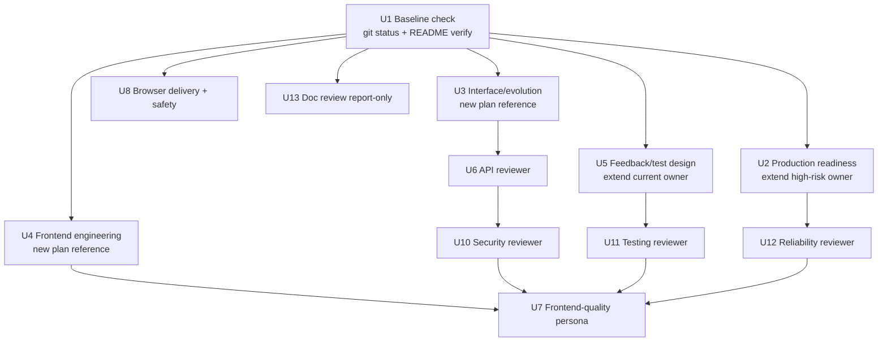

# Agent Skills Capability Integration - Plan

> **2026-07-17 两轮简化修订说明。** 本版本经过两轮对抗性简化：第一轮替换了机制过重的原始草稿（1580
> 行，SHA-256 `26503d2e43ac861caf48396cc1620b0383912a677de9a62a9762e0eb93e3baa0`），砍掉跨平台
> DACL 私有存储、byte-exact 反重构证据链、五段 sealed evidence 生命周期等"防同 UID 恶意方"的安全
> 剧场，把需要跨调用锁定 plan freshness 的场景降到"写入前后核对一次 plan hash"这一档。第二轮（本版本）
> 进一步砍掉第一轮遗留的"证明流程确实被执行了"的流程剧场——中央 evidence manifest/case-index、独立
> Phase 2 集成 unit、三层执行者术语、U6 同会话 hash-check——降到"git status + 直接读 live 文件 + owning
> skill 自测"这一档；before/after hash 只保留在 U13 shipping caller 的跨调用复核中。
> 两轮的完整对比与理由见文末 [Evidence & Limitations](#evidence--limitations) 的两条
> "Simplification rationale"。真正的能力增量（两个 planning lens、四个 reviewer 增强、
> frontend-quality reviewer、browser 交付修复、`spec-doc-review` report-only 开关）全部保留。

## Goal Capsule

| 维度 | 决策 |
| --- | --- |
| Objective | 以 Spec-First 的角色契约、source/runtime 治理和现有研发闭环为基准，把 Agent Skills 中已确认有增量价值的接口设计与演进、前端工程、测试设计、生产就绪与 reviewer 知识集成进现有 public workflow，不复制外部产品形态，不新增公共 Skill。 |
| Recommended approach | 复用现有 `spec-plan`、`spec-work`、`spec-code-review`、`spec-test-browser`、`spec-doc-review`；新增 2 个 skill-local planning reference，扩展 2 个既有 planning owner、4 个既有 reviewer、新增 1 个 internal frontend reviewer，修复 browser 的五宿主 internal delivery 断链，并给 `spec-doc-review` 加一个显式 `mutation:report-only output:json` 调用方式。U6 task-scoped review 直接读取同一 checkout 的 live plan；只有 U13 shipping caller 需要跨调用锁定 plan freshness，调用前后比较目标文件 SHA-256，不一致就重跑。两者都不需要签名、DACL、sealed evidence 链或补偿事务。 |
| Authority hierarchy | 当前用户目标与本方案 Product Contract > `docs/10-prompt/结构化项目角色契约.md` > 当前 project-owned source/contracts/tests > `docs/14-agent-skills/README.md` 与 `docs/solutions/**` advisory evidence > Agent Skills 固定快照。 |
| Decision focus | 条件能力由谁持有、何时触发、何时不触发；机制复杂度是否与 spec-first 自身声明的（非对抗性、单机、单用户）威胁模型成比例；如何避免公共入口、truth source 和 runtime generator 膨胀。 |
| Verification focus | `docs/14-agent-skills/README.md` 的 24 项映射与本方案决策核对一致；每个受影响能力至少 2 个 positive / 2 个 negative-owner case；五宿主 recursive projection、`evals/**` source-only、public catalog 零增量；fresh-source 状态与 host/field 证据分层记录，不越级声称。 |
| Largest risk or boundary | 工作树在规划与实施之间持续变化，静态 dirty 清单会失效——U1 必须在实施时动态重算。`spec-test-browser` 当前未被五宿主交付，且 pipeline 模式会直接后台启动待审分支的 dev server；U8 必须先堵住这个真实的执行面问题，再谈能力增强。 |
| Stop conditions | 任一 slice 需要新公共 Skill 才能成立；canonical owner/negative boundary 不明确；fresh-source 未执行却声称通过；任一新机制的复杂度无法用"防的是哪个真实威胁"回答；既有硬门（browser 未强制层降级为 not_supported/not_run、五宿主 projection、findings schema）被绕过。 |
| Execution profile | Deep，跨 workflow/source/test/runtime 的能力集成；U1-U13 由 `spec-work` 按依赖顺序执行，最终 review/verification/runtime adoption/plan closeout 由现有 shipping tail 持有。 |

---

## Product Contract

### Summary

本方案把外部 Agent Skills 中已验证有价值的工程知识，转化为 Spec-First 自有、可回源、可验证、跨宿主投射的条件能力。
不新增 source Skill 或 public workflow，通过 skill-local reference、内部 reviewer、聚焦 fixture 与 contract test 补齐内容缺口；当前 35 个 source Skill 仅作为 U1 的实施基线，不作为永久常量。

机制设计原则（本次修订新增）：**任何新增的确定性检查机制，其复杂度必须与它所防御的真实威胁成比例**。spec-first 是单开发者、本机 checkout 内运行的工具，唯一真正的不可信输入是浏览器页面内容；plan、prompt、评审产物都在同一个 uid 下，本就可被同一个 agent 直接读取。因此本方案按时间与 actor 边界分两档：U6 的同会话 task review 直接读取 live plan，不传正文或 hash；U13 的 shipping 语义复核可能跨调用并与人工编辑并发，由 caller 在调用前后对同一 plan 计算并比较一次 SHA-256。不引入跨平台 ACL/DACL attestation、byte-exact 反重构证据链、多阶段 sealed pipeline 或进程级 supervisor 协议——这些机制的防御目标是"同一本机用户下的恶意攻击者"，而这正是本方案（以及 spec-first 自身）明确声明不打算防御的对手。

### Current Baseline

截至 2026-07-17：

- Origin report 的 Spec-First snapshot 为 `a2f37c6075d35d4f686371bca4fb20c31275e142`；capability-source baseline 为 `6a0f060cf6cf4b00149afd7682688d4b6d8ad56f`；plan-review HEAD 为 `f9213c15e9049c72f7e891e6980e0a154bb65cdd`。U1 仍须在实施时重新采样，不把任一历史 revision 当作 current truth。
- Agent Skills 固定快照为 `98967c45a42b88d6b8fb3a88b7ff6273920763d6`，tag `0.6.4`，24 个 Skill；`docs/14-agent-skills/README.md` 已完成全量映射：14 个强承载、10 个部分承载。
- 决策：新增 0 个公共 Skill，直接引入 0 个外部 Skill，新增 2 个 skill-local reference，扩展 2 个既有 reference/lens，扩展 4 个 existing reviewer，新增 1 个内部条件 reviewer persona。
- `skills/spec-plan/SKILL.md`、`high-risk-plan-lens.md`、`planning-evidence-boundaries.md`、`spec-plan/evals/**` 与 consumer replay 已进入 live HEAD，是本方案的 protected baseline。
- `skills/spec-work/references/feedback-and-tests.md` 与 `spec-work/evals/examples.json` 已持有 smallest-loop、vertical-slice、proof/characterization、scenario-completeness、system-wide-check 与 replacement-evidence 合同；U5 只补 DAMP、state-over-interaction、test-double hierarchy、contract/risk-first 与 rollback-friendly slicing，不新建第二个 test-design owner。
- `spec-doc-review` 当前对可写 Markdown 默认 `mutation_policy: markdown-write`，`mode:headless` 只改变交付方式不改变 mutation 策略；shipping tail 若要做只读语义评审，需要一个显式的 report-only 调用方式（U13）。
- `src/cli/task-pack.js` 的 `computeSourcePlanHash()` 只对去 frontmatter 后的正文计算 hash；`src/cli/commands/tasks.js` 默认的 `task-plan-hash/v1` 足够支撑 U13 shipping caller 的 before/after freshness 检查。U6 的同会话 task review 直接读取 live plan，不消费该 hash，也不需要 byte-range 或 canonical anchor grammar。
- `src/cli/plugin-sync.js` 已支持递归 skill 投射并排除 `evals/**`；但 `src/cli/plugin-governance.js` 的 `DELIVERED_INTERNAL_SKILLS` 只含 `spec-worktree`，导致已声明 `internal_only` 的 `spec-test-browser` 在五宿主 projection 中为 0 条路径。U8 需要最小修复这一 delivery policy。
- `skills/spec-test-browser/SKILL.md` 与 `references/pipeline-orchestration.md` 目前会在 pipeline 模式直接后台执行 `bin/dev`/Rails/`npm run dev`，读取待审分支代码；仓库没有任何可验证的 attestation/sandbox primitive 支撑"认证启动"。U8 必须移除这个未经证实的 happy path，诚实降级为 `not_supported`。
- 当前宿主支持列表由 `src/cli/adapters/index.js` 的 `getSupportedPlatforms()` 返回：Claude、Codex、Cursor、Kiro、Qoder。
- 本方案经过多轮 coherence/feasibility/security-lens 复审；早期草稿的重机制设计（sealed evidence 链、跨平台 DACL、byte-exact 解析器）已被本轮简化修订整体替换，理由见文末 Evidence 章节。

### Problem Frame

Spec-First 已经拥有比 Agent Skills 更完整的 intent/artifact/evidence/handoff/knowledge 闭环，但部分通用软件工程知识仍分散在 planning specialist、reviewer 或 shipping tail 中。直接复制外部 Skill 会制造近义 public route、并列 truth source 和孤岛能力；只加主 `SKILL.md` prose 会让入口上下文膨胀。

需要解决的工程缺口：

- planning 缺少统一的接口设计/演进条件 lens；
- planning 缺少通用 Web 前端工程条件 lens；
- `feedback-and-tests.md` 已承载大部分测试设计知识，但仍缺 DAMP、state-over-interaction、test-double hierarchy、contract/risk-first 与 rollback-friendly slicing；
- production readiness/observability/CI fidelity 仍分散，未由 high-risk owner 统一承载；
- code review 缺少通用 frontend quality reviewer，API/security/testing/reliability reviewer 仍可吸收更成熟的工程判断；
- `spec-test-browser` 的 canonical source 已存在，但五宿主 internal delivery 断开，且 pipeline 模式存在真实的"执行待审分支代码"风险；
- `spec-doc-review` 缺少一个显式的、caller 可强制的只读评审调用方式，供 shipping tail 在 plan 定稿后做语义复核。

任何增强都必须满足 Spec-First 的核心约束：scripts 只守确定性地板，LLM 判断语义充分性；source 是唯一持久真相源；generated runtime 可重建；公共入口只有在独立 intent/artifact/consumer/route/owner-eval 同时成立时才新增；新机制的复杂度必须能用"防哪个真实威胁"回答。

### Actors

- A1. Workflow user：通过现有 `spec-*` 入口提出规划、实施、调试、审查或浏览器验证目标。
- A2. Plan author：`spec-plan` 根据语义 trigger 加载最小必要 lens。
- A3. Implementer：`spec-work` 按 U-ID 和 `feedback-and-tests.md` 选择 slice 与验证策略。
- A4. Reviewer：`spec-code-review` 按 diff 语义选择 reviewer，输出现有 findings schema。
- A5. Runtime consumer：Claude、Codex、Cursor、Kiro、Qoder 从 canonical `skills/**` 递归获得 runtime-required reference/persona，不消费 maintainer-only evals。
- A6. Maintainer：维护 source owner、fixtures、contract tests、fresh-source validation、docs、Changelog。
- A7. Shipping caller：在 plan 定稿后用 `spec-doc-review` 的 report-only 模式做一次语义复核，再进入最终 checks 和 plan-status 变更。

### Requirements

#### Scope 与基线

- R1. 实施开始前核对 `docs/14-agent-skills/README.md`：确认其 24 个 Skill 的 ID/decision/U-ID 映射与本方案 Current Baseline 描述一致，不一致则直接更新该文件；不新建第二份 evidence manifest 去复制这份信息。
- R2. 不新增公共 Skill、不 vendoring Agent Skills、不改 public catalog 语义；source Skill 目录数相对 U1 实施基线零增量（当前观察值 35）。
- R3. U1 在第一次 source mutation 前，动态计算当前 dirty paths 与 U1-U13 写集的交集，逐文件确认 owner 与预期基线；无法协调的交集文件只阻塞受影响 unit，不覆盖他人改动。

#### 条件 reference 与 planning/work 能力

- R4. 每个新增或扩展能力必须有明确 positive trigger、negative-owner boundary、required landing、canonical owner、consumer、degraded behavior 与 enforcement level；只新增文件但无入口指针不算完成。
- R5. `interface-and-evolution-lens.md` 覆盖 greenfield 接口设计与既有接口演进两个分支，共享最小 contract core（consumers、canonical artifact、protocol、request/response、error model、compatibility、verification）。Evolution 分支要求当前 canonical artifact 是 repo 内可读文件，并绑定一个 repo-native parser/test 作为实施期验证；没有 parser 就记录 `parser_unavailable` limitation。Greenfield 分支只要求计划阶段声明目标 path/type/owner 与创建它的 U-ID，存在性由该 unit 关闭。
- R6. `frontend-engineering-lens.md` 覆盖组件/数据边界、design-system 复用、loading/error/empty/permission/offline/retry 状态矩阵、keyboard/focus/语义化、responsive 与 runtime verification，不抢占 `spec-polish`/`spec-test-browser`/`spec-dogfood`/race reviewer。
- R7. `high-risk-plan-lens.md` 扩展 production-readiness 分支：on-call questions、metrics/traces/logs 用途、correlation、cardinality/privacy、CI/build/deploy fidelity、feature flag 生命周期、staged rollout、alert owner/runbook/action、telemetry proof。不新建并列 truth source。
- R8. `feedback-and-tests.md` 在保留现有合同的前提下，补齐 contract-first/risk-first slicing、rollback-friendly scope、DAMP、state-over-interaction、test-double hierarchy；未观察到真实 RED 时不得声称完成 TDD 历史。

#### Reviewer

- R9. `api-contract-reviewer`、`security-reviewer`、`testing-reviewer`、`reliability-reviewer` 各自吸收 phase-owned 工程判断，保留现有 confidence gate/findings schema/suppression 边界。API reviewer 检查实现与 canonical 契约在 schema/error/nullability/pagination/idempotency/compatibility 上的可见漂移，以及已变更契约所需的 consumer trace/migration/deprecation/zero-use evidence；不承担接口设计。当 review 上下文来自一个 validated task 时，producer 只标注 source plan 路径与该 task 对应的章节标题；reviewer 直接读取当前 live plan 的相关章节，不传递章节正文或同会话 hash。plan 路径缺失或不可读时退回 diff-only 评审并记录 limitation；真正没有 plan 时同样按 diff-only 评审。
- R10. 新增 `frontend-quality-reviewer` 作为内部条件 persona，只在用户可见交互/表单/导航/异步状态/组件公共行为/responsive/contrast/focus/accessibility 契约命中时启用；backend-only/docs-only/type-only/fixture-only，以及不影响 contrast/focus/layout/responsive/motion/状态表达的 token-value-only diff 不启用。
- R11. frontend-quality、frontend-races、testing、security、maintainability 的 ownership 必须可区分，重复 finding 在 merge/dedup 前有明确主 owner。

#### Browser 交付与安全

- R12. `spec-test-browser` 的唯一执行方式是 `agent-browser` CLI 的本地默认 backend；这是当前唯一有真实实现的路径，本方案不预先定义 backend provider/alternative executor 之类的分层术语——真的出现第二种执行方式时再引入对应概念，不为假想的可变性预先建分类法。运行前用确定性 probe 确认所需 flag/命令可用；每次 run 使用可信最小配置、独立 session/namespace、domain allowlist 与 default-deny action policy，清除 ambient provider/profile/state/proxy/plugin/extension 配置。当前 `agent-browser` 0.31.1 的 `--allowed-domains` 与 `--profile`/`--state`/`--restore`/`--auto-connect` 互斥，因此本轮所有 profile/state 型登录流为 `not_supported`，不得移除 allowlist 重试。

  所有调用经过唯一 wrapper：写任何原始输出前，先确认目标目录是本机当前用户创建、权限收紧（POSIX `0700`/`0600`；Windows 用 `icacls` 收紧到当前用户）；无法确认时该次调用降级为 `not_run`，不写原始内容。原始 DOM/console/network 内容只写本机私有临时目录，模型只看到字段白名单与脱敏后的结果；截图只落盘、默认不进入模型或报告。

  每次 run 消费一份 run-local test-plan（内部数据结构，由 wrapper 代码内直接做 shape 校验，不发布为独立版本化 JSON Schema 文件）：显式 target origin、允许的相对 route、有序 step（动作+定位约束，值只能来自 wrapper 生成的合成输入，不接受任意 caller literal 或凭证）。运行前用当前文件内容重新校验 test-plan 的 SHA-256 与准备时一致；不一致则中止。页面内容不得追加新 route/action/value。

  当前五宿主没有可验证的 sandbox/attestation/request-time exact-origin primitive，因此：pipeline 模式**不自动启动任何 server**（这是本 unit 要修的真实风险）；所有模式在缺少已确认 exact-origin 能力前，browser 的实际导航/交互一律 `not_supported`，只允许对显式 target 做只读 preflight。若用户在 interactive 模式下明确确认要启动一个本地 server（展示完整命令、cwd、环境差异），wrapper 才可启动它；关闭该进程是用户自己的职责（用户看到了完整命令，就有能力自己终止它），wrapper 不追踪 PID 或尝试代为清理，避免承担"进程已不在/被复用"等边界情况的处理成本。这个确认只授权该次 server 进程，不解锁 browser 请求本身。

#### Eval、runtime 与 adoption

- R13. 每个受影响能力至少 2 个 positive case、2 个 negative-owner case，直接落在 owning skill 的 `evals/`，由该 skill 自己的 focused test 断言存在；不建中央 case index。
- R14. Mechanical source contract、fresh-source semantic judgment、host loader/invocation observation、field outcome 分层记录，低层证据不得升级为高层 claim。
- R15. 新增 reference/persona 通过现有 recursive projection 进入五宿主；`spec-test-browser` 作为 internal-only runtime skill 被交付但不进入 public catalog。
- R16. `spec-security-audit`、`spec-migration`、`spec-observability` 继续 Defer。
- R17. 全部 source-bearing unit 完成聚焦验证后，由 orchestrator 在 shipping closeout 前一次性汇总更新 `CHANGELOG.md`；worker 不写该共享文件，Changelog 更新早于任何另行获授权的 commit。
- R18. Fresh-source `passed`/`concerns`/`not_run` 是语义证据状态；`not_run` 带 reason，可关闭 source implementation 但不获得 semantic-passed claim；`concerns` 必须解决或由 maintainer 显式接受并记录理由。
- R19. `spec-doc-review` 增加显式 `mutation:report-only` 与可选 `output:json` 调用方式，独立于 interactive/headless delivery，覆盖可写 Markdown：强制 `fixes_applied: 0`，跳过 walkthrough/bulk/open-questions mutation，confidence-100 的 `safe_auto` 候选转为 `producer_fix_candidates` 供 caller 自行决定。Caller 在 dispatch 前后各计算一次目标 plan 文件的 SHA-256；不一致时丢弃本次评审结果并重跑，不需要签名或 sealed artifact。

### Key Flows

- F1. Evidence baseline：读取 origin report、`docs/14-agent-skills/README.md` 与当前 source，动态计算 U1-U13 写集与 dirty 交集，逐文件确认 owner 与基线；不新建 evidence manifest 或中央 case index。
- F2. Planning lens：请求命中接口设计/演进、UI 或 high-risk 语义时，`spec-plan` 加载对应 reference 并把决策落入 Planning Contract。
- F3. Work evidence：`spec-work` 读取 U-ID，按 `feedback-and-tests.md` 选择 slice 和证据策略，观察 RED 或 baseline，记录 run-local evidence。
- F4. Review：producer 在 task context 中标注对应的 plan 路径与章节标题；reviewer 直接读取该 plan 文件对应章节作为 API 契约上下文（reviewer 与 producer 在同一次 `spec-work` 会话中对同一 checkout 工作，直接读 live 文件即可，不需要额外传递或核对 hash）。API/security/testing/reliability 按语义选择，findings 走既有 schema。
- F5. Runtime projection：canonical `skills/**` 变更后，`plugin-sync` 递归投射到五宿主，`evals/**` 缺席。
- F6. Plan 定稿后的语义复核：shipping caller 记录 plan hash → 调用 `spec-doc-review mode:headless mutation:report-only output:json` → 解析 JSON envelope → 重新计算 plan hash 确认未变 → 处置 P0/P1。

### Acceptance Examples

- AE1. 给定删除公开 API 字段并迁移两个客户端的计划，interface lens 要求 consumer inventory、兼容窗口、替代路径与 rollback；给定 private helper rename，不加载该 lens。
- AE2. 给定含表单提交、loading/error/empty 状态和键盘导航的新页面，frontend lens 触发；给定 backend-only handler 或不影响可视/交互语义的 token-value-only 变更，不触发。
- AE3. 给定 staged rollout + feature flag + CI gate 的外部集成，high-risk lens 要求真实的 fidelity、失败信号、rollback trigger 与 runbook；给定 docs-only 变更保持轻量。
- AE4. 给定 legacy parser 行为修改且测试稀薄，`spec-work` 选择 characterization-first；给定纯文档变更，记录 no-test exception 而不伪造 TDD。
- AE5. 给定 API 契约实现漂移，API reviewer 报告具体 finding；给定稳定契约后的内部重构，suppression。
- AE6. 给定用户可见异步表单新增错误/loading/focus/responsive 行为，frontend-quality reviewer 检查 a11y/状态完整性；给定 backend-only/docs-only/token-value-only diff，不启用。
- AE7. 给定 pipeline 模式请求执行会加载待审分支代码的 server/build 命令，无论 caller 如何声明，一律 `not_supported`；给定 interactive 模式且用户已确认展示的完整命令，wrapper 可启动该 server，但不追踪其 PID 或代为清理——关闭它是用户自己的职责。
- AE8. 给定 shipping caller 在语义复核过程中 plan 被并发改动，caller 重新计算的 hash 与调用前不一致，本次复核结果被丢弃并重跑。

### Success Criteria

- `docs/14-agent-skills/README.md` 的 24 项映射、14/10 承载计数与本方案决策一致，或已按需更新。
- 2 个新增、2 个扩展 planning reference/lens，4 个扩展 reviewer，1 个新增内部 reviewer 均有 canonical owner、trigger、negative boundary、consumer 与 focused test。
- 每个受影响能力（含 browser）至少 2 positive / 2 negative case，由 owning skill 的 `evals/` 持有。
- source Skill 目录数、public catalog 相对 U1 基线零增量。
- 五宿主 projection 包含 runtime-required assets、排除 `evals/**`，无手改 generated runtime。
- `spec-doc-review` 具备 caller 可强制的 report-only/JSON 调用方式，且默认 Markdown/HTML 行为不变。
- U6 task-scoped review 只读 live plan；U13 shipping caller 的跨调用 freshness 只依赖调用前后 hash 比较；两者都没有引入 DACL/sealed-evidence/supervisor-IPC 类基建。

### Scope Boundaries

#### In scope

- `spec-plan` 的 production-readiness、接口设计/演进、frontend-engineering 条件能力。
- `spec-work` 的 test-design/slicing 增强。
- `spec-code-review` 的四个 reviewer 增强与新增 frontend-quality persona。
- `spec-test-browser` 的 internal delivery 修复、capability probe、safe wrapper、pipeline 不自动起 server。
- `spec-doc-review` 的 `mutation:report-only output:json` 调用方式。
- skill-local case、五宿主 projection、文档、changelog。

#### Deferred to Follow-Up Work

- `spec-brainstorm`/`spec-prd` 的进一步增强：现有 reference 已覆盖大部分语义，待真实使用证据决定增量。
- `spec-debug`/`spec-compound` 的强化：现有承载已足够，暂不改动。
- 真实五宿主 clean-session loader 观测与 field adoption 指标。
- Authenticated browser server launcher/attestation：需要真实 host primitive 提供不可伪造的认证通道后才单独立项。
- Screenshot 视觉模型摄入：需要独立方案处理数据授权与视觉敏感信息后才启用。
- 三个未来 public Skill 候选（`spec-security-audit`/`spec-migration`/`spec-observability`）的 PRD：R16 门槛满足后启动。

#### Outside this plan

- 修改 Agent Skills 外部仓库或将其作为运行时依赖。
- 直接复制外部 Skill、persona 或固定技术栈模板。
- 新增近义 public Skill（`spec-api-design`、`spec-frontend`、`spec-tdd` 等）。
- 新建全局 engineering mega-skill、第二套 reviewer findings schema、第二套 runtime generator。
- 让 scripts 判断 threat model、API 设计、a11y、test quality 或 reviewer finding 的语义充分性。
- 手改 `.claude/**`、`.codex/**`、`.agents/skills/**`、`.cursor/**`、`.kiro/**`、`.qoder/**` generated runtime。
- 构建跨平台 OS sandbox、网络防火墙、进程级 supervisor/IPC 协议或凭证代理；当前宿主缺少可验证 primitive 时必须诚实降级，不得用机制堆叠冒充强隔离。

---

## Planning Contract

### Key Technical Decisions

- KTD1. 以 origin report 的 24 项矩阵作为 WHAT 与优先级来源，但不把报告中的 working-tree advisory 当作 HEAD confirmed；U1 重新冻结实施时 HEAD/dirty/hash/owner。
- KTD2. 不新增公共 Skill；领域知识通过 conditional reference/persona 进入现有 artifact 和 evidence 链。
- KTD3. production readiness 选择 `extend` 现有 `high-risk-plan-lens.md`，不新建并列 lens。
- KTD4. interface design/evolution 选择在 `spec-plan` 内 `new` 一个 skill-local reference，不新增 public Skill；现有 architecture strategist/API reviewer/PRD compatibility/data-migration reviewer 都不适合作为 greenfield 与 evolution 共用的 plan-time owner。
- KTD5. frontend engineering 选择 `new` skill-local plan reference；polish/browser QA/dogfood/race reviewer 都不是通用 Web 组件/状态/a11y planning owner。
- KTD6. test design/slicing 选择 `extend` 现有 `feedback-and-tests.md`，只补 DAMP/state-vs-interaction/test-double/contract-risk-first/rollback-friendly，不新增第二个 eval owner。
- KTD7. frontend-quality 选择 `new` internal conditional persona，复用现有 findings schema、confidence gate、merge/dedup。
- KTD8. API/security/testing/reliability 使用 `extend`。每个 reviewer 只增加其 phase-owned 判断。Task context 只需要 producer 标注 plan 路径与相关章节标题，reviewer 直接读取当前 live plan 文件；review 发生在同一次 `spec-work` 会话、同一 checkout 内，不是跨 actor 或跨会话场景，不需要 producer 计算 hash、reviewer 独立复算比较，也不需要 byte-range 证明或 canonical anchor grammar——这类机制是为防"步骤间数据被替换"设计的，而这里的真实风险只是"plan 恰好在评审的几分钟内被人手改"，其发生概率和影响都不足以支撑一套跨文件传递校验值的机制；即使发生，reviewer 直接读的就是当下最新内容，天然不会用旧数据。
- KTD9. Task-scoped review 的最小语义合同是 source plan 路径 + 相关章节标题；reviewer 直接读取同一 checkout 的 live plan，不跨 Skill 传递章节正文或同会话 hash，也不建立 strict-JSON/canonical-JSON/anchor-index 基础设施。结构化 task/findings 数据继续使用 Node 内置 `JSON.parse` 加显式 schema 校验。
- KTD10. scripts 只验证文件存在、hash 一致、findings schema、case coverage、五宿主 runtime path 与 public roster；lens applicability、设计充分性、finding validity 由 LLM/reviewer 判断。
- KTD11. 每个能力按纵向 slice 交付：source、trigger、positive/negative case、contract test、fresh-source eval 状态、review 同一 U-ID 关闭。
- KTD12. fresh-source `not_run` 是诚实降级；`concerns` 必须解决或有 maintainer 授权接受记录。
- KTD13. runtime adoption 复用现有 `plugin-sync.js` 递归复制与 `plugin-governance.js` 的 delivery policy；U8 只最小扩展 `DELIVERED_INTERNAL_SKILLS`。
- KTD14. `spec-test-browser` 只实现 `agent-browser` 本地默认 backend 这一条路径；引入第二种执行方式（其他 CLI/MCP/远程 backend）需要独立 readiness 证据才能新增，且到那时再决定合适的分层术语，不预先建三层分类法。
- KTD15. `spec-prd`/`spec-debug`/`spec-compound` 本轮不因"求完整"而强行改动。
- KTD16. `CHANGELOG.md` 是 orchestrator-owned 共享写入面：全部 source-bearing unit 完成聚焦验证后，在 shipping closeout 前一次性汇总追加；worker 不并发写。
- KTD17. 行为 case 保持 skill-local，直接写进 owning skill 的 `evals/*.json`；不建中央 case index——它要索引的信息（case 是否存在、属于哪个 U-ID）已经由该 skill 自己的 focused test 断言，另建索引是重复记账，不是新增证据。
- KTD18. Browser 安全分两层：wrapper 层的 capability probe、私有目录写入（本机当前用户 + 权限收紧）、test-plan 前后 hash 校验、默认拒绝的 action policy，属于 script-enforced 地板；"选哪些 route/step、locator 语义是否合理"属于 LLM/human 判断。当前五宿主没有 request-time exact-origin 或 sandbox primitive，因此 browser 的实际导航/交互一律 `not_supported`，pipeline 模式不自动起 server；interactive 模式下用户明确确认后可以启动一个 server 进程，关闭它是用户自己的职责，wrapper 不追踪进程或做代为清理。这个分层足以覆盖"防止 pipeline 静默执行待审分支代码"的真实风险，不需要跨平台 DACL attestation 或 supervisor handle 协议。
- KTD19. interface lens 采用共享 contract core + greenfield/evolution 双分支；适用时在 Planning Contract 下生成可选 `### Interface Contracts` subsection。Evolution 必须指向 repo 内可读文件并绑定一个 repo-native parser 作为实施期验证；greenfield 只需声明目标 path/type/owner 与创建 U-ID。不新增跨格式 parser/validator 基础设施。
- KTD20. `spec-doc-review` 的 report-only 调用方式与跨阶段一致性检查统一为"caller 在调用前后各算一次目标文件的 SHA-256，不一致就重跑"。不引入多阶段 sealed evidence 生命周期、authorization receipt、per-persona canonical leaf artifact 或 protected manifest；这些机制原本用于抵抗"同一 host/UID 下的恶意篡改"，而这正是 spec-first 自身声明不打算防御的威胁。语义评审的证据要求，一份 hash 加一份 JSON envelope 就足够。

### High-Level Technical Design

所有 unit 完成后直接进入现有 `spec-work` shipping tail（final review → final checks，含五宿主 projection 测试与 `npm run build`）；不再设立独立的 Phase 2 集成 unit，因为它做的事——全量 test、五宿主投射验证、typecheck、skill lint——正是 shipping tail 本来就会做的事。跨能力回归（例如"两个 reviewer 是否重复报同一 finding"）由 U7（依赖 U4、U10、U11、U12）的 focused test 覆盖，不需要额外一层。

### Artifact and Evidence Contracts

| Artifact | Canonical owner | Authority | Consumer | Contract |
| --- | --- | --- | --- | --- |
| `docs/14-agent-skills/README.md` | research docs | advisory decision origin | plan/maintainer/reviewer | 24 项映射与决策；不代表实施完成；U1 直接核对/更新此文件，不另建 evidence manifest |
| owning skill `evals/*.json` | owning workflow skill | source-only behavior oracle | focused tests、fresh-source evaluator | case id、positive/negative、expected/forbidden owner；无中央 case index |
| skill-local reference | owning workflow skill | runtime-required source | current workflow LLM | trigger、negative boundary、required landing、degraded behavior |
| `### Interface Contracts` block + canonical artifact | `interface-and-evolution-lens.md` + repo 内 API/schema owner | plan-time decision + project-owned source | implementer、API reviewer | consumers、artifact path/type、protocol、request/response、error model、compatibility、verification |
| task-scoped review context | `spec-work` producer | plan path + 相关章节标题 | `spec-code-review` API/security owner | producer 标注 plan 路径与章节标题；reviewer 直接读取当前 live plan 文件对应内容 |
| browser safe-run manifest | `spec-test-browser` safe wrapper | generated/degraded runtime fact | browser workflow | CLI 版本、capability probe 结果、private-dir 检查结果、test-plan hash、server 是否曾启动 |
| `spec-doc-review-report/v1` JSON envelope | `spec-doc-review` JSON producer | semantic advisory evidence | shipping caller | delivery/mutation policy、findings、counts、coverage、limitations；plan freshness 由 shipping caller 在 envelope 外做 before/after hash 比较 |
| `spec-work` shipping closeout envelope | existing `spec-work` shipping tail | confirmed/degraded execution closeout | completion response、plan lifecycle | 复用现有 `verification_run_summary_ref`、`honest_closeout_verdict`、limitations |

### Existing Capability / Composition / Source Ownership

| Capability | Existing owners inspected | Decision | Canonical owner | Rejected shape |
| --- | --- | --- | --- | --- |
| Production readiness | high-risk lens、deployment verification、reliability reviewer | `extend` | `skills/spec-plan/references/high-risk-plan-lens.md` | 并列 lens 或新 `spec-ci-cd` |
| Interface design/evolution | architecture strategist、API reviewer、PRD compatibility | `new` skill-local reference | `skills/spec-plan/references/interface-and-evolution-lens.md` | 塞入 high-risk；让 diff reviewer 反向持有设计 |
| Frontend engineering | polish、browser QA、dogfood、race reviewer | `new` | `skills/spec-plan/references/frontend-engineering-lens.md` | 新 `spec-frontend`；塞入 race reviewer |
| Test design/slicing | 现有 work feedback loop、debug test-first、testing reviewer | `extend` | `skills/spec-work/references/feedback-and-tests.md` | 新 `test-design-and-slicing.md`/`spec-tdd` |
| API/security/testing/reliability review | 现有四个 persona | `extend` | 各自 persona prompt | 新合成 reviewer、复制判断、第二套 finding contract |
| General frontend review | race、maintainability、testing、security | `new` internal persona | `frontend-quality-reviewer.md` | 仅按扩展名激活；复制既有 reviewer 职责 |
| Runtime projection | plugin sync、plugin governance、host adapters | `extend delivery + reuse generator` | `plugin-governance.js` + `plugin-sync.js` | 新 generator、手改 mirrors |

### System-Wide Impact

- **Public route:** in-scope，public workflow catalog 与 source Skill count 相对 U1 基线零增量。
- **Planning source:** in-scope，`spec-plan` 新增两个 conditional pointer 并扩展 high-risk owner。
- **Execution source:** in-scope，`spec-work` 扩展 `feedback-and-tests.md`。
- **Review source:** in-scope，四个现有 persona 扩展、一个内部 persona 新增；task-scoped reviewer 直接读取同一 checkout 的 live plan，不传正文或 hash。
- **Document review source:** in-scope，`spec-doc-review` 增加 report-only/JSON 调用方式；不改变 default Markdown write 或 HTML report-only 行为。
- **Browser runtime:** in-scope，internal delivery、capability probe、trusted run config、pipeline 不自动起 server。
- **PRD/debug/compound:** deferred，本轮不改动。
- **CLI/runtime generation:** `plugin-governance.js` delivery policy in-scope；`plugin-sync.js` generator out-of-scope by default。
- **Generated runtime:** out-of-scope as mutation；只在隔离测试项目中由 init 流程生成验证。
- **External Agent Skills repo:** out-of-scope，只用固定 commit/tag 作为 pinned evidence。

### Sequencing

- U1 是所有 unit 的 gate。
- U2、U3、U4 语义上都只依赖 U1，但会触及同一 `spec-plan` surface，按 U2 → U3 → U4 串行调度。
- U5 与 U2-U4 写集分离，可并行。
- U6 依赖 U3；U10 依赖 U6；U11 依赖 U5；U12 依赖 U2。四者调度串行以共享 catalog/Changelog 表面。
- U7 依赖 U4、U10、U11、U12。
- U8 只依赖 U1，可并行执行。
- U13 只依赖 U1，可并行执行。
- U2-U8、U10-U13 全部完成后，直接进入现有 `spec-work` shipping tail（final review → final checks → plan lifecycle mutation），不设独立的跨能力集成 unit。

### Deferred Implementation Decisions

- 每个新 reference 的最终段落名和篇幅由实施时的 hot-path footprint 决定。
- fresh-source evaluator 的具体宿主/model 由实施时可用且获授权的 dispatch primitive 决定；没有授权则记录 `not_run` 并保留 claim ceiling。
- 若 U1 发现方案描述的 advisory source 已被另一方案合入，实施者复用已合入 owner。
- `agent-browser` capability probe 由 `spec-test-browser` 持有；helper 版本变化导致 required flag 不可用时按 reason code 降级。

---

## Implementation Units

| U-ID | Unit | Key files | Depends on |
| --- | --- | --- | --- |
| U1 | 确认 live baseline 与工作树 overlap | `docs/14-agent-skills/README.md`、current source/write-set | None |
| U2 | 扩展 production-readiness delta | `high-risk-plan-lens.md`、`spec-plan/evals/**` | U1 |
| U3 | 新增 interface design/evolution lens | `spec-plan` source/reference/evals | U1 |
| U4 | 新增 frontend-engineering lens | `spec-plan` source/reference/evals | U1 |
| U5 | 扩展现有 feedback/test-design owner | `feedback-and-tests.md`、`spec-work/evals/examples.json` | U1 |
| U6 | 扩展 API contract-drift reviewer | reviewer persona、task context 章节标注 | U3 |
| U10 | 扩展 security reviewer | security persona、review context | U6 |
| U11 | 扩展 testing reviewer | testing persona、eval/test | U5 |
| U12 | 扩展 reliability reviewer | reliability persona、eval/test | U2 |
| U7 | 新增 frontend-quality reviewer | frontend persona、catalog/eval/test | U4、U10、U11、U12 |
| U8 | 修复 browser delivery 并完成 capability/safety | browser source/script/pipeline、plugin governance | U1 |
| U13 | 增加 Markdown report-only 文档评审并接入 shipping caller | `spec-doc-review`、`shipping-workflow.md`、eval/test | U1 |

U2-U8、U10-U13 全部完成后，直接进入现有 `spec-work` shipping tail 的 final review 与 final checks；不设独立的 Phase 2 集成 unit（原 U9），理由见 Sequencing 一节。

### U1. 确认实施基线并核对当前工作树状态

**Goal:** 在动手改任何 source 前，用一次 `git status` 确认工作树干净、用一次对 `docs/14-agent-skills/README.md` 的引用确认 24 项映射与本方案决策仍一致；不为此新建第二份可回放清单或并发写集协调机制。

**Requirements:** R1、R2、R3、R17、R18

**Dependencies:** None

**Files:**

- Read/confirm: `docs/14-agent-skills/README.md`（核对 24 项映射、14/10 承载计数与本方案"2 new / 2 extended / 4 reviewer / 1 persona"决策仍一致）
- Read/confirm: `skills/spec-plan/SKILL.md`、`skills/spec-plan/references/high-risk-plan-lens.md`、`skills/spec-plan/references/planning-evidence-boundaries.md`、`skills/spec-plan/evals/examples.json`
- Read/confirm: `skills/spec-work/SKILL.md`、`skills/spec-work/references/feedback-and-tests.md`、`skills/spec-work/evals/examples.json`
- Read/confirm: `src/cli/plugin-governance.js`、`src/cli/contracts/dual-host-governance/skills-governance.json`
- Read/confirm: `src/cli/task-pack.js`、`src/cli/commands/tasks.js`（确认 task context 生成路径可以附带 plan 路径与章节标注，不需要额外 hash 机制）

**Approach:**

- 开工前跑 `git status --short`；若工作树非空，逐文件确认是否与本方案 write-set 冲突，冲突文件先协调再动手，不需要为此新建 dirty/write-set collision-guard 子系统或 `baseline_changed` 状态机——单开发者串行执行 U1-U13 时，一次 `git status` 加人工判断就是这件事应有的成本。
- 逐项核对 `docs/14-agent-skills/README.md` 中的 24 项映射、14/10 承载计数是否仍与本方案 Current Baseline 描述一致；若已被其他方案合入或过时，直接更新该 README 的相关段落（这是它自己的 source，不需要另建一份 evidence-manifest.json 去"回放"同一信息）。
- 确认 `task-plan-hash/v1`（现有 `computeSourcePlanHash()` + `tasks hash --json`）已经能满足 U13 shipping caller 的 before/after freshness 需求；同时确认 U6 只需在同一 checkout 传 plan path + section title 并直接读取 live plan，不传递 hash。不新增 stable-source-read、strict-JSON、Windows adapter 或 changed-tree-freeze 基础设施——这些机制原方案用于抵抗同 UID 恶意篡改，超出本方案实际威胁模型。
- 每个能力的 positive/negative case 直接写进该能力 owning skill 的 `evals/*.json`（U2-U8、U10-U13 各自负责），不建中央 `case-index.json`；谁改了 source，谁的 focused test 就在同一 PR/commit 里断言对应 case 存在，不需要一个独立的中央索引文件去二次确认。
- `CHANGELOG.md` 不进入任何 worker unit 写集；全部 source-bearing unit 完成聚焦验证后，由 orchestrator 在 shipping closeout 前一次性汇总追加（KTD16）。

**Patterns to follow:**

- `docs/14-agent-skills/README.md` 的 HEAD/advisory 分层。
- `skills/spec-plan/evals/README.md`、`examples.json` 的 skill-local source-only 表达。

**Test scenarios:**

- Happy path：`git status --short` 干净，`docs/14-agent-skills/README.md` 的 24 项映射与本方案决策一致，U2-U13 可直接开工。
- Failure path：工作树存在与本方案 write-set 冲突的未提交改动，先协调该文件的 owner 再继续，不覆盖他人改动。
- Failure path：`docs/14-agent-skills/README.md` 的某项决策已被其他方案合入或过时，先更新该 README，再让引用它的下游 unit 继续。

**Verification:**

- `git status --short` 已核查并记录在 U1 的 unit closeout 说明中。
- `docs/14-agent-skills/README.md` 的映射与本方案决策一致，或已按需更新。

---

### U2. 扩展 high-risk lens 的 production-readiness 能力

**Goal:** 在现有 high-risk owner 已有 rollout/rollback/signal/runbook 合同上，补齐 on-call questions、CI/build/deploy fidelity、observability 选择与 telemetry proof 缺口。

**Requirements:** R4、R7、R13、R14、R17、R18

**Dependencies:** U1

**Files:**

- Modify: `skills/spec-plan/references/high-risk-plan-lens.md`
- Modify: `skills/spec-plan/evals/examples.json`、`skills/spec-plan/evals/output-quality-cases.json`
- Modify: `tests/unit/spec-plan-quality-contracts.test.js`

**Approach:**

- 保留现有 rollout/flag/owner/signal/rollback/runbook 语义，只扩展缺失决策集，不新建并列 reference。
- 先写 on-call questions，再选择 metrics/traces/logs；要求 correlation、cardinality/PII、signal owner、threshold、runbook。
- CI gate 作为 stand-in guard，要求其 build context 与真实 production/build path 保真。
- feature flag 要求默认安全状态、cohort、success/failure signal、rollback trigger、删除条件。
- 轻量 docs/config case 明确不触发 production ceremony。

**Patterns to follow:**

- `skills/spec-plan/references/high-risk-plan-lens.md` 当前 Trigger Matrix。
- `skills/spec-code-review/references/personas/reliability-reviewer.md` 的 stand-in guard fidelity。

**Test scenarios:**

- Happy path：staged 外部 rollout 含 feature flag、CI gate、dashboard、on-call owner，计划明确 fidelity、signal、rollback、runbook。
- Negative owner：docs-only release note 保持 lightweight。
- Failure path：计划只写"add monitoring"，fixture 判定 required landing 未关闭。
- Regression：现有 anchors 在 extension 后仍存在。

**Verification:**

- high-risk reference 仍是唯一 plan-time production-readiness owner。
- `npx jest --runTestsByPath tests/unit/spec-plan-quality-contracts.test.js --runInBand`

---

### U3. 新增 interface design-and-evolution planning lens

**Goal:** 为 greenfield 接口设计与既有接口演进建立统一 plan-time owner。

**Requirements:** R4、R5、R13、R14、R17、R18

**Dependencies:** U1

**Files:**

- Create: `skills/spec-plan/references/interface-and-evolution-lens.md`
- Modify: `skills/spec-plan/SKILL.md`、`skills/spec-plan/evals/examples.json`、`skills/spec-plan/evals/output-quality-cases.json`
- Modify: `tests/unit/spec-plan-quality-contracts.test.js`

**Approach:**

- 主入口只增加条件 trigger 和 reference pointer；详细规则留在新 reference。
- 共享 core + 两个显式分支：Greenfield 先定义契约、consumer、边界；Evolution 负责 additive/breaking 分类、compatibility window、replacement-first、zero-use evidence、rollback。
- 适用接口在 Planning Contract 的可选 `### Interface Contracts` subsection 落一个轻量 entry：consumers、artifact path/type/owner、protocol、request/response、error model、compatibility、verification。
- Evolution 分支要求 canonical source 是 repo 内可读文件，plan-time 只记录一个 repo-native parser/test 作为实施期验证 owner；实施 unit 实际运行它并记录结果，无 parser 记录 `parser_unavailable`。
- Greenfield 只要求目标 path/type/owner 与创建 U-ID，implementation 关闭存在性。
- Durable principles：Contract First、Consistent Error Semantics、Validate at Boundaries、Additive Evolution、One-Version；REST 命名/PATCH/pagination shape 等保持条件模式，不成为全局强规则。

**Patterns to follow:**

- `skills/spec-plan/references/planning-evidence-boundaries.md` 的 conditional owner lens。
- `skills/spec-code-review/references/personas/api-contract-reviewer.md` 的 consumer/breaking-change 视角。
- [Agent Skills `api-and-interface-design`](https://github.com/addyosmani/agent-skills/blob/98967c45a42b88d6b8fb3a88b7ff6273920763d6/skills/api-and-interface-design/SKILL.md) 的 durable principles；不复制其 REST/TypeScript 模板。

**Test scenarios:**

- Covers AE1. Greenfield/existing breaking change 分别命中对应分支。
- Negative owner：private rename、无 consumer 的 internal refactor 不加载 lens。
- Failure path：evolution 场景缺 canonical artifact 时不能判为 implementation-ready，需 `parser_unavailable` + 实施期验证 U-ID。

**Verification:**

- 主 `SKILL.md` 只增加 trigger/pointer。
- `npx jest --runTestsByPath tests/unit/spec-plan-quality-contracts.test.js --runInBand`

---

### U4. 新增 frontend-engineering planning lens

**Goal:** 为通用 Web UI 的组件/状态/a11y/responsive 工程决策建立 plan-time 条件 owner。

**Requirements:** R4、R6、R13、R14、R17、R18

**Dependencies:** U1

**Files:**

- Create: `skills/spec-plan/references/frontend-engineering-lens.md`
- Modify: `skills/spec-plan/SKILL.md`、`skills/spec-plan/evals/examples.json`、`skills/spec-plan/evals/output-quality-cases.json`
- Modify: `tests/unit/spec-plan-quality-contracts.test.js`

**Approach:**

- Trigger 覆盖用户可见页面/表单/导航/组件公共行为/异步状态/responsive/accessibility 契约。
- Negative boundary 覆盖 backend-only/type-only/fixture-only/纯视觉 polish 且无结构变化，以及不影响 contrast/focus/layout/responsive/motion/状态表达的 token-value-only 变更。
- Required landing：组件边界、design-system 复用、状态矩阵、keyboard/focus、语义化、contrast、responsive、runtime verification。
- 明确 ownership：本 lens 负责实施前决策；`spec-polish` 负责视觉迭代；`spec-test-browser` 负责 runtime 验证；race reviewer 负责 timing；frontend-quality 负责 diff review。

**Patterns to follow:**

- `skills/spec-work/SKILL.md` 的 Frontend Design Guidance。
- `skills/spec-code-review/references/personas/julik-frontend-races-reviewer.md` 的 ownership 边界。

**Test scenarios:**

- Happy path：新异步表单含 loading/error/empty/permission/retry、mobile layout、keyboard focus。
- Negative owner：backend-only handler 不加载。
- Edge case：纯 CSS 降低 contrast 或移除 focus indicator 时必须加载。

**Verification:**

- `npx jest --runTestsByPath tests/unit/spec-plan-quality-contracts.test.js --runInBand`

---

### U5. 扩展现有 spec-work feedback/test-design owner

**Goal:** 在现有 `feedback-and-tests.md` 上补齐 contract/risk-first、rollback-friendly slicing、DAMP、state-over-interaction、test-double hierarchy。

**Requirements:** R4、R8、R13、R14、R17、R18

**Dependencies:** U1

**Files:**

- Modify: `skills/spec-work/references/feedback-and-tests.md`、`skills/spec-work/evals/examples.json`
- Modify: `tests/unit/spec-work-implementation-quality-contracts.test.js`
- Test/verify: `tests/unit/spec-work-contracts.test.js`、`tests/unit/spec-work-intake-contracts.test.js`

**Approach:**

- 把现有 `feedback-and-tests.md` 与 `spec-work/evals/examples.json` 登记为 protected baseline，不删除或迁移现有语义。
- 在现有 Vertical Slices 增加选择规则：默认 vertical；共享契约需要先稳定时用 contract-first；最高损失/不确定性需要先证伪时用 risk-first。
- 增加测试设计段：测试应 DAMP（descriptive and meaningful），优先可观察 behavior/state；test double 优先真实实现或高保真 fake，只有 interaction 本身是契约时才用 mock call-count。
- 保持现有 proof-first/characterization-first 语义：只有 worker 在实现前真实观察并记录 RED，才能在 run-local evidence 中携带对应历史。
- docs/config/type-only case 继续走 no-test exception。

**Patterns to follow:**

- `skills/spec-work/references/feedback-and-tests.md` 当前 smallest loop、vertical slice、proof/characterization。
- `skills/spec-code-review/references/personas/testing-reviewer.md` 的 false-confidence 边界。

**Test scenarios:**

- Happy path：新增可观察 parser behavior，选 vertical slice，先加最小 failing test。
- Happy path：共享 CLI 契约先稳定，选 contract-first。
- Negative owner：docs-only 记录 no-test exception。
- Failure path：最终测试通过但没有 RED 证据，只能描述"tests added/updated"，不能声称 TDD。

**Verification:**

- `feedback-and-tests.md` 仍是唯一 owner，不新增 `test-design-and-slicing.md`。
- `npx jest --runTestsByPath tests/unit/spec-work-implementation-quality-contracts.test.js tests/unit/spec-work-contracts.test.js tests/unit/spec-work-intake-contracts.test.js --runInBand`

---

### U6. 扩展 API contract-drift reviewer

**Goal:** 让现有 API reviewer 基于 plan 声明的 canonical contract artifact 检查实现漂移，并补齐 consumer trace、additive evolution、replacement/deprecation、zero-use removal evidence。当 review 上下文来自一个 task 时，producer 只标注 plan 路径与相关章节标题，reviewer 直接读取当前 live plan 文件，不引入同会话 hash 传递、byte-range 证明或多阶段解析器。

**Requirements:** R4、R5、R9、R11、R13、R14、R17、R18

**Dependencies:** U3

**Files:**

- Modify: `skills/spec-code-review/SKILL.md`、`skills/spec-code-review/references/subagent-template.md`、`skills/spec-code-review/references/personas/api-contract-reviewer.md`
- Modify: `skills/spec-work/references/work-intake-and-task-pack.md`（producer 在 task context 中标注 source plan 路径 + 相关章节标题）
- Create: `skills/spec-code-review/evals/api-contract-capability-cases.json`
- Modify: `tests/unit/spec-code-review-contracts.test.js`、`tests/unit/spec-work-intake-contracts.test.js`

**Approach:**

- producer 在生成 task context 时，标注该 task 对应的 plan 路径与相关章节标题（按标题/Task Card 关联，LLM 判断哪些章节相关，不做机械 offset/hash 证明）。
- reviewer 收到 task context 后，直接读取该 plan 路径对应章节的当前内容作为 API 契约上下文；plan 不可读或路径无效时退回 diff-only 评审并在 Coverage 记录 limitation。真正没有 plan 引用时同样走 diff-only。
- API reviewer 定位 canonical artifact（`### Interface Contracts` 声明的 path），检查 diff 是否在 schema/error shape/nullability/pagination/idempotency/compatibility 上出现未声明漂移；artifact 不可读时只按直接 diff evidence 报告 limitation。
- 增加 consumer trace、additive evolution、replacement/deprecation、zero-use removal 判断；兼容的 additive 变更不报 breaking finding。
- 缺 dispatch 授权时，inline fallback 消费同一 task context（同样直接读 plan），标记 `inline-fallback`/degraded，不声称 persona coverage。

**Patterns to follow:**

- `skills/spec-code-review/references/personas/api-contract-reviewer.md` 当前 consumer contract 与 suppression 边界。
- `skills/spec-plan/references/interface-and-evolution-lens.md` 的 plan/review phase split。

**Test scenarios:**

- Positive：实现删除字段但未同步 canonical artifact，返回具体 breaking finding。
- Positive：deprecated interface 被移除但无 replacement/zero-use evidence，返回 removal finding。
- Negative owner：private refactor 或稳定契约后的内部重排不报。
- Negative owner：additive optional field 且 artifact 已同步不报 breaking finding。
- Degraded：plan 路径缺失或不可读时退回 diff-only 并记录 limitation；dispatch 缺失时 inline fallback 消费同一 task context。

**Verification:**

- API reviewer 只扩展 owner，不新增 reviewer 数量或第二套 schema。
- task context 缺失/不可读时的降级路径有 focused test。
- `npx jest --runTestsByPath tests/unit/spec-code-review-contracts.test.js tests/unit/spec-work-intake-contracts.test.js --runInBand`

---

### U10. 扩展 security reviewer

**Goal:** 把 Agent-native trust boundary 与 dependency reachability 判断并入现有 security reviewer，并复用 U6 建立的 task context（producer 标注 plan 路径与章节，reviewer 直接读取）消费 security 相关 Interface Contract 条目。

**Requirements:** R4、R5、R9、R11、R13、R14、R17、R18

**Dependencies:** U6

**Files:**

- Modify: `skills/spec-code-review/SKILL.md`、`skills/spec-code-review/references/personas/security-reviewer.md`、`skills/spec-code-review/references/persona-catalog.md`
- Create: `skills/spec-code-review/evals/security-capability-cases.json`
- Modify: `tests/unit/spec-code-review-contracts.test.js`

**Approach:**

- 复用 U6 的 task context 标注机制：actor/permission/tenant/trust boundary 相关内容同样由 reviewer 直接读取当前 live plan 对应章节，不需要额外的 hash 传递。
- API/security owner 分工固定：schema/error/nullability/pagination/compatibility 由 API reviewer 持有；resource authorization、tenant isolation、credential/authenticity、敏感 error exposure 由 security reviewer 持有。
- 增加 LLM/tool/web 输出默认不可信、prompt injection、excessive agency、tenant boundary、危险 sink 判断。
- dependency advisory 结合 runtime/build reachability；不可达时抑制泛化 hardening。

**Patterns to follow:**

- `skills/spec-code-review/references/personas/security-reviewer.md` 当前 attack-path 门。
- Agent Skills 固定基线 `security-and-hardening` 的 AI/LLM 与 dependency reachability 判断。

**Test scenarios:**

- Positive：untrusted model/tool 输出未验证进入 shell/path/SQL sink，返回完整 attack-path finding。
- Positive：API schema 一致但缺 tenant authorization，只有 security reviewer 报越权 finding。
- Negative owner：dependency advisory 代码不可达时抑制。
- Negative owner：只有 schema drift 无 security impact 时由 API reviewer 处理。

**Verification:**

- `npx jest --runTestsByPath tests/unit/spec-code-review-contracts.test.js --runInBand`

---

### U11. 扩展 testing reviewer

**Goal:** 把 DAMP、state-over-interaction、test-double hierarchy 并入现有 testing reviewer，禁止从 diff 反推 TDD 执行历史。

**Requirements:** R4、R8、R9、R11、R13、R14、R17、R18

**Dependencies:** U5

**Files:**

- Modify: `skills/spec-code-review/references/personas/testing-reviewer.md`
- Create: `skills/spec-code-review/evals/testing-capability-cases.json`
- Modify: `tests/unit/spec-code-review-contracts.test.js`

**Approach:**

- 增加 DAMP、state/behavior outcome 优先、test-double hierarchy、interaction-is-contract 例外判断。
- testing reviewer 只拥有 diff-visible proof sufficiency 判断；RED/characterization 历史由 worker 在发生时观察并记录，reviewer 不得从最终 diff 推断"未做 TDD"。

**Patterns to follow:**

- `skills/spec-code-review/references/personas/testing-reviewer.md` 当前 coverage/false-confidence 边界。
- `skills/spec-work/references/feedback-and-tests.md` 的执行期 strategy owner。

**Test scenarios:**

- Positive：测试只断言 mock call count 不证明 state/behavior，返回 false-confidence finding。
- Negative owner：interaction 本身是公共契约且断言稳定时不报。
- Negative owner：没有 execution evidence 时不从最终 diff 推断"未做 TDD"。

**Verification:**

- `npx jest --runTestsByPath tests/unit/spec-code-review-contracts.test.js --runInBand`

---

### U12. 扩展 reliability reviewer

**Goal:** 把 correlation propagation、silent failure、telemetry proof、alert actionability 并入现有 reliability reviewer。

**Requirements:** R4、R7、R9、R11、R13、R14、R17、R18

**Dependencies:** U2

**Files:**

- Modify: `skills/spec-code-review/references/personas/reliability-reviewer.md`、`skills/spec-code-review/references/persona-catalog.md`
- Create: `skills/spec-code-review/evals/reliability-capability-cases.json`
- Modify: `tests/unit/spec-code-review-contracts.test.js`

**Approach:**

- 增加 cross-service correlation propagation、silent failure、telemetry emission/query proof、alert owner/action/runbook。
- reviewer 只审 diff 可见的 instrumentation/failure path；实际 dashboard/告警结果属于 runtime/field evidence。
- pure in-memory transform 继续 suppression。

**Patterns to follow:**

- `skills/spec-code-review/references/personas/reliability-reviewer.md` 当前 I/O、timeout、stand-in fidelity 边界。

**Test scenarios:**

- Positive：跨服务调用缺 correlation propagation，返回具体 failure-path finding。
- Negative owner：pure in-memory transform 不报。

**Verification:**

- `npx jest --runTestsByPath tests/unit/spec-code-review-contracts.test.js --runInBand`

---

### U7. 新增 frontend-quality internal conditional reviewer

**Goal:** 补齐通用 Web accessibility、状态完整性、responsive 和组件边界的 diff-review 能力。

**Requirements:** R4、R6、R10、R11、R13、R14、R17、R18

**Dependencies:** U4、U10、U11、U12

**Files:**

- Create: `skills/spec-code-review/references/personas/frontend-quality-reviewer.md`
- Modify: `skills/spec-code-review/references/persona-catalog.md`、`skills/spec-code-review/SKILL.md`
- Create: `skills/spec-code-review/evals/frontend-quality-capability-cases.json`
- Modify: `tests/unit/spec-code-review-contracts.test.js`

**Approach:**

- 新 persona 持有 semantic HTML/ARIA、keyboard/focus、contrast、状态完整性、responsive、presentation/data 边界。
- 触发由 orchestrator 读取 diff 语义决定，不以扩展名为充分条件；CSS-only diff 若改变 contrast/focus/layout/responsive/motion 属于本 reviewer。
- race reviewer 持有 timing；security 持有 unsafe rendering；testing 持有测试充分性；maintainability 持有结构复杂度。

**Patterns to follow:**

- `skills/spec-code-review/references/personas/julik-frontend-races-reviewer.md` 的窄领域 ownership。
- `skills/spec-code-review/references/persona-catalog.md` 的 layered roster。

**Test scenarios:**

- Happy path：用户可见表单新增错误/loading/focus/mobile behavior，触发并输出 a11y/state/responsive finding。
- Negative owner：backend-only/docs-only/type-only/token-value-only（不影响可视/交互语义）不触发。
- Edge case：纯 CSS 降低 contrast 或破坏 breakpoint 时必须触发。

**Verification:**

- `npx jest --runTestsByPath tests/unit/spec-code-review-contracts.test.js --runInBand`

---

### U8. 修复 browser internal delivery，并完成 capability、安全与 degraded contract

**Goal:** 先让 `spec-test-browser` 真正到达五宿主 runtime，再以 capability probe、run-local test-plan hash 校验、私有目录写入检查、default-deny action policy 完成可执行的 browser 安全合同。当前五宿主缺少可验证的 sandbox/attestation primitive，因此 browser 的实际导航/交互一律 `not_supported`，pipeline 模式不自动起 server。

**Requirements:** R4、R6、R12、R13、R14、R17、R18

**Dependencies:** U1

**Files:**

- Modify: `skills/spec-test-browser/SKILL.md`、`skills/spec-test-browser/references/pipeline-orchestration.md`、`skills/spec-lfg/SKILL.md`
- Create: `skills/spec-test-browser/scripts/agent-browser-run-context.cjs`
- Create: `skills/spec-test-browser/evals/capability-cases.json`
- Create: `tests/unit/spec-test-browser-contracts.test.js`
- Modify: `src/cli/plugin-governance.js`
- Modify: `tests/unit/plugin-modules.test.js`、`tests/unit/pipeline-mode-contracts.test.js`、`tests/unit/spec-lfg-contracts.test.js`

**Approach:**

- 把 `spec-test-browser` 加入 `DELIVERED_INTERNAL_SKILLS`，保持 `user-invocable: false`、`internal_only`；五宿主投射 `SKILL.md`、pipeline reference、runtime script，排除 `evals/**`。
- `agent-browser-run-context.cjs` 是唯一 CLI wrapper：`probe`（capability 探测）、`prepare`（写 test-plan 并记录其 SHA-256）、`run`（每次动作前重新读取 test-plan 文件并比较 SHA-256，不一致中止）、`cleanup`（关闭当前 session）。test-plan 的形状（显式 target origin、无 query/fragment 的相对 route、有序 step、wrapper 生成的合成输入种类）由 wrapper 代码内联做 shape 校验，不发布为独立版本化 JSON Schema 文件——这是 run-local 内部数据结构，不是需要独立契约文档的对外 artifact。写任何原始输出前先确认目标目录属于本机当前用户、权限已收紧（POSIX `0700`/`0600`；Windows 用 `icacls`），不能确认时该次调用记为 `not_run`，不写原始内容。
- `run` 只消费已知 step 枚举（`open|snapshot|get|console|network-metadata|vitals|viewport|a11y|screenshot-private|click|fill|type|press|select`），拒绝任意 argv、`network route|unroute`、eval、upload/download、cookies/storage。截图只写私有临时目录，不进入模型/报告。
- 当前五宿主没有可验证的 sandbox/attestation/request-time exact-origin primitive：pipeline 模式不自动启动 server（这是要修的真实风险——当前会直接后台执行 `bin/dev`/`npm run dev` 读取待审分支代码）；所有模式下，browser 的实际导航/交互在没有已确认 exact-origin 能力前一律 `not_supported`，只做对显式 target 的只读 preflight。
- `agent-browser-run-context.cjs` 在 exact-origin capability 未确认时必须在 subprocess 调用前返回 `not_supported`；focused test 断言 `open|click|fill|type|press|select` 等导航/交互命令的进程调用次数为 0，不能只靠 workflow prose 阻断。
- Interactive 模式下，若用户在被展示完整命令/cwd/环境差异后明确确认要启动一个本地 server，wrapper 才可启动它；关闭该进程是用户自己的职责，wrapper 不追踪 PID 或代为清理。这个确认只授权该次 server 进程本身，不解锁 browser 请求。
- `spec-lfg` 最小扩展 step 7：从 feature description 中剥离一个可选 `target-origin:<origin>` modifier；对当前 flow 判定 browser `applicable|not_applicable`，applicable 时消费上述 caller-owned origin 与 wrapper 的逐项状态；缺 origin 时给出可诊断的 blocker，而不是笼统 `not_run`。

**Execution note:** 先写会失败的 internal-delivery、capability-probe、test-plan-hash-mismatch、pipeline-no-auto-start 测试，证明当前五宿主路径为 0、旧 pipeline 会直接执行分支代码；再实现最小 delivery policy 和唯一 wrapper。

**Patterns to follow:**

- `skills/spec-test-browser/references/pipeline-orchestration.md` 的 unattended execution 边界。
- `tests/unit/pipeline-mode-contracts.test.js` 的现有行为保护。
- `src/cli/plugin-governance.js` 的 `DELIVERED_INTERNAL_SKILLS`。
- `agent-browser` 0.31.1 当前 `--help` 暴露的 session/namespace/content-boundaries/domain-allowlist/action-policy 能力，以及该版本 allowlist 对 profile/state/restore/attach 模式的明确拒绝。

**Test scenarios:**

- Delivery happy path：五宿主 plan 均包含 internal-only `spec-test-browser` source/pipeline reference/script，`evals/**` 不投射。
- Pipeline no-auto-start：pipeline 模式请求执行任何会加载待审分支代码的 server/build 命令时，无论 caller 声明什么，一律 `not_supported`。
- Exact-origin fail-closed：capability 未确认时，wrapper 在启动任何 `agent-browser` navigation/interaction subprocess 前返回 `not_supported`，focused test 断言动作进程调用次数为 0。
- Test-plan hash mismatch：`prepare` 之后 test-plan 文件被替换，`run` 在动作前用重新计算的 SHA-256 检测到不一致并中止。
- Capability failure：required flag/command 缺失时输出 reason code。
- Private-dir failure：目标目录不是本机当前用户创建或权限未收紧时，该次调用 `not_run`，不写原始内容。
- Interactive server：用户已确认展示的完整命令后，wrapper 启动 server；不追踪或清理该进程。
- LFG applicability：从 arguments 剥离 `target-origin` 并保留；对 changed flow 判定 `applicable|not_applicable`；缺 origin 时给出可诊断 blocker。

**Verification:**

- 五宿主 delivery projection 通过；`spec-test-browser` 不进入 public catalog。
- exact-origin 零动作调用、test-plan hash 校验、私有目录检查、pipeline no-auto-start 各有 focused test。
- `npx jest --runTestsByPath tests/unit/spec-test-browser-contracts.test.js tests/unit/pipeline-mode-contracts.test.js tests/unit/spec-lfg-contracts.test.js tests/unit/plugin-modules.test.js --runInBand`

---

### U13. 为 spec-doc-review 增加显式 Markdown report-only 调用方式

**Goal:** 让 `spec-doc-review` 支持一个显式的 `mutation:report-only output:json` 调用方式，供 shipping caller 在 plan 定稿后做只读语义复核；跨阶段一致性只依赖"调用前后比较一次 plan 文件 SHA-256"。

**Requirements:** R4、R13、R14、R17、R18、R19

**Dependencies:** U1

**Files:**

- Modify: `skills/spec-doc-review/SKILL.md`（Phase 0 增加 `mutation:report-only`/`output:json` flag 解析）
- Modify: `skills/spec-doc-review/references/synthesis-and-presentation.md`（把 `caller-requested-report-only` 加入 `mutation_reason` 枚举）
- Modify: `skills/spec-work/references/shipping-workflow.md`（shipping caller 前后 hash、JSON envelope 解析与 P0/P1 处置）
- Create: `skills/spec-doc-review/evals/report-only-cases.json`
- Modify: `tests/unit/spec-doc-review-contracts.test.js`、`tests/unit/spec-work-contracts.test.js`

**Approach:**

- Phase 0 新增 `mutation:report-only` 与可选 `output:json` token，从文档路径 tokens 中剥离；重复/冲突的 token fail closed。
- Phase 1 policy resolution：显式传了 `mutation:report-only` 时，即使文档是可写 Markdown，也设置 `mutation_policy: report-only`、`mutation_reason: caller-requested-report-only`。未传该 flag 的普通调用保持现状（可写 Markdown 默认 `markdown-write`）。
- 复用现有 report-only Phase 4 行为：`fixes_applied: 0`，confidence-100 的 `safe_auto` 转为 `producer_fix_candidates`，不进入 walkthrough/bulk/open-questions mutation。
- `output:json` 返回现有结构化 envelope 的 JSON 版本：delivery/mutation policy、findings、counts、coverage、limitations。不新增 sealed input/authorization/synthesis-input/receipt 等额外 artifact schema——这些机制原方案用于防"同一 host/UID 下的恶意篡改"，超出实际威胁模型。
- `skills/spec-work/references/shipping-workflow.md` 持有 caller 链：调用前用现有 `tasks hash --json` 记录目标 plan hash → 调用 `spec-doc-review mode:headless mutation:report-only output:json <plan>` → 校验 JSON envelope → 重新计算 plan hash；不一致时丢弃结果并重跑，一致时处置 P0/P1 后才进入 final checks。这是本方案对"证据不过期"这一诉求的唯一机制，不需要签名、DACL 或多阶段 sealed pipeline。
- 不改变 default Markdown write 行为或既有 HTML report-only 行为。

**Execution note:** 先写会失败的 flag-parsing、policy-precedence、default-parity、shipping-caller hash-mismatch/disposition 测试，再改 `SKILL.md`、`synthesis-and-presentation.md` 与 `shipping-workflow.md`。

**Patterns to follow:**

- `skills/spec-doc-review/SKILL.md` 现有 delivery mode 与 mutation policy 正交边界。
- `skills/spec-doc-review/references/synthesis-and-presentation.md` 现有 report-only envelope 与 zero-write 合同。

**Test scenarios:**

- Positive：`mutation:report-only output:json mode:headless <markdown-plan>` 在可写 checkout 返回 report-only envelope、`fixes_applied: 0`，调用前后文件字节相同。
- Negative/parity：未传 mutation flag 的普通可写 Markdown 仍走 `markdown-write`，不被全局降级为只读。
- Negative/parity：HTML 或 format-conflict 继续按既有 reason report-only。
- Hash-check：caller 记录调用前 hash，评审过程中文件被改动，caller 重新计算的 hash 与之前不一致，丢弃本次结果并重跑（这是 caller 侧行为，由 U13 提供可验证的 before/after 一致性，不需要 helper 端的 sealed evidence 链）。
- Shipping integration：`shipping-workflow.md` 明确解析 report-only JSON、在 hash 一致后处置 P0/P1，hash mismatch 或 invalid envelope 时不得进入 final checks。

**Verification:**

- flag parsing、policy precedence、default parity、shipping caller hash/disposition 有 focused test。
- `npx jest --runTestsByPath tests/unit/spec-doc-review-contracts.test.js tests/unit/spec-work-contracts.test.js --runInBand`

---

### 全部 unit 完成后：直接进入现有 shipping tail

本方案不设立独立的"Phase 2 集成"unit。U2-U8、U10-U13 各自的 Verification 已分别覆盖自己的 focused test；跨能力检查（五宿主 projection 是否包含新增 reference/persona/browser source、`evals/**` 是否被排除、public catalog 是否零增量、findings schema 是否一致）由现有 `spec-work` shipping tail 的 final review 阶段统一执行——运行 `npm run typecheck`、`npm run test:unit`、`npx jest --runTestsByPath tests/integration/init-five-host-lifecycle.integration.test.js --runInBand`、`npm run lint:skill-entrypoints`、`npm run build`，并按现有 shipping-workflow 合同做 final review 与 plan lifecycle mutation。这些命令本来就是 shipping tail 对任何 plan 的标准动作，不需要为本方案单独建一个 gate 去提前跑一遍同样的东西。

---

## Alternatives Considered

### A. 直接复制 Agent Skills 的 24 个 Skill

拒绝。会复制产品形态、宿主工具和更新责任，创建与现有 public workflow 竞争的入口。

### F. 为跨能力集成建立独立的 Phase 2 gate/中央 evidence manifest（本次修订前的做法）

拒绝。`docs/14-agent-skills/README.md` 已经是 24 项映射的 source；另建一份 `evidence-manifest.json` 去"可回放"同一信息，是在制造 `AGENTS.md` 明确反对的并列 truth source。中央 `case-index.json` 加"Orchestrator-only after unit verification"样板句，是在给每个 unit 都套一层元测试框架去证明"case 确实写了"，而 owning skill 的 focused test 本身就能证明这件事。独立的 U9 集成 unit 复刻的是现有 `spec-work` shipping tail 已经会做的检查（全量 test、五宿主投射、typecheck、skill lint），多出的只是一层"再验证一遍"的仪式成本，而没有增加真实的缺陷检出率。单开发者场景下，`git status` 加人工判断就能覆盖"并发覆盖"这个真实但简单的风险。

### B. 为 API、Frontend、TDD、CI/CD 各新增 public Skill

拒绝。这些能力产生的仍是现有 PRD/plan/code/review artifact，没有独立 consumer；公共入口成本高于增量价值。

### C. 为跨阶段一致性建立签名/DACL/sealed-evidence 基础设施（本次修订前的草稿方案）

拒绝。spec-first 是单开发者本机 workflow harness，唯一真实的不可信输入是浏览器页面内容；plan/prompt/评审产物都在同一 uid 下。为"防止 plan 在评审过程中被并发改动"这个真实但简单的风险，建立跨平台 DACL attestation、byte-exact 反重构证据链、五段 sealed pipeline，其防御目标是"同一本机用户下的恶意篡改"——这正是方案自身声明不打算防御的对手。一次 SHA-256 前后比较就能检测到真实风险（意外改动、并发写入），且实现/维护成本低两个数量级。

### D. 让脚本自动判断 lens/reviewer applicability

拒绝。脚本可验证 case shape 和路径，不能判断 API 是否 public、UI 是否有行为变化、threat 是否可利用。

### E. 修改 runtime mirrors 快速验证

拒绝。mirror 是可重建派生物，直接修改会隐藏 source/generator drift。

---

## Risks & Dependencies

| Risk | Likelihood | Impact | Mitigation |
| --- | --- | --- | --- |
| 工作树在计划与实施之间继续变化 | High | High | U1 在第一次 source mutation 前动态计算 dirty 交集，按文件阻塞受影响 unit |
| 主 `SKILL.md` 因领域 checklist 膨胀 | Medium | High | 主入口只留 trigger/pointer；语义进入 skill-local reference |
| trigger 过宽使小任务变重 | Medium | High | 每个能力至少 2 positive/2 negative case；negative regression 阻止 close |
| canonical contract owner 不明确或 artifact 与实现漂移 | Medium | High | U3 区分 plan-time/implementation-time 边界；implementation 运行 repo-native parser 并记录结果或 `parser_unavailable` |
| task-scoped review context 引用的 plan 路径失效或不可读 | Low | Low | reviewer 直接读取当前 live plan；路径不可读时退回 diff-only 并记录 limitation |
| reviewer ownership 重叠产生重复 finding | Medium | High | catalog owner matrix、negative fixture、dedup |
| `spec-test-browser` 仍被 delivery policy 跳过 | Medium | High | U8 扩展 `DELIVERED_INTERNAL_SKILLS` 并逐宿主断言 |
| pipeline 模式请求执行待审分支代码 | High | High | pipeline 模式不自动起 server；interactive 模式需用户明确确认展示的完整命令 |
| browser test-plan 在运行期间被替换 | Medium | Medium | `run` 每次动作前重新计算并比较 test-plan SHA-256 |
| `spec-doc-review` report-only 结果在评审过程中因 plan 并发改动而失效 | Medium | Medium | caller 调用前后各算一次 plan hash，不一致就丢弃重跑 |
| 未来 public Skill 候选被主观高频推动 | Medium | Medium | R16 量化门槛（90 天 adoption、跨 repo、独立 artifact）；不满足继续 Defer |
| 多 unit 并发修改 `CHANGELOG.md` | High | Medium | worker 不写 Changelog；orchestrator 在全部 unit 验证后一次性汇总 |

---

## Verification Contract

| Gate | Applies to | Verification | Required outcome |
| --- | --- | --- | --- |
| Plan capability contracts | U2-U4 | `npx jest --runTestsByPath tests/unit/spec-plan-quality-contracts.test.js --runInBand` | trigger/reference/negative/dead-link 通过 |
| Work contract | U5 | `npx jest --runTestsByPath tests/unit/spec-work-implementation-quality-contracts.test.js tests/unit/spec-work-contracts.test.js tests/unit/spec-work-intake-contracts.test.js --runInBand` | proof/characterization parity、contract/risk-first、DAMP/state/test-double 通过 |
| Review contract | U6、U7、U10-U12 | `npx jest --runTestsByPath tests/unit/spec-code-review-contracts.test.js tests/unit/spec-work-intake-contracts.test.js --runInBand` | 四个 reviewer 增强、新 persona、task context 降级路径通过 |
| Browser contract | U8 | `npx jest --runTestsByPath tests/unit/spec-test-browser-contracts.test.js tests/unit/pipeline-mode-contracts.test.js tests/unit/spec-lfg-contracts.test.js tests/unit/plugin-modules.test.js --runInBand` | capability probe、test-plan hash 校验、pipeline no-auto-start、五宿主投射通过 |
| Document-review report-only | U13 | `npx jest --runTestsByPath tests/unit/spec-doc-review-contracts.test.js tests/unit/spec-work-contracts.test.js --runInBand` | flag parsing、policy precedence、default parity、shipping caller hash/disposition 通过 |
| Public entrypoints | shipping tail | `npx jest --runTestsByPath tests/unit/using-spec-first-contracts.test.js --runInBand` | public route/catalog 不新增 |
| Plugin projection | shipping tail | `npx jest --runTestsByPath tests/unit/plugin-modules.test.js --runInBand` | 五宿主递归投射通过，排除 `evals/**` |
| Skill governance | U2-U13 | `npm run lint:skill-entrypoints` | source Skill、entrypoints 治理合同通过 |
| Syntax | U1-U13 | `npm run typecheck` | 无语法错误 |
| Focused unit suite | shipping tail | `npm run test:unit` | unit 层无回归 |
| Five-host lifecycle | shipping tail | `npx jest --runTestsByPath tests/integration/init-five-host-lifecycle.integration.test.js --runInBand` | 五宿主 init/inspect/clean lifecycle 通过 |
| Package content | shipping tail | `npm run build` | 新 source assets 进入发布包 |
| Changelog | shipping closeout | `npx jest --runTestsByPath tests/unit/changelog-format.test.js --runInBand` | 全部 source-bearing unit 的实际变更与验证结果汇总为一条 orchestrator-owned 记录 |
| Fresh-source semantic | U2-U13 | 按 `docs/contracts/workflows/fresh-source-eval-checklist.md` 对 current disk source 运行 paired positive/negative review | `passed/concerns/not_run` 绑定 source hash；`not_run` 带 reason；仅 `passed` 授予 semantic-passed claim |

验证顺序：unit focused → skill lint/typecheck → 全部 unit 完成后进入现有 shipping tail（full unit → five-host integration → build → changelog → final review → 现有 final checks → 现有 plan-status 变更）；本方案不新增独立的跨能力集成 gate。

---

## Definition of Done

### Global

- U1-U13 全部满足各自 Verification outcome。
- 2 个新增、2 个扩展 planning reference/lens 存在并由主入口条件加载。
- 4 个 existing reviewer 完成 focused extension，frontend-quality internal persona 完成语义 gate。
- `spec-code-review` 从 producer 标注的 plan 路径直接读取 Interface Contract 相关章节；路径不可读时退回 diff-only。
- public Skill 新增数为 0、外部 Skill 直接引入数为 0、source Skill 目录相对 U1 基线零增量。
- 每个受影响能力（含 browser）由 owning skill 持有至少 2 positive / 2 negative-owner case。
- 五宿主 projection 包含 runtime-required source、排除 `evals/**`，无手改 generated runtime mirror。
- `spec-test-browser` 在五宿主可达；pipeline 模式不自动起 server；browser 实际导航/交互在当前宿主能力下诚实降级为 `not_supported`。
- `spec-doc-review` 具备 `mutation:report-only output:json` 调用方式；`spec-work` shipping caller 执行前后 hash、JSON envelope 与 P0/P1 处置；不改变 default Markdown/HTML 行为。
- U6 task-scoped review 直接读取 live plan；U13 shipping caller 的跨调用 freshness 只依赖调用前后比较 plan SHA-256；没有引入签名、DACL、sealed-evidence 链或进程级 supervisor/IPC 协议。
- 全部 source-bearing unit 完成聚焦验证后，在 shipping closeout 前有一条 orchestrator-owned Changelog 汇总记录。
- `spec-security-audit`、`spec-migration`、`spec-observability` 保持 Defer。

### Per Unit

- U1：`git status --short` 已核查；`docs/14-agent-skills/README.md` 的映射与本方案决策一致或已更新。
- U2：production-readiness extension 有具体 operational decision 和 negative lean case。
- U3：interface lens 覆盖 greenfield 与 evolution 双分支，`### Interface Contracts` 有条件出现。
- U4：frontend lens 有状态/a11y/responsive 边界。
- U5：`feedback-and-tests.md` 补 contract/risk-first、DAMP、test-double，无新 reference/eval owner。
- U6：API reviewer 消费 producer 标注的 task context 直接读取 plan 章节，路径不可读时降级为 diff-only。
- U10：security reviewer 覆盖 trust boundary 与 reachability，复用同一 task context 机制。
- U11：testing reviewer 覆盖 DAMP/state/test-double，不推断 TDD 历史。
- U12：reliability reviewer 覆盖 correlation/telemetry/alert actionability。
- U7：frontend-quality 语义 gate 关闭，persona 保持 internal。
- U8：browser internal delivery 可达；capability probe、test-plan hash 校验、pipeline no-auto-start 关闭。
- U13：`mutation:report-only output:json` 与 shipping caller 前后 hash/JSON/P0-P1 处置关闭，default Markdown/HTML 行为不变。
- 全部 unit 完成后，cross-regression、五宿主 lifecycle、docs、Changelog 完整性由现有 shipping tail 的 final review/final checks 一并关闭，不设独立 unit。

---

## Evidence & Limitations

- **Origin snapshot revision:** `a2f37c6075d35d4f686371bca4fb20c31275e142`。
- **Capability-source baseline:** `6a0f060cf6cf4b00149afd7682688d4b6d8ad56f`。
- **Plan-review HEAD（本次简化修订前）:** `f9213c15e9049c72f7e891e6980e0a154bb65cdd`，对应文件 SHA-256 `26503d2e43ac861caf48396cc1620b0383912a677de9a62a9762e0eb93e3baa0`（1580 行），已本地备份，可通过 `git log`/`git show` 找回历史版本。
- **External snapshot:** Agent Skills commit `98967c45a42b88d6b8fb3a88b7ff6273920763d6`，tag `0.6.4`，24 个 Skill；`api-and-interface-design/SKILL.md` blob SHA-256 `293db2903b41316a5109a1e0ce3e1740eeafae31735bc1f9143dafbfd1187363`。本方案只吸收其 durable principles，不复制模板。
- **Repository architecture evidence:** `src/cli/plugin-governance.js` 确认 `DELIVERED_INTERNAL_SKILLS` 当前只有 `spec-worktree`；实际 projection probe 对五宿主均得到 0 条 `spec-test-browser` 路径。
- **Browser executor observation:** 本机 `agent-browser 0.31.1` 的 `--help` 确认 session/namespace/content-boundaries/allowed-domains/action-policy 参数存在，且 allowlist 与 profile/state/restore/auto-connect 互斥。Current browser source 仍在 pipeline 模式直接后台执行 `bin/dev`/Rails/`npm run dev`，全仓搜索未发现任何可供该 workflow 消费的认证启动/attestation primitive。
- **Institutional review history:** 本方案的早期草稿（简化修订前）经过多轮 coherence/feasibility/security-lens 复审，逐步补出大量确定性机制（stable-source-read、strict-JSON、byte-exact anchor grammar、五段 sealed evidence 生命周期、Windows DACL production adapter、changed-tree-freeze、verified lifecycle transaction）。这些机制在功能上是自洽的，但复审过程本身产生了一个方法论信号：**几乎每个重机制的正当性论证，最后都归结为"抵抗同一 host/UID 下的恶意篡改"，而这正是方案自己反复声明放弃防御的对手**（"不抵抗同 UID hostile ABA"、"不做 crash-durability"、"不确定性消除 prompt injection"）。当一个机制的免责声明篇幅接近其功能描述篇幅、且免责的内容恰好是机制的核心防御目标时，这是过度实现的信号，不是严谨性的信号。

### Simplification rationale（本次修订，2026-07-17）

对照第一性原理（spec-first 是单开发者本机 workflow harness，唯一真实不可信输入是浏览器页面内容）与二八原则（20% 机制覆盖 80% 真实风险），对早期草稿做了以下裁剪：

| 早期草稿机制 | 防御目标 | 对抗性结论 | 本版本替代方案 |
| --- | --- | --- | --- |
| POSIX owner-only 回读 + Windows DACL/ACE exact allowset + `private-storage-windows.ps1` production adapter | 防"其他 principal"读/换 sealed 证据 | 过度：同 uid 下自建目录本就只有自己能读；多防的是被声明放弃的同 UID 恶意方 | U8/U13 只检查"目标目录是本机当前用户创建、权限收紧"，不能确认时降级为 `not_run` |
| `spec-first-plan-disclosure-union/v1` 反重构门 + byte-exact CommonMark 子集解析器 | 防 task-scoped reviewer 拼回完整 plan 文本 | 过度/伪问题：reviewer 是本项目自己的 persona，plan 是 checked-in 文件，本就可直接读；不存在保密边界 | U6 只让 producer 标注 plan path + section title，reviewer 直接读取当前 live plan |
| `prepare/authorize/bind-outputs/write/verify` 五段 sealed 生命周期 + 每跳 expected-hash + bounded stdin + 数值预算 | 防步骤间字节被换/注入 | 半过度：诚实内核（调用前后 hash 比较）值得留，多跳 sealed 链是防注入型同 UID 对手 | U13 只要求 caller 在调用前后各算一次 plan hash |
| `authorize` 子命令（target/data 边界绑定、authority evidence、invalidation condition） | 门控 plan 外发给外部 model | 过度 ceremony：方案自认 helper 不判断授权者语义权威，单开发者场景开发者本人就是授权者 | 移除；`mutation:report-only` 由 caller 直接调用 |
| SG4 verified transaction（pre/post honest-closeout 复验、conditional compensation、rollback-blocked） | 不误标 completed | 过度：一次 hash 比较 + 现有 plan-status 命令已足够覆盖误改/并发风险 | 移除；复用现有 shipping tail 的 plan-status 命令，不新增 verified transaction |
| Windows 生产 adapter（`stable-source-read-windows.ps1`、`private-storage-windows.ps1`） | 跨平台真实私有存储 | 过早（YAGNI）：macOS dev/CI 无法真实验证，当前无真实 Windows 消费者 | 移除；Windows 上用 `icacls` 做最简权限收紧尝试，失败则 `not_run` |
| `spec-first-strict-json/v1`/`spec-first-canonical-json/v1` 专用 parser/serializer | 防 duplicate-key JSON 被静默覆盖 | 过度：当前唯一消费场景（task pack、findings schema）用 `JSON.parse` + 显式 schema 校验已足够 | 移除；沿用现有 `JSON.parse` + schema 校验 |

保留的高质量内容（未改动的核心价值）：两个新增 planning lens（接口设计/演进、前端工程）、high-risk lens 的生产就绪扩展、`feedback-and-tests.md` 的测试设计增强、四个 reviewer 的能力扩展、frontend-quality reviewer、browser internal delivery 修复与 pipeline no-auto-start 安全边界、`spec-doc-review` 的 report-only 调用方式。这些是开发者能直接感知的能力增量，且原方案对它们的设计基本不含过度机制。

### Simplification rationale round 2（本次修订，2026-07-17）

对上一轮简化后的版本（1049 行）再次做对抗性审查，发现同一种过度设计模式换了个领域重新出现：上一轮砍掉的是"防同 UID 恶意方"的安全剧场，这一轮砍掉的是"证明流程确实被执行了"的流程剧场。裁剪如下：

| 上一轮简化后仍保留的机制 | 表面理由 | 对抗性结论 | 本版本替代方案 |
| --- | --- | --- | --- |
| U1 的 `evidence-manifest.json` + `fresh-source-results.json` + 中央 `case-index.json` + 动态 dirty/write-set collision guard | 防止 24 项映射遗漏、防止并发覆盖 | 过度：24 项映射已经是 `docs/14-agent-skills/README.md` 的内容，另建 JSON 去"可回放"同一信息制造了并列 truth source；单开发者基本串行执行，不需要正式的 collision-guard 子系统 | U1 改为"开工前跑 `git status --short`，逐项核对/更新 `docs/14-agent-skills/README.md`"两个动作 |
| 独立的 U9 Phase 2 集成 unit（依赖全部 11 个 unit） | 在进 shipping tail 前再验证一遍跨能力回归 | 冗余分层：U9 做的全量 test、五宿主投射、typecheck、skill lint 正是现有 `spec-work` shipping tail 本来就会做的检查；同时是 all-or-nothing 依赖 | 移除 U9；全部 unit 完成后直接进入现有 shipping tail，其 final review/final checks 覆盖同样的验证面 |
| 每个 unit 的"Orchestrator-only after unit verification: case-index、fresh-source-results、CHANGELOG"样板句 | 证明每个能力的测试覆盖完整性 | 流程仪式化：case 是否存在已由 owning skill 自己的 focused test 断言，中央索引是重复记账 | 移除 per-unit 样板；只在全部 unit 验证后由 orchestrator 汇总写一次 `CHANGELOG.md` |
| U8 的 executor/backend-provider/alternative-executor 三层术语，以及独立发布的 `browser-test-plan.schema.json` | 为未来可能的第二个 backend 预留概念空间；形式化校验 test-plan 结构 | YAGNI：目前只有一个 executor 一个 backend；test-plan 是 run-local 内部数据结构，不需要独立版本化 schema 文件 | 移除三层术语，等真正出现第二种执行方式再引入概念；test-plan shape 校验改为 wrapper 代码内联逻辑 |
| U6/U10 的 task-scoped hash-check（producer 算 hash、reviewer 独立重算比较） | 防止 reviewer 使用过期的 plan 章节内容 | 半过度：producer 和 reviewer 在同一次 `spec-work` 会话、同一 checkout 内工作，是秒级到分钟级的时间窗口，不是跨会话/跨 actor 场景；传递并比较 hash 的机制成本高于它防的风险 | producer 只标注 plan 路径与章节标题，reviewer 直接读取当前 live 文件；天然不会用旧数据，无需额外校验 |
| Interactive browser server 的 PID 记录 + best-effort 清理 | 会话结束尽量关掉用户启动的 server | 不必要的责任扩张：用户已看过完整命令并主动确认启动，理应自己管理该进程 | wrapper 不追踪 PID，不承担清理该进程的职责 |

保留的机制：U13 中 shipping caller 的"调用前后比较 plan hash"仍然保留——这是跨会话（plan 编辑与语义复核可能相隔较长时间）、跨 actor（人 vs. reviewer）场景，与 U6/U10 的同会话场景性质不同，属于真实需要防范的风险。

一个自我批评：上一轮"简化"只砍掉了签名/DACL/sealed-evidence 这类显式的"安全机制"，却没有意识到自己保留了同构的"流程证明机制"（evidence manifest、case-index、collision guard、独立集成 gate）——这是同一种过度设计倾向换了个领域的复现，提示这类审查需要至少两轮才能收敛到真正符合"机制复杂度与真实风险成比例"的版本；不排除仍有第三层可以再挖。

### Execution limitation

本文是实施方案，未实现 U1-U13、未运行 `spec-first init`、未修改 skill/code/test/runtime source，也未产生 fresh-source 或 field outcome 结果。

---

## Sources / Research

- **Origin:** [`docs/14-agent-skills/README.md`](../14-agent-skills/README.md)
- **External API/interface source:** [Agent Skills `api-and-interface-design` at fixed commit](https://github.com/addyosmani/agent-skills/blob/98967c45a42b88d6b8fb3a88b7ff6273920763d6/skills/api-and-interface-design/SKILL.md)
- **Role contract:** [`docs/10-prompt/结构化项目角色契约.md`](../10-prompt/结构化项目角色契约.md)
- **Planning evidence boundary:** [`skills/spec-plan/references/planning-evidence-boundaries.md`](../../skills/spec-plan/references/planning-evidence-boundaries.md)
- **High-risk owner:** [`skills/spec-plan/references/high-risk-plan-lens.md`](../../skills/spec-plan/references/high-risk-plan-lens.md)
- **Work execution:** [`skills/spec-work/SKILL.md`](../../skills/spec-work/SKILL.md)
- **Work feedback/test owner:** [`skills/spec-work/references/feedback-and-tests.md`](../../skills/spec-work/references/feedback-and-tests.md)
- **Review persona catalog:** [`skills/spec-code-review/references/persona-catalog.md`](../../skills/spec-code-review/references/persona-catalog.md)
- **Document-review synthesis owner:** [`skills/spec-doc-review/references/synthesis-and-presentation.md`](../../skills/spec-doc-review/references/synthesis-and-presentation.md)
- **Browser workflow:** [`skills/spec-test-browser/SKILL.md`](../../skills/spec-test-browser/SKILL.md)
- **Internal delivery governance:** [`src/cli/plugin-governance.js`](../../src/cli/plugin-governance.js)
- **Projection source:** [`src/cli/plugin-sync.js`](../../src/cli/plugin-sync.js)
- **Supported hosts:** [`src/cli/adapters/index.js`](../../src/cli/adapters/index.js)
- **Fresh-source contract:** [`docs/contracts/workflows/fresh-source-eval-checklist.md`](../contracts/workflows/fresh-source-eval-checklist.md)
- **Borrowing methodology:** [`docs/solutions/architecture-patterns/competitor-skill-borrowing-judgment-2026-06-01.md`](../solutions/architecture-patterns/competitor-skill-borrowing-judgment-2026-06-01.md)
