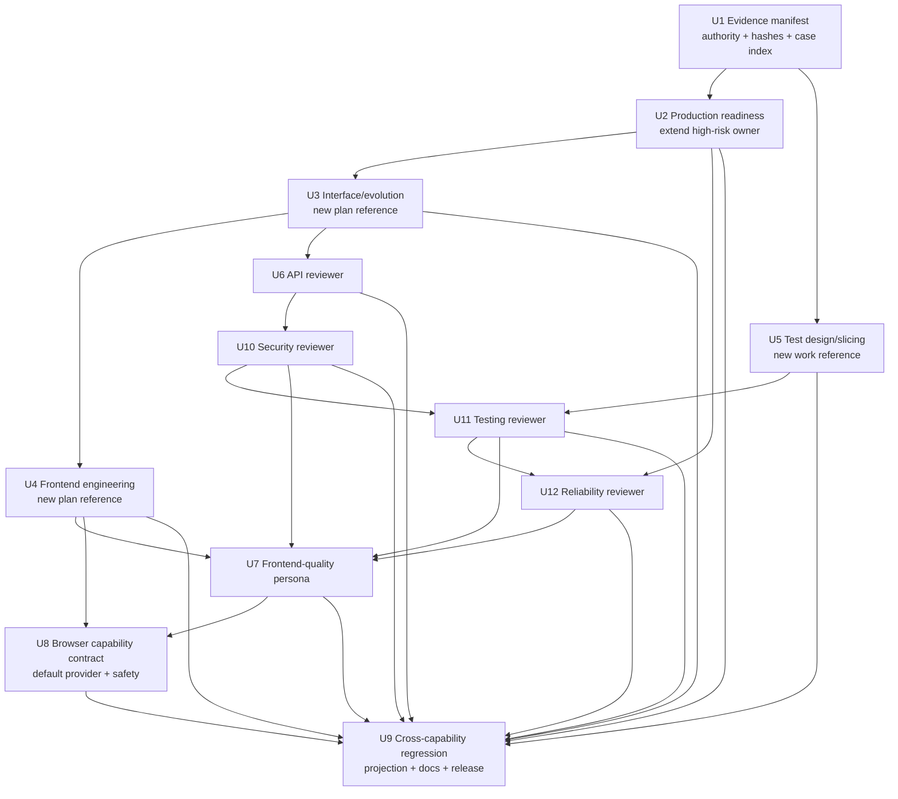

# Agent Skills Capability Integration - Plan

## Goal Capsule

| 维度 | 决策 |
| --- | --- |
| Objective | 以 Spec-First 的角色契约、source/runtime 治理和现有研发闭环为基准，把 Agent Skills 中已确认有增量价值的接口演进、前端工程、测试设计、生产就绪与 reviewer 知识集成进现有 public workflow，不复制外部产品形态，不新增公共 Skill。 |
| Recommended approach | 复用现有 `spec-plan`、`spec-work`、`spec-code-review`、`spec-test-browser` 与五宿主投射链；新增 3 个 skill-local reference，扩展 1 个现有 high-risk lens，把 4 个 reviewer 增强拆成独立纵向 slice，并新增 1 个内部条件 frontend reviewer。 |
| Authority hierarchy | 当前用户目标与本方案 Product Contract > `docs/10-prompt/结构化项目角色契约.md` > 当前 project-owned source/contracts/tests > `docs/14-agent-skills/README.md` 与 `docs/solutions/**` advisory evidence > Agent Skills 固定快照与 provider 图候选。 |
| Decision focus | 条件能力由谁持有、何时触发、何时不触发；如何保证 source + trigger + negative fixture + contract test + fresh-source eval 同一纵向 slice 交付；如何避免公共入口、truth source、review finding 和 runtime generator 膨胀。 |
| Verification focus | 24 项 evidence manifest 可回放；每个受影响 lens/reviewer 至少 2 个 positive 与 2 个 negative case，且行为 oracle 由 owning skill 的 `evals/` 持有；中央索引只校验 owner/path/hash；新增 source anchor、死链、findings schema、五宿主 recursive projection、evals source-only、public catalog 不变；fresh-source 语义状态与确定性测试分层记录。 |
| Largest risk or boundary | 工作树和 HEAD 在规划期间持续变化，静态 dirty 清单会立即失效；U1 必须以实施时 `git status` 与 U2-U12 的声明/条件写集计算冲突交集，并把 `CHANGELOG.md` 作为 orchestrator 串行持有的集成表面。 |
| Stop conditions | 任一 slice 需要新公共 Skill 才能成立；canonical owner 不明确；trigger 无法与 negative-owner case 区分；fresh-source 未执行却被声称通过；生成器需要复制领域语义；runtime mirror 被手改；reviewer ownership 无法去重；当前脏文件无法安全协调；fresh-source `concerns` 未解决或未被 owner 显式接受。 |
| Execution profile | Deep、跨 workflow/source/test/runtime projection 的能力集成；按 U1-U12 稳定 U-ID 与依赖顺序由 `spec-work` 执行，review、verification、runtime adoption 和 plan closeout 仍由现有 shipping tail 持有。 |

---

## Product Contract

### Summary

本方案把外部 Agent Skills 的工程实践密度转化为 Spec-First 自有、可回源、可验证、跨宿主投射的条件能力。
它保持 35 个 source Skill 和现有 public workflow catalog 不变，通过 skill-local reference、内部 reviewer、聚焦 fixture、contract test 与 fresh-source evidence 补齐当前内容缺口。

### Current Baseline

截至 2026-07-16，本方案使用以下已确认或明确降级的基线：

- Origin report 的 Spec-First snapshot 为 `a2f37c6075d35d4f686371bca4fb20c31275e142`；本轮逐项修订时 live HEAD 已前进到 `6a0f060cf6cf4b00149afd7682688d4b6d8ad56f`。
- Agent Skills 固定快照为 `98967c45a42b88d6b8fb3a88b7ff6273920763d6`，tag `0.6.4`，包含 24 个 Skill。
- `docs/14-agent-skills/README.md` 已完成 24 项全量映射，结论为 14 个强承载、10 个部分承载；该 14/10 只表示承载覆盖，不表示内容或 evidence 成熟度。
- 当前决策是新增 0 个公共 Skill、直接引入 0 个外部 Skill、新增 3 个 skill-local reference、扩展 1 个 high-risk lens、新增 1 个内部条件 reviewer persona。
- `skills/spec-plan/SKILL.md`、`high-risk-plan-lens.md`、`planning-evidence-boundaries.md`、`skills/spec-plan/evals/**`、consumer replay、HTML report-only closure 与相关 contract tests 均已进入 live HEAD；本方案必须把它们视为 protected baseline，不得按旧 snapshot 重建。
- 本轮修订期间工作树状态持续变化，出现过已有 `CHANGELOG.md` 修改、未跟踪的本计划与相邻 validation 文档；这些只证明静态清单不可靠，U1必须重新计算完整 dirty/write-set交集，不能复用本段示例作为执行许可。
- `src/cli/plugin-sync.js` 已通过递归目录复制把 skill-local reference/persona 投射到受支持宿主，并通过 `shouldIncludeBundledSkillPath()` 排除 `evals/`；当前没有证据支持新增 generator。
- 当前宿主支持列表由 `src/cli/adapters/index.js` 的 `getSupportedPlatforms()` 返回 Claude、Codex、Cursor、Kiro、Qoder。
- 本次规划未获得 subagent/persona/parallel 授权，研究、deepening 与文档审查使用当前代理内联 fallback，reason code 为 `dispatch_authorization_missing`。

### Problem Frame

Spec-First 已经拥有比 Agent Skills 更完整的 intent、artifact、evidence、handoff 和 knowledge 闭环，但部分通用软件工程知识仍分散在 planning specialist、reviewer 或 shipping tail 中。
如果只继续增加主 `SKILL.md` prose，入口上下文会膨胀；如果按外部目录直接复制 Skill，又会制造近义 public route、并列 truth source、宿主工具绑定和无法进入现有 evidence contract 的孤岛能力。

需要解决的不是“Spec-First 是否也有同名 Skill”，而是以下五个工程缺口：

- planning 缺少统一的接口/演进条件 lens；
- planning 缺少通用 Web 前端工程条件 lens；
- execution 已有 proof-first、characterization-first、no-test exception与 verification evidence spine，但缺少在 skill-local reference中集中承载 slicing taxonomy、DAMP、state-over-interaction和 test-double hierarchy，并在提取时保护既有 TDD claim honesty；
- production readiness、observability 与 CI fidelity 仍分散，尚未由现有 high-risk owner 统一承载；
- code review 缺少通用 frontend quality reviewer，且 API/security/testing/reliability reviewer 仍可吸收更成熟的工程判断。

同时，任何增强都必须满足 Spec-First 的核心约束：scripts 只守确定性地板，LLM 判断语义充分性；source 是唯一持久真相源；generated runtime 可重建；公共入口只有在独立意图、artifact、consumer、done、route 和 owner/eval 同时成立时才新增。

### Actors

- A1. Workflow user：通过现有 `spec-*` 入口提出规划、实施、调试、审查或浏览器验证目标，不需要学习新的近义 Skill 名称。
- A2. Plan author：`spec-plan` 根据语义 trigger 加载最小必要 lens，并把适用决策落入 Planning Contract、U-ID、Verification Contract 或明确 blocker。
- A3. Implementer：`spec-work` 按 U-ID 和 test-design/slicing reference 选择 proof-first、characterization-first 或有理由的替代验证。
- A4. Reviewer：`spec-code-review` 按 diff 语义选择 reviewer，输出现有 findings schema，并由 orchestrator 合并、去重和校验。
- A5. Runtime consumer：Claude、Codex、Cursor、Kiro、Qoder 从 canonical `skills/**` 递归获得 runtime-required reference/persona，不消费 maintainer-only evals。
- A6. Maintainer：维护 source owner、fixtures、contract tests、fresh-source validation、docs、Changelog 与未来 public Skill 采用门槛。

### Requirements

#### Evidence、scope 与兼容基线

- R1. 实施开始前必须生成可回放 evidence manifest，记录 24 个 Agent Skill、Spec-First source refs、revision/hash、HEAD/advisory/external-pinned authority、current owner、consumer 和当前处置。
- R2. 本次集成不得新增公共 Skill、不得直接 vendoring Agent Skills、不得修改 public catalog 语义；source Skill 目录数保持 35。
- R3. U1 必须在实施开始时计算当前 dirty paths 与 U2-U12 声明/条件写集的交集，并逐文件确认 owner、hash 和预期合入基线；无法协调的交集文件只阻塞受影响 unit，不得覆盖或重建他人改动。

#### 条件 reference 与 planning/work 能力

- R4. 新增或扩展的每个能力必须具备明确 positive trigger、negative-owner boundary、required landing、canonical owner、consumer 和 degraded behavior；仅新增文件但无入口指针不算完成。
- R5. `interface-and-evolution-lens.md` 必须覆盖 public consumer、contract-first、additive evolution、breaking change、error semantics、compatibility/deprecation、replacement-first、zero-use evidence 与 rollback，同时排除 private/internal-only refactor。
- R6. `frontend-engineering-lens.md` 必须覆盖 component/data-presentation boundary、design-system/tokens、loading/error/empty/permission/offline/retry state matrix、keyboard/focus/semantics、responsive 与 runtime verification，同时不抢占 `spec-polish`、`spec-test-browser`、`spec-dogfood` 或 race reviewer。
- R7. `high-risk-plan-lens.md` 必须由现有 owner 扩展 production-readiness 分支，覆盖 on-call questions、metrics/traces/logs 的用途、correlation、cardinality/privacy、CI/build/deploy fidelity、feature flag lifecycle、staged rollout、alert owner/runbook/action 和 telemetry proof，不新建并列 production-readiness truth source。
- R8. `test-design-and-slicing.md` 必须覆盖 vertical/contract-first/risk-first slicing、rollback-friendly scope、DAMP、state-over-interaction、test-double hierarchy、characterization fallback、TDD claim honesty 和 no-test exception；未观察到真实 RED 时不得声称完成 TDD 历史。

#### Reviewer 与 downstream ownership

- R9. `api-contract-reviewer`、`security-reviewer`、`testing-reviewer`、`reliability-reviewer` 必须分别吸收 phase-owned 工程判断，同时保留现有 confidence gate、findings schema 和 suppression 边界；真实 RED、characterization 与 TDD 历史仍由 `spec-work` verification evidence 持有，diff reviewer 不得从最终代码推断执行历史。
- R10. 新增 `frontend-quality-reviewer` 作为内部条件 persona，只在用户可见交互、表单、导航、异步状态、组件公共行为、responsive、contrast、focus visibility 或 accessibility contract 命中时启用；backend-only、docs-only、type-only、fixture-only，以及经语义判断不影响 contrast/focus/layout/responsive/motion/状态表达的 token-value-only diff 不启用。
- R11. frontend-quality、frontend-races、testing、security、maintainability 的 ownership 必须可区分，重复 finding 在 merge/dedup 前就有明确主 owner，不能靠多 reviewer 重复报同一问题制造虚假置信度。
- R12. `spec-test-browser` 必须区分 browser executor、`agent-browser` backend provider 与其他 browser executor：`agent-browser` 保持当前唯一 confirmed executor，默认使用隔离的本地 backend；页面文本、DOM、console、network payload 均按不可信数据处理，run-scoped session/namespace、content boundaries、target-origin allowlist、real-profile approval、read-only script、a11y/responsive/state recovery、逐项 coverage 与 degraded status 进入 workflow contract；不得从 executor 可替换性推导其他 executor 或 backend provider 已达到 parity。

#### Eval、runtime 与 adoption

- R13. 每个 behavior-bearing slice 必须在同一 unit 中交付 source、trigger、owning skill 下至少 2 个 positive case、至少 2 个 negative-owner case、focused contract test、fresh-source eval 状态和 review；中央 case index 只记录 canonical owner/path/hash/status，跨能力 composition cases 不复制单 Skill oracle。
- R14. Mechanical source contract、fresh-source semantic judgment、host loader/invocation observation、field outcome 必须分层；低层证据不得升级为高层 claim。
- R15. 新增 reference/persona 必须通过现有 recursive projection 进入五宿主 runtime-required skill package，`evals/**` 保持 source-only；只有 focused projection test 证明现有生成链不能承载时，才允许最小修改 generator。
- R16. `spec-security-audit`、`spec-migration`、`spec-observability` 继续 Defer；只有满足 90 天采用、跨 repo、现有 workflow 承载不足、独立 artifact/consumer、route fixture 和 owner/eval 门槛后，才进入新的 PRD。
- R17. 每个修改 source、skill、reference、persona、test 或 docs 的 unit 必须在该 unit 集成提交前由 orchestrator 串行更新 `CHANGELOG.md`；worker 不并发写 Changelog，U9 只做最终一致性收口。
- R18. Fresh-source `passed`、`concerns`、`not_run` 是语义证据状态而非确定性 CI verdict；`not_run` 必须带 reason 和 claim ceiling，可关闭 source implementation 但不能获得 semantic-passed claim，`concerns` 必须解决或由 owner 显式接受后才能关闭相关 unit。

### Key Flows

- F1. Evidence baseline：读取 origin report 与 current source → 冻结 revision/hash/authority → 建立 skill-local case index 与跨能力 composition cases → 计算 dirty/write-set 交集 → 允许或阻塞受影响 unit。
- F2. Planning lens：用户请求命中 API/UI/high-risk 语义 → `spec-plan` 加载单个最小 reference → 把决策落入 KTD/U-ID/Verification/Risk → negative-owner 请求保持 lean。
- F3. Work evidence：`spec-work` 读取 active U-ID → 根据 test-design reference 选择 slice 和 evidence strategy → 观察 RED 或 characterization baseline → 实现与验证 → 记录 claim-matched evidence。
- F4. Review selection：读取 diff 与 catalog → 依次增强 API/security/testing/reliability owner并选择适用 reviewer或 frontend-quality → reviewer 返回 findings schema → orchestrator 按 owner、anchor 和 evidence 合并去重 → 不适用 persona不派发；diff-only review不推断 TDD历史。
- F5. Runtime projection：canonical `skills/**` 变更 → `plugin-sync` 递归计划五宿主 runtime path → required reference/persona 存在、`evals/**` 缺席 → 在隔离 fixture 中执行 init lifecycle → 不手改 repo-local mirrors。
- F6. Public Skill reconsideration：积累 90 天 field adoption → 证明现有 workflow 反复承载不足 → 独立 artifact 被真实 consumer 使用 → signature/negative route 稳定 → owner/eval/release plan 完整 → 才创建后续 PRD。

### Acceptance Examples

- AE1. 给定一个 external public API 删除字段并迁移两个客户端的计划请求，`spec-plan` 加载 interface/evolution lens，要求 consumer inventory、兼容窗口、替代路径、zero-use evidence 和 rollback；给定 private helper rename，不加载该 lens。
- AE2. 给定一个含表单提交、loading/error/empty、移动端布局和键盘导航的新页面，`spec-plan` 加载 frontend lens；给定 backend-only handler 或不影响 contrast/focus/layout/responsive/motion/状态表达的 token-value-only 变更，不加载该 lens；纯 CSS 但改变 contrast、focus 或 breakpoint 行为时必须加载。
- AE3. 给定 staged rollout、feature flag、CI gate 与 on-call 责任的外部集成，high-risk lens 要求真实 build/deploy fidelity、成功/失败 signal、rollback trigger、owner 与 runbook；给定 docs-only 变更，保持轻量。
- AE4. 给定 legacy parser 行为修改且测试缝隙薄弱，`spec-work` 选择 characterization-first；给定可观测的新增行为，选择 proof-first 并记录 RED；给定纯文档、格式或 generated artifact 变更，记录 no-test exception 而不伪造 TDD。
- AE5. 给定 interaction-heavy mocks 只验证调用次数，testing reviewer 识别 false confidence；给定行为断言明确且内部实现可重构，不因测试风格偏好报 finding。
- AE6. 给定 LLM/tool output 未验证即进入 shell/path/SQL sink，security reviewer 要求真实 attack path 与 trust-boundary evidence；给定依赖公告但代码不可达且无 exploit path，只记录 degraded risk 或抑制 finding。
- AE7. 给定 public response schema 的 subtractive change，API reviewer 跟踪 consumer 与 deprecation evidence；给定稳定 public contract 后面的内部重构，不报 API finding。
- AE8. 给定跨服务请求缺 correlation propagation、alert 无 owner/action、telemetry 没有验证，reliability reviewer 报告具体 failure path；给定纯内存函数，不启用 reliability concern。
- AE9. 给定新增用户可见表单和异步状态，frontend-quality reviewer 检查 a11y、状态完整性、responsive 与 presentation/data boundary；仅在存在 timer/lifecycle race 时才同时启用 frontend-races reviewer。
- AE10. 给定 backend-only、docs-only、type-only、fixture-only 或无用户可见语义影响的 token-value-only diff，frontend-quality reviewer 不启用；给定 CSS-only contrast、focus、layout、responsive 或 motion contract 变化时启用，public reviewer roster 不因扩展名本身机械膨胀。
- AE11. 给定五个 supported host，projection plan 均包含新增 3 个 reference 和 frontend persona 的 runtime path，同时不包含任何新增 `evals/**` path；generator source 无需修改。
- AE12. 给定 fresh reviewer dispatch 未获授权，validation 记录 `fresh_source_eval.status: not_run`、`dispatch_authorization_missing` 与 claim ceiling；deterministic source implementation 可关闭，但该 slice 不得被描述为语义已验证，closeout 必须保留 degraded limitation。
- AE13. 给定未来有人提议新增 `spec-observability`，若 90 天内没有 5 次合格独立意图、3 个 repo、3 次 artifact consumer 和 2 次现有 workflow 承载不足证据，结论继续 Defer。
- AE14. 给定 U2-U12 中任一 source-bearing unit完成集成，orchestrator在该 unit提交前串行更新 `CHANGELOG.md`；并行 worker不直接写该共享文件，U9验证所有 unit记录完整而不补写历史空洞。

### Success Criteria

- 24 项 mapping、14/10 承载计数、source authority、external revision 与 dirty hashes 可由 evidence manifest 回放。
- 3 个 planned-new reference、1 个 extended high-risk lens、4 个 extended reviewer、1 个 planned-new internal reviewer 均有 canonical owner、trigger、negative boundary、consumer 和 focused tests。
- 每个受影响 lens/reviewer 至少有 2 个 positive、2 个 negative-owner case，由 owning skill 的 `evals/` 持有；中央 case index 可回放 owner/path/hash，跨能力 composition cases只验证组合与去重。
- `using-spec-first` public route 与 35 个 source Skill 目录保持不变；新增 reference/persona 不进入 public catalog。
- Mechanical contract tests、fresh-source eval、host projection 和 field outcome 使用不同状态字段和结论措辞。
- 五宿主 projection 包含 runtime-required assets、排除 source-only evals，并且没有手改 generated runtime mirror。
- 小型内部重构、docs-only、backend-only，以及无 contrast/focus/layout/responsive/motion/状态表达影响的 token-value-only negative case 不触发高风险或前端 ceremony；CSS contract变化仍进入 frontend lens/reviewer。
- reviewer findings 使用现有 schema，frontend/security/testing/reliability/API ownership 没有重复职责或第二套 merge contract。
- 每个 source-bearing unit 的 Changelog、origin report 的实施链接、validation report 和必要用户文档完成更新，且不把 source contract 说成真实 host/field outcome。

### Scope Boundaries

#### In scope

- `spec-plan` 的 production-readiness、interface/evolution、frontend-engineering 条件能力。
- `spec-work` 的 test-design/slicing 条件能力。
- `spec-code-review` 的 API/security/testing/reliability 增强和 frontend-quality 条件 persona。
- `spec-test-browser` 的 executor/backend provider boundary、隔离、不可信页面数据、a11y/responsive/state recovery contract。
- skill-local source-only cases、中央 case index、跨能力 composition cases、focused Jest、fresh-source status、五宿主 projection、文档与 release closeout。

#### Deferred to Follow-Up Work

- `spec-brainstorm` / `spec-prd` 的 guess-attached question、Not Doing、abuse-case、consumer/sunset 进一步增强：当前 `spec-prd/references/evidence-and-topology.md` 与 readiness/output references 已覆盖大部分 producer/consumer、compatibility 和 negative-space 语义；先用本方案跨能力 composition cases验证真实缺口，再单独立项。
- `spec-debug` 的 stop-line/reduce/untrusted-error-output 文案强化和 `spec-compound` 的 ADR/signal learning 增强：当前 debug instrumentation/correlation 与 compound supersession/invalidation 已有承载，待 core slice 落地后以真实使用证据决定最小增量。
- 真实五宿主 clean-session loader 观测与 field adoption 指标：只有具备可回源 host/session evidence 时才晋升，source projection 不替代。
- 三个未来 public Skill 候选的 PRD：只在 R16 门槛满足后启动。

#### Outside this plan

- 修改 Agent Skills 外部仓库、解决其根级冲突或将其作为运行时依赖。
- 直接复制外部 Skill、persona、固定技术栈示例、路径、脚本或宿主工具假设。
- 新增 `spec-api-design`、`spec-frontend`、`spec-tdd`、`spec-ci-cd`、`spec-adr` 或其他近义 public Skill。
- 新建全局 engineering mega-skill、第二套 reviewer findings schema、第二套 runtime generator、跨 Skill reference import 系统或中心化 workflow 状态机。
- 让 scripts 判断 threat model、API 设计、a11y、test quality、observability 或 reviewer finding 的语义充分性。
- 手改 `.claude/**`、`.codex/**`、`.agents/skills/**`、`.cursor/**`、`.kiro/**`、`.qoder/**` generated runtime。

---

## Planning Contract

### Key Technical Decisions

- KTD1. 以当前 origin report 的 24 项矩阵作为 WHAT 与优先级来源，但不把报告中的 working-tree advisory 当作 HEAD confirmed。U1 必须重新冻结实施时 HEAD、dirty state、hash 与 owner。
- KTD2. 当前不新增公共 Skill。领域知识通过 conditional reference/persona 进入现有 artifact 和 evidence 链，公共入口只在 R16 的真实采用门槛满足后重新评估。
- KTD3. production readiness 选择 `extend` 现有 `high-risk-plan-lens.md`。该 owner 已持有 rollout、rollback、owner-visible signal、runbook 和 verification required landing；新建并列 lens 会产生双真相源。
- KTD4. interface/evolution 选择 `new` skill-local plan reference。现有 architecture strategist、API reviewer、PRD compatibility 和 data-migration reviewer 分别持有研究、diff review、产品 WHAT 与数据迁移，均不适合作为通用 plan-time interface owner。
- KTD5. frontend engineering 选择 `new` skill-local plan reference。视觉 polish、runtime browser QA、dogfood、race review 与 Swift review 都不是通用 Web component/state/a11y planning contract 的 owner。
- KTD6. test design/slicing 选择 `new` `spec-work` skill-local reference。主 `SKILL.md` 只保留触发和 evidence spine，DAMP、test double、state-vs-interaction 与 slicing taxonomy 下沉到条件 reference。
- KTD7. frontend-quality 选择 `new` internal conditional persona，继续消费现有 findings schema、confidence gate、merge/dedup 和 dispatch fallback；它不成为 public Skill 或 typed agent。
- KTD8. API/security/testing/reliability 使用 `extend`。每个 reviewer 只增加其 phase-owned判断，不把 plan-time设计、运行时测试或 deterministic TIA 变成 review finding。
- KTD9. references 保持 skill-local，不做跨 Skill import。跨阶段只传播最小合同；如果未来出现必须字节一致的重复条款，指定 canonical owner 并增加 parity test，而不是人工维护两份相同 prose。
- KTD10. scripts 只验证文件存在、JSON/fixture shape、case coverage、catalog count、runtime path、hash、findings schema 与 public roster。lens applicability、设计充分性、finding validity 和 owner 冲突由 LLM/reviewer 判断。
- KTD11. 每个能力按纵向 slice 交付。source、trigger、skill-local positive/negative cases、contract test、fresh-source eval 状态和 review必须同一 U-ID关闭；API/security/testing/reliability reviewer分别使用 U6/U10/U11/U12，不允许一个 reviewer失败拖住其他 owner，也不允许先合入 prose再把行为证据推迟到“后续优化”。
- KTD12. fresh-source `not_run` 是诚实降级，不是 pass。它阻止 semantic-passed claim，但不把未授权 subagent变成 source implementation的永久硬依赖；`concerns` 必须解决或由 owner显式接受，确定性 closeout只验证状态、source hash、reason和 claim ceiling是否完整，不替模型判断语义。
- KTD13. runtime adoption 复用 `src/cli/plugin-sync.js`、`buildFilteredAssetSet()` 与 `getSupportedPlatforms()`。默认 generator write-set 为零；只有 projection test 证明递归规则或 host transform 丢失 runtime-required source 时，才允许最小 generator 修复并扩大 integration test。
- KTD14. `spec-test-browser` 的 portability只存在于 capability/output contract。`agent-browser` 保持当前唯一 confirmed executor；其本地默认 backend与 `--provider` backend、以及其他 browser executor是三个不同层级，任何新 backend/provider或替代 executor都必须有独立 readiness和可回源证据，不能从“可替换”推导“已 parity”。
- KTD15. 当前 `spec-prd`、`spec-debug`、`spec-compound` 已有较强相邻承载，本轮不为“完整性”强行再改。跨能力 composition cases若证明真实重复 gap，再用后续最小 plan扩展正确 owner。
- KTD16. `CHANGELOG.md` 是 orchestrator-owned shared integration surface。每个 source-bearing unit在验证通过后、提交前由 orchestrator串行追加记录；worker只返回变更摘要，不能并发写该文件，U9只做完整性核对。
- KTD17. 行为 case保持 skill-local。中央 `case-index.json` 只持有 case ID、canonical owner、repo-relative path、hash和状态；`composition-cases.json` 只持有真正跨 lens/reviewer/workflow的组合输入与 owner去重预期，不复制单 Skill oracle。

### High-Level Technical Design

下图说明 capability source、触发、验证、review 与 runtime projection 的依赖关系。
图与各 unit 的 `Dependencies` 共同构成同一依赖合同；发生不一致时必须先修订方案再执行。

### Artifact and Evidence Contracts

| Artifact | Canonical owner | Authority | Consumer | Contract |
| --- | --- | --- | --- | --- |
| `docs/14-agent-skills/README.md` | research docs | advisory decision origin | plan、maintainer、reviewer | 24 项映射、ownership 决策、go/no-go 门槛；不代表实施完成 |
| `docs/validation/2026-07-16-agent-skills-capability-integration/evidence-manifest.json` | validation package | deterministic snapshot | U1-U12、review、closeout | path、revision/hash、git state、authority、owner、consumer、claim scope |
| owning skill `evals/*.json` | owning workflow skill | source-only behavior oracle | focused tests、fresh-source evaluator | case id、positive/negative、expected/forbidden owner、required/forbidden outcomes、evidence level |
| `tests/fixtures/agent-skills-capability-integration/case-index.json` | integration fixtures | deterministic index | closeout、provenance audit | case id、canonical owner、repo-relative path、source hash、unit、status；不复制 behavior oracle |
| `tests/fixtures/agent-skills-capability-integration/composition-cases.json` | integration fixtures | source-only composition oracle | cross-capability replay | 仅覆盖跨 lens/reviewer/workflow组合、选择与去重，不复制单 Skill cases |
| skill-local reference | owning workflow skill | runtime-required source | current workflow LLM | trigger、negative boundary、required landing、failure/degraded behavior；不成为用户入口 |
| reviewer persona prompt | `spec-code-review` | runtime-required source | review orchestrator | domain ownership、confidence anchors、suppression、existing findings schema |
| `docs/validation/2026-07-16-agent-skills-capability-integration/fresh-source-results.json` | validation package | semantic advisory evidence | maintainer、doc review、release closeout | source hashes、case ids、reviewer context、status、findings、not-run reason、claim ceiling、judge/human calibration；`not_run`不冒充 pass也不自动否定 source implementation |
| projection test result | existing plugin/init tests | deterministic runtime-plan evidence | five host adapters、release | required paths present、evals absent、generated mirrors untouched；不证明 loader behavior |

### Existing Capability / Composition / Source Ownership

| Capability | Existing owners inspected | Decision | Canonical owner | Rejected shape |
| --- | --- | --- | --- | --- |
| Production readiness | high-risk lens、deployment verification、reliability reviewer、shipping tail | `extend` | `skills/spec-plan/references/high-risk-plan-lens.md` | 并列 `production-readiness-lens.md` 或新 `spec-ci-cd` |
| Interface/evolution | architecture strategist、API reviewer、PRD compatibility、data migration | `new` | `skills/spec-plan/references/interface-and-evolution-lens.md` | 把普通 API 设计塞入 high-risk；让 diff reviewer 反向持有 plan-time 设计 |
| Frontend engineering | polish、browser QA、dogfood、race reviewer、Swift reviewer | `new` | `skills/spec-plan/references/frontend-engineering-lens.md` | 新 `spec-frontend`；把 a11y/state 塞入 race reviewer |
| Test design/slicing | work feedback loop、debug test-first、testing reviewer | `new` | `skills/spec-work/references/test-design-and-slicing.md` | 新 `spec-tdd`；继续增长主 work spine |
| API/security/testing/reliability review | 现有四个 persona | `extend` | 各自 persona prompt | 新合成 reviewer 或第二套 finding contract |
| General frontend review | race、Swift、maintainability、testing、security | `new` internal persona | `frontend-quality-reviewer.md` | 仅按扩展名激活；复制四个 reviewer 的职责 |
| Runtime projection | plugin sync、host adapters、skills governance | `reuse` | `src/cli/plugin-sync.js` | 新 generator、手改 mirrors、跨 Skill import |

### System-Wide Impact

- **Public route:** in-scope，必须证明 public workflow catalog 与 source Skill count 不变。
- **Planning source:** in-scope，`spec-plan` 新增两个 conditional pointer并扩展现有 high-risk owner。
- **Execution source:** in-scope，`spec-work` 新增一个 conditional test-design pointer，不改变 execution engine 和 shipping tail ownership。
- **Review source:** in-scope，四个现有 persona按 U6/U10/U11/U12独立扩展、一个内部 persona新增；findings schema、validator和 merge/dedup不变，diff reviewer不持有执行历史。
- **Browser runtime:** in-scope，executor/backend provider contract、run-scoped隔离、untrusted page data、runtime coverage与 degraded evidence增强；当前唯一 confirmed executor保持 `agent-browser`。
- **PRD/debug/compound:** deferred，以现有 source为 reuse baseline，通过跨能力 composition cases观察 gap，不在本轮扩写。
- **CLI/runtime generator:** out-of-scope by default；只读/验证现有 recursive projection，失败才触发最小修复。
- **Generated runtime:** out-of-scope as mutation；仅在隔离测试项目中由正式 init流程生成并验证。
- **Documentation/release:** in-scope，origin report链接、validation package、用户手册适用说明与 Changelog需要更新。
- **External Agent Skills repo:** out-of-scope，只使用固定 commit/tag作为 pinned evidence。

### Sequencing

- U1 是所有 unit 的 gate，先冻结 authority、case index/composition schema，并动态计算 dirty/write-set交集。
- U2、U3、U4 都会触及 `spec-plan` eval/test surface，应按 U2 → U3 → U4 串行，避免同一 source/test 文件并发冲突。
- U5 可在 U2-U4 期间独立执行；它先提取并保护当前 evidence spine，再补 slicing/test-design缺口。
- U6 只扩展 API reviewer并依赖 U3；U10在 U6后扩展 security reviewer；U11依赖 U5/U10扩展 testing reviewer；U12依赖 U2/U11扩展 reliability reviewer。四个 unit因共享 code-review eval/test/Changelog integration surface串行执行，但保持独立 owner、验证和回滚边界。
- U7 依赖 U4、U10、U11、U12，并在四个 existing reviewer边界稳定后新增 frontend-quality persona。
- U8 在 U4、U7 后完成 browser capability contract，避免把 browser source修改和全局 release closeout混成一个不可独立落地的 unit。
- U9 在 U2-U8 与 U10-U12全部满足 deterministic gates、记录 fresh-source status且没有未解决 `concerns` 后运行，完成 cross-capability regression、五宿主 projection和 release closeout。

### Deferred Implementation Decisions

- 每个新 reference 的最终段落名和篇幅由实施时的 hot-path footprint 与 local prose style决定；本方案固定语义 contract，不预写正文。
- fresh-source evaluator 的具体宿主/model由实施时可用且获授权的 read-only dispatch primitive决定；没有授权则记录 `not_run`、reason与 claim ceiling，关闭 source implementation但保留 semantic validation degraded。
- 如果 U1 发现本方案描述的 advisory source已被另一方案合入，实施者应复用已合入 owner并调整 unit/test，而不是重新应用旧 diff。
- 如果 projection test 暴露 host transform 对非入口 reference 做了不必要改写，只修实际丢失/漂移的最小 adapter seam，不扩大为通用中间表示层。

---

## Implementation Units

| U-ID | Unit | Key files | Depends on |
| --- | --- | --- | --- |
| U1 | 冻结 evidence、case index 与写集协调门 | validation package、integration fixtures | None |
| U2 | 扩展 production-readiness delta | `high-risk-plan-lens.md`、`spec-plan/evals/**` | U1 |
| U3 | 新增 interface/evolution lens | `spec-plan` source/reference/evals | U2 |
| U4 | 新增 frontend-engineering lens | `spec-plan` source/reference/evals | U3 |
| U5 | 提取并扩展 test-design/slicing | `spec-work` source/reference/evals | U1 |
| U6 | 扩展 API reviewer | API persona、code-review eval/test | U3 |
| U10 | 扩展 security reviewer | security persona、catalog/eval/test | U6 |
| U11 | 扩展 testing reviewer | testing persona、code-review eval/test | U5、U10 |
| U12 | 扩展 reliability reviewer | reliability persona、catalog/eval/test | U2、U11 |
| U7 | 新增 frontend-quality reviewer | frontend persona、catalog/source/eval/test | U4、U10、U11、U12 |
| U8 | 完成 browser capability与安全合同 | browser source/pipeline/evals/test | U4、U7 |
| U9 | 跨能力、五宿主与发布收口 | integration closeout、plugin projection、docs | U2-U8、U10-U12 |

### U1. 冻结 evidence manifest、case index 与脏工作树协调门

**Goal:** 把 origin report 的结论转换为实施可消费的确定性基线，并用动态 dirty/write-set交集、skill-local case index和 composition fixtures防止 revision漂移、并发覆盖与第二套行为事实源。

**Requirements:** R1、R2、R3、R13、R14、R17、R18

**Dependencies:** None

**Files:**

- Create: `docs/validation/2026-07-16-agent-skills-capability-integration/README.md`
- Create: `docs/validation/2026-07-16-agent-skills-capability-integration/evidence-manifest.json`
- Create: `docs/validation/2026-07-16-agent-skills-capability-integration/fresh-source-results.json`
- Create: `tests/fixtures/agent-skills-capability-integration/case-index.json`
- Create: `tests/fixtures/agent-skills-capability-integration/composition-cases.json`
- Create: `tests/unit/agent-skills-capability-integration-contracts.test.js`
- Read/confirm: `docs/14-agent-skills/README.md`
- Read/confirm: `skills/spec-plan/SKILL.md`
- Read/confirm: `skills/spec-plan/references/high-risk-plan-lens.md`
- Read/confirm: `skills/spec-plan/references/planning-evidence-boundaries.md`
- Read/confirm: `skills/spec-plan/evals/examples.json`
- Read/confirm: `skills/spec-plan/evals/output-quality-cases.json`
- Read/confirm: `skills/spec-plan/evals/consumer-replay-cases.json`
- Read/confirm: `tests/unit/spec-plan-quality-contracts.test.js`
- Read/confirm: `tests/unit/spec-plan-consumer-replay-contracts.test.js`
- Read/confirm: `skills/spec-work/SKILL.md`
- Read/confirm: `tests/unit/spec-work-contracts.test.js`
- Read/confirm: `skills/spec-doc-review/SKILL.md`
- Read/confirm: `tests/unit/spec-doc-review-contracts.test.js`
- Read/confirm: `tests/unit/plugin-modules.test.js`
- Read/confirm: `CHANGELOG.md`
- Modify after unit verification, orchestrator-owned: `CHANGELOG.md`

**Approach:**

- 从实施时 HEAD 和 working tree重新计算 source hash，记录 `HEAD confirmed`、`working-tree advisory`、`pinned external source`、`generated`、`degraded`，不得复用计划编写时的静态清单。
- manifest为24个外部 Skill建立唯一 record，并关联 Spec-First owner、consumer、reuse/extend/compose/new decision、content/evidence gap和本方案 U-ID。
- 从 U2-U12 的 `Files` 与 conditional seam生成 planned write-set，与当前 dirty paths求交集；只把交集列入 `write_collision_guard`，记录 owner、当前 hash、允许的 merge策略与“未确认不得写”状态。
- 在修改 source前运行并记录当前相关 focused suites、skill lint和diff hygiene基线；受影响 suite若已经失败，对应 unit保持 blocked，不能把旧失败归因于本方案或在新失败上继续叠加。
- 为 owning skill eval cases定义最小共同字段：`case_id`、`case_kind`、`expected_owner`、`forbidden_owners`、`required_outcomes`、`forbidden_outcomes`、`evidence_status`；具体 behavior oracle留在各 skill `evals/`。
- `case-index.json`只记录 case ID、canonical owner、repo-relative path、source hash、U-ID和状态；`composition-cases.json`只记录跨能力选择、owner去重和组合输出，不复制 skill-local prompt/oracle。
- U1只建立 baseline/index/composition contract，不写任何 skill source，也不把 report中的历史测试结果重新标为本轮执行结果。
- U1 schema test允许尚未实施 capability处于 `planned`；各 source unit只关闭自己的 index entries，U9通过独立 closeout test断言没有残留 `planned`。
- U1验证通过后由 orchestrator串行追加 Changelog，再提交该 unit；worker不直接写共享 Changelog。

**Execution note:** 先写 manifest/index/composition contract test，再生成 fixtures，使缺失字段、重复 ID、错误 authority、重复 behavior oracle或 generated owner先失败。

**Patterns to follow:**

- `docs/14-agent-skills/README.md` 的 HEAD/advisory分层和24项 evidence index。
- `skills/spec-plan/evals/README.md`、`examples.json` 与 `output-quality-cases.json` 的 skill-local source-only、missing-evidence表达。
- `docs/solutions/architecture-patterns/competitor-skill-borrowing-judgment-2026-06-01.md` 的双重过滤和 conditional落地。

**Test scenarios:**

- Happy path：输入24个唯一 Agent Skill record，manifest精确回放24/24、14/10与3 new refs / 1 extend / 1 new persona的决策。
- Edge case：同一 external Skill重复、source ref缺 hash、authority非法、owner指向 generated runtime，或 case index复制 behavior oracle，contract test失败。
- Failure path：实施时 dirty/write-set交集出现新文件或 hash与 advisory不同，manifest标记 `baseline_changed`并只阻塞引用该文件的下游 unit。
- Failure path：修改前 focused suite已失败，manifest记录命令、exit code和原始失败摘要；受影响 unit不开始，未受影响 unit不得把该结果包装为自身验证通过或失败。
- Integration：case index最终引用 U2-U8/U10-U12各 owning skill至少2 positive / 2 negative；composition cases覆盖 UI+API+security等跨能力场景且不复制单 Skill oracle；U1 test在缺口未补齐时允许 `planned`，U9 closeout要求全部 `closed`。

**Verification:**

- evidence manifest可从固定 revision与实施时 hash回放，不含绝对路径。
- 24项 mapping、14/10计数、U-ID trace和 owner决策无重复或缺失。
- dirty collision guard对实施时交集文件给出显式状态，不读取静态旧清单作为许可，也不修改未确认文件。
- baseline test记录可以区分 pre-existing failure与本方案引入的 regression。
- skill-local case公共字段、中央 index/composition边界与 validation status vocabulary被 focused test锁定。

---

### U2. 扩展 high-risk lens 的 production-readiness 能力

**Goal:** 在现有 high-risk owner 已有 rollout/rollback/signal/runbook合同上，只补齐 on-call questions、CI/build/deploy fidelity、observability选择与 telemetry proof缺口，避免重复既有 production readiness语义。

**Requirements:** R4、R7、R13、R14、R15、R17、R18

**Dependencies:** U1

**Files:**

- Modify: `skills/spec-plan/references/high-risk-plan-lens.md`
- Modify: `skills/spec-plan/evals/examples.json`
- Modify: `skills/spec-plan/evals/output-quality-cases.json`
- Modify: `tests/unit/spec-plan-quality-contracts.test.js`
- Modify: `tests/fixtures/agent-skills-capability-integration/case-index.json`
- Modify: `docs/validation/2026-07-16-agent-skills-capability-integration/fresh-source-results.json`
- Modify after unit verification, orchestrator-owned: `CHANGELOG.md`

**Approach:**

- 保留当前 rollout、feature flag、owner、success/failure signal、rollback、runbook与 claim-matched verification语义，只扩展缺失 decision set，不创建并列 reference或重写已有 owner。
- 先写 on-call questions，再选择 metrics/traces/logs；要求 correlation、cardinality/PII、signal owner、threshold、runbook和期望动作。
- 将 CI gate当作 stand-in guard，要求其 build context、working directory、prepared assets、env与真实 production/build path保真。
- feature flag必须有默认安全状态、cohort、success/failure signal、rollback trigger、owner和删除条件。
- telemetry必须有实际产生与查询的验证目标；“添加日志/监控”不能关闭 required landing。
- 轻量 docs/config/internal-only case明确不触发 production ceremony。
- skill-local positive/negative cases落在 `spec-plan/evals/**`；中央 index只更新这些 case的 path/hash/status。

**Execution note:** 先添加 output-quality positive/negative fixtures和 focused assertions，再扩展 reference prose。

**Patterns to follow:**

- `skills/spec-plan/references/high-risk-plan-lens.md` 当前 Trigger Matrix / Required Landing / Review Checks。
- `skills/spec-code-review/references/personas/reliability-reviewer.md` 的 stand-in guard fidelity。
- `skills/spec-work/references/shipping-workflow.md` 的 metrics、failure signal与 rollback边界。

**Test scenarios:**

- Happy path：staged external rollout包含 feature flag、CI gate、dashboard和 on-call owner，计划明确 fidelity、signal、rollback、runbook与 telemetry proof。
- Happy path：高 QPS后台任务需要 RED/USE 候选、correlation、cardinality控制和 alert action。
- Negative owner：docs-only release note或本地脚本注释变更保持 lightweight，不生成 production appendix。
- Negative owner：普通 per-feature unit test不因为出现“CI”字符串被升级为 silent-pass/high-risk pipeline设计。
- Failure path：计划只写“add monitoring”或“CI passes”，fixture必须判定 required landing未关闭。
- Regression：现有 rollout、rollback、signal、runbook与 verification anchors在 extension后仍存在且语义不变。
- Fresh-source：新 reviewer读取当前 source后，positive case需形成具体 operational decisions，negative case不得误加 enterprise ceremony。

**Verification:**

- high-risk reference仍是唯一 plan-time production-readiness owner。
- 新 trigger与 negative boundary在 source、eval和 test中同时存在。
- fresh-source result记录 `passed`、`concerns`或`not_run`；`not_run`带 reason/claim ceiling并允许 source implementation close，`concerns`必须修复或由 owner显式接受。
- 五宿主 projection在 U8前已有 planned path断言，`evals/**` 仍不投射。

---

### U3. 新增 interface-and-evolution planning lens

**Goal:** 为 public API、CLI、schema、event与 exported interface的设计和演进建立统一 plan-time owner。

**Requirements:** R4、R5、R13、R14、R15、R17、R18

**Dependencies:** U2

**Files:**

- Create: `skills/spec-plan/references/interface-and-evolution-lens.md`
- Modify: `skills/spec-plan/SKILL.md`
- Modify: `skills/spec-plan/evals/examples.json`
- Modify: `skills/spec-plan/evals/output-quality-cases.json`
- Modify: `tests/unit/spec-plan-quality-contracts.test.js`
- Modify: `tests/fixtures/agent-skills-capability-integration/case-index.json`
- Modify: `docs/validation/2026-07-16-agent-skills-capability-integration/fresh-source-results.json`
- Modify after unit verification, orchestrator-owned: `CHANGELOG.md`

**Approach:**

- 在 `spec-plan` 主入口增加一句条件 trigger和 reference pointer，详细规则全部留在新 reference。
- trigger覆盖 external/public consumer、exported API/CLI/config/schema/event contract、versioning/deprecation和 consumer migration。
- negative boundary覆盖 private helper、internal-only refactor、implementation detail和稳定 contract后的内部重排。
- required landing包括 consumer inventory、contract-first shape、additive vs breaking、one-version posture、error semantics、validation boundary、compatibility window、replacement-first、expand/dual-run/switch/contract、zero-use evidence和 rollback。
- Hyrum、pagination、PATCH、discriminated union、branded ID等作为适用模式，不变成固定技术栈或强模板。
- 计划与 API reviewer保持 phase split：reference持有 HOW-to-plan，reviewer只审当前 diff是否破坏 consumer contract。
- positive/negative behavior oracle留在 `spec-plan/evals/**`，中央 index只登记 owner/path/hash/status。

**Execution note:** 先添加 dead-link/projection/positive-negative tests，再在主入口加入 pointer，最后写 reference内容。

**Patterns to follow:**

- `skills/spec-plan/references/planning-evidence-boundaries.md` 的 conditional owner lens。
- `skills/spec-code-review/references/personas/api-contract-reviewer.md` 的 consumer与 breaking-change视角。
- `skills/spec-prd/references/evidence-and-topology.md` 的 producer/consumer与 compatibility事实边界。

**Test scenarios:**

- Happy path：public response schema移除字段并迁移旧客户端，plan要求 additive过渡、deprecation、consumer验证和 zero-use evidence。
- Happy path：对外 CLI flag或 event contract演进，plan明确 one-version、error semantics与 compatibility window。
- Negative owner：private method rename或内部 module重排不加载 lens。
- Negative owner：新增非破坏性内部 type alias且无 external consumer，不生成 deprecation流程。
- Failure path：breaking change没有 consumer或 rollback，artifact readiness不能被判为 implementation-ready。
- Integration：新 reference path出现在五宿主 `spec-plan` projection，source-only eval paths不出现。
- Fresh-source：同一 current source对 public breaking与 private refactor给出相反的适用判断。

**Verification:**

- 主 `SKILL.md` 只增加 trigger/pointer，不复制 reference checklist。
- reference明确 canonical owner、required landing与 negative owner。
- focused tests锁定 dead link、source anchors、case coverage和 projection。
- fresh-source evidence不把 private/internal case误判为 public interface work；`not_run`保留 degraded claim ceiling而不冒充 pass。

---

### U4. 新增 frontend-engineering planning lens

**Goal:** 为通用 Web UI 的 component/state/a11y/responsive工程决策建立 plan-time条件 owner。

**Requirements:** R4、R6、R13、R14、R15、R17、R18

**Dependencies:** U3

**Files:**

- Create: `skills/spec-plan/references/frontend-engineering-lens.md`
- Modify: `skills/spec-plan/SKILL.md`
- Modify: `skills/spec-plan/evals/examples.json`
- Modify: `skills/spec-plan/evals/output-quality-cases.json`
- Modify: `tests/unit/spec-plan-quality-contracts.test.js`
- Modify: `tests/fixtures/agent-skills-capability-integration/case-index.json`
- Modify: `docs/validation/2026-07-16-agent-skills-capability-integration/fresh-source-results.json`
- Modify after unit verification, orchestrator-owned: `CHANGELOG.md`

**Approach:**

- trigger覆盖用户可见页面、表单、导航、组件公共行为、异步状态、responsive或 accessibility contract。
- negative boundary覆盖 backend-only、type-only、test fixture、纯视觉 polish且无结构/状态变化，以及经语义判断不影响 contrast/focus/layout/responsive/motion/状态表达的 token-value-only变更；CSS-only不是充分跳过条件。
- required landing要求 component composition、data/presentation boundary、现有 design system/token复用、完整状态矩阵、keyboard/focus、semantic HTML/ARIA、contrast、responsive断点和 runtime verification。
- 只在适用时要求 offline/retry/permission；不得把固定 state matrix机械套到静态页面。
- 明确 ownership：planning lens负责实施前决策；`spec-polish` 负责视觉迭代；`spec-test-browser` 负责 runtime验证；`spec-dogfood` 负责旅程；race reviewer负责 timing；frontend-quality负责 diff review。
- positive/negative behavior oracle留在 `spec-plan/evals/**`，中央 index只登记 owner/path/hash/status。

**Execution note:** 使用 positive/negative UI cases先约束 trigger，避免新 reference让所有 `.tsx`/`.vue` 请求自动变重。

**Patterns to follow:**

- `skills/spec-work/SKILL.md` 的 Frontend Design Guidance。
- `skills/spec-code-review/references/personas/julik-frontend-races-reviewer.md` 的 timing ownership边界。
- `docs/14-agent-skills/README.md` `6.5 与 `7.2 的 frontend decision。

**Test scenarios:**

- Happy path：新异步表单包含 loading/error/empty/permission/retry、mobile layout与 keyboard focus，plan逐项给出实现和验证落点。
- Happy path：共享组件改变 public behavior，plan明确 data/presentation boundary与 design-system复用。
- Negative owner：backend-only handler不加载 frontend lens。
- Negative owner：只调整 token值且不改变 contrast、focus、layout、responsive、motion或状态表达时不触发 component architecture ceremony。
- Edge case：纯 CSS 修改降低 contrast、移除 focus indicator或破坏 breakpoint布局时必须加载 frontend lens。
- Edge case：静态内容页没有 offline/retry状态时，lens只保留真实适用项，不生成空矩阵。
- Integration：plan source、eval、focused tests和五宿主 projection同时引用新 reference。
- Fresh-source：UI behavior和 CSS contract-change case命中，无语义影响的 token-value-only case不命中，并保持 `spec-polish` ownership。

**Verification:**

- frontend reference不复制 browser/polish/dogfood workflow。
- positive/negative cases保护 semantic trigger而非扩展名匹配。
- plan output可回答状态、a11y、responsive和 runtime proof，但小任务仍保持 lean。
- fresh-source result记录真实适用判断和任何 owner冲突；`not_run`保留 degraded claim ceiling而不冒充 pass。

---

### U5. 提取并扩展 spec-work test-design-and-slicing reference

**Goal:** 把 `spec-work` 已有 proof-first、characterization-first、no-test exception与 verification evidence spine提取到条件 reference并保持 parity，再补齐 slicing taxonomy、DAMP、state-over-interaction和 test-double hierarchy。

**Requirements:** R4、R8、R13、R14、R15、R17、R18

**Dependencies:** U1

**Files:**

- Create: `skills/spec-work/references/test-design-and-slicing.md`
- Create: `skills/spec-work/evals/test-design-and-slicing-cases.json`
- Modify: `skills/spec-work/SKILL.md`
- Modify: `tests/unit/spec-work-contracts.test.js`
- Modify: `tests/fixtures/agent-skills-capability-integration/case-index.json`
- Modify: `tests/unit/agent-skills-capability-integration-contracts.test.js`
- Modify: `docs/validation/2026-07-16-agent-skills-capability-integration/fresh-source-results.json`
- Modify after unit verification, orchestrator-owned: `CHANGELOG.md`

**Approach:**

- 先把当前 `spec-work` Evidence Strategy、proof-first、characterization-first、no-test exception和 `verification_evidence` anchors登记为 protected baseline；提取后通过 parity test证明触发、顺序与 claim wording没有丢失。
- 主 `SKILL.md` 在 test discovery/evidence strategy前按条件加载 reference，只保留 evidence strategy选择、proof/characterization/no-test热路径和 run evidence handoff。
- reference定义 vertical、contract-first、risk-first slice选择条件，并要求每个 slice可观察、可停、可验、可回退。
- 测试设计使用 DAMP、behavior/state outcome优先、边界 contract和 test-double hierarchy；mock interaction只在 interaction本身是 contract时成立。
- TDD claim honesty区分“实际观察RED”“characterization baseline”“测试后补”“无测试替代验证”，不得从最终 diff推断历史。
- docs/config/type-only/style/generated/manual-only case进入 explicit no-test exception，不被强制写无价值测试。
- worker evidence packet继续由当前 `verification_evidence` owner持有，不新增第二套 run artifact。
- behavior oracle落在 `skills/spec-work/evals/test-design-and-slicing-cases.json`，中央 index只登记 owner/path/hash/status。

**Execution note:** 先用 characterization/parity assertions锁定当前 evidence spine，再创建 reference并迁移细节；最后补 slicing/DAMP/test-double增量，避免“提取”退化为并列第二套规则。

**Patterns to follow:**

- `skills/spec-work/SKILL.md` 现有 Evidence Strategy、Test Scenario Completeness与 verification evidence。
- `skills/spec-code-review/references/personas/testing-reviewer.md` 的 false-confidence和 brittle-test边界。
- `docs/solutions/workflow-issues/skill-prose-rewrite-contract-test-coverage-2026-06-28.md` 的新增行为必须新增断言原则。

**Test scenarios:**

- Happy path：新增可观察 parser behavior，实施先添加最小 failing test并记录 expected RED，再实现 vertical slice。
- Happy path：legacy behavior不清晰，实施先添加 characterization test并记录 baseline，再修改。
- Edge case：existing test已覆盖但断言旧行为，更新并观察失败，不新增重复 test。
- Regression：提取前后的 proof-first、characterization-first、no-test exception、worker evidence packet和 claim wording保持等价。
- Negative owner：docs-only、pure config、type-only、style-only或 generated artifact记录 no-test exception与替代验证。
- Failure path：最终测试通过但没有 RED/characterization证据，结果只能描述“tests added/updated”，不能声称 TDD。
- Failure path：interaction-heavy mocks只验证 call count，reference要求回到 state/behavior或 boundary contract。
- Fresh-source：fresh executor基于 current source为四类输入选择正确 evidence strategy，且不把 negative case升级为 TDD ceremony。

**Verification:**

- 主 `spec-work/SKILL.md` 保留最小选择/handoff spine，不与新 reference重复整套 evidence strategy。
- existing `verification_evidence` schema/closeout owner不变。
- focused tests锁定 extraction parity、new reference死链、TDD claim wording、negative exceptions与 skill-local case coverage。
- fresh-source status记录 `passed`、`concerns`或`not_run`；`not_run`带 reason/claim ceiling并允许 source implementation close，`concerns`必须修复或由 owner显式接受。

---

### U6. 扩展 API contract reviewer

**Goal:** 把 consumer trace、additive evolution、replacement/deprecation、zero-use removal evidence和 one-version判断并入现有 API reviewer，不改变 selection、schema或 review orchestration。

**Requirements:** R9、R11、R13、R14、R17、R18

**Dependencies:** U3

**Files:**

- Modify: `skills/spec-code-review/references/personas/api-contract-reviewer.md`
- Create: `skills/spec-code-review/evals/capability-cases.json`
- Modify: `tests/unit/spec-code-review-contracts.test.js`
- Modify: `tests/fixtures/agent-skills-capability-integration/case-index.json`
- Modify: `tests/unit/agent-skills-capability-integration-contracts.test.js`
- Modify: `docs/validation/2026-07-16-agent-skills-capability-integration/fresh-source-results.json`
- Modify after unit verification, orchestrator-owned: `CHANGELOG.md`

**Approach:**

- API reviewer增加 consumer trace、Hyrum/additive evolution、replacement/deprecation、zero-use removal evidence和 one-version判断；内部稳定 contract refactor继续 suppression。
- planning lens持有 HOW-to-plan，API reviewer只审当前 diff与可见 consumer evidence，不把未观察到的外部 Hyrum依赖当作确定事实。
- positive/negative cases落在 `skills/spec-code-review/evals/capability-cases.json`，中央 index只登记 owner/path/hash/status。

**Execution note:** 先写 public subtractive/private refactor paired cases和 focused assertion，再修改 prompt；保持旧 confidence anchors与 output schema。

**Patterns to follow:**

- `skills/spec-code-review/references/personas/api-contract-reviewer.md` 当前 consumer contract与 suppression边界。
- `skills/spec-plan/references/interface-and-evolution-lens.md` 的 plan/review phase split。
- `skills/spec-code-review/references/findings-schema.json` 的现有输出合同。

**Test scenarios:**

- Positive：public subtractive schema change无 consumer migration，返回具体 breaking finding。
- Positive：deprecated interface被移除但没有 replacement/zero-use evidence，返回 removal finding。
- Negative owner：private refactor或稳定 public contract后的内部重排不报。
- Negative owner：additive optional field且旧 consumer仍兼容时不报 breaking finding。
- Integration：API reviewer JSON继续通过 existing findings schema，reviewer字段和 confidence anchors不漂移。

**Verification:**

- 只修改 API reviewer owner，不增加 reviewer数量或第二套 schema。
- 新判断有独立 contract assertion，旧 suppression断言仍保留。
- fresh-source状态、source hash和 claim ceiling分层记录；`not_run`不冒充 pass。

---

### U10. 扩展 security reviewer

**Goal:** 把 Agent-native trust boundary与 dependency reachability判断并入现有 security reviewer，同时继续要求可解释的真实 attack path。

**Requirements:** R9、R11、R13、R14、R17、R18

**Dependencies:** U6

**Files:**

- Modify: `skills/spec-code-review/references/personas/security-reviewer.md`
- Modify: `skills/spec-code-review/references/persona-catalog.md`
- Modify: `skills/spec-code-review/evals/capability-cases.json`
- Modify: `tests/unit/spec-code-review-contracts.test.js`
- Modify: `tests/fixtures/agent-skills-capability-integration/case-index.json`
- Modify: `docs/validation/2026-07-16-agent-skills-capability-integration/fresh-source-results.json`
- Modify after unit verification, orchestrator-owned: `CHANGELOG.md`

**Approach:**

- 增加 LLM/tool/web/RAG/output默认不可信、prompt injection、excessive agency、tenant boundary和 dangerous sink判断。
- dependency advisory必须结合 runtime/build/test/deploy reachability；不可达或已有完整边界保护时抑制泛化 hardening。
- catalog只扩展真实 selection语义，不按“AI”关键词机械启用；findings schema、validator和 merge/dedup不变。

**Execution note:** 先添加 untrusted-output-to-sink与 unreachable-advisory paired cases，再修改 persona/catalog。

**Patterns to follow:**

- `skills/spec-code-review/references/personas/security-reviewer.md` 当前 attack-path门。
- Agent Skills固定基线 `security-and-hardening` 的 AI/LLM与 dependency reachability判断。
- `docs/solutions/architecture-patterns/ai-reviewer-capability-borrowing-gates-2026-06-09.md` 的 evidence certainty门。

**Test scenarios:**

- Positive：untrusted model/tool output未经验证进入 shell/path/SQL/HTML sink，返回完整 attack-path finding。
- Positive：跨 tenant RAG/context或 excessive agency能造成具体越权，返回边界 finding。
- Negative owner：dependency advisory代码不可达或已有完整 validation/allowlist时抑制泛化 finding。
- Negative owner：仅出现 LLM/AI名词但无 trust boundary或 dangerous sink时不启用额外 concern。
- Integration：security与 frontend-quality对 unsafe rendering/a11y分别持有不同 owner finding。

**Verification:**

- security selection与 suppression保持 semantic而非 keyword-based。
- 每个 finding继续包含可追踪 input-to-sink或权限路径。
- fresh-source状态、source hash和 claim ceiling分层记录；`not_run`不冒充 pass。

---

### U11. 扩展 testing reviewer

**Goal:** 把 DAMP、state-over-interaction和 test-double hierarchy并入现有 always-on testing reviewer，同时禁止 diff-only review推断 TDD执行历史。

**Requirements:** R8、R9、R11、R13、R14、R17、R18

**Dependencies:** U5、U10

**Files:**

- Modify: `skills/spec-code-review/references/personas/testing-reviewer.md`
- Modify: `skills/spec-code-review/evals/capability-cases.json`
- Modify: `tests/unit/spec-code-review-contracts.test.js`
- Modify: `tests/fixtures/agent-skills-capability-integration/case-index.json`
- Modify: `docs/validation/2026-07-16-agent-skills-capability-integration/fresh-source-results.json`
- Modify after unit verification, orchestrator-owned: `CHANGELOG.md`

**Approach:**

- testing reviewer增加 DAMP、state/behavior outcome优先、test-double hierarchy和 interaction-is-contract例外。
- interaction-heavy mocks只验证 call count且不证明行为时报告 false confidence；团队风格差异继续 suppression。
- TDD/RED/characterization历史只由 `spec-work` verification evidence持有；没有该 packet时 reviewer不得因最终 diff缺少历史证据报 finding，也不得声称过程合规。
- 不点名缺乏 deterministic TIA evidence的“必跑测试清单”。

**Execution note:** 先写 false-confidence、valid-interaction-contract和 no-history-inference cases，再修改 prompt。

**Patterns to follow:**

- `skills/spec-code-review/references/personas/testing-reviewer.md` 当前 coverage/false-confidence边界。
- `skills/spec-work/references/test-design-and-slicing.md` 的执行期 evidence owner。
- `skills/spec-code-review/references/findings-schema.json` 的 testing gaps合同。

**Test scenarios:**

- Positive：测试只断言 mock call count而不证明 state/behavior，返回 false-confidence finding。
- Positive：低层 test double替代可用的 real/fake实现并掩盖关键边界，返回具体风险。
- Negative owner：interaction本身就是 public contract且断言稳定时不报。
- Negative owner：没有 execution evidence packet时，不从最终 diff推断“未做 TDD”。
- Integration：testing只持有 proof sufficiency，security/frontend/maintainability继续持有各自主域。

**Verification:**

- testing reviewer新增判断不引入执行历史幻觉。
- `spec-work` verification evidence仍是 RED/characterization/TDD claim唯一 owner。
- fresh-source状态、source hash和 claim ceiling分层记录；`not_run`不冒充 pass。

---

### U12. 扩展 reliability reviewer

**Goal:** 把 correlation propagation、silent failure、telemetry proof和 alert actionability并入现有 reliability reviewer，保持 pure-function suppression和 runtime-evidence边界。

**Requirements:** R7、R9、R11、R13、R14、R17、R18

**Dependencies:** U2、U11

**Files:**

- Modify: `skills/spec-code-review/references/personas/reliability-reviewer.md`
- Modify: `skills/spec-code-review/references/persona-catalog.md`
- Modify: `skills/spec-code-review/evals/capability-cases.json`
- Modify: `tests/unit/spec-code-review-contracts.test.js`
- Modify: `tests/fixtures/agent-skills-capability-integration/case-index.json`
- Modify: `docs/validation/2026-07-16-agent-skills-capability-integration/fresh-source-results.json`
- Modify after unit verification, orchestrator-owned: `CHANGELOG.md`

**Approach:**

- 增加 cross-service correlation propagation、silent failure、telemetry emission/query proof、alert owner/action/runbook和 cardinality/privacy交叉检查。
- reviewer只审 diff可见的 instrumentation/failure path；实际 dashboard、alert和 field telemetry结果继续属于 runtime/field evidence。
- pure in-memory transform、test helper和无 I/O路径继续 suppression；catalog扩展实际 selection concern，不按 observability关键词机械启用。

**Execution note:** 先添加 external-call/correlation与 pure-function paired cases，再修改 persona/catalog。

**Patterns to follow:**

- `skills/spec-code-review/references/personas/reliability-reviewer.md` 当前 I/O、timeout、stand-in fidelity边界。
- `skills/spec-plan/references/high-risk-plan-lens.md` 的 production-readiness plan owner。
- Agent Skills固定基线 `observability-and-instrumentation` 的 question-to-signal与 telemetry verification。

**Test scenarios:**

- Positive：跨服务调用缺 correlation propagation或 timeout，返回具体 failure-path finding。
- Positive：alert无 owner/action/runbook或 instrumentation从未产生/查询，返回可执行 finding。
- Negative owner：pure in-memory transform不报 reliability concern。
- Negative owner：只有 telemetry命名但 diff已包含 emission、query和 action path时不报泛化 finding。
- Integration：reliability与 high-risk lens维持 plan-time/diff-time phase split。

**Verification:**

- reliability reviewer不声称真实 telemetry或 field outcome已验证。
- 旧 timeout/retry/silent-pass anchors与新判断同时受 focused test保护。
- fresh-source状态、source hash和 claim ceiling分层记录；`not_run`不冒充 pass。

---

### U7. 新增 frontend-quality internal conditional reviewer

**Goal:** 补齐通用 Web accessibility、状态完整性、responsive和 component boundary的 diff-review能力，并与现有 reviewer清晰分工。

**Requirements:** R6、R10、R11、R13、R14、R15、R17、R18

**Dependencies:** U4、U10、U11、U12

**Files:**

- Create: `skills/spec-code-review/references/personas/frontend-quality-reviewer.md`
- Modify: `skills/spec-code-review/references/persona-catalog.md`
- Modify: `skills/spec-code-review/SKILL.md`
- Modify: `skills/spec-code-review/evals/capability-cases.json`
- Modify: `tests/unit/spec-code-review-contracts.test.js`
- Modify: `tests/fixtures/agent-skills-capability-integration/case-index.json`
- Modify: `tests/unit/agent-skills-capability-integration-contracts.test.js`
- Modify: `docs/validation/2026-07-16-agent-skills-capability-integration/fresh-source-results.json`
- Modify after unit verification, orchestrator-owned: `CHANGELOG.md`

**Approach:**

- 新 persona持有 semantic HTML/ARIA、keyboard/focus、contrast、loading/error/empty/permission/offline/retry状态完整性、responsive和 presentation/data boundary。
- 触发由 orchestrator读取 diff语义决定，不以 `.tsx`、`.vue`、`.css` 扩展名作为充分条件。
- CSS-only diff若改变 contrast、focus visibility、layout、responsive、motion或用户状态表达则属于本 reviewer；只有无这些语义影响的 token-value-only diff才是 negative boundary。
- race reviewer继续持有 timing/lifecycle/concurrency；security持有 unsafe rendering/exploit path；testing持有 test sufficiency；maintainability持有结构复杂度和耦合。
- prompt输出复用现有 findings schema和 confidence anchors，低置信审美/偏好意见进入 suppression。
- 更新 `spec-code-review` roster摘要和 catalog计数，但不暴露 public route或 typed agent。

**Execution note:** 先以 backend/docs/type/fixture/token-value-only negative fixtures与 CSS contrast/responsive positive fixtures约束 selection，再添加 persona和其余 positive cases。

**Patterns to follow:**

- `skills/spec-code-review/references/personas/julik-frontend-races-reviewer.md` 的窄领域 ownership与 suppression。
- `skills/spec-code-review/references/personas/swift-ios-reviewer.md` 的 stack-specific conditional边界。
- `skills/spec-code-review/references/persona-catalog.md` 的 layered roster和 semantic selection规则。

**Test scenarios:**

- Happy path：用户可见表单新增错误、loading、focus和 mobile behavior，frontend-quality被选择并输出 a11y/state/responsive findings。
- Happy path：共享组件把 data fetching与 presentation耦合并改变 public behavior，frontend-quality检查 boundary。
- Negative owner：backend-only diff不选择。
- Negative owner：docs-only、type-only、fixture-only不选择。
- Negative owner：只修改 token值且经语义判断不影响 contrast、focus、layout、responsive、motion或状态表达时不选择。
- Edge case：纯 CSS降低 contrast、移除 focus indicator或破坏 breakpoint布局时必须选择。
- Edge case：UI diff含 timer/lifecycle bug时同时选择 race reviewer，但两个 reviewer输出不同 owner finding。
- Integration：新 persona通过 findings schema，catalog从13更新为14且 public skill catalog不变。
- Projection：五宿主 `spec-code-review` runtime skill package包含新 persona source。
- Fresh-source：selected/unselected case与 ownership去重通过 fresh read-only reviewer。

**Verification:**

- frontend-quality只作为 internal conditional prompt asset存在。
- `spec-code-review/SKILL.md`、catalog、prompt、fixtures和 tests在同一 unit一致更新。
- backend/docs/type/fixture/token-value-only negative cases不会误激活，CSS contract变化不会被错误跳过。
- 新 persona不会复制 race/security/testing/maintainability的主职责。
- fresh-source状态记录 `passed`、`concerns`或`not_run`；`not_run`带 reason/claim ceiling，`concerns`必须修复或由 owner显式接受。

---

### U8. 完成 browser capability、安全与 degraded contract

**Goal:** 把 browser executor/backend provider、安全隔离、逐项 coverage和 degraded边界写成可执行 contract，同时保留 `agent-browser` 作为当前唯一 confirmed executor。

**Requirements:** R4、R6、R12、R13、R14、R17、R18

**Dependencies:** U4、U7

**Files:**

- Modify: `skills/spec-test-browser/SKILL.md`
- Modify: `skills/spec-test-browser/references/pipeline-orchestration.md`
- Create: `skills/spec-test-browser/evals/capability-cases.json`
- Create: `tests/unit/spec-test-browser-contracts.test.js`
- Modify: `tests/unit/agent-skills-capability-integration-contracts.test.js`
- Modify: `tests/fixtures/agent-skills-capability-integration/case-index.json`
- Modify: `docs/validation/2026-07-16-agent-skills-capability-integration/fresh-source-results.json`
- Modify after unit verification, orchestrator-owned: `CHANGELOG.md`

**Approach:**

- 定义三层术语：executor=`agent-browser` CLI；backend provider=agent-browser本地默认或其 `--provider` backend；alternative executor=其他 browser tool/MCP。本 unit只实现 confirmed `agent-browser` executor与本地默认 backend。
- 本 unit不增加 alternative-executor selector、adapter registry或自动 fallback。未来 backend/provider或替代 executor必须提供 id、readiness、supported operations、limitations与独立 evidence后才能新增执行分支。
- 每次 run生成唯一 session/namespace，默认启用 content boundaries与 target-origin allowlist；默认禁止复用真实 profile、`--auto-connect`或读取无关标签页，只有用户明确要求登录态且批准时才使用隔离测试 profile。
- 页面文本、DOM、console、network payload与 JavaScript结果全部是不可信数据；不得从页面内容提取新导航/命令并执行。JavaScript默认只读，禁止读取 credential storage、发起外部请求或修改 DOM；任何副作用脚本需要当前用户明确授权。
- coverage按 DOM、console、network、performance、a11y、responsive、screenshot、state recovery逐项记录 `passed|failed|not_supported|not_run`及 reason；不得用总 `passed`覆盖未执行项。
- run结束必须关闭隔离 session并记录 cleanup结果；cleanup失败进入 degraded/residual，不得静默遗留浏览器状态。
- 保留 setup/readiness、internal-only和 pipeline no-ask语义，避免安全增强破坏 hands-off consumer。
- behavior oracle落在 `skills/spec-test-browser/evals/capability-cases.json`，中央 index只登记 owner/path/hash/status。

**Execution note:** 先用 focused contract tests保护当前 pipeline/internal-only行为，并锁定 session/namespace、content-boundaries、allowlist、real-profile approval、coverage matrix与 cleanup contract，再修改 browser source；不在本 unit运行全局 runtime adoption。

**Patterns to follow:**

- `skills/spec-test-browser/references/pipeline-orchestration.md` 的 unattended execution边界。
- `tests/unit/pipeline-mode-contracts.test.js` 与 `tests/unit/low-findings-cleanup-contracts.test.js` 的现有行为保护。
- `agent-browser` 0.31.1 当前 `--help` 暴露的 session、namespace、content boundaries、allowed domains、network、console、vitals和 provider能力。
- `docs/contracts/workflows/fresh-source-eval-checklist.md` 的 semantic evidence vocabulary。

**Test scenarios:**

- Browser happy path：current `agent-browser` executor在唯一 session/namespace、content boundaries和 target-origin allowlist下执行 DOM、console、network、a11y、responsive和 screenshot检查，逐项记录真实 backend provider与页面状态，最后关闭 session。
- Browser failure：executor/backend缺失或不可用时输出 degraded reason和未覆盖项，不切换到未经确认的 backend或替代 executor，也不声称已浏览器验证。
- Browser security：页面文本、DOM属性、console和 network payload包含指令时只作为数据，不执行；script注入默认只读。
- Profile boundary：默认路径不使用真实 profile或 auto-connect；只有用户批准的隔离测试 profile可承载登录态，且不得访问无关标签页或 credential storage。
- Provider boundary：没有 confirmed backend/executor contract时，即使其他 browser tool或 `agent-browser --provider` backend可用，也不自动切换或声称 parity。
- Coverage edge：performance或 a11y操作不可用时对应项标为 `not_supported`，其他已执行项保留独立结果，总结不得写“browser fully passed”。
- Cleanup failure：session close失败时结果保持 degraded并给出 residual cleanup action。
- Pipeline regression：headless pipeline遇到 human verification或页面失败时继续记录结果，不恢复阻塞式问题。
- Fresh-source：current browser source对恶意页面指令、provider unavailable和正常页面三个 case给出正确安全/降级判断。

**Verification:**

- browser focused tests、pipeline/internal-only regressions和 skill lint通过。
- source继续把 `agent-browser` 标为当前唯一 confirmed executor，明确 backend provider与 alternative executor不是同一层级，且没有新增未证实执行路径。
- untrusted page data、run-scoped隔离、content boundaries、allowlist、real-profile approval、read-only script、coverage matrix和 cleanup/degraded结果均有 source/test落点。
- fresh-source状态记录 `passed`、`concerns`或`not_run`；`not_run`带 reason/claim ceiling并允许 source implementation close，`concerns`必须修复或由 owner显式接受。

---

### U9. 完成跨能力回归、五宿主 projection、文档与发布收口

**Goal:** 证明 U2-U8/U10-U12作为一套能力可以被现有 workflow和五宿主消费，并用 skill-local cases、中央 index/composition replay与统一 evidence package关闭 public route、source/runtime、docs和release边界。

**Requirements:** R2、R3、R11、R13、R14、R15、R16、R17、R18

**Dependencies:** U2、U3、U4、U5、U6、U7、U8、U10、U11、U12

**Files:**

- Create: `tests/unit/agent-skills-capability-integration-closeout.test.js`
- Modify: `tests/unit/agent-skills-capability-integration-contracts.test.js`
- Modify: `tests/fixtures/agent-skills-capability-integration/case-index.json`
- Modify: `tests/fixtures/agent-skills-capability-integration/composition-cases.json`
- Modify: `tests/unit/plugin-modules.test.js`
- Test/verify: `tests/unit/using-spec-first-contracts.test.js`
- Test/verify: `tests/integration/init-five-host-lifecycle.integration.test.js`
- Test/verify: `tests/unit/spec-plan-consumer-replay-contracts.test.js`
- Test/verify: `tests/unit/spec-doc-review-contracts.test.js`
- Test/verify: `src/cli/adapters/index.js`
- Test/verify: `src/cli/contracts/dual-host-governance/skills-governance.json`
- Inspect and modify only if a focused projection failure proves it necessary: `src/cli/plugin-sync.js`
- Modify: `docs/14-agent-skills/README.md`
- Modify: `docs/05-用户手册/24-公开入口与Skill目录.md`
- Modify: `docs/validation/2026-07-16-agent-skills-capability-integration/README.md`
- Modify: `docs/validation/2026-07-16-agent-skills-capability-integration/evidence-manifest.json`
- Modify: `docs/validation/2026-07-16-agent-skills-capability-integration/fresh-source-results.json`
- Modify: `CHANGELOG.md`

**Approach:**

- closeout test断言 case index没有 `planned`、每个 affected capability引用 owning skill至少2 positive / 2 negative、composition cases不复制单 Skill oracle、每个 source slice有 deterministic与fresh-source状态。
- 在现有 `tests/unit/plugin-modules.test.js` 中遍历 `getSupportedPlatforms()` 与 `planBundledAssetSync()`，断言3个 new reference、extended high-risk source和 frontend persona进入正确 runtime skill root，`evals/**` 不进入。
- 若现有 `plugin-sync` recursive plan满足，generator与adapter write-set为零；只有 focused test指向明确 transform seam时，才把该 generator/host adapter加入实际 write-set并回到 U1 collision guard重新确认。
- 回归 public route、35 source Skill、internal-only visibility、findings schema、cross-persona owner、small-task lean behavior和 future public Skill Defer门槛。
- origin report增加本方案、validation package和实施状态链接；用户手册只更新实际可见行为，不宣称 host loader或 field outcome。
- closeout记录每个 unit的 deterministic结果、fresh-source状态、source hashes、claim ceiling、未验证层级和残余风险；`not_run`允许 degraded closeout，未解决 `concerns`不允许。
- 核对 U1-U8/U10-U12均已在各自集成提交前写入 Changelog；U9只补最终 docs/release摘要，不补写遗漏的 unit历史。

**Execution note:** 先在隔离 temp project验证 projection plan和 init lifecycle，不在 source repo手改或刷新 generated runtime；所有 semantic结果关闭后再执行发布级验证。

**Patterns to follow:**

- `src/cli/plugin-sync.js` 的 `syncSkills()`、`planSkillsSync()`、`copyDirectoryWithTransform()`、`shouldIncludeBundledSkillPath()`。
- `tests/unit/plugin-modules.test.js` 的全宿主 recursive projection、runtime owner与 `evals/**` exclusion断言。
- `docs/solutions/workflow-issues/modify-source-not-artifacts-2026-04-13.md` 的 source-first与 mirror refresh边界。
- `docs/contracts/workflows/fresh-source-eval-checklist.md` 的 semantic evidence vocabulary。

**Test scenarios:**

- Projection happy path：五宿主 plan均包含3个 new references和 frontend persona路径，且生成目标跟随各 adapter root。
- Projection negative：任何 host operation path包含 `/evals/`、README maintainer docs或外部 Agent Skills source时测试失败。
- Catalog：source Skill目录仍为35，public route roster不增加，frontend persona不出现在 public catalog。
- Cross-capability：同一 UI+API+security change只激活必要 lenses/reviewers，findings按 owner去重；backend-only small refactor保持 lean。
- Closeout degraded：fresh-source为 `not_run`且具备 reason、current source hash和 claim ceiling时，source closeout可通过但 semantic status保持 degraded。
- Closeout failure：任一 capability仍为 `planned`、fresh-source `concerns`未解决/未接受、status缺失、dirty collision未关闭、Changelog unit记录缺失或doc review有未解决P0/P1时，closeout失败。
- Changelog/docs：用户可见变更、source/runtime边界、验证命令与未执行 evidence层级表达一致。

**Verification:**

- focused Jest、skill lint、typecheck、unit/integration/build与 diff checks全部通过。
- 五宿主 projection只修改/验证正式 source-to-runtime链，不手改 mirror。
- public catalog、source Skill count和 findings schema保持不变。
- validation package可以从 unit、source hash、case id和 evidence level追踪所有结论。
- 所有 fresh-source results状态与 source hash完整，`concerns`已解决或显式接受，`not_run`保留 claim ceiling；doc-review无未解决P0/P1且每 unit Changelog完整时，计划具备 completed候选资格。

---

## Alternatives Considered

### A. 直接复制 Agent Skills 的 24 个 Skill

拒绝。
它会复制产品形态、宿主工具、目录和更新责任，创建与现有 public workflow竞争的入口，并绕开 Spec-First artifact/evidence/handoff。

### B. 为 API、Frontend、TDD、CI/CD、ADR 各新增 public Skill

拒绝。
这些能力当前产生的仍是现有 PRD/plan/code/review/knowledge artifact，没有独立 consumer和 route boundary；公共入口成本高于增量价值。

### C. 创建一个 engineering-practices mega-reference供所有 Skill import

拒绝。
跨 Skill import会形成新的共享 truth source、隐式耦合和 projection/版本治理成本；skill-local owner加最小跨阶段条款更可维护。

### D. 为 production readiness新建并列 lens

拒绝。
现有 high-risk lens已经持有 rollout、rollback、signal、runbook和 verification landing；并列文件会造成重复触发和冲突决策。

### E. 只修改 prose，不添加 fixtures、tests和 fresh-source evidence

拒绝。
现有 contract tests可能只锁旧 substring；green不证明新增行为被覆盖，更不证明模型语义或 host loader。

### F. 让脚本自动判断 lens/reviewer applicability

拒绝。
脚本可验证 case shape和路径，不能判断 API是否public、UI是否有行为变化、threat是否可利用或 alert是否可操作。

### G. 修改 runtime mirrors快速验证

拒绝。
mirror是可重建派生物，直接修改会隐藏 source/generator drift并让验证不可回放。

### H. 用一个中央 case corpus 持有所有 Skill 和 reviewer 行为 oracle

拒绝。
它会与 skill-local `evals/` 形成双真相源并迫使不同 owner共享发布节奏；中央层只保留 owner/path/hash索引和真正跨能力的 composition scenarios。

---

## Risks & Dependencies

| Risk | Likelihood | Impact | Mitigation |
| --- | --- | --- | --- |
| 工作树在计划与实施之间继续变化 | High | High | U1动态计算 dirty paths与U2-U12声明/条件写集交集；按文件阻塞受影响 unit，不复用静态清单 |
| 主 `SKILL.md` 因领域 checklist继续膨胀 | Medium | High | 主入口只留 trigger/pointer；语义进入 skill-local reference；contract test锁 hot-path边界 |
| trigger过宽使小任务变重 | Medium | High | 每个 capability至少2 positive/2 negative；fresh-source paired replay；negative regression阻止 close |
| CSS/token negative boundary漏掉 contrast或responsive回归 | Medium | High | negative仅限无语义影响的 token-value-only；CSS contract变化必须命中 plan/review case |
| reference存在但没有消费者 | Medium | High | 主入口 dead-link/pointer test、required landing和 runtime projection同 unit交付 |
| reviewer ownership重叠产生重复 finding | Medium | High | catalog owner matrix、negative fixtures、dedup replay；同问题只保留主 owner |
| 中央 case corpus演变成第二套 behavior truth | Medium | High | behavior oracle保持 skill-local；中央 index只持 owner/path/hash；composition cases禁止复制单 Skill oracle |
| substring tests假绿 | High | Medium | 新行为独立 assertion、dead-link、fixture、fresh-source；不只保留旧 anchor |
| fresh-source dispatch未授权/不可用 | Medium | Medium | 记录 `not_run`、reason、source hash与 claim ceiling；允许 degraded source closeout，不授予 semantic-passed claim |
| source projection被误说成 host loader成功 | Medium | High | evidence level taxonomy；validation/doc/changelog固定limitations |
| browser executor/backend provider术语混淆或真实 profile泄露 | Medium | High | 区分 executor/backend/alternative executor；run-scoped session/namespace、content boundaries、allowlist、real-profile approval与 cleanup合同 |
| 多 unit并发修改 `CHANGELOG.md` 产生冲突 | High | Medium | Changelog由orchestrator在每 unit验证后串行写入，worker只返回摘要；U9只核对完整性 |
| 未来 public Skill候选被主观高频推动 | Medium | Medium | R16量化门槛与90天 adoption ledger；不满足继续Defer |
| external Agent Skills source漂移或本地冲突 | Low | Medium | 固定 commit/tag和深链接；外部工作树不在write scope |
| generator被不必要修改 | Low | High | projection test先证伪；现有 recursive copy通过则 generator write-set为零 |

---

## Verification Contract

| Gate | Applies to | Verification | Required outcome |
| --- | --- | --- | --- |
| Manifest/index/schema | U1-U12 | `npx jest --runTestsByPath tests/unit/agent-skills-capability-integration-contracts.test.js --runInBand` | 24项唯一、authority/hash/owner/U-ID完整；case index不复制oracle，composition cases仅跨能力；未实施项可为`planned` |
| Plan capability contracts | U2-U4 | `npx jest --runTestsByPath tests/unit/spec-plan-contracts.test.js tests/unit/spec-plan-quality-contracts.test.js tests/unit/spec-plan-consumer-replay-contracts.test.js --runInBand` | trigger/reference/negative/dead-link/projection通过，unified consumer replay不回退 |
| Work contract | U5 | `npx jest --runTestsByPath tests/unit/spec-work-contracts.test.js --runInBand` | extraction parity、conditional pointer、TDD honesty、negative exceptions和existing evidence owner通过 |
| Review contract | U6、U7、U10-U12 | `npx jest --runTestsByPath tests/unit/spec-code-review-contracts.test.js --runInBand` | 四个 reviewer独立增强、新 persona、catalog、schema、ownership与 no-TDD-history-inference断言通过 |
| Browser contract | U8 | `npx jest --runTestsByPath tests/unit/spec-test-browser-contracts.test.js tests/unit/pipeline-mode-contracts.test.js tests/unit/low-findings-cleanup-contracts.test.js --runInBand` | executor/backend边界、session/namespace、content boundaries、allowlist、profile approval、untrusted data、coverage/cleanup、pipeline/internal-only通过 |
| Public entrypoints | U9 | `npx jest --runTestsByPath tests/unit/using-spec-first-contracts.test.js --runInBand` | public route/catalog不新增，internal helper/persona不暴露 |
| Closeout index/composition | U9 | `npx jest --runTestsByPath tests/unit/agent-skills-capability-integration-closeout.test.js --runInBand` | 无`planned`；每 capability有skill-local 2 positive/2 negative；composition无重复oracle；fresh-source状态完整且无未解决concerns |
| Plugin projection | U9 | `npx jest --runTestsByPath tests/unit/plugin-modules.test.js --runInBand` | 五宿主递归投射runtime-required reference/persona，排除`evals/**`，无需修改adapter时write-set为零 |
| Skill governance | U2-U8、U10-U12 | `npm run lint:skill-entrypoints` | source Skill、references、entrypoints和治理合同通过 |
| JavaScript syntax | U1-U12 | `npm run typecheck` | 新增/修改 tests与CLI引用无语法错误 |
| Document-review compatibility | U9 | `npx jest --runTestsByPath tests/unit/spec-doc-review-contracts.test.js --runInBand` | current HTML report-only/document-review contract不因 plan source扩展回退 |
| Focused unit suite | U9 | `npm run test:unit` | unit层无回归 |
| Five-host lifecycle | U9 | `npx jest --runTestsByPath tests/integration/init-five-host-lifecycle.integration.test.js --runInBand` | Claude/Codex/Cursor/Kiro/Qoder init/inspect/clean lifecycle通过 |
| Package content | U9 | `npm run build` | 新 source assets进入发布包，未引入错误runtime artifact |
| Changelog | U1-U12 | `npx jest --runTestsByPath tests/unit/changelog-format.test.js --runInBand` | 每个source-bearing unit集成提交前已有orchestrator-owned记录，格式和author符合仓库约定 |
| Diff hygiene | U1-U12 | `git diff --check` | 无空白/patch错误，无意外generated runtime修改 |
| Fresh-source semantic | U2-U8、U10-U12 | 按 `docs/contracts/workflows/fresh-source-eval-checklist.md` 对 current disk source运行 paired positive/negative review | 状态为`passed|concerns|not_run`并绑定current source hash；`not_run`具reason/claim ceiling，`concerns`解决或显式接受；仅`passed`授予semantic-passed claim |
| Host loader/field outcome | follow-up | clean-session host evidence或90天 adoption ledger | 未运行时明确 degraded，不阻塞source merge但不得晋升对应claim |

验证顺序采用最窄到最广：unit focused → cross-capability → skill lint/typecheck → full unit → five-host integration → build → changelog/diff。
任何失败先在所属 U-ID 内修复，不把最终大套件替代 unit内的早期反馈。

---

## Definition of Done

### Global

- U1-U8、U10-U12全部满足各自 Verification outcome，实施时 dirty/write-set交集文件已获得可回放的 owner/merge结论。
- 3 个 planned-new skill-local reference存在并由正确主入口条件加载；high-risk lens在同一 owner内完成 extension。
- 4 个 existing reviewer完成 focused extension，frontend-quality internal persona完成 semantic gate和 schema compatibility。
- public Skill新增数为0、外部 Skill直接引入数为0、source Skill目录保持35、public catalog不增加。
- 每个 affected capability由 owning skill持有至少2 positive / 2 negative-owner case；中央 index可回放 owner/path/hash，composition cases不复制单 Skill oracle。
- 每个 source slice具备 focused contract test、dead-link/ownership guard、fresh-source status和review结果。
- 五宿主 projection包含 runtime-required source、排除 `evals/**`，且 repo diff中没有手改 generated runtime mirror。
- mechanical、fresh-source、host-loader、field-outcome四层结论在 validation/docs/changelog中无越级。
- fresh-source `not_run`保留 degraded claim ceiling但不阻止 source implementation closeout；所有`concerns`均已解决或由owner显式接受。
- 每个 source-bearing unit在集成提交前已有 orchestrator-owned Changelog记录，U9没有补写遗漏历史。
- `spec-security-audit`、`spec-migration`、`spec-observability` 保持Defer，go/no-go门槛被文档和tests保护。
- 任何实施试验、废弃 reference、临时 fixture或重复 prompt均从最终 diff清除。
- required doc review无未解决P0/P1；P2/P3被修复、接受风险或记录follow-up owner/trigger。
- shipping tail完成后才允许把本计划 `status` 从 `active` 转为 `completed`；status不替代tests、review、runtime或field evidence。

### Per Unit

- U1：manifest、validation package、case index/composition schema和动态 dirty collision guard可回放。
- U2：production-readiness extension有具体 operational decisions和negative lean cases。
- U3：interface/evolution lens有 public/private边界、consumer migration和五宿主 projection。
- U4：frontend lens有 state/a11y/responsive/ownership边界且不抢占其他 UI workflows。
- U5：test-design reference从现有 proof-first evidence spine提取并保持 parity，再补 slicing/DAMP/test-double，不伪造TDD历史。
- U6：API reviewer新增行为有独立 cases/tests和 suppression，不需要schema或orchestrator重构。
- U10：security reviewer覆盖 Agent-native trust boundary与reachability，同时保留真实 attack-path门。
- U11：testing reviewer覆盖 DAMP/state/test-double，不从最终 diff推断TDD执行历史。
- U12：reliability reviewer覆盖 correlation/telemetry/alert actionability，不越级声称field evidence。
- U7：frontend-quality semantic gate、ownership和negative fixtures关闭，persona保持internal。
- U8：browser executor/backend边界、run-scoped隔离、untrusted data、coverage、cleanup与degraded contract完成。
- U9：cross-regression、五宿主 lifecycle、package、docs、Changelog完整性和evidence closeout完成。

---

## Evidence & Limitations

- **Origin snapshot revision:** `a2f37c6075d35d4f686371bca4fb20c31275e142`，对应 `docs/14-agent-skills/README.md` 的原始对标基线。
- **Plan-refinement live revision:** `6a0f060cf6cf4b00149afd7682688d4b6d8ad56f`；该 revision已包含 quality-closure/high-risk/evidence source、consumer replay、HTML report-only closure、`spec-work` unified-plan intake与五宿主 projection tests。
- **Target worktree:** 本轮逐项修订期间 status多次变化，出现过已有 `CHANGELOG.md` 修改、未跟踪的本计划与相邻 validation文档；此前的 `spec-plan` eval/test advisory已进入 HEAD。任何列举都只是时间点证据，U1必须以实施时 dirty paths与U2-U12写集交集重新采样。
- **Origin report hash:** `docs/14-agent-skills/README.md` 当前 SHA-256 为 `c12062af4a23552f00ed87ee90c2886fcc52be5e435f247537130159b6eb722c`。
- **HEAD-confirmed source hashes:** `skills/spec-plan/SKILL.md` 为 `1c54fa5564dc583443bd6d98d4144a8466caef3dd05976b6d6294de37e02ad41`；`high-risk-plan-lens.md` 为 `b6c77a2d4747c58ba9161ef580f8a3ee249baece031b422d6683c93a931f5751`；`planning-evidence-boundaries.md` 为 `ea4f5ef4c9932b77c5e002d44ae61ffcc20a1d1bdad03dadc21fc5a7100a8b26`；`examples.json` 为 `ca875853acb122ebad43edc018d453522fd0c53d8fe07df44915660a7854c72c`；`output-quality-cases.json` 为 `0b204145d69540463bdc1df3cdaccfef6bc34584ddd56fab4e613ddcca0d8b7a`；`spec-plan-quality-contracts.test.js` 为 `238e26bebdc71fc7f9b54af1b3ca677401a902e0928d09d17b794e8a7177119c`。
- **Browser executor observation:** 本机 `agent-browser 0.31.1` 的当前 help确认 session、namespace、content boundaries、allowed domains、network、console、vitals与backend provider参数；该观察只支持 U8 的现有 executor设计，不证明未来版本或其他 provider parity。
- **External snapshot:** Agent Skills commit `98967c45a42b88d6b8fb3a88b7ff6273920763d6`、tag `0.6.4`、24个 Skill；外部工作树存在根级冲突，本方案不读取冲突文件作为能力 source，也不修改外部仓库。
- **Repository architecture evidence:** `src/cli/plugin-sync.js` 的 current source直接确认递归 skill package projection和 `evals/**` exclusion；`src/cli/adapters/index.js` 直接确认五宿主列表。
- **CodeGraph:** 用于定位 supported-platform与 projection seam，属于 `provider_untrusted` orientation；关键结论已由 current source直接复核。
- **Task governance advisory:** `task-governance-signals` 返回 `candidate_level: deep`，reason包含 cross-module、many-files-or-paths、critical-path-hit与 contract/security/workflow风险；最终 Deep分类由本方案语义判断确认。
- **Institutional learnings:** competitor borrowing、front-controller/triggered-reference、reviewer borrowing、skill-prose false-green和source/runtime learning均为 advisory，已通过 current role contract、skill source、tests与plugin source重新落地。
- **Dispatch limitation:** 当前没有 subagent/persona/parallel授权；planning research、deepening和doc-review使用 `dispatch_authorization_missing` 的当前代理内联 fallback。该限制不影响本方案写入，但意味着本轮不能声称多persona独立证据。
- **Execution limitation:** 本文是实施方案，未实现 U1-U12、未运行 `spec-first init`、未修改 skill/code/test/runtime source，也未产生 fresh-source或field outcome结果。

---

## Sources / Research

- **Origin:** [`docs/14-agent-skills/README.md`](../14-agent-skills/README.md)
- **Role contract:** [`docs/10-prompt/结构化项目角色契约.md`](../10-prompt/结构化项目角色契约.md)
- **Planning evidence boundary:** [`skills/spec-plan/references/planning-evidence-boundaries.md`](../../skills/spec-plan/references/planning-evidence-boundaries.md)
- **High-risk owner:** [`skills/spec-plan/references/high-risk-plan-lens.md`](../../skills/spec-plan/references/high-risk-plan-lens.md)
- **Work execution:** [`skills/spec-work/SKILL.md`](../../skills/spec-work/SKILL.md)
- **Review persona catalog:** [`skills/spec-code-review/references/persona-catalog.md`](../../skills/spec-code-review/references/persona-catalog.md)
- **Browser workflow:** [`skills/spec-test-browser/SKILL.md`](../../skills/spec-test-browser/SKILL.md)
- **Projection source:** [`src/cli/plugin-sync.js`](../../src/cli/plugin-sync.js)
- **Supported hosts:** [`src/cli/adapters/index.js`](../../src/cli/adapters/index.js)
- **Fresh-source contract:** [`docs/contracts/workflows/fresh-source-eval-checklist.md`](../contracts/workflows/fresh-source-eval-checklist.md)
- **Borrowing methodology:** [`docs/solutions/architecture-patterns/competitor-skill-borrowing-judgment-2026-06-01.md`](../solutions/architecture-patterns/competitor-skill-borrowing-judgment-2026-06-01.md)
- **Front Controller pattern:** [`docs/solutions/architecture-patterns/front-controller-triggered-references-gates-eval-regression-2026-07-01.md`](../solutions/architecture-patterns/front-controller-triggered-references-gates-eval-regression-2026-07-01.md)
- **Reviewer borrowing boundary:** [`docs/solutions/architecture-patterns/ai-reviewer-capability-borrowing-gates-2026-06-09.md`](../solutions/architecture-patterns/ai-reviewer-capability-borrowing-gates-2026-06-09.md)
- **Contract-test false-green learning:** [`docs/solutions/workflow-issues/skill-prose-rewrite-contract-test-coverage-2026-06-28.md`](../solutions/workflow-issues/skill-prose-rewrite-contract-test-coverage-2026-06-28.md)
- **Source/runtime learning:** [`docs/solutions/workflow-issues/modify-source-not-artifacts-2026-04-13.md`](../solutions/workflow-issues/modify-source-not-artifacts-2026-04-13.md)
