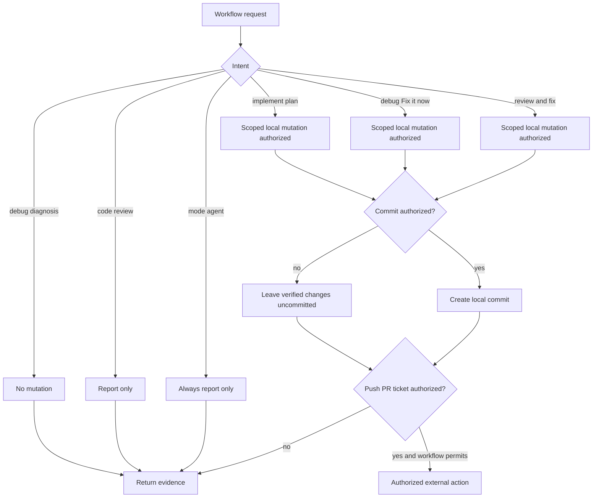

# Spec Work 质量能力闭环重构 - Plan

## Goal Capsule

| 维度 | 决策 |
| --- | --- |
| Objective | 保留当前分支 `spec-work` 的 unified-plan、Markdown/HTML 分段读取、knowledge-work、proof/characterization-first、execution engines、Return-to-Caller、`mode:agent` review-only/caller-owned apply 与 plan lifecycle 优势，同时恢复 `master` 中仍有效的 task-pack、scope、architecture-fit、structured evidence 和 regression-floor 能力。 |
| Recommended approach | 先关闭 task-pack identity/intake、task-level review、repo/scope/dispatch/landing 和 run-evidence 的 P0 断链；再补 `reuse / extend / compose / new`、feedback/vertical slice、simplification 与 anti-rationalization；最后按 Front Controller + 一层 triggered references 完成 prompt 分层。 |
| Cross-workflow scope | `spec-work` 是主体；`spec-debug`、`spec-code-review` 只接入共享 Scenario Capability、dispatch/side-effect authorization、Anti-Rationalization、structured verification evidence、task-level `mode:agent` review、artifact path 和 handoff compatibility。`spec-code-review mode:agent` 始终 report-only；默认 review 只有收到明确 apply/fix 授权才可修改文件，commit 仍需独立授权。本方案不整体重构两者的 diagnosis/persona/merge pipeline。 |
| Authority hierarchy | 当前 canonical source/tests/contracts > `master` 最终树与 completed-plan source evidence > 当前对比分报告 > `docs/solutions/**` 历史学习 > CodeGraph/Graphify 等 provider advisory navigation。 |
| Decision focus | task-pack 可执行 identity、source-plan authority、task review gate、mutation target、worker authorization/isolation、thin-glue ownership、claim-to-evidence、review artifact portability，以及哪些内容必须留在 hot-path spine。 |
| Verification focus | Valid/stale/wrong-chain/legacy task packs、pinned pack digest、exact-file/cumulative-file/degraded task review scope、parent workspace、generated runtime、scope expansion、shared workspace、review mutation/commit/landing authorization、temporary-to-durable review evidence、compose/new 四姿态、三 workflow high-risk overrides、run-summary/honest-closeout/run-artifact producer、five-host projection 和 fresh-source negative cases。 |
| Largest risk or boundary | Prompt、fixture、contract test 和 projection 只能证明 source contract；没有 fresh-source/host/field evidence 时，不得声称模型已稳定遵守架构 recheck、授权边界或完成声明。 |
| Stop conditions | 实现要求新建第二套 task/evidence/review schema；把 `spec_id` 恢复为所有 unified plan 全局必填；把 task pack 变成第二份 plan/progress state；让脚本裁决 architecture/scope/review 语义；手改 generated runtime；或在缺少授权/隔离/验证时继续 mutation、push、PR 或完成声明。 |
| Execution profile | Deep、跨 workflow/CLI/contract/test 的代码实施；由 `spec-work` 执行最合适，但实施时必须先读取本计划 Goal Capsule、Planning Contract、相关 U-ID、Verification Contract 与 Definition of Done。 |

---

## Product Contract

### Summary

当前分支已经拥有比 `master` 更现代的 unified-plan consumer、HTML/Markdown section map、knowledge-work carve-out、goal/dynamic execution engine、proof-first evidence、actual-tree integration、bounded concurrency、`mode:agent` review-only/caller-owned apply、Return-to-Caller 与 lifecycle degraded taxonomy。需要恢复的不是旧版文件，而是旧版中仍服务可信变更闭环的执行合同，并把它们适配到当前架构。

本方案吸收并取代 `docs/plans/2026-07-07-001-refactor-spec-work-skill-prompt-slimming-plan.md`。旧方案仍可作为 prompt 分层与验证方法的历史依据，但不再独立驱动开发；本方案先修 active contract drift，再做分层，避免只把主文件变短却继续丢失能力。

### Current Implementation Baseline（2026-07-16）

以下能力是实施前必须保护的 baseline，不是本方案的待开发项：

- `skills/spec-work/SKILL.md` 已拒绝 requirements-only unified plan、progress-like readiness、重复/缺失/冲突 metadata，并兼容 Markdown/HTML。
- 长计划使用 section map，只读取 Goal Capsule、active U-ID、相关 R/F/AE/KTD、Verification Contract 与 Definition of Done；短计划允许直接全文读取。
- `execution: knowledge-work` 由 `references/non-code-execution.md` 独立处理。
- `references/execution-engines.md` 已定义 inline/subagent、goal-mode、dynamic-workflow 与 tail ownership；Return-to-Caller 不运行 caller-owned shipping tail。
- Phase 2 已具备 proof-first/characterization-first Evidence Strategy、Test Scenario Completeness、System-Wide Test Check、actual-tree integration、非文件 contention、bounded concurrency 与 abort criteria。
- `spec-code-review mode:agent` 是 report-only，`spec-work` 负责 apply/fix 与 Residual Work Gate；不得恢复 `mode:autofix` 或旧 review tier。
- `src/cli/helpers/{verification-run-summary,honest-closeout,spec-work-run-artifact}.js`、对应 schemas 与 runtime catalog 仍存在，但 active `spec-work` 已无 producer 调用。
- `docs/contracts/workflows/scenario-capability-matrix.md` 仍把 `spec-work`、`spec-debug`、`spec-code-review` 列为 high-risk consumers；当前三个 skill 没有完整消费其 overrides。
- `src/cli/task-pack.js` 与 `spec-first tasks validate` 仍验证 identity、hash、contract、wave、dependency、file、runtime mirror、secret path、review gate 与 target scope；`spec-work` 当前不消费 validated task pack。
- 当前 source SHA 为 `5a4308b0`，比较基线 `master` 为 `437bb9e4`；Graphify CLI 本轮仍指向 legacy `graphify-out`，因此重要结论均以当前 source/test/contract 与 `git show master:` 回源确认。

### Problem Frame

当前执行链有五类结构性断裂：

1. `spec-plan` 不保证 `spec_id`，`spec-write-tasks` 和 task-pack validator 却把缺少 `spec_id` 当成不可执行；即使生成成功，`spec-work` 也不识别 task pack。
2. `review_gate: required` 仍存在于 task-pack contract，却没有 task-level review consumer；当前 `spec-code-review base:<ref>` 会审查该 base 到整个 working tree 的累计 diff，不能直接冒充某个未提交 task 的独立 diff，最终全量 review也不能替代早期 dependency-wave feedback。
3. `spec-work` 的 worker dispatch、isolation、commit、push/PR ownership 存在冲突或宿主假设，且 target repo/source-runtime/scope non-expansion 的高显著性边界丢失。
4. run-summary、honest-closeout、run-artifact 的 deterministic owner 仍在并公开声明 integrated，但 active workflow 没有调用，形成 capability truth drift。
5. 最新 `spec-plan` 已要求 `reuse / extend / compose / new` 和 thin-glue ownership，当前 work-phase 只有泛化复用提示；`spec-debug`、`spec-code-review` 同时丢失 Scenario、Anti-Rationalization 与 structured verification evidence 的共享合同。

### Actors

- A1. Plan author：`spec-plan` 产出 implementation-ready unified plan，不为 task-pack compatibility 强制所有计划携带全局 identity。
- A2. Task compiler：`spec-write-tasks` 判断 task pack 是否值得，并生成 derived execution index。
- A3. Executor：`spec-work` 读取 direct plan 或 validated task pack，执行 unit/task、验证、review 与 closeout。
- A4. Task reviewer：`spec-code-review mode:agent` 对 task-scoped diff 做 report-only review，返回结构化 findings 和真实 artifact path。
- A5. Debugger：`spec-debug` 建立因果链、修复与验证，并消费共享 evidence/high-risk contract。
- A6. Maintainer：维护 canonical skill/CLI/contracts/tests/evals，并通过现有 projection 生成五宿主 runtime。
- A7. User/project owner：授权 scope、mutation、worker delegation、commit/push/PR 与产品/架构取舍。

### Requirements

#### Task-pack chain 与 executable intake

- R1. Executable task-pack identity 以 artifact root 内唯一、规范化的 repo-relative POSIX `source_plan` 路径和当前 `source_plan_hash` 为主；`spec_id` 改为可选兼容 trace，不恢复为所有 unified plan 的全局必填字段。
- R2. 当 task pack 与 source plan 都有 `spec_id` 时必须匹配；任一侧缺失只产生显式 limitation，不得在 path/hash/structure 已通过时单独阻断 deterministic handoff。
- R3. `tasks hash` 与 `tasks validate` 必须在 `--repo <artifact-root>` 下解析 repo-relative plan/task-pack command operand，并拒绝 path escape、错误 root 与 ambiguous parent-workspace resolution；绝对command operand保持兼容，但task-pack metadata和machine-readable identity仍使用artifact-root-relative POSIX path。
- R4. `spec-write-tasks`、task-pack schema、quality guide、CLI JSON、evals 与 tests 必须统一 identity 语义；不得保留 `missing_spec_id` 仍是 executable blocker 的双真相源。
- R5. `spec-work` 必须把 validated task pack 作为一等 input：先锁定 artifact root 与 mutation target，再实际运行 `spec-first tasks validate <task-pack> --repo <artifact-root> --json`；只有 `deterministic_handoff: true` 且当前 source plan 仍通过 unified implementation-ready code metadata/content-shape intake，才固定 validation result、task-pack file digest 和 source-plan hash并创建execution tasks。任一pinned fact在执行或review前漂移都必须停止并重新验证。
- R6. Task Pack Contract JSON 是 machine-readable task source；Task Cards/Waves 决定 task boundary、dependency、execution order、`stop_if`、files 与 review intent，`source_plan` 继续拥有 scope、requirements、non-goals 和 lifecycle。Deterministic validation 之后仍必须由 LLM 对 task refs、declared files、coverage 与 source-plan scope/non-goals 做 semantic adequacy 检查；该判断不得进入 validator。
- R7. Invalid、stale、wrong-chain、unverifiable、draft/transient、source-plan-missing，或source plan已变为requirements-only/non-code/metadata-conflict的pack必须fail closed，返回copy-ready handoff；不得静默降级为legacy plan或从free-form Markdown推断executable tasks。
- R8. 高复杂 direct plan 可以建议 `spec-write-tasks`，但 task pack 保持 optional；不得自动编译、不得阻断用户直接执行一个已经 implementation-ready 的 plan。

#### Task-level review 与 review artifact

- R9. `spec-code-review mode:agent` 必须支持 bounded task context，至少携带 task-pack path/digest、task id、source plan、work-run review base、declared files、pre-task dirty files、task delta files（含task-owned新增/删除/重命名文件）、`task_diff_isolation` 与 `review_focus`；它仍是 report-only，不获得 apply 权限。Review base只定义工作分支相对基线，task scope由pre/post file facts缩小，不能把累计working-tree diff误称为独立task diff，也不能沿用standalone review“忽略全部untracked”的默认值漏审task新文件。
- R10. `review_gate: required` 必须在 task 完成后、依赖 task/下一 wave 开始前运行 task-scoped review；未解决 P0/P1 或 design-decision finding 阻断 dependent wave。Caller应用这些finding后必须重跑affected verification和bounded follow-up review/validation，证明finding已关闭；最多两轮，仍未关闭则停止handoff。较低级residual必须进入work run evidence/最终Residual Work Gate，不能丢失。
- R11. Task-level review 只提供早反馈，不替代 Phase 3 全量 review，也不把 `review_gate` 变成 approval、progress 或 execution state。
- R12. `spec-code-review` 只生成一次 concrete `artifact_path`，所有 reviewer prompts、validator、cross-model script 与 run-local `spec-work` followup 都消费该返回值；不得把 `/tmp` 当 contract authority。跨会话、resume、tracker、compound 或 release handoff 不能直接引用 session-temp path，必须由 `spec-work` 物化脱敏后的 repo-local review evidence，或只保留结构化 finding summary 与明确 limitation。

#### Repo、scope、authorization 与 high-risk safety

- R13. 任何 write/test/review-fix/commit 前必须确定 artifact root、单一 mutation `target_repo` 或 per-task repo scope，并识别与保护 pre-existing dirty changes；cwd 和 provider candidate 不能替代 repo authority。
- R14. 计划外的新 consumer/file/risk 默认记录为 follow-up；只有完成既定 scope 必需且有 direct evidence 的 discovered file 才可纳入 actual changed set。改变 acceptance、architecture、public contract 或 source ownership 时必须返回 `spec-plan`/task-pack regeneration。
- R15. Generated runtime mirror 只用于诊断和 projection observation；source fix 必须落 canonical `skills/`、`templates/`、`src/cli/`、contracts 或 generator owner。
- R16. `spec-work`、`spec-debug`、`spec-code-review` 必须声明并消费 Scenario Capability high-risk overrides：foreign residual 阻断受影响 mutation/claims，optional evidence unavailable 限定 claim，non-git build coverage gap 只允许 covered-surface conclusion。
- R17. Worker dispatch、reviewer dispatch、debug parallel probes 必须把 authorization、host capability、workspace isolation、write ownership 四轴分开判断；未获 delegation authorization 时使用 inline/serial fallback 并记录 `dispatch_authorization_missing`。
- R18. 未确认 isolation 时按 shared workspace 处理；并发只允许 disjoint writes，worker 不 stage/commit/full-test，orchestrator 单独拥有 authoritative integration、test 和 commit decision。
- R19. Skill invocation、feature branch 或环境权限不自动授权 mutation、commit、push、PR、ticket 或外部通信。`spec-work` 的明确实现请求只授权 plan/scope 内本地 mutation；`spec-debug` 只有用户选择 Fix it now 才授权修复；普通 `spec-code-review` 请求默认 report-only，只有明确 apply/fix 授权才进入本地修复，commit 需要独立授权。三者都不得由 branch ownership 推导 push/PR/ticket；`spec-code-review` 继续永不 push/PR/file ticket。
- R20. 保留 current execution engines 与 Return-to-Caller tail ownership，但移除对固定 Claude/Codex isolation、fork upload 或 callable workflow 的硬编码；所有 capability 使用 runtime-visible primitive 决定并有 conservative fallback。

#### Architecture、feedback 与 implementation quality

- R21. `spec-work` 在 material durable surface、plan 中的 `compose / thin-glue` 或 `new` KTD，以及 current source 与 plan 可能漂移时，必须读取 Planning Contract 相关 KTD 并做 work-phase architecture recheck。
- R22. Recheck 使用 `inventory -> reuse -> extend -> compose / thin-glue -> new`：reuse 要满足现有 contract；extend 要由正确 owner 承接；compose 保持参与者 authority；new 只在其他姿态会混合职责、扭曲 contract、制造双真相源或隐藏耦合时成立。
- R23. Thin glue 只可拥有 contract translation、sequencing/orchestration、failure/degradation routing 与 observability/evidence aggregation；不得复制 domain truth、business policy、durable state 或 validation rules。
- R24. 禁止 future-only abstraction、无边界 wrapper、第二套 parallel pipeline 与 forced wrong-owner reuse；未获 plan 授权的新 public contract、cross-module abstraction、schema/runtime/config/source-of-truth/provider boundary 必须 stop-back。
- R25. 保留 proof/characterization-first Evidence Strategy，并在其外补 smallest observable feedback loop 和 vertical slice；CLI、browser、docs、schema、config、manual-only surface 使用匹配自己的 loop，不强行 TDD。
- R26. Simplification 使用 `remove-now`、`minimality-debt`、`protected`、`architecture-mismatch` 四分类；不能把“简化”收缩为继续 extract helper 或追求 LOC 下降。
- R27. `spec-work`、`spec-debug`、`spec-code-review` 恢复 workflow-specific Anti-Rationalization Red Flags；它们是 attention hardening，不是 script gate、approval 或强状态机。

#### Structured evidence、closeout 与 handoff

- R28. `spec-work` closeout 必须复用现有 `verification-run-summary.v1`、`honest-closeout.v1` 与 `spec-work-run-artifact/v2`；不得新建第二套 helper、schema 或 durable state。
- R29. `spec-work-run-artifact` 仅在 validated task pack、not-run/degraded validation、deferred follow-up、resume/compaction、long task、review/compound/release handoff 等 durable trigger 命中时写入；无 trigger、失败或已存在时返回真实 reason code。若 durable evidence 依赖 session-temp review artifact，producer 调用前必须将受控、脱敏的 review JSON/summary 复制到当前 work run dir，并通过现有 `artifact_refs`/`read_artifacts` 引用，不能把绝对 temp path写入 durable artifact。
- R30. `spec-debug`、`spec-code-review` 在实际执行 targeted verification 时使用 `verification-run-summary.v1` 和 `honest-closeout.v1`；它们不写 `spec-work-run-artifact`，而是在各自 summary/JSON/artifact 中返回 run-summary ref、closeout verdict 与 limitation。
- R31. Completion Response 必须区分 Completed、Verification、Review、Artifacts、Residuals、Lifecycle 与 Next action；passed、failed、not-run、degraded 和 unsupported 不得被压成模糊“已验证”。
- R32. 新引用的 changelog、review、residual、run artifact 或 validation path 若未 tracked、不可读或不在 target repo 内，不得声称 shipped/committed/PR-ready；session-temp review artifact 只能作为 run-local handoff，跨会话引用必须先进入 repo-local work run dir或降级为无路径的结构化摘要。

#### Prompt architecture、tests 与 adoption

- R33. `skills/spec-work/SKILL.md` 采用 Front Controller spine：contract summary、input triage、hard-boundary anchors、phase skeleton、Reference Trigger Map、Return-to-Caller 和 completion summary；条件细节放一层 references。
- R34. 新增或重建 `work-intake-and-task-pack.md`、`execution-strategy.md`、`feedback-and-tests.md`、`implementation-quality.md`；每个 reference 声明 `Owned here`、`Not owned here`、`Trigger`、`Fallback if unread`，并由标准 Markdown link 连接。
- R35. Prompt 分层不得删除 current baseline：unified readiness/HTML map、knowledge-work、goal/dynamic engines、bounded unit packet、proof evidence、actual-tree integration、non-file contention、abort criteria、Figma/frontend、caller-owned review、Return-to-Caller 和 lifecycle。
- R36. 每项能力与 regression floor 同 wave 落地；contract tests 锁 owner/trigger/fallback/negative boundary，source-only evals 覆盖 positive/negative/degraded case，不能通过删除旧 assertion 恢复绿色。
- R37. Fresh-source eval 必须使用当前磁盘 source 和全新上下文；没有用户/上游 delegation authorization 时记录 `not_run: dispatch_authorization_missing`，不得声称 semantic stability。未运行时不得删除仅靠该 eval 才能证明安全的 load-bearing spine prose。
- R38. 所有 runtime-required source 继续由现有 `spec-first init`/plugin projection 分发到 Claude、Codex、Cursor、Kiro、Qoder；evals/validation/history 不投影，generated mirrors 不手改。
- R39. 用户可见行为、contract version/compatibility、验证结果与已知 degraded 边界必须同步 README/相关 docs、`CHANGELOG.md` 和 durable validation report。

### Key Flows

- F1. Direct plan：implementation-ready plan -> metadata/section map -> optional task-pack suitability -> unit execution -> final review/evidence -> lifecycle/handoff。
- F2. Task-pack chain：source plan -> optional `spec-write-tasks` -> canonical source path/hash validation -> pinned pack digest + LLM semantic-fit -> Task Cards/Waves -> exact/cumulative task-level required review -> final full review -> source-plan lifecycle。
- F3. Parent workspace：artifact root resolves plan/pack -> task/plan resolves mutation repo -> dirty/source/runtime checks -> scoped work;任何 root ambiguity 在 mutation 前停止。
- F4. Architecture execution：读取 material KTD -> inventory current source -> reuse/extend/compose/new recheck -> implement 或 stop-back -> compact deviation note。
- F5. Evidence closeout：实际命令/log -> run summary -> honest claim verdict -> conditional run artifact -> human completion response。
- F6. Debug/review compatibility：high-risk scenario/dispatch authorization + mutation/commit authorization -> report-only or scoped local fix -> targeted verification -> structured evidence + run-local artifact path -> caller-owned/durable follow-up。
- F7. Prompt migration：先建立 protected-behavior/test/eval map -> 按 owner 下沉 -> trigger/fallback replay -> fresh-source when authorized -> projection/adoption。

### Acceptance Examples

- AE1. 给定没有 `spec_id` 但有唯一 `source_plan` 和 matched hash 的 pack，CLI 返回 deterministic handoff；`validation.spec_id` 明确为 missing/absent limitation，而不是 blocker。
- AE2. 给定 task pack 和 source plan 都有不同 `spec_id`，即使 hash 被人为对齐也按 wrong-chain 停止；compat trace 不能被忽略。
- AE3. 从 parent workspace 运行 `tasks validate docs/tasks/x.md --repo child-or-artifact-root` 时，相对 path 按 `--repo` 解析；cwd 指向 sibling 不影响结果，escape path 被拒绝。
- AE4. `spec-work` 收到 stale、invalid 或 unverifiable pack 时不创建 task、不修改 source，返回含 path、reason code、validation command 和 regeneration action 的 handoff。
- AE5. `review_gate: required` 的 T2 完成后，`spec-work` 以 pinned pack digest、work-run review base、pre-task dirty files 和 pre/post fingerprint 得到 task delta files：pre-task内容与review base一致的文件按exact-file scope审查；已被前置task提交/未提交、用户修改或其他run改变的文件按cumulative-file scope审查并披露limitation；无法归因时dependent wave停止，最终full review仍保留。
- AE6. `spec-code-review` 在 macOS/Linux/Windows 生成一个 concrete artifact dir，JSON、reviewer、validator、cross-model和run-local followup全部使用返回的`artifact_path`；源码中不再把`/tmp`当contract。需要跨会话handoff时，`spec-work`只引用已物化到repo-local work run dir的脱敏副本。
- AE7. 给定 parent workspace 缺 mutation target、foreign residual、generated mirror target 或 plan 外 architecture expansion，三个 high-risk workflow 在各自 mutation/claim 出口前停止或明确降级。
- AE8. 无 worker/reviewer delegation authorization 时，`spec-work` inline、`spec-debug` serial probes、`spec-code-review` inline lens fallback；都记录 `dispatch_authorization_missing`，不伪称 independent/isolation coverage。
- AE9. 当前宿主 subagent 共享同一工作目录时，两个修改同一文件或 shared schema 的 task 被串行化；worker 不 commit，orchestrator 依据 actual tree 集成并运行 authoritative tests。
- AE10. 给定 thin-glue KTD，executor 保留参与 capability 的 source truth，只新增 translation/sequencing/failure/evidence seam；如果现有 owner 已完整满足则选择 reuse，不为“可扩展”增加 wrapper。
- AE11. 给定 forced reuse 会让 review workflow 持有 business policy/durable state，executor允许 justified new boundary；`reuse` 不是配额，`new` 也不是默认。
- AE12. docs-only、schema、CLI、browser/manual surface 分别选择可观察 loop；无法运行时记录 not-run reason，不能统一写成“tests passed”。
- AE13. Verification 中一个 required check 未运行，honest closeout 为 degraded/unsupported，最终 Completion Response 不得写“全部验证通过”；run artifact 引用真实 run-summary ref。
- AE14. `spec-debug` 修复后复跑原 reproducer，并在 Debug Summary 返回 run-summary ref；`spec-code-review` 只在自己实际执行 targeted check 时返回验证 evidence，不把 reviewer opinions 当 passed command。
- AE15. Prompt 分层后，trivial bare prompt 不读取 task-pack/subagent/architecture大段 reference；task-pack、parallel、behavior、durable-surface、shipping 分别命中唯一 owner，reference 未读时走保守 fallback。
- AE16. 仅请求“review”时，`spec-code-review` 返回 findings 而不修改或commit；请求“review and fix”时可在scope内apply，但没有独立commit授权仍保持uncommitted。`mode:agent`无论措辞如何都保持report-only。
- AE17. Task pack在intake后被编辑，即使source plan未变，执行下一task或发起task review前的digest recheck也会停止并要求重新validate，不能继续消费旧的pinned Task Cards。

### Success Criteria

- Plan -> Tasks -> Code 链路至少有 valid、no-`spec_id`、wrong-chain、stale、parent-workspace、required-review 六类 deterministic cases。
- `spec-work` 不再出现“shipping 承认 task pack、intake 不消费 task pack”的入口/尾部不对称。
- Worker/reviewer dispatch、isolation、commit、push/PR 均能从 source contract 找到唯一 owner 和 conservative fallback。
- `workflow_integrated=true` 与 active `spec-work` producer 调用、tests、runtime catalog 保持一致。
- `spec-work` 能消费 plan 的 `reuse / extend / compose / new` KTD，并有四姿态+future-only+wrong-owner negative semantic cases。
- `spec-debug`、`spec-code-review` 获得共享 high-risk/evidence/anti-rationalization兼容，而不改变其核心 diagnosis/review pipeline owner。
- `spec-code-review mode:agent` 的 artifact path 与 task context 可被 `spec-work` 可靠消费，且 review 仍不修改 checkout。
- Prompt 分层后每个承重 reference 有 trigger、fallback、contract test 与 eval case；line/token 下降只作为 countermetric，不作为唯一成功标准。
- 五宿主 projection 可从 canonical source 重建；evals/validation 不投影；未执行的 fresh-source/host/field evidence 始终显式标注。

### Scope Boundaries

#### In scope

- `spec-work` 的 intake、execution strategy、architecture/feedback、review、evidence、shipping、prompt 分层和回归地板。
- `spec-write-tasks` 与 task-pack CLI 的 identity、path resolution、handoff 和 consumer compatibility。
- `spec-code-review` 的 task-scoped `mode:agent` context、dispatch fallback、structured evidence、artifact path 和 downstream handoff。
- `spec-debug` 的 shared high-risk、dispatch/landing authorization、Anti-Rationalization 和 structured verification closeout。
- Shared contracts、focused tests/evals、quality-gate registration、README/Changelog/validation 和五宿主 projection。

#### Deferred to follow-up

- N×模型×多次的统计稳定性与 3+ 次真实 field-run adoption observation；本方案只建立 protocol、fixtures 和首轮 evidence record。
- Context-bundle/artifact-summary 通用 pipeline、跨会话 peer summary、集中式 execution ledger；没有真实 consumer pain 前不恢复。
- 将 task pack 扩展成跨多个独立 target repo 的单一事务/状态机；首期只支持明确 artifact root 和可逐 task 解析的 mutation repo scope。
- HTML task-pack 作为 executable format；当前 task pack contract 保持 Markdown + fenced JSON。

#### Outside this plan

- 恢复旧 `mode:autofix`、host-native review tier、team-standards 已退役路径、Markdown-only plan 或 direct-plan 全文必读。
- 重写 `spec-debug` 因果链框架、`spec-code-review` persona/merge/validation 主流程，或重新设计 `spec-plan` unified artifact contract。
- 新建 workflow engine、task database、approval state、architecture schema、glue registry、model eval platform 或第二套 runtime generator。
- 让脚本决定 scope adequacy、task semantic quality、review finding truth、architecture posture 或 root cause。

---

## Planning Contract

### Key Technical Decisions

- KTD1. 保留 current branch，能力级吸收 `master`。不 cherry-pick 旧 `SKILL.md`、shipping、tests 或 eval corpus；每项能力按 current owner、格式、review model 和 host boundary 重写。
- KTD2. Task-pack executable identity 采用规范化的artifact-root-relative POSIX `source_plan + source_plan_hash`；`spec_id`是optional compatibility trace。`task-pack/v1`的task JSON不变；validator输出可添加backward-compatible `identity_basis`/limitation，不因这次放宽强制所有producer迁移。
- KTD3. `tasks hash/validate --repo` 的 `--repo` 是 artifact/source resolution root；`spec-work` 的 mutation `target_repo` 是副作用 owner。普通单repo两者相同，parent workspace必须显式区分，不能用一个cwd猜两种authority。Validation JSON新增canonical `artifact_root`；现有`repo_root`仅作backward-compatible alias并标记语义，新的consumer不得继续把它解释为mutation owner。
- KTD4. Task pack 是 derived execution index，不是第二份 plan。JSON contract 拥有 task fields/waves；source plan 拥有 product scope/lifecycle；git/task tracker/run evidence 拥有 execution progress。
- KTD5. Task-level review 扩展现有 `spec-code-review mode:agent`，不新建 task-review workflow。`task-pack:<path>` + `task:<id>`（或等价显式 context）标识 canonical task；`base:`只定义work-run baseline。`spec-work`通过review-base/pre/post file fingerprint产生task delta files并声明`task_diff_isolation: exact-file | cumulative-file | degraded`：只有pre-task内容与review base一致的文件才注入exact-file current diff；pre-task内容已偏离base（无论来自dirty worktree还是前置commit）的文件注入累计file diff并披露限制；无法归因时required gate不放行。JSON `coverage`回显实际scope；caller仍拥有apply。
- KTD6. Review artifact dir 由 `spec-code-review` 一次解析当前 OS temp root并传递 concrete path。Cross-model script已接受`<run-dir>`，因此只需统一producer/consumer contract，不新增artifact-path service。Temp artifact是run-local authority；需要durable handoff时由`spec-work`把受控review payload物化到现有repo-local work run dir，并通过现有run-artifact字段引用。
- KTD7. Authorization、capability、isolation、ownership 四轴正交。用户允许实现代码不等于允许delegation、commit、push、PR或ticket；host有工具也不等于已授权使用副作用。`spec-code-review`额外区分review intent与mutation intent：普通review不授权Stage 5c，明确apply/fix才授权本地修复，commit仍是独立出口。
- KTD8. Scenario Capability 继续是 advisory matrix + high-risk exit discipline。共享 contract 是 source of truth，三个 skill 只保留短 declaration/override，不复制整张矩阵或创建风险分数。
- KTD9. `spec-plan` 决定 architecture design，`spec-work` 做 current-source fit recheck。Work 可以因 source drift选择更好的已授权 reuse/extend/compose path，但不能自行创造未授权 public/schema/runtime/source-of-truth boundary。
- KTD10. Composition-first 不是“优先写胶水”。Thin glue 只有在独立 authority 确实需要连接时成立；错误 owner reuse、无意义 wrapper 与 domain-heavy glue 都应被拒绝。
- KTD11. Feedback loop 与 proof-first 分层：前者选择可观察反馈面，后者在 behavior-bearing且 test seam 合适时规定先观察 red/baseline。两者互补，不把所有任务强制成 TDD。
- KTD12. Structured verification 复用当前 helper。`verification-run-summary` 是 shared per-check fact；`honest-closeout` 是 claim verdict；`spec-work-run-artifact` 只属于 work durable closeout，debug/review 使用自己的 summary/artifact handoff。Work只把repo-local、redacted、可读的review副本或summary放入durable refs，不扩大run-artifact schema去容纳session-temp绝对路径。
- KTD13. Anti-Rationalization 恢复 shared pattern contract，但只锁 heading、最小 row count 和“attention not gate”边界；具体红旗保持 workflow-specific，避免长字符串快照。
- KTD14. Front Controller 分层在 P0/P1 semantics 稳定后完成。每次迁移先建 protected-behavior map；缺 fresh-source authorization 时只能做安全的 owner/reference/additive test 迁移，不能删除仅靠模型行为才能证明的承重文案。
- KTD15. 07-07 active slimming plan 由本方案取代。其 line delta、trigger/non-trigger、fallback、projection 和 outcome-bundle 方法被吸收，但“先缩 prompt”顺序被 P0 contract closure 取代。

### High-Level Technical Design

下图描述目标 owner 与证据流；它是边界图，不是强状态机。

```mermaid
flowchart LR
  P[spec-plan<br/>unified source plan] --> W{spec-write-tasks<br/>optional?}
  W -->|skip| I[spec-work intake]
  W -->|compile| T[derived task pack<br/>source_plan + hash]
  T --> V[tasks validate --repo<br/>identity/freshness/structure]
  V -->|valid| I
  V -->|invalid/stale| H[copy-ready handoff<br/>revise/regenerate]

  I --> S[target repo + dirty/source/runtime<br/>scope + authorization]
  S --> E[units/tasks execution<br/>feedback + evidence]
  E --> A[architecture recheck<br/>reuse/extend/compose/new]
  A --> R{task review required?}
  R -->|yes| CR[spec-code-review mode:agent<br/>task context + artifact_path]
  R -->|no| N[next task/wave]
  CR --> N
  N --> Q[final simplify/review/validation]
  Q --> VS[verification-run-summary]
  VS --> HC[honest-closeout]
  HC --> RA[conditional spec-work run artifact]
  RA --> L[lifecycle + authorized landing<br/>or Return-to-Caller]

  SC[Scenario Capability] -.-> S
  SC -.-> CR
  SC -.-> D[spec-debug]
  AR[Anti-Rationalization] -.-> E
  AR -.-> CR
  AR -.-> D
  VS -. shared per-check evidence .-> CR
  VS -. shared per-check evidence .-> D
```



Task-level review 不依赖中间 commit；它用 file-level attribution 保守缩小累计 diff。

```mermaid
sequenceDiagram
  participant W as spec-work
  participant F as Git/file facts
  participant C as spec-code-review mode:agent
  participant E as work evidence

  W->>F: Pin pack digest, review base, dirty files, file fingerprints
  W->>W: Execute one task without worker commit
  W->>F: Recheck pack digest and compute task delta files
  alt Pre-task content matches review base
    W->>C: exact-file scope plus task context
  else Pre-task content already differs from review base
    W->>C: cumulative-file scope plus explicit limitation
  else Delta cannot be attributed
    W-->>E: degraded review gate; block dependent wave
  end
  C-->>W: report-only JSON plus concrete artifact_path
  W->>W: Apply eligible findings and re-verify
  W->>E: Persist normalized findings; materialize review copy only when durable
```

Mutation、commit 与外部 landing 是三个独立出口；workflow intent 只授权它实际承诺的最窄副作用。



### Script-owned Facts vs LLM-owned Judgment

| Surface | Script/tool owns | LLM/user owns |
| --- | --- | --- |
| Task-pack identity | path resolution、hash、frontmatter shape、JSON parse、field/wave/dependency/file containment、reason code | task pack 是否值得、task quality、scope adequacy、review gate 是否语义合适 |
| Task review scope | pre/post git status、safe path normalization、file existence/type、SHA-256、added/changed/deleted/renamed facts、dirty overlap | 这些facts是否足以代表当前task、cumulative limitation是否可接受、finding如何处理 |
| Repo/workspace | git root、path containment、dirty paths、runtime mirror pattern、scenario facts | 哪个 repo 是当前任务 owner、dirty overlap 是否可继续、scope expansion 是否改变 plan |
| Dispatch | runtime-visible tool/cap、reported workspace behavior | 是否已授权 delegation、是否值得并行、冲突时何时串行/停止 |
| Verification | command outcome transcript、exit code、log ref、run-summary schema | 哪些 checks 足以支持当前 claim、not-run/degraded 如何影响完成判断 |
| Architecture | current source paths、imports、owners、existing contracts | reuse/extend/compose/new、thin-glue adequacy、wrong-owner判断、stop-back |
| Review | diff/base/file facts、structured finding/artifact shape | finding 是否成立、如何 apply/defer、是否需要用户设计决策 |
| Landing | git state、tracked/untracked、PR/CLI capability facts | commit/push/PR/ticket 的明确授权和最终发布取舍 |

### Artifact and Evidence Contracts

| Artifact/contract | Owner | Authority | Consumers | Boundary |
| --- | --- | --- | --- | --- |
| Unified plan | `spec-plan` | product/planning source | write-tasks、work、review、goal | 不承载 per-unit progress；不全局强制 `spec_id` |
| Task pack | `spec-write-tasks` | derived execution index | work、task-level review | JSON contract wins；不改变 plan scope/lifecycle |
| Task validation JSON | task-pack CLI | confirmed deterministic facts | write-tasks、work、tests | canonical `artifact_root` + compatibility `repo_root`；只证明identity/freshness/structure，不证明semantic quality |
| Task review JSON | `spec-code-review mode:agent` | run-local structured findings + declared task scope | work followup/residual gate | report-only；`artifact_path`为concrete returned value；coverage声明exact/cumulative/degraded isolation |
| Verification run summary | shared CLI helper | confirmed transcription with stated trust ceiling | work/debug/review、honest closeout | 不运行命令、不猜 exit code、不把 dry-run 升级 passed |
| Honest closeout verdict | shared CLI helper | claim-to-evidence consistency | workflow completion response | 不替代语义判断；缺 evidence 只能 degraded/unsupported |
| Spec-work run artifact | work producer | durable repo-local evidence | resume、review、compound、release | conditional trigger；只引用repo-local redacted review副本/summary，不引用session-temp绝对路径；不是progress/approval/retention truth |
| Scenario matrix | shared contract | advisory capability interpretation | work/debug/review | high-risk exits 显式；不变成 risk score/state machine |
| Eval fixtures/report | skill-local `evals/` + `docs/validation/` | maintainer evidence with limitations | future plan/review/maintainer | source-only；不投影、不冒充 field outcome |

### Existing Capability / Composition / Source Ownership

| Decision surface | Posture | Existing owner | Change boundary |
| --- | --- | --- | --- |
| Plan identity | reuse | `spec-unified-plan/v1` metadata/body | 不增加全局 `spec_id` |
| Task-pack identity | extend | `src/cli/task-pack.js` + write-tasks references | 由 mandatory `spec_id+hash` 调整为 path+hash主身份、optional trace |
| Task-pack intake | new narrow reference + compose | work spine、task CLI、write-tasks handoff | `work-intake-and-task-pack.md` 只翻译/编排，不复制 validator rules |
| Task review | extend | `spec-code-review mode:agent` | 增 explicit task context、file-level delta/isolation coverage；reviewer不apply |
| Review artifact path | extend | `spec-code-review` run-dir creation | concrete OS-portable path；下游只读返回值 |
| Repo/scope safety | extend/reuse | `target-repo.js`、scenario contract、project instructions | prompt消费 facts；不建 scope engine |
| Execution strategy | new narrow reference | current Phase 1 Step 4 + engines | 拥有 authorization/capability/isolation/commit/landing rules |
| Architecture quality | compose | current spec-plan KTD + master architecture-fit + work Phase 2 | `implementation-quality.md` 只做 fit recheck，不重做 planning |
| Feedback/tests | extend | current Evidence Strategy/Test Discovery | `feedback-and-tests.md` 增 smallest loop/vertical slice，保留 current proof evidence |
| Run evidence | reuse + thin integration glue | existing three helpers/contracts | shipping只做payload assembly、sequencing、reason propagation和temp-review到repo-local artifact refs的受控物化 |
| Scenario/Anti-Rationalization | reuse/restore shared contract | current scenario matrix + historical anti-rationalization contract | 三 skill 短 consumer；不复制 subsystem |
| Runtime projection | reuse | existing plugin/adapters/getSupportedPlatforms | generator 默认零改动，只有 focused test 证明 gap 才修 |

### System-Wide Impact

- Plan producer — in-scope compatibility：继续不要求全局 `spec_id`；consumer replay必须防回归。
- Task compiler/CLI — in-scope：identity、path resolution、reason code、docs/evals/tests。
- Work executor — primary in-scope：intake、execution、architecture、review、evidence、shipping、prompt architecture。
- Code review — bounded in-scope：task context、file-level diff isolation、dispatch fallback、review-vs-mutation/commit authorization、artifact path、shared evidence/high-risk/anti-rationalization；persona/merge算法保持。
- Debug — bounded in-scope：shared high-risk、dispatch、Fix-it-now mutation与commit/landing authorization、structured evidence、anti-rationalization；因果链主流程保持。
- Lifecycle — in-scope compatibility：task pack完成 source plan，Return-to-Caller只返回 candidate；不改 taxonomy。
- Runtime projection — in-scope：五宿主 source reachability、source-only eval exclusion；generated mirror只观察/重建。
- Release/docs — in-scope：README、Changelog、validation、runtime catalog truth；website仅在public docs影响时检查。
- Data/security — out-of-scope product data：本方案不引入业务数据 schema；路径、secret deny、external communication仍按高风险处理。

### Priority and Sequencing

| Priority | Units | Exit condition |
| --- | --- | --- |
| P0 | U1-U5 | Task-pack可执行链、task review、repo/scope/authorization、Scenario safety、structured closeout均有source+deterministic tests，公开 capability truth一致。 |
| P1 | U6 | Architecture/feedback/simplify/anti-rationalization进入当前prompt和语义cases，且不把判断脚本化。 |
| P2 | U7 | 在P0/P1稳定后完成Front Controller分层、eval/projection回归；未获fresh-source授权时保留承重spine。 |
| Closure | U8 | 文档、Changelog、validation、runtime adoption、旧计划supersession与实际验证记录收口。 |

实施顺序固定为 U1 -> U2 -> U3；U4 可与 U2 后半并行设计但在 U3 closeout 前必须稳定；U5 依赖 U3/U4；U6 依赖 U4/U5；U7 依赖 U1-U6；U8 最后收口。测试不是尾部 unit，每个 unit 同步落自己的 positive/negative/degraded coverage。

---

## Implementation Units

### U1. 重构 task-pack identity 与 artifact-root CLI contract（P0）

**Goal:** 消除 unified plan 不产 `spec_id` 与 executable task pack 强制 `spec_id` 的断链，并让 parent-workspace path 解析不依赖 cwd。

**Requirements:** R1, R2, R3, R4, R38, R39

**Dependencies:** 无

**Files:**

- `src/cli/task-pack.js`
- `src/cli/commands/tasks.js`
- `skills/spec-write-tasks/SKILL.md`
- `skills/spec-write-tasks/references/execution-handoff-contract.md`
- `skills/spec-write-tasks/references/task-pack-schema.md`
- `skills/spec-write-tasks/references/task-quality-guide.md`
- `skills/spec-write-tasks/evals/failure-cases.json`
- `skills/spec-write-tasks/evals/output-quality-cases.json`
- `tests/unit/task-pack-command.test.js`
- `tests/unit/spec-write-tasks-contracts.test.js`
- `tests/unit/spec-plan-consumer-replay-contracts.test.js`

**Approach:**

- 将executable identity定义为artifact root内规范化的repo-relative POSIX `source_plan` + canonical body `source_plan_hash`。Validator输出新增`identity_basis: source-plan-path+body-hash`或等价字段，使consumer不再从`validation.spec_id`自行推导handoff。
- 保留 `validation.spec_id: matched | missing | mismatch | not_checked` 的兼容 shape：双方都有且 mismatch 仍是 `wrong_chain`；缺失改为 limitation，不进入 `errors`，并在 JSON 和 docs 标明 trace quality。
- 移除 `missing_spec_id` 作为 executable failure reason；历史 pack/source plan 带 `spec_id` 时继续校验，不要求迁移。
- `tasks hash`和`tasks validate`都支持`--repo=<artifact-root>|--repo <artifact-root>`。相对plan/pack command operand以该root解析；absolute operand仍可用但必须满足containment/owner规则，JSON与task-pack metadata不得把机器绝对路径升级为portable identity。
- `tasks hash --json`新增canonical repo-relative POSIX `source_plan`（或等价明确字段）供producer复制，并保留当前absolute `plan_path`仅作兼容diagnostic；validator继续分开返回`source_plan.path`与`absolute_path`。New consumers只使用relative identity字段。
- 明确 `--repo` 只负责 artifact/source resolution；task的 mutation `target_repo` 由 downstream work U3/U4解析。避免在 parent requirements workspace 中把 parent artifact root误当可写Git repo。
- Validation JSON新增`artifact_root`作为canonical consumer字段，并暂时保留`repo_root`同值compat alias；docs/help明确alias不代表mutation repo，后续移除必须走单独contract version/migration。
- 保持 task JSON `task-pack/v1` 字段不变；这是 frontmatter/validation semantics的兼容放宽，不借机升级task state或新增审批字段。
- 更新 write-tasks final envelope：CLI facts原样转录；semantic posture/dispatch authorization仍由LLM/human基于当前evidence判断，不能被validator“顺便证明”。

**Patterns to follow:**

- `src/cli/helpers/markdown-frontmatter.js`
- `src/cli/helpers/target-repo.js`
- `tests/unit/plan-status-helper.test.js` 的path/metadata fail-closed风格
- `docs/solutions/workflow-issues/skill-prose-rewrite-contract-test-coverage-2026-06-28.md`

**Test scenarios:**

1. Covers AE1. Source plan与pack均无`spec_id`，path/hash/contract合法 -> valid/deterministic handoff + missing trace limitation。
2. 只有一侧有`spec_id` -> valid + limitation；两侧都有且matched -> valid；mismatch -> wrong-chain。
3. Covers AE3. `--repo`解析relative plan/pack path；从sibling cwd运行结果不变。
4. Hash JSON返回portable relative `source_plan`与absolute diagnostic；validation JSON的`artifact_root`为canonical normalized root，legacy `repo_root`保持同值兼容但不被work当作mutation target。
5. Task-pack/source-plan path escape、symlink escape、missing root、`--repo`缺value均fail closed并有稳定reason code。
6. Hash变化 -> stale；frontmatter lifecycle/status变化不改变body hash；body变化必须改变hash。
7. Current带`spec_id` fixture保持兼容；旧consumer只看`deterministic_handoff`仍工作。
8. `spec-plan` contract test继续断言unified plan不全局强制`spec_id`。
9. Eval failure case不再把`missing_spec_id`当P0 executable failure，改测wrong-chain/stale/source-path。

**Verification:** Focused task-pack/write-tasks/plan-consumer suites通过；CLI help显示两条命令的`--repo`语义；`git diff --check`无格式问题。

### U2. 扩展 task-scoped `spec-code-review mode:agent` 与 artifact path contract（P0/P1）

**Goal:** 为 required task review提供显式、可解析、可诚实归因、report-only的review上下文，并消除`/tmp`硬编码对下游的可移植性破坏。

**Requirements:** R9, R10, R11, R12, R17, R30, R32

**Dependencies:** U1

**Files:**

- `skills/spec-code-review/SKILL.md`
- `skills/spec-code-review/references/subagent-template.md`
- `skills/spec-code-review/references/review-output-template.md`
- `skills/spec-code-review/references/cross-model-review.md`
- `skills/spec-code-review/scripts/cross-model-adversarial-review.sh`
- `skills/spec-work/references/review-findings-followup.md`
- `skills/spec-work/references/shipping-workflow.md`
- `skills/spec-work/references/tracker-defer.md`
- `tests/unit/spec-code-review-contracts.test.js`
- `tests/unit/spec-work-consumer-chain-contracts.test.js`（新增）

**Approach:**

- 在Argument Parsing增加显式task context pair，例如`task-pack:<path>`与`task:<task_id>`；两者必须成对出现。它们不改变reviewer selection、mode或apply ownership，但会启用task-scope diff bundle，而不是继续审查整个working-tree diff。
- `mode:agent base:<work-run-base> plan:<source-plan> task-pack:<pack> task:<id>`读取Task Pack Contract JSON中的declared files/review focus，并消费caller提供的pinned pack digest、pre-task dirty files和task delta files。`base:`只定义work-run baseline；它不再被命名或解释为pre-task snapshot。
- 对pre-task内容与work-run base一致的delta file，只把该file相对base的current diff注入review并标记`exact-file`；task-owned新文件以受控full-addition patch/content进入bundle，pre-existing untracked仍排除并披露；对pre-task内容已偏离base的file（包括dirty、前置task未提交或已提交改动），注入该file累计diff并标记`cumulative-file`；delta不可归因、pack digest漂移或scope payload不完整时返回`degraded/failed`并禁止required gate放行。
- JSON `coverage`或等价字段返回task id、observed pack digest、declared/task-delta files、pre-task overlap、review focus、`task_diff_isolation`和limitations；`actionable_findings`仍是唯一apply handoff，triage groups不变成apply queue。
- Review skill在Stage 4前解析一个`REVIEW_ARTIFACT_DIR` concrete absolute path：使用当前OS temp root或host可写run-local temp，创建一次并把完整path传给persona、validator、cross-model script、report writer。
- `cross-model-adversarial-review.sh`已接受`<run-dir>`，保持脚本owner，只移除references中的固定path假设。所有消费者只使用JSON `artifact_path`或当前调用已持有的concrete path。
- `mode:agent`继续跳过Stage 5c，不push/PR/file tickets；task context不得成为reviewer修改checkout或扩大scope的许可。默认interactive review的mutation/commit authorization由U4单独处理，不与task mode混合。
- 当dispatch未获授权或不可用，执行inline/single-agent report-only lens fallback并在Coverage写`dispatch_authorization_missing`/capability limitation；不声称independent reviewer coverage。

**Patterns to follow:**

- 当前`mode:agent` JSON output contract
- `skills/spec-code-review/scripts/cross-model-adversarial-review.sh`的`<run-dir>`参数
- `master:skills/spec-code-review/SKILL.md`的OS-temp/returned-path边界（只吸收语义，不复制旧mode）

**Test scenarios:**

1. Covers AE5. Valid task context被解析；pre-task内容等于review base的delta file得到`exact-file`scope，task-owned新文件进入review bundle，dirty或前置commit/未提交overlap得到`cumulative-file`scope与limitation，Coverage回显task focus和isolation。
2. `task-pack`无`task`、未知task id、pack不可读、同时传PR target和`base:` -> JSON failed，不dispatch。
3. `mode:agent`在task context下仍不执行Stage 5c、不commit、不push、不file tickets。
4. Covers AE6. Source/references/templates中不再以固定POSIX temp目录作为contract；所有path来自`artifact_path`/`REVIEW_ARTIFACT_DIR`。
5. 空格路径、Windows `%TEMP%`语义、POSIX `$TMPDIR`语义均能被prompt contract表达；shell script继续只消费传入run-dir。
6. Run-local `spec-work` followup使用returned artifact path；shipping/tracker等durable handoff只使用已物化的repo-local副本或结构化summary。Artifact missing时使用in-band JSON并披露limitation，不重跑review。
7. Pack digest与intake pinned值不一致、task delta无法归因或scope payload缺字段时，required review返回degraded/failed而非伪称task-scoped clean。
8. Pre-existing untracked文件不因task mode被吞入；task中新建且在declared/allowed scope内的文件必须被review，越界新文件触发scope blocker。
9. 无dispatch授权时inline report-only返回degraded Coverage而非跳过review或伪造roster。

**Verification:** `spec-code-review-contracts`和consumer-chain focused tests通过；shell syntax检查通过；review JSON minimum shape与artifact path一致。

### U3. 接通 `spec-work` task-pack intake、Task Cards/Waves 与 required review（P0）

**Goal:** 让validated task pack真正成为`spec-work`的一等执行输入，并闭合source-plan scope/lifecycle与task-level review。

**Requirements:** R5, R6, R7, R8, R9, R10, R11, R31

**Dependencies:** U1, U2

**Files:**

- `skills/spec-work/SKILL.md`
- `skills/spec-work/references/work-intake-and-task-pack.md`（新增）
- `skills/spec-work/references/shipping-workflow.md`
- `skills/spec-work/references/execution-engines.md`
- `skills/spec-write-tasks/references/task-quality-guide.md`
- `tests/unit/spec-work-intake-contracts.test.js`（新增）
- `tests/unit/spec-work-consumer-chain-contracts.test.js`
- `tests/unit/spec-work-contracts.test.js`
- `tests/integration/plan-status-closeout.integration.test.js`
- `skills/spec-work/evals/examples.json`（新增或重建）

**Approach:**

- Phase 0分类顺序固定为mode token -> file metadata -> task pack/unified/legacy/knowledge-work -> bare prompt。Task pack在读完整body前先读frontmatter并进入intake reference。
- `work-intake-and-task-pack.md`声明Owned/Not owned/Trigger/Fallback；它编排artifact root、CLI validation、semantic posture、source plan focused read、Task Pack Contract、handoff failure，不复述validator字段算法。
- Intake在CLI validation通过后固定validation JSON、task-pack file SHA-256和source-plan canonical hash；每个task开始前及required review前重查digest/hash。漂移时停止并重新validate，不继续消费旧Task Cards。
- Deterministic facts通过后，LLM执行semantic adequacy：检查task refs、declared files、wave coverage、`stop_if`、review intent是否与source plan的scope/non-goals/KTD一致；发现新acceptance、漏掉material unit或architecture/source-owner冲突时返回write-tasks/plan regeneration，不让validator替代语义判断。
- Validated且semantic-fit的pack使用Task Cards/Waves创建task tracker，保留`task_id`并把source unit/requirement refs带入bounded worker packet。不得从source plan重新拆一份并行task结构。
- `source_plan`按unified section-map读取scope/requirements/non-goals/Verification/DoD；pack只压缩当前wave/context。Task pack status保持derived，shipping只更新适用的source plan。
- Source plan hash刻意排除frontmatter，因此intake必须独立重放unified metadata/content-shape gate；`artifact_readiness`、`execution`或关键metadata仅在frontmatter漂移时，也不能因body hash matched而继续执行。
- 每个task执行前由Git/file/hash工具捕获work-run review base、base-side file identity、pre-task dirty paths与declared/allowed file fingerprints；执行后由同一确定性fact path计算added/changed/deleted/renamed task delta files，先做focused verification，再按`review_gate`触发U2 task review。LLM只判断scope adequacy与limitation，不手算hash或伪造delta。该机制不依赖task commit；pre-task fingerprint已偏离base时即使工作树clean也按cumulative-file审查，无法归因时required gate阻断。
- Required review的P0/P1/design-decision residual进入blocker；eligible fix由spec-work caller应用后重跑affected verification和bounded follow-up review/validator，最多两轮，仍未关闭则停止并返回用户/计划owner。P2/P3可进入run-local residual list并在Phase 3 Residual Work Gate统一处理。
- Direct plan suitability只提供advisory：当unit多、context大、依赖复杂时建议write-tasks；用户选择direct work仍可继续。
- Invalid/stale/unverifiable pack返回User-Facing Handoff，字段至少包含input、reason_code、CLI command、source plan、target/artifact root、next action和limitations。

**Patterns to follow:**

- Current unified-plan reader strategy
- `skills/spec-write-tasks/references/execution-handoff-contract.md`
- `docs/plans/2026-05-11-006-feat-task-pack-review-gate-plan.md`
- Current Return-to-Caller/lifecycle ownership

**Test scenarios:**

1. Direct implementation-ready Markdown/HTML plan仍按section map执行；requirements-only/invalid readiness仍fail closed。
2. Valid task pack固定validation result/digest并通过semantic-fit后创建Task Contract tasks/waves，不从human-readable cards或source plan重新猜task。
3. Covers AE4. Stale/wrong-chain/missing source/unverifiable pack，以及body hash仍matched但source plan已变为requirements-only/non-code/metadata-conflict的pack，在task creation之前停止并返回copy-ready handoff。
4. `stop_if`命中时停止当前task/依赖wave并返回plan/task regeneration，不“Create new tasks if scope expands”。
5. Covers AE5. Required review的exact-file/cumulative-file成功、有P1、有P3、failed/degraded结果分别进入正确路径；final full review始终存在。
6. Task-level review实际改变代码后重跑task verification与bounded follow-up review；第二轮仍有P0/P1/design-decision finding则停止，不进入无限review loop。Review未改变代码不重复全量review。
7. Task-pack input完成后只更新source plan status；Return-to-Caller只返回source-plan candidate。
8. Covers AE17. Intake后task-pack digest或source hash变化，在下一task/review前停止并要求重新validate。
9. 高复杂plan建议write-tasks但不自动编译；trivial bare prompt不加载task-pack reference。

**Verification:** 新intake/consumer/lifecycle suites通过；source-only eval包含valid/stale/required-review/direct-plan non-trigger cases。

### U4. 收紧 repo/scope/source-runtime、Scenario、dispatch/isolation 与 mutation/landing authorization（P0）

**Goal:** 在任何高风险副作用或用户可见claim前建立明确repo、scope、authorization和degraded边界，同时保留current engines与并行安全优势。

**Requirements:** R13, R14, R15, R16, R17, R18, R19, R20, R32

**Dependencies:** U1, U2；U3在本unit完成前不得宣称task-pack execution安全闭合

**Files:**

- `skills/spec-work/SKILL.md`
- `skills/spec-work/references/execution-strategy.md`（新增）
- `skills/spec-work/references/execution-engines.md`
- `skills/spec-work/references/shipping-workflow.md`
- `skills/spec-debug/SKILL.md`
- `skills/spec-code-review/SKILL.md`
- `skills/spec-code-review/references/review-output-template.md`
- `docs/contracts/workflows/scenario-capability-matrix.md`（仅需要澄清consumer wording时修改）
- `tests/unit/spec-work-execution-strategy-contracts.test.js`（新增）
- `tests/unit/scenario-capability-matrix-contracts.test.js`（新增/恢复）
- `tests/unit/target-repo-containment.test.js`（新增/恢复并适配当前helper）
- `tests/unit/spec-debug-contracts.test.js`（新增/恢复current-shape focused suite）
- `tests/unit/spec-code-review-contracts.test.js`

**Approach:**

- 在work spine保留高显著性hard anchors，在`execution-strategy.md`承接branch/worktree/task tracker/dispatch/parallel/commit/landing细节。Fallback为inline、serial、no commit/push/PR。
- 先读取current git root/branch/status和plan/task target；pre-existing dirty overlap不被worker、review fix或commit吞入。需要用户已有diff才能继续时明确说明owner和风险。
- Scope expansion改为两类：完成原scope必须的discovered file可在direct evidence下纳入；新增acceptance/public contract/architecture/source ownership一律stop-back。删除“Create new tasks if scope expands”的无约束语义。
- Scenario high-risk consumer declaration在work/debug/review保持短而一致。Foreign residual在受影响写入/root-cause/review claim前阻断；optional evidence unavailable不阻断direct-evidence work，但降低claim ceiling；non-git build只覆盖已检查surface。
- Worker/reviewer/debug parallel dispatch先检查visible parent/user authorization，再检查tool capability和workspace isolation。缺任一项走inline/serial fallback并写reason；环境permission setting不被当authorization。
- Codex/Claude/Cursor/Kiro/Qoder具体primitive仅作为runtime fact example，不硬编码“forked workspace”“uploaded changes”等无法保证的contract。未知时按shared directory处理。
- Commit ownership唯一：worker永不commit；orchestrator在明确commit authorization下决定logical commits。若未来host回收isolated workspace，作为explicit capability exception处理，不在通用contract中预设。
- `spec-work` standalone shipping和`spec-debug` skill-owned branch都不再因skill invocation/branch ownership自动commit/push/PR。Debug的Fix it now只授权fix-owned local mutation；commit与外部landing分别需要明确授权，缺失时返回verified handoff与可选next action。
- `spec-code-review`在Phase 0解析review mutation policy：普通“review”与所有`mode:agent`均report-only；只有当前用户或上游明确要求apply/fix时default mode才进入Stage 5c。即使允许apply，clean-tree自动commit逻辑也改为独立commit authorization gate；未授权时保留verified uncommitted diff。Persona、merge、validator与finding schema不变。

**Patterns to follow:**

- Current non-file contention/bounded concurrency/abort criteria
- `docs/contracts/workflows/scenario-capability-matrix.md`
- `docs/10-prompt/结构化项目角色契约.md` 的authority与gate-the-exits
- `skills/spec-worktree`作为isolated worktree helper owner

**Test scenarios:**

1. Covers AE7. Parent workspace无target repo、generated mirror、foreign residual、scope-changing discovery均在副作用前阻断或降级。
2. Dirty unrelated files保持未修改/未stage；dirty overlapping file要求用户/owner decision或bounded strategy。
3. Covers AE8. 无delegation authorization但有spawn tool -> inline/serial；有authorization但无tool -> inline/serial；两者都有但无isolation -> shared-dir rules。
4. Covers AE9. Same-file/shared schema/lockfile/env-singleton tasks串行；disjoint files且authorized/capable可bounded parallel。
5. Worker final只回changed paths/evidence，不commit；orchestrator actual-tree check后决定integration。
6. 无commit authorization不commit；无push/PR authorization不调用landing skill；有明确upstream authorization时才进入对应tail。
7. Covers AE16. 普通code review不apply/commit；明确review-and-fix只apply；另有commit授权才commit；`mode:agent`始终report-only。
8. `spec-code-review`无dispatch授权仍完成inline report-only，不把缺roster写成clean/full coverage。
9. `spec-debug`无parallel probe授权按ranked hypothesis串行，skill-owned branch不自动commit或外发PR。

**Verification:** Execution-strategy、Scenario、target containment、debug/review focused suites通过；source中无固定host-isolation claim；negative landing cases被AI quality gate收录。

### U5. 恢复 structured verification、honest closeout 与 run-evidence integration（P0）

**Goal:** 让完成声明重新由实际命令、结构化claim与durable evidence支持，并修复runtime catalog的false integration。

**Requirements:** R28, R29, R30, R31, R32, R36, R39

**Dependencies:** U3, U4

**Files:**

- `skills/spec-work/SKILL.md`
- `skills/spec-work/references/shipping-workflow.md`
- `skills/spec-work/references/review-findings-followup.md`
- `skills/spec-debug/SKILL.md`
- `skills/spec-code-review/SKILL.md`
- `skills/spec-code-review/references/review-output-template.md`
- `src/cli/helpers/verification-run-summary.js`
- `src/cli/helpers/honest-closeout.js`
- `src/cli/helpers/spec-work-run-artifact.js`
- `docs/contracts/verification/verification-run-summary.md`
- `docs/contracts/workflows/honest-closeout.md`
- `docs/contracts/workflows/spec-work-run-artifact.schema.json`
- `docs/catalog/runtime-capabilities.md`
- `tests/unit/verification-run-summary.test.js`（恢复/重建）
- `tests/unit/honest-closeout.test.js`（恢复/重建）
- `tests/unit/spec-work-run-artifact-contract.test.js`（恢复/重建）
- `tests/unit/spec-work-run-artifact-producer.test.js`（恢复/重建）
- `tests/integration/spec-work-closeout-producer.test.js`（恢复/重建）
- `tests/unit/spec-work-shipping-contracts.test.js`（新增）
- `scripts/run-ai-dev-quality-gate.js`

**Approach:**

- Shipping先选择verification profile/candidate checks，实际运行命令并把redacted log放repo-relative workflow run dir，再调用`verification-run-summary record --workflow spec-work`。Prompt不得把计划里的命令当已运行。
- 基于实际run-summary组装validation/review/impact claims，调用`honest-closeout validate`；overall不是verified时Completion Response必须保留degraded/unsupported reason。
- 命中durable trigger后组装现有`spec-work-run-artifact-payload/v2`并调用producer；复用immutable run-id、containment、run-summary ref和reason code，不修改为全局always-write。
- 若task/final review artifact位于OS temp，shipping先筛选caller实际消费的review JSON/summary，脱敏并复制到当前`.spec-first/workflows/spec-work/<workspace>/<run-id>/`目录；`artifact_refs`/`read_artifacts`只引用该repo-local副本。复制失败时保留结构化finding summary与limitation，不把temp绝对路径写进run artifact或跨会话handoff。
- Return-to-Caller envelope新增run-summary ref、honest-closeout verdict、run-artifact path/reason和claim limitations；caller仍拥有最终review/PR/lifecycle。
- `spec-debug`在复跑reproducer/regression/broader checks后用`--workflow spec-debug`记录summary；Debug Summary/Post-Fix Quality带ref和closeout，不写work artifact。
- `spec-code-review`只在review自身实际执行targeted verification时用`--workflow spec-code-review`记录；纯persona finding不伪装command evidence。Mode-agent JSON在`coverage.verification_evidence`或等价字段返回ref/verdict。
- Helper只做当前职责需要的bugfix/compat测试，不新增supervisor；其trust ceiling继续写清“workflow transcribed real result”。
- Runtime catalog保持`workflow_integrated=true`只在active shipping调用和integration test都存在时；若implementation选择不接入，则必须走honest downgrade，但本方案推荐并以reintegrate为DoD。

**Patterns to follow:**

- `docs/plans/2026-06-04-003-feat-verification-honest-closeout-plan.md`
- `docs/plans/2026-05-28-004-feat-spec-work-run-evidence-and-invariant-lens-plan.md`
- Existing helper schemas and containment functions

**Test scenarios:**

1. Passed/failed/not-run/degraded checks分别写正确ran/exit/log/reason；dry-run不能升级passed。
2. Missing tool -> not-run + missing_dependency；secret-like log被拒绝；path/symlink escape被拒绝。
3. Honest closeout不能cherry-pick通过子集隐藏failed/not-run；empty refs或missing file -> unsupported。
4. Covers AE13. Required check not-run导致final response degraded且携带reason；不得出现unqualified“all tests passed”。
5. Valid task-pack trigger写work run artifact；无trigger返回明确not-written reason；同run-id不可覆盖。
6. Temp review artifact在durable trigger下被脱敏物化到当前work run dir，run artifact只引用repo-relative副本；copy失败时无绝对temp ref且closeout带limitation。
7. Run artifact的`script_confirmed.validation.run_summary_ref`必须指向同workflow/workspace/run-id summary。
8. Covers AE14. Debug和review使用允许的workflow names并返回各自ref；不写spec-work run artifact。
9. Runtime catalog、schema extension flag、active prompt与integration test同时一致。
10. AI dev quality gate显式包含helper/producer/shipping focused suites。

**Verification:** Helper unit、producer unit、work closeout integration、shipping/debug/review contracts与AI quality gate通过；实际artifact paths全部repo-relative或returned session path。

### U6. 集成 architecture composition、feedback、simplification 与 Anti-Rationalization（P1）

**Goal:** 把master的实现质量地板升级为当前`reuse / extend / compose / new`思想，并在work/debug/review恢复低成本attention hardening。

**Requirements:** R21, R22, R23, R24, R25, R26, R27, R35, R36, R37

**Dependencies:** U4, U5

**Files:**

- `skills/spec-work/SKILL.md`
- `skills/spec-work/references/feedback-and-tests.md`（新增）
- `skills/spec-work/references/implementation-quality.md`（新增）
- `skills/spec-debug/SKILL.md`
- `skills/spec-code-review/SKILL.md`
- `docs/contracts/workflows/anti-rationalization-pattern.md`（恢复为current source）
- `tests/unit/spec-work-implementation-quality-contracts.test.js`（新增）
- `tests/unit/anti-rationalization-contracts.test.js`（恢复/重建）
- `tests/unit/spec-debug-contracts.test.js`
- `tests/unit/spec-code-review-contracts.test.js`
- `skills/spec-work/evals/examples.json`
- `skills/spec-debug/evals/examples.json`（新增/重建）
- `skills/spec-code-review/evals/examples.json`（新增/重建）

**Approach:**

- `feedback-and-tests.md`拥有smallest loop、vertical slices、proof/characterization、test discovery、scenario completeness、system-wide check、not-run replacement evidence。Fallback为最窄已知验证且不声称coverage。
- `implementation-quality.md`拥有durable surface trigger、current-source capability inventory、四姿态recheck、thin-glue owns/does-not-own、future-only refusal、wrong-owner escape、simplification四分类和material deviation note。Fallback为不新增未授权durable surface并返回plan。
- Work spine只保留两个STOP anchors和完成声明边界；普通small/local edit不输出架构矩阵或decision note。
- Thin glue明确failure propagation、partial failure、degradation和observability；wrapper若不增加真实translation/sequencing/safety/evidence boundary则删除或不建。
- Simplification在phase boundary运行，`protected`包含security/data integrity/a11y/observability/required verification；`minimality-debt`进入既有residual/defer sink，不顺手扩大scope。
- 恢复shared Anti-Rationalization contract与三张小表：work防fake completion/skip validation/scope creep/orphan；debug防skip reproduce/intuition root cause/weak re-verification；review防skip evidence/advisory-as-confirmed/unstructured residual。
- Anti-Rationalization section靠近各自execution discipline；contract test只锁heading、最小row count和非gate声明，不冻结文案。
- Source-only eval至少覆盖reuse-as-is、extend owner、thin-glue compose、justified new、future-only wrapper、wrong-owner reuse、trivial non-trigger、docs-only feedback、debug root-cause shortcut、review advisory evidence。

**Patterns to follow:**

- `skills/spec-plan/references/planning-evidence-boundaries.md`
- `docs/solutions/architecture-patterns/plan-work-architecture-fit-boundary-2026-07-01.md`
- `docs/solutions/architecture-patterns/front-controller-triggered-references-gates-eval-regression-2026-07-01.md`
- `master:docs/contracts/workflows/anti-rationalization-pattern.md`（历史语义依据）

**Test scenarios:**

1. Covers AE10. Existing capability fully satisfies -> reuse/no wrapper；owner可吸收 -> extend；两个authority需连接 -> bounded compose；其他姿态会混责 -> justified new。
2. Thin glue复制domain policy/durable state/validation rule -> fail oracle；参与者failure被吞或不可观察 -> fail oracle。
3. Future-only consumer、generic best practice或单一可疑nearby pattern不能授权new abstraction。
4. Plan未授权public/schema/runtime/provider boundary -> stop-back，不在work临场设计。
5. Covers AE12. Behavior、CLI、browser、docs/schema、manual-only任务选择各自feedback；not-run有replacement evidence。
6. Simplify四分类正确处理dead code、out-of-scope debt、protected checks和wrong-layer change；不把extract helper当默认答案。
7. 三skill anti-rationalization section存在且非gate；删除任一section/最小rows/边界句会使focused test失败。
8. Trivial docs wording不加载architecture reference、不输出长decision note。
9. Fresh-source未授权时记录`dispatch_authorization_missing`，保留承重spine；授权后paired cases无candidate-only regression。

**Verification:** Implementation-quality/anti-rationalization/debug/review focused suites与source-only eval fixture checks通过；fresh-source结果按mechanical/fresh/host/field分层记录。

### U7. 完成 Front Controller、triggered references 与 regression floor（P2）

**Goal:** 在P0/P1行为稳定后降低`spec-work` hot-path条件税，同时让每个owner、trigger、fallback和projection可机械追踪。

**Requirements:** R33, R34, R35, R36, R37, R38

**Dependencies:** U1-U6

**Files:**

- `skills/spec-work/SKILL.md`
- `skills/spec-work/references/work-intake-and-task-pack.md`
- `skills/spec-work/references/execution-strategy.md`
- `skills/spec-work/references/feedback-and-tests.md`
- `skills/spec-work/references/implementation-quality.md`
- `skills/spec-work/references/execution-engines.md`
- `skills/spec-work/references/non-code-execution.md`
- `skills/spec-work/references/review-findings-followup.md`
- `skills/spec-work/references/shipping-workflow.md`
- `skills/spec-work/references/tracker-defer.md`
- `skills/spec-work/evals/examples.json`
- `tests/unit/spec-work-contracts.test.js`
- `tests/unit/spec-work-intake-contracts.test.js`
- `tests/unit/spec-work-execution-strategy-contracts.test.js`
- `tests/unit/spec-work-implementation-quality-contracts.test.js`
- `tests/unit/spec-work-shipping-contracts.test.js`
- `tests/unit/spec-work-consumer-chain-contracts.test.js`
- `tests/unit/plugin-modules.test.js`
- `tests/unit/test-inventory-contracts.test.js`
- `scripts/run-ai-dev-quality-gate.js`

**Approach:**

- 先记录SKILL/references/eval/tests baseline、protected behavior map和每条旧assertion的target owner；不得以删除test或只改substring让suite变绿。
- 主spine保留：description/Introduction、Workflow Contract Summary、Reference Trigger Map、Phase 0分类、repo/scope/source-runtime/Scenario/authorization/verification hard anchors、Phase 1-2 skeleton、Phase 3-4 STOP、Return-to-Caller、compact principles/pitfalls。
- references保持一层深，开头固定四项owner contract，并使用标准Markdown links。Bare path字符串不能是唯一reachability机制。
- `work-intake-and-task-pack`未读 -> 不执行pack；`execution-strategy`未读 -> inline/serial/no landing；`feedback-and-tests`未读 ->最窄check/no coverage claim；`implementation-quality`未读 -> no new durable surface；shipping未读 -> no completion/lifecycle/landing claim。
- 把current branch强项逐条映射后再迁移：HTML/MD map、knowledge-work、goal/dynamic、bounded packet、proof evidence、actual tree、contention、abort、Figma/frontend、review followup、Return-to-Caller、lifecycle。
- 每个moved reference至少一个trigger和一个non-trigger case；每个P0 exit至少一个negative/degraded case。Eval corpus按current shape重建，不原样复制master样例。
- Source-only evals继续不投影。Projection tests验证五宿主runtime-required references和path rewrite；generator只有在现有递归copy确实漏文件时才修改。
- 报告`SKILL.md` line/byte delta、total source delta、per-reference delta和loader limitation。主文件变短但每次仍eager load全部reference时，不声称context-room收益。

**Patterns to follow:**

- `docs/solutions/architecture-patterns/front-controller-triggered-references-gates-eval-regression-2026-07-01.md`
- `docs/plans/2026-07-07-001-refactor-spec-work-skill-prompt-slimming-plan.md`的trigger/fallback/outcome方法
- `docs/solutions/workflow-issues/skill-prose-rewrite-contract-test-coverage-2026-06-28.md`

**Test scenarios:**

1. 每个reference link存在、owner header完整、trigger/fallback非空；dead link或二层reference失败。
2. Task-pack、parallel、behavior、durable surface、shipping各只触发必要owner；trivial bare prompt/knowledge-work不误加载code references。
3. P0 hard boundary仍可从spine直接发现，不需先猜要读哪个reference。
4. Contract tests从historical location改为“spine trigger + reference owner”，但protected behavior assertion数量不下降。
5. AI dev quality gate包含新split suites；test inventory不允许source引用missing test。
6. 五宿主projection包含runtime references，排除`evals/**`、`docs/validation/**`和历史plans。
7. Fresh-source required cases未授权时不删除load-bearing prose；授权后current vs candidate paired replay通过才晋升。
8. Line/byte下降但behavior/projection/fallback任一回归时不接受candidate。

**Verification:** Focused split suites、skill lint、AI quality gate、plugin/projection tests和diff check通过；Outcome Bundle记录真实delta与not-run evidence。

### U8. 完成文档、runtime adoption、validation 与 lifecycle 收口（Closure）

**Goal:** 让canonical source、公开行为、五宿主runtime和可复核证据一致，并关闭旧active方案的双入口。

**Requirements:** R38, R39及全部Success Criteria

**Dependencies:** U1-U7

**Files:**

- `docs/plans/2026-07-07-001-refactor-spec-work-skill-prompt-slimming-plan.md`
- `docs/plans/2026-07-16-003-refactor-spec-work-quality-capability-closure-plan.md`
- `docs/validation/2026-07-16-spec-work-current-vs-master-analysis.md`
- `docs/validation/spec-work/2026-07-16-quality-capability-closure-eval.md`（新增）
- `README.md`
- `README.zh-CN.md`
- `docs/05-用户手册/04-workflows-artifacts-map.md`（若实际public behavior需要）
- `docs/catalog/runtime-capabilities.md`
- `CHANGELOG.md`
- `src/cli/plugin-sync.js`或等价projection source（仅gap被证明时）

**Approach:**

- 将07-07旧方案标记为superseded并指向本方案；保留其历史baseline/outcome，不把未实施项伪装completed。
- Validation report逐unit记录changed surfaces、source refs、deterministic tests、fresh-source authorization/result、host observation、limitations和remaining field evidence。
- README/用户手册只说明用户可见行为：task pack可执行链、task-level report-only review、architecture recheck、structured closeout、授权/降级边界。不要把prompt存在、projection或单次eval写成真实质量提升已confirmed。
- Runtime catalog只声明实际接入的producer/consumer；structured verification shared consumers与spec-work run artifact owner保持区分。
- 对`getSupportedPlatforms()`全部宿主验证runtime-required source可投射，source-only evals/validation/history不投影。现有projection满足时generator保持零diff。
- Canonical source/tests/evidence稳定后运行`spec-first init`进行runtime adoption，再用doctor/focused projection tests检查drift。任何mirror修复回到source/generator。
- Changelog按当前developer profile记录plan、skill、CLI、tests/docs、compatibility和实际验证；未运行项写reason。
- 只有全部P0/P1、required review、structured evidence、residual和runtime closeout完成，shipping-tail owner才把本计划`active -> completed`。

**Test scenarios:**

1. 旧07-07方案只有一个canonical`status: superseded`与`superseded_by`，本方案保持active直到真实DoD完成。
2. README不声称task pack validator证明semantic quality，不声称projection证明host loader/field outcome。
3. Runtime catalog `workflow_integrated`与active producer test一致；debug/review不被误列为spec-work run-artifact producers。
4. Claude、Codex、Cursor、Kiro、Qoder均包含runtime-required work/debug/review shared contract与references。
5. `evals/**`、validation report、history plan不进入runtime package/projection。
6. `spec-first init`后无手工mirror patch；doctor/projection failure回source修复并重跑。
7. Changelog列出实际命令、结果与fresh-source/host/field not-run limitations。

**Verification:** 完整Verification Contract通过；validation report和Outcome Bundle可回源；plan lifecycle由shipping-tail owner按现有helper完成。

---

## Alternatives Considered

### A. 直接把 `master:skills/spec-work/**` 复制回来

拒绝。会丢失unified plan/HTML、knowledge-work、current engines、proof evidence、caller-owned review和lifecycle改进，并恢复旧mode/host假设/monolith。

### B. 给所有 unified plan 补强制 `spec_id`

拒绝。Same-file plan lifecycle不需要跨工件identity ceremony；真正需要identity的是derived task-pack chain。Path+canonical body hash已能证明当前source owner/freshness，`spec_id`只保留compat trace。

### C. 删除 task pack 与 run-evidence 的残留contract

拒绝。`spec-write-tasks`仍是public optional workflow，run-evidence helper/schema/catalog仍有真实consumer价值；删除会让Codebase -> Plan -> Tasks -> Code -> Review -> Knowledge链路更弱。首选reintegrate并恢复tests。

### D. 新建 task-review workflow 或 approval state

拒绝。现有`spec-code-review mode:agent`已拥有report-only review；扩展bounded task context即可。`review_gate`是review intent，不是审批/进度状态。

### E. 用脚本实现 architecture-fit、scope adequacy 或 review conclusion

拒绝。这些是deterministic floor之上的语义判断。脚本只提供path/hash/diff/log/schema facts与reason codes。

### F. 先完成prompt slimming，再逐步补能力

拒绝。当前已有confirmed P0 contract drift；先瘦身会继续让“文件更短”掩盖task-pack/run-evidence/safety/test断链。

### G. 同时全面重构 `spec-debug` 与 `spec-code-review`

拒绝。两者主流程不是本轮问题owner；只扩展共享合同和task-level review/handoff兼容，避免三套workflow混合重构。

---

## Risks & Dependencies

| Risk | Mitigation |
| --- | --- |
| 放宽`spec_id`后错误pack被误接收 | artifact-root-relative canonical `source_plan` + body hash为主身份；双方都有spec_id时mismatch仍hard fail；validator返回identity basis/limitations。 |
| `--repo`含义继续混淆artifact root与mutation repo | KTD3与U1/U3分别命名和测试；parent-workspace fixture同时覆盖两种root。 |
| Task-level review导致review风暴 | 仅`required`触发；task compiler语义选择；final review不变；P2/P3进入residual而非每次循环重审。 |
| Task没有独立Git base，或前置task已commit导致工作树clean但base累计 | 使用work-run base + base/pre/post file facts；仅pre-task内容与base一致时按exact-file，任何已偏离base的file按cumulative-file并披露limitation；无法归因时required gate阻断，不制造内部commit。 |
| Task mode沿用standalone untracked exclusion而漏审新文件 | 只纳入task期间新建且属于declared/allowed scope的文件，以full-addition bundle审查；pre-existing或越界untracked保持排除/阻断。 |
| Task context扩展污染code-review scope parser | 显式成对tokens、冲突fail closed、coverage回显、mode/target选择保持正交。 |
| Review artifact path改造破坏persona/cross-model | run-dir一次解析并作为参数传递；script已支持`<run-dir>`；in-band JSON是write失败fallback。 |
| Session-temp review证据在resume/release时失效 | Temp path只作run-local authority；durable trigger下由work物化脱敏副本到现有run dir，失败时保留summary+limitation。 |
| Authorization规则让自动化失去速度 | 用户/上游可显式授权；未授权只降级inline/no landing，不阻断本地实现与验证。 |
| Code-review默认从auto-apply/commit收紧后改变既有体验 | README/Changelog明确review、apply、commit三层授权；`review and fix`保持快捷路径，`mode:agent`兼容不变。 |
| Shared Scenario/Anti-Rationalization重复膨胀三个skill | Shared contract持有完整语义，skill只放短consumer/table；tests锁边界不锁全文。 |
| Structured evidence仍依赖LLM如实转录 | 明确trust ceiling；helpers不假装supervisor；host observation/field outcome保持更高证据层。 |
| Run artifact每次强写变成状态机 | 保留durable trigger和immutable run-id；无trigger返回reason。 |
| Composition变成“凡事写胶水” | 四姿态同级、reuse/new escape、thin-glue禁止职责和negative eval。 |
| Prompt分层丢失current baseline | Protected-behavior map、owner tests、trigger/non-trigger eval、缺授权时不删除承重spine。 |
| 恢复过多master tests造成维护负担 | 按current owner重建focused suites，不复制长字符串snapshot；AI gate只注册真实P0/P1保护面。 |
| Runtime projection与source不同步 | source-first、五宿主focused projection、`spec-first init` adoption；不手改mirror。 |

### Dependencies

- Node.js >=20、Jest 29与当前CommonJS CLI结构。
- Git与parent-workspace/child-repo fixtures。
- Existing `spec-first tasks`、internal verification helpers、plan-status helper与plugin projection。
- Fresh-source semantic validation依赖用户/上游明确delegation authorization；缺失时按计划保留load-bearing source并记录not-run。
- Graphify runtime当前不可消费`.graphify/graph.json`；本方案不把修Graphify作为依赖，CodeGraph/provider结论均已回源。

---

## Evidence & Limitations

- Confirmed current source：`skills/spec-work/**`、`skills/spec-debug/SKILL.md`、`skills/spec-code-review/**`、`skills/spec-write-tasks/**`、task-pack CLI/helpers、run-evidence helpers/contracts、focused tests和AI quality gate。
- Confirmed current constraints：`spec-code-review base:<ref>`当前计算该base到整个working tree的累计diff，default review会在clean tree自动apply/commit；`spec-work-run-artifact/v2`的durable refs只接受repo-relative安全路径。这三项直接形成task scope、mutation authorization和temp-to-durable物化决策。
- Confirmed master source：`master:skills/spec-work/**`、master work/debug/review Scenario/Anti-Rationalization/structured evidence、master focused tests。
- Historical completed plans仅用于解释能力origin和曾经落地状态；它们不自动证明当前runtime仍集成。
- `docs/solutions/**`提供Front Controller、plan/work architecture boundary、prose-test false green与CE migration经验；所有load-bearing决定已用current source重新核对。
- CodeGraph输出只作advisory navigation；Graphify CLI失败原因为仍寻找`graphify-out/graph.json`，未用于confirmed conclusion。
- 本轮未进行外部研究：问题是repo-owned workflow/contract integration，当前source和历史方案已足够。
- 本轮没有delegation授权，所有planning personas均以inline fallback应用并记录`dispatch_authorization_missing`；未执行fresh-source semantic eval。
- 本文是planning artifact：未修改implementation source、未运行implementation tests/build、未刷新generated runtime。计划文档自身的格式和document review在写入后单独验证。

---

## Verification Contract

### Focused deterministic gates

实施时按unit运行最窄验证；最终至少覆盖：

```text
npx jest --runTestsByPath \
  tests/unit/task-pack-command.test.js \
  tests/unit/spec-write-tasks-contracts.test.js \
  tests/unit/spec-work-contracts.test.js \
  tests/unit/spec-work-intake-contracts.test.js \
  tests/unit/spec-work-execution-strategy-contracts.test.js \
  tests/unit/spec-work-implementation-quality-contracts.test.js \
  tests/unit/spec-work-shipping-contracts.test.js \
  tests/unit/spec-work-consumer-chain-contracts.test.js \
  tests/unit/spec-debug-contracts.test.js \
  tests/unit/spec-code-review-contracts.test.js \
  tests/unit/scenario-capability-matrix-contracts.test.js \
  tests/unit/anti-rationalization-contracts.test.js \
  tests/unit/verification-run-summary.test.js \
  tests/unit/honest-closeout.test.js \
  tests/unit/spec-work-run-artifact-contract.test.js \
  tests/unit/spec-work-run-artifact-producer.test.js \
  tests/unit/target-repo-containment.test.js \
  tests/unit/plugin-modules.test.js \
  tests/unit/test-inventory-contracts.test.js \
  tests/integration/spec-work-closeout-producer.test.js \
  tests/integration/plan-status-closeout.integration.test.js \
  --runInBand
```

若某个planned test在实现中被合并到更合适的current owner，必须更新本计划/validation record中的mapping，不能简单删除验证责任。

### Repository gates

```text
npm run lint:skill-entrypoints
npm run typecheck
npm run test:ai-dev:gate
npm run test:unit
npm run test:integration
npm test
npm run build
```

优先跑focused suites；全量unit/integration/test/build在U8影响面收口后执行。任何环境失败都记录命令、exit、reason、影响与替代证据，不写模糊“未运行”。

### Runtime/projection gates

- 对`getSupportedPlatforms()`返回的Claude、Codex、Cursor、Kiro、Qoder运行focused projection assertions。
- Canonical source稳定后通过`spec-first init`重建runtime；不得手改`.claude/`、`.codex/`、`.agents/skills/`、`.cursor/`、`.kiro/`、`.qoder/`。
- 使用适用的doctor/projection checks确认source/runtime drift；只证明投射，不证明host loader/model behavior。
- Source-only `evals/**`、`docs/validation/**`、历史plan不得进入runtime projection/package。

### Fresh-source semantic cases

在获得明确delegation authorization后，按`docs/contracts/workflows/fresh-source-eval-checklist.md`至少覆盖：

1. no-`spec_id` valid pack、wrong-chain、stale与parent-workspace intake；
2. required task review success/P1 block/degraded coverage；
3. exact-file/cumulative-file/degraded task diff attribution、pack digest drift；
4. no dispatch authorization、shared workspace、review-only/no apply authorization、apply-without-commit、no landing authorization；
5. reuse-as-is、extend owner、thin-glue compose、justified new、future-only wrapper、wrong-owner reuse；
6. docs-only/CLI/browser/manual feedback loop；
7. debug skip-repro/root-cause shortcut与review advisory-as-confirmed；
8. temp review evidence durable materialization与copy-failure limitation；
9. trivial bare prompt不触发重reference；
10. current source vs slimmed candidate paired replay。

结果必须区分`mechanical source contract`、`fresh-source semantic`、`host observation`、`field outcome`。未授权时写`not_run: dispatch_authorization_missing`，并执行U7的保守保留策略。

### Completion claim gates

- 任何“validated/passed/complete”必须有当前run command/log/ref或明确N/A reason。
- Required P0/P1 review finding、scope blocker、lifecycle failure、untracked referenced artifact或authorization gap未关闭时不得声明shipped/PR-ready。
- `workflow_integrated=true`只有在active producer调用和integration test同时存在时成立。
- Plan status只由最终shipping-tail owner在所有验证/review/residual gate关闭后更新。

---

## Definition of Done

### Global DoD

- [ ] R1-R39均有实现owner、current source落点和可回源验证。
- [ ] Task-pack可执行链不再依赖所有plan强制`spec_id`，同时保留spec-id mismatch compatibility protection。
- [ ] `spec-work`能安全执行validated pack、required task review和source-plan lifecycle。
- [ ] Task-level review不依赖未授权中间commit，能诚实区分exact-file、cumulative-file和degraded scope，并在pack digest漂移时停止。
- [ ] Repo/scope/source-runtime/Scenario/dispatch/isolation/landing边界在三个high-risk workflow中一致且无静默越权。
- [ ] `spec-code-review`明确区分review、apply与commit授权；`mode:agent`始终report-only，普通review不静默修改checkout。
- [ ] Work closeout真实调用run-summary/honest-closeout/conditional run artifact，catalog truth一致。
- [ ] Durable run evidence不引用session-temp绝对路径；需要跨会话的review证据已物化到repo-local work run dir或带明确降级说明。
- [ ] Work-phase四姿态architecture recheck、thin-glue边界、feedback/vertical slice、simplification四分类和anti-rationalization存在且未脚本化。
- [ ] `spec-debug`、`spec-code-review`共享兼容完成，但主pipeline未被无关重写。
- [ ] `spec-work` Front Controller和一层references拥有明确trigger/fallback；current branch baseline能力全部保留。
- [ ] Focused、AI gate、typecheck、unit、integration、full test、build和projection按实际影响运行并记录；未运行项有具体reason。
- [ ] Fresh-source/host/field evidence按真实层级报告，无低层证据冒充高层结论。
- [ ] README/文档/Changelog/runtime catalog/validation report与source一致；generated runtime由init重建。
- [ ] 旧07-07方案标记superseded，本计划只有在真实DoD完成后才由shipping tail标记completed。
- [ ] Abandoned experiments、duplicate wrappers、temporary fixtures/logs和无consumer surface已清理，不把dead-end code留在diff。

### Per-Unit DoD

| Unit | Done signal |
| --- | --- |
| U1 | no-`spec_id`/matched/mismatch/stale/parent-root identity matrix通过，write-tasks与CLI无双语义。 |
| U2 | Task-scoped mode-agent review可解析、report-only、回显exact/cumulative/degraded isolation，artifact path可移植。 |
| U3 | Valid pack固定digest并通过semantic-fit后按Tasks/Waves执行，required review早反馈，drift/invalid pack在task creation或继续执行前fail closed。 |
| U4 | Repo/scope/dispatch/review-mutation/commit/landing authorization negative matrix通过，三个high-risk Scenario consumer到位。 |
| U5 | Structured verification/closeout/run-artifact producer与catalog truth一致，temp review evidence按durable边界可物化，debug/review共享evidence可消费。 |
| U6 | Architecture/feedback/simplification/anti-rationalization source+tests+evals到位，四姿态与negative cases通过。 |
| U7 | Front Controller分层完成且protected behavior、reference reachability、AI gate、five-host projection无回归。 |
| U8 | Validation、docs、Changelog、runtime adoption、old-plan supersession和全部verification收口。 |

---

## Sources

- `docs/validation/2026-07-16-spec-work-current-vs-master-analysis.md`
- `skills/spec-work/SKILL.md`及`skills/spec-work/references/**`
- `master:skills/spec-work/SKILL.md`及`master:skills/spec-work/references/**`
- `skills/spec-debug/SKILL.md`、`skills/spec-code-review/SKILL.md`
- `skills/spec-write-tasks/SKILL.md`及`skills/spec-write-tasks/references/**`
- `src/cli/task-pack.js`、`src/cli/commands/tasks.js`
- `src/cli/helpers/{verification-run-summary,honest-closeout,spec-work-run-artifact,target-repo}.js`
- `docs/contracts/workflows/scenario-capability-matrix.md`
- `docs/contracts/verification/verification-run-summary.md`
- `docs/contracts/workflows/honest-closeout.md`
- `docs/plans/2026-07-07-001-refactor-spec-work-skill-prompt-slimming-plan.md`
- `docs/plans/2026-07-01-003-feat-spec-work-minimality-architecture-fit-plan.md`
- `docs/plans/2026-05-11-006-feat-task-pack-review-gate-plan.md`
- `docs/plans/2026-05-28-004-feat-spec-work-run-evidence-and-invariant-lens-plan.md`
- `docs/plans/2026-06-04-003-feat-verification-honest-closeout-plan.md`
- `docs/plans/2026-06-15-001-feat-anti-rationalization-tables-plan.md`
- `docs/solutions/architecture-patterns/front-controller-triggered-references-gates-eval-regression-2026-07-01.md`
- `docs/solutions/architecture-patterns/plan-work-architecture-fit-boundary-2026-07-01.md`
- `docs/solutions/workflow-issues/skill-prose-rewrite-contract-test-coverage-2026-06-28.md`
- `docs/solutions/conventions/ce-first-skill-migration-method.md`
