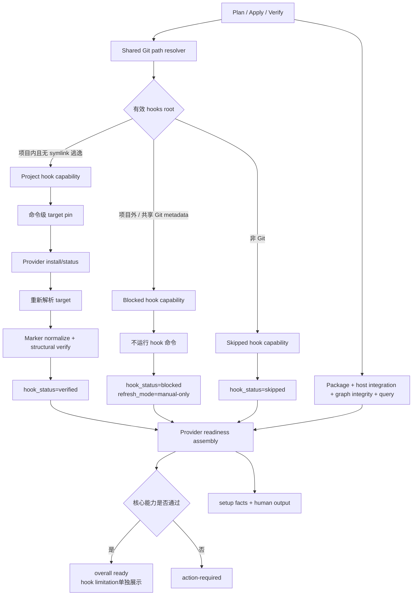

# Runtime Setup Project-Local Graphify Hook Boundary - Plan

## Goal Capsule

| 维度 | 决策 |
| --- | --- |
| Objective | 让 Runtime Setup 在任何 Git 配置下都只修改当前开发项目内的 Graphify surface，并且不再因用户级 `core.hooksPath` 阻断项目级核心就绪；仓库外 hooks root 只作为只读环境事实。 |
| Recommended approach | 抽取现有 `git rev-parse --git-path` 能力为共享 resolver，在 plan、apply、verify 三条路径统一解析并分类有效 hooks root；项目内 hook 作为可选自动刷新增强受控安装，项目外路径跳过所有 Graphify hook 命令，切换为 `blocked + manual-only` steady state，但不覆盖 graph/query 的核心就绪结果。 |
| Authority hierarchy | 当前用户确认的“spec-first 安装并运行于当前开发目录”产品边界 > `docs/10-prompt/结构化项目角色契约.md` 的 mutation/source/evidence 原则 > Runtime Setup source、provider readiness contract 与 focused tests > Provider CLI 自报状态。 |
| Decision focus | 如何把 hook mutation 与 Graphify 必需 readiness 解耦；如何在不修改全局 Git 策略、不创建假本地 hook、不扩张 schema 的前提下表达“核心可用、自动刷新不可用”。 |
| Verification focus | 证明项目外路径下 install/uninstall/status/normalize 均未触发且完整 setup 仍可 ready；默认和项目内自定义路径仍可安装并结构验证；plan/apply 间配置变化重新判定；facts、human output、五宿主 projection 与 package 内容一致。 |
| Largest risk or boundary | Provider-native `graphify hook install` 会遵循 Git 的有效 hooksPath。若只在命令后验证，用户目录可能已被修改；必须在副作用前解析、containment gate，并将 hook 子结果与已完成的 graph/query/configured facts分离。 |
| Stop conditions | 任一 hook 子命令仍可能在仓库外执行；实现自动写 `core.hooksPath` 或生成全局 hook 链；项目外路径被计为 project-local verified 或继续导致 core-ready setup 为 `action-required`；blocked facts 不通过 schema；runtime mirror 被手工修补；现有用户 dirty changes 被覆盖。 |
| Execution profile | Deep、mutation-sensitive、跨 provider/contract/docs/runtime projection 的项目级安全修复；source-first，先写防回归测试，再实施最小共享 resolver 与 provider gate。 |

---

## Product Contract

### Summary

`spec-first` 是安装并运行在用户当前开发目录中的项目级产品。Runtime Setup 可以读取用户级 Git 配置来判断环境，但其 Graphify provider mutation authority 只覆盖当前项目根内的 artifact、host integration 和 Git hook 路径。

本方案不通过改写 Git 策略“强行全绿”。它重新定义正确的绿色边界：Graphify package、项目内 host integration、图完整性和真实 query probe 是必需能力；Git hook 只是项目内可用时启用的自动刷新增强。外部 hooksPath 下，Runtime Setup 必须绝不越界写用户目录，同时允许核心 setup 成功，并把 steady state 诚实降级为 manual-only。

### Problem Frame

当前 Graphify provider 存在两套不一致的 hook 路径模型：Provider CLI 遵循 Git 的有效 `core.hooksPath`，而 Runtime Setup 的 marker detection、normalization 和 structural verification 固定读取项目 `.git/hooks`。当全局配置指向用户目录时，apply 可能先运行 Provider 安装命令，再以项目本地文件缺失报告 `graphify-provider-hook-not-found`。

该行为同时破坏五项边界：mutation 超出选定 target、plan 未披露真实 hook 写目标、machine facts 把“项目外路径被拒绝”错误表述为“安装失败”、可选 hook 被提升为项目级必需 blocker、`--refresh` 被错误建议为 hook path 修复动作。

### Actors

- A1. Project developer：在当前项目目录运行 `spec-runtime-setup`，预期 setup 不修改其他仓库或用户级 Git 策略。
- A2. Runtime Setup：解析目标、执行项目级 provider setup、准备 script-owned readiness facts，并在 mutation 边界外 fail closed。
- A3. Graphify Provider CLI：按收到的 Git 环境安装或检查 hook，但不拥有 spec-first 的授权边界判断。
- A4. Downstream consumer：读取 `provider-readiness.v2` 与 human output，区分 graph/query core readiness、project-local hook readiness 和 manual-only limitation。
- A5. Maintainer/reviewer：从 source、tests、schema 和 projection evidence 判断修复是否可发布。

### Requirements

#### 项目级 mutation 边界

- R1. Runtime Setup 必须通过 Git 自身解析当前仓库的有效 hooks root，不得以固定 `.git/hooks` 或单独读取某一级 `core.hooksPath` 代替有效路径解析。
- R2. 只有有效 hooks root 先通过 lexical project containment，再对项目内候选执行 nearest-existing/no-follow symlink containment，证明最终目标仍位于当前项目根内时，Graphify hook install、uninstall、status、marker read、normalization 和 structural verification 才可运行；lexically external 路径不得被 stat、realpath 或读取内容。
- R3. 有效 hooks root 位于项目外、解析失败、使用 symlink 逃逸、位于共享 worktree/submodule Git metadata，或在hook命令启动前已改变时，Runtime Setup必须在副作用前停止该子能力。命令启动后真实Git target发生变化时，命令级pin保证已发生写入仍位于preflighted项目路径；postflight必须停止normalize、cleanup和verified claim。
- R4. Runtime Setup 不得自动写仓库级或全局 `core.hooksPath`，不得复制或链式执行全局 hook，也不得创建不会被当前 Git 配置执行的假本地 hook。
- R5. 对允许执行的 Graphify hook 子命令，进程级 Git 配置必须固定到已通过 containment 的同一 hooks root；命令后重新解析并确认有效目标未漂移，才能继续 normalize 和 verified claim。

#### 能力分离与 readiness 诚实性

- R6. 项目外 hooksPath 不得把已经成功的 package、project skill、artifact generation、graph integrity 和 query probe 改写为 first-generation failure；这些 facts 必须按各自证据保留。
- R7. 项目外 hooksPath 的稳态结果必须为 `hook_installed=false`、`hook_verified=false`、`hook_status=blocked`、`hook_skipped_reason=graphify-hook-path-outside-project`、`refresh_mode=manual-only`，其中 hook 字段明确只描述 project-local auto-refresh readiness。
- R8. Hook 不得单独决定 `readiness_status` 或完整 Runtime Setup 健康度。Package、项目内 host integration、graph integrity 和 query probe 全部通过时，项目外 hooksPath 不得产生 Provider `degraded` 或 overall `action-required`；apply/refresh 当轮有新生成证据时可为 `fresh`，只读 verify 无当前性证据时为 `unknown`。普通 plan/work/debug/review 继续把 Graphify candidate 视为 advisory navigation。
- R9. `next_actions` 必须明确外部 Git 策略未被修改，并把“调整 hooksPath 到项目内”标为 owner 可选的自动刷新增强；显式 refresh 是 manual-only steady state 的正常更新方式，不得表述成 hook path 修复动作或必需 setup action。

#### 合同、兼容与投射

- R10. `provider-readiness.v2` 保持字段集和 schema version 不变，但 `hook_status` 枚举补齐已被 producer/consumer 使用的 `blocked`；producer 支持按结果覆盖现有 `refresh_mode`，合同文档明确 hook facts 的 project-local optional scope，且只有 `readiness_status` 进入 setup health。
- R11. 正常仓库默认 `.git/hooks`、项目内自定义 hooksPath 和无 Git 项目保持兼容；无Git项目使用`hook_status=skipped`与`refresh_mode=manual-only`，worktree/submodule指向项目外共享Git metadata时使用blocked/manual-only，二者均不阻断已通过的核心能力。
- R12. 共享 Git path resolver 成为 Runtime Setup 内唯一的 `git rev-parse --git-path` source owner；workspace exclude/clean 与 Graphify provider 复用它，不保留两份路径解析真相源。
- R13. 新共享 module、provider 变更、contract 和文档必须通过现有递归生成链进入 Claude、Codex、Cursor、Kiro、Qoder runtime；不得手改 `.agents/skills/**` 等 runtime mirror。
- R14. README、中文 README、Runtime Setup skill 与用户手册必须说明：Graphify hook 只在有效路径位于项目内时安装；全局 hooksPath 是只读 blocker，不是 setup 的用户级 mutation target。

### Key Flows

- F1. Plan preview
  - **Trigger:** 用户运行 bare setup、subset plan 或 Graphify repair plan。
  - **Actors:** A1, A2。
  - **Steps:** 解析目标项目和有效 hooks root；分类为 project-contained、external、not-applicable 或 unsafe；仅对 project-contained 预览 hook mutation，其他分类记录 non-action 和 reason code。
  - **Outcome:** preview 与 apply 的可能副作用一致，不再只显示 `verify-hook` 却隐含安装行为。
  - **Covered by:** R1-R5, R12。

- F2. Contained project hook setup
  - **Trigger:** 有效 hooks root 位于当前项目内。
  - **Actors:** A2, A3。
  - **Steps:** apply 在命令前重新解析并 containment；将 hook 子命令固定到该 root；安装或修复 marker；再次解析目标；规范化并结构验证两个 hook。
  - **Outcome:** 只有当前 Git 真正会执行且属于当前项目的 hook 能获得 verified。
  - **Covered by:** R1-R5, R11。

- F3. External hooksPath manual-only setup
  - **Trigger:** 有效 hooks root 指向用户目录、其他仓库或共享 Git metadata。
  - **Actors:** A1-A4。
  - **Steps:** Runtime Setup 不运行任何 Graphify hook 子命令或读取外部 hook 内容；继续完成项目内 host integration、graph generation 和 query probe；输出 blocked hook facts 与 owner action。
  - **Outcome:** 用户目录保持不变；Graphify 核心能力成功时完整 setup 为 ready，同时 steady state 明确为 manual-only，绝不把自动刷新缺失伪报为核心失败或 verified。
  - **Covered by:** R2-R9。

- F4. Runtime projection and downstream consumption
  - **Trigger:** source 修复通过聚焦验证并执行 runtime regeneration。
  - **Actors:** A2, A4, A5。
  - **Steps:** 更新 closed schema、事实 renderer、skill/docs 和 projection tests；从 source 重新投射五宿主 runtime；consumer 通过 existing fields 和 reason code解释 blocker。
  - **Outcome:** source、generated runtime、machine facts 和 human summary 使用同一项目级边界。
  - **Covered by:** R10-R14。

### Acceptance Examples

- AE1. 给定默认 Git 配置且 hooks root 为项目 `.git/hooks`，当运行 Graphify setup 时，hook 被安装、规范化并验证，结果为 `hook_status=verified`。
- AE2. 给定仓库级 hooksPath 指向项目内 `.githooks`，当运行 setup 时，所有 hook 操作使用该有效路径而不是固定 `.git/hooks`，并可获得 verified。
- AE3. 给定全局 hooksPath 指向用户目录且仓库无 local override，当运行 plan/apply/verify 时，不执行 Graphify hook install、uninstall 或 status，不 stat/realpath/read 外部 hook 文件；graph/query 可完成，hook 返回 blocked、refresh mode 返回 manual-only，核心条件满足时 overall 返回 ready。
- AE4. 给定项目内路径通过 symlink 指向项目外，当运行 setup 时，hook 子能力在副作用前返回 `graphify-hook-symlink-escape`。
- AE5. 给定 worktree 或 submodule 的有效 hooks root 位于当前工作目录外，当运行 setup 时，不触碰共享 Git metadata，并返回 project-boundary blocker。
- AE6. 给定 plan 时 hooks root 位于项目内、apply 前变为项目外，当 apply 运行时，重新解析结果阻止 hook 命令，而不信任旧 plan snapshot。
- AE7. 给定 hook 命令执行后有效路径发生变化，当 setup 复核时，不 normalize 新路径、不声明 verified，并返回 target-changed blocker。
- AE8. 给定非 Git 项目，当运行 Graphify setup 时，hook 状态为skipped/not-a-git-repo、refresh mode为manual-only；其他Provider核心能力按既有合同处理且不因hook不可用失败。
- AE9. 给定项目外 hooksPath 和可用 `.graphify/graph.json`，当用户运行 explicit refresh 时，图可以更新并在当轮获得 fresh evidence；hook blocker 与 manual-only steady state 保持不变，输出不声称 refresh 修复了 hooksPath。

### Success Criteria

- 所有 Graphify hook 文件读写和 Provider hook 子命令都有当前项目 containment evidence。
- 外部 hooksPath fixture 中，hook runner 调用计数为零，外部目录内容与 hash 保持不变。
- provider result 通过 closed schema，`hook_status=blocked` 与 `refresh_mode=manual-only` 可被 facts、renderer 和 runtime executor 一致消费，但不进入必需 readiness failure。
- first generation、query、configured 和 hook readiness 在降级场景中互不覆盖。
- 五宿主 projected runtime 包含共享 resolver，并执行与 source 相同的计划/检查行为。
- 用户文档不再承诺固定 `.git/hooks`，也不建议用 `--refresh` 解决 hooksPath 冲突。

### Scope Boundaries

#### In scope

- 单项目 Runtime Setup 的 Graphify provider hook plan/apply/verify 路径。
- Runtime Setup 内 Git path resolver 的共享 ownership。
- `provider-readiness.v2` 已有 hook 字段的语义和 `blocked` 枚举修正。
- facts、human output、Runtime Setup prose、README/用户手册、tests、runtime projection 与 CHANGELOG。

#### Deferred to follow-up work

- 若真实使用证明“项目外但用户明确授权”的 hook 支持具有高频价值，再通过独立 PRD 评估 user-scope flag、审计和回滚合同；本方案不预留半成品入口。
- Graphify provider 上游是否原生提供 `--hooks-dir` 或 project-only install contract，待新版本出现并有实测证据后重估命令级 pin 机制。

#### Outside this plan

- 自动修改用户的 `~/.gitconfig`、全局 `core.hooksPath` 或 `~/.githooks`。
- 自动给当前仓库写 local `core.hooksPath`，因为这可能绕过组织级 commit-msg/pre-push policy。
- 复制、合并或链式执行全局 hooks；构建通用 Git hook manager。
- 改变 Graphify AST/query 的语义质量、索引格式或 provider package pin。
- 修改 workspace merged-graph 的 explicit refresh 产品决策。

---

## Planning Contract

### Key Technical Decisions

- KTD1. 当前项目根是唯一 Graphify hook mutation authority。Git config scope 不是授权依据；最终解析路径是否位于 project root 才是确定性 gate。全局配置若解析到项目内相对路径可允许，任何解析到项目外的路径都阻止 mutation。
- KTD2. 采用 `extend/extract`，不创建新 hook framework。把 `workspace-git-exclude.cjs` 中通用的 Git path resolution 抽到 `skills/spec-runtime-setup/scripts/lib/git-path.cjs`，workspace exclude/clean 与 Graphify provider 共同消费；workspace module 可保留兼容 re-export，避免内部调用一次性断裂。
- KTD3. Hook 是 Provider apply 的可选独立子结果，不再复用 `mutationFailure` 或 Provider `degraded` 表示外部路径。真实 artifact/query/config failure 继续进入 `mutationFailure`；project-boundary blocker 单独进入 `hookStatus/hookSkippedReason/refreshMode/limitations`，确保 first generation 已完成时仍记录 completed，核心条件满足时 overall 仍 ready。
- KTD4. plan 必须披露 hook mutation posture。`provider-action-plan.v1` 增加非敏感hook target classification和conditional ensure-hook action；contained目标输出repo-relative hook root及将受影响的hook名称，external目标只输出scope与reason code，绝对路径不进入plan、facts或durable logs。
- KTD5. plan evidence 不是 apply authority。apply 和 verify 每次重新解析有效 hooks root；hook 子命令执行前后均确认真实Git target。Preflight阻止旧preview或命令前配置漂移授权副作用；process pin限制命令写入preflighted项目路径；postflight防止命令期间配置变化被提升为normalize、cleanup或verified事实。
- KTD6. 对允许的 Provider hook 子命令使用命令级 Git config environment pin，目标值必须等于 preflighted contained root。Runner 清除继承的 `GIT_CONFIG_COUNT` 与配套 key/value 项后，仅为本次 Provider 子进程注入 `core.hooksPath=<contained-root>`；不写持久 Git config。命令后仍以真实有效 Git path 复核可执行性，防止产生“文件安全写入但 Git 不会执行”的假成功。
- KTD7. 项目外路径不运行 `graphify hook status`。该命令虽然只读，但会检查仓库外文件且无法提供 project-local ownership；resolver 已足以判断 blocker。Hook 内容不应因项目 setup 被读取或进入 diagnostic。
- KTD8. 复用 `provider-readiness.v2` 现有字段，不增加 `hook_scope` 或绝对路径字段。`hook_status=blocked`、`hook_skipped_reason` 与现有 `refresh_mode=manual-only` 已能满足 runtime executor 和 human renderer；本次把 schema enum 补齐并允许 producer 覆盖 refresh mode，视为 producer/contract consistency fix，不升级 schema version。
- KTD9. `hook_installed` 和 `hook_verified` 明确定义为 project-local facts。项目外 Provider 自报 installed 不进入这两个字段，避免把跨仓全局 hook误表述为当前项目 owned readiness。
- KTD10. Graphify project-local auto-refresh 从必需 completion item 改为 optional steady-state enhancement。`readiness_status` 只反映 package、host integration、artifact integrity、query 和当轮 freshness evidence；hook blocked 单独进入 limitation，不再触发 full setup `action-required`。这是由“spec-first 只运行于当前开发目录”直接推出的产品边界修正，不是静默放宽安全门槛。
- KTD11. Source-first 修改 `skills/`、contracts、tests 和 docs；五宿主 runtime 通过 `spec-first init` 重建。Skill prose 变化必须运行 fresh-source eval 或记录诚实的 not-run reason。

### High-Level Technical Design

### Existing Capability / Composition / Source Ownership

- **Architecture posture:** `extend/extract`。
- **Existing owners:** `path-safety.cjs` 持有 containment/symlink gate；`workspace-git-exclude.cjs` 已持有 `git rev-parse --git-path` 实现；`graphify.cjs` 持有 Provider 生命周期；`common.cjs` 和 `provider-readiness.v2` 持有 readiness 输出。
- **Chosen seam:** 通用 resolver 移到 `scripts/lib/git-path.cjs`；Graphify-specific classification 留在 provider，避免共享 helper决定产品语义。
- **Authority boundary:** resolver 只准备 absolute path fact；provider 依据当前项目根决定 mutation，LLM/human 只解释 manual-only limitation，不覆盖脚本 gate或把它升级为核心失败。
- **Failure propagation:** Git path resolution/containment failure只阻塞 hook sub-capability，并切换 steady state 为 manual-only；artifact、host integration、query 的独立结果继续汇总。真正不安全的 artifact/host path仍阻塞整个 Provider mutation。
- **Observability boundary:** durable facts只保存 reason code和状态，不保存项目外绝对路径或 hook内容。

### System-Wide Impact

- **Provider runtime — in scope:** Graphify plan/apply/verify、incumbent cleanup gate和 hook structural verification。
- **Shared setup library — in scope:** Git path resolver ownership及workspace exclude/clean兼容。
- **Machine contracts — in scope:** `provider-readiness.v2` blocked枚举、动态refresh mode、hook字段语义、core readiness汇总和consumer tests。
- **Human output — in scope:** ready-with-limitation、可选owner action和blocked reason渲染，避免refresh误导或把hook缺失显示为必需修复。
- **Host/runtime projection — in scope:** 五宿主source projection、package/smoke coverage。
- **Project graph consumption — unchanged:** Graphify输出继续是provider_untrusted advisory candidate。
- **Global Git/user environment — out of scope:** 不写、不清理、不迁移；只读取足以完成路径分类的Git事实。
- **Graphify upstream — out of scope:** 不修改Provider内部实现或发布包。

### Sequencing

1. 先建立 resolver 与外部 hooksPath 的 characterization tests，证明当前实现会调用 hook command或生成错误facts。
2. 抽取共享 Git path resolver，并保持 workspace exclude/clean regression green。
3. 重构 Graphify hook plan/apply/verify 为独立子能力，关闭 mutation gate 与 TOCTOU 复核。
4. 修正 readiness schema、facts、renderer 和 next actions，使 machine/human 输出与行为一致。
5. 同步 skill/docs/README/用户手册和 CHANGELOG，运行 source tests、fresh-source eval与五宿主projection验证。

### Assumptions

- Git 可用且 `git rev-parse --git-path hooks` 是目标平台上解析有效 hook path 的权威命令；实现不得自行重建 Git 的配置优先级。
- 项目内自定义 hooksPath 是当前项目授权域的一部分，但仍需 symlink containment；项目外 worktree/common-dir hooks会影响其他 checkout，因此不属于当前目录授权。
- 当前 `provider-readiness.v2` consumer 已具备读取 `hook_status`、`hook_skipped_reason` 和 `refresh_mode` 的能力；只需补齐 producer override 与 enum，不需要新字段即可完成准确 handoff。

---

## Implementation Units

### U1. 抽取共享 Git path resolver并定义项目级 hook target分类

- **Goal:** 建立 plan/apply/verify 共同使用的确定性 Git path fact source，并消除 workspace helper 与 Graphify provider 的路径模型分叉。
- **Requirements:** R1-R3, R11-R12
- **Dependencies:** 无
- **Files:**
  - `skills/spec-runtime-setup/scripts/lib/git-path.cjs`（新增）
  - `skills/spec-runtime-setup/scripts/lib/workspace-git-exclude.cjs`
  - `skills/spec-runtime-setup/scripts/lib/workspace-graph-clean.cjs`
  - `skills/spec-runtime-setup/scripts/providers/graphify.cjs`
  - `tests/unit/mcp-setup-workspace-git-exclude.test.js`
  - `tests/unit/mcp-setup-workspace-graph-clean.test.js`
  - `tests/unit/mcp-setup-providers.test.js`
- **Approach:** 将通用 `resolveGitPath(repoRoot, gitRelative)` 移入 shared lib；返回绝对路径或稳定 reason code。Graphify provider 先做纯字符串 lexical containment：external候选立即分类且不触发文件系统探测；只有project-contained候选才进入nearest-existing/no-follow symlink与Git topology检查。Workspace exclude/clean复用新owner并保持现有API兼容。
- **Test Scenarios:**
  - 默认仓库解析到绝对 `.git/hooks`。
  - 项目内相对与绝对自定义 hooksPath均分类为 contained。
  - 用户目录和其他仓库分类为outside，runner/file-system probe spy确认未stat、realpath或读取目标；项目内symlink escape分类为unsafe。
  - worktree/submodule共享Git metadata分类为blocked。
  - 非Git目录与Git命令失败返回稳定not-applicable/resolve-failed事实。
  - workspace exclude/clean原有normal、external和symlink fixtures不回归。
- **Verification:** 聚焦运行 workspace Git exclude、workspace clean 与 Graphify provider suites；新增 module 通过 Node syntax check。

### U2. 将 Graphify hook变成受控、可预览、可复核的可选子能力

- **Goal:** 在任何 Provider hook命令前关闭项目containment gate，并把hook从必需readiness中解耦，避免用户级Git策略阻断已完成的项目级Graphify能力。
- **Requirements:** R2-R9, R11
- **Dependencies:** U1
- **Files:**
  - `skills/spec-runtime-setup/scripts/providers/graphify.cjs`
  - `tests/unit/mcp-setup-providers.test.js`
  - `tests/unit/mcp-setup-entrypoint.test.js`
- **Approach:** plan输出conditional project-hook action或external non-action；apply在hook阶段重新解析target，仅contained状态允许Provider子命令，并通过清理后的命令级Git config environment pin约束目标；命令后复核target，再把同一hooks root传入marker detection、normalize和verify。External状态不设置`mutationFailure`或Provider`degraded`，而是设置blocked hook facts、`manual-only` refresh mode和limitation；incumbent cleanup继续要求project-local hook verified。若命令后target漂移，只保留已发生的项目内安全写入，不自动rollback或触碰新target。
- **Test Scenarios:**
  - External hooksPath时runner未收到任何`hook`子命令，外部目录hash不变。
  - Plan对contained目标显示repo-relative hooks root与`post-commit`/`post-checkout`，对external目标只显示classification/reason且不泄露绝对路径。
  - External场景中artifact/query/configured/first_generation保持各自成功；hook为blocked/manual-only，但provider与overall不因该子能力单独degraded/action-required。
  - Project-contained默认和自定义路径均运行install/status、规范化唯一marker并verified。
  - Hook command收到与preflightedtarget一致的process-level Git config environment pin；既有`GIT_CONFIG_COUNT/KEY_*/VALUE_*`不进入子进程。
  - Plan后配置变外部时apply重新判定且不运行hook命令。
  - 命令后target改变时不normalize、不cleanup incumbent、不声明verified。
  - Duplicate marker、stale interpreter、credential isolation和用户marker外内容保护的现有tests继续通过。
- **Verification:** 聚焦Graphify provider与entrypointtests，检查provider结果通过closed schema；执行diff self-review确认无其他Provider行为漂移。

### U3. 修正 core readiness、steady-state合同、facts和用户下一步建议

- **Goal:** 让machine facts、overall reason和human summary准确表达“Graphify核心已就绪、项目外hook被安全阻止、steady state需显式刷新”，而不是“hook未找到”“整体失败”或“refresh可修复hook path”。
- **Requirements:** R6-R10
- **Dependencies:** U2
- **Files:**
  - `docs/contracts/provider-readiness.schema.json`
  - `docs/contracts/provider-readiness.md`
  - `skills/spec-runtime-setup/scripts/providers/common.cjs`
  - `skills/spec-runtime-setup/scripts/lib/facts.cjs`
  - `skills/spec-runtime-setup/scripts/lib/renderer.cjs`
  - `skills/spec-runtime-setup/scripts/lib/human-output.cjs`
  - `tests/unit/mcp-setup-providers.test.js`
  - `tests/unit/mcp-setup-facts-renderer.test.js`
  - `tests/unit/mcp-setup-contracts.test.js`
  - `tests/unit/mcp-setup-node-contracts.test.js`
- **Approach:** 在v2 schema的`hook_status`枚举加入`blocked`并明确兼容原因；`providerResult`允许覆盖现有`refresh_mode`；provider contract定义hook字段为project-local optional scope，并保持只有`readiness_status`进入setup health。Graphify readiness计算移除“Git repo且hook未验证即degraded”的条件：apply/refresh当轮图生成且query通过可为fresh，只读verify无当前性证据时为unknown。Renderer为external path输出ready-with-limitation、manual refresh和可选owner action，不再生成“检查hook后重跑”或暗示`--refresh`能消除blocker的泛化建议。
- **Test Scenarios:**
  - Blocked hook facts通过schema；核心条件全通过时overall为`setup-ready`，hook reason只出现在steady-state limitation而非failure reason。
  - `hook_installed=false`、`hook_verified=false`、`first_generation=completed`可同时存在。
  - Human output明确“未修改项目外Git hook策略”，不输出外部绝对路径。
  - Explicit refresh场景更新graph facts并产生当轮fresh evidence，同时保留hook blocker/manual-only且不产生action-required。
  - Existing verified、failed、skipped、unknown状态保持schema与renderer兼容。
- **Verification:** 聚焦provider schema、facts renderer、runtime executor和entrypoint tests；检查JSON与human output fixture均不含用户目录路径。

### U4. 同步 Runtime Setup产品合同和用户文档

- **Goal:** 让源码说明与真实mutation边界一致，避免用户将Graphify hook理解为无条件写入`.git/hooks`或允许setup修改全局策略。
- **Requirements:** R13-R14
- **Dependencies:** U2, U3
- **Files:**
  - `skills/spec-runtime-setup/SKILL.md`
  - `README.md`
  - `README.zh-CN.md`
  - `docs/05-用户手册/12-gitignore参考.md`
  - `docs/contracts/source-runtime-customization-boundary.md`
  - `CHANGELOG.md`
- **Approach:** 在Runtime Setup owner边界、Graphify steady state与user documentation中统一“effective path + project containment + optional auto-refresh + external read-only/manual-only”口径；明确核心setup可ready，保留显式refresh作为正常降级刷新，不把它提升为hook修复。CHANGELOG按当前developer profile记录user-visible行为和reason code变化。
- **Test Scenarios:**
  - Source contract不再出现“Graphify固定写`.git/hooks`”的无条件表述。
  - 文档明确禁止setup自动覆盖`core.hooksPath`和全局hook chaining。
  - Skill prose的positive/negative fresh-source case能区分项目内、项目外和manual refresh三种状态。
- **Verification:** 运行skill entrypoint lint和focused source contract tests；对当前磁盘source执行fresh-source read-only eval，未执行时记录reason和claim ceiling。

### U5. 验证五宿主projection、发布包和真实无越界dogfood

- **Goal:** 证明修复从source进入所有支持宿主，并在真实全局hooksPath环境中不产生用户目录mutation。
- **Requirements:** R3, R5, R10-R14
- **Dependencies:** U1-U4
- **Files:**
  - `tests/integration/workspace-graph-five-host-projection.integration.test.js`
  - `tests/integration/init-five-host-lifecycle.integration.test.js`
  - `tests/smoke/cli-smoke.test.js`
  - `docs/validation/2026-07-17-runtime-setup-project-local-graphify-hook-boundary.md`（新增）
- **Approach:** 更新projection inventory以包含shared resolver；在隔离consumer fixture验证五宿主runtime执行相同plan/check和core-readiness汇总；用临时HOME与外部hooks目录运行真实完整setup及Graphify子集，比较前后tree/hash、exit code和facts并保存bounded receipt。真实dogfood不使用用户现有`~/.githooks`作为测试目标。
- **Test Scenarios:**
  - 五宿主runtime均携带resolver、Graphify provider和更新后的skill contract。
  - Packaged install后plan与verify能识别external hooksPath且不触发hook命令；核心条件满足时完整setup exit 0并返回ready。
  - 临时external hook目录在apply前后字节一致，项目graph/query仍可完成，steady state为blocked/manual-only。
  - 默认contained hooksPath的真实Provider install/status仍绿。
  - Source/runtime drift只通过`spec-first init`修复，generated mirror无手工diff。
- **Verification:** 运行Runtime Setup全套、typecheck、unit、integration、smoke和build；生成validation receipt记录命令、exit code、artifact refs、limitations和runtime impact。

---

## Alternatives Considered

### A. 自动写仓库级 `core.hooksPath=.git/hooks`

拒绝。它虽然让Graphify local hook可执行，但会覆盖组织级commit-msg/pre-push策略；Runtime Setup没有替用户改变Git policy的授权。

### B. 把全局hooks复制或链入项目hook

拒绝。Spec-first将成为通用hook manager，需要处理顺序、参数、exit code、shell兼容、重复执行、凭据和回滚，超出当前产品身份，并可能执行用户未授权脚本。

### C. 直接接受全局hook为verified

拒绝。全局hook影响所有仓库，无法证明当前项目ownership、隔离或未来稳定性；Provider CLI status只证明某个有效path上存在hook，不证明project-local contract。

### D. 始终固定检查 `.git/hooks`

拒绝。这忽略Git原生路径解析和项目内自定义hooksPath，继续制造安装/验证双模型。

### E. 外部hooksPath时阻塞整个Graphify Provider plan

拒绝。Host integration、first generation和query均可在项目内安全完成；全阻塞会丢失已确认能力并把子能力失败扩大为整体失败。

### F. 保持 hook 缺失为 Provider `degraded` 和 full setup `action-required`

拒绝。Git hook只影响未来自动刷新，不影响当前项目内package、host integration、graph integrity或query liveness；继续阻断会让项目级产品永久受用户级Git策略支配，并诱导用户修改本不应由setup拥有的全局配置。

### G. 新增 `--allow-global-hooks` 参数

本轮拒绝。用户已确认产品运行于当前开发目录；user-scope mutation需要独立产品合同、审计、回滚和采用证据，不能作为修bug的快捷开关。

---

## Risks & Dependencies

- **Provider命令不遵循process-level Git pin：** U2以runner env capture和真实临时HOME dogfood验证；若Provider忽略Git标准配置环境，停止release并降级为contained path下不自动安装，等待上游明确hooks-dir支持。
- **Schema消费者未接受`blocked`：** 当前runtime executor已消费该值，schema反而落后；U3补closed-schema与facts consumer回归，发布说明记录兼容修正。
- **Worktree/submodule用户失去自动刷新：** 这是当前目录mutation边界的诚实代价；输出明确manual refresh，不向共享Git metadata写入。
- **Manual-only图可能随后变旧：** 只读verify在没有当轮生成或可证明currentness时报告`unknown`而非`fresh`；Graphify仍是advisory navigation，downstream通过direct source确认结论，用户可显式refresh。
- **Hook命令期间Git配置漂移：** 命令级pin保证已发生的写入仍留在preflighted项目内；postflight发现真实target变化后不normalize、不verified，也不自动删除项目内文件，避免rollback破坏用户原有hook内容。
- **并发filesystem替换：** 本方案假定target repo是当前用户控制的开发目录，不防御拥有同一目录并发写权限的本地攻击者在Provider进程内部进行symlink swap；每次spec-first自有读写仍执行no-follow containment复核。若该威胁模型成为真实需求，应改为项目内staging生成加spec-first受控promotion，而不是继续扩大对第三方CLI的信任。
- **External path泄露个人目录：** Facts、plan、limitations和validation只存reason code；测试扫描输出不得出现temp HOME或真实home绝对路径。
- **Dirty worktree冲突：** 当前`CHANGELOG.md`和相邻plan已有用户改动；实施前逐文件检查write-set overlap，保留现有hunks，无法隔离时停止受影响unit。
- **Skill prose缓存：** Source测试不能证明当前会话runtime已刷新；U4执行fresh-source eval，U5用隔离init验证投射。
- **Graphify版本行为变化：** 当前pin为0.9.12；真实dogfood绑定registry pin。上游增加project-only hook API后按invalidation condition重评KTD6，而非静默切换。

---

## Verification Contract

### Focused deterministic checks

- Runtime Setup provider、facts renderer、entrypoint、workspace Git path与clean suites必须覆盖每个Acceptance Example。
- `provider-readiness.schema.json`对hook verified、blocked、failed、skipped、unknown以及refresh mode hook-on-demand/manual-only fixture全部通过。
- Node syntax check覆盖新增shared module与所有修改的setup scripts。
- Source diff检查不得包含`.agents/skills/**`、`.claude/**`、`.codex/**`等generated runtime手工修改。

### Broader repository checks

- `npm run test:runtime-setup`
- `npm run typecheck`
- `npm run test:unit`
- `npm run test:integration`
- `npm run test:smoke`
- `npm run build`
- `npm run lint:skill-entrypoints`

### Runtime and semantic checks

- 在隔离项目中通过`spec-first init`投射Claude、Codex、Cursor、Kiro、Qoder runtime并执行projected setup plan/check。
- 对修改后的`skills/spec-runtime-setup/SKILL.md`运行fresh-source eval，验证项目内允许、项目外阻止、manual refresh不提升为hook repair。
- 使用临时HOME与真实Git/Graphify 0.9.12运行contained/external双场景dogfood；external完整setup必须exit 0且overall ready，外部目录前后hash一致才可声明mutation boundary verified。
- Validation receipt必须区分script-confirmed path/mutation facts、Provider自报结果与LLM对产品充分性的判断。

### Claim limits

- Unit tests通过只证明代码分支与schema，不证明真实Provider不越界；必须有临时HOME field dogfood。
- Provider status成功只证明命令liveness，不证明project-localownership；verified仍要求containedpath和结构检查。
- 五宿主source projection不证明每个宿主已在用户机器加载；只能声明runtime asset可生成且可执行。

---

## Definition of Done

### Global

- 所有R1-R14都有对应implementation unit和verification evidence。
- External hooksPath下，Runtime Setup执行路径没有任何Graphify hook子命令或仓库外文件读取/写入；仅隔离validation harness可读取fixture tree/hash以证明零mutation。
- Machine facts与human output准确区分Graphify graph/query成功和project-local hook blocked/manual-only；核心条件满足时full setup为ready。
- `provider-readiness.v2` closed schema、producer、runtime executor、renderer和文档一致。
- 默认、项目内自定义、external、symlink、worktree/submodule、plan/apply drift和非Git场景全部有回归测试。
- 五宿主runtime由source生成并通过projection/smoke；无generated mirror手改。
- README双语、Runtime Setup skill、provider contract、用户手册和CHANGELOG同步。
- 临时HOME真实dogfood证明项目外hook tree前后hash不变。
- 当前工作树中与本计划无关的用户改动未被覆盖、暂存、格式化或回退。
- 所有失败尝试、临时instrumentation和未采用的hook chaining代码均从最终diff移除。

### Per Unit

- U1完成：共享resolver成为唯一Git path解析owner，workspace regression保持绿色。
- U2完成：hook副作用前后gate闭合，外部路径不运行Provider hook命令，contained路径仍verified。
- U3完成：blocked/manual-only facts通过schema；核心条件满足时overall为setup-ready，输出不再建议refresh修复hook path。
- U4完成：source产品合同和用户文档统一项目级mutation边界，fresh-source eval有可回源状态。
- U5完成：五宿主projection、发布包、真实contained/external dogfood和validation receipt全部闭合。

---

## Evidence & Limitations

- **Direct source:** `skills/spec-runtime-setup/scripts/providers/graphify.cjs` 当前在Provider hook install/status后固定读取`.git/hooks`，并把任意Git仓库的`!hookVerified`直接并入`degraded`；`workspace-git-exclude.cjs`已存在Git-native path resolver；`runtime-executor.cjs`只因Provider `readiness_status`为degraded/failed/blocked而令setup失败，已消费`hook_status=blocked`作为reason detail。
- **Contract evidence:** `docs/contracts/provider-readiness.md`明确只有`readiness_status`进入setup health，而steady-state hook字段用于解释refresh ownership；`provider-readiness.schema.json`当前枚举缺少`blocked`，但producer/consumer已使用该状态，属于producer/schema drift。
- **Field evidence:** 2026-07-16在`email_week_reports`中，Git有效hooks root为用户级目录、Provider CLI自报installed，而Runtime Setup返回`graphify-provider-hook-not-found`；这证明安装与验证路径模型分裂。该外部仓事实只用于复现问题，不成为本计划source-of-truth。
- **Advisory provider evidence:** CodeGraph定位了Graphify provider调用链；Graphify broad query只用于架构定向。关键结论均已由直接源码、schema、测试和Git命令回源。
- **Institutional learnings:** `runtime-setup-host-authority-and-script-owned-facts-2026-07-04.md`支持“显式authority + script-owned facts”；`codegraph-graphify-capability-and-evidence-boundary.md`支持readiness不等于语义权威；`modify-source-not-artifacts-2026-04-13.md`要求修改source并重建runtime。
- **Dirty workspace:** 规划时当前分支存在大量用户改动；Graphify provider、provider readiness schema和聚焦tests未观察到重叠，`CHANGELOG.md`已有改动。实施必须重新采样，不能把本快照当作写授权。
- **External research:** 未执行。当前仓已有直接复现、成熟path-safety模式、Provider合同和测试框架，外部资料不会改变项目ownership决策。

---

## Sources / Research

- `docs/10-prompt/结构化项目角色契约.md`
- `skills/spec-runtime-setup/SKILL.md`
- `skills/spec-runtime-setup/scripts/providers/graphify.cjs`
- `skills/spec-runtime-setup/scripts/providers/common.cjs`
- `skills/spec-runtime-setup/scripts/lib/path-safety.cjs`
- `skills/spec-runtime-setup/scripts/lib/workspace-git-exclude.cjs`
- `skills/spec-runtime-setup/scripts/lib/workspace-graph-clean.cjs`
- `skills/spec-runtime-setup/scripts/lib/runtime-executor.cjs`
- `docs/contracts/provider-readiness.md`
- `docs/contracts/provider-readiness.schema.json`
- `docs/contracts/source-runtime-customization-boundary.md`
- `tests/unit/mcp-setup-providers.test.js`
- `tests/unit/mcp-setup-workspace-git-exclude.test.js`
- `tests/unit/mcp-setup-workspace-graph-clean.test.js`
- `tests/unit/mcp-setup-facts-renderer.test.js`
- `docs/solutions/workflow-issues/runtime-setup-host-authority-and-script-owned-facts-2026-07-04.md`
- `docs/solutions/architecture-patterns/codegraph-graphify-capability-and-evidence-boundary.md`
- `docs/solutions/workflow-issues/modify-source-not-artifacts-2026-04-13.md`
