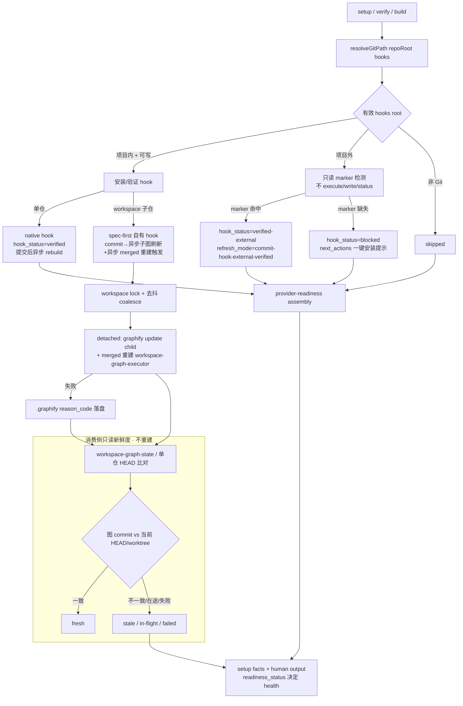

# Graphify Commit-Time 自动刷新闭环（单 git + workspace 多 git）- Plan

## Goal Capsule

| 维度 | 决策 |
| --- | --- |
| Objective | 让 Graphify 图在**代码提交时**自动刷新，覆盖单 git 与 workspace 多 git 子仓两种形态，并让 Runtime Setup 能诚实**验证**这个 commit-time 闭环是否真的生效——而不是像现在这样把它一律报成 `blocked/manual-only`。 |
| Recommended approach | 闭环发生在 git commit hook（provider-native / spec-first 自有），重建**异步**执行不阻塞提交；Runtime Setup 的职责收敛为「**读取有效 hooks root → 只读验证 → 诚实标记**」：项目内可写则安装/验证，项目外仅**只读验证**已有 hook（`verified-external`）、缺失则给一键安装提示，绝不写入或劫持外部/全局 hook。workspace 用 spec-first 自有子仓 hook，在 commit 时异步触发 merged 父图重建。 |
| Authority hierarchy | 当前用户确认的产品方向（commit-time 刷新 + 异步重建 + verify-external + workspace 真闭环）> `docs/10-prompt/结构化项目角色契约.md` 的 mutation/source/evidence 原则 > `2026-07-17-001` 确立的「不写/不劫持外部 hook、不绕过组织策略」边界 > provider readiness contract 与 focused tests > Provider CLI 自报状态。 |
| Decision focus | 如何在**不写外部 hook** 的前提下把 external hook 从「不可见 blocked」升级为「只读可验证 verified-external」；如何让 workspace 子仓 commit 异步触发 merged 重建且不撞上 external-hook 边界；异步带来的并发/锁/失败可见性/消费侧诚实标记如何处理。 |
| Verification focus | external hooks root 全程零写入、零 status/execute（仅**只读**读取指定 hook 文件做 marker 检测）；in-project 可写路径仍可安装并结构验证；workspace 子仓 commit 能异步触发 merged 重建且并发安全；async 失败与 in-flight 能被诚实标记；facts / human output / 五宿主投射一致且不泄露外部绝对路径。 |
| Largest risk or boundary | Q1（external 只读验证、不写）与 Q2（安装 spec-first 自有子仓 hook）在「子仓 hooks 也在项目外」时冲突。统一化解：对 workspace 子仓 hook 套用与单仓相同的 verify-or-prompt 姿态——仅在有效 hooks root 位于项目内或 owner 授权时写入富 hook；external 且未授权则退回「验证已有 + merged 仅告警」的诚实降级。 |
| Stop conditions | 任一路径仍会 stat/execute/write 外部 hook 而无 owner 授权；实现自动写全局或未授权 local `core.hooksPath`；`verified-external` 被当作 spec-first project-owned verified；async 重建无锁导致重叠或 corrupt；async 失败被静默；消费侧把 in-flight/failed 误报为 fresh；runtime mirror 被手改；现有 dirty changes 被覆盖。 |
| Execution profile | Deep、mutation-sensitive、跨 provider/contract/workspace/docs/五宿主投射；source-first，先写 external-boundary 与 async 并发的防回归测试，再实施只读验证与异步触发。 |

---

## Product Contract

**Product Contract preservation:** 本计划为 `spec-plan-bootstrap` 直接规划，无上游 brainstorm/PRD。以下 Product Contract 由当前用户在本会话内三轮决策确立（commit-time、verify-external + workspace 真闭环、异步重建），据此固化，未从任何 producer 继承。

### Summary

为 Graphify 补上「代码提交后自动刷新」的闭环：刷新发生在 git commit hook 中，重建**异步**执行不阻塞提交。spec-first 不在消费时重做重建，而是负责让 commit-time 刷新**可靠且可诚实验证**。单仓读取有效 hooks root 并验证 graphify commit hook 是否在位——在位报 `verified-external`（停掉一律 `blocked/manual-only` 的漏报）、缺失给一键安装提示、仅项目内/授权路径才写；workspace 用 spec-first 自有子仓 hook 在 commit 时异步刷新子图并触发 merged 父图重建。绝不写入或劫持外部/全局 hook，绝不绕过组织 commit-msg/pre-push 策略。

### Problem Frame

`2026-07-17-001` 计划为安全正确地划定了边界：有效 hooks root 位于项目外时，Runtime Setup 不 stat/read/execute/write 外部 hook，一律报 `hook_status=blocked`、`refresh_mode=manual-only`。这在**安全**上是对的，但在**闭环**上留下两个现实落差：

1. **单仓漏报。** 用户真机全局 `core.hooksPath=~/.githooks`（项目外），且 `docs/validation/2026-07-17-runtime-setup-project-local-graphify-hook-boundary.md:62` 记录该目录**已存在 graphify marker + `GRAPHIFY_OUT=.graphify` block**——commit-time 刷新其实**已经在跑**，但 spec-first 因「不读外部」把它报成 blocked/unverified，用户看到的是「未闭环」，而真相是「已闭环但 spec-first 不敢信」。
2. **workspace 从不闭环。** `workspace-graph-executor.cjs:107-118` 硬编码 `hook_status='not-installed'`，`workspace-graph-refresh.cjs` 返回 `mode:'explicit'`（reason `workspace-graph-native-hook-incompatible-with-out-of-tree-artifacts`）。原因是 Graphify 0.9.x native hook 只重建子仓默认输出，无法重收敛父目录 out-of-tree merged graph——所以 provider-native hook 装了等于撒谎，v1 选择干脆不装。

用户的方向是：闭环应在 commit 时发生（而非消费时），且重建异步。这要求 spec-first 从「拒绝一切外部 hook 交互」升级为「**只读验证**外部 hook + 在可写/授权处安装 spec-first 自有 hook」，并为 workspace 提供一个能异步触发 merged 重建的自有 hook。

### Actors

- A1. Project developer：在单仓或 workspace 父目录工作，`git commit` 后期望图自动刷新且提交不被重建阻塞。
- A2. Runtime Setup：解析有效 hooks root，只读验证 commit hook，在授权边界内安装 spec-first 自有 hook，准备 script-owned readiness/verification facts，在边界外 fail closed。
- A3. Graphify Provider CLI：`graphify hook install`（提交后异步 code-only rebuild）与 `graphify update <workspace>`（原位重建，带 per-repo lock / shrink guard）。
- A4. spec-first 自有 commit hook：workspace 子仓 commit 时异步刷新子图并触发 merged 父图重建，带并发锁与失败落盘。
- A5. Downstream consumer / 消费 workflow：读取 provider-readiness/setup facts，区分 `verified`（project-owned）、`verified-external`（只读验证的外部 commit hook）、in-flight/failed async 重建，仍把 graph 当 advisory。
- A6. Maintainer/reviewer：从 source、tests、schema、五宿主投射与真机 dogfood 判断是否可发布。

### Requirements

#### 单仓 commit-time 验证与边界

- R1. Runtime Setup 必须通过共享 `resolveGitPath(repoRoot, 'hooks')` 解析**有效** hooks root，不得固定 `.git/hooks`。
- R2. 有效 hooks root 位于**项目内**且可写时，保留 `2026-07-17-001` 的安装/规范化/结构验证路径，成功报 `hook_status=verified`。
- R3. 有效 hooks root 位于**项目外**时，Runtime Setup 允许对 `post-commit` / `post-checkout` 两个 hook 文件做**只读** marker 检测（是否含 Graphify managed block），但**绝不** execute、write、normalize、`graphify hook status`。这是对 001「不读外部 hook 内容」的**受控放宽**：从「不读」放宽为「只读验证、绝不写」。
- R4. external + marker 命中 → `hook_status=verified-external`、`refresh_mode` 反映 commit-time（如 `commit-hook-external-verified`）；external + marker 缺失 → `hook_status=blocked`（保留）但 `next_actions` 给出**一键安装提示**（安装目标仅当有效路径在项目内或 owner 授权时才写，否则仅提示，不自动写外部）。
- R5. Runtime Setup 不得自动写仓库级或全局 `core.hooksPath`，不得复制/链式执行全局 hook，不得创建不会被 Git 执行的假本地 hook。external 只读验证只读取指定的两个 hook 文件、只匹配 managed marker，不读其余内容、不进入 durable facts 的绝对路径。

#### workspace commit-time 与异步重建

- R6. workspace 模式必须以 spec-first 自有子仓 commit hook 替代「从不安装」：hook 在 commit 时（a）刷新该子仓的 child graph，（b）**异步**触发父目录 merged graph 重建。安装遵循与单仓相同的 verify-or-prompt 边界（仅项目内/授权路径写入）。
- R7. 所有 commit 触发的重建必须**异步**：commit hook 立即返回，重建在后台执行；单仓复用 graphify native 的提交后异步 rebuild，workspace 自有 hook 以 detached 后台进程运行 merged 重建。
- R8. 异步重建必须并发安全：单仓复用 Provider per-repo lock；workspace merged 重建使用 workspace 级 lock + 去抖/合并（coalesce），避免连续 commit 触发重叠或 corrupt。
- R9. 异步重建失败不得静默：失败写入 workspace `.graphify/` 下的 reason_code 落盘（不含外部绝对路径），供后续 setup/verify 与消费侧读取。

#### 消费侧诚实标记（只读，不重做重建）

- R10. 因刷新异步，消费图时重建可能在途或已失败。Runtime Setup 必须提供**只读**的新鲜度/验证事实：图反映的 commit（如子图/merged 的 source snapshot）vs 当前 HEAD/worktree、async in-flight、last async failure reason。该事实**不触发**重建（consume-time 不重做重建是产品边界）。
- R11. 消费侧新鲜度事实必须复用现有 `workspace-graph-state.cjs` 的 per-child snapshot（`head_sha`/`worktree_fingerprint`/`repoSnapshotsMatch`），不新建平行状态。单仓复用等价的 HEAD/worktree 比对（对齐 `repo-profile-cache.py` 的 HEAD-sha + dirty-tree 模式）。
- R12. `verified-external` 与 in-flight/failed 都不得被误报为 `fresh`，也不得被解释为 spec-first project-owned verified；graph 仍是 `provider_untrusted` advisory。

#### 合同、兼容与投射

- R13. `provider-readiness.v2` 保持字段集与 schema version 不变，`hook_status` 枚举补齐 `verified-external`；`refresh_mode` 允许 commit-time 取值；contract 文档把外部姿态从「不读」改述为「只读验证、绝不写」，并明确只有 `readiness_status` 进入 setup health。
- R14. 兼容既有：默认 `.git/hooks`、项目内自定义 hooksPath、非 Git 项目、worktree/submodule 指向共享 metadata 的分类不回归；`verified-external` 是新增诚实态，不改变 `verified`/`blocked`/`skipped` 现有语义。
- R15. 新/改的 shared helper、provider、workspace 编排、contract、docs 必须经现有递归生成链进入 Claude/Codex/Cursor/Kiro/Qoder runtime；不得手改 `.agents/skills/**` 等 runtime mirror。
- R16. README 双语、Runtime Setup skill、`project-graph-consumption.md`、用户手册必须说明：commit-time 刷新在 commit hook 发生、重建异步；external hook 只读验证不修改；workspace 子仓 commit 异步触发 merged 重建，external 未授权时诚实降级。

### Key Flows

- F1. 单仓 external hook 只读验证
  - **Trigger:** 单仓 setup/verify，有效 hooks root 位于项目外（全局 `core.hooksPath`）。
  - **Actors:** A1, A2, A3。
  - **Steps:** 解析有效 hooks root → 只读读取 `post-commit`/`post-checkout` 检测 Graphify managed marker → 命中报 `verified-external` + commit-time refresh_mode；缺失报 `blocked` + 一键安装提示。全程不 execute/write/status。
  - **Outcome:** 用户真机「已有全局 graphify hook」不再被漏报为未闭环；核心图能力照常，external hook execution 标为「已只读验证存在」而非「不存在/未安装」。
  - **Covered by:** R1, R3-R5, R12-R13。

- F2. 单仓项目内 hook 安装（兼容 001）
  - **Trigger:** 有效 hooks root 位于项目内且可写。
  - **Actors:** A2, A3。
  - **Steps:** 复用 001 的命令级 Git pin + 安装 + 规范化 + 结构验证；native hook 提交后异步 rebuild。
  - **Outcome:** `hook_status=verified`，commit-time 闭环由 provider-native async hook 保证。
  - **Covered by:** R2, R7, R14。

- F3. workspace 子仓 commit → 异步 merged 重建
  - **Trigger:** workspace `--workspace-graph` build 后，子仓有效 hooks root 在项目内/授权。
  - **Actors:** A1, A4, A2。
  - **Steps:** 安装 spec-first 自有子仓 hook（managed block）→ 开发者在子仓 `git commit` → hook 立即返回并后台：刷新子图（`graphify update` 子仓）+ 以 workspace 级 lock/去抖触发 merged 重建 → 失败落盘 reason_code。
  - **Outcome:** workspace 真·commit-time 闭环；提交不被重建阻塞；重叠 commit 被 coalesce。
  - **Covered by:** R6-R9, R11。

- F4. workspace 子仓 hooks 在项目外（Q1×Q2 冲突化解）
  - **Trigger:** 子仓有效 hooks root 位于项目外且未 owner 授权。
  - **Actors:** A1, A2, A5。
  - **Steps:** 不写外部 hook；只读验证已有子仓 hook（若命中 → 子图 commit 刷新按 verified-external 记录，但 merged 无法被外部 hook 触发）→ merged 走消费侧「仅告警 + 一键重建」诚实降级。
  - **Outcome:** 在不越界前提下尽量闭环；merged 真闭环仅在可写/授权处提供，否则降级为 advisory，不撒谎。
  - **Covered by:** R3-R6, R10, R12。

- F5. 消费侧只读新鲜度标记
  - **Trigger:** setup/verify 或消费 workflow 读取图前。
  - **Actors:** A2, A5。
  - **Steps:** 读取 workspace-graph-state / 单仓等价 snapshot → 比对图反映 commit vs 当前 HEAD/worktree → 标记 fresh/stale/in-flight/failed（只读，不重建）。
  - **Outcome:** async 的固有窗口被诚实表达；消费方决定是否等待或显式刷新，spec-first 不代替重建。
  - **Covered by:** R10-R12。

### Acceptance Examples

- AE1. 给定单仓全局 `core.hooksPath=~/.githooks` 且其中含 Graphify marker，运行 setup/verify，只读检测命中，报 `hook_status=verified-external` + commit-time refresh_mode，外部目录**零写入、零 execute/status**，输出不含外部绝对路径。
- AE2. 给定单仓全局 hooksPath 但 marker 缺失，运行 setup，报 `blocked` + 一键安装 `next_actions`，且不自动写外部；核心图能力仍 ready。
- AE3. 给定单仓默认 `.git/hooks`，运行 setup，native hook 安装、规范化、结构验证，`hook_status=verified`（001 行为不回归）。
- AE4. 给定 workspace 子仓有效 hooks root 在项目内，build 后安装 spec-first 自有子仓 hook；子仓 `git commit` 立即返回，后台异步完成子图刷新并触发 merged 重建；merged graph hash 变化、query 成功。
- AE5. 给定 workspace 子仓连续两次快速 commit，第二次不产生重叠 merged 重建（lock/去抖 coalesce），merged 结果不 corrupt。
- AE6. 给定 workspace 子仓有效 hooks root 在项目外且未授权，build 不写外部 hook；merged 走消费侧 stale 告警 + 一键重建命令，输出诚实降级、不含外部绝对路径。
- AE7. 给定异步 merged 重建失败，`.graphify/` 落盘 reason_code；后续 verify 与消费侧读到 `failed`，不误报 fresh，不静默。
- AE8. 给定图反映 commit X 而当前 HEAD 为 Y（async 在途或未跑），消费侧只读标记为 `stale`/`in-flight`，**不触发重建**。
- AE9. 五宿主 `spec-first init` 投射均携带新 shared helper、更新后的 provider/workspace 编排与 contract；无 generated mirror 手改。

### Success Criteria

- external hooks root 在所有路径下写入/execute/status 调用计数为零；只读验证仅触碰指定两个 hook 文件、仅匹配 marker。
- 单仓 external verified-external、in-project verified、缺失 blocked+prompt 三态均通过 closed schema 并被 facts/renderer 一致消费。
- workspace 子仓 commit 触发 merged 重建为异步、并发安全、失败可见；external/未授权诚实降级为 advisory。
- 消费侧新鲜度事实复用现有 workspace-graph-state / HEAD 比对，不新建平行状态，且从不触发重建。
- 五宿主投射一致；真机 contained + external dogfood 证明零外部 mutation 且 commit-time 可验证。
- 文档双语说明 commit-time + 异步 + verify-external + workspace 降级；不再声称 external hook「不存在/无法安装」。

### Scope Boundaries

#### In scope

- 单仓 Graphify hook plan/apply/verify 的 external **只读验证** + verified-external 报告。
- workspace spec-first 自有子仓 commit hook（异步子图刷新 + 异步 merged 重建触发）+ 并发锁/去抖 + 失败落盘。
- 消费侧只读新鲜度/验证事实（复用 workspace-graph-state / HEAD 比对）。
- `provider-readiness.v2` `hook_status=verified-external` 枚举与 refresh_mode commit-time 取值；contract/facts/renderer/human output。
- `project-graph-consumption.md` workspace 刷新模式更新（显式 → commit-time async + 消费侧告警）。
- 五宿主投射、README 双语、SKILL、用户手册、tests、CHANGELOG。

#### Deferred to Follow-Up Work

- owner 授权写入 external/global hooks root 的显式 opt-in（`--allow-external-hooks` 类）flag、审计与回滚合同：本计划保持「external 只读验证、不写」，写外部仍是 001 Alternative G 的待评估路径，仅当真实高频价值出现时另开 PRD。
- workspace merged 重建的增量化（只重收敛受影响子图）：本计划先做「触发全量 merged 重建 + 去抖」，增量化待性能数据。

#### Outside this plan

- 自动修改用户 `~/.gitconfig`、全局 `core.hooksPath`、`~/.githooks` 内容（未授权写外部）。
- 复制/合并/链式执行全局 hooks；构建通用 hook manager。
- 改变 Graphify AST/query 语义质量、索引格式、provider package pin（当前 0.9.17）。
- 消费时重做重建（consume-time rebuild）——用户已明确否掉，闭环在 commit 时发生。
- CodeGraph watcher 行为（provider-owned advisory）。

---

## Planning Contract

### Key Technical Decisions

- KTD1. **有效 hooks root 是唯一授权与验证锚点。** 复用 `git-path.cjs:resolveGitPath(repoRoot,'hooks')`。Git config scope 不是授权依据；最终解析路径在项目内=可写授权域，在项目外=只读验证域。
- KTD2. **external 从「不读」放宽为「只读验证、绝不写」。** 这是本计划对 001 的**唯一**边界放宽，且严格受限：只 `readFileSync` 有效 hooks root 下的 `post-commit`/`post-checkout` 两个文件、只做 Graphify managed marker 存在性检测、不 execute、不 `graphify hook status`、不 write/normalize、不把外部绝对路径写入 facts/logs。更新 `provider-readiness.md` 中「external 不读 hook 内容」的表述为受控只读验证。
- KTD3. **`verified-external` 是诚实态，不是 project-owned verified。** `hook_status=verified-external` 表示「spec-first 只读确认有效 hooks root 存在 Graphify managed commit hook」；它**不**主张 project ownership、interpreter 校验或结构完整性（那是 `verified` 的语义）。`hook_installed`/`hook_verified` 保持 project-local 语义，external 命中不置这两个为 true。
- KTD4. **commit-time refresh_mode 取值。** 新增 `commit-hook-external-verified`（external 只读验证）与 workspace 的 `commit-hook-spec-first-async`（自有子仓 hook）等取值；保留 `skill-cli-hook-on-demand`（in-project native）、`manual-only`（无 hook/降级）。取值集在 contract 文档枚举，schema version 不升。
- KTD5. **workspace 自有子仓 hook 是 spec-first managed block，不是 `graphify hook install`。** native hook 只重建 child 默认输出，无法触发 out-of-tree merged 重建。自有 hook 内容：先调用 `graphify update <child>`（native async），再以 detached 进程 + workspace lock/去抖触发 `spec-runtime-setup --only codegraph,graphify --workspace-graph --repos ...` 的 merged 重建路径（复用现有 `workspace-graph-executor`）。安装遵循 KTD1/KTD2 的 verify-or-prompt 边界。**launcher/root 解析：** 安装时把 verified 绝对 spec-first launcher 与绝对 workspace root 内嵌进 managed hook block（复用 `graphify.cjs` 已有的「verified absolute launcher」纪律），因为 commit 环境的 PATH 可能没有 spec-first、且子仓内需能定位父 workspace root；不得依赖运行时 PATH 查找。
- KTD5a. **单仓 consume-side 新鲜度需要 spec-first-owned 基线快照。** provider-owned `.graphify/graph.json` 不记录 spec-first HEAD 快照，故单仓在 setup/verify 时写一份自有 graph-state 快照（复用 `workspace-graph-state.cjs:inspectRepoSnapshot` 的 `head_sha`+`worktree_fingerprint`），consume 侧只读比对该快照产出 fresh/stale；快照缺失则明确降级为 best-effort（artifact mtime）并落 limitation，不伪造 fresh。
- KTD6. **异步 = detached 后台 + 幂等锁 + 去抖。** 单仓复用 Provider per-repo lock（`graphify update` 原生阻塞等锁）。workspace merged 重建用 workspace `.graphify/` 下的 lockfile + 去抖窗口：若已有 in-flight 重建则标记「需再跑一轮」而非并发启动，收敛后再跑一次（coalesce），避免重叠与 shrink guard 抖动。
- KTD7. **消费侧只读新鲜度复用 workspace-graph-state。** `inspectRepoSnapshot`/`repoSnapshotsMatch` 已提供 per-child `head_sha`+`worktree_fingerprint` 比对与 source-changed 降级；merged staleness = 「state 记录的 repo snapshots ≠ 当前 snapshots」或「async failure 落盘」或「async in-flight」。单仓用等价 HEAD/worktree 比对。**只读，绝不重建。**
- KTD8. **Q1×Q2 冲突的确定性化解。** workspace 子仓 hooks 在项目外且未授权时：不写外部；only-read 验证已有子仓 hook（子图刷新可记 verified-external），但 merged 无法由外部 hook 触发 → merged 退回消费侧「stale 告警 + 一键重建」。即 workspace 真·commit-time 仅在可写/授权子仓提供；否则诚实降级，不越界。
- KTD9. **async 失败可见性。** 后台重建的 wrapper 捕获非零 exit / 超时，写 `.graphify/` 下 reason_code 落盘（无外部绝对路径），F5 消费侧与后续 verify 读取。落盘是 append-safe / atomic replace，复用现有 contained write 模式。
- KTD10. **Source-first + 五宿主重建。** 改 `skills/`、contracts、tests、docs；runtime 经 `spec-first init` 重建。Skill/prose 变化跑 fresh-source eval 或记录诚实 not-run reason。

### High-Level Technical Design

### Existing Capability / Composition / Source Ownership

- **Architecture posture:** `extend/compose`。不新建框架。
- **Existing owners:**
  - `git-path.cjs:resolveGitPath` — 有效 Git path 解析（复用，可能补一个 `classifyHooksRoot` 薄封装）。
  - `graphify.cjs` — Provider 生命周期、hook 安装/规范化/结构验证（扩展 external 只读验证分支 + refresh_mode）。
  - `workspace-graph-executor.cjs` / `workspace-graph-refresh.cjs` — workspace 编排与 refresh posture（把「不装 hook」改为自有 hook 安装/验证/降级）。
  - `workspace-graph-state.cjs` — per-child snapshot + `repoSnapshotsMatch`（复用为消费侧新鲜度与 merged staleness 源，**唯一状态真相源**）。
  - `common.cjs:providerResult` — hook 字段已灵活（`hookStatus`/`refreshMode`/`hookSkippedReason`），仅需新枚举值。
  - `path-safety.cjs` — contained write / symlink gate（复用于自有 hook 写入与 reason_code 落盘）。
- **Chosen seam:** external 只读验证与 marker 检测放在 provider（产品语义归属 provider）；有效 path 解析归 `git-path.cjs`；异步 lock/去抖作为 workspace-local helper（新小模块 `workspace-async-refresh.cjs`），不污染 executor。
- **Authority boundary:** helper 只准备 path/marker/snapshot facts；provider 依据「项目内/授权 vs 项目外」决定写 or 只读验证；LLM/human 只解释诚实态，不把 verified-external 升级为 project-owned verified，也不代替 async 重建。
- **Failure propagation:** external 只读验证失败/marker 缺失只影响 hook 子结果与 refresh_mode，不阻塞 package/host integration/graph/query 核心 readiness；async 重建失败落盘为 limitation，不改写核心 readiness。

### System-Wide Impact

- **Provider runtime — in scope:** Graphify plan/apply/verify 的 external 只读验证分支、verified-external、commit-time refresh_mode。
- **Workspace orchestration — in scope:** 自有子仓 hook 安装/验证/降级、异步 merged 重建触发、lock/去抖、失败落盘。
- **Shared helpers — in scope:** `git-path.cjs`（薄封装可选）、新 `workspace-async-refresh.cjs`（lock/去抖/detached spawn）。
- **Machine contracts — in scope:** `provider-readiness.v2` 枚举/refresh_mode/文档、`project-graph-consumption.md` workspace 段、consumer tests。
- **Human output — in scope:** verified-external / in-flight / failed / degraded 的渲染，不泄露外部绝对路径。
- **Host/runtime projection — in scope:** 五宿主 source projection、package/smoke。
- **Global Git/user environment — out of scope:** 不写、不清理、不迁移；external 仅只读验证指定 hook 文件。
- **Graphify upstream — out of scope:** 不改 Provider 内部或 pin。

### Sequencing

1. 先建 external 只读验证与 async 并发的 characterization tests（证明当前 external 报 blocked、workspace 不装 hook）。
2. 扩展 `git-path.cjs` 分类 + provider external 只读验证分支 + verified-external/refresh_mode。
3. 建 `workspace-async-refresh.cjs`（lock/去抖/detached）+ 自有子仓 hook 内容 + executor 集成。
4. 消费侧只读新鲜度事实（复用 workspace-graph-state / 单仓 HEAD 比对）+ facts/renderer/human output。
5. contract/schema/docs/README/用户手册/CHANGELOG 同步，跑 source tests + fresh-source eval + 五宿主投射 + 真机 dogfood。

### Assumptions

- `git rev-parse --git-path hooks` 是解析有效 hook path 的权威命令（已由 `git-path.cjs` 复用）。
- 用户真机 `~/.githooks` 的 Graphify block 由历史 graphify 安装写入且确实在 commit 时跑 `graphify update`——本计划**只读验证其存在**，不假设其内部正确性（consume-side 新鲜度仍会暴露 async 落差）。
- Graphify `graphify update <workspace>` 复用 per-repo lock（验证记录已确认 0.9.17 行为）；workspace merged 重建复用现有 `workspace-graph-executor` 路径。
- 现有 `provider-readiness.v2` consumer 能读 `hook_status`/`refresh_mode`；只需补枚举，不需新字段。

---

## Implementation Units

### U1. 有效 hooks root 分类 + external 只读 marker 验证 helper

- **Goal:** 建立 plan/apply/verify 共用的确定性判定：有效 hooks root 属项目内/项目外/非 Git，并对 external 提供**受限只读** marker 检测。
- **Requirements:** R1, R3, R5, R12
- **Dependencies:** 无
- **Files:**
  - `skills/spec-runtime-setup/scripts/lib/git-path.cjs`（补 `classifyHooksRoot` 薄封装：复用 `resolveGitPath` + lexical containment）
  - `skills/spec-runtime-setup/scripts/providers/graphify.cjs`（external 只读 marker 检测函数）
  - `tests/unit/mcp-setup-workspace-git-exclude.test.js`（若 helper 复用点变化）
  - `tests/unit/mcp-setup-providers.test.js`
- **Approach:** `classifyHooksRoot` 返回 `{ classification: 'in-project'|'external'|'not-git'|'unsafe', absolute?, reason_code }`；external 仅暴露只读 marker 检测入口，读取 `<root>/post-commit`、`<root>/post-checkout` 两个文件（存在才读）、正则匹配现有 Graphify managed marker，返回 `{ post_commit: bool, post_checkout: bool }`，绝不 execute/write/realpath-follow-out，绝不把绝对路径写入返回值以外。
- **Test Scenarios:**
  - 默认仓库→in-project，绝对 `.git/hooks`。
  - 项目内自定义 hooksPath→in-project。
  - 全局/他仓 hooksPath→external；filesystem spy 确认仅 `readFileSync` 指定两个 hook 文件、零 write/execute/status。
  - external marker 命中/缺失分别返回正确 bool。
  - 项目内 symlink escape→unsafe，副作用前拒绝。
  - 非 Git→not-git 稳定 reason。
  - `Covers AE1 / AE2.`
- **Verification:** 聚焦 provider + git-path suites；filesystem-probe spy 对 external 全路径断言零写/零 execute。

### U2. 单仓 provider：verified-external + 缺失一键提示 + commit-time refresh_mode

- **Goal:** external hook 从「不可见 blocked」升级为「只读验证 verified-external / 缺失 blocked+prompt」，in-project 保持 001 verified。
- **Requirements:** R2, R4, R13, R14
- **Dependencies:** U1
- **Files:**
  - `skills/spec-runtime-setup/scripts/providers/graphify.cjs`（hook 分支 + `graphifyHookNextActions` + refresh_mode）
  - `skills/spec-runtime-setup/scripts/providers/common.cjs`（如需，refresh_mode passthrough 已支持）
  - `tests/unit/mcp-setup-providers.test.js`
  - `tests/unit/mcp-setup-entrypoint.test.js`
- **Approach:** apply/verify 中：in-project→复用 001 安装/验证（`verified`）；external + marker→`verified-external` + `refresh_mode=commit-hook-external-verified`，`hook_installed/hook_verified` 保持 false；external + 无 marker→`blocked` + `next_actions` 一键安装提示（仅项目内/授权才实际写）。`graphifyHookNextActions` 补 verified-external / prompt 文案，去掉「external 一律 manual-only」的旧措辞。核心 readiness 不因 hook 子态降级。
- **Test Scenarios:**
  - external marker 命中→`verified-external`，overall ready，输出无外部绝对路径。`Covers AE1.`
  - external marker 缺失→`blocked` + 安装提示，不写外部，核心 ready。`Covers AE2.`
  - 默认 `.git/hooks`→`verified`（001 不回归）。`Covers AE3.`
  - `first_generation=completed` 与 external hook 态并存不互相改写。
- **Verification:** 聚焦 provider + entrypoint；结果过 closed schema；diff self-review 确认无其他 provider 漂移。

### U3. `provider-readiness.v2` 合同/schema + 消费者对齐

- **Goal:** 让 `verified-external` 与 commit-time refresh_mode 成为合法、可一致消费的机器事实，schema version 不升。
- **Requirements:** R13, R12
- **Dependencies:** U2
- **Files:**
  - `docs/contracts/provider-readiness.schema.json`（`hook_status` enum + verified-external；refresh_mode 取值）
  - `docs/contracts/provider-readiness.md`（external 姿态改述为「只读验证、绝不写」；verified-external 语义；refresh_mode 枚举）
  - `skills/spec-runtime-setup/scripts/lib/facts.cjs`
  - `skills/spec-runtime-setup/scripts/lib/renderer.cjs`
  - `skills/spec-runtime-setup/scripts/lib/human-output.cjs`
  - `tests/unit/mcp-setup-contracts.test.js`
  - `tests/unit/mcp-setup-node-contracts.test.js`
  - `tests/unit/mcp-setup-facts-renderer.test.js`
- **Approach:** schema 加 `verified-external`；文档把 001 的「external 不读 hook 内容」段落改述为受控只读验证，并明确 verified-external ≠ project-owned verified、external execution 仍标 advisory。renderer 输出 ready-with-limitation + verified-external 说明，不泄露外部路径。
- **Test Scenarios:**
  - verified-external / blocked / verified / skipped / unknown 全过 schema。
  - human/JSON fixture 不含用户目录绝对路径。
  - 只有 `readiness_status` 进入 setup health（回归）。
- **Verification:** 聚焦 schema/facts/renderer/contracts tests；扫描 fixture 无外部路径。

### U4. workspace 异步刷新 helper（lock / 去抖 / detached / 失败落盘）

- **Goal:** 提供并发安全、非阻塞、失败可见的 workspace merged 重建触发原语。
- **Requirements:** R7, R8, R9
- **Dependencies:** 无（可与 U1 并行，被 U5 消费）
- **Files:**
  - `skills/spec-runtime-setup/scripts/lib/workspace-async-refresh.cjs`（新增）
  - `tests/unit/mcp-setup-workspace-async-refresh.test.js`（新增）
- **Approach:** 暴露 `triggerMergedRebuildAsync(workspaceRoot, repos)`：`.graphify/` 下 lockfile；已有 in-flight→置「dirty/需再跑」标志并返回（coalesce），不并发；detached spawn 运行 merged 重建路径；wrapper 捕获非零 exit/超时→写 `.graphify/workspace-async-refresh-status.json`（reason_code、无外部绝对路径、atomic replace）。lock 用 `wx` 独占创建 + pid/mtime 陈旧回收。
- **Test Scenarios:**
  - 无 in-flight→启动一次；并发第二次→coalesce 不重叠。`Covers AE5.`
  - 子进程失败→落盘 reason_code；成功→清 in-flight 标志。`Covers AE7.`
  - 陈旧 lock（死进程）被回收后可再触发。
  - detached 契约：调用立即返回，不阻塞。`Covers AE4.`（返回时序部分）
- **Verification:** 聚焦新 suite，注入 fake exec；断言 spawn 参数为 detached、lock 独占、失败落盘。

### U5. workspace 编排：自有子仓 hook 安装/验证/降级 + commit-time posture

- **Goal:** 把「从不安装 hook」改为 verify-or-prompt 的自有子仓 hook，commit 时异步刷新子图并触发 merged 重建；external/未授权诚实降级。
- **Requirements:** R6, R8, KTD5, KTD8
- **Dependencies:** U1, U4
- **Files:**
  - `skills/spec-runtime-setup/scripts/lib/workspace-graph-executor.cjs`（hooks 块从 not-installed 改为分类安装/验证/降级）
  - `skills/spec-runtime-setup/scripts/lib/workspace-graph-refresh.cjs`（posture 增 commit-time async 取值 + external 降级）
  - `skills/spec-runtime-setup/scripts/providers/graphify.cjs`（自有子仓 hook managed block 内容 + 安装，复用 U1 边界）
  - `tests/unit/mcp-setup-workspace-graph-executor.test.js`
  - `tests/unit/mcp-setup-workspace-graph-refresh.test.js`
  - `tests/unit/mcp-setup-providers.test.js`
- **Approach:** 对每个 confirmed child：`classifyHooksRoot`→in-project/授权→安装 spec-first managed hook（内容：`graphify update <child>` native async + 调用 `workspace-async-refresh` 触发 merged）；external+marker→verified-external 记录子图刷新，merged 走降级；external 无 marker/unsafe→不写，merged 降级 advisory。`workspaceGraphRefreshPosture` 增 `commit-hook-spec-first-async` 与 `external-degraded` 取值。
- **Test Scenarios:**
  - 子仓 in-project→安装自有 hook；hooks block 含唯一 managed marker + 触发 merged 的命令。`Covers AE4.`
  - 子仓 external→不写外部 hook（runner 零 `hook` 子命令 / 零 external write）；merged 降级 advisory。`Covers AE6.`
  - 混合子仓（部分 in-project 部分 external）→逐仓正确分类。
  - refresh posture 取值随分类正确。
- **Verification:** 聚焦 workspace executor/refresh/provider；external 目录 hash 前后不变断言。

### U6. 消费侧只读新鲜度/验证事实（不重建）

- **Goal:** 诚实表达 async 窗口：图反映 commit vs 当前 HEAD/worktree、in-flight、failed；只读，绝不触发重建。
- **Requirements:** R10, R11, R12
- **Dependencies:** U4, U5
- **Files:**
  - `skills/spec-runtime-setup/scripts/lib/workspace-graph-state.cjs`（读侧 staleness 判定复用 `repoSnapshotsMatch` + async-status 融合）
  - `skills/spec-runtime-setup/scripts/providers/graphify.cjs`（单仓等价 HEAD/worktree 比对 → readiness fact）
  - `skills/spec-runtime-setup/scripts/lib/human-output.cjs`
  - `tests/unit/mcp-setup-workspace-graph-status.test.js`
  - `tests/unit/mcp-setup-providers.test.js`
  - `tests/unit/mcp-setup-facts-renderer.test.js`
- **Approach:** status 读取 workspace-graph-state 的 repo snapshots，与当前 `inspectRepoSnapshot` 比对；融合 `workspace-async-refresh-status.json`（in-flight/failed）。单仓：以 KTD5a 的 spec-first-owned graph-state 快照为基线（setup/verify 写入 `head_sha`+`worktree_fingerprint`），consume 侧只读比对当前 HEAD/worktree，产出 fresh/stale/in-flight/failed；基线快照缺失时降级 best-effort（artifact mtime）并落 limitation。所有判定**只读**，无 spawn、无 `graphify update`。
- **Test Scenarios:**
  - state snapshot == 当前→fresh。
  - snapshot 不一致→stale，**不触发重建**（spy 断言零 spawn）。`Covers AE8.`
  - async in-flight 标志存在→in-flight。
  - async failed 落盘→failed，不误报 fresh。`Covers AE7.`
- **Verification:** 聚焦 status/provider/facts；断言消费路径零 mutation/零 spawn。

### U7. 合同/文档/skill/README/CHANGELOG 同步

- **Goal:** 让 source 说明与真实行为一致：commit-time + 异步 + verified-external + workspace 降级。
- **Requirements:** R16, R13
- **Dependencies:** U2, U3, U5, U6
- **Files:**
  - `docs/contracts/project-graph-consumption.md`（第 6 条 workspace refresh：显式 → commit-time async + 消费侧告警；external 降级）
  - `skills/spec-runtime-setup/SKILL.md`
  - `README.md`、`README.zh-CN.md`
  - `docs/05-用户手册/12-gitignore参考.md`（或相关 hook/graph 章节）
  - `docs/contracts/source-runtime-customization-boundary.md`（如涉及 external 只读验证边界）
  - `CHANGELOG.md`
- **Approach:** 统一「effective path + 项目内可写安装 / 项目外只读验证 / 未授权不写」「commit-time 异步刷新」「workspace 自有 hook 触发 merged async / external 降级 advisory」口径；停用「external hook 不存在/无法安装」措辞。CHANGELOG 按 host developer profile 记 user-visible 行为与 reason_code 变化，标 `(user-visible)`。
- **Test Scenarios:**
  - Skill/prose fresh-source case 能区分 in-project 安装、external 只读验证、workspace 降级三态。
  - 文档不再出现「Graphify 固定写 `.git/hooks`」「external hook 不存在」表述。
- **Verification:** `lint:skill-entrypoints` + focused contract tests；对磁盘 source 跑 fresh-source read-only eval，未执行记 reason 与 claim ceiling。

### U8. 五宿主投射 + 真机 contained/external dogfood + validation receipt

- **Goal:** 证明修复从 source 进入五宿主，且真机 external 环境零外部 mutation、commit-time 可验证。
- **Requirements:** R15, R3, R6, R9
- **Dependencies:** U1-U7
- **Files:**
  - `tests/integration/workspace-graph-five-host-projection.integration.test.js`
  - `tests/integration/init-five-host-lifecycle.integration.test.js`
  - `tests/integration/runtime-setup-graphify-hook-boundary.integration.test.js`（扩展 external verified-external + async 场景）
  - `tests/smoke/cli-smoke.test.js`
  - `docs/validation/2026-07-17-graphify-commit-time-refresh-closure.md`（新增）
- **Approach:** 投射 inventory 含新 helper；隔离 consumer fixture 验证五宿主执行相同判定；临时 HOME + 真实 graphify 0.9.17：external（全局 hooksPath 带/不带 marker）验证 verified-external / blocked+prompt 且外部 tree 前后逐字节不变；workspace 子仓 commit 触发异步 merged 重建、lock/去抖、失败落盘；contained 默认路径仍绿。receipt 区分 script-confirmed facts / Provider 自报 / LLM 判断。
- **Test Scenarios:**
  - 五宿主携带 helper/provider/executor/contract 更新。`Covers AE9.`
  - external marker 命中→verified-external，external tree hash 不变。`Covers AE1.`
  - workspace 子仓真实 commit→异步 merged 重建完成、query 成功、并发 coalesce。`Covers AE4 / AE5.`
  - external 未授权 workspace→merged 降级 advisory，零外部写。`Covers AE6.`
- **Verification:** Runtime Setup 全套 + typecheck + unit + integration + smoke + build；生成 validation receipt。

---

## Alternatives Considered

### A. 消费时刷新（consume-time gate）

初版提案，用户否决。理由：用户认为刷新应发生在 commit 时；consume-time 会把 mutation 引入不相关的 workflow，也不符合直觉。保留其唯一残留：**只读**消费侧新鲜度标记（U6），仅诚实表达 async 窗口，不重建。

### B. 授权写入 external/global hooks（`--allow-external-hooks`）

本轮拒绝（Deferred）。真正写外部能给全场景 commit-time，但需独立 PRD、审计、回滚与采用证据（001 Alternative G）。本计划以「external 只读验证 + 可写处安装」覆盖绝大多数真实场景，不预留半成品写外部入口。

### C. workspace 用 native `graphify hook install`

拒绝。native hook 只重建 child 默认输出，无法触发 out-of-tree merged 重建，装了即撒谎（正是 v1 不装的原因）。必须用 spec-first 自有 hook（KTD5）。

### D. 同步（阻塞）重建

拒绝。workspace 全量 merged 重收敛较重，同步会卡住每次 commit。用户明确要求异步（U4）。

### E. 新建独立 freshness 状态文件

拒绝。`workspace-graph-state.cjs` 已存 per-child snapshot + `repoSnapshotsMatch`，复用即可（KTD7）；新建会产生第二份状态真相源。

---

## Risks & Dependencies

- **external 只读验证放宽被误用为可写：** U1 以 filesystem-probe spy 硬断言零 write/execute/status；U3 文档明确「只读验证、绝不写」；review 检查无 write 分支泄漏。
- **`verified-external` 被当 project-owned verified：** KTD3 + U3 明确语义；`hook_installed/hook_verified` 保持 false；renderer 标 advisory。
- **async 重叠/corrupt：** U4 lock + 去抖 coalesce + 复用 Provider per-repo lock；U8 真机连续 commit 验证。
- **async 失败静默：** U4 失败落盘 + U6 消费侧读取 + U8 验证；不落盘即视为 bug。
- **Q1×Q2 冲突（子仓 hooks 外部）：** KTD8 确定性降级为「验证已有 + merged advisory」；U5 逐仓分类测试。
- **消费侧误触发重建：** U6 测试 spy 断言零 spawn；consume-time 重建是明确 out-of-scope。
- **commit→detached 写 status 的短窗口：** commit 返回后到 detached 进程获锁/写 `workspace-async-refresh-status.json` 之间存在窗口，期间 consume 侧读到「图反映旧 commit」→ 报 `stale`。这是诚实且安全的降级（不会误报 fresh），不额外补偿。
- **verified-external per-repo 覆盖高估：** 全局 hooks root 存在 graphify block ≠ 它为本仓跑 `graphify update`。KTD3 声明 verified-external ≠ project-owned verified，U6 consume-side 新鲜度为诚实兜底；不把 verified-external 当闭环证明。
- **external path 泄露个人目录：** facts/plan/receipt 只存 reason_code；测试扫描输出不含 temp HOME / 真实 home 绝对路径。
- **Dirty worktree 冲突：** 当前分支 `leo-2026-07-16-plan-update` 有 `CHANGELOG.md`、`graphify.cjs`、`tests/unit/mcp-setup-providers.test.js` 等改动；实施前逐文件检查 write-set overlap，保留现有 hunks，无法隔离则停止受影响 unit。
- **Skill prose 缓存：** source 测试不证明会话 runtime 已刷新；U7 fresh-source eval，U8 隔离 init 投射。
- **Graphify 版本行为：** pin 0.9.17；真机 dogfood 绑定 pin，上游变 hook/update 语义后按 invalidation 复评 KTD5。

---

## Verification Contract

### Focused deterministic checks

- provider、workspace executor/refresh/status、async-refresh、facts renderer、entrypoint、git-path suites 覆盖每个 Acceptance Example。
- `provider-readiness.schema.json` 对 verified-external / blocked / verified / skipped / unknown 全过。
- external 路径 filesystem-probe spy：零 write/execute/status，只读仅触碰指定两个 hook 文件。
- 消费路径 spy：零 spawn、零 `graphify update`。
- Node syntax check 覆盖新 `workspace-async-refresh.cjs` 与所有改动脚本。
- Source diff 无 `.agents/skills/**`、`.claude/**`、`.codex/**` 等 generated runtime 手改。

### Broader repository checks

- `npm run test:mcp-setup`
- `npm run typecheck`
- `npm run test:unit`
- `npm run test:integration`
- `npm run test:smoke`
- `npm run build`
- `npm run lint:skill-entrypoints`

### Runtime and semantic checks

- 隔离项目 `spec-first init` 投射五宿主并执行 projected plan/check。
- 对 `skills/spec-runtime-setup/SKILL.md` 跑 fresh-source eval（in-project 安装 / external 只读验证 / workspace 降级三态），未执行记 reason。
- 临时 HOME + 真实 graphify 0.9.17：external（带/不带 marker）与 workspace 子仓真实 commit 双场景 dogfood；external tree 前后 hash 一致才可声明 mutation boundary verified。
- Validation receipt 区分 script-confirmed facts / Provider 自报 / LLM 判断。

### Claim limits

- Unit tests 只证代码分支与 schema，不证真机不越界；必须临时 HOME field dogfood。
- verified-external 只证 spec-first 只读确认外部 commit hook 存在，**不**证其执行正确性；async 落差由消费侧新鲜度标记暴露。
- 五宿主投射不证每宿主已在用户机加载；只声明可生成可执行。

---

## Definition of Done

### Global

- R1-R16 均有 implementation unit 与 verification evidence。
- external hooks root 全程零 write/execute/status；只读验证仅指定两个 hook 文件、仅 marker。
- 单仓三态（verified / verified-external / blocked+prompt）与 workspace（自有 hook / external 降级）行为、facts、human output 一致；核心条件满足时 overall ready。
- async 重建异步、并发安全、失败可见；消费侧只读新鲜度从不重建。
- `provider-readiness.v2` closed schema、producer、renderer、文档一致，schema version 不升。
- 五宿主 runtime 由 source 生成并通过 projection/smoke；无 generated mirror 手改。
- README 双语、SKILL、`project-graph-consumption.md`、用户手册、CHANGELOG 同步。
- 临时 HOME 真机 dogfood 证明外部 hook tree 前后 hash 不变、workspace commit 异步闭环。
- 当前工作树中与本计划无关的用户改动未被覆盖/暂存/回退。
- 所有失败尝试与临时 instrumentation 从最终 diff 移除。

### Per Unit

- U1：分类 + external 只读验证 gate 闭合，spy 证零写/零 execute。
- U2：三态正确，in-project verified 不回归，核心 readiness 不因 hook 降级。
- U3：verified-external 过 schema，文档改述为只读验证。
- U4：lock/去抖/detached/失败落盘全绿。
- U5：自有子仓 hook 逐仓分类安装/验证/降级，external 零写。
- U6：消费侧只读新鲜度，零 spawn。
- U7：source/docs 统一口径，fresh-source eval 有可回源状态。
- U8：五宿主投射 + 真机双场景 dogfood + validation receipt 闭合。

---

## Evidence & Limitations

- **Direct source:** `workspace-graph-executor.cjs:107-118` 硬编码 `not-installed`；`workspace-graph-refresh.cjs:workspaceGraphRefreshPosture` 返回 `mode:'explicit'`；`graphify.cjs:733 graphifyHookNextActions` external → manual-only；`git-path.cjs:resolveGitPath` 已提供有效 path 解析；`workspace-graph-state.cjs:inspectRepoSnapshot/repoSnapshotsMatch` 已提供 per-child HEAD+fingerprint 比对；`common.cjs:providerResult` hook 字段已灵活。
- **Contract evidence:** `provider-readiness.md` 现明确 external「不运行 install/uninstall/status、不读取外部 hook 内容」；本计划受控放宽为只读验证。`project-graph-consumption.md` 第 6 条现声明 workspace 显式刷新、不装 hook；本计划改为 commit-time async + 消费侧告警。
- **Field evidence:** `docs/validation/2026-07-17-runtime-setup-project-local-graphify-hook-boundary.md:62` 记录真机 `~/.githooks` 已含 Graphify marker + `GRAPHIFY_OUT=.graphify` block，且现场把 core-ready unknown 误判自动 refresh——支撑「external 已闭环但被漏报」与「消费侧只读、不自动 refresh」两处判断。执行日志 `2026-07-17-090540-...txt` 复现 external blocked/manual-only。
- **Advisory provider evidence:** CodeGraph 定位调用链（graphifyHookNextActions、workspace executor、providerResult、resolveGitPath 等）；关键结论已回源到直接源码、schema、contract、Git 命令。
- **Institutional learnings:** `runtime-setup-host-authority-and-script-owned-facts-2026-07-04.md`（显式 authority + script-owned facts）、`codegraph-graphify-capability-and-evidence-boundary.md`（readiness ≠ 语义权威）、`modify-source-not-artifacts-2026-04-13.md`（改 source 重建 runtime）。
- **Dirty workspace:** 当前分支存在用户改动（含 `graphify.cjs`、`tests/unit/mcp-setup-providers.test.js`、`CHANGELOG.md`）；实施前必须重新采样 write-set overlap，本快照不作写授权。
- **External research:** 未执行；本仓已有直接复现、成熟 path-safety/异步落盘模式与 Provider 合同，外部资料不改变产品 ownership 决策。
- **Dispatch:** 本轮 Phase 1 研究以 inline 方式进行，未派发 subagent（`dispatch_authorization_missing`）；未运行独立 fresh-source semantic reviewer，仅声明 direct source/contract review。

---

## Sources / Research

- `docs/10-prompt/结构化项目角色契约.md`
- `docs/plans/2026-07-17-001-fix-runtime-setup-project-local-graphify-hook-boundary-plan.md`
- `docs/validation/2026-07-17-runtime-setup-project-local-graphify-hook-boundary.md`
- `skills/spec-runtime-setup/scripts/providers/graphify.cjs`
- `skills/spec-runtime-setup/scripts/providers/common.cjs`
- `skills/spec-runtime-setup/scripts/lib/git-path.cjs`
- `skills/spec-runtime-setup/scripts/lib/workspace-graph-executor.cjs`
- `skills/spec-runtime-setup/scripts/lib/workspace-graph-refresh.cjs`
- `skills/spec-runtime-setup/scripts/lib/workspace-graph-state.cjs`
- `skills/spec-runtime-setup/scripts/lib/mode-policy.cjs`
- `skills/spec-runtime-setup/scripts/lib/path-safety.cjs`
- `skills/*/scripts/repo-profile-cache.py`（freshness HEAD-sha + dirty-tree 模式参考）
- `docs/contracts/provider-readiness.md`
- `docs/contracts/provider-readiness.schema.json`
- `docs/contracts/project-graph-consumption.md`
- `tests/unit/mcp-setup-providers.test.js`
- `tests/unit/mcp-setup-workspace-graph-executor.test.js`
- `tests/unit/mcp-setup-workspace-graph-status.test.js`
- `tests/integration/runtime-setup-graphify-hook-boundary.integration.test.js`
- `docs/solutions/workflow-issues/runtime-setup-host-authority-and-script-owned-facts-2026-07-04.md`
- `docs/solutions/architecture-patterns/codegraph-graphify-capability-and-evidence-boundary.md`
- `docs/solutions/workflow-issues/modify-source-not-artifacts-2026-04-13.md`
