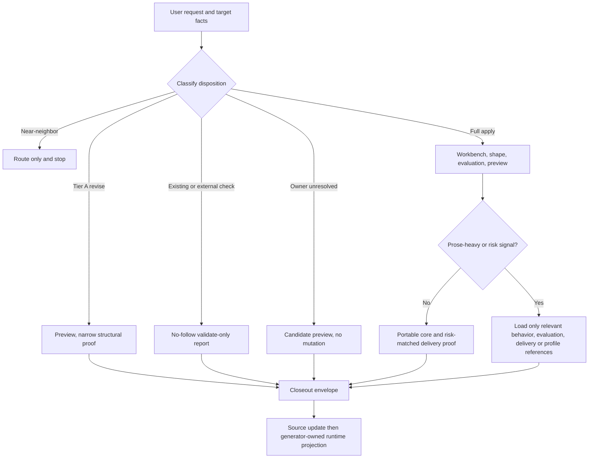

# spec-write-skill 结果优先提示词合同重构 - Plan

## Goal Capsule

- **Objective:** 在不改变 `spec-write-skill` 的公开路由、授权边界、输出合同或 source/runtime ownership 的前提下，将其默认提示词重构为结果优先、分支优先、停止条件明确的合同，减少重复说明与无关分支的默认上下文负担。
- **Recommended approach:** 扩展现有 `SKILL.md` 与条件 references 的 owner 分工；用一个紧凑的分支合同替代重复的线性叙述，将详细 qualification、行为设计与 delivery gate 保留在各自已有 reference。
- **Decision focus:** 区分不可弱化的 hard gate 与可由模型按条件判断的工作规则；每个分支只加载会改变决策的 reference。
- **Verification focus:** 先锁定 route / effect / modifier / `layer_result`、零执行外部 package、source/runtime 和 preview gate，再以 fresh-source 场景矩阵验证候选 source 的语义非回归。
- **Largest risk:** 为追求字节减少而将 source owner、外部 package 或 mutation receipt 的承重边界移出默认可见合同，导致测试表面通过但实际授权或停止行为退化。
- **Tail ownership:** `spec-work` 负责实现、聚焦验证、fresh-source evaluation、runtime projection 与 closeout；本计划不授权手改 generated runtime mirrors。

---

## Product Contract

### Summary

本计划将 `spec-write-skill` 的热路径整理为“先判定分支，再加载必要事实，最后按对应完成信号停止”的前端控制器，同时保留当前 authoring、readiness、installation 和 runtime maintenance 的职责分离。

### Problem Frame

当前 `skills/spec-write-skill/SKILL.md` 为 8,275 bytes，已经通过 `authoring-workbench.md`、`behavior-contract-design.md`、`evaluation-design.md`、profiles 与 delivery gates 实现条件化披露。
但主入口的 Contract Summary、Operation Model、Hard Boundaries 与九步 Workflow 对 source owner、`validate-only`、installer、runtime mirror 和 closeout 有重叠表达，读者需要在多个区块重新组装同一分支的允许动作和停止条件。
现有 `trigger-cases.json` 包含 15 条 route query 与 15 个 branch case，且明确标记为 `structural-only`；`tests/unit/spec-write-skill-contracts.test.js` 也主要以 source prose cue 固定合同。
这些确定性检查必要但无法证明重写后模型仍会在正确分支加载正确 reference、拒绝不当副作用并在可交付时停止。

OpenAI 的 GPT-5.6 prompting guidance 建议先定义结果、约束、可用证据和完成标准，删除重复 instructions，并将真正不变量与条件化判断规则分开；它同时要求在 prompt 迁移前后使用代表性 eval，而非把 prompt 变短当作结果。
这与本项目的 Light contract、gate the exits、deterministic floor / semantic judgment 边界一致，但只支持重构方向，不证明候选行为或真实宿主 loader 的上下文成本。

### Requirements

**Behavior-preserving branch contract**

- R1. 保持 `base_operation=create|revise`、`effect=apply|validate-only|not-entered`、`modifier=migrate|audit-remediation|none` 和全部既有 `layer_result` 的语义及其 consumer-facing closeout 输出。
- R2. 主入口必须让模型先区分 near-neighbor、source-owner blocked、external/existing `validate-only`、Tier A behavior-preserving revise 与完整 apply authoring；每个分支明确允许的副作用、必读 reference、done signal 与 failure / handoff 行为。
- R3. 近邻请求继续只路由，不执行 inventory、validator、preview 或 mutation；`validate-only` 继续零写入、零执行目标 package 代码；纯安装继续交给 `skill-installer`；generated runtime mirror 继续由 source/generator 路径处理。
- R4. mutation 继续要求单一 canonical source owner、当前授权、containment、validated preview / exact write set、atomic conditional patch primitive 和实际 receipt；缺失任一承重事实必须停止 apply，不能用 prose 自述或最终 recheck 替代。
- R5. hard gate 仅承载 mutation、外部不可信输入、source/runtime 与 completion claim 等真实不变量；选择 Skill shape、加载 profile、提问、评测深度和 resource placement 改为带条件与例外的决策规则。

**Prompt topology and output discipline**

- R6. `SKILL.md` 只保留 recurring job、输入/输出、分支选择、不可弱化边界、reference trigger 与 compact closeout contract；每条详细规则只保留一个 source owner，其他位置使用明确 pointer，不复制长段语义。
- R7. 保持现有 conditional references 的职责：`authoring-method.md` 负责 qualification 与 portable authoring，`authoring-workbench.md` 负责 apply semantic envelope，`behavior-contract-design.md` 负责 prose-heavy 行为 delta，`evaluation-design.md` 负责 semantic baseline，`delivery-gates.md` 负责风险匹配证据，target/project profiles 继续仅在证据命中时加载。
- R8. 不引入新的 Skill IR、通用 prompt registry、runner、host adapter、状态机、token telemetry 或 runtime payload schema；source bytes 只作为记录型 countermetric，不作为完成或模型质量证明。

**Evidence, projection, and documentation**

- R9. route / contract tests 必须验证能力与 owner，而不是冻结可替换的历史句式；新增的承重行为必须有对应 source assertion 和 dead-link / projection coverage。
- R10. 候选 source 必须以预注册 fresh-source 场景矩阵与基线比较，覆盖关键正向、near-neighbor、拒绝和失败路径；reviewer 只能读取编排器注入的 source / request / reference，不能运行目标 package、读取任意工作区文件、修改计划或创建 runtime artifact；fixture 或模型自检不得被升级为 semantic / field proof。
- R11. 所有持久改动落在 `skills/spec-write-skill/**`、必要 tests、validation evidence 和 `CHANGELOG.md`；通过现有 source-to-runtime init / projection 链路生成并验证运行时，不直接编辑 `.claude/`、`.codex/`、`.agents/skills/`、`.cursor/`、`.kiro/` 或 `.qoder/` 的 managed mirrors。

### Scope Boundaries

**In scope**

- `skills/spec-write-skill/SKILL.md` 与其现有 authoring、behavior、evaluation、delivery references 的职责重排和删重。
- `spec-write-skill` 的 contract / fixture tests、fresh-source scenario evidence、required documentation and changelog closeout。
- 由现有 plugin/init 机制完成的五宿主 projection 验证。

**Deferred to Follow-Up Work**

- 用真实 host loader observation 或生产 token/cost 数据评估各宿主是否按需加载 references；在有可回源 runtime 事实前，这只保持为 degraded / not-run 观察，不新增遥测。
- 对其他 public Skill 批量套用相同重构；先以本 Skill 的 scenario matrix 验证方法与 reviewer feedback 为准。
- 将 fresh-source scenario execution 自动化为通用 eval platform；当前只使用 run-local orchestration 和 maintainer validation record。

**Outside this plan**

- 更改 `spec-write-skill` 的公开入口、operation enum、`layer_result` value、installer ownership、governance roster、CLI adapter、plugin sync、generator 或 runtime layout。
- 采用 GPT-5.6 的 Programmatic Tool Calling、Pro mode、multi-agent API fields、reasoning settings 或 prompt-caching request fields；它们不是本仓库此 Skill 的 source contract 优化。
- 运行目标外部 package、自动安装第三方 Skill、跨仓批量 mutation，或放松 preview / receipt / no-follow 安全机制。

---

## Planning Contract

### Key Technical Decisions

- KTD1. **Extend the existing front controller; do not add a second workflow.** `SKILL.md` 已是公开入口且 runtime command body 由它投射。只扩展它为 outcome-first branch contract；references、scripts 和 generator 继续保有既有事实与职责。Architecture posture: `extend`.
- KTD2. **Use one branch matrix as the primary hot-path contract.** 以五类实际 disposition 为行，统一表达 entry signal、allowed effect, mandatory evidence/reference、output/done signal 和 failure/handoff。`layer_result` values 仍在 source-visible contract 中，避免将 runtime output truth 藏入 maintainer fixture；详细规则不再在摘要、workflow 与 boundary 三处重复。
- KTD3. **Keep hard gates visible; turn heuristics into decision rules.** source ownership、zero-execution external validation、preview binding、atomic write support、source/runtime and completion claims 保持明确禁止/停止语言。何时读取 profile、提问、选择 shape 或增加 sample 则写明输入条件、所支持的判断与未满足时的 fallback，避免把判断问题编码为固定步骤或调用配额。
- KTD4. **Rebind tests to source carriers, not prose layout.** 现有 substring tests 保留真正的稳定 capability cue，但将每个承重语义绑定到它的唯一 owner；重写时新增行为须有新增 assertion，移动的长文案不再被主入口测试锁死。保持 `trigger-cases.json` 的 `structural-only` truth，不把它升级为 semantic evidence。
- KTD5. **Use a pre-registered fresh-source parity matrix without a new execution platform.** 验证记录先固定 scenario、baseline/candidate sources、expected branch/reference request、forbidden action 和 grader oracle。运行时由 `spec-work` 使用当前磁盘 source 与新的通用 reviewer 编排；若没有可用 fresh dispatch primitive，记录 semantic evidence `not-run`，不能声称通过。
- KTD6. **Measure decision sufficiency separately from footprint.** 记录 `SKILL.md`、触发的 reference 与整体 package 的 source-byte 差异，用于识别是否真的移除了重复；候选必须同时满足路线、权限、证据、停止条件和 consumer output，绝不以 token、source bytes 或 projection pass 代替语义质量或 field outcome。

### High-Level Technical Design

`SKILL.md` owns classification, compact non-negotiable gates and closeout shape.
Each existing reference owns detailed criteria for only the branch that triggers it.
Scripts continue to provide deterministic facts; semantic adequacy, local fit and safe fallback selection remain LLM judgments.

### Evidence & Limitations

- Current source confirms the public operation model, hard boundaries, conditional reference map and five-axis closeout in `skills/spec-write-skill/SKILL.md`; current tests confirm its fixture is explicitly structural-only.
- Historical plans and solutions establish that string-based contract tests can falsely appear green after a prose rewrite, and that source changes must project through the existing generator. These inputs inform verification design only; current source remains the authority.
- The GPT-5.6 prompt guidance was fetched from `developers.openai.com` on 2026-07-17 and supports outcome-first, lean, evaluation-driven prompting. It is external guidance, not evidence that this candidate improves this repository's runtime behavior.
- The current Graphify CLI attempted an obsolete `graphify-out/graph.json` path despite native `.graphify/` data, so provider output is excluded from load-bearing decisions. The plan is grounded in direct source, tests and contracts.
- The worktree contains unrelated changes outside this plan's source paths. Implementation must preserve them and scope verification/diffs to this plan.

### Assumptions

- The requested optimization is behavior-preserving: changes may improve prompt topology and explicit decision rules but may not redefine product authorization, source ownership or public branch meanings.
- A fresh generic reviewer/dispatch primitive will be available during `spec-work`; if it is not, implementation may complete deterministic checks but must report semantic evaluation as not run and leave the corresponding readiness downgraded.
- Existing package recursion and host projection tests remain the correct evidence for packaging; they do not establish per-host loader prefetch behavior.

### Sequencing

First inventory every current source-carried branch and hard gate, then reorganize the prose and references, then realign deterministic tests, then run fresh-source parity and generator-owned projection checks.
No unit may delete a current boundary until its replacement source carrier and test/eval coverage are present.

---

## Implementation Units

### U1. Reframe the public source Skill as an outcome-first branch contract

- **Goal:** Make branch selection, required evidence, allowed actions and stop behavior legible from the hot path while preserving every existing operation/result contract.
- **Requirements:** R1, R2, R3, R4, R5, R6, R7, R8.
- **Dependencies:** None.
- **Files:**
  - Modify: `skills/spec-write-skill/SKILL.md`
  - Modify: `skills/spec-write-skill/references/authoring-method.md`
  - Modify: `skills/spec-write-skill/references/behavior-contract-design.md`
  - Modify: `skills/spec-write-skill/references/delivery-gates.md`
- **Approach:** Replace duplicated summary/workflow prose with a compact branch matrix and a single ordered decision spine. Keep exact `base_operation`, `effect`, `modifier`, `layer_result`, no-execution, source/runtime and mutation-stop semantics source-visible. Move detailed qualification, owner resolution, criteria-before-enumeration, apply preview and risk evidence only to their already authoritative references; add explicit trigger/purpose/fallback wording wherever a reference is selected conditionally. Preserve Tier A's narrow path and avoid loading behavior-contract guidance for pure tool/schema Skills.
- **Patterns to follow:** `skills/using-spec-first/SKILL.md` plus its triggered references; `skills/spec-write-skill/references/behavior-contract-design.md`; `docs/solutions/architecture-patterns/front-controller-triggered-references-gates-eval-regression-2026-07-01.md`.
- **Test scenarios:**
  1. Covers R1. Every existing branch still yields the same operation/effect/modifier/layer-result classification.
  2. Covers R2-R3. Near-neighbor and installer requests stop after handoff; validate-only never reaches authoring workbench, package code execution or mutation.
  3. Covers R4. Missing owner, preview binding, atomic patch support or actual receipt stops apply and reports the correct readiness limitation.
  4. Covers R5. Source/runtime, external input and completion gates remain hard; profile/shape choices are conditional rules, not unconditional commands.
  5. Covers R6-R7. Every moved rule has exactly one detailed owner and every pointer says when it is needed; portable core does not inherit spec-first project profile detail.
- **Verification:** Source review finds no new operation values, no duplicate long-form owner rule, no hidden hard gate, and no reference pointer without a trigger/fallback.

### U2. Rebind deterministic contracts and structural fixtures to the new source owners

- **Goal:** Let the prose reorganize safely while maintaining mechanical protection for true contracts, reachable references and projection surfaces.
- **Requirements:** R1, R3, R4, R7, R9, R11.
- **Dependencies:** U1.
- **Files:**
  - Modify: `tests/unit/spec-write-skill-contracts.test.js`
  - Modify: `tests/unit/eval-fixture-contracts.test.js`
  - Modify: `skills/spec-write-skill/evals/trigger-cases.json`
  - Modify only if projection expectations change: `tests/unit/plugin-modules.test.js`, `tests/unit/command-resource-path-rewrite.test.js`
- **Approach:** Map each protected behavior to `source carrier -> deterministic assertion -> semantic scenario`. Retain short, stable cues for public output values and exit gates; replace assertions that only pin old paragraph layout with section/owner-aware capability assertions. Keep fixture schema authority and `structural-only` labeling intact; extend fixture source refs or branch expectations only where the new carrier changes. Add dead-link coverage for referenced resources and verify the existing Claude command template continues to derive behavior from `SKILL.md`, not a divergent template body.
- **Patterns to follow:** `docs/solutions/workflow-issues/skill-prose-rewrite-contract-test-coverage-2026-06-28.md`; `docs/solutions/architecture-patterns/rebar-structure-skill-simplification-pattern-2026-06-04.md`; existing `tests/unit/spec-write-skill-contracts.test.js`.
- **Test scenarios:**
  1. Each retained `layer_result`, effect, modifier, closeout axis and hard boundary is asserted in its unique source owner.
  2. Moved detail does not leave stale duplicate prose or tests that require it to remain in `SKILL.md`.
  3. All source references used by a branch exist, and generated runtime package projection includes each runtime-required reference/script while excluding maintainer-only `evals/`.
  4. Every route fixture still declares a legal operation/effect/modifier and a runtime source carrier; its `structural-only` scope remains explicit.
  5. The Claude command metadata/template still delegates workflow body behavior to `skills/spec-write-skill/SKILL.md`.
- **Verification:** Focused unit suites demonstrate contract and fixture integrity without making semantic-quality claims.

### U3. Establish fresh-source parity evidence for the prompt contract rewrite

- **Goal:** Prove the candidate preserves required branch and gate behavior under a controlled fresh-source protocol, independently of the session-cached Skill definition.
- **Requirements:** R1, R2, R3, R4, R5, R9, R10.
- **Dependencies:** U1, U2.
- **Files:**
  - Add: `docs/validation/2026-07-17-spec-write-skill-prompt-contract-eval.md`
  - Modify if scenario metadata needs durable source binding: `skills/spec-write-skill/evals/trigger-cases.json`
- **Approach:** Before invoking fresh reviewers, pre-register a scenario matrix containing baseline/candidate source hashes, expected operation/effect/modifier/layer-result, allowed and forbidden actions, required reference request and grader oracle. At minimum cover: portable deterministic create; prose-heavy revision; external validate-only; installer near-neighbor; ambiguous/multi-repo owner; generated runtime patch; Tier A revise; and spec-first project-profile apply. Inject only the declared source into a new generic reviewer; provide referenced files only on explicit eligible request, record the trace, and use an independent grader. Reviewer/grader access remains read-only and limited to injected material; the run-local orchestrator is the only component that may serve an eligible reference, and it redacts any sensitive content from retained evidence. Run baseline and candidate once per scenario; rerun paired cases if either violates the oracle, differs materially, or yields an uncertain grade. Record limitations rather than simulating host loader behavior.
- **Patterns to follow:** `docs/contracts/workflows/fresh-source-eval-checklist.md`; `docs/validation/2026-07-15-using-spec-first-prompt-thinning-eval.md`; `skills/spec-write-skill/references/evaluation-design.md`.
- **Test scenarios:**
  1. Portable deterministic authoring loads authoring/workbench reasoning but not the prose-heavy behavior contract.
  2. Prose-heavy revision requests the behavior contract and returns required source/evidence boundaries rather than generic persona text.
  3. External readiness check remains no-follow/no-execution and stops before installation.
  4. Installer, audit-only and generated-mirror requests route without being mislabeled as apply/validate-only authoring.
  5. Ambiguous ownership returns `blocked-source-owner` with zero write command/path list.
  6. Tier A retains preview/write-set binding but avoids full semantic-design workbench requirements.
  7. Spec-first profile case keeps source-first catalog/runtime regeneration and required project closeout.
  8. Any candidate-only route, authority, forbidden-action, required-reference or output-envelope regression blocks semantic completion.
  9. The reviewer or grader cannot obtain un-injected workspace/runtime content, execute target package code or create any source/runtime artifact; such access invalidates the scenario rather than becoming evidence.
- **Verification:** Validation record contains source hashes, scenario/oracle matrix, baseline/candidate outputs, requested-reference traces, independent grades, reruns, limitations and an explicit `not-run` reason if fresh dispatch is unavailable. It states no field outcome or host-loader claim.

### U4. Complete source-first publication, projection, and repository closeout

- **Goal:** Ensure the optimized source package, generated host projections and user-visible repository history remain consistent without turning runtime outputs into editable source.
- **Requirements:** R9, R10, R11.
- **Dependencies:** U2, U3.
- **Files:**
  - Modify: `CHANGELOG.md`
  - Generated verification surfaces only: managed host runtime projections under `.claude/`, `.codex/`, `.agents/skills/`, `.cursor/`, `.kiro/`, `.qoder/`
- **Approach:** Add a concise changelog entry that states the behavior-preserving prompt-contract reorganization and evidence boundary. Run the narrow contract/fixture/projection suites before broader checks, then generate runtime through the current source-owned init path and inspect the projected package rather than patching it. Keep the template, governance record, adapter and plugin sync untouched unless U2 demonstrates an actual projection gap; such a gap is a new decision point, not an incidental implementation edit.
- **Patterns to follow:** `templates/claude/commands/spec/write-skill.md`; `docs/solutions/workflow-issues/modify-source-not-artifacts-2026-04-13.md`; `docs/solutions/conventions/skill-publication-command-surface-alignment-2026-06-23.md`.
- **Test scenarios:**
  1. Focused contract, fixture, plugin-module and command-resource path suites pass against source changes.
  2. Syntax/type checks and skill entrypoint lint pass; no generated mirror is manually edited.
  3. Generator-owned projection exposes the updated source package and runtime-required references on supported hosts while retaining `evals/` as maintainer-only.
  4. A diff inspection confirms only the planned source/tests/validation/changelog surfaces changed, aside from generator-owned runtime outputs.
- **Verification:** Report deterministic results, fresh-source semantic result, five-axis readiness, runtime projection status, not-run reasons and residual risks separately.

---

## Verification Contract

| Gate | Applies to | Required evidence | Done signal |
| --- | --- | --- | --- |
| Source contract | U1-U2 | Focused `spec-write-skill` contract and fixture tests | Every branch/hard-gate source carrier is present and no stale owner assertion remains |
| Package projection | U2, U4 | Plugin/module and command-resource projection tests | Runtime-required assets project through existing source-owned mechanisms |
| Fresh-source semantics | U3 | Pre-registered baseline/candidate scenario record and independent grader | No candidate-only regression; otherwise explicit `not-run` / degraded result |
| Static quality | U1-U4 | JavaScript type check, skill-entrypoint lint, diff inspection | No syntax/governance/format regression within scoped files |
| Runtime refresh | U4 | Existing init/sync output plus source-to-runtime inspection | Managed runtime mirrors are regenerated, never patched by hand |

Use the repository's narrowest existing test commands first, then `npm run typecheck`, `npm run lint:skill-entrypoints`, targeted projection coverage, and only broaden if their results or changed ownership demand it.
Fresh-source evaluation is required for a semantic-passed claim; if the host cannot dispatch a fresh reviewer, deterministic checks may pass but semantic readiness must remain `not-run` or degraded.

---

## Definition of Done

- The source Skill has a compact, outcome-first branch contract with explicit reference triggers and stop conditions.
- Existing public operation/result values, no-execution rules, source/runtime boundaries and mutation gates are behaviorally preserved.
- Every changed load-bearing behavior has a source carrier, deterministic assertion and fresh-source scenario; structural evidence is not mislabeled as semantic evidence.
- The validation record provides honest baseline/candidate conclusions and limitations.
- Required source references/scripts project through existing generators, generated runtime is refreshed only through that path, and no new runtime architecture exists.
- `CHANGELOG.md` records the source change; focused verification, static checks and scoped diff inspection are clean; residual and degraded readiness states are explicit.
