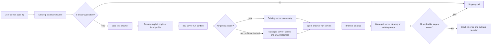
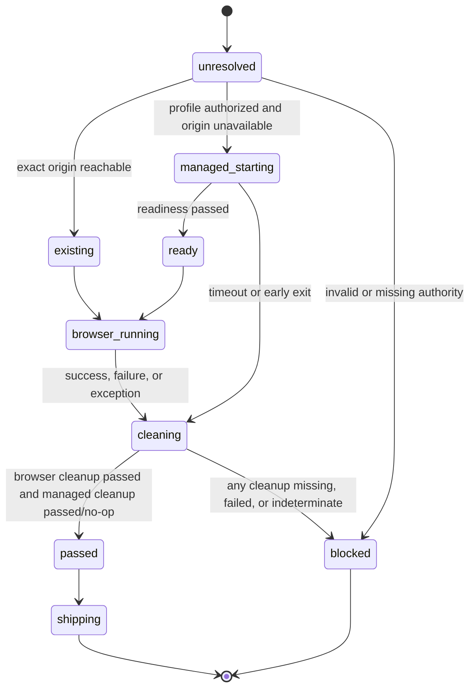

# feat: Add bounded browser runtime autonomy to spec-lfg

> **Superseded:** `docs/plans/2026-07-18-002-refactor-spec-test-browser-caller-owned-server-boundary-plan.md` 退役本方案的 runtime profile、managed server coordinator、process cleanup 与 worktree-drift 路线。本文件保留为已探索但未发布的历史方案，不再作为实施入口。

## Goal Capsule

| Dimension | Decision |
| --- | --- |
| Objective | 让用户选择 `spec-lfg` 后，在浏览器验证适用时由 pipeline 自主解析受信任的本地 runtime profile、复用或启动 loopback dev server、完成 browser verification 与 finally-style cleanup，再执行 commit、push、PR 和 CI tail。 |
| Recommended approach | 保留 `spec-lfg` 为顺序、授权和 exit gate owner；扩展 `spec-test-browser` 为 runtime-resolution 与 browser-result owner；新增一个 deterministic server lifecycle coordinator，组合现有 `agent-browser-run-context.cjs`，不新增 public Skill。 |
| Decision focus | exact origin 如何从显式参数与本地 profile 中确定；谁有权启动 server；existing 与 managed server 如何区分；cleanup 失败如何阻断 outward mutation；如何避免把 LFG 变成通用进程管理器。 |
| Verification focus | profile 解析与 loopback/path/argv 边界、existing-server 不误杀、managed-server finally cleanup、browser failure/cleanup failure 阻断 shipping、五宿主递归 projection、真实临时 HTTP fixture 的启动和回收。 |
| Largest risk or boundary | 当前工作树已有未提交的 `spec-lfg`、`spec-test-browser`、projection 与测试改动；实施必须把这些文件视为 protected baseline 并逐文件协调。选择 LFG 只授权已披露的 shipping tail，不能自动授权任意 project command；server start 还必须由本地 runtime profile 对 exact command/cwd/env 单独授权。 |
| Stop conditions | runtime profile 的 owner 或 exact command 授权不明确；无法证明 target origin 为 loopback；需要 install/migration/seed/deploy；无法可靠区分 existing 与 managed process；browser 或任一 cleanup 结果缺失、失败或不确定；实现要求手改 generated runtime。 |

---

## Product Contract

### Summary

`spec-lfg` 当前已经能自动完成 plan、work、review、shipping 和 CI，但浏览器适用时仍要求 caller 预先提供一个 ready `target-origin`，而 `spec-test-browser` pipeline 明确禁止启动 server。
这使“选择 2 后全自动跑完”在真实前端项目中经常停在 `target-origin-missing` 或 `pipeline-server-unavailable`。

本计划补齐受控的本地 runtime autonomy：项目 owner 通过 gitignored runtime profile 授权一个 exact loopback origin 和一个 server-only command；pipeline 优先复用该 origin 上的 existing server，否则启动并追踪 managed server；browser run 与两类 cleanup 关闭后，LFG 才能进入任何 commit、tracker、push 或 PR 副作用。

### Problem Frame

需要同时解决三个相互约束的问题：

- 自动化：用户选择 `spec-lfg` 后不应再被要求手工启动常见本地 server 或另开终端值守。
- 授权：能够发现命令不等于获准执行命令；LFG 的 shipping 授权也不等于对任意 package script、migration 或 deploy 的授权。
- 可信关闭：浏览器步骤通过但 server/browser cleanup 失败时，不能继续 commit、push 或开 PR，也不能误杀用户原本已运行的进程。

### Actors

- A1. Pipeline user：显式选择或调用 `spec-lfg`，授权其已披露的实现、commit、push、PR 与 CI tail。
- A2. Project owner：通过本地 runtime profile 授权 exact server command、cwd、env 和 loopback origin。
- A3. `spec-lfg`：持有 pipeline 顺序、browser applicability、outward-mutation gate 和最终 DONE claim。
- A4. `spec-test-browser`：持有 route/test-plan 语义、runtime profile 选择、server/browser 结果解释和 summary。
- A5. Server lifecycle coordinator：持有确定性的 profile validation、process spawn/readiness、ownership manifest、finally cleanup 和聚合结果。
- A6. Existing browser wrapper：继续独占 `agent-browser` capability probe、argv allowlist、private run context、browser execution 与 isolated-session cleanup。
- A7. Runtime consumer：Claude、Codex、Cursor、Kiro、Qoder 消费同一 canonical source projection。

### Requirements

#### Pipeline and applicability

- R1. `spec-lfg` 必须保持 plan-first、return-to-caller implementation、simplify、review、browser gate、lifecycle、landing 与 CI 的单一有序 pipeline；不得新增并行或第二条 shipping path。
- R2. Browser applicability 继续由 `spec-lfg` 基于 settled plan 与实际 changed flow 进行语义判断；`not_applicable` 必须带具体理由，并可继续进入 shipping tail。
- R3. Browser applicable 时，exact target origin 按以下优先级解析：调用时显式且合法的 `target-origin`；本地 runtime profile；未来经过单独批准的 framework adapter。首版不通过 redirect、page content、ambient browser state、free-port scan 或猜测默认端口补全 origin。

#### Runtime profile, server, and browser lifecycle

- R4. 首版 runtime profile 是 gitignored、项目本地、显式 opt-in 的授权载体，至少声明 schema version、exact loopback origin、server argv、repo-relative cwd、有限 env overrides、readiness path 与有界 timeout。Profile 缺失或无效时返回结构化 blocker，不静默执行项目命令。
- R5. Server command 必须以 argv 数组执行，不经 shell；cwd 必须解析在 target repo 内；origin 必须是 HTTP(S) loopback root origin；env 值不得出现在日志、chat 或结果 envelope 中。
- R6. `spec-test-browser` 在执行前必须对 server command 做语义审查：只接受 server-only intent；发现或无法排除 install、migration、seed、build-as-deploy、deploy、credential acquisition 或其他高风险副作用时，返回 `server-command-unsafe-or-ambiguous`。
- R7. 若 resolved origin 已可达，则标记 `server_mode: existing`，不得启动、追踪或关闭该 server。若不可达且 profile 授权完整，则标记 `server_mode: managed` 并启动 exact command。
- R8. Managed server 必须写入 owner-private run manifest，记录 run id、target repo、origin、command digest、cwd、process identity、start evidence 与 log ref；结果不得回显完整 env 或不可信 server output。
- R9. Managed server readiness 必须在有界 timeout 内只请求 profile 声明的 same-origin readiness path。超时、早退、origin mismatch 或不确定状态必须停止 browser action并进入 cleanup。
- R10. Browser subprocess 继续只能由 `agent-browser-run-context.cjs` 发起。Server coordinator 可以组合其 exported prepare/run/cleanup contract，但不得重新实现 browser argv、capability 或 test-plan policy。
- R11. 一旦 browser prepare 或 managed server start 成功，所有退出路径都必须执行 finally-style cleanup：先清理 browser isolated session，再停止 managed server；existing server 永不进入 server cleanup。
- R12. 聚合结果必须区分 origin provenance、server resolve/start/readiness、browser probe/run、browser cleanup、server cleanup、每阶段 status/reason code、action process count 和 private evidence refs。任何 applicable 阶段的 failed/not_run/not_supported/missing/indeterminate 都阻断 lifecycle mutation 与 outward mutation。

#### Shipping and source boundaries

- R13. `spec-lfg` 在 browser/cleanup gate 关闭前不得创建 commit、push、更新或创建 tracker ticket、修改 PR body、打开 PR 或启动 CI watch。Review fixes 在此之前只保留为已验证 working-tree edits。
- R14. Browser gate 关闭后，LFG 才执行 residual durable handoff、plan lifecycle closeout、最终 commit/push/PR 与 CI tail；没有 remote 时沿用 local-only 规则，但 local commit 同样不得早于 browser/cleanup gate。
- R15. Source 变更只落在 `skills/`、tests、docs、runtime setup template 和 projection contracts；不得手改 `.claude/`、`.codex/`、`.agents/skills/`、`.cursor/`、`.kiro/` 或 `.qoder/` runtime mirrors。
- R16. 首版不自动安装依赖、不生成或修改应用配置、不执行 migration/seed/build/deploy、不扫描任意端口、不提供通用 process supervisor。Vite、Next.js、Astro 等零配置 adapter 作为后置增强，只有 field evidence 证明 profile friction 是主要阻塞时再进入实施。
- R17. Browser/runtime 执行前后必须采集 target repo 的确定性 worktree snapshot。Cleanup 后新增或改变的路径若不属于 browser 前已经存在的 implementation/review change set，则返回 `server-runtime-worktree-drift`，不得自动删除、stage、commit或继续shipping。

### Key Flows

- F1. Existing server：LFG 判定 browser applicable → runtime profile/显式 origin 解析 → resolved origin 已可达 → browser wrapper 执行 → browser cleanup → existing server 保持运行 → shipping tail。
- F2. Managed server：LFG 判定 browser applicable → runtime profile 授权 exact command → coordinator 启动 server → readiness 通过 → browser wrapper 执行 → browser cleanup → coordinator 停止 managed server → shipping tail。
- F3. Runtime blocked：profile 缺失/非法、origin 非 loopback、command 模糊或 server readiness 失败 → 执行所有已适用 cleanup → 返回结构化 blocker → 不产生 commit/push/PR。
- F4. Browser blocked：server ready 但 wrapper capability、route/step 或 browser cleanup 失败 → server cleanup 仍执行 → 聚合失败 → 不产生 commit/push/PR。
- F5. Non-browser change：LFG 记录 `browser_applicability: not_applicable` 及理由 → 不解析 runtime profile → 继续既有 shipping tail。

### Acceptance Examples

- AE1. Profile 指向 `http://127.0.0.1:4173`，该端口已有用户进程；pipeline 复用它、完成 browser run，结果标记 existing，cleanup 不发送任何 server stop。
- AE2. Profile 合法且 origin 不可达；pipeline 启动 fixture server、等待 readiness、完成 browser run，并在结束后证明 process 不再存活，之后才允许 commit。
- AE3. Managed server ready，但 browser step 失败；browser cleanup 与 server cleanup 都运行，最终状态为 blocked，git history、remote 与 PR 均无新增副作用。
- AE4. Browser routes 全部通过，但 browser cleanup 或 server cleanup 失败/缺失；LFG 不得把主体步骤通过升级为 PASS，也不得进入 lifecycle 或 shipping。
- AE5. Profile 使用非 loopback origin、repo 外 cwd、shell string、空 argv 或越界 timeout；wrapper 在 spawn 前返回稳定 reason code，process call 为 0。
- AE6. 显式 `target-origin` 与 profile origin 不同；显式值只用于 existing-server reachability/browser target，不借用不同 origin profile 的 command 启动 server，缺 server 时结构化阻断。
- AE7. 变更为 CLI/docs/backend-only 且无 browser obligation；LFG 记录 not-applicable reason，既不读取 profile也不启动 process，随后正常 shipping。
- AE8. 没有 runtime profile且 browser applicable；pipeline 返回明确的 profile setup next action，不猜测 `npm run dev`，不触发 tracker、commit、push 或 PR。
- AE9. Managed server在运行期间生成新的tracked/untracked cache或codegen文件；cleanup后pipeline报告具体新增路径并阻断shipping，不把这些文件混入最终commit，也不替用户删除。

### Success Criteria

- 已配置 runtime profile 的项目中，用户选择 `spec-lfg` 后无需额外手工启动 server 即可完成 browser gate。
- Existing server 零误杀；managed server 在成功、browser failure、timeout 和异常路径都可验证地清理。
- Applicable browser result 与两类 cleanup 未全部关闭时，所有 local commit 与 outward mutation 保持为 0。
- 五个支持宿主投射相同 server coordinator、browser wrapper、references 与 contracts；source projection 通过不被表述为 host-loader 或真实浏览器 field outcome。

### Scope Boundaries

#### In scope

- 本地 runtime profile 与 schema/示例。
- `spec-test-browser` 内部 server lifecycle coordinator。
- existing/managed server 分流、readiness、browser composition 和 cleanup。
- `spec-lfg` shipping 顺序重排与 outward-mutation gate。
- Source contracts、eval fixtures、unit/integration/projection tests、README/docs/Changelog。

#### Deferred to Follow-Up Work

- Vite、Next.js、Astro 等 framework-specific zero-config adapters；触发条件是 profile 模式上线后仍有可重复的 setup friction 或 field blocker。
- 多 service/monorepo 多 runtime profile；首版只解析一个 target repo 与一个 active browser runtime。
- Server crash recovery、resume-across-session 与 orphan reaper；只有真实 orphan evidence 出现后再评估，不预建通用 supervisor。

#### Outside this plan

- 自动安装 dependencies、运行 migration/seed/build/deploy、远程 preview environment 或非 loopback target。
- 修改 `agent-browser` provider、绕过 exact-origin capability、复用用户 browser profile/credential。
- 新增 public `spec-*` Skill、独立 daemon、中心化 workflow engine 或手改 generated runtime。

---

## Planning Contract

### Key Technical Decisions

- KTD1. Architecture posture is `extend + compose / thin-glue`：扩展现有 `spec-test-browser` owner，并用 server coordinator 组合现有 browser wrapper；不把 server lifecycle 塞进 `spec-lfg`，不新增 public Skill。这样保持 `spec-lfg` 只拥有 sequencing/authorization，browser Skill 继续拥有 runtime verification 语义。
- KTD2. Runtime profile 是 server command 的独立授权面。LFG 选择授权 shipping tail，但不自动授权项目脚本；profile 对 exact argv/cwd/env/origin 的显式声明提供本地 opt-in，LLM 仍负责 server-only 语义判断，脚本只强制 path/origin/argv/timeout 等确定性边界。
- KTD3. 首版只在已经解析出 exact origin 后做 reachability，不做 free-port scan。显式 origin 优先；profile 次之；framework adapter 推迟。该选择牺牲首次零配置覆盖，换取可解释的授权与较低误执行风险。
- KTD4. Server coordinator 以一次聚合调用拥有 managed server start → readiness → browser run → browser cleanup → server cleanup 的 finally 生命周期。它调用 browser wrapper exports，但 browser wrapper 仍是所有 `agent-browser` subprocess 与 policy 的唯一 owner。
- KTD5. Existing 与 managed server 是互斥状态。只有本次 coordinator 创建、且 process identity 与 private manifest 一致的 managed process 才可被 cleanup；reachability 已存在的 server 永不进入 stop path。
- KTD6. Browser gate 前禁止 commit 和所有 outward mutation。当前 review-followup 的“apply + commit/push”必须拆成“apply + verify”与后置 landing；residual tracker filing 也移到 browser gate 后，因为它是外部副作用且失败时会改变 durable state。
- KTD7. Profile schema 与 aggregate result 使用稳定 schema version 和 reason-code vocabulary，但不建设通用 YAML/JSON contract framework。Profile 由 skill-local JSON schema与 wrapper validator共同持有；结果 contract 由 wrapper exported API、Skill prose 和 focused tests共同验证。
- KTD8. Rollback 通过 source revert 恢复 caller-owned ready-server contract：删除 active profile consumer、server coordinator 和 LFG reorder，保留现有 browser wrapper。Profile 是 local-only optional input，不需要数据 migration。
- KTD9. Server coordinator在browser前后采集git worktree facts，LFG只接受“post-cleanup dirty set没有新增runtime-owned路径”的结果。脚本负责path set差分，LLM负责判断路径是否已经属于本次implementation/review scope；未知归属fail closed，不用cleanup便利性换取用户文件删除权。

### High-Level Technical Design

### Interface Contracts

| Interface / mode | Consumers | Canonical artifact | Contract summary | Compatibility | Verification |
| --- | --- | --- | --- | --- | --- |
| Browser runtime profile / greenfield | `spec-test-browser`, server coordinator, project owner | `skills/spec-test-browser/references/browser-runtime-profile.schema.json`, created by U1 | Versioned local JSON profile selected through `browser_runtime_profile_path`; exact loopback origin, argv, repo-relative cwd, env overrides, readiness path and bounded timeouts; no secrets in outputs | Optional additive input; missing profile preserves fail-closed behavior; rollback removes consumer without migrating local data | Wrapper validator tests plus schema fixture tests in `tests/unit/spec-test-browser-dev-server-context.test.js` |
| Server/browser aggregate result / greenfield internal protocol | `spec-test-browser`, `spec-lfg` | `skills/spec-test-browser/scripts/dev-server-run-context.cjs`, created by U2 | `schema_version`, origin provenance, server mode/stages, browser probe/run/cleanup, server cleanup, reason codes, process counts and private refs | New internal protocol; LFG adopts atomically in U4; unknown/missing fields fail closed | Exported function unit tests, LFG contract assertions and integration fixture |
| LFG pipeline order / evolution | `spec-lfg` callers and five host projections | `skills/spec-lfg/SKILL.md` and `skills/spec-lfg/references/review-followup.md` | Apply review fixes locally, close browser/cleanup gate, then residual/lifecycle/commit/push/PR/CI | Behavior change is stricter: early commit/push disappears; explicit local-only and remote paths remain | `tests/unit/spec-lfg-contracts.test.js`, `tests/unit/pipeline-mode-contracts.test.js`, five-host projection tests |

### Runtime Profile Resolution

| Priority | Candidate | May reuse existing server | May start managed server | Failure behavior |
| --- | --- | --- | --- | --- |
| 1 | Explicit valid `target-origin` | Yes | Only when a matching authorized profile has the same origin | Mismatch or unavailable server without matching profile blocks |
| 2 | Active local runtime profile | Yes | Yes, after deterministic validation and semantic server-only review | Missing/invalid/unsafe profile blocks with setup or repair reason |
| 3 | Framework adapter | Deferred | Deferred | No heuristic fallback in this release |

### Failure and Cleanup Contract

- Browser prepare 未发生且 server 未启动：返回 blocker，无 cleanup claim。
- Managed server 已启动但 readiness 失败：server cleanup required，browser cleanup not applicable。
- Browser prepare 已成功：browser cleanup required，无论 run 是否成功。
- Managed server 已启动：server cleanup required，并在 browser cleanup 之后执行。
- Existing server：server cleanup 必须显式记录 `not_applicable`/`existing-server-not-owned`，不得发送 stop signal。
- 任一 required cleanup 的结果缺失、failed、not_run 或 indeterminate：aggregate result blocked，LFG 不得继续 lifecycle、commit、tracker、push、PR 或 CI。
- Cleanup 全部通过后仍需对账pre/post worktree facts；新增dirty path或既有非run-owned path发生变化时，aggregate result携带path list与`server-runtime-worktree-drift`，LFG停止在任何stage/commit之前。

### System-Wide Impact

- Workflow：`spec-lfg` 的 side-effect 顺序改变，review fixes 与 residual filing 的 durable persistence 延后到 browser gate 后。
- Tool/runtime：`spec-test-browser` 新增 project command execution capability，但仅在 local profile opt-in、loopback、exact argv/cwd/env 和 server-only semantic review共同满足时启用。
- Config：`spec-runtime-setup` template 新增 active profile-path consumer说明；setup 只暴露/保护配置，不自动创建授权 profile或启动 server。
- Projection：`spec-test-browser` 是 internal delivered Skill，新 scripts/references 必须递归进入五宿主 runtime plan；`evals/**` 仍不得投射。
- Security/privacy：server/browser raw output 留在 owner-private temp；env value、page output 和 credentials 不进入 plan、chat、PR 或 aggregate result。
- Operations：无 production rollout或数据 migration；真实风险集中于本机 process ownership、cleanup 与 early outward mutation。

### Sequencing

1. U1 固定 profile/interface 与当前 dirty-tree ownership，再允许代码写入。
2. U2 实现并验证 server lifecycle coordinator与worktree drift facts。
3. U3 让 `spec-test-browser` 消费新 coordinator并形成聚合结果。
4. U4 重排 `spec-lfg`，只有在 U3 contract稳定后才能改变 shipping顺序。
5. U5 收口五宿主 projection、docs、eval与全量 verification。

### Assumptions

- 用户已确认首版优先完成“可配置、可验证、可清理”的闭环，framework zero-config adapters 后置。
- `agent-browser-run-context.cjs` 当前 exact-origin、private context 与 cleanup contract 是受保护基线；本计划不放宽其 capability gate。
- `spec-work mode:return-to-caller` 继续保证 implementation阶段不 commit/push/open PR，因此 early-commit风险集中在 LFG review-followup/residual路径。
- Node.js `child_process` 与平台原生命令足以完成受控 process lifecycle；若 Windows 无法提供可验证的 process-tree cleanup，Windows managed-start 必须降级为 `not_supported`，不能以单 PID kill 冒充完整 cleanup。

### Evidence & Limitations

- 当前 `spec-first` source snapshot 为 `959e95f02ba35dfc34f16a8cde9c97e5e9e78cac`，但工作树包含大量既有 tracked/untracked改动；其中 `skills/spec-lfg/**`、`skills/spec-test-browser/**`、projection与相关tests与本计划直接重叠。实施期 U1 必须重读 live source并保留他人改动，不能把该 commit当作完整当前真相。
- Compound Engineering 对照 snapshot 为 `32fae6c546704b3befb7e5eba30fc6bed931fba9`，其工作树有冲突/删除状态；本计划只使用当前读取到的 `skills/lfg/SKILL.md` 作为 advisory流程对照，不把该仓状态当作可移植实现证据。
- `skills` 对照仓库 snapshot 为 `e9fcdf95b402d360f90f1db8d776d5dd450f9234` 且工作树脏。其 `writing-great-skills`、`diagnosing-bugs` 与 invocation docs只支持 predictability、tight feedback loop、checkable completion和model-invocation原则；未发现 dev-server discovery/start/cleanup runtime，因此不复制其实现。
- CodeGraph 本轮对 prompt-heavy Skill关系的召回有限，只作为 advisory导航；LFG顺序、browser ownership、config template、projection与tests结论均已从当前source直接复核。
- 未运行真实 server、browser、host loader或 field outcome；这是 planning-only workflow。任何 runtime结果都留给实施与验证单元。
- Specialist dispatch 未获当前用户或上游显式授权，记录 `dispatch_authorization_missing`；repo research、learnings、agent-native与flow-analysis prompt均由当前agent inline应用，不声称独立review覆盖。

---

## Implementation Units

### U1. 建立 runtime profile 与 source ownership contract

**Goal:** 定义首版本地 runtime profile、配置入口、授权边界和实施前 dirty-tree保护规则。

**Requirements:** R3-R6, R15-R16; AE5, AE6, AE8.

**Dependencies:** None.

**Files:**

- Create `skills/spec-test-browser/references/browser-runtime-profile.schema.json`
- Create `skills/spec-test-browser/references/browser-runtime-profile.example.json`
- Create `tests/unit/spec-test-browser-runtime-profile.test.js`
- Modify `skills/spec-runtime-setup/references/config-template.yaml`
- Modify `skills/spec-runtime-setup/SKILL.md`
- Modify `tests/unit/mcp-setup-config-consumers.test.js`
- Modify `CHANGELOG.md`

**Approach:**

- 在首次 source mutation前重新采样 git status，逐文件确认上述写集与现有用户改动的重叠；无法安全协调时只阻塞受影响unit。
- 用 `browser_runtime_profile_path` 作为 active top-level local config key，默认不自动创建授权profile；template说明其consumer是 `spec-test-browser`，setup只暴露和保护该key。
- Schema要求 exact loopback root origin、argv数组、repo-relative cwd、有限env map、same-origin readiness path与上下界明确的timeout/interval。
- Example只展示无secret的server-only命令；不把任意framework命令宣称为通用安全默认。

**Patterns to follow:** `verification_profile_path` 的local alias思路、`skills/spec-runtime-setup/references/config-template.yaml` 的active-consumer说明、`.spec-first/*.local.yaml` gitignore边界。

**Test scenarios:**

1. Config template将 `browser_runtime_profile_path` 标记为active consumer，同时保留 `plan_output`/`brainstorm_output` 的现有分类。
2. Example profile为合法JSON并覆盖schema声明的required fields、version与安全边界；schema本身可由focused fixture test读取。
3. Setup project-config bootstrap继续逐字复制更新后的example config且不创建browser runtime profile。
4. Existing local config中的其他key在setup/sweep/pulse写入路径仍保持不变。

**Verification:** Canonical schema、example、setup prose和consumer tests对profile path、authority与non-auto-create边界一致；没有generated runtime写入。

### U2. 实现 deterministic server lifecycle coordinator

**Goal:** 新增薄型server coordinator，以单次聚合生命周期安全复用或启动server、调用browser wrapper并完成finally cleanup。

**Requirements:** R5-R12, R17; AE1-AE5, AE9.

**Dependencies:** U1.

**Files:**

- Create `skills/spec-test-browser/scripts/dev-server-run-context.cjs`
- Create `tests/unit/spec-test-browser-dev-server-context.test.js`
- Create `tests/integration/spec-test-browser-runtime.integration.test.js`
- Modify `skills/spec-test-browser/scripts/agent-browser-run-context.cjs` only if a minimal exported composition seam is missing
- Modify `scripts/run-test-suite.cjs` if the new integration test belongs in the maintained integration inventory
- Modify `CHANGELOG.md`

**Approach:**

- Coordinator读取显式origin与profile candidate，执行deterministic validation，输出稳定schema/reason code；语义上的server-only verdict由caller传入，不能由脚本从package script名称假装判定。
- Profile path解析必须只接受active、non-commented的`browser_runtime_profile_path`，支持明确quoted scalar，拒绝absolute path、repo escape、duplicate key与不可读/non-regular target；missing与invalid原因分开返回。
- 只对resolved origin做reachability；可达即existing。不可达且profile授权匹配时，以argv/no-shell方式spawn managed process，写owner-private manifest和redacted log ref。
- 聚合调用内部按固定顺序执行readiness、browser wrapper run、browser cleanup、managed server cleanup；finally路径覆盖throw、timeout、browser failure和cleanup failure。
- 在任何server/browser action前记录git status path set与run-owned change set输入，在全部cleanup后重新采集；输出新增/改变的runtime drift候选，不删除或stage任何path。
- POSIX使用可验证process-group identity；Windows只有在process-tree ownership和cleanup可验证时启用，否则返回`not_supported`。不得以best-effort单PID kill写成cleanup passed。
- Coordinator只组合browser wrapper exports；不得复制其CLI help probe、action allowlist、exact-origin、test-plan或private-file逻辑。

**Execution note:** 先用stubbed runner写出failure/cleanup tests，再实现coordinator；最后用临时Node HTTP fixture验证真实existing/managed生命周期。

**Patterns to follow:** `agent-browser-run-context.cjs` 的private directory、manifest hash、runner injection和structured reason code；Runtime Setup scripts的cross-platform process result normalization，但不复制provider policy。

**Test scenarios:**

1. Valid profile + already reachable origin返回existing，spawn/kill调用均为0。
2. Valid profile + unavailable origin启动fixture server、readiness通过、browser wrapper stub通过、cleanup后process不可达。
3. Managed server在readiness前退出，返回early-exit reason，browser action为0，server cleanup结果明确。
4. Readiness timeout触发server cleanup，结果不得包含raw server output或env values。
5. Browser wrapper run抛错或返回failed，browser cleanup与server cleanup仍按序执行。
6. Browser cleanup失败但server cleanup成功，aggregate仍blocked。
7. Server cleanup失败或process identity不匹配，aggregate blocked且不对不匹配process发送kill。
8. Existing server路径即使browser失败也绝不发送server stop。
9. Explicit origin与profile origin不一致时，不使用profile command启动不同origin。
10. Windows cleanup capability无法确认时，managed start返回not_supported且spawn为0；已有server仍可走existing路径。
11. 包含非loopback origin、absolute/escaping cwd、string command、empty argv、credential origin或越界timeout的profile在任何spawn前被validator拒绝。
12. Commented profile-path key被忽略；quoted active path正常解析；duplicate/absolute/escaping/symlinked profile path在文件读取或spawn前fail closed。
13. Managed server生成新的tracked或untracked文件时，post-cleanup result返回`server-runtime-worktree-drift`与repo-relative paths；文件保持原样且stage/commit调用为0。

**Verification:** Unit tests覆盖每个状态和reason code；integration fixture证明真实managed process在success与failure路径被回收、existing fixture不被关闭；wrapper原有tests保持通过。

### U3. 扩展 spec-test-browser pipeline orchestration

**Goal:** 让browser Skill在pipeline mode消费runtime profile与server coordinator，返回LFG可判定的完整聚合结果。

**Requirements:** R2-R12, R15, R17; F1-F5.

**Dependencies:** U1, U2.

**Files:**

- Modify `skills/spec-test-browser/SKILL.md`
- Modify `skills/spec-test-browser/references/pipeline-orchestration.md`
- Modify `skills/spec-test-browser/evals/capability-cases.json`
- Modify `tests/unit/spec-test-browser-contracts.test.js`
- Modify `tests/unit/pipeline-mode-contracts.test.js`
- Modify `CHANGELOG.md`

**Approach:**

- 将origin ownership从“caller-only”演进为“explicit caller override或project-local authorized profile”，同时保留exact-origin fail-closed与禁止page/redirect/ambient推导。
- Browser Skill持有profile选择与server-only语义判断，构造private test plan后将browser manifest交给coordinator；不在prose中直接拼server或browser shell命令。
- Summary必须逐阶段返回origin provenance、server mode/status、browser probe/run、browser/server cleanup、action count与private refs；aggregate PASS只在全部required stage关闭时成立。
- Summary必须携带pre/post worktree comparison与runtime drift候选；Skill用browser前已知implementation/review scope解释归属，任何未知新增path都保持blocker。
- Human verification仍在pipeline中Skip + limitation；runtime autonomy不扩大credential/profile/state权限。

**Patterns to follow:** 当前`spec-test-browser`的Ownership And Exit Boundary、pipeline no-prompt、untrusted page output和claim ceiling；`capability-cases.json`的positive/negative-owner fixture结构。

**Test scenarios:**

1. Pipeline显式origin且existing server可达时不要求profile，不启动managed server。
2. Pipeline无显式origin但profile合法时解析profile并调用coordinator。
3. Profile缺失、invalid或server-only语义不确定时，在browser probe/action前返回对应blocker。
4. Aggregate browser stages passed但任一cleanup失败时summary为FAIL/NOT_RUN边界，不能写PASS。
5. Page output、redirect或ambient state中的origin/command候选永不进入runtime resolution。
6. Eval增加managed success、existing no-kill、unsafe-command blocked和cleanup-blocks-shipping案例，同时保持现有exact-origin negative-owner cases。
7. Server/browser主体与cleanup全部passed但worktree出现未知新增path时，summary仍为FAIL并返回drift reason/path，而不是PASS。

**Verification:** Skill prose、pipeline reference、eval与contract tests对同一precedence、ownership和aggregate fields一致；`agent-browser` subprocess仍只来自existing wrapper。

### U4. 重排 spec-lfg 的 browser 与 outward-mutation gates

**Goal:** 将browser/cleanup gate移动到所有commit、tracker、push、PR和CI副作用之前，并保留LFG完整autopilot闭环。

**Requirements:** R1-R2, R12-R14, R17; AE3, AE4, AE7-AE9.

**Dependencies:** U3.

**Files:**

- Modify `skills/spec-lfg/SKILL.md`
- Modify `skills/spec-lfg/references/review-followup.md`
- Modify `skills/spec-lfg/references/tracker-defer.md` only where its caller timing/example becomes stale
- Modify `tests/unit/spec-lfg-contracts.test.js`
- Modify `tests/unit/pipeline-mode-contracts.test.js`
- Modify `skills/spec-brainstorm/references/handoff.md` only if the disclosed LFG side-effect wording needs to include managed local server execution
- Modify `tests/unit/spec-brainstorm-clarification-contracts.test.js` only when the handoff disclosure changes
- Modify `CHANGELOG.md`

**Approach:**

- 保留plan/work/simplify/review顺序；review-followup只apply并verify eligible fixes，不stage、commit或push。
- 在review fixes后立即执行browser applicability与`spec-test-browser mode:pipeline`。Applicable时允许显式origin或authorized profile，不再要求caller token为唯一来源。
- Browser aggregate未通过时停止；不得运行shipping precondition、tracker probe/file、residual durable sink、plan lifecycle、commit/push/PR或CI watch。
- Browser/cleanup通过但runtime worktree drift未关闭时同样停止；LFG不得自动删除server生成文件，也不得让最终commit helper用宽泛stage吸收它们。
- Browser通过后再读取remote并执行residual durable handoff；随后完成plan lifecycle与单一commit/push/PR tail。若review/residual需要多个logical commits，仍由后置tail创建，不恢复early commit。
- Brainstorm的“选择2”继续是LFG与shipping副作用授权；若managed server start属于用户可见新副作用，菜单必须同时披露“may start and clean up an authorized local dev server”，但不能把这句话扩张成任意project command授权。

**Test scenarios:**

1. Source contract显示review apply阶段明确禁止commit/push，browser gate位于shipping precondition与residual handoff之前。
2. Applicable + aggregate passed后才出现tracker/lifecycle/commit-push-pr/CI步骤。
3. Applicable + profile missing、server failure、browser failure或cleanup failure时，后续副作用调用计数为0。
4. Not-applicable带理由时跳过runtime profile与browser Skill，并正常进入后置shipping。
5. No-remote local-only路径的local commit同样发生在browser gate之后。
6. Existing `target-origin`参数拆分与`forwarded_arguments`原样传给spec-plan的当前修复保持不变。
7. 五宿主投射中的spec-lfg与brainstorm handoff使用exact governed name，且副作用披露与source一致。
8. Managed server生成未知dirty path时，即使routes与cleanup全部passed，后续tracker/lifecycle/commit/push/PR/CI调用计数仍为0。

**Verification:** LFG contract tests能从source证明唯一顺序与negative ordering；不得只断言关键词存在，必须断言browser gate相对commit/tracker/PR片段的位置和failure stop wording。

### U5. 收口 projection、文档与 field-ready verification

**Goal:** 证明新增internal runtime assets在五宿主可达，文档与验证边界一致，并为后续真实field outcome留下诚实入口。

**Requirements:** R15-R16及全部Success Criteria.

**Dependencies:** U1-U4.

**Files:**

- Modify `tests/unit/plugin-modules.test.js`
- Modify `tests/integration/init-five-host-lifecycle.integration.test.js`
- Modify `tests/smoke/cli-smoke.test.js` only if packed runtime coverage lacks recursive server asset assertions
- Modify `README.md`
- Modify `README.zh-CN.md`
- Modify `docs/05-用户手册/24-公开入口与Skill目录.md`
- Modify `docs/13-skills/spec-first-workflow-map.md`
- Modify `CHANGELOG.md`

**Approach:**

- 对每个`getSupportedPlatforms()` host断言`spec-test-browser`的server coordinator、browser wrapper、pipeline reference、profile schema/example均进入runtime plan，`evals/**`仍排除。
- Packed/install smoke只验证source→runtime投射与文件存在/内容contract，不冒充host loader、真实server或browser field outcome。
- README说明LFG browser autonomy需要local runtime profile授权、existing server不关闭、managed cleanup失败会阻断shipping；不宣传零配置framework discovery。
- 实施完成后运行最窄unit/integration，再扩大到typecheck、skill lint、unit/smoke/integration/build；真实browser field run只在当前环境具备exact-origin provider capability与安全fixture时执行，否则记录`not_run`及原因。

**Test scenarios:**

1. Claude、Codex、Cursor、Kiro、Qoder均投射全部runtime-required files，路径由adapter决定而非硬编码单一host。
2. 所有host继续排除`skills/spec-test-browser/evals/**`。
3. Clean temp project的init/pack smoke可以加载coordinator及其relative schema/browser-wrapper dependency。
4. Runtime profile未配置时docs与Skill返回同一setup next action，不把defaults写成repo truth。
5. Source/projection tests通过时closeout明确标注host-loader/browser field outcome仍需独立证据。

**Verification:** 聚焦tests、integration fixture、typecheck、skill lint、full unit/smoke/integration和package build按风险逐级通过；`git diff --check`无误；generated runtime未手改，是否运行`spec-first init`由实施期source/runtime adoption目标单独决定并记录。

---

## Alternatives Considered

### A. 继续要求 caller 提供 ready target-origin

拒绝。它最安全但不能满足用户选择LFG后无需值守的产品目标，且把server lifecycle责任泄漏给上游brainstorm或人类终端。

### B. 让 spec-lfg 直接解析 package.json 并启动 npm run dev

拒绝。它混合pipeline sequencing与project command/runtime ownership，重复browser Skill语义，并会把“发现脚本”错误提升为“获准执行脚本”。

### C. 在首版建立通用 framework/package-script adapter registry

拒绝作为当前主范围。Vite、Next.js、Astro等adapter有价值，但会引入package manager、script forwarding、port precedence和版本差异；先验证explicit profile闭环能否解决主要阻塞，再以field evidence决定最小adapter集合。

### D. 只启动server，不负责cleanup

拒绝。无人值守pipeline会留下orphan process，且无法在browser failure后给出可信DONE；cleanup是该自治能力的必要exit gate，不是可选便利。

### E. Browser通过后即commit，cleanup后台best effort

拒绝。主体route通过不能覆盖cleanup失败；commit/push/PR必须位于browser与server cleanup之后，否则失败运行仍会产生durable/outward side effects。

---

## Risks & Dependencies

| Risk | Impact | Mitigation / stop rule |
| --- | --- | --- |
| Dirty-tree overlap覆盖现有Agent Skills实施改动 | 高 | U1首次写前重采样、逐文件协调；不重置、不覆盖、不假定HEAD等于live source。 |
| Profile授权的script实际包含隐藏副作用 | 高 | Profile只提供授权，不提供语义安全证明；Skill读取script/config做server-only判断，模糊即block；首版不自动发现任意script。 |
| Process identity复用或误杀 | 高 | Private manifest记录identity/start evidence；不匹配不kill并返回cleanup blocker；existing server永不owned。 |
| Dev server生成文件被最终commit误收 | 高 | Coordinator提供pre/post git path-set facts；未知新增/改变path触发drift blocker，不自动stage或删除。 |
| Windows无法可靠回收process tree | 高 | Managed start降级not_supported；不得用best-effort结果支持cleanup passed。 |
| Browser wrapper exact-origin capability仍不可用 | 中 | 保持现有not_supported边界；server ready不提升browser capability，shipping仍blocked。 |
| Browser前不commit导致长run缺少durable checkpoint | 中 | 依赖working tree与run-local review artifacts；这是outward-mutation gate的有意取舍。若真实中断损失成为高频问题，再设计本地非git checkpoint，不提前恢复commit。 |
| Profile配置摩擦削弱“无缝”体验 | 中 | 提供明确example/schema/setup next action；收集field blocker后再决定framework adapters，不用不安全heuristic换取表面零配置。 |
| Aggregate contract在Skill与script间漂移 | 中 | Stable schema_version/reason codes、exported validator、LFG consumer tests与projection smoke共同锁定。 |

---

## Verification Contract

### Deterministic source checks

- Runtime profile schema/example、config consumer、coordinator exports和reason codes通过focused unit tests。
- LFG tests验证相对顺序与negative side-effect boundary，不只做字符串存在性检查。
- `agent-browser-run-context.cjs`现有安全tests全部保持通过。

### Runtime integration checks

- 临时Node HTTP fixture覆盖existing-server reuse、managed startup/readiness、success cleanup、browser failure cleanup和timeout cleanup。
- Integration测试结束后确认managed listener/process消失，existing listener仍可达。
- 测试只使用loopback与临时repo，不安装依赖、不访问外网、不写generated runtime。

### Projection and package checks

- 对`getSupportedPlatforms()`全部host验证runtime-required files递归投射、evals排除。
- 运行项目约定的typecheck、skill-entrypoint lint、unit、smoke、integration和package dry-run build；先窄后宽。

### Claim ceiling

- Source contract tests证明source与deterministic wrapper行为，不证明Claude/Codex/其他host已在新会话加载。
- Projection tests证明runtime plan含资产，不证明宿主真正调用、server真实启动或browser field outcome。
- 只有真实LFG run在安全fixture或目标项目上产生的聚合结果，才能支持“选择2后browser/server自治已工作”的field claim。

---

## Definition of Done

### Global

- Product Contract中的R1-R17全部由一个或多个U-ID与test scenario覆盖。
- 已配置profile的applicable flow可完成existing或managed server路径，browser与cleanup关闭后才进入shipping。
- Missing/invalid/unsafe profile、server failure、browser failure、browser cleanup failure和server cleanup failure均阻断local commit与outward mutation。
- Existing server没有stop signal；managed server没有success/failure路径orphan。
- Server/browser运行没有把新生成或改变的未知worktree path混入commit；drift发生时文件保持原样并阻断shipping。
- `spec-lfg`没有吸收server/browser domain truth；`spec-test-browser`没有复制browser wrapper policy；coordinator保持thin glue。
- 五宿主source projection一致，evals不投射，generated runtime未被当作source修改。
- README双语、用户手册、workflow map与Changelog准确描述授权、profile、cleanup与claim ceiling。
- 所有required checks有confirmed结果或明确not_applicable reason；未运行的host-loader/field outcome保持not_run。

### Per Unit

| Unit | Done signal |
| --- | --- |
| U1 | Profile schema/example/config consumer一致，invalid fixtures fail closed，setup不自动创建授权profile。 |
| U2 | Coordinator unit + integration fixture证明existing no-kill、managed success/failure finally cleanup及cross-platform降级。 |
| U3 | Browser Skill可从explicit/profile解析runtime并返回LFG可消费的完整aggregate contract。 |
| U4 | LFG source与tests证明browser/cleanup gate早于所有commit/tracker/push/PR/CI副作用。 |
| U5 | 五宿主projection、docs、full verification与claim ceiling收口，无runtime手改。 |

---

## Sources / Research

- `docs/10-prompt/结构化项目角色契约.md`
- `skills/spec-lfg/SKILL.md`
- `skills/spec-lfg/references/review-followup.md`
- `skills/spec-lfg/references/tracker-defer.md`
- `skills/spec-test-browser/SKILL.md`
- `skills/spec-test-browser/references/pipeline-orchestration.md`
- `skills/spec-test-browser/scripts/agent-browser-run-context.cjs`
- `skills/spec-test-browser/evals/capability-cases.json`
- `skills/spec-runtime-setup/references/config-template.yaml`
- `skills/spec-runtime-setup/SKILL.md`
- `src/verification/profile-loader.js`
- `src/cli/plugin-governance.js`
- `tests/unit/spec-test-browser-contracts.test.js`
- `tests/unit/spec-lfg-contracts.test.js`
- `tests/unit/mcp-setup-config-consumers.test.js`
- `tests/unit/plugin-modules.test.js`
- `docs/solutions/conventions/ce-first-skill-migration-method.md`
- `CONCEPTS.md`
- Cross-repo advisory: `compound-engineering-plugin/skills/lfg/SKILL.md` at the snapshot recorded in Evidence & Limitations.
- Cross-repo advisory: `skills/skills/productivity/writing-great-skills/SKILL.md`, `skills/skills/engineering/diagnosing-bugs/SKILL.md`, and `skills/.agents/invocation.md` at the snapshot recorded in Evidence & Limitations.
