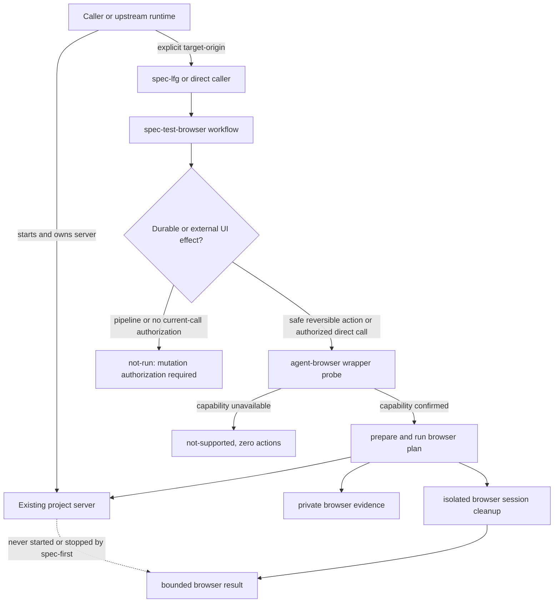

# Thin spec-test-browser to a caller-owned server boundary - Plan

## Goal Capsule

| Dimension | Decision |
| --- | --- |
| Objective | 将 `spec-test-browser` 从项目 server 启动与进程监管中退出，只保留 caller-authorized exact origin 上的 browser verification，降低授权、跨平台 cleanup、环境变量与 runtime projection 复杂度。 |
| Recommended approach | 退役 `dev-server-run-context.cjs`、runtime profile schema/example 及 managed-server tests；扩展现有 `agent-browser-run-context.cjs` 与 workflow prose，使 wrapper 确定性验证 resolved origin、test-plan hash 与 first-open ordering，workflow 负责 route/step 语义和破坏性 effect 授权。 |
| Authority hierarchy | `docs/10-prompt/结构化项目角色契约.md` 的 durable boundaries > 当前用户对 caller-owned server 与独立 mutation authorization 的 scope 决定 > current project-owned source/contracts/tests > 历史 plans、CodeGraph 与过往 review 的 advisory evidence。 |
| Architecture posture | `extend + retire`：扩展既有 browser wrapper 的 owner 边界，退役未形成稳定 consumer/field outcome 的 server coordinator、runtime profile 和 process-supervisor contract；不新建替代 coordinator。 |
| Decision focus | server 由谁启动和关闭；target origin 的 convention-level invocation extraction 与 script-level scalar validation 如何分层；页面上下文何时建立；破坏性 UI effect 如何获得独立授权；删除 managed-server contract 后下游 consumer 如何同步收口。 |
| Verification focus | 任何模式都不执行项目 server command；resolved origin 非法时在 action 前 fail closed；page-context action 前必须成功 `open`；pipeline 不执行需要独立 mutation authorization 的 UI flow；capability 不足时 action process count 为 0；existing server 不被关闭。 |
| Largest risk or boundary | 取消自动启动会降低 applicable browser flow 的 hands-off 完整度，但当前 server autonomy 增加约 1,800 行 source/tests、Windows cleanup 缺口和高风险 command/env surface，且没有 confirmed field outcome 支撑其维护成本。 |
| Execution profile / tail ownership | 本文仅规划 source 变更；`spec-work` 按 U1-U4 实施和验证，caller/project runtime owner 管理 server，`spec-lfg` 只持有 browser applicability 与 outward lifecycle/landing gates。 |
| Stop conditions | 实施发现已有 released consumer 依赖 runtime profile/server result schema；删除 coordinator 需要手改 generated runtime mirror；目标要求恢复任意 project command execution；或必须证明 existing origin 对应当前 branch 才能满足产品成功标准。 |

---

## Product Contract

### Summary

`spec-test-browser` 的核心价值是对 caller 明确授权的 exact origin 执行有界 browser verification，而不是启动项目 server。
当前工作树新增了 runtime profile、server command authorization、spawn/readiness、process-group cleanup、worktree drift 和聚合 result contract，使一个 browser Skill 承担了跨项目、跨宿主的 process supervisor 职责。
本计划删除这条 server autonomy 路线：用户、上游运行环境或项目原生开发工具负责 server 生命周期；`spec-test-browser` 只消费已存在的 origin。缺 origin 记录为 `not_run`，capability 不可用记录为 `not_supported`，已提供 origin 但首个 `open` 失败则保留真实 browser action failure。

### Problem Frame

当前 managed-server 机制试图用 local profile 与 `--server-command-approved` 同时解决便利、授权和 cleanup，但这些机制不能证明批准者语义权威、command 的隐藏副作用、ambient credential 使用、server 与当前 branch 的一致性或跨平台 process-tree 回收。
继续强化 profile hash、approval receipt、PID identity 或 cleanup protocol 会把不确定性转移成更重的 ceremony，而不会提升 browser field evidence。

二八判断是：大多数 browser verification 价值来自 exact-origin gate、action allowlist、private evidence 和 isolated browser cleanup；自动启动 server 只提供一项便利，却制造大部分新增风险和维护面。

### Supersession Boundary

- 本计划完整替代 `docs/plans/2026-07-18-001-feat-bounded-browser-runtime-autonomy-plan.md`；旧方案标记为 `superseded`，不再作为实施入口。
- 本计划只修订已完成 `docs/plans/2026-07-16-002-refactor-agent-skills-capability-integration-plan.md` 的 browser 子合同：R12、AE7、KTD18、U8 与历史 task T014 中的 interactive server-start 分支被替代；internal delivery、wrapper safety floor、exact-origin capability gate 和 pipeline no-silent-start 结果继续有效。
- `docs/tasks/2026-07-17-001-refactor-agent-skills-capability-integration-tasks.md` 保留为历史拆分，不得与本计划合并执行；本次实施只消费当前方案的 R/U/Verification/DoD。

### Actors

- A1. Caller / pipeline user：显式提供 exact `target-origin`，并负责确保目标 server 已由其信任的项目流程启动。
- A2. Project runtime owner：在 `spec-test-browser` 之外启动、监控和关闭 server；可以是用户、开发环境、预览环境或上游 host primitive。
- A3. `spec-test-browser` workflow：持有 changed-file 到 route 的语义映射、browser applicability、test-plan 选择、结果解释和 claim ceiling。
- A4. `agent-browser-run-context.cjs`：唯一 browser subprocess owner，持有 capability probe、test-plan validation、private context、argv/action allowlist、raw output 与 isolated-session cleanup。
- A5. `spec-lfg`：持有 pipeline 顺序、target-origin 转发、browser applicable gate 和 outward shipping gate，但不成为项目 server executor。
- A6. Runtime consumers：Claude、Codex、Cursor、Kiro、Qoder 只消费 canonical `skills/spec-test-browser/` source 的必要投射。

### Requirements

**Authority and target origin**

- R1. Browser applicable 时必须有一个 caller/upstream 显式提供的 exact `target-origin:<origin>`；不得从 local runtime profile、redirect、page output、ambient listener、free-port scan、framework default 或 `--port` 推断。
- R2. Resolved origin 必须是 credential-free HTTP(S) loopback root origin，不含 path、query 或 fragment；wrapper 在任何 action 前确定性拒绝空值或非法 scalar。Caller 对 whitespace-delimited `target-origin:*` token 做全量 extraction，重复 token 返回 `target-origin-invalid`；当前宿主没有把原始 Skill argument payload 交给 script parser 的 primitive，因此重复-token gate 是 loud convention，测试只能证明 source contract，不得声称 script-enforced。
- R3. `spec-lfg` 的 pipeline/landing 授权不包含项目 server command；缺 origin 时返回 `target-origin-missing`，不得读取 package scripts 或尝试自动启动。

**Server ownership and browser execution**

- R4. `spec-test-browser`、`spec-lfg` 及其 scripts 不得 spawn、持有、探测 PID、停止或清理项目 server，不得消费 server command/cwd/env/readiness contract。
- R5. Caller 负责在 workflow 外启动和关闭 server；browser run 结束后，existing server 必须保持运行，wrapper 不发出任何 server signal。
- R6. 不新增独立 reachability coordinator 或 HTTP readiness lifecycle。Validated test plan 必须包含 `open`，且任何 snapshot/get/console/network/a11y/screenshot/interaction action 前必须先成功执行目标 origin 的 `open`；连接失败按该 action 的真实结果记录，不用额外 preflight 冒充 field proof。
- R7. `agent-browser-run-context.cjs` 继续是唯一 browser subprocess owner；除 `agent-browser` 可执行文件及其 Windows native binary resolution 外，不得构造或执行项目命令。
- R8. `probe` 未确认 required flags 或 request-time exact-origin capability 时，navigation/interaction process count 必须为 0，并返回 `not_supported`；不得为准备未来 browser run 而先启动 server。
- R9. Browser prepare/run/cleanup 继续保留 test-plan hash、owner-private run root、default-deny action policy、synthetic values、ambient browser config 清除、private raw output 和 isolated session/namespace cleanup。

**Consumers, projection, and claims**

- R10. 删除 `browser_runtime_profile_path`、runtime profile schema/example、server aggregate result、server cleanup、worktree drift 和 `--server-command-approved` consumer contract，不提供兼容 shim 或新名称替代。
- R11. `spec-lfg` 只消费 origin provenance、wrapper probe、route/step status、`action_process_calls`、browser cleanup、private evidence refs 和 limitations；不再要求 server status/cleanup/worktree comparison。
- R12. 五宿主 projection 继续投射 internal-only `spec-test-browser` 的 `SKILL.md`、pipeline reference 和 `agent-browser-run-context.cjs`，不再投射 server coordinator/profile assets，仍排除 `evals/**`。
- R13. Browser claim 最高只能表述为“在 caller-authorized exact origin 上观察到这些 route/step 结果”；没有独立 provenance 时不得声称 server 对应当前 branch、由 spec-first 安全启动或被 spec-first 完整清理。
- R14. Applicable browser result 的 failed/not_run/not_supported 仍按 `spec-lfg` 当前 shipping policy 阻断对应 completion/landing claim；本计划不通过把失败改为 `not_applicable` 来恢复自动化。

**Interaction mutation authority**

- R15. Caller-provided origin 只授权预期无持久/外部 effect 的 navigation、observation 与可逆 synthetic interaction，不授权删除、发布、发送、购买、权限变更或其他持久/外部副作用。授权按 expected effect 而非 action 名称分类；若 `open`、`press Enter` 或其他表面允许的 action 会产生这类 effect，仍必须进入本 gate。`mode:pipeline` 返回 `not_run / browser-mutation-authorization-required` 且不写入该 step；direct interactive mode 只有向当前用户展示具体 origin/flow/effect 并获得本次明确授权后才能继续。Effect 分类由 workflow/LLM 语义判断；当前宿主没有可确定性解析业务 effect 与当轮授权的 primitive，因此这是 workflow-level loud convention，source/eval tests 不得声称它是 bypass-resistant script gate。Wrapper 只执行已通过该 gate 的 allowlisted plan；直接调用 internal wrapper 不构成 mutation 授权。

### Key Flows

- F1. Existing server success
  - **Trigger:** Caller 提供合法 origin，browser flow applicable，agent-browser capability 可用。
  - **Steps:** `spec-lfg` 转发 origin；`spec-test-browser` 构造最小 routes/test plan；browser wrapper prepare/run/cleanup。
  - **Outcome:** Route/step 结果和 browser cleanup 被记录；server 保持运行；project server process calls 为 0。
  - **Covers:** R1-R9、R11、R13、R15。

- F2. Missing origin
  - **Trigger:** Browser flow applicable，但 caller 没有提供 exact origin。
  - **Steps:** 在 browser wrapper probe/action 和任何项目命令前停止。
  - **Outcome:** `not_run / target-origin-missing`；action process count 与 project server process count 均为 0。
  - **Covers:** R1、R3、R4、R14。

- F3. Capability unavailable
  - **Trigger:** Origin 合法，但本地 `agent-browser` 缺 required flag 或 exact-origin capability。
  - **Steps:** Wrapper probe fail closed；不执行 navigation/interaction。
  - **Outcome:** `not_supported` 和具体 reason code；server 不受影响。
  - **Covers:** R7-R9、R13-R14。

- F4. Server/browser action failure
  - **Trigger:** Capability gate 通过，但第一个 `open` 或后续 action 失败。
  - **Steps:** 保留 private raw evidence；执行 isolated browser cleanup；不尝试启动、重启或停止 server。
  - **Outcome:** 返回真实 action/cleanup blocker；不从页面或错误文本生成项目命令。
  - **Covers:** R4-R9、R13-R15。

- F5. Non-browser change
  - **Trigger:** `spec-lfg` 基于 settled plan 与 changed flow 判断 browser not applicable。
  - **Steps:** 不要求 origin、不调用 browser Skill。
  - **Outcome:** 记录具体 `not_applicable` reason，继续既有 shipping tail。
  - **Covers:** R11、R14。

- F6. Destructive interaction required
  - **Trigger:** Applicable browser verification requires a durable or external UI effect.
  - **Steps:** Workflow identifies the effect before writing the test plan, regardless of whether it is reached through `open`、locator interaction 或 keyboard action；pipeline stops，direct interactive mode presents the named origin/flow/effect for current-call authorization.
  - **Outcome:** Missing authorization returns `not_run / browser-mutation-authorization-required` with zero destructive action calls；origin alone never upgrades the permission.
  - **Covers:** R14-R15。

### Acceptance Examples

- AE1. Caller 提供合法 loopback origin，目标 server 已运行；wrapper 执行 browser actions 并只关闭自己的 session，server 在 run 后仍可用。
- AE2. Caller 未提供 origin；pipeline 返回 `target-origin-missing`，不读取 `.spec-first/config.local.yaml` 的 browser runtime profile，不执行 package script。
- AE3. Resolved origin 非 loopback、包含 path/query/fragment/credential 或为空时，wrapper 在 action 前返回 `target-origin-invalid`；caller 发现重复 modifier 时按 loud convention 返回同一 reason，并在 Coverage 说明该 gate 未由 script 强制。
- AE4. `agent-browser --help` 没有 exact-origin capability；`open|click|fill|type|press|select` action process count 全部为 0，server 不被启动。
- AE5. Exact-origin capability 可用但目标 listener 不可用；第一个 `open` 返回 browser action failure，private diagnostic 可回源，workflow 不尝试 `npm run dev` 或替代端口。
- AE6. Browser actions 通过但 browser session cleanup 失败；最终结果保持 blocked，existing server 不被 signal，passed routes 不能覆盖 cleanup failure。
- AE7. 五宿主 init projection 包含 browser wrapper 与 pipeline reference，不包含 runtime profile schema/example、dev-server coordinator 或 `evals/**`。
- AE8. `spec-lfg` 收到 applicable UI change 和合法 origin；它只转发 origin并消费 browser result，不解析 server command/env，不出现 server cleanup/worktree drift gate。
- AE9. Applicable flow 需要打开会触发持久状态变化的 route、点击“删除/发布”、按 Enter 提交或产生其他持久/外部 effect；pipeline 返回 `browser-mutation-authorization-required` 且不生成该 step，direct interactive mode 只有在展示具体 origin/flow/effect 并获当前用户授权后才执行。

### Success Criteria

- `spec-test-browser` 和 `spec-lfg` 的 current source 中没有项目 server command execution、managed process identity、server cleanup 或 runtime profile authority。
- Server-autonomy source/test/schema surface 被删除，五宿主 projection 与 package content 不再携带这些资产。
- Browser wrapper 的现有 safety floor 与 private evidence contract 保持非回归。
- Applicable browser flow 缺 origin、capability 或成功 action evidence 时诚实阻断，不通过猜测或自动启动扩大权限。
- Browser plan 必须先建立目标 origin 页面上下文；origin authorization 不得被提升为破坏性 UI mutation authorization。
- 计划和实现明确接受 hands-off 降级，并给出可验证的重新评估条件。

### Scope Boundaries

**In scope**

- 退役 managed/local server lifecycle、runtime profile 和相关 consumer/test/projection contract。
- 收缩 `spec-test-browser`、`spec-lfg` 和五宿主投射到 caller-owned server 边界。
- 保留并验证现有 browser wrapper 的 capability、action、private evidence 和 cleanup 能力。
- 将 exact-origin navigation/observation 授权与持久/外部 UI effect 授权分离；pipeline 缺少后者时必须阻断，direct interactive 授权仅对当前展示的 flow/effect 和本次调用有效。
- 更新 source docs、eval fixtures、tests、test-suite wiring 和 Changelog。

**Out of scope**

- 新建 server supervisor、framework adapter、package-script registry、port discovery 或 preview deployment service。
- 证明 existing server 对应当前 branch/build；这需要项目或宿主提供独立 provenance。
- 修改 `agent-browser` provider 或为其补 request-time exact-origin capability。
- 手改 `.claude/`、`.codex/`、`.agents/skills/`、`.cursor/`、`.kiro/` 或 `.qoder/` generated runtime mirrors。
- 修复 `docs/plans/2026-07-16-002-refactor-agent-skills-capability-integration-plan.md` 的其他 P1、task review attribution 或 shipping loop。

### Deferred to Follow-Up Work

- 只有当真实 field evidence 显示“手工/上游启动 server”是 browser adoption 的主要阻塞，且宿主提供跨平台、可验证、可取消的 project-runtime primitive 时，才重新评估受控 server autonomy。
- 只有存在真实 remote preview consumer 和独立网络授权设计时，才评估非 loopback target origin。

---

## Planning Contract

### Key Technical Decisions

- KTD1. Retire rather than harden the server coordinator. 当前 coordinator 把授权、project command、process lifecycle、worktree mutation 和 browser evidence 合并成一个新 owner；继续补 approval receipt、redaction 或 cleanup protocol 只会扩大错误边界。删除比加固更符合 Light contract。
- KTD2. Split invocation convention from executable origin validation. `target-origin:<origin>` 是本次 navigation/observation/reversible synthetic interaction 的 caller-owned input；caller 负责识别独立 modifier，wrapper 负责确定性验证 resolved scalar。宿主未暴露 raw argument parser primitive 时，重复-token detection 只能是 loud convention，不能用字符串 contract test冒充硬 gate。
- KTD3. Require first-open evidence before page-context actions. 不增加第二次 HTTP readiness/preflight；wrapper 在 prepare 时拒绝无 `open` 或 page-context action 位于首次 `open` 前的 test plan，在 run 时若首个 `open` 失败则立即停止后续 page action。第一个成功 `open` 是最小 availability evidence。
- KTD4. Keep one subprocess owner. `agent-browser-run-context.cjs` 继续只构造 `agent-browser` argv；workflow 与 LFG 不直接执行 browser CLI，也不新增 project command runner。
- KTD5. Remove worktree drift from browser runtime. Worktree ownership与 dirty overlap 由 `spec-work`/caller 持有；generic browser Skill 无法把 existing server 的文件变化可靠归因给当前 browser run。
- KTD6. Hard-remove unshipped contracts. 当前 runtime profile/coordinator/assets 位于未提交工作树且没有 confirmed release/field consumer 证据；不保留 compatibility shim。实施前必须重新核对 git/history/package evidence，若已形成外部 consumer则停止并重新规划迁移。
- KTD7. Preserve honest degradation. 取消 auto-start 后 pipeline 可能更常得到 `target-origin-missing` 或 browser action failure；这是权限和证据边界，不得通过放宽 applicability 或 completion gate 隐藏。
- KTD8. Keep destructive-effect judgment semantic and authorization separate. Workflow 判断 planned flow 是否产生持久/外部 effect，不使用 action 名称或按钮文案作为权限代理；pipeline 默认不执行，interactive 只消费当前用户对具体 origin/flow/effect 的本次授权。Wrapper 继续只做 action shape/order/argv 的 deterministic floor，不硬编码按钮文案或业务危险词表。

### High-Level Technical Design

以下是方向性职责图，不是实现代码：

### Interface Contracts

| Interface / mode | Consumers | Canonical artifact | Contract summary | Compatibility | Verification |
| --- | --- | --- | --- | --- | --- |
| `spec-test-browser` invocation / evolution | `spec-lfg`, internal callers | `skills/spec-test-browser/SKILL.md` | Scope selector plus optional `mode:pipeline` and one explicit `target-origin:<origin>`；modifier extraction is convention-level，resolved scalar validation is wrapper-enforced；no `--port` or runtime profile fallback | Breaking only against unshipped worktree contract; hard removal after current-source/history recheck | `tests/unit/spec-test-browser-contracts.test.js`, `tests/unit/pipeline-mode-contracts.test.js` |
| Browser interaction authorization / evolution | `spec-lfg`, direct interactive `spec-test-browser` | `skills/spec-test-browser/SKILL.md`, `skills/spec-lfg/SKILL.md` | Origin authorizes only flows expected to avoid durable/external effects；effect classification is workflow/LLM-owned and action-name-independent，pipeline fails closed and direct authorization is named, current-call-only | Workflow-level loud convention, not a bypass-resistant script gate；wrapper remains a deterministic action/order/argv floor | `skills/spec-test-browser/evals/capability-cases.json`, `tests/unit/spec-test-browser-contracts.test.js`, `tests/unit/spec-lfg-contracts.test.js` |
| Browser wrapper CLI / behavior-tightening | `spec-test-browser` | `skills/spec-test-browser/scripts/agent-browser-run-context.cjs` | `probe`, `prepare`, `run`, `cleanup`; only browser subprocess、private evidence、isolated cleanup、resolved-origin validation, static first-open ordering and runtime stop-on-failed-open | Preserve manifest/private-evidence/reason-code behavior while rejecting no-open/page-context-before-open plans and preventing later page actions after failed `open` | `tests/unit/spec-test-browser-contracts.test.js` |
| `spec-lfg` browser result consumption / evolution | `spec-lfg` shipping gate | `skills/spec-lfg/SKILL.md` | Consume origin, capability, route/step, action count, browser cleanup and limitations; remove server/profile/worktree fields | Remove only unshipped server-autonomy expectations | `tests/unit/spec-lfg-contracts.test.js` |
| Five-host internal projection / evolution | Claude, Codex, Cursor, Kiro, Qoder adapters | `src/cli/plugin-governance.js` plus recursive asset sync | Continue internal Skill delivery, but only project assets with runtime consumers survive | Generated mirrors are regenerated by existing init path, never patched directly | `tests/unit/plugin-modules.test.js`, `tests/integration/init-five-host-lifecycle.integration.test.js` |

### System-Wide Impact

- **Skill source:** `spec-test-browser` becomes browser-only; server ownership prose and runtime profile references are removed.
- **Pipeline caller:** `spec-lfg` requires explicit origin for applicable browser work and no longer receives local server autonomy.
- **Scripts:** one existing browser wrapper remains; the new server coordinator is deleted rather than replaced.
- **Contracts:** runtime profile schema/example and aggregate server result disappear; no new schema is introduced.
- **Tests:** managed-server unit/integration/profile tests are removed; existing-server non-ownership, zero project-command execution and consumer/projection assertions move into surviving suites.
- **Projection/package:** recursive Skill delivery remains enabled, but deleted assets disappear from all five hosts and package dry-run output.
- **Docs/Changelog:** current behavior and honest hands-off limitation are documented without claiming host/browser field outcome.
- **Data/operations:** no persistent data, migration, production rollout or telemetry change；local browser QA may require a separately running server.

### Sequencing

1. Re-read current source、task/plan relationships and git status；mark `2026-07-18-001` superseded，confirm the narrow 07-16 U8/T014 supersession notes，and isolate this plan's write set from unrelated dirty files.
2. Rewrite ownership/invocation contracts in `spec-test-browser` and `spec-lfg`, establishing explicit-origin enforcement levels、first-open ordering、destructive-effect authorization and zero-project-command invariants before deleting code.
3. Remove server coordinator/profile assets and their dedicated tests; update test-suite wiring so deleted paths are not referenced.
4. Update surviving browser, LFG, projection and five-host lifecycle tests to assert the reduced contract.
5. Update docs/Changelog, run focused and system-wide verification, then perform fresh-source semantic review with honest `not_run` handling when host dispatch is unavailable.

### Assumptions

- Current managed-server/profile files and tests have no released consumer; git/history/package evidence must be rechecked immediately before deletion.
- Caller-provided exact loopback origin is sufficient only for navigation、observation 与可逆 synthetic interaction；它不是破坏性 UI effect、server identity 或 branch-fidelity proof。
- Existing `agent-browser-run-context.cjs` remains the correct owner for browser actions and does not require a replacement abstraction.
- Hands-off server startup is intentionally deferred until field evidence and a portable host primitive justify it.

### Evidence & Limitations

- Current source shows `skills/spec-test-browser/scripts/dev-server-run-context.cjs` at 832 lines, with spawn/readiness/process-group cleanup/worktree snapshot responsibilities; its dedicated unit/integration/profile tests and schema/example add roughly another 1,000 lines.
- `skills/spec-test-browser/SKILL.md` and `skills/spec-test-browser/references/pipeline-orchestration.md` currently authorize managed server startup, while `skills/spec-test-browser/scripts/agent-browser-run-context.cjs` already independently owns browser capability, argv, private output and session cleanup.
- `docs/plans/2026-07-18-001-feat-bounded-browser-runtime-autonomy-plan.md` 记录已否决的 managed-server 路线，已标记 `superseded` 并仅作历史证据保留；它不再是可执行计划，也不得与本计划组合执行。
- Current tests model `agent-browser 0.31.1` without request-time exact-origin support, so source/projection tests cannot be elevated to real browser field outcome.
- The completed 07-16 integration plan and its historical T014 required an interactive server-start branch；this plan supersedes only that browser sub-contract and preserves the rest of the completed integration outcome.
- CodeGraph/code-review consumer expansion 只用于advisory navigation；active consumer retirement 和上述 load-bearing browser 边界均回源至 current source、tests 与项目角色契约，并显式落在 U1-U4，未委托给未来 reviewer。

---

## Implementation Units

### U1. Replace managed-server authority with an explicit-origin browser-only contract

- **Goal:** Make `spec-test-browser` and pipeline prose state one ownership model before implementation deletion: caller owns server; spec-first owns only browser execution and browser cleanup.
- **Requirements:** R1-R9、R13-R15
- **Dependencies:** None
- **Files:**
  - Modify: `skills/spec-test-browser/SKILL.md`
  - Modify: `skills/spec-test-browser/references/pipeline-orchestration.md`
  - Modify: `skills/spec-test-browser/scripts/agent-browser-run-context.cjs`
  - Modify: `skills/spec-test-browser/evals/capability-cases.json`
  - Modify: `tests/unit/spec-test-browser-contracts.test.js`
  - Modify: `tests/unit/pipeline-mode-contracts.test.js`
- **Approach:** Remove `--port` inference, runtime profile resolution, server command approval, managed/existing split, server cleanup and worktree drift language. Distinguish caller-owned modifier extraction from wrapper-enforced scalar validation；prepare 要求至少一个 `open` 且任何 page-context action 不得位于首个 `open` 之前，run 在该 `open` 失败时短路后续 action。Workflow excludes destructive-effect steps in pipeline mode and requires named current-call authorization in direct interactive mode.
- **Patterns to follow:** `agent-browser-run-context.cjs` current single-owner command construction；在删除 coordinator 前将 `dev-server-run-context.cjs` 的 credential-free root-origin 与 `localhost` / `127.0.0.1` / `::1` loopback host 验证语义收口到 wrapper，不为单一 consumer 保留新的 shared validator。
- **Execution note:** Update failing source-contract expectations first so the old managed-server phrases and assets are explicitly rejected.
- **Test scenarios:**
  - Happy path: explicit legal loopback origin reaches the browser wrapper with no server/profile field required.
  - Missing input: pipeline applicable flow without origin returns `target-origin-missing` before browser or project command execution.
  - Invalid scalar: empty/non-loopback/path/query/credential origin returns `target-origin-invalid` from wrapper validation before action.
  - Invocation convention: duplicate standalone modifiers return `target-origin-invalid` in workflow prose/tests，Coverage 明确该 gate 未由 script 强制。
  - Action ordering: no-open、snapshot-before-open 与 click-before-open plans are rejected with zero action subprocess calls.
  - Open failure short-circuit: a valid plan whose first `open` action fails records that real failure and executes no later snapshot/get/interaction action.
  - Mutation authority: pipeline flow whose `open`、locator interaction 或 keyboard action会产生 delete/publish/send/purchase/permission 或其他 durable/external effect，返回 `browser-mutation-authorization-required` 并不写入危险 step；source/eval 明确这是 workflow convention，不声称 wrapper 可识别业务 effect。
  - Negative owner: source contains no runtime profile, `--server-command-approved`, managed cleanup or project server command guidance.
- **Verification:** Focused browser/pipeline contract tests pass and assert the removed owner vocabulary is absent.

### U2. Retire the server coordinator and runtime profile contracts

- **Goal:** Remove the new process-supervisor surface without creating a replacement coordinator or compatibility layer.
- **Requirements:** R4-R10、R12-R13
- **Dependencies:** U1
- **Files:**
  - Delete: `skills/spec-test-browser/scripts/dev-server-run-context.cjs`
  - Delete: `skills/spec-test-browser/references/browser-runtime-profile.schema.json`
  - Delete: `skills/spec-test-browser/references/browser-runtime-profile.example.json`
  - Delete: `tests/unit/spec-test-browser-dev-server-context.test.js`
  - Delete: `tests/unit/spec-test-browser-runtime-profile.test.js`
  - Delete: `tests/integration/spec-test-browser-runtime.integration.test.js`
  - Modify: `scripts/run-test-suite.cjs`
  - Modify: `tests/unit/spec-test-browser-contracts.test.js`
  - Modify: `skills/spec-runtime-setup/SKILL.md`
  - Modify: `skills/spec-runtime-setup/references/config-template.yaml`
  - Modify: `tests/unit/mcp-setup-config-consumers.test.js`
- **Approach:** Hard-remove unshipped coordinator/profile/result surfaces and delete test-runner references. Do not move spawn/readiness/process cleanup/worktree snapshot logic into `spec-lfg` or the browser wrapper.
- **Patterns to follow:** Existing hard-retirement practice: remove source, all direct consumers, package/projection assertions and test-runner entries in the same unit.
- **Execution note:** Characterize the surviving browser wrapper exports before deletion; after deletion, verify that no source consumer requires the retired module.
- **Test scenarios:**
  - Consumer search: no active runtime consumer source or executable test imports `dev-server-run-context.cjs` or requires `spec-test-browser-runtime-profile/v1`; historical plans、research refs 与 Changelog 记录不计作 active consumer。
  - Runner integrity: unit/integration test suites reference only existing test paths.
  - Negative owner: browser wrapper never receives server command, cwd, env, readiness or process handle inputs.
  - Failure boundary: absent server is represented by browser action failure/not-run evidence, not a project command fallback.
  - Setup cleanup: runtime setup source、config template 与 focused consumer test 不再暴露 `browser_runtime_profile_path`。
- **Verification:** Test-runner path checks, source consumer checks and focused browser tests pass with the retired files absent.

### U3. Simplify spec-lfg browser gating and result consumption

- **Goal:** Keep `spec-lfg` autonomous over its disclosed shipping tail without making it a project server executor.
- **Requirements:** R1-R5、R10-R11、R13-R15
- **Dependencies:** U1
- **Files:**
  - Modify: `skills/spec-lfg/SKILL.md`
  - Modify: `tests/unit/spec-lfg-contracts.test.js`
- **Approach:** Require explicit `target-origin` for applicable browser flows; remove runtime profile fallback, server-only semantic approval, server lifecycle fields, server cleanup and worktree drift gates. Preserve browser applicability、wrapper result gate and outward-mutation blocking；when the required flow has a durable/external UI effect，pipeline records `browser-mutation-authorization-required` instead of treating origin or LFG selection as mutation authority.
- **Patterns to follow:** Existing `forwarded_arguments` modifier preservation and browser applicability separation in `spec-lfg`.
- **Execution note:** Start from contract tests that reject any LFG-owned project command or server lifecycle vocabulary.
- **Test scenarios:**
  - Applicable + origin: LFG forwards the exact token and consumes browser-only result fields.
  - Applicable + missing origin: `target-origin-missing` blocks the browser/landing path without profile fallback.
  - Not applicable: non-UI change records a reason and does not require origin.
  - Failure: passed routes plus failed browser cleanup still block lifecycle/landing.
  - Destructive effect: applicable flow requires a durable/external UI mutation，LFG preserves the browser blocker and does not continue to lifecycle/landing.
  - Negative owner: LFG contains no package-script parsing, server command approval, process cleanup or worktree drift handling.
- **Verification:** Focused LFG contract tests pass and no removed result field remains required.

### U4. Reconcile five-host projection, package expectations and documentation

- **Goal:** Make every downstream consumer reflect the reduced runtime asset set and user-visible limitation.
- **Requirements:** R10-R12、R14-R15
- **Dependencies:** U2、U3
- **Files:**
  - Modify: `tests/unit/plugin-modules.test.js`
  - Modify: `tests/integration/init-five-host-lifecycle.integration.test.js`
  - Modify: `docs/14-agent-skills/README.md`
  - Modify: `README.md`
  - Modify: `README.zh-CN.md`
  - Modify: `docs/05-用户手册/24-公开入口与Skill目录.md`
  - Modify: `docs/13-skills/spec-first-workflow-map.md`
  - Modify: `CHANGELOG.md`
- **Approach:** Keep `spec-test-browser` in `DELIVERED_INTERNAL_SKILLS`; change recursive asset expectations to `SKILL.md`, pipeline reference and browser wrapper only. Document that server lifecycle is caller-owned and browser evidence does not prove branch/server identity.
- **Patterns to follow:** Existing internal-only recursive projection and `evals/**` exclusion contracts.
- **Execution note:** Treat generated host mirrors as verification outputs only; do not hand-edit them.
- **Test scenarios:**
  - Five-host projection includes every surviving runtime-required asset.
  - Deleted server/profile assets are absent from all planned operations and initialized hosts.
  - `evals/**` remains excluded from runtime projection.
  - Public Skill count and user-invocable catalog remain unchanged.
  - README、用户手册与 workflow map 只描述 caller-owned server，不再把 runtime profile、managed cleanup 或 worktree drift 表述为当前能力，并明确 origin 不授权持久/外部 UI effect。
  - Changelog names the removed autonomy and retained browser safety boundary without claiming field verification.
- **Verification:** Plugin, doctor, five-host lifecycle, skill governance and package-content checks pass.

---

## Alternatives Considered

### A. Harden the existing managed-server coordinator

Rejected. Approval receipts, profile hashes, process identity, redaction and stronger cleanup still cannot prove project command semantics, current branch identity or portable process-tree termination; complexity rises faster than trust.

### B. Move server spawn and cleanup into spec-lfg

Rejected. This only relocates the same generic process-supervisor responsibility into a higher-level workflow and duplicates server lifecycle policy outside the browser owner.

### C. Keep the runtime profile but remove automatic startup

Rejected for the current slice. A command/cwd/env/readiness schema with no executor is dead contract surface, while using it only for origin resolution turns a single scalar into an unnecessary versioned artifact.

### D. Add a lightweight readiness/preflight coordinator

Rejected. A separate HTTP check duplicates the first browser request, creates a time-of-check/time-of-use gap and still cannot prove server identity. The actual browser action is the evidence that matters.

### E. Preserve managed autonomy as an opt-in advanced mode

Deferred. There is no confirmed adoption or host primitive evidence to justify maintaining two server ownership models. Reconsider only under the explicit follow-up trigger in Scope Boundaries.

---

## Risks & Dependencies

| Risk | Likelihood | Impact | Mitigation |
| --- | --- | --- | --- |
| LFG UI runs block more often because no server is prestarted | High | Medium | Return precise missing-origin/action evidence; document caller-owned startup; do not misclassify applicable work as not applicable. |
| Caller points to a stale or wrong local server | Medium | High | Limit claims to the exact origin observation; do not claim branch fidelity without independent project provenance. |
| Origin is mistaken for destructive UI authorization | Medium | High | Limit ordinary runs to navigation/observation/reversible synthetic interaction；pipeline blocks durable/external effects，interactive mode requires named current-call authorization. |
| Managed-server assets acquire a consumer before implementation | Low | High | Recheck git history, package contents and source consumers before deletion; stop and replan compatibility if found. |
| Deletion leaves stale test/projection references | Medium | Medium | Remove direct imports, test-runner entries and five-host asset expectations in the same dependency wave. |
| Browser capability remains unavailable in current agent-browser version | High | Medium | Preserve `not_supported` with zero action calls; source/projection success does not become field outcome. |
| Unrelated dirty files overlap implementation paths | High | High | `spec-work` must lock the current dirty set and stop on overlap; this plan does not authorize overwriting user-owned changes. |
| Historical plans/tasks describe superseded server behavior | High | Medium | Mark `2026-07-18-001` superseded；add narrow supersession notes to completed 07-16 U8 and historical T014；execute only this explicit plan path. |

---

## Verification Contract

| Gate | Applies to | Verification | Required outcome |
| --- | --- | --- | --- |
| Browser source contract | U1-U2 | Focused `spec-test-browser` unit suite | Wrapper rejects invalid scalar origin、no-open and page-context-before-open plans；no managed server/profile/project-command owner；browser safety floor remains green. |
| LFG contract | U3 | Focused `spec-lfg` and pipeline contract suites | Missing origin blocks without profile fallback; result consumption is browser-only; `browser-mutation-authorization-required` blocks lifecycle/landing; outward gates remain intact. |
| Interaction mutation authority | U1、U3 | Skill/eval/contract positive-negative cases | Modeled pipeline durable/external effect returns `browser-mutation-authorization-required` with zero dangerous action calls；interactive execution requires named current-call authorization；evidence 只支持 workflow-level convention，不声称 script 可防绕过地识别业务 effect。 |
| Supersession traceability | U1-U4 | Frontmatter/plan/task source checks | `2026-07-18-001` is superseded；completed 07-16 browser subset and historical T014 point to this plan without invalidating unrelated completed units. |
| Consumer retirement | U2-U4 | Active source/test path and module consumer checks | Active runtime consumers、executable tests、projection plan 与 package inventory 不再依赖 coordinator/profile schema/version/server-approval flag；历史 plans/research/Changelog 可保留带 provenance 的引用。 |
| Five-host projection | U4 | Plugin module and init lifecycle suites | All hosts receive surviving assets only; deleted assets and evals are absent. |
| Test runner integrity | U2-U4 | Unit/integration suite discovery | No configured suite references deleted test files. |
| Syntax and governance | U1-U4 | `npm run typecheck` and `npm run lint:skill-entrypoints` | Source syntax and Skill governance pass. |
| System regression | U1-U4 | `npm run test:unit` and `npm run test:integration` | No unit/integration regression in current source tree. |
| Package content | U4 | `npm run build` | Published package includes the browser-only runtime surface and excludes retired assets. |
| Fresh-source semantic | U1、U3 | Current-disk positive/negative evaluation against owning Skill prose | Result is `passed`, `concerns` or honest `not_run`; only `passed` supports semantic-passed claim. |
| Field outcome | Optional | Real wrapper invocation against a caller-owned existing origin when exact-origin capability is available | `passed` only from actual route/step evidence; unavailable capability remains `not_supported` and does not block source-level implementation truth. |

Verification order: focused owner tests → consumer/projection tests → typecheck/skill lint → full unit/integration → package build → final review/fresh-source semantic evidence.

---

## Definition of Done

### Global

- R1-R15 and AE1-AE9 are satisfied by current source and verification evidence.
- `spec-test-browser` has one browser subprocess owner and zero project server process owner.
- Runtime profile、server coordinator、managed cleanup、server worktree drift 和 server approval contracts are absent from active runtime consumer source、executable tests、projection plan and package contents；历史 plans、research refs 与 Changelog 只作为非执行证据保留。
- `spec-lfg` preserves browser applicability and shipping gates while requiring explicit origin for applicable runs.
- Browser action/test-plan/private evidence/session cleanup contracts remain intact.
- Wrapper requires first-open evidence before page-context actions；pipeline never upgrades origin into destructive UI mutation authority.
- Five-host internal projection remains source-first and public Skill count is unchanged.
- No generated runtime mirror was hand-edited.
- Changelog accurately separates source-level verification, capability `not_supported` and real field outcome.
- The managed-autonomy plan is `superseded`；completed 07-16 U8/T014 carry a narrow supersession note，and no historical task pack is combined with this execution.

### Per Unit

- U1: Browser ownership and invocation prose/tests contain one explicit-origin model，one honest convention/enforcement split，first-open ordering and destructive-effect authorization boundaries.
- U2: Coordinator/profile source and all direct test-runner consumers are removed with no replacement process supervisor.
- U3: LFG forwards origin and consumes browser-only evidence without project command or server cleanup responsibility；`browser-mutation-authorization-required` 必须保留为 lifecycle/landing blocker。
- U4: Projection、docs、Changelog and package expectations match the surviving runtime asset set across all supported hosts.

---

## Sources / Research

- `docs/10-prompt/结构化项目角色契约.md`
- `docs/plans/2026-07-16-002-refactor-agent-skills-capability-integration-plan.md`
- `docs/tasks/2026-07-17-001-refactor-agent-skills-capability-integration-tasks.md`
- `docs/plans/2026-07-18-001-feat-bounded-browser-runtime-autonomy-plan.md`
- `skills/spec-test-browser/SKILL.md`
- `skills/spec-test-browser/references/pipeline-orchestration.md`
- `skills/spec-test-browser/scripts/agent-browser-run-context.cjs`
- `skills/spec-test-browser/scripts/dev-server-run-context.cjs`
- `skills/spec-test-browser/references/browser-runtime-profile.schema.json`
- `skills/spec-test-browser/references/browser-runtime-profile.example.json`
- `skills/spec-lfg/SKILL.md`
- `skills/spec-runtime-setup/SKILL.md`
- `skills/spec-runtime-setup/references/config-template.yaml`
- `README.md`
- `README.zh-CN.md`
- `docs/05-用户手册/24-公开入口与Skill目录.md`
- `docs/13-skills/spec-first-workflow-map.md`
- `tests/unit/spec-test-browser-contracts.test.js`
- `tests/unit/spec-test-browser-dev-server-context.test.js`
- `tests/unit/spec-test-browser-runtime-profile.test.js`
- `tests/integration/spec-test-browser-runtime.integration.test.js`
- `tests/unit/spec-lfg-contracts.test.js`
- `tests/unit/mcp-setup-config-consumers.test.js`
- `tests/unit/pipeline-mode-contracts.test.js`
- `tests/unit/plugin-modules.test.js`
- `tests/integration/init-five-host-lifecycle.integration.test.js`
