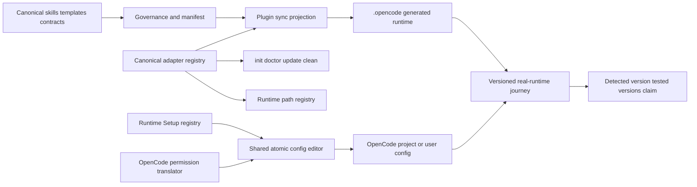
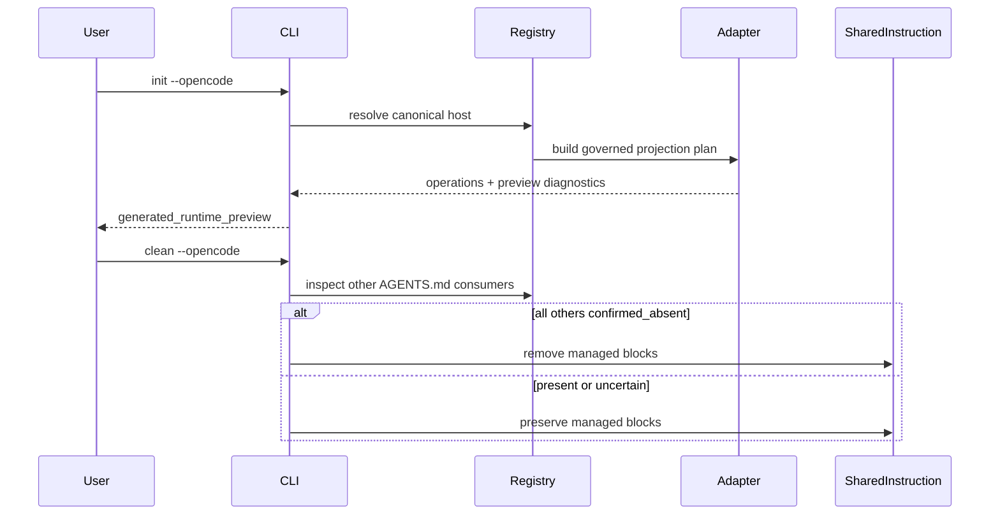
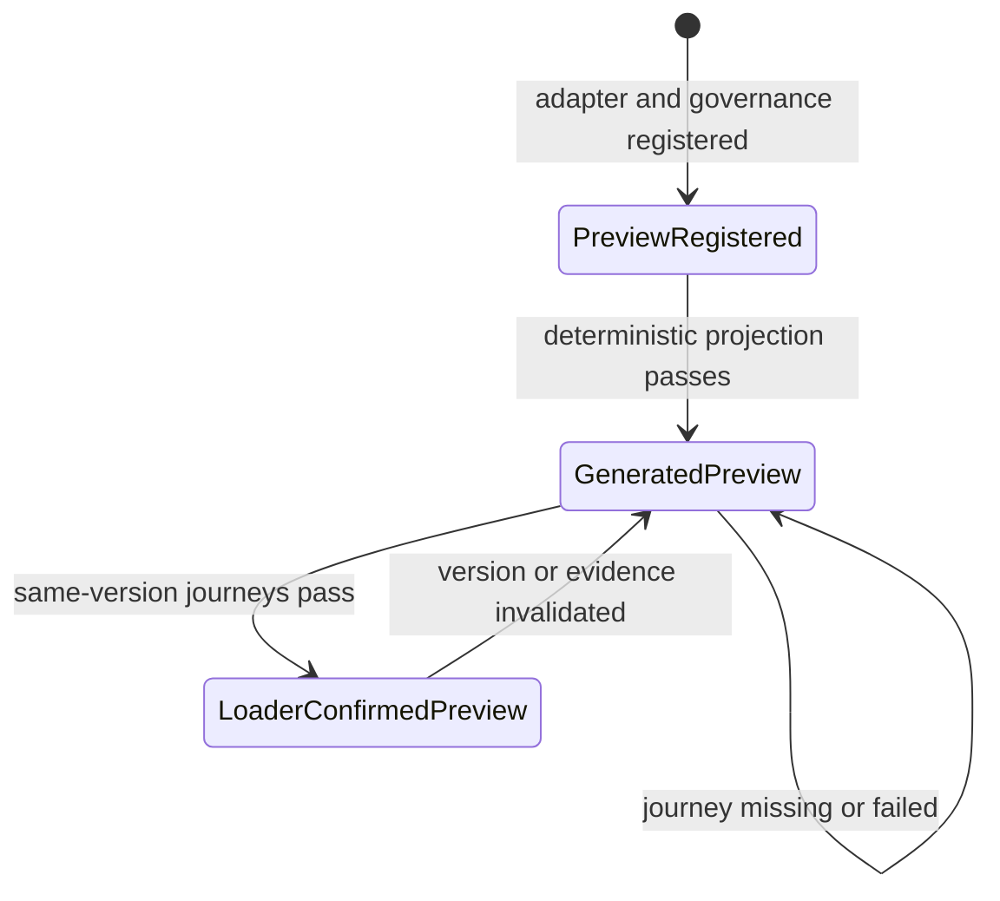
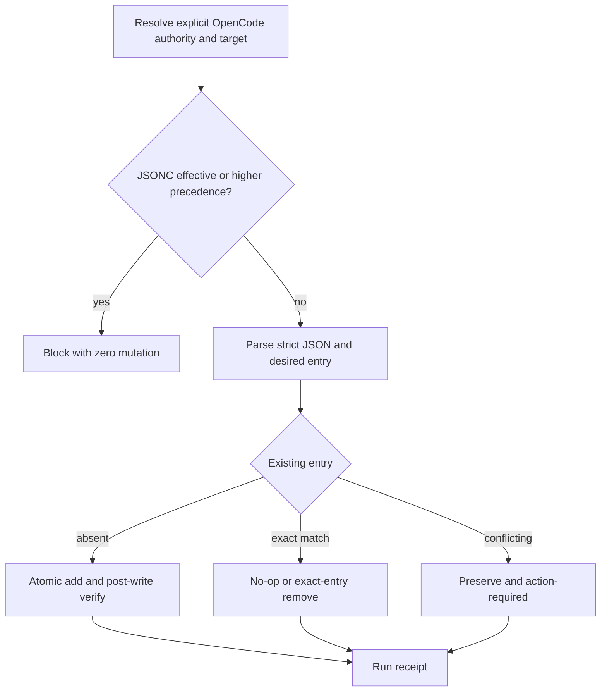

# OpenCode Host Support - Plan v4

## Goal Capsule

- **Objective:** 将 OpenCode 接入 spec-first，成为与 Claude Code、Codex、Cursor、Kiro、Qoder 同一注册表中的第 6 个 supported host，并以 opt-in preview 交付受治理的 init、doctor、update、clean、runtime projection 与 Runtime Setup 体验。
- **Recommended approach:** `extend + compose / thin-glue`。扩展现有 `PlatformAdapter`、统一宿主枚举、governance、projection 与 Runtime Setup；OpenCode-specific glue 只负责 OpenCode 路径、配置形状、permission 语义与 loader 诊断，复用现有原子配置 mutation、host authority、receipt、doctor CLI probe 和 host-neutral worker contract。
- **Authority:** Product Contract 拥有安装、生命周期、配置保护与 preview claim；当前 source/tests 约束实现；OpenCode 1.18.7 的本机存在只证明 CLI readiness，不证明 loader、command、skill、MCP 或 permission outcome。
- **Decision focus:** 单一 6-host 真相源；`init -y` 默认集合保持 Claude/Codex；preview support state 与 runtime evidence claim 分离；配置卸载只删除仍与 spec-first 期望值一致的 entry；不新增 worker dispatcher、持久 receipt ledger、整文件 ownership hash 或第二套宿主枚举。
- **Verification focus:** U0 共享 `AGENTS.md` ownership → U1 adapter/registry → U2 CLI lifecycle → U3 governance/projection → U4 MCP config shape → U7 permission policy → U5 docs/package → U6 OpenCode 1.18.7 real-runtime journey。
- **Largest risk / boundary:** OpenCode 的 loader、external skill collision、JSON/JSONC precedence 与 permission last-match 语义尚未在本规划流程中运行验证；若 1.18.7 的真实行为与计划假设冲突，U6 必须阻断晋升并将修正落回 source/contract，而不是修补 `.opencode/**` runtime。
- **Stop conditions:** 无法把 OpenCode 放入统一 `getSupportedPlatforms()` 而保持 opt-in 默认；共享 `AGENTS.md` clean ownership 仍是二态猜测；配置冲突仍可被 uninstall 静默删除；JSONC precedence 不明确时仍写 JSON；或缺 real-runtime evidence 时把 preview 宣称为 loader-confirmed。
- **Execution profile:** Deep。跨 adapter、CLI、governance、schema、host config、permissions、docs、package 与真实第三方 journey；涉及 durable interface evolution 和五宿主兼容面。
- **Tail ownership:** `spec-work` 负责实施、简化、review、验证与 closeout；本计划不授权代码 mutation、测试、runtime regeneration、commit 或 PR。

---

## Product Contract

### Summary

按现有多宿主架构新增 OpenCode。OpenCode 加入统一 `getSupportedPlatforms()`，所有以该枚举为权威的投射、治理和测试更新为 6 host；`init -y` 仍只默认选择 Claude Code 与 Codex。OpenCode 首版是 opt-in preview，缺 loader-confirmed evidence 时最多声明 `generated_runtime_preview`。

Host-neutral worker dispatch 已由 `docs/plans/2026-07-28-001-refactor-host-neutral-worker-dispatch-plan.md` 关闭 claim。OpenCode adapter 不维护 worker primitive、binding、selection 或 per-Skill mapping；OpenCode-specific worker journey 不属于本计划 DoD。

### Problem Frame

spec-first 当前以统一 adapter registry 支撑五个宿主，但 OpenCode 用户尚无受治理的安装、检查、升级、清理、配置保护和版本化验证路径。手工复制 `.opencode/**` 无法证明 source ownership、治理完整性、clean safety、配置冲突处理或 loader readiness。

旧 v3 还有四处会误导实施的冲突：

- 把 OpenCode 称为第 6 个 supported host，同时要求 `getSupportedPlatforms()` 永远保持 5 个，形成双真相源。
- R10/AE5/Interface Contract 要求 receipt ownership，KTD5 又改为整文件 hash，且现有 Runtime Setup 已拥有 entry-level 原子 mutation 与 run receipt。
- U6 要求 OpenCode worker journey，但 worker contract 已由另一个 completed plan 单一拥有。
- “当前机器无 OpenCode CLI”已过时；本机现在可解析 OpenCode 1.18.7，但本规划流程没有运行 loader/config journey。

### Product Contract Preservation

Product intent 未改变：仍是 opt-in preview 6th host、双入口、五宿主兼容、配置保护与证据晋升。经用户确认，Key Decision 从“双枚举”改为统一 6-host 枚举；R10/AE5 仅澄清为 entry-level ownership 与 conflict-safe uninstall；AE7 删除 worker journey 以消除与 host-neutral dispatch owner 的重复。

### Actors

- A1. **OpenCode user:** 显式选择 `--opencode`，获得可诊断、可清理、不会覆盖用户配置的 preview runtime。
- A2. **Project maintainer:** 维护 canonical source、adapter、registry、governance、tests、docs 与 versioned host evidence。
- A3. **OpenCode runtime 1.18.7+:** 发现 command/skills、解析 config/permissions 并执行 MCP；当前仅确认 1.18.7 CLI 在 PATH，不确认这些 outcome。
- A4. **Runtime Setup:** 在显式 host authority 下维护 OpenCode MCP 与 permission managed entries，并保留非目标配置。

### Requirements

**Host registration and lifecycle**

- R1. OpenCode 必须加入统一 adapter registry 与 `getSupportedPlatforms()`；所有 generic consumers 将其视为第 6 个 supported host。
- R2. `spec-first init --opencode`、`doctor --opencode`、`update`、`clean --opencode` 和 help surface 必须受支持。
- R3. OpenCode 必须保持 opt-in；无显式 host flag 的 `init -y` 默认集合继续为 Claude Code 与 Codex。
- R4. 单宿主 clean 不得删除仍被其他已安装或状态不确定宿主消费的共享 `AGENTS.md` managed blocks。
- R5. Auto-detection 只接受 adapter/registry 声明的 managed runtime/state；用户自建 `.opencode` 内容不得被当作 spec-first ownership。

**Workflow and projection**

- R6. OpenCode 提供 `/spec-*` command 与 Agent Skills 双入口，二者消费同一 canonical `skills/**` body。
- R7. 所有 governed workflow、standalone 与 internal skills 必须按 `host_delivery.opencode` 完整投射；不允许仅复制部分 assets。
- R8. `supportsAgents=false` 只抑制 bundled agent profile projection；worker dispatch 继续由 host-neutral contract 与当前会话 provider-owned tool schema 拥有。

**MCP, permissions, and configuration safety**

- R9. Runtime Setup 默认选择 project-local OpenCode config；user scope 必须显式 opt-in，并按 XDG/host contract 解析。
- R10. 配置 mutation 必须保留用户字段，只维护精确 spec-first entries；uninstall 仅在当前 entry 仍匹配 spec-first 期望值时删除，冲突或来源不明时 fail closed 并保留用户内容。
- R11. OpenCode permission baseline 必须由 governed asset set 派生 exact rules；危险工具保持 `ask`，不得写 wildcard/global allow；用户已有冲突规则不得被静默覆盖。
- R12. JSON writer 只写受支持的严格 JSON target；当 JSONC 是唯一有效或 higher-precedence config 时，mutation 必须阻断并给出 reason code。
- R13. Hooks/plugins 不进入首版；本计划不建立通用 permission DSL 或第二套 host-config engine。

**Evidence and release**

- R14. Deterministic projection 通过但缺 loader journey 时，最高 claim 为 `generated_runtime_preview`。
- R15. `doctor` 必须区分静态 `support_state=preview`、detected CLI version、tested versions 与 loader evidence；仅检测到 1.18.7 不得填充 `tested_versions`。
- R16. 高于 generated preview 的 OpenCode claim 需要同一版本的 command、skill、MCP、permission、coexistence 与 clean journey evidence。
- R17. `.opencode/**` 是 generated/host-local runtime surface；durable fix 必须修改 source、generator、registry 或 contract，再通过 `spec-first init`/Runtime Setup 投射。

### Key Flows

- F1. **Opt-in installation:** 用户显式选择 OpenCode → 统一 registry 解析 adapter → governed assets 投射 → 输出 preview support/evidence 状态。
- F2. **Multi-host coexistence:** Codex/OpenCode 等组合安装 → 各自 runtime/state 独立 → 共享 `AGENTS.md` 由 consumer-aware clean 保护。
- F3. **Workflow loading:** command 与 skill 入口加载同一 source-owned body；adapter 只做必要 path/frontmatter translation。
- F4. **Config setup:** Runtime Setup 获得显式 OpenCode authority → 解析 project/user target → 预检 JSON/JSONC 与冲突 → 原子更新 MCP/permission entries → post-write verify + run receipt。
- F5. **Promotion:** doctor 发现 CLI 版本 → U6 对同一版本运行真实 journeys → evidence 合格后更新 tested version/claim；不合格则保持 preview 并输出 reason code。

### Acceptance Examples

- AE1. Given clean repo, when `init --opencode -y` runs, then only explicitly selected hosts are installed and OpenCode reports `support_state=preview`。
- AE2. Given Codex and OpenCode coexist, when `clean --opencode` runs, then OpenCode-owned runtime is removed while shared `AGENTS.md` blocks remain because Codex is a confirmed consumer。
- AE3. Given no host flags, when `init -y` runs, then OpenCode is not selected and existing Claude/Codex defaults remain unchanged。
- AE4. Given the same governed workflow, when loaded through OpenCode command and skill entrypoints, then both bodies trace to the same canonical source and contain no OpenCode worker mapping。
- AE5. Given a user-modified MCP or permission entry conflicts with the expected spec-first value, when uninstall runs, then the entry is preserved and an action-required reason code is emitted。
- AE6. Given OpenCode 1.18.7 is detected but no journey evidence exists, when doctor runs, then detected version is visible, `tested_versions=[]`, and the claim remains `generated_runtime_preview`。
- AE7. Given U0–U5 and U7 pass, when OpenCode 1.18.7 command/skill/MCP/permission/coexistence/clean journeys pass with versioned evidence, then loader-confirmed preview may be claimed for exactly that evidence scope。

### Success Criteria

- OpenCode is the sixth value returned by the canonical `getSupportedPlatforms()` registry path。
- `init -y` defaults remain Claude Code and Codex; OpenCode stays opt-in。
- All governed assets project into `.opencode/**` without hand-editing generated runtime。
- Single-host clean preserves shared instruction blocks whenever another consumer is present or uncertain。
- Runtime Setup preserves unrelated config and fails closed on JSONC precedence or conflicting managed entries。
- OpenCode 1.18.7 either obtains versioned loader evidence or remains honestly at generated preview with explicit limitations。

### Scope Boundaries

**In scope**

- Adapter/registry, CLI lifecycle, runtime projection, governance/schema/catalog, MCP/permission host config, docs/package, coexistence and versioned host journey evidence。

**Out of scope**

- Unified worker dispatcher、OpenCode primitive mapping、model routing、hooks/plugins、generic permission policy framework、silent JSONC rewrite、manual patching of `.opencode/**`。

### Deferred to Follow-Up Work

- OpenCode-specific worker journey may be added to the host-neutral dispatch evidence set after loader readiness is proven; owner: worker-dispatch evidence maintenance; trigger: OpenCode current-session tool schema becomes capturable。
- Promotion beyond preview requires a separately reviewed support-policy decision after at least one released OpenCode version has stable loader evidence。

---

## Planning Contract

### Architecture Posture

- **Adapter/lifecycle:** `extend` 现有 `PlatformAdapter` 与统一 adapter registry。
- **Runtime projection:** `reuse` plugin sync/governance，仅新增 OpenCode 路径与内容转换。
- **Host config:** `extend + compose / thin-glue`。复用 authority、target resolution、atomic lock/backup/restore、post-write verify 与 run receipt；增加 JSON container-path 支持和 OpenCode permission translator，不创建第二套 transaction engine。
- **Worker dispatch:** `reuse` 已完成的 host-neutral contract；OpenCode 代码与文档不保存 primitive mapping。
- **Evidence:** `reuse` adapter diagnostics 与 docs validation artifacts；不创建通用 evidence state machine 或持久 config receipt ledger。

### Evidence & Limitations

- 当前 source snapshot 为 `git:d1c87e4b`；工作树在规划期间持续变化。除 `CHANGELOG.md`、`skills/spec-lfg/**`、`skills/spec-test-browser/**` 外，当前还有 README、`skills/spec-runtime-setup/setup-registry.json`、Runtime Setup Skill 与相关 tests 的并发 Graphify/CodeGraph pin 更新。它们与 U4/U5 路径重叠但不改变 OpenCode 方案；实施必须先重读当前 diff、保留这些改动，并在编辑重叠文件前协调。
- CodeGraph 与 Graphify 仅用于 advisory navigation；load-bearing 结论已由 `src/cli/adapters/index.js`、`src/cli/adapters/platform-registry.js`、`src/cli/commands/clean.js`、`src/cli/commands/init-args.js`、`src/cli/commands/doctor.js`、`src/cli/plugin-manifest.js`、`src/cli/plugin-governance.js`、`skills/spec-runtime-setup/setup-registry.json`、其 schema、host-config source 与 tests 回源确认。
- `command -v opencode` resolved a local Homebrew installation, and `opencode --version` returned `1.18.7` on 2026-07-30. No loader, command, skill, MCP, permission, config precedence, coexistence or clean journey was run because `spec-plan` is planning-only。
- 本次调用未授权 external data access，因此没有运行 OpenCode 外部文档研究。现有 collision/config/permission 判断仍是规划假设，需由 U4/U7 的 version-matched source intake 与 U6 的真实运行时证据确认。
- Worker dispatch claim 已由 `docs/plans/2026-07-28-001-refactor-host-neutral-worker-dispatch-plan.md` 关闭；其中 exact-version evidence 覆盖 Claude/Codex，不证明 OpenCode loader readiness。
- `worker_dispatch_authorization=missing`, `capability_probe=not_applicable`, `worker_dispatch_capability=unknown`, `worker_context_isolation=unknown`, `worker_model_override=unknown`, `worker_bounded_parallelism=unknown`, `worker_dispatch_outcome=dispatch_authorization_missing`; all research and confidence analysis ran inline。

### Key Technical Decisions

- KTD1. **统一的六宿主枚举。** 将 OpenCode 加入 `src/cli/adapters/index.js`，使 `getSupportedPlatforms()` 返回六个 ID。任何 descriptor 或 support-state view 都必须由这些 adapter instances 派生，不维护独立 host list；CLI、governance 与 tests 中的静态 five-host arrays 要么迁移，要么删除。
- KTD2. **Opt-in 由 init choices 拥有。** `src/cli/commands/init-args.js` 以 `defaultForYes=false` 加入 OpenCode；Claude/Codex 默认集合不变。
- KTD3. **Preview state 与 evidence claim 分离。** Adapter metadata 报告 `supportState=preview`；doctor 独立报告 detected CLI version、`testedVersions`、runtime checks 与 reason codes。只检测到 OpenCode 1.18.7 时仍保持 `testedVersions=[]` 与 `opencode_generated_runtime_loader_unverified`。
- KTD4. **OpenCodeAdapter 直接继承 PlatformAdapter。** Runtime roots 为 `.opencode`、`.opencode/commands/spec`、`.opencode/skills`、`.opencode/spec-first/state.json`，共享 instruction file 为 `AGENTS.md`。当前产品决策不需要 host-native pointer，因此不继承 `PointerBasedAdapter`。
- KTD5. **双入口共享 canonical body。** Governed `workflow_command` 对 OpenCode 交付 `command`，同时为 skill discovery 投射同一 skill body；standalone 交付 `skill`，internal 保持 `internal`。内容转换只处理 OpenCode 必需的 path/frontmatter/setup-host pinning。
- KTD6. **共享 instruction cleanup 使用 consumer 三态。** 对每个共享同一 `instructionFile` 的其他 adapter，clean 判定 `present`、`confirmed_absent` 或 `uncertain`。只有所有其他 consumer 都为 `confirmed_absent` 时才删除 managed blocks；uncertainty 必须保留 block 并给出可行动诊断。
- KTD7. **Runtime path registry 是 ownership source。** 在 `src/cli/adapters/platform-registry.js` 增加 OpenCode surfaces；generated runtime directories 是 managed，project/user config 保持 host-local 或 host-user-owned，不进入普通 runtime rewrite ownership。
- KTD8. **Governance 原子演进。** 在同一 unit 内向 schema、data、manifest validation、filtered asset selection、catalog 与 release continuity 增加 `host_delivery.opencode`。Generic host loops 消费 canonical registry，或消费由同一 owner 派生的唯一常量。
- KTD9. **MCP config 扩展现有 editor。** 增加 registry-declared JSON container path/server representation，使 OpenCode 使用原生 container，同时保持现有 `mcpServers`/TOML 默认行为；parser、comparison、mutation 与 post-write verification 消费同一 resolved shape。
- KTD10. **Uninstall 只删精确 entry 并 fail closed。** 现有 atomic transaction、lock、backup/restore 与 run receipt 保持权威。只有当前 entry 等于 spec-first 期望值时才删除；冲突则保留并返回 `host-config-uninstall-conflict`。不使用 full-file hash，也不增加 persistent receipt ledger。
- KTD11. **Permission handling 是 OpenCode-specific thin glue。** 有界 permission planner 从 governed asset set 派生精确 skill/tool rules，转换为 OpenCode config，并把文件 transaction 交给共享 JSON mutation primitive。Canonical source/tests 可直接注入 `buildFilteredAssetSet('opencode')`；投射后的独立 Runtime Setup 只消费同一次 `init` 写入 `.opencode/spec-first/state.json` 的 managed `skills` / `workflowSkills` 清单，不反向依赖目标项目不存在的 `src/cli/**`。State 缺失、host 不匹配或 skill name 非 canonical 时 fail closed。OpenCode config 是 enforcement point；拒绝或危险动作保持 host-visible `ask`/denial outcome，Runtime Setup 只暴露 reason-coded status 与 redacted path，不输出可能含敏感信息的规则内容。Glue 不拥有通用业务策略，也不覆盖用户冲突。
- KTD12. **在 precedence 被证明前，JSONC 只读。** Strict JSON 是唯一 writable target。若 `opencode.jsonc` 是 effective 或 higher-precedence source，Runtime Setup 必须零 mutation 返回 action-required；U6 在扩大 claim 前验证 1.18.7 的真实 precedence。
- KTD13. **Collision 是 diagnostic，不是新 support state。** Duplicate skill roots 或不受支持的 external-skill isolation 产出 reason codes/qualifiers。只有 version-matched evidence 证明后才能采用 `OPENCODE_DISABLE_EXTERNAL_SKILLS=1` 等 guard；否则仅 warning + documented manual remediation，不宣称 collision isolation。
- KTD14. **Worker ownership 保持在 adapter 之外。** `supportsAgents=false` 只控制 bundled profiles。OpenCode adapter、projection 与 config 不包含 `task` mapping 或 worker availability assertion。

### High-Level Technical Design

#### Component and evidence flow

#### Install and clean lifecycle

#### Support and evidence states

`preview` is product support state; `generated_runtime_preview` and `loader-confirmed preview` are evidence-scoped claims, not a general workflow state machine。

#### Config mutation decision flow

### Interface Contracts

| Interface | Mode | Canonical owner | Consumers | Compatibility / rollback | Verification owner |
|---|---|---|---|---|---|
| `PlatformAdapter` support metadata and OpenCode adapter | evolution + greenfield adapter | `src/cli/adapters/base.js`, `src/cli/adapters/opencode.js` | init/doctor/update/clean/plugin sync | Additive defaults for existing adapters; remove OpenCode registration to roll back; no worker API | U1 tests + U6 journey |
| Canonical supported-host enumeration | evolution | `src/cli/adapters/index.js` | CLI, governance, tests, catalogs | Five to six entries; default init selection remains separate; rollback removes the adapter and dependent delivery data atomically | U1/U2/U3 integration |
| Runtime surface registry | evolution | `src/cli/adapters/platform-registry.js` | path rewrite/exclusion/ownership checks | Add `.opencode` surfaces; user config remains non-generated; rollback removes only OpenCode declarations | U1/U3 contract tests |
| Skills governance host delivery | evolution | `src/cli/contracts/dual-host-governance/skills-governance.schema.json` and `.json` | manifest, filtered asset set, release checks | Schema/data/consumer update is atomic; no compatibility window with a half-populated host column | U3 tests |
| Runtime Setup host definition | evolution | `skills/spec-runtime-setup/setup-registry.json` and schema | target resolution, setup facts, renderer | Next schema version preserves defaults for five hosts; rollback removes OpenCode definition without rewriting user config | U4 tests |
| JSON container mutation | evolution | `skills/spec-runtime-setup/scripts/lib/host-config.cjs` | existing JSON hosts + OpenCode MCP | Existing hosts retain current container defaults; OpenCode supplies explicit shape; conflict/parse failure performs zero mutation or restores backup | U4 tests |
| OpenCode permission translation | greenfield | `skills/spec-runtime-setup/scripts/lib/opencode-permissions.cjs`, owner U7 | Runtime Setup OpenCode host phase | New host-specific thin glue; shared writer owns transaction; rollback removes only exact matching rules | U7 tests |
| Versioned OpenCode evidence | greenfield | `docs/validation/opencode-host-support/1.18.7/`, owner U6 | doctor claim metadata, maintainers, release docs | Exact-version only; version/config/loader drift downgrades claim and clears tested-version metadata | U6 validation |

### Sequencing

1. U0 lands first because clean safety is a cross-host prerequisite。
2. U1 establishes canonical registration, adapter metadata and runtime ownership。
3. U2 wires lifecycle and preview diagnostics using U1。
4. U3 atomically expands governance/projection/cross-host tests。
5. U4 adds OpenCode MCP target and safe shared config semantics。
6. U7 adds OpenCode permission policy on top of U3/U4。
7. U5 updates user-facing docs/package after behavior and contracts settle。
8. U6 runs real OpenCode 1.18.7 journeys and determines the maximum honest claim。

### Assumptions and Deferred Implementation Notes

- Planning assumption: OpenCode 1.18.7 supports a strict JSON project config and a separate JSONC surface whose precedence must be verified before mutation. U4/U6 must stop if this is false。
- Planning assumption: command and skill discovery can coexist under `.opencode/commands/spec` and `.opencode/skills`; U6 owns proof。
- Planning assumption: exact permission rules can be represented without wildcard/global allow; U7 must preserve user rule ordering and U6 must validate last-match behavior。
- Exact helper names, config field names and diagnostic JSON shape may change during implementation after current source and version-matched OpenCode evidence are inspected, but ownership boundaries and fail-closed behavior may not weaken。

### System-Wide Impact

- **End users:** gain explicit OpenCode lifecycle and safer config mutation; no default-install change。
- **Maintainers:** all host-count assumptions, catalogs, release checks and five-host named tests must be reviewed for six-host semantics。
- **Existing hosts:** adapter registry, governance schema, config editor and clean behavior change; focused five-host back-compat is mandatory。
- **Operations/release:** preview wording must not overstate loader readiness; versioned evidence must name invalidation conditions。
- **Agent/tool surface:** OpenCode gains projected workflow/skill entrypoints; worker execution remains host-owned and outside adapter scope。

### Operational and Rollout Notes

- Release first as `support_state=preview` with `generated_runtime_preview`; loader-confirmed metadata is a post-U6 promotion, not an implementation default。
- Maintainers own the promotion decision and the downgrade response. A new OpenCode version, config precedence change, loader regression or permission mismatch invalidates the exact-version claim and requires reverting tested-version metadata plus user-facing wording to generated preview。
- Runtime rollback removes generated OpenCode assets through `clean --opencode`; host config rollback removes only exact expected MCP/permission entries and preserves conflicts for manual review。
- No feature flag is needed because OpenCode is opt-in at host selection. The rollout gate is explicit selection plus preview diagnostics, and the success/failure signal is the versioned U6 evidence envelope。

### Risks and Mitigations

- **Parallel host truth reappears.** Mitigation: derive every host list/descriptor from canonical adapters; contract-test static arrays that remain for UI labels/defaults。
- **Shared `AGENTS.md` is deleted on uncertainty.** Mitigation: preserve on `present|uncertain`; only all-absent permits removal。
- **OpenCode config shape differs from assumptions.** Mitigation: version-matched preflight and U6; JSONC/higher-precedence blocks mutation。
- **Uninstall deletes user-owned values.** Mitigation: exact expected-entry comparison; conflict preserves content and returns action-required。
- **Permission baseline weakens security.** Mitigation: exact allow rules only, dangerous tools ask, no wildcard, conflict fail closed, runtime journey validation。
- **Six-host expansion silently breaks existing previews.** Mitigation: update generic loops and run full unit/smoke/integration/build plus host-specific projection tests。
- **Dirty worktree overlap loses user changes.** Mitigation: preserve unrelated diffs and coordinate any `CHANGELOG.md` edit before implementation。

---

## Implementation Units

### U0. 共享 AGENTS.md Consumer 感知清理

- **Goal:** 防止 single-host clean 删除仍被其他宿主使用的共享 managed instruction blocks。
- **Requirements:** R4; F2; AE2。
- **Dependencies:** 无。
- **Files:** 修改 `src/cli/commands/clean.js`；创建 `tests/unit/managed-removal-ownership.test.js`；六宿主覆盖落地时，将 `tests/integration/init-five-host-lifecycle.integration.test.js` 重命名并更新为 `tests/integration/init-six-host-lifecycle.integration.test.js`。
- **Approach:** 对共享同一 instruction file 的其他 adapter 增加 `present | confirmed_absent | uncertain` 分类。`present`/`uncertain` 时保留 blocks 并附 reason-coded diagnostics；真实删除继续留在既有 operation plan/apply 边界内。
- **Patterns to follow:** 既有 `buildRuntimeCleanupPreview()` planning、adapter `inspect()` facts 与 operation summaries；preview 阶段不执行直接破坏性副作用。
- **Execution note:** 修改 ownership logic 前，先为当前 single-host 行为补 characterization coverage。
- **Test scenarios:**
  1. Covers AE2. 给定 Codex runtime 存在，当清理 OpenCode 时，`AGENTS.md` managed blocks 保留。
  2. 给定所有其他共享 consumer 均为 `confirmed_absent`，当清理最后一个 consumer 时，managed blocks 被移除。
  3. 给定另一个 consumer 状态无法证明，当清理 OpenCode 时，blocks 保留并返回 uncertainty diagnostic。
  4. 给定 managed markers 外存在 user-owned `AGENTS.md` 内容，当 cleanup 更新文件时，用户字节不变。
- **Verification:** Cleanup preview 与 apply 的 operations 一致；integration 证明 coexistence 与 final-consumer removal，且不触及无关 host runtime。

### U1. OpenCode Adapter 与统一注册

- **Goal:** 将 OpenCode 注册为第六个 canonical adapter，并声明 preview metadata 与 runtime ownership。
- **Requirements:** R1, R5, R6, R8, R14, R15, R17; F1, F3; AE1, AE4, AE6。
- **Dependencies:** U0 提供安全 clean handoff。
- **Files:** 创建 `src/cli/adapters/opencode.js` 与 `tests/unit/opencode-adapter.test.js`；修改 `src/cli/adapters/base.js`、`src/cli/adapters/index.js`、`src/cli/adapters/platform-registry.js`、`src/cli/adapters/host-comparative-config-paths.js`、`tests/unit/platform-registry-patterns.test.js`、`tests/unit/host-runtime-projection-contracts.test.js`。
- **Approach:** 把 OpenCode 加入现有 adapter object，使 `getSupportedPlatforms()` 返回六项。为 `PlatformAdapter` 增加适度的 support metadata defaults；实现 OpenCode paths、command/skill projection、preview diagnostics、version/evidence metadata 与 collision checks，不继承 pointer，也不加入 worker logic。
- **Patterns to follow:** Cursor preview diagnostics、Qoder command rendering、现有 path rewrite helpers 与 platform registry ownership vocabulary。
- **Test scenarios:**
  1. Canonical enumeration 对六个 ID 各返回一次，OpenCode 可通过 `getAdapter()` 解析。
  2. OpenCode metadata 报告 preview、commands enabled、bundled agents disabled，且不包含 worker capability claim。
  3. Projection 将 governed command/skill bodies 映射到 `.opencode/**`，同时保留 canonical source references。
  4. Runtime inspection 以稳定 reason codes 区分 missing roots、partial command/skill roots、unverified loader 与 collision candidates。
  5. Runtime path exclusion 把 `.opencode/**` generated surfaces 视为 owned，同时把 host-local config 排除在 rewrite ownership 外。
- **Verification:** Adapter unit/contract tests 证明 registration、paths、transformations 与 diagnostics；本 unit 不手改 generated `.opencode/**`。

### U2. OpenCode CLI 生命周期与 Preview 报告

- **Goal:** 将 `--opencode` 接入 init、doctor、update、clean 与 help，同时保持默认 host selection 不变。
- **Requirements:** R2, R3, R4, R5, R14, R15; F1, F2, F5; AE1, AE2, AE3, AE6。
- **Dependencies:** U0, U1。
- **Files:** 修改 `src/cli/commands/init-args.js`、`src/cli/commands/init-input.js`、`src/cli/commands/init-project-plan.js`、`src/cli/commands/init-diagnostics.js`、`src/cli/commands/init-output.js`、`src/cli/commands/init.js`、`src/cli/commands/doctor.js`、`src/cli/commands/update.js`、`src/cli/commands/clean.js`、`src/cli/init-i18n.js`、`tests/unit/init-preview.test.js`、`tests/unit/doctor-platform-cli.test.js`、`tests/unit/doctor-runtime-assets.test.js`、`tests/unit/update-command-spawn.test.js`、`tests/integration/init-six-host-lifecycle.integration.test.js`。
- **Approach:** 在 explicit flag parsing 与 display labels 中加入 OpenCode，并设置 `defaultForYes=false`。把固定、shell-free 的 doctor version probe 扩展到 `opencode --version`；组合 adapter support metadata、detected version、tested version list 与 runtime diagnostics，但不从 version detection 单独晋升 claim。Auto-detection 只接受 adapter 声明的 managed surfaces。
- **Patterns to follow:** 现有 init choice/default separation、`checkPlatformCli()`、init preview diagnostics 与 update runtime detection。
- **Test scenarios:**
  1. `--opencode` 选择 OpenCode；unknown flags 仍失败，multi-host flags 去重。
  2. Covers AE3. 裸 `init -y` 仍只选择 Claude/Codex；显式 `--opencode -y` 才包含 OpenCode。
  3. Doctor 在 POSIX 使用 direct argv invocation，在 Windows 保持固定 `cmd.exe` version probe 行为。
  4. 检测到 1.18.7 但无 evidence 时，报告 preview、`tested_versions=[]` 与 loader-unverified reason code。
  5. Update 只检测有效 managed OpenCode runtime/state，不把任意用户创建的 `.opencode` 目录视为已安装。
  6. Clean 组合 U0 consumer-aware instruction 行为，只移除 OpenCode-owned runtime/state。
- **Verification:** CLI help/JSON/human output 与 lifecycle integration 对 support state、defaults、reason codes 与 ownership boundaries 的表述一致。

### U3. 治理、投射、目录与六宿主契约

- **Goal:** 在 governance 与所有 projection consumer 中原子增加 OpenCode delivery semantics。
- **Requirements:** R1, R6, R7, R8; F3; AE4。
- **Dependencies:** U1, U2。
- **Files:** 修改 `src/cli/contracts/dual-host-governance/skills-governance.schema.json`、`src/cli/contracts/dual-host-governance/skills-governance.json`、`src/cli/plugin-manifest.js`、`src/cli/plugin-governance.js`、`scripts/generate-runtime-capability-catalog.js`、`scripts/check-release-continuity.cjs`、`docs/contracts/dual-host-governance/README.md`、`tests/unit/plugin-modules.test.js`、`tests/unit/host-runtime-projection-contracts.test.js`、`tests/unit/platform-registry-patterns.test.js`、`tests/integration/workspace-graph-five-host-projection.integration.test.js`、`tests/integration/doc-review-five-host-projection.integration.test.js`、`tests/smoke/cli-smoke.test.js`。
- **Approach:** 同步演进 schema/data/validation，为每条 governed record 增加 OpenCode delivery。Workflow commands 投射 command + backing skill，standalone skills 投射 skill，internal skills 保持 internal，agent profiles 由 adapter metadata 抑制。替换脆弱的 five-host cardinality assertions，并在语义范围变化时重命名 test descriptions/files。
- **Patterns to follow:** 现有 `SUPPORTED_PLATFORM_IDS` validation、`buildFilteredAssetSet()`、release continuity 与 capability catalog generation；依赖方向允许时，canonical adapter registry 保持 supported host identity 的 source。
- **Test scenarios:**
  1. 每条 governance record 都包含有效 `host_delivery.opencode`，schema 拒绝遗漏或非法值。
  2. Workflow、standalone 与 internal records 投射到正确 OpenCode surfaces，不出现 partial asset set。
  3. `supportsAgents=false` 不生成 bundled agent profiles，也不改变 Skill bodies 中的 worker semantics。
  4. 现有五宿主保持原有 delivery classification 与 package contents。
  5. Catalog/release checks 包含 OpenCode，并发现遗留 five-host assumptions。
  6. Packed CLI 可初始化所选 OpenCode runtime，且 source package 不携带 generated `.opencode/**`。
- **Verification:** Governance validation、projection contracts、smoke packaging 与 six-host integration 消费同一 host identity set。

### U4. Runtime Setup MCP 形状与安全卸载

- **Goal:** 通过现有 Runtime Setup engine 支持 OpenCode MCP configuration，且不削弱现有宿主安全性。
- **Requirements:** R9, R10, R12, R13; F4; AE5。
- **Dependencies:** U1, U3。
- **Files:** 修改 `skills/spec-runtime-setup/setup-registry.json`、`skills/spec-runtime-setup/setup-registry.schema.json`、`skills/spec-runtime-setup/scripts/lib/registry.cjs`、`skills/spec-runtime-setup/scripts/lib/host-config.cjs`、`skills/spec-runtime-setup/scripts/lib/host-authority.cjs`、`skills/spec-runtime-setup/scripts/lib/runtime-executor.cjs`、`skills/spec-runtime-setup/scripts/lib/workspace-executor.cjs`、`skills/spec-runtime-setup/scripts/lib/facts.cjs`、`skills/spec-runtime-setup/scripts/lib/renderer.cjs`、`tests/unit/mcp-setup-registry.test.js`、`tests/unit/mcp-setup-host-config.test.js`、`tests/unit/mcp-setup-config-consumers.test.js`、`tests/unit/mcp-setup-entrypoint.test.js`、`tests/unit/mcp-setup-facts-renderer.test.js`。
- **Approach:** 增加 OpenCode host targets 与带 schema 的 JSON container/entry-shape field，并为现有宿主提供 backward-compatible defaults。把 compare/upsert/remove/post-verify 扩展到 resolved shape。跨宿主收紧 remove semantics，只删除 exact expected entries；冲突项保留。继续使用 explicit authority、containment、literal-secret rejection、redaction、lock、temp file、backup/restore 与 run receipt。
- **Patterns to follow:** 当前 host target resolution、strict JSON/TOML editors、lock/rollback fault injection 与 shared/per-child host phases。
- **Execution note:** 修改 schema/editor 前，先从 version-matched official source 或等价 read-only executable contract 确认 1.18.7 config container 与 JSON/JSONC precedence；若与 KTD9/KTD12 冲突，必须先修订计划再 mutation。泛化 container shape 或 remove behavior 前，先为所有现有 JSON/TOML hosts 建立 characterization coverage。
- **Test scenarios:**
  1. OpenCode project target 默认可解析；user target 要求显式 `--user-scope` 并遵守 XDG path contract。
  2. 现有 Cursor/Kiro/Qoder JSON 与 Codex TOML 在 managed entry 外保持 byte-compatible。
  3. OpenCode MCP add/update 保留无关 JSON fields、BOM/EOL policy 与现有 writer 支持的 file permissions。
  4. Exact matching entry uninstall 只移除该 entry；冲突 entry 保留并返回 `host-config-uninstall-conflict`。
  5. JSONC effective/higher-precedence 条件返回 action-required，且不产生 temp、backup 或 target mutation。
  6. Replace 前、replace 后、commit 前的 fault 均恢复 original file，并暴露 failed receipt。
  7. Workspace shared/per-child phases 对 project/user targets 保持正确 receipt scope 与 repo ownership。
  8. Existing literal-secret rejection 与 redaction 对 OpenCode config inputs、errors 和 receipts 继续生效。
- **Verification:** Registry schema、host-config unit tests 与 Runtime Setup entrypoint tests 同时证明 OpenCode 支持和五宿主安全不变量未变。

### U7. OpenCode Permission 基线

- **Goal:** 增加狭窄的 OpenCode permission policy，从 governed assets 派生精确 allowed skills 并保护危险工具，不创建通用 rule engine。
- **Requirements:** R10, R11, R12, R13; F4; AE5, AE7。
- **Dependencies:** U3, U4。
- **Files:** 创建 `skills/spec-runtime-setup/scripts/lib/opencode-permissions.cjs` 与 `tests/unit/mcp-setup-opencode-permissions.test.js`；修改 `skills/spec-runtime-setup/setup-registry.json`、`skills/spec-runtime-setup/setup-registry.schema.json`、`skills/spec-runtime-setup/scripts/lib/runtime-executor.cjs`、`skills/spec-runtime-setup/scripts/lib/facts.cjs`、`skills/spec-runtime-setup/scripts/lib/renderer.cjs`、`tests/unit/mcp-setup-entrypoint.test.js`、`tests/unit/mcp-setup-facts-renderer.test.js`。
- **Approach:** 从 governed OpenCode asset set 派生 exact skill names，只转换必要的 OpenCode permission entries，并复用 U4 JSON transaction mechanics。Source/test 调用可注入 `buildFilteredAssetSet('opencode')`；generated runtime 从自己的 `skillRoot` 定位并校验 `.opencode/spec-first/state.json`，只使用 init 已记录的 managed `skills` / `workflowSkills`，不得扫描整个用户 skill 目录，也不得 `require` source-repo 私有模块。MCP 与 permission 先合成为一个期望文档，再通过一次 bounded transaction 写入；任一 derivation、runtime state、conflict 或 verification 失败都不允许产生 MCP-only/permission-only partial success。已有兼容 rules 保持 no-op，缺失 rules 被增加，冲突或 unsafe ordering 以零覆盖返回 action-required。结构性拒绝 wildcard/global allow。
- **Patterns to follow:** `buildFilteredAssetSet()` 产生的 managed asset identity、runtime state manifest、explicit host authority、host-config conflict handling 与 deterministic facts/renderer separation。
- **Execution note:** 实施前，从 version-matched official source 或等价 read-only executable contract 确认 1.18.7 permission rule shape 与 ordering semantics；未证明的 env guard 或 last-match rule 不得从 assumption 晋升为 source contract。
- **Test scenarios:**
  1. Governed workflow/standalone skill names 生成包含 `using-spec-first` 的 exact permission rules，且无 wildcard expansion。
  2. Dangerous tool baseline 保持 `ask`；global allow 尝试在 mutation 前验证失败。
  3. 已有兼容 user rules 保持 byte-stable 并报告 no-op。
  4. 冲突或 last-match-unsafe user rules 被保留，并返回带解释 reason code 的 action-required。
  5. Permission 与 MCP updates 共享一个 bounded transaction outcome，或在失败时不产生 partial claim。
  6. 现有非 OpenCode 宿主不执行 permission translator。
  7. 六宿主投射后的 Runtime Setup `--help` 均可执行；OpenCode runtime state 缺失或含 wildcard/非 canonical skill name 时 permission derivation fail closed，且不出现 source-only module require。
- **Verification:** Permission unit tests 证明 derivation、ordering/conflict behavior 与 shared writer reuse；U6 确认 installed OpenCode version 按预期解释结果。

### U5. 文档、Package 与发布面

- **Goal:** 准确呈现 OpenCode 为第六个 opt-in preview host，并打包生成它所需的全部 canonical source。
- **Requirements:** R1-R3, R14-R17; all flows; AE1, AE3, AE6, AE7。
- **Dependencies:** U0-U4, U7。
- **Files:** 修改 `README.md`、`README.zh-CN.md`、`CHANGELOG.md`、`CLAUDE.md`、`AGENTS.md`、`docs/contracts/context-governance.md`、`docs/contracts/source-runtime-customization-boundary.md`、`package.json`、相关 package/build expectations 与 six-host test descriptions。不手改 `.opencode/**` 或其他 generated runtime mirror。
- **Approach:** 记录 supported 与 default-selected hosts、preview/evidence 区别、config collision/JSONC limitations、Runtime Setup authority 与 source/runtime repair path。更新 package inventory，使 adapter/registry/contracts/scripts 被打包，同时继续排除 generated runtime。编辑重叠内容前先协调当前 dirty `CHANGELOG.md`。
- **Patterns to follow:** 当前 Cursor/Kiro/Qoder preview wording、source/runtime boundary 与 `npm pack --dry-run` expectations。
- **Test scenarios:**
  1. README 识别六个 supported hosts，但只把 Claude/Codex 作为 `init -y` defaults。
  2. Docs 在无 U6 evidence 时不宣称 loader-confirmed，也不指示用户把 `.opencode/**` 当 source 修补。
  3. Package inventory 包含 OpenCode source owners，并排除 generated runtime/config artifacts。
  4. Release continuity 可检测遗漏的 OpenCode governance/docs/package entries。
- **Verification:** Documentation contract checks、smoke test 与 build inventory 和 adapter/registry behavior 一致，并保留无关用户改动。

### U6. OpenCode 1.18.7 真实运行时证据与 Claim 决策

- **Goal:** 使用已安装的 1.18.7 runtime 确定最大诚实 OpenCode support claim。
- **Requirements:** R14-R17; F5; AE6, AE7。
- **Dependencies:** U0-U5, U7。
- **Files:** 创建 `docs/validation/opencode-host-support/1.18.7/README.md`，以及 command loading、skill loading、MCP config、permission behavior、collision/coexistence 与 clean lifecycle 的 bounded raw/derived evidence files；只有 journey 通过 claim gates 时，才更新 `src/cli/adapters/opencode.js` 的 tested-version/evidence metadata。
- **Approach:** 在 isolated fixture project 中从重新生成的 source-owned runtime 开始。记录 executable path/version、source revision、config scope、exact journey inputs、经过 allowlist/redaction 的 raw outputs、hashes、`redaction_status`、limitations 与 invalidation conditions；原始 secret 不得进入 artifact。分别验证 command/skill entrypoints，验证 MCP connection/config preservation、permission allow/ask/conflict、Codex/OpenCode coexistence 与 U0 clean behavior。不把 worker dispatch 用作 host-support gate。
- **Execution note:** 优先取得 smoke/runtime proof，而不是继续增加 mocked unit coverage；fixtures 不能晋升 loader claim。
- **Test scenarios:**
  1. Command entrypoint 被发现，并加载预期 canonical workflow body。
  2. Skill entrypoint 被发现，并在无 duplicate/collision ambiguity 的情况下加载同一 canonical body。
  3. MCP project config 生效且无关 user fields 保留；user-scope path 要求 explicit authorization。
  4. Exact permission rules 按计划生效，危险工具需要确认，冲突 user rules 不被覆盖。
  5. Codex 与 OpenCode 共存；清理任一宿主都保留 shared instructions，直到最后一个 confirmed consumer 被移除。
  6. JSONC/effective-config precedence 要么符合 KTD12，要么以 source-plan correction requirement 阻断 promotion。
  7. 任一 loader、collision、config 或 permission 失败都保持 `testedVersions` 不变，claim 停留在 generated preview 并给出 reason codes。
- **Verification:** Evidence validator 与 manual source-backed review 确认 version、hashes、claim scope 与 limitations；只有同版本 evidence 通过时才允许 `loader-confirmed preview` metadata。

---

## Verification Contract

| Gate | Applies to | Expected outcome |
|---|---|---|
| Focused adapter/lifecycle tests | U0-U3 | Six-host registry, opt-in defaults, projection, doctor/update/clean and five-host compatibility pass |
| Focused Runtime Setup tests | U4, U7 | Registry/schema, JSON/TOML compatibility, exact-entry uninstall, rollback, permission conflicts and receipts pass |
| `npm run typecheck` | U0-U5, U7 | CLI and scripts parse successfully |
| `npm run lint:skill-entrypoints` | U3, U5 | Governance and public/internal entrypoint rules pass for six hosts |
| `npm run test:unit` | All implementation units | Full unit suite passes without updating expectations to hide regressions |
| `npm run test:smoke` | U2, U3, U5 | CLI help/init/doctor/package paths include opt-in OpenCode behavior |
| `npm run test:integration` | U0-U3, U6 setup | Six-host lifecycle/projection and shared-instruction ownership pass |
| `npm run test:mcp-setup` | U4, U7 | Runtime Setup projection and config contracts pass |
| `npm run build` | U3, U5 | Publishable package contains canonical OpenCode sources and excludes generated `.opencode/**` |
| `git diff --check` | Final diff | No whitespace errors; unrelated dirty-worktree changes preserved |
| Fresh-source review | U1-U5, U7 | Source/runtime, preview claim and host-neutral worker boundaries remain semantically correct; if helper dispatch is not authorized, record inline-review limitation |
| OpenCode 1.18.7 journey | U6 | Versioned command/skill/MCP/permission/coexistence/clean evidence determines claim; failure remains preview |

No verification command was run during this planning update。

---

## Definition of Done

- [ ] U0 consumer-aware cleanup preserves shared `AGENTS.md` on present/uncertain consumers and removes it only for the final confirmed consumer。
- [ ] OpenCode is registered once in the canonical adapter set; `getSupportedPlatforms()` returns six and no parallel host truth exists。
- [ ] `init -y` defaults remain Claude/Codex; explicit `--opencode` works across init/doctor/update/clean/help。
- [ ] OpenCode adapter projects complete governed command/skill/internal assets, suppresses bundled agents only, and contains no worker primitive mapping。
- [ ] Runtime path registry, governance schema/data, manifest, filtered asset set, catalog, release checks and package expectations agree on OpenCode。
- [ ] Runtime Setup supports the version-matched OpenCode MCP config shape while retaining current host compatibility and atomic rollback guarantees。
- [ ] Uninstall deletes only exact expected entries; conflicts and JSONC precedence preserve user content and fail closed。
- [ ] OpenCode permission policy uses exact governed names, dangerous-tool `ask`, no wildcard/global allow and no silent conflict overwrite。
- [ ] README, README.zh-CN, contracts, host instructions, package metadata and Changelog accurately distinguish supported, default-selected, preview and loader-confirmed states。
- [ ] Generated runtime mirrors are regenerated only through source-owned workflows and are not hand-edited as fixes。
- [ ] OpenCode 1.18.7 journey evidence either supports loader-confirmed preview for its exact scope or leaves `testedVersions` empty with explicit reason codes and limitations。
- [ ] Full required verification passes, or every unrun/failed gate is reported without a completion claim。
