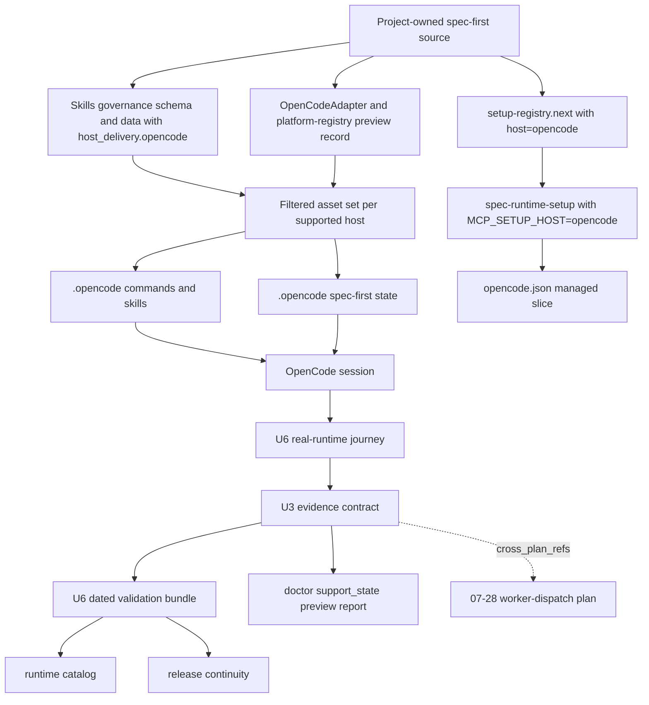
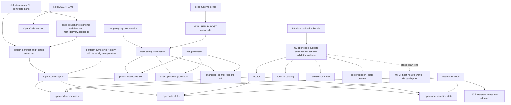
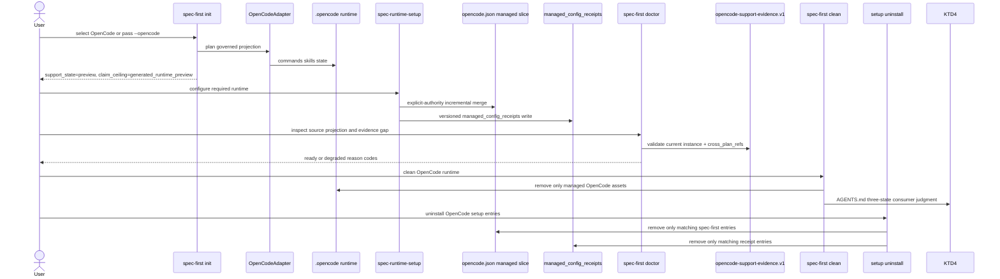
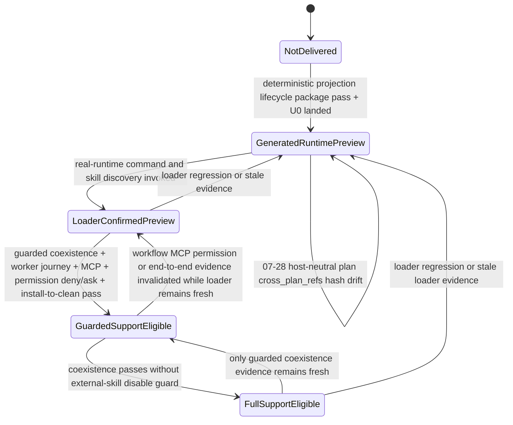

# OpenCode Host Support - Plan v2

## Goal Capsule

- **Objective:** 将 OpenCode 接入 spec-first 作为第 6 个 supported host，按 `generated_runtime_preview` 状态交付；host 的 worker dispatch 切片已在 07-28 plan 中改造为 host-neutral semantic contract，本 plan 只承载 OpenCode 自身的 host 支持、配置 ownership、evidence 与 promotion 路径。
- **Recommended approach:** `extend + compose / thin-glue`。新增薄 `OpenCodeAdapter` 与 `opencode-support-evidence` 三层 evidence contract；扩展现有 host registry、governance、setup-registry、CLI lifecycle、preview diagnostics 与版本化 claim；不复用 Codex `.agents/skills/**` 作为 OpenCode 共享 ownership，不创建 OpenCode-specific agent runtime、权限策略引擎或独立 state machine。
- **Decision focus:** OpenCode 单独走一条 6th-host evidence 路径（`opencode-support-evidence.v1` schema + packaged validator + dated validation bundle），与 host-neutral worker journey evidence 通过 `cross_plan_refs.opencode_to_worker_dispatch` 单向引用，不共享 reason codes；support claim ceiling 与 host-neutral 解耦 claim 完全独立。
- **Verification focus:** 先证明 U0 共享 `AGENTS.md` 三态 consumer 判定（不依赖 OpenCode 资产）、U1 adapter/registry shape、U2 CLI lifecycle、U3 governance/schema/catalog 原子扩展、U4 setup-registry 与 permission ownership、U5 source/runtime/docs/package 同步；再在 OpenCode CLI 可用时由 U6 记录 exact-version real-runtime evidence，按状态机从 `generated_runtime_preview` 起步。
- **Largest risk / boundary:** 当前机器没有 OpenCode CLI；同名 compatibility skill collision (`OPENCODE_DISABLE_EXTERNAL_SKILLS` guard)、OpenCode 默认 permission 行为 (`allow` 地板)、`opencode.jsonc` 注释保真、`opencode debug config` 的副作用边界、MCP `@latest` 解析等都属于外部 advisory evidence，loader/journey 实证前不能晋升到 `loader-confirmed preview` 之上。claim 必须绑定 exact `tested_versions`，无 CLI 时 `tested_versions=[]` 是合法 preview 状态，不伪造。MCP `@latest` resolution 变化由 KTD13 Layer 2 `mcp_resolved_package_identity` 字段（`{ package, version, registry, integrity, captured_at, freshness }`）显式记录；resolution 相对已确认 evidence 漂移时，对应 MCP evidence slice 降级而非沉默沿用。
- **Stop conditions:** U0 仍未交付；OpenCode 兼容性 skill collision 无法在不破坏 `.agents`/`.claude` 用户已加载能力的前提下显式隔离；setup-registry 升级只完成 OpenCode 一侧、其它 host 出现 partial key set；OpenCode plan 与 host-neutral plan 在 evidence 字段或 ownership 上产生循环引用；`opencode debug config` 无法证明无 plugin/MCP/network 副作用；缺真实 CLI 时把 fixture/手写文案伪装成 real-runtime evidence；或 U6 evidence 校验因 freshness/hash/qualifier 失效而无法追溯到 source。
- **Execution profile:** Deep、跨 CLI/adapter/governance/setup/docs/tests 的 source-first 变更；generated runtime 只通过实现后的 `spec-first init --opencode` 在临时项目中产生。
- **Tail ownership:** `spec-work` 负责实现、review、验证与 closeout；正式支持晋升由维护者基于版本化 U6 evidence 决定；OpenCode worker journey 字段须引用 host-neutral plan 的 `worker-dispatch-capability.md` 字段，不替代该 plan 的 U6 closure。

---

## Product Contract

### Summary

为 OpenCode 增加独立、可共存、可治理、可验证的 6th host 支持；host 在 `generated_runtime_preview` 状态先交付结构与 deterministic projection，loader/subagent/MCP/permission/field evidence 全部通过 `opencode-support-evidence.v1` 三层 contract 记录，按状态机从 preview 起步逐步晋升。

host 的 worker dispatch 切片由 `docs/plans/2026-07-28-001-refactor-host-neutral-worker-dispatch-plan.md` 改造为 host-neutral semantic contract，本 plan 不再重复其 worker-dispatch 维度（KTD3、AE4、AE7、Success Criteria 第 2 条的 worker 部分已被替代）。

### Problem Frame

spec-first 当前只注册 Claude Code、Codex、Cursor、Kiro 与 Qoder 五个宿主；OpenCode 社区用户无法通过 `spec-first init` 选择自己的宿主，也不享受受治理的安装、检查、升级、清理与版本化支持状态。

手抄其他宿主 runtime 不能提供：
1. 独立 ownership — OpenCode 的 `.opencode/**` 必须与 Codex 的 `.agents/skills/**` 互不覆盖；
2. 配置 ownership — `opencode.json` 的 MCP/permission entries 必须用版本化 `managed_config_receipts` 证明归属；
3. 状态机 — `generated_runtime_preview` / `loader-confirmed preview` / `guarded_support` / `full support` 必须有版本化 evidence；
4. 兼容边界 — OpenCode 同时发现 `.opencode/skills`、`.agents/skills`、`.claude/skills` 同名记录时，必须有显式 collision guard；
5. 解耦 worker dispatch — OpenCode 自身的 `task` primitive 不进入通用 Skill source，只进入 exact-version evidence。

### Key Decisions

- **6th host 状态字段。** 在 `getSupportedPlatforms()` 之后新增 `getSupportedPlatformsWithState()`，返回 `[{id, support_state, claim_ceiling}]`，默认 `support_state=active`；OpenCode 显式注册为 `support_state=preview`、`claim_ceiling=generated_runtime_preview`。`getSupportedPlatforms()` 仍保持 5 host 行为；`update`/clean/lifecycle auto-detection 不受 preview 标记影响。`platform-registry` 同步声明 `preview/active` 字段。
- **三层 evidence contract。** `opencode-support-evidence.v1` 三层：(Layer 1) spec-first plan/contract/tests/source 是 source of truth；(Layer 2) `src/cli/contracts/opencode-support-evidence.schema.json` + packaged parser/validator 是 host evidence contract owner；(Layer 3) `docs/validation/2026-07-27-opencode-host-support/` 下的 deterministic/real summary 是 dated artifact；每层 owner 与 freshness 边界显式：Layer 1 变 → 触发 Layer 2 instance 失效（`runtime-payload fingerprint` 变化）；Layer 2 变 → 触发 Layer 3 dated evidence stale；Layer 3 变 → 必须重捕 OpenCode 当前 CLI 行为。
- **Host isolation 红利（已由 07-28 plan 承接，本 plan 不复制）。** worker dispatch 切片（KTD3 原任务、AE4 worker 部分、Success Criteria worker 条目）全部迁出到 `docs/plans/2026-07-28-001-refactor-host-neutral-worker-dispatch-plan.md`；OpenCode 仅通过 `cross_plan_refs.opencode_to_worker_dispatch` 单向引用其 `eligibility_contract_sha256` 与 `git_revision`；host-neutral journey artifact 不反向引用 OpenCode claim ceiling；reason codes 互不重叠（`opencode_*` prefix 由本 plan owner，其余由 07-28 plan owner）。Scope 不再扩：已有 R1-R13/R17-R18、KTD1-KTD2/KTD4-KTD13、F1-F2/F4-F5、AE1-AE3/AE5/AE6/AE8、Scope Boundaries 全部保留，不引入新 OpenCode capability、不重写 5-host 主路径。

### Actors

- A1. **OpenCode 社区用户：** 在项目中选择 OpenCode，安装并运行 spec-first workflow；可启用 `OPENCODE_DISABLE_EXTERNAL_SKILLS=1` 解决 compatibility collision。
- A2. **Project maintainer：** 维护跨宿主 source、support state、U6 evidence 与发布口径；晋升 support state 需对照版本化 evidence。
- A3. **OpenCode runtime：** 负责发现命令和 skills、执行 agent/worker、应用权限并连接 MCP；当前机器未安装，无法实证。

### Host Delivery Shape

`S` 是 spec-first source-of-truth；`G/M/R` 是同时落地的 3 个 projection owner；`F` 是 deterministic filtered asset set；`Session` 与 `Journey` 是 U6 真实证据来源；`E` 是 U3 evidence contract；`Bundle` 是 U6 dated artifact；`Catalog`/`Release`/`Doctor` 是 evidence consumer。

### Requirements

**Installation and lifecycle**

- R1. 交互式 `spec-first init` 必须把 OpenCode 显示为可选择的独立宿主，并标注 `support_state=preview`。
- R2. CLI 必须支持显式 `--opencode` host selector，使非交互安装能够只选择 OpenCode 或将其与其他宿主组合选择。
- R3. OpenCode 首版必须保持 opt-in，不得自动进入无显式 host selector 的 `init -y` 默认安装集合。
- R4. OpenCode 与 Codex 及其他宿主必须能在同一项目中独立共存；任何单宿主安装、检查、升级或清理都不得覆盖或删除另一宿主的 runtime 或共享 `AGENTS.md` managed block。
- R5. OpenCode 必须进入现有宿主生命周期（init/doctor/update/clean/help），但 auto-detection 只接受 valid managed state 或 registry 声明的精确 managed asset candidate；`opencode.json`、`.opencode/plugins`、未知 `.opencode/**`、user-owned `.opencode/agents/custom.md` 不触发 detection。

**Workflow and agent experience**

- R6. OpenCode 必须同时提供 `/spec-*` 原生命令入口与 Agent Skills 发现入口，并保持统一的公开 workflow 名称；两个入口共享同一 source-owned workflow body。
- R7. 所有受治理的公开 workflow、standalone skills 与 agent-facing internal skills 必须按其治理分类投射到 OpenCode，不得出现部分 governance record 缺少 `host_delivery.opencode` 的中间态。
- R8. 依赖辅助研究、审查或验证角色的 workflow 必须消费 host-neutral worker semantic contract；只有获得用户 dispatch 授权后，才可把 OpenCode 当前会话 tool registry/schema 作为 `provider_untrusted` evidence 做 semantic discovery。Skill、adapter、project state 与 generated projection 均不得维护 OpenCode primitive mapping。本条由 07-28 plan 改造后承接，OpenCode plan 内不再维护 worker-dispatch 文案。
- R9. OpenCode 必须消费项目已有的 `AGENTS.md` 指令真相源，不得为同一项目治理复制第二份 project-owned 入口文档；U0 共享 `AGENTS.md` 三态 consumer 判定是 R4 的前置。

**MCP, permissions, and configuration ownership**

- R10. OpenCode MCP 必须默认支持项目级配置，并提供显式 opt-in 的用户级配置路径（XDG 解析）。
- R11. MCP 与权限写入必须保留用户已有配置；更新时只维护 spec-first 可证明归属的条目，清理时只移除这些条目；ownership 由 `managed_config_receipts.v1` 版本化证明。
- R12. 权限管理必须采用最小增量，只补足 spec-first workflow 所需能力，不得启用全局 `allow`、不写 wildcard，不放宽无关工具权限。
- R13. OpenCode hooks 或 plugins 只有在现有 spec-first workflow 的确定性 gate、生命周期或证据闭环确实需要时才纳入；首版不纳入。

**Evidence and release claims**

- R14. 完成 deterministic runtime 投射、治理一致性、生命周期和发布包验证后，即使真实 OpenCode loader 不可用，也可以 opt-in `generated_runtime_preview` 状态交付；U6 真实 evidence 缺失时不伪造。
- R15. 高于 `generated_runtime_preview` 的支持声明必须绑定版本化、可校验的真实 OpenCode evidence；claim ceiling 状态机（`loader-confirmed preview` → `guarded_support` → `full support`）由 `opencode-support-evidence.v1` 校验；OpenCode worker journey 字段单向引用 07-28 plan 的 `eligibility_contract_sha256`，不替代该 plan 的 U6 closure。
- R16. `doctor` 与用户可见文档必须区分 source/projection evidence、loader evidence 与 field outcome，并显示已验证的精确 OpenCode 版本集合；缺失、过期或不匹配时返回 `opencode_version_unverified`。
- R17. OpenCode runtime 必须保持 generated-runtime 身份；修复应修改 source、governance 或生成逻辑，再通过 `spec-first init` 重建，不得把生成目录提升为 source-of-truth。
- R18. OpenCode 支持必须同步所有受影响的宿主 registry、governance、runtime catalog、CLI 文案、README、contracts、tests、release/package 校验与 Changelog，避免形成"CLI 可选但下游消费者未知"的部分支持状态。

### Key Flows

- F1. **交互式安装**
  - **Trigger:** A1 在交互式终端运行 `spec-first init`。
  - **Actors:** A1, A3
  - **Steps:** 安装器展示 OpenCode 并标注 `support_state=preview`；用户选择 OpenCode；系统预览并写入受治理 runtime；输出安装状态与 preview claim。
  - **Outcome:** OpenCode 获得独立、可检查和可清理的 preview runtime。
  - **Covered by:** R1, R3, R5, R14, R16
- F2. **显式或多宿主安装**
  - **Trigger:** A1 使用 `--opencode`，并可同时选择其他宿主。
  - **Actors:** A1
  - **Steps:** CLI 解析选择；分别为每个宿主生成归属明确的 runtime；汇总每个宿主结果。
  - **Outcome:** OpenCode 与 Codex 等宿主共存且互不覆盖。
  - **Covered by:** R2, R4, R5
- F3. **运行 workflow（worker 切片由 07-28 plan 承接）**
  - **Trigger:** A1 在 OpenCode 中调用 `/spec-*` 或让 agent 加载对应 skill。
  - **Actors:** A1, A3
  - **Steps:** OpenCode 发现入口；workflow 加载 source-projected 内容；需要辅助角色时按 07-28 plan 的 host-neutral semantic contract 与 current-session schema 做 semantic discovery，或按 missing/unknown facts 串行降级。
  - **Outcome:** 用户能执行完整的 spec-first workflow，授权和降级语义不因宿主变化而失真。
  - **Covered by:** R6, R7, R8, R9（与 07-28 plan KTD3 一致）
- F4. **配置与清理**
  - **Trigger:** A1 通过 Runtime Setup 安装、刷新 OpenCode MCP/权限配置，或显式执行 `--uninstall-host-config`。
  - **Actors:** A1, A3
  - **Steps:** 系统识别已有用户配置；增量维护 spec-first 条目；检查配置状态；清理时删除可证明归属的内容；owner 通过 `managed_config_receipts.v1` 校验。
  - **Outcome:** spec-first 能工作，用户自有配置保持不变。
  - **Covered by:** R10, R11, R12, R13
- F5. **Support state 晋升**
  - **Trigger:** A2 获得新的真实 OpenCode loader 或用户旅程 evidence。
  - **Actors:** A2, A3
  - **Steps:** 用 U6 real-runtime journey 重新捕获 OpenCode 当前 CLI 行为；U3 evidence contract 校验 freshness、hash、qualifier、invalidation conditions；按状态机从 `generated_runtime_preview` 起步晋升。
  - **Outcome:** Support claim ceiling 只晋升到证据直接覆盖的等级。
  - **Covered by:** R14, R15, R16

### Acceptance Examples

- AE1. **Covers R1, R3, R5.** Given 用户运行交互式 `spec-first init`, when 选择 OpenCode 且未选择其他宿主, then 只生成 OpenCode 管理的 runtime，并报告 `support_state=preview`、`claim_ceiling=generated_runtime_preview`。
- AE2. **Covers R2, R4, R9.** Given 项目已安装 Codex, when 用户显式安装 OpenCode 且未启用 external-skill guard, then deterministic inspection 返回 `opencode_external_skill_collision` action-required；以 `OPENCODE_DISABLE_EXTERNAL_SKILLS=1` 启动的真实 OpenCode command/skill journey 通过时仍只能晋升 `guarded_support`；清理任一宿主不破坏另一宿主 runtime 或共享 `AGENTS.md` managed block（U0 三态判定已 land）。
- AE3. **Covers R2, R3.** Given 用户执行非交互安装且显式选择 OpenCode, when CLI 应用选择, then OpenCode 被安装；未显式选择时，首版默认集合不自动加入 OpenCode。
- AE4. **Covers R6, R7, R8.** Given OpenCode 已发现 spec-first runtime, when 用户分别通过 `/spec-*` 和 skill 入口启动 workflow, then 两种入口都加载同一 source-owned 语义；worker 切片由 07-28 plan 承接，本 plan 不再单独验证。Skill 投映不注入 primitive mapping，授权缺失时固定 `not_applicable + unknown` 并走 inline fallback。**本 AE 只验证 command/skill discovery 层面的双入口；worker dispatch 的 capability/isolation/model/parallelism/mutation 行为由 07-28 plan AE1-AE15 独立覆盖，本 AE 不复制也不引用其 acceptance 判据。**
- AE5. **Covers R10, R11, R12, R13.** Given 项目或用户级 OpenCode 配置已含非 spec-first MCP 与权限规则：when 执行安装或刷新, then 原有配置保持不变，不会启用全局 `allow`；危险工具没有显式用户规则时 resolved permission 为 `ask`，已有显式规则不被覆盖；managed entries 由 `managed_config_receipts.v1` 证明 ownership 与 order fingerprint。
- AE6. **Covers R14, R16.** Given 确定性投射测试通过但当前环境没有 OpenCode CLI, when 用户安装或运行 `doctor`, then 系统报告 `support_state=preview`、`opencode_generated_runtime_loader_unverified`、`tested_versions=[]` 与 loader evidence 缺口，不声称正式完整支持。
- AE7. **Covers R15.** Given 真实 OpenCode 环境完成命令、skill、MCP、permission、worker journey 与 lifecycle 用户旅程, when 维护者评估发布状态, then 只有 evidence 中精确记录的 OpenCode 版本、observed primitive、schema excerpt/hash、live outcome、cross_plan_refs 与 journey 可以晋升；guarded journey 只能产生 `guarded_support`，无条件 full support 还需不设 guard 仍能安全共存。
- AE8. **Covers R17, R18.** Given OpenCode runtime 出现 drift, when 维护者修复问题, then 修改 source 或生成逻辑并重新生成，同时所有 registry、governance、docs、tests 与 Layer 2 evidence instance 保持一致。

### Success Criteria

- OpenCode 作为 6th host 在 `platform-registry` 与 `getSupportedPlatformsWithState()` 中显式注册 `support_state=preview`；`getSupportedPlatforms()` 仍只返回 5 host。
- OpenCode 安装产物覆盖全部受治理的公开 workflow 与 skills，并提供原生命令、MCP、最小权限与 preview-runtime 体验；worker dispatch 完全由 07-28 plan 承接。
- OpenCode 与现有宿主共存，`doctor`、升级与 `clean` 均遵守 ownership 与 U0 三态判定，不产生跨宿主覆盖或用户配置丢失。
- `opencode-support-evidence.v1` schema + packaged validator + dated validation bundle 落盘；release continuity、doctor、catalog 复用同一 validator，不维护第二份验证逻辑。
- 缺 OpenCode CLI 时 deterministic preview 仍可交付；`tested_versions=[]` 是合法 preview 状态，不伪造。
- 只有 U6 版本化 evidence 覆盖目标 OpenCode 精确版本、real-runtime journey、cross_plan_refs 引用新鲜时，README、runtime catalog 与发布文案才可声明对应版本的支持；`tested_versions` 与 `claim_ceiling` 一一对应，`guarded` qualifier 不被移除除非 evidence 证明。

### Scope Boundaries

- 不把 OpenCode 加入 `getSupportedPlatforms()` 主列表；`getSupportedPlatformsWithState()` 用 `support_state` 字段区分。
- 不复用 Codex 的 `.agents/skills/**` runtime 作为 OpenCode 的共享 ownership 边界。
- 不依赖 OpenCode 对 `.opencode/skills`、`.agents/skills` 与 `.claude/skills` 同名 skill 的未承诺加载顺序；collision 未被显式隔离或证明安全时保持 action-required，不静默选择任一副本。
- 不复制或替代 OpenCode 的通用 agent、权限、插件和工具运行时。
- 不为 helper personas 生成额外的 OpenCode custom agent 用户入口；helper prompt 继续由 owning skill-local references 持有。
- 不在 OpenCode host slice 内重写 5 host 已有行为；OpenCode 只通过 adapter/registry 增量扩展。
- 不把 OpenCode 纳入 user-level language sync；项目级语言与治理继续通过 root `AGENTS.md` 生效。
- 不改写历史计划、审查或验证文档中的"五宿主"快照；只更新当前 source、活跃 contracts、tests 和用户文档。
- 不在 OpenCode plan 内复制 07-28 plan 的 worker-dispatch 文案；worker 切片由 07-28 plan 单一 owner，本 plan 通过 `cross_plan_refs` 单向引用。

#### Deferred to Follow-Up Work

- `opencode.jsonc` 的注释保真 mutation。首版 canonical writer 只维护严格 JSON 的 `opencode.json`；检测到仅有 JSONC 或无法无损解析的高优先级配置时 fail closed，并给出 unblock direction。
- OpenCode hooks/plugins。只有真实运行证明某个确定性 exit gate 无法由现有 CLI、skill contract 或 MCP setup 承载时，才单独规划。
- 把重复的 supported-host 常量重构为单一跨模块 schema。当前变更只在既有 owner 中原子扩展，避免借新增宿主进行无关架构重写。
- 跨宿主 MCP package pinning 与 integrity policy。当前 required MCP definitions 包含 `@latest`，这是既有共享 Runtime Setup 风险；本功能只要求 evidence 记录实际解析的 package/version/registry/integrity 并把 resolution 变化视为证据失效，不在 OpenCode host slice 中单独改变所有宿主的 dependency policy。
- OpenCode 计划与 host-neutral plan 的双向引用。Layer 2 evidence 通过 `cross_plan_refs.opencode_to_worker_dispatch` 单向引用 07-28 plan；host-neutral plan 不引用 OpenCode-specific claim ceiling。双向耦合留待 evidence 双方都通过 U6 real-runtime 验证后再考虑。

### Dependencies / Assumptions

- 社区需求目前是定性信号；尚无 Issue 链接、用户规模或失败日志，不据此推断采用量或优先级强度。
- OpenCode 官方文档在 2026-07-27 显示其支持 `AGENTS.md`、Agent Skills、project commands、primary agents/workers、MCP、permissions 与 plugins；这些是 external advisory evidence，implementation 与 verification 必须继续回源。
- 当前机器没有可调用的 OpenCode CLI，因此无法在本次 planning 中验证 loader、命令、skill、worker、MCP 或完整用户旅程。
- OpenCode 官方配置格式、发现路径、permission 语义或 worker 行为变化时，相关实现选择与 support state 必须重新评估。
- OpenCode 当前 source 显示 project-local `.opencode/skills`、`.agents/skills` 与 `.claude/skills` 会共同参与发现，同名记录只告警并由后完成加载的记录覆盖；实现不得把这一并发加载顺序当作稳定 precedence contract。
- 首轮真实 promotion evidence 以 OpenCode `1.18.7` 为目标基线；若实施时 stable 已变化，必须把实际验证版本作为精确集合写入 evidence。未列入该集合的新版本、旧版本或未知版本一律保持 `opencode_version_unverified`，不得从单版本结果推导宽泛 semver 支持。
- U0 共享 `AGENTS.md` 三态 consumer 判定是 R4 / AE2 的前置；U0 仍未完成时 OpenCode R4 仅能 partial test（state+asset 同时缺失的 `confirmed_absent` 路径可独立验证，`uncertain` 路径需 U0 联合验证）。
- 07-28 plan 的代码迁移（U1-U5）已完成，但**严格解耦 claim（U6）因 post-capture schema 收紧 + source revision 演进导致 validator 拒收全部 3 条 dated journeys（164 set-level errors）而保持未关闭**。OpenCode plan 不复制其内容；`cross_plan_refs.opencode_to_worker_dispatch` 引用的 `eligibility_contract_sha256` 来自 07-28 plan 当前 source——在 07-28 plan U6 claim 关闭前，OpenCode 任何高于 `generated_runtime_preview` 的晋升都永久 blocked。

### Outstanding Questions

**Resolve Before Implementation:**

- U0 共享 `AGENTS.md` 三态 consumer 判定是否已 land？若未，OpenCode U1/U2 的 `uncertain` path 测试必须等 U0；不允许用 conditional skip 代替 gate pass。
- `getSupportedPlatformsWithState()` 的接口形状与现有 5 host 兼容策略：是新增函数，还是扩展 `getSupportedPlatforms()` 返回带 state 字段的对象数组（影响所有现有 consumer）？计划默认采用"新增函数"。

**Deferred to Implementation / Verification:**

- 实现开始时重新读取 OpenCode 官方 command、skill、MCP 与 permission 文档，确认最小 frontmatter、配置容器与 namespaced permission pattern；若当前文档与本计划语义冲突，先更新计划或记录有证据的 deviation。
- 确认目标 OpenCode 版本仍支持 `OPENCODE_DISABLE_EXTERNAL_SKILLS`、仍共同发现 `.opencode/skills`/`.agents/skills`/`.claude/skills`，并复核 duplicate resolution；任一行为变化都使首版 collision guard 失效并阻断实现继续沿用 KTD1。
- 真实 OpenCode 是否提供非交互 loader/配置检查命令；若没有，使用可重复的交互用户旅程并保留版本、输入、输出与 limitations。
- 确认 `opencode debug config` 是否能在不初始化 project plugins、启动 MCP 或访问网络的模式下运行；若无法证明诊断无额外副作用，不自动执行该命令，改用显式用户授权的真实旅程并保持 `opencode_effective_config_unverified`。
- `opencode.jsonc` 与 `opencode.json` 的实际优先级只用于 collision 诊断和后续 JSONC 支持，不扩大首版 writer scope。
- U3 evidence contract 与 U6 dated bundle 的目录布局：`docs/validation/2026-07-27-opencode-host-support/` 与 `src/cli/contracts/opencode-support-evidence.{schema.json,js,json}` 三者的 owner 与 freshness 边界需在 U3 实施时再次确认。

### Sources / Research

- `src/cli/adapters/index.js`、`src/cli/adapters/base.js`、`src/cli/adapters/platform-registry.js` — 当前 adapter、projection 与 runtime ownership 扩展点；observed at repository commit `2c89c5a18eaf85998dbf80fd98bf2d27d7f263fc`。
- `src/cli/adapters/qoder.js`、`src/cli/adapters/cursor.js` — command+skill host 与 generated-preview host 的相邻实现；只复用当前仍成立的 pattern。
- `src/cli/commands/init-args.js`、`src/cli/commands/init.js`、`src/cli/commands/init-output.js`、`src/cli/commands/doctor.js`、`src/cli/commands/clean.js`、`src/cli/commands/update.js` — host selector 与 lifecycle consumers。
- `src/cli/plugin-manifest.js`、`src/cli/plugin-governance.js`、`src/cli/contracts/dual-host-governance/skills-governance.json` — source/governance 到 runtime asset set 的投射链。
- `skills/spec-runtime-setup/setup-registry.json`、`skills/spec-runtime-setup/setup-registry.schema.json`、`skills/spec-runtime-setup/scripts/lib/host-authority.cjs`、`skills/spec-runtime-setup/scripts/lib/host-config.cjs` — MCP/config mutation 的 canonical registry、authority 与 transaction owner。
- `docs/solutions/workflow-issues/runtime-setup-host-authority-and-script-owned-facts-2026-07-04.md` — 新宿主必须使用显式 `MCP_SETUP_HOST`，setup facts/config mutation 必须 script-owned。
- `docs/solutions/workflow-issues/host-entrypoint-mapping-source-boundary-2026-04-29.md`、`docs/solutions/conventions/skill-publication-command-surface-alignment-2026-06-23.md`、`docs/solutions/workflow-issues/modify-source-not-artifacts-2026-04-13.md` — 入口映射集中、governance/command/runtime 同步与 source-first 约束。
- `docs/plans/2026-07-04-001-feat-qoder-host-support-plan.md`、`docs/plans/2026-07-04-002-feat-cursor-host-support-plan.md` — 历史宿主扩展计划；作为模式参考，不覆盖当前 source。
- `docs/plans/2026-07-28-001-refactor-host-neutral-worker-dispatch-plan.md` — host-neutral worker dispatch 切片；OpenCode plan 通过 `cross_plan_refs.opencode_to_worker_dispatch` 单向引用其 `eligibility_contract_sha256`。
- [OpenCode Rules](https://opencode.ai/docs/rules/)、[Agent Skills](https://opencode.ai/docs/skills/)、[Commands](https://opencode.ai/docs/commands/)、[Agents](https://opencode.ai/docs/agents/)、[MCP Servers](https://opencode.ai/docs/mcp-servers/)、[Permissions](https://opencode.ai/docs/permissions/)、[Plugins](https://opencode.ai/docs/plugins/) — 官方 `anomalyco/opencode` `dev` 文档，observed 2026-07-27；重要行为仍需真实 runtime 证明。
- [`packages/opencode/src/skill/index.ts`](https://github.com/anomalyco/opencode/blob/dev/packages/opencode/src/skill/index.ts)、[`packages/opencode/src/effect/runtime-flags.ts`](https://github.com/anomalyco/opencode/blob/dev/packages/opencode/src/effect/runtime-flags.ts) — OpenCode `dev@7534d23551f665e65080809975b4ca5c7d63807b` source，observed 2026-07-27；确认 compatibility skill roots、duplicate warning/overwrite 行为与 `OPENCODE_DISABLE_EXTERNAL_SKILLS` guard。`dev` 只作 advisory orientation；初轮 promotion 必须以目标 stable `1.18.7` 或实施时记录的精确版本重新验证。

---

## Planning Contract

### Product Contract Preservation

R1-R18、A1-A3、F1-F5、AE1-AE8 保持原意，但本 plan 内对 worker dispatch 切片（KTD3 整段、AE4 的 worker 部分、Success Criteria 第 2 条的 worker 部分）的描述替换为引用 07-28 plan。OpenCode 计划不再独立维护 worker-dispatch 文案；`cross_plan_refs.opencode_to_worker_dispatch` 字段为单一引用通道。

另需说明：R4/AE2 涉及的共享 `AGENTS.md` single-host clean 缺陷由 U0 独立修复（U0 仍可能未完成），不因 OpenCode preview 回滚而回退。

### Architecture Posture

- **Posture:** `extend + compose`。KTD1-KTD12 是标准的 6th host adapter extension（adapter、CLI lifecycle、governance、setup-registry、docs/package）——Cursor/Qoder 已有成熟 pattern；KTD13 三层 evidence contract + 7-state promotion 是 OpenCode-specific 的最小必要 **Build**（host-neutral plan 不覆盖跨 plan 引用、managed-config-receipts、MCP `@latest` resolution 与 preview host 状态机）。plan 的 ~820 行反映这组 Build 的真实复杂度，不伪装为 thin-glue。
- **Extend:** `PlatformAdapter`、adapter registry、skills governance、init/doctor/update/clean、platform ownership registry 和 Runtime Setup registry 已拥有相应边界，OpenCode 以新 host record 与 host-specific transform 扩展这些 owner。
- **Compose:** OpenCode adapter 只负责 path/frontmatter/runtime-identity translation；plugin sync 继续拥有 asset projection，governance 继续拥有 delivery truth，Runtime Setup 继续拥有 host authority、配置事务和 facts。
- **Thin-glue boundary:** OpenCode-specific glue 只拥有 host representation translation、preview diagnostics 和配置 shape mapping；不复制 workflow 语义、权限策略引擎、状态模型或 provider logic。
- **Versioned evidence:** `opencode-support-evidence.v1` 是 host evidence 三层 contract 的唯一 schema/validator owner；U6 dated bundle 与所有 consumer（catalog、release continuity、doctor）复用同一 validator。
- **Rejected new boundary:** 不创建 `OpenCodeRuntimeManager`、独立 installer 或第二份 command/skill catalog；现有 owner 能在不混合职责的前提下吸收变化。
- **Source of truth:** `skills/`、`templates/`、`src/cli/`、`skills/spec-runtime-setup/`、`docs/contracts/` 与 `docs/plans/`；`.opencode/**` 和目标项目 `opencode.json` 中的 managed slice 都是可重建 runtime/config output，不反向成为 source。

### Key Technical Decisions

- KTD1. **OpenCode runtime 独立投射并显式隔离 compatibility skill collision。** Commands 使用 `.opencode/commands/spec-*.md`，workflow/standalone/internal skills 使用 `.opencode/skills/<skill>/`，state 使用 `.opencode/spec-first/state.json`；不共享 `.agents/skills`，避免 Codex/OpenCode 安装和 clean ownership 耦合。由于 OpenCode 也会发现 `.agents/skills` 与 `.claude/skills`，adapter/doctor 必须检查与 managed OpenCode skills 同名的 compatibility copies；不得依赖当前并发加载的 last-writer 行为。collision 存在且无法证明被隔离时，安装保持 preview、doctor 返回 `opencode_external_skill_collision` 与 action-required；首版明确的用户侧 unblock 是以 `OPENCODE_DISABLE_EXTERNAL_SKILLS=1` 启动 OpenCode，spec-first 只检测和提示，不写全局环境。该 guard 会对当前 OpenCode 进程禁用全部 `.agents`/`.claude` compatibility skills，不只禁用 spec-first，README/doctor 必须披露此影响并确认用户需要的 skill 已存在于 `.opencode/skills` 或其他 OpenCode-native path。该旅程通过后最多晋升 exact-version `guarded_support`；只有无需 guard 仍无同名冲突，或上游提供并被目标版本实证的等价隔离机制时，才可晋升无条件完整支持。**KTD1 范围内的 "unknown `.opencode/**` 保持 host/user-owned" 不进入 KTD5 `managed-config-receipts.v1` collection；KTD5 receipt 只覆盖 `opencode.json` 内的 spec-first MCP/permission entries，以及 governance/registry 声明的 `.opencode/commands/spec-*.md`、`.opencode/skills/<managed-skill>/**`、`.opencode/spec-first/**`。**
- KTD2. **双入口共享同一 source。** `workflow_command` 在 OpenCode governance 中标记为 `command`，现有 filtered asset semantics 同时投射 command 与 backing workflow skill；standalone 为 `skill`，agent-facing internal 为 `internal`。两种入口不得维护不同 workflow body。**KTD2 的双入口（command + skill discovery）与 KTD3 的 worker dispatch 切片正交：双入口走本地 host loader 的 command/skill 文件发现，worker dispatch 走 07-28 plan 的 host-neutral semantic contract 与 current-session schema discovery；两条路径不互相替代。**
- KTD3. **Worker dispatch 切片由 07-28 plan 单一 owner。** `supportsAgents=false`（只抑制 bundled agent profile 投射，不是 worker capability 声明）；本 plan 仅通过 `cross_plan_refs.opencode_to_worker_dispatch` 引用 07-28 plan。详见 [Key Decisions → Host isolation 红利](#key-decisions)。
- KTD4. **`AGENTS.md` 是共享 project instruction，clean 使用三态 consumer 判定。** 该三态判定修复的是先于本功能存在的缺陷（Codex/Cursor/Kiro/Qoder 已共享同一 `instructionFile`，single-host clean 会移除其他宿主仍消费的 managed block），因此由独立的 U0 交付，不与 OpenCode opt-in preview 的发布或回滚绑定；OpenCode 只是新增一个 consumer。OpenCode 不生成 pointer/rule 文件。其他消费同一 `instructionFile` 的 adapter 只有三种互斥状态：存在有效且兼容的 managed state，且没有与其声明 runtime 相矛盾的证据时为 `present`；state 与该 adapter 的全部精确 managed assets 都不存在时为 `confirmed_absent`；缺少有效 state 但仍有精确 managed assets、state 损坏/版本不可读、state/runtime 矛盾或读取失败时为 `uncertain`。asset-only residue 不得归为 `present`。`clean --opencode` 只有在所有其他消费者均为 `confirmed_absent` 时才移除 root `AGENTS.md` managed block；任一 `present` 或 `uncertain` 都保留 block，后者返回 action-required。单宿主 clean 不得破坏其他宿主入口，也不得让从未安装的宿主永久阻断最后清理。U0 仍未 land 时 OpenCode R4 仅能验证 `confirmed_absent` 路径。
- KTD5. **Runtime clean 与配置 uninstall 分权，配置 ownership 由版本化 receipt 证明。** `spec-first clean --opencode` 只删除 managed OpenCode commands/skills/state，并按 KTD4 判断共享 `AGENTS.md`；`spec-runtime-setup --uninstall-host-config` 只处理配置。每次成功写入由 per-host readiness ledger 中的 `managed_config_receipts` 记录；为保持现有 host-ledger v2 的 additive compatibility，顶层 schema 不因本功能升级，嵌套 collection 使用 `{ schema_version: 'managed-config-receipts.v1', entries: [...] }` 独立版本。**`managed-config-receipts.v1` schema 由 KTD5 唯一 owner；KTD13 的 Layer 2 host evidence schema 仅以 `managed_config_receipts_ref` 字段引用该 collection，不得在 KTD13 内重新定义 receipt 字段或 schema_version。**identity 至少包含 host、scope、canonical config path、container 与 entry key，receipt 还保存 normalized value SHA-256、spec-first version 和写入时间；normalized value 固定为递归排序 object keys、保留 array 顺序和 JSON primitive 值的无空白 UTF-8 canonical JSON，再计算 SHA-256。collection 按 canonical target identity 合并，不能因另一个项目运行 setup 而覆盖无关 receipt。collection 缺失按"无 ownership receipt"处理，损坏或版本不兼容不得被静默重置。`managed_config_receipts` 是必须跨 run 存活的 collection：ledger payload 的任何全量重建路径都必须先读取磁盘既有 ledger 并原样携带该 collection；config transaction 的 receipt write 与 runtime-executor 的 ledger write 必须经由同一个 owner-checked read-merge-write 入口，禁止两条独立写路径先后覆盖同一文件。待写 payload 缺少磁盘上已存在的 receipts 时必须 fail closed（`host-readiness-ledger-receipt-drop-detected`）且零 mutation，不得以"payload 未声明"为由静默丢弃。跨项目并发 mutation 使用 per-host receipt-ledger lock 覆盖 read→merge→config mutation→receipt commit/rollback，统一按 receipt-ledger lock 后 config lock 的顺序取锁，禁止无锁 read-modify-write。任一锁获取失败或 replace 前 ownership check 失败都必须零 mutation；replace 后失锁时只可在仍持有对应锁的边界内自动回滚，无法安全恢复时保留 owner-private backup/evidence、返回 `manual-required` 且绝不声称 commit 成功。只有当前 run 实际创建条目，或已有 receipt identity 与 current normalized hash 同时匹配、证明 ownership 未被用户改写时，setup 才能更新条目并创建/刷新 receipt；预先存在但值相同且无 receipt 的用户条目保持不变且不得被认领。Setup 在配置写入后提交 receipt，receipt 写失败必须在两把锁仍受本事务持有时恢复配置；uninstall 同样要求 receipt identity 与 current normalized hash 匹配，删除配置后再删除 receipt，receipt 删除失败必须在锁内恢复配置。receipt 缺失、损坏、版本不兼容或 hash 不匹配一律 fail closed 并保留用户内容。
- KTD6. **MCP 配置 project-first、user-scope 显式授权、effective config 单独验证。** OpenCode project target 为 `opencode.json`；user target 必须复用目标版本的 XDG 解析语义：`XDG_CONFIG_HOME` 为有效绝对路径时使用 `<XDG_CONFIG_HOME>/opencode/opencode.json`，缺失或无效时才使用目标版本在当前平台的 OpenCode fallback（当前 POSIX stable 为 `<home>/.config/opencode/opencode.json`），不得把 `$HOME/.config` 写死为跨平台 contract。目标平台没有可确认 fallback 时 fail closed，不猜测路径。user target 必须通过 `--user-scope`。`MCP_SETUP_HOST=opencode` 是 mutation authority；runtime dirs、PATH 和旧 facts 只能是 advisory candidates。写入后正确不等于最终生效：实现必须识别 remote/global/custom/project/inline/managed precedence。调用 `opencode debug config` 前必须将 candidate 解析为绝对 realpath，确认是 target repo/workspace 与 generated runtime 之外的普通可执行文件，记录 source、path 与 version/provenance，并通过无 shell argv、超时和输出上限执行；project-local、symlink 回项目、ambiguous 或 provenance 不完整的 candidate 不得执行，只报告 `opencode_effective_config_unverified`。命令自身可能初始化 plugin/MCP/网络且无法安全关闭时同样不自动执行，不得晋升安全或 loader readiness。
- KTD7. **配置 shape 由 registry 声明，不按 host 名字散落分支。** 扩展 host-config contract，使 JSON container、server representation 与可归属 permission entries 由 `setup-registry` 描述；现有 hosts 保持默认 `mcpServers`/string-command 行为，OpenCode 使用官方 `mcp` representation。
- KTD8. **权限最小化并建立显式、顺序可验证的 ask 地板。** OpenCode 当前未配置时多数权限默认为 `allow`，因此不能把"未写 global allow"等同于安全。Skill 权限必须从 U3 的 governed OpenCode asset set 派生精确 skill id，并为每个 managed skill 写 exact `allow`；集合必须包含不匹配 `spec-*` 的 `using-spec-first`，禁止用前缀或 wildcard 代替 inventory。危险工具只在用户没有匹配规则时写 exact `bash`、`edit`、`task`、`webfetch`、`websearch`=`ask`。OpenCode 规则按顺序匹配且后匹配覆盖时，transaction 必须先解析现有顺序与 effective action：任何 broad/later user rule 会覆盖 managed exact rule，或 managed append 会反向覆盖用户 deny/allow 时，都不重排、不覆盖并返回 action-required；无冲突时以确定性顺序追加 managed exact entries，receipt 持有 identity、action 与 order fingerprint。该安全口径仅适用于普通 approval mode；用户显式 `--auto` 会自动批准原本为 `ask` 的请求，属于运行时 override。静态 `doctor` 不得假装识别当前或未来启动参数，真实 permission evidence 必须记录 argv/mode 且不得使用 `--auto`；显式 `deny` 行为单独验证。禁止写 wildcard/global allow，无法证明最终 effective action 与顺序时宁可不写。
- KTD9. **严格 JSON writer，JSONC 只读并按实际 precedence fail closed。** 首版原子事务只修改 `opencode.json`，永不改写 `opencode.jsonc` 或 comment-bearing content。只有 JSONC 是唯一有效配置、实际 higher-precedence target，或其存在使 resolved target 无法证明时才阻断严格 JSON mutation；其他共存场景保持 JSONC byte-stable，输出 advisory collision fact，不把"发现 JSONC"本身等同于 blocking failure。
- KTD10. **治理与 registry 原子升级。** `skills-governance` 从 schemaVersion 1 升级，`setup-registry.v8` 升级到下一版本；schema、data、parser constants、generated projections、catalog 和 tests 必须在同一实现 slice 中同步，任何 partial key set 都是 blocking failure。
- KTD11. **复用现有 evidence vocabulary，并由版本化合同约束晋升。** OpenCode 初始状态为 `generated_runtime_preview`；`doctor` 提供 `opencode_generated_runtime_loader_unverified`、`opencode_version_unverified` 等 degraded/non-drift reason code。Support state 沿用 projection→loader→workflow/field 的证据层级；状态只增加 `guarded_support` claim qualifier，不创建第二套 workflow 状态机。OpenCode reason codes 与 host-neutral worker-dispatch reason codes 互不重叠，分别由本 plan 与 07-28 plan owner。

  **Appendix A — Reason code 互斥对照表**

  | Reason code | Owner plan | Trigger / scope |
  |---|---|---|
  | `opencode_generated_runtime_loader_unverified` | OpenCode (本 plan) | deterministic projection 通过但缺 OpenCode CLI loader evidence |
  | `opencode_version_unverified` | OpenCode (本 plan) | 本机 detected version 不在 `tested_versions` 内 |
  | `opencode_external_skill_collision` | OpenCode (本 plan) | `.opencode/skills` 与 `.agents/skills`/`.claude/skills` 同名且未启用 guard |
  | `opencode_orphaned_managed_runtime` | OpenCode (本 plan) | 仅精确 managed assets 存在而 effective state 缺失 |
  | `opencode_effective_config_unverified` | OpenCode (本 plan) | `opencode debug config` 未在受控条件下执行或 provenance 不全 |
  | `opencode_host_neutral_ref_drift` | OpenCode (本 plan) | `cross_plan_refs.opencode_to_worker_dispatch` hash 与 capture-time 不一致；强制降级到 `generated_runtime_preview` |
  | `host-user-scope-not-authorized` | OpenCode (本 plan) | 请求 user scope 但未传 `--user-scope` |
  | `host-readiness-ledger-receipt-drop-detected` | OpenCode (本 plan) | ledger payload 缺少磁盘既有 receipts |
  | `opencode_cli_unavailable` | OpenCode (本 plan) | real-runtime journey 缺 OpenCode CLI；保留 `tested_versions=[]` |
  | `dispatch_authorization_missing` | host-neutral (07-28 plan) | authorization missing；all-governed |
  | `subagent_capability_missing` | host-neutral (07-28 plan) | probe attempted、schema completeness confirmed 且无 eligible primitive；all-governed |
  | `worker_capability_unproven` | host-neutral (07-28 plan) | probe attempted 但 completeness/字段/directive/歧义使 capability unknown，或 probe unavailable；all-governed |
  | `worker_data_authorization_missing` | host-neutral (07-28 plan) | external/unknown trust domain 缺对应受限读取/数据外发/凭证/外部通信授权 |
  | `worker_mutation_unproven` | host-neutral (07-28 plan) | explicitly-scoped authorization ref 缺失/不可解析/过期/与 surfaces 冲突 |
  | `worker_mutation_scope_violated` | host-neutral (07-28 plan) | 实际 run-owned mutation 违反 forbidden 或 explicitly-scoped authorization |
  | `isolation_requirement_unmet` | host-neutral (07-28 plan) | required isolation 未满足 |
  | `isolation_degraded_inherited` | host-neutral (07-28 plan) | preferred isolation 降级 |
  | `model_override_unsupported` / `model_override_unknown` | host-neutral (07-28 plan) | override 不支持/未知 |
  | `parallelism_unproven_serialized` | host-neutral (07-28 plan) | parallelism unsupported/unknown 后串行化 |
  | `dispatch_backpressure_exhausted` | host-neutral (07-28 plan) | 有界容量重试耗尽 |
  | `worker_dispatch_failed` | host-neutral (07-28 plan) | primitive 已接受后失败或非容量错误 |
  | `worker_output_invalid` | host-neutral (07-28 plan) | caller-owned output validation 失败 |

  Reason code catalog 实施时按 owner 拆为 `docs/contracts/verification/opencode-reason-codes.md` 与 `docs/contracts/verification/worker-dispatch-reason-codes.md` 两份；新 code 加入任一 catalog 必须显式标注 owner plan；任一 plan 引入与对方同名的 code 时 fail closed。
- KTD12. **Hooks/plugins 不进入首版。** 没有证据证明它们是 command/skill/worker/MCP 生命周期或确定性 exit gate 的必要条件；先用现有 CLI、skill contract 与 Runtime Setup 交付高价值路径。
- KTD13. **三层 evidence contract：source-of-truth / host evidence schema / dated bundle。**

  **Contract 实施前必须回答 3 个问题：**

  1. **"5-second verdict"：** U6 real-runtime journey 证据 hash 全部通过时，validator 能否在 5 秒内（不与人工交互）判定正确的 `claim_ceiling`（preview → loader-confirmed → guarded）？判定逻辑必须纯函数化：输入 = Layer 2 instance + Layer 3 dated bundle hash set，输出 = `{ claim_ceiling, reason_codes[], provisional_owner, freshness_expires_at }`。
  2. **"6-consumer sync"：** `cross_plan_refs` hash 漂移或 evidence stale 时，6 个下游 consumer（catalog、release continuity、doctor、README header、CHANGELOG header、runtime-capability UI）是否同步显示同一 reason code 与降级动作？任一 consumer 不能静默忽略漂移而其他 consumer 报告。
  3. **"30-second recovery"：** 5 年后无人记得本 plan 时，validator 报错信息能否在 30 秒内引导 reviewer 定位正确的 U (U3/U4/U6) 与正确的 Layer (1/2/3)？报错必须包含：owner plan path、affected U、Layer、required action (re-capture / re-validate / re-generate)、capture-time git revision。

  - **Layer 1 (source of truth):** spec-first plan/contract/tests/source。不存 OpenCode host-specific evidence。
  - **Layer 2 (host evidence schema):** `src/cli/contracts/opencode-support-evidence.schema.json` + `src/cli/contracts/opencode-support-evidence.js` (packaged parser/validator) + `src/cli/contracts/opencode-support-evidence.json` (current instance)。schema 至少记录 `schema_version`、`spec_first_commit`/`spec_first_package_version`/`tested_runtime_payload_fingerprint`、OpenCode `target_versions`、有真实 journey 绑定的 `tested_versions`/install source、环境、journey id/status/artifact refs、capture time/freshness、data sensitivity/redaction status、`claim_ceiling`/`claim_qualifier`、`managed_config_receipts_ref`（持有 KTD5 `managed-config-receipts.v1` collection 的 repo-relative path 与 SHA-256，**不复制** receipt 字段本身）、`mcp_resolved_package_identity`（KTD6/U4 MCP `@latest` resolution 的实际 package/version/registry/integrity 记录）、`cross_plan_refs.opencode_to_worker_dispatch`（`eligibility_contract_sha256` + `git_revision`）、limitations 与 invalidation conditions。Runtime-payload fingerprint 对排序后的行为承载 packlist path+SHA-256 计算，排除 current evidence instance 与纯 claim 展示文档，避免 tarball 自引用。Layer 2 变 → 触发 Layer 3 dated evidence stale。
  - **Layer 3 (dated bundle):** `docs/validation/2026-07-27-opencode-host-support/`。只保存被 instance 引用并带 SHA-256 的 deterministic/real summaries 与 redacted supporting artifacts。`real-runtime-summary.json` 在 OpenCode CLI 不可用时不伪造，将相关 journey 标 `not_run: opencode_cli_unavailable`，`tested_versions=[]` 与 `claim_ceiling=generated_runtime_preview` 一致。Layer 3 变 → 必须重捕 OpenCode 当前 CLI 行为。
  - **`cross_plan_refs`:** Layer 2 instance 必含 `cross_plan_refs.opencode_to_worker_dispatch`，持有 `docs/contracts/workflows/worker-dispatch-capability.md#generic-worker-eligibility` 的 `eligibility_contract_sha256` 与 07-28 plan 的 `git:` revision。**OpenCode plan 的 validator 只比对 `cross_plan_refs` 字段在 capture-time 与 validator-run-time 的 hash 一致性，不重做 07-28 plan 的 source identity 判定**；`hash` 与 07-28 plan 自身 Layer 1 的当前 `eligibility_contract_sha256` 或 `git_revision` 漂移时，OpenCode plan 强制 `claim_ceiling=generated_runtime_preview` 并要求下一次 U6 capture 重新读取 07-28 plan 当前 source；07-28 plan 自身 journey 的合法性（`spec_first_revision` drift → journey invalid）由 07-28 plan validator 独立 owner，不与 OpenCode plan 的降级语义耦合。
  - **Release vs runtime mode:** Release mode 校验 supporting artifact 存在/hash/freshness、required journey IDs、candidate tarball SHA-256 与 final runtime-payload fingerprint parity；packaged runtime mode 只校验内嵌 instance schema/identity，不假装重新验证未打包 raw evidence。Catalog 只渲染 validator 接受的 tested versions 与 claim ceiling；release continuity 在任何高于 preview 的文案进入发布面前运行 release-mode checks；doctor 直接复用 packaged validator，把 current instance 只当"该版本曾被验证"的 source fact，并用本机 detected version 与 `tested_versions` 做匹配，不把 target 或历史 evidence 冒充当前 loader outcome。OpenCode tested version、loader/config/permission/worker contract、tested runtime-payload fingerprint 或 MCP resolved package identity 任一变化都使对应 evidence slice 失效并降级。
  - **Platform-registry preview 字段:** 6th host 注册时 `platform-registry` 同步声明 `support_state=preview`、`claim_ceiling=generated_runtime_preview`、`evidence_ref=src/cli/contracts/opencode-support-evidence.json`；`getSupportedPlatformsWithState()` 输出该字段；doctor 与 lifecycle 不得把 preview host 当 active 5 host 处理。
  - **5 host back-compat:** 5 host 现有 `getSupportedPlatforms()` 调用者不变；新函数不破坏 5 host 行为；preview host 行为通过 `support_state` 字段显式区分，consumer 必须显式选择接受 preview 状态。

### High-Level Technical Design

#### Component topology

#### Lifecycle and ownership sequence

#### Support-state promotion

**Anti-bypass hardening.** 每一次高于 `generated_runtime_preview` 的 transition 都记录 `provisional_owner`（committer identity + commit SHA）与 `freshness_expires_at`（capture time + 7 days max）。过期后 claim 自动退回 `GeneratedRuntimePreview`，除非重新 U6 capture 刷新证据。Release mode（release continuity、catalog、packaged tarball）拒绝任何 `provisional_owner` 非空或 `freshness_expires_at` 过期的 claim——只有 fresh、schema-valid、hash-consistent 且 non-provisional 的证据可进入发布面。Doctor mode 接受 provisional claims 用于开发反馈，但报告 `provisional — expires in N days` 而非 `verified`。Layer 2 instance 同时记录 `provisional_owner` 与 `freshness_expires_at` 字段，validator 在 release mode 下比对 `captured_at + 7 days ≤ now` 与 `provisional_owner === null`，任一项不满足则 claim ceiling 锁定为 `generated_runtime_preview`。

每次 state transition 都对应一次 Layer 2 evidence instance 更新；transition 没有 Layer 3 dated bundle 与三层 hash 校验通过时，状态机不前进。`cross_plan_refs` hash 与 07-28 plan 自身 `eligibility_contract_sha256` 或 `git_revision` 漂移时，OpenCode state 退化为 `GeneratedRuntimePreview` 并记录 `opencode_host_neutral_ref_drift`，等待下一次 U6 capture 重新读取 07-28 plan 当前 source；该降级**仅**由 OpenCode plan 内部 validator 触发，不重做 07-28 plan 自身的 journey 校验。`freshness_expires_at` 过期或 `provisional_owner` 非空时，release mode 同样锁定 claim ceiling 为 `generated_runtime_preview`。

#### Host-selection matrix

| Invocation mode | OpenCode selection | Expected result |
|---|---|---|
| Interactive `init` | User checks OpenCode | OpenCode is included in preview and apply plan with `support_state=preview` |
| `init -y` without host flags | Not selected | Existing default 5 hosts remain unchanged; OpenCode not auto-included |
| `init --opencode -y` | Explicit | Only OpenCode is initialized unless other flags are present |
| `init --codex --opencode -y` | Explicit multi-host | Independent runtime/state are generated; shared `AGENTS.md` remains coherent (KTD4 + U0) |
| `update` with OpenCode state present | Auto-detected from managed state | Refresh args include `--opencode` |
| `doctor` without flags | Valid managed state or exact registry-declared managed asset candidate | Valid state enters normal inspection; asset-only enters orphan/degraded inspection; unknown `.opencode/**` or `opencode.json` never triggers detection |
| `getSupportedPlatforms()` | N/A | Returns 5 host list (back-compat) |
| `getSupportedPlatformsWithState()` | N/A | Returns 6 entries with OpenCode `support_state=preview` |

### Interface Contracts

| Interface / mode | Consumers | Canonical artifact | Contract summary | Compatibility / rollback | Verification owner |
|---|---|---|---|---|---|
| CLI host selector / evolution | Users, init, doctor, clean, update, help/smoke | `src/cli/commands/init-args.js` plus adapter registry | Additive `--opencode`; opt-in default; explicit flags compose | Existing flags/defaults unchanged; remove selector and adapter to roll back preview | CLI parser/unit/smoke/integration tests |
| Platform-registry preview record / greenfield | lifecycle, doctor, update, clean, `getSupportedPlatformsWithState` | `src/cli/adapters/platform-registry.js` | 6th host with `support_state=preview`/`claim_ceiling=generated_runtime_preview`/`evidence_ref=src/cli/contracts/opencode-support-evidence.json`; 5 host back-compat unchanged | Additive field; remove preview record to roll back; `getSupportedPlatforms()` unchanged | registry pattern + `tests/unit/platform-registry-patterns.test.js` |
| `getSupportedPlatformsWithState()` / greenfield | doctor, catalog generator, update planning | `src/cli/adapters/index.js` | New function returning `[{id, support_state, claim_ceiling, evidence_ref}]`; 5 host entries default to `support_state=active` | Additive function; existing `getSupportedPlatforms()` unchanged | unit + integration tests |
| Skills governance / evolution | plugin manifest, filtered asset set, catalog, all governed skills | `src/cli/contracts/dual-host-governance/skills-governance.schema.json` and `.json` | Every record requires `host_delivery.opencode`; workflow=`command`, standalone=`skill`, eligible internal=`internal` | Versioned atomic migration; old partial documents rejected | schema validation and `tests/unit/plugin-modules.test.js` |
| Runtime ownership / evolution | path rewrite, gitignore/context policy, doctor/clean | `src/cli/adapters/platform-registry.js` | Declares generated `.opencode` surfaces and mixed-ownership `opencode.json`; no blanket root ownership | Additive host record; rollback removes only its declared surfaces | registry pattern and ownership tests |
| Runtime Setup registry / evolution | setup parser, facts, config resolver, generated skills | `skills/spec-runtime-setup/setup-registry.json` and schema | Canonical host `opencode`, project/user targets, JSON container/server shape, optional namespaced permission entries | Bump registry version; previous hosts retain equivalent effective config | registry/schema/node contract tests |
| OpenCode project config / greenfield managed slice | OpenCode runtime and Runtime Setup | Target project `opencode.json`; source owner remains setup registry/scripts | Incremental `mcp` entry、从 governed asset set 派生的 exact skill `allow`、unset-only dangerous-tool `ask` baseline、XDG-aware user target；版本化 `managed_config_receipts.v1` 证明 ownership/action/order；strict JSON target 与 resolved-config verification 分层 | Preserve unknown keys/order；uninstall 需要 receipt identity + current normalized hash；receipt/config 任一提交失败恢复另一侧；JSONC 只读并按实际 precedence 决定 blocking | `host-config.cjs` transaction、`facts.cjs` receipt collection、args/mode、XDG/order/precedence fixtures plus real OpenCode MCP/permission journey |
| Shared project instructions / evolution | Codex, Cursor, Kiro, Qoder, OpenCode | Root `AGENTS.md` managed block; producer in CLI instruction bootstrap | One shared project instruction, multiple host states; clean uses remaining-host ownership (U0) | Last-consumer removal only; single-host clean preserves shared block | multi-host clean integration tests |
| OpenCode support evidence v1 / greenfield | runtime catalog generator, release continuity, doctor, maintainers | Schema + packaged parser/validator 由 U3 创建；release CLI wrapper 调用同一 validator；packaged current instance `src/cli/contracts/opencode-support-evidence.json` 由 U6 创建，引用 dated validation bundle | Three-layer owner (source-of-truth / host evidence schema / dated bundle); `cross_plan_refs.opencode_to_worker_dispatch` 单向引用 07-28 plan; exact spec-first/OpenCode/package identities、journey results、artifact refs/hashes、freshness、redaction、`claim_ceiling`/`qualifier`、limitations 与 invalidation conditions; `support_state=preview` 默认 `claim_ceiling=generated_runtime_preview`; OpenCode reason codes 与 host-neutral reason codes 互不重叠 | Additive schema evolution; unknown version or stale/invalid evidence demotes claim; raw summaries never replace packaged current instance; release/runtime validation modes 分权; `cross_plan_refs` hash drift 强制降级 | `src/cli/contracts/opencode-support-evidence.js`, CLI wrapper, contract tests, catalog/release consumer tests, doctor version-match/package tests |

### Evidence & Limitations

- **Direct source:** Current extension points and hard-coded consumers were re-read at commit `2c89c5a18eaf85998dbf80fd98bf2d27d7f263fc`; CodeGraph was used as advisory orientation, and load-bearing conclusions were confirmed by direct source reads. 2026-07-29 修订时重新读取 `0e5f5fe8` 工作树状态。
- **Historical learnings:** Runtime Setup host-authority, source/runtime, entrypoint and skill-publication learnings shape KTD2、KTD5、KTD6、KTD10 and the verification ladder; they remain advisory where current source differs.
- **External evidence:** OpenCode official docs and `dev` source observed 2026-07-27 shape paths、permission defaults、config precedence、compatibility skill discovery 与 runtime flags, but do not prove the target OpenCode version loads spec-first output. 初轮 promotion 以 stable `1.18.7` 为目标；implementation 必须重新读取与实际精确版本对应的 source/docs，禁止把 `dev` 观察外推为 semver range。
- **Runtime limitation:** `command -v opencode` is unavailable on this machine, so loader/worker/MCP/field evidence is not available in planning；当前 shared Runtime Setup 的部分 required MCP command 仍解析 `@latest`，因此未来 evidence 必须记录实际 package/version/registry/integrity，resolution 变化会使对应 MCP evidence 失效。
- **Worker dispatch 切片由 07-28 plan 承接:** OpenCode plan 不再独立验证 worker dispatch；U6 worker journey 通过 `cross_plan_refs.opencode_to_worker_dispatch` 引用 07-28 plan 的 `eligibility_contract_sha256` 与 `git:` revision，不替代 07-28 plan U6 closure。OpenCode `claim_ceiling` 单独由本 plan 的三层 evidence contract 决定。
- **U0 状态:** 共享 `AGENTS.md` 三态 consumer 判定是 R4 / AE2 前置，2026-07-29 工作树 dirty 状态确认其仍未 land；本 plan U1/U2 的 `uncertain` 路径测试在 U0 落地前不能验证，不得用 conditional skip 代替 gate pass。
- **Dispatch evidence:** 初始 planning 没有 worker authorization，研究与 flow analysis 使用 inline fallback；2026-07-27 曾有获授权的多-agent review。2026-07-28 headless `spec-doc-review mutation:apply-fixes` 未获得新的 dispatch authorization，按 coherence、feasibility、security 三个 selected persona assets 做 inline/serial fallback，记录 `dispatch_authorization_missing` 与 `isolation=degraded_inherited`；应用 6 个确定性修正后无残留 P0/P1，不声称独立 reviewer coverage。
- **Worktree baseline:** 本次 v2 修订在 `leo-2026-07-27-opencode`、HEAD dirty 状态下继续用户已有的计划修改；write set 仅包含本计划文件、CHANGELOG.md 与必要 contract。实施与验证仍必须排除未来并发改动，不把未提交内容当作 OpenCode 证据。

### Sequencing

1. U0 独立修复共享 `AGENTS.md` 的 consumer 三态判定，不依赖 OpenCode 资产，可先行 land。OpenCode R4 / AE2 的 `uncertain` 路径在 U0 未 land 前不验证；U0 落地是 R4 closure 的硬前置。
2. U1 establishes the adapter transform/runtime ownership shape without claiming governed projection completeness.
3. U3 adds the matching governance/schema/catalog and completes the first atomic foundation wave with U1；U1/U3 之间不得发布、提交 partial host support 或运行 packaged init claim。
4. U2 拆为两个子阶段，强制 U0 落地后 U2b 才能进行：
   - **U2a** = host selector lifecycle (`--opencode` flag、init 输入、help 文案、update refresh args、doctor OpenCode-platform branch、workspace skip roots)，**不依赖** U0；U1+U3 完成后即可独立 land 与测试。
   - **U2b** = shared instruction ownership (`clean --opencode` 的三态判定 + `hasAnyManagedState`/`preview aggregation` 跨宿主 + 顶层 help 的 "5 active + OpenCode preview" 标注)；**强依赖** U0，未 land 时 U2b 的 `present`/`uncertain` 路径用 conditional skip 标记并阻塞 R4 closure，不得用 conditional skip 代替 gate pass。
5. U4 extends Runtime Setup configuration, provider integration and permission ownership using the registered host.
6. U5 aligns source/runtime policy, user docs, package and release claims.
7. U6 proves packaged preview behavior, then records real OpenCode promotion evidence when the runtime is available. U6 worker journey 通过 `cross_plan_refs.opencode_to_worker_dispatch` 引用 07-28 plan，不替代 07-28 plan U6 closure。

---

## Implementation Units

### U0. 共享 Instruction Consumer 三态判定（存量缺陷修复）

- **Goal:** 让 single-host clean 不再移除其他宿主仍在消费的 root `AGENTS.md` managed block。该缺陷先于 OpenCode 存在，可独立 land。
- **Requirements:** R4, R9; AE2
- **Dependencies:** None
- **Files:**
  - Modify: `src/cli/commands/clean.js`
  - Modify: `tests/unit/managed-removal-ownership.test.js`
  - Modify: `tests/integration/init-five-host-lifecycle.integration.test.js`
- **Approach:**
  - 当前 `buildRuntimeCleanupPreview()` 无条件剥离 `adapter.instructionFile` 的 managed block，而 Codex、Cursor、Kiro、Qoder 的 `instructionFile` 同为 `AGENTS.md`，managed block marker 与 host 无关，源码中不存在 remaining-consumer 判定。
  - 按 KTD4 实现互斥三态判定：`present`（有效且兼容的 managed state，且无与其声明 runtime 矛盾的证据）、`confirmed_absent`（state 与该 adapter 全部精确 managed assets 都不存在）、`uncertain`（缺有效 state 但仍有精确 managed assets、state 损坏/版本不可读、state/runtime 矛盾或读取失败）。asset-only residue 落入 `uncertain`。
  - 只有其他共享同一 `instructionFile` 的 consumer 全部 `confirmed_absent` 时才移除 managed block；任一 `present` 或 `uncertain` 保留 block，后者返回 action-required reason code。当前宿主自有 runtime 仍按可证明 ownership 正常清理。
- **Patterns to follow:** `planManagedAssetRemoval()`、现有 multi-host lifecycle integration。
- **Test scenarios:**
  1. Codex+Cursor 均已安装时 `clean --codex`，root `AGENTS.md` managed block 保留并报告 ownership 状态；Codex 自身 runtime/state 被清理。
  2. 四个共享 consumer 全部 `confirmed_absent` 时最后一次 clean 移除 managed block。
  3. 某 consumer 只剩精确 managed asset residue 而无有效 state 时判定 `uncertain`，保留 block 并返回 action-required；state 损坏或版本不兼容同样判定 `uncertain`。
  4. `CLAUDE.md`（非共享 instructionFile）的既有 clean 行为不变。
- **Verification:** Unit 与 multi-host lifecycle integration 证明存量四宿主的共享 block ownership；不依赖任何 OpenCode 资产。

---

### U1. OpenCode Adapter、Projection 与 Runtime Ownership

- **Goal:** 建立 OpenCode 独立 runtime 的唯一 adapter/source owner，投射 command+skill 双入口、state 和 preview diagnostics，不生成 custom helper agents。
- **Requirements:** R4, R6-R7, R9, R14, R16-R18; F2-F3; AE1, AE2 (confirmed_absent path), AE4, AE6, AE8
- **Dependencies:** None
- **Files:**
  - Create: `src/cli/adapters/opencode.js`
  - Modify: `src/cli/adapters/index.js` (add `getSupportedPlatformsWithState()`)
  - Modify: `src/cli/adapters/platform-registry.js` (add OpenCode preview record)
  - Modify: `src/cli/adapters/host-comparative-config-paths.js`
  - Modify: `tests/unit/host-runtime-projection-contracts.test.js`
  - Modify: `tests/unit/platform-registry-patterns.test.js`
  - Modify: `tests/unit/command-resource-path-rewrite.test.js`
  - Create: `tests/unit/opencode-runtime-lifecycle.test.js`
- **Approach:**
  - 实现 `OpenCodeAdapter`：`hasCommands=true`、`supportsAgents=false`，commands=`.opencode/commands`、skills/workflows=`.opencode/skills`、state=`.opencode/spec-first/state.json`、instruction=`AGENTS.md`。`supportsAgents=false` 只抑制 bundled agent profile 投射；worker dispatch、current-session capability、live outcome 与 exact-version support evidence 分属不同 authority surface，由 07-28 plan 承接。
  - Command filename 使用统一 `spec-<command>.md`；command body 与 backing workflow skill 都从同一 governed source 生成，frontmatter 只保留 OpenCode 官方 loader 所需的最小字段。
  - Skill transform 复用 shared path rewrite、source-skill runtime path rewrite、runtime-setup host pin；OpenCode-specific code 不复制 workflow prose，也不复制 worker-dispatch 文案。
  - 复用 host-neutral worker semantic contract，不修改既有 governed Skill。Projection tests 断言 OpenCode transform 不注入 primitive mapping、binding artifact 或 host-local selection prose；真实 primitive identity/arguments 只从 current-session schema capture 与 live response 获得。
  - Adapter/doctor 比较 `.opencode/skills/<name>` 与 OpenCode compatibility discovery roots 中的同名 skill；collision 不靠扫描或加载顺序消解。检测到 managed `.agents/skills`/`.claude/skills` 同名副本且当前进程未设置 `OPENCODE_DISABLE_EXTERNAL_SKILLS=1` 时返回 action-required，并保留独立 runtime 不做跨宿主删除或覆盖。
  - Adapter `inspectRuntimeFiles()` 校验 command/skill frontmatter、非 OpenCode runtime path residue、unexpected agent assets，并始终在缺少真实 loader 证据时输出 degraded/non-drift preview warning。
  - Platform registry 精确声明 generated command/skill/state surfaces 与 mixed-ownership `opencode.json`；未知 `.opencode/**` 保持 host/user-owned。`support_state=preview`/`claim_ceiling=generated_runtime_preview`/`evidence_ref=src/cli/contracts/opencode-support-evidence.json` 字段同步登记。
- **Patterns to follow:** `src/cli/adapters/qoder.js` 的 command+skill transform、`src/cli/adapters/cursor.js` 的 preview warning、`src/cli/adapters/platform-registry.js` 的 ownership declaration。
- **Test scenarios:**
  1. Covers AE4. 给定由治理层准备好的 workflow command 与 backing skill asset input，adapter 同时渲染 `/spec-*` command file 和同名 workflow skill，两个 body 都来自同一 source，且公开名称保持 `spec-*`；真实 governance selection 在 U3 验证。
  2. 给定已分类的 standalone/internal asset input，OpenCode 只投射输入中允许的 skill package 到 `.opencode/skills`，adapter 不因 `spec-` 前缀自行猜测 entry surface。
  3. 给定 source package 中的 skill-local helper prompt，projection 保留 references/scripts 且排除 evals/maintainer-only files；`.opencode/agents` 不产生 custom agent profiles，且 `supportsAgents=false` 不会被输出为"OpenCode 不支持 worker"的 capability 结论。
  4. 给定 `spec-runtime-setup`，projected command 与 skill 都携带 `MCP_SETUP_HOST=opencode`、entrypoint authority 和 script-owned config/facts 约束。
  5. 给定其他宿主 runtime path 和 host-comparative config mapping，OpenCode transform 重写前者但保留后者，不留下 `.claude/.codex/.cursor/.kiro/.qoder` 误引用。
  6. Covers AE6. 给定完整 generated runtime 但无 loader evidence，doctor-facing adapter check 返回 `opencode_generated_runtime_loader_unverified`、`degradedByDesign=true`、`drift=false`。
  7. 给定 user-owned `.opencode/plugins`、`.opencode/agents/custom.md` 或其他未知文件，inspection/removal plan 不把它们纳入 managed assets。
  8. OpenCode projection 不修改 governed Skill source、不注入 primitive mapping；在真实会话中，authorization missing 固定 `not_applicable + unknown`，schema available/missing/unknown 分别按 07-28 plan 共享 semantic contract 选择 live attempt 或 inline/serial fallback。
  9. Codex/Claude compatibility skill root 存在同名 `spec-*` skill 时，未启用 collision guard 的 doctor/inspection 返回 `opencode_external_skill_collision`；设置 `OPENCODE_DISABLE_EXTERNAL_SKILLS=1` 后只把 guard 视为 readiness candidate，真实 loader journey 再确认生效。
  10. `getSupportedPlatforms()` 仍只返回 5 host；`getSupportedPlatformsWithState()` 返回 6 entries，OpenCode 显式 `support_state=preview`；现有 5 host back-compat 测试不破。
- **Verification:** Adapter transform、projection plan、frontmatter/path validation、ownership patterns 与 6th-host preview 字段能由 unit tests 确定性证明；governed filtered asset set 与 supported-host completeness 由依赖 U1 的 U3 关闭，不从任一 source test 推断真实 OpenCode loader 可用。

---

### U2. Host Selection、Lifecycle 与 Shared Instruction Ownership

- **Goal:** 将 `--opencode` 接入交互/非交互 init、doctor、update、clean、workspace 与帮助输出，并确保单宿主 clean 不破坏其他 AGENTS-based hosts（依赖 U0）。
- **Requirements:** R1-R5, R9, R14, R16; F1-F2; AE1-AE3, AE6
- **Dependencies:** U0, U1, U3
- **Files:**
  - Modify: `src/cli/commands/init-args.js`
  - Modify: `src/cli/commands/init-input.js`
  - Modify: `src/cli/commands/init.js`
  - Modify: `src/cli/commands/init-output.js`
  - Modify: `src/cli/commands/init-workspace.js`
  - Modify: `src/cli/commands/doctor.js`
  - Modify: `src/cli/commands/clean.js`
  - Modify: `src/cli/commands/update.js`
  - Modify: `src/cli/index.js`
  - Modify: `tests/unit/init-module-split.test.js`
  - Modify: `tests/unit/init-preview.test.js`
  - Modify: `tests/unit/doctor-platform-cli.test.js`
  - Modify: `tests/unit/doctor-runtime-assets.test.js`
  - Modify: `tests/unit/managed-removal-ownership.test.js`
  - Modify: `tests/unit/update-command-spawn.test.js`
  - Rename: `tests/integration/init-five-host-lifecycle.integration.test.js` → `tests/integration/init-supported-host-lifecycle.integration.test.js`
- **Approach:**
  - 在 `INIT_PLATFORM_CHOICES` 增加 OpenCode，`defaultForYes=false`；所有 host labels/help/next-step 文案统一包含显式 `--opencode`，默认集合保持 5 host 不变。
  - `doctor --opencode` 始终检查 OpenCode；无 flag auto-detection 只接受有效 managed state 或 registry 精确声明的 managed asset candidate。有效 state 进入正常检查；asset-only 进入 `opencode_orphaned_managed_runtime` degraded 检查，不得报告 ready；root `opencode.json`、未知 `.opencode/**`、plugins 或 custom agents 不触发检测。Doctor 输出 `support_state=preview`、`claim_ceiling=generated_runtime_preview`、`tested_versions=[]`（无 U6 evidence 时）。
  - Doctor 若能安全读取本机 OpenCode exact version，则只与 validator 接受且仍新鲜的 tested-version set 比较：匹配时报告 historical support-evidence fact，不匹配/未知时报告 `opencode_version_unverified`。Doctor 不从 checked-in evidence 推断当前进程是否使用 `--auto`、是否启用 external-skill guard，或当前 loader/MCP 已通过。
  - `update` 继续从 adapter state 动态构建 refresh flags；OpenCode state 存在时加入 `--opencode`。
  - `clean --opencode` 使用 state ledger 与 adapter removal plan 删除 managed commands/skills/state；只有其他共享 instruction consumers 均 confirmed absent 时才额外删除 root `AGENTS.md` managed block。配置 entry 由 Runtime Setup `--uninstall-host-config` 持有。
  - 清理共享 instruction 前按 KTD4 对所有消费同一 `instructionFile` 的 adapter 做互斥三态判定。有效且兼容的 state 存在、其声明 runtime 无矛盾时是 `present`；state 与精确 managed assets 都不存在时是 `confirmed_absent`；缺少有效 state 但仍有精确 managed assets、state 损坏/旧版本、state/runtime 矛盾或读取失败时是 `uncertain`，asset-only residue 明确落入该状态。只有其他 consumer 全部 confirmed absent 时移除 block；uncertain 保留 block、不中断当前宿主 runtime 清理并输出 action-required reason code。
  - `hasAnyManagedState`、preview aggregation 和 workspace skip roots 应使用 adapter registry 或显式加入 OpenCode，避免 banner、child discovery 和 summary 漏宿主。
  - 顶层 `spec-first --help`、子命令 help、非 TTY guidance 和 machine-readable usage 共用 supported-host truth；`src/cli/index.js` 不再保留漏掉 OpenCode 的手写 5 宿主文案，输出统一显示 5 active + OpenCode preview。
  - `getSupportedPlatformsWithState()` 在 U2 首次被 lifecycle consumer 引用；doctor、update、clean、init-preview 共用同一支持状态查询。
- **Execution note:** 先补 characterization tests 锁定现有 5 宿主默认和 clean 行为，再加入 OpenCode，防止新增 host 顺带改变旧 host lifecycle。
- **Patterns to follow:** `INIT_PLATFORM_CHOICES.defaultForYes`、`getSupportedPlatformsWithState()` update detection、`planManagedAssetRemoval()`、现有 multi-host lifecycle integration。
- **Test scenarios:**
  1. Covers AE1. 交互选择只有 OpenCode 时，preview/apply 只包含 OpenCode runtime，输出 host label 与 `support_state=preview` preview support status。
  2. Covers AE3. `init -y` 无 host flag 时不安装 OpenCode；`init --opencode -y` 安装 OpenCode；未知或重复 flag 保持现有 parser semantics。
  3. Covers AE2. 同项目安装 Codex+OpenCode，deterministic inspection 证明未启用 guard 时 collision action-required、启用 guard 时只形成 readiness candidate；清理 OpenCode 后 Codex state/skills 与共享 `AGENTS.md` managed block byte-stable，最后清理 Codex 才移除共享 block。U0 三态判定未 land 时，仅 `confirmed_absent` 路径可独立验证；`present`/`uncertain` 路径需 U0 联合验证，否则用 conditional skip 标记并阻塞 R4 closure。
  4. 同项目安装 OpenCode+Qoder 后清理 Qoder 或 OpenCode，另一宿主 command/skill/state 不变，重新 init 仍幂等。
  5. `doctor --opencode --json` 输出 platform、asset checks、preview reason code、support_state 与 claim_ceiling；无 flag 时有效 OpenCode state 触发正常检查，只有精确 managed assets 时触发 orphan/degraded 检查，任意 user-owned OpenCode file 不触发。
  6. 只有 `opencode.json`、`.opencode/plugins` 或 user-owned `.opencode/agents/custom.md` 时，doctor 不把项目识别为 spec-first OpenCode install。
  7. OpenCode state 存在时 `update` refresh args 保留全部已安装宿主并包含 `--opencode`；无 OpenCode state 时不添加。
  8. Workspace parent/child discovery 不递归进入 `.opencode` runtime，summary index 能记录 `platform=opencode` 且不接受未知 host id。
  9. 顶层和子命令 CLI help、非 TTY guidance、dry-run 与 next steps 都显示 OpenCode opt-in 与 `support_state=preview`，不暗示已取得 loader evidence。
  10. 其他 AGENTS-based host 的 state 与全部 managed assets 都不存在时判定 confirmed absent；state 缺失但仍有 managed assets、state 损坏或版本不兼容、state 与 runtime 证据矛盾时均判定 uncertain，`clean --opencode` 保留共享 managed block 并报告 ownership-uncertain/action-required；OpenCode 自有 runtime 仍按可证明 ownership 清理。
  11. OpenCode-only 项目中其他共享 instruction consumers 从未安装时，最后一次 `clean --opencode` 删除 root managed block；任一其他宿主只有精确 managed asset residue 而无有效 state 时判定 uncertain，保留 block 并报告对应 reason。
  12. 本机 OpenCode version 命中 fresh tested-version set 时，doctor 只输出 historical evidence/qualifier；版本未知、不匹配、evidence stale/invalid 时输出 `opencode_version_unverified`。任一 case 都不声称识别 `--auto`、external-skill guard 或本次 loader outcome。
- **Verification:** CLI unit tests 和 lifecycle integration 证明 opt-in、coexistence、idempotence、shared instruction ownership 与 machine-readable output；真实 host invocation 留给 U6。

---

### U3. Governance、Schema 与 Runtime Catalog 原子扩展

- **Goal:** 把 OpenCode 作为 6th governed host 原子加入 manifest/filter/schema/data/catalog 与 `opencode-support-evidence.v1` 三层 evidence contract，确保所有 skill records 和下游 consumers 同步迁移。
- **Requirements:** R6-R7, R14-R16, R18; F3, F5; AE4, AE6-AE8
- **Dependencies:** U1
- **Files:**
  - Modify: `src/cli/plugin-manifest.js`
  - Modify: `src/cli/plugin-governance.js`
  - Modify: `src/cli/contracts/dual-host-governance/skills-governance.schema.json`
  - Modify: `src/cli/contracts/dual-host-governance/skills-governance.json`
  - Modify: `scripts/generate-runtime-capability-catalog.js`
  - Modify: `scripts/check-release-continuity.cjs`
  - Create: `src/cli/contracts/opencode-support-evidence.schema.json`
  - Create: `src/cli/contracts/opencode-support-evidence.js`
  - Create: `scripts/check-opencode-support-evidence.cjs`
  - Regenerate: `docs/catalog/runtime-capabilities.md`
  - Modify: `tests/unit/plugin-modules.test.js`
  - Modify: `tests/unit/host-runtime-projection-contracts.test.js`
  - Create: `tests/unit/opencode-support-evidence-contract.test.js`
  - Rename: `tests/integration/doc-review-five-host-projection.integration.test.js` → `tests/integration/doc-review-supported-host-projection.integration.test.js`
  - Rename: `tests/integration/workspace-graph-five-host-projection.integration.test.js` → `tests/integration/workspace-graph-supported-host-projection.integration.test.js`
- **Approach:**
  - U3 与 U1 属于同一个 atomic foundation wave：U1 提供 adapter/registry shape，U3 一次性补齐 `SUPPORTED_PLATFORM_IDS`、schema/data 和 consumers；任何只完成一侧的工作树都不得被验证或发布为可安装 OpenCode。
  - 将 governance schemaVersion 升级并把 `opencode` 加入 host enum、owner_host enum 和 `host_delivery` required properties；同一 patch 为每条 record 增加 delivery。
  - Workflow records 使用 `command`，standalone 使用 `skill`，internal records 沿用当前 delivery policy，不引入 OpenCode-only public workflow。
  - Manifest/governance validators 对缺 key、多 key、错误 delivery 和旧 schemaVersion fail closed；不能用 runtime fallback 补齐缺失 governance。
  - Catalog 增加 OpenCode delivery counts、runtime paths、MCP/permission boundary、preview status 与 promotion criteria，并继续声明 generated catalog 不是 source。
  - 建立 KTD13 的 `opencode-support-evidence.v1` schema 与 packaged parser/validator；release CLI wrapper、catalog、release continuity 和 doctor 复用该 module，不维护第二份验证逻辑。缺 canonical evidence 时 preview 是合法默认；只有 validator 接受的 exact-version、freshness、journey coverage、cross_plan_refs hash 一致与 artifact hash 才允许 catalog/release consumer 输出更高 claim，raw summary 或手写文案不能绕过 validator。
  - Active projection tests 从"固定 5 宿主"语义改为 `getSupportedPlatformsWithState()`/supported-host 语义；历史 evidence 文档不重写。
- **Patterns to follow:** 当前 `skills-governance.schema.json` 的 `additionalProperties:false` 原子迁移、runtime catalog generator、release continuity stale-catalog gate。
- **Test scenarios:**
  1. 所有 governance records 恰好包含当前 supported host key set（含 `opencode`）；缺少 `opencode` 或存在未知 host 都被 schema/validator 拒绝。
  2. Governance schemaVersion 旧值与 parser constant 不匹配时 fail closed；完整新版本可加载并生成 asset set。
  3. Covers AE4. OpenCode workflow asset set 同时包含 commands 与 workflow skills，standalone/internal delivery 与 record 分类一致。
  4. Catalog OpenCode counts 与 `buildFilteredAssetSet('opencode')` 一致，且 status 为 `generated_runtime_preview` 而非 full support。
  5. Release continuity 在 catalog 未重新生成、schema/data partial migration 或 package 漏 source 时失败。
  6. 所有通过 `getSupportedPlatformsWithState()` 投射 skill-local references/scripts 的 active integration 自动覆盖 OpenCode，且仍排除 evals/maintainer-only files。
  7. Packaged support-evidence validator 与 release CLI wrapper 对同一 fixtures 返回一致结果；缺 identity/freshness/qualifier/invalidation、`cross_plan_refs` hash drift、未知字段、重复 journey、artifact hash mismatch 与 stale evidence fail closed。`not_run` journey 或 target-only version 进入 `tested_versions` 时同样 fail closed。无 canonical instance 时 catalog 保持 preview，release continuity 禁止非 preview wording，doctor 不崩溃且保持 unverified。
  8. `getSupportedPlatformsWithState()` 返回 OpenCode entry 包含 `support_state=preview`、`claim_ceiling=generated_runtime_preview`、`evidence_ref=src/cli/contracts/opencode-support-evidence.json`；5 host back-compat tests 不破。
- **Verification:** Schema、manifest、filtered asset set、catalog freshness、supported-host projection 与 evidence contract tests 在同一 revision 通过；不得仅更新 JSON data 或文档。

---

### U4. Runtime Setup MCP、Permission 与 Host Authority

- **Goal:** 让 `spec-runtime-setup` 能以 OpenCode 明确 host authority 安全地检查、写入、验证和卸载 project/user MCP 及最小 permission entries。
- **Requirements:** R8, R10-R13, R15-R16; F3-F4; AE4-AE7
- **Dependencies:** U1, U3
- **Files:**
  - Modify: `skills/spec-runtime-setup/SKILL.md`
  - Modify: `skills/spec-runtime-setup/setup-registry.json`
  - Modify: `skills/spec-runtime-setup/setup-registry.schema.json`
  - Modify: `skills/spec-runtime-setup/references/supported-mcp-tools.md`
  - Modify: `skills/spec-runtime-setup/scripts/setup.cjs`
  - Modify: `skills/spec-runtime-setup/scripts/lib/args.cjs`
  - Modify: `skills/spec-runtime-setup/scripts/lib/mode-policy.cjs`
  - Modify: `skills/spec-runtime-setup/scripts/lib/registry.cjs`
  - Modify: `skills/spec-runtime-setup/scripts/lib/host-authority.cjs`
  - Modify: `skills/spec-runtime-setup/scripts/lib/host-config.cjs`
  - Modify: `skills/spec-runtime-setup/scripts/lib/configured-dependencies.cjs`
  - Modify: `skills/spec-runtime-setup/scripts/lib/facts.cjs`
  - Modify: `skills/spec-runtime-setup/scripts/lib/human-output.cjs`
  - Modify: `skills/spec-runtime-setup/scripts/lib/runtime-executor.cjs`
  - Modify: `skills/spec-runtime-setup/scripts/lib/workspace-routing-inject.cjs`
  - Modify: `skills/spec-runtime-setup/scripts/providers/graphify.cjs`
  - Modify: `tests/unit/mcp-setup-registry.test.js`
  - Modify: `tests/unit/mcp-setup-host-config.test.js`
  - Modify: `tests/unit/mcp-setup-node-contracts.test.js`
  - Modify: `tests/unit/mcp-setup-config-consumers.test.js`
  - Modify: `tests/unit/mcp-setup-facts-renderer.test.js`
  - Modify: `tests/unit/mcp-setup-providers.test.js`
  - Modify: `tests/unit/mcp-setup-workspace-routing-inject.test.js`
- **Approach:**
  - 将 setup registry 升级到下一 schema version，新增 canonical host `opencode`、project/user targets、OpenCode JSON container/server representation 和 permission managed-entry contract。
  - `host-config.cjs` 从 hard-coded `mcpServers` 扩展为 registry-declared JSON container；server normalization 支持 OpenCode 官方 representation，同时保持其他 hosts byte/semantic compatibility。
  - 项目默认 target 为 `opencode.json`；`--user-scope` 才允许写入按 KTD6 解析的 XDG user target。Resolver 记录 env source、canonical path 与 fallback reason，不展开或回显无关环境变量。新增显式 `--uninstall-host-config` mode，沿用同一 host authority 与 scope gate。`facts.cjs` 在现有 host-ledger v2 中增加独立版本的 `managed-config-receipts.v1` collection，并提供 owner-checked receipt-ledger lock；持锁读取上一次 ledger 后按 canonical target identity 合并再写回，缺失 collection 是无 ownership，损坏/不兼容 collection 返回稳定 conflict，不覆盖为空。`prepareHostReadinessLedger()` 构建 payload 时读取磁盘既有 ledger 并原样携带 `managed_config_receipts`（缺失则省略该键，损坏/版本不兼容则保留原值并置稳定 conflict reason，均不重置为空）；`writeHostReadinessLedger()` 在现有 payload 校验之外增加 receipt-drop 检查。任何设置了 host 的 setup run 都会重写该 ledger，与是否发生 config mutation 无关，因此 receipts 保留是 ledger 写路径自身的不变量，不能只在 config transaction 内维护。`host-config.cjs` 在同一 compensating transaction 内通过 receipt reader/writer callback 协调 config 与 receipt，固定先取 receipt-ledger lock、再取目标 config lock，直到 receipt commit 或双向 rollback 完成后逆序释放；setup 的 receipt 提交失败恢复 config，uninstall 的 receipt 删除失败恢复 config。所有 mutation 继续执行 containment、symlink、secret、lock、atomic replace、post-write verify 与 rollback。
  - Permission transaction 从 `buildFilteredAssetSet('opencode')` 对应的 governed delivery truth 派生 exact skill ids，对每个 managed skill 写 `allow`，包含 `using-spec-first` 且不使用 `spec-*` wildcard；危险工具只在没有匹配用户规则时写 exact `ask`。事务先按 OpenCode last-match 语义计算 insertion 前后 effective action；无法同时保持用户规则与 managed minimum 时 action-required、零 permission mutation。Receipt 记录 exact identity/action/order fingerprint，使 refresh/uninstall 能验证规则未被重排。`--auto` 仅作为用户运行时 override 写入 docs/evidence limitation，不进入静态 config ownership，也不由 doctor 猜测。
  - 配置 resolver 把 remote、global、`OPENCODE_CONFIG`、project、`.opencode`/`OPENCODE_CONFIG_DIR`、`OPENCODE_CONFIG_CONTENT` 与 system/MDM managed config 作为完整 precedence facts。CLI candidate 只有在解析为 repo/workspace 外的绝对 realpath、确认普通可执行文件并记录 source/version/provenance 后，才可通过无 shell argv、超时和输出上限运行只读 `opencode debug config`；project-local/PATH shadow、symlink 回项目、ambiguous/provenance 不完整或诊断可能产生不可关闭的 plugin/MCP/network 副作用时不执行并保持 `opencode_effective_config_unverified`。不得把 target-file post-write verify 提升为 effective-config verified。
  - `opencode.jsonc` 永不写。只有它是唯一有效配置、实际 higher-precedence target，或导致 resolved target 无法证明时返回 blocking reason；与可安全写入的严格 JSON 共存但不生效时保持 byte-stable，并输出 advisory collision fact。
  - Facts/human output 分别记录 selected scope、config path、managed entry identifiers、receipt schema/identity/hash、loader/MCP evidence 与 limitations；不得序列化或回显完整用户配置、未知用户条目、literal secret 或解析失败的原始片段，敏感值只保留 redacted/reference-only 事实。LLM 不手改 facts/config。
- **Execution note:** 先为现有 5 宿主 host-config 行为补齐 compatibility tests，再扩展 registry-driven container/representation，避免 OpenCode shape 破坏 `mcpServers`/TOML writer。
- **Patterns to follow:** `host-authority.cjs` 的 explicit pin、`host-config.cjs` 的 transaction/rollback、runtime setup learning 中的 script-owned facts contract。
- **Test scenarios:**
  1. `MCP_SETUP_HOST=opencode` 授权 mutation；无 pin、错误 pin、runtime-dir/PATH candidate 或 stale facts 都不能授权写入。
  2. Covers AE5. 现有 `opencode.json` 包含未知 top-level、MCP 和 permission keys 时，upsert 只增加/更新 spec-first entries，其他内容语义不变。
  3. Project scope 是默认 target；请求 user scope 但未传 `--user-scope` 返回 `host-user-scope-not-authorized`。显式 opt-in 时，非空绝对 `XDG_CONFIG_HOME` 解析到其下的 OpenCode config；env 缺失/无效时才采用目标平台 fallback。Linux/macOS/Windows path fixtures、relative XDG、home 缺失与 symlink containment 均有稳定结果，任何分支都不写死测试机 `$HOME`。
  4. 已有 conflicting spec-first MCP key、permission deny/allow、broad/later ordered permission rule 或 higher-precedence target 时 action-required，不覆盖或重排用户决策。
  5. Literal secret、path escape、symlink target、lock contention、post-write verification failure 分别 fail closed，并在 fault injection 后恢复原始 bytes/mode。
  6. `--uninstall-host-config` 与普通 setup mode 冲突时 fail closed；project/user scope 分别需要现有显式 authority。Uninstall 只删除 receipt identity 与 current normalized value hash 同时匹配的 MCP/permission entries；receipt 缺失、损坏、版本不兼容、用户修改过的条目或无 receipt 的同值预存条目全部保留并报告 conflict，空容器按既有 renderer policy 处理。
  7. `opencode.jsonc` 是唯一或实际 higher-precedence target 时阻断 mutation；仅与有效严格 JSON 共存且不生效时文件 byte-stable、严格 JSON 可继续 transaction，并报告 non-blocking collision fact。
  8. 现有 Claude/Codex/Cursor/Kiro/Qoder JSON/TOML config fixtures 在 registry version 升级后仍得到相同 target、server shape、conflict 和 rollback 结果。
  9. Covers R12/R15. Governed asset fixtures 派生每个 exact managed skill 的 `allow`，明确包含 `using-spec-first`，增删/重分类 skill 时 expected permission set 同步变化；禁止 `spec-*`/`*` wildcard。Resolved-config/order fixtures 证明无显式用户权限时，生成配置使 `bash`、`edit`、`task`、`webfetch`、`websearch` 的 resolved action 为 `ask`；broad/later user rule 冲突时保持原顺序并 action-required。普通 approval mode 的真实 prompt/deny 只由 U6 验证；`--auto` case 证明 ask 会被用户 override、不得用于安全晋升，doctor 输出不得声称检测到进程启动参数。
  10. 已有配置含未知 secret-like value、解析错误或 conflict 时，facts、human output、JSON evidence 与 thrown error 都不包含原始 secret/config fragment，只输出稳定 reason code、redacted key/path 与恢复方向。
  11. OpenCode runtime state path、workspace `AGENTS.md` routing injection 与 Graphify project-skill/provider integration 使用 `.opencode/**`；所有 canonical-host lists 与 host-path regex 都包含 OpenCode，且旧宿主结果不变。
  12. `OPENCODE_CONFIG`、`OPENCODE_CONFIG_DIR`、`OPENCODE_CONFIG_CONTENT`、remote config 和 system/MDM managed config 的 fixture 分别验证 precedence 与 reason code；target file 正确但 resolved config 被覆盖时不得报告 ready。
  13. 既有 host-ledger v2 无 `managed_config_receipts` 时按无 ownership 处理且不删除同值用户条目；canonical JSON 对象 key 重排产生相同 hash，array 顺序或 primitive 值变化产生不同 hash。合法 `managed-config-receipts.v1` 中多个 project target 按 canonical identity 共存，第二个项目 setup 不覆盖第一个 receipt；两个 project 并发 setup 在 receipt-ledger lock 下都保留对方 entry，不发生 lost update。collection 损坏、版本不兼容、ledger/config 任一锁超时或 replace 前 ownership 丢失时 setup/uninstall 零 mutation；replace 后 fault injection 导致失锁时，不得报告成功，只有锁内恢复被确认才报告 restored，否则保留 backup/evidence 并返回 manual-required。已有 receipt 且 current hash 匹配时允许受管更新并刷新 receipt；current hash 不匹配时 setup 与 uninstall 都 fail closed。Setup 写 config 后 receipt 写入失败恢复原始 config；uninstall 删除 config 后 receipt 删除失败恢复 config；成功 uninstall 只删除命中的 receipt，不影响其他 target。一次成功的 config mutation run 结束后，磁盘 ledger 仍包含本 run 写入的 receipt，同 run 的 ledger 重写不得覆盖它；先执行 config mutation run、再执行同 host 但不触发 mutation 的 run（如 `--only graphify`）之后，`--uninstall-host-config` 仍能凭 receipt 完成卸载；待写 payload 缺少磁盘既有 receipts 时 setup 零 mutation 并返回 `host-readiness-ledger-receipt-drop-detected`。
  14. PATH 中的 `opencode` 位于 target repo、通过 symlink 回到 workspace、不是普通可执行文件或 provenance 不完整时不运行 `debug config`；可信外部 realpath case 使用 argv 而非 shell，记录 path/version，遵守 timeout/output cap。目标版本无法关闭 plugin/MCP/network 副作用时保持 unverified。
- **Verification:** Deterministic config transaction tests 证明无损 ownership/rollback，CLI args/mode tests 证明 uninstall authority，resolved-config fixtures 证明 evidence ceiling；只有真实 OpenCode connection 与 permission behavior 才能把 MCP/security loader claim 提升为 confirmed。

---

### U5. Source/Runtime Policy、Docs、Package 与 Release Surface

- **Goal:** 让 OpenCode 在 source/runtime、context、gitignore、用户手册、发布包和 Changelog 中成为一致的 opt-in preview host；与 07-28 plan 一致声明 worker dispatch 切片不在本 plan owner。
- **Requirements:** R5, R9, R13-R18; F1-F5; AE1-AE8
- **Dependencies:** U1-U4
- **Files:**
  - Modify: `src/cli/gitignore-policy.js`
  - Modify: `CLAUDE.md`
  - Regenerate/verify: `AGENTS.md`
  - Modify: `README.md`
  - Modify: `README.zh-CN.md`
  - Modify: `docs/contracts/context-governance.md`
  - Modify: `docs/contracts/source-runtime-customization-boundary.md`
  - Modify: `docs/contracts/dual-host-governance/README.md`
  - Modify: `skills/spec-optimize/SKILL.md`
  - Modify: `skills/spec-rule-miner/references/write-targets.md`
  - Modify: `skills/spec-runtime-setup/references/supported-mcp-tools.md`
  - Modify: `package.json`
  - Modify: `CHANGELOG.md`
  - Modify: `tests/unit/gitignore-policy.test.js`
  - Modify: `tests/unit/runtime-untrack.test.js`
  - Modify: `tests/unit/platform-compatibility-characterization.test.js`
  - Modify: `tests/unit/spec-optimize-contracts.test.js`
  - Create: `tests/unit/opencode-runtime-boundary-consumers.test.js`
  - Modify: `tests/smoke/cli-smoke.test.js`
- **Approach:**
  - 精确 ignore/untrack generated OpenCode commands、skills 和 state；不 blanket ignore `.opencode/`，不 ignore/untrack root `opencode.json`、plugins、custom agents 或其他 user/team-owned files。
  - 通过 `CLAUDE.md` source 和 `npm run sync:instructions` 更新 checked-in instruction mapping；不手改 managed-generated runtime mirrors。
  - README/中文 README 集中说明 host selection、6th host `support_state=preview`、`claim_ceiling=generated_runtime_preview`、runtime paths、双入口、MCP scope、XDG user target、permission rule order、`--auto` override boundary、clean vs setup uninstall、preview/guarded claim、worker 切片由 07-28 plan 承接。
  - Context/source-runtime contracts 与普通 workflow consumers 把 `.opencode/commands/spec-*.md`、governance/registry 明确声明的 `.opencode/skills/<managed-skill>/**`、`.opencode/spec-first/**` 与 managed config slice 分类为 runtime/config output；不使用 `.opencode/skills/**` blanket rule，非 managed skill 与未知 OpenCode native surfaces 保持 advisory/user-owned。
  - Package description、runtime catalog 和 release continuity 默认只声明 OpenCode generated preview；高于 preview 的文案必须消费 U6 validator 接受且仍新鲜的 support evidence，并展示 exact tested versions 与 `guarded` qualifier。
- **Patterns to follow:** 精确 mixed-ownership gitignore policy、README 的集中 host entry mapping、generated catalog 和 source-first Changelog。
- **Test scenarios:**
  1. `.opencode/commands/spec-work.md`、registry 声明的 `.opencode/skills/spec-work/**`、`.opencode/spec-first/**` 被 ignore/untrack policy 精确覆盖。
  2. `opencode.json`、`.opencode/plugins/**`、`.opencode/agents/custom.md` 以及非 governance/registry managed 的 command/skill 保持可见且不自动 untrack。
  3. Recursive pathspec 覆盖嵌套 skill files，不因目录 wildcard 漏掉 `SKILL.md` references/scripts。
  4. README/中文 README、help、catalog、package description 对 OpenCode 的 host 名称、opt-in、XDG user target、`--auto` limitation、exact tested versions 和 preview/guarded 证据口径一致；显式标注 worker 切片由 07-28 plan 承接。
  5. Instruction sync 后 CLAUDE/AGENTS managed governance 区一致，OpenCode runtime 被列为 generated surface，root `AGENTS.md` 仍是 source instruction。
  6. Packed tarball 包含 adapter、setup registry/schema/scripts、contracts 和生成后的 current catalog，不包含本仓 `.opencode` runtime。
  7. `spec-optimize` ordinary-context exclusion 与 `spec-rule-miner` write-target boundary 消费同一精确 managed-path contract；用户自建 `.opencode/skills/custom/**` 不被排除、untrack 或判为禁止 source target。
- **Verification:** Policy/unit/docs/package gates 证明 source 与发布面一致；未取得 U6 real-runtime evidence 时，所有用户文案保持 preview ceiling。

---

### U6. Deterministic Preview 与 Real OpenCode Verification Ladder

- **Goal:** 用与 claim 匹配的分层证据关闭发布，允许缺 CLI 时交付 deterministic preview，并为正式支持晋升保留可复跑的真实旅程。
- **Requirements:** R14-R18; F5; AE2, AE6-AE8
- **Dependencies:** U1-U5
- **Files:**
  - Modify: `tests/smoke/cli-smoke.test.js`
  - Modify after U2 rename: `tests/integration/init-supported-host-lifecycle.integration.test.js`
  - Modify after U3 rename: `tests/integration/workspace-graph-supported-host-projection.integration.test.js`
  - Modify after U3 rename: `tests/integration/doc-review-supported-host-projection.integration.test.js`
  - Create: `tests/integration/opencode-runtime-lifecycle.integration.test.js`
  - Create: `src/cli/contracts/opencode-support-evidence.json`
  - Create: `docs/validation/2026-07-27-opencode-host-support/README.md`
  - Create: `docs/validation/2026-07-27-opencode-host-support/deterministic-summary.json`
  - Create when available: `docs/validation/2026-07-27-opencode-host-support/real-runtime-summary.json`
- **Approach:**
  - 先执行 focused adapter/CLI/governance/setup tests，再执行 typecheck、skill lint、unit、smoke、integration、full test、build、release continuity 与 diff checks。
  - 从 packed tarball 安装到隔离 prefix/home，在临时 project 执行 OpenCode-only、Codex+OpenCode 和 all-supported-host init/doctor/update/clean，证明发布包而非 source checkout 行为。
  - U6 使用 U3 的 `opencode-support-evidence.v1` schema/validator 生成 packaged current instance `src/cli/contracts/opencode-support-evidence.json`。它引用 dated deterministic/real summaries 与 redacted supporting artifacts 的 repo-relative path/SHA-256，不复制原始输出；缺少必需 journey、identity、freshness、redaction status、limitation、invalidation condition 或 `cross_plan_refs` 一致性时 validator fail closed。Release validation 必须能读取 supporting artifacts；packaged runtime validation 不把未打包 artifact 当场可验证。
  - Deterministic evidence 记录 commit、package version、tested runtime-payload fingerprint、candidate tarball SHA-256、commands、exit codes、artifacts、reason codes 与 limitations；canonical packaged instance 不内嵌自身 tarball hash。MCP evidence 额外记录实际解析的 package/version/registry/integrity，无法确定解析身份或 resolution 相对已确认 evidence 发生变化时，对应 MCP claim 降级。缺 OpenCode CLI 时 `real-runtime-summary.json` 不伪造，canonical evidence 将相关 journey 标记为 `not_run: opencode_cli_unavailable`、保留 target version 但让 `tested_versions=[]`，claim ceiling 保持 preview。
  - 首轮真实 OpenCode 旅程以 exact `1.18.7` 为目标（若实施时 stable 变化则记录实际精确版本），固定覆盖 command discovery/invocation、skill discovery/invocation、guarded Codex+OpenCode same-name coexistence、MCP connection、普通 approval mode 下 resolved permission prompt/deny behavior、init→doctor→update→clean/setup-uninstall。Worker journey 字段通过 `cross_plan_refs.opencode_to_worker_dispatch` 引用 07-28 plan 的 `eligibility_contract_sha256` 与 `git:` revision，本 plan 不独立验证 worker-dispatch；07-28 plan 提供的同一 semantic request/output contract 用于 OpenCode 端 journey。
  - Catalog、release continuity 与 doctor 分别作为 evidence consumers 验证：catalog 只渲染 schema-valid tested versions/claim；release continuity 阻断 stale、hash mismatch、`cross_plan_refs` drift、coverage 不足或 qualifier 丢失的非 preview 文案；doctor 将本机 detected version 与 exact tested set 比较，未知/不匹配时返回 `opencode_version_unverified`，但不把历史 journey 当本机 loader pass。
  - 支持晋升由 evidence reviewer 对照状态边界判断；官方 docs、unit tests、自检或 transcript completion statement 都不能单独晋升。Guarded journey 只能产生 `guarded_support`；无条件完整支持还需同名 coexistence 在不设置 external-skill disable guard 时通过，或有目标版本已确认的等价隔离机制。Worker journey 晋升不替代 07-28 plan U6 closure；OpenCode plan U6 closure 与 07-28 plan U6 closure 各自独立。
  - Evidence capture 默认只保存 allowlisted、长度受限、secret-redacted 的 stdout/stderr 摘要；完整用户配置、环境、token、credential 与原始 diagnostic dump 不得进入 git。若审计必须保留敏感原件，只记录 owner-private external reference/hash/access limitation，不把私密 artifact 复制到 `docs/validation/`。
- **Patterns to follow:** packaged 5-host verification learning、Cursor preview promotion gate、`verification-run-summary`/honest evidence ceiling。
- **Test scenarios:**
  1. Covers AE6. 无 OpenCode CLI 的隔离环境完成 packed `init --opencode`、doctor、re-init、update refresh planning、clean；输出保持 `support_state=preview` / `claim_ceiling=generated_runtime_preview` / `tested_versions=[]`，不失败也不声称 loader pass。
  2. Covers AE2. Packed Codex+OpenCode install 后，未启用 external-skill guard 时 doctor 返回 collision action-required；以 `OPENCODE_DISABLE_EXTERNAL_SKILLS=1` 启动的真实 OpenCode command/skill journey 通过，确认 `.agents`/`.claude` compatibility skills 被禁用、`.opencode/skills` 中的 spec-first 与 user-owned native skill 仍可发现；随后分别 clean 任一宿主，另一宿主 runtime/state/共享 instruction 保持，setup uninstall 仅影响 OpenCode managed config entries。U0 三态判定未 land 时 `uncertain` 路径不验证。
  3. All-supported-host packed init 使用动态 supported roster，所有 host state、skill packages 和 doctor drift checks 一致，OpenCode 不改变默认 `init -y` roster。
  4. Covers AE7. 真实 OpenCode 通过 `/spec-brainstorm` 或等价 command 与 `spec-brainstorm` skill 两个入口，证明发现和调用，而非只列文件。
  5. 真实 OpenCode worker journey 通过 `cross_plan_refs.opencode_to_worker_dispatch` 引用 07-28 plan 的 `eligibility_contract_sha256` 与 `git_revision`；OpenCode plan 的 U6 validator 只比对 capture-time 与 run-time 两次写入的 hash 字符串一致性，**不重做** 07-28 plan 的 source scan 与 `spec_first_revision` 校验（07-28 plan validator 独立 owner 该判定）。无授权 case 不探测 schema 并走 inline fallback，schema 不完整/歧义/不可用时分别记录 `attempted + unknown` 或 `unavailable + unknown`，不得从计划、Skill 或模型记忆猜测 capability。worker journey 缺失或 `cross_plan_refs` hash 在 run-time 与 capture-time 之间漂移时本 plan U6 fail closed，并记录 `opencode_host_neutral_ref_drift` reason code，强制下次 U6 capture 重新读取 07-28 plan 当前 source。
  6. 真实 OpenCode 连接 required MCP，通过可信绝对路径执行的 safe diagnostic 或等价 confirmed evidence 验证最终 project/user scope、permission ask/deny 和 cleanup；记录 MCP resolved package identity，用户已有 config entries 保持。
  7. Packaged support-evidence instance 缺 OpenCode target/tested-version distinction、spec-first commit/package version/runtime-payload fingerprint、freshness、journey artifact hash、redaction status、`claim_ceiling`/`claim_qualifier`、invalidation condition 或 `cross_plan_refs` 一致性时 validator 失败；behavior-bearing artifact bytes、tested OpenCode version 或 MCP resolved identity 改变时 consumer 降级而非继续沿用旧 claim。Release mode 必须验证 dated refs/hash、candidate tarball SHA-256 与 final runtime-payload fingerprint parity；runtime mode 在 raw artifacts 未打包时只验证 instance schema/identity 并保持 historical-evidence wording。
  8. OpenCode `1.18.7`（或 evidence `tested_versions` 明列的实际精确版本）匹配时 doctor 可报告 historical tested-version fact；只在 `target_versions`、未知、新增或旧版本中的版本返回 `opencode_version_unverified`。Doctor 不因 checked-in evidence 存在就报告当前 loader/permission/MCP ready。
  9. 普通 approval mode journey 验证 exact managed skill ids（含 `using-spec-first`）可加载、危险工具出现 ask 且 deny 生效；同一配置以 `--auto` 启动时记录 user override limitation，不将自动批准误判为配置失效，也不用于晋升安全 claim。
  10. Loader、配置 schema、permission 行为或 compatibility collision 与计划不一致时，证据标记 failure/degraded，支持状态回退，不修改 summary 伪装成功；仅 guarded 旅程通过时无条件 full-support gate 必须失败。
  11. Capture fixtures 含 token-like env、secret-like config value、超长 stdout/stderr 与解析失败片段时，checked-in instance、summaries、README 与错误输出均不泄露原值；owner-private external artifact 只保留 redacted ref/hash/limitations。
- **Verification:** Preview completion 需要 deterministic/package ladder 全部通过；正式支持 completion 还需要 `real-runtime-summary.json` 覆盖全部真实旅程并由维护者确认 claim scope；worker journey 单独由 07-28 plan 验证，不在本 plan U6 closure 范围内。

---

## Verification Contract

### Deterministic Gates

| Gate | Applies to | Required outcome |
|---|---|---|
| Focused Jest suites for U0-U5 | 每个 feature-bearing unit | 新增 scenarios 先失败后通过；旧 5 宿主 compatibility 保持；所有命令必须成功，不能用 conditional skip 代替 gate pass |
| `npm run typecheck` | CLI/scripts | 所有 CommonJS source 与关键 scripts 语法通过 |
| `npm run lint:skill-entrypoints` | Skill/governance/projection | OpenCode delivery 不引入 public/internal 入口漂移 |
| `npm run test:runtime-setup` | U4 | Registry、host authority、config transaction、providers 全通过 |
| `npm run test:unit` | 全部 source owners | Adapter、CLI、governance、ownership、docs contracts 全通过；6th-host preview 字段 back-compat |
| `npm run test:smoke` | CLI/package UX | Help、default host set、packed OpenCode init smoke 通过 |
| `npm run test:integration` | Lifecycle/projection | OpenCode-only、多宿主、workspace graph、doc-review projection 通过 |
| `npm test` | Full regression | 主测试链路无新增失败；conditional skips 有明确原因 |
| `npm run docs:runtime-catalog` + `npm run test:release` | Generated catalog / release continuity | Catalog 与 current source/governance byte-current，release continuity 无 partial-host 漂移 |
| `npm run build` | Release package | Tarball 包含所有 source/config/docs contracts，不含 repo-local runtime |
| OpenCode support-evidence validator + consumer tests | U3 evidence interface | Schema、artifact refs/hashes、freshness、exact-version set、claim qualifier、cross_plan_refs hash 一致性与 catalog/release/doctor consumption 全部 fail-closed |
| `npm run sync:instructions` verification | CLAUDE/AGENTS managed source | Checked-in host instructions 无 drift |
| `git diff --check` | Final diff | 无 whitespace/error；变更集不含手改 `.opencode/**` runtime |

### Packaged Runtime Gates

- 从 `npm pack` 产物进行隔离安装，不以 source-tree CLI 代替发布包证明。
- 临时项目覆盖 OpenCode-only、Codex+OpenCode、all-supported-host；每个场景检查 init、doctor、immediate re-init idempotence、update refresh args、clean 和 user-owned file preservation。
- 配置 transaction 使用隔离 project/home，覆盖 project/user scope、conflict、secret、symlink、lock、config+receipt rollback、multi-target receipt preservation、uninstall 和 JSONC fail-closed。
- Codex+OpenCode 场景覆盖同名 skill collision 的未隔离 action-required 与 `OPENCODE_DISABLE_EXTERNAL_SKILLS=1` guarded journey；不得依赖 duplicate warning 或未承诺加载顺序判定通过，guarded journey 也不得写成无条件 full support。
- 证据必须记录 exact OpenCode/spec-first/package identities、tested/final runtime-payload fingerprint、candidate tarball/artifact hashes、平台、命令 argv、approval mode、exit code、artifact path、freshness、redaction status、invalidation conditions 和 claim qualifier；测试输出摘要不是 field outcome。Checked-in evidence 只含 allowlisted/redacted output，敏感原件留在 owner-private boundary。

### Behavioral / Fresh-Source Gates

- `skills/spec-runtime-setup/SKILL.md` 或 host-specific skill transform 发生语义变更后，使用当前磁盘 source 做 fresh-source read-only evaluation，覆盖 explicit host authority、no manual config edit、XDG user-scope、exact skill permission inventory/order、普通 approval mode、`--auto` user override 和 degraded claim。
- OpenCode worker journey 由 07-28 plan 单独负责 fresh-source 评估；本 plan U6 worker journey 只校验 `cross_plan_refs` 与 07-28 plan 一致，不复制 fresh-source 评估动作。
- 本次多-agent 文档审查授权不传递到实现阶段；实现 run 必须重新解析 dispatch authorization，若缺少 primitive/authorization，记录 `not_run: dispatch_authorization_missing`，不能声称 fresh-source eval 通过。
- OpenCode 本机不可用时，真实 loader/MCP/worker journey 记录 `not_run: opencode_cli_unavailable`；这不阻断 deterministic preview，但阻断正式支持晋升。

### Real OpenCode Promotion Gates

| Claim | Required evidence |
|---|---|
| `generated_runtime_preview` | Deterministic source/projection/governance/lifecycle/config/package gates |
| Loader-confirmed preview | Schema-valid evidence 绑定 exact OpenCode 版本；至少一个 command 与一个 skill 被真实发现和调用；`cross_plan_refs` 与 07-28 plan 当前 revision hash 一致 |
| Guarded support eligible | Loader evidence + `OPENCODE_DISABLE_EXTERNAL_SKILLS=1` guarded coexistence + cross_plan_refs 引用新鲜的 worker journey + fresh resolved MCP package identity/connection + 普通 approval mode permission deny/ask + install-to-clean journey |
| Full support eligible | Guarded-support 全部证据 + 不设置 external-skill disable guard 仍能安全共存，或目标版本提供并实证等价隔离机制；canonical evidence 新鲜且 qualifier 为 unguarded；07-28 plan U6 同步通过独立 closure |

---

## Definition of Done

- [x] **D1.** 本 plan v2 完成重写：worker-dispatch 切片迁出到 07-28 plan，本 plan 不再独立维护 worker-dispatch 文案。
- [ ] **D2.** U0 共享 `AGENTS.md` 三态 consumer 判定已 land 或显式记录 blocker；OpenCode R4 `uncertain` 路径在 U0 落地前不验证。
  - *D2 是 D11 (5 host back-compat U2b `present`/`uncertain` 路径) 的硬前置。*
- [ ] **D3.** `getSupportedPlatforms()` 仍返回 5 host；`getSupportedPlatformsWithState()` 返回 6 entries，OpenCode 显式 `support_state=preview`、`claim_ceiling=generated_runtime_preview`、`evidence_ref=src/cli/contracts/opencode-support-evidence.json`。
  - *D3 是 D4 / D5 / D11 的接口前置。*
- [ ] **D4.** `src/cli/contracts/opencode-support-evidence.v1` schema + packaged validator + dated bundle 三层 owner 落盘；Layer 1 / Layer 2 / Layer 3 freshness 边界显式。
  - *D4 依赖 D3 (evidence_ref 字段来自 D3)。*
- [ ] **D5.** KTD13 Layer 2 schema 必含字段全部落盘：`target_versions` / `tested_versions` / `claim_ceiling` / `claim_qualifier` / `managed_config_receipts_ref`（指向 KTD5 `managed-config-receipts.v1`，**不复制** receipt 字段）/ `mcp_resolved_package_identity`（`{ package, version, registry, integrity, captured_at, freshness }`）/ `cross_plan_refs.opencode_to_worker_dispatch`（`eligibility_contract_sha256` + `git_revision`）/ `redaction_status` / `invalidation_conditions`。
  - *D5 是 D6 / D12 的 schema 前置。*
- [ ] **D6.** KTD5 `managed-config-receipts.v1` schema 由 KTD5 唯一 owner，KTD13 不重新定义；KTD5 collection 范围限定为 `opencode.json` 内 spec-first entries + governance/registry 声明的 `.opencode/commands/spec-*.md`、`.opencode/skills/<managed-skill>/**`、`.opencode/spec-first/**`，不包含 KTD1 范围内的 unknown `.opencode/**`。
  - *D6 依赖 D5 (Layer 2 `managed_config_receipts_ref` 字段依赖 KTD5 collection 先存在)。*
- [ ] **D7.** `cross_plan_refs.opencode_to_worker_dispatch` 字段引用 07-28 plan 的 `eligibility_contract_sha256` 与 `git_revision`；OpenCode plan validator 只比对 capture-time 与 run-time 两次写入的 hash 字符串一致性，**不重做** 07-28 plan 的 source scan / `spec_first_revision` 校验；hash 漂移时强制 `claim_ceiling=generated_runtime_preview` 并要求下次 U6 capture 重新读取 07-28 plan 当前 source，记录 `opencode_host_neutral_ref_drift` reason code。
  - *D7 是 D12 的前置。*
- [ ] **D8.** OpenCode reason codes (`opencode_*` prefix) 与 host-neutral reason codes 互不重叠，分别由本 plan 与 07-28 plan owner；reason code catalog 分开维护。
- [ ] **D9.** Readme/中文 README/doctor/catalog/package description 显式标注 worker 切片由 07-28 plan 承接；preview/guarded claim 口径与 07-28 plan 解耦 claim 完全独立。
- [ ] **D10.** U0-U5 deterministic gates、`npm test`、`npm run build`、`git diff --check` 全部通过；未执行项和限制被明确记录。
  - *D10 依赖 D2/D3/D4/D5/D6/D11。*
- [ ] **D11.** 5 host back-compat：现有 5 宿主 lifecycle、doctor、update、clean、catalog、release continuity 行为不变；U2a 可独立 land，U2b `present`/`uncertain` 路径等 D2 (U0 land) 后验证；新增 6th host 不修改 5 host 既有 source。
  - *D11 依赖 D2 (U0) 与 D3 (6th host 接口)。*
- [ ] **D12.** U6 real-runtime summary 覆盖 command/skill/coexistence/MCP/permission/install-to-clean journey；worker journey 字段通过 `cross_plan_refs` 引用 07-28 plan 且不重做 07-28 plan source scan；缺 CLI 时 `not_run: opencode_cli_unavailable` 与 `tested_versions=[]` 一致；`mcp_resolved_package_identity` 字段被 U4 setup 写入。
  - *D12 依赖 D5 / D6 / D7。*
- [ ] **D13.** Support state 状态机从 `generated_runtime_preview` 起步；每次 transition 由 Layer 2 instance + Layer 3 dated bundle + 三层 hash 校验通过；guarded 晋升需要 evidence，`guarded` qualifier 不被移除除非 evidence 证明；`cross_plan_refs` 漂移强制退回 `GeneratedRuntimePreview` 并记录 `opencode_host_neutral_ref_drift`。
- [ ] **D14.** Generated runtime 未手改；runtime adoption 只通过 source generation 在临时项目验证。
- [ ] **D15.** 07-28 plan 与本 plan 的 U6 closure 各自独立；任一 plan U6 未通过时不得声称双侧"已严格解耦"或"已完整支持"。
