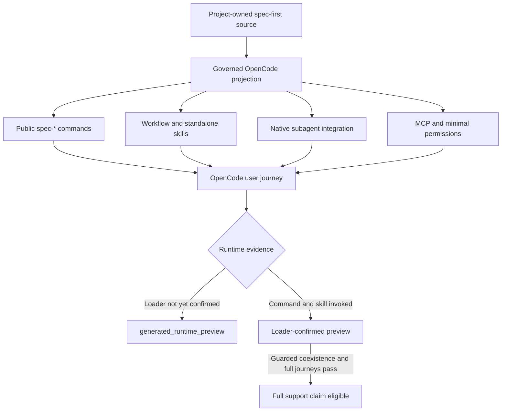
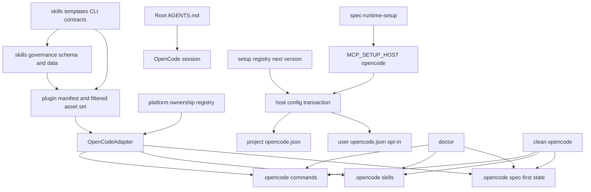
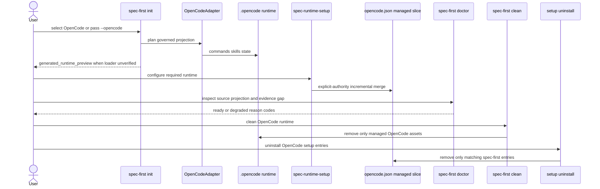
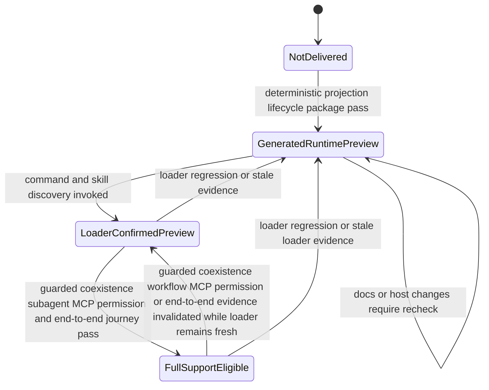

# OpenCode Host Support - Plan

## Goal Capsule

- **Objective:** 将 OpenCode 纳入 spec-first 的正式宿主扩展体系，使社区用户能通过 `spec-first init` 选择并安装独立、可治理、可检查、可升级、可清理的 OpenCode runtime。
- **Recommended approach:** `extend + compose`。新增薄的 `OpenCodeAdapter`，扩展现有 host registry、governance、CLI lifecycle 与 Runtime Setup；复用项目 `AGENTS.md`、skills source、原子 host-config transaction 和现有 preview 证据分级，不创建第二套工作流、权限引擎或通用 agent runtime。
- **Decision focus:** OpenCode 使用独立 `.opencode/**` commands/skills/state ownership；workflow 同时提供 `/spec-*` command 与 skill discovery；跨 compatibility roots 的同名 skill 必须显式隔离；helper prompt 保持 skill-local，subagent 执行使用 source-owned OpenCode `task` mapping；MCP/权限写入保持增量、可归属、可撤销并验证最终 effective config。
- **Verification focus:** 先证明 source→projection、governance、init/doctor/update/clean、配置合并与发布包；再用真实 OpenCode 证明 command、skill、subagent、MCP 和端到端 lifecycle。两层证据不得互相替代。
- **Largest risk / boundary:** 当前机器没有 OpenCode CLI，且同名 skill discovery、配置 precedence、permission defaults 与 loader 行为属于外部 advisory evidence；真实 command 与 skill 尚未调用确认时，最高发布口径为 `generated_runtime_preview`，取得 loader evidence 后可晋升 `LoaderConfirmedPreview`，guarded coexistence 与完整真实旅程继续阻断完整支持。
- **Stop conditions:** OpenCode 配置无法在不覆盖用户内容的前提下增量维护、共享 `AGENTS.md` clean ownership 未解决、治理/schema 只能部分迁移，或真实 loader 证据与计划假设冲突时，停止相应 mutation 或支持晋升。
- **Execution profile:** Deep、跨 CLI/adapter/governance/config/docs/tests 的 source-first 变更；generated runtime 只通过实现后的 `spec-first init --opencode` 在临时项目中产生。
- **Tail ownership:** `spec-work` 负责实现、简化、review、验证和 closeout；正式支持晋升由维护者基于独立 OpenCode 证据决定。

---

## Product Contract

### Summary

为 OpenCode 增加独立、可共存的完整宿主支持，覆盖安装选择、workflow 入口、Agent Skills、原生 subagent、MCP、权限与 runtime 生命周期。
功能可以在确定性投射完成后以 opt-in preview 交付，但正式完整支持声明必须等待真实 OpenCode 用户旅程证据。

### Problem Frame

spec-first 当前只注册 Claude Code、Codex、Cursor、Kiro 与 Qoder 五个宿主，社区中的 OpenCode 用户无法通过 `spec-first init` 选择自己的宿主，也无法获得受治理的安装、检查、升级与清理体验。
手工复制其他宿主 runtime 不能提供独立 ownership、配置合并、生命周期管理或可信的支持状态，且可能让 OpenCode 与 Codex 相互覆盖或误删资产。

### Key Decisions

- **完整功能、分阶段证据。** 首次交付覆盖完整产品能力；若缺少真实 OpenCode loader 与端到端验证，发布状态保持 `generated_runtime_preview`，不把文件生成等同于宿主可用。
- **独立宿主、共享 source。** OpenCode 复用 spec-first 的 project-owned source 与治理规则，但拥有独立 runtime 和生命周期，不复用 Codex 的生成目录作为 OpenCode ownership 边界。
- **Opt-in 安装。** OpenCode 出现在交互式宿主选择中并支持显式 flag，但首版不进入 `spec-first init -y` 的默认宿主集合。
- **采用宿主 primitive。** Workflow 内部辅助工作使用 OpenCode 原生 subagent 能力，并继续受当前用户显式 dispatch 授权约束；spec-first 不重建通用 agent runtime。
- **最小配置写入。** MCP 与权限采用可归属的增量合并，保留用户已有配置，不开启全局 auto-approve，也不在清理时删除非 spec-first 内容。

### Actors

- A1. **OpenCode 社区用户：** 希望在项目中选择 OpenCode，安装并运行完整的 spec-first workflow。
- A2. **项目维护者：** 维护跨宿主 source、支持状态、验证证据与发布口径。
- A3. **OpenCode runtime：** 负责发现命令和 skills、执行 agent/subagent、应用权限并连接 MCP。

### Host Delivery Shape

### Requirements

**Installation and lifecycle**

- R1. 交互式 `spec-first init` 必须把 OpenCode 显示为可选择的独立宿主。
- R2. CLI 必须支持显式 `--opencode` host selector，使非交互安装能够只选择 OpenCode 或将其与其他宿主组合选择。
- R3. OpenCode 首版必须保持 opt-in，不得自动进入无显式 host selector 的 `init -y` 默认安装集合。
- R4. OpenCode 与 Codex 及其他宿主必须能在同一项目中独立共存，任何单宿主安装、检查、升级或清理都不得覆盖或删除另一宿主的 runtime。
- R5. OpenCode 必须进入现有宿主生命周期，包括初始化、状态检查、升级刷新、清理、帮助信息与机器可读结果。

**Workflow and agent experience**

- R6. OpenCode 必须同时提供 `/spec-*` 原生命令入口与 Agent Skills 发现入口，并保持统一的公开 workflow 名称。
- R7. 所有受治理的公开 workflow、standalone skills 与 agent-facing internal skills 必须按其治理分类投射到 OpenCode，不得出现部分 governance record 缺少 OpenCode delivery 状态的中间态。
- R8. 依赖辅助研究、审查或验证角色的 workflow 必须使用 OpenCode 原生 subagent primitive，并在缺少用户 dispatch 授权时保持当前会话内的串行降级路径。
- R9. OpenCode 必须消费项目已有的 `AGENTS.md` 指令真相源，不得为同一项目治理复制第二份 project-owned 入口文档。

**MCP, permissions, and configuration ownership**

- R10. OpenCode MCP 必须默认支持项目级配置，并提供显式 opt-in 的用户级配置路径。
- R11. MCP 与权限写入必须保留用户已有配置，更新时只维护 spec-first 可证明归属的条目，清理时只移除这些条目。
- R12. 权限管理必须采用最小增量，只补足 spec-first workflow 所需能力，不得启用全局 auto-approve 或放宽无关工具权限。
- R13. OpenCode hooks 或 plugins 只有在现有 spec-first workflow 的确定性 gate、生命周期或证据闭环确实需要时才纳入，不以覆盖全部宿主扩展能力为目标。

**Evidence and release claims**

- R14. 完成确定性 runtime 投射、治理一致性、生命周期和发布包验证后，即使真实 OpenCode loader 不可用，也可以 opt-in `generated_runtime_preview` 状态交付。
- R15. 正式完整支持声明必须有真实 OpenCode 证据覆盖命令发现与调用、skill 发现与调用、至少一条 subagent-dependent workflow、MCP 连接，以及安装到清理的端到端用户旅程。
- R16. `doctor` 和用户可见文档必须区分 source/projection evidence、loader evidence 与 field outcome；缺失证据时必须给出明确 degraded 状态和修复或补证方向。
- R17. OpenCode runtime 必须保持 generated-runtime 身份；修复应修改 source、governance 或生成逻辑，再通过 `spec-first init` 重建，不得把生成目录提升为 source-of-truth。
- R18. OpenCode 支持必须同步所有受影响的宿主 registry、governance、runtime catalog、CLI 文案、README、contracts、tests、release/package 校验与 Changelog，避免形成“CLI 可选但下游消费者未知”的部分支持状态。

### Key Flows

- F1. **交互式安装**
  - **Trigger:** A1 在交互式终端运行 `spec-first init`。
  - **Actors:** A1, A3
  - **Steps:** 安装器展示 OpenCode；用户选择 OpenCode；系统预览并写入受治理 runtime；输出安装状态与证据等级。
  - **Outcome:** OpenCode 获得独立、可检查和可清理的完整 runtime。
  - **Covered by:** R1, R3, R5, R14, R16
- F2. **显式或多宿主安装**
  - **Trigger:** A1 使用 `--opencode`，并可同时选择其他宿主。
  - **Actors:** A1
  - **Steps:** CLI 解析选择；分别为每个宿主生成归属明确的 runtime；汇总每个宿主结果。
  - **Outcome:** OpenCode 与 Codex 等宿主共存且互不覆盖。
  - **Covered by:** R2, R4, R5
- F3. **运行 workflow**
  - **Trigger:** A1 在 OpenCode 中调用 `/spec-*` 或让 agent 加载对应 skill。
  - **Actors:** A1, A3
  - **Steps:** OpenCode 发现入口；workflow 加载 source-projected 内容；需要辅助角色时先检查用户 dispatch 授权，再调用原生 subagent 或串行降级。
  - **Outcome:** 用户能执行完整的 spec-first workflow，且授权和降级语义不因宿主变化而失真。
  - **Covered by:** R6, R7, R8, R9
- F4. **配置与清理**
  - **Trigger:** A1 通过 Runtime Setup 安装、刷新 OpenCode MCP/权限配置，或显式执行 `--uninstall-host-config`。
  - **Actors:** A1, A3
  - **Steps:** 系统识别已有用户配置；增量维护 spec-first 条目；检查配置状态；清理时删除可证明归属的内容。
  - **Outcome:** spec-first 能工作，用户自有配置保持不变。
  - **Covered by:** R10, R11, R12, R13
- F5. **支持状态晋升**
  - **Trigger:** A2 获得新的真实 OpenCode loader 或用户旅程证据。
  - **Actors:** A2, A3
  - **Steps:** 对照支持声明要求验证关键旅程；记录 evidence scope 与限制；更新支持状态和用户文档。
  - **Outcome:** 支持声明只晋升到证据直接覆盖的等级。
  - **Covered by:** R14, R15, R16

### Acceptance Examples

- AE1. **Covers R1, R3, R5.** Given 用户运行交互式 `spec-first init`, when 选择 OpenCode 且未选择其他宿主, then 只生成 OpenCode 管理的 runtime，并报告其支持状态。
- AE2. **Covers R2, R4.** Given 项目已安装 Codex, when 用户显式安装 OpenCode 并满足已验证的 external-skill collision guard, then 两个宿主均可用；随后清理 OpenCode 不改变 Codex runtime，也不删除仍被 Codex 使用的共享 `AGENTS.md` 管理块。
- AE3. **Covers R2, R3.** Given 用户执行非交互安装且显式选择 OpenCode, when CLI 应用选择, then OpenCode 被安装；未显式选择时，首版默认集合不自动加入 OpenCode。
- AE4. **Covers R6, R7, R8.** Given OpenCode 已发现 spec-first runtime, when 用户分别通过 `/spec-*` 和 skill 入口启动 workflow, then 两种入口都加载同一 source-owned 语义；需要 subagent 但未获授权时转为串行执行并披露降级。
- AE5. **Covers R10, R11, R12.** Given 项目或用户级 OpenCode 配置已含非 spec-first MCP 与权限规则：when 执行安装或刷新，then 原有配置保持不变，不会启用全局 auto-approve；危险工具没有显式用户规则时 resolved permission 为 `ask`，已有显式规则不被覆盖。When 显式执行 `--uninstall-host-config`，then 只移除 receipt 与 current value 同时证明归属的 managed entries，用户配置保持不变；卸载路径不对移除 managed permission 后的 resolved permission 作 `ask` 断言。
- AE6. **Covers R14, R16.** Given 确定性投射测试通过但当前环境没有 OpenCode CLI, when 用户安装或运行 `doctor`, then 系统报告 `generated_runtime_preview` 与 loader evidence 缺口，不声称正式完整支持。
- AE7. **Covers R15.** Given 真实 OpenCode 环境完成命令、skill、subagent、MCP 和 lifecycle 用户旅程, when 维护者评估发布状态, then 只有被证据直接覆盖的支持声明可以晋升。
- AE8. **Covers R17, R18.** Given OpenCode runtime 出现 drift, when 维护者修复问题, then 修改 source 或生成逻辑并重新生成，同时所有 registry、governance、docs 与 tests 保持一致。

### Success Criteria

- 社区用户能够从交互式安装器选择 OpenCode，也能通过显式 host selector 完成可重复的非交互安装。
- OpenCode 安装产物覆盖全部受治理的公开 workflow 与 skills，并提供原生命令、subagent、MCP 和最小权限体验。
- OpenCode 与现有宿主共存，`doctor`、升级与 `clean` 均遵守 ownership，不产生跨宿主覆盖或用户配置丢失。
- 所有确定性 source、governance、projection、package 与 lifecycle 检查通过后，首版可以带明确限制发布为 preview。
- 只有真实 OpenCode loader 与端到端用户旅程通过后，README、runtime catalog 与发布文案才可声明完整支持。

### Scope Boundaries

- 首版不把 OpenCode 加入无显式 host selector 的 `init -y` 默认集合。
- 不把 Codex 的 `.agents/skills/**` runtime 当作 OpenCode 的共享 ownership 边界。
- 不依赖 OpenCode 对 `.opencode/skills`、`.agents/skills` 与 `.claude/skills` 同名 skill 的未承诺加载顺序；collision 未被显式隔离或证明安全时保持 action-required，不静默选择任一副本。
- 不复制或替代 OpenCode 的通用 agent、权限、插件和工具运行时。
- 不为 helper personas 生成额外的 OpenCode custom agent 用户入口；helper prompt 继续由 owning skill-local references 持有。
- 不为与现有 spec-first workflow 无关的 OpenCode 插件能力追求表面 feature parity。
- 不把官方文档、文件投射或 self-check 单独当作真实 loader 和 field outcome 证据。
- 不把 OpenCode 纳入 user-level language sync；项目级语言与治理继续通过 root `AGENTS.md` 生效。
- 不改写历史计划、审查或验证文档中的“五宿主”快照；只更新当前 source、活跃 contracts、tests 和用户文档。

#### Deferred to Follow-Up Work

- `opencode.jsonc` 的注释保真 mutation。首版 canonical writer 只维护严格 JSON 的 `opencode.json`；检测到仅有 JSONC 或无法无损解析的高优先级配置时 fail closed，并给出 unblock direction。
- OpenCode hooks/plugins。只有真实运行证明某个确定性 exit gate 无法由现有 CLI、skill contract 或 MCP setup 承载时，才单独规划。
- 把重复的 supported-host 常量重构为单一跨模块 schema。当前变更只在既有 owner 中原子扩展，避免借新增宿主进行无关架构重写。
- 跨宿主 MCP package pinning 与 integrity policy。当前 required MCP definitions 包含 `@latest`，这是既有共享 Runtime Setup 风险；本功能只要求 evidence 记录实际解析的 package/version/registry/integrity 并把 resolution 变化视为证据失效，不在 OpenCode host slice 中单独改变所有宿主的 dependency policy。

### Dependencies / Assumptions

- 社区需求目前是定性信号；尚无 Issue 链接、用户规模或失败日志，不据此推断采用量或优先级强度。
- OpenCode 官方文档在 2026-07-27 显示其支持 `AGENTS.md`、Agent Skills、project commands、primary agents/subagents、MCP、permissions 与 plugins；这些是 external advisory evidence，implementation 与 verification 必须继续回源。
- 当前机器没有可调用的 OpenCode CLI，因此无法在本次 planning 中验证 loader、命令、skill、subagent、MCP 或完整用户旅程。
- OpenCode 官方配置格式、发现路径、permission 语义或 subagent 行为变化时，相关实现选择与支持状态必须重新评估。
- OpenCode 当前 source 显示 project-local `.opencode/skills`、`.agents/skills` 与 `.claude/skills` 会共同参与发现，同名记录只告警并由后完成加载的记录覆盖；实现不得把这一并发加载顺序当作稳定 precedence contract。

### Outstanding Questions

**Resolve Before Implementation:** 无。

**Deferred to Implementation / Verification:**

- 实现开始时重新读取 OpenCode 官方 command、skill、MCP 与 permission 文档，确认最小 frontmatter、配置容器与 namespaced permission pattern；若当前文档与本计划语义冲突，先更新计划或记录有证据的 deviation。
- 确认目标 OpenCode 版本仍支持 `OPENCODE_DISABLE_EXTERNAL_SKILLS`、仍共同发现 `.opencode/skills`/`.agents/skills`/`.claude/skills`，并复核 duplicate resolution；任一行为变化都使首版 collision guard 失效并阻断实现继续沿用 KTD1。
- 真实 OpenCode 是否提供非交互 loader/配置检查命令；若没有，使用可重复的交互用户旅程并保留版本、输入、输出与 limitations。
- 确认 `opencode debug config` 是否能在不初始化 project plugins、启动 MCP 或访问网络的模式下运行；若无法证明诊断无额外副作用，不自动执行该命令，改用显式用户授权的真实旅程并保持 `opencode_effective_config_unverified`。
- `opencode.jsonc` 与 `opencode.json` 的实际优先级只用于 collision 诊断和后续 JSONC 支持，不扩大首版 writer scope。

### Sources / Research

- `src/cli/adapters/index.js`、`src/cli/adapters/base.js`、`src/cli/adapters/platform-registry.js` — 当前 adapter、projection 与 runtime ownership 扩展点；observed at repository commit `2c89c5a18eaf85998dbf80fd98bf2d27d7f263fc`。
- `src/cli/adapters/qoder.js`、`src/cli/adapters/cursor.js` — command+skill host 与 generated-preview host 的相邻实现；只复用当前仍成立的 pattern。
- `src/cli/commands/init-args.js`、`src/cli/commands/init.js`、`src/cli/commands/init-output.js`、`src/cli/commands/doctor.js`、`src/cli/commands/clean.js`、`src/cli/commands/update.js` — host selector 与 lifecycle consumers。
- `src/cli/plugin-manifest.js`、`src/cli/plugin-governance.js`、`src/cli/contracts/dual-host-governance/skills-governance.json` — source/governance 到 runtime asset set 的投射链。
- `skills/spec-runtime-setup/setup-registry.json`、`skills/spec-runtime-setup/setup-registry.schema.json`、`skills/spec-runtime-setup/scripts/lib/host-authority.cjs`、`skills/spec-runtime-setup/scripts/lib/host-config.cjs` — MCP/config mutation 的 canonical registry、authority 与 transaction owner。
- `docs/solutions/workflow-issues/runtime-setup-host-authority-and-script-owned-facts-2026-07-04.md` — 新宿主必须使用显式 `MCP_SETUP_HOST`，setup facts/config mutation 必须 script-owned。
- `docs/solutions/workflow-issues/host-entrypoint-mapping-source-boundary-2026-04-29.md`、`docs/solutions/conventions/skill-publication-command-surface-alignment-2026-06-23.md`、`docs/solutions/workflow-issues/modify-source-not-artifacts-2026-04-13.md` — 入口映射集中、governance/command/runtime 同步与 source-first 约束。
- `docs/plans/2026-07-04-001-feat-qoder-host-support-plan.md`、`docs/plans/2026-07-04-002-feat-cursor-host-support-plan.md` — 历史宿主扩展计划；作为模式参考，不覆盖当前 source。
- [OpenCode Rules](https://opencode.ai/docs/rules/)、[Agent Skills](https://opencode.ai/docs/skills/)、[Commands](https://opencode.ai/docs/commands/)、[Agents](https://opencode.ai/docs/agents/)、[MCP Servers](https://opencode.ai/docs/mcp-servers/)、[Permissions](https://opencode.ai/docs/permissions/)、[Plugins](https://opencode.ai/docs/plugins/) — 官方 `anomalyco/opencode` `dev` 文档，observed 2026-07-27；重要行为仍需真实 runtime 证明。
- [`packages/opencode/src/skill/index.ts`](https://github.com/anomalyco/opencode/blob/dev/packages/opencode/src/skill/index.ts)、[`packages/opencode/src/effect/runtime-flags.ts`](https://github.com/anomalyco/opencode/blob/dev/packages/opencode/src/effect/runtime-flags.ts) — OpenCode `dev@7534d23551f665e65080809975b4ca5c7d63807b` source，observed 2026-07-27；确认 compatibility skill roots、duplicate warning/overwrite 行为与 `OPENCODE_DISABLE_EXTERNAL_SKILLS` guard，仍需目标版本真实旅程复核。

---

## Planning Contract

### Product Contract Preservation

Product Contract unchanged except AE2 clarifies the already-required shared `AGENTS.md` coexistence outcome and external-skill collision guard, AE5 clarifies the already-required minimal permission outcome against OpenCode permissive defaults, and Scope Boundaries make previously implied non-goals explicit；R1-R18、A1-A3、F1-F5 与其他 Acceptance Examples 保持原意。

### Architecture Posture

- **Posture:** `extend + compose / thin-glue`。
- **Extend:** `PlatformAdapter`、adapter registry、skills governance、init/doctor/update/clean、platform ownership registry 和 Runtime Setup registry 已拥有相应边界，OpenCode 以新 host record 与 host-specific transform 扩展这些 owner。
- **Compose:** OpenCode adapter 只负责 path/frontmatter/runtime-identity translation；plugin sync 继续拥有 asset projection，governance 继续拥有 delivery truth，Runtime Setup 继续拥有 host authority、配置事务和 facts。
- **Thin-glue boundary:** OpenCode-specific glue 只拥有 host representation translation、preview diagnostics 和配置 shape mapping；不复制 workflow 语义、权限策略引擎、状态模型或 provider logic。
- **Rejected new boundary:** 不创建 `OpenCodeRuntimeManager`、独立 installer 或第二份 command/skill catalog；现有 owner 能在不混合职责的前提下吸收变化。
- **Source of truth:** `skills/`、`templates/`、`src/cli/`、`skills/spec-runtime-setup/`、contracts 与 docs；`.opencode/**` 和目标项目 `opencode.json` 中的 managed slice 都是可重建 runtime/config output，不反向成为 source。

### Key Technical Decisions

- KTD1. **OpenCode runtime 独立投射并显式隔离 compatibility skill collision。** Commands 使用 `.opencode/commands/spec-*.md`，workflow/standalone/internal skills 使用 `.opencode/skills/<skill>/`，state 使用 `.opencode/spec-first/state.json`；不共享 `.agents/skills`，避免 Codex/OpenCode 安装和 clean ownership 耦合。由于 OpenCode 也会发现 `.agents/skills` 与 `.claude/skills`，adapter/doctor 必须检查与 managed OpenCode skills 同名的 compatibility copies；不得依赖当前并发加载的 last-writer 行为。collision 存在且无法证明被隔离时，安装保持 preview、doctor 返回 `opencode_external_skill_collision` 与 action-required；首版明确的用户侧 unblock 是以 `OPENCODE_DISABLE_EXTERNAL_SKILLS=1` 启动 OpenCode，spec-first 只检测和提示，不写全局环境。该 guard 会对当前 OpenCode 进程禁用全部 `.agents`/`.claude` compatibility skills，不只禁用 spec-first，README/doctor 必须披露此影响并确认用户需要的 skill 已存在于 `.opencode/skills` 或其他 OpenCode-native path。真实 loader 必须覆盖 guarded Codex+OpenCode coexistence 后才能晋升支持声明。
- KTD2. **双入口共享同一 source。** `workflow_command` 在 OpenCode governance 中标记为 `command`，现有 filtered asset semantics 同时投射 command 与 backing workflow skill；standalone 为 `skill`，agent-facing internal 为 `internal`。两种入口不得维护不同 workflow body。
- KTD3. **原生 subagent，source-owned dispatch mapping，不生成 custom helper agents。** OpenCode adapter 首版 `supportsAgents=false`；该 adapter 字段只表示“不投射 bundled/custom agent profiles”，不得被解释为 OpenCode runtime 不支持 subagent，也不得作为 dispatch readiness fact。所有明确依赖 helper 的 project-owned skill source 必须把 OpenCode `task` tool 加入与 Claude `Agent`/Codex `spawn_agent` 同层的 host dispatch mapping，继续由 workflow 判断用户授权、capacity、isolation 与 inline fallback；adapter 只做 representation translation，不在投射时猜测或注入 workflow 语义。正式支持证据必须覆盖一条使用当前 source mapping 的 subagent-dependent workflow。
- KTD4. **`AGENTS.md` 是共享 project instruction，clean 使用三态 consumer 判定。** OpenCode 不生成 pointer/rule 文件。其他消费同一 `instructionFile` 的 adapter 只有三种互斥状态：存在有效且兼容的 managed state，且没有与其声明 runtime 相矛盾的证据时为 `present`；state 与该 adapter 的全部精确 managed assets 都不存在时为 `confirmed_absent`；缺少有效 state 但仍有精确 managed assets、state 损坏/版本不可读、state/runtime 矛盾或读取失败时为 `uncertain`。asset-only residue 不得归为 `present`。`clean --opencode` 只有在所有其他消费者均为 `confirmed_absent` 时才移除 root `AGENTS.md` managed block；任一 `present` 或 `uncertain` 都保留 block，后者返回 action-required。单宿主 clean 不得破坏其他宿主入口，也不得让从未安装的宿主永久阻断最后清理。
- KTD5. **Runtime clean 与配置 uninstall 分权，配置 ownership 由版本化 receipt 证明。** `spec-first clean --opencode` 只删除 managed OpenCode commands/skills/state，并按 KTD4 判断共享 `AGENTS.md`；`spec-runtime-setup --uninstall-host-config` 只处理配置。每次成功写入由 per-host readiness ledger 中的 `managed_config_receipts` 记录；为保持现有 host-ledger v2 的 additive compatibility，顶层 schema 不因本功能升级，嵌套 collection 使用 `{ schema_version: 'managed-config-receipts.v1', entries: [...] }` 独立版本。identity 至少包含 host、scope、canonical config path、container 与 entry key，receipt 还保存 normalized value SHA-256、spec-first version 和写入时间；normalized value 固定为递归排序 object keys、保留 array 顺序和 JSON primitive 值的无空白 UTF-8 canonical JSON，再计算 SHA-256。collection 按 canonical target identity 合并，不能因另一个项目运行 setup 而覆盖无关 receipt。collection 缺失按“无 ownership receipt”处理，损坏或版本不兼容不得被静默重置。跨项目并发 mutation 使用 per-host receipt-ledger lock 覆盖 read→merge→config mutation→receipt commit/rollback，统一按 receipt-ledger lock 后 config lock 的顺序取锁，禁止无锁 read-modify-write。任一锁获取失败或 replace 前 ownership check 失败都必须零 mutation；replace 后失锁时只可在仍持有对应锁的边界内自动回滚，无法安全恢复时保留 owner-private backup/evidence、返回 `manual-required` 且绝不声称 commit 成功。只有当前 run 实际创建条目，或已有 receipt identity 与 current normalized hash 同时匹配、证明 ownership 未被用户改写时，setup 才能更新条目并创建/刷新 receipt；预先存在但值相同且无 receipt 的用户条目保持不变且不得被认领。Setup 在配置写入后提交 receipt，receipt 写失败必须在两把锁仍受本事务持有时恢复配置；uninstall 同样要求 receipt identity 与 current normalized hash 匹配，删除配置后再删除 receipt，receipt 删除失败必须在锁内恢复配置。receipt 缺失、损坏、版本不兼容或 hash 不匹配一律 fail closed 并保留用户内容。
- KTD6. **MCP 配置 project-first、user-scope 显式授权、effective config 单独验证。** OpenCode project target 为 `opencode.json`，user target 为 `$HOME/.config/opencode/opencode.json`，后者必须通过 `--user-scope`。`MCP_SETUP_HOST=opencode` 是 mutation authority；runtime dirs、PATH 和旧 facts 只能是 advisory candidates。写入后正确不等于最终生效：实现必须识别 remote/global/custom/project/inline/managed precedence。调用 `opencode debug config` 前必须将 candidate 解析为绝对 realpath，确认是 target repo/workspace 与 generated runtime 之外的普通可执行文件，记录 source、path 与 version/provenance，并通过无 shell argv、超时和输出上限执行；project-local、symlink 回项目、ambiguous 或 provenance 不完整的 candidate 不得执行，只报告 `opencode_effective_config_unverified`。命令自身可能初始化 plugin/MCP/网络且无法安全关闭时同样不自动执行，不得晋升安全或 loader readiness。
- KTD7. **配置 shape 由 registry 声明，不按 host 名字散落分支。** 扩展 host-config contract，使 JSON container、server representation 与可归属 permission entries 由 `setup-registry` 描述；现有 hosts 保持默认 `mcpServers`/string-command 行为，OpenCode 使用官方 `mcp` representation。
- KTD8. **权限最小化并建立显式 ask 地板。** OpenCode 当前未配置时多数权限默认为 `allow`，因此不能把“未写 global allow”等同于安全。registry 只维护两类可比较、可撤销条目：以 `spec-*` 命名空间归属的 skill permission，以及用户未显式决定时 `bash`、`edit`、`task`、`webfetch`、`websearch` 的 `ask` 基线。已有 deny/allow 或更高优先级规则不覆盖；resolved config 仍为 permissive default 时 action-required 并阻断正式支持晋升。禁止写 wildcard/global allow，无法证明安全归属时宁可不写。
- KTD9. **严格 JSON writer，JSONC 只读并按实际 precedence fail closed。** 首版原子事务只修改 `opencode.json`，永不改写 `opencode.jsonc` 或 comment-bearing content。只有 JSONC 是唯一有效配置、实际 higher-precedence target，或其存在使 resolved target 无法证明时才阻断严格 JSON mutation；其他共存场景保持 JSONC byte-stable，输出 advisory collision fact，不把“发现 JSONC”本身等同于 blocking failure。
- KTD10. **治理与 registry 原子升级。** `skills-governance` 从 schemaVersion 1 升级，`setup-registry.v8` 升级到下一版本；schema、data、parser constants、generated projections、catalog 和 tests 必须在同一实现 slice 中同步，任何 partial key set 都是 blocking failure。
- KTD11. **复用现有 evidence vocabulary。** OpenCode 初始状态为 `generated_runtime_preview`；`doctor` 提供 `opencode_generated_runtime_loader_unverified` 等 degraded/non-drift reason code。正式支持晋升沿用 projection→loader→workflow/field 的证据层级，不创建第二套状态机。
- KTD12. **Hooks/plugins 不进入首版。** 没有证据证明它们是 command/skill/subagent/MCP 生命周期或确定性 exit gate 的必要条件；先用现有 CLI、skill contract 与 Runtime Setup 交付高价值路径。

### High-Level Technical Design

#### Component topology

#### Lifecycle and ownership sequence

#### Support-state promotion

#### Host-selection matrix

| Invocation mode | OpenCode selection | Expected result |
|---|---|---|
| Interactive `init` | User checks OpenCode | OpenCode is included in preview and apply plan |
| `init -y` without host flags | Not selected | Existing default hosts remain unchanged |
| `init --opencode -y` | Explicit | Only OpenCode is initialized unless other flags are present |
| `init --codex --opencode -y` | Explicit multi-host | Independent runtime/state are generated; shared `AGENTS.md` remains coherent |
| `update` with OpenCode state present | Auto-detected from managed state | Refresh args include `--opencode` |
| `doctor` without flags | Valid managed state or exact registry-declared managed asset candidate | Valid state enters normal inspection；asset-only enters orphan/degraded inspection；unknown `.opencode/**` or `opencode.json` never triggers detection |

### Interface Contracts

| Interface / mode | Consumers | Canonical artifact | Contract summary | Compatibility / rollback | Verification owner |
|---|---|---|---|---|---|
| CLI host selector / evolution | Users, init, doctor, clean, update, help/smoke | `src/cli/commands/init-args.js` plus adapter registry | Additive `--opencode`; opt-in default; explicit flags compose | Existing flags/defaults unchanged; remove selector and adapter to roll back preview | CLI parser/unit/smoke/integration tests |
| Skills governance / evolution | plugin manifest, filtered asset set, catalog, all governed skills | `src/cli/contracts/dual-host-governance/skills-governance.schema.json` and `.json` | Every record requires `host_delivery.opencode`; workflow=`command`, standalone=`skill`, eligible internal=`internal` | Versioned atomic migration; old partial documents rejected | schema validation and `tests/unit/plugin-modules.test.js` |
| Runtime ownership / evolution | path rewrite, gitignore/context policy, doctor/clean | `src/cli/adapters/platform-registry.js` | Declares generated `.opencode` surfaces and mixed-ownership `opencode.json`; no blanket root ownership | Additive host record; rollback removes only its declared surfaces | registry pattern and ownership tests |
| Runtime Setup registry / evolution | setup parser, facts, config resolver, generated skills | `skills/spec-runtime-setup/setup-registry.json` and schema | Canonical host `opencode`, project/user targets, JSON container/server shape, optional namespaced permission entries | Bump registry version; previous hosts retain equivalent effective config | registry/schema/node contract tests |
| OpenCode project config / greenfield managed slice | OpenCode runtime and Runtime Setup | Target project `opencode.json`; source owner remains setup registry/scripts | Incremental `mcp` entry、namespaced skill permission、unset-only dangerous-tool `ask` baseline；版本化 `managed_config_receipts` 证明 ownership；strict JSON target 与 resolved-config verification 分层 | Preserve unknown keys；uninstall 需要 receipt identity + current normalized hash；receipt/config 任一提交失败恢复另一侧；JSONC 只读并按实际 precedence 决定 blocking | `host-config.cjs` transaction、`facts.cjs` receipt collection、args/mode、precedence fixtures plus real OpenCode MCP/permission journey |
| Shared project instructions / evolution | Codex, Cursor, Kiro, Qoder, OpenCode | Root `AGENTS.md` managed block; producer in CLI instruction bootstrap | One shared project instruction, multiple host states; clean uses remaining-host ownership | Last-consumer removal only; single-host clean preserves shared block | multi-host clean integration tests |

### Evidence & Limitations

- **Direct source:** Current extension points and hard-coded consumers were re-read at commit `2c89c5a18eaf85998dbf80fd98bf2d27d7f263fc`; CodeGraph was used as advisory orientation, and load-bearing conclusions were confirmed by direct source reads.
- **Historical learnings:** Runtime Setup host-authority, source/runtime, entrypoint and skill-publication learnings shape KTD2、KTD5、KTD6、KTD10 and the verification ladder; they remain advisory where current source differs.
- **External evidence:** OpenCode official docs and `dev` source observed 2026-07-27 shape paths、permission defaults、config precedence、compatibility skill discovery 与 runtime flags, but do not prove the target OpenCode version loads spec-first output. Implementation must re-open them before writing host-specific transforms.
- **Runtime limitation:** `command -v opencode` is unavailable on this machine, so loader/subagent/MCP/field evidence is not available in planning；当前 shared Runtime Setup 的部分 required MCP command 仍解析 `@latest`，因此未来 evidence 必须记录实际 package/version/registry/integrity，resolution 变化会使对应 MCP evidence 失效。
- **Dispatch evidence:** 初始 planning 没有 subagent authorization，研究与 flow analysis 使用 inline fallback；2026-07-27 后续 `spec-doc-review` 获得用户明确多-agent 授权并完成 coherence、feasibility、security 三路审查，本次 producer revision 仍需用 headless review 复核修订结果。
- **Worktree baseline:** 本次 producer revision 从 `leo-2026-07-27-opencode` clean worktree 开始，write set 仅包含 `CHANGELOG.md` 与本计划文件；实施与验证仍必须排除未来并发改动，不把未提交内容当作 OpenCode 证据。

### Sequencing

1. U1 establishes the adapter transform/runtime ownership shape without claiming governed projection completeness.
2. U3 adds the matching governance/schema/catalog and completes the first atomic foundation wave with U1；U1/U3 之间不得发布、提交 partial host support 或运行 packaged init claim。
3. U2 adds public CLI lifecycle and fixes shared `AGENTS.md` clean ownership only after U1+U3 can produce a valid governed asset set.
4. U4 extends Runtime Setup configuration, provider integration and permission ownership using the registered host.
5. U5 aligns source/runtime policy, user docs, package and release claims.
6. U6 proves packaged preview behavior, then records real OpenCode promotion evidence when the runtime is available.

---

## Implementation Units

### U1. OpenCode Adapter、Projection 与 Runtime Ownership

- **Goal:** 建立 OpenCode 独立 runtime 的唯一 adapter/source owner，投射 command+skill 双入口、state 和 preview diagnostics，不生成 custom helper agents。
- **Requirements:** R4, R6-R9, R14, R16-R18; F2-F3; AE2, AE4, AE6, AE8
- **Dependencies:** None
- **Files:**
  - Create: `src/cli/adapters/opencode.js`
  - Modify: `src/cli/adapters/index.js`
  - Modify: `src/cli/adapters/platform-registry.js`
  - Modify: `src/cli/adapters/host-comparative-config-paths.js`
  - Modify: `skills/using-spec-first/references/conditional-routing-boundaries.md`
  - Modify: `skills/spec-brainstorm/SKILL.md`
  - Modify: `skills/spec-brainstorm/references/model-tiers.md`
  - Modify: `skills/spec-code-review/SKILL.md`
  - Modify: `skills/spec-debug/SKILL.md`
  - Modify: `skills/spec-doc-review/SKILL.md`
  - Modify: `skills/spec-plan/SKILL.md`
  - Modify: `skills/spec-simplify-code/SKILL.md`
  - Modify: `skills/spec-sweep/references/model-tiers.md`
  - Modify: `tests/unit/host-runtime-projection-contracts.test.js`
  - Modify: `tests/unit/platform-registry-patterns.test.js`
  - Modify: `tests/unit/command-resource-path-rewrite.test.js`
  - Modify: `tests/unit/dispatch-authorization-matrix-contracts.test.js`
  - Create: `tests/unit/opencode-dispatch-contracts.test.js`
  - Create: `tests/unit/opencode-runtime-lifecycle.test.js`
- **Approach:**
  - 实现 `OpenCodeAdapter`：`hasCommands=true`、`supportsAgents=false`，commands=`.opencode/commands`、skills/workflows=`.opencode/skills`、state=`.opencode/spec-first/state.json`、instruction=`AGENTS.md`。`supportsAgents=false` 只抑制 bundled agent profile 投射；dispatch capability 由 workflow authorization、OpenCode primitive readiness 与真实 loader evidence 分别判断。
  - Command filename 使用统一 `spec-<command>.md`；command body 与 backing workflow skill 都从同一 governed source 生成，frontmatter 只保留 OpenCode 官方 loader 所需的最小字段。
  - Skill transform 复用 shared path rewrite、source-skill runtime path rewrite、runtime-setup host pin；OpenCode-specific code 不复制 workflow prose。
  - 对 source 中显式声明 Claude `Agent`、Codex `spawn_agent` 或其他 host dispatch mapping 的受治理 skill 做确定性 inventory；每个命中项必须在 owning source 中加入 OpenCode `task` mapping、同一份用户授权 gate、capacity/backpressure 处理和 inline/serial fallback。脚本只校验 owner/path 与 mapping completeness，fresh-source eval 判断语义是否等价。
  - Adapter/doctor 比较 `.opencode/skills/<name>` 与 OpenCode compatibility discovery roots 中的同名 skill；collision 不靠扫描或加载顺序消解。检测到 managed `.agents/skills`/`.claude/skills` 同名副本且当前进程未设置 `OPENCODE_DISABLE_EXTERNAL_SKILLS=1` 时返回 action-required，并保留独立 runtime 不做跨宿主删除或覆盖。
  - Adapter `inspectRuntimeFiles()` 校验 command/skill frontmatter、非 OpenCode runtime path residue、unexpected agent assets，并始终在缺少真实 loader 证据时输出 degraded/non-drift preview warning。
  - Platform registry 精确声明 generated command/skill/state surfaces 与 mixed-ownership `opencode.json`；未知 `.opencode/**` 保持 host/user-owned。
- **Patterns to follow:** `src/cli/adapters/qoder.js` 的 command+skill transform、`src/cli/adapters/cursor.js` 的 preview warning、`src/cli/adapters/platform-registry.js` 的 ownership declaration。
- **Test scenarios:**
  1. Covers AE4. 给定由治理层准备好的 workflow command 与 backing skill asset input，adapter 同时渲染 `/spec-*` command file 和同名 workflow skill，两个 body 都来自同一 source，且公开名称保持 `spec-*`；真实 governance selection 在 U3 验证。
  2. 给定已分类的 standalone/internal asset input，OpenCode 只投射输入中允许的 skill package 到 `.opencode/skills`，adapter 不因 `spec-` 前缀自行猜测 entry surface。
  3. 给定 source package 中的 skill-local helper prompt，projection 保留 references/scripts 且排除 evals/maintainer-only files；`.opencode/agents` 不产生 custom agent profiles，且 `supportsAgents=false` 不会被输出为“OpenCode 不支持 subagent”的 capability 结论。
  4. 给定 `spec-runtime-setup`，projected command 与 skill 都携带 `MCP_SETUP_HOST=opencode`、entrypoint authority 和 script-owned config/facts 约束。
  5. 给定其他宿主 runtime path 和 host-comparative config mapping，OpenCode transform 重写前者但保留后者，不留下 `.claude/.codex/.cursor/.kiro/.qoder` 误引用。
  6. Covers AE6. 给定完整 generated runtime 但无 loader evidence，doctor-facing adapter check 返回 `opencode_generated_runtime_loader_unverified`、`degradedByDesign=true`、`drift=false`。
  7. 给定 user-owned `.opencode/plugins`、`.opencode/agents/custom.md` 或其他未知文件，inspection/removal plan 不把它们纳入 managed assets。
  8. 所有 source-owned subagent dispatch mappings 都显式覆盖 OpenCode `task`；缺少 mapping 的受治理 skill 使 contract test 失败，且无 dispatch authorization/primitive 时仍返回既有降级 reason。
  9. Codex/Claude compatibility skill root 存在同名 `spec-*` skill 时，未启用 collision guard 的 doctor/inspection 返回 `opencode_external_skill_collision`；设置 `OPENCODE_DISABLE_EXTERNAL_SKILLS=1` 后只把 guard 视为 readiness candidate，真实 loader journey 再确认生效。
- **Verification:** Adapter transform、projection plan、frontmatter/path validation 和 ownership patterns 能由 unit tests 确定性证明；governed filtered asset set 与 supported-host completeness 由依赖 U1 的 U3 关闭，不从任一 source test 推断真实 OpenCode loader 可用。

### U2. Host Selection、Lifecycle 与 Shared Instruction Ownership

- **Goal:** 将 `--opencode` 接入交互/非交互 init、doctor、update、clean、workspace 与帮助输出，并确保单宿主 clean 不破坏其他 AGENTS-based hosts。
- **Requirements:** R1-R5, R9, R14, R16; F1-F2; AE1-AE3, AE6
- **Dependencies:** U1, U3
- **Files:**
  - Modify: `src/cli/commands/init-args.js`
  - Modify: `src/cli/commands/init-input.js`
  - Modify: `src/cli/commands/init.js`
  - Modify: `src/cli/commands/init-output.js`
  - Modify: `src/cli/commands/init-workspace.js`
  - Modify: `src/cli/commands/doctor.js`
  - Modify: `src/cli/commands/clean.js`
  - Modify: `src/cli/commands/update.js`
  - Modify: `src/cli/index.js`
  - Modify: `tests/unit/init-module-split.test.js`
  - Modify: `tests/unit/init-preview.test.js`
  - Modify: `tests/unit/doctor-platform-cli.test.js`
  - Modify: `tests/unit/doctor-runtime-assets.test.js`
  - Modify: `tests/unit/managed-removal-ownership.test.js`
  - Modify: `tests/unit/update-command-spawn.test.js`
  - Rename: `tests/integration/init-five-host-lifecycle.integration.test.js` → `tests/integration/init-supported-host-lifecycle.integration.test.js`
- **Approach:**
  - 在 `INIT_PLATFORM_CHOICES` 增加 OpenCode，`defaultForYes=false`；所有 host labels/help/next-step 文案统一包含显式 `--opencode`，默认集合保持 Claude+Codex。
  - `doctor --opencode` 始终检查 OpenCode；无 flag auto-detection 只接受有效 managed state 或 registry 精确声明的 managed asset candidate。有效 state 进入正常检查；asset-only 进入 `opencode_orphaned_managed_runtime` degraded 检查，不得报告 ready；root `opencode.json`、未知 `.opencode/**`、plugins 或 custom agents 不触发检测。
  - `update` 继续从 adapter state 动态构建 refresh flags；OpenCode state 存在时加入 `--opencode`。
  - `clean --opencode` 使用 state ledger 与 adapter removal plan 删除 managed commands/skills/state；只有其他共享 instruction consumers 均 confirmed absent 时才额外删除 root `AGENTS.md` managed block。配置 entry 由 Runtime Setup `--uninstall-host-config` 持有。
  - 清理共享 instruction 前按 KTD4 对所有消费同一 `instructionFile` 的 adapter 做互斥三态判定。有效且兼容的 state 存在、其声明 runtime 无矛盾时是 `present`；state 与精确 managed assets 都不存在时是 `confirmed_absent`；缺少有效 state 但仍有精确 managed assets、state 损坏/旧版本、state/runtime 矛盾或读取失败时是 `uncertain`，asset-only residue 明确落入该状态。只有其他 consumer 全部 confirmed absent 时移除 block；uncertain 保留 block、不中断当前宿主 runtime 清理并输出 action-required reason code。
  - `hasAnyManagedState`、preview aggregation 和 workspace skip roots 应使用 adapter registry 或显式加入 OpenCode，避免 banner、child discovery 和 summary 漏宿主。
  - 顶层 `spec-first --help`、子命令 help、非 TTY guidance 和 machine-readable usage 共用 supported-host truth；`src/cli/index.js` 不再保留漏掉 OpenCode 的手写五宿主文案。
- **Execution note:** 先补 characterization tests 锁定现有五宿主默认和 clean 行为，再加入 OpenCode，防止新增 host 顺带改变旧 host lifecycle。
- **Patterns to follow:** `INIT_PLATFORM_CHOICES.defaultForYes`、`getSupportedPlatforms()` update detection、`planManagedAssetRemoval()`、现有 multi-host lifecycle integration。
- **Test scenarios:**
  1. Covers AE1. 交互选择只有 OpenCode 时，preview/apply 只包含 OpenCode runtime，输出 host label 与 preview support status。
  2. Covers AE3. `init -y` 无 host flag 时不安装 OpenCode；`init --opencode -y` 安装 OpenCode；未知或重复 flag 保持现有 parser semantics。
  3. Covers AE2. 同项目安装 Codex+OpenCode，deterministic inspection 证明未启用 guard 时 collision action-required、启用 guard 时只形成 readiness candidate；清理 OpenCode 后 Codex state/skills 与共享 `AGENTS.md` managed block byte-stable，最后清理 Codex 才移除共享 block。真实 guard、command 与 skill 调用仅由 U6 验证。
  4. 同项目安装 OpenCode+Qoder 后清理 Qoder 或 OpenCode，另一宿主 command/skill/state 不变，重新 init 仍幂等。
  5. `doctor --opencode --json` 输出 platform、asset checks、preview reason code；无 flag 时有效 OpenCode state 触发正常检查，只有精确 managed assets 时触发 orphan/degraded 检查，任意 user-owned OpenCode file 不触发。
  6. 只有 `opencode.json`、`.opencode/plugins` 或 user-owned `.opencode/agents/custom.md` 时，doctor 不把项目识别为 spec-first OpenCode install。
  7. OpenCode state 存在时 `update` refresh args 保留全部已安装宿主并包含 `--opencode`；无 OpenCode state 时不添加。
  8. Workspace parent/child discovery 不递归进入 `.opencode` runtime，summary index 能记录 `platform=opencode` 且不接受未知 host id。
  9. 顶层和子命令 CLI help、非 TTY guidance、dry-run 与 next steps 都显示 OpenCode opt-in，不暗示已取得 loader evidence。
  10. 其他 AGENTS-based host 的 state 与全部 managed assets 都不存在时判定 confirmed absent；state 缺失但仍有 managed assets、state 损坏或版本不兼容、state 与 runtime 证据矛盾时均判定 uncertain，`clean --opencode` 保留共享 managed block 并报告 ownership-uncertain/action-required；OpenCode 自有 runtime 仍按可证明 ownership 清理。
  11. OpenCode-only 项目中其他共享 instruction consumers 从未安装时，最后一次 `clean --opencode` 删除 root managed block；任一其他宿主只有精确 managed asset residue 而无有效 state 时判定 uncertain，保留 block 并报告对应 reason。
- **Verification:** CLI unit tests和 lifecycle integration 证明 opt-in、coexistence、idempotence、shared instruction ownership 与 machine-readable output；真实 host invocation 留给 U6。

### U3. Governance、Schema 与 Runtime Catalog 原子扩展

- **Goal:** 把 OpenCode 作为第六个 governed host 原子加入 manifest/filter/schema/data/catalog，确保所有 skill records 和下游 consumers 同步迁移。
- **Requirements:** R6-R7, R14, R16, R18; F3, F5; AE4, AE6-AE8
- **Dependencies:** U1
- **Files:**
  - Modify: `src/cli/plugin-manifest.js`
  - Modify: `src/cli/plugin-governance.js`
  - Modify: `src/cli/contracts/dual-host-governance/skills-governance.schema.json`
  - Modify: `src/cli/contracts/dual-host-governance/skills-governance.json`
  - Modify: `scripts/generate-runtime-capability-catalog.js`
  - Modify: `scripts/check-release-continuity.cjs`
  - Regenerate: `docs/catalog/runtime-capabilities.md`
  - Modify: `tests/unit/plugin-modules.test.js`
  - Modify: `tests/unit/host-runtime-projection-contracts.test.js`
  - Rename: `tests/integration/doc-review-five-host-projection.integration.test.js` → `tests/integration/doc-review-supported-host-projection.integration.test.js`
  - Rename: `tests/integration/workspace-graph-five-host-projection.integration.test.js` → `tests/integration/workspace-graph-supported-host-projection.integration.test.js`
- **Approach:**
  - U3 与 U1 属于同一个 atomic foundation wave：U1 提供 adapter/registry shape，U3 一次性补齐 `SUPPORTED_PLATFORM_IDS`、schema/data 和 consumers；任何只完成一侧的工作树都不得被验证或发布为可安装 OpenCode。
  - 将 governance schemaVersion 升级并把 `opencode` 加入 host enum、owner_host enum 和 `host_delivery` required properties；同一 patch 为每条 record 增加 delivery。
  - Workflow records 使用 `command`，standalone 使用 `skill`，internal records 沿用当前 delivery policy，不引入 OpenCode-only public workflow。
  - Manifest/governance validators 对缺 key、多 key、错误 delivery 和旧 schemaVersion fail closed；不能用 runtime fallback 补齐缺失 governance。
  - Catalog 增加 OpenCode delivery counts、runtime paths、MCP/permission boundary、preview status 与 promotion criteria，并继续声明 generated catalog 不是 source。
  - Active projection tests 从“固定五宿主”语义改为 `getSupportedPlatforms()`/supported-host 语义；历史 evidence 文档不重写。
- **Patterns to follow:** 当前 `skills-governance.schema.json` 的 `additionalProperties:false` 原子迁移、runtime catalog generator、release continuity stale-catalog gate。
- **Test scenarios:**
  1. 所有 governance records 恰好包含当前 supported host key set；缺少 `opencode` 或存在未知 host 都被 schema/validator 拒绝。
  2. Governance schemaVersion 旧值与 parser constant 不匹配时 fail closed；完整新版本可加载并生成 asset set。
  3. Covers AE4. OpenCode workflow asset set 同时包含 commands 与 workflow skills，standalone/internal delivery 与 record 分类一致。
  4. Catalog OpenCode counts 与 `buildFilteredAssetSet('opencode')` 一致，且 status 为 `generated_runtime_preview` 而非 full support。
  5. Release continuity 在 catalog 未重新生成、schema/data partial migration 或 package 漏 source 时失败。
  6. 所有通过 `getSupportedPlatforms()` 投射 skill-local references/scripts 的 active integration 自动覆盖 OpenCode，且仍排除 evals/maintainer-only files。
- **Verification:** Schema、manifest、filtered asset set、catalog freshness 和 supported-host projection tests 在同一 revision 通过；不得仅更新 JSON data 或文档。

### U4. Runtime Setup MCP、Permission 与 Host Authority

- **Goal:** 让 `spec-runtime-setup` 能以 OpenCode 明确 host authority 安全地检查、写入、验证和卸载 project/user MCP 及最小 permission entries。
- **Requirements:** R8, R10-R13, R15-R16; F3-F4; AE4-AE7
- **Dependencies:** U1, U3
- **Files:**
  - Modify: `skills/spec-runtime-setup/SKILL.md`
  - Modify: `skills/spec-runtime-setup/setup-registry.json`
  - Modify: `skills/spec-runtime-setup/setup-registry.schema.json`
  - Modify: `skills/spec-runtime-setup/references/supported-mcp-tools.md`
  - Modify: `skills/spec-runtime-setup/scripts/setup.cjs`
  - Modify: `skills/spec-runtime-setup/scripts/lib/args.cjs`
  - Modify: `skills/spec-runtime-setup/scripts/lib/mode-policy.cjs`
  - Modify: `skills/spec-runtime-setup/scripts/lib/registry.cjs`
  - Modify: `skills/spec-runtime-setup/scripts/lib/host-authority.cjs`
  - Modify: `skills/spec-runtime-setup/scripts/lib/host-config.cjs`
  - Modify: `skills/spec-runtime-setup/scripts/lib/configured-dependencies.cjs`
  - Modify: `skills/spec-runtime-setup/scripts/lib/facts.cjs`
  - Modify: `skills/spec-runtime-setup/scripts/lib/human-output.cjs`
  - Modify: `skills/spec-runtime-setup/scripts/lib/runtime-executor.cjs`
  - Modify: `skills/spec-runtime-setup/scripts/lib/workspace-routing-inject.cjs`
  - Modify: `skills/spec-runtime-setup/scripts/providers/graphify.cjs`
  - Modify: `tests/unit/mcp-setup-registry.test.js`
  - Modify: `tests/unit/mcp-setup-host-config.test.js`
  - Modify: `tests/unit/mcp-setup-node-contracts.test.js`
  - Modify: `tests/unit/mcp-setup-config-consumers.test.js`
  - Modify: `tests/unit/mcp-setup-facts-renderer.test.js`
  - Modify: `tests/unit/mcp-setup-providers.test.js`
  - Modify: `tests/unit/mcp-setup-workspace-routing-inject.test.js`
- **Approach:**
  - 将 setup registry 升级到下一 schema version，新增 canonical host `opencode`、project/user targets、OpenCode JSON container/server representation 和 permission managed-entry contract。
  - `host-config.cjs` 从 hard-coded `mcpServers` 扩展为 registry-declared JSON container；server normalization 支持 OpenCode 官方 representation，同时保持其他 hosts byte/semantic compatibility。
  - 项目默认 target 为 `opencode.json`；`--user-scope` 才允许 `$HOME/.config/opencode/opencode.json`。新增显式 `--uninstall-host-config` mode，沿用同一 host authority 与 scope gate。`facts.cjs` 在现有 host-ledger v2 中增加独立版本的 `managed-config-receipts.v1` collection，并提供 owner-checked receipt-ledger lock；持锁读取上一次 ledger 后按 canonical target identity 合并再写回，缺失 collection 是无 ownership，损坏/不兼容 collection 返回稳定 conflict，不覆盖为空。`host-config.cjs` 在同一 compensating transaction 内通过 receipt reader/writer callback 协调 config 与 receipt，固定先取 receipt-ledger lock、再取目标 config lock，直到 receipt commit 或双向 rollback 完成后逆序释放；setup 的 receipt 提交失败恢复 config，uninstall 的 receipt 删除失败恢复 config。所有 mutation 继续执行 containment、symlink、secret、lock、atomic replace、post-write verify 与 rollback。
  - Permission transaction 维护 namespaced skill entries，并在用户没有显式决定时为 `bash`、`edit`、`task`、`webfetch`、`websearch` 写入可比较、可撤销的 `ask` 基线；已有冲突或更高优先级规则返回 action-required，不覆盖，不写 wildcard/global allow。
  - 配置 resolver 把 remote、global、`OPENCODE_CONFIG`、project、`.opencode`/`OPENCODE_CONFIG_DIR`、`OPENCODE_CONFIG_CONTENT` 与 system/MDM managed config 作为完整 precedence facts。CLI candidate 只有在解析为 repo/workspace 外的绝对 realpath、确认普通可执行文件并记录 source/version/provenance 后，才可通过无 shell argv、超时和输出上限运行只读 `opencode debug config`；project-local/PATH shadow、symlink 回项目、ambiguous/provenance 不完整或诊断可能产生不可关闭的 plugin/MCP/network 副作用时不执行并保持 `opencode_effective_config_unverified`。不得把 target-file post-write verify 提升为 effective-config verified。
  - `opencode.jsonc` 永不写。只有它是唯一有效配置、实际 higher-precedence target，或导致 resolved target 无法证明时返回 blocking reason；与可安全写入的严格 JSON 共存但不生效时保持 byte-stable，并输出 advisory collision fact。
  - Facts/human output 分别记录 selected scope、config path、managed entry identifiers、receipt schema/identity/hash、loader/MCP evidence 与 limitations；不得序列化或回显完整用户配置、未知用户条目、literal secret 或解析失败的原始片段，敏感值只保留 redacted/reference-only 事实。LLM 不手改 facts/config。
- **Execution note:** 先为现有五宿主 host-config 行为补齐 compatibility tests，再扩展 registry-driven container/representation，避免 OpenCode shape 破坏 `mcpServers`/TOML writer。
- **Patterns to follow:** `host-authority.cjs` 的 explicit pin、`host-config.cjs` 的 transaction/rollback、runtime setup learning 中的 script-owned facts contract。
- **Test scenarios:**
  1. `MCP_SETUP_HOST=opencode` 授权 mutation；无 pin、错误 pin、runtime-dir/PATH candidate 或 stale facts 都不能授权写入。
  2. Covers AE5. 现有 `opencode.json` 包含未知 top-level、MCP 和 permission keys 时，upsert 只增加/更新 spec-first entries，其他内容语义不变。
  3. Project scope 是默认 target；请求 user scope 但未传 `--user-scope` 返回 `host-user-scope-not-authorized`，显式 opt-in 才写用户路径。
  4. 已有 conflicting spec-first MCP key、permission deny/allow 或 higher-precedence target 时 action-required，不覆盖用户决策。
  5. Literal secret、path escape、symlink target、lock contention、post-write verification failure 分别 fail closed，并在 fault injection 后恢复原始 bytes/mode。
  6. `--uninstall-host-config` 与普通 setup mode 冲突时 fail closed；project/user scope 分别需要现有显式 authority。Uninstall 只删除 receipt identity 与 current normalized value hash 同时匹配的 MCP/permission entries；receipt 缺失、损坏、版本不兼容、用户修改过的条目或无 receipt 的同值预存条目全部保留并报告 conflict，空容器按既有 renderer policy 处理。
  7. `opencode.jsonc` 是唯一或实际 higher-precedence target 时阻断 mutation；仅与有效严格 JSON 共存且不生效时文件 byte-stable、严格 JSON 可继续 transaction，并报告 non-blocking collision fact。
  8. 现有 Claude/Codex/Cursor/Kiro/Qoder JSON/TOML config fixtures 在 registry version 升级后仍得到相同 target、server shape、conflict 和 rollback 结果。
  9. Covers R12/R15. Resolved-config fixtures 证明无显式用户权限时，生成配置使 `bash`、`edit`、`task`、`webfetch`、`websearch` 的 resolved action 为 `ask`；任何 resolved default allow、`--auto` 或 higher-precedence permissive override 都产生 action-required 并阻断正式支持晋升。真实 OpenCode MCP connection、permission prompt/deny 与 subagent workflow 只由 U6 验证。
  10. 已有配置含未知 secret-like value、解析错误或 conflict 时，facts、human output、JSON evidence 与 thrown error 都不包含原始 secret/config fragment，只输出稳定 reason code、redacted key/path 与恢复方向。
  11. OpenCode runtime state path、workspace `AGENTS.md` routing injection 与 Graphify project-skill/provider integration 使用 `.opencode/**`；所有 canonical-host lists 与 host-path regex 都包含 OpenCode，且旧宿主结果不变。
  12. `OPENCODE_CONFIG`、`OPENCODE_CONFIG_DIR`、`OPENCODE_CONFIG_CONTENT`、remote config 和 system/MDM managed config 的 fixture 分别验证 precedence 与 reason code；target file 正确但 resolved config 被覆盖时不得报告 ready。
  13. 既有 host-ledger v2 无 `managed_config_receipts` 时按无 ownership 处理且不删除同值用户条目；canonical JSON 对象 key 重排产生相同 hash，array 顺序或 primitive 值变化产生不同 hash。合法 `managed-config-receipts.v1` 中多个 project target 按 canonical identity 共存，第二个项目 setup 不覆盖第一个 receipt；两个 project 并发 setup 在 receipt-ledger lock 下都保留对方 entry，不发生 lost update。collection 损坏、版本不兼容、ledger/config 任一锁超时或 replace 前 ownership 丢失时 setup/uninstall 零 mutation；replace 后 fault injection 导致失锁时，不得报告成功，只有锁内恢复被确认才报告 restored，否则保留 backup/evidence 并返回 manual-required。已有 receipt 且 current hash 匹配时允许受管更新并刷新 receipt；current hash 不匹配时 setup 与 uninstall 都 fail closed。Setup 写 config 后 receipt 写入失败恢复原始 config；uninstall 删除 config 后 receipt 删除失败恢复 config；成功 uninstall 只删除命中的 receipt，不影响其他 target。
  14. PATH 中的 `opencode` 位于 target repo、通过 symlink 回到 workspace、不是普通可执行文件或 provenance 不完整时不运行 `debug config`；可信外部 realpath case 使用 argv 而非 shell，记录 path/version，遵守 timeout/output cap。目标版本无法关闭 plugin/MCP/network 副作用时保持 unverified。
- **Verification:** Deterministic config transaction tests证明无损 ownership/rollback，CLI args/mode tests 证明 uninstall authority，resolved-config fixtures 证明 evidence ceiling；只有真实 OpenCode connection 与 permission behavior 才能把 MCP/security loader claim 提升为 confirmed。

### U5. Source/Runtime Policy、Docs、Package 与 Release Surface

- **Goal:** 让 OpenCode 在 source/runtime、context、gitignore、用户手册、发布包和 Changelog 中成为一致的 opt-in preview host。
- **Requirements:** R5, R9, R13-R18; F1-F5; AE1-AE8
- **Dependencies:** U1-U4
- **Files:**
  - Modify: `src/cli/gitignore-policy.js`
  - Modify: `CLAUDE.md`
  - Regenerate/verify: `AGENTS.md`
  - Modify: `README.md`
  - Modify: `README.zh-CN.md`
  - Modify: `docs/contracts/context-governance.md`
  - Modify: `docs/contracts/source-runtime-customization-boundary.md`
  - Modify: `docs/contracts/dual-host-governance/README.md`
  - Modify: `skills/spec-optimize/SKILL.md`
  - Modify: `skills/spec-rule-miner/references/write-targets.md`
  - Modify: `skills/spec-runtime-setup/references/supported-mcp-tools.md`
  - Modify: `package.json`
  - Modify: `CHANGELOG.md`
  - Modify: `tests/unit/gitignore-policy.test.js`
  - Modify: `tests/unit/runtime-untrack.test.js`
  - Modify: `tests/unit/platform-compatibility-characterization.test.js`
  - Modify: `tests/unit/spec-optimize-contracts.test.js`
  - Create: `tests/unit/opencode-runtime-boundary-consumers.test.js`
  - Modify: `tests/smoke/cli-smoke.test.js`
- **Approach:**
  - 精确 ignore/untrack generated OpenCode commands、skills 和 state；不 blanket ignore `.opencode/`，不 ignore/untrack root `opencode.json`、plugins、custom agents 或其他 user/team-owned files。
  - 通过 `CLAUDE.md` source 和 `npm run sync:instructions` 更新 checked-in instruction mapping；不手改 managed-generated runtime mirrors。
  - README/中文 README 集中说明 host selection、runtime paths、双入口、MCP scope、permission boundary、clean vs setup uninstall 和 preview claim。
  - Context/source-runtime contracts 与普通 workflow consumers 把 `.opencode/commands/spec-*.md`、governance/registry 明确声明的 `.opencode/skills/<managed-skill>/**`、`.opencode/spec-first/**` 与 managed config slice 分类为 runtime/config output；不使用 `.opencode/skills/**` blanket rule，非 managed skill 与未知 OpenCode native surfaces 保持 advisory/user-owned。
  - Package description、runtime catalog 和 release continuity 只声明 OpenCode generated preview；正式支持文案受 U6 real-runtime evidence gate 控制。
- **Patterns to follow:** 精确 mixed-ownership gitignore policy、README 的集中 host entry mapping、generated catalog 和 source-first Changelog。
- **Test scenarios:**
  1. `.opencode/commands/spec-work.md`、registry 声明的 `.opencode/skills/spec-work/**`、`.opencode/spec-first/**` 被 ignore/untrack policy 精确覆盖。
  2. `opencode.json`、`.opencode/plugins/**`、`.opencode/agents/custom.md` 以及非 governance/registry managed 的 command/skill 保持可见且不自动 untrack。
  3. Recursive pathspec 覆盖嵌套 skill files，不因目录 wildcard 漏掉 `SKILL.md` references/scripts。
  4. README/中文 README、help、catalog、package description 对 OpenCode 的 host 名称、opt-in 和 preview 证据口径一致。
  5. Instruction sync 后 CLAUDE/AGENTS managed governance 区一致，OpenCode runtime 被列为 generated surface，root `AGENTS.md` 仍是 source instruction。
  6. Packed tarball 包含 adapter、setup registry/schema/scripts、contracts 和生成后的 current catalog，不包含本仓 `.opencode` runtime。
  7. `spec-optimize` ordinary-context exclusion 与 `spec-rule-miner` write-target boundary 消费同一精确 managed-path contract；用户自建 `.opencode/skills/custom/**` 不被排除、untrack 或判为禁止 source target。
- **Verification:** Policy/unit/docs/package gates 证明 source 与发布面一致；未取得 U6 real-runtime evidence 时，所有用户文案保持 preview ceiling。

### U6. Deterministic Preview 与 Real OpenCode Verification Ladder

- **Goal:** 用与 claim 匹配的分层证据关闭发布，允许缺 CLI 时交付 deterministic preview，并为正式支持晋升保留可复跑的真实旅程。
- **Requirements:** R14-R18; F5; AE2, AE6-AE8
- **Dependencies:** U1-U5
- **Files:**
  - Modify: `tests/smoke/cli-smoke.test.js`
  - Modify after U2 rename: `tests/integration/init-supported-host-lifecycle.integration.test.js`
  - Modify after U3 rename: `tests/integration/workspace-graph-supported-host-projection.integration.test.js`
  - Modify after U3 rename: `tests/integration/doc-review-supported-host-projection.integration.test.js`
  - Create: `tests/integration/opencode-runtime-lifecycle.integration.test.js`
  - Create: `docs/validation/2026-07-27-opencode-host-support/README.md`
  - Create: `docs/validation/2026-07-27-opencode-host-support/deterministic-summary.json`
  - Create when available: `docs/validation/2026-07-27-opencode-host-support/real-runtime-summary.json`
- **Approach:**
  - 先执行 focused adapter/CLI/governance/setup tests，再执行 typecheck、skill lint、unit、smoke、integration、full test、build、release continuity 与 diff checks。
  - 从 packed tarball 安装到隔离 prefix/home，在临时 project 执行 OpenCode-only、Codex+OpenCode 和 all-supported-host init/doctor/update/clean，证明发布包而非 source checkout 行为。
  - Deterministic evidence 记录 commit、package version、commands、exit codes、artifacts、reason codes 与 limitations；MCP evidence 额外记录实际解析的 package/version/registry/integrity，无法确定解析身份或 resolution 相对已确认 evidence 发生变化时，对应 MCP claim 降级。缺 OpenCode CLI 时 `real-runtime-summary.json` 不伪造，可记录 `not_run`/reason 或保持未创建。
  - 真实 OpenCode 旅程固定覆盖 command discovery/invocation、skill discovery/invocation、guarded Codex+OpenCode same-name coexistence、subagent-dependent workflow、MCP connection、resolved permission prompt/deny behavior、init→doctor→update→clean/setup-uninstall。
  - 支持晋升由 evidence reviewer 对照状态边界判断；官方 docs、unit tests、自检或 transcript completion statement 都不能单独晋升。
- **Patterns to follow:** packaged five-host verification learning、Cursor preview promotion gate、`verification-run-summary`/honest evidence ceiling。
- **Test scenarios:**
  1. Covers AE6. 无 OpenCode CLI 的隔离环境完成 packed `init --opencode`、doctor、re-init、update refresh planning、clean；输出保持 preview/degraded，不失败也不声称 loader pass。
  2. Covers AE2. Packed Codex+OpenCode install 后，未启用 external-skill guard 时 doctor 返回 collision action-required；以 `OPENCODE_DISABLE_EXTERNAL_SKILLS=1` 启动的真实 OpenCode command/skill journey 通过，确认 `.agents`/`.claude` compatibility skills 被禁用、`.opencode/skills` 中的 spec-first 与 user-owned native skill 仍可发现；随后分别 clean 任一宿主，另一宿主 runtime/state/共享 instruction 保持，setup uninstall 仅影响 OpenCode managed config entries。
  3. All-supported-host packed init 使用动态 supported roster，所有 host state、skill packages 和 doctor drift checks 一致，OpenCode 不改变默认 `init -y` roster。
  4. Covers AE7. 真实 OpenCode 通过 `/spec-brainstorm` 或等价 command 与 `spec-brainstorm` skill 两个入口，证明发现和调用，而非只列文件。
  5. 真实 OpenCode 在用户明确授权 dispatch 后运行一条 subagent-dependent workflow；无授权 case 走 inline fallback，并在结果中披露 degradation。
  6. 真实 OpenCode 连接 required MCP，通过可信绝对路径执行的 safe diagnostic 或等价 confirmed evidence 验证最终 project/user scope、permission ask/deny 和 cleanup；记录 MCP resolved package identity，用户已有 config entries 保持。
  7. Loader、配置 schema 或 permission 行为与官方 docs/计划不一致时，证据标记 failure/degraded，支持状态回退，不修改 summary 伪装成功。
- **Verification:** Preview completion 需要 deterministic/package ladder 全部通过；正式支持 completion 还需要 `real-runtime-summary.json` 覆盖全部真实旅程并由维护者确认 claim scope。

---

## Verification Contract

### Deterministic Gates

| Gate | Applies to | Required outcome |
|---|---|---|
| Focused Jest suites for U1-U5 | 每个 feature-bearing unit | 新增 scenarios 先失败后通过；旧五宿主 compatibility 保持；所有命令必须成功，不能用 conditional skip 代替 gate pass |
| `npm run typecheck` | CLI/scripts | 所有 CommonJS source 与关键 scripts 语法通过 |
| `npm run lint:skill-entrypoints` | Skill/governance/projection | OpenCode delivery 不引入 public/internal 入口漂移 |
| `npm run test:runtime-setup` | U4 | Registry、host authority、config transaction、providers 全通过 |
| `npm run test:unit` | 全部 source owners | Adapter、CLI、governance、ownership、docs contracts 全通过 |
| `npm run test:smoke` | CLI/package UX | Help、default host set、packed OpenCode init smoke 通过 |
| `npm run test:integration` | Lifecycle/projection | OpenCode-only、多宿主、workspace graph、doc-review projection 通过 |
| `npm test` | Full regression | 主测试链路无新增失败；conditional skips 有明确原因 |
| `npm run docs:runtime-catalog` + `npm run test:release` | Generated catalog / release continuity | Catalog 与 current source/governance byte-current，release continuity 无 partial-host 漂移 |
| `npm run build` | Release package | Tarball 包含所有 source/config/docs contracts，不含 repo-local runtime |
| `npm run sync:instructions` verification | CLAUDE/AGENTS managed source | Checked-in host instructions 无 drift |
| `git diff --check` | Final diff | 无 whitespace/error；变更集不含手改 `.opencode/**` runtime |

### Packaged Runtime Gates

- 从 `npm pack` 产物进行隔离安装，不以 source-tree CLI 代替发布包证明。
- 临时项目覆盖 OpenCode-only、Codex+OpenCode、all-supported-host；每个场景检查 init、doctor、immediate re-init idempotence、update refresh args、clean 和 user-owned file preservation。
- 配置 transaction 使用隔离 project/home，覆盖 project/user scope、conflict、secret、symlink、lock、config+receipt rollback、multi-target receipt preservation、uninstall 和 JSONC fail-closed。
- Codex+OpenCode 场景覆盖同名 skill collision 的未隔离 action-required 与 `OPENCODE_DISABLE_EXTERNAL_SKILLS=1` guarded journey；不得依赖 duplicate warning 或未承诺加载顺序判定通过。
- 证据必须记录版本、commit、平台、命令、exit code、artifact path 和 claim limitation；测试输出摘要不是 field outcome。

### Behavioral / Fresh-Source Gates

- `skills/spec-runtime-setup/SKILL.md` 或 host-specific skill transform 发生语义变更后，使用当前磁盘 source 做 fresh-source read-only evaluation，覆盖 explicit host authority、no manual config edit、user-scope、permission/auto-approve 和 degraded claim。
- 任一 source-owned dispatch mapping 加入 OpenCode `task` 后，使用当前磁盘 source 做 fresh-source read-only evaluation，至少覆盖有授权 native dispatch、无授权 inline fallback、primitive unavailable 与 capacity/backpressure；当前会话缓存的旧 skill 定义不能作为通过证据。
- 本次多-agent 文档审查授权不传递到实现阶段；实现 run 必须重新解析 dispatch authorization，若缺少 primitive/authorization，记录 `not_run: dispatch_authorization_missing`，不能声称 fresh-source eval 通过。
- OpenCode 本机不可用时，真实 loader/MCP/subagent journey 记录 `not_run: opencode_cli_unavailable`；这不阻断 deterministic preview，但阻断正式支持晋升。

### Real OpenCode Promotion Gates

| Claim | Required evidence |
|---|---|
| `generated_runtime_preview` | Deterministic source/projection/governance/lifecycle/config/package gates |
| Loader-confirmed preview | OpenCode 版本可追溯；至少一个 command 与一个 skill 被真实发现和调用 |
| Full support eligible | Loader evidence + guarded compatibility-skill coexistence + subagent-dependent workflow + fresh resolved MCP package identity/connection + resolved permission deny/ask + install-to-clean end-to-end journey |

---

## System-Wide Impact

| Surface | Scope | Impact |
|---|---|---|
| CLI/user interaction | In scope | 新 host selector、help、preview、doctor/clean/update 结果 |
| Runtime projection | In scope | 独立 commands、skills、state；不生成 custom agents |
| Governance/schema | In scope | 第六 host key、versioned atomic migration、catalog consumer |
| Agent/tool surface | In scope | Command+skill parity、native subagent、inline fallback、MCP/permission |
| Project instructions | In scope | 复用 `AGENTS.md`；shared clean ownership |
| Host config | In scope | Project-first strict JSON merge、user-scope opt-in、managed uninstall、完整 precedence facts 与 resolved-config verification |
| Git/context policy | In scope | 精确 generated paths；未知 OpenCode assets 保持 visible/advisory |
| Data/database/backend service | Out of scope: CLI 不引入持久业务数据或网络服务 | 只有 local files/state/config |
| User-global language sync | Out of scope | OpenCode 继续消费 project `AGENTS.md`，不新增 global instruction mutation |
| Hooks/plugins | Deferred: 真实 gate gap 触发 | 首版不追求 feature parity |
| Operational rollout | In scope | Opt-in preview、claim promotion、rollback/uninstall 文档与证据 |

---

## Risks & Dependencies

| Risk | Consequence | Mitigation / owner-visible proof |
|---|---|---|
| OpenCode docs/config schema drift | Generated assets or config cannot load | Implementation re-reads official docs; real journey gates promotion; degraded reason preserves claim ceiling |
| OpenCode compatibility skill duplicate | `.opencode/skills` 与 `.agents/skills`/`.claude/skills` 同名记录发生非确定覆盖；guard 又会禁用当前进程全部 external compatibility skills | Adapter/doctor collision inventory；未隔离时 action-required；README/doctor 披露 guard 影响并要求所需 skill 存在于 OpenCode-native path；真实 Codex+OpenCode journey gates promotion |
| Mutable shared MCP dependency resolution | Existing required MCP commands using `@latest` can resolve to different third-party code after evidence capture | Keep cross-host pinning as follow-up；record resolved package/version/registry/integrity；resolution drift invalidates the MCP evidence slice and blocks full-support retention |
| Governance/schema partial migration | Init/catalog fails or silently omits skills | Version bump + additionalProperties/required-key tests + atomic change |
| Reusing `.agents/skills` | Codex/OpenCode clean and precedence collide | Independent `.opencode/skills`; coexistence tests |
| Shared `AGENTS.md` removed by single-host clean | Remaining hosts lose project routing | Confirmed-absent last-consumer rule；ambiguous state preserves block and reports action-required；Codex/OpenCode/Qoder integration tests |
| Config overwrite, lossy JSONC rewrite, ineffective lower-precedence write, or diagnostic secret exposure | User config/comments lost, runtime consumes another configuration, or credentials leak into facts/logs/evidence | Strict JSON target, precedence-aware JSONC handling, resolved-config verification, atomic transaction, redacted/reference-only diagnostics, rollback and secret-leak fault tests |
| Permission overreach | OpenCode permissive defaults或高优先级 override 让危险工具无提示执行 | Namespaced skill entry + unset-only dangerous-tool `ask` baseline；conflicting rules preserved；resolved-config default allow/action-required gate；禁止 wildcard/global allow |
| No local OpenCode CLI | False full-support claim | Preview status and `opencode_cli_unavailable`; real evidence gate remains blocking for promotion |
| Subagent permission/authorization ambiguity | Workflow silently changes autonomy | User dispatch authority checked by workflow; native task remains host-permissioned; inline fallback tested |
| Broad `.opencode` ignore/clean | Team/user assets hidden or deleted | Registry-declared exact surfaces, recursive pathspec tests, user-owned sentinels |
| Package-only omissions | Source tests pass but community install fails | Isolated tarball install/init/doctor/clean is required preview proof |

---

## Alternative Approaches Considered

- **Reuse Codex `.agents/skills`.** Rejected because it violates independent runtime/clean ownership and makes OpenCode precedence depend on another host install.
- **Rely on OpenCode duplicate-skill load order.** Rejected because current source only emits a warning and writes duplicate names under concurrent loading；首版采用显式 collision detection 与 user-owned external-skill guard，不把偶然 last-writer 当 contract。
- **Skill-only OpenCode preview.** Rejected because the Product Contract requires `/spec-*` commands and skill discovery together, and OpenCode officially exposes project commands.
- **Generate custom helper agents.** Rejected because helper prompts already have skill-local owners and OpenCode native subagents are the execution primitive; custom profiles would create extra user entrypoints and tool-policy duplication.
- **Build an OpenCode-specific installer/config manager.** Rejected because existing adapter、plugin sync、Runtime Setup authority/transaction already own the necessary boundaries.
- **Overwrite `opencode.json` from a template.** Rejected because the file is mixed ownership and may contain user MCP、permission、model、plugin or other settings.
- **Support JSONC mutation immediately.** Deferred because comment-preserving editing needs a new parser/dependency or a larger editor boundary; strict JSON plus fail-closed collision covers the primary path without silent data loss.
- **Install hooks/plugins for parity.** Rejected until direct evidence shows a required deterministic gate cannot be carried by current CLI/skill/setup mechanisms.

---

## Documentation / Operational Notes

- README 和 README.zh-CN 把 OpenCode 加入集中 host table、init examples、runtime paths、MCP scope、clean/uninstall 与 support status，并明确 `OPENCODE_DISABLE_EXTERNAL_SKILLS=1` 会禁用当前进程全部 `.agents`/`.claude` compatibility skills；共享 workflow prose 继续使用“current host”而不是散落 host branch。
- Runtime catalog 从 source/governance 生成，OpenCode 初始状态明确为 `generated_runtime_preview`；真实证据落地后再更新 promotion status。
- `docs/contracts/context-governance.md` 与 `source-runtime-customization-boundary.md` 明确 `.opencode` generated slice、`opencode.json` mixed ownership 和 source-first repair path。
- 实现阶段创建验证目录，确定性与真实 runtime 证据分开；缺失真实 evidence 是显式 limitation，不是空壳 pass。
- Rollback 分两步：`spec-first clean --opencode` 移除 runtime，并按 KTD4 三态判定仅在其他共享消费者 confirmed absent 时移除 root `AGENTS.md` managed block；`spec-runtime-setup --uninstall-host-config` 仅在版本化 receipt 与 current value hash 同时匹配时移除 config entries。两步都不删除 unknown user content。
- 发布为 preview 时无需 feature flag；opt-in `--opencode` 本身是 rollout gate。正式支持晋升 owner 为项目维护者；loader 回归降至 `GeneratedRuntimePreview`，guarded coexistence、subagent workflow、MCP package resolution/connection、permission 或 end-to-end 任一证据回归则至少降至 `LoaderConfirmedPreview`。

---

## Definition of Done

### Global Preview Completion

- Product Contract preservation note准确，R1-R18 在 U1-U6、tests、verification 或明确 deferment 中可追踪。
- OpenCode adapter、CLI lifecycle、governance/schema、Runtime Setup、ownership/docs/package 全部 source-first 实现；工作树不包含手改 `.opencode/**` runtime。
- `init --opencode` opt-in 可用，`init -y` defaults 不变；OpenCode 与 Codex/Qoder 等宿主可共存和独立 clean。
- OpenCode commands、workflow skills、standalone/internal skills、state 和 runtime-setup host pin 按 governance 生成；不生成 custom helper agents。
- `opencode.json` project/user config merge、resolved permission minimum、版本化 multi-target receipts、config/receipt 双向 rollback、conflict、公开 uninstall mode、可信 diagnostic executable gate 和 JSONC precedence-aware fail-closed 由确定性 tests 证明。
- Focused、typecheck、skill lint、runtime setup、unit、smoke、integration、full test、catalog、build、instruction sync 与 diff gate 命令全部成功；只有各 gate 内部明确设计为 conditional 的用例可以 skip，并且必须记录具体 non-success reason，不能用 skip 代替必需 gate pass。
- Packed tarball 的 OpenCode-only、多宿主和 all-supported-host lifecycle 通过；验证 artifacts 记录实际命令、exit code、paths 和 limitations。
- README/catalog/release/Changelog 只声明 `generated_runtime_preview`，除非真实 promotion gates 已通过。
- 实验或失败路线产生的 dead code、临时 parser、重复 host lists 和 sandbox artifacts 已清理，不留在最终 diff。

### Per-Unit Done Signals

| Unit | Done signal |
|---|---|
| U1 | OpenCode adapter transform/projection/inspection/ownership 与 source-owned dispatch mapping tests 通过，runtime roots 与 Codex 独立，same-name collision 未隔离时 action-required，preview warning 非 drift；filtered asset completeness 等待 U3 atomic close |
| U2 | Selector/default/help/doctor/update/clean/workspace tests 通过；Doctor 对 valid state、exact managed asset orphan 与 user-owned files 正确分流；shared-instruction consumer 三态判定让单独 clean 保留现有 host、最后 clean 移除 block、uncertain state fail closed |
| U3 | Versioned governance/schema/data/catalog 原子通过，所有 records 和 active supported-host projection 包含 OpenCode |
| U4 | Explicit host authority、project/user scope、MCP/permission merge、versioned multi-target receipts、resolved-config precedence、trusted diagnostic executable、dangerous-tool ask baseline、conflict、公开 uninstall mode、JSONC precedence handling、config/receipt rollback 与 secret-safe diagnostics 全部通过，旧 host fixtures 无回归 |
| U5 | Git/context/source-runtime/ordinary-workflow consumers/docs/package/Changelog 对精确 managed OpenCode preview paths 一致，未知 user assets 与非 managed skills 可见且保留 |
| U6 | Deterministic/package evidence 完整；真实 OpenCode 不可用时明确 `not_run` 且不晋升 claim |

### Full Support Promotion Completion

- `real-runtime-summary.json` 记录 OpenCode 版本与真实 command、skill、subagent、MCP resolved package identity/connection、permission 和 lifecycle 旅程。
- 命令与 skill 都是实际调用成功，不是仅扫描到文件；subagent workflow 与无授权 inline fallback 都有可审计结果。
- MCP project/user scope、resolved permission ask/deny 与 uninstall 在真实 OpenCode 配置加载后生效，用户已有 config 保持。
- 维护者确认 evidence freshness、limitations 与 claim scope 后，才更新 catalog/README/release wording；loader evidence 失效时降回 `GeneratedRuntimePreview`，loader 仍有效但 guarded coexistence、workflow、MCP package resolution/connection、permission 或 end-to-end evidence 失效时降回 `LoaderConfirmedPreview`。
