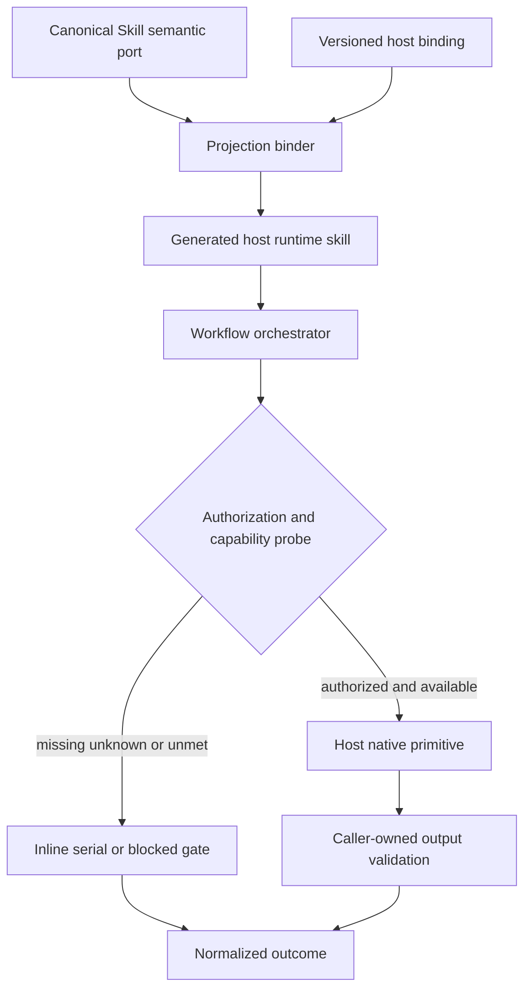
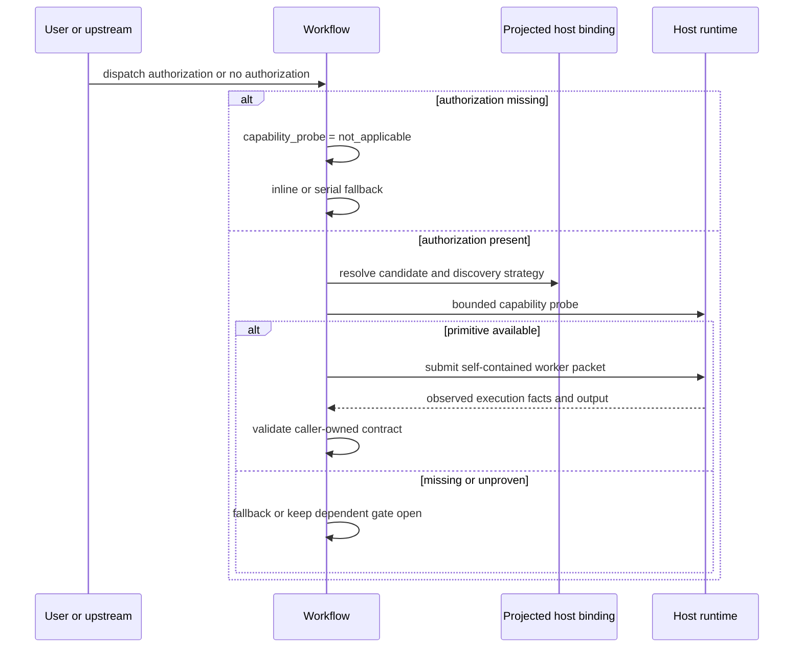
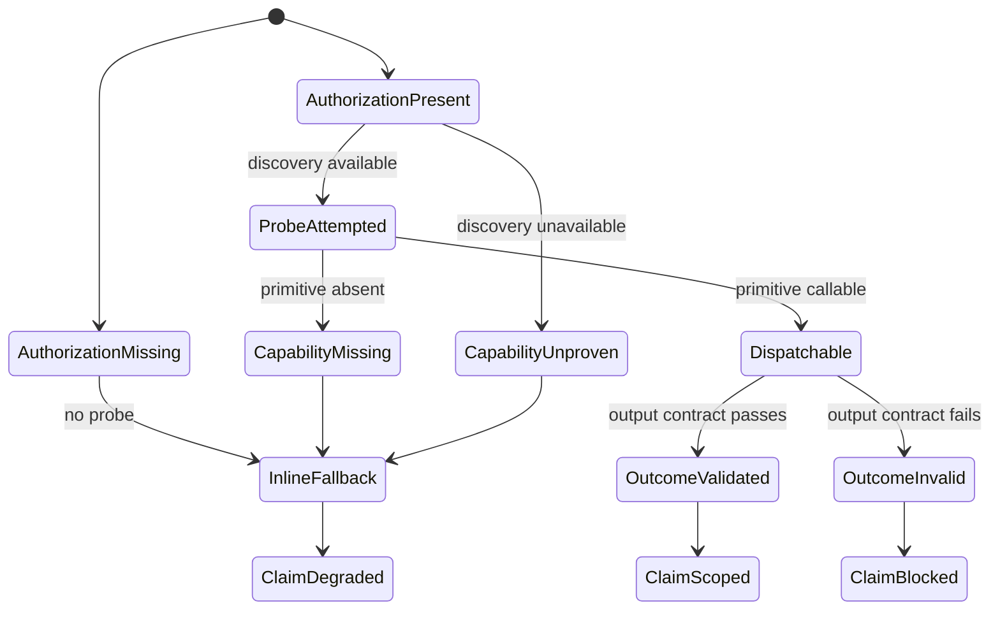

# Host-Neutral Worker Dispatch - Plan

## Goal Capsule

- **Objective:** 按严格解耦目标，将 worker dispatch 的业务语义、宿主绑定与实际执行拆成三个独立层，使 canonical Skill 不包含任何 host-native worker dispatch primitive，新增宿主不修改既有 Skill source。
- **Recommended approach:** `extend + new + compose / thin-glue`。扩展现有 authorization/fallback vocabulary；新增一个轻量、版本化、host-owned binding manifest；复用 `transformSkillContent()` projection seam 把 binding 投射到 generated runtime；实际调用仍完全由宿主原生执行层负责。
- **Decision focus:** Canonical Skill 只声明可观察行为 port，不出现 Claude `Agent`/`Task`、Codex `spawn_agent`、OpenCode `task` 或等价宿主映射；binding 只提供 primitive candidate、capability hints、版本、freshness 与 limitations，不提供 `dispatch()`，也不构成 session capability truth。
- **Verification focus:** 先用 source inventory、schema、projection 与 negative contracts 证明语义层无宿主泄漏，再用至少两个采用不同原生 primitive 的真实宿主 journey 证明正向绑定，并用一个真实 capability-missing/degraded journey 证明 fail-closed fallback。
- **Largest risk / boundary:** 静态 binding 容易被误当作当前会话可用性，projection glue 也可能演化成第二套 agent runtime。方案要求每次运行仍以 authorization 和主动 capability probe 为准，binding 只提供候选翻译与证据上限。
- **Stop conditions:** canonical Skill 仍需出现宿主名或 primitive 才能正确派发；binding loader 开始执行 worker、调度并发或决定语义；adapter/session state 被用来冒充实时 capability；或缺 freshness、隔离、输出验证时仍能关闭依赖这些事实的 exit gate。
- **Execution profile:** Deep，涉及 Skill semantic port、版本化 interface、projection seam、跨宿主证据和 OpenCode 计划对齐；不手改 generated runtime，runtime 只在临时项目中由 source 生成并校验。
- **Tail ownership:** `spec-work` 负责 source migration、binding/projection 实现、contract tests、fresh-source eval、真实 host journeys、Changelog 与 closeout；各宿主 evidence owner 只证明其记录的 exact version/capability，不替代通用语义验证。

---

## Product Contract

### Summary

Worker dispatch 必须遵守依赖倒置：Workflow 依赖一个由行为定义的 semantic port，宿主通过独立 binding 将该 port 映射到原生 primitive，原生 primitive 最终执行任务。

目标结构为：

```text
Canonical Skill semantic port
        ↓
Host-owned capability binding
        ↓
Host native primitive
```

严格解耦的判据不是“决策不依赖宿主名”，而是 canonical Skill source 根本不持有宿主 dispatch primitive。宿主差异只能进入 binding、generated runtime projection 和 exact-version journey evidence。

### Problem Frame

当前方案允许把 Claude、Codex、OpenCode 的 primitive 作为 advisory example 留在 canonical Skill 中。该做法消除了闭列表决策，却没有消除知识耦合：Skill 仍知道有哪些宿主、宿主如何派发、模型覆盖如何表达；新增宿主或 primitive 改名仍可能触发 Skill 文案维护。

反向把所有 primitive 都删掉但不提供 host binding 也不成立。模型只能从会话工具中猜测哪个 primitive 实现 generic worker，错误降级与真实 capability missing 难以区分，宿主版本变化也没有 freshness owner。

`PlatformAdapter.supportsAgents` 只控制 bundled agent profile projection，不能代表当前会话是否存在 callable worker primitive。`PlatformAdapter` 和 `plugin-sync` 可以拥有静态 projection，但不能拥有 worker execution、authorization 或 session capability 判断。

因此需要一个最小三层边界：

1. Skill 拥有任务意图、授权要求、mutation scope、输出 contract 和 claim boundary。
2. Host binding 拥有 semantic port 到宿主 primitive candidate 的版本化翻译、限制与 freshness。
3. Host runtime 拥有实际 tool discovery、权限检查、capacity、执行和返回事实。

### Actors

- A1. **Workflow user:** 授权或拒绝 delegated work，并消费真实 coverage 与 limitations。
- A2. **Workflow orchestrator:** 形成 host-neutral request，消费 projected binding 和 session capability facts，选择 dispatch 或 fallback，并校验 outcome。
- A3. **Generic worker:** 接收自包含 prompt、source refs、mutation scope、stop condition 和 caller-owned output contract。
- A4. **Host runtime:** 暴露原生 worker primitive、tool discovery、权限、隔离、模型覆盖、容量和取消事实。
- A5. **Maintainer:** 维护 semantic port、binding schema、projection、tests、host evidence 和 compatibility window。
- A6. **Projection binder:** 在 source→runtime 生成阶段校验 host binding 并投射宿主局部说明；不执行 worker，不读取会话权限，不做语义判断。

### Requirements

**Canonical semantic port**

- R1. 所有受治理 Workflow 的 canonical `skills/**` host-native worker port prose 必须完全不含宿主 dispatch primitive 名称、宿主到 primitive 的映射或宿主专属模型选择规则；决策只依赖 semantic port 与 session facts。
- R2. Workflow 必须分别表达 dispatch authorization 与 runtime capability；工具可见、权限允许、workflow invocation、mode 或 binding 存在均不构成 dispatch authorization。
- R3. Workflow 必须使用统一 vocabulary 表达 capability probe、dispatch availability、context isolation、model override、bounded parallelism 和 normalized outcome；未知事实必须有 fail-closed 规则。
- R4. 新增宿主时，既有 Workflow Skill source 必须零修改；变更面限定为 host binding、projection/lifecycle、host evidence 和必要支持文档。

**Ownership and execution boundary**

- R5. `src/cli/adapters/**` 与 `src/cli/plugin-sync.js` 只负责 runtime asset projection、inspection、state 和 ownership，不新增 worker execution API。
- R6. `supportsAgents` 继续只表示 bundled agent profile projection，不得作为 dispatch availability、isolation、model override、loader readiness 或 support claim 的代理。
- R7. Spec-first 不实现统一 dispatcher、任务调度器、并发池、模型路由器、权限代理或宿主 API wrapper；宿主原生执行层继续拥有实际调用。
- R8. Host binding 是 primitive knowledge 的唯一 canonical owner。宿主 dispatch primitive 可以出现在 binding、generated runtime projection、兼容性 fixture 和 exact-version evidence 中，但不得出现在 canonical Skill semantic source 中。

**Fallback and evidence**

- R9. 缺 dispatch authorization 时不得探测或调用 worker；必须 inline/serial 执行可降级工作，记录 `dispatch_authorization_missing`，并限制 independent、isolated、parallel 或 multi-agent claim。
- R10. 已授权时必须按 projected binding 进行主动 capability discovery；探测确认缺失时记录 `subagent_capability_missing`，无法探测时记录 `worker_capability_unproven`，两者均使用同预算 fallback。
- R11. `context_isolation_need=required` 且观测为 `inherited|unknown` 时，任何依赖独立性的 gate 不得关闭；`preferred` 可降级继续。Model override 为 `unsupported|unknown` 时继承当前模型并披露；parallelism 为 `unsupported|unknown` 时使用 serial 或有界探测，不得假设并发。
- R12. Capacity-limit response 必须按 backpressure 处理并进行有界排队/重试；只有非容量错误、成功接受后的失败/超时或重复零容量耗尽才进入失败或降级结果。
- R13. Worker output 必须按 caller-owned output contract 校验；invalid output 不得升级为 reviewer finding、verification evidence、completion claim 或 durable knowledge。

**Governance and extensibility**

- R14. 确定性检查必须覆盖 semantic source inventory、binding schema/version、supported-host binding completeness、projection parity、primitive leakage、reason codes 和 fixture results；不得判断 reviewer 是否必要或语义是否充分。
- R15. Fresh-source eval 必须判断迁移后的 Workflow 在 authorization/capability/isolation/model/parallelism 组合下是否遵守 semantic port；未执行时记录 `not_run` 和原因。
- R16. OpenCode `task` 只属于 OpenCode binding 和 exact-version host journey，不进入通用 Workflow source contract，也不成为通用解耦成功的唯一证据。
- R17. 新增 `worker-dispatch-host-binding/v1` canonical artifact，为每个 supported host 记录 host identity、primitive candidate、discovery strategy、capability hints、tested versions、freshness、limitations 和 evidence refs；artifact 不存储 session state。
- R18. Projection binder 必须校验 binding 后再投射，并把 `projected_for_host` 与 binding revision 写入 runtime fragment。Binding 缺失、schema 不兼容、active host identity 不匹配/无法确认或 freshness 无法满足声明时，只能进入 degraded/unproven 路径，不得使用错误 binding，也不得静默回退到 Skill 内宿主映射。
- R19. 跨宿主语义验证至少包含两个使用不同原生 primitive 的真实 positive journeys，以及一个真实 capability-missing、probe-unavailable 或 required-isolation-unmet 的 degraded journey；fixture 与 fresh-source eval 不得替代这些证据。
- R20. 当前 inventory 必须按文件集合分别记录：`worker_dispatch_capability` 命中 16 个 Markdown source 文件，`worker_dispatch_authorization` 命中 18 个，union 为 18 个；迁移 files 由宿主 primitive leakage 闭列表命中确定，不得从数量差推导。

### Key Flows

- F1. **Authorized positive dispatch**
  - **Trigger:** Workflow 判断 worker 有价值，且 A1 或 visible upstream handoff 明确授权 dispatch。
  - **Actors:** A1, A2, A3, A4, A6
  - **Steps:** A2 形成 semantic request；A6 已把当前 host binding 投射到 runtime；A2 按 binding 主动探测；A4 返回可调用 capability；A2 调用宿主 primitive 并校验输出。
  - **Outcome:** Normalized outcome 只声明实际观测到的 isolation、model、parallelism 和 evidence。
  - **Covered by:** R1-R8, R10-R13, R17-R18
- F2. **Authorization missing fallback**
  - **Trigger:** Workflow invocation 存在，但没有 dispatch authorization。
  - **Actors:** A1, A2
  - **Steps:** A2 将 `capability_probe` 置为 `not_applicable`，不发现也不调用任何 worker primitive；按同一 rubric 和预算 inline/serial 执行。
  - **Outcome:** 保留基础结果，不伪造 independent、fresh-context 或 multi-agent coverage。
  - **Covered by:** R2, R9
- F3. **Capability or quality degradation**
  - **Trigger:** 已授权，但 binding 缺失/过期、primitive 不可调用、probe 不可用，或 isolation/model/parallelism 不满足请求。
  - **Actors:** A2, A4, A6
  - **Steps:** A2 按状态表选择 fallback、继承、串行化或阻断 gate；输出 normalized limitations 和 reason codes。
  - **Outcome:** 能力不对称被显式表达，不模拟 feature parity。
  - **Covered by:** R3, R10-R13, R18
- F4. **Add a new host**
  - **Trigger:** 维护者增加新的 supported host。
  - **Actors:** A4, A5, A6
  - **Steps:** 新增 host binding 与 projection/lifecycle support；运行 completeness 和 leakage tests；执行 exact-version positive 或 degraded journey；不修改既有 Skill source。
  - **Outcome:** 新宿主通过 binding 兑现 semantic port，或以可解释 degraded 状态交付。
  - **Covered by:** R4-R8, R14-R19
- F5. **Binding evolution**
  - **Trigger:** 宿主 primitive、参数、tool discovery 或 capability 行为变化。
  - **Actors:** A4, A5, A6
  - **Steps:** replacement-first 更新 versioned binding；保留 compatibility window；刷新 evidence；使旧 binding 失效；重新生成临时 runtime 并跑 journey。
  - **Outcome:** Skill source 不变化，support claim 仅随 binding/evidence 新鲜度升降。
  - **Covered by:** R8, R14, R17-R19

### Acceptance Examples

- AE1. **Covers R1, R4, R8.** Given 一个新宿主提供 generic worker primitive, when 新增其 binding 与 projection support, then 既有 `skills/**` source 零修改，且 canonical Skill 中不存在该 primitive 名称。
- AE2. **Covers R2, R9.** Given 当前会话存在可调用 worker 工具但用户未授权 dispatch, when Workflow 进入 review/research 阶段, then 不进行 capability probe，不调用工具，执行 inline/serial fallback，并只声明 degraded inherited coverage。
- AE3. **Covers R3, R10.** Given 用户已授权 dispatch, when binding 指向的 candidate 经过 discovery 后不可调用, then `capability_probe=attempted`、`worker_dispatch_capability=missing`、reason 为 `subagent_capability_missing`；当宿主无 discovery 能力时改为 `capability_probe=unavailable`、capability 为 `unknown`、reason 为 `worker_capability_unproven`。
- AE4. **Covers R3, R11.** Given isolation 为 preferred 且宿主只能继承上下文, when worker 成功完成, then outcome 为 `realized_isolation=inherited` 和 `isolation_degraded_inherited`；若 isolation 为 required，则依赖独立性的 gate 保持未关闭。
- AE5. **Covers R3, R11.** Given Workflow 请求模型 tier 但宿主不支持或无法确认 per-worker override, when worker 被派发, then 继承当前模型并披露 `model_override_unsupported` 或 `model_override_unknown`，不根据宿主名猜模型 ID。
- AE6. **Covers R11-R12.** Given bounded parallelism 为 unknown 或宿主返回 capacity limit, when orchestrator 仍有任务, then 先串行或有界探测；已有 accepted worker 时等待 slot 并重试；重复零容量达到停止条件后记录 `dispatch_backpressure_exhausted`。
- AE7. **Covers R5-R6.** Given adapter 的 `supportsAgents=false`, when runtime binding 与主动 probe 证明 callable worker capability, then Workflow 仍可派发；static projection flag 不覆盖 session fact。
- AE8. **Covers R13-R15.** Given worker 返回不符合 caller output contract 的内容, when orchestrator 汇总结果, then 记录 `worker_output_invalid`，不把内容作为 confirmed finding 或 verification evidence。
- AE9. **Covers R16-R19.** Given OpenCode exact-version journey 使用 `task` 成功完成 worker-dependent Workflow, when 记录 evidence, then primitive 只出现在 OpenCode binding/projection/evidence；该 journey 不能单独证明 Claude/Codex 或 degraded path。
- AE10. **Covers R17-R18.** Given supported host 缺 binding、binding schema 不兼容、shared compatibility root 中的 `projected_for_host` 与 active host 不匹配，或 evidence 已按 invalidation condition 失效, when runtime 解析 binding, then 报告明确 degraded reason，不使用错误 primitive，也不从 Skill source 猜测映射。
- AE11. **Covers R1, R8, R14.** Given canonical Skill 新增 `spawn_agent`、`Agent`/`Task` host mapping 或 OpenCode `task` dispatch 说明, when source leakage contract 运行, then 测试失败；host binding 和 exact evidence 中的同名 token 不失败。
- AE12. **Covers R19.** Given 两个 positive host journeys 和一个 degraded journey 完成, when 评估严格解耦 claim, then 只有 semantic port、binding translation、positive execution 和 fail-closed degradation 四类证据全部存在时才可关闭该 claim。

### Success Criteria

- **Canonical purity:** 受治理 worker-dispatch Skill source 中宿主 dispatch primitive 命中为零；宿主名称只可用于非 dispatch 产品语义或明确的外部 provider integration，不得承担 native worker port 绑定。
- **Maintenance:** 完成一次性 port-marker migration 后，新增虚拟宿主 fixture 与至少一个真实新 host binding 时，既有 Workflow source 零修改；supported-host binding completeness、projection 和 negative leakage contracts 通过。
- **Runtime positive:** 至少两个采用不同原生 primitive 的 exact-version host journeys 成功完成同一 semantic request 和 caller-owned output contract。
- **Runtime degraded:** 至少一个真实 host/version 证明 capability missing、probe unavailable 或 required isolation unmet 会进入正确 fallback/blocked claim，而非静默成功。
- **Ownership:** Primitive knowledge 的唯一 canonical owner 是 host binding；generated runtime、compatibility fixture 和 host evidence 只能分别作为派生、测试或观察 surface。Skill、adapter state、project state 和 semantic contract 不复制该知识。
- **No runtime reimplementation:** 没有新增中心 dispatcher、session-level adapter API、并发池、权限代理、模型路由器或持久 session capability state。
- **OpenCode alignment:** OpenCode 计划不再要求逐 Skill 增加 `task` mapping，改为新增 OpenCode binding 和 exact-version journey。

### Scope Boundaries

- 本方案严格解耦的是 **host-native worker dispatch port**，不承诺一次性抽象所有宿主 primitive。
- Question tool、skill invocation、goal mode、session resume、hooks 和 browser primitive 仍保持现有 owner；它们有不同的授权、交互和 failure semantics，作为独立 follow-up 候选。
- `spec-optimize` 中把 Codex CLI 当外部 execution provider 的显式集成，不自动等同于当前宿主的 native worker binding。若 inventory 发现它同时承担 native worker port，相关句子必须迁移；纯 provider integration 保留并标记为独立 contract。
- 不承诺不同宿主具备相同 isolation、model override、parallelism、cancellation、timeout 或 workspace transport。
- 不为宿主工具定义统一 JavaScript execution interface；binding 是 data/translation contract，不是可调用 dispatcher。
- 不把 session capability 写入 project state、adapter state 或 binding manifest。
- 不通过宏把宿主名注入 canonical Skill；宿主知识只在 source→generated runtime projection 时进入 runtime artifact。
- 不手改 `.claude/`、`.codex/`、`.agents/skills/`、`.cursor/`、`.kiro/`、`.qoder/` 或未来 `.opencode/` generated runtime。
- 本计划只能声称 worker dispatch 解耦，不能推广为“所有 Skill 能力已与所有宿主完全解耦”。

### Dependencies / Assumptions

- 当前 source snapshot 为 `162da1b62e1c35b69eeb7fc69eddd79f78ae371e`；实施前必须重新读取当前 source 和 supported host set。
- `transformSkillContent()` 已是 host-specific runtime projection seam，且接收 `skillName`、`relativePath`、workflow/internal flags 等上下文，足以做窄 binding projection；实施时若发现需要执行会话工具，必须停止而不是扩大该 seam。
- 当前 `src/cli/adapters/platform-registry.js` 的 `capabilities` 描述静态 shipped host surfaces，不能直接承载实时 worker capability truth；host binding manifest 与 registry host set 保持 completeness 关系，但不复用其 capability status 作为 session fact。
- 当前 inventory：`worker_dispatch_capability` 命中 16 个 Markdown source 文件，`worker_dispatch_authorization` 命中 18 个，union 为 18 个；`dispatch-authorization-matrix-contracts.test.js` 同时治理 18 个 package。文件数与 package 数恰好都为 18，但语义不同。
- 已确认至少五个 canonical worker-dispatch source 含宿主 primitive 或宿主专属 dispatch 规则：`skills/spec-code-review/SKILL.md`、`skills/spec-doc-review/SKILL.md`、`skills/spec-simplify-code/SKILL.md`、`skills/spec-plan/references/universal-planning.md`、`skills/spec-write-tasks/references/execution-handoff-contract.md`。U2 的 port-marker migration 覆盖全部 18 个 governed package entrypoints；primitive removal 子集由实现时冻结的 leakage inventory 决定，二者不得混为同一计数。
- 各 Workflow 对 isolation 的依赖不同；required/preferred/irrelevant 仍由 owning Workflow 决定，binding 不能替它升级或降级。

### Outstanding Questions

**Resolve Before Implementation:** 无。

**Deferred to Implementation Evidence:**

- 当前 supported host 的 binding 状态分别是 confirmed、degraded 还是 unknown，必须由 exact-version 官方/运行时证据填写，不能从宿主品牌推导。
- Degraded journey 选择 Cursor、Kiro、Qoder 或其他宿主，由实施时可达环境决定；选择结果不得改变 semantic port。
- 某宿主只提供 typed/custom agent 而不接受 caller-owned self-contained prompt 时，是否满足 generic worker 行为 port；不能满足时保持 capability missing，不为该宿主扩大 port。

---

## Planning Contract

### Architecture Posture

- **`extend`:** 扩展现有 `worker_dispatch_authorization`、fallback reason codes、dispatch matrix 和 source/runtime discipline，不新建第二套 Workflow authorization 模型。
- **`new`:** 新增 `worker-dispatch-host-binding/v1`。现有 Skill 不是正确 owner；`PlatformAdapter.supportsAgents` 语义过窄；`PLATFORM_REGISTRY.capabilities` 是静态 shipped surface facts，直接塞入 primitive translation 会混淆 release metadata 与 session binding。
- **`compose / thin-glue`:** 复用 `transformSkillContent()` 和 plugin sync，把 versioned binding 投射到受治理 Skill 的 generated runtime。Glue 只拥有 schema validation、binding selection、runtime fragment rendering、failure/degradation propagation 和 binding revision evidence。
- **Authority:** Skill semantic port 拥有“需要什么”；binding 拥有“当前宿主候选如何表达”；host runtime 拥有“此会话是否真的可执行”；orchestrator 拥有“是否获授权、如何降级、能声称什么”。

拒绝以下方案：

- **在 canonical Skill 保留 advisory primitive example。** 即使不驱动决策，仍让 Skill 知道宿主集合与 primitive vocabulary，违反严格解耦。
- **只删除 primitive 名称。** 没有 binding owner 时，模型只能猜工具，无法区分 binding 缺失、probe unavailable 和 capability missing。
- **把 binding 放进每个 adapter 的 prose rewrite。** 会把同一 schema 和决策复制到多个类中；adapter 应只选择/投射 canonical binding。
- **给 `PlatformAdapter` 增加 `dispatch()` 或 session probe。** Adapter 在 CLI/init/doctor 阶段运行，无法代表会话工具和用户授权。
- **把 binding 当 capability truth。** Static artifact 只能给候选、tested versions 和 evidence ceiling；当前运行仍需 probe。
- **构建统一 worker runtime。** 会重建宿主的权限、调度、模型、并发、取消和生命周期 owner。
- **把所有 host primitives 一次性抽象。** Question、skill invocation、goal、hooks 等 contract 不同，会形成通用宿主能力框架并扩大维护面。

### High-Level Technical Design







### Interface Contracts

| Interface / mode | Consumers | Canonical artifact | Contract summary | Compatibility | Verification |
| --- | --- | --- | --- | --- | --- |
| Worker Dispatch Semantic Port / evolution | Governed Workflow、fresh-source reviewer、dispatch matrix | `docs/contracts/workflows/worker-dispatch-capability.md`, owner U1 | Request、authorization、observable capability、outcome、reason codes、claim boundary；不含宿主 primitive | 同一 release 内从 legacy scalar vocabulary 迁移到 port v1；稳定 R/reason vocabulary replacement-first 演进 | Source inventory、semantic fixtures、fresh-source eval |
| Host Worker Binding / greenfield | Projection binder、host adapter/lifecycle tests、doctor/support evidence | `src/cli/contracts/host-worker-bindings/worker-dispatch-bindings.v1.json` + schema, owner U3 | Host id 到 primitive candidate/discovery/capability hint/freshness/evidence 的翻译；不执行 worker | `schema_version` 与 per-binding revision；breaking change 新版本并保留读取窗口 | 复用 `contracts/schema-validator.js`、supported-host completeness、projection bytes、stale/invalid fixtures |
| Worker Dispatch Journey Evidence / greenfield | Release maintainer、README/catalog、future host promotion | `docs/contracts/verification/worker-dispatch-host-journey.schema.json` + dated artifacts, owner U6 | Exact host/version/binding revision、request case、observed capability、outcome、artifact hashes、limitations、invalidation | Evidence 只覆盖精确记录版本；binding/host/tool 行为变化触发失效 | Schema test、artifact hash、real invocation review |

#### Semantic request and capability facts

以下为行为 contract 的方向性 DSL，不是 JavaScript execution API：

```yaml
worker_dispatch_request:
  worker_dispatch_port: v1
  worker_dispatch_authorization: authorized | missing
  intent_labels: [open-vocabulary]
  desired_concurrency: bounded | serial
  context_isolation_need: required | preferred | irrelevant
  model_selection_need: explicit-tier | inherited-ok
  mutation_scope: forbidden | explicitly-scoped
  input_refs: [source-owned-references]
  output_contract: caller-owned
  stop_condition: bounded
```

`worker_dispatch_port: v1` 是 host-neutral projection marker，也是 matrix 的 inventory anchor；它不选择宿主、不授权 dispatch、不证明 capability。Port 以可观察行为定义 generic worker，而不是以 `worker_kind` 或有限 `purpose` 枚举定义：接受 caller-owned self-contained prompt；遵守 mutation scope；返回 caller-owned output contract；披露实际 isolation/model/parallelism；在 stop condition 内结束或返回失败。

Run-local facts：

```yaml
capability_probe: not_applicable | attempted | unavailable
worker_dispatch_capability: available | missing | unknown
worker_context_isolation: isolated | inherited | unknown
worker_model_override: supported | unsupported | unknown
worker_bounded_parallelism: supported | unsupported | unknown
```

`worker_context_isolation` 指 prompt/会话历史继承，与 `workspace_isolation` 文件系统工作区事实正交。Legacy `worker_dispatch_capability: available | missing` 在同一迁移 release 中扩展 `unknown`，用于表达“已授权但宿主无法提供可信 probe”；迁移完成后所有 governed sources 使用同一含义。

#### Authorization, capability and outcome state table

| Authorization | Probe | Capability | Required capability result | Execution | Claim / reason |
| --- | --- | --- | --- | --- | --- |
| `missing` | `not_applicable` | `unknown` | 不评估 | inline/serial | degraded；`dispatch_authorization_missing` |
| `authorized` | `attempted` | `available` | 全部满足 | dispatched | 按实际 outcome claim |
| `authorized` | `unavailable` | `unknown` | binding missing/invalid/mismatch/stale，或 active host identity 无法确认 | inline/serial | degraded；对应 `host_worker_binding_*` reason |
| `authorized` | `attempted` | `missing` | dispatch 不满足 | inline/serial | degraded；`subagent_capability_missing` |
| `authorized` | `unavailable` | `unknown` | dispatch 未证明 | inline/serial | degraded；`worker_capability_unproven` |
| `authorized` | `attempted` | `available` | required isolation 为 `inherited|unknown` | 可收集 advisory output，但 gate 保持打开 | `isolation_requirement_unmet` |
| `authorized` | `attempted` | `available` | preferred isolation 为 `inherited|unknown` | dispatched 或 serial | degraded；`isolation_degraded_inherited` |
| `authorized` | `attempted` | `available` | model override `unsupported|unknown` | inherited model | disclosed；`model_override_unsupported|unknown` |
| `authorized` | `attempted` | `available` | parallelism `unsupported|unknown` | serial 或 bounded probe | disclosed；`parallelism_unproven_serialized` |

#### Normalized outcome

```yaml
worker_dispatch_outcome:
  execution_mode: dispatched | inline | serial
  status: succeeded | degraded | blocked | failed
  capability_probe: not_applicable | attempted | unavailable
  realized_isolation: isolated | inherited | unknown | none
  model_selection: requested | inherited | unknown
  realized_parallelism: bounded | serial | none | unknown
  binding_host_id: confirmed-active-host | mismatched | unknown | none
  binding_revision: projected-revision-or-none
  reason_codes: []
  coverage_claim: claim-scoped
```

稳定 reason codes：

| Reason code | Trigger / scope |
| --- | --- |
| `dispatch_authorization_missing` | authorization missing；all-governed |
| `host_worker_binding_missing` | supported host 无 binding；projection/governance |
| `host_worker_binding_invalid` | schema/version 无法读取；projection/governance |
| `host_worker_binding_mismatch` | projected host 与 active host 不匹配或 active identity 无法确认；runtime/fresh-source |
| `host_worker_binding_stale` | invalidation/freshness 不支持目标 claim；host evidence |
| `subagent_capability_missing` | probe attempted 且 primitive 不可用；all-governed |
| `worker_capability_unproven` | probe unavailable，capability unknown；all-governed |
| `isolation_requirement_unmet` | required isolation 未满足；capability-dependent |
| `isolation_degraded_inherited` | preferred isolation 降级；capability-dependent |
| `model_override_unsupported` | 明确不支持 override；capability-dependent |
| `model_override_unknown` | override 无法确认；capability-dependent |
| `parallelism_unproven_serialized` | parallelism unsupported/unknown 后串行化；capability-dependent |
| `dispatch_backpressure_exhausted` | 有界容量重试耗尽；capability-dependent |
| `worker_dispatch_failed` | primitive 已接受后失败或非容量错误；capability-dependent |
| `worker_output_invalid` | caller-owned output validation 失败；capability-dependent |

#### Host binding minimum shape

Binding 中可以出现宿主 primitive 名称，但必须携带：`schema_version`、`host_id`、`binding_revision`、`semantic_port_version`、host identity probe、primitive candidates、discovery strategy、capability hints、`tested_host_versions`、`verified_at`、`evidence_refs`、`limitations`、`invalidation_conditions`。没有可信 primitive 的宿主使用空 candidates 加 degraded/unknown 状态，而不是虚构映射。Capability hints 是 advisory ceiling；projection 必须生成 `projected_for_host`、binding revision、“confirm active host identity”和“probe before use”约束，不得生成“binding present = capability available”。在 `.agents/skills` 等 shared compatibility root 上，identity mismatch 或 identity unknown 必须忽略该 binding 并 fail closed。

### Source Ownership

| Surface | Owner | Responsibility |
| --- | --- | --- |
| Semantic vocabulary 与决策边界 | `docs/contracts/workflows/worker-dispatch-capability.md` | Maintainer-facing port；不含 primitive，不执行 worker |
| Host binding schema/data | `src/cli/contracts/host-worker-bindings/**` | Primitive translation、版本、freshness、limitations；不存 session facts |
| Binding loader/renderer | `src/cli/worker-dispatch-bindings.js` | 校验、选择、渲染 runtime fragment；不调用工具 |
| Projection seam | `src/cli/plugin-sync.js`、`src/cli/adapters/**` | 将 binding 投射到 generated runtime；继续只负责 source/runtime ownership |
| Workflow request、authorization、scope、claim | 各 owning `skills/**` | 只表达 semantic port 和 Workflow-specific requirements |
| Routing authorization reminder | `skills/using-spec-first/references/conditional-routing-boundaries.md` | 明确 invocation/permission/binding 均不授权 dispatch |
| Deterministic matrix | `tests/unit/dispatch-authorization-matrix-contracts.test.js` | Governed package/source inventory、port vocabulary、primitive leakage |
| Host binding/projection tests | 新增 binding contract test 与既有 projection suites | Schema、completeness、negative cases、runtime bytes |
| Host journey evidence | `docs/validation/worker-dispatch/**` | Exact-version observed facts、hash、limitations、invalidation |
| Generated runtime binding | `.claude/**`、`.codex/**`、`.agents/skills/**`、`.cursor/**`、`.kiro/**`、`.qoder/**`、未来 `.opencode/**` | 可重建 projection；从不成为 source owner |

### Decision Rules

1. 先解析 dispatch authorization；缺授权时 `capability_probe=not_applicable`，不得以“只是探测”为由访问 worker primitive。
2. 已授权后，读取 projected binding revision，再执行一次有界 tool discovery；binding 只缩小候选范围，不证明 capability。
3. 先确认 runtime fragment 的 `projected_for_host` 与 active host identity 一致。Shared compatibility root 上不匹配或无法确认时记录 `host_worker_binding_mismatch`，忽略该 binding 并按 capability unknown fail closed。
4. Binding 缺失或 invalid 时记录对应 reason，按 capability unknown fail closed；不得从宿主名、旧 Skill 文案或模型记忆补映射。
5. Probe attempted 且 candidate 不可调用时 capability 为 missing；宿主无 discovery 时 probe 为 unavailable、capability 为 unknown。二者不得共用同一个 evidence claim。
6. Required isolation 为 `inherited|unknown` 时，结果最多是 advisory，依赖独立性的 review/verification gate 不可关闭。
7. Preferred isolation 为 `inherited|unknown` 时可继续，但必须披露 realized isolation 和 degraded reason。
8. Model override 为 unsupported 或 unknown 时继承当前模型并披露；binding 不硬编码模型 ID 到 semantic port。
9. Parallelism 为 unsupported 或 unknown 时优先 serial；只有宿主真实接受 capacity 后才扩大到 bounded parallel。
10. Capacity-limit 是 backpressure；队列、重试、等待和停止条件必须有界。
11. Permission controls whether a native call may execute；authorization controls whether Workflow may attempt dispatch；binding controls translation；三者不可互相替代。
12. Scripts/tests 只验证 schema、inventory、source leakage、projection 与 fixture；LLM/fresh-source reviewer 判断语义充分性，real journey 证明 host outcome。

### System-Wide Impact

- **Workflow/source:** in-scope；所有 governed native-worker dispatch prose 迁移到 semantic port，移除宿主 primitive 和宿主专属模型映射。
- **CLI/adapter:** in-scope for projection only；新增 binding loader/renderer，保持 adapter 无 execution API。
- **Interface/schema:** in-scope；新增 versioned binding 和 journey evidence contract，定义 compatibility、freshness、consumer 和 parser owner。
- **Governance/projection:** in-scope；supported host 必须有 binding record，generated runtime 获得 host-local binding block，canonical source 保持纯净。
- **Data/state:** out-of-scope；不新增 session capability 或 dispatch progress 持久状态。
- **Authorization/security:** in-scope boundary；binding、权限和工具可见性均不得提升为 dispatch authorization。
- **Documentation:** in-scope；更新 central contract、README、OpenCode plan、source/runtime boundary 和 Changelog。
- **Runtime generation:** in-scope only in temporary verification projects；当前 checkout 的 generated runtime 不进入写集。
- **Host/field evidence:** in-scope release gate；至少两个 positive 和一个 degraded journey，均绑定 exact host/version/binding revision。
- **Other host primitives:** out-of-scope with reason；question、skill invocation、goal、hooks 等需要独立 contract，不能借本次顺手泛化。

### Sequencing And Migration

1. U1 建立 semantic port、状态表、reason codes 和 source inventory owner。
2. U2 为全部 18 个 governed package entrypoints 增加统一 port marker、状态语义，并根据冻结的 leakage inventory 移除 canonical Skill/reference 中所有 native-worker primitive；不得长期保留 legacy/advisory 双轨。
3. U3 在同一 foundation wave 落 binding schema/data、loader/renderer 和 projection；U2/U3 必须原子交付，避免“Skill 已纯化但 runtime 无 binding”或“binding 已投射但 Skill 仍双写”。
4. U4 更新 OpenCode 计划，使它消费 binding contract；OpenCode dispatch 实现不得先于 U2/U3 完成。
5. U5 完成 deterministic、fresh-source、docs/package 和 source/runtime closure。
6. U6 执行两个 positive 与一个 degraded real host journey；严格解耦 claim 只有 U6 满足后关闭。

**Compatibility and rollback:**

- Semantic port v1 与 binding v1 以 replacement-first 演进；breaking binding change 新增 schema version，loader 在限定窗口内读取旧版并发出 degraded warning。
- 不发布 canonical Skill 与 binding 的长期双写。若 U2/U3 任一无法完成，回滚整个 migration slice，保持旧 release 行为，不交付半解耦状态。
- Binding/projected fragment 回归时，support claim 降级并阻断依赖 gate；修复 source binding/renderer 后重新生成，不手改 runtime。
- 回滚不删除 user-owned host config、skills 或非 spec-first assets；只恢复 spec-first source/projection behavior。

### Risks & Mitigations

- **Binding 被误当作 session truth。** Schema 与 projected fragment 都标注 advisory ceiling；每次 authorized run 必须 probe，outcome 记录 probe state 和 binding revision。
- **Shared compatibility root 误用另一宿主 binding。** Projected fragment 携带 `projected_for_host`；active host identity 必须确认匹配，否则忽略 binding、记录 `host_worker_binding_mismatch` 并进入 capability unknown fallback。OpenCode/Codex coexistence journey 覆盖该路径。
- **Projection glue 演化成 dispatcher。** Loader/renderer API 只接受静态 content/context 并返回文本/facts；禁止依赖会话工具、权限、worker result 或 async execution。
- **Canonical primitive leakage 回归。** Matrix 从 host-binding manifest 派生 narrow matchers：`spawn_agent` 等唯一标识符可精确匹配，`Agent`/`Task`/`task` 等歧义词只有在同句出现 host label、binding 句式或 native-worker mapping 语境时才失败。扫描只覆盖 governed semantic sources；binding/evidence/provider integration 使用 path + owner allowlist，禁止裸 token 全仓禁词。
- **Allowlist 吞掉真实耦合。** Allowlist 以 path + owner classification 为单位，不以裸 token 全仓豁免；每个例外必须标注 binding、evidence、compatibility 或 external-provider-integrator。
- **Binding freshness 维护成本。** 每条 binding 具备 tested versions、verified_at、evidence refs 和 invalidation conditions；stale 不阻止语义 source 使用，但降低 runtime/support claim 并要求复证。
- **两宿主都成功却仍是同一抽象假象。** Positive journeys 必须使用不同 primitive binding，并对 request/output contract 做同一语义断言；只扫描 tool presence 不算 journey。
- **Degraded path 只在 fixture 中存在。** U6 要求真实 supported host/version 的 unavailable、probe-unavailable 或 required-isolation-unmet 证据；无法取得时严格解耦 claim 保持未关闭。
- **`worker_dispatch_capability` 语义迁移分叉。** U1/U2 同一 release 将所有 governed owner 统一为 `available|missing|unknown`，tests 同时拒绝 legacy object 形状和遗漏 unknown rule。
- **外部 Codex provider 与 native host binding 混淆。** Inventory 按“当前宿主原生 worker port”与“显式外部 execution provider”分类；后者不进入 host binding completeness，但不能被当作 native fallback。
- **与 OpenCode 计划并行实施冲突。** U4 是 OpenCode dispatch slice 的前置；旧计划中的逐 Skill `task` mapping 不得实施。

### Evidence & Limitations

- 当前 source snapshot：`162da1b62e1c35b69eeb7fc69eddd79f78ae371e`。工作树已有 `CHANGELOG.md`、OpenCode 计划和本计划的未提交内容，另有与本任务无关的未跟踪目录；实施和本次文档修改不得覆盖或回退它们。
- CodeGraph 与 current source 确认：`PlatformAdapter.supportsAgents` 只控制 bundled agent profile projection；`transformSkillContent()` 是现有 host-specific content projection seam；Cursor 即使 `supportsAgents=false` 仍投射 Workflow Skill。
- `src/cli/adapters/platform-registry.js` 已有静态 `capabilities.hooks`，但没有 versioned worker primitive binding，也没有 session capability owner。该事实支持新增窄 binding artifact，而不是扩展 adapter execution 职责。
- 当前 inventory 直接确认 capability 16 个 Markdown 文件、authorization 18 个、union 18 个；现有 matrix 管理 18 个 package。U2 不能使用 `16 - 4` 或类似算术推导迁移面。
- 已确认的 primitive leakage 至少覆盖五个 source 文件；实现前必须重新冻结 inventory，因为当前 dirty worktree 与后续并行计划可能改变命中集。
- 本方案未运行 fresh-source eval、binding projection、真实 host journey、runtime regeneration 或 implementation tests。CodeGraph 仅用于导航，所有 load-bearing 结论已由 current source 复核。
- 本轮 architecture、agent-native 与 pattern-recognition lens 采用 inline/serial fallback，记录 `dispatch_authorization_missing`；不声称 independent 或 fresh-context reviewer coverage。

---

## Implementation Units

### U1. Canonical Semantic Port And Authorization Contract

- **Goal:** 建立不含宿主 primitive 的 worker dispatch semantic port、完整状态表和 fail-closed claim boundary。
- **Requirements:** R1-R3, R8-R15, R20；F1-F3；AE2-AE8
- **Dependencies:** None
- **Files:**
  - Create: `docs/contracts/workflows/worker-dispatch-capability.md`
  - Modify: `skills/using-spec-first/references/conditional-routing-boundaries.md`
  - Modify: `skills/using-spec-first/SKILL.md`
  - Modify: `tests/unit/using-spec-first-contracts.test.js`
  - Modify: `tests/unit/dispatch-authorization-matrix-contracts.test.js`
- **Approach:** 将 `Codex Dispatch` 路由边界拆为通用 Worker Dispatch 与独立 Codex startup reminder；定义行为型 request、`capability_probe` 三态、capability `unknown`、required/preferred isolation、model/parallelism unknown fail-closed、normalized outcome 和稳定 reason codes。Matrix 的 canonical inventory 分开记录 source files 与 governed packages，不再混用数量。
- **Patterns to follow:** 角色契约的 deterministic floor / LLM judgment、`skills/spec-work/references/execution-strategy.md` 的 authorization/capability/isolation 分离、`docs/contracts/workflows/scenario-capability-matrix.md` 的 advisory fact 边界。
- **Test scenarios:**
  1. Given authorization missing, when Workflow resolves dispatch, then probe 为 `not_applicable`、capability 为 `unknown`、未出现 tool discovery side effect。
  2. Given authorization present and discovery unavailable, when capability is resolved, then outcome uses `worker_capability_unproven` rather than `subagent_capability_missing`。
  3. Given required isolation with inherited/unknown observation, when output exists, then dependent gate remains open。
  4. Given model/parallelism unknown, when dispatch planning proceeds, then model inherits and execution serializes or performs bounded probe。
  5. Inventory reports capability=16 files、authorization=18 files、union=18 files independently from 18 governed packages。
  6. Contract contains no host dispatch primitive mapping and explicitly denies `supportsAgents` as session capability。
- **Verification:** Focused routing/matrix tests pass；direct source review confirms one semantic owner and no project-level glossary mutation。

### U2. Migrate Governed Skills To The Semantic Port

- **Goal:** 让全部 governed dispatch package 显式消费 semantic port，并从 leakage 子集移除宿主 primitive、宿主专属模型映射和 advisory binding prose。
- **Requirements:** R1-R4, R8-R13, R20；F1-F3；AE1-AE8, AE11
- **Dependencies:** U1
- **Files:**
  - Modify: `skills/spec-app-consistency-audit/SKILL.md`
  - Modify: `skills/spec-brainstorm/SKILL.md`
  - Modify: `skills/spec-compound/SKILL.md`
  - Modify: `skills/spec-compound-refresh/SKILL.md`
  - Modify: `skills/spec-explain/SKILL.md`
  - Modify: `skills/spec-ideate/SKILL.md`
  - Modify: `skills/spec-optimize/SKILL.md`
  - Modify: `skills/spec-pov/SKILL.md`
  - Modify: `skills/spec-resolve-pr-feedback/SKILL.md`
  - Modify: `skills/spec-riffrec-feedback-analysis/SKILL.md`
  - Modify: `skills/spec-simplify-code/SKILL.md`
  - Modify: `skills/spec-sweep/SKILL.md`
  - Modify: `skills/spec-code-review/SKILL.md`
  - Modify: `skills/spec-debug/SKILL.md`
  - Modify: `skills/spec-doc-review/SKILL.md`
  - Modify: `skills/spec-plan/SKILL.md`
  - Modify: `skills/spec-prd/SKILL.md`
  - Modify: `skills/spec-work/SKILL.md`
  - Modify: `skills/spec-plan/references/universal-planning.md`
  - Modify: `skills/spec-write-tasks/references/execution-handoff-contract.md`
  - Modify: dispatch-bearing references already enumerated by `tests/unit/dispatch-authorization-matrix-contracts.test.js`
  - Modify: additional canonical source files found by the frozen primitive leakage inventory
  - Modify: `tests/unit/spec-code-review-contracts.test.js`
  - Modify: `tests/unit/spec-doc-review-contracts.test.js`
  - Modify: `tests/unit/spec-lfg-contracts.test.js`
  - Modify: `tests/unit/spec-plan-quality-contracts.test.js`
  - Modify: `tests/unit/spec-write-tasks-contracts.test.js`
  - Modify: `tests/unit/dispatch-authorization-matrix-contracts.test.js`
- **Approach:** 对 matrix 中 18 个 package entrypoint 一次性加入 `worker_dispatch_port: v1` 和统一 unknown/fail-closed 语义，使 projection 有稳定 consumer marker；再冻结由语义上下文识别的 leakage set，将每个命中点改为 semantic request/capability/outcome prose。删除 Claude/Codex/OpenCode primitive 和宿主专属 tier mapping，不保留 advisory examples。保留每个 Workflow 的 persona/rubric、mutation scope、bounded backpressure、output validation 和 claim limitation。`spec-optimize` 的外部 Codex provider integration 单独分类；只有承担 native worker port 的句子进入本迁移。
- **Execution note:** U2 与 U3 作为一个 release wave；在 U3 projection 可用前，不把 U2 作为可发布完成状态。
- **Patterns to follow:** `skills/spec-debug/SKILL.md` 的 callable capability-first prose、current dispatch authorization matrix、prompt assets 由 caller 读取并传入 generic worker 的模式。
- **Test scenarios:**
  1. Given all 18 governed package entrypoints, when port inventory runs, then each contains exactly one `worker_dispatch_port: v1` marker and uses the same capability unknown/fail-closed semantics。
  2. Given each governed canonical source, when the frozen leakage inventory is checked, then native-worker semantic sections have zero primitive hits；U3 再把该 matcher set 收敛为 manifest-derived。
  3. Given host names appear for question tools、goal mode 或 explicit external provider integration, when classifier runs, then only path-scoped non-worker owners are allowed。
  4. Given authorization missing, capability missing/unproven, required isolation unmet, model unknown and parallelism unknown, when each Workflow resolves, then the semantic outcomes match U1 state table。
  5. Given code/doc/simplify reviewers dispatch, when output returns, then existing persona roster、rubric、artifact contract 和 backpressure semantics remain intact。
  6. Given universal planning needs parallel research, when worker port is available, then it requests generic bounded workers without naming a host/model primitive；fallback remains serial research。
  7. Given write-tasks hands off to doc review, when wording is checked, then it describes caller/continuation ownership without `Agent`/`Task` type names。
- **Verification:** Owning contract suites and leakage matrix pass；semantic diff review confirms host knowledge was removed without weakening workflow-specific gates。

### U3. Versioned Host Binding And Projection Seam

- **Goal:** 新增 host-owned binding source，并通过现有 projection seam 生成宿主局部 binding，不引入 execution API。
- **Requirements:** R4-R8, R14, R17-R18；F4-F5；AE1, AE7, AE10-AE11
- **Dependencies:** U1
- **Files:**
  - Create: `src/cli/contracts/host-worker-bindings/worker-dispatch-bindings.v1.json`
  - Create: `src/cli/contracts/host-worker-bindings/worker-dispatch-bindings.schema.json`
  - Create: `src/cli/worker-dispatch-bindings.js`
  - Create: `tests/unit/worker-dispatch-bindings-contracts.test.js`
  - Modify: `src/cli/plugin-sync.js`
  - Modify: `src/cli/adapters/base.js` only if a projection-only binding selector is necessary
  - Modify: `tests/unit/dispatch-authorization-matrix-contracts.test.js`
  - Modify: `tests/unit/host-runtime-projection-contracts.test.js`
  - Modify: `tests/unit/plugin-modules.test.js`
- **Approach:** Manifest 以 supported host id 为 key，记录 binding revision、semantic port version、host identity probe、primitive candidate、discovery、capability hints、freshness 和 evidence refs。Loader/renderer 校验并生成明确标注为 host binding 的 runtime fragment，只对包含 `worker_dispatch_port: v1` marker 的 projected Skill entrypoint 生效；matrix 在 U3 后从 manifest 派生 primitive leakage matcher 与 supported-host completeness，歧义 primitive 采用 host-qualified/context-qualified matcher。Manifest host set 与 `getSupportedPlatforms()` 双向 completeness；OpenCode 在其 host support slice 中新增 record。Binding missing/invalid/mismatch/stale 或 identity proof unavailable 时产生 degraded fragment/reason，不从 canonical Skill 回填 primitive。
- **Technical design:** Projection input 为 source content + static adapter id/context + validated binding；输出为 deterministic runtime content + binding revision。该路径不得接受或返回 worker result、authorization、session permission 或 live capability。
- **Patterns to follow:** `transformSkillContent()` 的 entrypoint-aware host transformation、runtime path rewrite、`contracts/schema-validator.js` 的 repo-native schema validation、schema-backed `src/cli/contracts/**`、projection content equality tests。
- **Test scenarios:**
  1. Given every current supported host, when manifest validates, then exactly one compatible binding record exists；未知/preview capability 可标记 degraded/unknown，但不能缺记录。
  2. Given malformed schema、unknown version、missing host 或 duplicate revision, when projection runs, then deterministic reason 返回且不会注入猜测 mapping。
  3. Given a governed Skill source with port marker, when projected for Claude and Codex, then runtime fragments contain different `projected_for_host` bindings while source bytes remain identical。
  4. Given a Codex binding 位于 `.agents/skills` 并被另一宿主 compatibility loader 看到, when host identity probe 不匹配或不可确认, then binding 被忽略并返回 `host_worker_binding_mismatch`，不会调用 Codex primitive。
  5. Given Cursor `supportsAgents=false`, when binding record is degraded/unknown, then Skill 仍投射，runtime 不把 agent-profile flag 写成 dispatch unavailable truth。
  6. Given a non-dispatch Skill/reference, when projection runs, then no worker binding block is injected。
  7. Given repeated init/projection, when inputs unchanged, then generated bytes and binding revision are idempotent且 binding block 不重复。
  8. Given adapter implementation is inspected, then no `dispatch()`、session probe、worker result handling 或并发调度 API 被新增。
- **Verification:** New binding schema/contract suite、host runtime projection、plugin module tests、temporary init parity pass。

### U4. Align The OpenCode Host Plan

- **Goal:** 将 OpenCode 从逐 Skill `task` 分支改为 `worker-dispatch-host-binding/v1` 的新宿主 consumer。
- **Requirements:** R4, R8, R16-R19；F4-F5；AE9-AE12
- **Dependencies:** U1, U3
- **Files:**
  - Modify: `docs/plans/2026-07-27-001-feat-opencode-host-support-plan.md`
  - Modify: `CHANGELOG.md`
- **Approach:** 更新 Goal Capsule、requirements、KTD、U1/U6、verification 和 DoD：删除逐 Skill `task` mapping；新增 OpenCode binding record/schema/projection consumer；真实 `task` 调用只进入 exact-version positive journey。明确 OpenCode Adapter 仍只负责 projection/ownership，binding presence 不等于 current session capability。
- **Test scenarios:**
  1. OpenCode plan 不再要求修改通用 Skill 来增加 host branch。
  2. OpenCode binding 记录 primitive candidate、tested version、freshness、limitations 和 evidence refs。
  3. OpenCode positive journey 运行同一 semantic request/output contract，并记录 binding revision 与 actual capability facts。
  4. OpenCode binding/evidence 缺失或 stale 时 support claim 降级，不从旧计划或 Skill 猜测 `task` 可用。
- **Verification:** Plan trace、binding completeness、`git diff --check` 和 doc review；不把文档一致性当真实 OpenCode outcome。

### U5. Deterministic, Semantic And Documentation Closure

- **Goal:** 完成 source、projection、docs、package 与 fresh-source 语义闭环，为真实 host journey 提供可信基线。
- **Requirements:** R1-R18, R20；F1-F5；AE1-AE11
- **Dependencies:** U2, U3, U4
- **Files:**
  - Modify: `README.md`
  - Modify: `README.zh-CN.md`
  - Modify: `docs/contracts/source-runtime-customization-boundary.md`
  - Modify: `CHANGELOG.md`
  - Modify: relevant release/package tests discovered from current consumers
- **Approach:** 运行 leakage、schema、projection、focused Workflow、integration、release/package gates；用 fresh-source cases 验证状态表。README 只说明 semantic port/binding/source-runtime 边界，不公开承诺未经 journey 证明的宿主 capability。当前 checkout generated runtime 保持不变；临时项目 projection 证明 source 可重建。
- **Test scenarios:**
  1. Fresh-source 在 full capability 下发现 projected binding、主动 probe 并完成 generic worker，不依赖 host name in Skill。
  2. Fresh-source 覆盖 authorization missing、probe unavailable、capability missing、required isolation unmet、model unknown、parallelism unknown、backpressure 和 invalid output。
  3. Virtual host binding/projection 成功且 governed Skill source diff 为零；该结果只记录维护面证据。
  4. Release package 包含 binding schema/data/renderer 和 contract docs，不包含 repo-local generated runtime 或 validation raw secrets。
  5. Source/runtime docs 明确 primitive 可进入 generated binding、不能反向成为 Skill source。
  6. Fresh-source unavailable 时记录 `not_run`，不声称 semantic passed。
- **Verification:** Focused tests、skill lint、integration、full regression、build/package、instruction sync（若 source instruction 变更）与 diff gate。

### U6. Cross-Host Journey Evidence And Claim Closure

- **Goal:** 用真实宿主证明两个不同 positive bindings 与一个 fail-closed degraded path，关闭严格解耦 claim。
- **Requirements:** R15-R19；F1, F3-F5；AE3-AE12
- **Dependencies:** U5
- **Files:**
  - Create: `docs/contracts/verification/worker-dispatch-host-journey.schema.json`
  - Create: `docs/contracts/verification/worker-dispatch-host-journey.md`
  - Create: dated evidence under `docs/validation/worker-dispatch/`
  - Create: `tests/unit/worker-dispatch-host-journey-contracts.test.js`
  - Modify: `CHANGELOG.md`
- **Approach:** Positive journeys 优先选择 Claude 与 Codex，或由 OpenCode 替代其中一个，但必须是两个不同 primitive bindings；使用同一 self-contained prompt、mutation scope、output contract 和 bounded stop condition。第三个 journey 使用真实 supported host/version 触发 capability missing、probe unavailable 或 required isolation unmet。Evidence 记录 exact host/tool/spec-first versions、binding revision/hash、authorization、probe、observed capabilities、output validation、limitations、redaction 和 invalidation conditions。
- **Execution note:** Journey 必须从 packaged/current source projection 运行，不以 source-tree tool name scan 或模拟 fixture替代真实调用。
- **Test scenarios:**
  1. Positive host A 使用 binding A 成功返回 schema-valid output，evidence 记录实际 primitive 和 observed isolation/model/parallelism。
  2. Positive host B 使用不同 binding B 执行同一 request，semantic outcome 与 host A 等价但 capability facts 可不同。
  3. Degraded host C 真实进入 missing/unproven/required-isolation-unmet 或 shared-root binding-mismatch 路径，未调用不应调用的 primitive，claim 正确受限。
  4. Evidence 的 host version、binding revision、artifact hash 或 invalidation condition 改变时 validator/consumer 将 claim 标记 stale。
  5. 任一 journey 只有 tool discovery、没有实际 invocation 或 output validation 时，strict-decoupling gate 不通过。
  6. Evidence 中可能含 prompt/output 摘要时执行 allowlist/redaction，不记录 secret、用户私有配置或无界日志。
- **Verification:** Evidence schema/consumer tests 与人工 source-backed review全部通过；两个 positive 和一个 degraded artifact 齐全后才关闭 R19/AE12。

---

## Verification Contract

| Verification | Applies to | Expected proof |
| --- | --- | --- |
| `npx jest tests/unit/using-spec-first-contracts.test.js tests/unit/dispatch-authorization-matrix-contracts.test.js` | U1, U2 | Authorization/probe/capability 状态、16/18/18 file inventory、18 package matrix 和 primitive leakage floor 通过 |
| `npx jest tests/unit/spec-code-review-contracts.test.js tests/unit/spec-doc-review-contracts.test.js tests/unit/spec-lfg-contracts.test.js tests/unit/spec-plan-quality-contracts.test.js tests/unit/spec-write-tasks-contracts.test.js` | U2 | Owning Workflow 保留 rubric/backpressure/claim boundary，canonical native-worker source 不含 host binding |
| `npx jest tests/unit/worker-dispatch-bindings-contracts.test.js tests/unit/host-runtime-projection-contracts.test.js tests/unit/plugin-modules.test.js` | U3 | Binding schema/version/completeness、negative cases、host-local projection 与 adapter non-execution boundary 通过 |
| OpenCode plan trace and binding completeness checks | U4 | OpenCode 只新增 binding/evidence，不新增逐 Skill `task` branch |
| `npm run lint:skill-entrypoints` | U1-U5 | Skill/reference source 结构和入口治理无回归 |
| `npm run test:integration` | U3-U5 | Supported-host projection/lifecycle、temporary init 和 source/runtime ownership 无回归 |
| `npm test` | U1-U5 | 全量 Workflow、CLI、projection 和 governance regression 通过 |
| `npm run build` | U3-U6 | 发布包包含 canonical binding/contracts/tests 所需资产，不包含 repo-local generated runtime |
| Fresh-source eval checklist | U2, U5 | 状态表的 positive/degraded/blocked cases 为 `passed|concerns` 或诚实 `not_run` |
| Worker dispatch journey schema + artifacts | U6 | 两个不同 positive bindings 和一个真实 degraded path，exact-version/freshness/hash/limitations 完整 |
| `git diff --check` | U1-U6 | Markdown/JSON/JS 无 whitespace error；无手改 generated runtime |

### Claim Boundaries

- Source leakage/schema/projection tests 只证明 deterministic contract 和维护面，不证明宿主 primitive 当前可调用。
- Fresh-source eval 证明当前 source prompt 的语义响应，不证明真实 loader、permission、capacity 或 host outcome。
- Positive journey 只证明记录的 exact host/version/binding revision；不能外推到其他版本或宿主。
- Degraded journey 证明 fail-closed 路径真实可达；fixture 或“本机没有工具”的口头说明不能替代。
- Inline fallback 不能声称 independent reviewer、fresh context、parallel execution 或 multi-agent coverage。
- 只有 U6 的两个 positive 与一个 degraded journey 都满足时，才能声称 **host-native worker dispatch 已严格解耦**；仍不得声称所有 Skill primitive 已完成跨宿主解耦。

---

## Definition of Done

- [ ] `docs/contracts/workflows/worker-dispatch-capability.md` 成为唯一 host-neutral semantic port owner，且不含任何宿主 dispatch primitive。
- [ ] `worker-dispatch-host-binding/v1` schema/data 成为唯一 primitive translation owner；每个 supported host 有明确 binding record、version、freshness、limitations 和 evidence refs。
- [ ] 全部 18 个 governed package entrypoint 各包含一个 `worker_dispatch_port: v1` marker；canonical native-worker semantic source 的宿主 primitive leakage 为零，例外仅限 path-scoped binding、generated runtime、evidence、compatibility fixture 或明确外部 provider integration。
- [ ] `worker_dispatch_capability` 在全部 governed owner 中统一为 `available | missing | unknown`，`capability_probe` 为 `not_applicable | attempted | unavailable`，authorization/capability/outcome 状态表有正反用例。
- [ ] Required isolation 的 `inherited|unknown` 不关闭 independent gate；preferred isolation、model unknown 和 parallelism unknown 均有明确 degraded/serial behavior。
- [ ] Binding loader/renderer 只做 validation/selection/rendering；未新增 `dispatch()`、session probe、worker result、并发调度、模型路由或权限代理。
- [ ] Shared compatibility root 的 projected binding 携带 host identity；active host mismatch/unknown 时 fail closed，且 coexistence test 未调用错误宿主 primitive。
- [ ] `supportsAgents` 的 static projection 语义保持不变，未被用于 session capability 或 support claim。
- [ ] U2 与 U3 原子交付，没有长期 legacy/advisory dual-write，也没有“纯 Skill + 无 binding”半迁移 release。
- [ ] 测试内新增虚拟宿主时既有 Workflow source 零修改，binding completeness 与 projection 通过；该结果只作为维护面证据。
- [ ] OpenCode 计划删除逐 Skill `task` mapping，并把 `task` 限定在 OpenCode binding、generated runtime 和 exact-version evidence。
- [ ] Focused、skill lint、integration、full regression、build/package 与 `git diff --check` 全部通过；未执行项和限制被明确记录。
- [ ] Fresh-source eval 有 traceable 状态；缺授权/primitive/isolation 时不声称独立、隔离或多 agent 验证。
- [ ] 至少两个使用不同原生 primitive 的真实 positive journeys 和一个真实 degraded journey 通过 versioned evidence contract。
- [ ] 当前 checkout 的 generated runtime 未被手改；runtime adoption 只通过 source generation 在临时项目验证，后续用户环境刷新另行授权。
- [ ] `README.md`、`README.zh-CN.md`、source/runtime boundary、OpenCode plan 和 `CHANGELOG.md` 对严格解耦范围、evidence 上限与非目标表述一致。
- [ ] Abandoned binding variants、temporary compatibility hacks 和未采用的 projection paths 已从最终 diff 清理。
