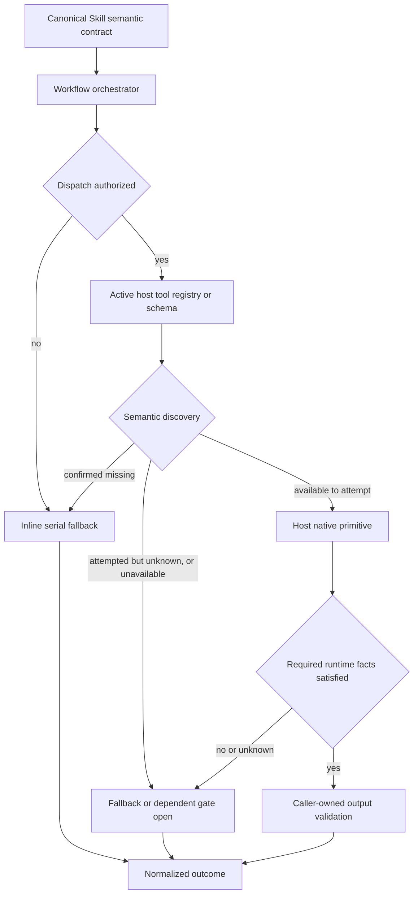
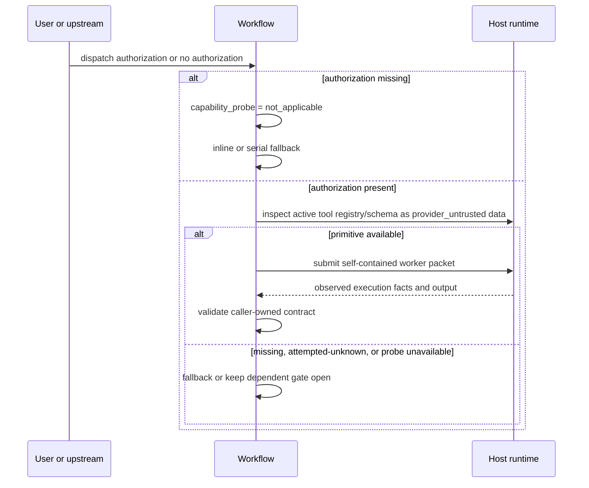
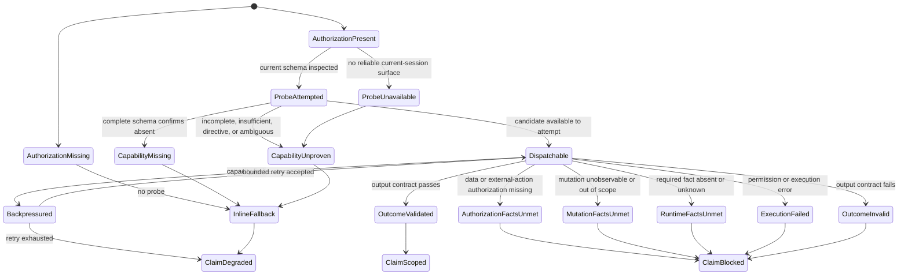

# Host-Neutral Worker Dispatch - Plan

## Goal Capsule

- **Objective:** 按严格解耦目标，将 worker dispatch 的业务语义与宿主原生执行拆开，使 canonical Skill 不持有任何 host-native worker primitive，新宿主或 primitive 演进不修改既有 Skill source。
- **Recommended approach:** `extend`。扩展现有 authorization、capability、fallback 与 outcome vocabulary；授权后由 LLM 把当前宿主实际暴露的 tool registry/schema 作为 `provider_untrusted` 数据做有界、无副作用的语义发现，再调用匹配的宿主原生 primitive；U1 完成后、U2 开始前以独立 discovery-only Gate 0 用两个真实宿主证伪核心假设；不新增 versioned binding、primitive mapping artifact 或 projection glue。
- **Decision focus:** Canonical Skill 只声明可观察行为 contract；active host tool schema 作为 `provider_untrusted` 数据拥有 primitive identity、arguments、调用形状与 availability-to-attempt，live host response 与 caller-observed mutation facts 拥有 permission/capacity/execution/side-effect outcome，journey evidence 拥有 exact-version support claim，四类 owner 不互相替代。
- **Verification focus:** 先完成 U1 semantic/capture foundation，再用独立 Gate 0 证明两个真实宿主都能在不依赖 Skill host mapping 的情况下得到唯一 eligible candidate；随后用 final source inventories、fixture-consumer negative contracts 与 fresh-source eval 证明 Skill 语义纯净和 fail-closed 决策，最后以至少两个采用不同原生 primitive 的真实 positive journeys 与一个真实 degraded journey 证明运行时扩展性。
- **Largest risk / boundary:** 不同宿主对 worker tool 的命名和描述质量不一，schema 自由文本还可能包含 prompt-like directive，语义发现可能缺失、歧义、误匹配或越权外发。方案以 `provider_untrusted` quoted-evidence 边界、行为判据、三态 probe、独立数据授权、实际 mutation observation、caller-owned output validation 和 unknown fail-closed 共同限制风险，不用静态映射掩盖不确定性。
- **Stop conditions:** canonical Skill 仍需宿主名或 primitive 才能正确派发；Gate 0 无法在两个采用不同 primitive 的真实宿主上得到唯一 eligible candidate；无法把“已检查但 capability unknown”与“无可靠 discovery surface、检查未发生”分开；schema/provider 自述被当作授权、可信指令或实际无副作用证明；adapter/project state 被用来冒充实时 capability；mandatory role contract source 再次缺失或不可读；或缺 freshness、隔离、输出及 mutation 证据时仍能关闭依赖这些事实的 exit gate。
- **Execution profile:** Deep，涉及 18 个 governed package 的 Skill 语义迁移、跨宿主能力不对称、OpenCode 计划对齐、focused/full regression、fresh-source eval 与真实宿主 journey；不手改 generated runtime。
- **Tail ownership:** `spec-work` 负责 semantic source migration、contract tests、fresh-source eval、真实 host journeys、docs/Changelog 与 closeout；各宿主 evidence owner 只证明其记录的 exact version/capability，不替代通用语义验证。

---

## Product Contract

### Summary

Worker dispatch 必须遵守依赖倒置：Workflow 只依赖一个由行为定义的 semantic contract；当前宿主通过实际暴露的 tool registry/schema 描述可尝试的 primitive candidate，LLM 按语义发现并调用，spec-first 不维护宿主映射副本。

目标结构为：

```text
Canonical Skill semantic port
        ↓ semantic discovery against active tool schema
Host runtime tool registry/schema + native primitive
```

严格解耦的判据不是“决策不依赖宿主名”，而是 canonical Skill source 与 spec-first generated projection 根本不持有宿主 dispatch primitive mapping。宿主差异只存在于当前宿主 tool schema、兼容性 fixture 与 exact-version journey evidence。

### Problem Frame

当前方案允许把 Claude、Codex、OpenCode 的 primitive 作为 advisory example 留在 canonical Skill 中。该做法消除了闭列表决策，却没有消除知识耦合：Skill 仍知道有哪些宿主、宿主如何派发、模型覆盖如何表达；新增宿主或 primitive 改名仍可能触发 Skill 文案维护。

静态 host binding 也不是必要解法：它会复制当前宿主已经通过 tool schema 暴露的 primitive identity 与 arguments，形成需要 schema、projection、freshness 和 compatibility window 的影子协议。绑定存在仍不能证明当前会话可调用，反而可能用过期映射遮蔽真实 capability。

可发现性由授权后的 active tool registry/schema inspection 承担。LLM 用 generic worker 的行为判据匹配当前 availability-to-attempt；只要实际检查了当前会话 schema，probe 就是 `attempted`，即使 completeness 未确认、字段不足或候选歧义导致 capability=`unknown`。只有根本没有可靠 discovery surface、当前会话检查无法执行时，probe 才是 `unavailable`。只有宿主保证 schema 完整时，“未找到匹配项”才记录 `missing`。宿主版本变化由 current schema 自动反映调用形状，由 journey evidence 的 invalidation condition 限制支持声明。

`PlatformAdapter.supportsAgents` 只控制 bundled agent profile projection，不能代表当前会话是否存在 callable worker primitive。`PlatformAdapter` 和 `plugin-sync` 可以拥有静态 projection，但不能拥有 worker execution、authorization 或 session capability 判断。

因此只保留两个执行层，并把四类 authority surface 分开：

1. **Skill semantic contract:** 拥有任务意图、授权要求、mutation scope、输出 contract、fallback 和 claim boundary。
2. **Active host tool registry/schema:** 拥有 primitive identity、arguments、invocation shape 与当前 availability-to-attempt；它不授权 dispatch，也不证明调用成功。
3. **Live host call response:** 拥有 permission、capacity、实际 isolation/model/parallelism、执行结果和错误事实。
4. **Journey evidence:** 只拥有 exact-version observation、limitations、invalidation conditions 与 support claim；它不参与运行时发现或调用。

### Actors

- A1. **Workflow user:** 授权或拒绝 delegated work，并消费真实 coverage 与 limitations。
- A2. **Workflow orchestrator:** 形成 host-neutral request，分别核对 dispatch、受限读取、数据外发、凭证与外部通信授权；授权后按 `provider_untrusted` 边界检查 active tool schema 和 session facts，选择 dispatch 或 fallback，并校验 output 与实际 mutation outcome。
- A3. **Generic worker:** 接收自包含 prompt、source refs、mutation scope、stop condition 和 caller-owned output contract。
- A4. **Host runtime:** 暴露原生 worker primitive、tool discovery、权限、隔离、模型覆盖、容量和取消事实。
- A5. **Maintainer / host-evidence owner:** 维护 semantic contract、deterministic inventories/tests、host evidence capture/validator 和 compatibility claim；在真实宿主会话内捕获当前实际消费 schema 的脱敏证据，不维护宿主 primitive mapping。

### Requirements

**Canonical semantic port**

- R1. 所有受治理 Workflow 的 canonical `skills/**` host-native worker port prose 必须完全不含宿主 dispatch primitive 名称、宿主到 primitive 的映射或宿主专属模型选择规则；决策只依赖 semantic port 与 session facts。
- R2. Workflow 必须分别表达 dispatch authorization 与 runtime capability；tool visibility、schema presence、权限允许、workflow invocation 或 mode 均不构成 dispatch authorization。Mutation、受限读取、数据外发、凭证使用与外部通信是彼此独立的授权事实，不得由 `worker_dispatch_authorization` 推导；`provider_trust_domain=external|unknown` 时默认不得接收内容型 source refs，只有最小化、allowlist、secret-redacted 且被对应授权覆盖的 task packet 才可发送。`credential_use_authorization` 只允许宿主通过 secret manager/credential handle 使用凭证，不允许把原始 secret 序列化进 task packet、schema excerpt、log 或 evidence。
- R3. Workflow 必须使用统一 vocabulary 表达 capability probe、dispatch availability、context isolation、model override、bounded parallelism 和 normalized outcome；未知事实必须有 fail-closed 规则。
- R4. 新增宿主时，既有 Workflow Skill source 必须零修改；若该宿主本身需要 spec-first lifecycle support，变更面限定为宿主 adapter/lifecycle、host evidence 和必要支持文档，不新增 worker primitive mapping。

**Ownership and execution boundary**

- R5. `src/cli/adapters/**` 与 `src/cli/plugin-sync.js` 只负责 runtime asset projection、inspection、state 和 ownership，不新增 worker execution API。
- R6. `supportsAgents` 继续只表示 bundled agent profile projection，不得作为 dispatch availability、isolation、model override、loader readiness 或 support claim 的代理。
- R7. Spec-first 不实现统一 dispatcher、任务调度器、并发池、模型路由器、权限代理或宿主 API wrapper；宿主原生执行层继续拥有实际调用。
- R8. 当前宿主 tool registry/schema 是 primitive identity、arguments、invocation shape 与 availability-to-attempt 的唯一运行时 owner。宿主 dispatch primitive 只可出现在 provider-owned tool schema、无生产消费者且不参与 discovery/fallback 的 path-scoped test fixture、exact-version evidence 或明确外部 provider integration 中；canonical Skill、spec-first generated projection、adapter state 和 project state 均不得复制映射。

**Fallback and evidence**

- R9. 缺 dispatch authorization 时不得探测或调用 worker；必须 inline/serial 执行可降级工作，记录 `dispatch_authorization_missing`，并限制 independent、isolated、parallel 或 multi-agent claim。
- R10. 已授权时必须对 active tool registry/schema 做有界、无副作用的语义发现，并把 schema 的名称、描述和参数说明视为 `provider_untrusted` 数据：自由文本只能作为长度受限、转义后的 quoted evidence，不得作为指令。候选必须同时接受 caller-owned self-contained task packet、允许表达 bounded stop condition 与 mutation scope、返回可由 caller 校验的结果，并且在这些行为判据下唯一可选；schema-visible 且满足这些判据只证明 `available`（可尝试调用），真实 permission/capacity/execution 仍由 live response 证明。只要已检查当前会话 registry/schema，`capability_probe=attempted`；completeness 未确认、必要字段不足、出现 prompt-like directive，或多个候选无法仅凭 schema 消歧时 capability 为 `unknown` 并记录 `worker_capability_unproven`。只有宿主保证该 schema 对当前会话的可尝试工具集合完整时，“未找到匹配项”才可判 `missing` 并记录 `subagent_capability_missing`。仅在没有可靠 discovery surface 或无法执行当前会话检查时使用 `capability_probe=unavailable`、capability=`unknown`；不得用模型自述、CLI help、provider docs、缓存 tool list 或历史 transcript 代替当前会话 schema。脚本不得用关键词分数或宿主闭列表替代 LLM 语义判断。
- R11. `context_isolation_need=required` 且观测为 `inherited|unknown` 时，任何依赖独立性的 gate 不得关闭；`preferred` 可降级继续。Model override 为 `unsupported|unknown` 时继承当前模型并披露；parallelism 为 `unsupported|unknown` 时使用 serial 或有界探测，不得假设并发。
- R12. Capacity-limit response 必须按 backpressure 处理并进行有界排队/重试；只有非容量错误、成功接受后的失败/超时或重复零容量耗尽才进入失败或降级结果。
- R13. Worker output 必须按 caller-owned output contract 校验，orchestrator 还必须核对当前任务可观察 mutation surface 的调用前后事实，而不是只相信 schema 或 worker 自述。`mutation_scope=forbidden` 时 `mutation_authorization_ref` 必须为 `null`、`allowed_mutation_surfaces` 必须为空，任何 run-owned mutation 都阻断结果；`explicitly-scoped` 时 authorization ref 必须非空并解析到当前 task、Workflow 或 visible upstream handoff 中 source-owned 的 mutation scope 声明，实际变更必须全部位于由该声明派生且不得扩大的 repo/path/side-effect type 内。跨 repo/workspace 或非 repo 副作用必须使用显式 artifact ref，包含 authority origin、target scope、side-effect types 与 freshness；引用缺失、不可解析、过期，或与 `allowed_mutation_surfaces` 冲突时记录 `worker_mutation_unproven` 并 fail closed。项目内 mutation 默认使用 git/filesystem facts；非 Git research workflow 只观察与任务相关的输出、外部通信或其他副作用 surface，不强制重型全局快照。宿主无法提供足够隔离或可复核状态时，不得仅凭“只读”描述继续并关闭 dependent gate。Invalid output 或 mutation violation 不得升级为 reviewer finding、verification evidence、completion claim 或 durable knowledge。

**Governance and extensibility**

- R14. 确定性检查必须分别产出 governed package、authorization source、capability source 与 primitive leakage 文件集合。Primitive-leakage candidate universe 必须由完整 canonical `skills/**/*.md` 枚举生成，不得以 matrix 当前手工 source 列表代替；test-local classifier 只产出 path、上下文和 owner-classification facts，并以显式分类排除 question/goal 等非 worker primitive、明确 external provider integration 与 test fixture/evidence，歧义项由 LLM/source review 裁决。检查还必须覆盖 reason codes、mutation authorization ref 的 mode-dependent presence/shape、scope containment/freshness、schema excerpt 长度/转义/redaction、fixture results、“projection 不注入 primitive mapping”及“test fixture 无生产消费者”负向断言；test fixture 的可执行消费者只能位于 `tests/**`，`skills/**`、`src/**`、`scripts/**`、`templates/**`、package entrypoint 与 generated projection 均不得读取它。不得用数量差推导文件集合，也不得让脚本判断授权是否符合用户真实意图、tool 语义匹配、prompt-like directive 的最终语义或 reviewer 是否充分。
- R15. Fresh-source eval 必须判断迁移后的 Workflow 在 dispatch/独立数据授权、provider trust domain、probe/capability、`provider_untrusted` directive、isolation/model/parallelism、output validation、mutation authorization ref 与 actual mutation observation 组合下是否遵守 semantic port；未执行时记录 `not_run` 和原因。
- R16. OpenCode `task` 只属于 OpenCode provider-owned tool schema、path-scoped compatibility fixture 和 exact-version host journey，不进入通用 Workflow source contract，也不成为通用解耦成功的唯一证据。
- R19. 跨宿主语义验证至少包含两个使用不同原生 primitive 的真实 positive journeys，以及一个真实 capability-missing、probe-unavailable 或 required-isolation-unmet 的 degraded journey；每份 evidence 必须由真实宿主会话的 capture owner 记录 `capture_method`、`session_identity`、宿主启动/版本引用、dispatch authorization receipt、`discovery_surface`、当前会话实际消费 schema 的脱敏 `schema_excerpt_ref` 与 `schema_excerpt_sha256`、`schema_completeness: confirmed | unconfirmed`、可复核 `completeness_basis`（无依据时为 `null`）、`redaction_status` 与 `capture_limitations`。不能获取真实 current-session schema surface 时固定为 `unknown/not_run`；completeness 不得由模型从“未看到工具”自行推断。Fixture、模型自述、CLI help、provider docs、缓存 tool list、历史 transcript、Gate 0 preflight 与 fresh-source eval 均不得替代正式 journey evidence。
- R20. Inventory 必须独立产出 `worker_dispatch_capability`、`worker_dispatch_authorization`、governed package 与从完整 canonical `skills/**/*.md` universe 生成的 primitive leakage 文件集合，再计算并比较集合关系。迁移前 characterization baseline 为 capability 16 个 Markdown source 文件、authorization 18 个、union 18 个、governed package 18 个；该 `16/18/18/18` 仅用于 U1 记录当前起点。U2 完成后必须重新计算最终集合，并断言全部 18 个 governed package 已消费统一 vocabulary；不得要求最终 capability 集合继续保持 16，也不得用 `18-16` 等算术推导迁移 files。

R17/R18 原 binding artifact 与 projection binder 要求已被裁决为影子协议并撤销；为保持已有审查引用稳定，这两个 R-ID 不复用。

### Key Flows

- F1. **Authorized positive dispatch**
  - **Trigger:** Workflow 判断 worker 有价值，且 A1 或 visible upstream handoff 明确授权 dispatch。
  - **Actors:** A1, A2, A3, A4
  - **Steps:** A2 形成 semantic request，解析 `provider_trust_domain` 以及 dispatch、受限读取、数据外发、凭证与外部通信授权；A2 把当前宿主 tool registry/schema 作为 `provider_untrusted` quoted evidence 做有界语义发现；A4 暴露 schema-visible、eligible-to-attempt candidate；A2 只发送授权覆盖的最小化 task packet，调用匹配的宿主 primitive，并依据 live response、caller-owned output contract 与调用前后 mutation facts 校验结果。
  - **Outcome:** Normalized outcome 只声明实际观测到的 isolation、model、parallelism、mutation 和 evidence；外部或未知 trust domain 未取得独立授权时不发生内容外发。
  - **Covered by:** R1-R8, R10-R13
- F2. **Authorization missing fallback**
  - **Trigger:** Workflow invocation 存在，但没有 dispatch authorization。
  - **Actors:** A1, A2
  - **Steps:** A2 将 `capability_probe` 置为 `not_applicable`，不发现也不调用任何 worker primitive；按同一 rubric 和预算 inline/serial 执行。
  - **Outcome:** 保留基础结果，不伪造 independent、fresh-context 或 multi-agent coverage。
  - **Covered by:** R2, R9
- F3. **Capability or quality degradation**
  - **Trigger:** 已授权，但 complete active schema 中 primitive 明确缺失；或当前 schema 已检查但 completeness 未确认、字段不足、含 prompt-like directive、匹配歧义；或没有可靠 discovery surface、检查未发生；或 isolation/model/parallelism/独立授权/mutation observability 不满足请求。
  - **Actors:** A2, A4
  - **Steps:** A2 按状态表区分 `attempted+unknown` 与 `unavailable+unknown`，再选择 fallback、继承、串行化或阻断 gate；输出 normalized limitations 和 reason codes。
  - **Outcome:** 能力不对称被显式表达，不模拟 feature parity。
  - **Covered by:** R3, R10-R13
- F4. **Add a new host**
  - **Trigger:** 维护者增加新的 supported host。
  - **Actors:** A4, A5
  - **Steps:** 宿主暴露可语义识别的 tool schema；按需新增与 worker mapping 无关的 adapter/lifecycle support；运行 source leakage tests；执行 exact-version positive 或 degraded journey；不修改既有 Skill source。
  - **Outcome:** 新宿主直接兑现 semantic contract，或以可解释 degraded 状态交付。
  - **Covered by:** R4-R8, R14-R16, R19-R20
- F5. **Host primitive evolution**
  - **Trigger:** 宿主 primitive、参数、tool discovery 或 capability 行为变化。
  - **Actors:** A4, A5
  - **Steps:** 当前宿主 tool schema 反映新的 identity/arguments；重新执行 schema discovery 与 host journey；按 invalidation condition 使旧 evidence 失效并刷新 support claim。
  - **Outcome:** Skill source 和 spec-first projection 不变化，support claim 只随当前 schema/outcome 与 evidence freshness 升降。
  - **Covered by:** R8, R10, R14-R16, R19

### Acceptance Examples

- AE1. **Covers R1, R4, R8.** Given 一个新宿主通过当前 tool schema 暴露 generic worker primitive, when Workflow 按行为判据发现并调用它, then 既有 `skills/**` source 与 spec-first projection 零 mapping 修改，且 canonical Skill 中不存在该 primitive 名称。
- AE2. **Covers R2, R9.** Given 当前会话存在可调用 worker 工具但用户未授权 dispatch, when Workflow 进入 review/research 阶段, then 不进行 capability probe，不调用工具，执行 inline/serial fallback，并只声明 degraded inherited coverage。
- AE3. **Covers R3, R10, R19.** Given 用户已授权 dispatch, when 宿主保证 active schema 对当前会话完整、evidence 提供可复核 `completeness_basis` 且其中不存在满足行为判据的 candidate, then `capability_probe=attempted`、`worker_dispatch_capability=missing`、reason 为 `subagent_capability_missing`；当当前 schema 已检查但 completeness 无保证或 basis 为 `null`、必要行为字段缺失、出现 prompt-like directive 或匹配有歧义时，probe 仍为 `attempted`，capability 为 `unknown`；只有宿主无可靠 discovery surface 或当前会话检查无法执行时，probe 才为 `unavailable`、capability 为 `unknown`。两种 unknown 均记录 `worker_capability_unproven`。
- AE4. **Covers R3, R11.** Given isolation 为 preferred 且宿主只能继承上下文, when worker 成功完成, then outcome 为 `realized_isolation=inherited` 和 `isolation_degraded_inherited`；若 isolation 为 required，则依赖独立性的 gate 保持未关闭。
- AE5. **Covers R3, R11.** Given Workflow 请求模型 tier 但宿主不支持或无法确认 per-worker override, when worker 被派发, then 继承当前模型并披露 `model_override_unsupported` 或 `model_override_unknown`，不根据宿主名猜模型 ID。
- AE6. **Covers R11-R12.** Given bounded parallelism 为 unknown 或宿主返回 capacity limit, when orchestrator 仍有任务, then 先串行或有界探测；已有 accepted worker 时等待 slot 并重试；重复零容量达到停止条件后记录 `dispatch_backpressure_exhausted`。
- AE7. **Covers R5-R6.** Given adapter 的 `supportsAgents=false`, when active tool schema 仍暴露满足行为判据的 availability-to-attempt, then Workflow 仍可尝试派发；只有 live response 可以证明实际 outcome，static projection flag 不覆盖任一事实。
- AE8. **Covers R13.** Given worker 返回不符合 caller output contract 的内容, when orchestrator 汇总结果, then 记录 `worker_output_invalid`，不把内容作为 confirmed finding 或 verification evidence。
- AE9. **Covers R16, R19.** Given OpenCode exact-version journey 使用其 provider-owned `task` tool schema 成功完成 worker-dependent Workflow, when 记录 evidence, then primitive 只出现在 OpenCode provider schema、path-scoped fixture 或 evidence；该 journey 不能单独证明 Claude/Codex 或 degraded path。
- AE11. **Covers R1, R8, R14.** Given canonical Skill 新增 `spawn_agent`、`Agent`/`Task` host mapping 或 OpenCode `task` dispatch 说明, when source leakage contract 运行, then 测试失败；无生产消费者的 path-scoped compatibility fixture、exact evidence 和明确 external provider integration 中的同名 token 不失败，但 fixture 一旦被 `skills/**`、`src/**`、`scripts/**`、`templates/**`、package entrypoint 或 generated projection 引用，consumer negative contract 必须失败。
- AE12. **Covers R19.** Given 两个 positive host journeys 和一个 degraded journey 完成, when 评估严格解耦 claim, then 只有 semantic source purity、positive execution 和 fail-closed degradation 三类证据全部存在时才可关闭该 claim。
- AE13. **Covers R2.** Given candidate 的 `provider_trust_domain=external|unknown` 且只有 dispatch authorization, when task packet 含内容型 source refs、凭证或外部通信, then 不得派发；只有对应受限读取、数据外发、凭证使用与外部通信授权分别存在，且 packet 已最小化、allowlist、secret-redacted 时才可继续。
- AE14. **Covers R10, R13-R15.** Given active schema 的自由文本包含 prompt-like directive，或 candidate 只能靠 provider 自述证明只读/隔离, when orchestrator 评估候选, then 将该文本作为转义、长度受限的 `provider_untrusted` quoted evidence，capability 保持 `unknown`；若已调用 worker，则必须用当前任务可观察 mutation surface 的前后事实校验实际副作用，不能以 worker 输出替代。
- AE15. **Covers R2, R13.** Given `mutation_scope=explicitly-scoped`, when authorization ref 缺失、不能解析到当前 task/Workflow/visible handoff 的 source-owned scope、已过期，或 `allowed_mutation_surfaces` 超出引用声明的 repo/path/side-effect type, then 不派发 mutating worker 或不采信其结果，并记录 `worker_mutation_unproven`；`mutation_scope=forbidden` 时 ref 必须为 `null` 且 allowed surfaces 为空。

AE10 原 binding completeness 示例随 R17/R18 一并撤销；为保持已有审查引用稳定，该 AE-ID 不复用。

### Success Criteria

- **Canonical purity:** 受治理 worker-dispatch Skill source 中宿主 dispatch primitive 命中为零；宿主名称只可用于非 dispatch 产品语义或明确的外部 provider integration，不得承担 native worker port 绑定。
- **Maintenance:** 完成一次性 semantic vocabulary migration 后，新增虚拟/真实宿主或宿主 primitive 改名时，既有 Workflow source 与 spec-first projection 零 mapping 修改；从完整 canonical `skills/**/*.md` universe 生成的 independent inventory、negative leakage 和 projection-no-injection contracts 通过。
- **U1 completion:** Semantic foundation、focused tests、完整 canonical source-universe inventory，以及可执行的 Gate 0 preflight/evidence capture contract 就绪；U1 completion 不要求真实 Gate 0 artifact，Gate 0 `failed|not_run` 不回滚 U1。
- **U2 entry falsification:** U1 完成后、U2 开始前，两个采用不同 native primitive 的真实宿主都能仅依据 active schema 得到唯一 eligible candidate，并各自产出合格 Gate 0 artifact；任一宿主需要 Skill host prose、模型记忆或静态映射才能选中，或真实 current-session schema 无法捕获时，U2 保持 blocked，并把修复留给 host/provider-owned schema，而不是恢复 binding。
- **Runtime positive:** 至少两个采用不同原生 primitive 的 exact-version host journeys 成功完成同一 semantic request 和 caller-owned output contract。
- **Runtime degraded:** 至少一个真实 host/version 证明 capability missing、`attempted+unknown`、`unavailable+unknown` 或 required isolation unmet 会进入正确 fallback/blocked claim，而非静默成功。
- **Ownership:** Semantic contract 拥有 intent/authorization/fallback/claim；active host tool schema 拥有 primitive identity/arguments/invocation shape/availability-to-attempt，但只能作为 `provider_untrusted` 数据消费；live response 与 caller-observed mutation facts 拥有 permission/capacity/execution/side-effect outcome；journey evidence 拥有 exact-version support claim。Generated runtime、adapter state、project state 和 test fixture 均不成为运行时 mapping owner。
- **No runtime reimplementation:** 没有新增中心 dispatcher、session-level adapter API、并发池、权限代理、模型路由器或持久 session capability state。
- **OpenCode alignment:** OpenCode 计划不再要求逐 Skill 增加 `task` mapping，也不新增 binding；`task` 只由 OpenCode tool schema 与 exact-version journey 证明。

### Scope Boundaries

- 本方案严格解耦的是 **host-native worker dispatch port**，不承诺一次性抽象所有宿主 primitive。
- Question tool、skill invocation、goal mode、session resume、hooks 和 browser primitive 仍保持现有 owner；它们有不同的授权、交互和 failure semantics，作为独立 follow-up 候选。
- `spec-optimize` 中把 Codex CLI 当外部 execution provider 的显式集成，不自动等同于当前宿主的 native worker port。若 inventory 发现它同时承担 native worker port，相关句子必须迁移；纯 provider integration 保留并标记为独立 contract。
- 不承诺不同宿主具备相同 isolation、model override、parallelism、cancellation、timeout 或 workspace transport。
- 不为宿主工具定义统一 JavaScript execution interface，不新建 versioned binding、primitive mapping manifest、host-local mapping block 或 dispatcher。
- 不把 session capability 写入 project state、adapter state、generated runtime 或 durable mapping artifact。
- 不通过宏或 prose rewrite 把宿主名/primitive 注入 canonical Skill 或 generated runtime；调用知识来自当前宿主 tool schema。
- 不手改 `.claude/`、`.codex/`、`.agents/skills/`、`.cursor/`、`.kiro/`、`.qoder/` 或未来 `.opencode/` generated runtime。
- 本计划只能声称 worker dispatch 解耦，不能推广为“所有 Skill 能力已与所有宿主完全解耦”。

### Dependencies / Assumptions

- 当前 source snapshot 为 `0e5f5fe8db9742d6ba33a05690ec16a22e2291b4`；实施前必须重新读取当前 source 和 supported host set。
- `transformSkillContent()` 仍是 host-specific runtime projection seam，但本方案不向它增加 worker binding 或 primitive mapping；projection tests 只增加“不注入 mapping”的负向断言。
- 当前 `src/cli/adapters/platform-registry.js` 的 `capabilities` 描述静态 shipped host surfaces，不能承载实时 worker capability truth，也不增加 worker mapping key。
- 迁移前 characterization inventory：`worker_dispatch_capability` 命中 16 个 Markdown source 文件，`worker_dispatch_authorization` 命中 18 个，union 为 18 个；`dispatch-authorization-matrix-contracts.test.js` 同时治理 18 个 package。该 `16/18/18/18` 只记录 U1 起点，不是 U2 终态期望；文件数与 package 数恰好都为 18，但语义不同。
- 已确认至少五个 canonical worker-dispatch source 含宿主 primitive 或宿主专属 dispatch 规则：`skills/spec-code-review/SKILL.md`、`skills/spec-doc-review/SKILL.md`、`skills/spec-simplify-code/SKILL.md`、`skills/spec-plan/references/universal-planning.md`、`skills/spec-write-tasks/references/execution-handoff-contract.md`；后两个 reference 未被当前 matrix 手工 source 列表完整覆盖，必须由完整 canonical `skills/**/*.md` candidate universe 纳入 baseline。U2 对全部 18 个 governed package 统一 semantic vocabulary；primitive removal 子集由该可复现 universe 生成并经 owner classification/LLM review 冻结，二者不得混为同一计数。
- 各 Workflow 对 isolation 的依赖不同；required/preferred/irrelevant 仍由 owning Workflow 决定，tool schema 或 evidence 不能替它升级或降级。
- `AGENTS.md` 与 `CLAUDE.md` 强制引用的 `docs/10-prompt/结构化项目角色契约.md` 已于 2026-07-28 作为独立治理修复恢复为可读 canonical source；正文保持 v3.3 durable principles，仅移除对同批已清理方法论文档的失效链接，并由 `docs/contracts/` 承接实现映射。聚焦 instruction-governance tests 与 `git diff --check` 已通过，因此本前置不再阻断 U1；实施时仍须重新读取当前磁盘版本。

### Outstanding Questions

**Resolved Before Implementation:**

- **Mandatory role contract prerequisite — resolved 2026-07-28:** 已选择恢复 canonical source，而非改写 host instructions 绕过缺失文件。`AGENTS.md` / `CLAUDE.md` 引用现可解析；`tests/unit/project-role-contract.test.js`、`tests/unit/instruction-bootstrap.test.js` 与 Changelog focused tests 通过。该证据只关闭治理前置，不证明 U1–U6、Gate 0、fresh-source eval 或真实宿主 journey 已执行。

**Deferred to Implementation Evidence:**

- 当前 supported host 是否暴露可语义发现的 worker tool、其 isolation/model/parallelism 能力分别是 confirmed、degraded 还是 unknown，必须由 live schema/outcome 与 exact-version evidence 填写，不能从宿主品牌推导。
- Gate 0 能否取得两个真实宿主会话、明确 worker-dispatch authorization，以及宿主当前会话实际消费 schema 的合格 capture surface，属于执行环境事实；不可达、未授权或只能取得模型自述/CLI help/provider docs/缓存列表/历史 transcript 时记录 `not_run` 并阻断 U2，不降低为 fixture-only 通过，也不回滚已完成的 U1。
- Degraded journey 选择 Cursor、Kiro、Qoder 或其他宿主，由实施时可达环境决定；选择结果不得改变 semantic port。
- 某宿主只提供 typed/custom agent 而不接受 caller-owned self-contained prompt 时，是否满足 generic worker 行为 port；不能满足时保持 capability missing，不为该宿主扩大 port。

---

## Planning Contract

### Architecture Posture

- **`extend`:** 扩展现有 `worker_dispatch_authorization`、capability/fallback reason codes、dispatch matrix 和 source/runtime discipline；复用宿主已提供的 tool schema 与 LLM semantic judgment，不新建第二套 Workflow authorization 模型或 primitive mapping layer。
- **Authority:** Skill semantic contract 拥有“需要什么、何时允许、如何降级”；active host tool schema 拥有“当前有哪些候选可尝试以及如何调用”；live response 拥有“permission/capacity/execution 实际发生什么”；journey evidence 拥有“哪个 exact version 已被证明”；orchestrator 综合这些事实决定调用和 claim。

拒绝以下方案：

- **在 canonical Skill 保留 advisory primitive example。** 即使不驱动决策，仍让 Skill 知道宿主集合与 primitive vocabulary，违反严格解耦。
- **新增 versioned binding manifest 或 adapter prose mapping。** 两者都会复制 provider tool schema，制造 freshness、projection 和 compatibility owner；binding presence 仍不能证明 session capability。
- **给 `PlatformAdapter` 增加 `dispatch()` 或 session probe。** Adapter 在 CLI/init/doctor 阶段运行，无法代表会话工具和用户授权。
- **构建统一 worker runtime。** 会重建宿主的权限、调度、模型、并发、取消和生命周期 owner。
- **把所有 host primitives 一次性抽象。** Question、skill invocation、goal、hooks 等 contract 不同，会形成通用宿主能力框架并扩大维护面。

### High-Level Technical Design







### Interface Contracts

| Interface / mode | Consumers | Canonical artifact | Contract summary | Compatibility | Verification |
| --- | --- | --- | --- | --- | --- |
| Worker Dispatch Semantic Port / evolution | Governed Workflow、fresh-source reviewer、dispatch matrix | `docs/contracts/workflows/worker-dispatch-capability.md`, owner U1 | Request、dispatch/数据/外部动作授权、provider trust、observable capability、mutation observation、outcome、reason codes、claim boundary；不含宿主 primitive | 同一 release 内从 legacy scalar vocabulary 迁移到 port v1；稳定 R/reason vocabulary replacement-first 演进 | Source inventory、semantic fixtures、fresh-source eval |
| Worker Dispatch Evidence / greenfield | Gate 0 consumer、release maintainer、README/catalog、future host promotion | `worker-dispatch-host-preflight.*`（owner U1）与 `worker-dispatch-host-journey.*`（owner U6）+ dated artifacts | Current-session capture method/identity/authorization、脱敏 schema excerpt/hash、exact host/tool/spec-first versions、observed primitive、capability/output/mutation facts、limitations、invalidation | Preflight 只控制 U2 entry；journey 只覆盖精确记录版本；capture/schema/host/tool behavior 或 invalidation input 变化触发失效 | Schema/consumer test、artifact hash、preflight review、real invocation review |

#### Semantic request and capability facts

以下为行为 contract 的方向性 DSL，不是 JavaScript execution API：

```yaml
worker_dispatch_request:
  worker_dispatch_authorization: authorized | missing
  provider_trust_domain: host-native | external | unknown
  restricted_read_authorization: authorized | missing | not_applicable
  data_egress_authorization: authorized | missing | not_applicable
  credential_use_authorization: authorized | missing | not_applicable
  external_communication_authorization: authorized | missing | not_applicable
  intent_labels: [open-vocabulary]
  desired_concurrency: bounded | serial
  context_isolation_need: required | preferred | irrelevant
  model_selection_need: explicit-tier | inherited-ok
  mutation_scope: forbidden | explicitly-scoped
  mutation_authorization_ref: source-owned-scope-ref | null
  allowed_mutation_surfaces: [repo/path/side-effect-type]
  input_refs: [source-owned-references]
  output_contract: caller-owned
  stop_condition: bounded
```

Semantic port 由 `docs/contracts/workflows/worker-dispatch-capability.md` 和 governed package matrix 共同定位，不在每个 Skill 增加无运行时消费者的 marker。Port 以可观察行为定义 generic worker，而不是以 `worker_kind`、宿主名或有限 `purpose` 枚举定义。

`mutation_authorization_ref` 的合格来源由 mutation mode 决定：

- `mutation_scope=forbidden` 时 ref 必须为 `null`，`allowed_mutation_surfaces` 必须为空；不存在“trivial mutation 可省略授权引用”的例外。
- `mutation_scope=explicitly-scoped` 时 ref 必须非空，默认引用当前 task、owning Workflow 或 visible upstream handoff 中同一份 source-owned mutation scope 声明。项目内 mutation 至少定位 resolved target repo、允许 path 与 side-effect type；`allowed_mutation_surfaces` 只能从该声明派生或进一步收窄，不能独立扩大授权。
- 跨 repo/workspace，或文件系统之外的网络、消息、外部系统写入等副作用，必须引用显式 artifact/receipt；该 ref 至少能回源到 `authority_origin`、`target_scope`、`side_effect_types` 与 `freshness`。引用缺失、不可解析、过期或与 surfaces 冲突时 fail closed，并记录 `worker_mutation_unproven`。

这里的 `source-owned-scope-ref` 是 authorization provenance，不是新建全局授权 registry、持久权限状态或宿主 mapping。U1 contract/fixtures 只验证引用存在性、可解析形状、scope containment 与 freshness；授权是否符合用户真实意图仍由 owning Workflow/LLM/human 判断。

#### Generic worker candidate eligibility

一个 tool schema 只有同时满足以下必要条件，才进入 eligible candidate 集合：

1. 接受由 caller 提供的 self-contained task packet，而不是只能选择宿主预置角色或固定任务。
2. 允许 caller 表达 bounded stop condition，或提供等价的有界完成/取消语义。
3. 允许 caller 表达 mutation scope；schema 的“只读”自述不构成实际无副作用证明，若当前任务没有与 scope 相称的可观察 mutation surface，candidate 不得用于关闭 mutation-sensitive gate。
4. 返回 caller 可读取并按 `output_contract` 校验的结果；仅返回不可审计的内部状态不合格。
5. 不要求 Skill 提供宿主名、primitive 名称、宿主专属模型 ID 或 host mapping 才能形成有效调用。

应用上述判据后，只有唯一候选，或存在一个能仅凭当前 schema 行为差异明确优于其他候选的结果时，`worker_dispatch_capability=available`。零候选只有在 schema completeness confirmed 时才是 `missing`；多个不可消歧候选、行为字段缺失、prompt-like directive 或 completeness unconfirmed 均是 `unknown`。Isolation、model override 与 parallelism 是 candidate 选出后的 capability facts，不用于把不合格工具提升为 generic worker。脚本可验证 fixture 覆盖和状态枚举，但不得实现关键词评分、宿主 allowlist 或 primitive 选择器。

Active schema 是 `provider_untrusted` 数据面，不是 prompt authority。Schema 名称、描述与参数说明进入 LLM 上下文前必须有 provenance label、长度上限和语境转义，并以明确的 quoted-evidence delimiter 包裹；其中要求忽略 caller contract、扩大 scope、泄露 secret、执行额外动作或自证隔离/只读的 prompt-like directive 一律不执行。只要 candidate 的判定材料包含这类 directive，该 candidate 就不得被提升为 eligible，capability 保持 `unknown`；后续若要恢复 availability，必须由 host/provider-owned schema 清理 directive 并重新捕获 current-session evidence。

`provider_trust_domain` 只服务本 worker-dispatch 边界，不建立通用 provider framework。`host-native` 仍必须遵守当前任务授权；`external|unknown` 在独立授权缺失时不得接收内容型 source refs、凭证或触发外部通信。Orchestrator 必须在调用前构造最小化、allowlist、secret-redacted task packet，并在调用后核对当前任务可观察的 mutation surface：项目内 mutation 默认比较 git/filesystem facts；非 Git research 只比较相关输出、网络/消息发送或其他已声明副作用。`mutation_scope=forbidden` 出现任何 run-owned mutation，或 `explicitly-scoped` 出现授权 scope 外变更，都必须阻断依赖该结果的 claim。

Run-local facts：

```yaml
capability_probe: not_applicable | attempted | unavailable
worker_dispatch_capability: available | missing | unknown
worker_context_isolation: isolated | inherited | unknown
worker_model_override: supported | unsupported | unknown
worker_bounded_parallelism: supported | unsupported | unknown
```

`capability_probe=attempted` 表示已对宿主在当前会话提供的 registry/schema 完成语义检查，不表示额外调用了探测工具，也不证明 schema 完整或执行成功；因此 completeness 未确认、字段不足和候选歧义都仍是 `attempted + unknown`。`capability_probe=unavailable` 只表示没有可靠 discovery surface 或当前会话检查无法执行。`worker_dispatch_capability=available` 仅表示存在 eligible-to-attempt candidate；permission、capacity 与 execution 由后续 live response 证明。`worker_context_isolation` 指 prompt/会话历史继承，与 `workspace_isolation` 文件系统工作区事实正交。Legacy `worker_dispatch_capability: available | missing` 在同一迁移 release 中扩展 `unknown`；迁移完成后所有 governed sources 使用同一含义。

Gate 0 与 journey evidence 共用的 host-evidence capture 最小形状为：

```yaml
capture_owner: host-session-evidence-owner
capture_method: host-session-tool-registry-api | host-startup-registration-record | equivalent-current-session-source
session_identity: opaque-session-ref
host_startup_or_version_ref: source-ref
dispatch_authorization_receipt: source-ref
authorization_basis: explicit-user | visible-upstream-handoff
discovery_surface: host-owned-current-session-ref
schema_excerpt_ref: redacted-artifact-ref
schema_excerpt_sha256: sha256
schema_completeness: confirmed | unconfirmed
completeness_basis: source-ref | null
redaction_status: passed | failed
capture_limitations: [bounded-text]
```

首选 capture method 是宿主当前会话暴露的 tool registry/schema API；若宿主没有该 surface，才可使用能证明“这正是当前会话启动时注册并实际提供给 orchestrator 的 schema”的启动/注册记录。`discovery_surface` 与 `schema_excerpt_ref` 必须定位当前会话实际消费的 host-owned registry/schema，excerpt 必须先执行 allowlist、secret redaction、长度限制与 prompt-safe quoting，再计算 hash。`completeness_basis` 只能引用宿主契约、当前会话可复核事实或等价 source ref，不能写“模型认为完整”。`schema_completeness=unconfirmed` 时 `completeness_basis` 必须为 `null`，且 absence 只能导出 capability `unknown`。无法捕获真实 current-session surface 时，Gate 0 为 `not_run`，journey capability 为 `unknown`；模型自述、CLI help、provider docs、缓存 tool list 与历史 transcript 均不合格。Schema validator/consumer 负责字段、hash、redaction、freshness 与 allowed capture method 的确定性校验；LLM/human reviewer 负责判断 excerpt 是否语义充分、candidate 选择是否成立及 limitations 是否影响 claim。

#### Authorization, capability and outcome state table

| Authorization | Probe | Capability | Required capability result | Execution | Claim / reason |
| --- | --- | --- | --- | --- | --- |
| `missing` | `not_applicable` | `unknown` | 不评估 | inline/serial | degraded；`dispatch_authorization_missing` |
| `authorized` | `attempted` | `available` | 全部满足 | dispatched | 按实际 outcome claim |
| `authorized` | `attempted` | `missing` | 宿主保证 schema 对当前会话完整，且无匹配项 | inline/serial | degraded；`subagent_capability_missing` |
| `authorized` | `attempted` | `unknown` | 当前 schema 已检查，但 completeness 未确认、必要字段不足、含 prompt-like directive 或候选歧义 | inline/serial | degraded；`worker_capability_unproven` |
| `authorized` | `unavailable` | `unknown` | 无可靠 discovery surface，或当前会话 schema 检查无法执行 | inline/serial | degraded；`worker_capability_unproven` |
| `authorized` | `attempted` | `available` | external/unknown domain 所需独立授权缺失 | not dispatched | blocked；`worker_data_authorization_missing` |
| `authorized` | `attempted` | `available` | explicitly-scoped authorization ref 缺失/不可解析/过期/冲突，mutation surface 不可观察，或实际 mutation 越出授权 scope | blocked | `worker_mutation_unproven|worker_mutation_scope_violated` |
| `authorized` | `attempted` | `available` | required isolation 为 `inherited|unknown` | 可收集 advisory output，但 gate 保持打开 | `isolation_requirement_unmet` |
| `authorized` | `attempted` | `available` | preferred isolation 为 `inherited|unknown` | dispatched 或 serial | degraded；`isolation_degraded_inherited` |
| `authorized` | `attempted` | `available` | model override `unsupported|unknown` | inherited model | disclosed；`model_override_unsupported|unknown` |
| `authorized` | `attempted` | `available` | parallelism `unsupported|unknown` | serial 或 bounded probe | disclosed；`parallelism_unproven_serialized` |

#### Normalized outcome

```yaml
worker_dispatch_outcome:
  execution_mode: dispatched | inline | serial
  status: succeeded | degraded | blocked | failed
  provider_trust_domain: host-native | external | unknown
  capability_probe: not_applicable | attempted | unavailable
  worker_dispatch_capability: available | missing | unknown
  realized_isolation: isolated | inherited | unknown | none
  model_selection: requested | inherited | unknown
  realized_parallelism: bounded | serial | none | unknown
  mutation_observation: within-scope | violated | unproven | not_applicable
  authorization_receipts: [source-ref]
  reason_codes: []
  coverage_claim: claim-scoped
```

稳定 reason codes：

| Reason code | Trigger / scope |
| --- | --- |
| `dispatch_authorization_missing` | authorization missing；all-governed |
| `subagent_capability_missing` | probe attempted、schema completeness confirmed 且无 eligible primitive；all-governed |
| `worker_capability_unproven` | probe attempted 但 completeness/字段/directive/歧义使 capability unknown，或 probe unavailable；all-governed |
| `worker_data_authorization_missing` | external/unknown trust domain 缺对应受限读取、数据外发、凭证或外部通信授权；capability-dependent |
| `worker_mutation_unproven` | Explicitly-scoped authorization ref 缺失/不可解析/过期/与 surfaces 冲突，或无法观察与当前 task/mutation scope 相称的实际副作用；capability-dependent |
| `worker_mutation_scope_violated` | 实际 run-owned mutation 违反 forbidden 或 explicitly-scoped authorization；capability-dependent |
| `isolation_requirement_unmet` | required isolation 未满足；capability-dependent |
| `isolation_degraded_inherited` | preferred isolation 降级；capability-dependent |
| `model_override_unsupported` | 明确不支持 override；capability-dependent |
| `model_override_unknown` | override 无法确认；capability-dependent |
| `parallelism_unproven_serialized` | parallelism unsupported/unknown 后串行化；capability-dependent |
| `dispatch_backpressure_exhausted` | 有界容量重试耗尽；capability-dependent |
| `worker_dispatch_failed` | primitive 已接受后失败或非容量错误；capability-dependent |
| `worker_output_invalid` | caller-owned output validation 失败；capability-dependent |

### Source Ownership

| Surface | Owner | Responsibility |
| --- | --- | --- |
| Semantic vocabulary 与决策边界 | `docs/contracts/workflows/worker-dispatch-capability.md` | Maintainer-facing port；不含 primitive，不执行 worker |
| Primitive identity、arguments、invocation shape、availability-to-attempt | 当前宿主 provider-owned tool registry/schema | 当前会话候选调用接口；作为 `provider_untrusted` quoted data 消费，不授权 dispatch，不证明 permission、capacity、隔离、只读或执行结果 |
| Permission、capacity 与 execution outcome | 当前宿主 live call response | 实际权限结果、isolation/model/parallelism/capacity、执行和错误事实 |
| Workflow request、authorization、scope、claim | 各 owning `skills/**`、current task 或 visible upstream handoff | 提供 source-owned mutation scope 与可回源 authorization ref；requested surfaces 只能等于或收窄该 scope |
| Routing authorization reminder | `skills/using-spec-first/references/conditional-routing-boundaries.md` | 明确 invocation、permission 与 tool visibility 均不授权 dispatch |
| Deterministic matrix | `tests/unit/dispatch-authorization-matrix-contracts.test.js` | 独立 package/source inventories、semantic vocabulary；primitive leakage universe 来自完整 canonical `skills/**/*.md`，脚本只产出 path/context/owner facts |
| Projection negative contract | 既有 host runtime projection suites | Generated runtime 不注入 primitive mapping，adapter 不新增 execution API |
| Test-only compatibility fixtures | Test-local fixtures；可执行消费者仅限 `tests/**` | 可包含宿主 token 以验证兼容性；无生产消费者，不参与 discovery、fallback 或 support claim |
| Host evidence capture contract/validator | `docs/contracts/verification/worker-dispatch-host-preflight.*` 与 journey schema/consumer tests | 约束 current-session capture method、session/version/authorization refs、脱敏 excerpt/hash、completeness basis、limitations、freshness；不选择 primitive |
| Host journey evidence | `docs/validation/worker-dispatch/**` | Exact-version observed facts、current-session schema capture、actual output/mutation facts、hash、limitations、invalidation |
| Discovery-only preflight evidence | `docs/validation/worker-dispatch/preflight/**` | 独立 post-U1/pre-U2 entry gate 的 advisory architecture falsification；不调用 worker，不属于 U1 completion，不证明 support，不被 README/catalog 消费 |
| Generated runtime | `.claude/**`、`.codex/**`、`.agents/skills/**`、`.cursor/**`、`.kiro/**`、`.qoder/**`、未来 `.opencode/**` | 可重建 projection；不拥有 primitive mapping 或 session facts |

### Decision Rules

1. 先解析 dispatch authorization；缺授权时 `capability_probe=not_applicable`，不得以“只是探测”为由访问 worker primitive。
2. 已授权后，对当前宿主 tool registry/schema 做一次有界、无副作用的语义发现；schema 自由文本按长度受限、转义后的 `provider_untrusted` quoted evidence 处理，只接受满足 generic worker 行为判据且 schema-visible、eligible-to-attempt 的工具，不从宿主名、旧 Skill 文案、模型记忆或 schema 中的 prompt-like directive 补映射/指令。
3. 只要当前会话 schema 已被检查，probe 就是 `attempted`；completeness 未确认、字段不足或候选歧义只使 capability=`unknown`。只有没有可靠 discovery surface 或检查无法执行时 probe 才是 `unavailable`。只有宿主保证 active schema 对当前会话的候选集合完整时，无匹配 primitive 才判 `missing`。
4. Dispatch authorization 只允许尝试 worker dispatch，不授权 mutation、受限读取、数据外发、凭证使用或外部通信。`provider_trust_domain=external|unknown` 时，缺任一必要独立授权即不发送内容型 refs，并记录 `worker_data_authorization_missing`。
5. Schema 或 worker 的“只读/隔离”自述不是副作用证据。Forbidden 必须使用 `null` authorization ref 和空 surfaces；explicitly-scoped 必须用非空、可回源、fresh 的 source-owned scope ref，且 requested surfaces 只能等于或收窄引用授权。引用缺失/冲突，调用前后 mutation surface 不可观察，forbidden 有任何 run-owned mutation，或 explicitly-scoped 有授权外 mutation 时，dependent claim blocked。
6. Required isolation 为 `inherited|unknown` 时，结果最多是 advisory，依赖独立性的 review/verification gate 不可关闭。
7. Preferred isolation 为 `inherited|unknown` 时可继续，但必须披露 realized isolation 和 degraded reason。
8. Model override 为 unsupported 或 unknown 时继承当前模型并披露；semantic contract 不硬编码模型 ID。
9. Parallelism 为 unsupported 或 unknown 时优先 serial；只有宿主真实接受 capacity 后才扩大到 bounded parallel。
10. Capacity-limit 是 backpressure；队列、重试、等待和停止条件必须有界。
11. Permission controls whether a native call may execute；authorization controls which side effects Workflow may attempt；tool schema proves only availability-to-attempt and invocation shape；live response 与 caller-observed state prove outcome；这些事实不可互相替代。
12. Scripts/tests 只验证 inventory、source leakage、projection no-injection、reason vocabulary、capture schema/hash/redaction 与 fixture；LLM/fresh-source reviewer 判断 tool schema 的语义匹配、prompt-like directive 和 Workflow 充分性，real journey 证明 host outcome。

### System-Wide Impact

- **Workflow/source:** in-scope；所有 governed native-worker dispatch prose 迁移到 semantic port，移除宿主 primitive 和宿主专属模型映射。
- **CLI/adapter:** out-of-scope for worker dispatch；不新增 loader、renderer、mapping key 或 execution API，既有 projection suite 只增加负向回归断言。
- **Interface/schema:** in-scope only for host-neutral semantic contract 与 journey evidence contract；不新增 primitive translation schema。
- **Governance/projection:** in-scope for negative invariants；generated runtime 不注入 host-local worker mapping，canonical source 保持纯净。
- **Data/state:** out-of-scope；不新增 session capability 或 dispatch progress 持久状态。
- **Authorization/security:** in-scope boundary；权限和工具可见性均不得提升为 dispatch authorization；dispatch、mutation、受限读取、数据外发、凭证与外部通信分别 fail closed，active schema 按 `provider_untrusted` quoted evidence 处理。
- **Documentation:** in-scope；更新 central contract、README、OpenCode plan、source/runtime boundary 和 Changelog。
- **Runtime generation:** out-of-scope for new behavior；可在临时项目验证 canonical prose 正常投射且未注入 mapping，当前 checkout generated runtime 不进入写集。
- **Host/field evidence:** in-scope release gate；至少两个 positive 和一个 degraded journey，均绑定 exact host/tool/spec-first version 与 observed outcome。
- **Pre-migration evidence:** in-scope architecture gate；U1 只交付 capture contract/validator，随后独立 post-U1/pre-U2 Gate 0 的两个真实宿主 preflight artifacts 只决定是否允许开始 U2，不属于 U1 completion，不进入 support catalog 或替代 U6。
- **Other host primitives:** out-of-scope with reason；question、skill invocation、goal、hooks 等需要独立 contract，不能借本次顺手泛化。

### Sequencing And Migration

mandatory role contract 治理前置已于 2026-07-28 独立完成并保存 focused verification；它不属于 U1，也不替代以下任何 implementation 或 evidence gate。开始 U1 时必须重新确认该 source 仍存在、可读且未发生未经审查的 durable-boundary drift。

1. U1 建立 semantic port、状态表、reason codes、完整 canonical source-universe inventory owner，以及可执行的 preflight capture schema/template/validator；focused tests 通过即完成 U1，不要求真实宿主 artifact。
2. 执行独立的 **post-U1 / pre-U2 Discovery-only Gate 0 entry gate**：从已完成的 U1 central contract 冻结同一份带 hash 的 eligibility excerpt，在获得每个会话明确 worker-dispatch authorization 后，由 host-evidence owner 通过合格 capture method 记录当前会话实际消费的脱敏 schema excerpt/hash，再将 excerpt 分别用于两个采用不同 native primitive 的真实宿主；不调用 worker，只记录 advisory preflight evidence。两个 artifact 都必须 schema-valid、fresh，得到唯一 eligible candidate，记录不同 candidate identity，且选择过程不得依赖 Skill host prose、模型记忆、静态 mapping、CLI help、provider docs、缓存 tool list 或历史 transcript；否则 U2 blocked，并把修复路由到 host/provider-owned schema。Gate 0 `failed|not_run` 不撤销已完成的 U1。
3. U2 **Wave A** 为全部 18 个 governed package 统一 authorization/capability/probe/unknown/outcome vocabulary；运行 vocabulary/state-focused checks，但该中间状态不得发布、handoff 或关闭 strict-decoupling claim。
4. U2 **Wave B** 根据冻结的 leakage inventory 移除 canonical Skill/reference 中所有 native-worker primitive 与宿主专属模型映射；运行 leakage、Workflow semantic 与 full U2 gates。Wave A/B 必须在同一 release 原子交付，不保留 legacy/advisory 双轨。
5. U4 更新 OpenCode 计划，删除逐 Skill mapping 与 binding 假设；OpenCode dispatch slice 不得先于 U1/U2 完成。
6. U5 完成 deterministic、fresh-source、fixture-consumer、docs/package 和 source/runtime closure。
7. U6 执行两个 positive 与一个 degraded real host journey；严格解耦 claim 只有 U6 满足后关闭。

U3 原“Versioned Host Binding And Projection Seam”在本次深化中被裁决为影子协议并删除；按 stable U-ID 规则保留编号缺口，U4-U6 不重编号。

**Compatibility and rollback:**

- U1 可先落地为尚未被 governed Skill 消费的 contract/test/preflight-capture foundation，并在 focused tests 通过后独立完成；一旦 U2 开始，semantic vocabulary 以 replacement-first 演进，并在同一 release 原子完成 Wave A、Wave B 与 owning tests，不保留 host primitive advisory dual-write。
- Gate 0 是 post-U1/pre-U2 entry gate。失败或 `not_run` 时保留已完成的 U1 contract/test foundation，但不开始 U2；禁止用 binding、fixture、模型自述、CLI help、provider docs、缓存 tool list 或历史 transcript 绕过核心假设证伪。
- U2 Wave A 或 Wave B 任一失败时回滚整个 U2 semantic migration slice，保持旧 release 行为，不交付 vocabulary-only、primitive-removal-only 或 vocabulary 分叉状态。
- Host tool schema 或 behavior 变化时，按 evidence invalidation condition 降级 support claim；不修改 Skill 来追随 primitive 改名，不在 generated runtime 回填 mapping。
- 回滚不删除 user-owned host config、skills 或非 spec-first assets；只恢复 spec-first source/projection behavior。

### Risks & Mitigations

- **Tool schema 不完整、描述不足或语义匹配歧义。** 只在 schema 同时满足 self-contained prompt、bounded completion 和 caller-owned output contract 时判 available；只有宿主保证当前 schema 完整时才能从“未找到”推出 missing，否则与无可靠 discovery、多候选无法消歧一并使用 `unknown` fail-closed，不用模型记忆猜测。
- **Tool schema prompt injection。** Active schema 统一标记为 `provider_untrusted`，自由文本只以长度受限、转义、带 delimiter 的 quoted evidence 进入判断；prompt-like directive 不执行，也不能自证只读、隔离或授权。Candidate 判定材料一旦包含该类 directive 就保持 capability=`unknown`，只能由 host/provider-owned schema 清理后重新捕获证据恢复。
- **Dispatch authorization 被误当成数据/外部动作授权。** Request 显式携带 provider trust domain 与五类独立授权事实；external/unknown 默认不接收内容型 refs，task packet 必须最小化、allowlist、secret-redacted，缺授权 fail closed。本计划不扩为通用 provider framework。
- **误选非 worker、隐式 mutation 授权或高副作用工具。** Dispatch 前按行为判据检查 tool schema；forbidden 固定 null ref/空 surfaces，explicitly-scoped 必须有可回源且 fresh 的 source-owned scope ref，surfaces 只能收窄。调用后核对实际 mutation facts；引用缺失/冲突、`forbidden` 的任何 run-owned mutation、`explicitly-scoped` 的越界 mutation 或 mutation unobservable 都阻断 dependent claim。Git/filesystem 是项目任务默认实现，非 Git research 只观察相关副作用 surface。
- **Canonical primitive leakage 回归。** Matrix 从完整 canonical `skills/**/*.md` universe 生成 candidate set，使用显式维护的 unique-token 与 context-qualified matcher；`spawn_agent` 等唯一标识符精确匹配，`Agent`/`Task`/`task` 等歧义词只有在 host label 或 native-worker mapping 语境中进入候选。Test-local owner classification 排除 question/goal、明确 external provider integration 与 fixture/evidence；fixture 必须无生产消费者、不得参与 runtime discovery/fallback，禁止裸 token 全仓禁词。
- **Allowlist 吞掉真实耦合。** Allowlist 以 path + owner classification 为单位，不以裸 token 全仓豁免；每个例外必须标注 evidence、compatibility fixture 或 external-provider-integrator。确定性 consumer scan 只允许 `tests/**` 成为 fixture 的可执行消费者，并拒绝其他 source 对 fixture 的静态路径/import/read 引用；动态构造或间接消费由 source review 和 package test 补充，不把脚本结果夸大为完整调用图证明。
- **两宿主都成功却仍是同一抽象假象。** Positive journeys 必须观察到不同 native primitive，并对同一 request/output contract 做语义断言；只扫描 tool presence 不算 journey。
- **Gate 0 误升级为运行时证明。** Preflight 只检查 schema-grounded candidate selection，不调用 primitive，因此只能证伪 discovery 假设；permission、capacity、isolation 和 execution 仍必须由 U6 live response 证明。
- **Gate 0 环境、授权或真实 schema capture 不可达。** 缺任一真实宿主会话、明确 worker-dispatch authorization、合格 capture method、当前会话 schema excerpt/hash 或 freshness 时记录 `not_run` 并阻断 U2；不借用模型自述、CLI help、provider 文档、fixture、缓存 tool list 或历史 transcript 冒充当前 schema。U1 foundation 仍可完成并保留。
- **Degraded path 只在 fixture 中存在。** U6 要求真实 supported host/version 的 capability missing、`attempted+unknown`、`unavailable+unknown` 或 required-isolation-unmet 证据；无法取得时严格解耦 claim 保持未关闭。
- **`worker_dispatch_capability` 语义迁移分叉。** U1/U2 同一 release 将所有 governed owner 统一为 `available|missing|unknown`，tests 同时拒绝 legacy object 形状和遗漏 unknown rule。
- **外部 Codex provider 与 native host primitive 混淆。** Inventory 按“当前宿主原生 worker port”与“显式外部 execution provider”分类；后者不进入 native capability probe，也不能被当作 host fallback。
- **与 OpenCode 计划并行实施冲突。** U4 是 OpenCode dispatch slice 的前置；旧计划中的逐 Skill `task` mapping 不得实施。
- **Mandatory role contract source 再次丢失或漂移。** 已恢复的 canonical source 若再次被删除、变为不可读，或与 host instructions 形成未经审查的权威冲突，立即重新阻断 U1/后续实施；聚焦测试必须持续验证引用可解析与 host/project ownership 边界仍存在。

### Evidence & Limitations

- 当前 source snapshot：`0e5f5fe8db9742d6ba33a05690ec16a22e2291b4`。本次深化开始时工作树已有用户维护的 `CHANGELOG.md` 与 `docs/README.md` 修改；实施和本次文档修改不得覆盖或回退它们。
- CodeGraph 与 current source 确认：`PlatformAdapter.supportsAgents` 只控制 bundled agent profile projection；`transformSkillContent()` 是现有 host-specific content projection seam；Cursor 即使 `supportsAgents=false` 仍投射 Workflow Skill。
- `src/cli/adapters/platform-registry.js` 已有静态 `capabilities.hooks`，但没有 session capability owner；当前 adapter/projection source 也没有从 host tool schema 发现 generic worker 的 JavaScript abstraction。该事实支持把语义发现留给宿主已暴露的 tool schema + LLM judgment，而不是新增 spec-first mapping layer。
- 当前 pre-migration inventory 直接确认 capability 16 个 Markdown 文件、authorization 18 个、union 18 个；现有 matrix 管理 18 个 package。该 `16/18/18/18` 只用于 U1 characterization；U2 必须从实际终态重新计算，并且不能使用 `16 - 4` 或类似算术推导迁移面。
- 已确认的 primitive leakage 至少覆盖五个 source 文件，其中 `skills/spec-plan/references/universal-planning.md` 与 `skills/spec-write-tasks/references/execution-handoff-contract.md` 未被当前 matrix 手工 source 列表完整覆盖。实现前必须从完整 canonical `skills/**/*.md` universe 重新生成 candidate set 并冻结 LLM/source-reviewed leakage set，因为当前 dirty worktree 与后续并行计划可能改变命中集。
- 此前 148 处与深化过程中的 165 行 `binding|projection` 统计来自不同 revision，且未共同冻结 matcher，不能互相比较或作为删除完整性 gate。实施应冻结可复现的 path/context-qualified matcher 和文件集合，而不是依赖自由文本计数。
- 本方案未运行 discovery-only Gate 0、fresh-source eval、真实 host journey、runtime regeneration 或 implementation tests；也尚未证明任一宿主能提供合格 current-session schema capture surface。CodeGraph 仅用于导航，所有 load-bearing 结论已由 current source 复核。
- Mandatory role contract 治理前置已关闭：current source 恢复自删除前最后有效 v3.3，除移除失效 companion link 外原则正文一致；`AGENTS.md` / `CLAUDE.md` 引用解析、host/project ownership 边界、Changelog 格式和 `git diff --check` 已聚焦验证。由于本轮未获得独立 reviewer dispatch authorization，该结论证明 source 与机械治理一致性，不升级为独立语义审查或任何 worker-dispatch implementation evidence。
- 上一轮 `spec-doc-review` 已由独立 coherence、feasibility、security-lens reviewers 产出 report-only findings；本轮依据用户“逐个思考修复”的明确 Markdown mutation 授权，以内联/串行方式应用这些 findings，补齐 probe 状态、Gate 0 completion boundary、`provider_untrusted`、独立数据授权、actual mutation observation、真实 schema capture 与完整 canonical leakage universe。当前修复轮没有新的 subagent dispatch authorization，记录 `dispatch_authorization_missing` 与 `isolation=degraded_inherited`，最终复核不声称新的 independent 或 fresh-context coverage。

---

## Implementation Units

### U1. Canonical Semantic Port And Authorization Contract

- **Goal:** 建立不含宿主 primitive 的 worker dispatch semantic port、完整状态表、权威 leakage inventory 与可执行 host-evidence capture contract；U1 完成后可独立保存，真实 Gate 0 由后续 U2 entry gate 执行。
- **Requirements:** R1-R3, R8-R15, R19（仅 capture-contract/preflight slice）, R20；F1-F3；AE2-AE8, AE11, AE13-AE15
- **Dependencies:** `docs/10-prompt/结构化项目角色契约.md` 已恢复且 focused instruction-governance verification 通过；开始 U1 时重新读取并确认 freshness
- **Files:**
  - Create: `docs/contracts/workflows/worker-dispatch-capability.md`
  - Modify: `skills/using-spec-first/references/conditional-routing-boundaries.md`
  - Modify: `skills/using-spec-first/SKILL.md`
  - Modify: `tests/unit/using-spec-first-contracts.test.js`
  - Modify: `tests/unit/dispatch-authorization-matrix-contracts.test.js`
  - Modify: `tests/unit/host-runtime-projection-contracts.test.js`
  - Modify: `tests/unit/plugin-modules.test.js`
  - Create: `docs/contracts/verification/worker-dispatch-host-preflight.schema.json`
  - Create: `docs/contracts/verification/worker-dispatch-host-preflight.md`
  - Create: `tests/unit/worker-dispatch-host-preflight-contracts.test.js`
  - Post-U1 Gate only: dated advisory artifacts under `docs/validation/worker-dispatch/preflight/`
- **Approach:** 将 `Codex Dispatch` 路由边界拆为通用 Worker Dispatch 与独立 Codex startup reminder；定义行为型 request、`provider_trust_domain`、五类独立授权、mode-dependent `mutation_authorization_ref`、scope containment/freshness、generic worker eligibility predicate、`provider_untrusted` schema quoting、`capability_probe` 三态、schema-visible/missing/unknown 判据、required/preferred isolation、model/parallelism unknown、actual mutation observation、normalized outcome 和稳定 reason codes。Matrix 从完整 canonical `skills/**/*.md` universe 独立产出 governed package、authorization source、capability source 与 primitive leakage candidate/file sets，再计算集合关系；test-local classifier 只生成 path/context/owner facts，歧义由 LLM/source review 裁决。Projection suite 增加“不注入 primitive mapping”和“test fixture 无生产消费者”负向断言。U1 还交付 preflight capture schema/template/validator：限定 host-session registry API 或可证明当前会话实际注册 schema 的启动记录，校验 session/version/authorization refs、脱敏 excerpt/hash、completeness basis、redaction、limitations 和 freshness。U1 focused checks 通过即完成；随后独立 Gate 0 冻结 central contract eligibility excerpt/hash，并由两个真实宿主 capture owner 产出 artifacts。
- **Patterns to follow:** `docs/10-prompt/结构化项目角色契约.md` 的 host/project ownership、deterministic floor / LLM judgment 与 Adopt/Wrap/Build 边界，`skills/spec-work/references/execution-strategy.md` 的 authorization/capability/isolation 分离，以及 `docs/contracts/workflows/scenario-capability-matrix.md` 的 advisory fact 边界。
- **Test scenarios:**
  1. Given authorization missing, when Workflow resolves dispatch, then probe 为 `not_applicable`、capability 为 `unknown`、未出现 tool discovery side effect。
  2. Given authorization present, when active schema has one unambiguous eligible-to-attempt candidate satisfying generic worker behavior, then probe 为 `attempted`、capability 为 `available`；该状态不提前证明 permission/capacity/outcome。Schema 已检查但 completeness 无保证、字段不足、含 prompt-like directive 或 semantic match ambiguous 时仍为 `attempted + unknown`；只有无可靠 current-session discovery surface/检查无法执行时为 `unavailable + unknown`；只有 completeness confirmed 且 confirms absent 时为 `attempted + missing` 与 `subagent_capability_missing`。
  3. Given required isolation with inherited/unknown observation, when output exists, then dependent gate remains open。
  4. Given model/parallelism unknown, when dispatch planning proceeds, then model inherits and execution serializes or performs bounded probe。
  5. Inventory 从完整 canonical `skills/**/*.md` universe independently materializes capability、authorization、governed package 与 primitive leakage candidate/file sets，显式纳入 `skills/spec-plan/references/universal-planning.md` 与 `skills/spec-write-tasks/references/execution-handoff-contract.md`，并从集合计算 count/union；`16/18/18/18` 只保存为 pre-migration characterization baseline。
  6. Contract contains no host dispatch primitive mapping, generated projection injects none, and `supportsAgents` is explicitly denied as session capability。
  7. Given preflight schema/template/validator, when an artifact uses model self-report、CLI help、provider docs、cached tool list、historical transcript、unredacted excerpt、hash mismatch 或不可复核 completeness basis, then validation/consumer rejects it；无法捕获 current-session schema 时只允许 `not_run`。
  8. Given external/unknown trust domain、prompt-like schema directive 或 mutation-sensitive task, when semantic contract resolves, then 独立读取/外发/凭证/通信授权缺失会阻断 packet；directive 只作为 quoted evidence；forbidden 要求 null ref/空 surfaces，explicitly-scoped 要求非空、可解析、fresh 的 source-owned scope ref，且 surfaces 只能等于或收窄引用授权；schema/worker 自述不能替代 actual mutation observation。
- **Verification:** Focused routing/matrix/projection/fixture-consumer/preflight-schema tests pass；direct source review confirms one semantic owner and no project-level glossary mutation。上述 proof 完成 U1；两个真实 Gate 0 artifacts 是独立 post-U1/pre-U2 entry proof，不属于 U1 completion。

### U2. Migrate Governed Skills To The Semantic Port

- **Goal:** 让全部 governed dispatch package 统一消费 host-neutral semantic contract，并从 leakage 子集移除宿主 primitive、宿主专属模型映射和 advisory host prose。
- **Requirements:** R1-R4, R8-R13, R20；F1-F3；AE1-AE8, AE11, AE13-AE15
- **Dependencies:** U1 completed；独立 post-U1/pre-U2 Discovery-only Gate 0 已在两个采用不同 native primitive 的真实宿主上产出合格 artifacts
- **Files:**
  - Modify: `skills/spec-app-consistency-audit/SKILL.md`
  - Modify: `skills/spec-brainstorm/SKILL.md`
  - Modify: `skills/spec-compound/SKILL.md`
  - Modify: `skills/spec-compound-refresh/SKILL.md`
  - Modify: `skills/spec-explain/SKILL.md`
  - Modify: `skills/spec-ideate/SKILL.md`
  - Modify: `skills/spec-optimize/SKILL.md`
  - Modify: `skills/spec-pov/SKILL.md`
  - Modify: `skills/spec-resolve-pr-feedback/SKILL.md`
  - Modify: `skills/spec-riffrec-feedback-analysis/SKILL.md`
  - Modify: `skills/spec-simplify-code/SKILL.md`
  - Modify: `skills/spec-sweep/SKILL.md`
  - Modify: `skills/spec-code-review/SKILL.md`
  - Modify: `skills/spec-debug/SKILL.md`
  - Modify: `skills/spec-doc-review/SKILL.md`
  - Modify: `skills/spec-plan/SKILL.md`
  - Modify: `skills/spec-prd/SKILL.md`
  - Modify: `skills/spec-work/SKILL.md`
  - Modify: `skills/spec-work/references/execution-strategy.md`
  - Modify: `skills/spec-plan/references/universal-planning.md`
  - Modify: `skills/spec-write-tasks/references/execution-handoff-contract.md`
  - Modify: dispatch-bearing references already enumerated by `tests/unit/dispatch-authorization-matrix-contracts.test.js`
  - Modify: additional canonical source files found by the frozen primitive leakage inventory
  - Modify: `tests/unit/spec-code-review-contracts.test.js`
  - Modify: `tests/unit/spec-doc-review-contracts.test.js`
  - Modify: `tests/unit/spec-lfg-contracts.test.js`
  - Modify: `tests/unit/spec-plan-quality-contracts.test.js`
  - Modify: `tests/unit/spec-write-tasks-contracts.test.js`
  - Modify: `tests/unit/dispatch-authorization-matrix-contracts.test.js`
- **Approach:** 采用同一 release 内两个不可独立发布的执行波次。**Wave A — vocabulary migration:** 对 18 个 governed package entrypoint 统一 authorization/capability/probe/unknown/outcome/fail-closed 语义，不增加无运行时消费者的 `worker_dispatch_port` marker；重新计算最终 capability/authorization/governed sets，并断言全部 18 个 package 消费统一 vocabulary，不冻结迁移前 capability=16。**Wave B — primitive removal:** 从完整 canonical `skills/**/*.md` universe 生成可复现 candidate set，经 test-local owner classification 与 LLM/source review 冻结 leakage set，将每个命中点改为 semantic request/capability/outcome prose，删除 Claude/Codex/OpenCode primitive 和宿主专属 tier mapping，不保留 advisory examples，再运行 leakage 与完整 owning suites。两个波次之间不得发布、handoff、更新 support claim 或生成用户 runtime。全程保留每个 Workflow 的 persona/rubric、五类独立授权、mode-dependent mutation authorization ref、scope containment/freshness、actual mutation observation、bounded backpressure、output validation 和 claim limitation。`spec-optimize` 的外部 Codex provider integration 单独分类；只有承担 native worker port 的句子进入本迁移。
- **Patterns to follow:** `skills/spec-debug/SKILL.md` 的 callable capability-first prose、current dispatch authorization matrix、prompt assets 由 caller 读取并传入 generic worker 的模式。
- **Test scenarios:**
  1. Given all 18 governed package entrypoints, when post-migration semantic inventory recomputes final sets, then every package consumes the same authorization/capability/probe vocabulary and unknown/fail-closed semantics without requiring a host or port marker；final capability coverage is asserted across all 18 packages and is not pinned to the pre-migration value 16。
  2. Given Wave A completes while legacy primitive prose is still present in the working tree, when its checkpoint runs, then vocabulary/state/Workflow characterization passes but release、handoff、runtime generation and strict-decoupling claim remain blocked。
  3. Given Wave B completes, when the full canonical `skills/**/*.md` candidate universe and frozen leakage inventory are checked, then native-worker semantic sections have zero primitive hits；known references `skills/spec-plan/references/universal-planning.md` 与 `skills/spec-write-tasks/references/execution-handoff-contract.md` are included；matcher source is explicit and reproducible, not matrix-list- or manifest-derived。
  4. Given host names appear for question tools、goal mode 或 explicit external provider integration, when classifier runs, then only path-scoped non-worker owners are allowed。
  5. Given authorization missing、attempted+unknown、unavailable+unknown、capability missing、独立数据授权缺失、explicitly-scoped ref missing/stale/conflicting、mutation unproven/violated、required isolation unmet、model unknown and parallelism unknown, when each Workflow resolves, then the semantic outcomes match U1 state table。
  6. Given code/doc/simplify reviewers dispatch, when output returns, then existing persona roster、rubric、artifact contract 和 backpressure semantics remain intact。
  7. Given universal planning needs parallel research, when worker port is available, then it requests generic bounded workers without naming a host/model primitive；fallback remains serial research。
  8. Given write-tasks hands off to doc review, when wording is checked, then it describes caller/continuation ownership without `Agent`/`Task` type names。
- **Verification:** Wave A vocabulary/state/characterization checkpoint 通过且无发布副作用；Wave B owning contract suites、leakage matrix 和 final projection gates 通过；semantic diff review confirms host knowledge was removed without weakening workflow-specific gates；不存在可交付的单波次中间状态。

### U4. Align The OpenCode Host Plan

- **Goal:** 将 OpenCode 从逐 Skill `task` 分支改为直接依赖 host-neutral semantic contract 与 provider-owned tool schema 的新宿主 consumer。
- **Requirements:** R4, R8, R16, R19-R20；F4-F5；AE9, AE11-AE12
- **Dependencies:** U1, U2
- **Files:**
  - Modify: `docs/plans/2026-07-27-001-feat-opencode-host-support-plan.md`
  - Modify: `CHANGELOG.md`
- **Approach:** 更新 Goal Capsule、requirements、KTD、U1/U6、verification 和 DoD：删除逐 Skill `task` mapping 与 binding 假设；OpenCode Adapter 仍只负责 runtime projection/ownership，`task` identity/arguments 只来自 OpenCode 当前 tool schema，真实调用只进入 exact-version positive journey。Loader 未验证时保持 preview，不用文档或 fixture 猜测 capability。
- **Test scenarios:**
  1. OpenCode plan 不再要求修改通用 Skill 来增加 host branch。
  2. OpenCode plan 不新增 binding schema、primitive mapping artifact 或 host-local mapping projection。
  3. OpenCode positive journey 运行同一 semantic request/output contract，并记录 observed primitive、tested host version 与 actual capability facts。
  4. OpenCode loader/evidence 缺失或 stale 时 support claim 降级，不从旧计划、Skill 或模型记忆猜测 `task` 可用。
- **Verification:** Plan trace、primitive-mapping negative check、`git diff --check` 和 doc review；不把文档一致性当真实 OpenCode outcome。

### U5. Deterministic, Semantic And Documentation Closure

- **Goal:** 完成 source、docs、package、projection negative invariant 与 fresh-source 语义闭环，为真实 host journey 提供可信基线。
- **Requirements:** R1-R16, R20；F1-F5；AE1-AE9, AE11, AE13-AE15
- **Dependencies:** U2, U4
- **Files:**
  - Modify: `README.md`
  - Modify: `README.zh-CN.md`
  - Modify: `docs/contracts/source-runtime-customization-boundary.md`
  - Modify: `CHANGELOG.md`
  - Modify: relevant release/package tests discovered from current consumers
- **Approach:** 运行 independent inventories、完整 canonical `skills/**/*.md` leakage universe、projection no-injection、focused Workflow、integration、release/package gates；用 fresh-source cases 验证 probe 三态、`provider_untrusted` schema boundary、独立授权和 mutation observation。README 只说明 semantic contract/tool-schema/live-outcome/evidence ownership，不公开承诺未经 journey 证明的宿主 capability。当前 checkout generated runtime 保持不变；临时项目只证明 source 可重建且未注入 primitive mapping。
- **Test scenarios:**
  1. Fresh-source 在 full capability 下从 active tool schema 语义发现 eligible-to-attempt primitive，并由真实调用 response 与 output validation 完成 generic worker，不依赖 Skill 中的 host name 或 mapping。
  2. Fresh-source 覆盖 authorization missing、schema 已检查但 completeness/字段/directive/歧义导致的 `attempted + unknown`、无可靠 discovery surface 的 `unavailable + unknown`、capability missing、required isolation unmet、model unknown、parallelism unknown、backpressure 和 invalid output。
  3. Virtual host fixture 只替换 test-owned tool schema，既有 governed Skill source 无变更且 projection 不新增任何 worker mapping；静态 consumer scan 证明只有 `tests/**` 可执行代码引用 fixture，`skills/**`、`src/**`、`scripts/**`、`templates/**`、package entrypoint 与 generated projection 均不引用它，fixture 不参与 runtime discovery/fallback，该结果只记录维护面证据。
  4. Release package 包含 semantic/evidence contract docs，不包含 primitive mapping artifact、repo-local generated runtime 或 validation raw secrets。
  5. Source/runtime docs 明确 primitive identity/arguments 属于 active host tool schema，不能进入 Skill、adapter state、project state 或 generated projection。
  6. Fresh-source unavailable 时记录 `not_run`，不声称 semantic passed。
  7. Fresh-source 把 schema 自由文本作为长度受限、转义的 `provider_untrusted` quoted evidence；prompt-like directive 不改变 caller contract，无法忽略 directive 后确认 candidate 时 capability=`unknown`。
  8. Fresh-source 对 external/unknown domain 分别检查受限读取、数据外发、凭证与外部通信授权；对 mutation-sensitive task 检查 mode-dependent authorization ref、scope containment/freshness 与实际 observable mutation facts，而不是接受自由填写的 surfaces 或 schema/worker 自述。
- **Verification:** Focused tests、skill lint、integration、full regression、build/package、instruction sync（若 source instruction 变更）与 diff gate。

### U6. Cross-Host Journey Evidence And Claim Closure

- **Goal:** 用真实宿主证明两个不同 native primitives 与一个 fail-closed degraded path，关闭严格解耦 claim。
- **Requirements:** R2-R3, R10, R13-R16, R19；F1, F3-F5；AE3-AE9, AE11-AE15
- **Dependencies:** U5
- **Files:**
  - Create: `docs/contracts/verification/worker-dispatch-host-journey.schema.json`
  - Create: `docs/contracts/verification/worker-dispatch-host-journey.md`
  - Create: dated evidence under `docs/validation/worker-dispatch/`
  - Create: `tests/unit/worker-dispatch-host-journey-contracts.test.js`
  - Modify: `CHANGELOG.md`
- **Approach:** Positive journeys 优先选择 Claude 与 Codex，或在 OpenCode loader 已验证后替代其中一个，但必须观察到两个不同 native primitives；使用同一 self-contained prompt、五类独立授权、provider trust domain、mutation scope/authorization ref、output contract 和 bounded stop condition。Degraded journey 首选当前可运行 Claude/Codex 上真实触发 required-isolation-unmet，也可使用 capability missing，或无可靠 current-session discovery surface 导致的 probe unavailable；OpenCode preview loader 未验证时不得为凑数承担该 journey。每个真实宿主由明确 host-evidence capture owner 按共享 capture contract 记录 `capture_method`、`session_identity`、`host_startup_or_version_ref`、`dispatch_authorization_receipt`、`authorization_basis`、`discovery_surface`、脱敏 `schema_excerpt_ref`/`schema_excerpt_sha256`、`schema_completeness`、`completeness_basis`、`redaction_status`、`capture_limitations`，并补充 `observed_primitive`、`tested_host_version`、`spec_first_revision`、candidate selection rationale、provider trust/independent authorization facts、mutation authorization ref/derived surfaces/freshness、observed isolation/model/parallelism、output validation、actual mutation observation、artifact hash、limitations 和 invalidation conditions。Schema/consumer test 校验字段、hash、redaction、freshness 与 allowed capture method；人工 source-backed review 判断 semantic sufficiency。不能捕获真实 current-session schema 时只允许 `unknown/not_run`，`schema_completeness=confirmed` 但 basis 为空或不可复核时 validation 失败。
- **Execution note:** Journey 必须在真实 host 上读取 current source 或 packaged projection 后运行，不以 source-tree tool name scan、模拟 fixture 或 host documentation 替代真实调用/降级观察。
- **Test scenarios:**
  1. Positive host A 通过 active tool schema 发现并调用 primitive A，成功返回 schema-valid output；evidence 记录 actual primitive 和 observed isolation/model/parallelism。
  2. Positive host B 通过其 active schema 调用不同 primitive B 执行同一 request，semantic outcome 与 host A 等价但 capability facts 可不同。
  3. Degraded host C 真实进入 missing、`attempted+unknown`、`unavailable+unknown` 或 required-isolation-unmet，未调用不满足 contract 的 primitive，claim 正确受限。
  4. Evidence 把 schema absence 记为 missing 时必须同时提供 `capability_probe=attempted`、`schema_completeness=confirmed` 与可复核 `completeness_basis`；schema 已检查但 basis 为 `null`/不可复核时只允许 `attempted+unknown`，只有无可靠 current-session surface/检查未执行时才允许 `unavailable+unknown`。
  5. Evidence 的 session identity、capture method、tested host/tool/spec-first version、discovery surface/schema excerpt hash/completeness basis、artifact hash 或 invalidation condition 改变时 validator/consumer 将 claim 标记 stale。
  6. 任一 journey 只有 tool discovery、没有实际 invocation 或 output validation 时，strict-decoupling gate 不通过。
  7. Evidence 中 schema/prompt/output 摘要必须带 `provider_untrusted` provenance、长度上限、quoted delimiter、allowlist/redaction，不记录 secret、用户私有配置或无界日志；prompt-like directive 不进入 instruction authority。
  8. External/unknown trust domain 未具备独立读取/外发/凭证/通信授权时不发送内容型 refs；任一 journey 的 forbidden mutation 必须记录 null ref/空 surfaces，explicitly-scoped mutation 必须记录可回源且 fresh 的 source-owned scope ref，并证明 requested surfaces 未扩大授权、observable pre/post facts within-scope；unproven 或 violated 均不关闭 strict-decoupling gate。
- **Verification:** Evidence schema/consumer tests 与人工 source-backed review 全部通过；两个 positive 和一个 degraded artifact 齐全后才关闭 R19/AE12。

---

## Verification Contract

| Verification | Applies to | Expected proof |
| --- | --- | --- |
| `npx jest tests/unit/using-spec-first-contracts.test.js tests/unit/dispatch-authorization-matrix-contracts.test.js` | U1, U2 | Authorization/probe/capability 状态、candidate predicate fixtures、完整 canonical `skills/**/*.md` source universe、independent file sets 与 fixture-consumer invariant 通过；U1 只记录 pre-migration `16/18/18/18` characterization，U2 重新计算终态并证明 18/18 governed packages 消费统一 vocabulary |
| `npx jest tests/unit/worker-dispatch-host-preflight-contracts.test.js` | U1 contract / post-U1 Gate 0 | Capture method、session/version/authorization refs、脱敏 schema excerpt/hash、completeness basis、redaction、limitations、freshness 与 `not_run` fail-closed 通过；不要求 U1 产出真实 artifact |
| `npx jest tests/unit/spec-code-review-contracts.test.js tests/unit/spec-doc-review-contracts.test.js tests/unit/spec-lfg-contracts.test.js tests/unit/spec-plan-quality-contracts.test.js tests/unit/spec-write-tasks-contracts.test.js` | U2 | Owning Workflow 保留 rubric/backpressure/claim boundary，canonical native-worker source 不含 host mapping |
| `npx jest tests/unit/host-runtime-projection-contracts.test.js tests/unit/plugin-modules.test.js` | U1, U2, U5 | Generated runtime 不注入 primitive mapping，adapter/plugin-sync 不新增 worker execution 或 mapping API |
| Discovery-only Gate 0 artifacts | Independent post-U1 / pre-U2 entry gate | 两个真实宿主、合格 current-session capture、不同 candidate identity、同一 hashed eligibility excerpt、唯一 candidate、无 invocation、`support_claim: not_applicable`；缺环境/授权/capture、excerpt drift 或任一结果不合格时 U1 保持 complete、U2 blocked |
| OpenCode plan trace and primitive-mapping negative checks | U4 | OpenCode 只依赖 semantic contract、provider schema 与 evidence，不新增逐 Skill branch 或 binding |
| `npm run lint:skill-entrypoints` | U1, U2, U4, U5 | Skill/reference source 结构和入口治理无回归 |
| `npm run test:integration` | U2, U5 | Supported-host projection/lifecycle、temporary init 和 source/runtime ownership 无回归 |
| `npm test` | U1, U2, U4, U5 | 全量 Workflow、CLI、projection 和 governance regression 通过 |
| `npm run build` | U4-U6 | 发布包包含 canonical semantic/evidence contracts，不包含 mapping artifact 或 repo-local generated runtime |
| Fresh-source eval checklist | U2, U5 | 状态表的 positive/degraded/blocked cases，包括 attempted-unknown vs unavailable-unknown、`provider_untrusted` directive、独立数据授权、mutation authorization ref/containment/freshness 与 actual observation，为 `passed|concerns` 或诚实 `not_run` |
| Worker dispatch journey schema + artifacts | U6 | 两个不同 observed primitives 和一个真实 degraded path；current-session capture method/identity/authorization/excerpt hash、exact-version、schema completeness/basis、output/mutation facts、freshness、redaction、limitations 完整 |
| `git diff --check` | U1, U2, U4-U6 | Markdown/JSON/JS 无 whitespace error；无手改 generated runtime |

### Claim Boundaries

- Source inventory/leakage/projection no-injection tests 只证明 deterministic contract 和维护面，不证明宿主 primitive 当前可调用。
- Gate 0 是独立 post-U1/pre-U2 entry gate，只证明两个真实宿主的已捕获 current-session schema 能支持唯一 candidate selection，从而允许开始 U2；它不属于 U1 completion，也没有 invocation/output/mutation evidence，不能证明 permission、capacity、execution 或 host support。
- Fresh-source eval 证明当前 source prompt 的语义响应，不证明真实 loader、permission、capacity 或 host outcome。
- Positive journey 只证明记录的 exact host/tool/spec-first version；不能外推到其他版本或宿主。
- Degraded journey 证明 fail-closed 路径真实可达；fixture 或“本机没有工具”的口头说明不能替代。
- Inline fallback 不能声称 independent reviewer、fresh context、parallel execution 或 multi-agent coverage。
- Dispatch authorization 不证明受限读取、数据外发、凭证使用、外部通信或 mutation 已授权；schema/worker 自述也不证明真实无副作用。
- 只有 U6 的两个 positive 与一个 degraded journey 都满足时，才能声称 **host-native worker dispatch 已严格解耦**；仍不得声称所有 Skill primitive 已完成跨宿主解耦。

---

## Definition of Done

- [x] `docs/contracts/workflows/worker-dispatch-capability.md` 成为唯一 host-neutral semantic port owner，且不含任何宿主 dispatch primitive。
- [x] Generic worker eligibility predicate 明确五项必要条件；missing/unknown 规则有正反 fixture（`tests/fixtures/worker-dispatch/semantic-candidate-cases.json`），脚本不实现语义评分或 primitive selector。
- [x] Primitive identity/arguments 只来自 active host tool schema；live response 与 journey evidence 分别拥有 session outcome 和 exact-version claim，Skill、adapter/project state 与 generated runtime 不复制 mapping。
- [x] 全部 18 个 governed package 使用统一 semantic vocabulary；U2 post-migration 确认 18/18 package 消费统一 vocabulary；canonical native-worker semantic source 的宿主 primitive leakage 为零（`dispatch-authorization-matrix-contracts.test.js` primitive leakage test 40/40 pass）。
- [x] `worker_dispatch_capability` 全部 unified 为 `available | missing | unknown`，`capability_probe` 为 `not_applicable | attempted | unavailable`，状态表有正反用例。
- [x] Required isolation `inherited|unknown` 不关闭 independent gate；preferred isolation、model unknown、parallelism unknown 均有 degraded/serial behavior。
- [x] 未新增 binding manifest/schema/loader/renderer、host-local mapping projection、`dispatch()`、session adapter API、并发池、模型路由或权限代理。
- [x] Active tool schema 三态 probe 规则（`attempted+unknown` vs `unavailable+unknown` vs `attempted+missing`）已实现，有正反 fixture。
- [x] Active schema 全部按 `provider_untrusted` quoted evidence 处理，具备 provenance、长度限制、转义、delimiter 与 redaction。
- [x] Dispatch、mutation、受限读取、数据外发、凭证使用与外部通信授权彼此独立；external/unknown trust domain 默认不接收内容型 refs。
- [x] Mutation authorization ref contract 完整：forbidden/null/空 surfaces、explicitly-scoped 非空回源 + scope containment + freshness、跨 repo 显式 artifact ref。
- [x] Worker 调用前后核对 observable mutation surface；Git/filesystem 默认实现，非 Git workflow 不强制无关快照。
- [x] `supportsAgents` 的 static projection 语义保持不变，未被用于 session capability 或 support claim。
- [x] U1 semantic foundation、focused tests、完整 canonical source-universe inventory 与 preflight capture schema/template/validator 已完成（`docs/contracts/verification/worker-dispatch-host-preflight.{md,schema.json}` + `src/contracts/worker-dispatch-host-preflight-validator.js` + `tests/unit/worker-dispatch-host-preflight-contracts.test.js` 37/37 pass）。
- [x] Gate 0 已在两个采用不同 native primitive 的真实宿主上完成（`docs/validation/worker-dispatch/preflight/` 下 4 个 artifacts：Claude `Agent` + Codex `collaboration.spawn_agent`，不同 candidate identity，同一 eligibility hash，preflight 未调用 worker）。
- [x] U2 Wave A + Wave B 在同一 release 原子交付：vocabulary migration + primitive removal，无 legacy/advisory dual-write。
- [x] Primitive leakage inventory candidate universe 来自完整 canonical `skills/**/*.md`，显式覆盖 `universal-planning.md` 与 `execution-handoff-contract.md`；test fixture 无 production consumer（consumer scan 限定 `tests/**` 可读）。
- [x] OpenCode 计划（`docs/plans/2026-07-27-001-feat-opencode-host-support-plan.md`）已更新为 v2，删除逐 Skill `task` mapping 和 binding 假设。
- [x] Focused 9 suites / 173 tests、skill lint 313 files、typecheck 190 files、unit 1560 tests、smoke 5 tests、integration 37 tests、build 695 files 与 `git diff --check` 全部通过。
- [x] Fresh-source eval 有 traceable 状态（`docs/validation/worker-dispatch/2026-07-29-fresh-source-eval.md`，`status: passed`，limitations 完整记录，closeout `not_run: dispatch_authorization_missing` 诚实记录）。
- [x] **U6 journey evidence 已通过。** 3 条 journeys 全部按当前 schema + `spec_first_revision: git:eff20454` 重新捕获并通过 validator set validation（0 errors）。Claude Code 2.1.220 `Agent` positive + Codex CLI 0.145.0 `collaboration.spawn_agent` positive + Claude Code required-isolation `isolation_requirement_unmet` degraded。每条 evidence 记录 capture owner/method、session/version/authorization refs、current-session schema excerpt/hash、state observation receipt、supporting capture binding、freshness/exact-version 与 invalidation conditions。详见 `docs/validation/worker-dispatch/2026-07-29-claim-closure-checklist.md`。
- [x] 当前 checkout 的 generated runtime 未被手改；git status 确认无 `.claude/`、`.codex/`、`.agents/`、`.cursor/`、`.kiro/`、`.qoder/` 改动。
- [x] `AGENTS.md` / `CLAUDE.md` 的 mandatory role contract source 已恢复为有效 source-of-truth（focused instruction-governance verification 通过）。
- [x] `README.md`、`README.zh-CN.md`、source/runtime boundary、OpenCode plan 和 `CHANGELOG.md` 对严格解耦范围、evidence 上限与非目标表述一致。
- [x] Abandoned binding variants、temporary compatibility hacks 和未采用的 mapping/projection paths 已从最终 diff 清理；保留的 test fixture 不构成隐式 runtime mapping。
