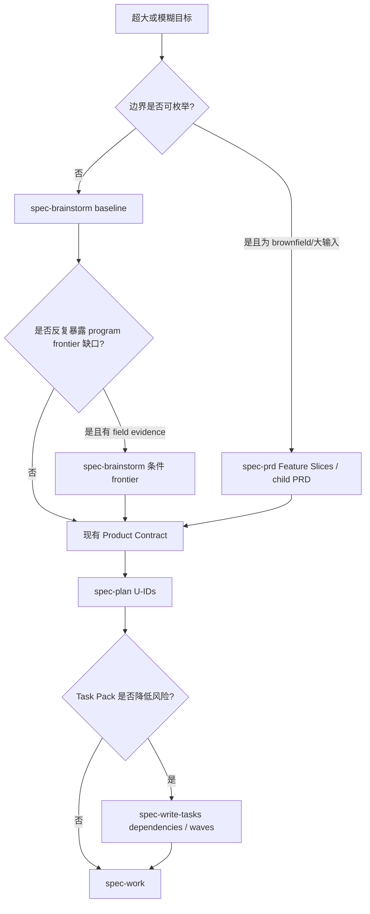
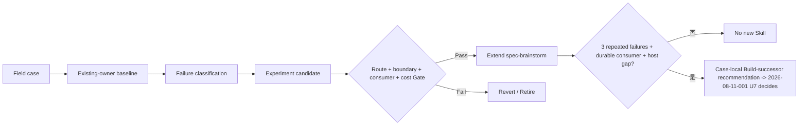

# 超大需求分解与证据门禁 - Plan

## Goal Capsule

- **Objective:** 为超大、模糊或跨多个交付闭环的目标提供可治理的拆分路径，同时避免新增重复宿主 primitive、第二套计划真相源或无真实 consumer 的公共 Skill。
- **Recommended approach:** 当前明确采用 `extend + compose + experiment`，不新增 `spec-decompose`；先以真实案例验证 program-level fog/frontier 是否构成现有 owner 无法表达的重复缺口，再条件扩展 `spec-brainstorm`，继续复用 `spec-prd`、`spec-plan`、`spec-write-tasks`、`spec-handoff` 与 `spec-work`。
- **Decision focus:** 区分产品决策雾区、需求级 capability slicing、实现单元拆分、task dependency waves 与执行协调，确保每个层级只有一个 source owner。
- **Verification focus:** 用至少 3 类真实超大需求做 baseline/candidate 对照；必须证明 existing-owner baseline 失败、candidate 改善且下游 consumer 可消费，才能保留新增 source。
- **Largest risk:** 把外部 `wayfinder` 的 tracker map、claim-by-assignment 和 subagent 并发照搬成中央 orchestrator，重复当前宿主与 spec-first 已有能力并扩大维护面。
- **Stop conditions:** 没有 confirmed consumer、没有重复 field failure、现有 owner 已能完成拆分、candidate 只改善文档外观，或需要新的 tracker/worktree 状态机时，停止扩张并关闭 `spec-decompose` 方向。

---

## Product Contract

### Revision Authority and Migration

本次不是对 requirements-only upstream slice 的普通 enrichment，而是按当前用户对既有 implementation-ready Plan 的明确重评请求，结合 current source 重新裁决“是否新增 Skill”。
原 Product Contract 的 R1-R4、R6-R7 保留原概念并收窄；已被 current-source evidence 否决的 tracker/route 要求保留为 R5/R8 `Retired`，新增的 continuity 与 promotion control 使用 R9/R10，避免静默改义或伪造原 producer 已确认新结论。

### Summary

超大需求需要按语义层级逐步降维，而不是由一个新入口包办从 fog 到代码执行的全部协调。
本方案保留现有 `Codebase -> Spec -> Plan -> Tasks -> Code -> Review -> Knowledge` 链路，把外部 engineering 模式中的 fog/ticket 区分、frontier、阻塞边、单会话容量和 expand-contract 例外吸收到既有 owner；公共 `spec-decompose` 只有在真实 field evidence 同时证明 durable gap、confirmed consumer 与宿主能力缺口后才允许重新立项。

### Problem Frame

原方案把“边界列不出的目标”“需求模块化”“任务依赖编译”“跨会话认领”和“并发 worktree 执行”聚合进一个新 Skill。
当前 source 已分别覆盖其中大部分职责：`spec-brainstorm` 收敛模糊 WHAT，`spec-prd` 处理大输入与 owner-confirmed child PRD，`spec-plan` 产出 Implementation Units，`spec-write-tasks` 编译 dependency waves，`spec-handoff` 保存显式跨会话 continuity，`spec-work` 与宿主 primitive 负责执行。
尚未被 current source 或 field evidence 证明的缺口只有一个：面对跨多个 Product Contract、且初始边界仍不可枚举的 program-scale 目标时，是否需要一个持久但非执行态的 decision frontier。

### Actors

- A1. **Program owner**：确认目标、跨 release 边界、共享约束和继续投入 Gate。
- A2. **Product owner**：确认每个需求闭环的 WHAT、验收与优先级。
- A3. **Planning/execution agent**：按现有 workflow owner 生成 Plan、Task Pack、代码与验证证据。
- A4. **Maintainer**：根据 field evidence 决定 Adopt、Extend、Defer、Retire 或重新 Build 新 Skill。

### Requirements

**Program framing and product slicing**

- R1. 对边界尚不可枚举的 program-scale 目标，先记录目标、已确认决策、未决决策域、明确非目标与 source refs；该记录只承载 advisory frontier，不承载执行状态。
- R2. 未决项只有在问题可精确表述、owner 明确且答案会改变 Product Contract 时才进入 active frontier；不能精确表述的内容保持 fog，不预切成伪任务。
- R3. 当边界足够清晰后，产出至少两个可独立进入 `spec-brainstorm` 或 `spec-prd` 的闭环需求候选，并保留 program origin、共享约束与 cross-slice 风险。
- R4. 产品决策、外部研究与实现发现必须保持 authority 分层；HITL/AFK 只描述证据来源和 interaction need，不成为新的任务状态机。

**Execution decomposition**

- R5. **Retired:** 原计划要求 tracker projection、claim-by-assignment 与新 `spec-worktree` caller；current-source 重评确认其重复宿主/执行 owner，因此不进入 active units。
- R6. Task Pack 优先使用可独立验证的垂直切片，并保持低风险 Plan 可直接进入 `spec-work` 的轻量路径。
- R7. 无法保持逐片绿色的 wide refactor 使用 expand-migrate-contract，并由 dependency waves 表达阻塞关系。

**Promotion control**

- R8. **Retired:** 原计划要求 `using-spec-first` 新增 fog/huge -> `spec-decompose` 路由；当前 unsettled WHAT -> `spec-brainstorm` 路由已覆盖，U3 也只扩展既有 owner。
- R9. 跨会话 continuity 复用 `spec-handoff`，执行并发与隔离复用 `spec-work`、宿主 goal/task/team primitive 和 `spec-worktree` 的既有受治理 caller；本方案不新增 claim-by-assignment 或 tracker canonical state。
- R10. 新公共 `spec-decompose` 的 Build Gate 必须同时满足 confirmed consumer、至少 3 个重复 field failures、existing-owner baseline 不足、宿主 primitive 缺口和可独立拥有的 artifact/consumer；任一条件缺失时保持 `Defer / Retire`。

### Key Flows

- F1. **Existing-owner baseline**
  - **Trigger:** 出现超大或模糊目标。
  - **Actors:** A1, A2, A3。
  - **Flow:** `spec-brainstorm` 收敛 WHAT；brownfield 或大输入进入 `spec-prd` 的 Feature Slices / child PRD；每个闭环再进入 `spec-plan`，必要时编译 Task Pack。
  - **Outcome:** 能由现有链路处理的案例不产生新公共入口。
- F2. **Program frontier experiment**
  - **Trigger:** baseline 无法在单个 Product Contract 中稳定枚举边界，且 owner 确认目标包含多个独立交付闭环。
  - **Actors:** A1, A2, A4。
  - **Flow:** 使用 experiment-only frontier 记录 fog、可回答决策和共享约束；每次只解决当前最有信息增益的决策，不把 frontier 当执行队列。
  - **Outcome:** 边界清晰后生成需求候选，或以证据证明独立 frontier 没有增量价值。
- F3. **Implementation decomposition**
  - **Trigger:** 某个需求候选已拥有 requirements-only 或 implementation-ready artifact。
  - **Actors:** A2, A3。
  - **Flow:** `spec-plan` 决定 U-ID；`spec-write-tasks` 条件编译 vertical slices、dependencies 与 waves；`spec-work` 执行并记录 run evidence。
  - **Outcome:** product slicing 与 task orchestration 不混入同一 artifact。
- F4. **Promotion or retirement**
  - **Trigger:** field experiment 完成。
  - **Actors:** A1, A4。
  - **Flow:** 逐项检查 R10 Build Gate；优先选择 Extend `spec-brainstorm`，只有 existing owner 无法保持内聚时才形成 case-local `Build-successor` recommendation，交由 `docs/plans/2026-08-11-001-refactor-optimization-execution-sequence-plan.md` U7 决定是否创建 successor Plan。
  - **Outcome:** 形成 `extend-existing-owner`、`defer` 或 `retire-new-skill` 裁决；本计划不直接晋升新 Skill。

### Acceptance Examples

- AE1. 一个跨市场 UI 组件化目标尚不能列出所有产品边界时，experiment frontier 先明确共享层、市场定制、采纳治理和共同约束；边界清晰后生成多个 Product Contract 候选，而不是直接生成代码任务。
- AE2. 一个边界已可枚举的 oversized brownfield PRD 直接由 `spec-prd` 生成 Feature Slices 或 owner-confirmed child PRD，不进入 program frontier。
- AE3. 一个 implementation-ready Plan 含多条依赖和文件重叠时，由 `spec-write-tasks` 编译不同 execution waves；同 wave 文件重叠被确定性 validator 拒绝或串行化。
- AE4. 一次显式跨会话继续请求由 `spec-handoff` 保存 objective、source refs、freshness 与 limitations；它不把 transcript 声明升级为完成证据。
- AE5. 三个 field case 均能由现有 owner 正确拆分时，`spec-decompose` Build Gate 失败并关闭新 Skill 方向，即使 experiment 文档看起来更完整。

### Success Criteria

- 至少 3 类真实案例覆盖 greenfield fog、oversized brownfield 与 wide-refactor execution，均有 source identity、baseline、candidate、consumer outcome 和 limitation。
- 每个需求候选都能由现有 `spec-brainstorm`/`spec-prd` 消费，每个实现分解都能由 `spec-plan`/`spec-write-tasks`/`spec-work` 消费，不新增 readiness 枚举或第二套 task truth。
- 新增 source 只有在 non-compensatory Gate 通过时保留；若 route correctness、需求边界或 consumer outcome 任一退化，恢复 baseline。
- 形成明确的 Extend / Defer / Retire verdict；没有 field evidence 时不得以 tests、doc review 或外部 prior art 宣称产品价值已确认。

### Scope Boundaries

**In scope**

- 审计并复用现有大输入、需求切片、Plan unit、Task Pack、handoff 与 work execution owner。
- 以 experiment-only artifact 验证 program frontier 的真实增量。
- 在 field evidence 支持时，最小扩展 `spec-brainstorm` 的 triggered reference。
- 将通用 wide-refactor expand-migrate-contract 例外补入 `spec-write-tasks` 语义指南。

**Out of scope**

- 新建或注册 `spec-decompose` 公共 Skill、命令、Agent、schema、CLI 或 runtime projection。
- tracker-first canonical map、自动 claim-by-assignment、中央 frontier query service 或跨会话状态数据库。
- 让脚本决定需求边界、模块语义、依赖充分性或是否应并行。
- 新增 `spec-worktree` caller；worktree 继续只接受已有 public owner 的 caller-owned isolation contract。
- 手工修改 `.claude/`、`.codex/`、`.agents/skills/`、`.cursor/`、`.kiro/`、`.qoder/` 或 `.opencode/` generated runtime。

### Outstanding Questions

- **OQ1（deferred, owner=A1）:** 哪 3 个真实项目案例可在不泄露业务敏感信息的前提下进入 field experiment？没有案例时 U2 记录 `not-run: field_cases_unavailable`，不得进入 U3。
- **OQ2（deferred, owner=A4）:** 若 frontier candidate 有增量，artifact 是否只作为 `spec-brainstorm` run-local/checkpoint 内容存在，还是值得形成 repo-local advisory doc？由 U2 consumer outcome 决定，不在实施前预设新 schema。

### Sources / Research

- 外部 advisory source：`mattpocock/skills@84fdeffd12f2ee307994d1eb6feb48173b6e0502`。
  - `skills/engineering/wayfinder/SKILL.md`：Destination、fog/ticket 区分、decision frontier、one-ticket-per-session、HITL/AFK 与 tracker claim。
  - `skills/engineering/to-tickets/SKILL.md`：vertical tracer bullet、blocking edges、single-context sizing 与 wide-refactor expand-contract。
  - `skills/engineering/ask-matt/SKILL.md`、`skills/engineering/ask-matt/PHASE-BOUNDARIES.md`：阶段边界、fresh context、handoff/compact/subagent 取舍。
  - `skills/engineering/setup-matt-pocock-skills/issue-tracker-*.md`：tracker-specific map、claim、blocking 与 fallback，证明其实现高度依赖宿主和 issue tracker。
- 当前 source：`skills/spec-prd/SKILL.md`、`skills/spec-prd/references/large-input-checkpoint.md`、`skills/spec-prd/references/prd-output-template.md`、`skills/spec-plan/SKILL.md`、`skills/spec-write-tasks/SKILL.md`、`skills/spec-write-tasks/references/task-pack-schema.md`、`skills/spec-handoff/SKILL.md`、`skills/spec-work/SKILL.md`、`skills/spec-worktree/SKILL.md`、`skills/using-spec-first/references/public-route-map.md`。
- 当前策略约束：`docs/plans/2026-08-11-001-refactor-optimization-execution-sequence-plan.md` 将 `spec-decompose` 默认 posture 定为 `Experiment / Defer`，只有 confirmed consumer、重复 field failure 与宿主能力缺口共同成立才允许 current-source successor。

---

## Planning Contract

### Architecture Posture

采用 `extend + compose + experiment`，当前明确否决 `new`。
`spec-brainstorm` 是未知 WHAT 与 program fog 的候选 owner；`spec-prd` 继续拥有 brownfield large-input、Feature Slices 与 child PRD；`spec-plan` 拥有 HOW 和 U-ID；`spec-write-tasks` 拥有 derived dependencies/waves；`spec-handoff` 拥有显式跨会话 continuity；`spec-work` 与宿主 primitive 拥有执行。
唯一允许的新内容是受 U2 Gate 约束的 experiment artifact，不是新的长期 source-of-truth。

### External Pattern Disposition

| 外部模式 | 裁决 | spec-first 本土化 owner | 原因 |
| --- | --- | --- | --- |
| Destination 与 fog/ticket 区分 | Adapt | `spec-brainstorm` experiment | 有助于避免过早任务化，但必须保持 requirements-only ownership |
| 决策 frontier | Experiment | `spec-brainstorm` triggered reference 候选 | 当前缺少重复 field failure，不能直接产品化 |
| One-ticket-per-session | Adapt as capacity heuristic | 当前 workflow / `spec-handoff` | 作为上下文预算启发，不写成刚性状态规则 |
| Vertical tracer bullets | Adopt | `spec-write-tasks` | 当前指南与 Task Pack 已拥有 independently verifiable slices |
| Blocking edges 与 waves | Adopt | `spec-write-tasks` contract | 已有 `dependencies`、`wave`、same-wave overlap validator |
| Wide-refactor expand-contract | Extend | `spec-write-tasks` guide | 语义例外有价值，脚本不判断适用性 |
| HITL / AFK 分类 | Adapt | 各 workflow interaction/dispatch boundary | 保留 authority 和授权区分，不新增 ticket type schema |
| Tracker map canonical | Reject | 无 | 与 source-first、local portability 和现有 artifact owner 冲突 |
| Claim-by-assignment | Reject for product source | 宿主 task/team 或外部 tracker | 重建宿主 primitive，且没有 confirmed consumer |
| 默认并行 research subagents | Reject as default | caller authorization boundary | dispatch 必须显式授权，缺授权时 inline/serial |
| Worktree per frontier ticket | Reject | `spec-work` / existing callers | isolation 是执行策略，不是需求分解职责 |

### Key Technical Decisions

- KTD1. 当前不新增 `spec-decompose`，因为 current source 已拥有大部分分解层，而剩余 program-frontier 缺口尚无 field evidence；若 U2/U5 的 Build Gate 后续全部成立，只形成 case-local `Build-successor` recommendation 交由 `docs/plans/2026-08-11-001-refactor-optimization-execution-sequence-plan.md` U7 裁决是否创建 current-source successor Plan，本计划不直接创建 successor，也不自动反转裁决。
- KTD2. 超大需求按 altitude 分层：program fog 归 WHAT discovery，capability slicing 归 PRD/Product Contract，U-ID 归 Plan，dependency waves 归 derived Task Pack，execution state 归 work run 或宿主。
- KTD3. Program frontier 先以 experiment-only representation 运行，不预先冻结 schema、目录或 tracker projection；artifact shape 只保留目标、source refs、confirmed decisions、fog、active decisions、candidate slices 和 limitations。
- KTD4. Scripts 只验证路径、hash、ID、依赖存在性、wave membership 与文件重叠；LLM/owner 判断 fog 是否可立项、slice 是否闭环、依赖是否语义充分、Build Gate 是否成立。
- KTD5. Wide refactor 使用 expand-migrate-contract 作为 vertical-slice 例外，由语义指南和 test scenarios 约束，不新增 deterministic classifier。
- KTD6. Promotion Gate 是 non-compensatory：成本或上下文改善不能补偿 route 错误、Product Contract 边界退化、consumer 不可用或 field evidence 缺失。

### High-Level Technical Design

### Interface Contracts

- **Baseline artifacts:** 现有 requirements-only unified plan、PRD split-summary/child PRD、implementation-ready plan、derived Task Pack 与 spec-work run artifact 保持 canonical contract，不新增 readiness 值。
- **Experiment record:** `docs/validation/spec-decompose/<case-id>/report.md`，只记录 case source identity、baseline outcome、最大失败、candidate representation、consumer outcome、cost/quality observations、limitations 与 verdict；它是 `degraded` 或 `confirmed` evidence report，不是 workflow state。
- **Conditional `spec-brainstorm` reference:** 仅在 U2 Gate 通过后新增，owner 是 `skills/spec-brainstorm/`；它可指导 decision frontier 和 requirement-candidate handoff，但不得拥有 tracker、execution wave、claim、worktree 或 code delivery。
- **Task decomposition:** `skills/spec-write-tasks/references/task-pack-schema.md` 继续是 dependencies/waves 的 machine-readable owner；Task Card prose 不能成为第二套 executable source。

### Evidence & Limitations

- 外部 engineering 仓库在 2026-08-11 读取 `84fdeffd...` clean working tree；其 tracker 和 subagent 假设是 advisory prior art，未在 spec-first 用户场景中验证。
- 当前 spec-first source identity 为 `714e4cb3...`，工作区已有 unrelated/user-owned 修改；本计划只允许后续执行修改列出的 source owner，不得覆盖现有改动。
- CodeGraph 用于定向导航但未充分命中 prose-heavy Skill owner；承重结论已通过直接读取 current `SKILL.md`、references、tests 与 umbrella Plan 回证。
- 尚无 3 个真实 field cases、paired baseline/candidate 或 confirmed consumer outcome，因此当前只能确认 `Defer new Skill`，不能确认 frontier candidate 有产品增量。
- Worker dispatch 未获授权，research 与 review 使用 inline/serial fallback，`worker_dispatch_outcome=dispatch_authorization_missing`、`isolation=degraded_inherited`；不得声明 independent reviewer coverage。

### Sequencing

1. U1 先补齐 execution decomposition 中已确认的 expand-migrate-contract 缺口，不改变 schema。
2. U2 运行 existing-owner baseline 与 experiment candidate，field evidence 不足即停止。
3. U3 仅在 U2 non-compensatory Gate 通过后最小扩展 `spec-brainstorm`。
4. U4 验证既有 Plan -> Task Pack -> Work 组合，不新增 tracker/worktree caller。
5. U5 汇总 field outcome 并给出 Extend、Defer、Retire 或 case-local `Build-successor` recommendation；只有 Build Gate 全部成立才把 recommendation 交由 `docs/plans/2026-08-11-001-refactor-optimization-execution-sequence-plan.md` U7 裁决是否另建 successor Plan，本计划不直接创建。

---

## Implementation Units

### U1. 扩展 wide-refactor 分解指南

- **Goal:** 把 wide refactor 的 expand-migrate-contract 例外纳入现有 Task Pack 语义指南，同时保持 schema 和 validator 不变。
- **Requirements:** R6, R7。
- **Dependencies:** 无。
- **Files:** `skills/spec-write-tasks/references/task-quality-guide.md`, `tests/unit/spec-write-tasks-contracts.test.js`, `CHANGELOG.md`。
- **Approach:** 在 vertical slicing 规则旁说明 expand、按 blast radius 分批 migrate、contract 和必要时 integration branch 的依赖表达；明确 LLM 判断是否属于 wide refactor，脚本只验证依赖/wave 确定性不变量。
- **Test scenarios:**
  - 普通 feature 仍被建议拆成可独立验证的 vertical slices。
  - rename/shared-type migration 无法逐片独立落地时，生成 expand -> migrate batches -> contract 依赖，而不是伪造端到端 slice。
  - 所有 migrate batch 完成前，contract task 不能进入可执行 wave。
  - 指南变更不新增 Task Pack 字段或 validator reason code。
- **Verification:** 聚焦 contract test 证明 guide、schema 与 validator ownership 未漂移；现有 valid/stale/same-wave fixtures 保持原结果。
- **Stop condition:** 若需要脚本判断 semantic wide-refactor 或新增 progress state，停止并退回 `spec-plan` 重评。
- **Rollback:** 恢复 guide 和对应 prose assertion；无需迁移 artifact。

### U2. 运行 program-scale 分解 field experiment

- **Goal:** 用真实案例判断 program frontier 是否提供 existing-owner baseline 没有的决策和 consumer 增量。
- **Requirements:** R1-R4, R10；覆盖 AE1、AE2、AE5。
- **Dependencies:** Project owner 提供或批准至少 3 个可用案例；U1 非阻塞。
- **Files:** `docs/validation/spec-decompose/<case-id>/report.md`, `docs/validation/spec-decompose/summary.md`, `CHANGELOG.md`。
- **Approach:** 每个 case 先运行现有 `spec-brainstorm`/`spec-prd` baseline，再用最小 frontier representation 处理同一 source；冻结 source identity、rubric 与 consumer，比较 route correctness、Product Contract 边界、owner correction、downstream consumption、context/turn cost 和 unresolved-risk carry-through。
- **Execution note:** Candidate 不修改 Skill source；field case 不可用时写明 `not-run: field_cases_unavailable` 并停止后续 source mutation。
- **Test scenarios:**
  - Greenfield fog case 无法初始枚举边界时，candidate 只记录 decision fog，不能提前输出 code tasks。
  - Oversized brownfield case 被 baseline `spec-prd` 正确拆分时，candidate 必须判定无增量。
  - Candidate 生成的每个 requirement slice 都能进入 `spec-brainstorm` 或 `spec-prd`，共享约束与 origin 不丢失。
  - Candidate 减少 token/turn 但增加 owner correction 或 route error 时，Gate 失败。
- **Verification:** 三份 case report 与一份 summary 具有 source identity、baseline/candidate、direct evidence、limitations 和 non-compensatory verdict；缺任一项不得进入 U3。
- **Stop condition:** 少于 3 个可裁决 case、baseline 无重复失败、consumer 不成立或敏感数据无法安全处理时停止并保持 Defer。
- **Rollback:** 删除未形成可复验结果的临时 candidate；保留标记为 `not-run`/`degraded` 的诚实报告。

### U3. 条件扩展 spec-brainstorm program frontier

- **Goal:** 仅在 U2 证明 durable gap 后，将最小 program frontier 作为 `spec-brainstorm` triggered reference，而不是新公共 Skill。
- **Requirements:** R1-R4, R10。
- **Dependencies:** U2 的 3 个 case 均可裁决，至少 2 个重复 baseline failure 被 candidate 改善，且无 route/boundary/consumer Gate 退化；A1/A4 明确 Adopt。
- **Files:** `skills/spec-brainstorm/SKILL.md`, `skills/spec-brainstorm/references/program-scale-decomposition.md`, `skills/spec-brainstorm/evals/trigger-cases.json`, `tests/unit/spec-brainstorm-contracts.test.js`, `tests/unit/eval-fixture-contracts.test.js`, `CHANGELOG.md`。
- **Approach:** Trigger 仅限“目标包含多个独立 Product Contract 且当前边界不可枚举”；reference 指导 destination、confirmed decisions、fog、active owner questions、candidate slices 与 stop/handoff，不新增 schema、tracker、claim、worker dispatch 或 execution semantics。
- **Test scenarios:**
  - 普通模糊 feature 继续走现有 `spec-brainstorm` 主路径，不加载 program reference。
  - 边界可枚举的 brownfield 大输入继续路由 `spec-prd`。
  - Program case 在边界清晰前不生成 implementation-ready plan 或 Task Pack。
  - 缺 Product owner authority 时停止在 requirements checkpoint，不把 agent assumption 写成 confirmed decision。
  - Candidate slices 保留 origin/shared constraints，并分别形成 requirements-only Product Contract。
- **Verification:** Trigger eval、contract tests 与 fresh-source behavior eval 证明 route precision、source/runtime boundary 和 handoff 不退化；generated runtime 只在 source 验证后由 `spec-first init` 投射。
- **Stop condition:** Reference 需要拥有 task progress、tracker state、worktree、execution engine 或复制 `spec-prd` large-input contract 时停止并回滚。
- **Rollback:** 删除 triggered reference 与入口锚点，恢复 baseline eval；U2 reports 保留为否证证据。

### U4. 退役 tracker/worktree 编排并验证原生 owner 组合

- **Goal:** 证明超大需求在 Product Contract 清晰后可由现有 Plan、Task Pack、handoff 与 work owner 完成，不需要 `spec-decompose` orchestration。
- **Requirements:** R5-R7, R9；覆盖 AE3、AE4。
- **Dependencies:** U1；可与 U2 串行执行以复用 field cases。
- **Files:** `tests/unit/spec-write-tasks-contracts.test.js`, `tests/unit/task-pack-command.test.js`, `tests/unit/spec-work-intake-contracts.test.js`, `tests/unit/spec-handoff-contracts.test.js`, `docs/validation/spec-decompose/summary.md`。
- **Approach:** 从一个大 Plan 编译 derived Task Pack，验证 dependencies、waves、same-wave overlap、stale hash 与 `spec-work` intake；显式跨会话时单独验证 `spec-handoff` orientation，不新增 tracker projection 或 worktree caller。
- **Test scenarios:**
  - 小而低风险的 Plan 返回 direct `spec-work`，不强制 Task Pack。
  - 大 Plan 编译 task pack 后，source plan 仍是 canonical，stale hash 阻断执行。
  - 同 wave 文件重叠被拒绝或串行化，隐藏依赖不能只靠 wave label 表达。
  - Handoff resume 只提供 orientation 并等待用户选择，不自动执行 artifact 中的命令。
- **Verification:** 聚焦 unit/integration tests 与一份 field summary 共同证明 contract 和 behavior；tests 不替代 U2 field outcome。
- **Stop condition:** 若 executor 必须私下发明 Product Contract 边界，返回 U2/U3 owner，不在 Task Pack 中修补 WHAT。
- **Rollback:** 仅回退新增 fixture/assertion；现有 contracts 不迁移。

### U5. 收口 promotion 裁决与生命周期

- **Goal:** 基于 U1-U4 证据给出 Extend、Defer、Retire 或 Build-successor 的 **case-local recommendation**，并同步本 Plan 自身 lifecycle。program-level 的是否创建 successor Plan 由 `docs/plans/2026-08-11-001-refactor-optimization-execution-sequence-plan.md` U7 基于全局证据唯一裁决；本 Plan 不直接创建 successor。
- **Requirements:** R8, R10；覆盖 F4、AE5。
- **Dependencies:** U2 已完成或诚实 `not-run`；U3/U4 按 Gate 执行或明确 skipped。
- **Files:** `docs/validation/spec-decompose/summary.md`, `docs/plans/2026-07-28-002-feat-spec-decompose-vertical-closed-loop-plan.md`, `docs/plans/2026-08-11-001-refactor-optimization-execution-sequence-plan.md`, `CHANGELOG.md`。
- **Approach:** 用 non-compensatory matrix 裁决：confirmed consumer、3 个重复 field failures、existing-owner baseline gap、host primitive gap、独立 artifact/consumer boundary、quality/cost outcome；缺项时选择 Defer/Retire，不创建 placeholder Skill。
- **Test scenarios:**
  - U2 `not-run` 时不得输出 Build verdict。
  - Baseline 足够时选择 Retire，并将本 Plan 关闭为 `completed` 或 `superseded`，不声称 feature shipped。
  - U3 成功扩展 existing owner 时选择 Extend，仍不得创建 `spec-decompose`。
  - 只有六项 Gate 全满足时才形成 case-local `Build-successor` recommendation，交由 `docs/plans/2026-08-11-001-refactor-optimization-execution-sequence-plan.md` U7 决定是否创建 current-source successor Plan；本 Plan 不直接创建 successor Skill/Plan。
- **Verification:** Plan audit、Changelog format 和 lifecycle tests 证明状态一致；verdict 引用直接 field evidence 而不是 transcript 或 provider summary。
- **Stop condition:** Evidence 互相矛盾或 owner 未裁决时保持 `active` 并记录 blocker，不伪造终态。
- **Rollback:** 恢复错误 lifecycle 变更；不删除已产生的可复验 field evidence。

---

## Verification Contract

| Gate | Applicability | Evidence | Done signal |
| --- | --- | --- | --- |
| Source ownership | U1-U5 | current `skills/`、contracts、tests | 无 generated runtime 被当作 owner |
| Task decomposition | U1, U4 | spec-write-tasks contract/unit tests | vertical/expand-contract、dependencies、waves 和 stale hash 边界一致 |
| Field experiment | U2 | 3 case reports + summary | baseline/candidate/consumer/limitations 均可回源 |
| Conditional route | U3 only after Gate | trigger eval + fresh-source behavior eval | ordinary brainstorm、brownfield PRD 与 program case 路由无退化 |
| Cross-session boundary | U4 | handoff contract tests + behavior evidence | resume 只 orientation，不自动 mutation |
| Promotion | U5 | non-compensatory matrix + owner verdict | Extend/Defer/Retire/Build-successor 恰有一项且证据充分 |
| Lifecycle | U5 | plans audit + Changelog tests | canonical Plan status 与 verdict 一致 |

### Proof Boundary

- Deterministic scripts 可确认文件、schema、hash、dependency membership、wave overlap、status 与 test exit code。
- LLM/owner 判断 requirement slice 是否闭环、fog 是否可立票、baseline 是否语义失败、candidate 是否改善、consumer 是否真实成立。
- 外部 engineering prior art、CodeGraph、测试数量和文档完整度都不能单独证明 field outcome。
- Worker dispatch 未授权时，fresh-source eval 和 doc review 必须记录 degraded fallback，不能宣称独立 reviewer coverage。

---

## System-Wide Impact

| Surface | Decision |
| --- | --- |
| `spec-brainstorm` | conditional: 只有 U2 Gate 通过才增加 triggered reference |
| `spec-prd` | reuse: large-input、Feature Slices、split-summary/child PRD 不改 owner |
| `spec-plan` | reuse: HOW 与 U-ID owner，不承担 program fog |
| `spec-write-tasks` | extend: 仅补 wide-refactor 语义指南；schema/validator 保持 |
| `spec-handoff` | reuse: 显式跨会话 continuity，不成为 progress state |
| `spec-work` / host primitives | reuse: execution 与并发；不由本计划复制 |
| `spec-worktree` | out-of-scope: 不新增 caller |
| `using-spec-first` | no change: 现有 unsettled WHAT -> `spec-brainstorm` 已足够 |
| Tracker integrations | out-of-scope: 不创建 canonical map、claim 或 frontier service |
| Generated runtime | generated only: source 通过后按现有 init/projection contract 处理 |

## Risks & Dependencies

- **Field case selection bias:** 只选极端 fog case 会夸大 candidate 价值；U2 必须包含 greenfield、brownfield 与 execution-shaped 对照。
- **Artifact proliferation:** experiment doc 可能演化成第二套 Plan；report 必须 pointer-first、claim-scoped，不承载 task progress。
- **Owner ambiguity:** program owner 与 product owner 可能不是同一人；未确认 authority 的答案保持 advisory 或 blocker。
- **Prompt hot-path growth:** 条件 reference 若进入主 Skill 固定上下文会增加所有用户成本；U3 必须 triggered load 且可独立回滚。
- **Host duplication:** tracker claim、subagent 并发和 worktree isolation 容易重建宿主 primitive；本计划将它们列为 stop condition。
- **Evidence availability:** 当前没有 field cases，U2 可能合法以 `not-run` 结束；这会阻断 U3 和任何 Build verdict。

## Alternative Approaches Considered

- **Build public `spec-decompose` now:** 否决。它会横跨 WHAT、HOW、Task Pack、handoff 和 execution，且没有 confirmed durable consumer。
- **Extend `spec-prd` for all program fog:** 否决。`spec-prd` 是 brownfield PRD owner；把 greenfield unknown WHAT 塞入会污染其 artifact/readiness contract。
- **Extend `spec-brainstorm` unconditionally:** 否决。program frontier 是低频高成本分支，必须由 field Gate 触发并采用 triggered reference。
- **Tracker-first wayfinder clone:** 否决。它依赖 tracker child issues、native blocking、assignment 和并发 session，既不 portable 也不符合 source-first。
- **Add deterministic decomposition classifier:** 否决。脚本无法可靠判断业务闭环、fog sharpness 或语义依赖，只能准备 facts。

## Documentation / Operational Notes

- U2/U5 validation report 必须包含数据来源、脱敏方式、retention、撤回条件和 claim ceiling；未经授权不得写入业务敏感原文。
- U3 若执行，需同步 `CHANGELOG.md`、相关 README/docs、eval fixtures、contract tests，并在 source 验证后考虑各支持宿主 projection；不得手改 runtime mirror。
- 本计划不自动启动实现、不创建 Issue、不 commit/push/PR。

---

## Definition of Done

### Global

- R1-R10 均由 U-ID、test scenario、scope boundary 或明确 retire 路径覆盖；R5/R8 保留原 ID 并显式记录退役，未被静默改义。
- 外部 engineering 的可迁移模式与被拒绝宿主耦合有清晰映射。
- 新增 Skill 裁决明确为当前 `Defer / Do not build`，且 promotion Gate 可由后续 field evidence 重新打开。
- 至少 3 个 field case 已完成，或以真实原因记录 `not-run` 并阻断 source promotion。
- 所有执行过的 deterministic tests、fresh-source eval、doc review 与 limitations 均如实记录。
- 没有手改 generated runtime、没有新增 tracker/worktree state、没有 abandoned experiment code 残留。

### Per-Unit Done Signals

- U1. wide-refactor 指南与测试落地，Task Pack schema/validator 未扩张。
- U2. 三个可裁决 case report + summary 完成，或以 `not-run` 阻断 U3。
- U3. Gate 通过时最小扩展 `spec-brainstorm` 且 route/fresh-source eval 通过；Gate 未通过时明确 skipped。
- U4. 原 tracker/worktree orchestration 分支被显式退役，Plan -> Task Pack -> Work 与 handoff 组合经聚焦验证，不需要新 orchestrator。
- U5. 唯一 verdict、Plan lifecycle、umbrella Plan 与 Changelog 一致；`Build-successor` 只作为 case-local recommendation 交由 `docs/plans/2026-08-11-001-refactor-optimization-execution-sequence-plan.md` U7 裁决，本计划不直接创建 successor Plan 或 Skill。
