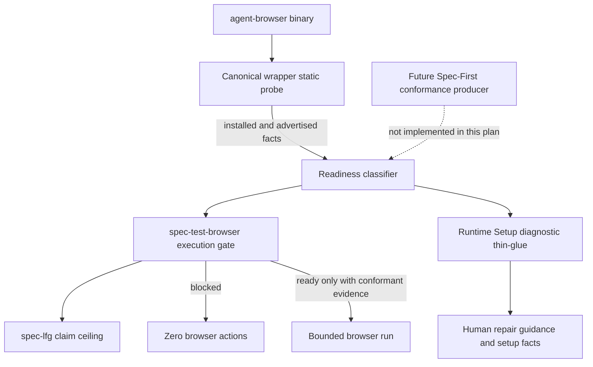
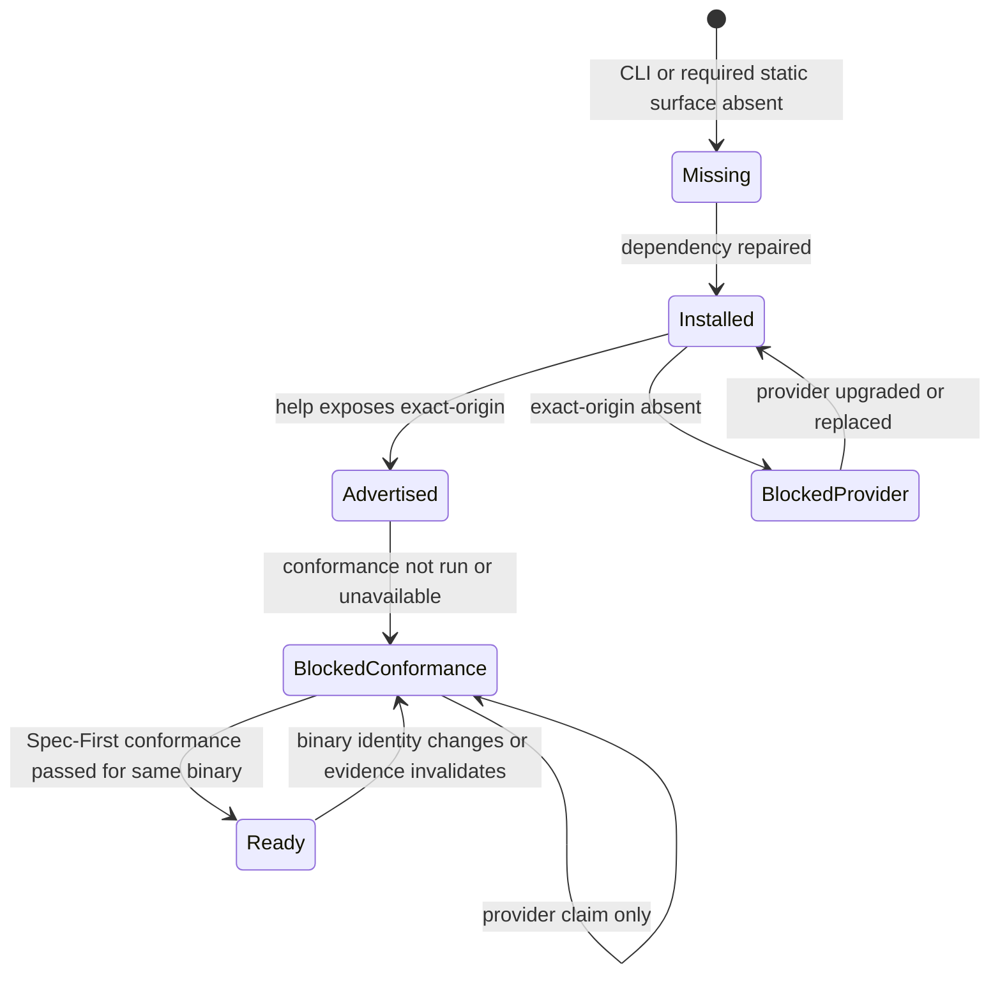

# Ground agent-browser exact-origin readiness in conformance evidence - Plan

## Goal Capsule

| Dimension | Decision |
| --- | --- |
| Objective | 修复 `spec-first` 对 `agent-browser` exact-origin 能力的证据分层与诊断：当前 `0.33.1` 继续 fail closed，provider 自报或 help marker 不得产生 `ready`，Runtime Setup 明确区分“已安装”与“可执行 browser verification”。 |
| Recommended approach | `extend` 现有 browser wrapper 与 Runtime Setup owner；移除当前工作树中假设的 `capabilities --json` 放行路径，把 static advertisement、provider claim、Spec-First controlled conformance 与 execution readiness 分层。当前 release 不实现不可验证的 browser conformance runner，因此不会伪造实际解阻。 |
| Authority hierarchy | 当前用户指令与 `docs/10-prompt/结构化项目角色契约.md` > current project-owned source/tests/live probe > `agent-browser v0.33.1` 官方源码 > 相邻仓方案、CE skill 与历史 plan/solution 的 advisory evidence。 |
| Architecture posture | `extend + compose / thin-glue`：`agent-browser-run-context.cjs` 继续拥有 browser capability classification；Runtime Setup 只消费该 owner 的只读 probe facts，不复制 exact-origin 判断，也不新增通用 browser-provider framework。 |
| Decision focus | 什么证据能把 `execution_readiness` 提升为 `ready`；当前 blocked 状态如何给出正确 repair scope；哪些字段需要稳定给 `spec-test-browser`、`spec-lfg` 与 Runtime Setup 消费。 |
| Verification focus | 真实 `agent-browser 0.33.1` 返回 `execution_readiness: blocked` 和零 action subprocess；help marker、调用方声明或 provider JSON 均不能放行；Runtime Setup 报告 dependency ready 但 exact-origin capability blocked，且不误导用户重复安装同版本。 |
| Largest risk or boundary | 本计划修复的是可信度与诊断，不会凭空补出上游浏览器执行器缺失的 request-time exact-origin enforcement；真实 browser field verification 仍需官方 release 或受控 fork，以及随后由 Spec-First 控制的 conformance evidence。 |
| Execution profile / tail ownership | `spec-work` 按 U1-U4 修改 canonical source、tests、docs 与 Changelog；source 变更后通过现有 init 机制重投影六宿主 runtime。上游实现、fork 与外部官网仓不在本计划 write scope。 |
| Stop conditions | 实施需要把 generated runtime 当 source 修改；需要接受 `--allowed-domains` 或事后 URL 检查作为 exact-origin 替代；需要把 provider self-report 当 conformance；或当前官方 release 已出现真实 exact-origin 实现，使“暂无 conformance producer”的前提失效。 |

---

## Product Contract

### Summary

当前真实环境正确阻断：`agent-browser 0.33.1` 没有 `--exact-origin`，也没有顶层 `capabilities` 命令，canonical probe 返回 `execution_readiness: blocked`。
问题不在 fail-closed，而在当前未提交候选实现试图用一个假设的 `agent-browser-capabilities/v1` provider contract 直接把 `exact_origin_confirmed` 和 `execution_readiness` 提升为 true/ready。
本计划保留正确阻断，修复证据越权和 Runtime Setup 的误导性修复建议，并定义未来真实解阻必须满足的 activation boundary。

### Problem Frame

Exact origin 是完整的 scheme、host、port 约束，而 `agent-browser 0.33.1` 的 `DomainFilter` 只从 URL 读取 `host_str()` 并与 allowed-domain pattern 比较。
因此 `http://localhost:5173`、`http://localhost:4173` 与 `https://localhost:5173` 可以通过同一个 host allowlist，却不是同一 origin。

第一性原理要求 claim 与 evidence 同强度：CLI 安装事实只能证明 dependency available，help marker 只能证明参数被宣称，provider JSON 只能证明 provider 自报，只有受控黑盒 conformance 才能证明 request-time exact-origin enforcement。
当前没有通过该 conformance 的 provider，正确结果只能是 blocked；“让 probe 变绿”不是成功标准。

二八取舍是优先修复四个高价值边界：provider claim 不越权、当前 release 的 blocked 诊断准确、安装与能力状态分离、下游 claim ceiling 不被绕过。
本计划不建立通用 provider registry、不维护浏览器引擎、不实现无正向 provider 可验证的复杂 conformance fixture，也不创建缓存 ledger。

### Actors

- A1. Developer / caller：需要知道 browser verification 是缺依赖、缺安装步骤，还是 provider 本身缺 exact-origin 能力。
- A2. `agent-browser-run-context.cjs`：唯一 browser subprocess owner，产生 static capability 与 execution-readiness facts。
- A3. `spec-test-browser`：消费 wrapper facts，只有 ready 才允许准备和运行 browser plan。
- A4. Runtime Setup：诊断 CLI/runtime/global skill 与 browser-verification capability，不复制 provider 语义。
- A5. `spec-lfg`：消费 browser readiness、route/step 与 limitations，约束 completion/landing claim。
- A6. Future conformance owner：只有在可测试的 provider candidate 存在后，才可实现并产生 Spec-First controlled conformance evidence。

### Requirements

**Evidence and readiness**

- R1. `status` 只描述 CLI/static capability probe，`execution_readiness` 只描述是否允许 browser actions；两个维度不得互相替代。
- R2. `--exact-origin` help marker、版本号、调用方 capability 参数、provider 自报 JSON 或外部文档最多是 advisory/static evidence，均不得直接设置 `exact_origin_confirmed: true`。
- R3. 只有同一 binary identity 对 Spec-First controlled exact-origin conformance 返回 `passed` 时，才能设置 `exact_origin_confirmed: true` 与 `execution_readiness: ready`；本计划不实现 conformance producer，因此 production probe 只产生 `conformance_status: not_run` 和 blocked readiness。
- R4. `agent-browser 0.33.1` 继续返回 `exact-origin-capability-unavailable`、`execution_readiness: blocked`、`exact_origin_confirmed: false`，且 navigation/interaction subprocess 为 0。
- R5. 若未来 CLI 仅在 help 中出现 `--exact-origin`，当前实现返回 `exact-origin-conformance-required`，不得调用或要求一个上游未承诺的顶层 `capabilities --json` 命令。

**Diagnosis and repair routing**

- R6. Runtime Setup 必须分别报告 `dependency_status`、browser capability/execution readiness、reason code、`repair_scope` 与 `next_action`。
- R7. CLI 已安装但 exact-origin 缺失时，`dependency_status` 必须保持 `ready`，browser capability 保持 `blocked/degraded`，并把 repair scope 指向 provider release 或经批准的受控 fork；不得把重复执行同一 `@latest` 安装命令当作确定性修复。
- R8. `agent-browser` 仍是 report-only/non-baseline-blocking helper；browser capability blocked 不得错误阻断普通 source-based plan/work/review/debug workflow。
- R9. CLI、browser runtime 或 global skill 确实缺失时，Runtime Setup 继续给出安装/补齐动作；不得因为 capability gap 隐藏真实 dependency gap。

**Consumers, claims, and source ownership**

- R10. `spec-test-browser` 与 pipeline 只在 `execution_readiness: ready` 且 `exact_origin_confirmed: true` 时执行；其他状态一律 `not_supported` 且 action subprocess 为 0。
- R11. `spec-lfg` 必须消费 conformance status、repair scope 与 limitations；source tests、provider claim 或 setup facts都不能被提升为 browser field outcome。
- R12. Durable fix 只修改 `skills/`、tests、docs、README、Changelog 与必要 generator expectations；不得手改 `.claude/`、`.codex/`、`.agents/skills/`、`.cursor/`、`.kiro/` 或 `.qoder/` runtime mirror。
- R13. 当前计划不修改 `agent-browser` 上游、不创建 fork、不修改相邻官网或 `compound-engineering-plugin` 仓库，也不把 CE 的宽松 fallback 合同复制回 spec-first。

### Key Flows

- F1. Current provider lacks exact-origin
  - **Trigger:** 安装的 binary 为 `agent-browser 0.33.1`，help 无 `--exact-origin`。
  - **Steps:** Wrapper 完成 version/help static probe；Runtime Setup 复用该事实；browser workflow 停止。
  - **Outcome:** Dependency 可用但 execution blocked；repair scope 为 provider；action subprocess 为 0。
  - **Covers:** R1-R4、R6-R8、R10-R11。

- F2. Future provider advertises exact-origin without conformance
  - **Trigger:** help 出现 `--exact-origin`，但没有 Spec-First controlled conformance evidence。
  - **Steps:** Wrapper 记录 advertised/help-marker evidence，不调用假设的 provider contract command。
  - **Outcome:** `exact-origin-conformance-required`，execution blocked；repair scope 指向 Spec-First conformance activation。
  - **Covers:** R1-R3、R5-R7、R10-R11。

- F3. Dependency setup is incomplete
  - **Trigger:** CLI、browser runtime marker 或 global skill 任一缺失。
  - **Steps:** Runtime Setup 保留现有 dependency/manual setup 检查。
  - **Outcome:** 报告缺失项与安装动作；不误报为 provider exact-origin gap。
  - **Covers:** R6、R8-R9。

- F4. Future conformance activation
  - **Trigger:** 官方 release 或经 Project owner 批准的受控 fork 提供可执行的 exact-origin candidate。
  - **Steps:** 新的后续计划实现本地、无凭证、双 origin conformance，并将结果绑定 binary identity。
  - **Outcome:** 全部负向场景通过后才可 ready；任一场景失败或未知继续 blocked。
  - **Covers:** R2-R3、R10-R11。

### Acceptance Examples

- AE1. 在当前真实 `0.33.1` 上运行 canonical probe，结果包含 `execution_readiness: blocked`、`reason_code: exact-origin-capability-unavailable`、`conformance_status: not_run`、`repair_scope: provider`，且 action subprocess 为 0。
- AE2. 测试 runner 让 help 出现 `--exact-origin`，但不提供 Spec-First conformance；probe 返回 `exact-origin-conformance-required`，不执行 `agent-browser capabilities --json`。
- AE3. 调用方传入 `exact_origin_confirmed: true`、provider JSON 声称完整 coverage，或 help marker 与版本号看起来匹配；execution 仍 blocked。
- AE4. Runtime Setup 发现 CLI、browser runtime marker 与 global skill 已完成，但 wrapper probe 为当前 capability gap；输出 dependency ready、capability blocked、非 baseline blocker，并明确“重复安装同版本不是已验证修复”。
- AE5. Runtime Setup 发现 CLI 存在但 browser runtime marker 或 global skill 缺失；输出 manual setup incomplete 与安装动作，而不是 provider repair。
- AE6. Applicable browser plan 在 blocked probe 下包含 `open`、`click`、`fill`、`press`；所有 navigation/interaction action process count 均为 0，既有 private-output 和 cleanup 合同不回退。
- AE7. `spec-lfg` 收到 source/unit contract passed 但 live browser probe blocked；最终 claim 保留 browser verification limitation，不得写成真实页面验证通过。

### Success Criteria

- 当前真实环境的 blocked 结果保持不变，但原因、repair owner 与 next action 更准确。
- 当前工作树中“provider capability contract 直接放行”的路径被移除，provider self-report 降级为 advisory 或不消费。
- Runtime Setup 能同时表达“dependency 已安装”和“browser verification capability 不可用”，且普通非浏览器 workflow 不被阻断。
- `spec-test-browser`、`spec-lfg`、Runtime Setup facts 与用户文档使用同一 readiness vocabulary 和 claim ceiling。
- 六宿主投射来自 canonical source regeneration，没有 runtime-only patch。
- 完成声明明确区分“诊断与证据边界已修复”与“真实 exact-origin browser field capability 仍未提供”。

### Scope Boundaries

**In scope**

- 修正 current dirty-worktree 的 wrapper readiness classification 与 reason/repair fields。
- 让 Runtime Setup 复用 canonical browser probe，并区分 dependency readiness 与 verification capability。
- 同步 `spec-test-browser`、pipeline、`spec-lfg`、evals、tests、双语 README 与 Changelog。
- 定义未来 conformance activation 的最低证据条件和 invalidation boundary。

**Out of scope**

- 修改或提交 `agent-browser` 官方源码、创建上游 issue/PR、维护 fork 或选择替代 browser engine。
- 在没有可通过的真实 provider candidate 时实现复杂 browser conformance fixture。
- 用 `--allowed-domains`、事后 URL 检查、shell shim、版本 allowlist 或 provider self-report替代 exact-origin enforcement。
- 修改 `spec-first-official-website` 或 `compound-engineering-plugin` 的任何文件。
- 恢复 server autonomy、端口扫描、项目命令执行或 runtime profile。

### Deferred to Follow-Up Work

- 当官方 release 或经 Project owner 批准的受控 fork首次提供 `--exact-origin` candidate 时，创建独立 follow-up plan 实现无凭证 loopback conformance。最低覆盖为 initial open、HTTP redirect、meta refresh、link、form、script navigation、popup、frame，以及 scheme/host/port 差异；证据绑定 resolved binary path、version 与 binary hash，任一未知 fail closed。
- 只有真实使用数据证明 browser capability gap 已成为高频研发阻塞，且上游长期无解时，才比较受控 fork与替代执行器；比较必须包含维护、供应链、跨平台、session isolation、evidence capture 与 cleanup 成本。

---

## Planning Contract

### Key Technical Decisions

- KTD1. Preserve fail-closed and repair the evidence model. 当前 probe 的 blocked 行为符合角色契约；修复目标是消除 false-ready 路径，而不是放宽 gate。
- KTD2. Treat provider claims as advisory. `agent-browser-capabilities/v1` 与 `capabilities --json` 是当前工作树假设出的非官方接口；即使未来上游提供类似自报，也只能帮助决定是否值得运行 conformance，不能直接成为 enforcement proof。
- KTD3. Use four evidence levels. `installed` 证明依赖存在，`advertised` 证明静态参数出现，`claimed` 证明 provider 自报，`conformant` 才能证明受控场景通过；只有最后一级允许 ready。
- KTD4. Extend the existing owner. Browser wrapper 已拥有 version/help probe、exact-origin gate 与 browser subprocess；在这里收敛 classification，Runtime Setup 通过 thin-glue 复用输出，避免第二套 parser 与 reason-code truth source。
- KTD5. Do not build dormant browser infrastructure now. 当前没有能通过 exact-origin 的 provider，立即实现完整 fixture 无法获得正向 field validation；本计划只定义 activation contract，等待真实 candidate 后单独实现并验证。
- KTD6. Keep install and capability repair separate. 安装命令只修复 CLI/runtime/global skill 缺失；provider release 缺少安全能力时，next action 必须指出 provider-owned gap，不得循环建议 reinstall。
- KTD7. Evolve contracts additively where possible. 保留现有 `status`、`execution_readiness`、`reason_code` 与 capability fields，增加 `conformance_status`、`repair_scope`、`next_action`；删除仅存在于当前未提交候选实现、且没有外部 consumer 的 speculative provider-contract confirmation path。
- KTD8. Keep claim ceilings consumer-owned. Wrapper 和 Runtime Setup准备事实；`spec-test-browser`、`spec-lfg` 与 LLM负责判断 applicability、limitations 与 completion claim，不把脚本变成语义 verdict engine。

### High-Level Technical Design

**Evidence and consumer flow**

**Exact-origin readiness states**

### Interface Contracts

| Interface / mode | Consumers | Canonical artifact | Contract summary | Compatibility | Verification |
| --- | --- | --- | --- | --- | --- |
| Browser wrapper probe / evolution | `spec-test-browser`, Runtime Setup, tests | `skills/spec-test-browser/scripts/agent-browser-run-context.cjs` | Preserve CLI availability and execution readiness separation; add conformance/repair facts; provider claim never confirms enforcement | Additive fields; keep existing current-release reason code; remove only unshipped speculative `capabilities --json` confirmation | `tests/unit/spec-test-browser-contracts.test.js`, live read-only probe |
| Runtime Setup helper fact / evolution | diagnostic renderer, `tool-facts.v2`, CLI setup-facts consumer, human user | `skills/spec-runtime-setup/scripts/lib/installation-executor.cjs`, `skills/spec-runtime-setup/scripts/lib/preflight.cjs`, `skills/spec-runtime-setup/scripts/lib/facts.cjs`, `docs/contracts/tool-facts.schema.json`, `src/cli/helpers/setup-facts.js` | Express dependency readiness independently from capability/execution readiness and preserve non-baseline-blocking behavior | Additive optional fields in existing item shape; old consumers may ignore them | `tests/unit/mcp-setup-node-contracts.test.js`, `tests/unit/mcp-setup-preflight.test.js`, `tests/unit/mcp-setup-facts-renderer.test.js`, `tests/unit/setup-facts-malformed-entries.test.js` |
| Browser workflow prose / evolution | direct and pipeline callers | `skills/spec-test-browser/SKILL.md`, `skills/spec-test-browser/references/pipeline-orchestration.md` | Continue only on conformance-grounded ready; blocked results retain zero actions and exact limitation | Tightening of an unshipped candidate contract; current 0.33.1 behavior remains blocked | `tests/unit/spec-test-browser-contracts.test.js`, skill eval fixtures, fresh-source eval |
| LFG browser consumption / evolution | `spec-lfg` completion and landing gates | `skills/spec-lfg/SKILL.md` | Consume conformance status, repair scope, actions, cleanup and limitations without becoming browser executor | Additive consumer fields; no weakening of applicable-browser blocker | `tests/unit/spec-lfg-contracts.test.js`, fresh-source eval |

### Evidence & Limitations

- Current live evidence captured 2026-07-30: npm latest is `0.33.1`; `agent-browser capabilities --json` exits non-zero with `Unknown command: capabilities`; canonical wrapper returns `execution_readiness: blocked` and `exact-origin-capability-unavailable`.
- Official `agent-browser v0.33.1` source at commit `6dcea79b4b567a5671f1e1164807204f69542a5c` has `--allowed-domains` in `cli/src/flags.rs` and `cli/src/output.rs` but no `--exact-origin` flag or top-level capabilities command. `cli/src/native/network.rs` compares only `host_str()`, directly confirming domain allowlisting is not exact-origin enforcement.
- Current dirty worktree at branch `leo-2026-07-27-opencode`, HEAD `20ec3331133345794d1781c9b6b50be2c1d78762`, already modifies `spec-test-browser`、`spec-lfg`、Runtime Setup、tests、README 与 Changelog。实施必须增量保留这些修改，不得 reset 或覆盖相邻 OpenCode/Graphify work。
- Adjacent `spec-first-official-website` solution correctly identifies the upstream capability gap but is advisory and contains an older probe shape. Adjacent `compound-engineering-plugin` `ce-test-browser` directly executes `agent-browser` without an exact-origin gate, so it demonstrates the same upstream limitation plus a weaker local safety posture；本计划不复制也不修改它。
- Historical `docs/plans/2026-07-18-002-refactor-spec-test-browser-caller-owned-server-boundary-plan.md` remains completed and authoritative for caller-owned server、first-open、private evidence 与 zero-action fail-closed boundaries；本计划是 follow-up，不重写其 lifecycle。
- `docs/solutions/architecture-patterns/ai-reviewer-capability-borrowing-gates-2026-06-09.md` 的可复用约束适用：需要确定性数据的 capability 不能由 self-report 或 LLM claim 替代；现有 owner 能覆盖 80% 价值时不建立重型新机制。
- 本轮 CodeGraph 只作为 advisory orientation，未准确展开 browser wrapper call path；所有 load-bearing 结论均已回源到 current source、tests、官方源码与 live probe。
- Worker dispatch 未获授权，规划研究与后续文档审查采用 inline/serial fallback；不得声称独立 subagent reviewer coverage。

### System-Wide Impact

- **Browser wrapper:** 修复 speculative ready 分支，稳定 readiness、reason 与 repair facts。
- **Runtime Setup:** agent-browser helper 从单一 ready/skipped 视角升级为 dependency 与 capability 双维诊断，但继续 non-baseline-blocking。
- **Workflow skills:** `spec-test-browser` 与 `spec-lfg` 的 claim ceiling 更明确，不新增用户入口。
- **Contracts/data:** `tool-facts.v2` item 增加可选字段，同步现有 JSON Schema 与 CLI consumer；不升级 schema version，不建立第二套 capability ledger。
- **Tests/evals:** 覆盖 current release、help-only、caller/provider claim、manual setup incomplete、dependency-ready/capability-blocked 与 zero-action paths。
- **Projection:** source 变更影响 Claude、Codex、Cursor、Kiro、Qoder、OpenCode generated runtime；只通过现有 init generator 刷新。
- **External repos:** 官网与 CE 仓只作为只读 evidence，均为 out-of-scope write owner。

### Sequencing

1. 先在 wrapper 收敛 evidence levels 与 fail-closed reason/repair contract，删除 speculative provider-contract confirmation。
2. 再让 Runtime Setup 复用 wrapper probe，并修正 preflight/facts 对 dependency 与 capability 的归一化。
3. 同步 workflow prose、LFG consumer、evals、双语 README 与 Changelog，保持 source/runtime boundary。
4. 执行 focused tests、live current-version probe、六宿主投射与 broad verification；Skill prose 使用 fresh-source eval 或记录不可用原因。

### Assumptions

- 当前用户要求修复 `spec-first`，并接受真实 provider capability 仍 blocked；“修复完成”不等于 browser field verification 已恢复。
- 当前 `agent-browser-capabilities/v1` 只存在于未提交候选代码与 tests，没有 released external consumer，可直接删除其 confirmation authority。
- Runtime Setup 可以通过 repo-bundled canonical wrapper API或等价只读调用复用 probe，而无需新建 shared browser provider module；实施时若发现 package/projection circular dependency，保持 owner 不变并选择最薄调用 seam。
- Tool-facts consumer 对新增可选字段保持兼容；任何依赖 `result: ready` 代表“所有 optional capability 都可用”的隐藏 consumer 必须在实施前暴露并修正。

---

## Implementation Units

### U1. Rebuild wrapper readiness around evidence levels

- **Goal:** 移除 provider self-report 直接放行，并让 wrapper 对 installed、advertised、conformance 与 execution readiness 进行 claim-matched classification。
- **Requirements:** R1-R5、R10。
- **Dependencies:** None。
- **Files:** `skills/spec-test-browser/scripts/agent-browser-run-context.cjs`, `tests/unit/spec-test-browser-contracts.test.js`。
- **Approach:** 保留 version/help deterministic probe；删除 `capabilities --json` 作为 required provider interface 及其 `exact_origin_confirmed` 提升路径。新增稳定的 `conformance_status`、`repair_scope` 与 `next_action` 输出，当前 production probe 只产生 `not_run` conformance 和 blocked readiness。正常 action/private-output/cleanup 回归通过 `runPreparedContext()` 的进程内 probe 依赖注入隔离执行路径；该 seam 不来自 CLI args、env、plan JSON 或 provider 输出，也不被 production `main()` 传入。
- **Execution note:** 先为 false-ready 分支增加失败测试，再修改 classification；保留现有 private context、argv allowlist、test-plan hash、action count 与 cleanup regression coverage。
- **Patterns to follow:** 现有 `buildCapabilities()`、`probeAgentBrowser()`、`runPreparedContext()` 的单一 subprocess owner；角色契约的 deterministic facts 与 claim ceiling 分层。
- **Test scenarios:**
  1. Current `0.33.1`-shape help 无 exact-origin：blocked、provider repair、conformance not_run。
  2. Required help marker 缺失：保持 required-capability reason，不误归因为 conformance。
  3. Help 新增 exact-origin 但无 conformance：blocked、`exact-origin-conformance-required`，runner 调用仅 version/help。
  4. Caller capability claim 或 provider JSON 声称 enforced/complete coverage：不能改变 readiness。
  5. `runPreparedContext` 在每个 blocked 状态下对 open/click/fill/type/press/select 均产生 0 action process calls。
  6. 进程内 probe 依赖注入下，existing action/private-output/hash/cleanup tests继续覆盖执行路径；contract test 确认 CLI parser、env、plan JSON 与 provider 输出都无法激活该 seam。
- **Verification:** Probe output只包含可回源的证据等级；现有 browser safety floor无回退；production CLI 没有 provider-claim-only ready path。

### U2. Separate Runtime Setup dependency readiness from browser capability

- **Goal:** 让 Runtime Setup 对 agent-browser 给出可执行、非误导的安装与 capability 诊断。
- **Requirements:** R6-R9。
- **Dependencies:** U1。
- **Files:** `skills/spec-runtime-setup/scripts/lib/installation-executor.cjs`, `skills/spec-runtime-setup/scripts/lib/preflight.cjs`, `skills/spec-runtime-setup/scripts/lib/facts.cjs`, `skills/spec-runtime-setup/setup-registry.json`, `docs/contracts/tool-facts.schema.json`, `src/cli/helpers/setup-facts.js`, `tests/unit/mcp-setup-node-contracts.test.js`, `tests/unit/mcp-setup-preflight.test.js`, `tests/unit/mcp-setup-facts-renderer.test.js`, `tests/unit/mcp-setup-registry.test.js`, `tests/unit/setup-facts-malformed-entries.test.js`。
- **Approach:** `probeHelper` 通过模块相对的 sibling Skill 路径复用 canonical wrapper probe facts，并保留 CLI/runtime marker/global skill dependency checks；wrapper 不可读或输出 malformed 时 fail closed 为 capability probe degraded，不复制 exact-origin parser。归一化层优先消费显式 `dependency_status`，独立保留 capability/execution status、reason、repair scope 与 next action；agent-browser capability gap 为 degraded/report-only，不贡献 baseline failure。安装命令仍只用于真实 dependency/manual setup gap。
- **Execution note:** 先刻画现有 preflight/facts 行为，避免调整 optional helper 时影响 ffmpeg、ast-grep 或 MCP provider 的 generic normalization。
- **Patterns to follow:** `probeHelper()` 的 helper-specific branch、`normalizeHelper()` 的 preflight projection、`normalizeItem()` 的 additive fact normalization；不复制 wrapper 的 exact-origin parser。
- **Test scenarios:**
  1. CLI 不存在：dependency missing，安装 action存在，capability 不冒充已探测。
  2. CLI 存在但 marker 或 global skill 缺失：dependency ready/manual setup incomplete，next action为安装补齐。
  3. 完整安装的 0.33.1：dependency ready、capability blocked、provider repair、result degraded或等价 report-only状态，baseline仍 ready。
  4. Future help advertises exact-origin但无 conformance：dependency ready、repair scope为 Spec-First conformance，不建议重装 provider。
  5. Tool facts持久化新增可选字段且 `installed: true`，reason code不被 generic `optional-capability-degraded` 覆盖。
  6. Wrapper sibling module 在 source package 与六宿主 projection 中可解析；不可读或 malformed 时不会误报 ready。
  7. ffmpeg、ast-grep、gh、MCP normalization与 diagnostic next-action tests保持原行为。
- **Verification:** Runtime Setup 输出能同时回答“装好了吗”“browser verification 能执行吗”“由谁修”“下一步是什么”，且不扩大 baseline blocker。

### U3. Align workflow, LFG, eval, and user-facing contracts

- **Goal:** 让所有语义 consumer 使用同一 evidence hierarchy、reason codes 与 claim ceiling。
- **Requirements:** R2-R5、R10-R13。
- **Dependencies:** U1、U2。
- **Files:** `skills/spec-test-browser/SKILL.md`, `skills/spec-test-browser/references/pipeline-orchestration.md`, `skills/spec-test-browser/evals/capability-cases.json`, `skills/spec-lfg/SKILL.md`, `tests/unit/spec-lfg-contracts.test.js`, `README.md`, `README.zh-CN.md`。
- **Approach:** 删除“版本匹配 provider capability contract 可放行”的 prose；明确 static/provider evidence 只能 advisory，当前 blocked 是正确退化，真实解阻需要 follow-up conformance。LFG 消费 `conformance_status`、`repair_scope`、actions、cleanup 与 limitations，保持 applicable browser blocker。
- **Execution note:** Skill prose 会被宿主会话缓存；source assertions通过后，需要 fresh-source eval验证 current disk semantics，不能用本会话已缓存 Skill 定义冒充行为结果。
- **Patterns to follow:** caller-owned server 与 first-open boundary、pipeline zero-action gate、provider output advisory、双语 README 同步。
- **Test scenarios:**
  1. Skill source要求 conformance-grounded ready，不再要求 `capabilities --json`。
  2. Pipeline reference对 current provider与 help-only provider都返回 not_supported/zero actions。
  3. Eval case明确 provider/caller self-report不能提升 authority。
  4. LFG在 blocked browser result上保留 completion/landing limitation。
  5. README解释 dependency ready不等于 browser capability ready，并给出 provider-owned repair边界。
- **Verification:** Source、evals与 consumer tests无相互矛盾；未声称当前真实 browser field verification可用。

### U4. Reproject and verify the six-host source/runtime boundary

- **Goal:** 在保留 dirty-worktree相邻修改的前提下完成 source-first projection与证据闭环。
- **Requirements:** R4、R8、R10-R13。
- **Dependencies:** U1-U3。
- **Files:** `CHANGELOG.md`, `tests/unit/host-runtime-projection-contracts.test.js`, `tests/integration/init-six-host-lifecycle.integration.test.js`。
- **Generated outputs:** 由现有 init generator 重建的 managed runtime assets；它们是可重建验证输出，不是实施 source file list。
- **Approach:** 先检查 U1-U3 diff与当前 OpenCode/Graphify改动的 overlap；只修 canonical source与必要 projection expectations。使用现有六宿主 init path重建 runtime，不手工 patch mirror；验证 npm package仍包含 wrapper/runtime-setup source与所需 references。
- **Execution note:** Projection属于 source变更后的受控 runtime maintenance；若当前 dirty worktree使生成 diff无法归因，停止并报告 overlap，不覆盖用户修改。
- **Patterns to follow:** 当前 repo的六宿主 init/doctor、package dry-run、focused-versus-broad verification与 source/runtime drift纪律。
- **Test scenarios:**
  1. Claude、Codex、Cursor、Kiro、Qoder、OpenCode projection均携带更新后的 Skill/reference/script semantics。
  2. Generated runtime不包含手改-only差异，重新 init 后 source/runtime drift归零或仅保留可解释的用户相邻修改。
  3. Package dry-run包含 U1-U3所需 source，不新增外部官网/CE资产。
  4. Current live probe仍 blocked，且变更说明明确这是预期验证结果。
  5. Fresh-source eval不可用时记录 `not_run` reason与claim limitation，不标记通过。
- **Verification:** Focused contract、runtime setup、six-host lifecycle、lint、build与 diff hygiene gates均有真实结果；Changelog只声明已实际验证的边界。

---

## Alternative Approaches Considered

### A. Accept the provider capability contract as confirmation

拒绝。Provider self-report与当前 spec-first自定义 schema无法证明真实执行路径，更不能证明 redirect、popup、frame等负向场景；这会直接违反 Evidence over confidence。

### B. Use `--allowed-domains localhost` as an 80/20 substitute

拒绝。官方源码只比较 hostname，无法区分 scheme与port；这是不同安全语义，不是精度折衷。

### C. Build a full conformance fixture immediately

暂缓。当前没有可通过的 provider candidate，正向路径无法获得真实 field evidence；先修 false-ready与诊断，等 candidate出现后用独立 follow-up实现，减少 dormant complexity。

### D. Introduce a generic browser-provider abstraction or alternate engine

拒绝。现有 wrapper已拥有正确边界，当前问题是一个具体 provider capability gap；新框架会扩大维护与测试面，不能创造缺失的 enforcement。

### E. Pin or repeatedly reinstall `agent-browser@latest`

拒绝作为 capability修复。安装策略可以修dependency，但截至2026-07-30 npm latest仍为0.33.1；即使未来latest变化，也必须以probe/conformance而非版本号放行。

---

## Risks & Dependencies

| Risk / dependency | Impact | Mitigation / decision |
| --- | --- | --- |
| Upstream长期不提供 exact-origin | Browser field verification持续 blocked | 保持诚实 limitation；达到高频阻塞重估条件后再比较 fork/alternate executor |
| Runtime Setup cross-skill coupling | 形成新的循环或重复 owner | 只复用 canonical probe facts；实施发现循环时选择最薄调用 seam，不搬迁语义 owner |
| Additive fact fields被旧 consumer忽略 | 用户仍看到 generic ready/skipped | 更新 human/preflight/facts consumer tests；保留 reason/next action在当前可见路径 |
| Test-only confirmed seam被误暴露 | Caller可能伪造 ready | 不接受 CLI/env/plan输入；contract test扫描公开 argv/parser路径 |
| Dirty worktree overlap | 覆盖 OpenCode/Graphify或用户修改 | 修改前后逐文件 diff；不 reset/checkout；不可安全合并时停止 |
| Skill cache导致旧语义验证 | 误报新 prose已生效 | 使用 fresh-source eval；不可用时明确 not_run |
| Future provider语义变化 | 既有 conformance contract过时 | Binary identity变化立即降级；follow-up conformance带 invalidation condition |

Rollback 边界：若 U2 的 additive Runtime Setup fields导致未发现的 consumer regression，可回退 U2 projection changes，但不得恢复 U1 的 provider-claim-ready路径；browser workflow继续 blocked是安全状态。

---

## Documentation / Operational Notes

- README只描述用户可执行的诊断：dependency ready不代表 browser execution ready；当前0.33.1的正确动作是保留blocked并等待/采用有真实能力的provider，而不是绕过gate。
- Changelog必须分别记录“false-ready路径已修复”和“真实provider capability仍blocked”，不得写成 browser verification已恢复。
- 当前外部官网solution可在后续实现完成后由其owner刷新；本计划不修改外部仓，也不把外部文档提升为canonical contract。

---

## Verification Contract

| Gate | Applies to | Evidence / expected outcome |
| --- | --- | --- |
| Live current-version probe | U1、U4 | Canonical wrapper对真实0.33.1输出blocked、exact-origin unavailable、conformance not_run、zero actions；`agent-browser capabilities --json`不存在不再是spec-first required-interface failure |
| Focused browser contracts | U1、U3 | `tests/unit/spec-test-browser-contracts.test.js`覆盖current/help-only/provider-claim/zero-action/private-output/cleanup paths |
| Runtime Setup contracts | U2 | `tests/unit/mcp-setup-node-contracts.test.js`, `tests/unit/mcp-setup-preflight.test.js`, `tests/unit/mcp-setup-facts-renderer.test.js`, `tests/unit/mcp-setup-registry.test.js`, `tests/unit/setup-facts-malformed-entries.test.js`通过，`docs/contracts/tool-facts.schema.json` 与 CLI consumer 保留新增字段 |
| LFG contract | U3 | `tests/unit/spec-lfg-contracts.test.js`保持blocked applicable-browser claim ceiling |
| Syntax and skill structure | U1-U3 | `npm run typecheck` 与 `npm run lint:skill-entrypoints`通过 |
| Runtime Setup suite | U2、U4 | `npm run test:runtime-setup`通过，无optional helper baseline regression |
| Unit and integration regression | U1-U4 | `npm run test:unit`、受影响的six-host integration以及必要时`npm run test:integration`通过；长套件失败需隔离重跑后归因 |
| Source/runtime projection | U4 | 现有六宿主 init完成，相关 projection tests/doctor无新drift；generated mirror没有手工修复 |
| Package and diff hygiene | U4 | `npm run build`与`git diff --check`通过，package包含所需canonical assets |
| Fresh-source semantic eval | U3、U4 | 新鲜reader验证 provider claim不放行、current blocked不冒充完成、Runtime Setup next action不误导；无dispatch primitive时记录not_run与限制 |
| Document review | Plan artifact | `spec-doc-review` 以 inline/serial apply-fixes 策略运行，P0/P1 launch blocker 清零；无 worker dispatch 授权时不声称 independent reviewer coverage |

---

## Implementation Closeout (2026-07-30)

| Evidence | Result | Claim boundary |
| --- | --- | --- |
| Live provider probe | `agent-browser 0.33.1` 返回 `execution_readiness: blocked`、`exact-origin-capability-unavailable`、`conformance_status: not_run`、`repair_scope: provider`、`exact_origin_confirmed: false` | 证明当前 provider 仍不能执行 exact-origin browser verification；blocked 是预期安全结果 |
| Non-interface check | `agent-browser capabilities --json` exit 1，`Unknown command: capabilities` | 该命令已从 Spec-First required interface 移除，不再影响 readiness 诊断 |
| Focused browser contract | `tests/unit/spec-test-browser-contracts.test.js`: 39/39 passed | 覆盖 current/help-only/provider-claim/zero-action/private-output/cleanup，以及 exact-origin help metavar 变体 |
| Runtime Setup contract | Final source 上 `npm run test:runtime-setup`: 31 suites / 470 tests passed | 已安装 dependency 与 blocked execution capability 分层成立，OpenCode permission/runtime projection 与 optional helper 不误阻断 baseline |
| Full unit | Final source 上 `npm run test:unit`: 150 suites / 1619 tests passed | 包含六宿主/OpenCode 相邻合同；没有用更新 expectation 隐藏 runtime projection regression |
| Syntax / Skill governance | `npm run typecheck`: 192 files passed；`npm run lint:skill-entrypoints`: 313 files passed | Canonical CommonJS 与 Skill 入口结构通过 |
| Integration / smoke | `npm run test:integration`: 11 suites / 40 tests passed，1 suite / 2 tests conditional skipped，包含 `init-six-host-lifecycle` 与 `workspace-graph-six-host-projection`；`npm run test:smoke`: 5/5 passed | 六宿主 lifecycle/projection、实际 projected `setup.cjs --help` 与 packed tarball init 通过；conditional skip 不提升为 passed |
| Adjacent projection regression | 首轮 integration 发现 projected `opencode-permissions.cjs` 反向 require source-only `src/cli/plugin-governance`，六宿主 `setup.cjs --help` 均 exit 1；修复为消费 `.opencode/spec-first/state.json` 的 managed asset set 后，focused integration 与 full integration 通过 | 这是 U4 source/runtime self-containment gate 暴露的真实相邻缺陷；修复不改变 exact-origin 证据模型，也不扫描或授权用户自建 skills |
| Source/runtime projection | `spec-first init --claude --codex --cursor --kiro --qoder --opencode -y --no-sync-user-language`: 6/6 ready；六宿主 doctor 均 exit 0、`install_health: pass`、0 ERROR | Claude/Codex 无 warning；Cursor/Kiro/Qoder/OpenCode 的 loader、precedence、hook warning 保持 degraded evidence；不声称 runtime invocation parity |
| Global profile side effect | Init 前后 `/Users/kuang/.spec-first/.developer` SHA-256 均为 `21c787ed47b0e360726bd22c6c46a59d69607020378a811b8106eabc8a0ce317` | 本轮虽报告 overwrite，但已证明字节未变；不再沿用此前未捕获 pre-hash 的限制 |
| Package | `npm run build`: 697 files in dry-run package | Browser wrapper、Runtime Setup source/reference、OpenCode permission module与六宿主 adapter 资产均进入 package |
| Review | `spec-code-review` inline/serial fallback，发现并修复 exact-origin help token 过度精确匹配；最终 manual diff review 无剩余 actionable finding | 当前用户未授权 worker dispatch，因此 independent persona/validator/cross-model coverage 为 `not_run` / `dispatch_authorization_missing` |
| Structured closeout | `.spec-first/workflows/spec-work/spec-first/2026-07-30-agent-browser-exact-origin-closeout/verification-run-summary.json` 已记录 9 个 passed checks；`honest-closeout.v1` 返回 `overall: verified` / `all-claims-consistent` | Structured verdict 只证明记录的验证、manual review evidence 与 impact refs 一致；不提升 independent review、release 或 field capability claim |

Closeout verdict：Spec-First 的 false-ready 与 repair-diagnosis 缺口已修复；真实 upstream request-time exact-origin capability 尚未恢复。当前 `0.33.1` 继续 blocked 是本计划的正确验收结果，不是未完成的 Spec-First 回归。

---

## Definition of Done

### Global

- [x] Current `agent-browser 0.33.1` live probe仍为 blocked，且reason/repair/next-action语义准确。
- [x] 没有 help marker、provider JSON、caller claim或版本 allowlist能够单独产生 ready。
- [x] Runtime Setup同时表达 dependency ready与browser capability blocked，不建议重复安装同版本作为确定性修复。
- [x] `spec-test-browser`与`spec-lfg`在blocked状态下执行0个navigation/interaction subprocess并保留claim limitation。
- [x] Current dirty-worktree中的 speculative provider-contract confirmation被移除，同时相邻OpenCode/Graphify修改完整保留。
- [x] Canonical source、tests、evals、双语README、Changelog与六宿主projection一致。
- [x] 所有适用Verification Contract gates有真实结果；未运行项记录reason与claim limitation。
- [x] 完成说明明确写出“spec-first证据与诊断已修复，真实exact-origin provider capability尚未恢复”。
- [x] 删除失败尝试、临时shim与无consumer abstraction，不在diff中留下废弃路径。

### Per Unit

- [x] U1: Wrapper不存在provider-claim-only ready路径，current/help-only/zero-action场景有回归测试。
- [x] U2: Runtime Setup dependency/capability双维事实进入preflight、tool facts与human next action，baseline不回退。
- [x] U3: Workflow、LFG、eval与README使用同一evidence hierarchy，fresh-source语义有证据或诚实not_run。
- [x] U4: 六宿主由source重投影，focused/broad验证与package/diff hygiene完成，未改外部仓。

---

## Sources / Research

- `docs/10-prompt/结构化项目角色契约.md`：事实、判断、授权分离；external provider默认advisory；Evidence over confidence。
- `skills/spec-test-browser/scripts/agent-browser-run-context.cjs`：current dirty implementation中的provider-contract false-ready分支、run gate与argv owner。
- `skills/spec-runtime-setup/scripts/lib/installation-executor.cjs`, `skills/spec-runtime-setup/scripts/lib/preflight.cjs`, `skills/spec-runtime-setup/scripts/lib/facts.cjs`：当前只把agent-browser折叠为CLI/marker/global-skill readiness。
- `docs/plans/2026-07-18-002-refactor-spec-test-browser-caller-owned-server-boundary-plan.md`：caller-owned server、first-open、exact-origin fail-closed与private evidence基线。
- `docs/solutions/architecture-patterns/ai-reviewer-capability-borrowing-gates-2026-06-09.md`：确定性证据门与80/20既有owner扩展原则。
- Official `vercel-labs/agent-browser` tag `v0.33.1`, commit `6dcea79b4b567a5671f1e1164807204f69542a5c`：`cli/src/flags.rs`, `cli/src/output.rs`, `cli/src/native/network.rs`。
- Adjacent read-only evidence: repository `spec-first-official-website`, `docs/solutions/agent-browser-exact-origin-capability-gap-2026-07-29.md`；repository `compound-engineering-plugin`, `skills/ce-test-browser/SKILL.md`与`skills/ce-test-browser/references/agent-browser-driver.md`。
