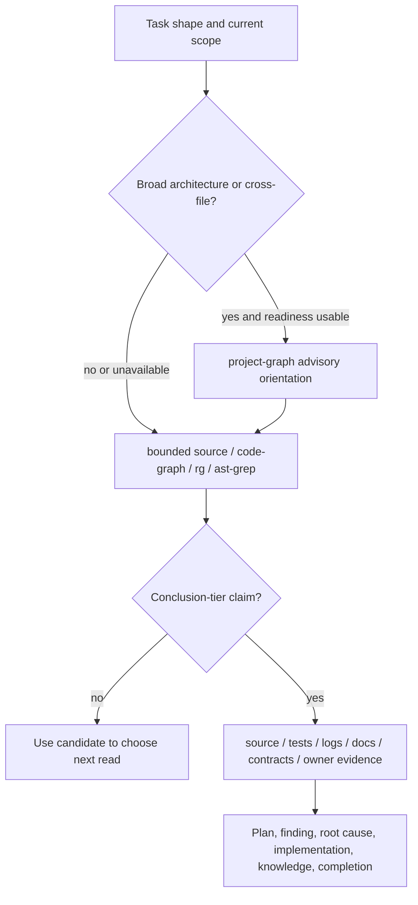
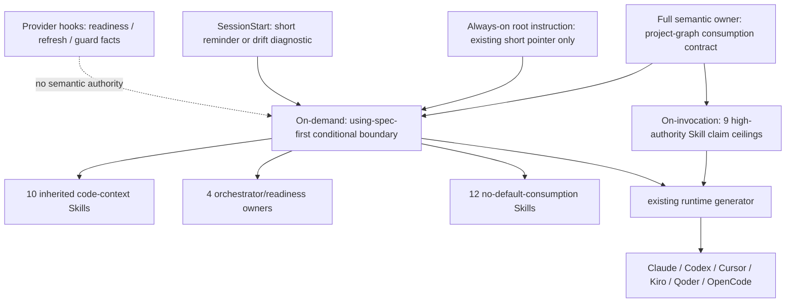

# 统一 Project Intelligence Skill 消费与证据分层 - Plan

## Goal Capsule

| Dimension | Decision |
| --- | --- |
| Objective | 基于 35/35 canonical `skills/**/SKILL.md` 的逐项审计，统一代码探索与结论证据边界，消除“部分 Skill 有图谱纪律、部分 Skill 只靠隐含约定”的漂移。 |
| Recommended approach | `extend` 现有 `docs/contracts/project-graph-consumption.md`，采用“零新增常驻上下文优先”的渐进披露：`using-spec-first` 提供集中式 Project Intelligence 条件边界，9 个高权威 Skill 保留自包含短锚点；根 instruction 只复用或收敛已有短指针，SessionStart 只提醒，Provider hook 只做机械检查。 |
| Core model | `project-graph` 用于宏观候选，`code-graph` / `rg` / ast-grep 用于战术定位，source / tests / logs / docs / contracts / owner evidence 用于结论确认；这是信任提升方向，不是强制调用顺序。 |
| Decision focus | 哪些 Skill 必须自包含、哪些可继承入口级边界、哪些只负责编排或 readiness、哪些与代码调查无关；完整语义、根 instruction、SessionStart、Provider hook 和 Skill 各自承载什么；如何用确定性测试保证 35/35 不漏项而不把 workflow 变成状态机。 |
| Verification focus | 35 个 Skill 全量归类无遗漏；9 个高权威消费者具备短锚点；没有把完整合同复制进根 instruction 或 SessionStart；Provider-specific 命令不泄漏进普通 workflow prose；六宿主投射保真；图谱候选不能跳级成为结论。 |
| Largest risk or boundary | 过度统一会把“按任务形态选择工具”误写成 `Graphify -> CodeGraph -> source` 的机械序列，或把同一长规则重复注入 root instruction、SessionStart 与多个 Skill，增加无效查询、常驻上下文、hook 执行面和 Provider 耦合。 |
| Execution profile / tail ownership | `spec-work` 修改 canonical contract、Skill source、focused tests、必要文档与 Changelog；随后通过 `spec-first init` 重投影当前支持的 Claude、Codex、Cursor、Kiro、Qoder、OpenCode runtime。 |
| Stop conditions | 实施需要新增中心 query dispatcher、图谱专属 evidence schema、公共 workflow、Provider wrapper、SessionStart 全量规则注入或需要手改 generated runtime 才能成立；任一情况返回 Project owner 重新裁决。若收敛现有未标记 `## graphify` section 必须扩大为 Provider ownership/migration 重构，也留在独立后续，不阻断本计划。 |

---

## Product Contract

### Summary

当前 spec-first **不是**统一执行 `Graphify（宏观候选） -> CodeGraph / rg / ast-grep（精确定位） -> 源码 / 测试 / 日志（结论证据）` 的系统。
全量审计 35 个 canonical `SKILL.md` 后，只有 `spec-prd` 与 `spec-rule-miner` 明确写入 project/code graph 候选边界；`spec-runtime-setup` 明确提及 CodeGraph/Graphify，但它只安装、配置和验证 readiness，不拥有代码理解或结论权威；其余 32 个 Skill 没有显式图谱消费锚点。

现有 `docs/contracts/project-graph-consumption.md` 已定义正确的三层关系：图谱输出只缩小下一步阅读范围，重要结论必须回到直接证据；同时明确这是一条**信任提升方向**，不是所有任务都必须从 project graph 开始。
本计划不发明新框架，而是恢复并加固这个已有契约的消费覆盖：入口级集中边界负责全局默认，高权威消费者用短锚点避免直接调用时丢失关键纪律，全量分类测试防止新增 Skill 再次漏接。

这里采用的“无侵入”不是零文件变化，而是**零新增长驻语义副本**：完整规则只保留在共享合同与按需加载的 conditional reference；根 instruction 不新增第二份长协议，已有 Graphify/CodeGraph 入口只允许收敛为短指针；SessionStart 不注入 Provider 选择或完整证据规则；Provider hook 只产生 readiness/guard facts。这样把持久规则、按需语义和机械执行面分开，同时保留 direct Skill invocation 的最小安全地板。

### Problem Frame

2026-06-11 的 project-graph consumption 计划曾要求 `spec-plan`、`spec-debug`、`spec-code-review`、`spec-work`、`spec-prd`、`spec-brainstorm`、`spec-ideate` 消费统一合同。
当前 source 只剩 `spec-prd` 的完整 capability-class 段与 `spec-rule-miner` 的短边界，原有覆盖测试 `tests/unit/project-graph-consumption-contracts.test.js`、`tests/unit/capability-aware-provider-contracts.test.js` 又在 `98e50159` 的大规模测试清理中删除，因此“合同仍在、消费者悄然漂移”没有确定性告警。

这里有两个相反风险：

- 覆盖不足：review、debug、plan、work、knowledge promotion 等高权威结论可能把 Provider 候选直接写成事实。
- 覆盖过度：把 35 个 Skill 全部塞入同一长段落或固定工具顺序，既增加常驻上下文，又违背简单事实、已限定文件和 runtime-only 任务应直接处理的原则。

还有一个独立的投递风险：即使规则本身正确，把它同时写进 `AGENTS.md`/`CLAUDE.md`、SessionStart additional context、Provider hook 输出与每个 Skill，也会形成多份 source、重复 token 和宿主差异。Codex 原生会在每次 run/session 建立 `AGENTS.md` 指令链，而 SessionStart 可以在 startup/resume/clear/compact 注入额外 developer context；因此 SessionStart 适合短提醒和 drift 告警，不适合承载完整 Project Intelligence 合同。

第一性原理要求分开三件事：工具可用性是 setup-owned fact，在哪里继续调查是 LLM judgment，能够声称什么由与 claim 匹配的直接证据决定。

### Requirements

**Semantic contract**

- R1. `docs/contracts/project-graph-consumption.md` 继续作为 project intelligence 消费语义的唯一 owner，明确 relay 是信任提升方向而非调用优先级；直接阅读 source、从 `rg`/ast-grep 开始或跳过 project graph 都是合法路径。
- R2. `project-graph`、`code-graph` 和 direct evidence 必须保持三层权威：前两层只产生 `provider_untrusted` 候选；进入 plan claim、review finding、root-cause conclusion、implementation basis、knowledge promotion 或 completion claim 前必须由 source、tests、logs、docs、contracts 或当前 owner evidence 确认。
- R3. “没有图谱命中”不具有否定权威；不得据此断言不存在调用、影响、owner、测试、依赖或跨模块关系。
- R4. Provider readiness 缺失、不可信、`unknown`/`unverified`、调用失败或显式禁用时，普通 workflow 必须 never-block，回退到 bounded source reads、`rg` 和 ast-grep；`stale` 只允许带“落后当前 source”注记的探索候选，结论仍必须回源，workflow 也始终可以直接 fallback。Runtime Setup 自身的 required setup completion 不得借此被伪报为完成。

**Skill consumption coverage**

- R5. `using-spec-first` 的 conditional boundary 增加集中式 Project Intelligence 规则：只在架构关系、跨文件关系、影响面或宽范围导航值得时使用 project graph；简单事实、当前上下文、单文档与已限定文件直接处理。
- R6. 9 个高权威代码结论消费者必须有自包含短锚点：`spec-app-consistency-audit`、`spec-code-review`、`spec-compound`、`spec-compound-refresh`、`spec-debug`、`spec-plan`、`spec-prd`、`spec-rule-miner`、`spec-work`。短锚点说明候选、回源与 claim ceiling，不复制整份共享合同。
- R7. 其余 26 个 Skill 必须显式归类为入口继承、编排/readiness owner 或不适用；分类是维护覆盖清单，不改变它们的 public route、授权、artifact 或运行状态。
- R8. 普通 workflow prose 使用 `project-graph` / `code-graph` capability class，不硬编码 Graphify/CodeGraph 命令。`spec-runtime-setup`、host instructions 和合同附录可保留 Provider-specific setup/示例内容。

**Deterministic floor and evolution**

- R9. 新增 35/35 exhaustive contract mapping：canonical Skill roster 与分类集合必须完全相等、互斥且无漏项；新增、删除或重分类 Skill 时测试必须要求维护者同步裁决。
- R10. 测试只强制覆盖、必要 token、禁止项和 source/runtime 投射，不根据分类自动执行 query、阻断 workflow、判断任务是否需要图谱，或把语义充分性脚本化。
- R11. 不新增 evidence schema、Provider adapter、query router、workflow state、公共 Skill 或 graph-specific artifact；复用现有 `provider_untrusted`、`direct_evidence_used`、review `Direct evidence:` 与 handoff `evidence_summaries[]`。
- R12. 所有改动 source-first；生成投射只能由现有 init/generator 产生，禁止手改 `.claude/`、`.codex/`、`.agents/skills/`、`.cursor/`、`.kiro/`、`.qoder/`、`.opencode/` runtime mirror。

**Low-intrusion instruction delivery**

- R13. 默认不得为了本计划新增一份常驻的完整 Project Intelligence root block。完整语义唯一 owner 仍是 `docs/contracts/project-graph-consumption.md`；`using-spec-first` conditional reference 是按需入口，9 个 H Skill 只保留 2-4 句 consumer-specific claim ceiling。
- R14. `AGENTS.md`、`CLAUDE.md` 与其他 host-native root instruction 只允许承载短入口锚点：说明按 task shape 选择导航、graph 为 advisory、完整边界位置。已有 Graphify/CodeGraph 段可在 source owner 明确且无需扩大 Provider migration 时收敛；不得新增互相竞争的 `Graphify first` 与 `CodeGraph first` 长段，也不得复制 readiness enum 或完整 relay contract。
- R15. SessionStart 只能注入幂等短提醒、managed block 缺失/drift 诊断和 routing policy 路径；不得注入完整 Project Intelligence 合同、Provider 命令、强制调用顺序或当前 readiness 结论。startup/resume/clear/compact 重入时，hook 自身不得持久化或追加 policy body；重复调用只返回同一有界语义。宿主是否重复保留同一短 pointer 属于 host behavior，不得被本计划伪报为可硬保证。
- R16. PreToolUse、Git hook 与 Provider-native hook 只负责可机械执行的 readiness、安全、刷新或 guard 行为；hook 输出不得决定“是否需要图谱”、架构关系是否成立、证据是否充分或结论权威。
- R17. 若某宿主不能可靠加载 `using-spec-first` conditional reference，降级顺序是保留 H Skill 本地短锚点、标记 host projection degraded，再修 generator；不得以 SessionStart 全量注入或手改 runtime mirror 绕过 source/runtime 边界。
- R18. 确定性测试只检查唯一 owner、短锚点、SessionStart 非复读、Provider hook 无语义权威和投射保真；不硬编码字符数、query 次序或模型必须调用某个 Provider。

### Key Flows

- F1. Broad architecture or cross-file investigation
  - **Trigger:** 问题涉及架构关系、跨模块路径、宽范围影响面或未知代码落点。
  - **Steps:** 读取可信 readiness；可用时先取 project-graph 候选，再按需要用 code-graph / `rg` / ast-grep 缩小范围，最后回到直接证据。
  - **Outcome:** 图谱改变“先看哪里”，但最终结论只由直接证据支撑。
  - **Covers:** R1-R6、R8。

- F2. Already-scoped or simple source question
  - **Trigger:** 用户点名文件/符号、问题是简单事实、当前上下文或单文档任务。
  - **Steps:** 直接读取 source，或使用 `rg`/ast-grep 做有界定位；不为满足形式而先跑 project graph。
  - **Outcome:** 更少上下文与更低延迟，同时不降低结论证据标准。
  - **Covers:** R1、R4-R5、R10。

- F3. Provider unavailable, stale, or misleading
  - **Trigger:** setup facts 不可信、Graphify/CodeGraph 调用失败、索引陈旧或结果为空。
  - **Steps:** 缺失/unknown/unverified/failure 时记录 limitation 并回退到 direct reads；stale 时可以只把结果作为带落后注记的探索候选，也可以直接 fallback；需要修复 readiness 时仅建议独立进入 `spec-runtime-setup`。
  - **Outcome:** 普通工作不中断，且不把 artifact 存在或 query 成功误写成语义正确。
  - **Covers:** R2-R4、R11。

- F4. High-authority conclusion
  - **Trigger:** 候选将进入 review finding、root cause、plan、implementation、knowledge 或 completion claim。
  - **Steps:** 对应 Skill 的本地短锚点要求记录 source refs 与 checks/logs；无法确认时降级为 candidate/risk/limitation。
  - **Outcome:** 无跳层抬升，结论 claim ceiling 与证据匹配。
  - **Covers:** R2-R3、R6、R11。

- F5. Session start, resume, or compact
  - **Trigger:** Host 启动、恢复、清空或压缩会话，SessionStart hook 被执行。
  - **Steps:** Hook 只确认根治理锚点是否存在并返回一条短 routing pointer；真正遇到宽范围代码调查时，由 `using-spec-first` 按需读取 Project Intelligence conditional reference；直接进入 H Skill 时由本地短锚点守住 claim ceiling。
  - **Outcome:** 会话恢复后规则仍可发现，但不会把完整 graph 合同重复塞入 developer context，也不会因 Provider readiness 瞬态把普通任务改道。
  - **Covers:** R13-R18。

### Acceptance Examples

- AE1. 架构问题且 project-graph readiness 可信时，workflow 可以先查询 project graph；报告中只把命中作为导航背景，最终架构判断引用 current source/contract/test。
- AE2. 用户问一个已点名函数的当前实现时，workflow 直接读取 CodeGraph 返回的逐字 source 或本地 source；未运行 Graphify 不构成违规。
- AE3. Graphify 返回跨模块关系但源码没有确认，输出只能写“候选关系/待确认”，不能写成 confirmed impact。
- AE4. CodeGraph 返回 affected-test 候选，workflow 核对测试文件与断言后才能把它列为验证范围；空结果不能证明没有相关测试。
- AE5. Graphify CLI 仍指向 legacy `graphify-out/graph.json` 而失败时，当前任务回退到 direct source；修复建议为独立 `spec-runtime-setup --only graphify`，不得在普通 plan/review/debug 中静默 refresh。
- AE6. 新增第 36 个 canonical Skill 而未加入分类映射时，focused contract test 失败并点名未分类 Skill；加入分类后才恢复通过。
- AE7. `spec-runtime-setup` 的 CodeGraph/Graphify first-generation/query probe 通过，只能证明 readiness facts；它不能证明 review finding、root cause 或代码影响面正确。
- AE8. 六宿主投射后的高权威 Skill 都保留同一短锚点与入口条件边界，且 runtime 文件来自 generator，不存在手工补丁。
- AE9. 新会话已加载根 instruction 时，SessionStart 只返回 `using-spec-first` 的短 pointer；输出不包含完整 Project Intelligence relay、readiness enum 或 Graphify/CodeGraph 命令清单。
- AE10. 会话在 compact/resume 后再次触发 SessionStart，返回内容仍是同一幂等短 pointer，不追加第二份 graph policy；后续宽范围任务再按需加载 conditional reference。
- AE11. 用户直接调用 `spec-debug`、`spec-code-review` 或其他 H Skill，即使没有经过根入口路由，本地 2-4 句锚点仍阻止 graph candidate 直接变成 root cause/finding/completion claim。
- AE12. 根 instruction 已有 Provider 安装的 Graphify 段但没有安全、明确的 source owner 时，本计划不强行迁移或覆盖该段；共享合同、conditional reference 与 H anchors 仍可独立成立。
- AE13. PreToolUse hook 返回 Graphify readiness/guard 信号，只能改变“该 Provider 当前是否可尝试”，不能自动决定当前任务必须查询 Graphify，或把 hook success 当作关系/结论证据。

### Success Criteria

- 35 个 canonical Skill 全部出现在唯一、可测试的分类矩阵中，没有“默认算继承”但未登记的隐含项。
- 9 个高权威消费者在 canonical source 与六宿主投射中都保留候选/回源/claim ceiling 边界。
- 入口级规则明确：Graphify/CodeGraph 是按任务形态选择的导航层，不是每次查代码都必须执行的仪式。
- 完整 Project Intelligence 语义只有一个 owner；本计划新增或修改的 root instruction、SessionStart 和 H Skill 内容都只保留与其职责相称的短锚点。既有未标记 Provider section 若不能安全迁移，明确记录为 baseline limitation，不把它扩张成第二语义 owner。
- SessionStart 在 startup/resume/clear/compact 只提供幂等 routing pointer 或 drift 诊断，Provider hook 只保留机械职责。
- 共享合同、Skill prose、host instructions 与 tests 对“信任提升方向，不是调用顺序”的表述无矛盾。
- 新机制不增加 public workflow、schema、runtime service、自动 query 或 Provider ownership。

### Scope Boundaries

**In scope**

- 统一 project intelligence 消费合同与 `using-spec-first` 条件边界。
- 为 9 个高权威代码结论消费者补齐或规范化短锚点。
- 建立 35/35 Skill 分类、focused contract test 与六宿主 projection assertions。
- 同步必要的当前架构说明、Changelog 与 source/runtime 验证。
- 固化 root instruction、SessionStart、Provider hook 与 Skill 的低侵入投递边界；默认不增加新的常驻 root graph 长段。

**Out of scope**

- 强制所有任务运行 Graphify 或 CodeGraph。
- 自动判断 query 内容、自动串联 Provider、生成 workflow 状态机或统一 query dispatcher。
- 修复 Graphify 当前 legacy output path、刷新 `.graphify/`、重建 CodeGraph index 或修改 provider pin。
- 评估 Graphify/CodeGraph 的召回准确率、完整性或性能；这些需要独立基准与 field evidence。
- 修改外部 Provider 本体、既有 Provider hook command/lifecycle、外部 MCP server、用户全局配置或项目外 hook。若当前 source-owned host instruction 与共享合同冲突，只允许同步其现有本地 renderer/normalization owner 的文案；不得借此改变 Provider 行为或 mutation scope。
- 把 `rg`/ast-grep 包装成新的 readiness provider。
- 通过 SessionStart 动态注入完整 Project Intelligence 合同、Provider readiness 快照或 query 决策。
- 为解决未标记 `## graphify` mixed-ownership section 而实施大范围 Provider ownership marker 迁移；若确有需要，独立规划。

---

## Planning Contract

### Key Technical Decisions

- KTD1. Extend the existing semantic owner. 复用并扩展 `docs/contracts/project-graph-consumption.md`，不新建第二份“统一代码查找协议”；现有合同已经拥有 capability vocabulary、readiness mapping、trust tiers、relay chain 和 recording rules。
- KTD2. Central default plus selective self-containment. `using-spec-first` 提供低常驻成本的全局条件边界；只有会产出高权威代码结论的 9 个消费者保留本地短锚点，避免直接调用或上下文裁剪时关键 claim ceiling 丢失。
- KTD3. Treat the relay as a partial order of trust. `project-graph -> tactical locating -> direct evidence` 表达权威提升，不表达必须经过的所有状态；任何 workflow 可以从 source 或 tactical locating 开始。
- KTD4. Keep provider lifecycle separate. `spec-runtime-setup` 继续拥有安装、配置、first generation、query probe、freshness 与 repair；普通 workflow 只读取 readiness/advisory facts，不接管 refresh 或 setup completion。
- KTD5. Use provider-neutral workflow prose. 普通 Skill 写 capability class 与证据责任；Graphify/CodeGraph 名称和命令只留在 setup owner、host instructions、架构说明或合同附录。
- KTD6. Make completeness deterministic, not semantics. 新测试确定性检查 35/35 roster、分类互斥与必要锚点；是否需要图谱、候选是否有用、证据是否语义充分继续由 LLM 判断。
- KTD7. Preserve bounded direct reads. CodeGraph native interface 返回的逐字、当前、带 file/line 的源码片段可作为 bounded direct read；不要求为了仪式再次打开同一文件。CodeGraph 推导出的 call/impact/ownership/test 候选仍需确认。
- KTD8. Do not duplicate the long contract into all Skills. 分类为 inherited 的 Skill 只依赖入口边界；not-applicable 与 orchestrator/setup Skill 不增加无关 prose，避免 35 份漂移副本和固定上下文膨胀。
- KTD9. Prefer zero new always-on context. 本计划不默认向 `AGENTS.md`/`CLAUDE.md` 增加第二份完整 Project Intelligence block；root instruction 只在已有 source-owned/provider-owned入口确需对齐时保留一条 task-shape + advisory + pointer 短锚点。主要语义通过 `using-spec-first` conditional reference 按需加载。
- KTD10. SessionStart is a reminder, not an authority. SessionStart 只检查 managed governance anchor 并注入短 routing pointer 或 drift 诊断。它不携带 Provider 选择、readiness 快照、完整 relay 或 completion evidence，因此 startup/resume/clear/compact 重入不会制造第二份语义 owner。
- KTD11. Keep hooks mechanical. PreToolUse、Git hook 和 Provider-native hook 的 authority 只覆盖 command/readiness/refresh/guard 等确定性执行面；语义触发、候选价值与 evidence adequacy 仍由 LLM/Skill 决定。
- KTD12. Preserve direct-invocation safety with selective duplication. 9 个 H Skill 的 2-4 句短锚点是有意的最小重复，用于 direct invocation、宿主上下文裁剪和入口投射降级；它们只重复 claim ceiling，不重复 trigger/readiness 全表。
- KTD13. Do not turn mixed-ownership cleanup into a hidden migration. 当前未标记 `## graphify` section 的 ownership 仍按现有 Provider/source 边界处理。若无法用现有 recognized section 安全对齐，则保持 read-only limitation；本计划不借文案统一发起 marker migration、覆盖用户 section 或扩展 Provider mutation scope。

### High-Level Technical Design

### 35-Skill Full Audit Matrix

分类含义：`H` = 高权威消费者，需本地短锚点；`I` = 可能读取代码但入口级边界足够；`O` = 编排、隔离或 readiness owner，不独立拥有代码语义结论；`N` = project intelligence 不是该 Skill 默认合同的一部分，任务意外扩张时仍可回到入口级边界，不表示永久禁用。

**Classification decision rules**

- H：Skill 会原创并持有 review finding、root cause、implementation basis、knowledge promotion、PRD/source contract 或 completion 等高权威代码结论，且可能从宽范围问题直接进入；上下文裁剪时丢失证据边界会直接抬高错误 claim。
- I：Skill 可能读取代码，但代码关系只是辅助输入，或任务通常已经由 diff/comment/recent change/外部 candidate 限定；集中式入口边界足以约束偶发的宽范围调查。
- O：Skill 只选择下游 owner、准备 readiness facts 或提供隔离/编排，不独立把代码关系提升为语义结论。
- N：Skill 的主要输入是 git landing、文档、产品 signal、媒体或 runtime execution，project intelligence 不是默认步骤；若实际任务扩展为架构/跨文件调查，必须重新进入 `using-spec-first` 条件边界。
- H=9/I=10/O=4/N=12 是当前 working-tree snapshot，不是永久配额。未来可以改变分类与数量，但必须同步更新理由、测试 map 和受影响 local anchor；测试锁住的是“每个 Skill 被明确裁决”，不是某类永远固定数量。

| # | Canonical Skill | 当前代码调查/证据行为 | 当前显式 graph 状态 | 当前是否实现固定三层链 | Target class and action |
| --- | --- | --- | --- | --- | --- |
| 1 | `spec-app-consistency-audit` | 静态比较 PRD/Figma/source，confirmed issue 要求项目直接证据 | 无 | 否；直接证据层已存在，宏观/战术候选层未定义 | H：补 audit finding 专属短锚点 |
| 2 | `spec-brainstorm` | 可读取仓库事实辅助 WHAT，但用户拥有产品语义 | 无 | 否 | I：继承；图谱不得决定产品 scope authority |
| 3 | `spec-code-review` | 以 diff/source/tests/standards 形成 finding | 无 | 否；直接 evidence 很强但无统一 graph 边界 | H：补 finding/impact/affected-test claim ceiling |
| 4 | `spec-commit-push-pr` | 只处理 scoped git/PR landing evidence | 无 | 不适用 | N：不增加代码探索 prose |
| 5 | `spec-commit` | 只处理 scoped commit 与授权 | 无 | 不适用 | N：不增加代码探索 prose |
| 6 | `spec-compound-refresh` | 用 current code 审计 docs/solutions freshness | 无 | 否 | H：补 currentness/supersession 回源锚点 |
| 7 | `spec-compound` | 把已解决问题提升为 durable knowledge | 无 | 否 | H：补 knowledge-promotion 回源锚点 |
| 8 | `spec-debug` | 以日志、失败测试、源码建立 root cause | 无 | 否 | H：补 root-cause/impact 短锚点 |
| 9 | `spec-doc-review` | 评审 requirements/plan/task/spec 文档，必要时核对引用 | 无 | 不适用为默认代码调查链 | N：文档证据 owner 保持独立；若扩展为架构核对则重新走入口边界 |
| 10 | `spec-dogfood` | diff-scoped browser QA，可定位改动 flow 并修小问题 | 无 | 否 | I：继承；browser/diff evidence 仍为主 |
| 11 | `spec-explain` | 解释 concept/diff/recent work，不产生 shipping claim | 无 | 否 | I：继承；按问题形态直接 source 或宏观候选 |
| 12 | `spec-ideate` | 用仓库事实生成 grounded ideas | 无 | 否 | I：继承；图谱只能定向，不能替用户选择方向 |
| 13 | `spec-lfg` | 编排 plan/work/review/browser/landing | 无 | 不独立实现；依赖下游 owner | O：不复制消费协议，验证下游 handoff 保留证据 |
| 14 | `spec-optimize` | 以代码实验与指标收敛 | 无 | 否 | I：继承；最终 authority 是可复现 measurement |
| 15 | `spec-plan` | 用 current source/contracts/tests 形成 implementation basis | 无 | 否；当前 planning evidence 只写 provider advisory 总则 | H：补 plan claim 与 affected-surface 短锚点 |
| 16 | `spec-polish` | 已限定 feature 的 browser/UI 迭代 | 无 | 不适用为默认入口 | N：保持 scoped source + runtime observation |
| 17 | `spec-pov` | 以当前项目判断外部技术/平台是否适用 | 无 | 否 | I：继承；涉及 repo 关系时可用候选，verdict 必须回源 |
| 18 | `spec-prd` | brownfield PRD 以当前 source 为 scope/behavior 依据 | 已有完整 capability-class boundary | 否；已明确候选与回源，但不是固定顺序 | H：保留并压缩为与共享合同一致的短锚点 |
| 19 | `spec-product-pulse` | 汇总时间窗口内产品 signals | 无 | 不适用 | N：不引入代码探索链 |
| 20 | `spec-promote` | 基于已 shipped feature 写推广文案 | 无 | 不适用 | N：shipping evidence 由上游提供 |
| 21 | `spec-proof` | Markdown 协作与 HITL review 工具 | 无 | 不适用 | N：不引入代码探索链 |
| 22 | `spec-resolve-pr-feedback` | 处理已限定 review comments 与对应 source/diff | 无 | 否 | I：继承；comment scope 通常已给出战术入口 |
| 23 | `spec-riffrec-feedback-analysis` | 分析录屏、音频与 capture bundle | 无 | 不适用 | N：媒体 evidence owner 保持独立 |
| 24 | `spec-rule-miner` | 从当前 source 挖项目约定 | 已有 project/code graph 候选 + source 回源句 | 否；已是可选候选，不是固定顺序 | H：规范为共享合同短锚点并保留 source-only rule evidence |
| 25 | `spec-runtime-setup` | 安装、配置、验证 CodeGraph/Graphify readiness | 大量 Provider-specific setup prose | 否；这是 lifecycle/setup 顺序，不是代码调查链 | O：保持 setup owner，不获得语义结论权威 |
| 26 | `spec-simplify-code` | 简化最近改动、保持行为 | 无 | 否 | I：继承；范围通常已由 recent diff 限定 |
| 27 | `spec-strategy` | 创建/更新产品 `STRATEGY.md` | 无 | 不适用 | N：产品方向证据不默认走代码图谱 |
| 28 | `spec-sweep` | 聚合反馈 source、核对修复是否 merged | 无 | 否 | I：继承；代码核对按具体反馈有界进行 |
| 29 | `spec-test-browser` | 对当前 PR/branch 受影响页面做 runtime test | 无 | 不适用为默认代码定位链 | N：scope 与结论由 diff/browser evidence 决定；扩大为跨模块调查时重新路由 |
| 30 | `spec-test-xcode` | 构建、模拟器测试与 crash/runtime 验证 | 无 | 不适用 | N：build/test logs 是直接证据 |
| 31 | `spec-work` | 根据 settled plan 实现并形成 completion claim | 无 | 否 | H：补 implementation basis、impact 与 completion 回源锚点 |
| 32 | `spec-worktree` | caller-owned git worktree 隔离 helper | 无 | 不适用 | O：隔离 owner，不做代码语义判断 |
| 33 | `spec-write-skill` | 创建/修改/审计已限定 Skill package source | 无 | 否 | I：继承；跨文件时可导航，Skill source/eval 才是结论依据 |
| 34 | `spec-write-tasks` | 把 settled plan 编译为 derived task pack | 无 | 不适用 | N：plan artifact 是 authority，不重新调查代码 |
| 35 | `using-spec-first` | 选择入口并加载条件边界 | 无 project-intelligence 条件段 | 否 | O：成为集中式 Project Intelligence 边界 owner |

**Audit verdict:** `H=9`、`I=10`、`O=4`、`N=12`，合计 35。当前完整固定三层链为 `0/35`；当前显式 graph 消费/管理提及为 `3/35`，其中真正 consumer 为 `2/35`，setup owner 为 `1/35`。

### Interface Contracts

| Interface | Consumers | Canonical owner | Evolution | Compatibility | Verification |
| --- | --- | --- | --- | --- | --- |
| Project intelligence semantic contract | all code-aware workflows and reviewers | `docs/contracts/project-graph-consumption.md` | 明确 centralized classification、trust partial order、direct-evidence claim ceiling | 解释性收紧；不改变 schema/provider lifecycle | `tests/unit/project-graph-consumption-contracts.test.js` |
| Entry conditional boundary | all substantial routes loaded through `using-spec-first` | `skills/using-spec-first/SKILL.md`, `skills/using-spec-first/references/conditional-routing-boundaries.md` | 新增 task-shape/readiness/fallback 条件段 | Additive；不改变 route map 或 public entry | `tests/unit/using-spec-first-contracts.test.js` |
| High-authority local anchors | review/debug/plan/work/knowledge/PRD/rule audit consumers | 9 个 canonical `skills/*/SKILL.md` | 统一候选、回源、negative authority 与 claim ceiling | Prose-only behavior hardening；不改 artifact fields | `tests/unit/project-graph-consumption-contracts.test.js`, fresh-source eval |
| Root instruction boundary | host session bootstrap and human maintainers | existing source-owned `CLAUDE.md` / derived `AGENTS.md`, plus recognized Provider-owned section where already installed | 默认不新增长 block；只核对或在 owner 明确时收敛为 task-shape/advisory/pointer 短锚点；既有未标记 section 可保持 limitation | 保留现有 host discovery；mixed ownership 不安全时 read-only | `npm run sync:instructions`, `tests/unit/project-role-contract.test.js`, stale-phrase scan |
| SessionStart reminder | Claude/Codex/Qoder session bootstrap | `templates/*/hooks/session-start`, host adapters | 固化 short-pointer-only 与 drift-diagnostic-only | 不改变 hook event/config contract；不注入 Provider policy | `tests/unit/session-start-entry.test.js` |
| Provider hook mechanical boundary | setup/readiness and provider runtime | existing Provider setup contracts and hook config | 明确 hook success 只有机械权威，不拥有 task routing/evidence adequacy | 不修改 Provider lifecycle 或 hook command shape | `tests/unit/mcp-setup-providers.test.js`, `docs/contracts/provider-readiness.md` assertions |
| Exhaustive classification map | maintainers adding/removing/reclassifying Skills | `tests/unit/project-graph-consumption-contracts.test.js` | 35/35 roster equivalence and category assertions | Test-only deterministic floor | focused Jest |
| Host runtime projection | six host adapters and installed runtimes | existing generator / adapter source | 投射新增 source prose，不增加 host-specific branch | 当前 `getSupportedPlatforms()` 全覆盖 | `tests/unit/host-runtime-projection-contracts.test.js`, `tests/unit/plugin-modules.test.js` |

### Evidence & Limitations

- Current-source audit snapshot: branch `leo-2026-07-27-opencode`, HEAD `20ec3331133345794d1781c9b6b50be2c1d78762`, 2026-07-30 工作树有 75 个 dirty/untracked entries。实施必须增量保留 OpenCode、Runtime Setup、browser readiness 等用户改动，禁止 reset、清理或覆盖。
- 35 个 canonical `skills/**/SKILL.md` 已逐项枚举并扫描；只有 `spec-prd`、`spec-rule-miner`、`spec-runtime-setup` 含 graph capability/provider 词汇。这个计数是 current working-tree fact，Skill roster 变化后失效。
- `docs/contracts/project-graph-consumption.md` 当前已明确“trust-elevation direction, not a call-priority order”“direct source first is valid”“no skip-layer elevation”，因此本计划选择 `extend`，不是建立新协议。
- Codex 官方文档说明 `AGENTS.md` 在每次 run/session 构建指令链，SessionStart 的 stdout/additionalContext 会作为额外 developer context，并可在 compact 后再次运行；同一会话多个 hook/plugin context 会累积并影响模型表现。因此 root instruction 适合短持久锚点，SessionStart 适合幂等提醒，不适合复制完整 Project Intelligence 合同。来源：`https://learn.chatgpt.com/docs/agent-configuration/agents-md.md`、`https://learn.chatgpt.com/docs/hooks.md`。
- 当前 `templates/claude/hooks/session-start`、`templates/codex/hooks/session-start` 与 `templates/qoder/hooks/session-start` 已遵循“根治理 block 已存在时只注入短 pointer”的形态；本计划优先用 focused test 固化该现状，而不是发明新的 graph session injection。
- `docs/plans/2026-06-11-002-feat-project-graph-consumption-protocol-plan.md` 证明历史设计曾覆盖 7 个 workflow；Git history 显示 `98e50159` 删除了对应 project-graph/capability-aware contract tests。历史计划和 commit 只解释漂移来源，当前方案仍以 current source 为准。
- 本轮 Graphify runtime-visible，但 `graphify query` 实际失败并仍寻找 `graphify-out/graph.json`；因此 Graphify 没有进入任何 load-bearing 结论。CodeGraph 只提供初步导航，所有关键结论均回读 current Skill、contract、tests 与 Git history。Graphify readiness 修复属于独立 `spec-runtime-setup --only graphify` 范围。
- 当前 adapter registry 返回 `claude,codex,cursor,kiro,qoder,opencode`；OpenCode source 尚在 dirty worktree 中，六宿主结论只适用于当前工作树，不能外推到已提交 HEAD 或 release。
- 本轮没有 worker/subagent dispatch 授权；planning research、coherence、feasibility 与 adversarial review 使用 inline/serial fallback，记录 `dispatch_authorization_missing`，不声明 independent reviewer coverage。

### Migration Strategy

1. 先扩展共享合同与入口 conditional boundary，建立唯一语义 owner，并把 root instruction、SessionStart、Provider hook、Skill 的投递职责写成显式边界。
2. 固化 SessionStart short-pointer-only 与 Provider-hook-mechanical-only contract；默认不新增 root long block，只有 current source 与共享合同真实冲突时才收敛已有短入口。
3. 再补 9 个高权威 Skill 的短锚点；已存在的 `spec-prd`、`spec-rule-miner` 做语义对齐，不扩大 Provider-specific prose。
4. 恢复一个 consolidated project-graph contract test，以 canonical governance roster 驱动 35/35 分类检查；不恢复已经无 active consumer 的整批旧测试。
5. 用现有 generator 投射当前六宿主，确认相同语义到达各 runtime surface；不手改任何生成文件。
6. 更新 Changelog 与必要 current docs，执行 focused/full verification；fresh-source eval 仅在当前用户或上游显式授权 delegated reviewer 时运行，否则诚实记录 `not_run`。

### Rollback Strategy

- 回滚只撤销本计划新增的 contract/Skill/test/docs source slice，并重新运行 source-first init；不触碰 Provider artifact、用户全局配置或工作树中的其他未提交改动。
- 若 local anchors 造成明显上下文或行为回归，保留共享合同与 35/35 分类测试，把受影响 Skill 从 `H` 降为 `I`，而不是删除全局证据边界。
- 若入口 conditional boundary 在某宿主无法可靠加载，保留 9 个自包含锚点作为最小安全地板，并把该宿主投射标记 degraded；不得用手改 runtime 规避 generator 问题。
- 若 root instruction 对齐扩大为未计划的 Provider section marker migration，回滚 root 文案变化并保留 contract/conditional/H-anchor 主路径；不以 SessionStart 全量注入补偿。

### Risks

| Risk | Impact | Mitigation / rollback signal |
| --- | --- | --- |
| 把信任梯度误读为固定工具顺序 | 每次任务多跑 Provider，延迟和上下文上升 | 合同、测试和 9 个锚点必须包含“not call priority / direct source valid”；出现强制 `first/then/always` 即回滚措辞 |
| 入口继承在 direct Skill invocation 下丢失 | `I` 类 Skill 可能看不到全局边界 | 只把高权威结论 consumer 放入 H；host instruction 继续要求 substantial work 先加载 `using-spec-first`；fresh-source eval 覆盖 direct invocation |
| 9 份短锚点再次漂移 | claim ceiling 不一致 | 共享合同保留完整语义，local prose 限 2-4 句；focused test 检查共同承重 token 与 consumer-specific 句 |
| 把完整合同塞入 SessionStart | startup/resume/compact 重复 developer context，增加 token 与宿主 hook 依赖 | `session-start-entry` test 只允许短 pointer/drift diagnostic；出现 Provider 命令、readiness enum 或完整 relay 即失败 |
| 为了“统一”新增 root long block | 每次 session 常驻成本上升，并与已有 Graphify/CodeGraph host instruction 形成双重真相源 | 默认 zero-new-always-on；只对齐既有短入口，完整合同留在按需 reference |
| Provider hook 获得语义权威 | hook success 被误读为“必须查询”或“关系已确认” | shared contract 与 Provider readiness tests 明确 mechanical-only；workflow 不消费 hook 输出作为结论证据 |
| 35/35 分类测试变成运行时状态机 | 新 Skill 被机械限制 | 测试只检查 roster/classification/anchors；禁止生成 query order、runtime gate 或自动 route |
| 与 CodeGraph-first host instruction 冲突 | Agent 不知道 Graphify 与 CodeGraph 谁“先” | 明确按 task shape：宏观架构可 project-graph；代码定位在 indexed repo 优先 CodeGraph；任何时候可直接读 source；二者都不能证明结论 |
| Graphify 当前 runtime 不可用 | 无法 field-check 宏观候选行为 | 方案不依赖 Graphify 输出；记录 limitation，单独通过 Runtime Setup 修复后再做 field journey |
| 六宿主 source 仍在 dirty worktree | projection 断言可能与未来 HEAD 不同 | 实施前重读 `getSupportedPlatforms()` 和 overlapping diff；测试按 current registry 动态枚举，不覆盖现有 OpenCode 改动 |

---

## Implementation Units

### U1. Extend the shared contract and entry boundary

- **Goal:** 让共享合同和 `using-spec-first` 明确拥有 task-shaped Project Intelligence 消费边界，并定义 root instruction、SessionStart、Provider hook 与 Skill 的低侵入投递职责，而不改变 public route 或工具生命周期。
- **Files:** `docs/contracts/project-graph-consumption.md`, `skills/using-spec-first/SKILL.md`, `skills/using-spec-first/references/conditional-routing-boundaries.md`, `tests/unit/using-spec-first-contracts.test.js`, `tests/unit/project-graph-consumption-contracts.test.js`。
- **Patterns:** 复用现有 Runtime Maintenance、Worker Dispatch 条件段的“集中规则 + 主入口触发”结构；复用合同已有 Trigger Shape、Readiness Gate、Trust Tiers、Relay Chain。
- **Decisions:** 新段只决定何时考虑 project intelligence、如何 fallback、如何提升证据；同时声明完整合同唯一 owner、SessionStart short-pointer-only 与 Provider-hook-mechanical-only。它不决定具体 query、Provider 或调用顺序，也不要求新增 root long block。
- **Test Scenarios:**
  - Broad architecture/cross-file 任务触发读取 Project Intelligence 条件段。
  - 简单事实、当前上下文、单文档、已限定文件明确不要求 project graph。
  - readiness unknown/unverified/provider failure 走 bounded direct reads 且 ordinary workflow never-block。
  - contract 明确 direct source first valid、no skip-layer elevation、empty result no negative authority。
  - contract 明确 root instruction、SessionStart 与 Provider hook 都不是第二语义 owner，且 SessionStart/hook success 不能提升 graph candidate 权威。
- **Verification:** focused Jest 对承重句、唯一条件段引用、无 route-map 扩张和无 Provider command 泄漏进行断言。
- **Dependencies:** none。

### U2. Add self-contained anchors to nine high-authority consumers

- **Goal:** 让直接进入 review/debug/plan/work/audit/knowledge workflow 时仍保留候选证据与结论回源边界。
- **Files:** `skills/spec-app-consistency-audit/SKILL.md`, `skills/spec-code-review/SKILL.md`, `skills/spec-compound/SKILL.md`, `skills/spec-compound-refresh/SKILL.md`, `skills/spec-debug/SKILL.md`, `skills/spec-plan/SKILL.md`, `skills/spec-prd/SKILL.md`, `skills/spec-rule-miner/SKILL.md`, `skills/spec-work/SKILL.md`, `tests/unit/project-graph-consumption-contracts.test.js`。
- **Patterns:** 延续 `spec-prd` 当前 Capability-Class Evidence Boundary 与 `spec-rule-miner` source-return 句，但压缩为短锚点；每个 Skill 保留自己的 conclusion noun，例如 finding、root cause、plan claim、implementation basis、knowledge promotion。
- **Decisions:** 所有 H 类 Skill 都必须说明 project/code graph 只是 candidate、图派生关系需回源、Provider 不可用不阻断；不要求复制 readiness enum 全表。
- **Test Scenarios:**
  - 每个 H Skill 都引用共享合同并含 `project-graph`、`code-graph`、`provider_untrusted` 与 direct-evidence 义务。
  - `spec-code-review` 不把 affected-test/impact candidate 直接变成 finding。
  - `spec-debug` 不把 graph path 直接变成 root cause。
  - `spec-plan`/`spec-work` 不把候选变成 implementation basis 或 completion claim。
  - `spec-compound`/`spec-compound-refresh` 未确认时不得 promotion/refresh 为 durable truth。
  - `spec-prd`/`spec-rule-miner` 保留当前行为且不再承担完整共享合同副本。
- **Verification:** focused Jest、Skill entrypoint lint；如获 explicit delegated-review authorization，再按 fresh-source checklist 覆盖 direct invocation 与 candidate-overreach 场景。
- **Dependencies:** U1。

### U3. Establish the exhaustive 35/35 classification contract

- **Goal:** 用最小确定性机制防止未来 Skill 漏接、误接或重复接入 project intelligence 边界。
- **Files:** `tests/unit/project-graph-consumption-contracts.test.js`, `src/cli/contracts/dual-host-governance/skills-governance.json`（read-only test input；除非 roster 本身另有已授权变更，否则不修改）。
- **Patterns:** 复用现有 governance roster 与 filesystem source inventory；测试中的四类 map 是维护契约，不是 production data。
- **Decisions:** 测试从 current governance/source roster 计算 canonical Skill 集合，与 H/I/O/N map 做双向相等、互斥和无重复断言；当前 snapshot 同时固定为 35，新增第 36 个 Skill 必须显式归类。分类数量是可审查快照而非永久 invariant，显式重分类可以更新 counts，但不得绕过理由与 anchor 变更。
- **Test Scenarios:**
  - 35 个 current Skill 全部且仅出现一次，H=9/I=10/O=4/N=12。
  - roster 新增 Skill 未分类时失败，并输出 missing name。
  - 分类包含不存在 Skill 时失败，并输出 stale name。
  - H 类缺共享合同/承重 token 时失败。
  - I/O/N 类不会被测试要求复制 H 类长段，也不会产生 runtime query order。
  - 只有 setup owner 或合同附录允许 Provider-specific lifecycle/command prose；普通 consumer 保持 capability-class。
  - 测试拒绝在 35 个 Skill 中复制 readiness enum、Provider command list 或完整 SessionStart/root instruction 文案；H 类只检查短 claim-ceiling token。
- **Verification:** `npx jest tests/unit/project-graph-consumption-contracts.test.js --runInBand`。
- **Dependencies:** U1、U2。

### U4. Verify source-first projection across all supported hosts

- **Goal:** 让 canonical source 变更通过现有 generator 到达当前六宿主，并确认 host bootstrap 仍采用短指针/按需加载而不是 SessionStart 全量注入，不产生 runtime-only drift。
- **Files:** `tests/unit/host-runtime-projection-contracts.test.js`, `tests/unit/plugin-modules.test.js`, `tests/unit/session-start-entry.test.js`, `templates/claude/hooks/session-start`, `templates/codex/hooks/session-start`, `templates/qoder/hooks/session-start`（三份 template 默认只读；仅在 focused test 发现真实 divergence 时修改）, existing adapter/generator source only if a real projection defect is discovered; generated runtime paths are verification outputs, not edit targets。
- **Patterns:** 复用 `getSupportedPlatforms()` 动态 roster、`plugin-sync` source-to-runtime projection 与 `using-spec-first` reference projection assertions。
- **Decisions:** 当前工作树的支持集合是 Claude、Codex、Cursor、Kiro、Qoder、OpenCode；测试不得继续硬编码“五宿主”。Claude/Codex/Qoder SessionStart 只固定 routing pointer 与 drift diagnostic，不新增 graph policy；其他宿主没有等价 SessionStart 时保持 semantic projection，不伪造 parity。若实施时 registry 改变，以 current source 为准并更新计划偏差说明。
- **Test Scenarios:**
  - 六宿主都投射 `using-spec-first` 的 conditional reference。
  - 六宿主都投射 9 个 H Skill 的短锚点，没有 path rewrite 丢失。
  - Provider-neutral consumer prose 在 runtime projection 中保持不变。
  - Claude/Codex/Qoder SessionStart 在 managed block current 时只输出 `using-spec-first` runtime path/短 pointer，不出现 Graphify/CodeGraph 命令、readiness enum 或完整 relay 文案。
  - 重复执行 SessionStart 得到语义等价的幂等输出；不存在每次 resume/compact 追加新 policy body 的状态。
  - source 与 generated runtime drift 检查通过；无手工 runtime patch。
- **Verification:** focused projection Jest，随后执行 project-approved source-first `spec-first init` 和对应 doctor/drift checks。
- **Dependencies:** U1-U3；实施前重读 current dirty OpenCode changes。

### U5. Close documentation, review, and verification obligations

- **Goal:** 对齐当前架构说明、用户可见变更记录与最终证据，避免“合同已改但文档/测试/运行时仍旧”的半完成状态。
- **Files:** `docs/solutions/architecture-patterns/codegraph-graphify-capability-and-evidence-boundary.md`（仅在 current wording 需要补消费覆盖时修改）, `AGENTS.md`, `CLAUDE.md`（默认只读核对；只有 source-owned graph instruction 与共享合同冲突时修改，并同步其真实生成/规范化 owner）, `CHANGELOG.md`, `README.md`, `README.zh-CN.md`, `docs/05-用户手册/04-workflows-artifacts-map.md`（后三者仅在 stale-phrase sweep 发现用户可见冲突时修改）。
- **Patterns:** current-state-first documentation；历史计划与 Changelog 保留历史事实，不重写为当前 contract。
- **Decisions:** Changelog 必更；README/用户手册不是机械必改，只有存在“固定顺序”“Graphify first always”或旧宿主数量等当前冲突才更新。`AGENTS.md`/`CLAUDE.md` 默认保持 read-only：本计划不为 Project Intelligence 新增长 block；只有现有 source-owned 短入口与共享合同冲突且真实 owner 可同步时才收敛。未标记 Provider-owned section 需要 migration 时记录 limitation 并停止扩大范围。
- **Test Scenarios:**
  - 全仓 active source 中没有把 relay 写成 mandatory sequence 的承重句。
  - 当前 docs 对 setup readiness、advisory candidates、direct evidence 与 six-host projection 无冲突。
  - active source 中没有把完整 Project Intelligence 合同同时复制到 root instruction、SessionStart 与 H Skill；root 只有短入口或保持现状，SessionStart 只有 pointer，H Skill 只有 claim ceiling。
  - `npm run sync:instructions` 通过；如 root instruction 无需改动，验证结果明确记录 `read-only/no-change`，不为满足形式制造 diff。
  - headless document review 不留下 P0/P1 blocking finding；无 dispatch 授权时明确 inline/serial 和 claim limitation。
  - `git diff --check`、frontmatter、repo-relative path 与 35-row matrix 检查通过。
- **Verification:** focused tests、`npm run lint:skill-entrypoints`、`npm run typecheck`、`npm run test:unit`、必要时 `npm run build`；fresh-source eval 按授权状态执行或记录 `not_run`。
- **Dependencies:** U1-U4。

### Sequencing

1. U1 建立语义 owner、入口边界与低侵入投递职责。
2. U2 在该 owner 上补 9 个 local anchors。
3. U3 固化 35/35 coverage 与 anti-state-machine constraints。
4. U4 执行六宿主 source-first projection、SessionStart 非复读和 drift 验证。
5. U5 完成 docs、Changelog、review、full verification 与 limitation closeout。

---

## Verification Contract

| Gate | Applies to | Command / method | Required evidence | Claim ceiling |
| --- | --- | --- | --- | --- |
| Structural audit | U1-U3 | focused Jest for `tests/unit/project-graph-consumption-contracts.test.js` and `tests/unit/using-spec-first-contracts.test.js` | 35/35 set equality、category counts、H anchors、central boundary | 只证明 source contract completeness |
| Instruction non-duplication | U1/U4/U5 | `npx jest tests/unit/session-start-entry.test.js tests/unit/project-graph-consumption-contracts.test.js --runInBand`; `npm run sync:instructions` | SessionStart short-pointer-only、no root/session/full-contract duplication、root source sync current | 只证明 source/template contract；不证明 host 实际加载或模型遵循 |
| Skill source quality | U2 | `npm run lint:skill-entrypoints` | canonical Skill packages valid，no broken references/entry contracts | 不证明 LLM field behavior |
| Syntax/static checks | U1-U5 | `npm run typecheck` | CLI/scripts syntax remains valid | 不证明 projection 或语义效果 |
| Projection parity | U4 | focused `tests/unit/host-runtime-projection-contracts.test.js`, `tests/unit/plugin-modules.test.js`; then source-first init/doctor | current supported-host roster 全覆盖、source/runtime no drift | 不证明 host loader 或实际模型遵循 |
| Full regression | U1-U5 | `npm run test:unit`; impact 扩大时再跑 `npm test` 与 `npm run build` | existing workflow/provider/runtime contracts 不回退 | 不证明 Provider recall/field outcome |
| Fresh-source behavior | U2/U5 | `docs/contracts/workflows/fresh-source-eval-checklist.md` 的 direct-invocation cases；仅在明确 worker authorization 后用 fresh read-only reviewer | candidate-overreach、direct-source shortcut、provider unavailable cases | 只证明评估样本与当前 source；不外推所有 host/model |
| Runtime field journey | optional follow-up | 修复 Graphify readiness 后做真实 broad/scoped comparison | query、accepted/rejected candidates、direct source refs、limitations | 不是本计划 completion blocker；不证明 recall completeness |
| Final hygiene | all | stale-phrase scan、frontmatter/path check、`git diff --check` | 无绝对路径、无 trailing whitespace、无固定序列矛盾、无 unrelated overwrite | 只证明 plan-defined local closeout |

### Mandatory Test Scenarios

1. Broad architecture task may start with project graph when ready, then re-ground every conclusion.
2. Already-scoped symbol/file task may start with CodeGraph source or direct source and skip Graphify.
3. Project graph unavailable/unknown/unverified does not block ordinary workflow and does not trigger silent refresh；stale 只可作为带落后注记的探索候选，或直接 fallback。
4. Project graph/code graph empty result has no negative authority.
5. Verbatim current source with file/line returned by native code-graph surface counts as bounded direct read; derived call/impact/test facts do not.
6. Each of the 9 H Skills rejects candidate-only elevation for its own conclusion type.
7. Each of the 10 I Skills is classified without copying the long contract.
8. Each of the 4 O Skills keeps its owner boundary and cannot gain code semantic authority.
9. Each of the 12 N Skills remains free of irrelevant project-intelligence ceremony.
10. A new or removed Skill causes the exhaustive classification test to fail until deliberately adjudicated.
11. All current supported hosts receive the same central boundary and H anchors from source generation.
12. Graphify readiness failure remains a disclosed limitation and does not invalidate source-backed audit conclusions.
13. Current managed SessionStart templates emit only a short `using-spec-first` pointer or drift diagnostic; they do not emit the full Project Intelligence contract, Provider command list, or readiness snapshot.
14. Re-running SessionStart for resume/compact is idempotent at the semantic level and does not append another graph policy body.
15. Root instructions gain no new long Project Intelligence block by default; any existing short provider/source instruction remains bounded and cannot become a second semantic owner.
16. Provider hook success/failure changes readiness/guard facts only and cannot satisfy review finding、root cause、plan claim、knowledge promotion 或 completion evidence。

---

## Definition of Done

- [ ] `docs/contracts/project-graph-consumption.md` 明确 task-shaped trigger、trust partial order、negative-authority 禁止和 direct-source-valid 边界。
- [ ] `using-spec-first` 能条件加载 Project Intelligence 边界，且不改变 public route map。
- [ ] 9 个 H Skill 含自包含短锚点，并按各自 conclusion type 约束 claim ceiling。
- [ ] 35 个 canonical Skill 全部且仅归入 H/I/O/N 一类；分类测试对新增/删除 Skill fail closed。
- [ ] 代码探索模型被表述为信任提升方向，不是 `Graphify -> CodeGraph -> source` 的强制状态机。
- [ ] 完整 Project Intelligence 语义只有 `docs/contracts/project-graph-consumption.md` 一个 owner；`using-spec-first` 按需加载，H Skill 只保留 2-4 句 claim ceiling。
- [ ] `AGENTS.md`/`CLAUDE.md` 未新增或扩张第二份长协议；如现有入口无需或无法安全对齐，保持 read-only/no-change 并记录既有 Provider section limitation。如需对齐，source owner、生成/规范化 owner 与 mixed-ownership boundary 已明确。
- [ ] Claude/Codex/Qoder SessionStart 只注入幂等 routing pointer 或 drift diagnostic，不包含完整 graph policy、Provider 命令或 readiness 快照。
- [ ] PreToolUse、Git hook 与 Provider-native hook 仅保留机械 authority；hook outcome 未被任何 workflow 当作语义关系或完成证据。
- [ ] 普通 workflow prose 不含 Provider-specific command coupling；`spec-runtime-setup` 仍是唯一 readiness/lifecycle owner。
- [ ] 未新增 schema、公共 workflow、query dispatcher、Provider wrapper 或 graph-specific artifact。
- [ ] 当前六宿主投射来自 canonical source generation，source/runtime drift 关闭；未手改 generated runtime。
- [ ] Focused contract/projection tests、Skill lint、typecheck、unit regression 与 `git diff --check` 通过；扩大影响面时 smoke/integration/build 按验证表执行。
- [ ] README/用户手册经过 stale-phrase sweep；只有真实冲突才修改，Changelog 已记录 user-visible 行为边界。
- [ ] Fresh-source eval 有明确执行证据，或因 `dispatch_authorization_missing` 诚实记录 `not_run`；不得用同会话 cached Skill 或 source tests 冒充。
- [ ] 完成说明区分 source contract、focused tests、host projection、fresh-source、Provider readiness 与 field outcome，任何未运行层级都保留 limitation。
- [ ] 实施没有覆盖、清理或重写当前工作树中与 OpenCode、Runtime Setup、browser readiness 相关的用户改动。
