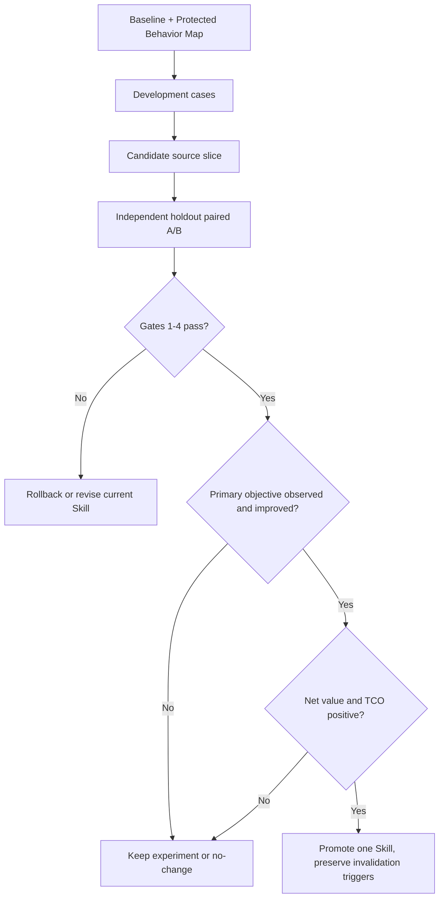
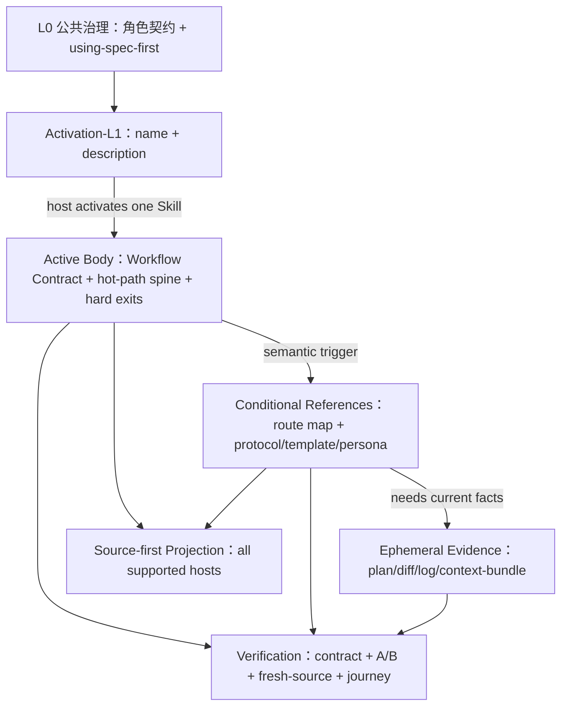

# Refactor the full Skill system for progressive disclosure - Plan

## Goal Capsule

| Dimension | Decision |
| --- | --- |
| Objective | 把 35 个 canonical Skill 从“各自增长、部分长正文内联、条件 reference 触发不一致”演进为统一但不僵化的渐进披露体系：入口更轻、激活后只保留承重 spine、条件协议按语义路径加载、运行证据按需进入上下文。 |
| Investment verdict | **值得做，但只值得作为受控、可逆、结果门禁的体系实验推进。** 当前证据足以启动 baseline 与两个 pilot，不足以授权全量迁移或宣称用户性能已提升。 |
| Recommended approach | 复用现有 `using-spec-first` Front Controller、`spec-work` Reference Trigger Map、`context-bundle.v1`、skill-local eval、source/runtime projection 与 contract tests；增加 host-budget profile、invocation posture、context-residency/compaction guardrail 与四维 eval，再用 `spec-code-review`、`spec-plan` 做高 ROI pilot，随后按收益分批迁移。 |
| User value | 降低常驻 description 与激活正文的无效上下文占用，减少长流程中关键规则被噪声稀释的风险，提高路由清晰度、执行聚焦度、审查稳定性和维护一致性。 |
| Quality posture | “质量不降低”不是靠行数目标证明，而是靠 Protected Behavior Map、trigger/outcome/cost/retention 四维 paired A/B、fresh-source eval、compaction/重调用场景、跨 Skill 闭环、全宿主投射与 outcome-gated rollout 共同证明；任一高风险不变量缺失即停止该 Skill 的迁移。 |
| Promotion policy | 使用非补偿式门禁：安全与授权 → 任务正确性 → artifact/consumer 兼容 → trigger/retention → 成本与 TCO。前一层失败时，后续 token、时延或维护收益不能抵消；只有预注册主目标出现 observed improvement 才能 promotion。 |
| Architecture posture | `reuse + extend + compose`。不新增中央路由器、universal Skill schema、per-skill lifecycle manifest、动态 system-prompt 平台或 embedding registry。 |
| Source of truth | `skills/`、必要的 `src/cli/` projection/integrity owner、skill-local `evals/`、`tests/`、`docs/` 与 `CHANGELOG.md`。`.claude/`、`.codex/`、`.agents/skills/`、`.cursor/`、`.kiro/`、`.qoder/`、`.opencode/` 只作为 generated runtime 验证面。 |
| Largest risk | 把承重规则搬出主 spine 后，模型未读取对应 reference，导致 mutation、verification、source/runtime、handoff 或 knowledge-promotion 边界静默退化。 |
| Rollout rule | 每个 Skill 独立进入、独立验收、独立回退；样板未形成可复核 outcome bundle 前，不允许全量机械迁移。 |
| Stop conditions | 需要新 schema 才能继续；source package 或 runtime projection 中 reference 不可达；代表性 live host 观察到与设计不兼容的 loader 行为；A/B 出现 P0/P1 行为回归；关键不变量覆盖不足；或 source/runtime 投射不能由 canonical source 一致重建。 |

---

## Product Contract

### Summary

当前问题不是“某一个 Skill 太长”，而是 Skill 体系存在三种彼此独立、需要分别治理的上下文成本：

1. **Activation-L1 常驻成本**：宿主为路由而常驻加载 `name/description`；description 过长或相邻路由边界模糊，会让所有会话付费并增加误触发。
2. **Active Body 固定成本**：Skill 激活后完整读取 `SKILL.md`；长正文把冷路径、模板、dispatch 细节和恢复协议都带入热路径。
3. **Conditional Context 可变成本**：references、plan、diff、evidence、persona prompt 与运行日志应按当前分支加载；触发条件含糊时，要么过读，要么漏读。

2026-07-30 当前工作树的只读快照为：

| Metric | Current snapshot |
| --- | ---: |
| Canonical Skill packages | 35 |
| `SKILL.md` bytes | 1,007,037 |
| Frontmatter bytes | 15,479 |
| Description bytes | 10,639 |
| Reference bytes | 2,025,569 |
| Largest active body | `spec-code-review`：1,046 行 / 125,800 bytes |
| Second largest active body | `spec-plan`：860 行 / 111,121 bytes |
| Existing concentrated trigger-map patterns | `using-spec-first`、`spec-work`、`spec-prd` |

这些数字只证明维护与上下文足迹，不证明真实 token、延迟或结果质量。用户价值假设必须通过运行时 paired A/B 和 outcome 证据验证。

当前优化激活证据应标记为 `trigger_evidence=structural_only`：两个最大 Skill 的 active body、全量 description/reference footprint、已观察到的重复协议与现有 control pattern 足以支持低风险 baseline 和 pilot；但本轮没有三次以上 billed usage、稳定现场纠正负担或真实用户时延样本，因此不支持“已经存在可量化性能损失”或“全量迁移必然有正收益”的结论。

2026-07-30 的官方资料显示，OpenAI、Anthropic、GitHub、Google Gemini CLI 与 AWS Kiro 都把 Agent Skills 建模为开放标准下的三层披露：`name + description` 用于发现，完整 `SKILL.md` 在激活后进入上下文，scripts/references/assets 再按需消费。Cursor/Kiro 的规则或 steering 还提供 always、文件匹配、语义匹配和手动调用等加载姿态。差异主要落在宿主预算、调用权、权限/同意和会话保留语义，而不是 Skill package 的基本结构。因此本计划不重建 discovery/loader，而是补齐跨宿主可移植层尚未拥有的预算适配、边界表达、验证证据和降级声明。

“覆盖全部 Skill 体系”指 35/35 都进入 inventory、route/body/context 分类、迁移决策和回归治理；它不意味着 35/35 都必须产生文本改动。对已经轻量、单路径且边界清晰的 Skill，`no-change-after-audit` 是正式优化结论。

### Problem Frame

第一性原理上，渐进披露只有在内容**物理上未进入当前 context window**时才产生可靠收益；“全部加载后要求模型忽略”不算按需加载。反过来，简单压缩也可能降低关键不变量密度。因此优化对象不是行数本身，而是：

> 在不降低关键行为覆盖的前提下，让每一层只承担它必须承担的信息，并让下一层的加载条件清晰、可达、可验证、可回退。

已有 `context-bundle.v1` 已拥有 related paths、evidence paths、full-read triggers、excluded context 与 budget；`using-spec-first` 已拥有语义 Front Controller；`spec-work` 已拥有集中式 Reference Trigger Map；projection 层已能复制完整 Skill package 并做路径重写。因此缺口主要位于每个 Skill 的内部组织、触发可靠性、全量 baseline 和 outcome 验证，不是缺一个新平台。

### Investment Decision

结论是：**值得做 U0-U6 的 baseline、guardrail 与两个代表性 pilot；是否值得进入 Wave 2/3，必须由 pilot 的 observed outcome 决定。** 这项工作的价值不是“把 Markdown 拆成更多文件”，而是缩短 `time-to-trusted-change`、提高 `quality-adjusted throughput`：让模型更快拿到当前决策所需的最小充分上下文，同时降低遗漏 hard exit、错误 route、重复阅读和跨副本 drift 的概率。

每个 Skill 的继续投资判断采用以下语义记录，不新增 universal schema：

| Decision input | Required question |
| --- | --- |
| Current failure/cost baseline | 当前真正的固定成本、误路由、纠正负担或维护 drift 是什么；若只有 source footprint，是否已明确 `structural_only`？ |
| No-change counterfactual | 保持单文件或当前 description 是否更简单、更可靠；当前 Skill 是否本来就是短、单路径、低频？ |
| Expected gain | 可移出的冷路径是否在代表性任务中真的不需要；能否改善 route、recall、context usage、latency 或维护一致性？ |
| Added cost | 会新增多少 reference 读取、tool latency、测试、投射、review 和长期 ownership 成本？ |
| Falsification / rollback | 哪个 case、host observation 或 correction burden 会推翻收益假设；能否只回退当前 Skill slice？ |
| Invalidation | 哪个 host loader、model、contract、consumer 或 source topology 变化要求重跑评测？ |

默认不迁移的条件包括：Skill 已短且每段都属于热路径；条件分支无法稳定区分；缺少可保护行为的 eval/test；预期节省低于新增 reference/tool/TCO；或 baseline 无法证明当前结构是高价值问题。`no-change-after-audit` 与 `rollback` 都是成功的治理结果，不是项目失败。

### Goals

- G1. 对全部 35 个 Skill 建立可复核的 Activation-L1、Active Body、Conditional Context baseline。
- G2. 为需要迁移的 Skill 形成“Workflow Contract Summary + 热路径 spine + Reference Trigger Map + hard exits + done signal”的轻入口结构。
- G3. 让冷路径 protocol、模板、persona catalog、恢复细节和大段示例只在明确触发时加载。
- G4. 保持或提升跨 Skill 的 `Codebase -> Spec -> Plan -> Tasks -> Code -> Review -> Knowledge` 质量闭环。
- G5. 让每次迁移都有行为保护、运行证据、宿主投射证据和独立回退，不依赖维护者记忆。
- G6. 把验证出的模式沉淀进现有治理与测试 owner，使新增或扩展 Skill 默认继承，而不是持续产生新单体。
- G7. 为全部 Skill 建立可审计的 invocation posture 与 host-budget profile，使自动触发、显式调用、internal/background 和 always/file-scoped guidance 不再混在同一种入口策略中。
- G8. 让承重 hard exits、owner、fallback 与 done signal 在长会话、重调用和宿主 compaction 后仍可恢复，不依赖正文尾部或冷 reference 的偶然留存。
- G9. 用非补偿式质量门禁和正交 evidence 回答“是否值得继续”：只有 observed primary-objective improvement 且 correction burden/Governance TCO 未吞掉收益，才推广默认模式。
- G10. 让已 promotion 的模式带最小 regression subset 与 invalidation trigger，在 host、model、contract 或 consumer 演化后能诚实降级和重验。

### Non-goals

- NG1. 不一次性把 35 个 Skill 改成同一模板或同一行数。
- NG2. 不新增 `skill-manifest-schema.json`、per-skill lifecycle manifest、统一 owner/cadence/maturity schema。
- NG3. 不建立中央 Context Router、动态 system prompt 构造器、embedding 路由、Skill 联邦或宿主替代层。
- NG4. 不把自然语言 route、任务质量、finding 有效性或 semantic readiness 交给脚本判定。
- NG5. 不把 references 移到跨 Skill 共享目录来制造隐藏耦合；共享只在真实多 consumer、稳定 ownership 和清晰 invalidation 条件出现后单独评估。
- NG6. 不以 `SKILL.md < 500 行`、token 下降或文件数下降单独作为完成标准。
- NG7. 不手改 generated runtime，不把 source tests 冒充 host loader 或 field outcome。
- NG8. 不把 Claude、Codex、Gemini、Cursor 或 Kiro 的私有 frontmatter/loader 能力提升为跨宿主 Skill contract。
- NG9. 不承诺各宿主拥有相同的 listing budget、implicit invocation、consent、compaction 或 supporting-file 加载语义。
- NG10. 不依赖 OpenAI Evals、Anthropic skill-creator 或其他外部评测平台作为 spec-first 的唯一质量 owner；可借鉴方法，证据仍落回 repo-owned evals 和 validation artifacts。
- NG11. 不建立把质量、token、时延和维护成本压成单一加权分数的自动决策器；scripts 准备分项 facts，promotion 由 LLM/human 按非补偿式门禁裁决。
- NG12. 不要求每个 docs-only/prose-only 小改动都运行 sealed test 或长期 field trial；评测强度随 treatment 风险增长，避免质量治理本身成为主要成本。

### Actors and Consumers

- A1. Skill 使用者：期望更快进入有效工作，且不丢边界、质量或证据。
- A2. `using-spec-first`：只做公共入口语义路由，不承担 per-skill 子协议路由。
- A3. 各 public workflow Skill：拥有自己的 body spine、reference trigger 与 semantic judgment。
- A4. Internal helper Skill：只服务已授权 caller，不进入公共路由；仍需保持轻量和清晰消费边界。
- A5. `context-bundle.v1` helper：准备路径、预算、排除和 reason，不决定语义相关性。
- A6. Plugin/projection layer：从 canonical source 复制、重写路径并验证高价值 anchors；不解释 prompt 质量。
- A7. Skill-local tests/evals 与 fresh-source reviewer：分别证明 deterministic shape 和 semantic behavior。
- A8. 下游 workflow：`spec-plan`、`spec-write-tasks`、`spec-work`、`spec-code-review`、`spec-compound` 消费彼此 artifact 与 evidence。
- A9. Host adapter/capability profile：表达某宿主能否强制 explicit-only、隐藏 internal Skill、报告 listing budget、观察 compaction 或提供可信 usage；未知能力 fail closed，不由 canonical Skill 猜测。

### Requirements

#### System inventory and classification

- R1. 基线必须覆盖全部 35 个 canonical Skill，而不是只统计 command-backed workflow；输出每个 Skill 的 body bytes/lines、description bytes、reference files/bytes、显式触发方式、现有 tests/evals、entry surface 与 host delivery。
- R2. 基线脚本只计算确定性事实，不估算 semantic adequacy；token 如无法从真实 host usage 取得，只能标为 proxy，不得将 bytes/lines 换算值写成 confirmed token。
- R3. 每个 Skill 必须被分类为 `preserve`、`pilot`、`migrate-later` 或 `no-change-after-audit`，并说明依据、风险、收益和 invalidation condition。

#### Activation-L1

- R4. Description 优化必须保留最小三段语义：正向 trigger、关键 exclusion/相邻 route、Skill 定位；不得为长度预算删除 route-changing boundary。
- R5. Description 治理通过现有 `lint:skill-entrypoints` 的结构/报告能力和相邻 route fixtures 扩展；脚本不得裁决哪条自然语言描述“语义更好”。
- R6. Activation-L1 收益与 Active Body 收益分别度量、分别 closeout，避免把常驻成本和激活成本混为一个数字。

#### Active Body and conditional references

- R7. 需要迁移的 Skill 主体保留：trigger/non-trigger 摘要、inputs/outputs、热路径 skeleton、五类 hard exits 中适用项、Reference Trigger Map、fallback 与 done signal。
- R8. 每个迁出的 reference 必须声明 `Owned`、`Not Owned`、`Trigger`、`Fallback` 或等价四要素；主 spine 必须存在可达的具体链接和前置触发语句。
- R9. 主 spine 中不能只写模糊的 “if needed/read when applicable”；高风险 reference 必须明确在什么出口或动作前读取，未读取时采用什么保守行为。
- R10. Body-L3 只删除重复叙事、重复例子、过期 provider 细节或已由 canonical contract/脚本拥有的规则；不得删除 source/runtime、mutation、verification、handoff、knowledge promotion、授权或 evidence anchors。
- R11. `context-bundle.v1` 只用于 current artifact/diff/evidence/related-path 的最小充分交付，不承载 per-skill lifecycle 元数据，不替代 Skill 内部语义 route map。

#### Quality and evidence

- R12. 每个 pilot 在改造前必须建立 Protected Behavior Map，把关键不变量映射到改造前位置、改造后位置、trigger、fallback、deterministic test 与 semantic eval case。
- R13. Paired A/B 使用相同任务输入、相同非目标 repo/source evidence、相同 host/model/config、相同授权与相同输出评分 rubric；baseline/candidate Skill package 使用各自明确 hash，并在互不继承会话缓存的 fresh session 中运行。覆盖 trigger 与 non-trigger、happy path、degraded path、hard-exit path，执行顺序应交叉或随机化以降低顺序偏差。
- R14. 任一 pilot 若出现 P0/P1 行为回归、关键不变量漏失、错误 completion claim、错误 mutation/landing、或 source/runtime 越界，立即回退该 Skill，不等待批次结束。
- R15. “未降低质量”至少要求：protected invariants 100% 可达、deterministic tests 通过、fresh-source eval 无 material concern、至少一个代表性 live host 的 paired A/B 无硬回归、跨 Skill consumer 未破坏、supported-host projection 可重建；未实跑的其他 host 保持明确 claim limitation。
- R16. 性能提升只在真实 run 记录 input token/context bytes/latency/cost 时声明；没有 provider usage 时，仅报告 source footprint delta 和 limitation。

#### Projection and rollout

- R17. 所有 host 断言必须以 `getSupportedPlatforms()` 的当前结果为准；本计划写作时工作树包含 Claude、Codex、Cursor、Kiro、Qoder、OpenCode 六个 adapter，但实施必须重新探测，不能硬编码“五宿主”或“六宿主”。
- R18. Source 变更后只通过 `spec-first init` 生成 runtime；projection tests 必须验证主 spine、route map、条件 references、路径重写和 maintainer-only eval 排除。
- R19. Rollout 以 Skill 为独立单元，只有样板 outcome bundle 通过才进入下一 wave；不同 Skill 可以保持不同 body 大小和 reference 结构。
- R20. 新模式进入 durable governance 前，至少两个不同 archetype 的 Skill 通过 paired A/B 和 fresh-source eval；否则保持 experiment/advisory，不升级为全局硬规则。

#### Host budget, invocation posture, and context residency

- R21. Baseline 必须记录当前官方可得的宿主 listing/description/body/resource/retention 约束及版本/日期；数值只对对应宿主有效。Claude 当前约以 context 的 1% 作为 Skill listing budget、单条 description + `when_to_use` 默认上限 1,536 字符；Codex 当前上限为 context 的 2% 或 context 未知时 8,000 字符。其他宿主无可靠数值时标记 `unknown`，不得推导统一预算。
- R22. 每个 Skill 必须在 migration ledger 中标注 invocation posture：`auto-discoverable`、`explicit-only`、`internal/background` 或 `not-a-skill/always-or-file-scoped-guidance`。该分类先作为 validation/advisory 事实，不扩展 universal schema；是否投射宿主私有字段由 adapter capability 和实测决定。
- R23. 具有外部通信、deploy、commit/push/PR、生产变更、敏感 mutation 或显著成本的 Skill 默认候选为 `explicit-only`。本计划的跨宿主硬地板是响亮约定、入口警示和副作用 gate；只有现有 adapter owner 能在不新增 universal schema 的前提下表达且 live probe 证实时，才落 host-specific invocation policy 并声明强制，否则延期而不是为字段扩 schema。
- R24. Description 必须把核心 use case 和 trigger words 前置，以承受宿主截断；低频或 explicit-only Skill 可在宿主支持时使用 name-only/disable-implicit 等策略，但不能删除用户发现所需的最小定位，也不能让 internal helper 重新出现在公共菜单。
- R25. 每个迁移 Skill 的主 spine 必须前置适用的五类 hard exits、当前 owner、保守 fallback 和 done signal。任何仅位于正文后段或 cold reference、且在 compaction 后丢失会导致越权或错误完成声明的规则，都必须提升为前部承重摘要。
- R26. Host-specific dynamic context injection、consent、tool pre-approval、fileMatch 或 auto-attach 只能作为 adapter-owned optimization；跨宿主 canonical 仍使用 standard Skill package、显式 reference trigger 和 `context-bundle.v1`。宿主优化不可改变 workflow artifact、claim ceiling 或授权语义。
- R27. Pilot eval 必须分开测四个维度：trigger precision、outcome quality、token/time cost、post-invocation retention。Retention 至少覆盖长会话、重调用和可用宿主的 compaction 场景；不支持或不可观察时记录 `not_run`，不能用首次调用成功替代。
- R28. 评测集必须包含 typical、edge、adversarial、should-trigger、should-not-trigger 和 hard-exit cases；自动评分与 LLM judge 必须用人工/专家样例校准，优先采用 pass/fail 或 blind pairwise comparison，避免只看开放式总分或“感觉更好”。
- R29. U0 必须在 candidate run 前冻结每个优化 track 的 primary metric、最小有意义收益和回归容忍区间，candidate 结果出来后不得改阈值。若只能证明 source bytes/maintainability 收益，closeout 只能标 source-structure experiment；只有真实 host context/token/time 或 outcome evidence 达到预注册门槛，才能声明用户性能或质量收益。

#### Investment, evaluation, and promotion discipline

- R30. 每个 candidate 必须分开记录 `structure_contract`、`behavior_quality`、`runtime_cost`、`field_outcome` 四个正交 evidence axis；结构可达、行为通过、运行成本观察和现场结果互不替代，也不存在自动线性晋级。
- R31. Promotion 必须使用非补偿式质量门禁：安全/授权、关键行为、artifact/consumer compatibility、trigger/retention 先逐层通过，之后才评价 token、latency、tool-call 或维护收益。任一 P0/P1、hard exit、错误 mutation/completion 或关键 decision 漏失不能被其他维度的改善抵消。
- R32. 评测数据必须按 treatment 风险分层：纯 prose/structure 重组至少使用 development + 未参与调优的 holdout paired cases；若候选改变 gate、roster、invocation enforcement、model routing 或其他高风险策略，则升级为 development + iterative validation + sealed promotion test。不可固定随机性时，预注册重复次数并报告中位、分位、最坏分层和不确定性，禁止只报最佳 run。
- R33. Eval corpus 必须覆盖 Protected Behavior Map 的全部承重行为和 route adjacency，而不是追求统一 case 数。每个风险分层至少有独立 holdout；暴露、失败或参与调优的 holdout/sealed case 必须转入 development，后续 promotion 使用新来源或轮换集合。
- R34. 净收益判断必须同时报告 runtime inference、reference/tool latency、human correction burden 与 Governance TCO。结构更短但 reference fan-out、人工纠正、review 负担或长期维护成本明显上升时，不得 promotion。
- R35. 只有预注册 primary objective 获得与 claim 匹配的 observed improvement，才能把 pilot 提升为默认 authoring/rollout pattern。`runtime_cost=proxy` 只能支持 source-structure experiment；“用户效率提升”“纠正负担下降”还必须有 `field_outcome=observed`。Host/model/contract/consumer 变化后，受影响的 promotion evidence 必须失效并重跑最小回归集。

### Key Flows

- F1. 全量 baseline 与分群
  - **Trigger:** 开始实施本计划且尚无当前 source identity 的 inventory。
  - **Steps:** 读取 35 个 canonical package、governance entry surface、tests/evals 与 projection owner；输出机械 footprint 和语义分类。
  - **Outcome:** 每个 Skill 有 migration posture，未产生行为改动。
  - **Covers:** R1-R3、R17、R21-R22、R29。

- F2. Activation-L1 优化
  - **Trigger:** baseline 识别 description 成本高或相邻 route collision 风险。
  - **Steps:** 保留 trigger/exclude/position；补 route pair fixtures；fresh-source reviewer 判断语义，不由 lint 做语义裁决。
  - **Outcome:** 常驻成本下降或 route 边界更清晰，且误触发不增加。
  - **Covers:** R4-R6、R13-R16、R21-R24、R28-R29。

- F3. Active Body pilot
  - **Trigger:** Skill 固定正文成本高、冷路径内联明显、现有 tests 可保护。
  - **Steps:** 先写 Protected Behavior Map；保留 spine；迁出条件 protocol；补 trigger/non-trigger tests；运行 paired A/B。
  - **Outcome:** body footprint 下降，关键行为和输出兼容。
  - **Covers:** R7-R16、R25、R27-R29。

- F4. Conditional context delivery
  - **Trigger:** 当前分支需要 plan、diff、evidence、persona 或恢复协议。
  - **Steps:** Skill 语义选择 reference；需要跨 agent/worker 交付时，用 `context-bundle.v1` 指向最小 paths 与 full-read triggers。
  - **Outcome:** 未触发内容不进入当前 agent context；degraded bundle 显式保留 limitation。
  - **Covers:** R8-R11、R26。

- F5. Cross-skill journey
  - **Trigger:** pilot 单 Skill tests 已通过。
  - **Steps:** 运行 `PRD/requirements -> Plan -> optional Tasks -> Work -> Review -> Knowledge` 代表性 journey；核对 artifact、evidence 与 claim ceiling。
  - **Outcome:** 局部优化没有破坏上下游 handoff。
  - **Covers:** R12-R15、R18-R20、R27-R29。

- F6. Failure and rollback
  - **Trigger:** A/B、fresh-source、projection、consumer 或 hard-exit 检查失败。
  - **Steps:** 只回退当前 Skill 的 body/reference/description slice；保留失败 case、source hashes、reason 和 post-mortem；其他已通过 Skill 不受影响。
  - **Outcome:** 系统恢复到该 Skill 的已知基线，失败经验可用于下一轮设计。
  - **Covers:** R14、R19-R20、R27-R29。

- F7. Evidence-gated promotion
  - **Trigger:** Candidate 已通过 deterministic、semantic、projection 与代表性 live-host paired checks。
  - **Steps:** 按安全 → 正确性 → 兼容性 → trigger/retention → primary objective → correction burden/TCO 顺序裁决；核对 evidence axis、holdout 独立性、claim ceiling、rollback 和 invalidation。
  - **Outcome:** 只产生 `promote`、`revise`、`rollback` 或 `no-change-after-audit` 之一；没有 observed primary-objective improvement 时保持 experiment。
  - **Covers:** R29-R35。

### Acceptance Examples

- AE1. `spec-code-review mode:agent` 在无 dispatch 授权时仍返回 `dispatch_authorization_missing` 的 report-only degraded 结果，不因 spine 瘦身误称独立 reviewer coverage。
- AE2. `spec-code-review` 默认、`mode:agent` 或 `mutation:report-only` 不修改 source；只有用户或上游明确选择 `mutation:apply-fixes` 时，才加载 apply protocol 并允许受限本地修复，仍不授权 commit、push 或 PR。
- AE3. `spec-plan` Lightweight run 不加载 Deep research、HTML rendering 或无关 handoff 细节；Deep run 能在动作前读到规划证据边界、plan sections 和 handoff owner。
- AE4. `spec-work` 接收 implementation-ready plan 时只读取 active U-ID 所需 sections；task-pack、knowledge-work、shipping 和 tracker-defer references 在各自 trigger 外不加载。
- AE5. `using-spec-first` 对轻量事实继续走 Direct Lane，对明确 review/bug/runtime 请求选择正确 owner；description 缩短后相邻 route 的误触发率不增加。
- AE6. 任一 Skill 的 reference 被删除、链接失效或投射后路径未重写，focused contract/projection test 失败，不能以 fresh-source 主观判断绕过。
- AE7. 同一 A/B case 中新版少报一个 P1、错误放行 mutation、漏掉 required verification 或产生 unsupported completion claim，判定为 hard regression 并回退；token 节省不能抵消。
- AE8. OpenCode adapter 若在实施时仍属于 supported platforms，新增 route-map/reference 必须出现在其 projected Skill package；若 adapter 未进入主线，则验证矩阵按当时 `getSupportedPlatforms()` 事实自动收敛并记录 source identity。
- AE9. 一个带 commit/push/外部通信副作用的 Skill 被分类为 `explicit-only`；现有 adapter 能无 schema 扩展表达且 live probe 证实的宿主阻止隐式触发，其余宿主保留 workflow-level loud convention 和 mutation gate，并标记 enforcement limitation。
- AE10. Skill description 因 listing budget 被缩短时，前置的核心 trigger 和相邻 exclusion 仍保留；should-trigger/should-not-trigger fixture 不因裁剪出现 material regression。
- AE11. `spec-code-review` 或 `spec-plan` 在长会话 compaction 后仍能恢复 hard exits、owner、fallback 与 done signal；若宿主只保留正文前部，冷路径细节可以丢失，但不能错误 mutation、错误 completion 或越过 source/runtime 边界。
- AE12. Claude 的 dynamic context injection、Gemini 的 consent、Cursor/Kiro 的 fileMatch/auto inclusion 若被采用，只改变对应宿主的加载效率或交互，不改变 canonical artifact、授权、evidence 或 completion contract；其他宿主保持等价的保守路径。
- AE13. Candidate 的 active-body bytes 下降 45%，但 holdout 中漏掉一个 P1 finding 或错误跳过 handoff；非补偿式门禁直接判定 `rollback`，不能用 token 收益抵消。
- AE14. Candidate 的 deterministic、behavior 与 projection 均通过，但目标宿主没有可信 usage，且 paired output 只与 baseline 持平；closeout 只能标 `source-structure experiment`，不能推广为“用户更快”或全量默认模式。
- AE15. Candidate 少读正文但每条热路径新增多个总是共同触发的 reference 读取，导致 wall-clock、tool-call 与 correction burden 上升；即使 source 更短，也判定净收益不足并 `revise` 或 `no-change-after-audit`。
- AE16. 已 promotion 的 Skill 遇到 host loader/compaction 语义或 model family 变化；受影响 evidence 自动失效，先跑最小 trigger/hard-exit/retention regression subset，再恢复对应 claim。

### Success Criteria

- 全部 35 个 Skill 有当前 source identity 的 footprint 与 migration posture，100% 覆盖。
- `spec-code-review` 与 `spec-plan` 两个高 ROI pilot 都产出 before/after Protected Behavior Map、paired A/B、fresh-source 和 projection evidence。
- 两个 pilot 均至少在一个代表性 live host 的 fresh session 完成 baseline/candidate 对照；其他未实跑 host 只声明 source projection，不外推 lazy-loading 或 field outcome。
- 至少一个已有轻 spine pattern（`using-spec-first` 或 `spec-work`）作为 control，证明不是所有 Skill 都需要改写。
- Pilot 中 hard-exit、trigger/non-trigger、degraded、output compatibility 与 cross-skill journey 均无 P0/P1 回归。
- Activation-L1 与 Active Body 的 source footprint 分别下降；真实 token/latency 只有在 usage evidence 可得时才报告。
- 下一 wave 的 Skill 只采用被两个不同 archetype pilot 验证过的模式。
- 全部 35 个 Skill 有 invocation posture；每个 auto-discoverable Skill 有正负触发样例，每个 explicit-only/internal Skill 有公共入口负向样例。
- Host budget matrix 绑定官方来源和日期；未知宿主保持 `unknown`，不因缺数值阻塞 source 组织改进，也不产生跨宿主 token claim。
- 两个 pilot 的 eval 均分别报告 trigger、outcome、cost、retention；没有 retention/compaction evidence 时不得宣称“长会话质量不降低”。
- 每个优化 track 的收益阈值在 candidate run 前预注册；未达到最小有意义收益时回退或保持 experiment，不因已经完成重构而 promotion。
- 两个 pilot 均以非补偿式门禁裁决，四个 evidence axis 独立记录；没有出现“结构/成本改善覆盖关键行为回归”的加权总分。
- 每个 pilot 有未参与调优的 holdout；若实现改变 gate、roster、invocation enforcement 或 model routing，则升级到 sealed promotion test。
- Promotion closeout 分项报告 human correction burden 与 Governance TCO；若新增 reference/tool/review 负担抵消收益，则保持 `revise`、`rollback` 或 `no-change-after-audit`。
- 只有 primary objective 获得 observed improvement 才形成默认 rollout pattern；只有 field outcome 能支持用户效率或纠正负担改善 claim。

### Scope Boundaries

**In scope**

- 全量 Skill inventory、分类和迁移顺序。
- `spec-code-review`、`spec-plan` 的高 ROI body pilot。
- `using-spec-first`、`spec-work` 的 control/pattern validation，必要时做小幅补强。
- Activation-L1 description audit 与相邻 route fixtures。
- Skill-local contract tests/evals、projection/integrity tests、validation artifacts、docs/README/Changelog 的必要更新。
- 当前 supported host 的 source-first runtime regeneration 与验证。

**Out of scope**

- 一次性迁移所有 Skill。
- 新增 public Skill、中央 prompt platform、通用 lifecycle schema 或跨 Skill shared-reference registry。
- 修改宿主本身的 Skill loader、缓存策略或 token accounting。
- 把 advisory footprint 数字提升为 field performance truth。
- 未经用户授权的 commit、push、PR、外部 issue 或 provider 修改。

### Deferred to Follow-Up Work

- 跨 Skill 共享 prompt/reference 去重：只有至少三个 active consumer、内容稳定、owner 明确且投射/失效测试可建立时再单独规划。
- Provider-native token/latency telemetry：只有 host 能稳定提供 per-Skill usage 且不泄露敏感 prompt 时再接入 stats。
- 自动 route-quality judge：只有人工/fresh-source rubric 与 outcome 数据积累到足以校准时评估；不在本计划中建立 LLM judge CI gate。
- 全量 wave 2/3 迁移可由本计划的 U7 生成后续实施包，但不得在 pilot evidence 缺失时预授权。

---

## Planning Contract

### Authority and Evidence Hierarchy

1. 当前用户确认的“全部 Skill 体系”范围与仓库 `AGENTS.md` / 角色契约。
2. `docs/10-prompt/spec-first-skill-prompt压缩优化组合方法论.md` 的 ArchitectureFit、正交 evidence、treatment-aware paired eval、promotion 与 TCO 边界。
3. 当前 canonical `skills/`、`src/cli/`、tests 与真实 host/runtime probe。
4. 2026-07-29 两份 validation 的附录 C/D 修订结论。
5. 2026-07-06 两份 active plans 的已验证设计与未验证假设。
6. 官方 Agent Skills progressive disclosure 建议，仅作 advisory；不能替代本仓 host 实测。

Graphify/CodeGraph 只用于导航；重要结论必须回到 source、tests、logs 或运行 evidence。

### Industry Research and Decision Matrix

以下资料均为 2026-07-30 读取的官方一手来源。行业事实是 architecture input，不是 spec-first 的 runtime truth；涉及当前宿主行为的承重结论仍需 source/runtime probe。

| Company / product | Official practice | Decision | Plan impact |
| --- | --- | --- | --- |
| Anthropic Claude Code | Description 常驻、完整 Skill 激活后加载、supporting files 按需；建议 `SKILL.md` 小于 500 行；支持 `disable-model-invocation` / `user-invocable`；正文在会话中驻留，compaction 每个 Skill 最多重附前 5,000 tokens、共享约 25,000-token budget；官方 eval 分开测 trigger 与 outcome，并记录 pass rate、tokens、duration、blind A/B。 | Adopt + Adapt | 采用三层结构和四维 eval；把 hard exits 前置；数字预算只进入 Claude profile，不变成 universal hard gate。 |
| OpenAI ChatGPT / Codex | Progressive disclosure；初始列表最多占 context 2% 或未知时 8,000 字符，超限先缩短 description、再可能省略 Skill；implicit invocation 依赖 description；支持 `allow_implicit_invocation: false`；Skill 基于 Agent Skills open standard。 | Adopt + Adapt | 前置 trigger/exclusion；建立 explicit-only posture；保留标准 package，不自建私有中央 schema。 |
| GitHub Copilot | Skill 是 instructions/scripts/resources folder；按 description 决定使用并注入 `SKILL.md`；通用且几乎每次都需要的简单规则应放 custom instructions，详细任务流程放 Skill；官方 CLI 支持 preview、pin、provenance/update，强调审查第三方 scripts。 | Adopt | 强化 always-loaded governance 与 on-demand Skill 的边界；source-controlled canonical package 保持可审查；不把第三方 Skill registry 纳入本计划。 |
| Google Gemini CLI | Discovery → activation → consent → injection → execution；元数据常驻、正文建议小于 5k words、resources 按需；强调按任务脆弱度选择高/中/低自由度，确定性任务交给 scripts。 | Adopt + Adapt | 把“脚本强制确定性、LLM 做语义判断”落实到迁移 checklist；consent 属宿主交互，不进入跨宿主 contract。 |
| Cursor Rules | Always Apply、file pattern、description-selected、manual 四种模式；建议规则小于 500 行、引用文件而非复制、只在重复错误出现后增加规则。 | Adapt | 用作 invocation/load posture 的概念参照；持久治理继续放 AGENTS/role contract，不能把 Cursor `.mdc` 模式变成 universal Skill schema。 |
| AWS Kiro | Skill 采用三层 progressive disclosure；description 最大 1,024 字符；steering 支持 always、fileMatch、manual、auto；明确 Skill 用于可移植工作流，steering 用于项目标准。 | Adopt + Adapt | 强化 Skill 与 host instruction/steering 的 ownership 分工；Kiro 数值只进入对应 profile。 |
| OpenAI Evaluation guidance | Eval-driven development、task-specific/production-shaped dataset、typical/edge/adversarial cases、持续回归；优先 pairwise/pass-fail，自动评分需与人工判断校准。 | Adopt | Promotion gate 从“结构变小”升级为 trigger/outcome/cost/retention 四维 eval，并要求 blind pairwise 与人工校准。 |

明确拒绝或延期：embedding/sub-skill semantic router、中央动态 prompt builder、统一宿主生命周期 schema、对每个宿主私有字段求 feature parity。它们要么重建宿主 primitive，要么没有被当前痛点和 consumer 证明必要。

### Why Quality Can Improve

渐进披露不是天然提高质量；以下机制只有在 paired evidence 中成立时，才能从“设计假设”升级为“质量改善”：

1. **降低 instruction interference。** 冷路径、长模板和无关 persona 不进入当前任务，使模型更容易识别当前 route、关键 decision 与证据义务。
2. **提高承重规则召回。** Hard exits、authority、fallback 和 done signal 从正文尾部或重复段落提升到 spine 前部，增强长会话和 compaction 后的可恢复性。
3. **让路径细节靠近动作。** 条件 reference 在具体出口或动作前加载，避免全局规则与局部例外混杂，也降低“记住规则但用错场景”的风险。
4. **减少多份真相与 drift。** 每个 reference 明确 owner/trigger/non-owner/fallback，canonical contract 只保留一份，测试从锁 wording 转为锁 reachability、consumer 与行为。
5. **让确定性事实退出 prose。** 文件发现、hash、schema、projection、usage 和 reason code 由 scripts/tools 准备，模型把注意力用于语义判断，不再靠长提示词重复机械规则。
6. **把反例变成持久回归集。** Pilot 的漏读、误触发、错误 completion 和 compaction 失败样例进入 development corpus，后续变更必须重新证明没有复发。

质量提升的强 claim 至少需要：baseline 已存在可复现缺陷或纠正负担；candidate 在同一 holdout 上修复该缺陷；其他 protected behavior、compatibility 和安全门禁无回归；自动 judge 与人工锚点一致。仅仅“回答更短”“文件更少”或“reviewer 感觉更清晰”不构成质量提升。

### Quality Scorecard and Promotion Ladder

不计算把质量与成本揉在一起的单一总分。Promotion 按以下顺序 fail closed：

| Gate | Required evidence | Failure outcome |
| --- | --- | --- |
| 1. Safety and authority | 五类适用 hard exits、mutation/dispatch/external action authorization、source/runtime、claim ceiling 全部通过。 | `rollback`；任何成本收益无效。 |
| 2. Task correctness | Protected decisions、P0/P1、关键 requirements/findings、fallback 与 done signal 在 paired holdout 中不低于 baseline。 | `rollback` 或重新设计 spine/trigger。 |
| 3. Compatibility | Artifact schema、required fields、downstream consumer、public/internal entry surface 和 supported-host projection 无 material regression。 | `revise`；不得进入 live-host promotion。 |
| 4. Trigger and retention | should/should-not trigger、reference read/non-read、long-session、re-invocation 与可观察 compaction 无 hard regression。 | `revise` 或 `rollback`。 |
| 5. Primary objective | U0 预注册的 context/token/time、route quality、correction burden 或 maintainability objective 获得与 claim 匹配的 observed improvement。 | 保持 `experiment` 或 `no-change-after-audit`。 |
| 6. Net value and TCO | Reference/tool fan-out、wall-clock、人工纠正、测试/投射维护和 rollback 成本没有吞掉收益。 | `revise`、`rollback` 或停止继续迁移。 |

Evidence axis 使用现有方法论词汇，不新增 schema：

```text
structure_contract = untested | passed | failed
behavior_quality   = not_run | concerns | passed
runtime_cost       = unavailable | proxy | observed
field_outcome      = unavailable | observed
```

纯 prose/structure pilot 默认走 `development -> holdout paired comparison -> representative live-host shadow -> promote/revise/rollback`。若实施中改变 gate、roster、invocation enforcement、model routing 或其他高风险策略，则升级为 `development -> iterative validation -> frozen winner/threshold -> sealed promotion test`；sealed set 暴露后不再复用为独立 promotion evidence。



### Host Budget and Invocation Matrix

| Host / surface | Discovery budget | Activated body / retention | Invocation control | spec-first posture |
| --- | --- | --- | --- | --- |
| Claude Code | Listing 约为 context 的 1%；单条 description + `when_to_use` 默认最多 1,536 字符，可 name-only。 | 完整正文激活后驻留；compaction 每 Skill 最多重附前 5,000 tokens，共享约 25,000 tokens。 | `disable-model-invocation`、`user-invocable`。 | Hard exits/top-level owner 前置；仅在现有 owner 无需扩 universal schema 即可表达时投射 explicit-only/internal 字段，并实测。 |
| ChatGPT / Codex | 最多 2% context；context 未知时 8,000 字符；超限可能缩短或省略 Skill。 | 选中后读取完整 `SKILL.md`；supporting resources 为 package 资源。 | `allow_implicit_invocation: false`，显式 `$skill`/picker。 | 描述前置 trigger；低频 Skill 不假设总能出现在 implicit list；显式入口保持可发现。 |
| Gemini CLI | 官方 best practice 约 100 words metadata。 | `SKILL.md` 建议小于 5k words；激活后正文和目录进入会话，resources 按需。 | 激活需要 consent，也支持显式调用。 | 把 consent 视为 host UX；canonical mutation authorization 仍由 workflow 拥有。 |
| Kiro | Description 最大 1,024 字符。 | Full `SKILL.md` 激活；scripts/references 按需。 | 自动 description match + slash command；steering 另有 always/fileMatch/manual/auto。 | Skill 与 steering/rules 分层；不把 always guidance 塞入 Skill description。 |
| GitHub Copilot | 未公布可承重的数值预算。 | 选择后注入 `SKILL.md`，目录资源可用。 | Description-based selection；不同产品面行为可能不同。 | 保持 `unknown` 数值；只验证实际 target surface。 |
| Cursor | Rules 建议小于 500 行；非 Agent Skills 数值预算。 | Rules 按 always/file/semantic/manual 加载。 | 四种 rule type。 | 仅作 loading posture 类比；实际 Skill loader 需单独 probe。 |
| Qoder / OpenCode | 本轮未获得可承重的官方预算/retention 证据。 | `unknown`。 | `unknown`。 | 依赖 adapter/source projection 与实施时 live probe；不得从其他宿主外推。 |

### Content Ownership and Invocation Posture

| Information type | Default owner | Load posture | Examples / boundary |
| --- | --- | --- | --- |
| Durable project invariants | `AGENTS.md` / role contract / canonical docs | Always or host-native scoped rule | 五类 hard exits、source/runtime、语言、代码规范；不复制进每个 Skill 全文。 |
| Skill discovery metadata | `SKILL.md` frontmatter + governance entry surface | Always in host listing when supported | 核心 trigger、critical exclusion、定位；按 host budget 前置。 |
| Workflow hot path | `SKILL.md` body spine | On activation and resilient after compaction | Inputs/outputs、owner、hard exits、route map、fallback、done signal。 |
| Conditional protocol/reference | package-local `references/` | Explicit semantic trigger | Deep research、persona、presentation、apply/rollback details；主 spine 必须说明何时读。 |
| Deterministic action | package-local `scripts/` or existing CLI owner | Execute when authorized | 解析、校验、hash、projection、API/tool facts；不让 LLM 伪装确定性。 |
| Current facts/evidence | source/test/log/artifact + `context-bundle.v1` | Per task / per branch | diff、plan、logs、usage、host probes；带 provenance/freshness/limitations。 |

Invocation posture 不是新状态机，而是用于审查入口与副作用边界的四类语义标签：

- `auto-discoverable`：高频、低副作用、用户自然语言可稳定识别；要求最强 description 正负样例。
- `explicit-only`：副作用大、成本高或用户必须控制时机；优先使用宿主真实 invocation policy，否则保留 loud convention 和出口 gate。
- `internal/background`：仅供 caller/模型消费，不进入公共入口或 slash menu；继续受 `entry_surface: internal_only` 等现有治理保护。
- `not-a-skill/always-or-file-scoped-guidance`：几乎所有任务都需要的短不变量，或只与文件范围相关的规则，应留在 AGENTS/host rules/steering，而不是伪装成自动 Skill。

### Context Residency and Compaction Contract

1. 主 spine 的前部必须包含适用 hard exits、authority、source/runtime boundary、保守 fallback、done/claim ceiling；不得依赖正文尾部存活。
2. Supporting files 只能承载路径特定细节；每个文件由主 spine 或上级 reference 提供明确 trigger、owner、fallback 和反向可达链接。
3. 长会话 retention eval 要检查三种状态：首次激活后、其他 Skill 介入后、宿主 compaction/重调用后。只测首次输出不能证明长期约束仍有效。
4. 对 Claude 的 5,000/25,000-token compaction 数值只做 host-specific stress profile；跨宿主通用要求是“关键约束前置并可恢复”，不是硬编码 token 阈值。
5. 若某宿主不提供 retention/compaction 可观察性，closeout 必须标记 `not_run`，并把 completion claim 限制在 source shape、projection 和首次调用行为。

### Reuse / Extend / Compose / New

| Need | Posture | Existing owner | Decision |
| --- | --- | --- | --- |
| 公共入口路由 | Reuse | `skills/using-spec-first/` | 保持单入口语义 route，不增加中央子协议路由。 |
| Per-skill reference selection | Extend | `spec-work` / `spec-prd` Trigger Map pattern | 推广结构和保守 fallback，不要求所有 Skill 同一表格。 |
| Dynamic context envelope | Reuse | `docs/contracts/context-bundle.md` + CLI helper | 只交付当前 paths/evidence/full-read triggers，不扩 schema。 |
| Deterministic footprint | Extend | `scripts/lint-skill-entrypoints.js` 或独立窄 reporter | 生成 bytes/lines/files/description facts；不判断语义质量。实现时优先扩展现有 lint/report 能力，只有 owner 边界不合适才新增单一 reporter。 |
| Semantic route/quality eval | Compose | skill-local evals + fresh-source checklist | deterministic fixture 保证 case topology，LLM/人工判断语义。 |
| Projection integrity | Extend | `src/cli/plugin-sync.js`、`tests/unit/plugin-modules.test.js`、host projection tests | 增加 route-map/reference reachability 和当前 supported-host matrix。 |
| Invocation policy | Adapt/Defer | 现有 `entry_surface` / `host_delivery` + adapter transformation | 先在 baseline ledger 分类；仅当现有 owner 无需扩 universal schema 即可表达且 live probe 通过时投射宿主私有策略，否则只保留 workflow gate 并延期。 |
| Host budget profile | Compose | 官方 docs + live host diagnostics/probes + validation artifact | 记录版本化 advisory facts；不让 lint 用统一字符阈值替代语义判断。 |
| Dynamic context acceleration | Defer/Adapt | Claude injection、Gemini consent、Cursor/Kiro scoped inclusion | 可作为 host optimization；`context-bundle.v1` 和 workflow authorization 仍是跨宿主 owner。 |
| Central lifecycle/prompt schema | Reject | 无真实 consumer | 不创建。 |
| Cross-skill shared reference library | Defer | 尚无稳定 owner | Pilot 只在 package 内重组，避免隐藏耦合。 |

### High-Level Technical Design



职责边界：

- Scripts/tools：inventory、bytes/lines、path reachability、fixture topology、schema/JSON、projection、hash、exit code。
- LLM/reviewer：哪些协议属于热路径、trigger 是否语义清晰、finding/plan/task 是否充分、A/B 行为是否等价或更好。
- Host：何时激活 Skill、实际 loader/cache/token 行为。
- Spec-first：description、Skill source、reference structure、context envelope、投射与 evidence boundary。

### Skill Portfolio and Migration Strategy

下表覆盖当前 35 个 Skill；实施时必须按当前 inventory 重新生成并处理新增/删除项。

| Archetype | Skills | Initial posture | Migration rule |
| --- | --- | --- | --- |
| Pattern controls | `using-spec-first`, `spec-work`, `spec-prd`, `spec-doc-review`, `spec-write-skill` | preserve / small extend | 作为 Front Controller、Trigger Map、spine-only、Conditional Sources 的对照；除非 baseline 发现真实缺口，不为统一格式重写。 |
| High-ROI pilots | `spec-code-review`, `spec-plan` | pilot | 先建立 Protected Behavior Map；分别验证大型 review protocol 与大型 planning protocol 两种 archetype。 |
| Large body wave | `spec-compound`, `spec-optimize`, `spec-compound-refresh` | migrate-later | Pilot 通过后处理重复 fallback、长阶段协议和冷路径；保持 knowledge promotion / experiment evidence 边界。 |
| Medium conditional workflow wave | `spec-ideate`, `spec-proof`, `spec-debug`, `spec-runtime-setup`, `spec-brainstorm`, `spec-app-consistency-audit`, `spec-lfg`, `spec-dogfood`, `spec-product-pulse`, `spec-sweep`, `spec-polish`, `spec-write-tasks`, `spec-pov` | migrate-later or preserve after audit | 只有 fixed body 成本、trigger drift 或重复 protocol 达到阈值才迁移；不因 references 多就自动拆分。 |
| Small/internal/leaf audit wave | `spec-commit-push-pr`, `spec-test-xcode`, `spec-worktree`, `spec-promote`, `spec-commit`, `spec-explain`, `spec-resolve-pr-feedback`, `spec-strategy`, `spec-test-browser`, `spec-simplify-code`, `spec-rule-miner`, `spec-riffrec-feedback-analysis` | no-change-after-audit | 优先验证 description、caller boundary、done signal 和 projection；若正文已小且单路径，保持不变。 |

### Protected Behavior Map

每个 pilot 在修改前创建 validation artifact 中的一张 map，不创建 runtime schema。最小列为：

| Field | Meaning |
| --- | --- |
| Behavior ID | 稳定的局部编号，例如 `CR-HX-01`、`PL-OUT-03`。 |
| Protected behavior | 不得回归的 trigger、hard exit、output、degraded 或 consumer behavior。 |
| Before source | 改造前 source section/reference。 |
| After source | 改造后 spine/reference owner。 |
| Trigger and fallback | 何时读取，未读取/不可用时如何 fail closed。 |
| Deterministic evidence | 文件/链接/schema/fixture/projection test。 |
| Semantic evidence | A/B case、fresh-source question、human/judge rubric。 |
| Invalidation | 哪个 contract、host loader 或 source change 会使该证据失效。 |

Pilot 最低保护集合：

- `spec-code-review`：report-only default、mutation authorization、scope/base/plan discovery、dispatch authorization/capability、inline degraded、persona selection、finding schema、verification-required、apply-fix gate、output presentation、honest limitations。
- `spec-plan`：WHAT/HOW route、artifact readiness、planning evidence boundary、research authorization、plan depth、requirements trace、implementation units、verification contract、doc-review handoff、headless/pipeline behavior、source/runtime 与 no-fabrication boundary。
- Cross-skill：plan artifact 可被 `spec-write-tasks`/`spec-work` 消费；work evidence 可被 review/compound 消费；review 不越权修改；knowledge promotion 只接受 verified、reusable、scoped、带 invalidation 的内容。

### Rollout Waves

#### Wave 0 — Current-source baseline and controls

- 冻结 source identity、supported platforms、35 Skill inventory 与 dirty-worktree boundaries。
- 生成全量 mechanical footprint；记录官方 host-budget/retention profile；人工完成 migration posture、invocation posture 与相邻 route groups。
- 将当前投资证据标记为 `trigger_evidence=structural_only`；为每个 pilot 写 no-change counterfactual、预期收益、额外 TCO、falsification、rollback 与 invalidation。
- 以 `using-spec-first` 和 `spec-work` 作为 control 跑现有 contract/eval，验证已存在模式而不是先改它们。
- 产出 pilot Protected Behavior Map 与 A/B case manifest，覆盖 typical/edge/adversarial、should-trigger/should-not-trigger、hard-exit 和 retention cases；在 candidate 前冻结 development/holdout、重复策略、primary objective、minimum meaningful gain 与不确定性判据。

#### Wave 1 — Representative pilots

1. `spec-code-review`：把大段 Stage 2-5/5c 冷路径重组到 package-local references；主 spine 保留 route、hard exits、mode/output 与 fallback anchors。
2. `spec-plan`：优先拆分始终触发的大 reference 内 core/details，避免先做跨 Skill shared rendering；保持 plan artifact contract 不变。
3. 每个 pilot 独立完成 source tests、development 调整、未参与调优的 holdout paired A/B、fresh-source、projection、代表性 live-host shadow 和 rollback decision；若 treatment 实际改变 gate/roster/invocation/model policy，升级 sealed promotion protocol。

#### Wave 2 — High-ROI migration batch

- 只有两个 pilot 均通过后，按“调用频率 × 固定成本 × 触发可分离度 × 现有测试保护”排序。
- 首选 `spec-compound`、`spec-optimize`、`spec-compound-refresh`；每次最多一个 behavior cluster，禁止批量 regex 拆文档。
- Activation-L1 description 可与 body wave 分开落地和 closeout。
- 只有 observed primary-objective improvement 与正向 net-value/TCO judgment 才能进入该 wave；source proxy 或 behavior-only pass 不授权默认推广。

#### Wave 3 — Pattern promotion

- 把已验证的 reference owner/trigger/fallback 结构加入现有 quality governance 或 authoring guidance。
- 扩展 focused lint/tests 保护“可达性、硬边界、trigger/non-trigger fixture、runtime projection”，不添加 semantic state machine。
- 新 Skill 或重大扩展在 authoring/review 时使用同一 checklist；小 Skill 不被迫建立多层结构。

#### Wave 4 — Regression prevention and outcome review

- 收集一段真实使用窗口的 route error、not-run、context usage、latency 与 quality signals；没有 telemetry 的字段保持 `not_run`。
- 复盘哪些 Skill 实际获益、哪些保持原状更好、哪些拆分过细；必要时合并 references 或回退。
- 跟踪人工纠正、reopen/重跑、无效升级与 reference/tool fan-out；把 host/model/contract/consumer 变化映射为最小 regression subset。
- 只有 evidence 达到 promotion 条件，才把模式写入 durable solution；否则保留 validation/experiment 状态。

### Key Technical Decisions

- KTD1. 分开治理 Activation-L1、Active Body 和 Conditional Context；三者收益、风险、owner 和验证不同。
- KTD2. `using-spec-first` 继续只拥有公共入口，per-skill route map 留在 Skill package，避免中央状态机。
- KTD3. `context-bundle.v1` 负责 volatile context handoff，不负责 Skill 内部 protocol registry。
- KTD4. 主 spine 的 hard exits 与 conservative fallback 是不可迁出的承重文本；细节可以迁出，出口不能隐藏。
- KTD5. Route map 是 semantic index，不是执行状态图；当前请求可以命中多个必要 reference，但不能由脚本按关键词裁决。
- KTD6. Per-skill package-local references 优先于跨 Skill dedup；先验证加载与 ownership，再考虑共享。
- KTD7. `spec-code-review` 与 `spec-plan` 构成两个不同 archetype 的 promotion gate；单一 Skill PoC 不足以形成系统规则。
- KTD8. Line/byte budget 是 advisory；behavior coverage、claim ceiling 与 evidence 才是 hard gate。
- KTD9. Host loader claim 与 source projection claim 分开。Source tests 通过只能证明 package shape，不能证明宿主实际 lazy-load 或 token 节省。
- KTD10. Rollback 以 Skill slice 为单位，失败证据保留；不使用全体系原子大迁移。
- KTD11. Agent Skills open standard 是 canonical package floor；宿主私有 invocation、consent、dynamic injection、fileMatch 和 retention 能力只能由 adapter 选择性表达。
- KTD12. Invocation posture 是 baseline/审查语义，不是 universal lifecycle schema；`entry_surface`、host delivery 与 hard exits 继续拥有真实入口和副作用边界。
- KTD13. Context residency 是质量合同的一部分。Hard exits、owner、fallback 和 done signal 必须前置并在 compaction 后可恢复，不能只验证首次激活。
- KTD14. Description budget 使用 per-host profile，不设跨宿主统一字符阈值；共同规则只有 trigger 前置、相邻 exclusion 清晰和 implicit list 溢出时 fail honestly。
- KTD15. Promotion 由 eval-driven development 驱动：trigger selection、workflow outcome、cost 和 retention 分开评分，blind pairwise/pass-fail 优先，自动 judge 必须有人类校准样例。
- KTD16. 当前全体系改造的激活证据为 `structural_only`。它授权 baseline 和可逆 pilot，不授权把 35 个 Skill 全量迁移或宣称实际 token/用户效率已经改善。
- KTD17. `structure_contract`、`behavior_quality`、`runtime_cost`、`field_outcome` 是正交 claim axis；任何一轴通过都不能自动提升其他轴。
- KTD18. 质量与成本不做加权总分。安全、正确性、兼容性和 retention 是非补偿式前置门，效率只在这些门全部通过后参与 promotion。
- KTD19. Eval 强度随 treatment 风险增长：纯结构重组使用 development + holdout paired；改变 gate、roster、invocation enforcement 或 model routing 才要求 frozen winner 与 sealed promotion test，避免所有小修改都背负实验平台成本。
- KTD20. Governance TCO 与 human correction burden 是净收益的一部分。更多 references、tool calls、review surface 或长期 drift 足以推翻 source 变短带来的局部收益。

### Failure Modes and Recovery

| Failure | Detection | Recovery |
| --- | --- | --- |
| Reference 未被读取 | A/B trace、fresh-source concern、hard-exit case fail | 把承重摘要移回 spine，收紧 trigger；必要时回退整个 Skill slice。 |
| 拆分过细导致 latency/tool-call 增加 | usage/trace 中 reference call 数上升且无 context 收益 | 合并同一动作前总是共同加载的 references。 |
| Description 缩短导致误路由 | adjacent route fixtures 或 fresh-source route disagreement | 恢复 exclusion/position 语句；不以长度目标压过 route quality。 |
| Projection 丢文件/路径错误 | supported-host operation plan/fixture fail | 修 canonical projection/path rewrite owner，重新 `spec-first init`；不补 runtime 文件。 |
| A/B finding 数相同但质量下降 | severity/evidence/actionability rubric 或 missed seeded invariant | hard regression；回退并把失败 case加入 eval corpus。 |
| Description 被宿主截断或 Skill 从列表省略 | should-trigger case 在 fresh session 未激活；host listing diagnostic 显示 overflow | 前置核心 trigger；对低频/副作用 Skill 改 explicit-only；不能仅提高全局预算掩盖 route 设计问题。 |
| Side-effect Skill 被隐式触发 | negative trigger case、mutation gate 或 live trace 捕获 | 启用 host invocation policy；不支持时提高显式入口与 gate 强度，并限制 enforcement claim。 |
| Compaction 后 hard exit 丢失 | retention case 出现越权 action、错误 completion 或忽略 source/runtime | 把承重摘要提升到 spine 前部；减少正文驻留成本；必要时要求重调用或回退拆分。 |
| Host-specific 优化泄漏为 workflow contract | 其他宿主无法表达同一字段或 consumer 依赖 provider 细节 | 将优化收回 adapter；canonical 保留标准 package、context-bundle 和保守 fallback。 |
| Current worktree supported-host 集合变化 | `getSupportedPlatforms()` 与计划快照不一致 | 以实施时 source 为准更新 matrix，记录新增 host 的 loader claim ceiling。 |
| Shared contract 被重复复制 | source review 发现 package 内复写 canonical rules | reference 只保留 trigger/consumer posture，指向已有 owner；不复制完整规则。 |
| Holdout 被反复用于调优 | 同一失败 case 在多轮修改中持续参与 winner 选择 | 将已暴露 case 转入 development；补新来源或轮换 holdout/sealed set，再发起 promotion。 |
| 代理指标被提升为性能结论 | 只有 bytes/lines/source context proxy，却声明 token、latency 或用户效率改善 | 将 evidence axis 降级为 `runtime_cost=proxy` / `field_outcome=unavailable`；保持 experiment。 |
| Source 更短但净成本上升 | reference fan-out、tool-call、wall-clock、人工纠正或维护面增长 | 合并总是共同触发的 references，收回承重内容，或判定 `no-change-after-audit`。 |

### Implementation-Time Unknowns

- UQ1. 各宿主是否真正只在链接触发时读取 supporting files；source package 结构不能回答，需 live host probe。若某宿主 eager-load package，收益 claim 需按宿主降级，但 source 组织与维护收益仍可独立成立。
- UQ2. 当前 OpenCode adapter 的未提交实现是否会在 pilot 开始前进入主线；host matrix 必须运行时探测。
- UQ3. `spec-plan` 的 `synthesis-summary.md` / `plan-sections.md` 是否应拆 core/details，还是重排主 spine即足够；由 baseline trace 与 A/B 结果决定。
- UQ4. 是否扩展 `lint-skill-entrypoints` 还是新增窄 footprint reporter；实现前按 owner cohesion 决定，禁止同时保留两套重复统计。
- UQ5. Provider 是否暴露可信 per-call usage；不可得时不阻塞结构迁移，但 performance claim 保持 source proxy。
- UQ6. Claude/Codex 的 invocation policy 是否能由当前 projection 安全表达而不污染其他宿主；若 adapter 尚无证据，只在 validation ledger 分类，不提前加字段。
- UQ7. 哪些 host 能稳定触发或观察 compaction/retention；不可观察宿主不阻塞 source refactor，但对应长会话 claim 保持 `not_run`。
- UQ8. 当前宿主和模型的 run-to-run variance 需要多少重复样本才能区分真实改善与随机波动；U0 必须在 candidate 前按可得 telemetry 和现有 eval 稳定性预注册，不能事后调整。
- UQ9. 是否有可持续的现场纠正负担数据源；若没有，field outcome 维持 `unavailable`，不阻塞 source/behavior experiment，但禁止用户效率 claim。

### System-Wide Impact

| Surface | Impact | Boundary / verification |
| --- | --- | --- |
| Public entrypoints | Description 与部分 host invocation policy 可能变化，但 public Skill 数量、名称和 `using-spec-first` 单入口职责不变。 | Route adjacency fixtures + fresh-source route comparison + explicit-only negative cases；不新增 alias 或中央 router。 |
| Skill packages | Pilot 会重排 `SKILL.md` 与 package-local references；小/单路径 Skill 允许保持不变。 | Protected Behavior Map、trigger/non-trigger、hard-exit 与 output compatibility。 |
| Cross-skill artifacts | PRD/plan/task/work/review/knowledge 的 schema 与 owner 不改，只验证消费者继续可读。 | Consumer replay、cross-skill journey、claim ceiling。 |
| CLI/scripts | 只增加 mechanical footprint/reachability facts，或扩展现有 lint/report owner。 | Script 不输出 semantic grade；focused unit tests。 |
| Projection/generator | 新 reference/route-map 必须复制并正确重写到当前全部 supported hosts。 | `getSupportedPlatforms()` matrix、isolated init、path/integrity tests。 |
| Runtime mirrors | 由 canonical source 重建；当前 repo 内 generated runtime 不是修复目标。 | 不手改 runtime；必要时在隔离临时项目验证。 |
| Tests/evals | 增加 skill-local trigger/outcome/cost/retention cases、projection checks 与 paired A/B evidence。 | Maintainer-only eval 不投射；source tests 不冒充 host loader/compaction。 |
| Documentation/release | 用户可见路由或执行行为变化需双语 README/docs/Changelog；仅内部重组则按实际影响最小更新。 | Doc review、Changelog test、release claim ceiling。 |
| Operations/observability | 可能新增 usage/latency 记录，但没有可信 provider telemetry 时保持 `not_run`。 | 不采集敏感 prompt；不以 source proxy 伪装 field metric。 |

---

## Implementation Units

### U0. Freeze current-source baseline and migration ledger

**Goal:** 建立全部 Skill 的事实基线和写入边界，不改行为。

**Dependencies:** none。

**Covers:** R1-R3、R17、R21-R24、R29-R35；F1-F2、F7；KTD1、KTD8-KTD9、KTD11-KTD20；AE5-AE6、AE8-AE10、AE14-AE16。

**Files**

- `scripts/lint-skill-entrypoints.js` 或一个经 owner 复查后的窄 reporter
- `scripts/lint-skill-entrypoints.config.json`（仅当扩展现有 owner）
- `tests/unit/` 对应 reporter/lint tests
- `docs/validation/<date>-skill-system-progressive-disclosure-baseline.md`
- `CHANGELOG.md`

**Work**

- 记录 HEAD/worktree identity、supported platforms、35 package inventory。
- 输出机械 facts：body/description/reference bytes、lines/files、entry surface、test/eval presence。
- 记录 host-budget profile 的官方来源、日期、版本/限制；未知宿主标为 `unknown`，不构造统一预算。
- 为 35/35 Skill 人工标注 invocation posture，并核对现有 `entry_surface` / `host_delivery` 是否与公共可见性、副作用和 caller ownership 一致。
- 在 candidate 代码出现前，为 Activation-L1、Active Body 与 retention track 预注册 primary metric、最小有意义收益、允许噪声和 hard regression；后续不得按结果改阈值。
- 为两个 pilot 记录 `trigger_evidence=structural_only`、no-change counterfactual、expected gain、implementation/maintenance/correction cost、falsification、rollback 与 invalidation。
- 冻结 treatment、controlled variables、development/holdout split、风险分层、不可固定随机性时的重复次数和不确定性判据；实现若改变高风险策略，预先声明升级 sealed protocol 的触发条件。
- 建立四轴 evidence record 和 human correction/Governance TCO baseline；无法观测的字段显式为 `unavailable`，不得填推测值。
- 收集可得的调用频率/usage evidence；不可得时把 ROI 频率因子标为 `unknown`，不得仅按文件大小决定不可逆迁移。
- 手工裁决 migration posture、route adjacency、risk class、control/pilot/wave。
- 为 `spec-code-review`、`spec-plan` 建立 Protected Behavior Map 和四维 A/B case list。

**Test scenarios**

- 新增/删除一个临时 fixture Skill 时 inventory count 与 facts 正确。
- multiline/frontmatter description 解析不误计正文。
- reporter 不输出 semantic grade、production-ready 或 token confirmed claim。
- explicit-only/internal fixture 不被 baseline 误标为 auto-discoverable；classification 由人工确认而非脚本关键词裁决。
- Holdout case 不进入 candidate 调优输入；暴露后的 fixture 被标记为 development，不继续冒充独立 promotion evidence。

**Exit evidence**

- Baseline artifact 绑定 source identity；35/35 coverage；unknown 字段显式列出；两个 pilot 的投资记录、evidence axes、dataset split 与 promotion threshold 已在 candidate 前冻结。

### U1. Establish reusable trigger and outcome guardrails

**Goal:** 在移动承重文本前建立可复用的 deterministic floor 和 semantic eval shape。

**Dependencies:** U0。

**Covers:** R8-R16、R18、R20、R25-R35；F3-F7；KTD3-KTD5、KTD9、KTD13-KTD20；AE6-AE7、AE10-AE16。

**Files**

- `docs/contracts/workflows/skill-agent-quality-governance.md`（仅补已被两个 pilot 需要的轻量规则）
- `docs/contracts/workflows/fresh-source-eval-checklist.md`（仅在现有问题未覆盖时扩展）
- `tests/unit/eval-fixture-contracts.test.js`
- pilot skill-local `evals/`
- `tests/unit/plugin-modules.test.js`

**Work**

- 定义 package-local Protected Behavior Map 与 paired A/B 记录方式；不新增 runtime schema。
- 扩展 trigger/non-trigger、hard-exit、degraded、output compatibility、long-session/compaction case topology。
- 验证 route-map/reference 文件随所有 supported hosts 投射，maintainer-only eval 不投射。
- 记录 live loader probe 的 claim vocabulary：`source_projected`、`host_loaded`、`lazy_loading_observed`、`field_outcome` 分层。
- 记录 invocation enforcement 与 retention claim vocabulary：`workflow_convention`、`host_enforced`、`retention_observed`、`compaction_observed`；未知不能提升。
- 固化非补偿式 scorecard：safety/authority、correctness、compatibility、trigger/retention、primary objective、net value/TCO 逐层裁决，不生成可掩盖 hard regression 的 composite score。
- 为 reference load trace 记录实际 read/non-read、fan-out、tool-call 和 fallback；脚本只准备 trace，LLM/human 判断当前 route 是否充分。

**Test scenarios**

- 缺 non-trigger case、缺 fallback、断链 reference 或 eval 被投射时 deterministic test fail。
- 只有 source projection 时不能产生 `lazy_loading_observed: true`。
- 只有正文首次激活通过时不能产生 `compaction_observed: true` 或“长会话不回归”结论。
- 任一 hard gate fail 时，即使 proxy context bytes 明显下降，promotion result 仍只能是 `rollback` 或 `revise`。

**Exit evidence**

- 两个 pilot 共用的 guardrail 可运行，且没有新 schema/状态机。

### U2. Pilot `spec-code-review` as the large review protocol archetype

**Goal:** 降低最大 Active Body 固定成本，同时完整保护 review、dispatch、mutation 与 evidence contract。

**Dependencies:** U0、U1。

**Covers:** R7-R16、R18-R20、R23、R25、R27-R29；F3-F6；KTD4-KTD15；AE1-AE2、AE6-AE7、AE9-AE12。

**Files**

- `skills/spec-code-review/SKILL.md`
- `skills/spec-code-review/references/route-map.md`
- `skills/spec-code-review/references/` 中重组后的 package-local protocol 文件
- `skills/spec-code-review/evals/`
- `tests/unit/spec-code-review-contracts.test.js`
- projection/integrity tests

**Work**

- 按 Protected Behavior Map 标注 hot spine 与 conditional protocol。
- 保留并前置 report-only default、mutation/authorization、dispatch/degraded、scope/evidence、finding/output hard anchors，使其在 Claude compaction stress profile 下位于可重附前部。
- 将 persona selection、synthesis、apply-fix 细节和冷路径 presentation 迁到明确 references；复用现有资产，不创造第二套 finding schema。
- 对 inline report-only、agent report-only、apply-fixes、verification-required、instruction-prose diff、长会话/重调用等代表路径做 paired A/B。

**Test scenarios**

- 无 dispatch 授权保持 `dispatch_authorization_missing`，不声明 independent coverage。
- 无 mutation authorization 不写文件。
- P0/P1 seeded finding、plan requirement mismatch、verification-required 和 degraded limitation 均不漏。
- 未触发 apply/presentation/persona 路径时对应 reference 不进入最小 context bundle。
- 其他 Skill 介入或 compaction 后仍保持 report-only/mutation/verification claim ceiling；不可观察宿主记录 `not_run`。

**Rollback gate**

- 任一 hard-exit、P0/P1、schema、mutation 或 honest limitation 回归，恢复改造前 package source；保留失败 case。

### U3. Pilot `spec-plan` as the large planning protocol archetype

**Goal:** 降低计划生成的固定和必读成本，不破坏 artifact contract、research boundary 与 implementation readiness。

**Dependencies:** U0、U1；可与 U2 并行，但共享 governance/projection 文件必须串行落地。

**Covers:** R7-R16、R18-R20、R25、R27-R29；F3-F6；KTD4-KTD15；AE3、AE6-AE7、AE10-AE12。

**Files**

- `skills/spec-plan/SKILL.md`
- `skills/spec-plan/references/synthesis-summary.md`
- `skills/spec-plan/references/plan-sections.md`
- 必要的 package-local core/detail references
- `skills/spec-plan/evals/`
- `tests/unit/spec-plan-contracts.test.js`
- `tests/unit/spec-plan-quality-contracts.test.js`
- `tests/unit/spec-plan-consumer-replay-contracts.test.js`
- projection/integrity tests

**Work**

- 先测量实际哪些 references 在 Lightweight/Standard/Deep/headless 中必读，再决定 core/details 边界。
- 主 spine 保留并前置 WHAT/HOW route、artifact readiness、evidence boundary、plan depth、verification、doc-review/handoff 和 pipeline exits。
- 不在本单元提取跨 Skill shared HTML/Markdown rendering；先保持 package-local ownership。
- 对 Lightweight、Standard、Deep、requirements-only enrichment、headless pipeline、answer-seeking、长会话/重调用等 paired A/B。

**Test scenarios**

- requirements-only 不被误标 implementation-ready。
- Deep plan 仍有 R/F/AE/KTD trace、Implementation Units、Verification Contract、Definition of Done。
- 未授权 research/dispatch 保持 inline/serial limitation。
- Lightweight 不加载 Deep-only、HTML-only 或无关 handoff detail。
- Compaction/多 Skill 会话后仍不会跳过 source intake、verification claim、doc-review/handoff 或错误进入实现。

**Rollback gate**

- Artifact shape、readiness、verification、handoff 或 source boundary 任一 material regression，回退当前 Skill slice。

### U4. Optimize Activation-L1 descriptions and adjacent route coverage

**Goal:** 降低全会话常驻索引成本，同时保持或提升 Skill 激活精度。

**Dependencies:** U0、U1；可与 U2/U3 的 body 改造并行评测，但同一 Skill 的 description/body treatment 必须分开 hash、分开 closeout。

**Covers:** R4-R6、R13-R17、R21-R24、R28-R29；F2；KTD1-KTD2、KTD8-KTD9、KTD11-KTD12、KTD14-KTD15；AE5、AE9-AE10。

**Files**

- 仅 baseline 识别的 offender `skills/*/SKILL.md` frontmatter
- `scripts/lint-skill-entrypoints.js` / config
- `tests/unit/using-spec-first-contracts.test.js`
- 新增或现有 route fixture tests/evals

**Work**

- 以 route adjacency 分组审查，不做全量字符裁剪。
- 每条 description 保留 trigger、关键 exclusion 和定位。
- 按 Claude/Codex/Kiro 等 per-host budget profile 检查 trigger 是否位于截断前部；没有数值的 host 不套用别人的阈值。
- 对 explicit-only/internal Skill 评估宿主私有 invocation policy 是否可由 adapter 安全表达；无证据时只补 negative cases 和 loud convention，不修改 canonical universal schema。
- 对 `plan/prd/brainstorm/ideate/pov`、`work/debug/review`、`runtime-setup/test-browser` 等相邻组做 fresh-source route comparison。
- Activation closeout 与 body closeout 分开记录。

**Test scenarios**

- 正向 case、相邻 negative case、明确 skill name、active workflow continuation、Direct Lane 各有覆盖。
- Description budget 只告警/报告；不能因超预算单独 fail semantic acceptance。
- Side-effect Skill 的隐式触发 negative case 必须通过；internal helper 不出现在公共入口。

### U5. Validate cross-skill and supported-host journeys

**Goal:** 证明局部 prompt 优化没有破坏系统链路或 runtime projection。

**Dependencies:** U2、U3；纳入 Activation-L1 treatment 时还依赖 U4。

**Covers:** R12-R35；F4-F7；KTD3、KTD7、KTD9-KTD20；AE4、AE6、AE8-AE16。

**Files**

- `tests/integration/` 当前 supported-host projection/lifecycle owners
- `tests/unit/plugin-modules.test.js`
- `tests/unit/host-runtime-projection-contracts.test.js`
- `docs/validation/<date>-skill-progressive-disclosure-pilot-results.md`

**Work**

- 用 `getSupportedPlatforms()` 生成 matrix，不在测试名/断言中继续硬编码旧 host 数量。
- 从 canonical source 运行 init 到隔离临时项目，验证 SKILL、route map、references、path rewrite、eval exclusion。
- 跑代表性 `requirements -> plan -> tasks(optional) -> work -> review -> compound` source/fixture journey。
- 至少选择一个代表性 live host 运行 fresh-session baseline/candidate 对照并记录 loader/lazy behavior；其余无法实跑的 supported hosts 保持 `not_run` 和原因。
- 在支持或可观察的宿主追加 invocation-policy 与 compaction/retention journey；不可观察时只声明 source projection 和首次调用 outcome。

**Test scenarios**

- 任一 supported host 缺 route map/reference、出现 canonical path 泄漏或误投射 eval，测试失败。
- Upstream artifact 仍被 downstream consumer 接受，claim ceiling 不升级。

### U6. Run outcome-gated pilot evaluation and decide promotion

**Goal:** 用可复核 outcome 决定继续、修订或回退，而不是凭结构变小就推广。

**Dependencies:** U2、U3、U5；Activation-L1 track 的 promotion 另依赖 U4。

**Covers:** R12-R16、R19-R20、R27-R35；F3-F7；KTD7-KTD10、KTD13-KTD20；AE1-AE16。

**Files**

- pilot validation artifact
- `verification-run-summary.v1` 对应 run artifacts
- failure cases / post-mortem（若失败）
- `CHANGELOG.md`

**Work**

- 对每个 pilot 在隔离 fresh session 中运行 paired A/B，baseline/candidate 使用各自 Skill source hash，其他 repo evidence、输入、host/model/config、授权和 rubric 保持一致；交叉或随机化执行顺序，并分别记录 trigger accuracy、output/artifact grade、input/output usage、latency、retention/compaction result 与 limitations。
- Development 只用于形成 candidate；promotion 使用未参与调优的 holdout。若 treatment 改变 gate、roster、invocation enforcement、model routing 或其他高风险策略，则冻结 winner/threshold 后只运行一次 sealed promotion set；暴露或失败的 set 转入 development，后续使用新来源。
- 当 seed/temperature 或宿主随机性不可固定时，按 U0 预注册重复运行，报告中位、分位、最坏分层与不确定性；不能用最佳单次结果 closeout。
- 运行 fresh-source eval；若无授权/能力则 `not_run`，且不得删除或迁出尚未有等价复核的承重文本。
- 对自动 judge 使用人工标注的锚点 case 校准；关键 promotion case 使用 blind pairwise 或明确 pass/fail，不以开放式总分单独放行。
- 分项记录 `structure_contract`、`behavior_quality`、`runtime_cost`、`field_outcome`，并测量 reference/tool fan-out、人工纠正、重跑/reopen 与维护面变化。
- 按非补偿式 scorecard 做 `promote | revise | rollback | no-change-after-audit` 决策；不计算允许 token 收益覆盖质量回归的加权总分。

**Promotion hard gates**

- Protected behaviors 100% mapped and reachable。
- 0 个 P0/P1 hard regression；0 个错误 mutation/completion/source-runtime claim。
- Focused + projection + applicable integration tests 通过。
- 至少一个代表性 live host 完成 fresh-session paired A/B，且没有已确认与该结构不兼容的 supported-host loader evidence。
- Fresh-source status 为 `passed`；若为 `not_run`，只允许保持实验分支或可逆 additive state，不得宣称 pilot 完成。
- A/B 质量评分不低于 baseline；性能收益有真实 usage 或明确标为 source proxy。
- Trigger precision 不下降，side-effect/internal negative cases 0 次错误激活；可观察宿主的 retention/compaction 不出现 hard-exit 或 completion regression。
- U0 预注册 primary objective 获得 `observed_and_improved`；只有 proxy 时保持 experiment，不 promotion 为默认 pattern。
- Human correction burden 未越线，reference/tool latency 与 Governance TCO 没有吞掉收益；净收益判断有 source-backed rationale 和 invalidation。

### U7. Promote the pattern and prepare later waves

**Goal:** 只把被两个不同 archetype 验证的最小模式沉淀为体系能力。

**Dependencies:** U6 的两个 pilot 均为 `promote`，且没有未解决的 launch-blocking P0/P1 finding。

**Covers:** G4-G8、R19-R35；F5-F7；KTD2-KTD20；全部 Acceptance Examples 的已验证结果。

**Files**

- `docs/contracts/workflows/skill-agent-quality-governance.md`
- `skills/spec-write-skill/` 的 authoring/revision guidance（若它是正确 owner）
- `README.md` / `README.zh-CN.md`（仅用户可见行为变化）
- 后续 wave plan 或 task pack
- `CHANGELOG.md`

**Work**

- 写入最小规则：何时需要 spine/trigger map、何时小 Skill 保持单文件、哪些 hard exits 不迁出、如何验证和回退。
- 写入 invocation posture、host budget profile、关键约束前置和四维 eval 的最小 authoring guidance；不复制各宿主私有字段说明。
- 不把 pilot 特有字段提升为 universal schema。
- 按最新 ROI 生成 Wave 2 候选和独立 acceptance；不在本单元顺手迁移全部 Skill。
- 记录 invalidation：host loader 变化、context-bundle contract 变化、projection topology 变化、pilot outcome 反转。
- 把每个已 promotion pattern 的最小 regression subset 绑定到 invalidation trigger；host/model/contract/consumer 变化只重跑受影响分层，不建立全量永久 model-judge CI。
- 区分可推广的 source/behavior pattern、仅对某宿主成立的 runtime optimization 与仍缺现场证据的用户价值 claim，避免一次 closeout 同时提升三种权威。

**Exit evidence**

- Pattern 有两个 archetype outcome 和 observed primary-objective improvement 支持；后续 wave 有明确 owner、顺序、stop/rollback/invalidation；全量迁移仍需单独执行授权。

---

## Verification Contract

### Deterministic floor

实施时优先运行最窄 owning checks，并按影响扩大：

```bash
npm run lint:skill-entrypoints
npm run typecheck
npx jest --runInBand tests/unit/spec-code-review-contracts.test.js
npx jest --runInBand tests/unit/spec-work-front-controller-contracts.test.js
npx jest --runInBand tests/unit/using-spec-first-contracts.test.js
npx jest --runInBand tests/unit/plugin-modules.test.js
npx jest --runInBand tests/unit/host-runtime-projection-contracts.test.js
npm run test:unit
npm run test:smoke
npm run test:integration
npm run build
git diff --check
```

具体 test path 以实施时 current source owner 为准；不得为了照抄计划命令而恢复已退役测试名。

### Semantic verification

- Fresh-source eval：当前 disk source，不能调用本会话缓存的 typed Skill 证明新行为。
- Paired A/B：同 case、同模型/宿主/授权/config、同评分 rubric。
- Trigger eval：should-trigger、should-not-trigger、adjacent route、explicit-only/internal negative cases 分开计数。
- Outcome eval：正确路由、关键不变量、输出完整性、evidence/actionability、误报/漏报、claim honesty。
- Cost eval：可信 usage 可得时记录 input/output/cached tokens、duration/cost；不可得时只报告 source/context bytes proxy。
- Retention eval：首次激活、其他 Skill 介入、重调用、可用宿主 compaction 后分别核对 hard exits、owner、fallback 和 done signal。
- Human/judge calibration：关键 case 使用 blind pairwise 或 pass/fail；自动 judge 与人工/专家样例校准，不以“vibe”或单一开放式分数放行。
- Cross-skill journey：artifact compatibility、consumer behavior、handoff limitations、knowledge promotion gate。

### Evaluation corpus and bias control

- Corpus 以 Protected Behavior Map 和 route adjacency 的风险覆盖为准，不设所有 Skill 共用的固定 case 数；每个承重 behavior、hard exit、相邻 negative route、degraded path 和 output/consumer contract 必须有 case。
- 纯 prose/structure treatment 至少分为 development 与独立 holdout；高风险策略 treatment 增加 iterative validation 和 sealed promotion test。
- Candidate 不读取 holdout/sealed expected outcome 或 baseline output；评分阶段才按同一 rubric 比较。暴露后的 case 进入 development，不能继续作为独立 promotion 证据。
- 无法固定随机性时按预注册次数重复；报告总体和风险分层的中位、分位、最坏结果与不确定性，不只报告均值或最佳 run。
- Planted issue、人工 gold 和历史真实反例至少有一种独立真值来源；baseline/candidate 一致性本身不能证明二者都正确。
- Side-effect Skill 的 shadow/live eval 默认使用 read-only、sandbox、fixture 或 preview path；真实 commit、push、deploy、外部通信或生产 mutation 仍需独立明确授权，评测计划不能授予副作用权限。

### Evidence and claim ladder

| Evidence state | Allowed claim |
| --- | --- |
| `structure_contract=passed`, `runtime_cost=proxy` | Source/default-path 变短、reference ownership 或 maintainability 改善；仍是 experiment。 |
| `behavior_quality=passed` | Protected behavior 在当前 eval scope 内未发现 material regression；不能外推所有 host/model/field。 |
| `runtime_cost=observed` 且 primary objective 改善 | 对已实跑 host/model/config 声明 context/token/time 改善。 |
| `field_outcome=observed` 且 correction burden 改善 | 对已观察窗口声明用户效率、重跑或纠正负担改善。 |
| 两个 archetype 通过全部 promotion gate | 推广最小 source/authoring pattern；宿主私有优化和用户价值 claim 仍按各自 evidence 单独提升。 |

### Host/runtime verification

- 用 `getSupportedPlatforms()` 生成实际矩阵。
- 在隔离临时项目运行 source-first init/inspect；不污染当前用户 runtime。
- Source projection、host loader、lazy-loading observation、field outcome 分开记录。
- Workflow convention、host-enforced invocation、retention observed、compaction observed 分开记录。
- Pilot promotion 至少要求一个代表性 live host 在互不继承缓存的 fresh session 完成 baseline/candidate 行为对照；当前无法实跑的其他 host 明确 `not_run` / reason，不能用 projection pass 代替或外推。

### Success thresholds

| Dimension | Hard threshold |
| --- | --- |
| Protected invariants | 100% mapped；P0/P1 与五类 hard exits 100% reachable |
| Behavior regression | P0/P1 = 0；错误 mutation/completion/source-runtime claim = 0 |
| Trigger quality | 每个迁出 reference 至少 1 trigger + 1 non-trigger case；高风险 reference 有 conservative fallback |
| Invocation safety | explicit-only/internal negative cases 错误激活 = 0；host enforcement 未证实时不得标 `host_enforced` |
| Output compatibility | 下游 required fields/artifact shape 无 material loss |
| Projection | 当时全部 supported hosts package 完整、路径正确、eval 不投射 |
| Live host | 每个 pilot 至少 1 个代表性 host 完成 fresh-session paired A/B；其他 host 可 `not_run` 但必须有 limitation |
| Fresh-source | Pilot promotion 必须 `passed`；`not_run` 不能 promotion |
| Economics | 每个 track 达到 U0 预注册的最小有意义收益；真实 token/latency 不可得时只可关闭 source-structure/maintainability claim，不得 promotion 为用户性能收益 |
| Retention | 可观察宿主的 long-session/compaction case 无 hard-exit、mutation、source/runtime、handoff 或 completion regression；不可观察宿主明确 `not_run` |
| Evidence axes | `structure_contract`、`behavior_quality`、`runtime_cost`、`field_outcome` 分项记录；不得从一轴自动推导另一轴 |
| Dataset integrity | Promotion case 未参与 candidate 调优；暴露/失败 set 已转 development；高风险 treatment 的 sealed set 只在 winner/threshold 冻结后运行 |
| Correction burden | 人工纠正、重跑、reopen、无效升级不高于 U0 阈值；否则即使 token 降低也不 promotion |
| Net value / TCO | Reference/tool fan-out、wall-clock、实现与持续维护成本未吞掉主收益；由 LLM/human 基于分项 evidence 判断，不由脚本自动合成分数 |

### Evidence record

每个 pilot closeout 至少记录：

- before/after source hashes、line/byte/reference delta；
- Protected Behavior Map；
- A/B case inventory、raw output refs、rubric results；
- trigger/outcome/cost/retention 分项结果与人工校准样例；
- treatment、controlled variables、development/holdout/sealed split、重复策略、最坏分层与不确定性；
- 四轴 evidence state、human correction burden、reference/tool fan-out 与 Governance TCO 分项；
- commands、exit code、logs、verification-run-summary ref；
- fresh-source status 与 reviewer context；
- supported-host matrix、host-budget source、invocation/loader/retention limitations；
- decision：`promote | revise | rollback`；
- invalidation conditions。

---

## Definition of Done

- [ ] 当前全部 canonical Skill 完成 baseline 和 migration posture，覆盖率 100%。
- [ ] Activation-L1、Active Body、Conditional Context 三类成本有独立 owner、metric 和 closeout。
- [ ] 35/35 Skill 有 invocation posture；host-budget/retention profile 有官方来源、日期和 unknown handling。
- [ ] `spec-code-review` 与 `spec-plan` 均完成 Protected Behavior Map、source-first 改造、focused tests、paired A/B、fresh-source 和 supported-host projection。
- [ ] 两个 pilot 分别完成 trigger、outcome、cost、retention closeout；可观察宿主 compaction 后 hard exits 与 completion claim 无回归。
- [ ] 两个 pilot 的 development/holdout 边界、重复策略和 primary objective 在 candidate 前冻结；若 treatment 升级为高风险策略，sealed promotion test 已按规则运行。
- [ ] 两个 pilot 均按非补偿式 scorecard 裁决，四轴 evidence、人工纠正负担、reference/tool fan-out 与 Governance TCO 已分项记录。
- [ ] `using-spec-first` / `spec-work` control 证明“保持不变”也是合法结果，未发生为了统一格式而重写。
- [ ] Cross-skill `Spec/Plan/Tasks/Work/Review/Knowledge` journey 无 material regression。
- [ ] 任一失败 pilot 已独立回退并保留 post-mortem；成功 pilot 的 evidence 可复核。
- [ ] 未新增中央路由器、universal schema、per-skill lifecycle manifest 或 generated-runtime truth source。
- [ ] 当前 supported hosts 均从 canonical source 重建；未手改 runtime mirror。
- [ ] Changelog、必要用户文档、tests/evals 与 validation artifacts 同步。
- [ ] 只有两个 archetype 均通过 outcome gate 后，才发布 Wave 2 迁移计划或任务包。
- [ ] 只有 observed primary-objective improvement 才 promotion 默认 pattern；只有 field evidence 才声明用户效率或纠正负担改善。
- [ ] 每个 promotion pattern 记录最小 regression subset 与 host/model/contract/consumer invalidation trigger。

---

## Risks and Mitigations

| Risk | Likelihood | Impact | Mitigation |
| --- | --- | --- | --- |
| LLM 跳过 route map/reference | Medium | High | hard exits 留 spine；具体 trigger + fallback；A/B trace + fresh-source；失败回退。 |
| 过度拆分增加 latency | Medium | Medium | 按共同触发合并；限制单次动作前 reference fan-out；用 usage evidence判断。 |
| Description 压缩造成 route collision | Medium | High | 相邻 route 成组评审；保留 exclude；fresh-source comparison；长度非 hard gate。 |
| 宿主 listing 溢出导致低频 Skill 被省略 | Medium | High | Trigger 前置；per-host budget profile；explicit invocation 可发现；不以提高全局预算代替入口治理。 |
| 副作用 Skill 被模型隐式触发 | Low-Medium | Critical | explicit-only posture；host invocation policy 实测；mutation/authorization gate；负向 eval。 |
| Compaction 后只保留正文前部 | Medium | High | hard exits/owner/fallback/done 前置；retention eval；必要时重调用或回退拆分。 |
| 全量 rollout blast radius 过大 | High | High | 两个 pilot promotion gate；每 Skill 独立 slice/rollback；Wave 2 另行授权。 |
| Tests 锁死 wording 而非 behavior | Medium | Medium | deterministic tests 只锁 anchors/reachability/schema；semantic eval 判断等价性。 |
| Host projection pass 被误称 lazy-load pass | High | High | 四层 claim vocabulary；live host 未跑即 `not_run`。 |
| Dirty worktree 冲突 | High | Medium | 开工前 capture dirty set；shared files 串行 owner；不覆盖用户 edits。 |
| OpenCode/support matrix 漂移 | Medium | Medium | 每次从 `getSupportedPlatforms()` 生成；记录 source identity，不硬编码数量。 |
| Eval 过拟合 development/holdout | Medium | High | 分离数据集；暴露 case 转 development；高风险 treatment 使用 frozen winner + sealed set；禁止只报最佳 run。 |
| 代理指标冒充 observed improvement | High | High | 四轴 evidence 与 claim ladder；`runtime_cost=proxy` 只能支持 source-structure experiment。 |
| 维护与纠正成本吞掉 token 收益 | Medium | High | 分项测量 reference/tool fan-out、wall-clock、correction burden 与 Governance TCO；净收益不足则停止或回退。 |

---

## Invalidations and Re-evaluation Triggers

- Host 改变 Skill body/supporting-file 的加载或缓存语义。
- Host 改变 listing budget、description truncation/omission、implicit invocation 或 compaction retention 语义。
- `context-bundle.v1` schema/consumption 规则发生不兼容变化。
- `getSupportedPlatforms()`、projection roots 或 path rewrite owner 变化。
- 新增大量 public Skill，使 Activation-L1 route adjacency 显著变化。
- Pilot 在真实使用中出现新的 P0/P1 漏失、误 mutation、误 completion 或明显 latency 反向。
- 官方 Agent Skills 规范变化只能触发复评，不能自动覆盖本仓 field evidence。

---

## Plan Review and Execution Notes

- 本计划是 2026-07-06 两份计划的系统级 consolidation/successor；旧计划保留 active/history 状态，不在本次文档写作中修改 lifecycle。
- 2026-07-29 progressive-loading design 以附录 C/D 为最终修订依据；早期 L1 manifest/schema 扩展方向已被否决。
- 当前没有 worker/subagent dispatch 授权：`worker_dispatch_authorization: missing`、`capability_probe: not_applicable`、`worker_dispatch_capability: unknown`、`worker_dispatch_outcome: dispatch_authorization_missing`。本次方案由主线程串行完成，不声明独立 reviewer coverage。
- 本轮外部研究仅使用官方一手资料，形成了行业决策矩阵、host budget/invocation matrix、context residency contract 与四维 eval；这些是 advisory planning evidence，未通过本仓 live host probe 证明。
- 本轮进一步按 `docs/10-prompt/spec-first-skill-prompt压缩优化组合方法论.md` 补齐 ArchitectureFit/投资判断、正交 evidence、development/holdout/sealed 数据纪律、非补偿式 promotion、human correction burden 与 Governance TCO。当前优化激活证据仍是 `structural_only`，不因方案完整而提升为 field outcome。
- 当前只输出 implementation-ready plan；尚未修改 Skill source、运行 paired A/B、fresh-source、host loader 或 field outcome 验证。

---

## Sources

- `docs/10-prompt/结构化项目角色契约.md`
- `docs/10-prompt/spec-first-skill-prompt压缩优化组合方法论.md`
- `docs/validation/2026-07-29-spec-skill-footprint-analysis.md`
- `docs/validation/2026-07-29-spec-skill-progressive-loading-design.md`
- `docs/plans/2026-07-06-001-refactor-skill-prompt-slimming-plan.md`
- `docs/plans/2026-07-06-002-refactor-skill-activation-index-governance-plan.md`
- `docs/contracts/context-bundle.md`
- `docs/contracts/workflows/skill-agent-quality-governance.md`
- `docs/contracts/workflows/fresh-source-eval-checklist.md`
- `docs/solutions/architecture-patterns/front-controller-triggered-references-gates-eval-regression-2026-07-01.md`
- `skills/using-spec-first/SKILL.md`
- `skills/spec-work/SKILL.md`
- `skills/spec-code-review/SKILL.md`
- `skills/spec-plan/SKILL.md`
- `src/cli/plugin-sync.js`
- `src/cli/adapters/index.js`
- `src/cli/adapters/platform-registry.js`
- `tests/unit/using-spec-first-contracts.test.js`
- `tests/unit/spec-work-front-controller-contracts.test.js`
- `tests/unit/spec-code-review-contracts.test.js`
- `tests/unit/plugin-modules.test.js`
- <https://code.claude.com/docs/en/skills>
- <https://learn.chatgpt.com/docs/build-skills>
- <https://docs.github.com/en/copilot/concepts/agents/about-agent-skills>
- <https://docs.github.com/en/copilot/how-tos/copilot-on-github/customize-copilot/customize-cloud-agent/add-skills>
- <https://geminicli.com/docs/cli/skills/>
- <https://geminicli.com/docs/cli/skills-best-practices/>
- <https://cursor.com/docs/rules>
- <https://kiro.dev/docs/skills/>
- <https://kiro.dev/docs/steering/>
- <https://developers.openai.com/api/docs/guides/evaluation-best-practices>
