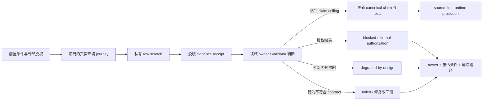

# External Evidence Closure - Plan

## Goal Capsule

| Dimension | Decision |
| --- | --- |
| Objective | 为 Proof v3、GitHub PR watch、Optimize measurement-only，以及 Cursor/Kiro/Qoder/OpenCode doctor 降级提示建立独立、可执行的 evidence-closure 路径；只在真实环境证据达到对应 claim ceiling 后升级声明，不能关闭的限制继续以有 owner、reason、重估条件和解除路径的诚实降级存在。 |
| Recommended approach | `extend + per-track evidence composition`：复用各领域现有 owner、contract、validator 与 validation 文档，仅新增本计划专属 closeout ledger 和授权矩阵，不建立通用 evidence orchestrator、中央状态机或跨领域 universal schema。 |
| Source of truth | Proof 由 `skills/spec-proof/` 与批准后的 live contract 持有；PR watch 由 `skills/spec-lfg/` 持有；Optimize 由 `skills/spec-optimize/` 持有；宿主投射与 doctor 由 `src/cli/adapters/`、`src/cli/commands/doctor.js`、runtime catalog 持有。计划与 validation receipt 记录证据，不取代这些 owner。 |
| Real-environment rule | Proof v3、真实 GitHub PR watch、Optimize A/A→A/B、宿主 loader/hook/precedence claim 均必须由隔离的真实 journey 支撑；fixture、mock、contract test 只能证明输入形状、状态转换和确定性不变量。 |
| Authorization rule | 凭证、账号、测试仓库、外部模型费用、Provider 通信、PR/comment/check mutation、Proof CRUD、共享 IDE 操作必须在执行前逐项取得明确授权；本计划本身不授予这些权限。 |
| Honest degradation | 外部 owner 未批准、凭证不可用、目标版本能力缺失、共享 IDE 无法安全验证或真实结果未达到关闭门槛时，保留 degraded/blocked，并记录 reason code、责任 owner、freshness、限制、重估触发器和解除路径。正确 warning 不以“清零”为目标。 |
| Source/runtime boundary | 先修改 canonical source、tests、catalog/docs，再用 `spec-first init` 投射；禁止手改 `.cursor/`、`.kiro/`、`.qoder/`、`.opencode/` 等 generated runtime。规划阶段不刷新 runtime。 |
| Language boundary | 若实施触及 Skill prompt、`SKILL.md` prose 或 Skill-local agent/persona prompt，所有新增或改写内容使用英文；计划、中文文档与 CHANGELOG 使用简体中文。 |
| Stop conditions | 需要把 fixture 冒充 field outcome；凭证会进入 argv/URL/log/artifact；无法隔离外部 mutation；真实版本或 identity 不可确定；需要手改 generated runtime；或准备以 warning 消失替代 claim 已验证。 |

---

## Product Contract

### Problem Frame

上一轮已完成确定性 contract 与本地测试，但四类限制仍没有足以提升公开声明的直接证据。继续保留限制是正确的当前状态，不是终态：本计划为每项限制给出可执行的外部证据闭环，同时保留外部依赖确实无法消除时的诚实降级出口。

证据等级严格区分：

| Evidence | 最多支持的 claim |
| --- | --- |
| Fixture / mock | 输入形状、错误分类、局部流程分支可被测试；不能证明 Provider 或宿主真实行为。 |
| Contract / unit test | schema、状态机、CAS、redaction、reason code、投射内容等确定性不变量成立；不能证明 live endpoint、loader、hook、PR 或实验 outcome。 |
| Version-matched isolated journey | 指定 endpoint/仓库/corpus/宿主版本和环境下观察到真实行为；只支持该证据范围内的 field claim。 |
| Owner-approved sanitized receipt | 可跨会话审计的 confirmed evidence，包含 source identity、版本、时间、结果、限制和失效条件；仍不自动授权推广、合并或扩大支持范围。 |

### Actors

- A1. 项目 owner：批准 Proof v3 contract、claim 升级和公开表达。
- A2. Credential/data owner：批准账号、token、secret、测试数据、外部通信和保留周期。
- A3. Journey operator：在隔离环境执行获准操作，保存脱敏回执并完成清理。
- A4. Domain owner：分别为 `spec-proof`、`spec-lfg`、`spec-optimize`、host adapter/doctor，解释领域结果并更新 canonical claim。
- A5. Deterministic helper/test：准备 identity、hash、schema、reason code、raw exit/status 与 redaction facts，不作语义升级判断。
- A6. Maintainer/reviewer：确认 receipt 足够、限制没有被隐藏、source/runtime 投射与文档一致。

### Requirements

**Cross-track governance**

- R1. 四条轨道必须各自记录 current claim、fixture ceiling、所需 live journey、授权、成功/失败/阻塞结果、owner、freshness、limitations、重估条件和解除路径；缺一项不得关闭。
- R2. 计划专属 closeout ledger 只聚合 track status 与 evidence refs，不复制 Proof、PR watch、Optimize 或 host adapter 的领域规则，也不提升为全局 schema，除非后续出现至少两个独立真实 consumer。
- R3. 外部输入均按 `provider_untrusted` 处理；raw payload 只进入 owner-checked、拒绝 symlink、用户私有权限的 run-local scratch，并在 receipt 发布或 run 终止后清理。Durable validation artifact 只保留脱敏摘要、必要 hash、版本/identity、时间、状态、reason code 与限制；外部 endpoint 必须使用批准的 allowlist 和正常传输安全校验，不得关闭证书验证。
- R4. 轨道状态只能表达为 `confirmed`、`blocked-external-authorization`、`degraded-by-design` 或 `failed`。`confirmed` 必须回链真实 journey receipt；`failed` 不得被包装成 degraded；外部前置条件缺失用 blocked，不伪装为产品缺陷。
- R5. 每次修改 Skill 后，方案中对应 Skill 轨道模块必须追加完成状态说明，至少记录完成日期、完成 U-ID、修改 source、验证、剩余限制和最终 claim；未达到 live gate 时明确写“机制完成，field claim 未关闭”。
- R6. 若修改 Skill prompt/prose，新增或改写文本必须为英文，并通过聚焦的中文增量/语言检查；该规则不要求翻译历史文本，也不授权无关 prompt 重写。

**Proof v3**

- R7. 在 owner 批准 live endpoint、schema、auth、lifecycle 和测试文档前，Proof v3 保持 `blocked-external-contract-unverified`，不得修改 `skills/spec-proof/**` 以猜测 v3 contract。
- R8. Proof live journey 必须获准覆盖 create/read/edit/comment/suggest/claim/delete，并验证 idempotency、revision conflict、ownerless claim、rotation/revocation 与 401/403 privilege-fallback negative case。
- R9. Proof access token 与 owner secret 必须分离并采用短时凭证路径；两者不得进入 argv、URL、source、raw log 或 validation artifact。cleanup 必须删除测试文档或记录 owner 批准的保留例外。

**GitHub PR watch**

- R10. PR watch 必须在专用测试仓库或明确隔离的临时分支/PR 上执行，覆盖 watching、CI transition、review thread、head change、base advance/stale、quiet-window looks-ready、CAS conflict/resume、budget/manual blocker 与 sanitized handoff。
- R11. GitHub journey 的授权需独立列出 repo/branch push、PR create/update、comment/review/check mutation 与 cleanup；任何授权都不隐含 merge、force-push、rebase 或 history rewrite。
- R12. `looks-ready` 只能在 current head/base、mergeable/CLEAN、无 pending/failing checks、无 open review items和五分钟 quiet window 同时由 live observation 满足时确认；旧绿灯在 head/base 变化后必须失效。

**Optimize measurement-only**

- R13. 选择真实、可重复、非敏感 corpus，冻结 baseline、candidate、corpus、seed、harness、environment 与 budget；在观察任何结果前预注册 metric、direction、aggregation、threshold、noise ceiling 和 broken-run policy。
- R14. 至少完成两次 baseline-vs-baseline A/A；noise 超 ceiling 时停止，不运行或解释 A/B。通过 A/A 后，A/B 必须保持冻结 identity 对称，并记录 completed/harness-error/timeout/environment-drift/gate-failed/not-run。
- R15. judge 模式涉及模型调用、费用或数据外发时必须取得单独预算和通信授权。结果最多支持 measurement claim，recommendation 仍限于 stop、defer、collect-more-evidence、eligible-for-owner-evaluation，不直接支持 promotion、ship、commit 或 landing。

**Host doctor and runtime claims**

- R16. Cursor 与 OpenCode 必须按精确 host version 重跑当前 flat/generated projection 的 loader 和 duplicate-root/precedence journey；历史旧 projection 证据不能证明当前 source，版本变化触发失效。
- R17. Qoder authenticated CLI hook execution 与 shared IDE loader safety 必须分开验证和晋升；SessionStart、PreToolUse、Stop 按 event group 记录结果，CLI 成功不能替代 IDE safety，未验证的 managed hooks 继续 inert。
- R18. Kiro 先捕获当前 `doctor --json` 的实际 reason code、CLI identity 和环境 facts，再分类为 source defect、host/provider limitation 或 environment-scoped unavailable；PATH 缺失、CLI 未安装或超时不能直接驱动 source 修改。
- R19. 只在对应 live journey 通过且 receipt freshness 有效时更新 adapter `testedVersions`、`evidenceClaim`、runtime catalog、README 或 doctor wording。外部固有限制存在时保留准确 warning，不能用压制诊断实现“关闭”。
- R20. Host current identity 必须来自 entrypoint pin、version output 或其他 script-owned direct fact，不从 PATH 顺序、runtime root 或模型猜测推导。

### Key Flows

- F1. **Authorization intake**：建立最小权限清单、数据边界、凭证注入方式、费用/外发批准、cleanup owner；任一必要项缺失则落入 blocked receipt。
- F2. **Isolated journey**：冻结 source/target identity，在专用 endpoint/repo/corpus/host profile 中运行，raw data 留在私有 scratch。
- F3. **Receipt and judgment**：脚本准备 exit/status/hash/version/redaction facts；领域 owner 判断 claim 是否达到 confirmed、failed 或继续 degraded。
- F4. **Source-first reconciliation**：仅在 claim 有证据时更新 canonical Skill/adapter/catalog/docs/tests，再通过 init 投射并复核 doctor/loader。
- F5. **Re-evaluation**：凭证撤销、版本变化、contract/schema 变化、source identity 变化、receipt 过期或回归失败时，使对应 claim 失效并恢复 degraded/blocked。

### Acceptance Examples

- AE1. Proof owner 未批准 v3 schema 时，ledger 显示 `blocked-external-authorization`、原 reason code、owner 和批准清单；`skills/spec-proof/**` 保持不变。
- AE2. Proof live journey 返回 403 且 privilege fallback 符合批准 contract，receipt 只保存脱敏状态和 correlation hash；若 secret 出现在输出，journey 失败并销毁 artifact。
- AE3. PR 在 CI 绿后 push 新 commit，watcher 使旧 generation 失效并重新等待；五分钟 quiet window 前不输出 `looks-ready`，全过程不自动 merge。
- AE4. PR watch fixture 全绿但没有真实 PR receipt 时，claim 保持 contract-confirmed/field-unverified，不能标记整轨 confirmed。
- AE5. Optimize A/A noise 超 ceiling，轨道以真实 `degraded-by-design` 或 `failed` 结果结束并建议 collect-more-evidence；不得选择性丢弃 run 后继续解释 A/B。
- AE6. OpenCode 当前版本 loader 能发现 flat `spec-work`，但 duplicate-root precedence 未验证时，只升级 loader 子声明，precedence warning 保留。
- AE7. Qoder CLI hooks 通过而 shared IDE safety 未证实时，仅对应 CLI event group confirmed，IDE/activation 仍 degraded，managed IDE hooks 不启用。
- AE8. Kiro 唯一 warning 是当前环境 CLI 不可用时，ledger 记录 environment-scoped degraded 和安装/重测路径，不修改 adapter 以隐藏 warning。
- AE9. 任一 Skill 轨道 source 修改完成后，其模块含“完成状态说明”；field gate 未过时状态明确区分 implementation complete 与 evidence closure incomplete。

### Success Criteria

- 四条轨道都有可审计的授权矩阵、真实 journey 定义、fixture ceiling、关闭门槛、降级条件和失效条件。
- Proof、PR watch、Optimize 的 field claim 只有在真实环境 receipt 存在时升级；宿主声明按 version/event/subclaim 粒度升级。
- 无 secret、PII、raw provider payload 或未批准测试数据进入 Git、argv、URL、CHANGELOG、计划或 validation artifact。
- 所有 source claim、doctor reason、catalog 和 README 与 receipt 一致；generated runtime 只由 canonical source 投射。
- 无法关闭的限制仍然准确、响亮、可重估，而不是永久无 owner 的免责声明。

### Scope Boundaries

**In scope**

- 四轨 authorization matrix、closeout ledger、真实 journey runbook、sanitized receipt 与 claim reconciliation。
- 获批后对现有 Proof/LFG/Optimize/host adapter owner 的最小修复、测试、catalog/docs/CHANGELOG 和 source-first projection。
- 成功、失败、阻塞、回滚、cleanup、retention 与证据失效处理。

**Out of scope**

- 规划阶段实际调用 live endpoint、GitHub、外部模型或宿主 IDE。
- 新建通用 evidence orchestrator、中央 workflow 状态机或 universal schema。
- 为关闭 warning 重构现有 Skill/workflow、自动 merge PR、推广 Optimize candidate、替换 Proof 当前 contract。
- 手改 generated runtime、把测试凭证存进仓库、使用生产文档/生产 PR 充当测试 fixture。

---

## Planning Contract

### Context & Research

本计划基于当前 source 与验证记录，而不是上一轮 transcript 的“已完成”声明。关键证据包括：

- Proof：`skills/spec-proof/SKILL.md`、`docs/validation/2026-07-30-proof-v3-external-contract-gate.md`、`skills/spec-plan/references/plan-handoff.md`。
- PR watch：`skills/spec-lfg/SKILL.md`、`skills/spec-lfg/references/pr-watch-loop.md`、`skills/spec-lfg/references/review-followup.md`、`skills/spec-lfg/scripts/pr-watch-state.cjs` 及相关 unit tests。
- Optimize：`skills/spec-optimize/SKILL.md`、`skills/spec-optimize/references/measurement-only-calibration.md`、两个 schema 和 measurement-only contract tests。
- Hosts：`src/cli/commands/doctor.js`、四个 adapter、`docs/catalog/runtime-capabilities.md`、host validation reports 与 platform contract tests。
- Institutional learnings：host authority 必须来自 entrypoint pin；fixture/LLM semantic evidence 不能替代 field data；host mapping 集中于 adapter/init/governance owner。

当前研究只确认本地 source、tests 和历史 validation artifact。尚未访问官方 live endpoint、GitHub 测试仓库、外部模型或四宿主 authenticated runtime；历史 OpenCode 1.18.7 nested command journey 对当前 flat projection 是反例而非通过证据。未获子代理授权，深化与后续文档审查使用 prompt asset 串行内联执行，不能声明独立 reviewer/context-isolation coverage。

### Key Technical Decisions

- KTD1. **按领域组合，不建统一执行器。** 每轨已有不同 authority、凭证、失败语义和 claim ceiling；聚合层只保存状态与 refs。拒绝 universal schema，因为它会复制领域规则并诱导脚本替 LLM 作语义结论。
- KTD2. **真实 journey 是 field claim 的唯一关闭证据。** fixture/contract 可作为 admission gate 和 regression floor，但不会因覆盖率高而升级成 Provider outcome。
- KTD3. **授权与能力分离。** 工具存在、凭证存在、fixture 可运行都不等于允许外部通信或 mutation；每个 journey 在执行前生成最小授权 receipt，未授权即 blocked。
- KTD4. **子声明可独立晋升。** Host loader、precedence、CLI hook、IDE safety、permission enforcement 不能打包成一个 pass；一项通过只更新其 claim，避免“局部成功→完整支持”的越权推断。
- KTD5. **warning 正确性优先于 warning 数量。** source defect 应修复，environment/provider limitation 应保留带 remedy 的 degraded warning。成功标准是诊断与证据一致，不是 doctor 全绿。
- KTD6. **Receipt 最小化并可失效。** durable artifact 不保存 raw payload；以 source identity、target version、timestamp、sanitized outcome、hash、limitations、cleanup 和 invalidation triggers 支撑审计。
- KTD7. **先 source 后 runtime。** 任何真实差距先修 adapter/Skill/generator/test，再运行 `spec-first init`；runtime mirror 只用于 journey 和 drift verification。
- KTD8. **实施完成与证据关闭分开记录。** Skill 机制升级可先完成，但对应模块必须写完成状态说明，并在 field evidence 缺失时继续标注未关闭，防止“机制就位”冒充使命兑现。

### High-Level Technical Design

以下是非约束性数据流；每轨的实际 contract 仍由其领域 owner 持有。

### Interface Contracts

计划专属 closeout ledger 推荐字段如下；这是 validation 文档 shape，不是全局 runtime schema：

| Field | Owner / rule |
| --- | --- |
| `track` / `subclaim` | 领域 owner 的稳定名称；host 必须细到 loader/precedence/hook event/IDE safety。 |
| `status` | 四值之一：confirmed、blocked-external-authorization、degraded-by-design、failed。 |
| `current_claim` / `claim_ceiling` | LLM owner 解释，必须回链 direct evidence。 |
| `source_identity` / `target_identity` | 脚本准备的 commit/tree、endpoint/repo/corpus/host version facts。 |
| `authorization_ref` | 只引用批准类型和 receipt，不含 token/secret。 |
| `evidence_refs` | repo-relative sanitized artifacts；raw scratch 不进入该字段。 |
| `reason_code` / `limitations` | 当前状态为何不能进一步升级。 |
| `owner` / `re_evaluate_when` / `closure_path` | 所有非 confirmed 状态必填。 |
| `freshness` / `invalidated_by` | version、schema、source、credential、time 或 regression 触发失效。 |
| `cleanup` / `rollback` | 外部对象和 source/runtime 的恢复结果。 |

### Evidence & Limitations

- Confirmed local evidence：现有 contract/unit tests 能证明 PR watch state/CAS、Optimize measurement-only gate、host projection/doctor reason shape 等确定性地板。
- Advisory/historical evidence：旧 host validation 与 catalog 可用于设计 journey，但 target version/source identity 不匹配时不能关闭当前 claim。
- Missing direct evidence：Proof v3 approved live contract；真实 GitHub PR lifecycle；真实 corpus A/A→A/B；Cursor/OpenCode 当前版本 loader/precedence；Qoder authenticated hooks/IDE safety；Kiro 当前环境 reason-code capture。
- External authority missing：所有真实 journey 的账号、凭证、数据、费用、外部通信与 mutation 授权均未在本次规划中提供。
- Review limitation：`worker_dispatch_authorization=missing`，confidence deepening 与 doc review 必须 inline/serial，`worker_context_isolation=degraded_inherited`。

### System-Wide Impact

- Skill surface：仅获批 contract/journey 需要时修改 `spec-proof`、`spec-lfg`、`spec-optimize`；prompt prose 新增保持英文，并在对应模块记录完成状态。
- CLI/runtime：host claim 只由 canonical adapter、doctor、init 与 catalog 更新；六宿主投射共用边界不被局部 host journey改写。
- Data/security：token/secret、测试文档、PR 内容、模型输入和 IDE profile 都是最小权限外部数据；raw payload 禁止进入 durable Git artifact。
- Operational：journey 使用专用资源、显式预算、超时、清理和恢复步骤；失败时优先回滚测试对象与 source claim，不覆盖诊断。
- Consumers：README、runtime catalog、doctor human/JSON 输出和 Skill handoff 只能消费已确认的细粒度 claim，不读取 Provider 内部实现。
- Compatibility：版本变化或 source projection 变化使旧 receipt 失效；已有用户 runtime 只能通过 init preview/apply 更新，不静默覆盖 unmanaged 内容。

### Risks & Dependencies

| Risk / dependency | Mitigation / exit |
| --- | --- |
| 凭证泄漏到 argv、URL、log 或 Git | 短时凭证、stdin/secure store 注入、私有 scratch、pre-persist redaction scan；发现泄漏立即 revoke、清理并将 journey 标记 failed。 |
| 测试资源误伤生产 | 专用 repo/document/corpus/profile、唯一前缀、最小权限、cleanup inventory；无法隔离则 blocked。 |
| Provider/host 版本漂移 | 每个 receipt 固定 version/source identity；版本变化自动触发 re-evaluation，不泛化 claim。 |
| 偶然绿灯被当稳定结果 | 覆盖 negative case、resume/idempotency/quiet-window/A/A noise；必要时重复 journey。 |
| 局部 host pass 被提升为 full support | 子声明独立 ledger；catalog 最大 claim 取所有必需子声明的最低可信级别。 |
| 外部费用或不可控耗时 | 预注册预算、timeout 与 stop criteria；超预算以 blocked/degraded 结束，不偷偷扩大授权。 |
| 为清 warning 引入 source regression | 先按 reason code 分类；environment/provider limitation 不改 source；source 改动用聚焦 contract + source-first projection 回归。 |
| 计划长期停在降级 | 每项必须有 owner、重估触发器和 closure path；版本发布、contract 批准、凭证就绪或季度复核触发重新评估。 |

### Plan-Level Threat Model

| Exploit | Consequence | Required mitigation |
| --- | --- | --- |
| 恶意或误配置 endpoint 诱导 operator 外发 token、测试文档或仓库内容 | 凭证和受控数据越过批准的信任边界 | 使用 owner-approved endpoint allowlist、正常 TLS/证书校验、最小 payload 和短时凭证；redirect 或 endpoint identity 变化时 fail closed。 |
| GitHub comment、Proof body、模型 judge 输出或宿主配置携带 prompt/command/patch 注入 | 不可信 Provider 内容被 agent 当作命令执行，造成 source 或外部资源 mutation | 始终标记 `provider_untrusted`；不自动执行返回的命令、路径或 patch；mutation 只来自本计划列明且单独授权的领域动作。 |
| raw scratch、失败日志或 cleanup 遗留暴露 token、owner secret、PR/文档内容 | secret 或测试数据在本机、CI artifact 或 Git 中持久化 | owner-only/no-symlink scratch、发布前脱敏扫描、run-end purge、凭证 revoke 路径和 cleanup blocker；发现泄漏时该 receipt 永不进入 confirmed。 |

### Open Questions

**Resolved during planning**

- 不创建通用 evidence orchestrator；使用 plan-specific ledger。
- 不要求消灭所有 doctor warnings；只修 spec-first-owned defect。
- Proof contract 未获 owner 批准时不修改 Skill。
- PR watch 使用专用测试仓库/临时分支，不使用当前生产 PR。
- Qoder CLI 与 IDE 分开晋升；Kiro 先捕获 reason code 再分类。

**Deferred to implementation / external owner**

- Proof v3 endpoint/schema/auth/lifecycle 的 owner-approved 版本与测试账号。
- GitHub 测试仓库、允许的 check/review simulation 方法和 cleanup owner。
- Optimize corpus、candidate、harness、metric、预算与 judge 外发授权。
- Cursor、Kiro、Qoder、OpenCode 可获得的精确版本、authenticated profile 与共享 IDE 安全环境。

---

## Implementation Units

### U1 — 建立 evidence inventory、授权矩阵与 closeout ledger

**Goal:** 为四轨建立统一但不越权的实施入口和可失效证据索引。（R1-R6，F1）

**Dependencies:** 无。

**Files:**

- `docs/validation/2026-07-30-external-evidence-closure-ledger.md`（新增）
- `docs/contracts/workflows/` 下现有相关 contract（仅发现真实共享 consumer 时更新）
- `tests/unit/` 下聚焦 ledger/claim prose guard（若新增机器可读字段）
- `CHANGELOG.md`

**Approach:** 从当前 source、tests、historical validation 提取每个 subclaim 的 baseline；记录 authorization type、fixture ceiling、journey、owner、freshness、status、closure/re-evaluation。保持 Markdown ledger 为计划专属 artifact；只有出现真实自动消费才引入最小 schema/validator。

**Patterns to follow:** `docs/validation/2026-07-30-proof-v3-external-contract-gate.md` 的 blocker/解除条件；runtime capability catalog 的 claim ceiling；Direct Evidence / Advisory Evidence 区分。

**Test scenarios:** 缺 owner、reason、re-evaluation 或 evidence ref 的非 confirmed 条目不能 close；没有 live receipt 的 fixture-only 条目不能为 confirmed；secret-like value 被持久化检查拒绝。

**Verification:** ledger 覆盖 Proof、PR watch、Optimize、Cursor、Kiro、Qoder、OpenCode 全部 subclaim，且每项可回链 canonical owner。

**Execution note:** 本单元不需要外部凭证；只读取本地 source。完成后仍不提升任何 field claim。

### U2 — Proof v3 owner-approved contract intake 与 live journey

**Goal:** 用批准后的真实 contract 关闭或准确维持 `blocked-external-contract-unverified`。（R7-R9，F1-F3）

**Dependencies:** U1；外部 owner 批准 endpoint/schema/auth/lifecycle、非敏感测试文档、CRUD/claim 权限、短时凭证与 cleanup。

**Files:**

- `docs/validation/2026-07-30-proof-v3-external-contract-gate.md`
- `docs/validation/` 下新增脱敏 Proof v3 journey receipt
- `skills/spec-proof/SKILL.md` 与其 references/scripts（仅批准 contract 与 journey 证明需要时）
- Proof 相关 contract/unit tests
- `CHANGELOG.md`

**Approach:** 先保存 owner-approved contract identity 和授权 receipt；再在测试文档上执行 create/read/edit/comment/suggest/claim/delete，覆盖幂等、revision conflict、ownerless claim、rotation/revocation、401/403 negative case。raw response 留私有 scratch，durable receipt 只留脱敏事实。若 contract 未批准，本单元以 blocked 完成，不修改 Skill。

**Patterns to follow:** 现有 Proof Web API/Local Bridge contract；credential separation 与 provider-untrusted 边界；当前 gate 的解除清单。

**Test scenarios:** 正常 CRUD；重复请求；旧 revision 冲突；ownerless claim；token rotation/revocation；低权限 401/403 fallback；cleanup 成功与 cleanup blocker；redaction negative test。

**Verification:** owner 批准记录、live receipt、无凭证泄漏、测试对象清理，以及 Skill contract/测试与真实结果一致。只有全部必需场景通过才将对应 field claim 改为 confirmed。

**Execution note:** 必须真实环境验证并需要外部凭证、数据与 mutation 授权。规划或 fixture 阶段不可执行。

**完成状态说明（实施时更新）:** `未开始；当前 blocked-external-contract-unverified。` 完成后填写日期、U2 source diff、验证 receipt、剩余限制与最终 claim；若仅机制完成，必须保留“field claim 未关闭”。

### U3 — GitHub PR watch 隔离真实 journey

**Goal:** 证明现有 PR watch contract 在真实 GitHub PR lifecycle 中可恢复且不越过 landing 权限。（R10-R12，F2-F3）

**Dependencies:** U1；专用测试仓库/分支、`gh` 或等价 API auth、push/PR/comment/review/check mutation 与 cleanup 授权。

**Files:**

- `skills/spec-lfg/references/pr-watch-loop.md`
- `skills/spec-lfg/references/review-followup.md`
- `skills/spec-lfg/scripts/pr-watch-state.cjs`
- `tests/unit/spec-lfg-pr-watch-state.test.js`
- `tests/unit/spec-work-lfg-recovery-contracts.test.js`
- `docs/validation/` 下新增 GitHub PR watch receipt
- `CHANGELOG.md`

**Approach:** 冻结 repo/PR/head/base identity；以可控 check/review 事件驱动 pending→success、failure→debug return、review→feedback return、head/base invalidation、CAS resume、budget/manual blocker 和 quiet window。证明 durable handoff 已脱敏且 watcher 从不 merge/rebase/force-push。

**Patterns to follow:** append-only generation/hash chain、expected generation/SHA CAS、active budget、provider raw allowlist/minimization。

**Test scenarios:** CI success/failure；review open/resolve；新 head 使旧绿灯失效；base advance/stale；并发 CAS conflict/resume；五分钟 quiet window；budget exhausted；manual blocker；closed/merged terminal read-only observation；cleanup。

**Verification:** GitHub event timeline、watch generations、current head/base/check/review snapshot、terminal reason、无自动 merge 和 sanitized handoff 可互相核对。

**Execution note:** 必须真实 GitHub 环境和明确外部通信/mutation 授权；不得使用当前生产 PR 代替隔离 fixture。

**完成状态说明（2026-07-31）:** U3 deterministic mechanism implementation complete。`skills/spec-lfg/scripts/pr-watch-state.cjs` 已把 `remote_available` 纳入 observation identity，断网及恢复都会重新累计五分钟 quiet window；PR URL 在写入和读取旧 state 时均拒绝 username/password credentials；state-dir 只允许位于预先存在、当前用户拥有、非 symlink、无 group/other 权限的私有父目录，状态目录与 snapshot 文件也执行 non-symlink、owner-only 校验，并以父目录 identity 复核降低替换风险。负例覆盖 remote 恢复不继承旧 quiet time、credential URL 不落盘且不回显、旧 state credential/宽权限 fail closed、父级 symlink 逃逸和非私有 scratch 拒绝。聚焦回归 5 suites/34 tests、typecheck 203 files 通过，扩展 `spec-lfg-contracts` 15/15 通过；此前临时 `skills/spec-plan-workspace/` 造成的 governance inventory 阻塞已随该临时 workspace 移除而解除。真实 GitHub 测试 PR journey、外部通信/mutation receipt 与 cleanup receipt 仍未执行，因此 field evidence closure 保持 `blocked-external-authorization`，不提升 `looks-ready` field claim，也不授权 merge、rebase、force-push 或历史重写。

### U4 — Optimize 真实 corpus A/A→A/B calibration

**Goal:** 在真实非敏感 corpus 上验证 measurement-only contract 的噪声门与建议上限。（R13-R15，F2-F3）

**Dependencies:** U1；冻结 corpus/baseline/candidate/harness/seed，预注册指标与预算；judge 外发时另需模型通信和费用授权。

**Files:**

- `skills/spec-optimize/SKILL.md`
- `skills/spec-optimize/references/measurement-only-calibration.md`
- `skills/spec-optimize/references/optimize-spec-schema.yaml`
- `skills/spec-optimize/references/experiment-log-schema.yaml`
- `tests/unit/spec-optimize-measurement-only-contracts.test.js`
- `docs/validation/` 下新增 measurement field receipt
- `CHANGELOG.md`

**Approach:** 在看结果前冻结 identity、metric、direction、aggregation、threshold、noise ceiling、broken policy、budget；先做至少两次 A/A，达标后才做同条件 A/B。保留 run-level outcome 与环境漂移，结果只进入 owner evaluation，不修改/推广 Skill candidate。

**Patterns to follow:** measurement-only recommendation enum、broken-run taxonomy、A/A noise stop gate、baseline/candidate symmetry。

**Test scenarios:** 稳定 A/A 后 A/B；A/A 超 noise ceiling；timeout/harness-error；environment drift；gate failure；budget 前未运行；judge 拒绝/费用耗尽；重复 run identity 检查。

**Verification:** 预注册时间早于 outcome、冻结 identities 一致、A/A run 数量与 noise 计算可复核、A/B 没有越门、recommendation 未超出 measurement claim。

**Execution note:** 必须真实 harness/corpus；可能需要外部模型费用/通信授权。没有授权时可完成 runbook，不得生成伪 field outcome。

**完成状态说明（2026-07-31）:** U4 deterministic mechanism implementation complete。新增 source-owned `skills/spec-optimize/scripts/measurement-admission.cjs`：`admit` 在首次测量前确定性校验 immutable baseline/candidate Git SHA 或 content identity、corpus/harness/environment SHA-256、integer seed、metric direction/aggregation、至少两次 A/A、预注册 acceptance threshold/noise ceiling、禁止 synthetic score 的 broken-run policy 与 stop budget，并输出 normalized admission 和稳定 `admission_sha256`；`allow-ab` 要求 admission/attempt digest 一致、completed score 有限、broken attempt 无 synthetic score、重试与总 attempt 不超预算、有效 A/A 次数满足预注册值且 observed noise 不高于 ceiling，否则 fail closed 并保持 `ab_allowed: false`。Skill、calibration reference、optimize spec schema、experiment log schema 与正负例测试已同步，聚焦回归 5 suites/34 tests、typecheck 203 files 通过。真实非敏感 corpus/harness A/A→A/B、模型外发/费用授权、experiment receipt 与成本记录仍未执行，因此 field evidence closure 保持 `blocked-external-authorization`；结果仅可进入 owner evaluation，不构成 candidate promotion、Skill mutation、commit 或 landing authority。

### U5 — Cursor 与 OpenCode version-matched loader / precedence journeys

**Goal:** 对当前 flat/generated projection 分别验证 loader discovery 和 duplicate-root/precedence 子声明。（R16、R19-R20，F2-F5）

**Dependencies:** U1；精确 Cursor/OpenCode 版本、隔离 user/project config、CLI/IDE 启动与读取测试 profile 的授权。

**Files:**

- `src/cli/adapters/cursor.js`
- `src/cli/adapters/opencode.js`
- `src/cli/commands/doctor.js`
- `docs/catalog/runtime-capabilities.md`
- `docs/validation/opencode-host-support/` 与新增 versioned receipts
- Cursor/OpenCode adapter、duplicate-root、projection tests
- `CHANGELOG.md`

**Approach:** 由 current source 生成隔离 runtime；逐版本证明命令/Skill loader 发现当前 flat names，再构造 project/external duplicate roots 验证 precedence。loader 和 precedence 独立记账；OpenCode bundled agents unsupported 与 permission enforcement 不因 loader 通过自动升级。

**Patterns to follow:** generated-runtime preview claim ceiling、current flat OpenCode command contract、Cursor duplicate-root diagnostics、source-first init preview/apply。

**Test scenarios:** clean profile discovery；expected flat key；legacy nested key 不出现；external duplicate；managed duplicate；missing runtime root；version mismatch；unmanaged collision preservation；cleanup/re-init。

**Verification:** version output、generated file inventory、host loader observation、precedence outcome、doctor JSON reason code 与 clean result一致；只更新通过的 subclaim。

**Execution note:** 必须使用真实 host runtime；可能需要账号/IDE 启动授权，但不得读取无关用户 profile。旧 OpenCode 1.18.7 nested journey不能复用为当前通过证据。

### U6 — Qoder authenticated hooks 与 shared IDE safety journey

**Goal:** 按 event group 分开验证 Qoder CLI hook activation 和共享 IDE loader safety。（R17、R19-R20，F2-F5）

**Dependencies:** U1；authenticated qodercli/profile、SessionStart/PreToolUse/Stop 触发权限、隔离共享 IDE profile 和恢复授权。

**Files:**

- `src/cli/adapters/qoder.js`
- `src/cli/commands/doctor.js`
- `docs/validation/qoder-hooks-protocol-matrix.md`
- `docs/catalog/runtime-capabilities.md`
- `tests/unit/qoder-runtime-lifecycle.test.js`
- host projection/doctor tests
- `CHANGELOG.md`

**Approach:** 先在隔离 CLI profile 逐 event group 捕获 hook input/exit/side-effect；再验证相同 managed entries 在 shared IDE 中不会劫持用户 hooks 或破坏 loader。只有 CLI 和 IDE 对应门都过，才考虑让该 event group 从 inert 进入启用；否则保留精确 degraded reason。

**Patterns to follow:** current inert managed scripts、protocol matrix、preview-first、user-owned settings preservation。

**Test scenarios:** 三 event group success/failure/timeout；unauthenticated CLI；hook 未触发；shared IDE unmanaged coexistence；duplicate entry；rollback；clean 后用户 hook 保留。

**Verification:** authenticated CLI timeline、IDE safety receipt、settings before/after hash、managed/unmanaged ownership、doctor reason 与 event-group claim 一致。

**Execution note:** 必须真实 authenticated CLI 与共享 IDE 安全环境；CLI pass 不足以启用 IDE hooks。

### U7 — Kiro doctor reason-code capture 与责任分类

**Goal:** 基于当前真实 doctor facts 判定 Kiro warning 是否属于 source defect、Provider 限制或当前环境不可用。（R18-R20，F3-F5）

**Dependencies:** U1；尽可能提供精确 Kiro CLI/IDE 版本；无 CLI 时仍可形成 environment-scoped degraded receipt。

**Files:**

- `src/cli/adapters/kiro.js`
- `src/cli/commands/doctor.js`
- `docs/catalog/runtime-capabilities.md`
- Kiro host plan/validation 与 platform doctor/projection tests
- `docs/validation/` 下新增 Kiro reason-code receipt
- `CHANGELOG.md`

**Approach:** 捕获 `doctor --json`、entrypoint identity、CLI version/timeout/exit、runtime inventory；逐 reason code 分类 ownership。只有可由 canonical source 修复的 defect 才进入 adapter/generator 修改；PATH 缺失、CLI 未装或 Provider 不暴露验证 primitive 时保留 environment/provider degraded 与 remedy。

**Patterns to follow:** doctor “可用，但需关注”语义、entrypoint host pin、script-owned readiness facts、adapter projection contract。

**Test scenarios:** CLI available；not found；timeout；version command失败；runtime missing/partial；source drift；修复后 doctor reason 消失；外部限制下 warning 保留且 remedy 正确。

**Verification:** 每个 warning 都有 raw exit/status 的脱敏 receipt、owner 分类和重测路径；没有基于假定把 Kiro套入 Cursor/OpenCode claim 模型。

**Execution note:** 当前环境无 Kiro CLI 时不需要凭证即可诚实完成分类，但不能确认 loader；真实 loader/IDE claim 仍需对应环境与授权。

### U8 — Claim reconciliation、source-first projection 与 closeout

**Goal:** 将各轨真实结果同步到 canonical claims、docs/tests/runtime，并保留未关闭限制。（R1-R6、R19-R20，F3-F5）

**Dependencies:** U2-U7 中实际可执行项；blocked 轨道允许带完整降级字段进入本单元。

**Files:**

- `docs/validation/2026-07-30-external-evidence-closure-ledger.md`
- `docs/catalog/runtime-capabilities.md`
- `README.md`、`README.zh-CN.md`（仅用户可见 claim 变化时）
- 对应 Skill/adapter/doctor tests
- 本计划对应 Skill 轨道的“完成状态说明”
- `CHANGELOG.md`

**Approach:** 逐 subclaim 对 receipt、source identity、freshness 与 limitations；只升级有 direct evidence 的 claim。运行 canonical tests 与 init preview，再按授权刷新 runtime 并复核 drift/doctor。失败时回滚 source claim 或恢复 inert projection，不删除正确 warning。

**Patterns to follow:** source/runtime customization boundary、runtime capability catalog、testedVersions/evidenceClaim、verification gate 的 confirmed/degraded distinction。

**Test scenarios:** mixed closeout（部分 confirmed、部分 blocked/degraded）；stale receipt 拒绝升级；version change invalidation；runtime projection drift；README/catalog/doctor 不一致；Skill 完成状态缺失；prompt 中文增量出现时失败。

**Verification:** ledger、validation receipts、source claims、tests、catalog、README/CHANGELOG 和 generated projection 双向一致；无 secret/raw payload；每个未 confirmed 项都有 owner 与重估路径。

**Execution note:** `spec-first init` 与 host runtime refresh 只在实施阶段、source settled 后执行；本计划编写阶段不运行。

---

## Verification Contract

### Deterministic gates

- 计划/ledger 结构：四轨与七个 host/subclaim owner 全覆盖；R/U/AE/KTD 引用可追踪；非 confirmed 项均含 reason、owner、re-evaluate、closure path。
- Secret safety：对 staged validation/docs/log 执行 secret-like、token、ownerSecret、Authorization、URL credential 与 raw payload 扫描；命中即阻断 closeout。
- Source/runtime：任何 adapter/Skill 变更先过聚焦 unit/contract tests，再执行 init preview/apply parity 与 drift 检查；禁止 runtime-only diff。
- Language：若 `skills/**` 有 prose 增量，新增/改写 prompt 必须为英文；中文计划/CHANGELOG 不计入该检查。
- Claim ceiling：没有 version-matched live receipt 的 field claim、testedVersions 或 evidenceClaim 升级必须 fail closed。

### Field journey gates

| Track | 必须真实环境 | 凭证/外部授权 | Fixture ceiling | Confirmed close | 可保留诚实降级 | 失效/重估条件 |
| --- | --- | --- | --- | --- | --- | --- |
| Proof v3 | 是 | endpoint/schema owner、测试文档、CRUD/claim、短时 token/secret、cleanup | schema/状态/错误路径 | 全场景 live receipt + redaction + cleanup | contract 未批准、权限不足、Provider lifecycle 未定 | schema/auth/endpoint/source 变化、凭证撤销、回归失败 |
| PR watch | 是 | 测试 repo、push/PR/comment/review/check、cleanup；不含 merge/history rewrite | state/CAS/budget/route | live PR 完整 timeline 达到 looks-ready 与 blocker/resume 场景 | GitHub capability/测试仓库不可用或预算不足 | GitHub API、branch policy、watch source、quiet rule 变化 |
| Optimize | 是 | corpus/harness；judge 时模型外发与费用 | schema/A/A gate/broken taxonomy | 预注册后真实 A/A 达标并完成合规 A/B | 噪声过高、预算/通信未授权、环境漂移 | corpus/candidate/harness/metric/model 变化 |
| Cursor | 是 | 精确版本与隔离 profile/IDE | projection/duplicate diagnostics | 当前版本 loader 与独立 precedence receipt | nested root/precedence 为宿主固有限制 | host version、projection source 或 profile policy 变化 |
| OpenCode | 是 | 精确版本与隔离 config/runtime | flat command/adapter contract | 当前 flat loader；precedence 另行 confirmed | bundled agents/permission/precedence 未证 | version、command layout、config precedence 变化 |
| Qoder | 是 | authenticated CLI、event mutation、shared IDE safety | settings/protocol/inert lifecycle | event group CLI + IDE safety 都通过 | IDE safety 或 event activation 未证时保持 inert | qodercli/IDE/version/protocol/settings 变化 |
| Kiro | loader claim 是；环境分类否 | CLI/IDE 可用时需要运行授权 | doctor/projection shape | 精确 reason 被 live facts解释，loader claim 另需 journey | CLI unavailable/provider primitive 缺失 | CLI/IDE version、PATH/runtime、adapter source 变化 |

### Failure, rollback, cleanup

- 外部 journey 失败：保留最小脱敏 failure receipt，撤销短时凭证，清理测试对象；不改高层 claim 或回退到原 degraded claim。
- Source 修复失败：恢复 canonical claim/catalog/adapter 到已验证状态，再由 init 恢复 managed runtime；不得用 runtime patch 临时掩盖。
- Cleanup 失败：轨道不得 close；记录外部对象、owner、保留原因与人工清理路径，避免把资源遗留隐藏在“测试通过”后。
- Receipt 泄密：立即停止、撤销凭证、删除可控副本、按仓库安全流程报告；该 run 永不作为 confirmed evidence。

### Plan validation

- 聚焦检查 frontmatter、必要章节、R/KTD/U/AE IDs、repo-relative paths、状态词和完成状态占位。
- 对计划与 CHANGELOG 运行 `git diff --check`。
- 本轮不运行 live journeys、宿主 loader、外部模型、Proof/GitHub mutation、`spec-first init` 或全量测试；这些属于实施单元的 gate。

---

## Definition of Done

- [ ] U1-U8 均有终态：confirmed、blocked-external-authorization、degraded-by-design 或 failed；不得用“未测试”无 owner 收尾。
- [ ] Proof、PR watch、Optimize 的任何 field claim 均有真实 environment receipt；fixture-only 不得升级。
- [ ] Cursor/OpenCode/Qoder/Kiro 按 version/subclaim/event 粒度记账；正确的外部限制 warning 继续保留。
- [ ] 所有需要凭证、账号、费用、外部数据或 mutation 的操作都有独立授权 receipt 和最小权限/cleanup 记录。
- [x] 每个被修改 Skill 的计划模块已追加完成状态说明，Skill prompt/prose 增量为英文，且记录剩余诚实限制。
- [ ] Durable evidence 已脱敏，无 secret、raw provider payload、生产文档或生产 PR 测试数据进入仓库。
- [ ] Canonical source、tests、catalog、README/CHANGELOG、doctor reason 与 generated runtime projection 一致；没有 runtime-only patch。
- [ ] 任何 blocked/degraded 项均有 reason、owner、freshness、重估条件与解除路径；版本/source/contract 变化能触发 claim 失效。
- [ ] 实际执行过的聚焦测试、field journeys、cleanup、init/drift 和 review 结果被逐项记录；未执行项明确写明原因。
