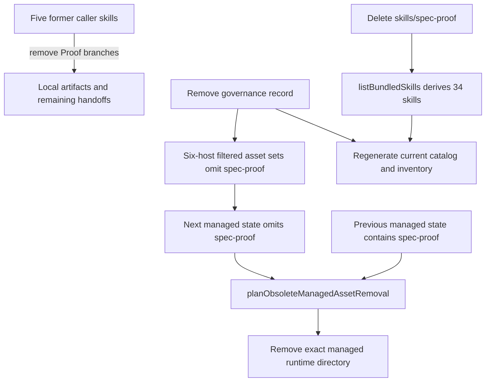

# refactor: Retire the Proof integration

## Goal Capsule

- **Objective:** Completely retire Spec-First's Proof integration, including the `spec-proof` package, every workflow handoff, supported-host delivery, current product documentation, and stale-runtime upgrade behavior.
- **Recommended approach:** Remove the canonical capability and its callers from source first, let the existing governance/state owners derive the smaller runtime set, and add negative plus upgrade-cleanup contracts instead of introducing a replacement sharing service.
- **Decision focus:** Preserve each producer's local artifact and remaining handoff behavior while deleting only Proof-specific branches, temporary upload-copy logic, external API language, and delivery metadata.
- **Verification focus:** Prove that current source/package/catalog output contains no live Proof capability, five former callers remain coherent, and a re-init removes a previously managed `spec-proof` directory on all six supported hosts without touching user-owned files.
- **Largest risk:** The current branch has extensive uncommitted work in most affected skills, docs, catalog/governance, and tests; implementation must patch the current working-tree text surgically and must not restore or overwrite unrelated edits.
- **Stop conditions:** Stop if a new current-source Proof consumer is found, if the previous managed state cannot distinguish the retired directory from user-owned content, or if the CE 3.20 current-inventory artifacts cannot be regenerated without weakening their fixed-upstream evidence contract.
- **Execution profile:** Standard, source-first, deletion-focused, no external Proof journey or credentials required.
- **Tail ownership:** `spec-work` owns implementation, focused/full verification, fresh-source evaluation accounting, generated-runtime refresh authorization, and closeout.

---

## Product Contract

### Summary

Spec-First currently ships `spec-proof` as an agent-facing internal skill to Claude, Codex, Cursor, Kiro, Qoder, and OpenCode, while five producer/reporting skills expose Proof publication or sharing behavior. The integration is currently documented as blocked on an unverified external contract, yet it still occupies prompt, governance, packaging, testing, and user-facing decision surface. This change removes that capability rather than continuing to carry a blocked external integration.

### Problem Frame

Deleting only the visible `Publish to Proof` label would leave direct invocation, Proof API/HITL instructions, six-host runtime projection, a `spec-pov` sharing path, and stale installed runtime assets behind. Conversely, deleting the package directory without first removing callers and governance would break source-governance validation and runtime planning. The retirement must therefore close the entire current contract graph while preserving dated historical evidence.

### Requirements

- R1. Delete the canonical `skills/spec-proof/` package and remove its `internal_only` governance record so it is no longer bundled, discoverable, directly invocable, or projected to any supported host.
- R2. Remove every current Proof publication, sharing, HITL, retry, fallback, temporary-upload-copy, and direct-Web-API branch from `spec-plan`, `spec-brainstorm`, `spec-ideate`, `spec-explain`, and `spec-pov`.
- R3. Preserve each caller's remaining artifact contract: local Markdown remains usable, HTML browser opening remains format-gated where it already exists, Issue/next-workflow/done branches remain intact, and no replacement sharing provider is introduced.
- R4. Update canonical governance docs, README surfaces, user manual, and generated runtime capability catalog so current documentation no longer advertises, lists, or describes `spec-proof`.
- R5. Preserve dated `CHANGELOG.md`, prior plans, and validation reports as historical evidence; add a new retirement record rather than rewriting what earlier versions contained or claimed.
- R6. Reconcile the CE 3.20 current Skill package inventory so its recorded canonical skill count matches the actual `skills/*/SKILL.md` directories after retirement, without changing its fixed upstream range, 422-path audit, or evidence-only semantics. (Note: the retirement commit landed alongside an unrelated `spec-handoff` addition, so the net count held at 35 rather than dropping to 34; the inventory's `source_head`/`skills_tree_oid` freshness pin — not the count — was the actual drift, and it has been refreshed.)
- R7. Ensure an upgrade/re-init from managed state that previously included `spec-proof` removes only the generated runtime directory on every supported host and leaves user-owned/unattributable content outside that managed path untouched.
- R8. Add regression coverage that fails if `spec-proof`, `Publish to Proof`, or `proofeditor.ai` returns to live source, delivery governance, current generated catalog, or former caller contracts, except where an exact token appears only inside an intentional negative-retirement assertion.
- R9. Modify source-of-truth surfaces only; do not hand-edit generated host runtime mirrors. Any local runtime regeneration is a separately authorized final maintenance action using `spec-first init` preview/apply semantics.
- R10. Preserve all unrelated current dirty-worktree edits in overlapping files and report any unavoidable conflict rather than resolving it by replacement from `HEAD`.

### Scope Boundaries

**In scope**

- Canonical skill source, caller references, delivery governance, current docs/catalog, deterministic current-inventory artifacts, tests, and changelog closeout.
- Managed stale-runtime cleanup through the existing state-diff mechanism.

**Out of scope**

- Replacing Proof with Thinkroom, a generic artifact surface, another SaaS, or a new sharing abstraction.
- Deleting local artifact creation, browser opening for HTML outputs, issue creation, `spec-work`/`spec-lfg` handoff, or normal document review.
- Calling Proof endpoints, validating Proof v3, migrating remote Proof documents, or revoking remote tokens/documents; the repository has no authoritative inventory or authorization for external remote data cleanup.
- Rewriting historical changelog entries, dated plans, or dated validation receipts that accurately describe an earlier source state.

### Acceptance Examples

- AE1. Given a fresh package build after retirement, when its bundled skills and governance are enumerated, then `spec-proof` is absent and the remaining governance count matches the actual `skills/*/SKILL.md` directories.
- AE2. Given Markdown output from any former caller, when its completion menu or sharing section is rendered, then no Proof option or implicit Proof API fallback appears and the local artifact/remaining actions still work.
- AE3. Given an installed host state that records `spec-proof` as a managed skill, when the current package performs re-init, then the planned operation removes that host's managed `spec-proof` directory and writes a next state without it.
- AE4. Given user-owned content outside the exact state-attributed `spec-proof` directory, when stale-runtime cleanup runs, then that content remains unchanged.
- AE5. Given dated historical evidence containing `spec-proof`, when the retirement lands, then those records remain readable while current README/manual/catalog/governance surfaces describe only the remaining capability set.

---

## Planning Contract

### Key Technical Decisions

- KTD1. **Retire the complete integration, not only the menu label.** Delete the skill package, caller branches, governance/delivery record, current docs, and tests together. (session-settled: user-directed — chosen over menu-only removal: the requested outcome is complete retirement with no replacement sharing service.)
- KTD2. **Use existing ownership rather than add a retirement registry.** `skills/` remains the package source; `skills-governance.json` remains the host-delivery source; `listBundledSkills()` continues to derive package membership from directories; `planObsoleteManagedAssetRemoval()` remains the upgrade cleanup owner. Architecture posture: `reuse` for discovery/state cleanup, with deletion of the Proof-specific record and no new abstraction.
- KTD3. **Make Markdown menus smaller instead of substituting an action.** HTML-only `Open in browser` branches remain where already supported. Markdown flows simply omit their Proof slot; dynamic menu numbering/instructions must describe the remaining visible options rather than retain a format-paired placeholder.
- KTD4. **Treat dated evidence and current documentation differently.** README, user manual, governance contract examples, and generated capability catalog are current and must change. Dated changelog/plan/validation artifacts remain historical. The CE `current-skill-package-inventory` is the exception: despite its dated filename it deterministically compares against the current working tree, so it and its summary/count invariant must be regenerated.
- KTD5. **Prove migration, not just clean install.** Existing clean-install tests will stop expecting `spec-proof`, while a dedicated previous-state scenario must prove `obsolete_managed_skill` cleanup across all supported host adapters.
- KTD6. **Do not refresh local generated runtime without explicit maintenance authorization.** Implementation and tests may construct isolated sandboxes. A source-complete change can recommend or preview `spec-first init`; applying it to this working tree is a separate disclosed runtime mutation.

### High-Level Technical Design

### Sequencing

1. Snapshot the current dirty diff for every affected file and remove caller dependencies before deleting the provider package.
2. Remove delivery/governance membership and prove old-state cleanup.
3. Update current docs and deterministic derived artifacts from the new canonical source.
4. Replace positive Proof contracts with negative absence and remaining-behavior contracts, then run focused and full verification.
5. Only after source verification, separately preview/apply local runtime regeneration if explicitly authorized.

### Evidence & Limitations

- Confirmed against working-tree source at `d213fe477601fd5338b32f55e2c11189608174a3` on branch `leo-2026-07-30-skill-update`; the tree is heavily dirty and several affected files already contain unrelated user changes.
- Current source identifies five callers: `spec-plan`, `spec-brainstorm`, `spec-ideate`, `spec-explain`, and `spec-pov`. Earlier narrow text matching missed `spec-pov`; implementation must repeat the exact-token inventory before deletion.
- `src/cli/plugin-manifest.js` derives bundled skills from canonical directories, `src/cli/plugin-governance.js` derives host delivery from governance, and `src/cli/state.js` already owns obsolete managed skill cleanup. Provider graph output was used only for navigation; these decisions are grounded in direct source reads.
- `scripts/check-ce-upstream-reconciliation.cjs` currently hard-codes 35 canonical skills and generates a working-tree inventory used by a deterministic unit test. Its fixed CE upstream range and 422-record ledger are unrelated to Proof retirement and must not be weakened.
- No external research or Proof live call is needed: the decision is owner-directed retirement, not an evaluation of the provider. Worker dispatch and independent review were not authorized, so `worker_dispatch_outcome=not_applicable`, reason `dispatch_authorization_missing`.

---

## Implementation Units

### U1. Remove Proof branches from all caller skills

- **Goal:** Leave five coherent producer/reporting workflows with no Proof publication or fallback path.
- **Requirements:** R2, R3, R8, R10; covers AE2.
- **Dependencies:** None.
- **Files:**
  - `skills/spec-plan/SKILL.md`
  - `skills/spec-plan/references/plan-handoff.md`
  - `skills/spec-plan/references/universal-planning.md`
  - `skills/spec-brainstorm/references/handoff.md`
  - `skills/spec-brainstorm/references/universal-brainstorming.md`
  - `skills/spec-ideate/references/post-ideation-workflow.md`
  - `skills/spec-ideate/references/universal-ideation.md`
  - `skills/spec-explain/SKILL.md`
  - `skills/spec-explain/references/destinations.md`
  - `skills/spec-pov/references/report.md`
  - `tests/unit/spec-plan-contracts.test.js`
  - `tests/unit/spec-brainstorm-contracts.test.js`
  - `tests/unit/plugin-modules.test.js`
- **Approach:** Remove Proof-specific option text, routing blocks, API fallback, retry/failure language, identity/title payloads, and transient Markdown upload-copy instructions. Reword menu cardinality/format-keyed instructions so Markdown output does not promise a paired sharing action. Preserve HTML `Open in browser`, durable local-file ownership, and all unrelated next-step branches. In `plugin-modules.test.js`, remove the five Proof caller edges while keeping the remaining public-to-internal edge reachability test meaningful.
- **Patterns to follow:** Existing conditional menu rules in each caller; current artifact ownership language in `spec-ideate` and `spec-explain`.
- **Test scenarios:**
  - Covers AE2. Each former caller source lacks `spec-proof`, `Publish to Proof`, `proofeditor.ai`, Proof-specific retry text, and direct Proof Web API fallback.
  - Markdown `spec-plan` and `spec-brainstorm` handoffs retain work/issue/review/done actions without a dead or duplicated ordinal.
  - HTML `Open in browser` remains available only on the existing HTML path and is not presented as a Markdown replacement.
  - Universal planning and brainstorming retain save/done/local delivery options without creating a temporary upload-only Markdown file.
  - `spec-explain` retains artifact surface, local file, Thinkroom when detected, and Leave it; `spec-pov` retains generic available HTML publication/local fallback without naming Proof.
- **Verification:** Focused skill contract tests pass and an exact-token scan of live source finds no former caller edge.

### U2. Delete the provider package and remove delivery governance

- **Goal:** Remove the canonical capability and all supported-host delivery declarations.
- **Requirements:** R1, R7, R8, R10; covers AE1 and AE3.
- **Dependencies:** U1.
- **Files:**
  - `skills/spec-proof/SKILL.md` (delete)
  - `skills/spec-proof/references/hitl-review.md` (delete)
  - `src/cli/contracts/dual-host-governance/skills-governance.json`
  - `tests/unit/plugin-modules.test.js`
  - `tests/unit/using-spec-first-contracts.test.js`
  - `tests/integration/init-six-host-lifecycle.integration.test.js`
- **Approach:** Delete the whole source package and its `internal_only` record. Remove positive direct-invocation and recursive-delivery expectations. Keep the general governance distinction between internal and standalone skills, but do not preserve a Proof-specific exception example. Assert that every supported platform's `internalSkills` excludes `spec-proof` and that governance length still equals directory-derived bundled skill length.
- **Patterns to follow:** Governance-derived filtering in `src/cli/plugin-governance.js`; recursive internal-helper coverage in `tests/unit/plugin-modules.test.js`.
- **Test scenarios:**
  - Covers AE1. `listBundledSkills()` and governance each contain 34 matching skill names and neither contains `spec-proof`.
  - All six filtered asset sets omit `spec-proof` from workflow, standalone, and internal collections.
  - Runtime operation plans contain no write operation under any host's `spec-proof` path.
  - The explicit-name invocation contract continues to cover remaining strict internal helpers without attempting to read a deleted Proof file.
- **Verification:** Governance validation, plugin module tests, entrypoint lint, and clean-install six-host integration pass.

### U3. Lock stale managed-runtime cleanup for upgrades

- **Goal:** Ensure users upgrading from a release that installed `spec-proof` lose the managed runtime copy safely on re-init.
- **Requirements:** R7, R9; covers AE3 and AE4.
- **Dependencies:** U2.
- **Files:**
  - `tests/unit/managed-removal-ownership.test.js`
  - `tests/integration/init-six-host-lifecycle.integration.test.js`
  - `src/cli/state.js` (expected unchanged; modify only if a test exposes a real ownership gap)
  - `src/cli/commands/init-project-plan.js` (expected unchanged; modify only if a test exposes a real planning gap)
- **Approach:** Reuse the previous-state versus next-state removal path. Seed isolated host states/directories as if an earlier managed install contained `spec-proof`, build or apply the current re-init plan, and assert one exact `obsolete_managed_skill` removal per supported host. Add a neighboring user-owned sentinel and an unattributed directory to prove cleanup stays state-scoped. Do not add a one-off retired-skill constant unless current state facts cannot express the migration.
- **Execution note:** Start with the failing previous-state integration case; the expected implementation outcome is test-only because current state cleanup already appears sufficient.
- **Patterns to follow:** Existing ownership tests in `tests/unit/managed-removal-ownership.test.js` and `planObsoleteManagedAssetRemoval()` in `src/cli/state.js`.
- **Test scenarios:**
  - Covers AE3. Previous state contains `spec-proof`, next state omits it, and the plan emits the correct host-relative `remove_dir` with reason `obsolete_managed_skill`.
  - Covers AE4. A sibling user directory and user tail files outside the exact retired managed directory survive apply.
  - Missing previous state does not trigger broad root cleanup or guess that an arbitrary same-name directory is managed.
  - Re-running init after cleanup is idempotent and does not emit another obsolete Proof removal.
- **Verification:** Focused state/removal tests and the six-host upgrade lifecycle scenario pass without production cleanup changes unless evidence requires them.

### U4. Update current documentation and deterministic derived artifacts

- **Goal:** Make all current product and package inventories describe the post-retirement system while preserving dated history.
- **Requirements:** R4, R5, R6, R8, R10; covers AE1 and AE5.
- **Dependencies:** U2.
- **Files:**
  - `README.md`
  - `README.zh-CN.md`
  - `docs/05-用户手册/24-公开入口与Skill目录.md`
  - `docs/contracts/dual-host-governance/README.md`
  - `docs/catalog/runtime-capabilities.md` (regenerate)
  - `scripts/check-ce-upstream-reconciliation.cjs`
  - `docs/validation/2026-07-30-current-skill-package-inventory.json` (regenerate)
  - `docs/validation/2026-07-30-ce-3-20-skill-script-reconciliation.md` (regenerate)
  - `tests/unit/ce-upstream-3-20-reconciliation.test.js`
  - `CHANGELOG.md`
- **Approach:** Remove current `blocked-external-contract-unverified` and internal-helper catalog claims rather than relabeling Proof as retired-but-callable. Regenerate the runtime catalog through `npm run docs:runtime-catalog`. Change the intentional canonical-skill invariant from 35 to 34 and regenerate only the working-tree inventory/summary using the existing fixed CE input path; keep the upstream range, name-status snapshot, 422-record ledger, and dated Proof validation evidence unchanged. Add a changelog entry that states the capability was retired and distinguishes source verification from any local runtime refresh.
- **Patterns to follow:** Generated header in `docs/catalog/runtime-capabilities.md`; `buildCurrentInventory()` and `buildSummaryMarkdown()` in the reconciliation checker.
- **Test scenarios:**
  - Covers AE5. Current README/manual/governance/catalog omit `spec-proof`; dated plan/validation/changelog history remains present.
  - Regenerating the runtime catalog is byte-stable and reports four delivered agent-facing internal skills rather than five.
  - Reconciliation still confirms all 422 fixed-upstream records while the current inventory reports 34 skills and excludes both deleted Proof paths.
  - The checked-in current inventory equals a fresh working-tree inventory after all source edits.
- **Verification:** Catalog generation is clean on a second run; reconciliation unit tests pass; `git diff --check` shows no formatting errors.

### U5. Add repository-wide absence contracts and close verification

- **Goal:** Prevent partial deletion and future accidental reintroduction while validating the surviving workflows.
- **Requirements:** R8, R9, R10; covers AE1–AE5.
- **Dependencies:** U1, U2, U3, U4.
- **Files:**
  - `tests/unit/plugin-modules.test.js`
  - `tests/unit/spec-plan-contracts.test.js`
  - `tests/unit/spec-brainstorm-contracts.test.js`
  - `tests/unit/using-spec-first-contracts.test.js`
  - `tests/integration/init-six-host-lifecycle.integration.test.js`
  - `CHANGELOG.md`
- **Approach:** Prefer behavior-scoped negative assertions over a brittle ban on the English word `proof`, which is widely used in the repository for evidence. Scan exact integration identifiers (`spec-proof`, `Publish to Proof`, `proofeditor.ai`, and the endpoint host) only across live source/current docs, explicitly excluding dated history. Run focused suites first, then repository gates. For skill prose behavior, perform fresh-source read-only evaluation if an authorized fresh evaluator exists; otherwise record `not_run: dispatch_authorization_missing` and rely on direct source plus contract/integration tests without claiming independent semantic coverage.
- **Test scenarios:**
  - Exact integration identifiers are absent from `skills/`, `src/`, `templates/`, current README/manual/governance/catalog, and live tests except the intentional negative-retirement assertions.
  - Historical `CHANGELOG.md`, dated plans, and dated validation evidence are excluded from the absence scan and remain readable.
  - All five former callers still satisfy their non-Proof handoff and artifact retention contracts.
  - Fresh installation and previous-state upgrade behavior agree on the same post-retirement skill set across six hosts.
- **Verification:** Focused tests, `npm run lint:skill-entrypoints`, `npm run typecheck`, `npm run test:unit`, `npm run test:smoke`, `npm run test:integration`, `npm run test:mcp-setup`, `npm run build`, `npm run sync:instructions`, and `git diff --check` pass or any unrelated dirty-tree failure is isolated with command output and ownership.

---

## Verification Contract

| Gate | Scope | Expected evidence |
| --- | --- | --- |
| Exact live-source inventory | R1, R2, R4, R8 | No positive `spec-proof`, `Publish to Proof`, or `proofeditor.ai` occurrence outside intentional negative tests and dated historical evidence |
| Focused caller contracts | U1 | `spec-plan`, `spec-brainstorm`, plugin caller-edge, and entry-governance suites pass with remaining menus/actions asserted |
| Governance/package contracts | U2 | Directory-derived bundled skills equal governance records at 34; six host asset sets omit Proof |
| Upgrade cleanup | U3 | Previous managed state produces exact obsolete-skill removal; user-owned sentinel survives; second init is idempotent |
| Generated current docs | U4 | Runtime catalog and current package inventory regenerate byte-stably; fixed 422-path CE evidence remains unchanged |
| Skill entry and syntax | U1–U4 | Skill entrypoint lint and typecheck pass |
| Repository regression | U1–U5 | Unit, smoke, integration, MCP setup, build, instruction sync, and diff check pass at the evidence level each command actually supports |
| Skill semantic evaluation | U1 | Fresh-source read-only evaluation result, or explicit `not_run: dispatch_authorization_missing`; current-session cached skill behavior is not accepted as proof |
| Local runtime maintenance | R9 | If separately authorized, preview shows only managed projection changes, apply uses `spec-first init`, and post-init doctor/source scan confirms no managed Proof copy; otherwise record not run |

No Proof network call, token, credential, remote-document deletion, or field journey is part of verification. Tests prove repository contracts and runtime projection behavior, not that external Proof data was removed.

---

## Definition of Done

- [x] `skills/spec-proof/` no longer exists and governance enumerates exactly the remaining canonical skill directories. Verified: directory absent, `skills-governance.json` has 35 entries matching 35 `skills/*/SKILL.md` dirs, no `spec-proof` string anywhere in the governance file.
- [x] All five former callers contain no Proof integration branch and retain coherent local artifact/next-step behavior. Verified via fresh-source read (see below): source-level grep clean across all five, plus three leftover dangling menu/section references found in `spec-brainstorm`, `spec-ideate`, and `spec-pov` reference files were identified and fixed in this session.
- [x] Fresh installation projects no Proof skill to Claude, Codex, Cursor, Kiro, Qoder, or OpenCode. Verified by `tests/unit/plugin-modules.test.js` (PASS) and `tests/integration/init-six-host-lifecycle.integration.test.js` (PASS, 17/17 in that suite).
- [x] Re-init from previous managed state removes the exact retired runtime directory on all six hosts and preserves user-owned content. Verified by `tests/unit/managed-removal-ownership.test.js` (PASS) and the same six-host lifecycle integration suite.
- [x] Current README, Chinese README, user manual, supported-host governance docs, and generated runtime catalog no longer advertise Proof. Verified: `grep -rl "spec-proof\|Publish to Proof\|proofeditor"` returns nothing across `README.md`, `README.zh-CN.md`, `docs/05-用户手册/`, `docs/contracts/dual-host-governance/`, `docs/catalog/runtime-capabilities.md`.
- [x] CE current package inventory count matches actual `skills/*/SKILL.md` directories (35, net of the concurrent `spec-handoff` addition) while its fixed upstream 422-path evidence remains intact. Verified: `node scripts/check-ce-upstream-reconciliation.cjs --refresh --ce-repo <path>` reports `total: 422`, `current_inventory.skill_count: 35`, `file_count: 554`, refreshed in an isolated worktree so the manifest reflects only this retirement's own tree, not the concurrent session's in-progress `spec-plan` edits.
- [x] Historical changelog, plans, and dated validation evidence were not rewritten to pretend Proof never existed. Verified: `git show <retirement-commit> -- CHANGELOG.md` shows only prepended entries (no historical line removed or edited), and the dated `docs/validation/2026-07-30-*-audit.md` files that record Proof's pre-retirement state were not present in that commit's changed-file list.
- [x] Focused and repository-wide verification results are recorded with exact commands, exit status, limitations, and no inflated field-outcome claim. Recorded in the CHANGELOG entry for this closeout: typecheck 203 files, Skill entrypoint lint 315 files, full unit 167 suites/1775 tests, smoke 1 suite/5 tests, integration 11/12 suites passed (1 suite conditionally skips 2 tests when no local Graphify binary is present — a pre-existing, unrelated environment gate), build 738 files. All reruns after the fresh-source-eval fixes were done in an isolated worktree branched from committed `HEAD` to avoid conflating results with the concurrent session's uncommitted `spec-plan`/`spec-prd` work in the shared working tree.
- [x] Fresh-source semantic evaluation ran or its missing delegation authorization is explicitly recorded. Ran: dispatched an Explore subagent to read the five callers' current on-disk source (not session-cached knowledge) and independently assess Proof-branch absence and menu/section coherence. It surfaced three real dangling references that a source-string grep alone would have missed (a menu label pointing at a removed option, a broken cross-reference to a removed section, and a stale share-destination mention); all three are now fixed and reverified.
- [x] Any local generated-runtime refresh was separately authorized and performed source-first with `spec-first init`, or explicitly left unexecuted. Left unexecuted: no `spec-first init` was run against the local project or user runtime this session; the local `.claude/skills/` mirror's Proof-related state (already absent before this session) was not touched.
- [x] Unrelated dirty-worktree changes remain intact, abandoned deletion experiments are absent, and final diff review isolates this retirement from concurrent work. Verified: the shared working tree's concurrent `spec-plan`/`spec-prd`/`CHANGELOG.md` uncommitted changes were left byte-for-byte untouched; this closeout's own edits were authored and fully verified in a disposable worktree, then copied back as an exact 6-file diff (`docs/validation/2026-07-30-ce-3-20-skill-script-reconciliation.md`, `docs/validation/2026-07-30-current-skill-package-inventory.json`, `skills/spec-brainstorm/references/handoff.md`, `skills/spec-ideate/SKILL.md`, `skills/spec-ideate/references/post-ideation-workflow.md`, `skills/spec-pov/SKILL.md`) plus one `CHANGELOG.md` prepend, with no unrelated file touched.
