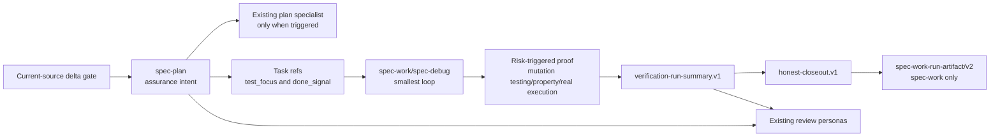

# Risk-Driven Assurance Integration - Plan

## Goal Capsule

- **Objective:** 将用户提供的 `old-coder` skill 中可复用的风险驱动验证机制，接入 spec-first 现有的 Spec → Plan → Tasks → Code → Review → Knowledge 证据链，提升高风险变更的证明质量，同时保持低风险任务的轻量路径。
- **Recommended approach:** 采用 `extend + compose`：把缺失规则直接集成到既有 Skill owner，并条件复用现有 skill-local plan agents 与 review personas；Trial 阶段不新增公共/注册型 `assurance-agent`，继续使用 `verification-profile.v1`、`verification-run-summary.v1`、`honest-closeout.v1` 和 `spec-work-run-artifact/v2`，不复制完整 skill、不新增第二套 Evidence artifact。
- **Decision focus:** 先区分“当前 source 已具备的能力”与“真实增量”，再决定 acceptance/failure → proof intent、mutation testing、changed-line coverage、equivalent-mutant、anti-gaming 和最终 closeout 应由哪个既有 owner 吸收；只有跨至少三个 workflow 的稳定语义无法由现有 owner 内聚承载时，才重新评估新 Agent。
- **Verification focus:** 检查风险到验证的可追溯性、最后一次 behavior-bearing source mutation 后的 fresh rerun、not-run/degraded claim ceiling、TDD 历史证据边界，以及多 workflow artifact ownership。
- **Largest risk:** 因忽略 current-source 已有能力而重复改写多个 Skill、重造已有 Contract Reset Trial substrate，或把尚未产生的 treatment patch/hash 伪装成 U0 已冻结事实；另一个高成本错误是为了“完整集成”新建没有独立 context/evidence consumer 的 Agent。其次才是把 assurance posture、mutation-testing/property 等机制误变成固定仪式，或引入 `EVIDENCE.md` / `gauntlet.sh` 造成第二事实源。
- **Authority:** Product Contract 继续拥有 WHAT；`spec-plan` 拥有 assurance 语义与验证设计；`spec-work`、`spec-debug` 和 `spec-code-review` 只对真实执行结果作结构化记录；脚本只准备事实和校验确定性不变量。
- **Stop conditions:** 发现需要改变产品 acceptance、source/runtime ownership、commit/landing 授权边界，或需要在本计划明确的 duplicate-check-id validation hardening 之外改变公共 artifact schema/语义、增加通用 workflow/注册型 Agent 时，停止当前实现并返回 `spec-plan` 重新规划；任何 owner 的 focused delta gate 证明现有 source 已满足要求时，该单元转为 verification-only，不为制造 diff 而继续改 prose。
- **Tail ownership:** 后续 `spec-work` 负责实现、review follow-up、最终 verification、honest closeout 和可选的 `spec-work-run-artifact/v2`；本计划本身不授权实现、测试、commit 或 landing。

---

## Product Contract

### Summary

spec-first 已经拥有大部分基础能力：`spec-prd` 能表达 exception、permission、negative space 与 acceptance trace；`spec-work` 已拥有 smallest loop、risk-first、proof/characterization、observed RED 边界、property/fuzz、真实链路、replacement evidence 与最终 fresh verification；`spec-debug` 已区分 reproducer、regression 与 broader checks；`spec-code-review` 已有 testing、reliability、adversarial 等条件 persona。`old-coder` 的真正增量不是再造这些能力，而是把它们收敛成更明确的 risk-to-proof trace，并补齐 mutation testing、changed-line coverage、equivalent-mutant、anti-gaming 与结构化证据 identity 的少数缺口。

本计划只吸收这些可迁移的判断机制。它不把外部 skill 的命名、目录、shell 编排、Git checkpoint 或依赖安装流程当作 spec-first contract。

### Problem Frame

当前链路可以记录“执行了哪些 check”，也能阻止自然语言把未执行的命令声称为 passed，但仍缺少三个清晰连接点：计划期如何表达最大未证实风险及 `acceptance/failure → proof intent`；执行期如何把 mutation testing 与普通 source mutation 区分，并处理 changed-line coverage、equivalent mutant、pre-existing failing baseline 和 anti-gaming；review 如何稳定消费 plan/run evidence 而不重复建报告。结果可能是高风险变更仍采用过窄证据，也可能是已有能力被重复建设，增加 Skill/Agent carrying cost。

目标不是提高测试数量，而是提高 `claim → evidence` 的匹配度和可复用性。

### Requirements

#### Assurance policy

- R1. `spec-plan` 必须为触发高风险或跨层行为的计划记录 assurance posture 的判断、适用理由和最大未证实风险。
- R2. assurance posture 必须将每个重要 failure mode 或 acceptance group 映射到一个或多个 verification intent，并明确哪些 check 是 required、optional、not applicable 或 deferred。
- R3. posture 只作为 LLM/人工语义判断的轻量词汇（推荐 `lightweight`、`standard`、`high-assurance`），不得作为脚本关键词分类器、强制有限状态机或新的 schema enum。

#### Execution evidence

- R4. `spec-work` 必须在第一个 behavior-bearing source mutation 前选择最小 feedback loop，并在适用时保留 observed RED 或 characterization evidence；没有 run-local RED 不能声称 TDD 历史。
- R5. 对计划声明 required 的 mutation-testing、property、changed-line coverage、hostile-input、regression-reproducer 或 real-execution intent，只有在绑定真实非空 command 后，执行结果才进入现有 `verification-run-summary.v1`；bounded provider invocation 也必须提供可回源的非空 canonical command identity。尚未绑定可执行入口时必须保留为 plan/task limitation；不得用占位 command 伪造 `not-run`、`degraded` 或 `passed` check。
- R6. 最后一次 behavior-bearing source mutation、simplify 或 review-fix 后，必须对受影响的 Verification Contract 重新执行；旧的绿色结果不能充当最终树证据。
- R7. `honest-closeout.v1` 的 validation claim 只能引用真实记录的 `verification-run-summary:<check-id>`；provider readiness、自然语言声明和历史 transcript 不能提升 claim。

#### Consumer and boundary

- R8. `spec-prd` 负责可观察的正面、负面、错误和边界 acceptance，但不负责工具安装、测试命令、Git checkpoint 或 commit 授权。
- R9. `spec-write-tasks` 必须在现有 `requirement_refs`、`test_focus`、`done_signal` 和 `review_gate` 中保留 acceptance → unit/task → validation 的追踪，不新增平行 task schema，除非实际 consumer 证明现有字段不足。
- R10. `spec-code-review` 必须审查 assurance contract 是否兑现，并区分 review judgment、run-local RED evidence 和真实 command evidence；不得从最终绿测反推开发历史。
- R11. `spec-debug` 必须将 original reproducer、regression test 和 broader verification 分开记录；高风险 bug 可以触发 hostile-input 或 mutation testing，但不写 `spec-work-run-artifact/v2`。
- R12. `spec-test-browser`、`spec-test-xcode` 等真实执行 provider 只返回带 provenance、freshness 和 limitation 的 evidence，由 caller 写入自己的 run summary；provider 内部实现不成为 workflow contract。
- R13. 不创建新的公共 `spec-assurance` workflow、第二套 `EVIDENCE.md`、通用 `gauntlet.sh`、全局强制 mutation-testing/property 流程或新的中心状态机。
- R14. SPEC 批准、工具安装、source mutation、commit 和 landing 必须保持分离授权；任何集成不得把其中一个授权推导成另一个。
- R15. 同一份 `verification-run-summary.v1` 中的 check id 必须全局唯一；producer validator 必须在持久化前拒绝重复 id，`honest-closeout` 必须在构造 id map 前重复校验，防止后项静默覆盖前项。
- R16. 本次新增的 assurance check producer 必须使用 `<owner>.<intent>[.<scope>]` 命名约定；现有 v1 summary 中 `typecheck`、`unit` 等 legacy 非命名空间 id 继续可读，不新增全局格式拒绝或 schema version 变化。
- R17. Trial 阶段不得新增公共、注册型或跨宿主投射的 `assurance-agent`；计划期复用既有 `architecture-strategist`、`security-sentinel`、`data-integrity-guardian`、`performance-oracle`、`deployment-verification-agent`，审查期复用既有 `testing-reviewer`、`reliability-reviewer`、`adversarial-reviewer`。只有 Agent Reevaluation Gate 全部通过时才允许另立计划评估新 Agent。
- R18. 每个 owner 变更前必须执行 current-source delta gate：用 source、focused contract/eval 和真实 consumer 证明缺口；能力已满足时可补 focused regression test/fixture 或记录 no-change decision，但不得改写已充分的 owner behavior/contract prose 来制造 diff。

### Actors and Responsibilities

- A1. Product owner / current user：确认 WHAT、可观察 acceptance、产品风险和不可逆取舍。
- A2. `spec-plan`：根据当前 source 和 Product Contract 判断 assurance posture，建立 failure model 和 Verification Contract；按既有 deepening trigger 条件复用 skill-local specialist，不新增 assurance 调度层。
- A3. `spec-work` / `spec-debug`：执行最小 feedback loop、收集真实结果、控制 claim ceiling，并在最终 behavior-bearing source mutation 后 fresh rerun。
- A4. `spec-code-review`：由现有 testing/reliability/adversarial 及其他条件 persona 审查 diff、计划约束和已有 evidence，报告缺口，不拥有行为实现、第二份 Evidence report 或 commit。
- A5. Script / CLI helpers：解析 profile、记录 command/exit code/path/hash、校验 schema、生成 reason_code；不决定语义充分性。
- A6. Real-execution providers：提供 browser、iOS 或其他真实环境的 bounded evidence；不能自称已证明 caller 的整体完成。

### Acceptance Examples

- AE1. **Low-risk path remains light**
  - **Given:** 一个局部文案或机械重命名任务，没有行为变化、风险触发或 load-bearing acceptance。
  - **When:** `spec-plan` 或 `spec-work` 选择轻量路径。
  - **Then:** 不强制 mutation-testing/property/full-suite；执行最窄已知 check，并保留 claim ceiling。

- AE2. **High-risk plan is traceable**
  - **Given:** 计划涉及认证、隐私、迁移、外部 RPC、并发、持久化或 rollout。
  - **When:** `spec-plan` 完成 Planning Contract。
  - **Then:** 文档包含适用的 invariant、failure mode、rollback/compensation、observability 和 `failure/acceptance → verification intent` 映射；缺失 load-bearing 信息时 readiness 不提升为 implementation-ready。

- AE3. **Final-tree freshness**
  - **Given:** 初始检查通过，随后 simplify 或 review-fix 改变了行为代码或测试相关 source。
  - **When:** `spec-work` 进入 closeout。
  - **Then:** 重新运行受影响的 required checks，新的 summary 和 fingerprint 只在最后一次 behavior-bearing source mutation 后生成；旧 summary 不能被复用。

- AE4. **Honest degraded evidence**
  - **Given:** required real-execution、mutation-testing 或 property intent 已绑定非空 canonical command/provider identity，但对应工具缺失或环境无法运行。
  - **When:** caller 记录 verification result。
  - **Then:** summary 使用 `not-run` / `degraded` 和具体 reason_code、missing_tools 与 limitation；closeout 不声称 validation verified。尚未绑定 identity 的 intent 只能保留在 plan/task limitation，不能进入 summary。

- AE5. **No fabricated TDD history**
  - **Given:** 最终 diff 中同时存在实现和绿色测试，但 run-local 没有 production source mutation 前的 observed RED。
  - **When:** review 或 closeout 判断开发过程。
  - **Then:** 可以声称“当前测试通过”，但不能声称“已执行 RED/GREEN/TDD 历史”。

- AE6. **Debug chain is separate**
  - **Given:** 一个可复现回归需要修复。
  - **When:** `spec-debug` 完成 fix handoff。
  - **Then:** 输出分别引用 original reproducer、regression test 和 broader checks；不会伪造 `spec-work-run-artifact/v2`。

- AE7. **Review consumes, not duplicates**
  - **Given:** `spec-code-review` 收到 implementation-ready plan 和 `spec-work` run summary。
  - **When:** review 判断 verification gap。
  - **Then:** review 只报告具体缺口或引用已存在 evidence，不自行建立第二份 Evidence report，也不从最终绿测推断 RED 历史。

- AE8. **Provider boundary is explicit**
  - **Given:** browser 或 Xcode provider 因环境限制只能运行一部分路径。
  - **When:** 结果返回 caller。
  - **Then:** caller 记录 provider provenance、freshness 和 limitation；缺少 provider 不会被描述为完整 real execution。

- AE9. **Authorization stays orthogonal**
  - **Given:** 用户批准了 SPEC 或 implementation plan，但没有批准依赖安装、commit 或 landing。
  - **When:** 执行 assurance workflow。
  - **Then:** 只执行已授权的 planning/verification 范围，不能从 plan、绿测或 checkpoint 自动推导其他副作用授权。

- AE10. **Unbound intent is not a synthetic check**
  - **Given:** 计划要求 property 或 real-execution proof，但目标 repo 还没有真实 command 或 provider invocation。
  - **When:** `spec-work` 准备 verification summary。
  - **Then:** 该 intent 留在 plan/task limitation，并阻断相应 verified claim；summary 不写占位 command，也不生成虚假的 not-run check。

- AE11. **Duplicate check identity fails closed**
  - **Given:** 两个 owner 或两个执行步骤准备写入相同 check id。
  - **When:** summary validator 或 honest closeout 读取该 artifact。
  - **Then:** validator 返回确定性 duplicate-id reason，closeout 不构造有损 map，也不接受后项覆盖前项。

- AE12. **Legacy check identity remains readable**
  - **Given:** 一个现有合法 `verification-run-summary.v1` 使用 `typecheck`、`unit` 等非命名空间 id，且 id 在该 summary 中唯一。
  - **When:** producer/read/closeout compatibility tests 读取该 artifact。
  - **Then:** artifact 继续可读；只有本次新增 assurance producer 被要求输出命名空间 id，validator 不把命名约定升级为全局格式 gate。

- AE13. **Existing specialists are reused without a new agent**
  - **Given:** 一个高风险计划涉及 auth、migration、performance 或 rollout，且 review 需要测试强度、可靠性或 false-green 视角。
  - **When:** plan deepening 与 code review 选择 assurance lens。
  - **Then:** 只按既有 trigger 选择对应 skill-local agent/persona，并向其提供当前 plan section 与 run evidence；六宿主 source/runtime catalog 不出现新的公共 `assurance-agent`。

- AE14. **Current-source delta prevents redundant edits**
  - **Given:** focused source read 与 contract/eval 已证明 `spec-prd`、`spec-debug`、`spec-test-browser`、`spec-lfg` 或 `spec-simplify-code` 已满足目标能力。
  - **When:** 对应实施单元启动。
  - **Then:** 单元记录 `already-satisfied` 与回归证据后结束，或只修复已证明的窄缺口；不得为了覆盖实施清单而改写已充分的 source。

- AE15. **Worker readiness fails before integration edits**
  - **Given:** Trial runner 能 prepare job packets，但当前 caller/host 不能完成 blinded worker output、独立 adjudication 或有效 session receipt。
  - **When:** U0 执行 preflight finalize。
  - **Then:** runner 写入 immutable preflight terminal-defer report，列出 reason、preflight hash、未执行单元、common-safety disposition 与 limitations，然后直接进入 U8；U1/U2/U5 behavior source 不被修改，也不新增 spec-first central dispatch。

- AE16. **Adoption selects an exact patch set**
  - **Given:** `B-diagnostic`、`C-core` 与已激活 additive sub-arm 的 safety、benefit、cost 结果不同，或组合后出现 interaction regression。
  - **When:** Gate A/final runner 应用预注册的 verdict precedence、noise、tie 与 interaction 规则。
  - **Then:** `B-diagnostic` 永不成为交付 arm；report 必须输出 `selected_arm: C-core | none`、`retained_additive_units`、精确 `retained_units` / `reverted_units`，并单列 U0 common safety/control-plane 的保留决定。

### Scope Boundaries

#### In scope

- `spec-plan` assurance posture、最大未证实风险、failure model、failure/acceptance → proof intent 映射和既有 specialist 复用。
- `spec-work` 中 mutation testing、changed-line coverage、equivalent-mutant、pre-existing baseline、anti-gaming、按风险选择的 verification checks 与 fresh rerun 语义。
- task/review 对 plan assurance trace 与真实 run evidence 的消费。
- `verification-run-summary.v1` duplicate check id 的确定性 fail-closed hardening。
- 复用/抽取现有 maintainer-eval safety primitives、caller-owned worker/session receipt contract、可复算的 balanced Trial 与 run-local Agent counterfactual。
- `spec-prd`、`spec-debug`、browser、Xcode、simplify、LFG 的 current-source delta 验证；只有 focused evidence 证明缺口时才定向修改。
- focused contract tests、skill eval fixtures、fresh-source eval 和代表性任务对照实验。

#### Out of scope

- 自动安装依赖、自动初始化 Git、自动创建 checkpoint commit 或修改默认分支。
- 统一替换宿主的 test runner、mutation-testing framework、property framework 或 browser/iOS provider。
- 机器根据文件名、关键词、金额或 skill 路由自动决定风险等级。
- 让脚本判定 acceptance 是否语义充分，或让 LLM 伪造 command/exit code/log。
- 新增公共/注册型 `assurance-agent`、Agent catalog/governance entry 或六宿主 runtime agent projection。
- 新增 central worker dispatcher、host primitive mapping、模型调用 CLI 或把 Trial runner 变成 agent runtime。
- 将 `spec-runtime-setup` 扩展为目标项目语言测试、mutation-testing、property 或 coverage 工具链安装器。
- 直接修改 `.claude/`、`.codex/`、`.agents/skills/`、`.cursor/`、`.kiro/`、`.qoder/`、`.opencode/` generated runtime。

#### Deferred for later

- 只有当代表性任务证明 acceptance-to-check trace 需要机械校验，才评估 additive schema field 或专门 contract；在此前不扩 `verification-profile.v1`、`verification-run-summary.v1` 或 `honest-closeout.v1`。
- 只有当真实采纳数据证明默认路径需要统一 assurance CLI，才重新评估是否构建独立命令；当前保留为 experiment candidate。
- 只有同一 assurance 语义在至少三个 workflow 重复实现、现有 owner 无法内聚吸收、隔离上下文能显著提高 false-pass 检出、输入输出与 consumer 稳定、且六宿主治理成本低于增益时，才另立计划重新评估新 Agent。

---

## Planning Contract

### Five-Lens Decision Record

#### 第一重审视：定义关键问题与领域

问题不只是“old-coder 能否复制进 spec-first”，也不只是“新建 Agent 还是修改 Skill”，而是“哪些能力在当前 source 中已经成立、哪些是真实缺口、缺口应由哪个既有 owner 内聚吸收，以及何时独立上下文才值得承担一个新 Agent 的长期治理成本”。领域包括模块化与信息隐藏、风险驱动软件工程、测试与遗留代码、可证伪性与 mutation testing、AI coding harness 治理、artifact contract 和跨宿主投影。

**这一重审视改变了什么：** 集成对象从一个外部 skill 变成一组可分配给既有 owner 的 proof capabilities；判断标准从“功能是否齐全”改为“是否关闭真实 claim-to-evidence 缺口、是否减少 false pass、是否避免重复 owner/Agent”。

#### 第二重审视：理论体系与关键矛盾

本计划使用四组会改变方案排序的成熟理论：

- **Parnas 的信息隐藏与 Ousterhout 的 deep module：** 能力应落到已经拥有相关 decision/evidence 的深边界中。一个只汇总其他 Skill 规则、没有独立 source、artifact 与 consumer 的 `assurance-agent` 是 shallow wrapper，会增加调度与漂移面。
- **Boehm Spiral Model：** 先处理最高风险与最大不确定性，用 U0 current-source/trace spike 和 Gate A 尽早证伪，而不是先横向修改所有 workflow。
- **Beck 的 TDD 与 Feathers 的 legacy seams/characterization：** RED 只在可观察新行为时成立；遗留行为先 characterization，不能从最终绿测反推开发历史，也不能为仪式重复造测试。
- **Popper 式可证伪性与 mutation testing 方法：** 好证据必须有可能让当前实现失败；coverage 只说明执行过，mutation-testing/equivalent-mutant/anti-gaming 用来检查断言是否真正约束行为，但不能替代 failure-specific proof 或真实执行。

主要矛盾不是“更强证明 vs 更高成本”这么宽泛，而是“跨阶段 assurance trace 需要一致语义”与“语义若集中成新 Agent 会制造第二 owner”之间的张力。当前主要方面是既有 Skill owner 已经足够深，缺的是少量连接与校验；次要矛盾才是 provider 可用性、TDD 历史、低风险成本和工具缺失。

**这一重审视改变了什么：** 方案从“横向新增 assurance 层”改为“Skill-first、risk-first、delta-first”；新 Agent 从默认候选降为需要额外证据才能重开的 deferred option。

#### 第三重审视：关键事实与综合架构

当前 source 事实显示：

- `skills/spec-work/references/feedback-and-tests.md` 已拥有 smallest loop、risk-first、proof/characterization、observed RED 边界、property/fuzz、真实跨层链路、replacement evidence 与 claim ceiling；`skills/spec-work/references/shipping-workflow.md` 已要求所有 tail source mutation 后执行最终 fresh verification。
- `skills/spec-debug/SKILL.md` 已区分 original reproducer、regression 与 broader checks，并要求尾部变更后复跑；`skills/spec-lfg/SKILL.md` 已在 simplify/review-fix 后重新调用 `spec-work` 并校验 final fingerprint。
- `skills/spec-prd/references/prd-readiness-lens.md` 已覆盖 exception、permission、negative-space、acceptance trace 与 readiness；`skills/spec-write-tasks` 已有 `requirement_refs`、`test_focus`、`done_signal`、`risk_note`、`review_gate`、`stop_if`。
- `skills/spec-plan/references/high-risk-plan-lens.md` 已拥有 high-risk trigger 和 `architecture-strategist`、`security-sentinel`、`data-integrity-guardian`、`performance-oracle`、`deployment-verification-agent` 等 specialist reuse；`skills/spec-code-review` 已有 `testing-reviewer`、`reliability-reviewer`、`adversarial-reviewer` 及其他条件 persona。
- `spec-test-browser` 已有较强 provenance/freshness/limitation contract；`spec-test-xcode` 的结果仍以自由 Markdown 为主，是需要 focused eval 才能确认的候选证据 envelope 缺口。
- `verification-run-summary.v1` 的 check id 能承载 risk-triggered intent，但当前 `src/cli/helpers/honest-closeout.js` 使用 `Map` 按 id 索引，producer/consumer 都未先拒绝重复 id，后项可静默覆盖前项。这是已确认的确定性缺口。

因此当前问题的综合架构是：计划 Skill 产生轻量 assurance intent，work/debug 执行并记录真实证据，task/review 消费 trace，现有 specialist 提供条件语义视角，summary/closeout 保持唯一事实链。新增 Agent 不会增加新的事实来源，只会重复调度。

**这一重审视改变了什么：** 实施范围从 U1–U6 全面 prose 改造收窄为：U0 先复用/抽取现有 Trial substrate、证明 worker receipt/readiness、跑完整 trace matrix 并独立 harden duplicate id；U1 只补计划 trace，U2 只补 mutation-testing 等窄增量，U5 接通 consumer linkage。PRD/debug/browser/LFG/simplify 默认 verification-only，Xcode 仅在 focused evidence 证明缺口时补强。

#### 第四重审视：反方压力与结论前提辩证分析

真实竞争方案有三种：A）复制 `old-coder` 为独立 workflow/Agent；B）直接集成到既有 Skill，并复用现有 persona；C）只保留外部参考，不做任何 source 变更。A 的最强论点是集中调度更易培训、审计和形成隔离的 adversarial context；C 的最强论点是当前 source 已覆盖大多数能力，继续改造可能只增加 prompt 长度和维护面。

基于当前事实，A 依赖五个尚未成立的前提：同一 assurance 语义已在至少三个 workflow 重复、现有 owner 无法吸收、隔离上下文明显提升 false-pass 检出、有稳定输入输出与真实 consumer、六宿主调度治理成本低于收益。C 则忽略了 plan-to-proof trace、mutation-testing 细节与 duplicate-id 的已确认缺口。B 依赖的关键前提是现有字段可无损承载 trace，且 caller-owned worker/adjudicator orchestration 真正可用；因此 U0 必须先完成多状态、多 task 的 trace matrix、blinded no-op receipt preflight，并只冻结 Trial definition。U1/U2/U5 形成真实 source patch 后，Gate A `prepare` 才能在任何 worker output 产生前原子封存 exact patch/tree hashes。若字段承载失败、worker preflight 不可用、`C-core` 无收益，或多个 owner 反复丢失同一语义，方案 terminal Defer/Rollback 并返回 schema/Agent reevaluation，而不是继续扩散 prose。Agent 选项则通过一个独立 immutable counterfactual run 取证，只要 `C-core` 产生可裁决输出即可运行，避免把“无 Agent arm”当作预设答案。

**这一重审视改变了什么：** 推荐明确为 B 的 Trial；同时吸收 C 的约束，要求每个单元先证明 current-source delta，并保留 A 的重开条件作为 Agent Reevaluation Gate，而不是永久禁止。

#### 第五重审视：全貌理解与可验证收束

完整闭环应为：



成功信号是 high-risk trace/false-pass resistance 提升且 low-risk carrying cost 受控；失败信号是新增 unsupported verified claim、trace 丢失、重复 Agent/runtime surface、或 source 已充分却仍产生大范围 prose diff。只有 Trial 通过，才讨论默认采用；只有 Agent Reevaluation Gate 通过，才讨论新 Agent。

**这一重审视改变了什么：** 收束从“完成所有 U1–U6 source 修改”改为“完成最小真实 delta，并用消融 Trial 证明增量价值”；no-change verification 也是合法完成结果。

### Capability Integration Decision Matrix

| `old-coder` capability | Current spec-first status | Decision | Owner and integration method | New Agent? |
| --- | --- | --- | --- | --- |
| Executable acceptance、negative/error/boundary examples | `spec-prd` 已覆盖 exception、permission、negative-space 与 acceptance trace | **Adopt / verify** | U4 先跑 focused PRD eval；只有可复现 gap 才改 `spec-prd` source | No |
| Failure model、highest-risk-first | high-risk lens 已有风险 trigger，但缺轻量 `largest unproven risk` 与 failure/acceptance → proof intent 的统一落点 | **Adapt** | U1 扩展 `spec-plan` 的 Planning/Verification Contract | Reuse existing plan specialists |
| RED → GREEN → REFACTOR | `spec-work` 已有 proof-first、observed RED、simplify 与复跑边界 | **Adopt / verify** | U2/U6 用 contract tests 守护，不复制固定循环 | No |
| Characterization / legacy seam | `spec-work` 已显式支持 characterization-first | **Adopt / verify** | 保持现有 owner；只补真实 regression case | No |
| Property/fuzz testing | smallest-loop 与 scenario guidance 已存在 | **Adapt narrowly** | U2 把它绑定到具体 invariant/failure mode，禁止默认启用 | No |
| Mutation testing | 当前 source 有“mutation”授权/写操作语义，也有零散测试强度概念，但缺 mutation-testing 专门规则 | **Adapt** | U2 明确术语、触发、real mutant、结果与 claim boundary | Testing/adversarial persona consume evidence |
| Changed-line coverage | 未形成风险触发、meaningful assertion 与 claim ceiling 的统一规则 | **Adapt** | U2 作为候选 proof intent；U5 testing reviewer 检查“触达不等于证明” | No |
| Equivalent-mutant classification | 当前无明确 owner 规则 | **Adapt** | U2 记录 survivor classification 与理由；禁止为 kill score 增加无意义测试 | No |
| Anti-gaming / false-green attack | testing 与 adversarial persona 已有 weak assertion、mock fidelity、silent-pass lens | **Compose** | U2 约束执行证据；U5 向现有 personas 传入 plan/run evidence | Reuse existing review personas |
| Pre-existing failing baseline / zero-new-failure | 已有 dirty-worktree/pre-existing finding 边界，但 test baseline 语义不完整 | **Adapt if trace spike supports it** | U2 在 run-local evidence 中分离 baseline failure 与 task-introduced failure；不顺手修 unrelated failures | No |
| Real execution | browser 已强；Xcode 以自由 Markdown 为主 | **Adopt browser / conditionally adapt Xcode** | U6 对 browser/LFG/simplify 做 regression-only；focused eval 证明后补 Xcode bounded evidence envelope | No |
| Final fresh run after last edit | shipping workflow、LFG、debug 已覆盖 | **Adopt / regression-only** | U2/U3/U6 守护 current behavior，不再重复发明 gauntlet tail | No |
| Reproducible evidence report | 已有 run summary、honest closeout、conditional work artifact | **Compose** | 继续使用现有 artifact chain，不创建 `EVIDENCE.md` | No |
| Balanced maintainer Trial、patch/hash/path/receipt safety | `spec-prd` Contract Reset eval 已拥有大部分通用 substrate，但不负责 risk-assurance domain/scoring | **Reuse / extract narrowly** | U0 先复用或抽取共享 primitive；risk runner 只保留 domain definition、run-manifest sealing 与 phase routing，caller-owned worker execution | No central dispatcher |
| One universal `gauntlet.sh` | 与项目原生 profile/provider 和轻量路径冲突 | **Reject** | 目标 repo 使用已有命令/profile；无绑定时保持 limitation | No |
| SPEC approval authorizes install/source mutation/commit | 与事实、判断、授权分离冲突 | **Reject** | 安装、source mutation、commit、landing 分别授权 | No |
| Auto-install language test/mutation-testing toolchain | 超出 harness runtime readiness owner | **Reject** | `spec-runtime-setup` 不承担目标项目工具链安装 | No |
| Default checkpoint commits | 与 caller-owned commit/landing boundary 冲突 | **Reject** | 继续由 `spec-work` / landing workflow 按独立授权处理 | No |

### Agent Integration Decision

**Decision: direct Skill integration first; reuse existing skill-local agents/personas; no new registered Agent during Trial.**

- 计划期由 `spec-plan` 拥有 assurance intent，并按现有 trigger 选择 `architecture-strategist`、`security-sentinel`、`data-integrity-guardian`、`performance-oracle` 或 `deployment-verification-agent`；这些 prompt assets 提供领域视角，不成为第二个 plan owner。
- 审查期由 `testing-reviewer` 检查 proof quality/changed-line coverage/mutation-testing evidence，`reliability-reviewer` 检查 failure/recovery/baseline，`adversarial-reviewer` 检查 anti-gaming 与 green-while-red；它们消费 plan section 与 run summary，不重新执行或伪造 evidence。
- U7 的独立语义评分使用 run-local generic adjudicator 或 human adjudicator；额外的 `D-run-local-coordinator-counterfactual` 只用于测试“隔离 coordination 是否真有增益”。D 绑定冻结的 `C-core` source/tree hash，只要 `C-core` 有可裁决输出且 counterfactual budget 已单独授权即可运行，不以 `C-core` eligible 或已采用为前提。二者都不注册到 Agent catalog、不投射到 host runtime、不成为产品入口，也不能被选为交付 arm。
- 新 Agent 只有在五项条件全部成立时另立计划重新评估：至少三个 workflow 重复同一稳定语义；现有 owner 无法内聚吸收；D 相对所选 Skill arm 在同预算下产生超过噪声的 false-pass 检出增益；输入/输出/consumer 稳定；六宿主治理与投射成本低于增益。

### Current Investment Verdict

**Verdict: 当前值得做，但只值得做“独立安全修复 + 有预算上限的 Skill-first Trial”，不值得直接做完整默认集成或新增 Agent。**

- 值得立即验证的事实基础有两个：duplicate check id 是已确认的 fail-closed 缺口；plan-to-proof trace、mutation-testing 细节和 review evidence consumption 是现有 owner 中可被 focused case 证伪的窄增量。
- 不足以直接 Adopt 的原因也有两个：现有 source 已覆盖 `old-coder` 大多数基础能力，继续横向改写容易产生 carrying cost；当前没有真实 field benchmark，也没有证据证明独立 assurance Agent 的隔离上下文优于既有 Skill composition。
- 首笔投资上限是 U0、U1、U2、U5 与 Gate A。U0 preflight、trace carrier 或 Trial substrate 复用失败时写 terminal-defer report，不进入 behavior integration；Gate A 只以 `C-core = U1+U2+U5` 作为可交付核心，`B-diagnostic = U1+U2` 只做消融归因。`C-core` 不通过时不投入 U3/U4/U6 和 final Trial。
- Duplicate-id hardening 按独立安全测试决定保留，不被 Trial 收益稀释；其余集成必须由 `selected_arm` 和 exact retained/reverted units 决定，避免“方案看起来完整”替代价值证据。

### Key Technical Decisions

- KTD1. **Architecture posture = `extend + compose`, Skill-first.** `spec-plan` 和 `spec-work` 已分别拥有 planning 与 execution contract；新增机制落在既有 Skill owner、Verification Contract 和 artifacts 中，条件组合现有 prompt assets/personas。默认不新增 reference 文件；只有现有 owner 文件无法保持 deep boundary 时，才增加 owner-local progressive-disclosure reference，且不形成新 workflow/Agent owner。
- KTD2. **Assurance posture is semantic prose, not a schema enum.** 推荐用 `lightweight`、`standard`、`high-assurance` 描述验证姿态，但必须附理由、触发风险、claim ceiling 和降级条件。脚本不得根据 posture 自动决定命令集合。
- KTD3. **Failure model precedes check selection.** 先问“什么会坏、谁受影响、如何发现、如何恢复”，再选择 unit、integration、property、mutation testing、coverage 或真实执行。不能用 coverage 百分比替代 failure model。
- KTD4. **Separate uniqueness enforcement from producer naming.** `verification-run-summary.v1` 对所有 check 只新增“同一 summary 内 id 唯一”的确定性 gate，并由 producer/closeout 双层拒绝重复；`<owner>.<intent>[.<scope>]` 只是本次新增 assurance producer 的命名约定，例如 `spec-work.mutation-testing.auth-policy`、`spec-debug.regression-reproducer.issue-123`、`spec-test-browser.real-execution.checkout`。Legacy 非命名空间 v1 id 保持可读。没有真实非空 canonical command identity 时，该 intent 留在 plan/task limitation；provider/manual 路径不得创建占位 summary check。
- KTD5. **No automatic profile modification.** 第一阶段不把所有风险 check 添加到团队默认 profile；plan 的 Verification Contract 声明 required intent，执行时由目标 repo 已有 profile、明确命令或 bounded provider 提供事实。需要扩展默认 profile 时，另开明确的 profile/config 变更。
- KTD6. **Freshness after tail mutations is mandatory.** simplify、review fix、fixture change 或行为代码修改后，受影响 checks 必须重新执行，并生成新的 summary/fingerprint。
- KTD7. **Authorization remains orthogonal.** SPEC approval only confirms scope/WHAT；dependency install、source/test-file mutation、commit、push/landing 分别需要自己的 authorization。
- KTD8. **Evidence ownership remains asymmetric.** `verification-run-summary.v1` 是共享 command-result surface；`honest-closeout.v1` 是 validator output；只有 `spec-work` 可选写 `spec-work-run-artifact/v2`。debug/review 不得写该 artifact。
- KTD9. **Trial definition is frozen before edits; each run manifest is sealed before outputs.** U0 先固定 cases、logical arm composition、conditional activation、每 case/arm 至少三次 balanced repeats、逐项布尔/有限枚举评分、hard-safety 与 benefit item 分类、固定分母、跨 repeat 聚合、A/A quality/cost noise 公式、missing/tie/inconclusive 规则、verdict precedence、每 session 与 run-level time/token/turn ceiling、最多一次 balanced paired infrastructure retry、artifact 路径和 rerun contract。U1/U2/U5 或 conditional unit 形成真实 patch 后，对应 `prepare` 必须在任何 worker output 产生前原子写入 exact parent revision、patch/tree hashes、activated units、definition/preflight hash 与 schedule；run manifest 此后不可改写。20pp benefit 必须同时超过冻结公式算出的 baseline noise；实施结果只能触发预注册的 Adopt Trial / Defer / Rollback，不得事后改口径。脚本只验证 schedule、receipt、hash、预算和按冻结公式聚合；语义逐项评分由对 arm/version/预期方向 blind 的独立 fresh reviewer 或 human adjudicator 完成。
- KTD10. **Current-source delta gate precedes every owner behavior edit, including the Trial substrate.** U0 对 U1–U6 owner 和拟新增 runner/materialization/schedule/receipt owner 都形成 `already-satisfied | confirmed-gap | uncertain` 结论。`already-satisfied` 可新增或执行 focused regression test/fixture 并记录 receipt，但不得改写已充分的 owner behavior/contract prose；`uncertain` 先补 focused eval，不直接扩 prose 或另造 harness。
- KTD11. **No new assurance Agent during Trial.** 现有 plan specialists 与 review personas 足以承载交付路径；U7 adjudicator 与 coordinator counterfactual 都保持 run-local、非注册、不可被选为交付 arm。Agent Reevaluation Gate 通过前，不新增 Agent source、catalog、governance、projection 或公共调用入口。
- KTD12. **“Mutation” terminology is explicit.** `source mutation` / `behavior-bearing mutation` 表示文件或行为改动；`mutation testing` / `mutant` 表示用受控错误验证测试敏感度。计划、Skill、test 与 evidence 不得只写裸 `mutation` 让授权边界和测试方法混淆。
- KTD13. **Trial orchestration is caller-owned, receipt-bound and fact-complete.** Risk Trial runner 只负责 `prepare`、原子创建 run directory、生成 blinded job packets、`finalize` 与 schema/hash/path/score aggregation validation；它不调用模型、不选择宿主 primitive、不新增 CLI dispatch。授权的 caller/host 执行 worker 与 adjudicator，并回写绑定 run manifest/session/input/output 的 receipt。Receipt 必须携带 isolation probe、fresh-context/transcript ancestry、elapsed/token/agent-turn/tool-turn usage、paired retry、unnecessary-check judgment 和 direct-unblinding scan facts；runner 对缺失、重复、partial、over-budget 或 isolation/blindness 不成立的事实 fail closed。U0 无法完成一个端到端 blinded no-op receipt 时，Trial 在任何 U1/U2/U5 behavior source edit 前写 terminal-defer report。
- KTD14. **Control plane and common safety patches are not treatment.** U0 definition/runner/preflight/shared eval substrate 不进入任何 arm 的 model-visible treatment source。Duplicate-id hardening 若 focused safety tests 通过，则作为相同 common safety patch 应用于所有 run-local arms。`B-diagnostic = U1+U2` 只做消融且永不可选；`C-core = U1+U2+U5` 是唯一可交付核心。U3/U4/U6 以各自独立、预注册、可单独保留/回滚的 additive sub-arm 评估，最后只对 individually retained units 做一次组合 interaction run。最终 verdict 必须输出 `selected_arm`、`retained_additive_units`、`retained_units`、`reverted_units`，并单列 U0 control-plane、shared substrate 与 common safety patch 的独立保留规则。
- KTD15. **Safety floor and benefit score are separate.** Hard safety 只覆盖不可补偿的不变量，例如 unsupported verified claim、evidence/authorization/source-owner 伪造、run manifest/receipt 不可比和关键 trace 身份损坏；任何 violation 都淘汰对应 treatment。`trace_completeness`、`false_pass_detection` 与 owner-routing quality 使用预注册的 scored items 衡量增量，不能同时被 eligibility 要求饱和为 100%。这让 `C-core`、additive sub-arm 和 D 的增益分支保持可达，同时不把语义收益换成安全妥协。
- KTD16. **Agent counterfactual is a separate immutable experiment.** D 使用独立 `counterfactual` run/report，引用 `C-core` source/tree hash、上游 Gate A/final report hash、单独 authorization、冻结 prompt/cases 与同预算约束。只要 `C-core` 有可裁决输出即可运行；D 不能成为 `selected_arm`，也不得回写已封存的 Gate A/final report。直接 marker leakage 使 session invalid；内容风格导致的间接推断保留为限制。

### Trial Interface Contracts

| Artifact | Owner / producer | Required contract | Consumer and compatibility |
| --- | --- | --- | --- |
| `risk-driven-assurance-trial-definition/v1` | U0 canonical source at `skills/spec-plan/evals/risk-driven-assurance-trial.json` | Cases、logical arm composition、conditional activation rules、hard-safety items、scored benefit items、`repeats_per_arm >= 3`、balanced-order template、invocation/resource/retry ceilings、quality/cost noise formulas、missing/tie/inconclusive rules、verdict precedence、counterfactual prompt/cases hash、baseline Agent inventory hash | Thin Trial runner and human owner. Definition is frozen before U1/U2/U5 edits but intentionally contains no future treatment patch/tree hashes. It is additive and does not change public workflow or verification schemas. |
| `risk-driven-assurance-preflight-report/v1` | U0 runner after blinded no-op receipt validation | Definition hash、preflight input/output/receipt hashes、worker/adjudicator capability facts、A/A quality and `aa_cost_noise_pct` calibration、isolation/blindness result、status/reason_code/limitations、common-safety disposition、`not_started_units`、exact retained/reverted units | Gate A `prepare` and U8. `passed` permits treatment authoring; `terminal-defer` is an immutable terminal artifact that routes directly to U8 without U1/U2/U5 behavior edits. |
| `risk-driven-assurance-run-manifest/v1` | `prepare` for Gate A、final、interaction or counterfactual run | Definition/preflight hash、phase、exact parent revision、common-safety patch、active logical arms、activated units、patch chain/file hashes、per-arm tree hashes、expanded balanced schedule、opaque session ids、budgets and paired-retry groups | Caller-owned orchestration and `finalize`. It is created only after the relevant source patches exist and before any worker output; atomic write-once semantics prohibit later treatment or schedule changes. |
| `risk-driven-assurance-session-receipt/v1` | Caller-owned worker/adjudicator orchestration | Run-manifest/session/input/output hashes；phase、case/arm/repeat/order/session/namespace；host/model/tool facts；`execution_facts` for isolation primitive/status/exact denial probes、fresh-context/transcript ancestry、elapsed/token/agent-turn/tool-turn usage、retry attempt/paired group、unnecessary-check count/provenance；status/reason_code/limitations；adjudicator identity/independence/blindness；direct-unblinding scan hash/result；per-item boolean/finite-enum judgments and refs/hashes | Trial runner `finalize` validates exact schedule binding、path confinement、hashes、fresh/isolation/blindness facts、budget/retry consistency、missing/tie handling and score completeness. Missing、duplicate、partial、over-budget or failed isolation/direct-unblinding facts yield invalid/inconclusive, never semantic success. |
| `risk-driven-assurance-trial-report/v1` | Gate A/final/interaction runner after receipt validation | Run-manifest hash、structural failures、quality/cost noise、hard-safety outcomes、benefit/cost metrics、`surviving_arms`、`eliminated_arms` with exact patch identities、phase/verdict、`selected_arm` value `C-core` or `none`、`retained_additive_units`、exact retained/reverted units、limitations、invalidation condition | U8 and human owner. `B-diagnostic` cannot be selected. Final runs consume only Gate A survivors; interaction failure conservatively drops all additive units and retains only an eligible `C-core`. Report cannot claim field outcome or register an Agent. |
| `risk-driven-assurance-counterfactual-report/v1` | Separate D runner after a valid `C-core` output and separate authorization | Upstream Gate A/final report hash、`C-core` source/tree hash、authorization ref、definition/prompt/cases hash、same-budget schedule、session receipts、benefit/cost/noise result、Agent Reevaluation Gate outcome、limitations | U8 and a future separate Agent plan. It never mutates the upstream report、cannot become `selected_arm` and cannot create Agent source/catalog/runtime projection. |

Runner lifecycle is explicit:

```text
U0 definition -> preflight prepare -> caller-owned no-op worker/adjudicators -> preflight finalize
preflight pass -> U1/U2/U5 -> Gate A prepare seals run manifest -> receipts -> finalize
Gate A pass -> independent additive sub-arms -> combined interaction run -> final report
valid C-core output + separate authorization -> independent counterfactual run/report
```

Every `prepare` creates a new private run directory and fails if it already exists. Preflight evidence lives under `docs/validation/risk-driven-assurance/preflight/`; formal and counterfactual runs reference its immutable hash and never reuse or pre-create another run id. Direct arm/version/path markers are mechanically scanned and invalidate a blinded session when exposed. Semantic inference from treatment-specific wording cannot be fully excluded and remains an explicit limitation on counterfactual claims.

### Assurance Posture Contract

在 `spec-plan` 的 Planning Contract 中增加以下语义段落，保持自由文本但要求字段完整：

```text
Assurance posture: <lightweight | standard | high-assurance, or explicit equivalent>
Why this posture: <risk, ambiguity, irreversibility, impact surface, and rollback facts>
Largest unproven risk: <the highest-loss assumption that current evidence does not establish>
Failure model: <failure mode -> affected actor/surface -> detection -> recovery>
Required proof: <acceptance/failure group -> verification intent/check id>
Optional proof: <useful but non-blocking checks>
Deferred proof: <proof intentionally postponed -> owner -> activation or reevaluation condition>
Not applicable: <checks considered and rejected with reason>
Degraded path: <missing tool/environment -> reason_code -> claim ceiling>
Freshness rule: <what must rerun after implementation/review/simplify source mutation>
```

该段落不是新的机器 schema。若某字段会改变 Product Contract、权限、不可逆风险或 implementation-ready readiness，必须把问题返回 owner；不能用“假设”掩盖 load-bearing gap。

### Risk-to-Verification Matrix

| Risk signal | Required planning decisions | Typical verification intents | Claim ceiling when unavailable |
| --- | --- | --- | --- |
| Auth, permission, privacy, credentials | Actor, enforcement point, deny behavior, audit/privacy boundary | focused deny-path, integration/real-execution, hostile-input where abuse surface exists | Cannot claim permission path verified from unit tests that bypass enforcement |
| Money, ledger, irreversible write | Invariant, idempotency, audit trail, compensation/rollback | invariant/property, duplicate/retry, migration or integration proof | Cannot claim financial or irreversible safety from happy-path unit tests |
| External RPC, webhook, queue, retry | Contract, dedupe, ordering, final failure/manual recovery | contract/integration, failure injection, property or real provider check | Cannot claim end-to-end delivery from mocked caller only |
| Migration, backfill, schema evolution | Compatibility window, backup/rollback, verification query | migration dry-run plus executable verification query, rollback/restore proof | Dry-run alone is not production migration proof |
| Concurrency, cancellation, partial completion | Allowed transitions, terminal/dead states, cleanup | race/property, cancellation, repeated execution, system-wide check | Cannot claim no orphan/duplicate effects without observable state proof |
| UI/browser/mobile runtime | Key states, responsive/a11y contract, provider fidelity | browser or Xcode real execution with screenshot/console/a11y or simulator evidence | Code-level checks only support bounded code claim |
| Local low-risk change | Scope and observable diff | narrow unit/help/schema/diff check | No need to manufacture mutation-testing/property evidence |

The matrix is a semantic calibration aid. It is not a script-owned classifier and does not force every row for every task.

### Ownership and Integration Map

| Surface | Current source decision | Source owner | Integration | Does not own |
| --- | --- | --- | --- | --- |
| Product acceptance | likely already satisfied; prove with U4 delta gate | `skills/spec-prd/SKILL.md` and references | Keep current exception/negative-space/trace behavior; change only on a failing focused case | HOW, commands, installs, commits |
| Assurance design | confirmed narrow gap | `skills/spec-plan/SKILL.md`, `skills/spec-plan/references/high-risk-plan-lens.md` | Add posture, largest unproven risk and failure/acceptance → proof mapping; reuse existing plan specialists | Runtime execution and command result |
| Feedback loop | core loop exists; confirmed mutation-testing detail gap | `skills/spec-work/references/feedback-and-tests.md` and `skills/spec-work/SKILL.md` | Add mutation-testing terminology/trigger, changed-line coverage, equivalent-mutant, baseline and anti-gaming calibration | Product scope, shipping authorization |
| Bug loop | likely already satisfied; prove with U3 delta gate | `skills/spec-debug/SKILL.md` and references | Preserve reproducer/regression/broader evidence; modify only on a failing focused contract | `spec-work-run-artifact/v2` |
| Task projection | existing fields likely sufficient; prove lossless trace in U0/U5 | `skills/spec-write-tasks/SKILL.md`, `skills/spec-write-tasks/references/task-pack-schema.md` | Reuse `requirement_refs`, `test_focus`, `done_signal`, `risk_note`, `review_gate`, `stop_if`; no parallel schema | New source of requirements |
| Review | confirmed consumer-link gap | `skills/spec-code-review/SKILL.md`, existing testing/reliability/adversarial personas | Feed live assurance section and run evidence to existing personas; add no assurance persona | TDD history inference, implementation fixes |
| Real execution | browser strong; Xcode candidate gap | `skills/spec-test-browser/SKILL.md`, `skills/spec-test-xcode/SKILL.md` | Browser regression-only; Xcode gets bounded evidence envelope only if focused eval confirms gap | Overall completion claim |
| Simplification | already satisfied | `skills/spec-simplify-code/SKILL.md` | Regression-test behavior-proof preservation only | Behavior correctness and acceptance changes |
| Orchestration | already satisfied | `skills/spec-lfg/SKILL.md` | Regression-test final `spec-work` re-entry/fingerprint after review/fix | Duplicate gauntlet implementation |
| Trial control plane | existing Contract Reset substrate is substantial; risk-domain/worker interface gap confirmed | existing `skills/spec-prd/evals/**`, conditional shared `scripts/lib/maintainer-eval.cjs`, thin risk runner | Reuse/extract schedule/materialization/path/hash/receipt safety; caller-owned workers; prepare/finalize only | Model dispatch、semantic scoring、treatment source |
| Evidence contracts | duplicate-id gap confirmed | `docs/contracts/verification/**`, `docs/contracts/workflows/**`, existing helpers | Reuse schemas; producer and closeout consumer fail closed on duplicates while unique legacy ids remain readable | New parallel Evidence artifact or global id-format gate |
| Agent/persona catalog | existing assets sufficient | existing owner-local prompt assets | Reuse conditionally; verify no new catalog/governance/projection entry | A second assurance owner |

### Detailed Integration Rules

#### `spec-prd`

Current source 已要求 observable outcome、exception/permission、negative acceptance、negative-space 与 traceability。U4 先用一个缺失 deny/error/boundary 的 PRD fixture 和一个已充分 fixture 证明行为：若 checker/eval 已正确阻断前者且接受后者，记录 `already-satisfied`，不改 source；只有可复现 false-ready gap 才定向修复。PRD 继续只表达“denied actor sees X”或“duplicate request has one durable effect”等 WHAT，`spec-plan` 决定具体 proof intent。

#### `spec-plan`

At planning time, inspect current source and the high-risk lens. Add the assurance posture contract, largest unproven risk, failure model, deferred proof and mapping to Verification Contract. Use the existing specialist selection only when its domain trigger fires; specialists return judgments into the same plan and do not create another artifact owner. The plan must state why a stronger check is not applicable when a reviewer could reasonably expect it. A missing command is a limitation to be handed to `spec-work`; until a real executable command or bounded provider invocation is bound, it must not be serialized as a synthetic run-summary check.

Do not encode posture as frontmatter, a finite enum, or an automatic route. The existing `artifact_readiness` still answers whether the plan is executable; assurance posture answers how the plan should be proven.

#### `spec-write-tasks`

Keep the existing machine-readable `Task Pack Contract` authoritative. U0/U5 first prove that `requirement_refs`、`test_focus`、`done_signal`、`risk_note`、`review_gate` 与 `stop_if` can carry the assurance trace. Only a demonstrated loss becomes a source change; otherwise task generation is verification-only.

If a task cannot be mapped to an acceptance or verification signal, set `stop_if` to return to plan/task regeneration rather than inventing scope.

#### `spec-work`

Before a behavior-bearing source mutation, choose the smallest loop from `feedback-and-tests.md`. For high-assurance posture, use risk-first or proof-first when the highest-loss assumption can be falsified cheaply. Select property/fuzz、changed-line coverage、mutation testing 或 real execution only when the failure model gives them a purpose. “Mutation testing”必须写全称；它不授权 source mutation，也不自动要求安装工具。

Mutation-testing evidence must name the changed/risk-bearing scope、real mutant command or persisted bounded manual runner、non-empty canonical command identity、killed/survived/error result、survivor classification and limitations. A manual/provider result without that identity stays a limitation outside `verification-run-summary.v1`. Equivalent mutants require a semantic reason; they do not count as killed and must not trigger meaningless tests. Changed-line coverage identifies unexecuted new paths but cannot by itself prove assertions are meaningful. Pre-existing failing checks are captured before task-owned change when they affect final interpretation; completion requires no task-introduced regression and an explicit claim ceiling, not unrelated cleanup.

After every implementation、simplify or review-fix source mutation that can affect the claim, rerun affected checks. The final summary must contain only real commands/provider invocations handled by the summary contract and reject duplicate ids before closeout; newly added assurance producers use namespaced ids while unique legacy ids remain compatible. The final fingerprint must be captured after those checks.

#### `spec-debug`

Current source already separates original reproducer、regression test 与 broader checks。U3 begins with a focused contract/eval; only if it demonstrates trace loss, stale-tail acceptance, or an unbounded replacement-evidence claim may the source change. Mutation testing/property remains a high-risk escalation, never a universal debug ritual.

#### `spec-code-review`

Reviewers read the plan's Assurance Posture/Verification Contract and current run evidence through the existing live-plan/verification-evidence channels. `testing-reviewer` challenges weak assertions、meaningless changed-line coverage、mutation-testing survivors/equivalent claims；`reliability-reviewer` challenges failure/recovery/baseline gaps；`adversarial-reviewer` attacks anti-gaming and green-while-red mechanisms. Findings say which claim is unsupported, which evidence is missing/stale, and which owner should close it. Review remains report-only and cannot manufacture RED、command result 或第二份 Evidence report。

#### Providers and orchestration

`spec-test-browser`、`spec-lfg` 与 `spec-simplify-code` first receive regression-only checks because current source already carries bounded browser evidence and final-tail rerun semantics. `spec-test-xcode` receives a focused current-source eval; if confirmed, add a bounded result envelope containing provider/tool identity、non-empty canonical command identity、project/scheme/simulator、source revision/fingerprint、observed screens/actions、artifact refs、timestamp/freshness、limitations 与 PASS/FAIL/PARTIAL claim ceiling. Without canonical command identity, the provider result remains caller-visible evidence/limitation but cannot enter `verification-run-summary.v1`. Xcode remains user-invoked and never becomes a universal high-assurance dependency.

#### `spec-runtime-setup`

No integration change. It remains responsible for harness/provider readiness, not target-project test, mutation-testing, property-testing or coverage toolchain installation. A missing target-project tool is a plan/work limitation and separate install authorization, not a Runtime Setup repair.

#### Trial control plane

U0 first compares the proposed Trial against current `spec-prd` Contract Reset infrastructure. Generic deterministic primitives may move to a shared maintainer-eval library only with existing-consumer regression proof；risk-specific cases/scoring remain owned by the risk Trial definition。The thin runner prepares blinded jobs and validates receipts/metrics，while authorized caller-owned orchestration invokes workers/adjudicators。No worker capability means an immutable terminal-defer preflight report before integration behavior edits，not a reason to add central dispatch。Formal run directories are immutable and separate from preflight evidence；every run binds the definition and preflight report hashes。

### Failure, Degradation, and Recovery

| Failure | Deterministic fact | Semantic response | Recovery / exit behavior |
| --- | --- | --- | --- |
| Bound required check cannot run | Existing non-empty canonical command/provider identity plus `missing_tools`、`reason_code: missing_dependency`、`status: not-run` | Decide whether replacement evidence closes the claim | Keep unit incomplete or downgrade claim; never promote to passed. An unbound intent stays outside the summary as a plan/task limitation |
| Required intent has no command/provider binding | Plan/task limitation with owner and activation condition; no summary check | Decide whether to bind an executable entry, defer, or narrow the claim | Do not synthesize a command or summary result; block the unsupported verified claim |
| Duplicate summary check id | Producer or closeout consumer returns duplicate-id reason before persistence/map construction | Assign distinct ids and determine whether both executions are required; new assurance producers use `<owner>.<intent>[.<scope>]` | Reject the summary; never let the later check overwrite the earlier check |
| Worker/adjudicator preflight unavailable | Prepared job exists but no valid completed session receipt/finalize | Decide whether another already-authorized caller can supply the capability | Write immutable `terminal-defer` preflight report before U1/U2/U5 behavior edits, then enter U8; do not build central dispatch |
| Session receipt/hash/schedule/execution-fact mismatch | Runner returns structural reason codes for missing/duplicate/partial isolation、fresh-context、usage、retry、blindness or hash facts and produces no semantic score | Treat the run as invalid/inconclusive, not as treatment failure or success | Use a new immutable run id after fixing control-plane cause; never rewrite an existing run |
| Adjudication missing、directly unblinded or tied | Receipt exposes missing independence/blindness、marker scan failure or unresolved finite-enum disagreement | Bound claim to inconclusive | Defer under pre-registered rule; do not average free-form judgments into a verdict. Indirect semantic inference remains a reported limitation |
| Low-risk elapsed overhead crosses only the noise margin | `overhead_pct > 20%` but `<= 20% + aa_cost_noise_pct` | Cost result is not distinguishable from baseline variance | Defer as inconclusive; eliminate only when overhead exceeds the cap plus frozen noise margin |
| Command dry-run only | `ran: false`, `reason_code: schedulable` | Decide which claim remains unsupported | Require executable alternative or explicit degraded closeout |
| Provider unavailable | Provider status, freshness and limitation | Bound surface claim to code-level or partial evidence | Caller records degraded evidence; no provider-internal claim |
| Acceptance/failure mapping unclear | Missing plan prose, not a script error | Return to `spec-plan` or Product Contract owner | Do not invent test scope in `spec-work` |
| Final source mutation after green check | Changed-tree/fingerprint differs | Require fresh affected verification | Old summary cannot close final tree |
| Review finding changes behavior scope | Diff/plan mismatch | Re-plan or regenerate tasks | Stop dependents and implementation handoff |
| Source/runtime drift | Source and generated mirror differ | Repair source/generator first | Never hand-edit generated runtime as durable fix |

### Compatibility and Migration

Phase 1 is U0 control-plane/current-source evidence、semantics-preserving reuse or extraction of maintainer-eval primitives、a non-public prepare/finalize Trial adapter、additive plan/work/review prose/eval guidance and duplicate-check-id validation hardening. U0 freezes only the Trial definition；Gate A/final/counterfactual `prepare` later writes immutable run-local manifests after the referenced patches exist and before any worker output。Existing Contract Reset behavior must remain compatible, and no public CLI/dispatch surface is added. Existing plans without an assurance section remain valid; consumers interpret absent posture as “use existing feedback-and-tests and high-risk lens” rather than failing the artifact. Existing verification profiles and summaries retain fields/schema version. Unique legacy ids such as `typecheck` or `unit` remain valid/readable; only duplicate ids become invalid because they cannot support an unambiguous closeout claim. Producer validation rejects duplicates at record time; honest closeout repeats the defense before building its id map so a legacy/bypassed ambiguous summary cannot be accepted. New assurance producers follow the namespace convention through focused producer/consumer tests rather than a global validator regex. The changelog and downstream tests must call out this accepted-set tightening and compatibility boundary.

Phase 2 may extend existing owner-local references and focused contract/eval cases. A new owner-local reference is allowed only when existing files cannot preserve a deep boundary; it must not create a new public owner or Agent. It must not alter generated runtime directly. If source prose changes host projection, run `spec-first init` only through an explicitly authorized runtime-maintenance path.

Phase 3 is optional schema evolution only after benchmark evidence shows a deterministic consumer gap. Any schema change requires version note, downstream consumer tests, migration/read compatibility, and changelog entry.

Rollback reverts the selected integration prose/eval patch. `B-diagnostic` never drives retention. `C-core` is retained only when Gate A makes it eligible；U3/U4/U6 are retained independently and only after their sub-arm plus combined interaction run pass. An interaction failure drops all additive units and preserves only an otherwise eligible `C-core`，avoiding post hoc combination search。Duplicate-id hardening is retained only when its focused producer/closeout safety tests independently pass; otherwise it is reverted too. Shared Trial substrate is retained only when the existing Contract Reset eval consumes it without regression or U8 records a named rerun owner/activation condition; risk-specific dead-end runner code is removed while immutable failed/deferred reports may remain. Verification-only/no-change receipts remain historical planning evidence. Because no runtime mirror, durable state field/schema version, default profile or Agent catalog is mutated in Phase 1, rollback does not require data migration; retained historical summaries with duplicate ids remain explicitly ambiguous evidence and cannot support a verified closeout claim.

### System-Wide Impact

| Surface | Status | Decision |
| --- | --- | --- |
| Product / PRD | conditional | Current source is likely sufficient; modify only on a confirmed false-ready gap |
| Plan / tasks | in-scope | Assurance posture and trace flow through existing sections/fields; task source changes only if U0 proves loss |
| CLI surface / schema fields | deferred | No public CLI or additive schema field until consumer evidence proves a gap |
| Maintainer Trial control plane | in-scope, non-public | Freeze a source-owned definition in U0；seal exact patch/tree hashes in immutable run-local manifests only after patches exist；reuse/extract existing eval safety and caller-owned receipt facts；no model dispatch or host routing API |
| Verification helpers | in-scope | Preserve current result fields and legacy-id readability; require global uniqueness, apply namespaced convention only to new assurance producers, reject duplicates in producer and again before closeout map construction |
| Browser / iOS | browser regression-only; Xcode conditional | Return bounded real-execution evidence; no automatic universal invocation |
| Agent / persona | no new public surface | Reuse existing plan specialists/review personas; U7 adjudicators remain run-local；D uses a separate immutable counterfactual report, remains non-selectable and can only trigger a future Agent plan |
| Runtime generation | out-of-scope | Do not hand-edit generated mirrors; regenerate only if source projection changes and is authorized |
| Knowledge promotion | deferred | Only verified, reusable lessons with invalidation conditions can enter `docs/solutions/` |
| Release / rollout | deferred | This plan does not change release behavior; adoption is evaluated first through representative tasks |

### Evidence and Limitations

- Direct source evidence: current `spec-plan`, `spec-work`, `spec-debug`, `spec-prd`, `spec-write-tasks`, `spec-code-review`, `spec-test-browser`, `spec-test-xcode`, `spec-simplify-code`, `spec-lfg`, verification contracts, closeout helpers and focused tests in this repository.
- External evidence: `https://github.com/AmazingAng/old-coder` at revision `5b5de1ca6827df383201ea788f6a149789c74fcc`, MIT licensed. Reviewed external-repo-relative refs: `skills/old-coder/SKILL.md`, `skills/old-coder/references/gauntlet.md`, `demo-rate-limiter/tools/gauntlet.sh`, `demo-rate-limiter/tools/mutants.py`, `demo-rate-limiter/evidence.md`. These are advisory capability evidence, not source-of-truth for spec-first ownership or authorization. 当前计划只迁移思想和边界，不 vendoring 外部代码；若后续实施复制任何实质代码/文本，必须保留 MIT notice、精确 provenance 与相应 attribution。
- Source snapshot used for this plan: spec-first base revision `1d48a30bed38b41c55e8dea4126035c97c7fe66a` on branch `leo-2026-08-05-update-code`; at the final document-review checkpoint, the only dirty paths were this plan and top-level `CHANGELOG.md`, with no Skill、Agent、CLI/helper、test or runtime implementation. Re-run U0 current-source delta if implementation starts from a different revision, the named `old-coder` revision changes, or any load-bearing owner file changes before implementation.
- Provider limitation: no fresh field benchmark has run. Semantic conclusions are therefore a Trial recommendation, not a confirmed outcome.
- Document-review envelope: 2026-08-05 Round 1 and Round 2 used the authorized standard roster N=3 (`coherence`、`feasibility`、`adversarial`) through the same current provider. Round 2 identified 13 raw findings，合并为 12 个有效问题，重点修复 unbound intent、两层封存、preflight terminal artifact、diagnostic/core/additive arm、Gate survivor、safety/benefit saturation、cost noise、receipt execution facts、独立 counterfactual artifact 与间接 unblinding limitation。全部有效问题已由计划 owner 吸收。该证据是 multi-persona coverage，不是 cross-model independence；external peer、implementation fresh-source eval、Trial 和 field outcome 仍为 `not_run`。
- Runtime limitation: no generated runtime refresh, host loader run, browser run, Xcode run or production/field outcome was performed for this plan.

### Deferred Implementation Unknowns

- Which target repositories already expose mutation-testing、property、changed-line coverage、browser、iOS or hostile-input commands in their explicit verification profile.
- Which representative task families produce measurable quality-adjusted throughput improvement without inflating low-risk task cost.
- Which separately authorized caller/host can emit hash-bound fresh-context、transcript ancestry、token/turn usage and isolation facts for U0 preflight and later runs. U0 owns the probe；if no caller can supply those facts，the preflight terminal-defer rule fires instead of weakening the receipt contract。

Command/provider availability remains an execution-time fact and does not authorize a synthetic summary record. Trace-carrier sufficiency is no longer deferred: U0 must prove it before broad implementation. If that spike or any remaining unknown changes Product Contract, source ownership, schema compatibility or default workflow routing, stop and return to planning.

---

## Implementation Units

Dependency order, not numeric label order, controls execution:

```text
U0 preflight terminal-defer -> U8 early-stop record
U0 preflight pass -> U1 -> U2 -> U5 -> Gate A
Gate A C-core Defer/Rollback -> U8 early-stop record
Gate A pass -> independent activated U3/U4/U6 sub-arms -> combined interaction run -> final U7 -> U8
Valid C-core output + separate authorization -> independent D counterfactual report -> U8 or a future Agent plan
```

Gate A is the early U7 checkpoint after the complete core consumer chain exists. `B-diagnostic` is measured but never selectable；`C-core` is the only adoptable core。Preflight、Gate A or interaction `Rollback` / `Defer` is terminal for the affected path: skip unqualified work, then enter U8 to record the exact retention/revert result. Only Gate A pass activates conditional units。D is orthogonal：只要 `C-core` 有可裁决输出且预算另行授权即可运行，结果不改变本计划的 selected patch set。

### U0. Build the Trial control plane, prove readiness/trace feasibility and harden check identity

- **Goal:** Before any integration behavior edit, establish the exact current-source delta、reuse or extract the existing maintainer-eval substrate、build a thin prepare/finalize Trial adapter、freeze the treatment-independent Trial definition、prove caller-owned worker/adjudicator readiness、exercise a lossless trace matrix and close the independent duplicate-id safety hole.
- **Requirements:** R1, R2, R5, R7, R9, R15, R16, R17, R18.
- **Files:** `skills/spec-plan/evals/risk-driven-assurance-trial.json` (new frozen Trial definition), `skills/spec-plan/evals/risk-driven-assurance-coordinator-counterfactual.md` (new frozen eval-only prompt, not Agent source), `scripts/run-risk-driven-assurance-trial.js` (new thin domain adapter), `scripts/lib/maintainer-eval.cjs` (new only if shared extraction is the confirmed minimum), `skills/spec-prd/evals/run-evals.js`, `skills/spec-prd/evals/run-contract-reset-arm.js` and `skills/spec-prd/evals/lib/**` only for semantics-preserving shared extraction, `tests/unit/risk-driven-assurance-trial-contracts.test.js` (new), `tests/unit/maintainer-eval-substrate.test.js` (new only if extracted), `tests/unit/spec-prd-contract-reset-eval.test.js`, `src/cli/helpers/verification-run-summary.js`, `src/cli/helpers/honest-closeout.js`, `tests/unit/verification-run-summary.test.js`, `tests/unit/honest-closeout.test.js`, `docs/contracts/workflows/risk-driven-assurance-trial.md` (new), `docs/validation/risk-driven-assurance/preflight/<preflight-id>/` (immutable preflight receipts/report; never a formal Trial run-id directory).
- **Approach:**
  1. Classify every U1–U6 target and the proposed Trial substrate as `already-satisfied`、`confirmed-gap` or `uncertain`, citing source/tests/evals and a real consumer. Owner behavior/contract source may change only for `confirmed-gap`; `already-satisfied` may add focused regression coverage without rewriting behavior prose.
  2. Compare the proposed runner against current `spec-prd` Contract Reset primitives: balanced schedule、opaque sessions、patch-chain/tree materialization、path/symlink confinement、private atomic run directory、hash binding、receipt/adjudication validation and incomplete-run handling. Extract a shared `maintainer-eval` library only when both consumers can use it with byte/behavior-compatible Contract Reset tests; otherwise adapt existing primitives narrowly. Do not ship a second parallel implementation of the same safety floor.
  3. Build the thin risk-domain adapter in U0, with explicit `prepare` and `finalize` phases. `prepare` writes a write-once run manifest plus blinded job packets；caller-owned orchestration invokes workers/adjudicators and writes `risk-driven-assurance-session-receipt/v1`；`finalize` validates and aggregates. No model invocation、host primitive mapping or central dispatcher is added.
  4. Before U1/U2/U5 behavior source edits, complete one blinded no-op/preflight session end to end: definition/preflight hash binding、job preparation、authorized worker output、two independent adjudications or authorized human equivalents、fact-complete session receipt、finalize validation and baseline A/A quality/cost calibration. If this cannot complete, write `risk-driven-assurance-preflight-report/v1` with `status: terminal-defer`、reason、`not_started_units`、common-safety disposition、retained/reverted units and limitations，then proceed only to U8 early-stop recording.
  5. Prove the existing plan/task/summary/closeout carriers with a frozen trace matrix, not one happy-path check. The matrix must include at least two acceptance/failure groups、one group mapped to multiple proof intents、required/optional/deferred/not-applicable states、one unbound intent、fan-out across multiple tasks and field-by-field round-trip assertions for source anchor、intent、owner、command identity、result ref、limitation and freshness.
  6. Reject duplicate check ids in the summary producer before persistence and again in honest closeout before `Map` construction. Keep schema versions unchanged, retain unique legacy non-namespaced ids and expose one stable duplicate-id reason family. Treat this as a common safety patch, separate from all treatment arms.
  7. Freeze `risk-driven-assurance-trial-definition/v1` before treatment edits：U7 cases、`A-baseline` / `B-diagnostic` / `C-core` logical composition、independent U3/U4/U6 additive activation、at least three balanced repeats per case/arm、invocation profile、per-session/run-level resource ceilings、one balanced paired infrastructure retry、hard-safety and scored-benefit items、fixed denominators、A/A quality/cost noise formulas、missing/tie/inconclusive rules、verdict precedence、artifact paths、blind adjudication、the D counterfactual prompt/cases and rerun rule。Do not include future patch/tree hashes. Each later `prepare` seals those exact hashes after source patches exist and before any worker output.
  8. Freeze the Agent inventory baseline and metric `new_registered_assurance_agent_entries`; allowlist current skill-local specialists/personas and count run-local adjudicator/coordinator processes separately without treating them as registered surface.
  9. Define receipt `execution_facts` and fail-closed validation for isolation denial probes、fresh-context/transcript ancestry、elapsed/token/agent-turn/tool-turn usage、paired retry、unnecessary-check provenance and direct-unblinding scans. Record semantic treatment inference as a non-eliminable limitation rather than pretending the marker scan proves perfect blindness.
- **Test scenarios:**
  1. The trace matrix round-trips every state and multi-task/multi-intent mapping without dropped or ambiguous anchors; loss returns to schema planning before U1.
  2. An unbound intent stays a limitation and cannot use a placeholder command; a bound-but-unrunnable identity may record `not-run`/`degraded`.
  3. Duplicate ids fail at producer validation; a legacy/bypassed duplicate summary also fails at closeout before map construction; a unique legacy `typecheck` id remains readable.
  4. Current-source delta rejects owner behavior edits without `confirmed-gap`, while allowing a focused regression fixture for `already-satisfied` behavior.
  5. Existing Contract Reset fixtures still pass after any shared extraction and detect changed schedule/hash/path semantics.
  6. `prepare` fails on an existing formal run directory, never consumes the preflight namespace as a run id, and `finalize` rejects forged/missing/mismatched session receipts.
  7. The blinded no-op proves worker/adjudicator orchestration; unavailable execution writes a complete terminal-defer preflight report before integration behavior source changes.
  8. Trial definition rejects fewer than three repeats、unbalanced-order template、missing resource/retry ceilings、hard-safety/benefit classification、score denominators/noise/verdict rules、counterfactual prompt hash or Agent inventory baseline；it does not require treatment hashes。
  9. Gate A/final `prepare` rejects missing actual source/patch/tree hashes、definition/preflight hash、activated-unit set or schedule，and refuses to overwrite a sealed run manifest。
  10. Receipt validation rejects missing/duplicate/partial isolation、fresh-context、usage、retry、unnecessary-check or direct-unblinding facts；over-budget or failed isolation becomes invalid/inconclusive。
- **Verification:** `npm run test:jest -- tests/unit/risk-driven-assurance-trial-contracts.test.js tests/unit/spec-prd-contract-reset-eval.test.js tests/unit/verification-run-summary.test.js tests/unit/honest-closeout.test.js --runInBand`; add `tests/unit/maintainer-eval-substrate.test.js` when extraction occurs; run `npm run typecheck`; execute one authorized preflight `prepare → receipt → finalize`; manually inspect the trace/delta/preflight receipts、A/A noise calibration and terminal-defer shape.
- **Dependencies:** None.
- **Stop if:** A load-bearing trace needs a new deterministic field、duplicate-id hardening cannot remain fail-closed/read-compatible、generic eval primitives cannot be reused/extracted without breaking Contract Reset、definition/run-manifest two-stage sealing cannot preserve comparable source identity, or worker/adjudicator preflight cannot complete. Return to `spec-plan` for schema/architecture planning, or write terminal-defer preflight report and enter U8；do not continue to U1/U2/U5 behavior edits.

### U1. Add the narrow planning assurance delta and reuse existing specialists

- **Goal:** Extend `spec-plan` only where current source is missing: assurance posture、largest unproven risk、failure model、required/optional/deferred proof、degraded path and freshness mapping, while reusing existing specialist triggers.
- **Requirements:** R1, R2, R3, R5, R7, R13, R16, R17, R18.
- **Files:** `skills/spec-plan/SKILL.md`, `skills/spec-plan/references/high-risk-plan-lens.md`, `skills/spec-plan/references/deepening-workflow.md` only if trigger/context wiring has a confirmed gap, `tests/unit/spec-plan-contracts.test.js`, `tests/unit/spec-plan-quality-contracts.test.js`, `skills/spec-plan/evals/output-quality-cases.json`, `skills/spec-plan/evals/examples.json`.
- **Approach:** Extend the existing high-risk lens and plan section contract; do not add `assurance-posture.md` by default. Keep posture semantic and progressive. Reuse `architecture-strategist`、`security-sentinel`、`data-integrity-guardian`、`performance-oracle`、`deployment-verification-agent` under their current domain triggers; do not edit those prompt assets unless a focused case proves their input/output contract is insufficient.
- **Test scenarios:**
  1. A high-risk plan records largest unproven risk、failure model、rollback/observability and acceptance/failure → proof intent.
  2. A low-risk plan remains lightweight without mutation testing/property/full-suite ceremony.
  3. Auth/migration/performance/rollout cases select only the existing applicable specialist; a local low-risk case selects none.
  4. Posture is not a frontmatter enum、CLI classifier or workflow state.
  5. Missing executable proof is a limitation/deferred item, never a synthetic check.
  6. No new Agent source/catalog/governance/runtime projection appears.
- **Verification:** Focused plan contract tests、eval fixtures、`npm run lint:skill-entrypoints`, fresh-source eval using current source.
- **Dependencies:** U0.
- **Stop if:** The plan needs a new public command/schema/profile default, or specialist reuse requires a new dispatcher/Agent owner rather than existing deepening composition.

### U2. Add mutation-testing proof rules and preserve the existing work loop

- **Goal:** Fill the real `spec-work` delta—mutation-testing terminology/trigger、changed-line coverage、equivalent-mutant、pre-existing failing baseline and anti-gaming—while keeping existing smallest-loop、RED/characterization and final fresh verification behavior intact.
- **Requirements:** R4, R5, R6, R7, R14, R15, R16, R18.
- **Files:** `skills/spec-work/SKILL.md`, `skills/spec-work/references/feedback-and-tests.md`, `skills/spec-work/references/shipping-workflow.md` only for a proven regression, `tests/unit/spec-work-contracts.test.js`, `tests/unit/spec-work-implementation-quality-contracts.test.js`, `tests/unit/spec-work-consumer-chain-contracts.test.js`, `tests/integration/spec-work-closeout-producer.test.js`.
- **Approach:** Extend the existing feedback owner, not the workflow topology. Mutation testing is risk-triggered proof, not source-mutation authorization or a universal layer. Bind property/fuzz/changed-line coverage/mutation testing/real execution to a named failure mode; define survivor/error/equivalent handling; preserve final-tail rerun as an existing contract under regression tests.
- **Test scenarios:**
  1. Source/behavior mutation and mutation testing are unambiguous in prose/evidence.
  2. Mutation testing is selected only for a named risk and real command/persisted manual runner with canonical command identity; missing tooling remains not-run/degraded or an unbound limitation.
  3. A survivor is not silently counted as killed; equivalent classification requires a reason, and error/no-tests-collected is invalid evidence.
  4. Changed-line coverage without meaningful assertions cannot support a behavior-verified claim.
  5. A pre-existing failing check is recorded separately; the task cannot introduce a new failure or claim full green, and unrelated cleanup is not required.
  6. Green final tests do not prove RED/TDD history; characterization remains valid for legacy behavior.
  7. Review/simplify tail source mutation still forces a fresh summary/fingerprint; docs-only work stays narrow.
- **Verification:** Focused work/consumer-chain/closeout tests、`npm run typecheck`, fresh-source eval.
- **Dependencies:** U1.
- **Stop if:** The change installs target-project tools, weakens the existing final verification gate, alters `spec-work-run-artifact/v2` ownership, or needs a new durable state/schema.

### U3. Conditionally close a demonstrated debug gap

- **Goal:** Verify that `spec-debug` already preserves original reproducer → regression → broader checks and tail freshness; modify source only if a focused case proves a loss or unsupported claim.
- **Requirements:** R4, R5, R6, R7, R11, R16, R18.
- **Files:** `skills/spec-debug/SKILL.md`, relevant existing debug references only when activated, `tests/unit/spec-debug-contracts.test.js`, `docs/contracts/workflows/spec-debug-input-output.md` only if the confirmed contract gap requires it.
- **Activation:** U0 or a post-U2 focused debug case returns `confirmed-gap` for trace separation、replacement-evidence claim ceiling、high-risk escalation or final-tail rerun.
- **Test scenarios:**
  1. Reproducer、regression and broader evidence remain distinct.
  2. Non-reproducible bugs cannot claim complete root cause/fix without bounded replacement evidence.
  3. High-risk bugs may request hostile-input/property/mutation testing; ordinary bugs do not.
  4. Tail source mutation invalidates older checks.
- **Verification:** Focused debug contracts and fresh-source eval only when source changes; otherwise an `already-satisfied` receipt plus regression test result.
- **Dependencies:** U0, U1, U2 and Gate A pass; conditional.
- **Stop if:** No focused gap exists, or a proposed fix creates a debug-only evidence artifact outside shared summary/closeout.

### U4. Conditionally close a demonstrated PRD acceptance gap

- **Goal:** Verify current PRD exception、permission、negative-space and acceptance-trace behavior; modify source only if a fixture can still become ready while planning would have to invent load-bearing WHAT.
- **Requirements:** R8, R18.
- **Files:** `skills/spec-prd/SKILL.md`, `skills/spec-prd/references/prd-readiness-lens.md`, `skills/spec-prd/references/evidence-and-topology.md`, `tests/unit/spec-prd-contracts.test.js`, `tests/unit/spec-prd-plan-handoff-contracts.test.js`, `skills/spec-prd/evals/examples.json` only when activated.
- **Activation:** A focused pair of PRD fixtures proves a false-ready gap for observable success、negative/error/boundary/permission behavior or requirement → acceptance trace.
- **Test scenarios:**
  1. A PRD missing a load-bearing deny/error outcome remains not-ready.
  2. A sufficient PRD passes without receiving a Cartesian test matrix or implementation command.
  3. Product blockers remain owner decisions rather than silent planning assumptions.
- **Verification:** `node skills/spec-prd/evals/run-evals.js --fixture skills/spec-prd/evals/examples.json --json` plus focused PRD contract tests; fresh-source eval only when source changes. If current source passes, record `already-satisfied` and no owner behavior/contract source diff.
- **Dependencies:** U0 and Gate A pass; conditional, not a prerequisite for U1.
- **Stop if:** The desired negative path changes product scope/acceptance or no false-ready gap can be reproduced.

### U5. Connect task/review consumers to assurance trace without a new persona

- **Goal:** Preserve plan assurance intent through existing task fields and make existing review personas consume the current plan section and run evidence without creating a second schema/report/Agent.
- **Requirements:** R9, R10, R17, R18.
- **Files:** `skills/spec-write-tasks/SKILL.md` and `skills/spec-write-tasks/references/task-pack-schema.md` only if U0 proves trace loss; `skills/spec-code-review/SKILL.md`, `skills/spec-code-review/references/personas/testing-reviewer.md`, `skills/spec-code-review/references/personas/reliability-reviewer.md`, `skills/spec-code-review/references/personas/adversarial-reviewer.md`, `tests/unit/spec-write-tasks-contracts.test.js`, `tests/unit/spec-code-review-contracts.test.js`, `tests/unit/spec-code-review-mechanics.test.js`, relevant persona eval fixtures.
- **Approach:** Reuse `requirement_refs`、`test_focus`、`done_signal`、`risk_note`、`review_gate`、`review_focus`、live plan context and `coverage.verification_evidence`. Extend only the consumer instructions needed for mutation-testing/coverage/baseline/anti-gaming interpretation. Do not add `assurance-reviewer`.
- **Test scenarios:**
  1. A task carries R/AE anchor、verification intent and observable done signal; missing mapping triggers `stop_if`.
  2. Testing reviewer distinguishes current green、observed RED、changed-line execution、mutation survivor/equivalent claim and unsupported proof.
  3. Reliability reviewer consumes failure/recovery/baseline context without inventing field outcome.
  4. Adversarial reviewer attacks a seeded green-while-red harness/coverage mechanism.
  5. Review remains report-only, writes no duplicate evidence, and receives only named plan sections/current run refs.
  6. No new persona/catalog/governance/projection entry exists across `getSupportedPlatforms()`.
- **Verification:** Focused task/review/persona contracts、`npm run test:eval-fixtures`, fresh-source eval.
- **Dependencies:** U1 and U2. U5 completes before Gate A so the early experiment can test the full task/review consumer linkage; U3 is not a dependency unless later activated.
- **Stop if:** Existing task/live-plan/verification-evidence fields cannot carry the trace or a new persona seems necessary; return to planning with schema/Agent gate evidence.

### U6. Regression-check existing consumers and conditionally strengthen Xcode evidence

- **Goal:** Confirm browser、simplify and LFG already preserve bounded evidence/final freshness, and add a structured Xcode evidence envelope only if focused evaluation proves the current free-form summary is insufficient for a caller.
- **Requirements:** R6, R12, R16, R17, R18.
- **Files:** `skills/spec-test-xcode/SKILL.md` and `tests/unit/spec-test-xcode-contracts.test.js` (new) only on confirmed gap; regression tests in `tests/unit/spec-test-browser-contracts.test.js`, `tests/unit/spec-lfg-contracts.test.js`, `tests/unit/spec-work-implementation-quality-contracts.test.js`; source files for browser/simplify/LFG only if those regression tests expose a real gap.
- **Test scenarios:**
  1. Browser evidence remains route/environment bounded with provenance/freshness/limitations.
  2. Xcode result, when adapted, contains provider/tool、non-empty canonical command identity、project/scheme/simulator、source state、observed actions/screens、artifact refs、freshness、limitations and PASS/FAIL/PARTIAL ceiling; without command identity it cannot enter the run summary.
  3. Xcode remains explicit user invocation and missing MCP blocks/degrades honestly; it is never auto-called by plan/work/review.
  4. Simplify cannot weaken behavior proof; LFG still re-enters `spec-work` and validates final fingerprint after review/fix.
  5. No public Agent/runtime projection is added for provider orchestration.
- **Verification:** Focused provider/orchestration tests, fresh-source eval only for changed source; real browser/Xcode runs only when environment and explicit authorization exist.
- **Dependencies:** U0, U2, U5 and Gate A pass; conditional.
- **Stop if:** No caller can consume the proposed Xcode envelope, provider internals leak into public workflow contract, or implementation would auto-install/auto-invoke provider tooling.

### U7. Run the pre-registered evaluation and adoption loop

- **Goal:** Prove or falsify the Skill-first Trial before expanding defaults、schemas or Agent surface.
- **Requirements:** R1–R18.
- **Files:** `skills/spec-plan/evals/risk-driven-assurance-trial.json`, the U0-frozen `skills/spec-plan/evals/risk-driven-assurance-coordinator-counterfactual.md`, relevant existing plan/work/debug/review/task eval fixtures selected by the frozen definition, the U0-created `scripts/run-risk-driven-assurance-trial.js`, `tests/unit/risk-driven-assurance-trial-contracts.test.js`, `docs/contracts/workflows/fresh-source-eval-checklist.md`, `docs/validation/risk-driven-assurance/<run-id>/` (immutable formal run manifests、receipts and reports).
- **Frozen cases:**
  - `RA-01-low-risk-local`: docs/mechanical change; protects lightweight cost.
  - `RA-02-auth-deny`: authorization enforcement and deny behavior.
  - `RA-03-migration-rollback`: compatibility window、verification query and rollback.
  - `RA-04-external-retry`: dedupe、retry exhaustion and manual recovery.
  - `RA-05-concurrency-cancel`: terminal state、cleanup and repeated execution.
  - `RA-06-ui-real-execution`: browser/mobile evidence plus unavailable-provider degraded branch.
  - `RA-07-regression-false-green`: reproducer/regression plus coverage-only、surviving/equivalent mutant and seeded green-while-red claim.
- **Trial arms:**
  - `common-safety`: duplicate-id hardening only when U0 focused safety tests independently pass; the same patch is applied to every run-local arm and excluded from treatment attribution.
  - `A-baseline`: frozen parent revision plus the optional common-safety patch; no U1/U2/U5 or conditional integration delta.
  - `B-diagnostic`: A plus U1/U2；只衡量 U5 consumer linkage 的边际作用，永不满足 `selected_arm` 资格。
  - `C-core`: A plus U1/U2/U5；唯一可交付核心，Gate A 必须直接裁决它是否值得保留。
  - `C+U3`、`C+U4`、`C+U6`: 仅在对应 owner delta 为 `confirmed-gap` 且 Gate A 通过后激活。每个 sub-arm 只在 `C-core` 上增加一个 unit，独立保留或回滚。
  - `C-final`: `C-core` 加所有 individually retained additive units；只用于一次 full interaction run，不引入新的实现单元。
  - U0 definition/runner/preflight/shared substrate remain control plane: they are identical across arms、not copied into model-visible treatment source and not counted as treatment benefit.
- **Invocation contract:** Every scheduled case/arm runs at least three balanced repeats in fresh isolated context with the same host、model tier、tool posture、input、time/token budget and no cross-arm transcript. Session ids are opaque. Worker packets do not reveal arm/version/oracle；adjudicator packets contain only bounded task/output evidence and do not reveal arm、source version or expected direction。U0 freezes the treatment-independent definition and baseline A/A noise calibration；each phase `prepare` seals exact revision/patch/tree hashes and the active-arm schedule before any worker output。Infrastructure failure gets at most one balanced paired retry；exhausted session/run budget yields inconclusive/Defer, never silent extra sampling。Receipts carry fact-complete isolation、fresh-context、usage、retry、unnecessary-check and direct-unblinding evidence；semantic inference from treatment wording remains a limitation。
  - Prepare Gate A: `node scripts/run-risk-driven-assurance-trial.js prepare --manifest skills/spec-plan/evals/risk-driven-assurance-trial.json --run-id gate-a-001 --phase gate-a --json`.
  - Caller-owned orchestration executes the prepared jobs and writes session receipts.
  - Finalize Gate A: `node scripts/run-risk-driven-assurance-trial.js finalize --run-dir docs/validation/risk-driven-assurance/gate-a-001 --json`.
  - Final/additive/interaction and counterfactual runs use new immutable run ids and the same `prepare → receipts → finalize` lifecycle。The runner fails on an existing directory, validates run-manifest/receipt hashes and never invokes or semantically grades a model.
- **Early Gate A:** After U5, run `RA-01`、`RA-02`、`RA-04`、`RA-07` for A、`B-diagnostic` and `C-core`. Gate A report persists `surviving_arms`、`eliminated_arms` and exact patch/tree identities. `B-diagnostic` may be eliminated without deciding delivery；its result only explains whether U5 changes the outcome。`C-core` hard-safety failure is terminal `Rollback`；valid but missing benefit beyond quality noise、cost only distinguishable inside the cost-noise margin or incomplete worker/adjudication evidence is terminal `Defer`。Only eligible `C-core` may activate U3/U4/U6 and final Trial；terminal outcomes go directly to U8。
- **Final Trial:** For every activated U3/U4/U6，run one independent additive sub-arm against the same `A-baseline` and `C-core` using its pre-registered relevant high-risk cases plus RA-01 low-risk cost and RA-07 false-green regression。Retain only units that clear their own safety/benefit/cost gate。Then run `C-final` with all individually retained additive units across RA-01–07 to detect interaction regression。If the interaction run fails，revert all additive units and retain only an otherwise eligible `C-core`；do not search post hoc for a favorable combination。Eliminated Gate A arms never reappear。This remains a bounded maintainer Trial, not field-proven default adoption.
- **Frozen scoring contract:**
  - Each case separates `hard_safety_items` from `benefit_items`. Hard safety covers unsupported verified claims、evidence/authorization/source-owner fabrication、invalid source/receipt comparability and corruption of mandatory trace identity。Benefit items measure additional trace completeness、false-pass detection、limitation fidelity and correct owner routing；they are not simultaneously required to score 100% for eligibility。
  - Adjudicators return only `pass | fail | unjudgeable` for hard-safety items，`present | absent | unjudgeable` for trace/owner items and `rejected | accepted | unjudgeable` for false-pass items，plus bounded evidence refs；free-form prose cannot change the score。Missing or `unjudgeable` required facts never count as success；a missing required receipt makes that arm/case inconclusive。
  - The runner computes each repeat score, then the definition-defined median across repeats. `aa_noise_band_pp` is the maximum absolute difference among matched A repeat quality scores for the same metric/case set。A treatment benefit must be at least 20 percentage points over A and strictly exceed the applicable A/A quality noise band。
  - U0 preflight calibrates paired `aa_cost_noise_pct` from RA-01 A/A repeats and binds it into the preflight report。For elapsed overhead, `<=20%` passes；`>20%` and `<=20% + aa_cost_noise_pct` is inconclusive/Defer；`>20% + aa_cost_noise_pct` fails。Token/turn ceilings and unnecessary-check counts use their separately frozen exact/noise rules。
  - Cost uses median elapsed time、token usage、agent/tool turns and unnecessary-check count for `RA-01`；deterministic receipt facts supply source-file delta and `new_registered_assurance_agent_entries` against the frozen inventory。
  - Two independent adjudicators or authorized human equivalents score every completed semantic session; disagreement uses a third blind adjudicator. Missing independence、tie not resolved by the frozen rule or incomplete denominator yields Defer.
- **Pre-registered decision thresholds:**
  - **Core eligibility:** `C-core` must have zero hard-safety violation、no regression from A on mandatory anchors、honest degraded handling、benefit >=20pp and beyond quality noise、RA-01 cost passing outside the inconclusive margin、at most one unnecessary check and `new_registered_assurance_agent_entries = 0`。`B-diagnostic` is scored for attribution but is never eligible。
  - **Additive retention:** Each `C+U3/U4/U6` must independently preserve the `C-core` hard-safety floor and improve its pre-registered relevant benefit metric beyond noise without a new cost violation。A no-change/already-satisfied unit has no treatment patch and is recorded separately，not manufactured into an arm。
  - **Adopt Trial:** `C-core` is eligible，so `selected_arm = C-core`。`retained_additive_units` contains only independently eligible units whose combined `C-final` interaction run also passes；otherwise it is empty。`retained_units` / `reverted_units` follow that exact patch set。
  - **Defer:** Hard safety passes but `C-core` or a candidate additive result cannot clear benefit/noise/cost，worker/adjudication/provider evidence is inconclusive，or carrying-cost evidence is insufficient。If `C-core` is deferred，`selected_arm = none` and no additive work runs；if only an additive result is deferred，retain the eligible `C-core` and omit that additive unit。
  - **Rollback:** Shared/common-safety evidence fails、source comparison is invalid，or `C-core` creates an unsupported verified claim、corrupts mandatory trace identity、accepts a blocking seeded false-green that A rejected or breaches a frozen hard-safety ceiling。An additive hard-safety failure reverts only that unit；a combined interaction failure reverts all additive units and keeps eligible `C-core`。Duplicate-id hardening remains only if focused safety tests pass。Run-level verdict precedence is `Rollback > Defer > Adopt Trial` after scoped elimination。
- **Agent counterfactual and reevaluation:** With separately authorized counterfactual budget，run `D-run-local-coordinator-counterfactual` on RA-02/04/07 whenever `C-core` produced valid adjudicable output，whether or not it became eligible。The counterfactual gets a new immutable run/report，references the frozen `C-core` source/tree hash and upstream report hash，uses the same per-session budget and at least three balanced repeats，and never rewrites Gate A/final artifacts。D is a non-registered eval-only coordinator，cannot become `selected_arm` and is never projected to runtime。It only supports opening a separate Agent plan when all five conditions are confirmed: repeated stable semantics across at least three workflows、current owners demonstrably lose cohesion、D improves a non-saturated benefit metric beyond noise without new safety/cost failure、input/output/consumer are stable、and six-host governance/projection cost is lower than the measured benefit。Missing、unauthorized or negative D evidence means “no new Agent”；it does not invalidate an otherwise eligible `C-core`。
- **Retention output:** Every preflight/Gate A/additive/interaction/final report lists exact retained/reverted/not-started U1–U6 units and separately adjudicates U0 artifacts：duplicate safety patch by focused safety tests；shared substrate only if existing Contract Reset consumes it without regression；risk-specific adapter/definition only with a named rerun owner/activation condition，otherwise remove dead code after preserving immutable reports。Counterfactual output is referenced separately and never folded into the selected patch set。
- **Verification:** `npm run test:eval-fixtures`, focused Trial contract test, phase-specific runner, fresh-source eval, adjudication receipts and immutable report/receipts.
- **Dependencies:** U0 freezes and proves the control plane；Gate A follows U1/U2/U5 and seals their actual patch/tree hashes；additive/final interaction runs require eligible `C-core` and only the corresponding activated units。D requires valid `C-core` output plus separate authorization，not an eligible/adopted arm。
- **Stop if:** Rollback condition fires、definition/run-manifest sealing is incomparable、a Gate A eliminated arm would need to be reconstructed、semantic adjudication is unavailable，or low-risk cost rises beyond the cap plus frozen noise without compensating high-risk benefit。

### U8. Close documentation, release continuity and source/runtime boundaries

- **Goal:** Record the actual Trial/no-change/conditional outcomes without overstating adoption, and verify source-first projection across all supported hosts.
- **Requirements:** R13, R14, R17, R18.
- **Files:** `CHANGELOG.md`, relevant `docs/contracts/**`, this plan's lifecycle marker at final shipping closeout, and `README.md` / `README.en.md` / `README.zh-CN.md` only if public user-visible behavior actually changes; relevant source inventories/catalog tests only when source projection changes.
- **Approach:** Document what changed and what was verified, including `already-satisfied` units、preflight terminal-defer or Gate A early stop、`selected_arm: C-core | none`、independently retained additive units、combined interaction outcome、exact retained/reverted/not-started units、U0 independent retention and the separate D counterfactual result/limitation. Do not promise every task runs a gauntlet or that a new Agent exists. Update canonical source only; runtime regeneration remains a separately authorized Runtime Setup action.
- **Test scenarios:**
  1. Changelog/docs state preflight/Gate A/final verdict、confirmed deltas、no-change/not-started units、additive interaction outcome and limitations.
  2. README remains untouched when there is no public behavior change; when changed, all language entries stay fact-equivalent.
  3. Frozen inventory confirms `new_registered_assurance_agent_entries = 0` across Claude、Codex、Cursor、Kiro、Qoder、OpenCode; existing skill-local specialists/personas and run-local eval processes are reported separately.
  4. No generated runtime mirror is hand-edited; source/runtime inventory remains consistent.
- **Verification:** `npm run typecheck`, `npm run lint:skill-entrypoints`, `npm run build`, relevant projection/release/README tests, `git diff --check`, fresh-source eval.
- **Dependencies:** One of three terminal inputs：U0 preflight `terminal-defer` report；Gate A `C-core` Defer/Rollback report；or final/interaction U7 report after activated units。A separately authorized D report is consumed when present，otherwise U8 records its explicit `not_run` limitation。Early-stop U8 does not require U3/U4/U6 or final Trial.
- **Stop if:** Documentation claims field improvement、default adoption、host support or independent review beyond confirmed evidence.

---

## Verification Contract

| Gate | Command / method | Applies when | Required evidence |
| --- | --- | --- | --- |
| Source syntax and skill entrypoints | `npm run typecheck` and `npm run lint:skill-entrypoints` | Any source skill/reference/JS change | Exit code, output/log refs |
| Current-source delta, shared Trial substrate and summary identity | `npm run test:jest -- tests/unit/risk-driven-assurance-trial-contracts.test.js tests/unit/spec-prd-contract-reset-eval.test.js tests/unit/verification-run-summary.test.js tests/unit/honest-closeout.test.js --runInBand`; add `tests/unit/maintainer-eval-substrate.test.js` when extracted | U0 or evidence-helper/eval-substrate change | Per-owner/substrate `already-satisfied/confirmed-gap/uncertain` receipt, trace matrix round-trip, Contract Reset non-regression, Trial-definition/run-manifest two-stage sealing, placeholder rejection, duplicate-id producer+closeout rejection and legacy-id readability |
| Worker/adjudicator preflight | U0 `prepare → caller-owned no-op worker/two adjudicators → fact-complete session receipt → finalize` with a preflight id | Before U1/U2/U5 behavior source edits | Definition/preflight hash、opaque session、host/model/tool posture、input/output hashes、isolation denial probes、fresh-context/transcript ancestry、elapsed/token/turn usage、paired retry、unnecessary-check provenance、direct-unblinding scan、A/A quality/cost calibration and successful finalize；otherwise immutable terminal-defer report |
| Focused planning contracts | `npm run test:jest -- tests/unit/spec-plan-contracts.test.js tests/unit/spec-plan-quality-contracts.test.js --runInBand` | U1 | Posture、largest risk、failure-to-proof mapping、existing specialist activation and no new Agent |
| Focused work contracts | `npm run test:jest -- tests/unit/spec-work-contracts.test.js tests/unit/spec-work-implementation-quality-contracts.test.js tests/unit/spec-work-consumer-chain-contracts.test.js --runInBand` | U2 | Mutation-testing terminology/trigger、changed-line claim ceiling、equivalent-mutant、baseline、anti-gaming and existing fresh-rerun behavior |
| Work closeout integration | `npm run test:jest -- tests/integration/spec-work-closeout-producer.test.js --runInBand` | U2 | Final-tail rerun, final fingerprint and closeout producer integration |
| Conditional debug contracts | `npm run test:jest -- tests/unit/spec-debug-contracts.test.js --runInBand` | U3 delta gate and any activated source change | Existing reproducer/regression/broader separation and only the confirmed gap fix |
| Conditional PRD contracts | `node skills/spec-prd/evals/run-evals.js --fixture skills/spec-prd/evals/examples.json --json` plus `npm run test:jest -- tests/unit/spec-prd-contracts.test.js tests/unit/spec-prd-plan-handoff-contracts.test.js --runInBand` | U4 delta gate and any activated source change | Canonical fixture is consumed; false-ready deny/error case rejected, sufficient fixture accepted, WHAT/HOW boundary preserved |
| Task/review/persona contracts | `npm run test:jest -- tests/unit/spec-write-tasks-contracts.test.js tests/unit/spec-code-review-contracts.test.js tests/unit/spec-code-review-mechanics.test.js --runInBand` plus relevant persona eval fixtures | U5 | Lossless task trace, plan/run evidence consumption, testing/reliability/adversarial activation, report-only and no-new-persona boundary |
| Provider/orchestration contracts | `npm run test:jest -- tests/unit/spec-test-browser-contracts.test.js tests/unit/spec-lfg-contracts.test.js tests/unit/spec-work-implementation-quality-contracts.test.js --runInBand`; add `tests/unit/spec-test-xcode-contracts.test.js` only when U6 activates | U6 | Browser/LFG/simplify regression evidence and, when activated, bounded Xcode evidence envelope |
| No-new-Agent and host projection | Focused assertions in `tests/unit/spec-plan-quality-contracts.test.js`, `tests/unit/spec-code-review-contracts.test.js`, `tests/unit/plugin-modules.test.js` and `tests/unit/host-runtime-projection-contracts.test.js` | U1/U5/U8 or any prompt/catalog/projection change | Frozen inventory delta reports `new_registered_assurance_agent_entries = 0`; current skill-local specialists/personas are allowlisted and run-local eval processes are not projected |
| Existing artifact contracts | `npm run test:jest -- tests/unit/verification-run-summary.test.js tests/unit/honest-closeout.test.js tests/unit/spec-work-run-artifact-contract.test.js --runInBand` | Any change touching evidence references | Existing schema/owner compatibility |
| Eval fixture structure | `npm run test:eval-fixtures` | U1/U5/U7 and activated U3/U4/U6 | Fixture shape、decision/failure coverage、declared missing evidence; not behavioral outcome proof |
| Fresh-source semantic review | Fresh read-only reviewer using current `skills/**`, `docs/contracts/**`, tests and this plan; if unavailable record `fresh_source_eval: not_run` with reason | Any skill/agent prose change | Trigger precision, source/runtime boundary, deterministic-vs-semantic ownership, findings |
| Gate A experiment | Runner `prepare` with `--phase gate-a`, caller-owned execution, then runner `finalize` | After U1/U2/U5, before conditional U3/U4/U6 | Sealed run manifest；A、`B-diagnostic`、`C-core` on RA-01/02/04/07 with >=3 balanced repeats；fact-complete session/adjudication receipts；quality/cost noise；`surviving_arms` / `eliminated_arms`；terminal Defer/Rollback or eligible `C-core`；exact retained/reverted/not-started units |
| Additive and final interaction Trial | Independent `prepare → receipts → finalize` per activated `C+U3/U4/U6`, then one new immutable `C-final` interaction run | Only after eligible `C-core`, before default adoption or schema expansion | Each additive unit has isolated safety/benefit/cost result；eliminated Gate A arms are absent；combined RA-01–07 interaction run；`selected_arm: C-core`、`retained_additive_units`、exact retained/reverted units and limitations |
| Agent counterfactual | Separate immutable `--phase counterfactual` run on RA-02/04/07 | Whenever `C-core` has valid adjudicable output and separate budget/dispatch authorization exists | Upstream report and `C-core` tree hashes、same-budget repeats、fact-complete receipts、non-saturated benefit/cost/noise result、Agent Reevaluation Gate outcome or explicit `not_run` limitation；never modifies selected patch set |
| Package and diff hygiene | `npm run build` and `git diff --check` | When packaged source/docs or broad skill surfaces change | Dry-run package result and clean diff check |

Verification semantics:

- Verification evidence has three states: a bound identity that ran records its actual result; a bound identity that could not run may record `not-run`/`degraded` with reason/limitation; an unbound intent never enters `verification-run-summary.v1` and remains a loud plan/task limitation. `verification-run-summary.v1` remains the result source; `honest-closeout.v1` remains the claim validator.
- Required intents that are not applicable must have an explicit semantic reason in the plan/task. Manual/provider evidence may enter the summary only with a non-empty canonical command identity; otherwise it remains outside the summary and blocks the unsupported verified claim.
- Duplicate ids invalidate producer input and also fail closed in honest closeout before id-map construction. `<owner>.<intent>[.<scope>]` is the convention for newly added assurance producers, not a universal v1 validator regex or mandatory registry; unique legacy ids remain readable.
- A final verification summary created before a later source mutation is stale. The final worktree fingerprint and summary must be generated after the last implementation、simplify、fixture or review-fix source mutation.
- Fresh-source eval is not replaced by current-session cached skill invocation. When dispatch is unavailable or unauthorized, report `not_run`; do not claim independent reviewer coverage.
- A current-source delta receipt is planning/implementation scope evidence, not proof that the retained behavior works in every host. `already-satisfied` still requires the named focused regression check.
- U7 runner is validation-only and caller-owned orchestration supplies worker/adjudicator receipts. U0 definition and each run-local manifest have separate freeze points；future patch hashes are never guessed。Run-local adjudicators and the separate coordinator counterfactual do not create an Agent source、catalog identity、runtime projection or public workflow，and the counterfactual can never be `selected_arm` or rewrite an upstream report。

---

## Definition of Done

### Global

- [ ] U0 proves the existing trace carrier with the full trace matrix and completes the fact-complete blinded worker/adjudicator preflight, or writes an immutable terminal-defer preflight report before U1/U2/U5 behavior source edits.
- [ ] U0 records a source-backed `already-satisfied/confirmed-gap/uncertain` decision for every U1–U6 owner and the Trial substrate. Only `confirmed-gap` may modify owner behavior/contract source; `already-satisfied` may add focused regression tests/fixtures without rewriting the behavior contract.
- [ ] U0 freezes Trial cases、logical `A/B-diagnostic/C-core/additive` composition、hard-safety/benefit items、at least three balanced repeats、fixed denominators、A/A quality/cost noise formulas、verdict precedence、invocation/resource/retry ceilings and artifact paths before U1/U2/U5 edits；each later `prepare` seals actual patch/tree hashes before worker output。
- [ ] The source plan and all implementation units preserve the `extend + compose` / Skill-first posture and name the existing owner, source-of-truth and rejected parallel shape.
- [ ] Product acceptance, planning assurance, task projection, execution evidence, review and closeout have an explicit trace with no duplicated durable artifact.
- [ ] Low-risk tasks retain a narrow path; high-risk tasks have a failure model and risk-matched Verification Contract.
- [ ] No new public workflow、central state machine、`EVIDENCE.md`、`gauntlet.sh`、default profile modification or generated-runtime hand edit is introduced.
- [ ] Frozen inventory confirms `new_registered_assurance_agent_entries = 0`; no public/registered assurance Agent、persona catalog entry、governance identity or six-host runtime projection is introduced, while existing specialists/personas and run-local eval processes remain explicitly distinguished.
- [ ] Source/test-file mutation、dependency install、commit and landing remain separately authorized.
- [ ] All required focused tests, typecheck, skill lint and applicable build/diff checks have confirmed evidence.
- [ ] Every run-summary check id is unique; every newly added assurance producer uses a namespaced id; unique legacy v1 ids remain readable; unbound verification intents remain limitations rather than placeholder checks.
- [ ] Fresh-source eval status is `passed`, or `not_run` with an explicit capability/authorization limitation; it is never silently omitted.
- [ ] Gate A runs RA-01/02/04/07 after U1/U2/U5，persists surviving/eliminated exact patch identities，treats B as diagnostic only，and either records terminal `C-core` Defer/Rollback followed directly by U8 or authorizes evidence-activated U3/U4/U6 sub-arms。
- [ ] When Gate A passes, U7 evaluates each activated additive unit independently，runs one full `C-final` interaction check，emits `selected_arm: C-core`、`retained_additive_units` and exact retained/reverted units，and never reconstructs an eliminated arm or searches post hoc for a favorable combination。
- [ ] When separately authorized，D runs as an independent immutable counterfactual whenever `C-core` has adjudicable output；otherwise U8 records `not_run`。D never changes the selected patch set or creates an Agent entry。
- [ ] U0 control-plane/common-safety/shared-substrate retention is decided independently from treatment adoption, and dead risk-specific runner code without a named rerun owner/trigger is removed.
- [ ] Abandoned experiments, temporary fixtures and dead-end code are removed from the final diff.

### Per-unit completion

- [ ] U0: current-source/substrate delta、Contract Reset reuse/non-regression、fact-complete worker/adjudicator preflight、A/A quality/cost calibration、full trace matrix、producer+consumer duplicate-id rejection、legacy-id readability、Agent inventory baseline and frozen Trial definition are confirmed；terminal-defer shape is tested。
- [ ] U1: narrow plan assurance delta and existing specialist reuse are covered with no new Agent; an owner-local reference is added only when KTD1's deep-boundary condition is separately demonstrated.
- [ ] U2: mutation testing、changed-line coverage、equivalent-mutant、baseline and anti-gaming are risk-triggered; existing RED/characterization/fresh-tail behavior does not regress.
- [ ] U3: either records `already-satisfied` with focused debug regression evidence or closes one demonstrated gap without new artifact ownership.
- [ ] U4: either records `already-satisfied` with false-ready/sufficient PRD fixtures or closes one demonstrated gap without HOW leakage.
- [ ] U5: existing task fields and testing/reliability/adversarial personas consume the trace; no new persona/Agent/report is added.
- [ ] U6: browser/simplify/LFG are regression-confirmed; Xcode is changed only on a confirmed caller evidence gap and remains user-invoked.
- [ ] U7: Gate A、independent additive、combined interaction and optional separate counterfactual artifacts include definition/run-manifest hashes、raw output hashes、isolation/fresh-context/usage facts、blind adjudication、quality/cost noise、surviving/eliminated arms、`selected_arm`、`retained_additive_units`、retained/reverted/not-started units、`new_registered_assurance_agent_entries` and invalidation condition.
- [ ] U8: changelog/docs/conditional README and six-host source/runtime expectations honestly record preflight terminal-defer、Gate A early stop or final interaction result，plus separate counterfactual result/limitation。

### Non-goals verified

- [ ] No claim says that all tasks run mutation-testing/property/full-suite checks.
- [ ] No claim says that a green final test proves RED/TDD history.
- [ ] No claim treats provider readiness, transcript statements or generated runtime mirrors as confirmed outcome evidence.
- [ ] No claim says `old-coder` has been adopted as a field-proven default before the representative experiment completes.
- [ ] No claim says adding an Agent is necessary merely because assurance semantics cross workflow boundaries.
- [ ] No claim treats current-source `already-satisfied` as permission to skip its focused regression check.

---

## Appendix

### Candidate check identity examples

These names are examples for newly added assurance plan/task mappings and run-summary producers. They do not become a mandatory global registry or invalidate unique legacy v1 ids.

| Check id | Evidence intent | Minimum result shape |
| --- | --- | --- |
| `spec-work.mutation-testing` | Tests detect intentionally injected plausible faults in the risk-bearing surface | Executed command/persisted manual runner with canonical command identity, killed/survived/error counts, equivalent classification, redacted log, scope and limitation |
| `spec-work.property` | Invariants hold across generated or adversarial input | Executed property runner and observed counterexample/absence within stated budget |
| `spec-work.changed-line-coverage` | New behavior-bearing lines were executed | Runner output tied to changed scope plus assertion-quality limitation; percentage alone is insufficient |
| `spec-work.pre-existing-baseline` | Existing failing checks are separated from task-introduced regressions | Pre-change command/result, final command/result, unchanged/new failure comparison and claim ceiling |
| `spec-work.hostile-input` | Deny, malformed, abuse or boundary input is rejected safely | Input class, observed response/state, log or artifact ref |
| `spec-debug.regression-reproducer` | Original bug path remains fixed | Original reproducer and regression test both executed after final source mutation |
| `spec-test-browser.real-execution` | Actual browser, simulator, service or production-like path ran | Provider, target, revision, route, freshness and limitation |

The `<owner>.<intent>[.<scope>]` names are a convention for new assurance producers, not a global validator regex or registry. An absent candidate check is not a failure by itself. The plan must explain whether it is not applicable, optional, deferred, unavailable or required. An unbound intent remains outside the summary, and the final claim must not exceed the evidence actually recorded. Use `mutation-testing` for the test technique; reserve `source mutation` / `behavior-bearing mutation` for authorized file/behavior changes.
