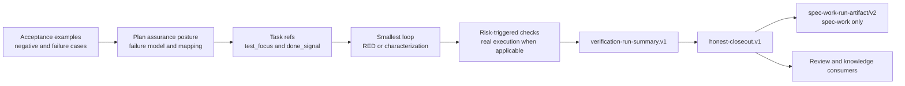

# Risk-Driven Assurance Integration - Plan

## Goal Capsule

- **Objective:** 将用户提供的 `old-coder` skill 中可复用的风险驱动验证机制，接入 spec-first 现有的 Spec → Plan → Tasks → Code → Review → Knowledge 证据链，提升高风险变更的证明质量，同时保持低风险任务的轻量路径。
- **Recommended approach:** `extend` 现有 `spec-plan`、`spec-work`、`spec-debug` owner，使用现有 `verification-profile.v1`、`verification-run-summary.v1`、`honest-closeout.v1` 和 `spec-work-run-artifact/v2`；不复制完整 skill、不新增公共 workflow、不新增第二套 Evidence artifact。
- **Decision focus:** 如何把 acceptance、failure model、风险触发 check、RED/characterization evidence 和最终 closeout 连接起来，而不把语义判断硬编码成状态机或关键词分类器。
- **Verification focus:** 检查风险到验证的可追溯性、最后一次 mutation 后的 fresh rerun、not-run/degraded claim ceiling、TDD 历史证据边界，以及多 workflow artifact ownership。
- **Largest risk:** 将 assurance posture、mutation/property 等机制误变成所有任务的固定仪式，或引入 `EVIDENCE.md` / `gauntlet.sh` 造成第二事实源。
- **Authority:** Product Contract 继续拥有 WHAT；`spec-plan` 拥有 assurance 语义与验证设计；`spec-work`、`spec-debug` 和 `spec-code-review` 只对真实执行结果作结构化记录；脚本只准备事实和校验确定性不变量。
- **Stop conditions:** 发现需要改变产品 acceptance、公共 contract、source/runtime ownership、现有 schema 语义、commit/landing 授权边界，或需要新增通用 workflow 时，停止当前实现并返回 `spec-plan` 重新规划。
- **Tail ownership:** 后续 `spec-work` 负责实现、review follow-up、最终 verification、honest closeout 和可选的 `spec-work-run-artifact/v2`；本计划本身不授权实现、测试、commit 或 landing。

---

## Product Contract

### Summary

spec-first 已经有证据记录和 closeout contract，但风险驱动的验证选择还分散在 PRD、计划、反馈回路和各个消费者中。`old-coder` 提供了可复用的 assurance 思路：先把行为写成可观察例子，再按失败代价选择 proof-first、mutation、property、coverage 或真实执行，并在最后一次代码变化后重新验证。

本计划只吸收这些可迁移的判断机制。它不把外部 skill 的命名、目录、shell 编排、Git checkpoint 或依赖安装流程当作 spec-first contract。

### Problem Frame

当前链路可以记录“执行了哪些 check”，也能阻止自然语言把未执行的命令声称为 passed，但计划与执行之间缺少一个明确的语义桥：哪些 acceptance/failure 需要哪一层证据，什么时候要升级验证强度，什么时候缺失工具只能降级 claim。结果可能是高风险变更仍采用过窄的单元测试，也可能是低风险任务被不必要的完整 gauntlet 拖慢。

目标不是提高测试数量，而是提高 `claim → evidence` 的匹配度和可复用性。

### Requirements

#### Assurance policy

- R1. `spec-plan` 必须为触发高风险或跨层行为的计划记录 assurance posture 的判断、适用理由和最大未证实风险。
- R2. assurance posture 必须将每个重要 failure mode 或 acceptance group 映射到一个或多个 verification intent，并明确哪些 check 是 required、optional、not applicable 或 deferred。
- R3. posture 只作为 LLM/人工语义判断的轻量词汇（推荐 `lightweight`、`standard`、`high-assurance`），不得作为脚本关键词分类器、强制有限状态机或新的 schema enum。

#### Execution evidence

- R4. `spec-work` 必须在第一个 behavior-bearing mutation 前选择最小 feedback loop，并在适用时保留 observed RED 或 characterization evidence；没有 run-local RED 不能声称 TDD 历史。
- R5. 对计划声明 required 的 mutation、property、changed-line coverage、hostile-input、regression-reproducer 或 real-execution check，执行结果必须进入现有 `verification-run-summary.v1`，未运行时记录具体 `not-run` / `degraded` reason。
- R6. 最后一次代码 mutation、simplify 或 review-fix 后，必须对受影响的 Verification Contract 重新执行；旧的绿色结果不能充当最终树证据。
- R7. `honest-closeout.v1` 的 validation claim 只能引用真实记录的 `verification-run-summary:<check-id>`；provider readiness、自然语言声明和历史 transcript 不能提升 claim。

#### Consumer and boundary

- R8. `spec-prd` 负责可观察的正面、负面、错误和边界 acceptance，但不负责工具安装、测试命令、Git checkpoint 或 commit 授权。
- R9. `spec-write-tasks` 必须在现有 `requirement_refs`、`test_focus`、`done_signal` 和 `review_gate` 中保留 acceptance → unit/task → validation 的追踪，不新增平行 task schema，除非实际 consumer 证明现有字段不足。
- R10. `spec-code-review` 必须审查 assurance contract 是否兑现，并区分 review judgment、run-local RED evidence 和真实 command evidence；不得从最终绿测反推开发历史。
- R11. `spec-debug` 必须将 original reproducer、regression test 和 broader verification 分开记录；高风险 bug 可以触发 hostile-input 或 mutation，但不写 `spec-work-run-artifact/v2`。
- R12. `spec-test-browser`、`spec-test-xcode` 等真实执行 provider 只返回带 provenance、freshness 和 limitation 的 evidence，由 caller 写入自己的 run summary；provider 内部实现不成为 workflow contract。
- R13. 不创建新的公共 `spec-assurance` workflow、第二套 `EVIDENCE.md`、通用 `gauntlet.sh`、全局强制 mutation/property 流程或新的中心状态机。
- R14. SPEC 批准、工具安装、mutation、commit 和 landing 必须保持分离授权；任何集成不得把其中一个授权推导成另一个。

### Actors and Responsibilities

- A1. Product owner / current user：确认 WHAT、可观察 acceptance、产品风险和不可逆取舍。
- A2. `spec-plan`：根据当前 source 和 Product Contract 判断 assurance posture，建立 failure model 和 Verification Contract。
- A3. `spec-work` / `spec-debug`：执行最小 feedback loop、收集真实结果、控制 claim ceiling，并在最终 mutation 后 fresh rerun。
- A4. `spec-code-review`：审查 diff、计划约束和已有 evidence，报告缺口，不拥有行为实现或 commit。
- A5. Script / CLI helpers：解析 profile、记录 command/exit code/path/hash、校验 schema、生成 reason_code；不决定语义充分性。
- A6. Real-execution providers：提供 browser、iOS 或其他真实环境的 bounded evidence；不能自称已证明 caller 的整体完成。

### Acceptance Examples

- AE1. **Low-risk path remains light**
  - **Given:** 一个局部文案或机械重命名任务，没有行为变化、风险触发或 load-bearing acceptance。
  - **When:** `spec-plan` 或 `spec-work` 选择轻量路径。
  - **Then:** 不强制 mutation/property/full-suite；执行最窄已知 check，并保留 claim ceiling。

- AE2. **High-risk plan is traceable**
  - **Given:** 计划涉及认证、隐私、迁移、外部 RPC、并发、持久化或 rollout。
  - **When:** `spec-plan` 完成 Planning Contract。
  - **Then:** 文档包含适用的 invariant、failure mode、rollback/compensation、observability 和 `failure/acceptance → verification intent` 映射；缺失 load-bearing 信息时 readiness 不提升为 implementation-ready。

- AE3. **Final-tree freshness**
  - **Given:** 初始检查通过，随后 simplify 或 review-fix 改变了行为代码或测试相关 source。
  - **When:** `spec-work` 进入 closeout。
  - **Then:** 重新运行受影响的 required checks，新的 summary 和 fingerprint 只在最后一次 mutation 后生成；旧 summary 不能被复用。

- AE4. **Honest degraded evidence**
  - **Given:** required real-execution、mutation 或 property tool 缺失，或环境无法运行。
  - **When:** caller 记录 verification result。
  - **Then:** summary 使用 `not-run` / `degraded` 和具体 reason_code、missing_tools 与 limitation；closeout 不声称 validation verified。

- AE5. **No fabricated TDD history**
  - **Given:**最终 diff 中同时存在实现和绿色测试，但 run-local 没有 production mutation 前的 observed RED。
  - **When:** review 或 closeout 判断开发过程。
  - **Then:**可以声称“当前测试通过”，但不能声称“已执行 RED/GREEN/TDD 历史”。

- AE6. **Debug chain is separate**
  - **Given:** 一个可复现回归需要修复。
  - **When:** `spec-debug` 完成 fix handoff。
  - **Then:** 输出分别引用 original reproducer、regression test 和 broader checks；不会伪造 `spec-work-run-artifact/v2`。

- AE7. **Review consumes, not duplicates**
  - **Given:** `spec-code-review` 收到 implementation-ready plan 和 `spec-work` run summary。
  - **When:** review 判断 verification gap。
  - **Then:** review 只报告具体缺口或引用已存在 evidence，不自行建立第二份 Evidence report，也不从最终绿测推断 RED 历史。

- AE8. **Provider boundary is explicit**
  - **Given:** browser 或 Xcode provider 因环境限制只能运行一部分路径。
  - **When:**结果返回 caller。
  - **Then:** caller 记录 provider provenance、freshness 和 limitation；缺少 provider 不会被描述为完整 real execution。

- AE9. **Authorization stays orthogonal**
  - **Given:**用户批准了 SPEC 或 implementation plan，但没有批准依赖安装、commit 或 landing。
  - **When:**执行 assurance workflow。
  - **Then:**只执行已授权的 planning/verification 范围，不能从 plan、绿测或 checkpoint 自动推导其他副作用授权。

### Scope Boundaries

#### In scope

- `spec-prd` acceptance examples、负面约束和错误场景的 authoring guidance。
- `spec-plan` assurance posture、failure model、Verification Contract 映射和风险解释。
- `spec-work` feedback loop、按风险选择的 verification checks、fresh rerun 和 closeout 语义。
- `spec-debug` reproducer/regression/broader verification 链路。
- task、review、browser、Xcode、simplify、LFG 对上述 contract 的消费与传递。
- focused contract tests、skill eval fixtures、fresh-source eval 和代表性任务对照实验。

#### Out of scope

- 自动安装依赖、自动初始化 Git、自动创建 checkpoint commit 或修改默认分支。
- 统一替换宿主的 test runner、mutation framework、property framework 或 browser/iOS provider。
- 机器根据文件名、关键词、金额或 skill 路由自动决定风险等级。
- 让脚本判定 acceptance 是否语义充分，或让 LLM 伪造 command/exit code/log。
- 直接修改 `.claude/`、`.codex/`、`.agents/skills/`、`.cursor/`、`.kiro/`、`.qoder/`、`.opencode/` generated runtime。

#### Deferred for later

- 只有当代表性任务证明 acceptance-to-check trace 需要机械校验，才评估 additive schema field 或专门 contract；在此前不扩 `verification-profile.v1`、`verification-run-summary.v1` 或 `honest-closeout.v1`。
- 只有当真实采纳数据证明默认路径需要统一 assurance CLI，才重新评估是否构建独立命令；当前保留为 experiment candidate。

---

## Planning Contract

### Five-Lens Decision Record

#### 第一重审视：定义关键问题与领域

问题不只是“old-coder 能否复制进 spec-first”，而是“如何以最小新增机制，让高风险变更获得与 claim 匹配的证据，同时不增加低风险任务的固定成本”。领域包括 AI coding harness 治理、软件测试策略、workflow/artifact contract、权限边界和跨宿主证据投影。

**这一重审视改变了什么：** 集成对象从一个外部 skill 变成风险驱动 assurance policy，判断标准从“功能是否齐全”改为“claim-to-evidence 是否更可靠、边界是否更清晰”。

#### 第二重审视：理论体系与关键矛盾

本计划采用三条判断主轴：风险基础测试要求验证强度匹配失败代价；证据治理要求事实、判断和授权分离；渐进式架构演化要求优先复用已有 owner，避免新的中心状态机和第二事实源。主要矛盾是“更强的证明”与“更高的 carrying cost”之间的张力。次要矛盾包括 posture 是否机器化、provider 是否足够真实、TDD 历史是否可追溯。

**这一重审视改变了什么：** 方案不再追求完整 gauntlet，而是引入风险触发的最小充分证据，并把 posture 留在语义层。

#### 第三重审视：关键事实与综合架构

当前 source 已有 `spec-work/references/feedback-and-tests.md`、`spec-plan/references/high-risk-plan-lens.md`、`verification-profile.v1`、`verification-run-summary.v1`、`honest-closeout.v1` 和 `spec-work-run-artifact/v2`。这些能力分别拥有反馈回路、风险 lens、命令身份、实际结果、claim validator 和 spec-work durable artifact。`verification-run-summary.v1` 的 check id 是开放字符串，能够记录 mutation、property、real-execution 等风险触发 check，而不需要 schema bump。

**这一重审视改变了什么：** 架构姿态确定为 `extend`：`spec-plan` 决策、`spec-work` 执行、现有 summary/closeout 记录；不创建 `EVIDENCE.md`、`gauntlet.sh` 或新的公共 owner。

#### 第四重审视：反方压力与结论前提辩证分析

最强反方认为，完整的独立 assurance workflow 更容易培训、审计和复用，也可能比分散到多个 skill 更不容易漏步骤。该反方在高风险 regulated project 或已有成熟 mutation/property runner 的团队中成立。

本方案的前提是 spec-first 已经拥有足够稳定的 artifact/closeout 基础，且大多数任务不需要全量 gauntlet。如果该前提被 field benchmark 推翻，或多个 caller 反复丢失同一 trace，结论必须升级：先补现有 owner 的 contract，再考虑独立 wrapper。

**这一重审视改变了什么：** 推荐级别降为 Trial，不声称 Adopt 已被 field outcome 验证；同时把代表性任务对照实验和 invalidation condition 写入 DoD。

#### 第五重审视：全貌理解与可验证收束

完整闭环应为：



**这一重审视改变了什么：** 方案必须同时交付 source prose、consumer tests、fresh-source eval 和 field experiment；任何只改提示词但没有 trace/evidence/closeout 验证的实现都不算完成。

### Key Technical Decisions

- KTD1. **Architecture posture = `extend` existing owners.** `spec-plan` 和 `spec-work` 已分别拥有 planning 与 execution contract；新增机制应落在既有 skill-local references、现有 Verification Contract 和现有 artifacts 中。新 reference 文件只作为同一 owner 的 progressive-disclosure surface，不形成新的 workflow owner。
- KTD2. **Assurance posture is semantic prose, not a schema enum.** 推荐用 `lightweight`、`standard`、`high-assurance` 描述验证姿态，但必须附理由、触发风险、claim ceiling 和降级条件。脚本不得根据 posture 自动决定命令集合。
- KTD3. **Failure model precedes check selection.** 先问“什么会坏、谁受影响、如何发现、如何恢复”，再选择 unit、integration、property、mutation、coverage 或真实执行。不能用 coverage 百分比替代 failure model。
- KTD4. **Use existing check identity and evidence contracts.** 风险触发 check 使用现有 profile/summary 的开放 `id` 字段，例如 `mutation`、`property`、`changed-line-coverage`、`hostile-input`、`regression-reproducer` 和 `real-execution`。没有可执行 command 时必须记录 not-run/degraded，而不是创建虚假 passed。
- KTD5. **No automatic profile mutation.** 第一阶段不把所有风险 check 添加到团队默认 profile；plan 的 Verification Contract 声明 required intent，执行时由目标 repo 已有 profile、明确命令或 bounded provider 提供事实。需要扩展默认 profile 时，另开明确的 profile/config 变更。
- KTD6. **Freshness after tail mutations is mandatory.** simplify、review fix、fixture change 或行为代码修改后，受影响 checks 必须重新执行，并生成新的 summary/fingerprint。
- KTD7. **Authorization remains orthogonal.** SPEC approval only confirms scope/WHAT；dependency install、test mutation、commit、push/landing 分别需要自己的 authorization。
- KTD8. **Evidence ownership remains asymmetric.** `verification-run-summary.v1` 是共享 command-result surface；`honest-closeout.v1` 是 validator output；只有 `spec-work` 可选写 `spec-work-run-artifact/v2`。debug/review 不得写该 artifact。

### Assurance Posture Contract

在 `spec-plan` 的 Planning Contract 中增加以下语义段落，保持自由文本但要求字段完整：

```text
Assurance posture: <lightweight | standard | high-assurance, or explicit equivalent>
Why this posture: <risk, ambiguity, irreversibility, impact surface, and rollback facts>
Failure model: <failure mode -> affected actor/surface -> detection -> recovery>
Required proof: <acceptance/failure group -> verification intent/check id>
Optional proof: <useful but non-blocking checks>
Not applicable: <checks considered and rejected with reason>
Degraded path: <missing tool/environment -> reason_code -> claim ceiling>
Freshness rule: <what must rerun after implementation/review/simplify mutation>
```

该段落不是新的机器 schema。若某字段会改变 Product Contract、权限、不可逆风险或 implementation-ready readiness，必须把问题返回 owner；不能用“假设”掩盖 load-bearing gap。

### Risk-to-Verification Matrix

| Risk signal | Required planning decisions | Typical verification intents | Claim ceiling when unavailable |
| --- | --- | --- | --- |
| Auth, permission, privacy, credentials | Actor, enforcement point, deny behavior, audit/privacy boundary | focused deny-path, integration/real-execution, hostile-input where abuse surface exists | Cannot claim permission path verified from unit tests that bypass enforcement |
| Money, ledger, irreversible write | Invariant, idempotency, audit trail, compensation/rollback | invariant/property, duplicate/retry, migration or integration proof | Cannot claim financial or irreversible safety from happy-path unit tests |
| External RPC, webhook, queue, retry | Contract, dedupe, ordering, final failure/manual recovery | contract/integration, failure injection, property or real provider check | Cannot claim end-to-end delivery from mocked caller only |
| Migration, backfill, schema evolution | Compatibility window, backup/rollback, verification query | migration dry-run plus executable verification query, rollback/restore proof | Dry-run alone is not production migration proof |
| Concurrency, cancellation, partial completion | Allowed transitions, terminal/dead states, cleanup | race/property, cancellation, repeated execution, system-wide check | Cannot claim no orphan/duplicate effects without observable state proof |
| UI/browser/mobile runtime | Key states, responsive/a11y contract, provider fidelity | browser or Xcode real execution with screenshot/console/a11y or simulator evidence | Code-level checks only support bounded code claim |
| Local low-risk change | Scope and observable diff | narrow unit/help/schema/diff check | No need to manufacture mutation/property evidence |

The matrix is a semantic calibration aid. It is not a script-owned classifier and does not force every row for every task.

### Ownership and Integration Map

| Surface | Source owner | Integration | Does not own |
| --- | --- | --- | --- |
| Product acceptance | `skills/spec-prd/SKILL.md` and references | Add negative/error/boundary authoring guidance and acceptance examples | HOW, commands, installs, commits |
| Assurance design | `skills/spec-plan/SKILL.md`, `skills/spec-plan/references/high-risk-plan-lens.md`, new owner-local assurance reference if needed | Add posture, failure model and check mapping | Runtime execution and command result |
| Feedback loop | `skills/spec-work/references/feedback-and-tests.md` and `skills/spec-work/SKILL.md` | Add risk-triggered mutation/property/real-execution choice and fresh rerun rule | Product scope, shipping authorization |
| Bug loop | `skills/spec-debug/SKILL.md` and references | Add reproducer/regression/broader verification and high-risk escalation | `spec-work-run-artifact/v2` |
| Task projection | `skills/spec-write-tasks/SKILL.md`, `references/task-pack-schema.md` | Preserve trace through existing fields; add quality guidance only if needed | New source of requirements |
| Review | `skills/spec-code-review/SKILL.md`, testing persona | Check assurance contract and consume evidence | TDD history inference, implementation fixes |
| Real execution | `skills/spec-test-browser/SKILL.md`, `skills/spec-test-xcode/SKILL.md` | Return bounded provider evidence to caller | Overall completion claim |
| Simplification | `skills/spec-simplify-code/SKILL.md` | Assist refactor after behavior proof | Behavior correctness and acceptance changes |
| Orchestration | `skills/spec-lfg/SKILL.md` | Pass posture and require final fresh verification after review/fix | Duplicate gauntlet implementation |
| Evidence contracts | `docs/contracts/verification/**`, `docs/contracts/workflows/**`, existing helpers | Reuse current schemas and validators | New parallel Evidence artifact |

### Detailed Integration Rules

#### `spec-prd`

Add an authoring rule to the existing acceptance and evidence guidance: every material behavior should expose at least one observable success signal and, when applicable, one negative/error/boundary example. The rule must remain relevance-driven; it must not generate a Cartesian test matrix or push technical choices into WHAT.

The PRD should carry product meaning such as “denied actor sees X” or “duplicate request has one durable effect”, while `spec-plan` decides whether a focused test, integration test, property, mutation, or real execution is needed.

#### `spec-plan`

At planning time, inspect current source and the high-risk lens. Add the assurance posture contract, failure model, and mapping to Verification Contract. The plan must state why a stronger check is not applicable when a reviewer could reasonably expect it. A missing command is a limitation to be handed to `spec-work`; it is not permission to mark the check passed.

Do not encode posture as frontmatter, a finite enum, or an automatic route. The existing `artifact_readiness` still answers whether the plan is executable; assurance posture answers how the plan should be proven.

#### `spec-write-tasks`

Keep the existing machine-readable `Task Pack Contract` authoritative. Populate `requirement_refs` with R/AE references, `test_focus` with the verification intent, `done_signal` with the observable result, and `review_gate` when the plan requires task-level review. A task pack may carry a human-readable `risk_note` or `context_refs`; these remain quality fields, not new deterministic gates.

If a task cannot be mapped to an acceptance or verification signal, set `stop_if` to return to plan/task regeneration rather than inventing scope.

#### `spec-work`

Before behavior mutation, choose the smallest loop from `feedback-and-tests.md`. For high-assurance posture, use risk-first or proof-first when the highest-loss assumption can be falsified cheaply. Select mutation/property/coverage/real-execution only when the failure model gives them a purpose.

After every implementation, simplify, or review-fix mutation that can affect the claim, rerun affected checks. The final summary must contain only commands actually run in this invocation, and the final fingerprint must be captured after those checks.

#### `spec-debug`

Record three distinct evidence layers: original reproducer, regression test, and broader checks. A mutation/property check is an escalation for a high-risk or adversarial bug, not a universal debug ritual. If the original reproducer cannot run, keep the causal chain and fix claim bounded by replacement evidence.

#### `spec-code-review`

Reviewers read the plan's Verification Contract and current evidence. Findings should say which claim is unsupported, which check is missing or stale, and which owner should close it. Review must preserve the existing report-only and mutation authorization boundary. The testing reviewer may challenge weak tests, but review cannot manufacture run-local RED evidence.

#### Providers and orchestration

Browser/Xcode providers return real execution evidence only for the observed route and environment. `spec-lfg` passes the plan posture through its task/work handoff and requires a fresh final verification after any review/fix tail. `spec-simplify-code` may reduce accidental complexity but must not weaken or rewrite the behavior proof.

### Failure, Degradation, and Recovery

| Failure | Deterministic fact | Semantic response | Recovery / exit behavior |
| --- | --- | --- | --- |
| Required tool missing | `missing_tools`, `reason_code: missing_dependency`, `status: not-run` | Decide whether replacement evidence closes the claim | Keep unit incomplete or downgrade claim; never promote to passed |
| Command dry-run only | `ran: false`, `reason_code: schedulable` | Decide which claim remains unsupported | Require executable alternative or explicit degraded closeout |
| Provider unavailable | Provider status, freshness and limitation | Bound surface claim to code-level or partial evidence | Caller records degraded evidence; no provider-internal claim |
| Acceptance/failure mapping unclear | Missing plan prose, not a script error | Return to `spec-plan` or Product Contract owner | Do not invent test scope in `spec-work` |
| Final mutation after green check | Changed-tree/fingerprint differs | Require fresh affected verification | Old summary cannot close final tree |
| Review finding changes behavior scope | Diff/plan mismatch | Re-plan or regenerate tasks | Stop dependents and implementation handoff |
| Source/runtime drift | Source and generated mirror differ | Repair source/generator first | Never hand-edit generated runtime as durable fix |

### Compatibility and Migration

Phase 1 is additive prose and eval guidance. Existing plans without an assurance section remain valid; consumers interpret absent posture as “use existing feedback-and-tests and high-risk lens” rather than failing the artifact. Existing verification profiles and summaries remain schema-compatible.

Phase 2 can add a reference file under an existing skill owner and focused contract/eval cases. It must not alter generated runtime directly. If source prose changes host projection, run `spec-first init` only through an explicitly authorized runtime-maintenance path.

Phase 3 is optional schema evolution only after benchmark evidence shows a deterministic consumer gap. Any schema change requires version note, downstream consumer tests, migration/read compatibility, and changelog entry.

Rollback is a source revert of the added prose/eval changes. Because no runtime mirror, durable state schema, or default verification profile is mutated in Phase 1, rollback does not require data migration.

### System-Wide Impact

| Surface | Status | Decision |
| --- | --- | --- |
| Product / PRD | in-scope | Acceptance examples become more observable and include relevant negative paths |
| Plan / tasks | in-scope | Assurance posture and trace flow through existing sections/fields |
| CLI / schemas | deferred | No schema or CLI change until consumer evidence proves a gap |
| Verification helpers | in-scope as consumers | Record arbitrary check ids already allowed by current contract |
| Browser / iOS | in-scope as providers | Return bounded real-execution evidence; no automatic universal invocation |
| Runtime generation | out-of-scope | Do not hand-edit generated mirrors; regenerate only if source projection changes and is authorized |
| Knowledge promotion | deferred | Only verified, reusable lessons with invalidation conditions can enter `docs/solutions/` |
| Release / rollout | deferred | This plan does not change release behavior; adoption is evaluated first through representative tasks |

### Evidence and Limitations

- Direct source evidence: current `spec-plan`, `spec-work`, `spec-debug`, `spec-write-tasks`, `spec-code-review`, verification contracts, closeout contracts and focused tests in this repository.
- External evidence: the user-provided `old-coder` source and its `gauntlet` reference were read as advisory input; they are not source-of-truth for spec-first ownership or authorization.
- Snapshot: repository `HEAD` was `d989629c` during planning. The worktree already contained unrelated user changes in README, CHANGELOG, an SVG asset and `tests/unit/readme-community-entry.test.js`; those changes are preserved and are not evidence that this plan is implemented.
- Provider limitation: no independent subagent or fresh field benchmark was authorized or run during this planning pass. Semantic conclusions are therefore a Trial recommendation, not a confirmed outcome.
- Document-review envelope: `review_status: degraded`; `reason_code: dispatch_authorization_missing`; `independent_review: not_run`; `fresh_source_eval: not_run`; `fixes_applied: 0`; limitation: this pass used bounded producer self-review only because independent reviewer/worker dispatch was not authorized. This is not a `Doc review clean` or `fresh-source eval passed` claim.
- Runtime limitation: no generated runtime refresh, host loader run, browser run, Xcode run or production/field outcome was performed for this plan.

### Deferred Implementation Unknowns

- Which target repositories already expose mutation, property, changed-line coverage, browser, iOS or hostile-input commands in their explicit verification profile.
- Whether each consumer can preserve acceptance-to-check references in current prose without a small additive field.
- Which representative task families produce measurable quality-adjusted throughput improvement without inflating low-risk task cost.

These unknowns do not block the plan because they are execution-time facts. If any answer changes Product Contract, source ownership, schema compatibility or default workflow routing, stop and return to planning.

---

## Implementation Units

### U1. Add the assurance posture and failure-model planning contract

- **Goal:** Extend `spec-plan` so an implementation-ready plan states assurance posture, failure model, required/optional/deferred proof, degraded path and freshness rule without adding a schema enum or routing state machine.
- **Requirements:** R1, R2, R3, R5, R7, R13.
- **Files:** `skills/spec-plan/SKILL.md`, `skills/spec-plan/references/high-risk-plan-lens.md`, `skills/spec-plan/references/assurance-posture.md` (new owner-local progressive-disclosure reference), `tests/unit/spec-plan-contracts.test.js`, `tests/unit/spec-plan-quality-contracts.test.js`, `skills/spec-plan/evals/output-quality-cases.json`, `skills/spec-plan/evals/examples.json`.
- **Approach:** Reuse the high-risk trigger matrix and plan section contract. Put durable rules in `SKILL.md` and detailed calibration/examples in the owner-local reference. Preserve semantic judgment in prose; scripts only assert required headings/anchors and explicit boundary phrases.
- **Test scenarios:**
  1. A high-risk plan includes failure model, invariant/rollback/observability decisions and acceptance-to-check mapping.
  2. A low-risk plan can remain lightweight without mutation/property/full-suite requirements.
  3. Posture labels are not added to frontmatter enum, CLI classifier or workflow state schema.
  4. Missing verification command becomes a visible limitation/degraded path, not a passed check.
  5. A Product Contract ambiguity keeps readiness below implementation-ready and routes back to the owner.
- **Verification:** Focused contract tests, plan eval fixture structural assertions, `npm run lint:skill-entrypoints`, fresh-source eval.
- **Dependencies:** None.
- **Stop if:** An implementation requires a new schema field, profile default or public command not covered by this plan.

### U2. Add risk-triggered feedback and final-tree freshness to `spec-work`

- **Goal:** Extend the existing feedback loop so risk selects the smallest sufficient proof and final closeout reruns affected checks after all tail mutations.
- **Requirements:** R4, R5, R6, R7.
- **Files:** `skills/spec-work/SKILL.md`, `skills/spec-work/references/feedback-and-tests.md`, `skills/spec-work/references/shipping-workflow.md`, `tests/unit/spec-work-contracts.test.js`, `tests/unit/spec-work-implementation-quality-contracts.test.js`, `tests/unit/spec-work-consumer-chain-contracts.test.js`, `tests/integration/spec-work-closeout-producer.test.js`.
- **Approach:** Reuse smallest-loop, proof/characterization, verification-run-summary and working-tree fingerprint rules. Add risk-trigger examples for mutation/property/real execution and require fresh rerun after simplify/review fixes. Do not make TDD a universal ritual.
- **Test scenarios:**
  1. Behavior-bearing mutation reads feedback-and-tests before implementation.
  2. Observed RED is required for a TDD-history claim; green final tests alone are insufficient.
  3. A required mutation/property/real-execution check with missing tooling returns not-run/degraded and prevents complete closeout.
  4. A review-fix changes a checked file and forces a fresh summary/fingerprint before completion.
  5. A pure docs/mechanical task uses the narrow replacement check without fabricated behavior evidence.
- **Verification:** Focused Jest suites, closeout integration tests, `npm run typecheck`, fresh-source eval.
- **Dependencies:** U1.
- **Stop if:** The change would alter `spec-work-run-artifact/v2` ownership or require a new durable state transition.

### U3. Strengthen reproducer-to-regression verification in `spec-debug`

- **Goal:** Make bug closeout distinguish original reproducer, regression test and broader verification, with risk-triggered hostile-input/property/mutation escalation.
- **Requirements:** R4, R5, R7, R11.
- **Files:** `skills/spec-debug/SKILL.md`, `skills/spec-debug/references/defense-in-depth.md`, `skills/spec-debug/references/anti-patterns.md`, `tests/unit/spec-debug-contracts.test.js`, `docs/contracts/workflows/spec-debug-input-output.md`.
- **Approach:** Extend existing causal-chain and not-run rules. Keep `spec-debug` summary/closeout ownership and explicitly prohibit writing `spec-work-run-artifact/v2`.
- **Test scenarios:**
  1. Reproducible bug records original reproducer before fix, then regression and broader checks after fix.
  2. Non-reproducible bug cannot claim root cause/fix complete without bounded replacement evidence.
  3. High-risk bug may escalate to hostile-input or mutation based on failure model, but ordinary bug does not require it.
  4. Final tail mutation reruns affected checks.
- **Verification:** `tests/unit/spec-debug-contracts.test.js`, focused debug contract tests, fresh-source eval.
- **Dependencies:** U1 and U2.
- **Stop if:** A debug artifact is proposed outside the existing summary/closeout contract.

### U4. Improve PRD acceptance examples and negative-space capture

- **Goal:** Make Product Contract inputs concrete enough for planning to derive verification without inventing user behavior.
- **Requirements:** R8.
- **Files:** `skills/spec-prd/SKILL.md`, `skills/spec-prd/references/prd-readiness-lens.md`, `skills/spec-prd/references/evidence-and-topology.md`, `tests/unit/spec-prd-contracts.test.js`, `tests/unit/spec-prd-plan-handoff-contracts.test.js`, `skills/spec-prd/evals/output-quality-cases.json`.
- **Approach:** Add relevance-driven guidance for positive, negative, error, boundary and permission examples. Preserve PRD WHAT/HOW boundary and existing owner confirmation gates.
- **Test scenarios:**
  1. Acceptance examples express observable outcomes and actors.
  2. Error and deny paths are captured when the behavior has validation/permission/external failure.
  3. Guidance does not emit a mechanical test matrix or implementation command.
  4. Product blocker remains a blocker rather than being converted into a silent planning assumption.
- **Verification:** Focused PRD contract tests, eval fixture shape checks, fresh-source eval.
- **Dependencies:** None; U1 consumes the output.
- **Stop if:** A requested negative path changes product scope or acceptance and needs Product Owner confirmation.

### U5. Preserve assurance trace in task packs and code review

- **Goal:** Let task and review consumers carry the same acceptance-to-verification intent without creating a second schema or evidence report.
- **Requirements:** R9, R10.
- **Files:** `skills/spec-write-tasks/SKILL.md`, `skills/spec-write-tasks/references/task-pack-schema.md`, `skills/spec-code-review/SKILL.md`, `skills/spec-code-review/references/personas/testing-reviewer.md`, `tests/unit/spec-write-tasks-contracts.test.js`, `tests/unit/spec-code-review-contracts.test.js`, `tests/unit/spec-code-review-mechanics.test.js`.
- **Approach:** Use existing `requirement_refs`, `test_focus`, `done_signal`, `review_gate`, `review_focus` and live plan context. Review consumes run summary and run-local evidence; it never infers TDD history or owns fixes.
- **Test scenarios:**
  1. Every executable task has source/requirement anchor and a concrete validation focus.
  2. Missing mapping sends the task back to plan/task generation through `stop_if`.
  3. Testing reviewer distinguishes current test pass, observed RED and unsupported claim.
  4. Report-only review does not mutate the checkout or write a duplicate evidence artifact.
- **Verification:** Focused task/review contract suites, `npm run test:eval-fixtures`, fresh-source eval.
- **Dependencies:** U1, U2 and U3.
- **Stop if:** Existing task schema cannot carry a required trace without adding a new deterministic field; return to planning with a schema-gap finding.

### U6. Align real-execution providers, simplify and LFG consumers

- **Goal:** Ensure browser/Xcode evidence, refactor assistance and LFG orchestration preserve assurance posture and limitation semantics.
- **Requirements:** R6, R12.
- **Files:** `skills/spec-test-browser/SKILL.md`, `skills/spec-test-xcode/SKILL.md`, `skills/spec-simplify-code/SKILL.md`, `skills/spec-lfg/SKILL.md`, `skills/spec-test-browser/references/pipeline-orchestration.md`, `tests/unit/spec-test-browser-contracts.test.js`, `tests/unit/spec-lfg-contracts.test.js`, `tests/unit/spec-work-implementation-quality-contracts.test.js`.
- **Approach:** Keep each existing owner. Providers return bounded evidence to the caller; simplify is REFACTOR assistance; LFG forwards posture and reruns final verification after review/fix. Do not auto-invoke browser or Xcode for every high-assurance task.
- **Test scenarios:**
  1. Browser provider records actual route execution and limitation when exact-origin or runtime readiness blocks the run.
  2. Xcode provider remains user-invoked and does not become a universal workflow dependency.
  3. Simplify cannot remove or weaken required behavior proof.
  4. LFG re-enters final verification after caller-owned review/fix mutation.
- **Verification:** Focused contract tests, fresh-source eval; real browser/Xcode runs only when the target environment is available and explicitly authorized.
- **Dependencies:** U2, U3 and U5.
- **Stop if:** Provider-specific behavior leaks into a public workflow contract or a host cannot express the evidence without a degraded marker.

### U7. Build the evaluation and adoption measurement loop

- **Goal:** Prove or falsify the Trial recommendation with representative tasks before expanding defaults or schemas.
- **Requirements:** R1–R14.
- **Files:** `skills/spec-plan/evals/output-quality-cases.json`, `skills/spec-work/evals/examples.json`, `skills/spec-debug/evals/examples.json`, `skills/spec-code-review/evals/testing-capability-cases.json`, `skills/spec-write-tasks/evals/output-quality-cases.json`, `docs/contracts/workflows/fresh-source-eval-checklist.md`, `docs/validation/` (experiment artifacts only when the experiment runs).
- **Approach:** Compare baseline guidance with assurance-integrated guidance across low-risk local change, auth/permission, migration/rollback, external retry, concurrency/cancellation, UI real-execution and regression-debug tasks. Measure trace completeness, false-pass resistance, claim honesty, elapsed effort and unnecessary-check rate. Treat model judgments and field outcomes as advisory evidence until independently reviewed.
- **Test scenarios:**
  1. Low-risk tasks do not gain material unnecessary verification cost.
  2. High-risk tasks gain explicit failure-to-check mapping and fewer unsupported completion claims.
  3. Missing provider/tool paths remain loud degraded rather than silent pass.
  4. A deliberately adversarial false-green fixture is detected by review/eval.
  5. Results carry source revision, task class, commands, limitations and invalidation condition.
- **Verification:** `npm run test:eval-fixtures`, fresh-source eval, human adjudication or equivalent fresh reviewer, and a repo-local experiment report.
- **Dependencies:** U1–U6.
- **Stop if:** Benchmark evidence does not show benefit over baseline, or carrying cost rises for low-risk tasks without compensating quality gain.

### U8. Documentation, release continuity and source/runtime audit

- **Goal:** Keep the user-facing explanation, changelog and generated-runtime expectations aligned after source skill changes.
- **Requirements:** R13, R14.
- **Files:** `README.md`, `README.en.md`, `README.zh-CN.md`, `CHANGELOG.md`, relevant `docs/contracts/**`, relevant runtime catalog/source inventories only if current source changes require them.
- **Approach:** Document selective assurance integration and its degraded boundaries, not a promise that every task runs a gauntlet. Update only source-of-truth docs; use the existing runtime generation path when projection changes.
- **Test scenarios:**
  1. README and changelog describe assurance as risk-triggered and optional by task, with honest Trial status.
  2. No generated runtime mirror is edited directly.
  3. Source/runtime inventories remain consistent when a skill source changes.
- **Verification:** `npm run typecheck`, `npm run lint:skill-entrypoints`, `npm run build`, relevant README/release continuity tests, `git diff --check`, fresh-source eval.
- **Dependencies:** U1–U7.
- **Stop if:** Documentation claims field improvement or host support without confirmed evidence.

---

## Verification Contract

| Gate | Command / method | Applies when | Required evidence |
| --- | --- | --- | --- |
| Source syntax and skill entrypoints | `npm run typecheck` and `npm run lint:skill-entrypoints` | Any source skill/reference/JS change | Exit code, output/log refs |
| Focused planning contracts | `npm run test:jest -- tests/unit/spec-plan-contracts.test.js tests/unit/spec-plan-quality-contracts.test.js --runInBand` | U1 | Assertions for posture, failure model, no-schema/no-state-machine boundary |
| Focused work/debug contracts | `npm run test:jest -- tests/unit/spec-work-contracts.test.js tests/unit/spec-work-implementation-quality-contracts.test.js tests/unit/spec-debug-contracts.test.js --runInBand` | U2/U3 | Feedback loop, fresh rerun, not-run/degraded and reproducer chain |
| Task/review contracts | `npm run test:jest -- tests/unit/spec-write-tasks-contracts.test.js tests/unit/spec-code-review-contracts.test.js tests/unit/spec-code-review-mechanics.test.js --runInBand` | U5 | Trace fields, report-only boundary, no TDD inference |
| Provider/orchestration contracts | `npm run test:jest -- tests/unit/spec-test-browser-contracts.test.js tests/unit/spec-lfg-contracts.test.js --runInBand` | U6 | Bounded provider evidence and final verification re-entry |
| Existing artifact contracts | `npm run test:jest -- tests/unit/verification-run-summary.test.js tests/unit/honest-closeout.test.js tests/unit/spec-work-run-artifact-contract.test.js --runInBand` | Any change touching evidence references | Existing schema/owner compatibility |
| Eval fixture structure | `npm run test:eval-fixtures` | U1/U5/U7 | Fixture shape, decision/failure coverage and declared missing evidence |
| Fresh-source semantic review | Fresh read-only reviewer using current `skills/**`, `docs/contracts/**`, tests and this plan; if unavailable record `fresh_source_eval: not_run` with reason | Any skill/agent prose change | Trigger precision, source/runtime boundary, deterministic-vs-semantic ownership, findings |
| Representative task experiment | Baseline vs integrated guidance on the task classes in U7 | Before default adoption or schema work | Repo-local report with revision, task cases, effort, trace quality, claim ceiling and limitations |
| Package and diff hygiene | `npm run build` and `git diff --check` | When packaged source/docs or broad skill surfaces change | Dry-run package result and clean diff check |

Verification semantics:

- Commands record only checks that actually ran. `verification-run-summary.v1` remains the result source; `honest-closeout.v1` remains the claim validator.
- Required checks that are not applicable must have an explicit semantic reason in the plan/task; required checks that cannot run must remain not-run/degraded and block a verified completion claim.
- `mutation`, `property`, `changed-line-coverage`, `hostile-input`, `regression-reproducer` and `real-execution` are candidate check ids, not a universal mandatory list.
- A final verification summary created before a later mutation is stale. The final worktree fingerprint and summary must be generated after the last implementation, simplify, fixture or review-fix mutation.
- Fresh-source eval is not replaced by current-session cached skill invocation. When dispatch is unavailable or unauthorized, report `not_run`; do not claim independent reviewer coverage.

---

## Definition of Done

### Global

- [ ] The source plan and all implementation units preserve the `extend` posture and name the existing owner, source-of-truth and rejected parallel shape.
- [ ] Product acceptance, planning assurance, task projection, execution evidence, review and closeout have an explicit trace with no duplicated durable artifact.
- [ ] Low-risk tasks retain a narrow path; high-risk tasks have a failure model and risk-matched Verification Contract.
- [ ] No new public workflow, central state machine, `EVIDENCE.md`, `gauntlet.sh`, default profile mutation or generated-runtime hand edit is introduced.
- [ ] Mutation, dependency install, commit and landing remain separately authorized.
- [ ] All required focused tests, typecheck, skill lint and applicable build/diff checks have confirmed evidence.
- [ ] Fresh-source eval status is `passed`, or `not_run` with an explicit capability/authorization limitation; it is never silently omitted.
- [ ] U7 experiment either confirms a bounded benefit and adoption condition or records a failed/deferred Trial with rollback and reevaluation trigger.
- [ ] Abandoned experiments, temporary fixtures and dead-end code are removed from the final diff.

### Per-unit completion

- [ ] U1: posture and failure-model guidance is present, semantic, and covered by focused plan contracts/evals.
- [ ] U2: risk-triggered feedback and final-tree fresh rerun are explicit and tested without universal TDD ceremony.
- [ ] U3: debug reproducer/regression/broader evidence and artifact ownership are explicit and tested.
- [ ] U4: PRD acceptance examples expose relevant negative/error/boundary behavior without HOW leakage.
- [ ] U5: task/review consumers preserve traceability and report-only/TDD-history boundaries.
- [ ] U6: providers, simplify and LFG pass bounded evidence and rerun final verification after tail mutations.
- [ ] U7: representative benchmark is recorded with limitations and invalidation condition.
- [ ] U8: README, changelog, contracts and runtime expectations are source-first and honest.

### Non-goals verified

- [ ] No claim says that all tasks run mutation/property/full-suite checks.
- [ ] No claim says that a green final test proves RED/TDD history.
- [ ] No claim treats provider readiness, transcript statements or generated runtime mirrors as confirmed outcome evidence.
- [ ] No claim says `old-coder` has been adopted as a field-proven default before the representative experiment completes.

---

## Appendix

### Candidate check identity examples

These names are examples for plan/task mapping and run-summary records. They do not become a mandatory global registry.

| Check id | Evidence intent | Minimum result shape |
| --- | --- | --- |
| `mutation` | Tests detect behavior-preserving mutants in the risk-bearing surface | Executed command, exit code, redacted log, scope and limitation |
| `property` | Invariants hold across generated or adversarial input | Executed property runner and observed counterexample/absence within stated budget |
| `changed-line-coverage` | New behavior-bearing lines have meaningful execution | Runner output tied to changed scope; percentage alone is insufficient |
| `hostile-input` | Deny, malformed, abuse or boundary input is rejected safely | Input class, observed response/state, log or artifact ref |
| `regression-reproducer` | Original bug path remains fixed | Original reproducer and regression test both executed after final mutation |
| `real-execution` | Actual browser, simulator, service or production-like path ran | Provider, target, revision, route, freshness and limitation |

An absent candidate check is not a failure by itself. The plan must explain whether it is not applicable, optional, deferred, unavailable or required, and the final claim must not exceed the evidence actually recorded.
