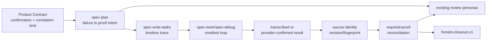

# Risk-Driven Assurance Integration - Plan

## Goal Capsule

- **Objective:** 将 `old-coder` 中可复用的风险驱动验证机制接入 spec-first 现有 Spec → Plan → Tasks → Code → Review → Knowledge 证据链，提高高风险变更的证明质量，同时保持低风险任务的轻量路径。
- **Recommended approach:** 采用 `extend + compose` / Skill-first。先做无代码 current-source/capability preflight，再仅修改已确认存在缺口的 owner；首轮聚焦 U1（plan）、U2（work）、U5（task/review）和独立的 U9（duplicate-id hardening）。Trial 复用现有 fresh-source eval 与人工 blind review，不新增专用 runner、版本化 Trial artifact family 或公共/注册型 Agent。
- **Decision focus:** 区分“当前 source 已具备”与“真实增量”，并把 SPEC 确认、risk-to-proof trace、evidence authority/source binding、required-proof reconciliation 放到正确 owner 中。
- **Verification focus:** 检查 Product Contract/SPEC owner-confirmation posture、全部 required proof 的 closeout 对账、最终 source mutation 后 fresh rerun，以及 `transcribed` / `provider-confirmed` / `source-bound` 的 claim ceiling。
- **Largest risk:** 把投资转移到专用 Trial 控制平面或新 Agent，而生产链真正缺少的是人类 SPEC 确认、证据权威分级、source-state 绑定和 required-proof 全量对账。
- **Authority:** Product Contract 拥有 WHAT；`spec-plan` 拥有 assurance 语义与验证设计；`spec-work` / `spec-debug` 记录或引用执行结果并声明 source binding；`spec-code-review` 判断证据充分性；脚本只准备事实和强制确定性不变量。
- **Stop conditions:** 若需要改变产品 acceptance、公共 artifact schema、source/runtime ownership、commit/landing 授权边界，或新增公共 workflow、注册型 Agent、通用 Trial runner，则停止并返回 `spec-plan` 另立方案。
- **Tail ownership:** 后续 `spec-work` 负责实现、review follow-up、最终 verification 与 honest closeout；本计划不授权实现、测试、commit、landing 或 runtime refresh。

---

## Product Contract

### Summary

spec-first 已覆盖 `old-coder` 的大部分基础能力：`spec-prd` 能表达 exception、permission、negative space 与 acceptance trace；`spec-work` 已拥有 smallest loop、risk-first、proof/characterization、observed RED 边界、property/fuzz、真实链路和最终 fresh verification；`spec-debug` 已区分 reproducer、regression 与 broader checks；`spec-code-review` 已有 testing、reliability、adversarial 等条件 persona。

真正值得吸收的不是完整 skill、shell 编排或统一 gauntlet，而是少数可复用机制：最大未证实风险、acceptance/failure → proof intent、mutation testing、changed-line coverage 的 claim ceiling、equivalent-mutant、anti-gaming、证据权威/source binding，以及 required-proof closeout reconciliation。

### Problem Frame

当前链路能记录“执行了哪些 check”，也能限制未执行命令被声称为 passed，但仍有五个核心信任缺口：

1. 计划期是否明确最大未证实风险及 acceptance/failure → proof intent。
2. Product Contract/SPEC 是否已由 owner 确认，未确认时是否诚实声明同一 Agent 自写、自测、自评的相关性限制。
3. 执行结果究竟只是 caller 转录，还是由 provider/process 直接确认。
4. 证据是否绑定最终 revision/fingerprint，而不是早于最后一次 behavior-bearing source mutation。
5. closeout 是否对全部 required proof 逐项对账，而非仅检查已有 summary 项是否通过。

目标不是增加测试数量，而是提高 `claim → evidence` 的匹配度、可追踪性和可复核性。

### Requirements

#### Assurance policy

- R1. `spec-plan` 必须为高风险或跨层行为记录 assurance posture、适用理由和最大未证实风险。
- R2. 每个重要 acceptance group / failure mode 必须映射到一个或多个 verification intent，并标记 `required`、`optional`、`not applicable` 或 `deferred`。
- R3. `lightweight`、`standard`、`high-assurance` 只作为语义词汇，不成为 schema enum、脚本分类器或强状态机。
- R19. `spec-plan` 必须记录 Product Contract/SPEC 的 owner-confirmation posture、basis/source ref 和 correlation limitation；未获 owner 确认时不得声称人类审阅已切断自写自评相关性。

#### Execution evidence

- R4. `spec-work` 必须在第一个 behavior-bearing source mutation 前选择最小 feedback loop；适用时保留 observed RED 或 characterization evidence。没有 run-local RED 不能声称 TDD 历史。
- R5. required intent 只有绑定真实非空 canonical command identity 或可回源 provider/tool identity 后，结果才可进入 `verification-run-summary.v1`；未绑定入口时保留为 limitation，不得生成占位 check。非空 command 只证明记录具有执行身份，不自动证明受监督执行或最终 source binding。
- R6. 最后一次 behavior-bearing source mutation、simplify 或 review-fix 后，必须重跑受影响的 required checks；旧绿测不能充当最终树证据。
- R7. `honest-closeout.v1` 的 validation claim 只能引用真实 summary check；provider readiness、自然语言声明和历史 transcript 不能提升 claim。
- R20. evidence authority 必须区分：`transcribed`（caller 转录）、`provider-confirmed`（可回源 provider/process receipt）；`source-bound` 是额外的 source identity 属性，必须绑定最终 revision/fingerprint/enclosing artifact。
- R21. closeout 必须将全部 required proof 与实际 result、明确 `not applicable`、`deferred` 或 `unbound limitation` 逐项对账；required intent 完全遗漏时不得返回 complete 或 validation verified。

#### Consumer and boundary

- R8. `spec-prd` 负责可观察的正面、负面、错误和边界 acceptance，不负责工具安装、测试命令、Git checkpoint 或 commit 授权。
- R9. `spec-write-tasks` 优先使用现有 `requirement_refs`、`test_focus`、`done_signal`、`risk_note`、`review_gate` 保留追踪；只有真实 consumer 证明字段不足时才评估 schema 扩展。
- R10. `spec-code-review` 必须区分 review judgment、observed RED、transcribed result、provider-confirmed execution 和 source-bound evidence，不得从最终绿测反推开发历史。
- R11. `spec-debug` 分开记录 original reproducer、regression test 和 broader verification，不写 `spec-work-run-artifact/v2`。
- R12. browser、Xcode 等 provider 返回带 provenance、freshness 和 limitation 的 bounded evidence；provider 内部实现不成为 workflow contract。
- R13. 不创建公共 `spec-assurance` workflow、第二套 `EVIDENCE.md`、通用 `gauntlet.sh`、全局强制 mutation/property 流程或中心状态机。
- R14. SPEC 确认、依赖安装、source mutation、commit 和 landing 保持分离授权。
- R15. 同一 `verification-run-summary.v1` 内 check id 必须唯一；producer 在持久化前拒绝重复，`honest-closeout` 在构造 id map 前再次拒绝。
- R16. 新增 assurance producer 使用 `<owner>.<intent>[.<scope>]` 命名约定；唯一的 legacy v1 id 继续可读，不新增全局格式 gate 或 schema version。
- R17. Trial 阶段不新增公共、注册型或跨宿主投射的 assurance Agent；计划和审查复用既有 specialists/personas。
- R18. 每个 owner 变更前执行 current-source delta gate：`already-satisfied | confirmed-gap | uncertain`。只有 `confirmed-gap` 可修改 behavior/contract source；其余转为 regression-only 或 focused eval。

### Actors and Responsibilities

- A1. Product owner / current user：确认 WHAT、acceptance、产品风险和不可逆取舍；确认状态及依据必须可见。
- A2. `spec-plan`：建立 failure model、assurance posture 与 Verification Contract，条件复用既有 specialist。
- A3. `spec-work` / `spec-debug`：运行最小 feedback loop，转录或引用 provider-confirmed 结果，声明 source binding 并执行 final-tail rerun。
- A4. `spec-code-review`：判断 plan、diff 与 evidence 是否一致，报告缺口，不创建第二份 evidence 真相源。
- A5. Script / CLI helpers：记录 command/exit code/path/hash、校验 schema、生成 reason_code；除非实际监督进程或验证 provider receipt，不得声称 confirmed execution。
- A6. Real-execution providers：提供 bounded evidence，不自称证明 caller 的整体完成。

### Acceptance Examples

- AE1. 低风险文案或机械修改不强制 mutation/property/full suite，只运行最窄适用检查并保持 claim ceiling。
- AE2. 高风险计划包含最大未证实风险、failure model、rollback/observability 和 acceptance/failure → proof intent。
- AE3. 尾部 source mutation 后旧 summary 变 stale，必须生成新的 result 与 final source identity。
- AE4. 已绑定但无法运行的 proof 记录 `not-run` / `degraded` 及 limitation；未绑定的 intent 只留在 plan/task limitation。
- AE5. 没有 observed RED 时可以声称当前测试通过，但不能声称已执行 TDD/RED-GREEN 历史。
- AE6. debug 分别引用 reproducer、regression 与 broader checks，不伪造 work artifact。
- AE7. review 消费已有 plan/run evidence，不创建第二份 Evidence report。
- AE8. provider evidence 缺少 provenance、freshness 或 limitation 时，不提升为完整 real execution。
- AE9. SPEC 批准不自动授权 install、source mutation、commit 或 landing。
- AE10. 未绑定 intent 不得通过占位 command 进入 summary。
- AE11. 重复 check id 在 producer 与 closeout 双层 fail closed，后项不能覆盖前项。
- AE12. 唯一的 legacy `typecheck`、`unit` 等 id 保持兼容。
- AE13. 高风险 plan/review 复用既有 specialist/persona，不新增 assurance Agent。
- AE14. focused evidence 证明 owner 已满足时，该单元 no-change 或 regression-only，不制造 prose diff。
- AE15. host 缺 fresh isolated reviewer 时，记录 `trial_execution: not_run` 与 limitation；不因此建设 runner，也不阻断 U1/U2/U5 的 focused implementation Trial，但不得提升为 field-proven default。
- AE16. 最小 Trial 记录 baseline/candidate revision 或 patch hash、case/input/output refs、reviewer independence limitation、quality/cost observation 和 owner verdict；不新增自动 scorecard。
- AE17. SPEC 未确认时明确 correlation limitation，不能声称人类批准已打破自写自评相关性。
- AE18. command、exit code 和 log 若仅由 caller 提交，authority 仍为 `transcribed`；只有监督进程或可验证 provider receipt 才是 `provider-confirmed`。
- AE19. required proof 被完全遗漏时，即使其余 checks passed，closeout 仍阻断 complete/verified。

### Scope Boundaries

#### In scope

- `spec-plan` assurance posture、SPEC confirmation、最大未证实风险、failure/acceptance → proof intent。
- `spec-work` mutation testing、changed-line coverage claim ceiling、equivalent mutant、pre-existing baseline、anti-gaming、fresh rerun、evidence authority/source binding 与 required-proof reconciliation。
- task/review 对 plan trace 和 run evidence 的消费。
- `verification-run-summary.v1` duplicate-id fail-closed hardening。
- 无代码 current-source/capability preflight，以及基于现有 fresh-source eval/人工 blind review 的最小 baseline-vs-candidate Trial。
- 对 `spec-prd`、`spec-debug`、browser、Xcode、simplify、LFG 做 focused current-source delta 验证；只有 confirmed gap 才改 source。

#### Out of scope

- 自动安装目标项目工具链、自动初始化 Git、checkpoint commit 或修改默认分支。
- 机器自动决定风险等级或语义充分性。
- 新公共 workflow、注册型 Agent、central dispatcher、模型调用 CLI 或六宿主 Agent projection。
- risk-assurance 专用 runner、run-manifest/session-receipt schema、A/A noise framework、additive arm search、Agent counterfactual。
- 新的 Evidence artifact family、默认 profile mutation、通用 gauntlet 或 generated runtime 手改。

#### Deferred for later

- 只有真实 trace loss 证明现有 task/artifact 字段不足时，才规划 schema 扩展。
- 只有最小 Trial 显示稳定收益，且至少两个 maintainer eval consumer 需要相同安全 primitive 时，才评估共享 runner/artifact contract。
- 只有同一稳定 assurance 语义在至少三个 workflow 重复、现有 owner 无法内聚、独立上下文带来稳定增益、I/O/consumer 稳定且六宿主治理成本可接受时，才另立 Agent 方案。

---

## Planning Contract

### Five-Lens Decision Record

#### 第一重审视：定义关键问题与领域

关键问题不是“是否复制 old-coder”，而是“哪些 assurance 能力是当前 source 的真实缺口、由哪个既有 owner 吸收，怎样以最低治理成本提高 claim-to-evidence 可信度”。领域包括风险驱动软件工程、测试证据、artifact contract、AI harness 治理和跨宿主 source/runtime 边界。

**这一重审视改变了什么：** 集成对象从完整外部 skill 改成少数 proof capabilities；成功标准从功能齐全改成关闭真实信任缺口且不增加第二 owner。

#### 第二重审视：理论体系与关键矛盾

- **Parnas 信息隐藏 / Ousterhout deep module：** 能力应进入已经拥有相关决策和 consumer 的深 owner；无独立事实源的 assurance Agent 是 shallow wrapper。
- **Boehm Spiral Model：** 先做无代码 preflight 和最小可逆 Trial，优先证伪高不确定性，不先建设平台。
- **Beck / Feathers：** RED 只在实际观察时成立；遗留行为用 characterization，不从最终绿测反推历史。
- **Popper / mutation testing：** 好证据应能使错误实现失败；coverage 只说明执行过，不等于行为被证明。

主要矛盾是“一致的跨阶段 assurance trace”与“集中化会产生第二 owner 和控制平面成本”之间的张力。当前主要方面是既有 owner 已足够深，真实缺口集中在 trace、authority、binding 和 reconciliation。

**这一重审视改变了什么：** 采用 Skill-first + delta-first；Trial 只验证增量，不建设评测平台；Agent 降为未来重评项。

#### 第三重审视：关键事实与综合架构

Current source 已确认：

- `skills/spec-work/references/feedback-and-tests.md` 已覆盖 smallest loop、risk-first、proof/characterization、property/fuzz、真实链路和 claim ceiling；`shipping-workflow.md` 已要求 tail mutation 后 fresh verification。
- `skills/spec-debug/SKILL.md` 已区分 reproducer、regression 与 broader checks；`skills/spec-lfg/SKILL.md` 已在 simplify/review-fix 后回到最终 verification。
- `skills/spec-prd/references/prd-readiness-lens.md` 已覆盖 exception、permission、negative space 与 acceptance trace。
- `skills/spec-plan/references/high-risk-plan-lens.md` 和 `skills/spec-code-review/references/personas/**` 已提供可条件复用的 specialist/persona。
- `verification-run-summary.v1` 能承载 risk-triggered intent，但 `src/cli/helpers/honest-closeout.js` 通过 `Map` 按 id 索引，若 producer/consumer 均未拒绝重复 id，后项可能静默覆盖前项。
- `verification-run-summary.v1` 是 caller result transcription surface，不是 process-level supervisor；command identity 本身不能证明进程由 helper 启动，也不能证明结果绑定最终 source。
- `old-coder` 的 evidence 不能直接提升为通用成功证据：`../old-coder/demo-rate-limiter/evidence.md` 记录的 tree `941518c42589438d` 与当前脚本输出 `acb28aa447387817` 漂移；`../old-coder/demo-rate-limiter/tools/gauntlet.sh` 未包含 evidence 所称每层都会重跑的 secret scan；样本仍是单作者、单示例，且没有 field outcome。

综合架构因此是：Product Contract 提供已确认或未确认的 WHAT；plan 产生 assurance intent；tasks 保留 trace；work/debug 运行或转录 evidence；summary/closeout 记录 authority、binding 与 reconciliation；review 判断语义充分性；existing artifacts 保持唯一事实链。

**这一重审视改变了什么：** 首轮实施限定为 U0 preflight、U9 duplicate hardening、U1/U2/U5 核心 delta 和 U7 最小 Trial；U3/U4/U6 默认 verification-only。

#### 第四重审视：反方压力与结论前提辩证分析

竞争方案：A）建设专用 assurance workflow/Agent 和 Trial 平台；B）最小 Skill-first Trial；C）只修 duplicate id，不做语义集成。

A 的最强论点是统一调度和隔离上下文更利于审计；但它依赖稳定重复语义、明确 I/O/consumer 和已证明的独立上下文增益，当前均未成立。C 的最强论点是 source 已覆盖大部分能力；但它忽略 SPEC confirmation、authority/source binding 与 required-proof reconciliation 的真实信任缺口。B 的关键前提是现有 plan/task/artifact 能承载最小 trace，并且 focused cases 能暴露候选 patch 的收益或成本；这些可由 U0/U7 低成本验证。

**这一重审视改变了什么：** 推荐 B，并将 U9 独立保留；若 U0 证明现有 owner 已满足或 U7 无增益，则只保留安全修复和 regression evidence，不为完整性继续扩散。

#### 第五重审视：全貌理解与可验证收束



成功信号是 high-risk trace 和 false-pass resistance 提升、required omission 被阻断、evidence claim 更诚实，且 low-risk carrying cost 可接受。失败信号是 prompt 扩张但案例无改善、新增第二真相源、把转录结果误写成 confirmed execution，或形成无真实 consumer 的 runner/Agent。

**这一重审视改变了什么：** 收束目标从“完成所有 owner 改造”改为“完成最小 production delta，并用现有能力验证是否值得保留”；no-change/revert 是合法结论。

### Capability Integration Decision Matrix

| Capability | Current status | Decision | Owner / method |
| --- | --- | --- | --- |
| SPEC owner confirmation / correlation breaker | 当前 plan 未稳定表达 | **Extend** | U1 在 Product/Planning Contract 记录 confirmation posture、basis 与 limitation |
| Failure model / highest-risk-first | high-risk lens 已有基础 | **Adapt narrowly** | U1 增加 largest unproven risk 与 failure → proof intent |
| RED / characterization / final fresh run | `spec-work` 已覆盖 | **Reuse / regress** | U2 只守护，不复制固定循环 |
| Property/fuzz | 已有 guidance | **Reuse / bind** | U2 绑定具体 invariant/failure mode，不默认启用 |
| Mutation testing / equivalent mutant | 明确缺口 | **Extend** | U2 增加术语、触发、real mutant、survivor/equivalent/error 边界 |
| Changed-line coverage | 缺 claim ceiling | **Extend narrowly** | U2/U5 明确“触达不等于证明” |
| Anti-gaming / false-green | review persona 已有基础 | **Compose** | U2 提供 evidence，U5 复用 testing/adversarial persona |
| Evidence authority / source binding | 当前表达不足 | **Extend** | U2 + closeout consumer，区分 authority 与 final source identity |
| Required-proof reconciliation | 当前缺少全量对账 | **Extend** | U2 closeout producer/consumer contract |
| Reproducible evidence artifact | 已有 summary/closeout/work artifact | **Reuse** | 不创建 `EVIDENCE.md` |
| Duplicate check identity | 已确认确定性缺口 | **Fix independently** | U9 producer + closeout 双层 fail closed |
| Maintainer Trial | 已有 fresh-source eval / 人工 review 路径 | **Reuse** | U7 普通 validation report，不建 runner/schema |
| Universal `gauntlet.sh` / auto-install | 与边界冲突 | **Reject** | 继续使用目标 repo profile/provider 与独立授权 |

### Agent Integration Decision

**Decision: 直接 Skill 集成，复用 existing skill-local agents/personas；首轮不新增 Agent。**

- 计划期按现有 trigger 复用 architecture/security/data/performance/deployment specialists。
- 审查期复用 testing/reliability/adversarial personas，消费 plan section 和 run evidence，不重新执行或伪造证据。
- U7 在已授权且能力可用时使用全新通用 reviewer 或人工 blind review；它是一次验证动作，不形成 Agent source、catalog identity、runtime projection 或公共入口。
- 若未来至少三个 workflow 稳定重复同一语义、现有 owner 明显失去内聚、独立上下文有可重复增益、I/O/consumer 稳定且治理成本可接受，再另立 Agent 方案。

### Current Investment Verdict

**当前值得做，但只值得投入 U0 + U9 + U1/U2/U5 + U7 最小 Trial。**

- U9 是确定性安全修复，不依赖 Trial 收益。
- U1/U2/U5 是可被 focused case 证伪的窄 production delta。
- U3/U4/U6 先验证 current source；没有 confirmed gap 就不改。
- U7 只回答“候选 patch 是否比 baseline 更清晰、更少 false pass、成本是否可接受”，不回答 field outcome，也不为未来可能性预建平台。

### Key Technical Decisions

- KTD1. **Architecture posture = `extend + compose`, Skill-first.** 能力落在已有 owner，不新建 assurance owner。
- KTD2. **Assurance posture 是语义判断，不是 schema enum。** 脚本不得由 posture 自动选择命令。
- KTD3. **Failure model precedes check selection.** 先明确会坏什么，再选择 proof。
- KTD4. **SPEC confirmation 与 mutation/commit 授权正交。** owner 确认 WHAT 不授权任何副作用。
- KTD5. **Evidence authority 与 source binding 是两个维度。** `provider-confirmed` 不自动等于 final-source-bound；`source-bound` 也不自动证明进程受监督。
- KTD6. **`verification-run-summary.v1` 是结果转录器，不是 process supervisor。** 没有真实 receipt 时不提升 execution authority。
- KTD7. **Required-proof reconciliation 是 completion gate。** 全部 required intent 必须落到 result、N/A、deferred 或 unbound limitation；完全遗漏即阻断。
- KTD8. **No automatic profile modification.** 首轮不把新 proof intent 写入团队默认 profile。
- KTD9. **Minimal Trial reuses existing eval capability.** 预先固定 case、baseline/candidate source identity、review method 和 owner verdict；不建 runner、manifest/receipt schema、A/A 或自动 scorecard。
- KTD10. **Current-source delta gate precedes behavior edits.** `already-satisfied` 只补 regression evidence，`uncertain` 先 focused eval。
- KTD11. **No new assurance Agent.** fresh reviewer 是验证过程，不是 durable product surface。
- KTD12. **Mutation terminology is explicit.** `source mutation` 与 `mutation testing` 不得混写。
- KTD13. **Existing artifacts remain the only durable evidence chain.** summary、honest closeout、work artifact ownership 不变。
- KTD14. **Duplicate-id hardening is independent.** U9 不作为 treatment arm，也不因 Trial 无收益而回滚。
- KTD15. **No bespoke Trial platform in the first slice.** 缺 capability 时诚实 `not_run`，不以基础设施建设替代产品增量验证。
- KTD16. **Claims stop below field outcome.** baseline/candidate review 只能支持 maintainer Trial 决策，不能证明真实用户生产收益。
- KTD17. **首轮 required-proof reconciliation 是 LLM-owned semantic exit gate。** 现有 artifact 没有全部 plan intent 的确定性 registry；因此脚本继续强制 summary/claim 的确定性地板，`spec-work`/review 在这层之上完成全量语义对账并响亮阻断 completion。不得声称该 gate 已由 schema/runtime 硬强制；只有 field evidence 证明需要机械 enforcement 时，才另立 schema/consumer migration 计划。

### Minimal Trial Contract

U7 使用普通 validation report，不定义新 schema。最小合同为：

- Preflight：U0 在现有 planning/validation 文档中记录 source owner、candidate files、fresh reviewer/人工 blind review readiness 与 limitation。
- Source identity：记录 baseline revision 与 candidate revision/patch hash；若无法稳定绑定，Trial 为 `not-run`。
- Cases：首轮固定 RA-01、RA-02、RA-04、RA-07，覆盖低风险成本、高风险 trace、required-proof omission 和 false-green resistance。
- Context：能力与授权允许时使用 fresh isolated context；否则使用人工 blind review 或记录独立性限制。
- Review：优先独立/人工 blind review；同一 Agent 自评必须显式降低 claim。
- Outcome：`retain-trial | revise | revert | not-run`，由 owner 基于案例证据裁决。
- Report：`docs/validation/risk-driven-assurance/<run-id>/`，至少包含 source identity、case/input/output refs、review method、limitations、quality/cost observations 和 verdict。
- Boundary：无专用 runner、run manifest、session receipt、自动 scorecard、A/A noise、additive arm 或 Agent counterfactual；结果不是 field outcome。

### Assurance Posture Contract

在 Planning/Verification Contract 中以轻量 Markdown 表达：

```text
Assurance posture: <lightweight | standard | high-assurance>
Posture reason: <risk and consequence>
Largest unproven risk: <failure or acceptance uncertainty>
Product Contract confirmation: <confirmed | unconfirmed | inherited>
Confirmation basis: <owner/source ref or limitation>
Correlation limitation: <same-agent authorship/review limitation>
Required proof intents: <intent, status, owner, evidence identity>
Evidence authority: <transcribed | provider-confirmed>
Source binding: <revision/fingerprint/enclosing artifact or limitation>
Required-proof reconciliation: <all required intents accounted for or missing list>
Claim ceiling: <what current evidence may support>
```

Scripts 可校验 duplicate id、schema、hash、path、exit code 等确定性事实；posture、N/A 理由、proof 充分性、correlation limitation 与 owner verdict 由 LLM/人工判断。

首轮 `required-proof reconciliation` 同样属于 LLM-owned semantic judgment：现有 schema 不保存全部 plan intents，故只能作为 workflow exit gate 响亮执行，不能描述为 runtime hard enforcement。脚本仍负责拒绝 duplicate id、无效 summary 和不一致 claim；若未来需要机械比对 plan intent registry，必须另立 versioned contract 方案。

### Failure and Degradation Semantics

- 未确认 SPEC：允许继续规划或在授权范围内实施，但 claim 必须带 correlation limitation。
- intent 未绑定真实 command/provider：保持 unbound limitation，不写 synthetic summary check。
- provider/tool 不可用：已绑定 identity 时记录 `not-run` / `degraded`；未绑定时仍为 limitation。
- evidence 只有 caller 转录：authority 为 `transcribed`；不得称 supervised/confirmed execution。
- 缺 final source identity 或尾部发生 source mutation：evidence 不得标记 source-bound，必须重跑或降低 claim。
- required intent 完全遗漏：closeout 阻断 complete/verified。
- fresh reviewer/人工 blind review 不可用：U7 为 `not-run`，不建设 runner；focused contract tests 仍可支持 implementation Trial，但不能提升为 field-proven default。
- focused delta 证明 already satisfied：单元 no-change/regression-only。
- Trial 显示无改善或成本过高：`revise` 或 `revert`；U9 独立按安全测试保留。

### Compatibility and Migration

- 不改变现有 public command、artifact version、task schema、profile schema 或 host entrypoint。
- legacy unique check id 继续可读；只新增重复 id 拒绝和新 producer 命名约定。
- owner-local prose/reference 变更经 `spec-first init` 投射到 generated runtime，但 runtime refresh 属于后续单独授权，本计划不执行。
- 六宿主影响只来自 canonical Skill/source 变更；不直接编辑 `.claude/`、`.codex/`、`.agents/skills/`、`.cursor/`、`.kiro/`、`.qoder/`、`.opencode/`。
- 若 implementation 证明需要 schema field 或新 durable artifact，停止并另立迁移计划，包含 version、consumer、backward compatibility 与 rollout。

### System-Wide Impact

- **Client / host:** 无新公共入口；existing Skill projection 语义更新时需覆盖所有 `getSupportedPlatforms()` 宿主。
- **CLI / contracts:** 仅 U9 可能修改现有 helper validator 行为；不新增 CLI command。
- **Data / artifacts:** 继续使用现有 summary/closeout/work artifact；U7 report 是 validation 文档，不是 runtime contract。
- **Operations:** 不安装目标项目工具，不修改默认 profile，不自动 commit/landing。
- **Security / trust:** 提高 duplicate identity、evidence authority、source freshness 和 required-proof omission 的可见性，但不声称消除同模型相关性。
- **Knowledge:** 只有实现与真实验证后，才由 `spec-compound` 评估是否沉淀 durable knowledge。

### Evidence and Limitations

#### Current source evidence

- `skills/spec-work/references/feedback-and-tests.md`
- `skills/spec-work/references/shipping-workflow.md`
- `skills/spec-debug/SKILL.md`
- `skills/spec-prd/references/prd-readiness-lens.md`
- `skills/spec-plan/references/high-risk-plan-lens.md`
- `skills/spec-code-review/references/personas/`
- `src/cli/helpers/verification-run-summary.js`
- `src/cli/helpers/honest-closeout.js`

#### External reference evidence

- `../old-coder/skills/old-coder/SKILL.md` 及其 references/scripts 用于能力候选提取，不作为 spec-first contract。
- `../old-coder/demo-rate-limiter/evidence.md` 记录 commit `9b63d4c`、tree `941518c42589438d`；当前脚本输出 tree `acb28aa447387817`，说明证据存在 freshness/source-binding 风险。
- `../old-coder/demo-rate-limiter/tools/gauntlet.sh` 未重跑 evidence 声称的 secret scan，说明统一脚本与报告之间仍可能漂移。
- 当前参考 snapshot 为 `old-coder@5b5de1ca6827df383201ea788f6a149789c74fcc`；它是单作者、单示例，未提供 field outcome 或跨项目增量价值证据。

#### Claim ceiling

本计划能支持“存在值得验证的窄增量”和“duplicate id 是确定性安全缺口”，不能支持“old-coder 已被验证优于 spec-first”“新能力已提升真实研发产出”或“独立 Agent 必然更好”。这些只能由后续实现证据、最小 Trial 和真实 field adoption 逐级提高。

---

## Implementation Units

```text
U0 preflight
  ├─> U9 duplicate-id hardening
  └─> U1 plan delta -> U2 work/closeout delta -> U5 task/review consumers -> U7 minimal Trial

U3 / U4 / U6: focused current-source verification; only confirmed gaps join the candidate patch
U7 verdict -> U8 documentation closeout
```

### U0. Run a no-code current-source and capability preflight

- **Goal:** 在任何 behavior source edit 前建立真实 delta、consumer、source owner 与 Trial capability 事实。
- **Requirements:** R17, R18, R19, R20, R21.
- **Files:** 本计划；必要时新增 `docs/validation/risk-driven-assurance/<preflight-id>/preflight.md`，不新增 schema 或 runner。
- **Approach:** 对 U1–U6 和 U9 逐项记录 `already-satisfied | confirmed-gap | uncertain`；验证现有 plan/task/summary/closeout 能否表达 confirmation、proof intent、authority、binding 和 reconciliation；探测 fresh-source reviewer/人工 blind review 是否可用。
- **Test scenarios:** 至少覆盖两个 acceptance/failure groups、一个 group → 多 proof intents、required/optional/N/A/deferred/unbound、跨多个 tasks，以及 final source binding limitation。
- **Verification:** current source、focused tests/evals inventory 与 consumer read；输出 source refs、结论和 limitation。
- **Stop if:** 需要公共 schema、新 artifact family 或改变 Product Contract；返回规划，不继续实现该分支。

### U9. Harden duplicate check identity independently

- **Goal:** 防止同一 summary 内重复 id 被后项静默覆盖。
- **Requirements:** R15, R16.
- **Files:** `src/cli/helpers/verification-run-summary.js`, `src/cli/helpers/honest-closeout.js`, `tests/unit/verification-run-summary.test.js`, `tests/unit/honest-closeout.test.js`。
- **Approach:** producer 持久化前拒绝重复 id；closeout 在构造 `Map` 前再次拒绝；保持 schema version 和唯一 legacy id 兼容；新增稳定 duplicate-id reason family。
- **Test scenarios:** producer duplicate 拒绝；bypassed legacy duplicate 在 closeout 拒绝；唯一 legacy id 可读；新 namespaced id 可读；错误不泄漏后项值。
- **Verification:** `npm run test:jest -- tests/unit/verification-run-summary.test.js tests/unit/honest-closeout.test.js --runInBand`，`npm run typecheck`。
- **Dependencies:** U0 delta confirmation；可独立于 U1/U2/U5 Trial 保留。
- **Stop if:** 修复需要 schema version 或破坏合法 legacy artifact；返回 contract migration 规划。

### U1. Add the narrow planning assurance delta

- **Goal:** 增加 SPEC confirmation、largest unproven risk、failure → proof intent 和 correlation limitation，复用现有 specialists。
- **Requirements:** R1, R2, R3, R19, R20, R21.
- **Files:** `skills/spec-plan/SKILL.md`, `skills/spec-plan/references/high-risk-plan-lens.md`, `tests/unit/spec-plan-contracts.test.js`, `tests/unit/spec-plan-quality-contracts.test.js`, relevant eval fixtures。
- **Approach:** 扩展既有 Planning/Verification Contract；默认不新增 reference；posture 保持语义化，不增加 enum/dispatcher/Agent。
- **Test scenarios:** 高风险 case 完整表达 confirmation/risk/proof；低风险 case 保持轻量；未确认 SPEC 降低 claim；缺 executable proof 保持 limitation；existing specialist trigger 不漂移。
- **Verification:** focused plan tests、eval fixtures、`npm run lint:skill-entrypoints`、fresh-source eval（可用且授权时）。
- **Dependencies:** U0 confirmed gap。
- **Stop if:** 需要新 public command/schema 或改变 WHAT。

### U2. Add work evidence authority, proof rules and closeout reconciliation

- **Goal:** 补齐 mutation-testing、changed-line coverage、equivalent mutant、baseline、anti-gaming、evidence authority/source binding 与 required-proof reconciliation，同时保持现有 work loop。
- **Requirements:** R4–R7, R14, R20, R21.
- **Files:** `skills/spec-work/SKILL.md`, `skills/spec-work/references/feedback-and-tests.md`, `skills/spec-work/references/shipping-workflow.md`（仅 confirmed gap 时）, `tests/unit/spec-work-contracts.test.js`, `tests/unit/spec-work-implementation-quality-contracts.test.js`, `tests/unit/spec-work-consumer-chain-contracts.test.js`, `tests/integration/spec-work-closeout-producer.test.js`。
- **Approach:** mutation testing 绑定具体 failure mode；changed-line coverage 不等于 behavior proof；`verification-run-summary.v1` 继续只承载真实 check 结果，evidence authority 与 source binding 由 closeout envelope 的 `claim_limitations`、`verified_worktree_fingerprint` 及触发持久化时的 enclosing `spec-work-run-artifact/v2` 承载；closeout 全量对账 required intents。
- **Test scenarios:** mutation/source mutation 术语分离；survivor/equivalent/error 正确分类；transcribed 不提升为 provider-confirmed；尾部 mutation 使旧 result stale；遗漏 required intent 阻断 complete；明确 N/A/deferred/unbound 可被对账但降低 claim。
- **Verification:** focused work/consumer-chain/integration tests、`npm run typecheck`、fresh-source eval。
- **Dependencies:** U1。
- **Stop if:** 需要改变 artifact ownership、自动安装工具或新增 durable state/schema。

### U5. Connect task and review consumers

- **Goal:** 用现有 task fields 保留 assurance trace，并让现有 review personas 正确消费 authority、binding 和 reconciliation evidence。
- **Requirements:** R9, R10, R17, R18, R20, R21.
- **Files:** `skills/spec-write-tasks/SKILL.md`, `skills/spec-write-tasks/references/task-pack-schema.md`（仅 trace loss 时）, `skills/spec-code-review/SKILL.md`, relevant existing personas, `tests/unit/spec-write-tasks-contracts.test.js`, `tests/unit/spec-code-review-contracts.test.js`, `tests/unit/spec-code-review-mechanics.test.js`。
- **Approach:** 优先复用 `requirement_refs`、`test_focus`、`done_signal`、`risk_note`、`review_gate`、`review_focus`；不新增 persona/Agent/report。
- **Test scenarios:** task 不丢 R/AE/proof intent；review 区分 judgment/RED/transcribed/provider-confirmed/source-bound；testing reviewer 拒绝 coverage-only proof；adversarial reviewer 发现 seeded false-green；review 保持 report-only。
- **Verification:** focused task/review tests、persona eval fixtures、fresh-source eval。
- **Dependencies:** U2。
- **Stop if:** 真实 trace loss 需要 schema 扩展；返回单独 contract plan。

### U3. Verify `spec-debug` and change only on a confirmed gap

- **Goal:** 验证 reproducer → regression → broader checks、authority/binding 和 tail freshness。
- **Requirements:** R6, R7, R11, R18, R20.
- **Files:** `skills/spec-debug/SKILL.md`, relevant tests/references only when activated。
- **Test scenarios:** reproducer、regression、broader checks 保持分离；replacement evidence 不被提升为完整复现；尾部 source mutation 使旧 result stale；高风险 escalation 不强制普通 bug 运行重型检查。
- **Verification:** focused debug contracts；若 current source 已满足，记录 `already-satisfied`，不改 prose。
- **Dependencies:** U0；仅 confirmed gap 加入 candidate。

### U4. Verify `spec-prd` acceptance completeness

- **Goal:** 验证正面、负面、错误、边界、permission 与 owner blocker；不把 HOW 写回 PRD。
- **Requirements:** R8, R18, R19.
- **Files:** `skills/spec-prd/SKILL.md`, `skills/spec-prd/references/prd-readiness-lens.md`, focused tests/evals only when activated。
- **Test scenarios:** 缺 load-bearing deny/error/permission outcome 的 PRD 不提升 readiness；充分 PRD 不被塞入 HOW/command；owner blocker 保持显式；confirmation posture 不等于 mutation authorization。
- **Verification:** false-ready 与 sufficient fixture 对；已满足则 no-change。
- **Dependencies:** U0；仅 confirmed gap 加入 candidate。

### U6. Verify provider and orchestration owners

- **Goal:** 验证 browser/Xcode provenance、freshness、limitation，以及 simplify/LFG final-tail rerun，不统一 provider envelope。
- **Requirements:** R6, R12, R18, R20.
- **Files:** corresponding Skill source/tests only when a focused gap is confirmed。
- **Test scenarios:** browser/Xcode evidence 保留 provider、target、freshness 和 limitation；provider unavailable 不伪造成功；simplify/review-fix 后回到 final verification；provider-confirmed 但未绑定最终 source 时 claim 仍降级。
- **Verification:** existing browser/LFG/work contracts；Xcode 只在可复现 evidence gap 时补 owner-local contract。
- **Dependencies:** U0；仅 confirmed gap 加入 candidate。

### U7. Run the minimal baseline-vs-candidate Trial

- **Goal:** 用现有能力判断 U1/U2/U5（及已确认的 U3/U4/U6）是否值得保留。
- **Requirements:** R1–R21 的代表性行为，重点 R19–R21。
- **Files:** `docs/validation/risk-driven-assurance/<run-id>/`；不新增 runner/schema。
- **Cases:** RA-01 低风险 carrying cost；RA-02 高风险 risk-to-proof trace；RA-04 未确认 SPEC/evidence authority/source binding；RA-07 required-proof omission/false-green。
- **Approach:** 在运行前冻结 cases、baseline/candidate source identity、review method 和 verdict vocabulary；能力允许时使用 fresh isolated reviewer 或人工 blind review。报告原始 input/output refs、independence limitation 和 owner verdict，不计算伪精确总分。
- **Outcomes:** `retain-trial | revise | revert | not-run`。U9 不受该 verdict 影响。
- **Verification:** report 完整性、source identity、case coverage、review independence/limitation、quality/cost observation 与 owner sign-off。
- **Dependencies:** U1 → U2 → U5；conditional units 仅 confirmed gap 时纳入。
- **Stop if:** baseline/candidate source 无法稳定绑定、reviewer 无授权/能力、case 在运行后被改写，或结论试图提升为 field outcome。

### U8. Close documentation and source/runtime boundaries

- **Goal:** 如实记录 implemented/no-change/reverted/not-run 结果，不夸大 adoption。
- **Requirements:** R13, R14, R17–R21.
- **Files:** `CHANGELOG.md`, relevant `docs/contracts/**`, this plan lifecycle；README 仅在用户可见行为实际变化时更新。
- **Approach:** 记录每个 unit 的 delta decision、U9 安全修复结果、U7 verdict、limitations 和 source/runtime 状态；不承诺每个任务运行 gauntlet，不声称新增 Agent 或 field improvement。
- **Test scenarios:** no-change/revert/not-run 均被如实记录；README 只在公共行为改变时更新且多语言事实一致；generated runtime 未手改；fresh-source review 与 Trial limitation 不被省略；semantic gate 不被描述为 schema hard enforcement。
- **Verification:** relevant focused tests、`npm run typecheck`、`npm run lint:skill-entrypoints`、`npm run build`（影响发布包时）、`git diff --check`、fresh-source eval status。
- **Dependencies:** U7 或明确 `not-run` / early stop。
- **Stop if:** 文档 claim 超过 confirmed evidence 或需要 runtime refresh/landing 授权。

---

## Verification Contract

| Gate | Method | Required evidence |
| --- | --- | --- |
| Current-source delta | Bounded source/test/eval/consumer read | 每个 owner 的 `already-satisfied | confirmed-gap | uncertain`、refs、limitation |
| Duplicate-id safety | Focused summary/closeout unit tests | producer + closeout rejection、legacy compatibility、stable reason |
| Planning contract | Focused `spec-plan` tests/evals | confirmation、largest risk、proof mapping、low-risk path、no new Agent |
| Work/closeout contract | Focused work + integration tests | mutation rules、authority、source binding、freshness、required-proof reconciliation |
| Task/review consumers | Focused task/review/persona tests | lossless trace、evidence distinction、false-green review、report-only |
| Conditional owners | Focused existing owner tests | confirmed gap 或 already-satisfied/no-change evidence |
| Existing artifact compatibility | Summary/closeout/work artifact tests | schema/owner/version compatibility；无新 artifact family |
| Fresh-source semantic review | Fresh reviewer or human review when authorized/available | current source identity、review method、findings、independence limitation |
| Minimal Trial | U7 validation report | frozen cases、baseline/candidate identity、input/output refs、limitations、owner verdict |
| Package/diff hygiene | `npm run typecheck`; skill lint/build when applicable; `git diff --check` | exit code/log refs；generated runtime 未手改 |

Verification semantics：

- `transcribed`、`provider-confirmed` 与 `source-bound` 分开声明，不能互相自动推导。
- required intents 必须全部进入 reconciliation；完全遗漏是 blocking failure。
- duplicate id 在 producer 和 closeout 双层拒绝；namespaced id 是新增 producer 约定，不是全局 regex。
- final summary 必须晚于最后一次 behavior-bearing source mutation。
- fresh-source review 不可用时记录 `not_run`；当前会话缓存定义不能冒充 fresh-source evidence。
- U7 是 maintainer Trial，不是 field outcome；没有 reviewer capability 时不建 runner 补偿。

---

## Definition of Done

### Global

- [ ] U0 为 U1–U6/U9 建立 source-backed delta decision 和 capability limitation。
- [ ] Product Contract confirmation、basis 和 correlation limitation 在 plan/closeout 可见。
- [ ] 高风险 failure/acceptance → proof intent 可追踪，低风险路径保持轻量。
- [ ] evidence authority 与 source binding 分开记录，claim 不超过真实层级。
- [ ] 全部 required proof 被 reconciliation；遗漏会阻断 complete/verified。
- [ ] U9 在 producer/closeout 双层拒绝 duplicate id，且 unique legacy id 保持兼容。
- [ ] 不新增 public workflow、registered Agent、Trial runner、manifest/receipt schema、第二套 Evidence artifact、default profile mutation 或 generated-runtime hand edit。
- [ ] source mutation、dependency install、commit、landing 与 runtime refresh 保持独立授权。
- [ ] 所有实际 source 变更有 focused tests；skill prose 变更记录 fresh-source eval status。
- [ ] U7 输出 `retain-trial | revise | revert | not-run`，并明确不是 field outcome。
- [ ] CHANGELOG/docs 如实记录 no-change、implemented、reverted、not-run 和 limitation。
- [ ] 临时 fixture、无 consumer 的 runner/adapter 和 dead-end artifact 不进入最终 diff。

### Per-unit completion

- [ ] U0：trace carrier、consumer、capability 和 source identity 前提已确认。
- [ ] U9：duplicate-id safety tests 与 legacy compatibility 通过。
- [ ] U1：SPEC confirmation、largest risk、proof mapping 和 specialist reuse 有 focused evidence。
- [ ] U2：mutation rules、authority、binding、freshness 和 reconciliation 有 focused evidence。
- [ ] U5：task trace 与 existing review personas 正确消费 evidence，无新 persona/Agent/report。
- [ ] U3/U4/U6：各自为 `already-satisfied` 或只关闭一个 reproduced gap。
- [ ] U7：报告包含 source identity、cases、raw refs、review method、limitations、cost/quality observation 和 owner verdict。
- [ ] U8：文档与 CHANGELOG 的 claim ceiling、source/runtime 状态和未执行项准确。

### Non-goals verified

- [ ] 未声称所有任务都运行 mutation/property/full suite。
- [ ] 未从最终绿测推断 RED/TDD 历史。
- [ ] 未把 provider readiness、transcript 或 generated runtime 当 outcome evidence。
- [ ] 未声称 `old-coder` 已被 field-proven adoption。
- [ ] 未因 assurance 跨 workflow 就推导需要新 Agent。
- [ ] 未把 minimal Trial 结果提升为真实用户生产收益。

---

## Appendix: Candidate Check Identity Examples

| Check id | Evidence intent | Minimum evidence |
| --- | --- | --- |
| `spec-work.mutation-testing` | 测试能识别受控 plausible fault | command/provider identity、killed/survived/error/equivalent、scope、limitation |
| `spec-work.property` | invariant 在生成/对抗输入下成立 | runner identity、budget、counterexample 或 stated absence |
| `spec-work.changed-line-coverage` | 行为变更行被执行 | changed scope、runner output、assertion-quality limitation |
| `spec-work.pre-existing-baseline` | 区分既有失败与新增回归 | before/final result、failure comparison、claim ceiling |
| `spec-work.hostile-input` | deny/malformed/abuse/boundary 安全失败 | input class、observed response/state、artifact ref |
| `spec-debug.regression-reproducer` | 原 bug path 在 final source 上保持修复 | reproducer + regression result + final source binding |
| `spec-test-browser.real-execution` | 真实 browser/simulator/service path 运行 | provider、target、revision、route、freshness、limitation |

这些名称只是新增 assurance producer 的约定，不是全局 registry。缺少候选 check 不自动失败；plan 必须说明其为 N/A、optional、deferred、unavailable 还是 required。未绑定 intent 留在 limitation，最终 claim 不得超过实际 evidence。
