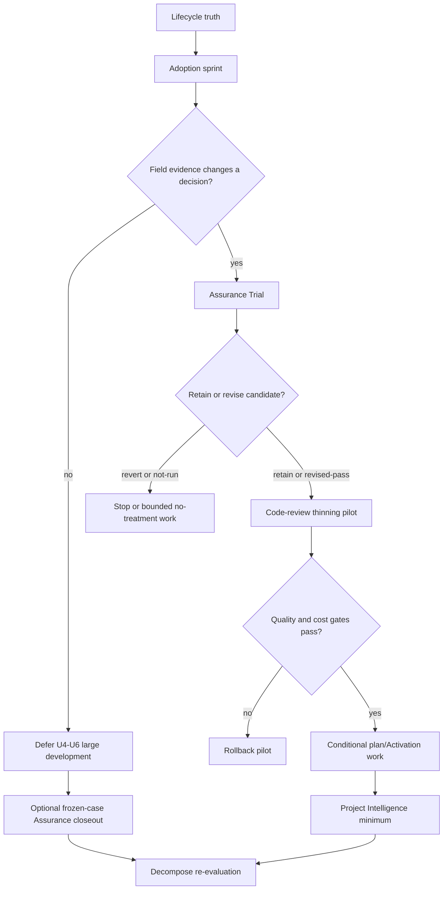
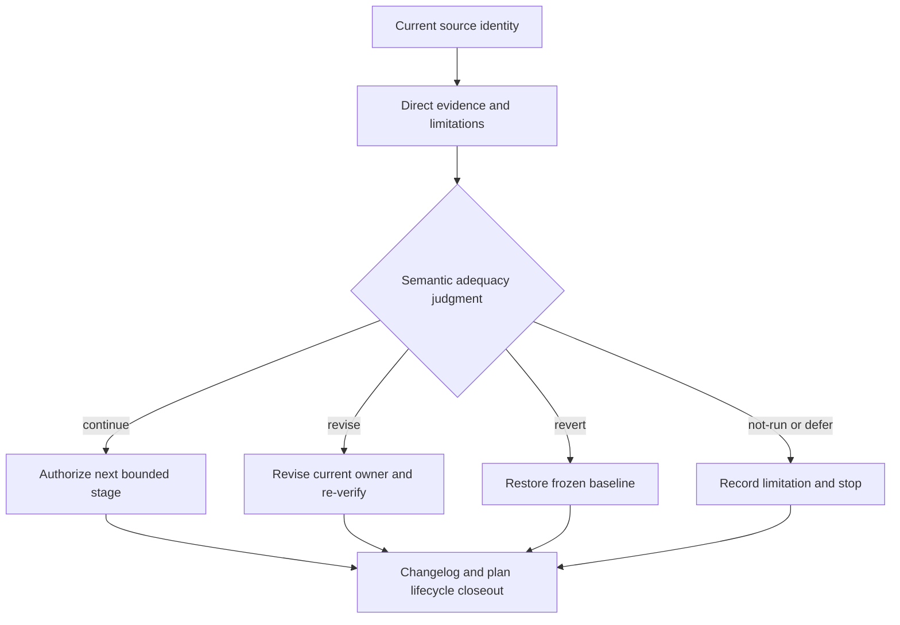

# spec-first 优化执行序列与计划收口 - Plan

## Goal Capsule

- **Objective:** 建立一份可由维护者持续跟进的 canonical 执行计划，先校正 Plan 生命周期，再用真实 Adoption 与 Assurance 证据决定 Skill 削薄、Project Intelligence 接入和 `spec-decompose` 的后续投入。
- **Recommended approach:** 按“生命周期收口 → Adoption 取证 → Assurance Trial → `spec-code-review` 削薄试点 → 条件扩展 `spec-plan` → Project Intelligence 最小接入 → `spec-decompose` 重评”顺序推进；任何阶段未满足退出 Gate 时停止后续扩张。
- **Authority hierarchy:** 当前 Plan 与项目 source 定义执行边界；脚本提供状态、测试和投射事实；LLM 与维护者判断语义充分性；真实任务参与者与 Project owner 裁决 field outcome 和继续投入。
- **Decision focus:** 先验证已有能力是否产生可信增量，再决定 Thin、Extend、Defer 或 Retire；不按现有 `active` 标签或 Plan 日期机械排队。
- **Verification focus:** 每个阶段都要有 source identity、适用 claim、直接证据、limitations、停止条件和 rollback；verification claim 不得替代 field outcome。
- **Largest risk:** 多份重叠 Plan 同时修改 `using-spec-first`、`spec-plan`、`spec-code-review`、contracts 与 projection tests，造成基线漂移、重复实现和无法归因的评测结果。
- **Stop conditions:** 上一阶段证据不足、source identity 漂移、独立评审未授权、真实 consumer 不成立，或改动需要新公共 workflow/第二套 truth source 时，停止并记录 `not-run`、`deferred`、`reverted` 或 `superseded`。

---

## Product Contract

### Summary

本计划将当前未收口的优化方案组织成一条证据驱动的执行序列。
它不承诺把所有 `active` Plan 都开发完成，而是让维护者依据真实价值、增量验证和维护成本逐阶段决定继续、修订、回退或退役。

### Problem Frame

创建本计划前，`spec-first plans audit --status active --json` 返回 7 份既有 `active` Plan、0 份 `partially-shipped`；本计划登记后 active 总数会增加 1，但原有状态与真实开发进度不一致的问题不变。
`Doctor Output UX` 已在当前 source 与 Changelog 中落地；Risk-Driven Assurance 的主要实现已完成但 Trial 仍为 `not-run`；两份 2026-07-06 Prompt 优化方案与后来的全 Skill 渐进披露方案重叠；Project Intelligence 与全 Skill 渐进披露仍是 docs-only implementation-ready；`spec-decompose` 尚无 source package，且依赖和 source/runtime 边界已经漂移。

如果按日期或 `active` 标签直接执行，维护者会重复修改同一批核心 Skill，并可能把机制存在、聚焦测试通过或 runtime projection 正常误报为真实用户价值。
需要一个独立的 canonical 计划，把生命周期清理、价值取证、验证 Trial、条件开发和退役决策连接起来，同时保持每个原 Plan 的 source ownership。

### Actors

- A1. Project owner：确认目标用户、目标任务类别、field outcome 解释和继续投入决策。
- A2. Maintainer：维护 Plan lifecycle、source/runtime 边界、证据引用和阶段 Gate。
- A3. Implementer：按当前阶段和 U-ID 修改 source，执行适用验证，不越过下一阶段 Gate。
- A4. Independent reviewer 或 human blind reviewer：只在明确授权后执行 Assurance/Prompt paired evaluation，提供与 producer self-check 分离的判断。
- A5. Opt-in field participant：提供真实 brownfield 任务、人工纠正、reopen/rollback 和 owner verdict，不被静默遥测。

### Requirements

**Lifecycle truth**

- R1. 所有当前 Plan 必须使用 canonical `active / partially-shipped / completed / superseded` 状态表达真实 lifecycle，不用 `artifact_readiness` 或正文勾选项替代进度。
- R2. 已完成、部分交付、被后续方案吸收和 lifecycle 不明的 Plan 必须逐份由 current source、tests、Changelog 或验证报告回源裁决。
- R3. 本计划只协调原 Plan 的顺序、Gate 和处置映射，不复制其完整实施细节或建立第二套 plan registry。

**Value and assurance evidence**

- R4. 大型 Skill 或 workflow 开发前，必须完成一个 opt-in First Trusted Change Adoption Sprint，记录与决策直接相关的 task class、首次可信结果时间、人工纠正、verification claim、reopen/rollback 和 owner verdict。
- R5. Adoption 记录不得包含静默 telemetry、无来源效率百分比、用户等级、徽章或与当前决策无关的长期行为数据。
- R6. 当前 Risk-Driven Assurance 必须在稳定 baseline/candidate identity 下完成 RA-01、RA-02、RA-04、RA-07 的授权独立或人工 blind Trial；不能运行时保留 `not-run`，不得建设新 Trial runner 来绕过授权缺口。

**Conditional optimization**

- R7. 全 Skill 渐进披露必须先收窄为 `spec-code-review` 单一 pilot，以 route correctness、evidence coverage、false pass、context cost、reference/tool fan-out 和人工纠正负担共同裁决。
- R8. `spec-code-review` pilot 未通过 non-compensatory Gate 时必须独立回退，且不得进入 `spec-plan`、Activation-L1 或全 Skill Wave 2。
- R9. Project Intelligence 只在 Skill 结构稳定且 confirmed consumer 存在后，以现有 contract owner 和短锚点最小接入；不得创建 provider wrapper、query dispatcher、统一 evidence graph 或强制调用状态机。

**Expansion control**

- R10. `spec-decompose` 在真实任务反复证明现有 `spec-brainstorm`、`spec-prd`、`spec-plan`、`spec-work` 与宿主 primitive 无法满足需求前保持 Defer / Re-plan，不直接进入 package 实现。
- R11. 每个阶段的继续、修订、回退、退役或 `not-run` 结果必须进入对应 source Plan、验证报告和 Changelog，且 claim 不超过证据范围。
- R12. 所有 source 变更必须保持 source-first；generated runtime 只能由 canonical source 生成和验证，不得手工修补。

### Key Flows

- F1. Lifecycle reconciliation
  - **Trigger:** 维护者开始执行本计划。
  - **Actors:** A2, A3。
  - **Flow:** 审计 canonical 与 legacy Plan，回源确认真实交付状态，更新 lifecycle 与 supersession 关系，再确认 active backlog。
  - **Outcome:** 后续执行只消费当前有效 Plan，不再把已完成或重复方案当作独立开发工作。
- F2. Evidence-gated optimization
  - **Trigger:** Lifecycle truth 已关闭，Adoption 与 Assurance evidence 可读取。
  - **Actors:** A1, A2, A4, A5。
  - **Flow:** 先采集真实任务结果，再裁决 Assurance；只有 retained candidate 才进入 Prompt pilot，pilot 通过后才进入后续 Skill 与 Project Intelligence 工作。
  - **Outcome:** 每个扩张决策都有前一阶段直接证据，失败路径停止或回退。
- F3. New-workflow re-evaluation
  - **Trigger:** 前述阶段完成，真实任务出现重复的大需求分解失败。
  - **Actors:** A1, A2, A3。
  - **Flow:** 重新验证 consumer、宿主 primitive、现有 workflow 能力和当前 source/runtime 边界，再决定 revise、defer 或 supersede `spec-decompose`。
  - **Outcome:** 只有 confirmed durable gap 才产生新的 implementation-ready successor；否则关闭新增公共 workflow 方向。

### Acceptance Examples

- AE1. 当 Doctor source、tests 和 Changelog 已证明计划目标交付时，维护者把 Doctor Plan 标记为 `completed`；不得因为仍有宿主环境 warning 而保留虚假 `active`。
- AE2. 当 Assurance 独立 reviewer 未获授权时，Trial 保持 `not-run`，后续只允许不改变 assurance treatment 的工作；不得用 self-review 或 focused tests 冒充独立 Trial。
- AE3. 当 `spec-code-review` candidate 降低 context cost 但 evidence coverage 或 false-pass 变差时，pilot 判定失败并恢复 baseline；不得用 token 收益补偿质量退化。
- AE4. 当 Project Intelligence 没有 confirmed consumer 会因缺少短锚点产生错误 claim 时，只保留现有 contract 与分类事实，不批量修改 Skill。
- AE5. 当真实任务未重复暴露跨会话 frontier、决策地图或 claim-by-assignment 缺口时，`spec-decompose` 保持 deferred 或 superseded；不得因旧 Plan 已是 implementation-ready 就开发。

### Success Criteria

- `spec-first plans audit --json` 不再把已交付 Doctor、已被吸收的 Prompt 方案或无 canonical status 的历史文档混入当前开发 backlog。
- Adoption Sprint 形成可回源、可脱敏、claim-scoped 的真实任务记录，并由 Project owner 给出继续投入裁决。
- Assurance Trial 对四个 frozen case 产生授权 verdict 或诚实 `not-run`，并明确不是 field outcome。
- `spec-code-review` pilot 有 frozen baseline、rollback 和 paired evidence；只有质量、安全与成本 Gate 同时满足才扩展。
- Project Intelligence 与 `spec-decompose` 均由 confirmed consumer 和当前 source 触发，而不是由旧 Plan 或 provider output 自动触发。

### Scope Boundaries

**In scope**

- Plan lifecycle、supersession、验证报告、Changelog 和相关 contract tests。
- First Trusted Change Adoption Sprint 的最小研究协议与结果报告。
- 现有 Assurance Trial 的授权执行与诚实 closeout。
- `spec-code-review` 优先的渐进披露 pilot，以及通过后的 `spec-plan` / Activation-L1 条件扩展。
- Project Intelligence 现有 contract 的最小 consumer 接入与 35/35 分类守护。
- `spec-decompose` 的 current-source 重评和 successor/defer/supersede 决策。

**Out of scope**

- 静默 telemetry、metrics dashboard、用户等级、徽章和无来源行业基准。
- 新公共 Assurance workflow、专用 Agent、Trial runner、统一 evidence graph 或第二套 artifact truth。
- 全宿主 × 全 workflow parity、中央路由器、动态 Prompt 平台和宿主 primitive 重建。
- 在本计划中直接实现 `spec-decompose`、tracker projection 或新的 worktree caller。

#### Deferred to Follow-Up Work

- `spec-code-review` 与 `spec-plan` pilot 通过后的全 Skill Wave 2，需要独立 successor plan 或 task pack。
- Adoption case 数量扩张、长期 field monitoring 和外部产品宣称，需要第一轮结果和独立产品决策。
- `spec-decompose` successor 仅在 U7 产生 Build verdict 后创建。

---

## Planning Contract

### Architecture Posture

采用 `reuse + extend + compose / thin-glue`，不新增执行引擎。
Lifecycle 使用现有 Plan status contract 与 `spec-first plans audit`；Adoption 和 Trial 使用现有验证文档边界；Prompt pilot 延伸现有 Skill/reference/eval owner；Project Intelligence 延伸 `docs/contracts/project-graph-consumption.md`；本计划只拥有阶段顺序、Gate 和跨 Plan 处置映射。

### Key Technical Decisions

- KTD1. 建立一份 umbrella execution plan，但不建立强状态机。（session-settled: user-approved — chosen over separate disconnected follow-up documents: 维护者希望用一个独立文档持续跟进整体规划执行。）阶段顺序是维护者决策框架；脚本不自动推进阶段，也不替代语义裁决。
- KTD2. Lifecycle reconciliation 是第一项工作。（session-settled: user-approved — chosen over executing the oldest active plan first: 当前 active 标签与真实交付状态存在 confirmed drift。）它先删除错误 backlog，再冻结后续 baseline。
- KTD3. Adoption evidence 先于大型架构开发。真实任务结果决定后续投入，不把 capability 数量、projection 通过或测试数量当成产品价值。
- KTD4. Assurance Trial 先于 Prompt treatment 变化。先裁决当前 candidate，避免 assurance 与 Prompt 重构同时变化而无法归因。
- KTD5. Prompt 优化从 `spec-code-review` 单 pilot 开始。它是当前最大核心入口，且 review outcome、false pass 与 evidence coverage 比全量迁移更容易裁决。
- KTD6. Project Intelligence 接入位于 Prompt pilot 之后。先稳定热路径和 reference ownership，再决定短锚点位置，避免新增固定上下文税和重复编辑。
- KTD7. `spec-decompose` 默认 posture 是 `Experiment / Defer`。只有 confirmed consumer、重复 field failure 和宿主能力缺口共同成立，才重写为 current-source successor。
- KTD8. 阶段 Gate 只约束退出、promotion 和副作用，不约束调查路径或语义推理。维护者可以在当前阶段补充只读证据，但不得在 exit proof 缺失时修改下一阶段 source；脚本只校验 canonical status、集合、schema、路径和测试等确定性 floor。

### High-Level Technical Design

执行序列由证据 Gate 串联，任何失败都返回当前 owner，不自动跨阶段：

每个阶段使用同一 claim/evidence 决策模型，但不共享可变运行状态：

### Interface Contracts

- **Plan lifecycle:** canonical owner 为每份 `docs/plans/*.md` 的单一 `status` 字段；`artifact_readiness` 只表示文档能否执行，不表示开发进度。
- **Adoption evidence:** 结果报告必须绑定 task class、source refs、capture window、data sensitivity、limitations 和 owner verdict；个案记录不是效率统计或产品承诺。
- **Assurance evidence:** 沿用现有 Trial case identity 与 `retain-trial / revise / revert / not-run` verdict，不新增 runner、manifest 或 artifact family。
- **Prompt pilot:** baseline/candidate、Protected Behavior Map、paired cases、rollback identity 和 non-compensatory scorecard 由 owning Plan/eval 保持；本计划只消费 verdict。
- **Project Intelligence:** `docs/contracts/project-graph-consumption.md` 继续拥有 provider advisory、trust partial order 和 source confirmation；Skill 只保留 task-shaped trigger 与 claim ceiling。
- **Runtime projection:** `skills/`、`templates/`、`src/cli/` 和 contracts 是 source；`.claude/`、`.codex/`、`.agents/skills/`、`.cursor/`、`.kiro/`、`.qoder/`、`.opencode/` 的 managed surfaces 是 generated runtime。

### Evidence and Limitations

- Current source identity: `714e4cb3b598428996e5eea3e5b21df658563deb`，采集日期 2026-08-11。
- Deterministic lifecycle evidence: 创建本计划前，`spec-first plans audit --status active --json` 返回 7 份既有 active Plan、0 份 partially-shipped Plan；实施 U1 时必须重新采集 audit，不把本 umbrella Plan 误算为待处置 predecessor。
- Current footprint evidence: `skills/spec-code-review/SKILL.md` 1035 行、`skills/spec-plan/SKILL.md` 864 行、`skills/spec-work/SKILL.md` 291 行；行数是成本事实，不是质量 Gate。
- Direct implementation evidence: `CHANGELOG.md` 记录 Doctor UX 已于 2026-07-29 与 2026-08-02 实施，Risk-Driven Assurance 主要 source 于 2026-08-05 实施。
- Trial limitation: `docs/validation/risk-driven-assurance/20260805T184057/trial-report.md` 中 RA-01、RA-02、RA-04、RA-07 均为 `not-run: dispatch_authorization_missing`。
- Adoption limitation: 当前没有完成 C2 live host、C3 real task、C4 incremental value 的 confirmed field evidence，不能外推普遍效率收益。
- Workspace limitation: 创建本计划时工作树已有用户拥有的 `.claude/settings.json`、`CHANGELOG.md` 和 ideation HTML 修改；实施者不得覆盖、回退或将它们误归入本计划 diff。
- Review limitation: 本计划生成时未获 subagent/独立 reviewer dispatch 授权；inline confidence check 不等于 independent review。
- CodeGraph/Graphify 只用于 advisory navigation；上述承重结论已由 current source、CLI audit、Changelog 或验证报告回源确认。

### Sequencing

1. U1 关闭 lifecycle truth 后冻结当前有效 backlog。
2. U2 形成真实 Adoption evidence；无 decision-changing signal 时停止 U4–U6 的大型投入，U3 只可用 frozen cases 关闭当前 Assurance candidate，不能据此解锁后续 source 变更。
3. U3 裁决当前 Assurance candidate；source treatment 变化前冻结 baseline/candidate identity。
4. U4 只执行 `spec-code-review` pilot；失败时回滚并终止 U5。
5. U5 仅在 U4 通过后执行 `spec-plan` / Activation-L1 条件工作。
6. U6 在 Prompt ownership 稳定后执行 Project Intelligence 最小接入。
7. U7 重评 `spec-decompose` 并关闭本计划的下一周期决策。

---

## Implementation Units

### U1. Reconcile plan lifecycle and supersession

- **Goal:** 让 Plan status 与当前 source 交付事实一致，形成唯一可执行 backlog。
- **Requirements:** R1, R2, R3, R11。
- **Dependencies:** 无。
- **Files:** `docs/plans/2026-07-06-001-refactor-skill-prompt-slimming-plan.md`, `docs/plans/2026-07-06-002-refactor-skill-activation-index-governance-plan.md`, `docs/plans/2026-07-11-002-refactor-spec-prd-product-decision-synthesis-plan.md`, `docs/plans/2026-07-12-003-refactor-app-assurance-compiler-plan.md`, `docs/plans/2026-07-12-004-refactor-python-graphify-provider-plan.md`, `docs/plans/2026-07-12-005-feat-spec-code-review-code-graph-advisory-integration-plan.md`, `docs/plans/2026-07-13-002-feat-workspace-readiness-guidance-plan.md`, `docs/plans/2026-07-14-002-refactor-spec-doc-review-roster-cost-shape-plan.md`, `docs/plans/2026-07-14-003-feat-spec-write-skill-authoring-workbench-plan.md`, `docs/plans/2026-07-15-001-refactor-spec-doc-review-prose-compression-plan.md`, `docs/plans/2026-07-29-001-feat-doctor-output-ux-plan.md`, `docs/plans/2026-08-04-001-feat-risk-driven-assurance-integration-plan.md`, `docs/validation/2026-05-12-plan-lifecycle-cleanup.md`, `tests/unit/plan-status-taxonomy.test.js`, `tests/unit/plans-command.test.js`, `CHANGELOG.md`。
- **Approach:** 逐份使用 current source、tests、Changelog 和 validation 回源；将两份 2026-07-06 重叠方案指向 2026-07-30 successor 并标记 `superseded`，将 Doctor 标记 `completed`，将 Assurance 标记 `partially-shipped`，对 legacy-missing 逐份选择 canonical status；证据不足时不得标记 completed。
- **Patterns to follow:** `docs/validation/2026-05-12-plan-lifecycle-cleanup.md` 的 source-backed reconciliation；`src/cli/helpers/plan-status.js` 的 canonical taxonomy。
- **Test scenarios:**
  - Audit 后已交付 Doctor 不再出现在 `active` 结果中。
  - 两份 Prompt predecessor 以单一 successor 表达，不出现两个并行 active owner。
  - Assurance 仍能表达已实施 source 与未完成 Trial，不被误标为全量 completed。
  - 8 份 legacy-missing 均获得 canonical status；缺证据的文件保持 active/partially-shipped，而不是被批量 completed。
- **Verification:** Plan audit 无 invalid lifecycle；相关 taxonomy/command tests、Changelog format 和 diff check 通过；状态说明可回源。
- **Exit Gate / rollback:** 只有逐份处置表、canonical audit 和 source refs 一致时才冻结 backlog；发现证据冲突时只回退该文件的拟议 status，并保持原状态或 `active`，不得批量推断其余文件。

### U2. Run the First Trusted Change Adoption Sprint

- **Goal:** 用真实 brownfield 任务判断当前 harness 是否缩短 time-to-trusted-change，并为后续投资提供 field decision。
- **Requirements:** R4, R5, R11。
- **Dependencies:** U1；Project owner 确认目标任务类别与参与边界。
- **Files:** `docs/validation/adoption/first-trusted-change-sprint.md`, `docs/ideation/2026-07-15-ai-coding-harness-architecture-evolution-ideation.html`, `CHANGELOG.md`。
- **Approach:** 选一个 golden journey、2–3 个可复现实例和 5–10 个 opt-in 真实任务；Project owner 是报告与字段字典 owner，参与者拥有原始内容的授权与撤回决定；仅记录 task class、首次可信结果时间、人工纠正、verification claim、reopen/rollback、source refs、limitations 和 owner verdict。公开报告只保存脱敏 decision facts；原始敏感内容不得进入仓库，run-local 原始记录在 verdict 签收或撤回后删除，确需保留的外部记录必须另有 owner、访问范围、保留期限和删除条件。
- **Execution note:** 先冻结观察字段和 case 纳入标准，再开始收集结果；缺 field participant 时保留 `not-run`，不使用合成任务冒充 field evidence。
- **Patterns to follow:** `docs/validation/2026-08-01-full-system-audit-remediation.md` 的 C1–C4 claim ceiling；`docs/validation/risk-driven-assurance/20260805T184057/trial-report.md` 的 source identity 与 limitation 纪律。
- **Test scenarios:**
  - 可复现实例与真实任务在报告中分开，不把 fixture 提升为 field outcome。
  - 人工纠正、reopen 或 rollback 为零时保留原始计数和样本限制，不推导普遍效率收益。
  - 参与者撤回或数据不可公开时，报告只保留脱敏 decision facts，不保留原始内容。
  - 无合格 case 时结果为 `not-run`，后续大型开发 Gate 保持关闭。
- **Verification:** 每个 case 可回源到任务类别和 source identity；owner verdict 明确 `continue / revise / stop / insufficient-data`；报告不含无授权敏感数据或无基线百分比。
- **Exit Gate / rollback:** 至少一个合格 field case 对后续投资产生可解释信号，且 Project owner 签收数据处理与 verdict，才允许 U3 的结果解锁后续 source 变更；否则记为 `not-run` 或 `insufficient-data`，清理 run-local 原始记录并停止 U4–U6。为关闭既有 Assurance candidate，U3 仍可在 owner 明确接受范围后只运行 frozen cases，但该结果不能冒充 field evidence。

### U3. Graduate or bound the current Assurance candidate

- **Goal:** 对当前 Risk-Driven Assurance 的增量价值做独立裁决，关闭“实现已存在但 Trial 未运行”的状态。
- **Requirements:** R6, R11。
- **Dependencies:** U2 提供至少一个适用真实任务，或记录 owner 接受只运行 frozen cases 的范围；明确的 independent/human blind review 授权。
- **Files:** `docs/plans/2026-08-04-001-feat-risk-driven-assurance-integration-plan.md`, `docs/validation/risk-driven-assurance/`, `tests/unit/verification-run-summary.test.js`, `tests/unit/honest-closeout.test.js`, `CHANGELOG.md`。
- **Approach:** 在任何 reviewer output 前冻结 baseline/candidate source identity、RA-01/02/04/07 cases、rubric、cost observation 和 verdict 阈值；运行授权独立或 human blind review；结果只允许 `retain-trial / revise / revert / not-run`，并同步 Plan lifecycle。
- **Execution note:** 不以新 runner 或新 Agent 解决授权缺口；source 变化导致 identity 漂移时废弃该轮并重新冻结。
- **Patterns to follow:** `docs/validation/risk-driven-assurance/20260805T184057/trial-report.md` 的 immutable case identity、raw refs 和 limitations。
- **Test scenarios:**
  - RA-01 识别低风险任务的额外 ceremony，质量收益不能用高风险 case 补偿。
  - RA-02/04 识别 risk-to-proof、authority 和 source binding 缺口。
  - RA-07 对遗漏 required proof 的 candidate 不产生 false-green retain verdict。
  - 缺授权、identity 漂移或 reviewer 非独立时输出 `not-run`，不生成 retain verdict。
- **Verification:** Trial report 包含 source identity、case verdict、review method、raw refs、cost/quality observation、limitations 和 owner decision；任何 source 修订有 focused regression evidence。
- **Exit Gate / rollback:** 只有授权 review 产生 `retain-trial`，或 `revise` 后按同一冻结合同复验通过，才允许改变后续 assurance treatment；`revert` 恢复 frozen baseline，`not-run` 仅允许 U4 中不改变 treatment 的测量性候选。

### U4. Execute the spec-code-review thinning pilot

- **Goal:** 在不降低 review correctness、evidence coverage 和 hard exits 的前提下，减少最大核心入口的固定上下文与重复治理成本。
- **Requirements:** R7, R8, R11, R12。
- **Dependencies:** U2 产生 Project owner 签收的 decision-changing field signal；U3 为 `retain-trial` 或 `revise` 后复验通过；如 U3 为 `not-run`，仅允许不改变 assurance treatment 的候选并在 verdict 中标记 model/source scope。
- **Files:** `skills/spec-code-review/SKILL.md`, `skills/spec-code-review/references/`, `skills/spec-code-review/evals/`, `docs/validation/<date>-skill-system-progressive-disclosure-baseline.md`, `docs/validation/<date>-skill-progressive-disclosure-pilot-results.md`, `tests/unit/spec-code-review-contracts.test.js`, `tests/unit/spec-code-review-mechanics.test.js`, `tests/unit/spec-code-review-peer-runner.test.js`, `tests/unit/host-runtime-projection-contracts.test.js`, `CHANGELOG.md`。
- **Approach:** 先冻结 Protected Behavior Map、baseline source 和 rollback；按 keep/distill/move/deterministic-handoff/delete 分类，保留 route boundary、authority、hard exits、decision/fallback、evidence/artifact obligations 与 done signal；paired candidate 同时测量 route correctness、finding/evidence quality、false pass、context bytes、reference/tool fan-out、wall time 和人工纠正负担。
- **Execution note:** 先做 characterization 和 baseline replay，再修改 Prompt；candidate 失败时恢复 frozen baseline，不保留 dead-end reference 或重复 prose。
- **Patterns to follow:** `docs/solutions/architecture-patterns/front-controller-triggered-references-gates-eval-regression-2026-07-01.md`, `docs/solutions/architecture-patterns/rebar-structure-skill-simplification-pattern-2026-06-04.md`。
- **Test scenarios:**
  - report-only、agent mode、conflicting scope、security、reliability、testing 和 deployment activation cases 在 candidate 中保持原 claim ceiling。
  - reference trigger 缺失或 unread fallback 不充分时 focused contract test 失败。
  - candidate 降低字节但遗漏 finding、放宽 mutation/landing authority 或产生 false pass 时 pilot 判定失败。
  - supported host projection 由 source 生成；未验证 loader 的宿主标记 degraded，不把 line delta 当 activation-token 收益。
- **Verification:** Focused contracts/evals、Skill lint、typecheck、projection tests 和 paired review evidence通过；non-compensatory scorecard 全轴达标；rollback source identity 可验证。
- **Exit Gate / rollback:** 安全、正确性、兼容性、route/retention、主成本目标和治理 TCO 全轴通过才 promotion；任一轴失败即恢复 frozen baseline、删除 dead-end extraction，并禁止 U5。

### U5. Conditionally extend the thinning pattern

- **Goal:** 只有 U4 通过后，才对 `spec-plan` 和少量 Activation-L1 offender 复用已验证的削薄模式。
- **Requirements:** R7, R8, R11, R12。
- **Dependencies:** U4 通过全部 promotion Gate；第二模型族/能力层验证可用，或结果明确保持 model-scoped 而不进入通用 authoring governance。
- **Files:** `skills/spec-plan/SKILL.md`, `skills/spec-plan/references/`, `skills/using-spec-first/`, `scripts/lint-skill-entrypoints.js`, `scripts/lint-skill-entrypoints.config.json`, `tests/unit/spec-plan-contracts.test.js`, `tests/unit/spec-plan-quality-contracts.test.js`, `tests/unit/spec-plan-consumer-replay-contracts.test.js`, `tests/unit/lint-skill-entrypoints.test.js`, `CHANGELOG.md`。
- **Approach:** 复用 U4 已证明的语义萃取、trigger map、deterministic handoff 和 rollback；Activation-L1 先产出 current 35-skill baseline 与 route-collision coverage，只压缩 confirmed offender；不为了统一格式改写 `using-spec-first` 或已作为 control 的 `spec-work`。
- **Test scenarios:**
  - `spec-plan` 的 Product Contract authority、requirements-only fail-closed、planning-only 和 handoff Gate 在 candidate 中保持。
  - route-collision fixture 只校验结构/覆盖；语义 adequate 由 fresh-source/human review 判断。
  - description 缩短后仍保留 trigger、exclude 和定位；核心相邻 workflow 不出现误触发。
  - U4 evidence 不可复用或第二模型验证失败时，U5 保持 deferred，不发布 Wave 2。
- **Verification:** `spec-plan` focused tests、route fixture tests、Skill lint、typecheck、paired A/B 和适用 projection tests 通过；结果明确 model/host scope；没有全 Skill rollout side effect。
- **Exit Gate / rollback:** 只有 `spec-plan` pilot 与已确认的 Activation-L1 offender 各自通过 U4 同等级 Gate，才保留对应 source；某一 target 失败只回退该 target，不以其他 target 的收益补偿，也不授权全 Skill Wave 2。

### U6. Add minimum Project Intelligence consumption

- **Goal:** 在 Prompt ownership 稳定后，让高权威代码结论 consumer 以最小短锚点消费现有 Project Intelligence contract。
- **Requirements:** R9, R11, R12。
- **Dependencies:** U5 完成或被明确 deferred 且目标 Skill source 已稳定；逐 consumer 证明缺口会改变 claim 或验证决策。
- **Files:** `docs/plans/2026-07-30-002-refactor-project-intelligence-skill-consumption-plan.md`, `docs/contracts/project-graph-consumption.md`, `skills/using-spec-first/SKILL.md`, `skills/using-spec-first/references/conditional-routing-boundaries.md`, `skills/spec-app-consistency-audit/SKILL.md`, `skills/spec-code-review/SKILL.md`, `skills/spec-compound/SKILL.md`, `skills/spec-compound-refresh/SKILL.md`, `skills/spec-debug/SKILL.md`, `skills/spec-plan/SKILL.md`, `skills/spec-prd/SKILL.md`, `skills/spec-rule-miner/SKILL.md`, `skills/spec-work/SKILL.md`, `tests/unit/project-graph-consumption-contracts.test.js`, `tests/unit/using-spec-first-contracts.test.js`, `tests/unit/host-runtime-projection-contracts.test.js`, `CHANGELOG.md`。
- **Approach:** 先重新确认 successor Plan 中 9 个 H consumer 的 current roster 与逐项缺口；只有缺少短锚点会改变 finding、root cause、implementation basis、knowledge promotion、PRD/source contract 或 completion claim 的 consumer 才修改。随后验证 shared contract 的 task-shaped trigger、trust partial order、negative authority 和 direct-source-valid 边界，为 confirmed consumer 增加 2–4 句 self-contained anchor，并建立 current-roster exhaustive H/I/O/N classification；分类计数是实施时 snapshot，不把“35”硬编码为永久产品 invariant，无 consumer 的 Skill 保持 no-change。
- **Test scenarios:**
  - Provider 候选未经 source/test/log/contract 回源时不能进入 confirmed conclusion。
  - CodeGraph/Graphify 不可用或 stale 时 direct source read 仍合法，workflow 以 limitation 继续。
  - 新增/删除 canonical Skill 时分类测试 fail closed，要求显式归类。
  - SessionStart 或 host projection 不注入完整 graph policy、provider commands 或 readiness snapshot。
- **Verification:** Contract/classification/focused consumer tests、Skill lint、typecheck 和 supported-host source projection 通过；未新增 provider wrapper、dispatcher、schema 或 graph-specific artifact。
- **Exit Gate / rollback:** 每个修改过的 consumer 都必须有可复现的 candidate-overreach 场景和 direct-source fallback；未证明缺口的 target 保持 no-change。锚点引发上下文或行为回归时，按 consumer 独立回退并保留共享 contract/classification floor。

### U7. Re-evaluate spec-decompose and close the program cycle

- **Goal:** 根据 U2–U6 的真实证据决定 `spec-decompose` 是 revise、defer 还是 supersede，并关闭本轮优化计划的 claim。本 U7 是 `spec-decompose` successor Plan 的**唯一创建/授权 owner**：消费 `docs/plans/2026-07-28-002-feat-spec-decompose-vertical-closed-loop-plan.md` U5 的 case-local recommendation 与全局 Adoption/Assurance/Project Intelligence 证据；`2026-07-28-002` 自身不得直接创建 successor。
- **Requirements:** R10, R11, R12。
- **Dependencies:** U2 完成；U3–U6 已完成、停止、回退或记录 deferred verdict。
- **Files:** `docs/plans/2026-07-28-002-feat-spec-decompose-vertical-closed-loop-plan.md`, `skills/using-spec-first/references/public-route-map.md`, 当前 `spec-brainstorm` / `spec-prd` / `spec-plan` / `spec-work` source，`CHANGELOG.md`；只有 Build verdict 才新增 successor plan。
- **Approach:** 用真实任务 failure 复核跨会话 frontier、决策地图、claim-by-assignment 和 tracker projection 是否为 confirmed durable gap；重新盘点宿主 task/team primitive、已退役依赖、source owner、runtime projection 和 consumer；`revise` 生成 current-source successor，`defer` 保持非执行状态，`supersede` 明确替代能力和证据。
- **Test scenarios:**
  - 没有重复 field failure 时不创建 `skills/spec-decompose/`。
  - 现有 workflow 或宿主 primitive 可满足需求时选择 Adopt/Extend，而不是新 public workflow。
  - Build verdict 必须有 confirmed consumer、source owner、failure modes、migration、rollback 和 test plan。
  - 任何 successor 只引用 source paths，不以 `.cursor/skills/` 等 generated mirror 作为实现 owner。
- **Verification:** 原 Plan lifecycle 与 verdict 一致；如产生 successor，其 Product Contract、Implementation Units、Verification Contract 和 DoD 均 current-source ready；本计划所有阶段 verdict、limitations 和未运行项在 Changelog/validation 中可追踪。
- **Exit Gate / rollback:** `revise` 只有在 confirmed durable gap、consumer、source owner、失败模式和验证路径同时成立时才创建 successor；否则选择 `defer` 或 `supersede`。如重评期间发现前序 evidence 不可复验，撤销 Build verdict，不创建 package 或 generated runtime。

---

## System-Wide Impact

| Surface | Scope | Decision |
|---|---|---|
| Plan lifecycle | in-scope | 统一 canonical status 与 supersession，消除 false backlog。 |
| Product strategy / adoption | in-scope | 只建立本轮 field evidence 与 owner verdict，不虚构产品指标。 |
| Core Skill prompts | conditional | 仅 U4/U5 Gate 通过后修改 source；失败独立回退。 |
| Project graph providers | boundary-only | Provider lifecycle 仍归 Runtime Setup；本计划只改 consumer claim ceiling。 |
| Host runtime projection | verification-only | 只从 source 生成；不追求全宿主 feature parity。 |
| CLI/schema | out-of-scope by default | 除非现有 owner 无法表达 confirmed deterministic invariant，否则不新增。 |
| New public workflow | deferred | `spec-decompose` 仅重评，不直接实现。 |
| Data/privacy | in-scope for Adoption | opt-in、最小字段、脱敏、撤回和 claim ceiling。 |

---

## Risks and Dependencies

| Risk | Impact | Mitigation / Gate |
|---|---|---|
| Lifecycle 状态被批量“清零” | 历史未完成工作被虚假关闭 | 每份 Plan 必须有 current source/Changelog/test/validation 证据；缺证据不得 completed。 |
| Field sample 过小 | 个案被外推为产品收益 | 报告限定 task class、样本和观察窗；owner verdict 不发布普遍百分比。 |
| Independent review 未授权 | Assurance/Prompt candidate 无法裁决 | 保持 `not-run` 或 model-scoped；不建 runner/Agent 绕过。 |
| Prompt pilot 与 Assurance 同时变化 | 效果无法归因 | U3 先冻结并裁决；U4 使用独立 baseline/candidate。 |
| Reference extraction 隐藏承重规则 | route、authority 或 evidence 回归 | Protected Behavior Map、trigger tests、fresh-source/human review 和 rollback。 |
| Project Intelligence 变固定上下文税 | 所有 Skill 成本上升且双重真相 | confirmed consumer gate、短锚点、单 contract owner、no-change 合法。 |
| `spec-decompose` 旧依赖漂移 | 实现违反当前 source/runtime 与宿主边界 | U7 重新规划；旧 Plan 不直接进入执行。 |
| Dirty worktree 交叉污染 | 覆盖用户已有修改或错误归因 | 实施前重读 status/diff；保持 scoped edits；不回退 `.claude/settings.json` 等用户改动。 |

---

## Verification Contract

| Gate | Applicability | Evidence owner | Required outcome |
|---|---|---|---|
| `node bin/spec-first.js plans audit --json` | U1、U7 closeout | CLI deterministic floor | Plan status 全部 canonical，current backlog 与说明一致。 |
| Plan lifecycle focused Jest | U1 | `tests/unit/plan-status-taxonomy.test.js`, `tests/unit/plans-command.test.js`, `tests/integration/plan-status-closeout.integration.test.js` | status taxonomy、audit 与 closeout contract 通过。 |
| Adoption report review | U2 | Project owner + direct case refs | case 可回源、字段最小、limitations 完整、无未授权数据。 |
| Assurance Trial | U3 | Authorized independent/human blind reviewer | RA-01/02/04/07 得到合法 verdict 或诚实 `not-run`。 |
| Skill focused tests/evals | U4–U6 | owning Skill/test suites | Protected behavior、route、authority、evidence 与 failure paths 无回归。 |
| `npm run lint:skill-entrypoints` | U4–U6 | Skill governance | entrypoint、reference、description 与 route contract 通过。 |
| `npm run typecheck` | 任何 JS/script/source 变更 | Repository syntax floor | 所有检查文件语法通过。 |
| `npm run test:unit` | U4–U6 跨 owner 修改 | Unit regression | 相关主链全绿；既有失败必须基线化并证明无新增回归。 |
| `npm run test:smoke` / `npm run test:integration` | CLI、projection 或跨 workflow 行为改变 | Smoke/integration owners | 受影响 journey 通过；不适用时记录原因。 |
| `npm run build` | 发布包 surface 改变 | Package owner | package dry-run 内容与 source/runtime 预期一致。 |
| Fresh-source / paired semantic review | U3–U6 行为语义改变 | Authorized reviewer | 与 producer self-check 分离；不可用时不得声称通过或 promotion。 |
| `git diff --check` | 每个阶段 | Git deterministic floor | 无空白错误；diff 只含当前阶段授权范围。 |

Verification claim 必须同时说明 source identity、实际执行的 checks、未运行项、evidence authority、source binding 和最大未证实风险。
Required proof 缺失时不能把阶段标为 verified，也不能进入依赖该 proof 的下一阶段。
Generated runtime verification 只能使用 `spec-first init` 从 source 重建；是否执行 runtime mutation需要单独授权。

---

## Definition of Done

### Global

- 所有原 Plan 均有 canonical lifecycle 或明确 successor，`plans audit` 不再产生误导性 backlog。
- Adoption Sprint 和 Assurance Trial 各自形成 claim-scoped、可回源的 verdict；fixture、self-check 和 field outcome 保持分层。
- `spec-code-review` pilot 有 frozen baseline、paired evidence、rollback 和 non-compensatory verdict。
- `spec-plan` / Activation-L1、Project Intelligence 和 `spec-decompose` 只在前置 Gate 满足时进入；未满足时有明确 deferred/reverted/superseded 记录。
- Scripts 只强制确定性 floor，LLM/human 保留语义与价值判断；没有新增强状态机、中央 orchestrator 或第二 truth source。
- 所有 source 变更更新 Changelog 和适用 docs/tests；generated runtime 未被手改。
- 所有实验 dead-end、临时 candidate、无 consumer reference 和 run-local scratch 在 closeout 前清理；冻结 baseline/validation evidence 按其 retention contract 保留。
- 最终 claim 明确 host/model/task/sample/时间范围与 limitations，不声称普遍效率、全宿主 parity 或 field-proven adoption，除非直接证据支持。

### Per-unit completion

- U1：创建本计划前识别的 7 份既有 active 与 8 份 legacy-missing Plan 完成 source-backed lifecycle reconciliation；本 umbrella Plan 由最终 shipping-tail owner 单独 closeout。
- U2：Adoption 报告包含合格 cases、limitations 和 owner verdict，或诚实 `not-run` 并停止大型开发。
- U3：Assurance Trial 产生合法 verdict，Plan lifecycle 与 source treatment 一致。
- U4：`spec-code-review` candidate 通过全部 Gate并可回滚，或已恢复 baseline并记录失败原因。
- U5：只有 U4 通过时才产生 `spec-plan` / Activation 结果；否则明确 deferred 且无 Wave 2 side effect。
- U6：只有 confirmed consumer 获得 Project Intelligence 短锚点，35/35 分类与 projection evidence 完整。
- U7：`spec-decompose` 得到 revise/defer/supersede verdict；只有 Build verdict 才存在 current-source successor。

---

## Sources and Research

- `docs/10-prompt/结构化项目角色契约.md`
- `docs/ideation/2026-07-15-ai-coding-harness-architecture-evolution-ideation.html`
- `docs/validation/2026-08-01-full-system-audit-remediation.md`
- `docs/validation/risk-driven-assurance/20260805T184057/trial-report.md`
- `docs/plans/2026-07-06-001-refactor-skill-prompt-slimming-plan.md`
- `docs/plans/2026-07-06-002-refactor-skill-activation-index-governance-plan.md`
- `docs/plans/2026-07-28-002-feat-spec-decompose-vertical-closed-loop-plan.md`
- `docs/plans/2026-07-29-001-feat-doctor-output-ux-plan.md`
- `docs/plans/2026-07-30-002-refactor-project-intelligence-skill-consumption-plan.md`
- `docs/plans/2026-07-30-002-refactor-skill-system-progressive-disclosure-plan.md`
- `docs/plans/2026-08-04-001-feat-risk-driven-assurance-integration-plan.md`
- `docs/contracts/project-graph-consumption.md`
- `docs/solutions/architecture-patterns/front-controller-triggered-references-gates-eval-regression-2026-07-01.md`
- `docs/solutions/architecture-patterns/rebar-structure-skill-simplification-pattern-2026-06-04.md`
- `src/cli/helpers/plan-status.js`
- `src/cli/commands/plans.js`
- `CHANGELOG.md`
