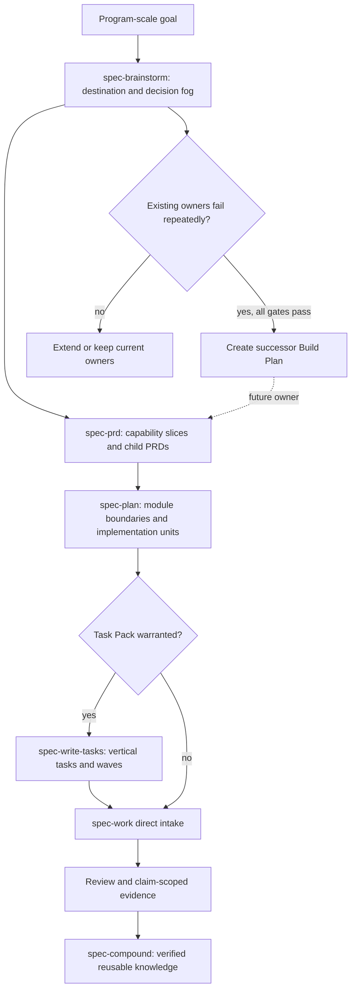

# spec-first 能力缺口闭环技术优化 - Plan

## Goal Capsule

- **Objective:** 在不扩张为 Skill 集合或中央流程引擎的前提下，优先补足经 field evidence 证明的超大需求治理与跨阶段语义连续性；对领域设计、探索性验证和少数特殊工程场景只形成 demand disposition 与 successor 边界，使投入聚焦真实主约束并可安全停止。
- **Recommended approach:** 采用 `prove demand in the owning experiment -> extend the smallest existing owner -> verify consumer continuity -> create a successor Plan only if a durable gap remains`；当前 Plan 不直接 Build `spec-decompose`，也不把 peripheral candidates 纳入核心 source-mutation 批次。
- **Authority hierarchy:** 当前用户确认的方案范围与 Product Contract 拥有 WHAT；current source、contracts、tests 和 field evidence 约束 HOW；外部 Engineering Skills 与 CodeGraph 只提供 advisory 候选。
- **Decision focus:** 把需求级 capability slicing、实现级 vertical tasks、领域模型、prototype、feedback triage、merge conflict 与 manual wizard 放回各自 owner，避免第二套 truth source、状态机或通用 orchestrator。
- **Verification focus:** 每个能力必须同时证明 route correctness、artifact/consumer compatibility、claim ceiling、runtime projection 边界与真实任务增量；测试或文档存在不能替代 field outcome。
- **Largest risk:** 一次性把所有局部空白产品化，导致公共入口、Prompt 上下文、投射面和治理测试同步膨胀，却没有 confirmed consumer。
- **Stop conditions:** existing owner 已能稳定完成任务、候选只改善文档外观、行为收益不可复验、任一 hard boundary 退化、需要复制宿主 primitive，或没有 owner/consumer/invalidation condition 时停止对应能力扩张。
- **Execution profile:** Deep Plan，但执行批次收窄为 requirements decomposition / consumer continuity 核心闭环；先由 owning experiment 提供 field demand，再做最小 source 改动，最后才刷新 generated runtime。domain、prototype、feedback、merge conflict 与 wizard 仅保留 demand-only 候选通道。
- **Tail ownership:** U1 必须先把 `docs/plans/2026-07-28-002-feat-spec-decompose-vertical-closed-loop-plan.md` 收窄为 `spec-decompose` field experiment、canonical report root 与 case-local Extend/Defer/Retire recommendation owner，并把 `docs/plans/2026-08-11-001-refactor-optimization-execution-sequence-plan.md` U7 固定为跨计划重评、全局投入顺序与是否创建 successor Plan 的最终 program-decision owner；完成该 reconciliation 后，本计划只读消费两层结果，并拥有未被其覆盖的 PRD -> Plan consumer-continuity 技术改动。

---

## Product Contract

### Summary

当前 `spec-first` 已覆盖 `Codebase -> Spec -> Plan -> Tasks -> Code -> Review -> Knowledge` 主链，缺口主要发生在大目标进入单个 Product Contract 之前、跨 artifact 语义传递之中，以及少数需要探索或人工参与的工程场景。
本方案通过现有 owner 优先扩展、真实 consumer 验证和条件晋升，把候选能力做成可治理的闭环，而不是继续增加入口数量。

### Problem Frame

外部 `mattpocock/skills` Engineering Skills 提供了 `wayfinder`、`to-spec`、`to-tickets`、prototype、merge-conflict 与 wizard 等实践，但其中不少能力同时携带 tracker、claim、worktree 和默认并行执行假设。
当前源码已经具备 `spec-prd` Feature Slices / child PRD、`spec-plan` Implementation Units、`spec-write-tasks` vertical slices / blocking waves、`spec-handoff` continuity、`spec-work` bounded execution 与 `spec-compound` durable knowledge。
真正的问题不是“缺少同名 Skill”，而是这些 owner 之间尚未形成一条经过真实任务证明的 requirements-level decomposition、domain continuity 与 conditional capability promotion 链。

### Actors

- A1. **Program owner:** 确认超大目标、共享约束、跨 release 边界和继续投入条件。
- A2. **Product owner:** 确认每个 Product Contract 的业务闭环、验收、优先级与真实业务依赖。
- A3. **Maintainer:** 维护 canonical Skill、contract、eval、projection 和 rollback，裁决 Extend / Build / Defer / Retire。
- A4. **Implementer:** 按 U-ID、source refs 和 Verification Contract 修改源码，不把计划假设升级为产品事实。
- A5. **Reviewer / consumer:** 验证 artifact 是否可被下一阶段消费，并区分机制通过、真实宿主行为与 field outcome。

### Requirements

**超大需求与跨阶段连续性**

- R1. 系统必须在需求阶段区分 decision fog、可回答的 sharp question、已确认功能边界和不可拆分区域，不把尚未理解的区域预造为任务。
- R2. 超大目标在进入单个 `spec-plan` 前必须能形成多个 actor-trigger-outcome 闭环，每个闭环拥有独立 scope、acceptance、业务依赖与 origin trace。
- R3. 需求级功能切片与实现级 vertical task 必须是两次独立拆分；前者由 Product Contract owner 确认，后者由 Plan / Task Pack owner编译。
- R4. child requirement、Plan、Task Pack 和 execution evidence 必须保持稳定 trace、freshness 与 source identity；上游变化可被下游发现，但不得引入第二套 progress truth。

**Peripheral successor constraints：领域设计与知识连续性**

- R5. 本计划必须先判断领域连续性是否达到 KTD9 recurring-loss threshold；只有 successor 被触发时，才要求 PRD 闭合术语、不变量、状态转换和 ownership，并由 Plan 映射模块接口与 failure boundary。
- R6. 任何 future domain successor 仍必须保持 knowledge-promotion Gate：只有跨至少两个真实 consumer、可回源且带 invalidation condition 的领域词汇或模式，才可由 `spec-compound` 晋升到 `CONCEPTS.md` 或 `docs/solutions/`。
- R7. 任何 future deep-module successor 必须描述模块抽象、隐藏复杂度和消费者契约，不得退化为文件清单或通用术语汇编；本计划只裁决是否值得立项。

**Peripheral successor constraints：条件能力**

- R8. 本计划只裁决 prototype demand；任何 future successor 必须让原型回答明确决策问题，预先定义观察指标与保留/丢弃条件，并禁止未经独立实现审查直接进入生产源码。
- R9. 本计划只裁决 feedback route-loss demand；任何 future successor 必须把反馈事实、LLM disposition 与 mutation authority 分离，并复用既有 workflow owner，不新增统一 issue 状态机。
- R10. 本计划只裁决 merge-conflict demand；任何 future successor 必须按 source、Plan、test 和 commit intent 逐个解析语义冲突，禁止以整文件 ours/theirs 或未授权 abort 覆盖真实意图。
- R11. 本计划只裁决 manual wizard demand；只有 agent 无法完成的外部操作达到 KTD9 threshold 且存在 confirmed consumer 时，successor 才可设计 preview-first 步骤、人工 owner、脱敏 receipt、verification 与 rollback；`spec-runtime-setup` 仍只拥有 harness runtime readiness。

**治理与证据**

- R12. 每个新增 source surface 必须记录 `reuse / extend / compose / new` posture、canonical owner、consumer、failure mode、rollback 和退役条件。
- R13. Skill prose 行为变更必须使用 current source 的 focused contracts 与 fresh-source eval；当前会话缓存或 generated runtime mirror 不构成通过证据。
- R14. 所有 public Skill 或 runtime projection 变化必须从 `skills/`、`templates/`、`src/cli/` 等 source 生成，并验证受支持宿主；不得手改 `.claude/`、`.codex/`、`.agents/skills/` 等 mirror。
- R15. promotion 使用 non-compensatory Gate：route correctness、semantic quality、consumer outcome、safety/authority、runtime cost 和 field outcome 任一必需轴失败，候选不得因其他轴收益而晋升。
- R16. 测试、eval、review 或 artifact 存在只证明对应机制；真实采纳、效率、质量和用户收益必须由独立 field evidence 支撑。

### Key Flows

- F1. **Program decomposition:** A1 提供超大目标；`spec-brainstorm` 先收敛 destination、fog 与 decision frontier；`spec-prd` 形成 owner-confirmed Feature Slices / child PRDs；每个 child 独立进入 `spec-plan`。
- F2. **Consumer continuity:** A4 从 child PRD 生成 Plan；`spec-write-tasks` 只在依赖和规模需要时编译 Task Pack；`spec-work` 按 source fingerprint 执行并产出 claim-scoped evidence。
- F3. **Domain demand disposition:** A2/A3 提供真实语义丢失 occurrence；U6 比较当前 PRD/Plan/Compound owner 与纠正成本；未达 KTD9 threshold 时 Defer，达到时创建 successor Plan。
- F4. **Exploration and special-scenario demand:** U7/U9/U10 只记录 prototype、merge conflict、manual wizard 的真实损失、consumer 和 owner；本计划不执行新 mode/reference/schema。
- F5. **Feedback demand disposition:** U8 只记录 `spec-sweep` 真实错路由与人工纠正；达到 threshold 时 successor 仍必须保持 provider fact、LLM judgment 与 mutation authority 分离。
- F6. **Conditional promotion:** A3 汇总 baseline/candidate/consumer evidence；逐轴执行 Gate；选择 Extend、Build、Defer 或 Retire，并刷新 lifecycle、docs、tests 和 runtime expectations。

### Acceptance Examples

- AE1. 一个“跨市场组件化”目标仍含共享层、市场定制和采纳治理的决策迷雾时，系统先澄清边界，再生成多个独立 Product Contract；不会直接产出前端、后端、测试三类水平任务。
- AE2. 一个边界已经清晰的 oversized brownfield PRD 由 `spec-prd` 生成 Feature Slices 和 child PRD；候选 `spec-decompose` 不触发。
- AE3. 当 producer receipt diagnostic、显式 consumer re-read 或其他 current-source evidence 发现 child PRD 的 acceptance / source identity 漂移时，既有 Plan 被要求重读，随后由 Task Pack 自己的 `source_plan_hash` 判断是否需重新生成；未运行 optional diagnostic 时必须记录 freshness degraded，不能声称系统已自动发现 stale。
- AE4. 一次 prototype occurrence 未达到 KTD9 threshold 时，本计划只记录 Defer；若 successor 被触发，它必须保证决策回写、默认 cleanup 和独立 production-quality review。
- AE5. 一条 feedback 错路由没有形成重复损失时，本计划不改 `spec-sweep`；若 successor 被触发，它仍不得把 provider claim 当完成证据或把新需求直接送入 mutation。
- AE6. 一个复杂 merge conflict occurrence 先由 Direct Lane / current `spec-work` 处理；只有重复高损失才创建 successor，且 successor 不得使用 broad ours/theirs 或获得未授权 abort 权限。
- AE7. 一个 manual-only 第三方配置没有 confirmed recurring consumer 时只记录场景；若 successor 被触发，receipt 不得记录 secret，存在也不证明外部系统最终可用。
- AE8. 三个真实 program-scale 案例均能由 existing owners 完成时，`spec-decompose` Gate 失败并维持 Defer，即使候选文档质量更高。

### Success Criteria

- owning experiment 的三类 program-scale field cases 都有 frozen input、existing-owner baseline、candidate、consumer outcome、source identity 和 limitation；case-local recommendation 与 program decision 可分别回源复验。
- child requirement -> Plan -> Task Pack -> execution 的 current-source contract tests 覆盖成功、stale、blocking WHAT 和 degraded host 路径。
- 核心 program field outcome 只引用 owning `docs/validation/spec-decompose/**`；domain、prototype、feedback、merge conflict 和 wizard 各自形成 demand disposition，不以固定案例总数阻塞核心 closeout。
- prototype、feedback triage、merge conflict 和 wizard 在本计划中只完成 demand/behavior disposition；没有 confirmed recurring loss、consumer 和独立 successor Plan 的候选不得修改公共 Skill source。
- 所有保留的 prose/source 变更通过 focused deterministic tests、fresh-source eval、Skill lint、typecheck 与适用的 host projection tests。
- 完成声明逐项对账 required proof intents，并明确区分 source mechanism、真实宿主 loader、真实任务结果与 field outcome。

### Scope Boundaries

**In scope**

- 扩展既有 canonical Skill、reference、eval 与 contract tests。
- 建立 requirements-level decomposition 的真实案例 baseline/candidate 证据。
- 为 domain continuity、throwaway prototype、feedback disposition、merge-conflict 和 manual-step 建立 source-backed demand disposition 与 successor trigger，不在本计划实现其运行行为。
- 消费 owning `spec-decompose` experiment 的 case-local Extend / Defer / Retire recommendation，以及 `2026-08-11-001` U7 的 program-level decision；只有后者决定 Build-successor 时，本计划才记录 handoff，且不直接创建 Skill。

**Out of scope**

- tracker canonical source、claim-by-assignment、per-ticket worktree、默认 subagent 并行或中央 orchestrator。
- 新建 `spec-tdd`、`spec-research`、`spec-wayfinder`、通用 `spec-triage` 或一组与外部同名的 Skill。
- 让脚本判断业务边界、架构充分性、review 结论或优先级。
- 把 prototype、test fixture、provider graph 或 transcript claim 当 production/field evidence。
- 手改 generated runtime，或在无真实 loader 证据时宣称全宿主 feature parity。

### Dependencies and Assumptions

- 依赖 `docs/plans/2026-07-28-002-feat-spec-decompose-vertical-closed-loop-plan.md` 的 U2 field experiment、canonical summary 与 case-local recommendation。
- 依赖 `docs/plans/2026-08-11-001-refactor-optimization-execution-sequence-plan.md` 完成 lifecycle reconciliation，并由 U7 基于全局证据给出是否创建 successor Plan 的 program decision；本计划不得绕过或覆盖任一 owner。
- 假设当前 `spec-prd` Feature Slices / child PRD、`spec-write-tasks` waves 和 `spec-work` source binding 仍是 current owner；执行前必须重读 source，不能只依赖本计划快照。
- 真实 field case、外部系统和独立 fresh-source reviewer 需要单独授权；缺失时可继续协议、fixture 和 report-only characterization，但不得修改由该 field demand 支撑的 canonical Skill source，也不得形成 retained/promotion claim。

---

## Planning Contract

### Architecture Posture

总体采用 `extend + compose + experiment-owned successor`。
`spec-brainstorm` 拥有 decision fog，`spec-prd` 拥有 requirements-level capability slices，`spec-plan` 拥有 HOW 和 module boundary，`spec-write-tasks` 拥有 execution slices，`spec-work` 拥有实现与特殊执行策略，`spec-sweep` 拥有反馈采集，`spec-compound` 拥有 verified knowledge promotion。
只有 owning `spec-decompose` experiment 证明上述组合无法形成稳定 consumer handoff 时，才允许另建 successor Plan 讨论 `new: spec-decompose`；本计划不直接创建该 owner。

### Key Technical Decisions

- KTD1. **全局顺序不在本计划重复建模。** `docs/plans/2026-08-11-001-refactor-optimization-execution-sequence-plan.md` 是 program sequencing owner；本计划只提供各能力工作流的可执行技术单元。
- KTD2. **先证明真实需求，再扩展最小既有 owner。** (session-settled: user-approved — chosen over implementing the broad capability package before field evidence: the adversarial review showed that demand-first sequencing minimizes duplicated ownership and sunk coordination cost.) `2026-07-28-002` 产生 field evidence 与 case-local recommendation，`2026-08-11-001` U7 产生 program-level successor decision；本计划不得复制 case root、scorecard、recommendation 或 program decision，也不得在两层 evidence 完整前修改对应 source。
- KTD3. **两次垂直拆分使用不同 artifact owner。** `spec-prd` Feature Slices / child PRD 表达业务闭环；`spec-write-tasks` Task Pack 表达实现反馈环，任何一方都不复制另一方的 truth。
- KTD4. **Program frontier 先作为 experiment-only 表达。** 它只记录 destination、decisions-so-far、fog、sharp questions、shared constraints 和 child seeds，不包含 assignee、execution status、worktree 或代码任务。
- KTD5. **跨阶段 continuity 优先用稳定 refs 与 source identity，不新增 mandatory handoff gate。** producer finalize、consumer re-read 和 stale detection 分别由既有 owner 承担；缺宿主 hard enforcement 时保持 loud convention 和 degraded claim。
- KTD6. **领域模型按 PRD -> Plan -> Knowledge 三层关闭。** PRD 确认业务语言与不变量，Plan 设计模块抽象，`spec-compound` 只晋升经过实现验证且可失效的知识。
- KTD7. **Prototype 是执行策略，不是第二个产品入口。** `spec-plan` 定义问题与保留条件，`spec-work` 执行 throwaway scope；`spec-polish` 仍只负责已有实现的浏览器打磨。
- KTD8. **Feedback triage 是 disposition，不是 tracker state model。** `spec-sweep` 保持 deterministic state writer，LLM 只在其上做语义分类，mutation 仍由目标 workflow 和当前授权决定。
- KTD9. **Peripheral capability 一律先做 demand Gate。** 统一 recurring-loss threshold 为“至少两个可回源的独立 occurrence，或一个由 owner 确认为 P0/P1 高严重度/高纠正成本的 occurrence”，并同时要求 confirmed consumer；domain、prototype、feedback、merge conflict 与 wizard 只有达到该阈值才创建 successor Plan，本计划默认不修改相关 Skill/reference/route。
- KTD10. **Promotion 非补偿。** structure contract、behavior quality、runtime cost、consumer continuity、safety authority 和 field outcome 按适用性逐轴通过；任何必需轴失败都回退该 candidate。
- KTD11. **本计划使用一个新 decision ledger，而不是把结果写回 Plan 或创建多份平行 artifact。** posture=`new: validation-only decision ledger`；`docs/validation/capability-evolution/decision-ledger.md` 的 Core Delta 区承载 U2 evidence-to-delta/skip decision，Peripheral Demand 区按 U6-U10 记录 occurrence、current behavior、loss、consumer、limitation 与 disposition。它不拥有 workflow state、Build verdict 或 product truth，也不能复用 `docs/validation/spec-decompose/**`，因为该 root 由 program-decomposition experiment 独占；消费者是 Project owner、U3-U5、U11 和未来 successor Plan，U11 负责 lifecycle/cleanup。

### High-Level Technical Design

### Interface Contracts

| Interface / mode | Consumers | Canonical artifact | Contract summary | Compatibility | Verification |
| --- | --- | --- | --- | --- | --- |
| Program decomposition / experiment-owned | `spec-brainstorm`, `spec-prd`, human owner | `docs/validation/spec-decompose/<case-id>/report.md` 与 `summary.md`，由 `2026-07-28-002` Plan 唯一拥有 | destination、decisions、fog、sharp questions、shared constraints、child seeds、limitations、case-local recommendation | 本计划只读消费，不创建第二 report root、schema 或枚举 | field reports + `2026-08-11-001` U7 program decision；Build 时另建 successor Plan |
| Child PRD trace / evolution | `spec-plan`, human reviewer | `skills/spec-prd/references/prd-output-template.md` 与 PRD frontmatter | `child_id`, `parent_spec_id`, `source_prd`, `split_summary`, R/AE trace 和 Handoff Context Slice | additive clarification，不重命名既有字段，不建立 consumer mandatory receipt gate | `tests/unit/spec-prd-plan-handoff-contracts.test.js`, PRD eval cases |
| Plan-to-task continuity / evolution | `spec-write-tasks`, `spec-work` | unified plan U-ID/R/AE/KTD 与 Task Pack source bindings | upstream identity、freshness、source unit、requirement refs、stop_if 和 done signal | 保持现有 task-pack schema；语义补强优先进入 guide/reference | `tests/unit/spec-plan-consumer-replay-contracts.test.js`, `tests/unit/spec-write-tasks-contracts.test.js` |
| Capability evolution decision ledger / validation-only | U3-U5、future owning workflow、Project owner | `docs/validation/capability-evolution/decision-ledger.md` | Core Delta 记录 U2 evidence-to-delta/skip；Peripheral Demand 按 U6-U10 记录 occurrence、recurring loss、consumer、owner、limitations、successor trigger | 一个 ledger、无第二 state/schema；不修改 owning experiment、Skill、route 或 runtime | source-backed decision/disposition；Build 证据由 successor Plan 定义 |

### Evidence and Limitations

- Current source evidence: `skills/spec-prd/references/prd-output-template.md` 已定义 Feature Slices 与 lightweight split topology；`skills/spec-write-tasks/references/task-quality-guide.md` 已定义 vertical slices、feedback loops 和 dependency waves；`skills/spec-compound/references/concepts-vocabulary.md` 已定义 vocabulary promotion discipline。
- External advisory evidence: `mattpocock/skills` revision `84fdeffd12f2ee307994d1eb6feb48173b6e0502` 提供 `wayfinder`、`to-spec`、`to-tickets` 等候选模式；承重结论已回到本仓 source，外部 tracker/claim/worktree 假设不进入 contract。
- Provider limitation: CodeGraph 对 prose-heavy Skill 的关系命中有限，只用于导航；source、tests、contracts 和 owner evidence 才支撑 KTD。
- Worktree limitation: 当前 checkout `714e4cb3`、branch `leo-2026-08-05-update-code` 存在与本计划相关及无关的 staged/unstaged/untracked 文档改动；执行者必须先重新清点并隔离归属，不能把整个 dirty tree 视为本计划产物。
- Field limitation: 当前没有同题 baseline/candidate field result，也没有 domain、prototype、feedback、merge-conflict 或 wizard 的频率证据；核心 source mutation 因此等待 owning field summary，peripheral lanes 只能记录 Defer/Retire/successor trigger，不存在本计划内 Build 单元。
- Review limitation: 本计划恢复自被中断的 session；此前研究为串行 inline，未获 helper-agent dispatch 授权，不能声称独立 reviewer 或 cross-model coverage。

### Sequencing

1. **Wave 0 — Ownership reconciliation:** U1 固定 `2026-07-28-002` 为 field experiment/report owner、`2026-08-11-001` U7 为 program successor-decision owner，复用 `docs/validation/spec-decompose/**`，并冻结本计划的成本预算与只读 intake contract。
2. **Wave 1 — Demand evidence intake:** U2 只消费三案例 field summary、case-local recommendation 与 program decision。任一缺失、`not-run`、无重复 baseline failure 或未裁决时，本计划停止 core source mutation 并保持 Defer。
3. **Wave 2 — Smallest core extension:** U3 只修改 field evidence 指向的最小 PRD ownership gap；U4 随后验证 child PRD -> Plan -> Task Pack / direct Work continuity。不得为了“顺便补齐”修改未在 field evidence 中出现的 owner。
4. **Wave 3 — Successor disposition:** U5 记录 Extend / Defer / Retire / Build-successor handoff；即使 verdict 为 Build，本计划也不创建 `spec-decompose` source。
5. **Wave 4 — Non-blocking peripheral demand lanes:** U6-U10 只形成 demand disposition。无 confirmed recurring loss、consumer 和 successor owner 时直接 `deferred`；不得修改 Skill、route、schema 或 projection，也不阻塞 core closeout。
6. **Wave 5 — Core integration and closeout:** U11 汇总 U1-U5 core evidence，并记录 U6-U10 的 terminal disposition；只有 retained core source 需要 docs/projection/inventory/regression。

---

## Implementation Units

| U-ID | Title | Primary files | Depends on |
| --- | --- | --- | --- |
| U1 | 统一 experiment ownership 与预算合同 | owning Plan + canonical field summary + cost/intake contract | 无 |
| U2 | 消费 field evidence/decision 并冻结最小 core delta | owning summary + `docs/validation/capability-evolution/decision-ledger.md` | U1 + field recommendation + program decision |
| U3 | 条件强化 Feature Slices / child PRD contract | `skills/spec-prd/`, PRD eval/tests | U2 Adopt/Extend evidence |
| U4 | 贯通 PRD -> Plan -> Task Pack continuity | `skills/spec-plan/`, `skills/spec-write-tasks/`, consumer tests | U3 |
| U5 | 对账 `spec-decompose` successor disposition | owning recommendation + program decision + handoff only | U2-U4 |
| U6 | 记录 domain / deep-module demand disposition | validation note only | U1；non-blocking |
| U7 | 记录 throwaway prototype demand disposition | validation note only | U1；non-blocking |
| U8 | 记录 feedback disposition demand | validation note only | U1；non-blocking |
| U9 | 记录 merge-conflict demand disposition | validation note only | U1；non-blocking |
| U10 | 记录 manual wizard demand disposition | validation note only | U1；non-blocking |
| U11 | 核心集成与生命周期收口 | docs, tests, applicable runtime expectations, Changelog | U1-U5 terminal + U6-U10 disposition recorded |

### U1. 统一 experiment ownership 与预算合同

- **Goal:** 消除 program experiment 与 successor decision 的双重 truth source，冻结本计划只读消费 field recommendation/program decision 的接口，并在任何 candidate 结果产生前定义成本预算。
- **Requirements:** R12, R13, R15, R16。
- **Files:** `docs/plans/2026-07-28-002-feat-spec-decompose-vertical-closed-loop-plan.md`, `docs/validation/spec-decompose/summary.md`, `docs/plans/2026-08-11-001-refactor-optimization-execution-sequence-plan.md`, `docs/plans/2026-08-11-002-refactor-capability-gap-technical-optimization-plan.md`, `CHANGELOG.md`。
- **Approach:** 明确 `docs/validation/spec-decompose/**` 是 program experiment 唯一 artifact root；将 `2026-07-28-002` U5 的 Build-successor wording 收窄为 case-local recommendation，并删除其直接创建 successor 的权限；由 `2026-08-11-001` U7 消费 recommendation、全局 Adoption/Assurance/Project Intelligence evidence 与 Project owner 决策，唯一创建或授权 successor Plan。本计划不创建 `docs/validation/capability-evolution/` 下的 program case、第二份 scorecard 或替代 recommendation。只读 intake 至少消费 source identity、baseline/candidate、consumer outcome、limitations、case-local recommendation 和 U7 program decision。对任何 retained reference/Skill，在结果产生前冻结 `metric`、`baseline`、`candidate_budget`、`allowed_regression`、`measurement_method`、`semantic_decision_owner` 与 `failure_disposition`；脚本只准备 bytes/fan-out/turn 等事实，owner/LLM 判断收益是否覆盖成本。
- **Test scenarios:** 两份 predecessor 同时声称可创建 successor 时 U1 未完成；两个 report root 同时被声明为 canonical 时 fail closed；summary 缺 source identity/consumer/recommendation，或 program decision 缺失时不能进入 U3；candidate budget 在结果后补写时标记 invalid；某一 required 轴失败时不能用其他收益补偿；未授权真实数据时记录 `not-run` 而非 pass。
- **Verification:** Plan/Markdown coherence audit、canonical-path assertion、`git diff --check`，以及 owning summary/source hash 可重复计算。
- **Exit Gate / rollback:** 两份 predecessor 的 field-recommendation/program-decision wording 已对齐，唯一 artifact root、intake fields 和 predeclared cost budget 均冻结后才能进入 U2；否则本计划保持 report-only，不修改 behavior source。

### U2. 消费 field evidence/decision 并冻结最小 core delta

- **Goal:** 在不修改 source 的前提下，消费 field recommendation 与 program decision，确定本计划是否存在值得实施的 PRD -> Plan continuity delta。
- **Requirements:** R1-R4, R12, R15, R16。
- **Files:** `docs/validation/spec-decompose/summary.md`, `docs/validation/spec-decompose/<case-id>/report.md`, `docs/validation/capability-evolution/decision-ledger.md`, `docs/plans/2026-07-28-002-feat-spec-decompose-vertical-closed-loop-plan.md`, `docs/plans/2026-08-11-001-refactor-optimization-execution-sequence-plan.md`, `CHANGELOG.md`。
- **Approach:** 只读检查三案例 baseline/candidate、重复 failure、consumer correction、route/boundary outcome 和 cost。`spec-brainstorm` program-frontier source 是否扩展由 owning Plan 自己裁决和实施；本计划只识别其结果是否暴露了尚未覆盖的 Feature Slice、child PRD 或 downstream consumer continuity gap，并把 delta/skip decision 与 source refs 写入 decision ledger 的 Core Delta 区，不回写 Plan progress 或 owning summary。不得从外部 prior art、fixture 或文档完整度推导真实需求。
- **Test scenarios:** summary `not-run`、少于 owning Plan 要求的可裁决案例、baseline 无重复 failure、consumer 不成立、case-local recommendation 未确认或 program decision 未裁决时，U3/U4 source mutation 均不启动；owning Plan 已通过 `spec-brainstorm` Extend 关闭问题时，本计划不得重复修改同一 owner；只有 PRD/consumer gap 被直接 evidence 支撑时才形成 U3 delta。
- **Verification:** owning report/source hash、recommendation/program-decision/limitation 对账、delta-to-evidence trace 和 `git diff --check`；本单元不运行 source behavior test，也不产生 field claim。
- **Exit Gate / rollback:** recommendation/program decision 为 Defer/Retire、field evidence 不足或 gap 已由 owning Plan 关闭时，本计划直接跳过 U3/U4 source mutation并进入 U5 对账；只有 program decision 允许 Extend 且 evidence 明确指向未覆盖 core gap 时才进入 U3。

### U3. 条件强化 Feature Slices / child PRD contract

- **Goal:** 让 `spec-prd` 将 program candidate 收敛为 owner-confirmed、可独立规划的 child requirements，并避免 planning 重新猜测业务边界。
- **Requirements:** R2, R3, R4, R5, R12, R13。
- **Files:** `skills/spec-prd/SKILL.md`, `skills/spec-prd/references/prd-output-template.md`, `skills/spec-prd/references/prd-readiness-lens.md`, `skills/spec-prd/references/large-input-checkpoint.md`, `skills/spec-prd/evals/examples.json`, `tests/unit/spec-prd-contracts.test.js`, `tests/unit/spec-prd-plan-handoff-contracts.test.js`, `tests/unit/spec-prd-template-assets.test.js`, `CHANGELOG.md`。
- **Approach:** 在既有 Feature Slices / split summary 上补充 independent planning readiness、business dependency 与 cross-slice invariant。`business_dependency_refs` 归属于单个 Feature Slice；`cross_slice_invariants` 的 canonical truth 归属于 split summary / parent PRD，child PRD 只引用共享约束，不复制其 truth。保留 `child_id`、`parent_spec_id`、`source_prd`、`split_summary` 等现有字段，不新建 packet/schema。超过合理 slice 数或跨多个 owner/release 时继续要求 owner confirmation。
- **Test scenarios:** 每个 slice 有 R/AE trace 或显式 gap；UI/API/DB 水平切片被语义 eval 拒绝；cross-cutting concern 不冒充 feature；child PRD 缺独立 acceptance 时不能推荐 planning；upstream origin 和 shared constraint 可回溯。
- **Verification:** PRD focused Jest、`node skills/spec-prd/evals/run-evals.js --json`、适用 Contract Reset safety checks、fresh-source eval。
- **Exit Gate / rollback:** 只有 child PRD 被 `spec-plan` 无额外 WHAT 发明地消费才完成；若字段扩展造成 compatibility drift，回退为 prose-level readiness guidance。

### U4. 贯通 PRD -> Plan -> Task Pack continuity

- **Goal:** 验证 requirements-level slice 能稳定进入 Plan 和 Task Pack，并对 stale source、blocking WHAT 和 execution dependency 做正确分流。
- **Requirements:** R3, R4, R12, R13, R15。
- **Files:** `skills/spec-plan/SKILL.md`, `skills/spec-plan/references/planning-evidence-boundaries.md`, `skills/spec-write-tasks/SKILL.md`, `skills/spec-write-tasks/references/task-quality-guide.md`, `skills/spec-write-tasks/references/execution-handoff-contract.md`, `skills/spec-write-tasks/evals/boundary-cases.json`, `tests/unit/spec-plan-consumer-replay-contracts.test.js`, `tests/unit/spec-prd-plan-handoff-contracts.test.js`, `tests/unit/spec-write-tasks-contracts.test.js`, `tests/unit/spec-work-consumer-chain-contracts.test.js`, `CHANGELOG.md`。
- **Approach:** 增加 child PRD consumer replay 和 requirement-vs-execution dependency fixtures；Plan 保持 WHAT/HOW boundary，Task Pack 继续用 `source_unit` / `requirement_refs` / `context_refs`，不把 optional receipt 变 mandatory consumer gate。wide refactor 仅在不能逐片绿色时使用 expand-migrate-contract，并由 waves 表达真实 output dependency。
- **Test scenarios:** current child PRD 可生成独立 Plan；`can_enter_spec_plan: no` 返回 producer；当 optional PRD receipt 诊断发现 source identity / acceptance 漂移时要求 re-read，未运行诊断时显式记录 freshness degraded limitation；Task Pack 不复制 Product Contract；业务依赖与文件/执行依赖分别表达；低复杂度 Plan 可跳过 Task Pack 直达 `spec-work`。
- **Verification:** focused consumer-chain Jest、spec-write-tasks deterministic/semantic eval、Skill lint 与 source fingerprint tests。
- **Exit Gate / rollback:** consumer replay 无 WHAT invention、无 route collision、无 mandatory-gate 回归才保留。`spec-plan` 不执行 mandatory `--verify-receipt`，child PRD 也不宣称具备 Task Pack 式 `source_plan_hash` hard gate；只使用现有 producer-finalize evidence 与 optional read-only receipt diagnostic，无法验证 freshness 时记录 degraded limitation。否则回退新增 handoff prose并记录 gap。

### U5. 对账 `spec-decompose` successor disposition

- **Goal:** 基于 field recommendation、program decision 与 U3/U4 consumer evidence，对账 Extend / Defer / Retire / Build-successor handoff；本单元不重新裁决，也不直接创建公共 Skill、route 或 projection。
- **Requirements:** R1-R4, R12-R16。
- **Dependencies:** U1/U2 已对账；U3/U4 按 Gate completed 或 skipped；`2026-07-28-002` 已给出 case-local recommendation，`2026-08-11-001` U7 已给出 program decision。
- **Files:** `docs/validation/spec-decompose/summary.md`, `docs/plans/2026-07-28-002-feat-spec-decompose-vertical-closed-loop-plan.md`, `docs/plans/2026-08-11-001-refactor-optimization-execution-sequence-plan.md`, `docs/plans/2026-08-11-002-refactor-capability-gap-technical-optimization-plan.md`, `CHANGELOG.md`。
- **Approach:** program decision 为 Retire/Defer 时关闭新 Skill 方向；为 Extend 时只保留经 U3/U4 验证的 existing-owner source；为 Build-successor 时只引用 `2026-08-11-001` U7 创建/授权的 handoff，要求 successor Plan 重新命名 canonical owner、Skill/eval/test/projection files、migration、runtime budget 和 rollback。本计划不得预创建 `skills/spec-decompose/`、route entry、inventory expectation 或 placeholder schema。
- **Test scenarios:** U2 `not-run` 或 evidence 不完整时不得输出 Build；existing owner 足够时 Retire；U3/U4 已关闭 gap 时选择 Extend；只有 field recommendation 的全部 Gate 与 program decision 同时存在时才允许 successor handoff，且 handoff 本身不等于 Build authorization。
- **Verification:** Plan lifecycle/ownership audit、recommendation/program-decision source refs、Changelog format 和 `git diff --check`；若只形成 successor handoff，不运行 projection/smoke/build 并明确 `not-created`。
- **Exit Gate / rollback:** 本计划中不存在 `spec-decompose` source/runtime surface；任何 Build-successor 都由新的 implementation-ready Plan 独立验证和回滚。

### U6. 记录 domain / deep-module demand disposition

- **Goal:** 判断 domain continuity 是否构成高频、高损失且未被当前 PRD/Plan/Compound owner 覆盖的真实约束；本单元不修改 source。
- **Requirements:** R5-R7, R12, R16。
- **Files:** `docs/validation/capability-evolution/decision-ledger.md`, `CHANGELOG.md`。
- **Approach:** 只记录真实 occurrence、语义丢失位置、现有 owner 行为、受影响 consumer、纠正成本、可复用边界和 invalidation condition。达到 KTD9 recurring-loss threshold 才允许创建 successor Plan；否则 Defer。不得为了形成案例预先新增 glossary/reference。
- **Test scenarios:** general engineering term 不构成 domain gap；仅文档表达更漂亮不构成收益；当前 KTD/Interface Contracts 足够时 verdict 为 existing-owner sufficient；未验证的规划假设不能晋升 durable knowledge。
- **Verification:** current-source bounded read、occurrence/source refs、consumer/owner confirmation 和 `git diff --check`；无 successor 时不运行 PRD/Plan/Compound source tests。
- **Exit Gate / rollback:** 只允许 `Defer`、`Retire` 或 `Create successor Plan`；本单元不产生 project vocabulary 或 Skill reference。

### U7. 记录 throwaway prototype demand disposition

- **Goal:** 判断普通 `spec-plan` + scoped `spec-work` 是否反复无法安全回答探索性决策；本单元不新增 prototype mode 或 reference。
- **Requirements:** R8, R12, R15, R16。
- **Files:** `docs/validation/capability-evolution/decision-ledger.md`, `CHANGELOG.md`。
- **Approach:** 对真实 occurrence 记录 decision question、当前执行方式、隔离/cleanup 失败、纠正成本、consumer 和 production contamination 风险。达到 KTD9 recurring-loss threshold 后才创建 successor Plan；successor 必须重新定义 observation metric、discard/retain 和 production-quality Gate。
- **Test scenarios:** “想做 demo”但无决策问题不构成 demand；普通 scoped Work 已足够时 Defer；prototype 被保留只证明方向，不证明 production quality；敏感数据或外部写仍需独立授权。
- **Verification:** occurrence replay、working-tree/result evidence 与 owner-visible loss；本单元不修改或测试 Plan/Work source。
- **Exit Gate / rollback:** 只形成 demand verdict；无 confirmed recurring loss 时关闭公共能力方向。

### U8. 记录 feedback disposition demand

- **Goal:** 判断 feedback 错路由是否已经成为 `spec-sweep` 的重复真实损失，而不是从外部模式推导应新增 routing prose。
- **Requirements:** R9, R12, R15, R16。
- **Files:** `docs/validation/capability-evolution/decision-ledger.md`, `CHANGELOG.md`。
- **Approach:** 记录真实 item 的 source fact、current disposition、错误 route、人工纠正、最终 owner 和 mutation limitation。达到 recurring-loss threshold 后才创建 successor Plan；successor 仍必须保持 state facts、LLM judgment、mutation authority 分离，且不得新增统一 issue lifecycle。
- **Test scenarios:** untrusted feedback 文本不能授权 route/mutation；claimed fix 未 merge 不关闭；new feature 直接进入 code mutation计为 route failure；当前 rolling plan 已能诚实表达 disposition 时 Defer。
- **Verification:** item/source evidence、route outcome、owner correction 与 limitation；本单元不修改 sweep state/template/route map。
- **Exit Gate / rollback:** 无 confirmed recurring route loss 时 Retire/Defer；有证据时只创建 successor Plan。

### U9. 记录 merge-conflict demand disposition

- **Goal:** 用真实冲突 occurrence 判断 Direct Lane / `spec-work` 是否足够；本单元不增加 conditional reference。
- **Requirements:** R10, R12, R13, R15, R16。
- **Files:** `docs/validation/capability-evolution/decision-ledger.md`, `CHANGELOG.md`。
- **Approach:** 对发生过的 prose/contract、code/test、generated/source 或 rename/delete 冲突记录 current Direct Lane / `spec-work` outcome、人工纠正和破坏性风险；不得为了凑齐类别制造 fixture 并冒充 demand。达到 recurring-loss threshold 后才创建 successor Plan，candidate 仍不得成为自动 merge engine。
- **Test scenarios:** unresolved marker 必须阻断完成；generated mirror 冲突回到 source/generator；整文件 ours/theirs 只有在 source evidence 证明单侧完全权威时允许；scope 改变或双方 intent 不兼容时返回 Plan/Product owner；未授权不得 abort/rebase/commit。
- **Verification:** 真实 occurrence 的 git/source evidence、resolution outcome 与 owner correction；fixture 只能补机制说明，不能替代 demand。
- **Exit Gate / rollback:** Direct Lane sufficient 时 Retire；重复高损失成立时只创建 successor Plan，不保留 reference。

### U10. 记录 manual wizard demand disposition

- **Goal:** 判断人工第三方配置是否构成可复用、高频且有 confirmed consumer 的真实缺口；本单元不直接 Build 新 source。
- **Requirements:** R11-R16。
- **Files:** `docs/validation/capability-evolution/decision-ledger.md`, `CHANGELOG.md`。
- **Approach:** 记录真实 manual-only occurrence、普通 checklist outcome、失败/恢复成本、human owner、secret boundary 和 consumer。达到 recurring-loss threshold 后，若单一 workflow 可拥有则创建该 owner 的 successor Plan；若跨多个 workflow 且共享边界成立，successor Plan 必须命名 canonical owner、artifact path、parser/test 和 migration；否则 Defer。
- **Test scenarios:** secret 值不进入 artifact/log；agent 可自动完成的步骤不伪装成人工 Gate；receipt 存在不证明外部系统最终可用；失败步骤有恢复路径；`spec-runtime-setup` 只消费与 harness readiness 直接相关的 receipt。
- **Verification:** source-backed occurrence、redaction inspection、owner-visible readiness/loss；本单元不新增 parser 或 shape contract test。
- **Exit Gate / rollback:** confirmed consumer、owner 和 recurring loss 同时成立才创建 successor Plan；否则保留 demand note 并关闭公共能力方向。本单元完成不等于 shared wizard source 已创建。

### U11. 核心集成、投射与生命周期收口

- **Goal:** 汇总 U1-U5 核心 disposition，记录 U6-U10 非阻塞 demand disposition，更新适用文档、runtime expectation、inventory 与 Plan lifecycle，并保持失败 candidate 可独立回退。
- **Requirements:** R12-R16。
- **Dependencies:** U1-U5 均为 completed、skipped-with-evidence、deferred、retired 或 rolled-back 终态；U6-U10 至少记录 `deferred`、`retired` 或 `successor-plan-required` disposition。
- **Files:** `docs/plans/2026-08-11-002-refactor-capability-gap-technical-optimization-plan.md`, `docs/plans/2026-08-11-001-refactor-optimization-execution-sequence-plan.md`, `docs/plans/2026-07-28-002-feat-spec-decompose-vertical-closed-loop-plan.md`, `docs/strategic-review/2026-08-11-external-engineering-skill-capability-mapping.md`, `docs/validation/capability-evolution/decision-ledger.md`, `README.md`, `README.en.md`, `README.zh-CN.md`, `docs/05-用户手册/04-workflows-artifacts-map.md`, `docs/05-用户手册/24-公开入口与Skill目录.md`, `tests/unit/host-runtime-projection-contracts.test.js`, `tests/unit/test-inventory-contracts.test.js`, `CHANGELOG.md`。
- **Approach:** 对核心记录 Extend / Defer / Retire、source refs、consumer、verification、field limitation 和 invalidation condition；Build 只记录 successor handoff。对 peripheral candidates 只记录 demand disposition。只有实际 retained public Skill/source 变化才运行 `spec-first init` preview + scoped regeneration，并验证 supported hosts。Plan status 只在 U1-U5 required proof 完整、U6-U10 disposition 已记录后更新。
- **Test scenarios:** failed/deferred candidate 不残留 source/reference/test/inventory；本计划不产生 `spec-decompose` Skill；retained core source 在 inventory 和适用 host projection 中一致；未验证 loader 的 host 保持 degraded；README 不把 experiment/successor 写成 confirmed；三份 Plan 的 ownership/lifecycle 不互相冲突。
- **Verification:** focused Jest、`npm run lint:skill-entrypoints`, `npm run typecheck`, `npm run test:smoke`, `npm run build`, `node bin/spec-first.js plans audit --status active --json`, `git diff --check`。修改两个及以上核心 workflow、修改 public route、新增 public Skill 或修改 runtime generation/projection 任一成立时必须运行 `npm test`；否则按 retained source 运行 focused verification，并单列任何既有 aggregate failure。
- **Exit Gate / rollback:** 所有 retained source 有 owner、tests、consumer、rollback、docs 与 runtime expectation；所有 deferred/retired candidate 不残留 public route 或 generated mirror。否则 Plan 保持 `active`。

---

## System-Wide Impact

| Surface | Scope | Decision |
| --- | --- | --- |
| Requirements artifacts | conditional core | 只读消费 owning program-fog evidence；仅当 U2 证明未覆盖 gap 时增强 Feature Slices、child PRD 和 origin/shared-constraint trace，不引入执行状态。 |
| Planning / Task Pack | in-scope | 加强 consumer continuity 和 dependency classification，保持 unified plan / task-pack 现有 owner。 |
| Public Skill routing | out-of-scope in this Plan | 本计划不注册 `spec-decompose` 或其他入口；program decision 只能创建独立 successor Plan。 |
| Domain knowledge | demand-only in this Plan | 本计划不新增 glossary/reference 或晋升 knowledge；只记录语义丢失 demand 与 successor trigger。 |
| Execution strategies | demand-only in this Plan | prototype 与 merge conflict 只形成 demand disposition；任何 conditional reference 由后续 successor Plan 决定。 |
| Feedback provider/state | demand-only in this Plan | 本计划不改 `spec-sweep` state/template/route；仅记录真实 route-loss evidence。 |
| Runtime projection | verification-only until public source changes | source-first 生成；loader、projection 和 field behavior 分开声明。 |
| CLI / schema | out-of-scope by default | 只有无法用 prose/reference + tests 强制 deterministic invariant 时才另立 successor Plan。 |
| External systems / secrets | conditional high-risk | wizard 使用最小、脱敏、owner-visible receipt；不保存 credential。 |

---

## Risks and Dependencies

| Risk | Impact | Mitigation / Gate |
| --- | --- | --- |
| 方案与全局优化序列重复 | 产生两个优先级 truth | KTD1 固定 program sequencing owner；本计划只拥有能力实现细节。 |
| `spec-decompose` 提前产品化 | route collision、context/runtime 膨胀 | `2026-07-28-002` 只产出 field recommendation，`2026-08-11-001` U7 产出 program decision；U5 只对账 handoff，本计划禁止创建 Skill/route/projection。 |
| PRD/Plan/Task 字段扩张 | consumer compatibility drift | 优先 prose/triggered reference；现有字段 additive，禁止新 readiness enum。 |
| Prompt 变长但行为不变 | runtime cost 上升 | paired baseline/candidate 记录字节、fan-out、turns、correction burden；non-compensatory Gate。 |
| 领域模型变成术语仓 | 维护成本与语义僵化 | 仅 domain-specific、真实 consumer、verified、可失效内容晋升。 |
| Prototype 污染生产 | 未验证代码被保留 | 默认 cleanup；保留需独立 production unit/review。 |
| Feedback disposition 越权 | untrusted input 触发副作用 | state facts、LLM judgment、mutation authority 三层分离。 |
| 冲突 resolver 破坏历史 | 数据/意图难恢复 | 逐文件语义解析、no broad ours/theirs、授权外不 abort/rebase/commit。 |
| Wizard 泄露 secret | 凭证与隐私风险 | 只记录 input class 和 sanitized receipt，redaction test fail closed。 |
| Dirty worktree 混入他人改动 | 归属错误、覆盖用户工作 | 实施前 staged/unstaged/untracked 三层账本，按单元精确 files 变更。 |
| Fresh-source reviewer 不可用 | prose 行为缺独立验证 | 明确 `not-run`/degraded limitation，不用当前缓存 Skill 替代。 |

---

## Verification Contract

### Assurance Posture

- **Product Contract confirmation:** confirmed by current user for the scoped deep-plan direction; implementation decisions remain plan-owned，真实产品案例仍需各 case owner 确认。
- **Largest unproven risk:** existing-owner extension 是否能在真实 program-scale case 中稳定产生可消费的多个 Product Contract，而不需要新 `spec-decompose`。
- **Evidence authority:** current source/tests 为 source-confirmed；命令执行需 supervised/provider receipt；外部 Engineering Skills、CodeGraph 和历史 session 只为 advisory。
- **Source binding:** 每次 field/eval run 记录 git revision、dirty fingerprint、target source hash 与 case hash；未绑定最终 source 的 green result 只能作为 limitation。
- **Required-proof reconciliation:** U11 对每个 required intent 记录 passed、failed、not-applicable 或 deferred + owner/unblock；遗漏 required intent 阻断 `completed`。

| Gate | Applies to | Commands / evidence | Required result |
| --- | --- | --- | --- |
| Markdown / diff integrity | all units | `git diff --check`；frontmatter/heading/ID audit | 无 whitespace、绝对路径、重复 metadata 或 malformed IDs |
| Focused deterministic contracts | retained source units U3-U4 | 运行 U3/U4 列出的 `npx jest --runTestsByPath ... --runInBand` | 相关 suite 全绿；U1/U2/U5 与 U6-U10 为 docs/evidence-only，不伪造 source test obligation |
| PRD semantic fixture | U3-U4 | `node skills/spec-prd/evals/run-evals.js --json` | deterministic fixture 通过，semantic limitation 明示 |
| Task compilation quality | U4 | `spec-write-tasks` deterministic + semantic eval | trace、waves、stale/return-to-plan 行为满足 contract |
| Fresh-source behavior | retained U3/U4 Skill prose changes | 按 `docs/contracts/workflows/fresh-source-eval-checklist.md` 注入 current source 的新上下文 eval | route、authority、fallback、done signal 无回归；不可用则对应 Gate deferred |
| Skill governance | retained Skill changes | `npm run lint:skill-entrypoints` | source inventory、entrypoint、references 和 descriptions 一致 |
| Syntax / package | retained script/source changes | `npm run typecheck`; `npm run build` | 全部通过 |
| Host projection | public Skill/source changes | focused `tests/unit/host-runtime-projection-contracts.test.js`；`spec-first init` preview + scoped regeneration | source/runtime 一致；各 host claim 不超过 loader evidence |
| CLI smoke | public route/runtime changes | `npm run test:smoke` | help/init/doctor/install 主路径通过 |
| Field outcome | U2-U5 core disposition；U6-U10 successor trigger | owning `docs/validation/spec-decompose/**` 或 source-backed recurring-loss note | required outcome 轴通过，或 candidate Defer/Retire；validation note 不替代 successor Build evidence |
| Full regression | U11；修改两个及以上核心 workflow、修改 public route、新增 public Skill 或修改 runtime generation/projection 任一成立时必跑 | `npm test` | 新增回归为零；既有 aggregate failures 单列且不得被本计划吞并。仅 docs/validation 或单 Skill candidate 已回退且未留下跨面 source 变化时，可用 focused verification 收口 |

### Proof Intent Matrix

| Intent | Status | Owner / evidence |
| --- | --- | --- |
| Existing-owner baseline correctness | required | owning `docs/validation/spec-decompose/**` baseline/candidate reports + U1 read-only intake；本计划不创建第二 baseline |
| Requirements-level slice consumer continuity | required when U2 identifies a core delta；otherwise N/A with evidence | U3/U4 replay + owning field cases |
| Route and authority non-regression | required | focused tests + fresh-source eval |
| Runtime projection correctness | required only when U3/U4 retained public source changes | U3/U4 source refs + U11 host projection evidence |
| Prompt/runtime cost adequacy | required for retained new reference/Skill | U1 在结果前冻结 metric、baseline、candidate budget、allowed regression、measurement、semantic owner 与 failure disposition；行为收益必须覆盖成本，只有专门削薄任务才要求 improvement |
| True field productivity/quality lift | required in any Build-successor Plan, optional for bounded prose-only Extend | owner-visible field outcome；本计划的 demand note 不满足 Build proof |
| Cross-model generality | deferred | owner=Maintainer；unblock=授权第二模型/isolated reviewer；缺失时结果保持 model-scoped |
| External user adoption | deferred | owner=Project owner；unblock=真实用户试用；不得由内部 fixture 替代 |

---

## Definition of Done

### Global

- 每个 R-ID 至少由一个 U-ID 覆盖，所有 U-ID 处于 completed、skipped-with-evidence、deferred、retired、successor-plan-required 或 rolled-back 终态。
- 本计划不创建 `spec-decompose` 目录、route、docs 或 runtime projection；program-level Build-successor decision 只能形成独立 handoff/Plan。
- requirements-level decomposition 与 consumer replay 复用 owning field reports，并只为实际 retained U3/U4 source 运行 current-source tests。
- U2 与 U6-U10 共用一个 validation-only decision ledger；没有 core delta 时 U3/U4 skipped-with-evidence，没有 peripheral recurring loss/consumer 时对应候选保持 deferred 或 retired，有效 trigger 进入独立 successor Plan。
- 所有 source/runtime、script/LLM、provider/owner、mechanism/field outcome 边界在 docs 和 closeout 中一致。
- `CHANGELOG.md`、用户可见 README/docs、test inventory 和 generated runtime expectations 与最终 retained source 同步。
- required-proof reconciliation 完整；未运行项有 owner、原因、claim limitation 和 unblock condition。
- abandoned experiments、dead-end references、temporary fixtures 和重复 prose 已删除，dirty worktree 中 unrelated changes 未被归因或覆盖。

### Per-unit completion

- U1: owning experiment、唯一 artifact root、只读 intake fields 和 predeclared cost budget 冻结并可复验；不存在第二 program baseline/scorecard。
- U2: owning field summary 已被诚实消费；无可裁决 demand/重复 failure 时 U3/U4 source mutation 被跳过，存在 evidence 时 delta 精确追踪到最小 owner。
- U3: child PRD 可独立规划，Feature Slice 没有水平技术分层或 acceptance gap。
- U4: child PRD -> Plan -> Task Pack / direct Work 的 current、stale、blocked、degraded路径均有 consumer evidence。
- U5: Extend / Defer / Retire / Build-successor disposition 与 field recommendation、program decision 一致；本计划没有 `spec-decompose` public source/runtime surface。
- U6: domain demand note 给出 Defer/Retire/successor disposition，不写 project vocabulary。
- U7: prototype demand note 不创建 prototype mode/reference；successor trigger 有 recurring loss 与 consumer。
- U8: feedback demand note 不修改 deterministic state taxonomy、template 或 route，也不从 untrusted input 获得 authority。
- U9: merge-conflict demand note 不保留 reference；只有真实 recurring loss 可触发 successor Plan。
- U10: manual wizard demand note 不创建 parser/receipt schema；successor trigger 具备 consumer、owner 与 redaction boundary。
- U11: U1-U5 core lifecycle/ownership 一致，U6-U10 disposition 已记录，所有 required tests/evals/reviews/limitations 已汇总，Plan status 可被诚实更新。

---

## Sources and Research

- `docs/10-prompt/结构化项目角色契约.md`
- `docs/plans/2026-08-11-001-refactor-optimization-execution-sequence-plan.md`
- `docs/plans/2026-07-28-002-feat-spec-decompose-vertical-closed-loop-plan.md`
- `docs/strategic-review/2026-08-11-external-engineering-skill-capability-mapping.md`
- `skills/spec-brainstorm/SKILL.md`
- `skills/spec-prd/SKILL.md`
- `skills/spec-prd/references/prd-output-template.md`
- `skills/spec-prd/references/domain-language-and-decision-ledger.md`
- `skills/spec-plan/SKILL.md`
- `skills/spec-plan/references/planning-evidence-boundaries.md`
- `skills/spec-write-tasks/SKILL.md`
- `skills/spec-write-tasks/references/task-quality-guide.md`
- `skills/spec-work/SKILL.md`
- `skills/spec-sweep/SKILL.md`
- `skills/spec-compound/SKILL.md`
- `skills/spec-compound/references/concepts-vocabulary.md`
- `mattpocock/skills` Engineering Skills at `84fdeffd12f2ee307994d1eb6feb48173b6e0502`（cross-repo advisory input；不属于本计划写入范围）
