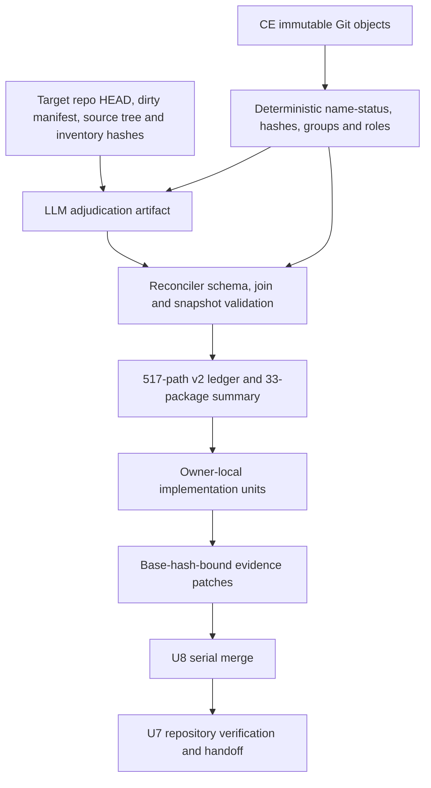
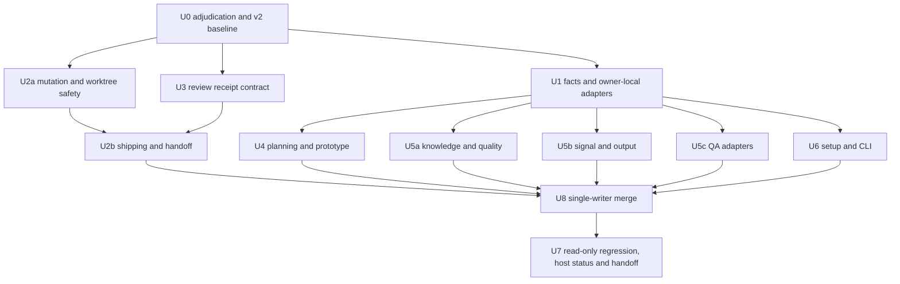
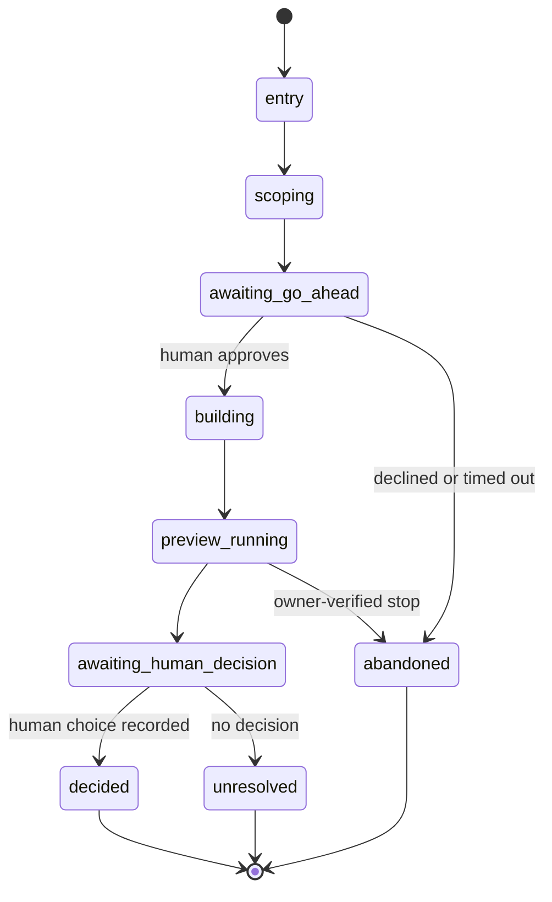

# CE v3.20.0 至 origin/main 全量 Skill/Runtime 同步执行方案 - Plan

## Goal Capsule

- **Objective:** 以 CE tag compound-engineering-v3.20.0 到 956087b3e1dd7ccc03df32cee9e7c044dfbe75cf 的真实 168-commit、517-path 增量为完整输入，逐 package、逐路径建立可回源的裁决账本，并将可采纳语义投射到现有 spec-first canonical owner；不复制 CE 目录、generated runtime、中心 runner 或宿主专属产品。
- **Recommended approach:** inventory -> deterministic path facts -> independent LLM adjudication artifact -> reconciler validation/projection -> owner-local implementation -> single-writer evidence merge -> repository verification。默认 posture 是 reuse / extend / compose，只有现有 owner 会混淆职责或形成第二 truth source 时才允许 new，本窗口不预设任何新的 public Skill。
- **Authority hierarchy:** 当前用户对继续完成全量方案、将旧方案迁移为 `superseded`、CE 工作树只读和目标仓库边界拥有任务授权；Product Contract 与既有产品排除拥有 WHAT；spec-first 当前 source、contracts、tests 和 Git 事实约束 HOW；CE 文档、测试、provider 输出、Graphify/CodeGraph 和旧 validation 只作 advisory evidence。旧方案除 lifecycle frontmatter、替代说明和 Changelog 记录外保持历史正文不变。
- **Decision focus:** 旧方案的 185 条选择集不是当前完整范围；本方案冻结全部 517 条变化路径。CE 的 ce-skill-work 映射到 spec-write-skill，ce-setup 映射到 spec-runtime-setup、CLI 和 config consumers，ce-babysit-pr、ce-proof、ce-retune 保持产品排除。
- **Verification focus:** 证明 Git 窗口、状态计数、路径 hash、package 覆盖、owner/test/limitation 字段和 source/runtime 边界；随后由每个 Implementation Unit 提供 focused deterministic tests、fresh-source skill eval、必要的六宿主 projection/doctor evidence。测试通过只证明机制，不能声称 field outcome、真实 PR/CI、外部 provider 或用户体验。
- **Largest risk:** CE 末端大量将 SKILL.md 内容迁移到 required-read references。机械复制会造成 spec-first duplicate owner、prompt 负载增加、host parity 假象和无法追踪的 failure semantics；必须先把语义归入当前 owner，再决定最小的 source/reference/test 改动。
- **Failure handling:** 任一 upstream/target snapshot、schema、base hash、source/test evidence 或 runtime boundary 不满足时，受影响记录和单元保持 `planned`/`incomplete`，写入 reason code 与日志，不生成 runtime mutation，也不发布完成声明。
- **Execution profile:** Deep implementation artifact；本次已按 U0、U1-U6、U2a/U2b、U5a/U5b/U5c、U8、U7 顺序完成 canonical source、contract、test 和本地验证收口。generated runtime 仅执行 dry-run preview，未获授权的 apply/post-apply doctor、独立 subagent/fresh-source coverage、真实外部 provider/PR/browser/Xcode/用户体验均保持 `not-run` / `degraded`，不构成 field outcome。
- **Tail ownership:** U8 是 ledger/evidence 唯一写入者；U7 只读消费各 owner 的 confirmed receipts，运行仓库级回归、授权范围内的 projection/doctor 和 handoff。发现 owner 问题时退回所属 U-ID，U7 不接管 source/docs/tests/ledger mutation。spec-plan/本方案不拥有 commit、push、PR 或 field rollout。

## Product Contract

### Summary

CE 在 v3.20.0 之后持续修复 Skill authoring、required-read 结构、跨模型 review、workspace worker、配置级联、prototype、runtime setup、CLI adapter 和 release/plugin surface。当前 spec-first 已拥有多个同名或近邻 canonical owner，并且工作树中已有一批针对共享上下文、scratch、worktree、provider/model receipt 和 spec-prototype 的未提交变更。需要的是一次以最新上游窗口为事实边界的完整同步规划，而不是继续扩展旧 185 条账本或复制 CE package。

### Problem Frame

旧方案以 1fac0442..bbf995a4 为上游窗口，已不能代表 v3.20.0..origin/main：它少了 151 条路径、错误地把若干当前 package 语义放在过期账本中，也无法解释 origin/main 最后 38 个 required-read restructure commits。若继续执行旧方案，会把 stale path set、旧 F-ID、旧 exclusion 数量和当前 dirty source 混成一条不可验证的完成链。

本方案解决三个问题：

1. 以固定 Git objects 重新建立完整路径事实和 package 语义边界。
2. 把 CE 变化归入 spec-first 已有 owner，明确 reuse、extend、compose、reference-only 和产品排除。
3. 为剩余实施提供依赖有序的 owner units、测试场景、运行时投射边界和失败保持 incomplete 的完成条件。

### Actors

- A1 项目负责人：确认产品排除、是否接受新宿主/外部 provider/新 public surface，以及最终 rollout/landing 授权。
- A2 Spec-first maintainer：维护 canonical Skill、CLI、contract、test、generator 和 runtime projection，负责 owner/architecture posture。
- A3 Implementation worker：按 U-ID、source refs、test refs 和 stop_if 执行 source 变更，不把 CE evidence 当作当前完成事实。
- A4 Review/verification owner：审查语义充分性、source/runtime 一致性、provider receipt、focused tests 和 limitation，不把 self-check 或 artifact 存在提升为结果证明。
- A5 Host/runtime consumer：消费 spec-first source 的六宿主 projection；对 Cursor/OpenCode/Qoder 等尚未完整验证的 loader 只接受声明的 degraded/generated-runtime-preview 状态。
- A6 CE evidence reader：只读 CE 固定 Git objects、patch、文档和测试，提供 provenance/freshness/limitations，不拥有 spec-first mutation。

### Requirements

- **R1 Full-window truth:** 账本必须以 5c7cb347d0686663743b87cd7227246ba24f7fa7..956087b3e1dd7ccc03df32cee9e7c044dfbe75cf 的 Git diff 为唯一 path denominator：517 paths、168 commits、+54,588/-17,871，状态为 A=222、M=291、D=2、R069=1、R074=1。
- **R2 Path completeness:** 每条路径必须显式记录 path、name-status、group/package/surface、role、closure_profile、canonical_owner、implementation_unit、implementation_targets[]、target_action、evidence_status、source_refs[]、test_owner、test_refs[] 和 limitations[]；package 分组只能是导航，不能隐藏未裁决路径。
- **R3 Source/runtime boundary:** CE 的 .agents/skills、.claude、.codex、.cursor、plugin manifest 和 generated host assets 只能作上游证据；spec-first 的 durable owner 必须位于 skills、src/cli、templates、contracts、docs 或 tests。
- **R4 Existing-owner absorption:** 32 个 CE skills package 和 1 个 ce-skill-work authoring surface 必须映射到当前 spec-first owner；默认 compose/extend/reuse，不创建同名 duplicate Skill。
- **R5 Product exclusions:** ce-babysit-pr、ce-proof、ce-retune 的完整 package 保持 out-of-scope-by-product-decision；不创建 spec-babysit-pr、spec-proof、spec-retune，不修改 LFG/Optimize 以恢复其产品形态。
- **R6 Setup boundary:** ce-setup 只由 spec-runtime-setup、CLI adapter、配置 contract 和 readiness consumers 选择性吸收；不创建 spec-setup，不自动引入 CE 的配置文件名、目录布局、OMP、Agent Plugins 或新宿主。
- **R7 Shared deterministic floor:** spec-write-skill context inspector 仅拥有 authoring/package source-shape facts；其他 Skill 通过 owner-local adapters 产生同一最小 facts/receipt shape。只有至少两个真实 owner 出现同构输入输出后，才允许抽取共享 helper。private scratch、peer job lifecycle、cross-model receipt、local preview、workspace checkout/index safety 等脚本只校验确定性事实；LLM 仍判断语义充分性、owner fit、优先级和 review 结论。
- **R8 Provider/agent authority:** requested provider/model、actual served identity、timeout、exit、cleanup、payload hash 和 redaction 状态必须分开记录；serving receipt 使用 `docs/contracts/verification/provider-serving-receipt.schema.json`，绑定 producer、source/payload、trust domain、credential allowlist、provider/model 和 freshness。缺可信 receipt 时只能写 unverified，不能启动 peer 或声称 independent coverage。
- **R9 Execution/shipping safety:** worker 按单个 bounded unit 工作，不能 commit/stage/push/open PR 或写 shared Git index；mutation-capable worker 必须消费宿主提供的 Git common-dir/index write-deny receipt，并比较 index SHA 与 `index.lock` 前后状态。无法强制时输出 `worker_git_index_enforcement_unavailable`，转 inline fallback，阻断独立完成声明。shipping 必须分别拥有 commit_authorization、landing_authorization 和当前 tree 绑定的 review/verification receipt。
- **R10 Prototype boundary:** prototype 只回答一个尚未解决且需要人体验的行为/视觉问题，使用私有 throwaway root、loopback preview 和 decisions.md；无人体验、unattended/pipeline、Proof 外发和生产代码写回必须阻断。
- **R11 Evidence honesty:** CE docs/tests/solutions、旧 plan、provider output、runtime generation 和 fixture pass 只能证明相应机制或提供 advisory context；不得声称现场收益、真实 PR/CI、外部系统可用或跨宿主 loader parity。
- **R12 Handoff/closeout:** U8 合并后、U7 结束前必须能从 adjudication artifact、path ledger、package matrix、owner receipts、verification logs 和 limitations 回源每个 claim；plan readiness、mechanism completion、implementation evidence 与 field value 分离，不能将 planned/implemented/confirmed/adopted 混用。

### Key Flows

- F1 Upstream reconciliation：A2 固定 CE refs 与 target source snapshot -> 脚本生成 name-status/hash/status facts -> LLM producer 写独立 adjudication artifact -> reconciler 只校验 join/schema/snapshot 并投射 v2 ledger/package summary。
- F2 Shared context and dispatch：各 Skill caller 生成最小、hash-bound、owner-private payload -> deterministic helper 校验路径、scratch、身份、timeout、cleanup -> LLM 评估语义结果 -> consumer 按 receipt 限制 claim。
- F3 Work and shipping：spec-plan/Task Pack -> U2a mutation/worktree foundation -> U3 review receipt contract -> U2b shipping/handoff consumer -> commit/landing only when separately authorized。非 `active` 方案不得生成新 task pack、进入 spec-work 或作为 implementation-ready 输入。
- F4 Planning/research/prototype：brainstorm/ideate/strategy/plan 形成 Product Contract 或 research artifact；prototype 仅在可定义且有人可体验时作为 throwaway decision input；write-back 回现有 owner。
- F5 Review and feedback：code/doc/POV/PR feedback consumer 读取 current source and bounded scope；provider output remains untrusted until schema/receipt/redaction/cleanup checks；finding disposition 不直接授权 mutation。
- F6 Knowledge and signal loop：compound/refresh/sweep/optimize/explain/pulse/promote 只沉淀 verified reusable knowledge、state facts 或文案候选；没有 invalidation condition 或 field evidence 时保持 advisory/degraded。
- F7 Runtime projection：source/contracts/generator -> per-host dry-run status -> authorized apply status -> per-host doctor/readiness status -> handoff；runtime mirror never becomes source owner，未授权或失败时不产生 runtime mutation。

### Acceptance Examples

- AE1 Window mismatch is blocked：使用旧 185-file list 或 1fac0442..bbf995a4 时，账本校验报告 base/head/path/hash mismatch，不把旧记录当作当前范围。
- AE2 Package relocation is preserved：CE ce-plan 将步骤移入 references 后，spec-plan 只吸收 required-read ownership、body pins 和 closeout semantics；不会复制 CE references 目录或生成第二个 plan runner。
- AE3 Context ownership stays local：spec-write-skill context inspector 只检查 authoring/package source shape；code review、plan、work 等 owner 使用本地 adapter 输出最小共享 facts/receipt shape。未出现至少两个同构实现前不抽共享 helper；缺 context 或 scratch 时记录 degraded reason，不伪造 fresh context。
- AE4 Provider mismatch fails closed：requested model 与 authoritative serving receipt 不一致或缺失时，review/POV/work 不能发布 independent cross-model coverage；可继续 inline/serial 并暴露 limitation。
- AE5 Worktree index is protected：linked worktree worker 可以修改允许的 source files，但任何 git add/commit/index lock 都被禁止并保留 reason code；orchestrator 才能在授权后整合。
- AE6 Setup remains one owner：ce-setup 的 config cascade/docs_root/read-only/readiness 语义进入 spec-runtime-setup/CLI consumers；不会出现 spec-setup，也不会把 OMP/Agent Plugins 自动加入 supported platforms。
- AE7 Prototype needs a human：无人体验、pipeline 或未定义问题返回 blocked-human-experience-required；有体验后只有真实选择才写 decisions.md，生产 owner 仍为 brainstorm/plan。
- AE8 Exclusions remain excluded：ce-babysit-pr、ce-proof、ce-retune 的 CE docs/tests 可以作 evidence，但 ledger target_action 保持 out-of-scope-by-product-decision，任何 implementer 都不能将其重分类为 defer/compose。
- AE9 Evidence does not overclaim：docs/tests/provider/runtime artifact 存在但缺 current source/test/receipt 时，closeout 保留 evidence-only/degraded limitation，不写 completed/confirmed。
- AE10 Full package closure：package 只有在 entry、references/assets、local scripts、current owner source、focused tests、limitations 和 projection impact 全部处理后才能标记 confirmed；入口通过而脚本未处理不能关闭 package。
- AE11 Stale target snapshot invalidates adjudication：target repo HEAD、dirty-path manifest、source-tree hash 或 inventory hash 任一漂移时，旧 adjudication 与基于它的 implementation patch 失效；reconciler/merger 拒绝继续消费并保持 U0/U8 incomplete。
- AE12 Single-writer merge rejects stale patches：owner unit 只提交带 base ledger hash 和 target snapshot 的 patch；U8 串行合并。base hash 不匹配、重复 path 或越权字段修改时拒绝整个 patch，不并发写共享 ledger/evidence。

### Success Criteria

- 517/517 路径在 ledger 中存在且可由冻结 Git command 重放；status counts、rename pair、path-set SHA-256 和 package counts 与 Git objects 一致。
- U0 消费独立 `ce-upstream-adjudication/v1` artifact 后生成真实 `ce-upstream-reconciliation/v2`；`package_summary` 恰有 P01-P33 共 33 条、`changed_path_count` 合计 298，并为每条提供 canonical_owner、implementation_unit、implementation_targets[]、target_action、evidence_status、closure_profile、source/test refs 和 limitations。本方案中的 33-row matrix 只作导航 seed，不是完成证据。
- G01 逐路径关闭 `source-adjudication`；G02-G06 通过确定性 group counts/hash、group rule 与显式 exception list 关闭 `evidence-only`；P01/P19/P22 使用 `product-excluded` 终态，不承担 canonical owner 或 implementation target。
- 共享 context、peer runner、cross-model、scratch、worktree/index、workspace、preview、setup/config 和 projection 主题各有一个 source owner、失败语义、focused tests 和 claim ceiling。
- U1-U6、U2a/U2b 与 U5a/U5b/U5c 的 source changes 通过对应 contract tests；U8 串行合并所有 owner patch；U7 只读通过 typecheck、skill lint、unit/smoke/integration/build 和适用的 six-host dry-run/apply/doctor checks。
- fresh-source eval 使用当前磁盘 source，而不是当前会话缓存或 CE runtime mirror；若 dispatch primitive 不可用，报告 degraded，不能声称 fresh-source/independent coverage。
- 方案、ledger、inventory 和 Changelog 不再引用旧 185/372 denominator 作为当前事实；旧方案只允许更新 lifecycle frontmatter 与替代说明，其余历史正文保持不变。
- 机制同步完成只允许声称 517-path ledger、source/test、projection 与 doctor 合同一致；time-to-trusted-change、返工率、人工审查负担和真实采纳价值必须由独立 field evidence 另行验证。

### Scope Boundaries

**In scope**

- CE 5c7cb347..956087b3 的全部 517 条变化路径及其 source/evidence classification。
- spec-first canonical skills、references、scripts、contracts、CLI/runtime consumers、focused tests、docs 和 Changelog 的必要 source changes。
- 独立 adjudication artifact、target source snapshot、closure-aware v2 ledger，以及带 base hash 的 per-unit evidence patch queue 和 U8 single-writer merge。
- required-read relocation 的语义重建、共享 helper 去重、provider/worker/workspace/scratch/preview/setup/project-config 约束。
- runtime projection 的 source-first preview、doctor/readiness 和 drift verification 计划；实施时只能通过 spec-first init 生成。

**Out of scope**

- 直接复制 CE 的 docs、tests、generated runtime、plugin topology、release workflow 或中心 orchestrator。
- 新增 spec-babysit-pr、spec-proof、spec-retune、spec-setup 或其他仅因 CE 有同名目录而产生的 public Skill。
- 自动支持 OMP、Agent Plugins、DevIn/Grok/Kimi 等 CE host surface；它们只能作为 reference-only evidence，除非另有产品决策。
- 外部 provider、GitHub PR/CI、browser/Xcode real-world run、field adoption、secret use、data egress、commit、push、PR、release 或 landing。
- 失败处理扩展；失败只保持受影响单元 incomplete、记录日志和 reason code，并禁止生成 runtime mutation。

### Dependencies and Assumptions

- CE remote objects at base/head remain available and immutable for the implementation run; CE local branch may remain behind origin/main and may contain only the pre-existing untracked filelist。
- spec-first current dirty worktree is user-owned。Implementation must inspect overlapping files and integrate with them; it must not reset, checkout, clean or overwrite unrelated changes。
- Existing canonical owners named below remain valid at implementation time; spec-work must re-read source before applying any compose/new decision。
- Runtime setup and six-host projection are available as source/generator contracts; actual loader parity for Cursor/OpenCode/Qoder remains explicitly limited where current doctor/readiness says so。
- No user authorization for subagents, external provider calls or landing is inferred by this planning artifact。
- 当前 `docs/validation/2026-08-19-ce-post-3-20-reconciliation.json` 仍是 v1 compatibility artifact；在独立 adjudication artifact、真实 v2 projection 与 focused tests 同时存在前，W0 不得关闭。

## Planning Contract

### Architecture Posture

Overall posture: extend + compose + reuse; no new public surface in this window。

- spec-write-skill is the canonical owner for CE ce-skill-work authoring/edit/review/respond semantics。
- Existing spec-* owners remain authoritative for workflow behavior. Required-read files are a source-organization mechanism, not a reason to copy CE directory shapes。
- Shared helpers own only deterministic translation, sequencing, failure propagation, observability and evidence aggregation. They do not own business truth, product priority, review conclusions or a parallel state model。
- spec-runtime-setup owns setup/readiness/config/provider facts; CLI adapters own host-specific projection and cleanup; generated runtime remains derived。
- spec-prototype is an existing current owner to extend where CE prototype craft/preview/scoping semantics are not yet represented. It is not a new production or Proof surface。
- OMP, Agent Plugins and release/CI files are evidence/reference-only unless a separate product decision creates an owner。

### Key Technical Decisions

- KTD1 Full window replaces stale selection：implementation denominator is the complete tag-to-head diff (517 paths), not the old user filelist or old 1fac0442 base. The old plan remains immutable historical evidence。
- KTD2 Adjudication input, adjudication output and reconciliation are separate artifacts：U0's deterministic producer writes `docs/validation/2026-08-19-ce-post-3-20-adjudication-input.json` (`ce-upstream-adjudication-input/v1`) containing the immutable upstream facts, target source snapshot, path/group/role/package candidates, source inventory refs and explicit limitations for the LLM；the authorized LLM producer writes `docs/validation/2026-08-19-ce-post-3-20-adjudication.json` (`ce-upstream-adjudication/v1`) with join key `path+upstream+target-source` and semantic owner/action/unit/targets/closure decisions。The reconciler only consumes and validates both artifacts against deterministic Git facts and target source snapshot, then projects `ce-upstream-reconciliation/v2`; it never invents owner/action/unit/limitations。
- KTD3 Current dirty source is baseline, not completion：existing uncommitted spec-prototype, reconciler, contract and runtime changes are read as current source evidence. They may reduce implementation scope but cannot be promoted to confirmed solely because they exist。
- KTD4 One concept, one owner：peer-job lifecycle、scratch root、preview server、workspace lifecycle、cross-model receipt 和 runtime projection 各有一个 canonical owner。spec-write-skill context inspector 只拥有 authoring/package source-shape facts；其他 Skill 使用 owner-local adapters。只有至少两个 owner 形成同构输入输出后才抽共享 helper，且 helper 不得拥有语义判断。
- KTD5 Required-read relocation is semantic, not mechanical：preserve trigger, gate, output, branch and handoff anchors in the current owner. Required-read files may be reorganized to fit spec-first conventions; CE path names are not a contract。
- KTD6 Provider identity is two-dimensional：requested provider/model and actual served provider/model are independent facts. Missing serving receipt is unverified; mismatch is fail-closed; provider output remains provider_untrusted until schema, redaction, hash and cleanup evidence pass。
- KTD7 Worker and shipping authority stay separate：workers never commit or write a linked worktree shared index. Commit, push and PR remain independent authorizations owned by spec-commit/spec-commit-push-pr/LFG callers。
- KTD8 Configuration is source-owned and fail-closed：ordinary config keys follow current documented cascade; docs_root and team-layout exceptions stay with their existing contract; invalid, unsafe or ambiguous paths fail closed instead of silently falling back。
- KTD9 Setup absorbs facts, not CE topology：ce-setup semantics that improve readiness/config/tool discovery may extend spec-runtime-setup and CLI consumers; CE file names, host lists, plugin manifests and interactive UX do not become spec-first contracts automatically。
- KTD10 Prototype is human-gated：a runnable artifact is only evidence for the named question; no human decision means no decisions.md and no production handoff claim。
- KTD11 Evidence ceilings are explicit：Git facts can prove path/status/hash; focused tests can prove deterministic contracts; fresh-source eval can assess prose behavior; only owner/field evidence can support semantic adoption or outcome claims。
- KTD12 Runtime projection is last and fail-closed：source/tests/contracts land first, then per-host dry-run, separately authorized apply and doctor。失败时保持 incomplete、记录日志、不产生 runtime mutation；generated mirrors are never patched to hide drift。
- KTD13 Closure is profile-aware：G01 使用 `source-adjudication`，逐路径确认 owner、unit、targets、source/test evidence 与 limitation；G02-G06 使用 `evidence-only`，通过 group count/hash、group rule 与 exception list 关闭，不阻断 U1-U6；P01/P19/P22 使用 `product-excluded` 明确终态，不承担 canonical owner、implementation unit 或 targets。
- KTD14 Ledger/evidence is single-writer：U1-U6、U2a/U2b 和 U5a/U5b/U5c 只能提交带 current ledger base hash、target source snapshot 和 affected paths 的 patch artifact。U8 按固定顺序串行验证并合并，拒绝 stale base、重复 path、越权字段或 snapshot drift；不建设通用 CAS/事务框架。
- KTD15 Failure disposition is incomplete-only（session-settled: user-directed — chosen over a compensating-failure design: the user explicitly excluded that design from this window）：失败只保持受影响记录/单元 incomplete，保留日志与 reason code，不生成 runtime mutation，也不扩大为 source recovery 或外部补偿流程。

### Interface Contracts

| Interface / mode | Consumers | Canonical artifact and owner | Contract summary | Compatibility | Verification |
| --- | --- | --- | --- | --- | --- |
| CE adjudication input / greenfield | LLM adjudication producer | `docs/validation/2026-08-19-ce-post-3-20-adjudication-input.json`; U0 deterministic producer | upstream/base/head/name-status facts、target source snapshot、path/group/role/package candidates、current source inventory refs and explicit limitations；no semantic owner/action judgment | new v1 input；rebuild on any source/upstream snapshot drift | U0 tests validate deterministic input shape, hashes and excluded run outputs |
| CE adjudication output / greenfield | reconciler、U0、U8 | `docs/validation/2026-08-19-ce-post-3-20-adjudication.json`; authorized LLM adjudication producer | 517 records；join on path + upstream snapshot + target source snapshot；semantic fields include owner/unit/targets/action/status/refs/limitations/closure profile | new v1 output；旧 v1 reconciliation 只作 compatibility evidence | `tests/unit/ce-upstream-reconciliation-v2.test.js` validates schema, join, snapshot and closure profiles |
| CE reconciliation / evolution | U1-U8、final handoff | `docs/validation/2026-08-19-ce-post-3-20-full-window-reconciliation-v2.json`; reconciler | deterministic path facts plus validated adjudication projection and 33-row package summary | additive v2；旧 v1 artifacts immutable and never overwritten | reconciler focused tests plus JSON/Markdown projection parity |
| Per-unit ledger patch / greenfield | U8 single writer | `docs/validation/2026-08-19-ce-post-3-20-ledger-patches/<unit-id>.json`; each owner produces, U8 merges | base ledger hash、target snapshot、affected paths、evidence/source/test/limitation delta；semantic owner fields cannot be changed without a new adjudication artifact | run-specific v1；no general CAS or concurrent merge | U8 rejects stale base, duplicate path, unauthorized field and snapshot mismatch |
| Evidence-only exception list / greenfield | U8、U7 | `docs/validation/2026-08-19-ce-post-3-20-evidence-exceptions.json`; U8 single writer | named G02-G06 exceptions, reason codes and closure evidence；exceptions cannot add source ownership or implementation targets | additive run artifact；must be regenerated when group rules or path snapshot change | U8/U7 verify exact path membership, group counts and exception hash |
| Provider serving receipt / greenfield | code-review、doc-review、POV、work peer adapters | `docs/contracts/verification/provider-serving-receipt.schema.json`; trusted provider/supervisor producer | source/payload/trust-domain identity、requested/actual provider/model、credential allowlist、freshness、hash | missing or mismatch is fail-closed; no peer launch | focused peer-runner suites and schema examples |
| Prototype run state / evolution | spec-prototype and human experiencer | `skills/spec-prototype/references/prototype-loop.md`; spec-prototype | entry -> scoping -> awaiting-go-ahead -> building -> preview-running -> awaiting-human-decision -> decided/unresolved/abandoned | additive owner-local state; no production workflow state machine | prototype contract and human-journey integration |

### Claim Ceilings and Product Value Trace

- **Mechanism completion ceiling:** 可证明 517-path adjudication/reconciliation、owner source/test refs、single-writer evidence merge、runtime projection/doctor 状态合同同步；不得外推为研发效率或采纳价值。
- **Implementation evidence ceiling:** 可证明指定 source、contract tests、fresh-source eval 和 host checks 在绑定快照上通过；不得外推为真实 PR/CI、外部 provider、用户体验或 field outcome。
- **Field value ceiling:** time-to-trusted-change、返工率、人工审查负担、真实采纳和用户研发增益需要单独的真实任务基线、观测窗口、owner confirmation 与 outcome evidence；本窗口只保留验证入口，不声称已兑现。
- 每个 P01-P33 在 Package Decision Matrix 中携带 actor outcome、R/AE trace 与 expected development gain。无法建立价值连接的 package 只能是 `evidence-only`、`product-excluded` 或保持 `planned` 待重估，不能仅因机制存在而关闭。

### Evidence & Limitations

- Direct upstream evidence：CE Git objects base 5c7cb347d0686663743b87cd7227246ba24f7fa7 (tag compound-engineering-v3.20.0), head 956087b3e1dd7ccc03df32cee9e7c044dfbe75cf, git diff name-status with renames, shortstat, package-local git show and package-local net diffs. Freshness is the 2026-08-19 fetch。
- Deterministic facts：168 commits；517 changed paths；A=222, M=291, D=2, R069=1, R074=1；+54,588/-17,871；name-status SHA-256 a83371963406147ede5c9752c13b324e88d9f0eaf08af7e1239dd7e6a623d459；changed-path SHA-256 bb6bb46295f75723d1030dc009d840cb93f058466649db51f4b1337d128ae05b。
- Source evidence：current spec-first canonical skills, src/cli, contracts, tests and dirty-worktree diff at the start of this run. Existing source edits are not independently verified by this plan。
- Advisory evidence：old plans, old 185-path validation, CE docs/tests/solutions, commit messages, Graphify/CodeGraph navigation and provider self-reports. They orient the implementation but cannot close a target_action or completion claim without current source/test evidence。
- Limitations：no external provider dispatch, no subagent/fresh-source reviewer primitive in this session, no real PR/CI/browser/Xcode/user-experience run, no runtime init/doctor mutation, and no field adoption data. These remain named not-run/degraded claims。
- Current artifact state：旧 `docs/validation/2026-08-19-ce-post-3-20-reconciliation.json` 继续作为 v1 compatibility evidence；当前窗口已落地独立 deterministic adjudication input、LLM adjudication、per-unit base-hash patch queue 和 517-path `ce-upstream-reconciliation/v2`。W0 只在这些 artifacts 与当前 target source snapshot、inventory 和 generated projections verify-only 一致时关闭，不能以 fixture tests 替代真实产物。

### Planning Review Envelope

本方案执行了一次串行 inline producer self-review；宿主没有可调用的 `spec-doc-review` 或等价独立审查 primitive，且用户未授权 persona/subagent dispatch，因此不把该检查描述为独立 review 或 clean verdict。

- `review_status: degraded`
- `reason_code: spec_doc_review_capability_unavailable`
- `independent_review: not_run`
- `review_mode: inline-serial-producer-self-review`
- `isolation: degraded_inherited`
- `mutation_policy: report-only`
- `fixes_applied: 0`（report-only 不允许 reviewer 写入本方案）
- `producer_corrections: applied-before-review`（由 spec-plan producer 修正确定性的 schema、U-ID、owner/test refs 和命令顺序；不计入 reviewer fixes）
- `known_inline_blocking_findings: 0`
- `independent_findings: unknown`
- `coverage: inline coherence/feasibility/security lenses; metadata/section shape; adjudication input/output and target-source snapshot boundaries; v2 package-summary and 517-path counts; explicit path owner/unit/targets/source/test/limitation columns; closure profiles and evidence-only exception list; U2a/U2b and U5a/U5b/U5c split; U8 single-writer merge; per-host dry-run/apply/doctor status crosswalk; non-active consumer gate; claim ceiling and Product Contract trace; frozen Git hashes; old-plan lifecycle transition and historical-body preservation; git diff check`
- `limitations: dispatch_authorization_missing；未运行独立 spec-doc-review、fresh-source eval、外部 provider、PR/CI、browser、Xcode 或 field journey；这些仍是 not-run/degraded，不是通过。`
- `next_owner: 用户明确选择后由 spec-work 执行；源码变更后由 spec-code-review 进行独立审查。`

### High-Level Technical Design

### Package Decision Matrix

The changed column is the exact number of paths under the CE package in the frozen window。每行直接给出 canonical owner、primary implementation unit、one-to-many implementation targets、source/test refs、closure profile、Product Contract trace 和 expected development gain；不再通过 P-ID 反查责任。Package row 仍是 G01 导航与聚合 seed，最终权威是独立 adjudication artifact 和 U8 合并后的 v2 ledger。

`Target action` 只允许 `implement-in-current-owner`、`compose`、`evidence-only`、`out-of-scope-by-product-decision`。P01/P19/P22 使用 `product-excluded` 且 owner/unit/targets 为空；其他 G01 package 使用 `source-adjudication`。

| P | CE package / surface | changed (+/-) | canonical_owner | implementation_unit | implementation_targets[] | target_action | closure_profile | 开发进展 | source_refs[] | test_owner | test_refs[] | Product trace | Expected development gain | limitations[] |
| --- | --- | ---: | --- | --- | --- | --- | --- | --- | --- | --- | --- | --- | --- | --- |
| P01 | ce-babysit-pr | 12 (+1185/-345) | none | none | [] | out-of-scope-by-product-decision | product-excluded | 不适用（已排除） | [docs/plans/2026-08-19-003-refactor-ce-post-3-20-full-window-sync-plan.md] | tests/unit/ce-upstream-reconciliation-v2.test.js | [tests/unit/ce-upstream-reconciliation-v2.test.js] | A1/A4; R5/R11; AE8/AE9 | 避免复制 PR watcher 和合并状态机 | no PR watcher, stack state machine or merge authority |
| P02 | ce-brainstorm | 19 (+1928/-482) | skills/spec-brainstorm | U4 | [skills/spec-brainstorm; tests/unit/spec-brainstorm-contracts.test.js] | compose | source-adjudication | 已完成 | [skills/spec-brainstorm] | tests/unit/spec-brainstorm-contracts.test.js | [tests/unit/spec-brainstorm-contracts.test.js] | A2/A3; R4/R7/R10; AE2/AE3/AE7 | 减少需求到计划的上下文丢失 | CE required-read layout and visual server paths are not copied |
| P03 | ce-code-review | 18 (+2319/-712) | skills/spec-code-review | U3 | [skills/spec-code-review; docs/contracts/verification/provider-serving-receipt.schema.json; tests/unit/spec-code-review-peer-runner.test.js] | compose | source-adjudication | 已完成 | [skills/spec-code-review] | tests/unit/spec-code-review-contracts.test.js | [tests/unit/spec-code-review-contracts.test.js; tests/unit/spec-code-review-peer-runner.test.js] | A3/A4; R7/R8/R11; AE4/AE9 | 提高 review 结果的身份与证据可信度 | peer output never becomes independent coverage without receipt |
| P04 | ce-commit | 1 (+27/-56) | skills/spec-commit | U2b | [skills/spec-commit; tests/unit/spec-work-shipping-contracts.test.js] | compose | source-adjudication | 已完成 | [skills/spec-commit] | tests/unit/spec-work-shipping-contracts.test.js | [tests/unit/spec-work-shipping-contracts.test.js] | A2/A3; R9/R12; AE5 | 减少授权边界返工 | commit authorization remains caller-owned |
| P05 | ce-commit-push-pr | 8 (+401/-204) | skills/spec-commit-push-pr | U2b | [skills/spec-commit-push-pr; tests/unit/spec-work-shipping-contracts.test.js] | compose | source-adjudication | 已完成 | [skills/spec-commit-push-pr] | tests/unit/spec-work-shipping-contracts.test.js | [tests/unit/spec-work-shipping-contracts.test.js] | A2/A3; R9/R12; AE5 | 保持 commit 与 landing 权限分离 | stack CLI and babysit remain optional/excluded |
| P06 | ce-compound | 21 (+1194/-859) | skills/spec-compound | U5a | [skills/spec-compound; tests/unit/compound-promotion-contracts.test.js] | compose | source-adjudication | 已完成 | [skills/spec-compound] | tests/unit/compound-promotion-contracts.test.js | [tests/unit/compound-promotion-contracts.test.js] | A2/A4; R4/R11; AE9 | 提升可复用知识的可信度 | OMP session history is reference-only, not a supported host |
| P07 | ce-compound-refresh | 15 (+434/-711) | skills/spec-compound-refresh | U5a | [skills/spec-compound-refresh; tests/unit/compound-promotion-contracts.test.js] | compose | source-adjudication | 已完成 | [skills/spec-compound-refresh] | tests/unit/compound-promotion-contracts.test.js | [tests/unit/compound-promotion-contracts.test.js] | A2/A4; R4/R11; AE9 | 降低陈旧知识造成的返工 | contradiction checks remain LLM semantic judgment |
| P08 | ce-debug | 6 (+371/-249) | skills/spec-debug | U2a | [skills/spec-debug; tests/unit/spec-debug-contracts.test.js] | compose | source-adjudication | 已完成 | [skills/spec-debug] | tests/unit/spec-debug-contracts.test.js | [tests/unit/spec-debug-contracts.test.js] | A3/A4; R7/R9/R11; AE5 | 提高修复结果与 shipping 状态的可区分性 | fixed-not-pushed is an outcome, not shipping authorization |
| P09 | ce-doc-review | 24 (+2414/-625) | skills/spec-doc-review | U3 | [skills/spec-doc-review; docs/contracts/verification/provider-serving-receipt.schema.json; tests/unit/spec-doc-review-contracts.test.js] | compose | source-adjudication | 已完成 | [skills/spec-doc-review] | tests/unit/spec-doc-review-contracts.test.js | [tests/unit/spec-doc-review-contracts.test.js; tests/unit/spec-doc-review-task-pack-contracts.test.js] | A3/A4; R7/R8/R11; AE4/AE9 | 减少文档审查的 receipt 漂移 | HTML editing and review receipt are source-owned |
| P10 | ce-dogfood | 4 (+180/-167) | skills/spec-dogfood | U5c | [skills/spec-dogfood; tests/unit/ce-upstream-reconciliation-v2.test.js] | compose | source-adjudication | 已完成 | [skills/spec-dogfood] | tests/unit/ce-upstream-reconciliation-v2.test.js | [tests/unit/ce-upstream-reconciliation-v2.test.js] | A3/A4; R11/R12; AE9 | 保持 QA 证据与 field outcome 分离 | browser result remains diff-scoped QA, not field outcome |
| P11 | ce-explain | 9 (+274/-51) | skills/spec-explain | U5b | [skills/spec-explain; tests/unit/ce-upstream-reconciliation-v2.test.js] | compose | source-adjudication | 已完成 | [skills/spec-explain] | tests/unit/ce-upstream-reconciliation-v2.test.js | [tests/unit/ce-upstream-reconciliation-v2.test.js] | A2/A5; R4/R11; AE9 | 减少输出路由的能力误判 | scout failure and destinations stay capability facts |
| P12 | ce-handoff | 3 (+146/-94) | skills/spec-handoff | U2b | [skills/spec-handoff; tests/unit/spec-handoff-contracts.test.js] | compose | source-adjudication | 已完成 | [skills/spec-handoff] | tests/unit/spec-handoff-contracts.test.js | [tests/unit/spec-handoff-contracts.test.js] | A3/A4; R9/R12; AE9 | 降低跨会话上下文与限制丢失 | handoff proves continuity record, not future success |
| P13 | ce-ideate | 15 (+692/-439) | skills/spec-ideate | U4 | [skills/spec-ideate; tests/unit/spec-ideate-clarification-handoff-contracts.test.js] | compose | source-adjudication | 已完成 | [skills/spec-ideate] | tests/unit/spec-ideate-clarification-handoff-contracts.test.js | [tests/unit/spec-ideate-clarification-handoff-contracts.test.js] | A2/A3; R4/R7/R11; AE9 | 提高研究输入与产品判断的边界清晰度 | research artifacts stay advisory until grounded |
| P14 | ce-optimize | 12 (+793/-666) | skills/spec-optimize | U5a | [skills/spec-optimize; tests/unit/spec-optimize-contracts.test.js] | compose | source-adjudication | 已完成 | [skills/spec-optimize] | tests/unit/spec-optimize-contracts.test.js | [tests/unit/spec-optimize-contracts.test.js; tests/unit/spec-optimize-measurement-only-contracts.test.js] | A2/A4; R5/R11; AE8/AE9 | 保持优化可测量且不扩成 retune | no retune corpus runner or experiment database |
| P15 | ce-plan | 20 (+2364/-869) | skills/spec-plan | U4 | [skills/spec-plan; tests/unit/spec-plan-contracts.test.js] | compose | source-adjudication | 已完成 | [skills/spec-plan] | tests/unit/spec-plan-contracts.test.js | [tests/unit/spec-plan-contracts.test.js; tests/unit/spec-plan-quality-contracts.test.js] | A2/A3; R4/R7/R12; AE2/AE9 | 减少 HOW 决策和执行依赖返工 | Product Contract and readiness remain spec-first |
| P16 | ce-pov | 12 (+1881/-240) | skills/spec-pov | U3 | [skills/spec-pov; docs/contracts/verification/provider-serving-receipt.schema.json; tests/unit/review-peer-expansion-contracts.test.js] | compose | source-adjudication | 已完成 | [skills/spec-pov] | tests/unit/review-peer-expansion-contracts.test.js | [tests/unit/review-peer-expansion-contracts.test.js] | A3/A4; R8/R11; AE4/AE9 | 提高多模型结论的身份与终态可信度 | only final peer positions enter synthesis |
| P17 | ce-product-pulse | 6 (+152/-138) | skills/spec-product-pulse | U5b | [skills/spec-product-pulse; tests/unit/spec-product-pulse-contracts.test.js] | compose | source-adjudication | 已完成 | [skills/spec-product-pulse] | tests/unit/spec-product-pulse-contracts.test.js | [tests/unit/spec-product-pulse-contracts.test.js] | A2/A5; R4/R11; AE9 | 减少信号聚合与产品价值的混淆 | no new signal source |
| P18 | ce-promote | 2 (+44/-89) | skills/spec-promote | U5b | [skills/spec-promote; tests/unit/ce-upstream-reconciliation-v2.test.js] | compose | source-adjudication | 已完成 | [skills/spec-promote] | tests/unit/ce-upstream-reconciliation-v2.test.js | [tests/unit/ce-upstream-reconciliation-v2.test.js] | A2/A5; R11/R12; AE9 | 保持文案候选与发布结果分离 | copy candidate is not release/adoption proof |
| P19 | ce-proof | 3 (+331/-312) | none | none | [] | out-of-scope-by-product-decision | product-excluded | 不适用（已排除） | [docs/plans/2026-08-19-003-refactor-ce-post-3-20-full-window-sync-plan.md] | tests/unit/ce-upstream-reconciliation-v2.test.js | [tests/unit/ce-upstream-reconciliation-v2.test.js] | A1/A4; R5/R11; AE8/AE9 | 避免外部 Proof API、凭据和上传面 | no external Proof API, credential or upload |
| P20 | ce-prototype | 7 (+812/-0) | skills/spec-prototype | U4 | [skills/spec-prototype; tests/unit/spec-prototype-contracts.test.js; tests/integration/spec-prototype-human-journey.integration.test.js] | implement-in-current-owner | source-adjudication | 已完成 | [skills/spec-prototype] | tests/unit/spec-prototype-contracts.test.js | [tests/unit/spec-prototype-contracts.test.js; tests/integration/spec-prototype-human-journey.integration.test.js] | A1/A2/A5; R4/R10/R11; AE7/AE9 | 更早验证高歧义产品行为而不污染生产代码 | current package is dirty; do not copy CE tree |
| P21 | ce-resolve-pr-feedback | 8 (+98/-61) | skills/spec-resolve-pr-feedback | U2b | [skills/spec-resolve-pr-feedback; tests/unit/spec-resolve-pr-feedback-contracts.test.js] | compose | source-adjudication | 已完成 | [skills/spec-resolve-pr-feedback] | tests/unit/spec-resolve-pr-feedback-contracts.test.js | [tests/unit/spec-resolve-pr-feedback-contracts.test.js] | A3/A4; R9/R11/R12; AE9 | 降低 review 反馈整合和权限返工 | comments are untrusted; mutation remains target authority |
| P22 | ce-retune | 8 (+866/-0) | none | none | [] | out-of-scope-by-product-decision | product-excluded | 不适用（已排除） | [docs/plans/2026-08-19-003-refactor-ce-post-3-20-full-window-sync-plan.md] | tests/unit/ce-upstream-reconciliation-v2.test.js | [tests/unit/ce-upstream-reconciliation-v2.test.js] | A1/A4; R5/R11; AE8/AE9 | 避免重建 retune runner 和实验数据库 | optimize owner must not grow a retuning runner |
| P23 | ce-riffrec-feedback-analysis | 3 (+4/-4) | skills/spec-riffrec-feedback-analysis | U5b | [skills/spec-riffrec-feedback-analysis; tests/unit/spec-riffrec-feedback-analysis-contracts.test.js] | evidence-only | source-adjudication | 已完成 | [skills/spec-riffrec-feedback-analysis] | tests/unit/spec-riffrec-feedback-analysis-contracts.test.js | [tests/unit/spec-riffrec-feedback-analysis-contracts.test.js] | A3/A4; R4/R11; AE9 | 保留用户反馈证据而不新增入口 | no new public entry; recordings are user evidence |
| P24 | ce-setup | 4 (+428/-145) | skills/spec-runtime-setup | U6 | [skills/spec-runtime-setup; src/cli; src/cli/contracts; tests/unit/mcp-setup-config-consumers.test.js] | implement-in-current-owner | source-adjudication | 已完成 | [skills/spec-runtime-setup] | tests/unit/mcp-setup-config-consumers.test.js | [tests/unit/mcp-setup-config-consumers.test.js; tests/unit/mcp-setup-project-config.test.js; tests/unit/doctor-runtime-assets.test.js] | A2/A5; R3/R6/R11; AE6/AE9 | 降低配置与多宿主 readiness 诊断成本 | no spec-setup, new host or CE config namespace |
| P25 | ce-simplify-code | 5 (+156/-38) | skills/spec-simplify-code | U5a | [skills/spec-simplify-code; tests/unit/spec-work-implementation-quality-contracts.test.js] | compose | source-adjudication | 已完成 | [skills/spec-simplify-code] | tests/unit/spec-work-implementation-quality-contracts.test.js | [tests/unit/spec-work-implementation-quality-contracts.test.js] | A2/A3; R4/R7; AE9 | 减少重复清理 owner 和维护成本 | no second cleanup/review owner |
| P26 | ce-strategy | 5 (+159/-99) | skills/spec-strategy | U4 | [skills/spec-strategy; tests/unit/ce-upstream-reconciliation-v2.test.js] | compose | source-adjudication | 已完成 | [skills/spec-strategy] | tests/unit/ce-upstream-reconciliation-v2.test.js | [tests/unit/ce-upstream-reconciliation-v2.test.js] | A1/A2; R4/R11; AE9 | 保持策略锚点与当前证据一致 | STRATEGY anchor only when current contract confirms |
| P27 | ce-sweep | 9 (+313/-137) | skills/spec-sweep | U5b | [skills/spec-sweep; tests/unit/sweep-state-legacy-import.test.js] | compose | source-adjudication | 已完成 | [skills/spec-sweep] | tests/unit/sweep-state-legacy-import.test.js | [tests/unit/sweep-state-legacy-import.test.js] | A2/A4; R7/R11; AE9 | 提高信号状态可恢复性而不代替语义裁决 | state writer does not choose semantic disposition |
| P28 | ce-test-browser | 4 (+195/-225) | skills/spec-test-browser | U5c | [skills/spec-test-browser; tests/unit/spec-test-browser-contracts.test.js] | compose | source-adjudication | 已完成 | [skills/spec-test-browser] | tests/unit/spec-test-browser-contracts.test.js | [tests/unit/spec-test-browser-contracts.test.js] | A3/A5; R7/R11; AE9 | 减少浏览器 readiness 与用户结果混淆 | port/readiness cannot prove user result |
| P29 | ce-test-xcode | 1 (+1/-1) | skills/spec-test-xcode | U5c | [skills/spec-test-xcode; tests/unit/spec-test-xcode-contracts.test.js] | compose | source-adjudication | 已完成 | [skills/spec-test-xcode] | tests/unit/spec-test-xcode-contracts.test.js | [tests/unit/spec-test-xcode-contracts.test.js] | A3/A5; R7/R11; AE9 | 分离模拟器能力与真实测试结果 | simulator/device outcome must be run separately |
| P30 | ce-work | 19 (+1924/-784) | skills/spec-work | U2b | [skills/spec-work; tests/unit/spec-work-contracts.test.js; tests/unit/spec-work-shipping-contracts.test.js] | implement-in-current-owner | source-adjudication | 已完成 | [skills/spec-work] | tests/unit/spec-work-contracts.test.js | [tests/unit/spec-work-contracts.test.js; tests/unit/spec-work-execution-strategy-contracts.test.js; tests/unit/spec-work-shipping-contracts.test.js] | A2/A3/A4; R7/R9/R12; AE5/AE9 | 缩短 bounded execution 到可信 closeout 的路径 | bounded worker context; no universal engine |
| P31 | ce-worktree | 1 (+23/-55) | skills/spec-worktree | U2a | [skills/spec-worktree; tests/unit/spec-worktree-contracts.test.js] | compose | source-adjudication | 已完成 | [skills/spec-worktree] | tests/unit/spec-worktree-contracts.test.js | [tests/unit/spec-worktree-contracts.test.js] | A2/A3; R7/R9; AE5 | 防止 linked worktree 共享 index 污染 | linked worktree shares Git common/index |
| P32 | lfg | 8 (+212/-95) | skills/spec-lfg | U2b | [skills/spec-lfg; tests/unit/spec-lfg-contracts.test.js] | compose | source-adjudication | 已完成 | [skills/spec-lfg] | tests/unit/spec-lfg-contracts.test.js | [tests/unit/spec-lfg-contracts.test.js; tests/integration/spec-lfg-fingerprint-projection.integration.test.js] | A2/A3/A4; R4/R9/R12; AE5/AE9 | 保持自治流水线由现有 owner 组合 | no babysit state machine; delegate to owners |
| P33 | ce-skill-work | 6 (+266/-0) under .agents/skills | skills/spec-write-skill | U1 | [skills/spec-write-skill; tests/unit/spec-write-skill-context-inspector.test.js] | compose | source-adjudication | 已完成 | [skills/spec-write-skill] | tests/unit/spec-write-skill-contracts.test.js | [tests/unit/spec-write-skill-contracts.test.js; tests/unit/spec-write-skill-context-inspector.test.js] | A2/A3; R4/R7/R11; AE2/AE3 | 提高 Skill authoring 上下文质量且不扩张共享 owner | CE .agents path is not canonical source |

`开发进展`只由 owner unit 提议，允许值为`待开发`、`开发中`、`已完成`、`阻塞`、`不适用（已排除）`。状态只有在 U8 接受该 unit 的 base-hash patch 后才进入共享 ledger/package summary；任一 package 的 source/test/limitation 或 Product trace 不完整时不能标记为`已完成`。此处`已完成`仅表示本计划授权范围内的 canonical source、contract、test 和本地机制收口；ledger 仍以 `planned/degraded` 保留未授权的独立 fresh-source、runtime apply 和 field evidence 限制，不得外推为真实采纳或产品结果。

### Cross-cutting Mapping

| Theme | CE evidence | Canonical owner | Implementation rule | Verification owner |
| --- | --- | --- | --- | --- |
| Required-read/body pins | P02/P03/P09/P15/P30/P32 | each current Skill plus references | preserve trigger, gate, output, branch and handoff anchors | skill contracts plus fresh-source eval |
| Context assembly | P02/P03/P07/P09/P11/P13/P14/P15/P16/P25/P27/P30 | spec-write-skill context inspector plus owner contracts | one inspector, bounded payload/hash, absent/degraded outcome | context inspector and skill-context parity |
| Peer jobs | P02/P03/P09/P15/P16/P30 | current review/work peer contracts | owner-private scratch, lifecycle receipt, identity, timeout and cleanup | peer runner and cross-model tests |
| Cross-model shell | P03/P09/P16/P30 | per-owner adapters plus shared receipt contract | no provider output execution or identity inference | review/POV/work cross-model tests |
| Elevation dispatch | P02/P15 | spec-brainstorm and spec-plan | preserve requested model, fallback and reason code | elevation dispatch tests |
| Scratch portability | most worker/review packages | spec-work strategy and scratch contracts | native temp, TMPDIR/TEMP fallback, owner/non-symlink/cleanup | private-scratch and preamble tests |
| Worktree/workspace | P24/P30/P31 | spec-runtime-setup, spec-work, spec-worktree | linked index protection, warm checkout and target fingerprint | workspace/worktree integration |
| Prototype preview | P02/P20 | spec-prototype | loopback, containment, traversal/symlink refusal and human gate | prototype server/human journey |
| Config/docs_root | P02/P03/P04/P05/P06/P09/P13/P15/P17/P24/P30/P32 | runtime-setup and config consumers | documented cascade and fail-closed unsafe path | config layers/docs-root/setup tests |
| Runtime/projection | P24/P33 and host/release group | CLI modules, templates and runtime-setup | source first, init preview, doctor/readiness | plugin modules, lifecycle and doctor |

### Path category groups

The complete 517-path window is grouped for navigation only. The group supplies an upstream `evidence_role`, never a `target_action`. Every U0 record must carry its own explicit `target_action`; that path-level value is authoritative, while the package matrix is only a G01 adjudication aid and cannot override a path row.

| Group | Selector | Count | Upstream evidence role |
| --- | --- | ---: | --- |
| G01 CE Skill source plus CE authoring source | skills/** and .agents/skills/** | 298 | package semantic source; adjudicate through P01-P33 |
| G02 CE docs | docs/** | 95 | advisory documentation evidence; never copy |
| G03 CE tests and fixtures | tests/** | 98 | behavioral evidence; recreate assertions in current tests |
| G04 CE CLI/runtime source | src/** | 6 | upstream implementation evidence; map to current canonical owners |
| G05 host/release/plugin metadata | .agents/plugins, .claude, .codex, .cursor, .devin, .grok, .kimi, .omp, .github, plugin manifests, .gitattributes | 15 | host/metadata evidence; no automatic host expansion |
| G06 root metadata and config rename | AGENTS, CONCEPTS, README, package.json, .compound-engineering/config.example.yaml | 5 | root-metadata evidence; no direct current-source mutation claim |
| **Total** |  | **517** |  |

The G06 count includes the renamed config.example.yaml destination and G05 includes the .claude/skills symlink entry; U0 preserves old_path for R069/R074 and does not follow symlinks as canonical files.

## Planning Ledger

### Path-level ledger seed

The following 517 rows are a plan-time coverage seed generated from the immutable name-status snapshot. Each row materializes an explicit provisional owner/action/test/limitation decision; values do not inherit dynamically from a group or package row. U0 must re-read current source, write the full schema below, keep unresolved non-excluded records as planned with an explicit limitation, promote only source/test-backed records to confirmed, and reserve not-applicable for the three product exclusions.

| Status | Path or rename pair | Group | package_id | Surface | Role | closure_profile | canonical_owner | implementation_unit | implementation_targets[] | target_action | evidence_status | degraded | source_refs[] | test_owner | test_refs[] | limitations[] |
| --- | --- | --- | --- | --- | --- | --- | --- | --- | --- | --- | --- | --- | --- | --- | --- | --- |
| M | .agents/plugins/marketplace.json | G05 | null | host-release | host-metadata-evidence | evidence-only | src/cli | U6 | [] | evidence-only | planned | true | [docs/validation/2026-08-19-ce-post-3-20-full-window-name-status.md; docs/validation/2026-08-19-ce-post-3-20-adjudication.json] | tests/unit/ce-upstream-reconciliation-v2.test.js | [tests/unit/ce-upstream-reconciliation-v2.test.js] | [no automatic supported-platform or loader claim] |
| A | .agents/skills/ce-skill-work/SKILL.md | G01 | P33 | ce-skill-work | entry-contract | source-adjudication | skills/spec-write-skill | U1 | [skills/spec-write-skill; tests/unit/spec-write-skill-context-inspector.test.js] | compose | planned | true | [skills/spec-write-skill] | tests/unit/spec-write-skill-contracts.test.js | [tests/unit/spec-write-skill-contracts.test.js; tests/unit/spec-write-skill-context-inspector.test.js] | [CE path is not canonical source; plan-time seed; current source/test confirmation pending] |
| A | .agents/skills/ce-skill-work/references/edit-skill.md | G01 | P33 | ce-skill-work | reference-contract | source-adjudication | skills/spec-write-skill | U1 | [skills/spec-write-skill; tests/unit/spec-write-skill-context-inspector.test.js] | compose | planned | true | [skills/spec-write-skill] | tests/unit/spec-write-skill-contracts.test.js | [tests/unit/spec-write-skill-contracts.test.js; tests/unit/spec-write-skill-context-inspector.test.js] | [CE path is not canonical source; plan-time seed; current source/test confirmation pending] |
| A | .agents/skills/ce-skill-work/references/evaluate.md | G01 | P33 | ce-skill-work | reference-contract | source-adjudication | skills/spec-write-skill | U1 | [skills/spec-write-skill; tests/unit/spec-write-skill-context-inspector.test.js] | compose | planned | true | [skills/spec-write-skill] | tests/unit/spec-write-skill-contracts.test.js | [tests/unit/spec-write-skill-contracts.test.js; tests/unit/spec-write-skill-context-inspector.test.js] | [CE path is not canonical source; plan-time seed; current source/test confirmation pending] |
| A | .agents/skills/ce-skill-work/references/new-skill.md | G01 | P33 | ce-skill-work | reference-contract | source-adjudication | skills/spec-write-skill | U1 | [skills/spec-write-skill; tests/unit/spec-write-skill-context-inspector.test.js] | compose | planned | true | [skills/spec-write-skill] | tests/unit/spec-write-skill-contracts.test.js | [tests/unit/spec-write-skill-contracts.test.js; tests/unit/spec-write-skill-context-inspector.test.js] | [CE path is not canonical source; plan-time seed; current source/test confirmation pending] |
| A | .agents/skills/ce-skill-work/references/respond-to-review.md | G01 | P33 | ce-skill-work | reference-contract | source-adjudication | skills/spec-write-skill | U1 | [skills/spec-write-skill; tests/unit/spec-write-skill-context-inspector.test.js] | compose | planned | true | [skills/spec-write-skill] | tests/unit/spec-write-skill-contracts.test.js | [tests/unit/spec-write-skill-contracts.test.js; tests/unit/spec-write-skill-context-inspector.test.js] | [CE path is not canonical source; plan-time seed; current source/test confirmation pending] |
| A | .agents/skills/ce-skill-work/references/review-skill.md | G01 | P33 | ce-skill-work | reference-contract | source-adjudication | skills/spec-write-skill | U1 | [skills/spec-write-skill; tests/unit/spec-write-skill-context-inspector.test.js] | compose | planned | true | [skills/spec-write-skill] | tests/unit/spec-write-skill-contracts.test.js | [tests/unit/spec-write-skill-contracts.test.js; tests/unit/spec-write-skill-context-inspector.test.js] | [CE path is not canonical source; plan-time seed; current source/test confirmation pending] |
| M | .claude-plugin/plugin.json | G05 | null | host-release | host-metadata-evidence | evidence-only | src/cli | U6 | [] | evidence-only | planned | true | [docs/validation/2026-08-19-ce-post-3-20-full-window-name-status.md; docs/validation/2026-08-19-ce-post-3-20-adjudication.json] | tests/unit/ce-upstream-reconciliation-v2.test.js | [tests/unit/ce-upstream-reconciliation-v2.test.js] | [no automatic supported-platform or loader claim] |
| A | .claude/skills | G05 | null | host-release | host-metadata-evidence | evidence-only | src/cli | U6 | [] | evidence-only | planned | true | [docs/validation/2026-08-19-ce-post-3-20-full-window-name-status.md; docs/validation/2026-08-19-ce-post-3-20-adjudication.json] | tests/unit/ce-upstream-reconciliation-v2.test.js | [tests/unit/ce-upstream-reconciliation-v2.test.js] | [no automatic supported-platform or loader claim] |
| M | .codex-plugin/plugin.json | G05 | null | host-release | host-metadata-evidence | evidence-only | src/cli | U6 | [] | evidence-only | planned | true | [docs/validation/2026-08-19-ce-post-3-20-full-window-name-status.md; docs/validation/2026-08-19-ce-post-3-20-adjudication.json] | tests/unit/ce-upstream-reconciliation-v2.test.js | [tests/unit/ce-upstream-reconciliation-v2.test.js] | [no automatic supported-platform or loader claim] |
| R069 | .compound-engineering/config.local.example.yaml -> .compound-engineering/config.example.yaml | G06 | null | root-metadata | config-rename-evidence | evidence-only | src/cli | U6 | [] | evidence-only | planned | true | [docs/validation/2026-08-19-ce-post-3-20-full-window-name-status.md; docs/validation/2026-08-19-ce-post-3-20-adjudication.json] | tests/unit/ce-upstream-reconciliation-v2.test.js | [tests/unit/ce-upstream-reconciliation-v2.test.js] | [config rename is setup evidence, not a namespace to copy] |
| M | .cursor-plugin/plugin.json | G05 | null | host-release | host-metadata-evidence | evidence-only | src/cli | U6 | [] | evidence-only | planned | true | [docs/validation/2026-08-19-ce-post-3-20-full-window-name-status.md; docs/validation/2026-08-19-ce-post-3-20-adjudication.json] | tests/unit/ce-upstream-reconciliation-v2.test.js | [tests/unit/ce-upstream-reconciliation-v2.test.js] | [no automatic supported-platform or loader claim] |
| M | .devin-plugin/plugin.json | G05 | null | host-release | host-metadata-evidence | evidence-only | src/cli | U6 | [] | evidence-only | planned | true | [docs/validation/2026-08-19-ce-post-3-20-full-window-name-status.md; docs/validation/2026-08-19-ce-post-3-20-adjudication.json] | tests/unit/ce-upstream-reconciliation-v2.test.js | [tests/unit/ce-upstream-reconciliation-v2.test.js] | [no automatic supported-platform or loader claim] |
| A | .gitattributes | G05 | null | host-release | host-metadata-evidence | evidence-only | src/cli | U6 | [] | evidence-only | planned | true | [docs/validation/2026-08-19-ce-post-3-20-full-window-name-status.md; docs/validation/2026-08-19-ce-post-3-20-adjudication.json] | tests/unit/ce-upstream-reconciliation-v2.test.js | [tests/unit/ce-upstream-reconciliation-v2.test.js] | [no automatic supported-platform or loader claim] |
| M | .github/.release-please-manifest.json | G05 | null | host-release | host-metadata-evidence | evidence-only | src/cli | U6 | [] | evidence-only | planned | true | [docs/validation/2026-08-19-ce-post-3-20-full-window-name-status.md; docs/validation/2026-08-19-ce-post-3-20-adjudication.json] | tests/unit/ce-upstream-reconciliation-v2.test.js | [tests/unit/ce-upstream-reconciliation-v2.test.js] | [no automatic supported-platform or loader claim] |
| A | .github/pull_request_template.md | G05 | null | host-release | host-metadata-evidence | evidence-only | src/cli | U6 | [] | evidence-only | planned | true | [docs/validation/2026-08-19-ce-post-3-20-full-window-name-status.md; docs/validation/2026-08-19-ce-post-3-20-adjudication.json] | tests/unit/ce-upstream-reconciliation-v2.test.js | [tests/unit/ce-upstream-reconciliation-v2.test.js] | [no automatic supported-platform or loader claim] |
| M | .github/release-please-config.json | G05 | null | host-release | host-metadata-evidence | evidence-only | src/cli | U6 | [] | evidence-only | planned | true | [docs/validation/2026-08-19-ce-post-3-20-full-window-name-status.md; docs/validation/2026-08-19-ce-post-3-20-adjudication.json] | tests/unit/ce-upstream-reconciliation-v2.test.js | [tests/unit/ce-upstream-reconciliation-v2.test.js] | [no automatic supported-platform or loader claim] |
| M | .github/workflows/ci.yml | G05 | null | host-release | host-metadata-evidence | evidence-only | src/cli | U6 | [] | evidence-only | planned | true | [docs/validation/2026-08-19-ce-post-3-20-full-window-name-status.md; docs/validation/2026-08-19-ce-post-3-20-adjudication.json] | tests/unit/ce-upstream-reconciliation-v2.test.js | [tests/unit/ce-upstream-reconciliation-v2.test.js] | [no automatic supported-platform or loader claim] |
| M | .grok-plugin/plugin.json | G05 | null | host-release | host-metadata-evidence | evidence-only | src/cli | U6 | [] | evidence-only | planned | true | [docs/validation/2026-08-19-ce-post-3-20-full-window-name-status.md; docs/validation/2026-08-19-ce-post-3-20-adjudication.json] | tests/unit/ce-upstream-reconciliation-v2.test.js | [tests/unit/ce-upstream-reconciliation-v2.test.js] | [no automatic supported-platform or loader claim] |
| M | .kimi-plugin/plugin.json | G05 | null | host-release | host-metadata-evidence | evidence-only | src/cli | U6 | [] | evidence-only | planned | true | [docs/validation/2026-08-19-ce-post-3-20-full-window-name-status.md; docs/validation/2026-08-19-ce-post-3-20-adjudication.json] | tests/unit/ce-upstream-reconciliation-v2.test.js | [tests/unit/ce-upstream-reconciliation-v2.test.js] | [no automatic supported-platform or loader claim] |
| A | .omp-plugin/marketplace.json | G05 | null | host-release | host-metadata-evidence | evidence-only | src/cli | U6 | [] | evidence-only | planned | true | [docs/validation/2026-08-19-ce-post-3-20-full-window-name-status.md; docs/validation/2026-08-19-ce-post-3-20-adjudication.json] | tests/unit/ce-upstream-reconciliation-v2.test.js | [tests/unit/ce-upstream-reconciliation-v2.test.js] | [no automatic supported-platform or loader claim] |
| M | AGENTS.md | G06 | null | root-metadata | root-metadata-evidence | evidence-only | src/cli | U6 | [] | evidence-only | planned | true | [docs/validation/2026-08-19-ce-post-3-20-full-window-name-status.md; docs/validation/2026-08-19-ce-post-3-20-adjudication.json] | tests/unit/ce-upstream-reconciliation-v2.test.js | [tests/unit/ce-upstream-reconciliation-v2.test.js] | [root metadata is not workflow semantic source] |
| M | CONCEPTS.md | G06 | null | root-metadata | root-metadata-evidence | evidence-only | src/cli | U6 | [] | evidence-only | planned | true | [docs/validation/2026-08-19-ce-post-3-20-full-window-name-status.md; docs/validation/2026-08-19-ce-post-3-20-adjudication.json] | tests/unit/ce-upstream-reconciliation-v2.test.js | [tests/unit/ce-upstream-reconciliation-v2.test.js] | [root metadata is not workflow semantic source] |
| M | README.md | G06 | null | root-metadata | root-metadata-evidence | evidence-only | src/cli | U6 | [] | evidence-only | planned | true | [docs/validation/2026-08-19-ce-post-3-20-full-window-name-status.md; docs/validation/2026-08-19-ce-post-3-20-adjudication.json] | tests/unit/ce-upstream-reconciliation-v2.test.js | [tests/unit/ce-upstream-reconciliation-v2.test.js] | [root metadata is not workflow semantic source] |
| M | docs/plans/2026-07-17-001-eval-cross-model-peer-model-config.md | G02 | null | docs-evidence | documentation-evidence | evidence-only | docs/validation/2026-08-19-ce-post-3-20-full-window-reconciliation-v2.json | U8 | [] | evidence-only | planned | true | [docs/validation/2026-08-19-ce-post-3-20-full-window-name-status.md; docs/validation/2026-08-19-ce-post-3-20-adjudication.json] | tests/unit/ce-upstream-reconciliation-v2.test.js | [tests/unit/ce-upstream-reconciliation-v2.test.js] | [CE docs are read-only advisory evidence and are not copied] |
| M | docs/plans/2026-07-18-adversarial-peer-benchmark-report.md | G02 | null | docs-evidence | documentation-evidence | evidence-only | docs/validation/2026-08-19-ce-post-3-20-full-window-reconciliation-v2.json | U8 | [] | evidence-only | planned | true | [docs/validation/2026-08-19-ce-post-3-20-full-window-name-status.md; docs/validation/2026-08-19-ce-post-3-20-adjudication.json] | tests/unit/ce-upstream-reconciliation-v2.test.js | [tests/unit/ce-upstream-reconciliation-v2.test.js] | [CE docs are read-only advisory evidence and are not copied] |
| A | docs/plans/2026-07-22-001-feat-configurable-docs-root-plan.md | G02 | null | docs-evidence | documentation-evidence | evidence-only | docs/validation/2026-08-19-ce-post-3-20-full-window-reconciliation-v2.json | U8 | [] | evidence-only | planned | true | [docs/validation/2026-08-19-ce-post-3-20-full-window-name-status.md; docs/validation/2026-08-19-ce-post-3-20-adjudication.json] | tests/unit/ce-upstream-reconciliation-v2.test.js | [tests/unit/ce-upstream-reconciliation-v2.test.js] | [CE docs are read-only advisory evidence and are not copied] |
| A | docs/plans/2026-07-23-001-feat-peer-job-runner-windows-native-plan.md | G02 | null | docs-evidence | documentation-evidence | evidence-only | docs/validation/2026-08-19-ce-post-3-20-full-window-reconciliation-v2.json | U8 | [] | evidence-only | planned | true | [docs/validation/2026-08-19-ce-post-3-20-full-window-name-status.md; docs/validation/2026-08-19-ce-post-3-20-adjudication.json] | tests/unit/ce-upstream-reconciliation-v2.test.js | [tests/unit/ce-upstream-reconciliation-v2.test.js] | [CE docs are read-only advisory evidence and are not copied] |
| A | docs/plans/2026-07-24-001-test-codex-content-transform-coverage-plan.md | G02 | null | docs-evidence | documentation-evidence | evidence-only | docs/validation/2026-08-19-ce-post-3-20-full-window-reconciliation-v2.json | U8 | [] | evidence-only | planned | true | [docs/validation/2026-08-19-ce-post-3-20-full-window-name-status.md; docs/validation/2026-08-19-ce-post-3-20-adjudication.json] | tests/unit/ce-upstream-reconciliation-v2.test.js | [tests/unit/ce-upstream-reconciliation-v2.test.js] | [CE docs are read-only advisory evidence and are not copied] |
| A | docs/plans/2026-07-31-001-fix-mode-non-interactive-rename-plan.md | G02 | null | docs-evidence | documentation-evidence | evidence-only | docs/validation/2026-08-19-ce-post-3-20-full-window-reconciliation-v2.json | U8 | [] | evidence-only | planned | true | [docs/validation/2026-08-19-ce-post-3-20-full-window-name-status.md; docs/validation/2026-08-19-ce-post-3-20-adjudication.json] | tests/unit/ce-upstream-reconciliation-v2.test.js | [tests/unit/ce-upstream-reconciliation-v2.test.js] | [CE docs are read-only advisory evidence and are not copied] |
| A | docs/plans/2026-07-31-002-fix-prefer-git-bash-over-wsl-plan.md | G02 | null | docs-evidence | documentation-evidence | evidence-only | docs/validation/2026-08-19-ce-post-3-20-full-window-reconciliation-v2.json | U8 | [] | evidence-only | planned | true | [docs/validation/2026-08-19-ce-post-3-20-full-window-name-status.md; docs/validation/2026-08-19-ce-post-3-20-adjudication.json] | tests/unit/ce-upstream-reconciliation-v2.test.js | [tests/unit/ce-upstream-reconciliation-v2.test.js] | [CE docs are read-only advisory evidence and are not copied] |
| A | docs/plans/2026-07-31-003-fix-portable-windows-path-unit-tests-plan.md | G02 | null | docs-evidence | documentation-evidence | evidence-only | docs/validation/2026-08-19-ce-post-3-20-full-window-reconciliation-v2.json | U8 | [] | evidence-only | planned | true | [docs/validation/2026-08-19-ce-post-3-20-full-window-name-status.md; docs/validation/2026-08-19-ce-post-3-20-adjudication.json] | tests/unit/ce-upstream-reconciliation-v2.test.js | [tests/unit/ce-upstream-reconciliation-v2.test.js] | [CE docs are read-only advisory evidence and are not copied] |
| A | docs/plans/2026-07-31-004-fix-preserve-explicit-windows-bash-plan.md | G02 | null | docs-evidence | documentation-evidence | evidence-only | docs/validation/2026-08-19-ce-post-3-20-full-window-reconciliation-v2.json | U8 | [] | evidence-only | planned | true | [docs/validation/2026-08-19-ce-post-3-20-full-window-name-status.md; docs/validation/2026-08-19-ce-post-3-20-adjudication.json] | tests/unit/ce-upstream-reconciliation-v2.test.js | [tests/unit/ce-upstream-reconciliation-v2.test.js] | [CE docs are read-only advisory evidence and are not copied] |
| A | docs/plans/2026-08-05-001-feat-babysit-stack-posture-ship-eval-scenarios.md | G02 | null | docs-evidence | documentation-evidence | evidence-only | docs/validation/2026-08-19-ce-post-3-20-full-window-reconciliation-v2.json | U8 | [] | evidence-only | planned | true | [docs/validation/2026-08-19-ce-post-3-20-full-window-name-status.md; docs/validation/2026-08-19-ce-post-3-20-adjudication.json] | tests/unit/ce-upstream-reconciliation-v2.test.js | [tests/unit/ce-upstream-reconciliation-v2.test.js] | [CE docs are read-only advisory evidence and are not copied] |
| A | docs/plans/2026-08-05-001-feat-babysit-stack-posture-ship-plan.md | G02 | null | docs-evidence | documentation-evidence | evidence-only | docs/validation/2026-08-19-ce-post-3-20-full-window-reconciliation-v2.json | U8 | [] | evidence-only | planned | true | [docs/validation/2026-08-19-ce-post-3-20-full-window-name-status.md; docs/validation/2026-08-19-ce-post-3-20-adjudication.json] | tests/unit/ce-upstream-reconciliation-v2.test.js | [tests/unit/ce-upstream-reconciliation-v2.test.js] | [CE docs are read-only advisory evidence and are not copied] |
| A | docs/plans/2026-08-06-001-fix-agent-plugins-manifest-conformance-plan.md | G02 | null | docs-evidence | documentation-evidence | evidence-only | docs/validation/2026-08-19-ce-post-3-20-full-window-reconciliation-v2.json | U8 | [] | evidence-only | planned | true | [docs/validation/2026-08-19-ce-post-3-20-full-window-name-status.md; docs/validation/2026-08-19-ce-post-3-20-adjudication.json] | tests/unit/ce-upstream-reconciliation-v2.test.js | [tests/unit/ce-upstream-reconciliation-v2.test.js] | [CE docs are read-only advisory evidence and are not copied] |
| A | docs/plans/2026-08-12-001-fix-product-contract-section-catalog-plan.md | G02 | null | docs-evidence | documentation-evidence | evidence-only | docs/validation/2026-08-19-ce-post-3-20-full-window-reconciliation-v2.json | U8 | [] | evidence-only | planned | true | [docs/validation/2026-08-19-ce-post-3-20-full-window-name-status.md; docs/validation/2026-08-19-ce-post-3-20-adjudication.json] | tests/unit/ce-upstream-reconciliation-v2.test.js | [tests/unit/ce-upstream-reconciliation-v2.test.js] | [CE docs are read-only advisory evidence and are not copied] |
| A | docs/plans/2026-08-12-002-fix-repo-config-cascade-plan.md | G02 | null | docs-evidence | documentation-evidence | evidence-only | docs/validation/2026-08-19-ce-post-3-20-full-window-reconciliation-v2.json | U8 | [] | evidence-only | planned | true | [docs/validation/2026-08-19-ce-post-3-20-full-window-name-status.md; docs/validation/2026-08-19-ce-post-3-20-adjudication.json] | tests/unit/ce-upstream-reconciliation-v2.test.js | [tests/unit/ce-upstream-reconciliation-v2.test.js] | [CE docs are read-only advisory evidence and are not copied] |
| A | docs/plans/2026-08-12-003-feat-ce-prototype-skill-plan.md | G02 | null | docs-evidence | documentation-evidence | evidence-only | docs/validation/2026-08-19-ce-post-3-20-full-window-reconciliation-v2.json | U8 | [] | evidence-only | planned | true | [docs/validation/2026-08-19-ce-post-3-20-full-window-name-status.md; docs/validation/2026-08-19-ce-post-3-20-adjudication.json] | tests/unit/ce-upstream-reconciliation-v2.test.js | [tests/unit/ce-upstream-reconciliation-v2.test.js] | [CE docs are read-only advisory evidence and are not copied] |
| A | docs/plans/2026-08-12-003-fix-doc-review-decision-clustering-plan.md | G02 | null | docs-evidence | documentation-evidence | evidence-only | docs/validation/2026-08-19-ce-post-3-20-full-window-reconciliation-v2.json | U8 | [] | evidence-only | planned | true | [docs/validation/2026-08-19-ce-post-3-20-full-window-name-status.md; docs/validation/2026-08-19-ce-post-3-20-adjudication.json] | tests/unit/ce-upstream-reconciliation-v2.test.js | [tests/unit/ce-upstream-reconciliation-v2.test.js] | [CE docs are read-only advisory evidence and are not copied] |
| A | docs/plans/2026-08-13-0952-fix-prototype-medium-and-modality-plan.md | G02 | null | docs-evidence | documentation-evidence | evidence-only | docs/validation/2026-08-19-ce-post-3-20-full-window-reconciliation-v2.json | U8 | [] | evidence-only | planned | true | [docs/validation/2026-08-19-ce-post-3-20-full-window-name-status.md; docs/validation/2026-08-19-ce-post-3-20-adjudication.json] | tests/unit/ce-upstream-reconciliation-v2.test.js | [tests/unit/ce-upstream-reconciliation-v2.test.js] | [CE docs are read-only advisory evidence and are not copied] |
| A | docs/plans/2026-08-13-2253-feat-prototype-craft-floor-and-durable-storage-plan.md | G02 | null | docs-evidence | documentation-evidence | evidence-only | docs/validation/2026-08-19-ce-post-3-20-full-window-reconciliation-v2.json | U8 | [] | evidence-only | planned | true | [docs/validation/2026-08-19-ce-post-3-20-full-window-name-status.md; docs/validation/2026-08-19-ce-post-3-20-adjudication.json] | tests/unit/ce-upstream-reconciliation-v2.test.js | [tests/unit/ce-upstream-reconciliation-v2.test.js] | [CE docs are read-only advisory evidence and are not copied] |
| A | docs/plans/2026-08-15-1506-fix-refresh-instruction-layer-conflict-plan.md | G02 | null | docs-evidence | documentation-evidence | evidence-only | docs/validation/2026-08-19-ce-post-3-20-full-window-reconciliation-v2.json | U8 | [] | evidence-only | planned | true | [docs/validation/2026-08-19-ce-post-3-20-full-window-name-status.md; docs/validation/2026-08-19-ce-post-3-20-adjudication.json] | tests/unit/ce-upstream-reconciliation-v2.test.js | [tests/unit/ce-upstream-reconciliation-v2.test.js] | [CE docs are read-only advisory evidence and are not copied] |
| A | docs/plans/2026-08-15-2303-fix-cross-model-verify-warm-checkout-plan.md | G02 | null | docs-evidence | documentation-evidence | evidence-only | docs/validation/2026-08-19-ce-post-3-20-full-window-reconciliation-v2.json | U8 | [] | evidence-only | planned | true | [docs/validation/2026-08-19-ce-post-3-20-full-window-name-status.md; docs/validation/2026-08-19-ce-post-3-20-adjudication.json] | tests/unit/ce-upstream-reconciliation-v2.test.js | [tests/unit/ce-upstream-reconciliation-v2.test.js] | [CE docs are read-only advisory evidence and are not copied] |
| D | docs/residual-review-findings/feat-ce-explain-skill.md | G02 | null | docs-evidence | documentation-evidence | evidence-only | docs/validation/2026-08-19-ce-post-3-20-full-window-reconciliation-v2.json | U8 | [] | evidence-only | planned | true | [docs/validation/2026-08-19-ce-post-3-20-full-window-name-status.md; docs/validation/2026-08-19-ce-post-3-20-adjudication.json] | tests/unit/ce-upstream-reconciliation-v2.test.js | [tests/unit/ce-upstream-reconciliation-v2.test.js] | [CE docs are read-only advisory evidence and are not copied] |
| M | docs/skills/README.md | G02 | null | docs-evidence | documentation-evidence | evidence-only | docs/validation/2026-08-19-ce-post-3-20-full-window-reconciliation-v2.json | U8 | [] | evidence-only | planned | true | [docs/validation/2026-08-19-ce-post-3-20-full-window-name-status.md; docs/validation/2026-08-19-ce-post-3-20-adjudication.json] | tests/unit/ce-upstream-reconciliation-v2.test.js | [tests/unit/ce-upstream-reconciliation-v2.test.js] | [CE docs are read-only advisory evidence and are not copied] |
| M | docs/skills/ce-babysit-pr.md | G02 | null | docs-evidence | documentation-evidence | evidence-only | docs/validation/2026-08-19-ce-post-3-20-full-window-reconciliation-v2.json | U8 | [] | evidence-only | planned | true | [docs/validation/2026-08-19-ce-post-3-20-full-window-name-status.md; docs/validation/2026-08-19-ce-post-3-20-adjudication.json] | tests/unit/ce-upstream-reconciliation-v2.test.js | [tests/unit/ce-upstream-reconciliation-v2.test.js] | [CE docs are read-only advisory evidence and are not copied] |
| M | docs/skills/ce-brainstorm.md | G02 | null | docs-evidence | documentation-evidence | evidence-only | docs/validation/2026-08-19-ce-post-3-20-full-window-reconciliation-v2.json | U8 | [] | evidence-only | planned | true | [docs/validation/2026-08-19-ce-post-3-20-full-window-name-status.md; docs/validation/2026-08-19-ce-post-3-20-adjudication.json] | tests/unit/ce-upstream-reconciliation-v2.test.js | [tests/unit/ce-upstream-reconciliation-v2.test.js] | [CE docs are read-only advisory evidence and are not copied] |
| M | docs/skills/ce-code-review.md | G02 | null | docs-evidence | documentation-evidence | evidence-only | docs/validation/2026-08-19-ce-post-3-20-full-window-reconciliation-v2.json | U8 | [] | evidence-only | planned | true | [docs/validation/2026-08-19-ce-post-3-20-full-window-name-status.md; docs/validation/2026-08-19-ce-post-3-20-adjudication.json] | tests/unit/ce-upstream-reconciliation-v2.test.js | [tests/unit/ce-upstream-reconciliation-v2.test.js] | [CE docs are read-only advisory evidence and are not copied] |
| M | docs/skills/ce-commit-push-pr.md | G02 | null | docs-evidence | documentation-evidence | evidence-only | docs/validation/2026-08-19-ce-post-3-20-full-window-reconciliation-v2.json | U8 | [] | evidence-only | planned | true | [docs/validation/2026-08-19-ce-post-3-20-full-window-name-status.md; docs/validation/2026-08-19-ce-post-3-20-adjudication.json] | tests/unit/ce-upstream-reconciliation-v2.test.js | [tests/unit/ce-upstream-reconciliation-v2.test.js] | [CE docs are read-only advisory evidence and are not copied] |
| M | docs/skills/ce-commit.md | G02 | null | docs-evidence | documentation-evidence | evidence-only | docs/validation/2026-08-19-ce-post-3-20-full-window-reconciliation-v2.json | U8 | [] | evidence-only | planned | true | [docs/validation/2026-08-19-ce-post-3-20-full-window-name-status.md; docs/validation/2026-08-19-ce-post-3-20-adjudication.json] | tests/unit/ce-upstream-reconciliation-v2.test.js | [tests/unit/ce-upstream-reconciliation-v2.test.js] | [CE docs are read-only advisory evidence and are not copied] |
| M | docs/skills/ce-compound-refresh.md | G02 | null | docs-evidence | documentation-evidence | evidence-only | docs/validation/2026-08-19-ce-post-3-20-full-window-reconciliation-v2.json | U8 | [] | evidence-only | planned | true | [docs/validation/2026-08-19-ce-post-3-20-full-window-name-status.md; docs/validation/2026-08-19-ce-post-3-20-adjudication.json] | tests/unit/ce-upstream-reconciliation-v2.test.js | [tests/unit/ce-upstream-reconciliation-v2.test.js] | [CE docs are read-only advisory evidence and are not copied] |
| M | docs/skills/ce-compound.md | G02 | null | docs-evidence | documentation-evidence | evidence-only | docs/validation/2026-08-19-ce-post-3-20-full-window-reconciliation-v2.json | U8 | [] | evidence-only | planned | true | [docs/validation/2026-08-19-ce-post-3-20-full-window-name-status.md; docs/validation/2026-08-19-ce-post-3-20-adjudication.json] | tests/unit/ce-upstream-reconciliation-v2.test.js | [tests/unit/ce-upstream-reconciliation-v2.test.js] | [CE docs are read-only advisory evidence and are not copied] |
| M | docs/skills/ce-debug.md | G02 | null | docs-evidence | documentation-evidence | evidence-only | docs/validation/2026-08-19-ce-post-3-20-full-window-reconciliation-v2.json | U8 | [] | evidence-only | planned | true | [docs/validation/2026-08-19-ce-post-3-20-full-window-name-status.md; docs/validation/2026-08-19-ce-post-3-20-adjudication.json] | tests/unit/ce-upstream-reconciliation-v2.test.js | [tests/unit/ce-upstream-reconciliation-v2.test.js] | [CE docs are read-only advisory evidence and are not copied] |
| M | docs/skills/ce-doc-review.md | G02 | null | docs-evidence | documentation-evidence | evidence-only | docs/validation/2026-08-19-ce-post-3-20-full-window-reconciliation-v2.json | U8 | [] | evidence-only | planned | true | [docs/validation/2026-08-19-ce-post-3-20-full-window-name-status.md; docs/validation/2026-08-19-ce-post-3-20-adjudication.json] | tests/unit/ce-upstream-reconciliation-v2.test.js | [tests/unit/ce-upstream-reconciliation-v2.test.js] | [CE docs are read-only advisory evidence and are not copied] |
| M | docs/skills/ce-dogfood.md | G02 | null | docs-evidence | documentation-evidence | evidence-only | docs/validation/2026-08-19-ce-post-3-20-full-window-reconciliation-v2.json | U8 | [] | evidence-only | planned | true | [docs/validation/2026-08-19-ce-post-3-20-full-window-name-status.md; docs/validation/2026-08-19-ce-post-3-20-adjudication.json] | tests/unit/ce-upstream-reconciliation-v2.test.js | [tests/unit/ce-upstream-reconciliation-v2.test.js] | [CE docs are read-only advisory evidence and are not copied] |
| M | docs/skills/ce-explain.md | G02 | null | docs-evidence | documentation-evidence | evidence-only | docs/validation/2026-08-19-ce-post-3-20-full-window-reconciliation-v2.json | U8 | [] | evidence-only | planned | true | [docs/validation/2026-08-19-ce-post-3-20-full-window-name-status.md; docs/validation/2026-08-19-ce-post-3-20-adjudication.json] | tests/unit/ce-upstream-reconciliation-v2.test.js | [tests/unit/ce-upstream-reconciliation-v2.test.js] | [CE docs are read-only advisory evidence and are not copied] |
| M | docs/skills/ce-handoff.md | G02 | null | docs-evidence | documentation-evidence | evidence-only | docs/validation/2026-08-19-ce-post-3-20-full-window-reconciliation-v2.json | U8 | [] | evidence-only | planned | true | [docs/validation/2026-08-19-ce-post-3-20-full-window-name-status.md; docs/validation/2026-08-19-ce-post-3-20-adjudication.json] | tests/unit/ce-upstream-reconciliation-v2.test.js | [tests/unit/ce-upstream-reconciliation-v2.test.js] | [CE docs are read-only advisory evidence and are not copied] |
| M | docs/skills/ce-ideate.md | G02 | null | docs-evidence | documentation-evidence | evidence-only | docs/validation/2026-08-19-ce-post-3-20-full-window-reconciliation-v2.json | U8 | [] | evidence-only | planned | true | [docs/validation/2026-08-19-ce-post-3-20-full-window-name-status.md; docs/validation/2026-08-19-ce-post-3-20-adjudication.json] | tests/unit/ce-upstream-reconciliation-v2.test.js | [tests/unit/ce-upstream-reconciliation-v2.test.js] | [CE docs are read-only advisory evidence and are not copied] |
| M | docs/skills/ce-optimize.md | G02 | null | docs-evidence | documentation-evidence | evidence-only | docs/validation/2026-08-19-ce-post-3-20-full-window-reconciliation-v2.json | U8 | [] | evidence-only | planned | true | [docs/validation/2026-08-19-ce-post-3-20-full-window-name-status.md; docs/validation/2026-08-19-ce-post-3-20-adjudication.json] | tests/unit/ce-upstream-reconciliation-v2.test.js | [tests/unit/ce-upstream-reconciliation-v2.test.js] | [CE docs are read-only advisory evidence and are not copied] |
| M | docs/skills/ce-plan.md | G02 | null | docs-evidence | documentation-evidence | evidence-only | docs/validation/2026-08-19-ce-post-3-20-full-window-reconciliation-v2.json | U8 | [] | evidence-only | planned | true | [docs/validation/2026-08-19-ce-post-3-20-full-window-name-status.md; docs/validation/2026-08-19-ce-post-3-20-adjudication.json] | tests/unit/ce-upstream-reconciliation-v2.test.js | [tests/unit/ce-upstream-reconciliation-v2.test.js] | [CE docs are read-only advisory evidence and are not copied] |
| M | docs/skills/ce-polish.md | G02 | null | docs-evidence | documentation-evidence | evidence-only | docs/validation/2026-08-19-ce-post-3-20-full-window-reconciliation-v2.json | U8 | [] | evidence-only | planned | true | [docs/validation/2026-08-19-ce-post-3-20-full-window-name-status.md; docs/validation/2026-08-19-ce-post-3-20-adjudication.json] | tests/unit/ce-upstream-reconciliation-v2.test.js | [tests/unit/ce-upstream-reconciliation-v2.test.js] | [CE docs are read-only advisory evidence and are not copied] |
| M | docs/skills/ce-pov.md | G02 | null | docs-evidence | documentation-evidence | evidence-only | docs/validation/2026-08-19-ce-post-3-20-full-window-reconciliation-v2.json | U8 | [] | evidence-only | planned | true | [docs/validation/2026-08-19-ce-post-3-20-full-window-name-status.md; docs/validation/2026-08-19-ce-post-3-20-adjudication.json] | tests/unit/ce-upstream-reconciliation-v2.test.js | [tests/unit/ce-upstream-reconciliation-v2.test.js] | [CE docs are read-only advisory evidence and are not copied] |
| M | docs/skills/ce-product-pulse.md | G02 | null | docs-evidence | documentation-evidence | evidence-only | docs/validation/2026-08-19-ce-post-3-20-full-window-reconciliation-v2.json | U8 | [] | evidence-only | planned | true | [docs/validation/2026-08-19-ce-post-3-20-full-window-name-status.md; docs/validation/2026-08-19-ce-post-3-20-adjudication.json] | tests/unit/ce-upstream-reconciliation-v2.test.js | [tests/unit/ce-upstream-reconciliation-v2.test.js] | [CE docs are read-only advisory evidence and are not copied] |
| M | docs/skills/ce-promote.md | G02 | null | docs-evidence | documentation-evidence | evidence-only | docs/validation/2026-08-19-ce-post-3-20-full-window-reconciliation-v2.json | U8 | [] | evidence-only | planned | true | [docs/validation/2026-08-19-ce-post-3-20-full-window-name-status.md; docs/validation/2026-08-19-ce-post-3-20-adjudication.json] | tests/unit/ce-upstream-reconciliation-v2.test.js | [tests/unit/ce-upstream-reconciliation-v2.test.js] | [CE docs are read-only advisory evidence and are not copied] |
| M | docs/skills/ce-proof.md | G02 | null | docs-evidence | documentation-evidence | evidence-only | docs/validation/2026-08-19-ce-post-3-20-full-window-reconciliation-v2.json | U8 | [] | evidence-only | planned | true | [docs/validation/2026-08-19-ce-post-3-20-full-window-name-status.md; docs/validation/2026-08-19-ce-post-3-20-adjudication.json] | tests/unit/ce-upstream-reconciliation-v2.test.js | [tests/unit/ce-upstream-reconciliation-v2.test.js] | [CE docs are read-only advisory evidence and are not copied] |
| A | docs/skills/ce-prototype.md | G02 | null | docs-evidence | documentation-evidence | evidence-only | docs/validation/2026-08-19-ce-post-3-20-full-window-reconciliation-v2.json | U8 | [] | evidence-only | planned | true | [docs/validation/2026-08-19-ce-post-3-20-full-window-name-status.md; docs/validation/2026-08-19-ce-post-3-20-adjudication.json] | tests/unit/ce-upstream-reconciliation-v2.test.js | [tests/unit/ce-upstream-reconciliation-v2.test.js] | [CE docs are read-only advisory evidence and are not copied] |
| M | docs/skills/ce-resolve-pr-feedback.md | G02 | null | docs-evidence | documentation-evidence | evidence-only | docs/validation/2026-08-19-ce-post-3-20-full-window-reconciliation-v2.json | U8 | [] | evidence-only | planned | true | [docs/validation/2026-08-19-ce-post-3-20-full-window-name-status.md; docs/validation/2026-08-19-ce-post-3-20-adjudication.json] | tests/unit/ce-upstream-reconciliation-v2.test.js | [tests/unit/ce-upstream-reconciliation-v2.test.js] | [CE docs are read-only advisory evidence and are not copied] |
| A | docs/skills/ce-retune.md | G02 | null | docs-evidence | documentation-evidence | evidence-only | docs/validation/2026-08-19-ce-post-3-20-full-window-reconciliation-v2.json | U8 | [] | evidence-only | planned | true | [docs/validation/2026-08-19-ce-post-3-20-full-window-name-status.md; docs/validation/2026-08-19-ce-post-3-20-adjudication.json] | tests/unit/ce-upstream-reconciliation-v2.test.js | [tests/unit/ce-upstream-reconciliation-v2.test.js] | [CE docs are read-only advisory evidence and are not copied] |
| M | docs/skills/ce-riffrec-feedback-analysis.md | G02 | null | docs-evidence | documentation-evidence | evidence-only | docs/validation/2026-08-19-ce-post-3-20-full-window-reconciliation-v2.json | U8 | [] | evidence-only | planned | true | [docs/validation/2026-08-19-ce-post-3-20-full-window-name-status.md; docs/validation/2026-08-19-ce-post-3-20-adjudication.json] | tests/unit/ce-upstream-reconciliation-v2.test.js | [tests/unit/ce-upstream-reconciliation-v2.test.js] | [CE docs are read-only advisory evidence and are not copied] |
| M | docs/skills/ce-setup.md | G02 | null | docs-evidence | documentation-evidence | evidence-only | docs/validation/2026-08-19-ce-post-3-20-full-window-reconciliation-v2.json | U8 | [] | evidence-only | planned | true | [docs/validation/2026-08-19-ce-post-3-20-full-window-name-status.md; docs/validation/2026-08-19-ce-post-3-20-adjudication.json] | tests/unit/ce-upstream-reconciliation-v2.test.js | [tests/unit/ce-upstream-reconciliation-v2.test.js] | [CE docs are read-only advisory evidence and are not copied] |
| M | docs/skills/ce-simplify-code.md | G02 | null | docs-evidence | documentation-evidence | evidence-only | docs/validation/2026-08-19-ce-post-3-20-full-window-reconciliation-v2.json | U8 | [] | evidence-only | planned | true | [docs/validation/2026-08-19-ce-post-3-20-full-window-name-status.md; docs/validation/2026-08-19-ce-post-3-20-adjudication.json] | tests/unit/ce-upstream-reconciliation-v2.test.js | [tests/unit/ce-upstream-reconciliation-v2.test.js] | [CE docs are read-only advisory evidence and are not copied] |
| M | docs/skills/ce-strategy.md | G02 | null | docs-evidence | documentation-evidence | evidence-only | docs/validation/2026-08-19-ce-post-3-20-full-window-reconciliation-v2.json | U8 | [] | evidence-only | planned | true | [docs/validation/2026-08-19-ce-post-3-20-full-window-name-status.md; docs/validation/2026-08-19-ce-post-3-20-adjudication.json] | tests/unit/ce-upstream-reconciliation-v2.test.js | [tests/unit/ce-upstream-reconciliation-v2.test.js] | [CE docs are read-only advisory evidence and are not copied] |
| M | docs/skills/ce-sweep.md | G02 | null | docs-evidence | documentation-evidence | evidence-only | docs/validation/2026-08-19-ce-post-3-20-full-window-reconciliation-v2.json | U8 | [] | evidence-only | planned | true | [docs/validation/2026-08-19-ce-post-3-20-full-window-name-status.md; docs/validation/2026-08-19-ce-post-3-20-adjudication.json] | tests/unit/ce-upstream-reconciliation-v2.test.js | [tests/unit/ce-upstream-reconciliation-v2.test.js] | [CE docs are read-only advisory evidence and are not copied] |
| M | docs/skills/ce-test-browser.md | G02 | null | docs-evidence | documentation-evidence | evidence-only | docs/validation/2026-08-19-ce-post-3-20-full-window-reconciliation-v2.json | U8 | [] | evidence-only | planned | true | [docs/validation/2026-08-19-ce-post-3-20-full-window-name-status.md; docs/validation/2026-08-19-ce-post-3-20-adjudication.json] | tests/unit/ce-upstream-reconciliation-v2.test.js | [tests/unit/ce-upstream-reconciliation-v2.test.js] | [CE docs are read-only advisory evidence and are not copied] |
| M | docs/skills/ce-test-xcode.md | G02 | null | docs-evidence | documentation-evidence | evidence-only | docs/validation/2026-08-19-ce-post-3-20-full-window-reconciliation-v2.json | U8 | [] | evidence-only | planned | true | [docs/validation/2026-08-19-ce-post-3-20-full-window-name-status.md; docs/validation/2026-08-19-ce-post-3-20-adjudication.json] | tests/unit/ce-upstream-reconciliation-v2.test.js | [tests/unit/ce-upstream-reconciliation-v2.test.js] | [CE docs are read-only advisory evidence and are not copied] |
| M | docs/skills/ce-work.md | G02 | null | docs-evidence | documentation-evidence | evidence-only | docs/validation/2026-08-19-ce-post-3-20-full-window-reconciliation-v2.json | U8 | [] | evidence-only | planned | true | [docs/validation/2026-08-19-ce-post-3-20-full-window-name-status.md; docs/validation/2026-08-19-ce-post-3-20-adjudication.json] | tests/unit/ce-upstream-reconciliation-v2.test.js | [tests/unit/ce-upstream-reconciliation-v2.test.js] | [CE docs are read-only advisory evidence and are not copied] |
| M | docs/skills/ce-worktree.md | G02 | null | docs-evidence | documentation-evidence | evidence-only | docs/validation/2026-08-19-ce-post-3-20-full-window-reconciliation-v2.json | U8 | [] | evidence-only | planned | true | [docs/validation/2026-08-19-ce-post-3-20-full-window-name-status.md; docs/validation/2026-08-19-ce-post-3-20-adjudication.json] | tests/unit/ce-upstream-reconciliation-v2.test.js | [tests/unit/ce-upstream-reconciliation-v2.test.js] | [CE docs are read-only advisory evidence and are not copied] |
| M | docs/skills/configuration.md | G02 | null | docs-evidence | documentation-evidence | evidence-only | docs/validation/2026-08-19-ce-post-3-20-full-window-reconciliation-v2.json | U8 | [] | evidence-only | planned | true | [docs/validation/2026-08-19-ce-post-3-20-full-window-name-status.md; docs/validation/2026-08-19-ce-post-3-20-adjudication.json] | tests/unit/ce-upstream-reconciliation-v2.test.js | [tests/unit/ce-upstream-reconciliation-v2.test.js] | [CE docs are read-only advisory evidence and are not copied] |
| M | docs/skills/lfg.md | G02 | null | docs-evidence | documentation-evidence | evidence-only | docs/validation/2026-08-19-ce-post-3-20-full-window-reconciliation-v2.json | U8 | [] | evidence-only | planned | true | [docs/validation/2026-08-19-ce-post-3-20-full-window-name-status.md; docs/validation/2026-08-19-ce-post-3-20-adjudication.json] | tests/unit/ce-upstream-reconciliation-v2.test.js | [tests/unit/ce-upstream-reconciliation-v2.test.js] | [CE docs are read-only advisory evidence and are not copied] |
| A | docs/solutions/architecture-patterns/posix-process-supervision-on-native-windows.md | G02 | null | docs-evidence | documentation-evidence | evidence-only | docs/validation/2026-08-19-ce-post-3-20-full-window-reconciliation-v2.json | U8 | [] | evidence-only | planned | true | [docs/validation/2026-08-19-ce-post-3-20-full-window-name-status.md; docs/validation/2026-08-19-ce-post-3-20-adjudication.json] | tests/unit/ce-upstream-reconciliation-v2.test.js | [tests/unit/ce-upstream-reconciliation-v2.test.js] | [CE docs are read-only advisory evidence and are not copied] |
| A | docs/solutions/conventions/resolve-python-interpreter-not-python3.md | G02 | null | docs-evidence | documentation-evidence | evidence-only | docs/validation/2026-08-19-ce-post-3-20-full-window-reconciliation-v2.json | U8 | [] | evidence-only | planned | true | [docs/validation/2026-08-19-ce-post-3-20-full-window-name-status.md; docs/validation/2026-08-19-ce-post-3-20-adjudication.json] | tests/unit/ce-upstream-reconciliation-v2.test.js | [tests/unit/ce-upstream-reconciliation-v2.test.js] | [CE docs are read-only advisory evidence and are not copied] |
| A | docs/solutions/conventions/shell-primitives-must-be-executed-not-shape-checked.md | G02 | null | docs-evidence | documentation-evidence | evidence-only | docs/validation/2026-08-19-ce-post-3-20-full-window-reconciliation-v2.json | U8 | [] | evidence-only | planned | true | [docs/validation/2026-08-19-ce-post-3-20-full-window-name-status.md; docs/validation/2026-08-19-ce-post-3-20-adjudication.json] | tests/unit/ce-upstream-reconciliation-v2.test.js | [tests/unit/ce-upstream-reconciliation-v2.test.js] | [CE docs are read-only advisory evidence and are not copied] |
| M | docs/solutions/developer-experience/codex-local-skill-development-workflow.md | G02 | null | docs-evidence | documentation-evidence | evidence-only | docs/validation/2026-08-19-ce-post-3-20-full-window-reconciliation-v2.json | U8 | [] | evidence-only | planned | true | [docs/validation/2026-08-19-ce-post-3-20-full-window-name-status.md; docs/validation/2026-08-19-ce-post-3-20-adjudication.json] | tests/unit/ce-upstream-reconciliation-v2.test.js | [tests/unit/ce-upstream-reconciliation-v2.test.js] | [CE docs are read-only advisory evidence and are not copied] |
| A | docs/solutions/developer-experience/idle-bound-test-suite-parallel-workers.md | G02 | null | docs-evidence | documentation-evidence | evidence-only | docs/validation/2026-08-19-ce-post-3-20-full-window-reconciliation-v2.json | U8 | [] | evidence-only | planned | true | [docs/validation/2026-08-19-ce-post-3-20-full-window-name-status.md; docs/validation/2026-08-19-ce-post-3-20-adjudication.json] | tests/unit/ce-upstream-reconciliation-v2.test.js | [tests/unit/ce-upstream-reconciliation-v2.test.js] | [CE docs are read-only advisory evidence and are not copied] |
| A | docs/solutions/developer-experience/windows-crlf-checkout-breaks-newline-anchored-tests.md | G02 | null | docs-evidence | documentation-evidence | evidence-only | docs/validation/2026-08-19-ce-post-3-20-full-window-reconciliation-v2.json | U8 | [] | evidence-only | planned | true | [docs/validation/2026-08-19-ce-post-3-20-full-window-name-status.md; docs/validation/2026-08-19-ce-post-3-20-adjudication.json] | tests/unit/ce-upstream-reconciliation-v2.test.js | [tests/unit/ce-upstream-reconciliation-v2.test.js] | [CE docs are read-only advisory evidence and are not copied] |
| A | docs/solutions/integration-issues/grok-camelcase-structuredoutput-and-nonfinal-peer-position.md | G02 | null | docs-evidence | documentation-evidence | evidence-only | docs/validation/2026-08-19-ce-post-3-20-full-window-reconciliation-v2.json | U8 | [] | evidence-only | planned | true | [docs/validation/2026-08-19-ce-post-3-20-full-window-name-status.md; docs/validation/2026-08-19-ce-post-3-20-adjudication.json] | tests/unit/ce-upstream-reconciliation-v2.test.js | [tests/unit/ce-upstream-reconciliation-v2.test.js] | [CE docs are read-only advisory evidence and are not copied] |
| A | docs/solutions/integrations/agent-plugins-schema-is-a-host-routing-switch.md | G02 | null | docs-evidence | documentation-evidence | evidence-only | docs/validation/2026-08-19-ce-post-3-20-full-window-reconciliation-v2.json | U8 | [] | evidence-only | planned | true | [docs/validation/2026-08-19-ce-post-3-20-full-window-name-status.md; docs/validation/2026-08-19-ce-post-3-20-adjudication.json] | tests/unit/ce-upstream-reconciliation-v2.test.js | [tests/unit/ce-upstream-reconciliation-v2.test.js] | [CE docs are read-only advisory evidence and are not copied] |
| A | docs/solutions/integrations/codex-content-transform-greedy-regex.md | G02 | null | docs-evidence | documentation-evidence | evidence-only | docs/validation/2026-08-19-ce-post-3-20-full-window-reconciliation-v2.json | U8 | [] | evidence-only | planned | true | [docs/validation/2026-08-19-ce-post-3-20-full-window-name-status.md; docs/validation/2026-08-19-ce-post-3-20-adjudication.json] | tests/unit/ce-upstream-reconciliation-v2.test.js | [tests/unit/ce-upstream-reconciliation-v2.test.js] | [CE docs are read-only advisory evidence and are not copied] |
| A | docs/solutions/skill-design/authored-eval-corpora-contain-the-happy-path.md | G02 | null | docs-evidence | documentation-evidence | evidence-only | docs/validation/2026-08-19-ce-post-3-20-full-window-reconciliation-v2.json | U8 | [] | evidence-only | planned | true | [docs/validation/2026-08-19-ce-post-3-20-full-window-name-status.md; docs/validation/2026-08-19-ce-post-3-20-adjudication.json] | tests/unit/ce-upstream-reconciliation-v2.test.js | [tests/unit/ce-upstream-reconciliation-v2.test.js] | [CE docs are read-only advisory evidence and are not copied] |
| A | docs/solutions/skill-design/bound-contradiction-checks-to-named-guidance.md | G02 | null | docs-evidence | documentation-evidence | evidence-only | docs/validation/2026-08-19-ce-post-3-20-full-window-reconciliation-v2.json | U8 | [] | evidence-only | planned | true | [docs/validation/2026-08-19-ce-post-3-20-full-window-name-status.md; docs/validation/2026-08-19-ce-post-3-20-adjudication.json] | tests/unit/ce-upstream-reconciliation-v2.test.js | [tests/unit/ce-upstream-reconciliation-v2.test.js] | [CE docs are read-only advisory evidence and are not copied] |
| M | docs/solutions/skill-design/bundled-script-path-resolution-across-harnesses.md | G02 | null | docs-evidence | documentation-evidence | evidence-only | docs/validation/2026-08-19-ce-post-3-20-full-window-reconciliation-v2.json | U8 | [] | evidence-only | planned | true | [docs/validation/2026-08-19-ce-post-3-20-full-window-name-status.md; docs/validation/2026-08-19-ce-post-3-20-adjudication.json] | tests/unit/ce-upstream-reconciliation-v2.test.js | [tests/unit/ce-upstream-reconciliation-v2.test.js] | [CE docs are read-only advisory evidence and are not copied] |
| M | docs/solutions/skill-design/ce-doc-review-calibration-patterns.md | G02 | null | docs-evidence | documentation-evidence | evidence-only | docs/validation/2026-08-19-ce-post-3-20-full-window-reconciliation-v2.json | U8 | [] | evidence-only | planned | true | [docs/validation/2026-08-19-ce-post-3-20-full-window-name-status.md; docs/validation/2026-08-19-ce-post-3-20-adjudication.json] | tests/unit/ce-upstream-reconciliation-v2.test.js | [tests/unit/ce-upstream-reconciliation-v2.test.js] | [CE docs are read-only advisory evidence and are not copied] |
| M | docs/solutions/skill-design/cli-output-buffering-for-progress-detection.md | G02 | null | docs-evidence | documentation-evidence | evidence-only | docs/validation/2026-08-19-ce-post-3-20-full-window-reconciliation-v2.json | U8 | [] | evidence-only | planned | true | [docs/validation/2026-08-19-ce-post-3-20-full-window-name-status.md; docs/validation/2026-08-19-ce-post-3-20-adjudication.json] | tests/unit/ce-upstream-reconciliation-v2.test.js | [tests/unit/ce-upstream-reconciliation-v2.test.js] | [CE docs are read-only advisory evidence and are not copied] |
| M | docs/solutions/skill-design/confidence-anchored-scoring.md | G02 | null | docs-evidence | documentation-evidence | evidence-only | docs/validation/2026-08-19-ce-post-3-20-full-window-reconciliation-v2.json | U8 | [] | evidence-only | planned | true | [docs/validation/2026-08-19-ce-post-3-20-full-window-name-status.md; docs/validation/2026-08-19-ce-post-3-20-adjudication.json] | tests/unit/ce-upstream-reconciliation-v2.test.js | [tests/unit/ce-upstream-reconciliation-v2.test.js] | [CE docs are read-only advisory evidence and are not copied] |
| A | docs/solutions/skill-design/context-absent-skill-handoff-needs-pinned-invocation.md | G02 | null | docs-evidence | documentation-evidence | evidence-only | docs/validation/2026-08-19-ce-post-3-20-full-window-reconciliation-v2.json | U8 | [] | evidence-only | planned | true | [docs/validation/2026-08-19-ce-post-3-20-full-window-name-status.md; docs/validation/2026-08-19-ce-post-3-20-adjudication.json] | tests/unit/ce-upstream-reconciliation-v2.test.js | [tests/unit/ce-upstream-reconciliation-v2.test.js] | [CE docs are read-only advisory evidence and are not copied] |
| A | docs/solutions/skill-design/dedup-and-obligation-eval-results.md | G02 | null | docs-evidence | documentation-evidence | evidence-only | docs/validation/2026-08-19-ce-post-3-20-full-window-reconciliation-v2.json | U8 | [] | evidence-only | planned | true | [docs/validation/2026-08-19-ce-post-3-20-full-window-name-status.md; docs/validation/2026-08-19-ce-post-3-20-adjudication.json] | tests/unit/ce-upstream-reconciliation-v2.test.js | [tests/unit/ce-upstream-reconciliation-v2.test.js] | [CE docs are read-only advisory evidence and are not copied] |
| M | docs/solutions/skill-design/detached-job-lifecycle-for-delegated-work.md | G02 | null | docs-evidence | documentation-evidence | evidence-only | docs/validation/2026-08-19-ce-post-3-20-full-window-reconciliation-v2.json | U8 | [] | evidence-only | planned | true | [docs/validation/2026-08-19-ce-post-3-20-full-window-name-status.md; docs/validation/2026-08-19-ce-post-3-20-adjudication.json] | tests/unit/ce-upstream-reconciliation-v2.test.js | [tests/unit/ce-upstream-reconciliation-v2.test.js] | [CE docs are read-only advisory evidence and are not copied] |
| M | docs/solutions/skill-design/frontier-model-skill-modernization-methodology.md | G02 | null | docs-evidence | documentation-evidence | evidence-only | docs/validation/2026-08-19-ce-post-3-20-full-window-reconciliation-v2.json | U8 | [] | evidence-only | planned | true | [docs/validation/2026-08-19-ce-post-3-20-full-window-name-status.md; docs/validation/2026-08-19-ce-post-3-20-adjudication.json] | tests/unit/ce-upstream-reconciliation-v2.test.js | [tests/unit/ce-upstream-reconciliation-v2.test.js] | [CE docs are read-only advisory evidence and are not copied] |
| A | docs/solutions/skill-design/frozen-finding-sets-cannot-see-emission-changes.md | G02 | null | docs-evidence | documentation-evidence | evidence-only | docs/validation/2026-08-19-ce-post-3-20-full-window-reconciliation-v2.json | U8 | [] | evidence-only | planned | true | [docs/validation/2026-08-19-ce-post-3-20-full-window-name-status.md; docs/validation/2026-08-19-ce-post-3-20-adjudication.json] | tests/unit/ce-upstream-reconciliation-v2.test.js | [tests/unit/ce-upstream-reconciliation-v2.test.js] | [CE docs are read-only advisory evidence and are not copied] |
| M | docs/solutions/skill-design/git-workflow-skills-need-explicit-state-machines.md | G02 | null | docs-evidence | documentation-evidence | evidence-only | docs/validation/2026-08-19-ce-post-3-20-full-window-reconciliation-v2.json | U8 | [] | evidence-only | planned | true | [docs/validation/2026-08-19-ce-post-3-20-full-window-name-status.md; docs/validation/2026-08-19-ce-post-3-20-adjudication.json] | tests/unit/ce-upstream-reconciliation-v2.test.js | [tests/unit/ce-upstream-reconciliation-v2.test.js] | [CE docs are read-only advisory evidence and are not copied] |
| A | docs/solutions/skill-design/harness-agent-gate-workaround.md | G02 | null | docs-evidence | documentation-evidence | evidence-only | docs/validation/2026-08-19-ce-post-3-20-full-window-reconciliation-v2.json | U8 | [] | evidence-only | planned | true | [docs/validation/2026-08-19-ce-post-3-20-full-window-name-status.md; docs/validation/2026-08-19-ce-post-3-20-adjudication.json] | tests/unit/ce-upstream-reconciliation-v2.test.js | [tests/unit/ce-upstream-reconciliation-v2.test.js] | [CE docs are read-only advisory evidence and are not copied] |
| A | docs/solutions/skill-design/multi-surface-output-needs-a-shared-rendering-floor.md | G02 | null | docs-evidence | documentation-evidence | evidence-only | docs/validation/2026-08-19-ce-post-3-20-full-window-reconciliation-v2.json | U8 | [] | evidence-only | planned | true | [docs/validation/2026-08-19-ce-post-3-20-full-window-name-status.md; docs/validation/2026-08-19-ce-post-3-20-adjudication.json] | tests/unit/ce-upstream-reconciliation-v2.test.js | [tests/unit/ce-upstream-reconciliation-v2.test.js] | [CE docs are read-only advisory evidence and are not copied] |
| M | docs/solutions/skill-design/paired-old-vs-new-injection-skill-evals.md | G02 | null | docs-evidence | documentation-evidence | evidence-only | docs/validation/2026-08-19-ce-post-3-20-full-window-reconciliation-v2.json | U8 | [] | evidence-only | planned | true | [docs/validation/2026-08-19-ce-post-3-20-full-window-name-status.md; docs/validation/2026-08-19-ce-post-3-20-adjudication.json] | tests/unit/ce-upstream-reconciliation-v2.test.js | [tests/unit/ce-upstream-reconciliation-v2.test.js] | [CE docs are read-only advisory evidence and are not copied] |
| M | docs/solutions/skill-design/portable-agent-skill-authoring.md | G02 | null | docs-evidence | documentation-evidence | evidence-only | docs/validation/2026-08-19-ce-post-3-20-full-window-reconciliation-v2.json | U8 | [] | evidence-only | planned | true | [docs/validation/2026-08-19-ce-post-3-20-full-window-name-status.md; docs/validation/2026-08-19-ce-post-3-20-adjudication.json] | tests/unit/ce-upstream-reconciliation-v2.test.js | [tests/unit/ce-upstream-reconciliation-v2.test.js] | [CE docs are read-only advisory evidence and are not copied] |
| M | docs/solutions/skill-design/post-menu-routing-belongs-inline.md | G02 | null | docs-evidence | documentation-evidence | evidence-only | docs/validation/2026-08-19-ce-post-3-20-full-window-reconciliation-v2.json | U8 | [] | evidence-only | planned | true | [docs/validation/2026-08-19-ce-post-3-20-full-window-name-status.md; docs/validation/2026-08-19-ce-post-3-20-adjudication.json] | tests/unit/ce-upstream-reconciliation-v2.test.js | [tests/unit/ce-upstream-reconciliation-v2.test.js] | [CE docs are read-only advisory evidence and are not copied] |
| A | docs/solutions/skill-design/prose-review-is-unbounded-answer-with-the-condition.md | G02 | null | docs-evidence | documentation-evidence | evidence-only | docs/validation/2026-08-19-ce-post-3-20-full-window-reconciliation-v2.json | U8 | [] | evidence-only | planned | true | [docs/validation/2026-08-19-ce-post-3-20-full-window-name-status.md; docs/validation/2026-08-19-ce-post-3-20-adjudication.json] | tests/unit/ce-upstream-reconciliation-v2.test.js | [tests/unit/ce-upstream-reconciliation-v2.test.js] | [CE docs are read-only advisory evidence and are not copied] |
| A | docs/solutions/skill-design/quiet-interval-floors-for-streaming-peer-routes.md | G02 | null | docs-evidence | documentation-evidence | evidence-only | docs/validation/2026-08-19-ce-post-3-20-full-window-reconciliation-v2.json | U8 | [] | evidence-only | planned | true | [docs/validation/2026-08-19-ce-post-3-20-full-window-name-status.md; docs/validation/2026-08-19-ce-post-3-20-adjudication.json] | tests/unit/ce-upstream-reconciliation-v2.test.js | [tests/unit/ce-upstream-reconciliation-v2.test.js] | [CE docs are read-only advisory evidence and are not copied] |
| M | docs/solutions/skill-design/requested-vs-verified-model-identity.md | G02 | null | docs-evidence | documentation-evidence | evidence-only | docs/validation/2026-08-19-ce-post-3-20-full-window-reconciliation-v2.json | U8 | [] | evidence-only | planned | true | [docs/validation/2026-08-19-ce-post-3-20-full-window-name-status.md; docs/validation/2026-08-19-ce-post-3-20-adjudication.json] | tests/unit/ce-upstream-reconciliation-v2.test.js | [tests/unit/ce-upstream-reconciliation-v2.test.js] | [CE docs are read-only advisory evidence and are not copied] |
| A | docs/solutions/skill-design/sandbox-workers-must-not-write-linked-worktree-git-index.md | G02 | null | docs-evidence | documentation-evidence | evidence-only | docs/validation/2026-08-19-ce-post-3-20-full-window-reconciliation-v2.json | U8 | [] | evidence-only | planned | true | [docs/validation/2026-08-19-ce-post-3-20-full-window-name-status.md; docs/validation/2026-08-19-ce-post-3-20-adjudication.json] | tests/unit/ce-upstream-reconciliation-v2.test.js | [tests/unit/ce-upstream-reconciliation-v2.test.js] | [CE docs are read-only advisory evidence and are not copied] |
| A | docs/solutions/skill-design/size-driven-skill-restructure.md | G02 | null | docs-evidence | documentation-evidence | evidence-only | docs/validation/2026-08-19-ce-post-3-20-full-window-reconciliation-v2.json | U8 | [] | evidence-only | planned | true | [docs/validation/2026-08-19-ce-post-3-20-full-window-name-status.md; docs/validation/2026-08-19-ce-post-3-20-adjudication.json] | tests/unit/ce-upstream-reconciliation-v2.test.js | [tests/unit/ce-upstream-reconciliation-v2.test.js] | [CE docs are read-only advisory evidence and are not copied] |
| A | docs/solutions/skill-design/skill-gates-state-conditions-not-prescribed-git-commands.md | G02 | null | docs-evidence | documentation-evidence | evidence-only | docs/validation/2026-08-19-ce-post-3-20-full-window-reconciliation-v2.json | U8 | [] | evidence-only | planned | true | [docs/validation/2026-08-19-ce-post-3-20-full-window-name-status.md; docs/validation/2026-08-19-ce-post-3-20-adjudication.json] | tests/unit/ce-upstream-reconciliation-v2.test.js | [tests/unit/ce-upstream-reconciliation-v2.test.js] | [CE docs are read-only advisory evidence and are not copied] |
| M | docs/solutions/skill-design/watch-loops-need-a-blocked-external-terminal-state.md | G02 | null | docs-evidence | documentation-evidence | evidence-only | docs/validation/2026-08-19-ce-post-3-20-full-window-reconciliation-v2.json | U8 | [] | evidence-only | planned | true | [docs/validation/2026-08-19-ce-post-3-20-full-window-name-status.md; docs/validation/2026-08-19-ce-post-3-20-adjudication.json] | tests/unit/ce-upstream-reconciliation-v2.test.js | [tests/unit/ce-upstream-reconciliation-v2.test.js] | [CE docs are read-only advisory evidence and are not copied] |
| A | docs/solutions/workflow/reviewing-byte-duplicated-shared-assets.md | G02 | null | docs-evidence | documentation-evidence | evidence-only | docs/validation/2026-08-19-ce-post-3-20-full-window-reconciliation-v2.json | U8 | [] | evidence-only | planned | true | [docs/validation/2026-08-19-ce-post-3-20-full-window-name-status.md; docs/validation/2026-08-19-ce-post-3-20-adjudication.json] | tests/unit/ce-upstream-reconciliation-v2.test.js | [tests/unit/ce-upstream-reconciliation-v2.test.js] | [CE docs are read-only advisory evidence and are not copied] |
| A | docs/specs/agent-plugins.md | G02 | null | docs-evidence | documentation-evidence | evidence-only | docs/validation/2026-08-19-ce-post-3-20-full-window-reconciliation-v2.json | U8 | [] | evidence-only | planned | true | [docs/validation/2026-08-19-ce-post-3-20-full-window-name-status.md; docs/validation/2026-08-19-ce-post-3-20-adjudication.json] | tests/unit/ce-upstream-reconciliation-v2.test.js | [tests/unit/ce-upstream-reconciliation-v2.test.js] | [CE docs are read-only advisory evidence and are not copied] |
| M | docs/specs/antigravity.md | G02 | null | docs-evidence | documentation-evidence | evidence-only | docs/validation/2026-08-19-ce-post-3-20-full-window-reconciliation-v2.json | U8 | [] | evidence-only | planned | true | [docs/validation/2026-08-19-ce-post-3-20-full-window-name-status.md; docs/validation/2026-08-19-ce-post-3-20-adjudication.json] | tests/unit/ce-upstream-reconciliation-v2.test.js | [tests/unit/ce-upstream-reconciliation-v2.test.js] | [CE docs are read-only advisory evidence and are not copied] |
| M | docs/specs/cursor.md | G02 | null | docs-evidence | documentation-evidence | evidence-only | docs/validation/2026-08-19-ce-post-3-20-full-window-reconciliation-v2.json | U8 | [] | evidence-only | planned | true | [docs/validation/2026-08-19-ce-post-3-20-full-window-name-status.md; docs/validation/2026-08-19-ce-post-3-20-adjudication.json] | tests/unit/ce-upstream-reconciliation-v2.test.js | [tests/unit/ce-upstream-reconciliation-v2.test.js] | [CE docs are read-only advisory evidence and are not copied] |
| A | docs/specs/omp.md | G02 | null | docs-evidence | documentation-evidence | evidence-only | docs/validation/2026-08-19-ce-post-3-20-full-window-reconciliation-v2.json | U8 | [] | evidence-only | planned | true | [docs/validation/2026-08-19-ce-post-3-20-full-window-name-status.md; docs/validation/2026-08-19-ce-post-3-20-adjudication.json] | tests/unit/ce-upstream-reconciliation-v2.test.js | [tests/unit/ce-upstream-reconciliation-v2.test.js] | [CE docs are read-only advisory evidence and are not copied] |
| A | docs/specs/product-anchor-docs-proposal.md | G02 | null | docs-evidence | documentation-evidence | evidence-only | docs/validation/2026-08-19-ce-post-3-20-full-window-reconciliation-v2.json | U8 | [] | evidence-only | planned | true | [docs/validation/2026-08-19-ce-post-3-20-full-window-name-status.md; docs/validation/2026-08-19-ce-post-3-20-adjudication.json] | tests/unit/ce-upstream-reconciliation-v2.test.js | [tests/unit/ce-upstream-reconciliation-v2.test.js] | [CE docs are read-only advisory evidence and are not copied] |
| M | package.json | G06 | null | root-metadata | root-metadata-evidence | evidence-only | src/cli | U6 | [] | evidence-only | planned | true | [docs/validation/2026-08-19-ce-post-3-20-full-window-name-status.md; docs/validation/2026-08-19-ce-post-3-20-adjudication.json] | tests/unit/ce-upstream-reconciliation-v2.test.js | [tests/unit/ce-upstream-reconciliation-v2.test.js] | [root metadata is not workflow semantic source] |
| M | plugin.json | G05 | null | host-release | host-metadata-evidence | evidence-only | src/cli | U6 | [] | evidence-only | planned | true | [docs/validation/2026-08-19-ce-post-3-20-full-window-name-status.md; docs/validation/2026-08-19-ce-post-3-20-adjudication.json] | tests/unit/ce-upstream-reconciliation-v2.test.js | [tests/unit/ce-upstream-reconciliation-v2.test.js] | [no automatic supported-platform or loader claim] |
| M | skills/ce-babysit-pr/SKILL.md | G01 | P01 | ce-babysit-pr | entry-contract | product-excluded | null | null | [] | out-of-scope-by-product-decision | not-applicable | false | [docs/plans/2026-08-19-003-refactor-ce-post-3-20-full-window-sync-plan.md] | tests/unit/ce-upstream-reconciliation-v2.test.js | [tests/unit/ce-upstream-reconciliation-v2.test.js] | [no PR watcher, stack state machine or merge authority] |
| A | skills/ce-babysit-pr/references/branch-currency.md | G01 | P01 | ce-babysit-pr | reference-contract | product-excluded | null | null | [] | out-of-scope-by-product-decision | not-applicable | false | [docs/plans/2026-08-19-003-refactor-ce-post-3-20-full-window-sync-plan.md] | tests/unit/ce-upstream-reconciliation-v2.test.js | [tests/unit/ce-upstream-reconciliation-v2.test.js] | [no PR watcher, stack state machine or merge authority] |
| A | skills/ce-babysit-pr/references/envelope.md | G01 | P01 | ce-babysit-pr | reference-contract | product-excluded | null | null | [] | out-of-scope-by-product-decision | not-applicable | false | [docs/plans/2026-08-19-003-refactor-ce-post-3-20-full-window-sync-plan.md] | tests/unit/ce-upstream-reconciliation-v2.test.js | [tests/unit/ce-upstream-reconciliation-v2.test.js] | [no PR watcher, stack state machine or merge authority] |
| A | skills/ce-babysit-pr/references/pipeline.md | G01 | P01 | ce-babysit-pr | reference-contract | product-excluded | null | null | [] | out-of-scope-by-product-decision | not-applicable | false | [docs/plans/2026-08-19-003-refactor-ce-post-3-20-full-window-sync-plan.md] | tests/unit/ce-upstream-reconciliation-v2.test.js | [tests/unit/ce-upstream-reconciliation-v2.test.js] | [no PR watcher, stack state machine or merge authority] |
| A | skills/ce-babysit-pr/references/report.md | G01 | P01 | ce-babysit-pr | reference-contract | product-excluded | null | null | [] | out-of-scope-by-product-decision | not-applicable | false | [docs/plans/2026-08-19-003-refactor-ce-post-3-20-full-window-sync-plan.md] | tests/unit/ce-upstream-reconciliation-v2.test.js | [tests/unit/ce-upstream-reconciliation-v2.test.js] | [no PR watcher, stack state machine or merge authority] |
| A | skills/ce-babysit-pr/references/settle.md | G01 | P01 | ce-babysit-pr | reference-contract | product-excluded | null | null | [] | out-of-scope-by-product-decision | not-applicable | false | [docs/plans/2026-08-19-003-refactor-ce-post-3-20-full-window-sync-plan.md] | tests/unit/ce-upstream-reconciliation-v2.test.js | [tests/unit/ce-upstream-reconciliation-v2.test.js] | [no PR watcher, stack state machine or merge authority] |
| A | skills/ce-babysit-pr/references/setup.md | G01 | P01 | ce-babysit-pr | reference-contract | product-excluded | null | null | [] | out-of-scope-by-product-decision | not-applicable | false | [docs/plans/2026-08-19-003-refactor-ce-post-3-20-full-window-sync-plan.md] | tests/unit/ce-upstream-reconciliation-v2.test.js | [tests/unit/ce-upstream-reconciliation-v2.test.js] | [no PR watcher, stack state machine or merge authority] |
| A | skills/ce-babysit-pr/references/stack-commands.md | G01 | P01 | ce-babysit-pr | reference-contract | product-excluded | null | null | [] | out-of-scope-by-product-decision | not-applicable | false | [docs/plans/2026-08-19-003-refactor-ce-post-3-20-full-window-sync-plan.md] | tests/unit/ce-upstream-reconciliation-v2.test.js | [tests/unit/ce-upstream-reconciliation-v2.test.js] | [no PR watcher, stack state machine or merge authority] |
| A | skills/ce-babysit-pr/references/stack.md | G01 | P01 | ce-babysit-pr | reference-contract | product-excluded | null | null | [] | out-of-scope-by-product-decision | not-applicable | false | [docs/plans/2026-08-19-003-refactor-ce-post-3-20-full-window-sync-plan.md] | tests/unit/ce-upstream-reconciliation-v2.test.js | [tests/unit/ce-upstream-reconciliation-v2.test.js] | [no PR watcher, stack state machine or merge authority] |
| A | skills/ce-babysit-pr/references/tick.md | G01 | P01 | ce-babysit-pr | reference-contract | product-excluded | null | null | [] | out-of-scope-by-product-decision | not-applicable | false | [docs/plans/2026-08-19-003-refactor-ce-post-3-20-full-window-sync-plan.md] | tests/unit/ce-upstream-reconciliation-v2.test.js | [tests/unit/ce-upstream-reconciliation-v2.test.js] | [no PR watcher, stack state machine or merge authority] |
| M | skills/ce-babysit-pr/references/watch-loop.md | G01 | P01 | ce-babysit-pr | reference-contract | product-excluded | null | null | [] | out-of-scope-by-product-decision | not-applicable | false | [docs/plans/2026-08-19-003-refactor-ce-post-3-20-full-window-sync-plan.md] | tests/unit/ce-upstream-reconciliation-v2.test.js | [tests/unit/ce-upstream-reconciliation-v2.test.js] | [no PR watcher, stack state machine or merge authority] |
| M | skills/ce-babysit-pr/scripts/pr-snapshot | G01 | P01 | ce-babysit-pr | deterministic-helper | product-excluded | null | null | [] | out-of-scope-by-product-decision | not-applicable | false | [docs/plans/2026-08-19-003-refactor-ce-post-3-20-full-window-sync-plan.md] | tests/unit/ce-upstream-reconciliation-v2.test.js | [tests/unit/ce-upstream-reconciliation-v2.test.js] | [no PR watcher, stack state machine or merge authority] |
| M | skills/ce-brainstorm/SKILL.md | G01 | P02 | ce-brainstorm | entry-contract | source-adjudication | skills/spec-brainstorm | U4 | [skills/spec-brainstorm; tests/unit/spec-brainstorm-contracts.test.js] | compose | planned | true | [skills/spec-brainstorm] | tests/unit/spec-brainstorm-contracts.test.js | [tests/unit/spec-brainstorm-contracts.test.js] | [CE required-read layout and visual server paths are not copied; plan-time seed; current source/test confirmation pending] |
| A | skills/ce-brainstorm/references/approaches.md | G01 | P02 | ce-brainstorm | reference-contract | source-adjudication | skills/spec-brainstorm | U4 | [skills/spec-brainstorm; tests/unit/spec-brainstorm-contracts.test.js] | compose | planned | true | [skills/spec-brainstorm] | tests/unit/spec-brainstorm-contracts.test.js | [tests/unit/spec-brainstorm-contracts.test.js] | [CE required-read layout and visual server paths are not copied; plan-time seed; current source/test confirmation pending] |
| M | skills/ce-brainstorm/references/brainstorm-sections.md | G01 | P02 | ce-brainstorm | reference-contract | source-adjudication | skills/spec-brainstorm | U4 | [skills/spec-brainstorm; tests/unit/spec-brainstorm-contracts.test.js] | compose | planned | true | [skills/spec-brainstorm] | tests/unit/spec-brainstorm-contracts.test.js | [tests/unit/spec-brainstorm-contracts.test.js] | [CE required-read layout and visual server paths are not copied; plan-time seed; current source/test confirmation pending] |
| A | skills/ce-brainstorm/references/dialogue.md | G01 | P02 | ce-brainstorm | reference-contract | source-adjudication | skills/spec-brainstorm | U4 | [skills/spec-brainstorm; tests/unit/spec-brainstorm-contracts.test.js] | compose | planned | true | [skills/spec-brainstorm] | tests/unit/spec-brainstorm-contracts.test.js | [tests/unit/spec-brainstorm-contracts.test.js] | [CE required-read layout and visual server paths are not copied; plan-time seed; current source/test confirmation pending] |
| M | skills/ce-brainstorm/references/handoff.md | G01 | P02 | ce-brainstorm | reference-contract | source-adjudication | skills/spec-brainstorm | U4 | [skills/spec-brainstorm; tests/unit/spec-brainstorm-contracts.test.js] | compose | planned | true | [skills/spec-brainstorm] | tests/unit/spec-brainstorm-contracts.test.js | [tests/unit/spec-brainstorm-contracts.test.js] | [CE required-read layout and visual server paths are not copied; plan-time seed; current source/test confirmation pending] |
| M | skills/ce-brainstorm/references/html-rendering.md | G01 | P02 | ce-brainstorm | reference-contract | source-adjudication | skills/spec-brainstorm | U4 | [skills/spec-brainstorm; tests/unit/spec-brainstorm-contracts.test.js] | compose | planned | true | [skills/spec-brainstorm] | tests/unit/spec-brainstorm-contracts.test.js | [tests/unit/spec-brainstorm-contracts.test.js] | [CE required-read layout and visual server paths are not copied; plan-time seed; current source/test confirmation pending] |
| A | skills/ce-brainstorm/references/interaction-rules.md | G01 | P02 | ce-brainstorm | reference-contract | source-adjudication | skills/spec-brainstorm | U4 | [skills/spec-brainstorm; tests/unit/spec-brainstorm-contracts.test.js] | compose | planned | true | [skills/spec-brainstorm] | tests/unit/spec-brainstorm-contracts.test.js | [tests/unit/spec-brainstorm-contracts.test.js] | [CE required-read layout and visual server paths are not copied; plan-time seed; current source/test confirmation pending] |
| M | skills/ce-brainstorm/references/markdown-rendering.md | G01 | P02 | ce-brainstorm | reference-contract | source-adjudication | skills/spec-brainstorm | U4 | [skills/spec-brainstorm; tests/unit/spec-brainstorm-contracts.test.js] | compose | planned | true | [skills/spec-brainstorm] | tests/unit/spec-brainstorm-contracts.test.js | [tests/unit/spec-brainstorm-contracts.test.js] | [CE required-read layout and visual server paths are not copied; plan-time seed; current source/test confirmation pending] |
| A | skills/ce-brainstorm/references/output-mode.md | G01 | P02 | ce-brainstorm | reference-contract | source-adjudication | skills/spec-brainstorm | U4 | [skills/spec-brainstorm; tests/unit/spec-brainstorm-contracts.test.js] | compose | planned | true | [skills/spec-brainstorm] | tests/unit/spec-brainstorm-contracts.test.js | [tests/unit/spec-brainstorm-contracts.test.js] | [CE required-read layout and visual server paths are not copied; plan-time seed; current source/test confirmation pending] |
| A | skills/ce-brainstorm/references/phase-0.md | G01 | P02 | ce-brainstorm | reference-contract | source-adjudication | skills/spec-brainstorm | U4 | [skills/spec-brainstorm; tests/unit/spec-brainstorm-contracts.test.js] | compose | planned | true | [skills/spec-brainstorm] | tests/unit/spec-brainstorm-contracts.test.js | [tests/unit/spec-brainstorm-contracts.test.js] | [CE required-read layout and visual server paths are not copied; plan-time seed; current source/test confirmation pending] |
| A | skills/ce-brainstorm/references/plan-write.md | G01 | P02 | ce-brainstorm | reference-contract | source-adjudication | skills/spec-brainstorm | U4 | [skills/spec-brainstorm; tests/unit/spec-brainstorm-contracts.test.js] | compose | planned | true | [skills/spec-brainstorm] | tests/unit/spec-brainstorm-contracts.test.js | [tests/unit/spec-brainstorm-contracts.test.js] | [CE required-read layout and visual server paths are not copied; plan-time seed; current source/test confirmation pending] |
| M | skills/ce-brainstorm/references/reasoning-elevation.md | G01 | P02 | ce-brainstorm | reference-contract | source-adjudication | skills/spec-brainstorm | U4 | [skills/spec-brainstorm; tests/unit/spec-brainstorm-contracts.test.js] | compose | planned | true | [skills/spec-brainstorm] | tests/unit/spec-brainstorm-contracts.test.js | [tests/unit/spec-brainstorm-contracts.test.js] | [CE required-read layout and visual server paths are not copied; plan-time seed; current source/test confirmation pending] |
| M | skills/ce-brainstorm/references/synthesis-summary.md | G01 | P02 | ce-brainstorm | reference-contract | source-adjudication | skills/spec-brainstorm | U4 | [skills/spec-brainstorm; tests/unit/spec-brainstorm-contracts.test.js] | compose | planned | true | [skills/spec-brainstorm] | tests/unit/spec-brainstorm-contracts.test.js | [tests/unit/spec-brainstorm-contracts.test.js] | [CE required-read layout and visual server paths are not copied; plan-time seed; current source/test confirmation pending] |
| M | skills/ce-brainstorm/references/universal-brainstorming.md | G01 | P02 | ce-brainstorm | reference-contract | source-adjudication | skills/spec-brainstorm | U4 | [skills/spec-brainstorm; tests/unit/spec-brainstorm-contracts.test.js] | compose | planned | true | [skills/spec-brainstorm] | tests/unit/spec-brainstorm-contracts.test.js | [tests/unit/spec-brainstorm-contracts.test.js] | [CE required-read layout and visual server paths are not copied; plan-time seed; current source/test confirmation pending] |
| M | skills/ce-brainstorm/references/visual-probes.md | G01 | P02 | ce-brainstorm | reference-contract | source-adjudication | skills/spec-brainstorm | U4 | [skills/spec-brainstorm; tests/unit/spec-brainstorm-contracts.test.js] | compose | planned | true | [skills/spec-brainstorm] | tests/unit/spec-brainstorm-contracts.test.js | [tests/unit/spec-brainstorm-contracts.test.js] | [CE required-read layout and visual server paths are not copied; plan-time seed; current source/test confirmation pending] |
| A | skills/ce-brainstorm/scripts/context.mjs | G01 | P02 | ce-brainstorm | deterministic-helper | source-adjudication | skills/spec-brainstorm | U4 | [skills/spec-brainstorm; tests/unit/spec-brainstorm-contracts.test.js] | compose | planned | true | [skills/spec-brainstorm] | tests/unit/spec-brainstorm-contracts.test.js | [tests/unit/spec-brainstorm-contracts.test.js] | [CE required-read layout and visual server paths are not copied; plan-time seed; current source/test confirmation pending] |
| M | skills/ce-brainstorm/scripts/elevation-dispatch.sh | G01 | P02 | ce-brainstorm | deterministic-helper | source-adjudication | skills/spec-brainstorm | U4 | [skills/spec-brainstorm; tests/unit/spec-brainstorm-contracts.test.js] | compose | planned | true | [skills/spec-brainstorm] | tests/unit/spec-brainstorm-contracts.test.js | [tests/unit/spec-brainstorm-contracts.test.js] | [CE required-read layout and visual server paths are not copied; plan-time seed; current source/test confirmation pending] |
| R074 | skills/ce-brainstorm/scripts/visual-probe-server.js -> skills/ce-brainstorm/scripts/light-webserver.js | G01 | P02 | ce-brainstorm | deterministic-helper | source-adjudication | skills/spec-brainstorm | U4 | [skills/spec-brainstorm; tests/unit/spec-brainstorm-contracts.test.js] | compose | planned | true | [skills/spec-brainstorm] | tests/unit/spec-brainstorm-contracts.test.js | [tests/unit/spec-brainstorm-contracts.test.js] | [CE required-read layout and visual server paths are not copied; plan-time seed; current source/test confirmation pending] |
| M | skills/ce-brainstorm/scripts/peer-job-runner.py | G01 | P02 | ce-brainstorm | deterministic-helper | source-adjudication | skills/spec-brainstorm | U4 | [skills/spec-brainstorm; tests/unit/spec-brainstorm-contracts.test.js] | compose | planned | true | [skills/spec-brainstorm] | tests/unit/spec-brainstorm-contracts.test.js | [tests/unit/spec-brainstorm-contracts.test.js] | [CE required-read layout and visual server paths are not copied; plan-time seed; current source/test confirmation pending] |
| M | skills/ce-code-review/SKILL.md | G01 | P03 | ce-code-review | entry-contract | source-adjudication | skills/spec-code-review | U3 | [skills/spec-code-review; docs/contracts/verification/provider-serving-receipt.schema.json; tests/unit/spec-code-review-peer-runner.test.js] | compose | planned | true | [skills/spec-code-review] | tests/unit/spec-code-review-contracts.test.js | [tests/unit/spec-code-review-contracts.test.js; tests/unit/spec-code-review-peer-runner.test.js] | [peer output never becomes independent coverage without receipt; plan-time seed; current source/test confirmation pending] |
| M | skills/ce-code-review/references/action-class-rubric.md | G01 | P03 | ce-code-review | reference-contract | source-adjudication | skills/spec-code-review | U3 | [skills/spec-code-review; docs/contracts/verification/provider-serving-receipt.schema.json; tests/unit/spec-code-review-peer-runner.test.js] | compose | planned | true | [skills/spec-code-review] | tests/unit/spec-code-review-contracts.test.js | [tests/unit/spec-code-review-contracts.test.js; tests/unit/spec-code-review-peer-runner.test.js] | [peer output never becomes independent coverage without receipt; plan-time seed; current source/test confirmation pending] |
| M | skills/ce-code-review/references/cross-model-review.md | G01 | P03 | ce-code-review | reference-contract | source-adjudication | skills/spec-code-review | U3 | [skills/spec-code-review; docs/contracts/verification/provider-serving-receipt.schema.json; tests/unit/spec-code-review-peer-runner.test.js] | compose | planned | true | [skills/spec-code-review] | tests/unit/spec-code-review-contracts.test.js | [tests/unit/spec-code-review-contracts.test.js; tests/unit/spec-code-review-peer-runner.test.js] | [peer output never becomes independent coverage without receipt; plan-time seed; current source/test confirmation pending] |
| M | skills/ce-code-review/references/dispatch-reviewers.md | G01 | P03 | ce-code-review | reference-contract | source-adjudication | skills/spec-code-review | U3 | [skills/spec-code-review; docs/contracts/verification/provider-serving-receipt.schema.json; tests/unit/spec-code-review-peer-runner.test.js] | compose | planned | true | [skills/spec-code-review] | tests/unit/spec-code-review-contracts.test.js | [tests/unit/spec-code-review-contracts.test.js; tests/unit/spec-code-review-peer-runner.test.js] | [peer output never becomes independent coverage without receipt; plan-time seed; current source/test confirmation pending] |
| M | skills/ce-code-review/references/finish-review.md | G01 | P03 | ce-code-review | reference-contract | source-adjudication | skills/spec-code-review | U3 | [skills/spec-code-review; docs/contracts/verification/provider-serving-receipt.schema.json; tests/unit/spec-code-review-peer-runner.test.js] | compose | planned | true | [skills/spec-code-review] | tests/unit/spec-code-review-contracts.test.js | [tests/unit/spec-code-review-contracts.test.js; tests/unit/spec-code-review-peer-runner.test.js] | [peer output never becomes independent coverage without receipt; plan-time seed; current source/test confirmation pending] |
| A | skills/ce-code-review/references/intent-and-plan.md | G01 | P03 | ce-code-review | reference-contract | source-adjudication | skills/spec-code-review | U3 | [skills/spec-code-review; docs/contracts/verification/provider-serving-receipt.schema.json; tests/unit/spec-code-review-peer-runner.test.js] | compose | planned | true | [skills/spec-code-review] | tests/unit/spec-code-review-contracts.test.js | [tests/unit/spec-code-review-contracts.test.js; tests/unit/spec-code-review-peer-runner.test.js] | [peer output never becomes independent coverage without receipt; plan-time seed; current source/test confirmation pending] |
| A | skills/ce-code-review/references/modes-and-output.md | G01 | P03 | ce-code-review | reference-contract | source-adjudication | skills/spec-code-review | U3 | [skills/spec-code-review; docs/contracts/verification/provider-serving-receipt.schema.json; tests/unit/spec-code-review-peer-runner.test.js] | compose | planned | true | [skills/spec-code-review] | tests/unit/spec-code-review-contracts.test.js | [tests/unit/spec-code-review-contracts.test.js; tests/unit/spec-code-review-peer-runner.test.js] | [peer output never becomes independent coverage without receipt; plan-time seed; current source/test confirmation pending] |
| M | skills/ce-code-review/references/persona-catalog.md | G01 | P03 | ce-code-review | reference-contract | source-adjudication | skills/spec-code-review | U3 | [skills/spec-code-review; docs/contracts/verification/provider-serving-receipt.schema.json; tests/unit/spec-code-review-peer-runner.test.js] | compose | planned | true | [skills/spec-code-review] | tests/unit/spec-code-review-contracts.test.js | [tests/unit/spec-code-review-contracts.test.js; tests/unit/spec-code-review-peer-runner.test.js] | [peer output never becomes independent coverage without receipt; plan-time seed; current source/test confirmation pending] |
| M | skills/ce-code-review/references/personas/learnings-researcher.md | G01 | P03 | ce-code-review | reference-contract | source-adjudication | skills/spec-code-review | U3 | [skills/spec-code-review; docs/contracts/verification/provider-serving-receipt.schema.json; tests/unit/spec-code-review-peer-runner.test.js] | compose | planned | true | [skills/spec-code-review] | tests/unit/spec-code-review-contracts.test.js | [tests/unit/spec-code-review-contracts.test.js; tests/unit/spec-code-review-peer-runner.test.js] | [peer output never becomes independent coverage without receipt; plan-time seed; current source/test confirmation pending] |
| M | skills/ce-code-review/references/personas/project-standards-reviewer.md | G01 | P03 | ce-code-review | reference-contract | source-adjudication | skills/spec-code-review | U3 | [skills/spec-code-review; docs/contracts/verification/provider-serving-receipt.schema.json; tests/unit/spec-code-review-peer-runner.test.js] | compose | planned | true | [skills/spec-code-review] | tests/unit/spec-code-review-contracts.test.js | [tests/unit/spec-code-review-contracts.test.js; tests/unit/spec-code-review-peer-runner.test.js] | [peer output never becomes independent coverage without receipt; plan-time seed; current source/test confirmation pending] |
| M | skills/ce-code-review/references/review-output-template.md | G01 | P03 | ce-code-review | reference-contract | source-adjudication | skills/spec-code-review | U3 | [skills/spec-code-review; docs/contracts/verification/provider-serving-receipt.schema.json; tests/unit/spec-code-review-peer-runner.test.js] | compose | planned | true | [skills/spec-code-review] | tests/unit/spec-code-review-contracts.test.js | [tests/unit/spec-code-review-contracts.test.js; tests/unit/spec-code-review-peer-runner.test.js] | [peer output never becomes independent coverage without receipt; plan-time seed; current source/test confirmation pending] |
| A | skills/ce-code-review/references/scope.md | G01 | P03 | ce-code-review | reference-contract | source-adjudication | skills/spec-code-review | U3 | [skills/spec-code-review; docs/contracts/verification/provider-serving-receipt.schema.json; tests/unit/spec-code-review-peer-runner.test.js] | compose | planned | true | [skills/spec-code-review] | tests/unit/spec-code-review-contracts.test.js | [tests/unit/spec-code-review-contracts.test.js; tests/unit/spec-code-review-peer-runner.test.js] | [peer output never becomes independent coverage without receipt; plan-time seed; current source/test confirmation pending] |
| A | skills/ce-code-review/references/select-and-route.md | G01 | P03 | ce-code-review | reference-contract | source-adjudication | skills/spec-code-review | U3 | [skills/spec-code-review; docs/contracts/verification/provider-serving-receipt.schema.json; tests/unit/spec-code-review-peer-runner.test.js] | compose | planned | true | [skills/spec-code-review] | tests/unit/spec-code-review-contracts.test.js | [tests/unit/spec-code-review-contracts.test.js; tests/unit/spec-code-review-peer-runner.test.js] | [peer output never becomes independent coverage without receipt; plan-time seed; current source/test confirmation pending] |
| M | skills/ce-code-review/references/subagent-template.md | G01 | P03 | ce-code-review | reference-contract | source-adjudication | skills/spec-code-review | U3 | [skills/spec-code-review; docs/contracts/verification/provider-serving-receipt.schema.json; tests/unit/spec-code-review-peer-runner.test.js] | compose | planned | true | [skills/spec-code-review] | tests/unit/spec-code-review-contracts.test.js | [tests/unit/spec-code-review-contracts.test.js; tests/unit/spec-code-review-peer-runner.test.js] | [peer output never becomes independent coverage without receipt; plan-time seed; current source/test confirmation pending] |
| A | skills/ce-code-review/scripts/context.mjs | G01 | P03 | ce-code-review | deterministic-helper | source-adjudication | skills/spec-code-review | U3 | [skills/spec-code-review; docs/contracts/verification/provider-serving-receipt.schema.json; tests/unit/spec-code-review-peer-runner.test.js] | compose | planned | true | [skills/spec-code-review] | tests/unit/spec-code-review-contracts.test.js | [tests/unit/spec-code-review-contracts.test.js; tests/unit/spec-code-review-peer-runner.test.js] | [peer output never becomes independent coverage without receipt; plan-time seed; current source/test confirmation pending] |
| M | skills/ce-code-review/scripts/cross-model-adversarial-review.sh | G01 | P03 | ce-code-review | deterministic-helper | source-adjudication | skills/spec-code-review | U3 | [skills/spec-code-review; docs/contracts/verification/provider-serving-receipt.schema.json; tests/unit/spec-code-review-peer-runner.test.js] | compose | planned | true | [skills/spec-code-review] | tests/unit/spec-code-review-contracts.test.js | [tests/unit/spec-code-review-contracts.test.js; tests/unit/spec-code-review-peer-runner.test.js] | [peer output never becomes independent coverage without receipt; plan-time seed; current source/test confirmation pending] |
| M | skills/ce-code-review/scripts/peer-job-runner.py | G01 | P03 | ce-code-review | deterministic-helper | source-adjudication | skills/spec-code-review | U3 | [skills/spec-code-review; docs/contracts/verification/provider-serving-receipt.schema.json; tests/unit/spec-code-review-peer-runner.test.js] | compose | planned | true | [skills/spec-code-review] | tests/unit/spec-code-review-contracts.test.js | [tests/unit/spec-code-review-contracts.test.js; tests/unit/spec-code-review-peer-runner.test.js] | [peer output never becomes independent coverage without receipt; plan-time seed; current source/test confirmation pending] |
| M | skills/ce-code-review/scripts/review-scope.py | G01 | P03 | ce-code-review | deterministic-helper | source-adjudication | skills/spec-code-review | U3 | [skills/spec-code-review; docs/contracts/verification/provider-serving-receipt.schema.json; tests/unit/spec-code-review-peer-runner.test.js] | compose | planned | true | [skills/spec-code-review] | tests/unit/spec-code-review-contracts.test.js | [tests/unit/spec-code-review-contracts.test.js; tests/unit/spec-code-review-peer-runner.test.js] | [peer output never becomes independent coverage without receipt; plan-time seed; current source/test confirmation pending] |
| M | skills/ce-commit-push-pr/SKILL.md | G01 | P05 | ce-commit-push-pr | entry-contract | source-adjudication | skills/spec-commit-push-pr | U2b | [skills/spec-commit-push-pr; tests/unit/spec-work-shipping-contracts.test.js] | compose | planned | true | [skills/spec-commit-push-pr] | tests/unit/spec-work-shipping-contracts.test.js | [tests/unit/spec-work-shipping-contracts.test.js] | [stack CLI and babysit remain optional/excluded; plan-time seed; current source/test confirmation pending] |
| A | skills/ce-commit-push-pr/references/apply-and-handoff.md | G01 | P05 | ce-commit-push-pr | reference-contract | source-adjudication | skills/spec-commit-push-pr | U2b | [skills/spec-commit-push-pr; tests/unit/spec-work-shipping-contracts.test.js] | compose | planned | true | [skills/spec-commit-push-pr] | tests/unit/spec-work-shipping-contracts.test.js | [tests/unit/spec-work-shipping-contracts.test.js] | [stack CLI and babysit remain optional/excluded; plan-time seed; current source/test confirmation pending] |
| A | skills/ce-commit-push-pr/references/commit-and-push.md | G01 | P05 | ce-commit-push-pr | reference-contract | source-adjudication | skills/spec-commit-push-pr | U2b | [skills/spec-commit-push-pr; tests/unit/spec-work-shipping-contracts.test.js] | compose | planned | true | [skills/spec-commit-push-pr] | tests/unit/spec-work-shipping-contracts.test.js | [tests/unit/spec-work-shipping-contracts.test.js] | [stack CLI and babysit remain optional/excluded; plan-time seed; current source/test confirmation pending] |
| A | skills/ce-commit-push-pr/references/compose.md | G01 | P05 | ce-commit-push-pr | reference-contract | source-adjudication | skills/spec-commit-push-pr | U2b | [skills/spec-commit-push-pr; tests/unit/spec-work-shipping-contracts.test.js] | compose | planned | true | [skills/spec-commit-push-pr] | tests/unit/spec-work-shipping-contracts.test.js | [tests/unit/spec-work-shipping-contracts.test.js] | [stack CLI and babysit remain optional/excluded; plan-time seed; current source/test confirmation pending] |
| A | skills/ce-commit-push-pr/references/context.md | G01 | P05 | ce-commit-push-pr | reference-contract | source-adjudication | skills/spec-commit-push-pr | U2b | [skills/spec-commit-push-pr; tests/unit/spec-work-shipping-contracts.test.js] | compose | planned | true | [skills/spec-commit-push-pr] | tests/unit/spec-work-shipping-contracts.test.js | [tests/unit/spec-work-shipping-contracts.test.js] | [stack CLI and babysit remain optional/excluded; plan-time seed; current source/test confirmation pending] |
| A | skills/ce-commit-push-pr/references/gh-stack-cli.md | G01 | P05 | ce-commit-push-pr | reference-contract | source-adjudication | skills/spec-commit-push-pr | U2b | [skills/spec-commit-push-pr; tests/unit/spec-work-shipping-contracts.test.js] | compose | planned | true | [skills/spec-commit-push-pr] | tests/unit/spec-work-shipping-contracts.test.js | [tests/unit/spec-work-shipping-contracts.test.js] | [stack CLI and babysit remain optional/excluded; plan-time seed; current source/test confirmation pending] |
| M | skills/ce-commit-push-pr/references/pr-description-writing.md | G01 | P05 | ce-commit-push-pr | reference-contract | source-adjudication | skills/spec-commit-push-pr | U2b | [skills/spec-commit-push-pr; tests/unit/spec-work-shipping-contracts.test.js] | compose | planned | true | [skills/spec-commit-push-pr] | tests/unit/spec-work-shipping-contracts.test.js | [tests/unit/spec-work-shipping-contracts.test.js] | [stack CLI and babysit remain optional/excluded; plan-time seed; current source/test confirmation pending] |
| A | skills/ce-commit-push-pr/references/stack-submit.md | G01 | P05 | ce-commit-push-pr | reference-contract | source-adjudication | skills/spec-commit-push-pr | U2b | [skills/spec-commit-push-pr; tests/unit/spec-work-shipping-contracts.test.js] | compose | planned | true | [skills/spec-commit-push-pr] | tests/unit/spec-work-shipping-contracts.test.js | [tests/unit/spec-work-shipping-contracts.test.js] | [stack CLI and babysit remain optional/excluded; plan-time seed; current source/test confirmation pending] |
| M | skills/ce-commit/SKILL.md | G01 | P04 | ce-commit | entry-contract | source-adjudication | skills/spec-commit | U2b | [skills/spec-commit; tests/unit/spec-work-shipping-contracts.test.js] | compose | planned | true | [skills/spec-commit] | tests/unit/spec-work-shipping-contracts.test.js | [tests/unit/spec-work-shipping-contracts.test.js] | [commit authorization remains caller-owned; plan-time seed; current source/test confirmation pending] |
| M | skills/ce-compound-refresh/SKILL.md | G01 | P07 | ce-compound-refresh | entry-contract | source-adjudication | skills/spec-compound-refresh | U5a | [skills/spec-compound-refresh; tests/unit/compound-promotion-contracts.test.js] | compose | planned | true | [skills/spec-compound-refresh] | tests/unit/compound-promotion-contracts.test.js | [tests/unit/compound-promotion-contracts.test.js] | [contradiction checks remain LLM semantic judgment; plan-time seed; current source/test confirmation pending] |
| M | skills/ce-compound-refresh/assets/resolution-template.md | G01 | P07 | ce-compound-refresh | support-asset | source-adjudication | skills/spec-compound-refresh | U5a | [skills/spec-compound-refresh; tests/unit/compound-promotion-contracts.test.js] | compose | planned | true | [skills/spec-compound-refresh] | tests/unit/compound-promotion-contracts.test.js | [tests/unit/compound-promotion-contracts.test.js] | [contradiction checks remain LLM semantic judgment; plan-time seed; current source/test confirmation pending] |
| A | skills/ce-compound-refresh/references/classify.md | G01 | P07 | ce-compound-refresh | reference-contract | source-adjudication | skills/spec-compound-refresh | U5a | [skills/spec-compound-refresh; tests/unit/compound-promotion-contracts.test.js] | compose | planned | true | [skills/spec-compound-refresh] | tests/unit/compound-promotion-contracts.test.js | [tests/unit/compound-promotion-contracts.test.js] | [contradiction checks remain LLM semantic judgment; plan-time seed; current source/test confirmation pending] |
| A | skills/ce-compound-refresh/references/commit.md | G01 | P07 | ce-compound-refresh | reference-contract | source-adjudication | skills/spec-compound-refresh | U5a | [skills/spec-compound-refresh; tests/unit/compound-promotion-contracts.test.js] | compose | planned | true | [skills/spec-compound-refresh] | tests/unit/compound-promotion-contracts.test.js | [tests/unit/compound-promotion-contracts.test.js] | [contradiction checks remain LLM semantic judgment; plan-time seed; current source/test confirmation pending] |
| M | skills/ce-compound-refresh/references/concepts-vocabulary.md | G01 | P07 | ce-compound-refresh | reference-contract | source-adjudication | skills/spec-compound-refresh | U5a | [skills/spec-compound-refresh; tests/unit/compound-promotion-contracts.test.js] | compose | planned | true | [skills/spec-compound-refresh] | tests/unit/compound-promotion-contracts.test.js | [tests/unit/compound-promotion-contracts.test.js] | [contradiction checks remain LLM semantic judgment; plan-time seed; current source/test confirmation pending] |
| A | skills/ce-compound-refresh/references/discoverability.md | G01 | P07 | ce-compound-refresh | reference-contract | source-adjudication | skills/spec-compound-refresh | U5a | [skills/spec-compound-refresh; tests/unit/compound-promotion-contracts.test.js] | compose | planned | true | [skills/spec-compound-refresh] | tests/unit/compound-promotion-contracts.test.js | [tests/unit/compound-promotion-contracts.test.js] | [contradiction checks remain LLM semantic judgment; plan-time seed; current source/test confirmation pending] |
| A | skills/ce-compound-refresh/references/investigate.md | G01 | P07 | ce-compound-refresh | reference-contract | source-adjudication | skills/spec-compound-refresh | U5a | [skills/spec-compound-refresh; tests/unit/compound-promotion-contracts.test.js] | compose | planned | true | [skills/spec-compound-refresh] | tests/unit/compound-promotion-contracts.test.js | [tests/unit/compound-promotion-contracts.test.js] | [contradiction checks remain LLM semantic judgment; plan-time seed; current source/test confirmation pending] |
| A | skills/ce-compound-refresh/references/modes.md | G01 | P07 | ce-compound-refresh | reference-contract | source-adjudication | skills/spec-compound-refresh | U5a | [skills/spec-compound-refresh; tests/unit/compound-promotion-contracts.test.js] | compose | planned | true | [skills/spec-compound-refresh] | tests/unit/compound-promotion-contracts.test.js | [tests/unit/compound-promotion-contracts.test.js] | [contradiction checks remain LLM semantic judgment; plan-time seed; current source/test confirmation pending] |
| M | skills/ce-compound-refresh/references/per-action-flows.md | G01 | P07 | ce-compound-refresh | reference-contract | source-adjudication | skills/spec-compound-refresh | U5a | [skills/spec-compound-refresh; tests/unit/compound-promotion-contracts.test.js] | compose | planned | true | [skills/spec-compound-refresh] | tests/unit/compound-promotion-contracts.test.js | [tests/unit/compound-promotion-contracts.test.js] | [contradiction checks remain LLM semantic judgment; plan-time seed; current source/test confirmation pending] |
| A | skills/ce-compound-refresh/references/report.md | G01 | P07 | ce-compound-refresh | reference-contract | source-adjudication | skills/spec-compound-refresh | U5a | [skills/spec-compound-refresh; tests/unit/compound-promotion-contracts.test.js] | compose | planned | true | [skills/spec-compound-refresh] | tests/unit/compound-promotion-contracts.test.js | [tests/unit/compound-promotion-contracts.test.js] | [contradiction checks remain LLM semantic judgment; plan-time seed; current source/test confirmation pending] |
| M | skills/ce-compound-refresh/references/schema.yaml | G01 | P07 | ce-compound-refresh | reference-contract | source-adjudication | skills/spec-compound-refresh | U5a | [skills/spec-compound-refresh; tests/unit/compound-promotion-contracts.test.js] | compose | planned | true | [skills/spec-compound-refresh] | tests/unit/compound-promotion-contracts.test.js | [tests/unit/compound-promotion-contracts.test.js] | [contradiction checks remain LLM semantic judgment; plan-time seed; current source/test confirmation pending] |
| A | skills/ce-compound-refresh/references/scope.md | G01 | P07 | ce-compound-refresh | reference-contract | source-adjudication | skills/spec-compound-refresh | U5a | [skills/spec-compound-refresh; tests/unit/compound-promotion-contracts.test.js] | compose | planned | true | [skills/spec-compound-refresh] | tests/unit/compound-promotion-contracts.test.js | [tests/unit/compound-promotion-contracts.test.js] | [contradiction checks remain LLM semantic judgment; plan-time seed; current source/test confirmation pending] |
| M | skills/ce-compound-refresh/references/yaml-schema.md | G01 | P07 | ce-compound-refresh | reference-contract | source-adjudication | skills/spec-compound-refresh | U5a | [skills/spec-compound-refresh; tests/unit/compound-promotion-contracts.test.js] | compose | planned | true | [skills/spec-compound-refresh] | tests/unit/compound-promotion-contracts.test.js | [tests/unit/compound-promotion-contracts.test.js] | [contradiction checks remain LLM semantic judgment; plan-time seed; current source/test confirmation pending] |
| A | skills/ce-compound-refresh/scripts/context.mjs | G01 | P07 | ce-compound-refresh | deterministic-helper | source-adjudication | skills/spec-compound-refresh | U5a | [skills/spec-compound-refresh; tests/unit/compound-promotion-contracts.test.js] | compose | planned | true | [skills/spec-compound-refresh] | tests/unit/compound-promotion-contracts.test.js | [tests/unit/compound-promotion-contracts.test.js] | [contradiction checks remain LLM semantic judgment; plan-time seed; current source/test confirmation pending] |
| M | skills/ce-compound-refresh/scripts/validate-frontmatter.py | G01 | P07 | ce-compound-refresh | deterministic-helper | source-adjudication | skills/spec-compound-refresh | U5a | [skills/spec-compound-refresh; tests/unit/compound-promotion-contracts.test.js] | compose | planned | true | [skills/spec-compound-refresh] | tests/unit/compound-promotion-contracts.test.js | [tests/unit/compound-promotion-contracts.test.js] | [contradiction checks remain LLM semantic judgment; plan-time seed; current source/test confirmation pending] |
| M | skills/ce-compound/SKILL.md | G01 | P06 | ce-compound | entry-contract | source-adjudication | skills/spec-compound | U5a | [skills/spec-compound; tests/unit/compound-promotion-contracts.test.js] | compose | planned | true | [skills/spec-compound] | tests/unit/compound-promotion-contracts.test.js | [tests/unit/compound-promotion-contracts.test.js] | [OMP session history is reference-only, not a supported host; plan-time seed; current source/test confirmation pending] |
| M | skills/ce-compound/assets/resolution-template.md | G01 | P06 | ce-compound | support-asset | source-adjudication | skills/spec-compound | U5a | [skills/spec-compound; tests/unit/compound-promotion-contracts.test.js] | compose | planned | true | [skills/spec-compound] | tests/unit/compound-promotion-contracts.test.js | [tests/unit/compound-promotion-contracts.test.js] | [OMP session history is reference-only, not a supported host; plan-time seed; current source/test confirmation pending] |
| M | skills/ce-compound/references/agents/session-historian.md | G01 | P06 | ce-compound | reference-contract | source-adjudication | skills/spec-compound | U5a | [skills/spec-compound; tests/unit/compound-promotion-contracts.test.js] | compose | planned | true | [skills/spec-compound] | tests/unit/compound-promotion-contracts.test.js | [tests/unit/compound-promotion-contracts.test.js] | [OMP session history is reference-only, not a supported host; plan-time seed; current source/test confirmation pending] |
| A | skills/ce-compound/references/assembly.md | G01 | P06 | ce-compound | reference-contract | source-adjudication | skills/spec-compound | U5a | [skills/spec-compound; tests/unit/compound-promotion-contracts.test.js] | compose | planned | true | [skills/spec-compound] | tests/unit/compound-promotion-contracts.test.js | [tests/unit/compound-promotion-contracts.test.js] | [OMP session history is reference-only, not a supported host; plan-time seed; current source/test confirmation pending] |
| M | skills/ce-compound/references/concepts-vocabulary.md | G01 | P06 | ce-compound | reference-contract | source-adjudication | skills/spec-compound | U5a | [skills/spec-compound; tests/unit/compound-promotion-contracts.test.js] | compose | planned | true | [skills/spec-compound] | tests/unit/compound-promotion-contracts.test.js | [tests/unit/compound-promotion-contracts.test.js] | [OMP session history is reference-only, not a supported host; plan-time seed; current source/test confirmation pending] |
| A | skills/ce-compound/references/enhancement.md | G01 | P06 | ce-compound | reference-contract | source-adjudication | skills/spec-compound | U5a | [skills/spec-compound; tests/unit/compound-promotion-contracts.test.js] | compose | planned | true | [skills/spec-compound] | tests/unit/compound-promotion-contracts.test.js | [tests/unit/compound-promotion-contracts.test.js] | [OMP session history is reference-only, not a supported host; plan-time seed; current source/test confirmation pending] |
| M | skills/ce-compound/references/grounding-validation.md | G01 | P06 | ce-compound | reference-contract | source-adjudication | skills/spec-compound | U5a | [skills/spec-compound; tests/unit/compound-promotion-contracts.test.js] | compose | planned | true | [skills/spec-compound] | tests/unit/compound-promotion-contracts.test.js | [tests/unit/compound-promotion-contracts.test.js] | [OMP session history is reference-only, not a supported host; plan-time seed; current source/test confirmation pending] |
| A | skills/ce-compound/references/lightweight.md | G01 | P06 | ce-compound | reference-contract | source-adjudication | skills/spec-compound | U5a | [skills/spec-compound; tests/unit/compound-promotion-contracts.test.js] | compose | planned | true | [skills/spec-compound] | tests/unit/compound-promotion-contracts.test.js | [tests/unit/compound-promotion-contracts.test.js] | [OMP session history is reference-only, not a supported host; plan-time seed; current source/test confirmation pending] |
| A | skills/ce-compound/references/modes.md | G01 | P06 | ce-compound | reference-contract | source-adjudication | skills/spec-compound | U5a | [skills/spec-compound; tests/unit/compound-promotion-contracts.test.js] | compose | planned | true | [skills/spec-compound] | tests/unit/compound-promotion-contracts.test.js | [tests/unit/compound-promotion-contracts.test.js] | [OMP session history is reference-only, not a supported host; plan-time seed; current source/test confirmation pending] |
| A | skills/ce-compound/references/refresh-and-discoverability.md | G01 | P06 | ce-compound | reference-contract | source-adjudication | skills/spec-compound | U5a | [skills/spec-compound; tests/unit/compound-promotion-contracts.test.js] | compose | planned | true | [skills/spec-compound] | tests/unit/compound-promotion-contracts.test.js | [tests/unit/compound-promotion-contracts.test.js] | [OMP session history is reference-only, not a supported host; plan-time seed; current source/test confirmation pending] |
| A | skills/ce-compound/references/report.md | G01 | P06 | ce-compound | reference-contract | source-adjudication | skills/spec-compound | U5a | [skills/spec-compound; tests/unit/compound-promotion-contracts.test.js] | compose | planned | true | [skills/spec-compound] | tests/unit/compound-promotion-contracts.test.js | [tests/unit/compound-promotion-contracts.test.js] | [OMP session history is reference-only, not a supported host; plan-time seed; current source/test confirmation pending] |
| A | skills/ce-compound/references/research.md | G01 | P06 | ce-compound | reference-contract | source-adjudication | skills/spec-compound | U5a | [skills/spec-compound; tests/unit/compound-promotion-contracts.test.js] | compose | planned | true | [skills/spec-compound] | tests/unit/compound-promotion-contracts.test.js | [tests/unit/compound-promotion-contracts.test.js] | [OMP session history is reference-only, not a supported host; plan-time seed; current source/test confirmation pending] |
| M | skills/ce-compound/references/schema.yaml | G01 | P06 | ce-compound | reference-contract | source-adjudication | skills/spec-compound | U5a | [skills/spec-compound; tests/unit/compound-promotion-contracts.test.js] | compose | planned | true | [skills/spec-compound] | tests/unit/compound-promotion-contracts.test.js | [tests/unit/compound-promotion-contracts.test.js] | [OMP session history is reference-only, not a supported host; plan-time seed; current source/test confirmation pending] |
| A | skills/ce-compound/references/session-history.md | G01 | P06 | ce-compound | reference-contract | source-adjudication | skills/spec-compound | U5a | [skills/spec-compound; tests/unit/compound-promotion-contracts.test.js] | compose | planned | true | [skills/spec-compound] | tests/unit/compound-promotion-contracts.test.js | [tests/unit/compound-promotion-contracts.test.js] | [OMP session history is reference-only, not a supported host; plan-time seed; current source/test confirmation pending] |
| M | skills/ce-compound/references/yaml-schema.md | G01 | P06 | ce-compound | reference-contract | source-adjudication | skills/spec-compound | U5a | [skills/spec-compound; tests/unit/compound-promotion-contracts.test.js] | compose | planned | true | [skills/spec-compound] | tests/unit/compound-promotion-contracts.test.js | [tests/unit/compound-promotion-contracts.test.js] | [OMP session history is reference-only, not a supported host; plan-time seed; current source/test confirmation pending] |
| A | skills/ce-compound/scripts/context.mjs | G01 | P06 | ce-compound | deterministic-helper | source-adjudication | skills/spec-compound | U5a | [skills/spec-compound; tests/unit/compound-promotion-contracts.test.js] | compose | planned | true | [skills/spec-compound] | tests/unit/compound-promotion-contracts.test.js | [tests/unit/compound-promotion-contracts.test.js] | [OMP session history is reference-only, not a supported host; plan-time seed; current source/test confirmation pending] |
| M | skills/ce-compound/scripts/session-history/discover-sessions.sh | G01 | P06 | ce-compound | deterministic-helper | source-adjudication | skills/spec-compound | U5a | [skills/spec-compound; tests/unit/compound-promotion-contracts.test.js] | compose | planned | true | [skills/spec-compound] | tests/unit/compound-promotion-contracts.test.js | [tests/unit/compound-promotion-contracts.test.js] | [OMP session history is reference-only, not a supported host; plan-time seed; current source/test confirmation pending] |
| M | skills/ce-compound/scripts/session-history/extract-errors.py | G01 | P06 | ce-compound | deterministic-helper | source-adjudication | skills/spec-compound | U5a | [skills/spec-compound; tests/unit/compound-promotion-contracts.test.js] | compose | planned | true | [skills/spec-compound] | tests/unit/compound-promotion-contracts.test.js | [tests/unit/compound-promotion-contracts.test.js] | [OMP session history is reference-only, not a supported host; plan-time seed; current source/test confirmation pending] |
| M | skills/ce-compound/scripts/session-history/extract-metadata.py | G01 | P06 | ce-compound | deterministic-helper | source-adjudication | skills/spec-compound | U5a | [skills/spec-compound; tests/unit/compound-promotion-contracts.test.js] | compose | planned | true | [skills/spec-compound] | tests/unit/compound-promotion-contracts.test.js | [tests/unit/compound-promotion-contracts.test.js] | [OMP session history is reference-only, not a supported host; plan-time seed; current source/test confirmation pending] |
| M | skills/ce-compound/scripts/session-history/extract-skeleton.py | G01 | P06 | ce-compound | deterministic-helper | source-adjudication | skills/spec-compound | U5a | [skills/spec-compound; tests/unit/compound-promotion-contracts.test.js] | compose | planned | true | [skills/spec-compound] | tests/unit/compound-promotion-contracts.test.js | [tests/unit/compound-promotion-contracts.test.js] | [OMP session history is reference-only, not a supported host; plan-time seed; current source/test confirmation pending] |
| M | skills/ce-compound/scripts/validate-frontmatter.py | G01 | P06 | ce-compound | deterministic-helper | source-adjudication | skills/spec-compound | U5a | [skills/spec-compound; tests/unit/compound-promotion-contracts.test.js] | compose | planned | true | [skills/spec-compound] | tests/unit/compound-promotion-contracts.test.js | [tests/unit/compound-promotion-contracts.test.js] | [OMP session history is reference-only, not a supported host; plan-time seed; current source/test confirmation pending] |
| M | skills/ce-debug/SKILL.md | G01 | P08 | ce-debug | entry-contract | source-adjudication | skills/spec-debug | U2a | [skills/spec-debug; tests/unit/spec-debug-contracts.test.js] | compose | planned | true | [skills/spec-debug] | tests/unit/spec-debug-contracts.test.js | [tests/unit/spec-debug-contracts.test.js] | [fixed-not-pushed is an outcome, not shipping authorization; plan-time seed; current source/test confirmation pending] |
| A | skills/ce-debug/references/fix.md | G01 | P08 | ce-debug | reference-contract | source-adjudication | skills/spec-debug | U2a | [skills/spec-debug; tests/unit/spec-debug-contracts.test.js] | compose | planned | true | [skills/spec-debug] | tests/unit/spec-debug-contracts.test.js | [tests/unit/spec-debug-contracts.test.js] | [fixed-not-pushed is an outcome, not shipping authorization; plan-time seed; current source/test confirmation pending] |
| A | skills/ce-debug/references/investigate.md | G01 | P08 | ce-debug | reference-contract | source-adjudication | skills/spec-debug | U2a | [skills/spec-debug; tests/unit/spec-debug-contracts.test.js] | compose | planned | true | [skills/spec-debug] | tests/unit/spec-debug-contracts.test.js | [tests/unit/spec-debug-contracts.test.js] | [fixed-not-pushed is an outcome, not shipping authorization; plan-time seed; current source/test confirmation pending] |
| M | skills/ce-debug/references/pipeline-mode.md | G01 | P08 | ce-debug | reference-contract | source-adjudication | skills/spec-debug | U2a | [skills/spec-debug; tests/unit/spec-debug-contracts.test.js] | compose | planned | true | [skills/spec-debug] | tests/unit/spec-debug-contracts.test.js | [tests/unit/spec-debug-contracts.test.js] | [fixed-not-pushed is an outcome, not shipping authorization; plan-time seed; current source/test confirmation pending] |
| A | skills/ce-debug/references/post-fix-handoff.md | G01 | P08 | ce-debug | reference-contract | source-adjudication | skills/spec-debug | U2a | [skills/spec-debug; tests/unit/spec-debug-contracts.test.js] | compose | planned | true | [skills/spec-debug] | tests/unit/spec-debug-contracts.test.js | [tests/unit/spec-debug-contracts.test.js] | [fixed-not-pushed is an outcome, not shipping authorization; plan-time seed; current source/test confirmation pending] |
| A | skills/ce-debug/scripts/context.mjs | G01 | P08 | ce-debug | deterministic-helper | source-adjudication | skills/spec-debug | U2a | [skills/spec-debug; tests/unit/spec-debug-contracts.test.js] | compose | planned | true | [skills/spec-debug] | tests/unit/spec-debug-contracts.test.js | [tests/unit/spec-debug-contracts.test.js] | [fixed-not-pushed is an outcome, not shipping authorization; plan-time seed; current source/test confirmation pending] |
| M | skills/ce-doc-review/SKILL.md | G01 | P09 | ce-doc-review | entry-contract | source-adjudication | skills/spec-doc-review | U3 | [skills/spec-doc-review; docs/contracts/verification/provider-serving-receipt.schema.json; tests/unit/spec-doc-review-contracts.test.js] | compose | planned | true | [skills/spec-doc-review] | tests/unit/spec-doc-review-contracts.test.js | [tests/unit/spec-doc-review-contracts.test.js; tests/unit/spec-doc-review-task-pack-contracts.test.js] | [HTML editing and review receipt are source-owned; plan-time seed; current source/test confirmation pending] |
| M | skills/ce-doc-review/references/bulk-preview.md | G01 | P09 | ce-doc-review | reference-contract | source-adjudication | skills/spec-doc-review | U3 | [skills/spec-doc-review; docs/contracts/verification/provider-serving-receipt.schema.json; tests/unit/spec-doc-review-contracts.test.js] | compose | planned | true | [skills/spec-doc-review] | tests/unit/spec-doc-review-contracts.test.js | [tests/unit/spec-doc-review-contracts.test.js; tests/unit/spec-doc-review-task-pack-contracts.test.js] | [HTML editing and review receipt are source-owned; plan-time seed; current source/test confirmation pending] |
| M | skills/ce-doc-review/references/cross-model-eval.md | G01 | P09 | ce-doc-review | reference-contract | source-adjudication | skills/spec-doc-review | U3 | [skills/spec-doc-review; docs/contracts/verification/provider-serving-receipt.schema.json; tests/unit/spec-doc-review-contracts.test.js] | compose | planned | true | [skills/spec-doc-review] | tests/unit/spec-doc-review-contracts.test.js | [tests/unit/spec-doc-review-contracts.test.js; tests/unit/spec-doc-review-task-pack-contracts.test.js] | [HTML editing and review receipt are source-owned; plan-time seed; current source/test confirmation pending] |
| M | skills/ce-doc-review/references/cross-model-review.md | G01 | P09 | ce-doc-review | reference-contract | source-adjudication | skills/spec-doc-review | U3 | [skills/spec-doc-review; docs/contracts/verification/provider-serving-receipt.schema.json; tests/unit/spec-doc-review-contracts.test.js] | compose | planned | true | [skills/spec-doc-review] | tests/unit/spec-doc-review-contracts.test.js | [tests/unit/spec-doc-review-contracts.test.js; tests/unit/spec-doc-review-task-pack-contracts.test.js] | [HTML editing and review receipt are source-owned; plan-time seed; current source/test confirmation pending] |
| A | skills/ce-doc-review/references/decision-primer.md | G01 | P09 | ce-doc-review | reference-contract | source-adjudication | skills/spec-doc-review | U3 | [skills/spec-doc-review; docs/contracts/verification/provider-serving-receipt.schema.json; tests/unit/spec-doc-review-contracts.test.js] | compose | planned | true | [skills/spec-doc-review] | tests/unit/spec-doc-review-contracts.test.js | [tests/unit/spec-doc-review-contracts.test.js; tests/unit/spec-doc-review-task-pack-contracts.test.js] | [HTML editing and review receipt are source-owned; plan-time seed; current source/test confirmation pending] |
| A | skills/ce-doc-review/references/dispatch.md | G01 | P09 | ce-doc-review | reference-contract | source-adjudication | skills/spec-doc-review | U3 | [skills/spec-doc-review; docs/contracts/verification/provider-serving-receipt.schema.json; tests/unit/spec-doc-review-contracts.test.js] | compose | planned | true | [skills/spec-doc-review] | tests/unit/spec-doc-review-contracts.test.js | [tests/unit/spec-doc-review-contracts.test.js; tests/unit/spec-doc-review-task-pack-contracts.test.js] | [HTML editing and review receipt are source-owned; plan-time seed; current source/test confirmation pending] |
| A | skills/ce-doc-review/references/document-intake.md | G01 | P09 | ce-doc-review | reference-contract | source-adjudication | skills/spec-doc-review | U3 | [skills/spec-doc-review; docs/contracts/verification/provider-serving-receipt.schema.json; tests/unit/spec-doc-review-contracts.test.js] | compose | planned | true | [skills/spec-doc-review] | tests/unit/spec-doc-review-contracts.test.js | [tests/unit/spec-doc-review-contracts.test.js; tests/unit/spec-doc-review-task-pack-contracts.test.js] | [HTML editing and review receipt are source-owned; plan-time seed; current source/test confirmation pending] |
| M | skills/ce-doc-review/references/findings-schema.json | G01 | P09 | ce-doc-review | reference-contract | source-adjudication | skills/spec-doc-review | U3 | [skills/spec-doc-review; docs/contracts/verification/provider-serving-receipt.schema.json; tests/unit/spec-doc-review-contracts.test.js] | compose | planned | true | [skills/spec-doc-review] | tests/unit/spec-doc-review-contracts.test.js | [tests/unit/spec-doc-review-contracts.test.js; tests/unit/spec-doc-review-task-pack-contracts.test.js] | [HTML editing and review receipt are source-owned; plan-time seed; current source/test confirmation pending] |
| A | skills/ce-doc-review/references/modes.md | G01 | P09 | ce-doc-review | reference-contract | source-adjudication | skills/spec-doc-review | U3 | [skills/spec-doc-review; docs/contracts/verification/provider-serving-receipt.schema.json; tests/unit/spec-doc-review-contracts.test.js] | compose | planned | true | [skills/spec-doc-review] | tests/unit/spec-doc-review-contracts.test.js | [tests/unit/spec-doc-review-contracts.test.js; tests/unit/spec-doc-review-task-pack-contracts.test.js] | [HTML editing and review receipt are source-owned; plan-time seed; current source/test confirmation pending] |
| M | skills/ce-doc-review/references/open-questions-defer.md | G01 | P09 | ce-doc-review | reference-contract | source-adjudication | skills/spec-doc-review | U3 | [skills/spec-doc-review; docs/contracts/verification/provider-serving-receipt.schema.json; tests/unit/spec-doc-review-contracts.test.js] | compose | planned | true | [skills/spec-doc-review] | tests/unit/spec-doc-review-contracts.test.js | [tests/unit/spec-doc-review-contracts.test.js; tests/unit/spec-doc-review-task-pack-contracts.test.js] | [HTML editing and review receipt are source-owned; plan-time seed; current source/test confirmation pending] |
| A | skills/ce-doc-review/references/persona-selection.md | G01 | P09 | ce-doc-review | reference-contract | source-adjudication | skills/spec-doc-review | U3 | [skills/spec-doc-review; docs/contracts/verification/provider-serving-receipt.schema.json; tests/unit/spec-doc-review-contracts.test.js] | compose | planned | true | [skills/spec-doc-review] | tests/unit/spec-doc-review-contracts.test.js | [tests/unit/spec-doc-review-contracts.test.js; tests/unit/spec-doc-review-task-pack-contracts.test.js] | [HTML editing and review receipt are source-owned; plan-time seed; current source/test confirmation pending] |
| M | skills/ce-doc-review/references/personas/adversarial-document-reviewer.md | G01 | P09 | ce-doc-review | reference-contract | source-adjudication | skills/spec-doc-review | U3 | [skills/spec-doc-review; docs/contracts/verification/provider-serving-receipt.schema.json; tests/unit/spec-doc-review-contracts.test.js] | compose | planned | true | [skills/spec-doc-review] | tests/unit/spec-doc-review-contracts.test.js | [tests/unit/spec-doc-review-contracts.test.js; tests/unit/spec-doc-review-task-pack-contracts.test.js] | [HTML editing and review receipt are source-owned; plan-time seed; current source/test confirmation pending] |
| M | skills/ce-doc-review/references/personas/coherence-reviewer.md | G01 | P09 | ce-doc-review | reference-contract | source-adjudication | skills/spec-doc-review | U3 | [skills/spec-doc-review; docs/contracts/verification/provider-serving-receipt.schema.json; tests/unit/spec-doc-review-contracts.test.js] | compose | planned | true | [skills/spec-doc-review] | tests/unit/spec-doc-review-contracts.test.js | [tests/unit/spec-doc-review-contracts.test.js; tests/unit/spec-doc-review-task-pack-contracts.test.js] | [HTML editing and review receipt are source-owned; plan-time seed; current source/test confirmation pending] |
| M | skills/ce-doc-review/references/personas/scope-guardian-reviewer.md | G01 | P09 | ce-doc-review | reference-contract | source-adjudication | skills/spec-doc-review | U3 | [skills/spec-doc-review; docs/contracts/verification/provider-serving-receipt.schema.json; tests/unit/spec-doc-review-contracts.test.js] | compose | planned | true | [skills/spec-doc-review] | tests/unit/spec-doc-review-contracts.test.js | [tests/unit/spec-doc-review-contracts.test.js; tests/unit/spec-doc-review-task-pack-contracts.test.js] | [HTML editing and review receipt are source-owned; plan-time seed; current source/test confirmation pending] |
| M | skills/ce-doc-review/references/personas/security-lens-reviewer.md | G01 | P09 | ce-doc-review | reference-contract | source-adjudication | skills/spec-doc-review | U3 | [skills/spec-doc-review; docs/contracts/verification/provider-serving-receipt.schema.json; tests/unit/spec-doc-review-contracts.test.js] | compose | planned | true | [skills/spec-doc-review] | tests/unit/spec-doc-review-contracts.test.js | [tests/unit/spec-doc-review-contracts.test.js; tests/unit/spec-doc-review-task-pack-contracts.test.js] | [HTML editing and review receipt are source-owned; plan-time seed; current source/test confirmation pending] |
| M | skills/ce-doc-review/references/personas/whole-doc-reviewer.md | G01 | P09 | ce-doc-review | reference-contract | source-adjudication | skills/spec-doc-review | U3 | [skills/spec-doc-review; docs/contracts/verification/provider-serving-receipt.schema.json; tests/unit/spec-doc-review-contracts.test.js] | compose | planned | true | [skills/spec-doc-review] | tests/unit/spec-doc-review-contracts.test.js | [tests/unit/spec-doc-review-contracts.test.js; tests/unit/spec-doc-review-task-pack-contracts.test.js] | [HTML editing and review receipt are source-owned; plan-time seed; current source/test confirmation pending] |
| A | skills/ce-doc-review/references/rendering-floor.md | G01 | P09 | ce-doc-review | reference-contract | source-adjudication | skills/spec-doc-review | U3 | [skills/spec-doc-review; docs/contracts/verification/provider-serving-receipt.schema.json; tests/unit/spec-doc-review-contracts.test.js] | compose | planned | true | [skills/spec-doc-review] | tests/unit/spec-doc-review-contracts.test.js | [tests/unit/spec-doc-review-contracts.test.js; tests/unit/spec-doc-review-task-pack-contracts.test.js] | [HTML editing and review receipt are source-owned; plan-time seed; current source/test confirmation pending] |
| M | skills/ce-doc-review/references/review-output-template.md | G01 | P09 | ce-doc-review | reference-contract | source-adjudication | skills/spec-doc-review | U3 | [skills/spec-doc-review; docs/contracts/verification/provider-serving-receipt.schema.json; tests/unit/spec-doc-review-contracts.test.js] | compose | planned | true | [skills/spec-doc-review] | tests/unit/spec-doc-review-contracts.test.js | [tests/unit/spec-doc-review-contracts.test.js; tests/unit/spec-doc-review-task-pack-contracts.test.js] | [HTML editing and review receipt are source-owned; plan-time seed; current source/test confirmation pending] |
| M | skills/ce-doc-review/references/subagent-template.md | G01 | P09 | ce-doc-review | reference-contract | source-adjudication | skills/spec-doc-review | U3 | [skills/spec-doc-review; docs/contracts/verification/provider-serving-receipt.schema.json; tests/unit/spec-doc-review-contracts.test.js] | compose | planned | true | [skills/spec-doc-review] | tests/unit/spec-doc-review-contracts.test.js | [tests/unit/spec-doc-review-contracts.test.js; tests/unit/spec-doc-review-task-pack-contracts.test.js] | [HTML editing and review receipt are source-owned; plan-time seed; current source/test confirmation pending] |
| M | skills/ce-doc-review/references/synthesis-and-presentation.md | G01 | P09 | ce-doc-review | reference-contract | source-adjudication | skills/spec-doc-review | U3 | [skills/spec-doc-review; docs/contracts/verification/provider-serving-receipt.schema.json; tests/unit/spec-doc-review-contracts.test.js] | compose | planned | true | [skills/spec-doc-review] | tests/unit/spec-doc-review-contracts.test.js | [tests/unit/spec-doc-review-contracts.test.js; tests/unit/spec-doc-review-task-pack-contracts.test.js] | [HTML editing and review receipt are source-owned; plan-time seed; current source/test confirmation pending] |
| M | skills/ce-doc-review/references/walkthrough.md | G01 | P09 | ce-doc-review | reference-contract | source-adjudication | skills/spec-doc-review | U3 | [skills/spec-doc-review; docs/contracts/verification/provider-serving-receipt.schema.json; tests/unit/spec-doc-review-contracts.test.js] | compose | planned | true | [skills/spec-doc-review] | tests/unit/spec-doc-review-contracts.test.js | [tests/unit/spec-doc-review-contracts.test.js; tests/unit/spec-doc-review-task-pack-contracts.test.js] | [HTML editing and review receipt are source-owned; plan-time seed; current source/test confirmation pending] |
| A | skills/ce-doc-review/scripts/context.mjs | G01 | P09 | ce-doc-review | deterministic-helper | source-adjudication | skills/spec-doc-review | U3 | [skills/spec-doc-review; docs/contracts/verification/provider-serving-receipt.schema.json; tests/unit/spec-doc-review-contracts.test.js] | compose | planned | true | [skills/spec-doc-review] | tests/unit/spec-doc-review-contracts.test.js | [tests/unit/spec-doc-review-contracts.test.js; tests/unit/spec-doc-review-task-pack-contracts.test.js] | [HTML editing and review receipt are source-owned; plan-time seed; current source/test confirmation pending] |
| M | skills/ce-doc-review/scripts/cross-model-doc-review.sh | G01 | P09 | ce-doc-review | deterministic-helper | source-adjudication | skills/spec-doc-review | U3 | [skills/spec-doc-review; docs/contracts/verification/provider-serving-receipt.schema.json; tests/unit/spec-doc-review-contracts.test.js] | compose | planned | true | [skills/spec-doc-review] | tests/unit/spec-doc-review-contracts.test.js | [tests/unit/spec-doc-review-contracts.test.js; tests/unit/spec-doc-review-task-pack-contracts.test.js] | [HTML editing and review receipt are source-owned; plan-time seed; current source/test confirmation pending] |
| M | skills/ce-doc-review/scripts/peer-job-runner.py | G01 | P09 | ce-doc-review | deterministic-helper | source-adjudication | skills/spec-doc-review | U3 | [skills/spec-doc-review; docs/contracts/verification/provider-serving-receipt.schema.json; tests/unit/spec-doc-review-contracts.test.js] | compose | planned | true | [skills/spec-doc-review] | tests/unit/spec-doc-review-contracts.test.js | [tests/unit/spec-doc-review-contracts.test.js; tests/unit/spec-doc-review-task-pack-contracts.test.js] | [HTML editing and review receipt are source-owned; plan-time seed; current source/test confirmation pending] |
| M | skills/ce-dogfood/SKILL.md | G01 | P10 | ce-dogfood | entry-contract | source-adjudication | skills/spec-dogfood | U5c | [skills/spec-dogfood; tests/unit/ce-upstream-reconciliation-v2.test.js] | compose | planned | true | [skills/spec-dogfood] | tests/unit/ce-upstream-reconciliation-v2.test.js | [tests/unit/ce-upstream-reconciliation-v2.test.js] | [browser result remains diff-scoped QA, not field outcome; plan-time seed; current source/test confirmation pending] |
| M | skills/ce-dogfood/references/dogfood-report-template.md | G01 | P10 | ce-dogfood | reference-contract | source-adjudication | skills/spec-dogfood | U5c | [skills/spec-dogfood; tests/unit/ce-upstream-reconciliation-v2.test.js] | compose | planned | true | [skills/spec-dogfood] | tests/unit/ce-upstream-reconciliation-v2.test.js | [tests/unit/ce-upstream-reconciliation-v2.test.js] | [browser result remains diff-scoped QA, not field outcome; plan-time seed; current source/test confirmation pending] |
| A | skills/ce-dogfood/references/phases.md | G01 | P10 | ce-dogfood | reference-contract | source-adjudication | skills/spec-dogfood | U5c | [skills/spec-dogfood; tests/unit/ce-upstream-reconciliation-v2.test.js] | compose | planned | true | [skills/spec-dogfood] | tests/unit/ce-upstream-reconciliation-v2.test.js | [tests/unit/ce-upstream-reconciliation-v2.test.js] | [browser result remains diff-scoped QA, not field outcome; plan-time seed; current source/test confirmation pending] |
| M | skills/ce-dogfood/references/test-matrix-taxonomy.md | G01 | P10 | ce-dogfood | reference-contract | source-adjudication | skills/spec-dogfood | U5c | [skills/spec-dogfood; tests/unit/ce-upstream-reconciliation-v2.test.js] | compose | planned | true | [skills/spec-dogfood] | tests/unit/ce-upstream-reconciliation-v2.test.js | [tests/unit/ce-upstream-reconciliation-v2.test.js] | [browser result remains diff-scoped QA, not field outcome; plan-time seed; current source/test confirmation pending] |
| M | skills/ce-explain/SKILL.md | G01 | P11 | ce-explain | entry-contract | source-adjudication | skills/spec-explain | U5b | [skills/spec-explain; tests/unit/ce-upstream-reconciliation-v2.test.js] | compose | planned | true | [skills/spec-explain] | tests/unit/ce-upstream-reconciliation-v2.test.js | [tests/unit/ce-upstream-reconciliation-v2.test.js] | [scout failure and destinations stay capability facts; plan-time seed; current source/test confirmation pending] |
| M | skills/ce-explain/references/agents/work-recap-scout.md | G01 | P11 | ce-explain | reference-contract | source-adjudication | skills/spec-explain | U5b | [skills/spec-explain; tests/unit/ce-upstream-reconciliation-v2.test.js] | compose | planned | true | [skills/spec-explain] | tests/unit/ce-upstream-reconciliation-v2.test.js | [tests/unit/ce-upstream-reconciliation-v2.test.js] | [scout failure and destinations stay capability facts; plan-time seed; current source/test confirmation pending] |
| M | skills/ce-explain/references/check-in.md | G01 | P11 | ce-explain | reference-contract | source-adjudication | skills/spec-explain | U5b | [skills/spec-explain; tests/unit/ce-upstream-reconciliation-v2.test.js] | compose | planned | true | [skills/spec-explain] | tests/unit/ce-upstream-reconciliation-v2.test.js | [tests/unit/ce-upstream-reconciliation-v2.test.js] | [scout failure and destinations stay capability facts; plan-time seed; current source/test confirmation pending] |
| M | skills/ce-explain/references/destinations.md | G01 | P11 | ce-explain | reference-contract | source-adjudication | skills/spec-explain | U5b | [skills/spec-explain; tests/unit/ce-upstream-reconciliation-v2.test.js] | compose | planned | true | [skills/spec-explain] | tests/unit/ce-upstream-reconciliation-v2.test.js | [tests/unit/ce-upstream-reconciliation-v2.test.js] | [scout failure and destinations stay capability facts; plan-time seed; current source/test confirmation pending] |
| M | skills/ce-explain/references/explainer-html.md | G01 | P11 | ce-explain | reference-contract | source-adjudication | skills/spec-explain | U5b | [skills/spec-explain; tests/unit/ce-upstream-reconciliation-v2.test.js] | compose | planned | true | [skills/spec-explain] | tests/unit/ce-upstream-reconciliation-v2.test.js | [tests/unit/ce-upstream-reconciliation-v2.test.js] | [scout failure and destinations stay capability facts; plan-time seed; current source/test confirmation pending] |
| M | skills/ce-explain/references/explainer-markdown.md | G01 | P11 | ce-explain | reference-contract | source-adjudication | skills/spec-explain | U5b | [skills/spec-explain; tests/unit/ce-upstream-reconciliation-v2.test.js] | compose | planned | true | [skills/spec-explain] | tests/unit/ce-upstream-reconciliation-v2.test.js | [tests/unit/ce-upstream-reconciliation-v2.test.js] | [scout failure and destinations stay capability facts; plan-time seed; current source/test confirmation pending] |
| M | skills/ce-explain/references/intake.md | G01 | P11 | ce-explain | reference-contract | source-adjudication | skills/spec-explain | U5b | [skills/spec-explain; tests/unit/ce-upstream-reconciliation-v2.test.js] | compose | planned | true | [skills/spec-explain] | tests/unit/ce-upstream-reconciliation-v2.test.js | [tests/unit/ce-upstream-reconciliation-v2.test.js] | [scout failure and destinations stay capability facts; plan-time seed; current source/test confirmation pending] |
| A | skills/ce-explain/references/orchestration.md | G01 | P11 | ce-explain | reference-contract | source-adjudication | skills/spec-explain | U5b | [skills/spec-explain; tests/unit/ce-upstream-reconciliation-v2.test.js] | compose | planned | true | [skills/spec-explain] | tests/unit/ce-upstream-reconciliation-v2.test.js | [tests/unit/ce-upstream-reconciliation-v2.test.js] | [scout failure and destinations stay capability facts; plan-time seed; current source/test confirmation pending] |
| A | skills/ce-explain/scripts/context.mjs | G01 | P11 | ce-explain | deterministic-helper | source-adjudication | skills/spec-explain | U5b | [skills/spec-explain; tests/unit/ce-upstream-reconciliation-v2.test.js] | compose | planned | true | [skills/spec-explain] | tests/unit/ce-upstream-reconciliation-v2.test.js | [tests/unit/ce-upstream-reconciliation-v2.test.js] | [scout failure and destinations stay capability facts; plan-time seed; current source/test confirmation pending] |
| M | skills/ce-handoff/SKILL.md | G01 | P12 | ce-handoff | entry-contract | source-adjudication | skills/spec-handoff | U2b | [skills/spec-handoff; tests/unit/spec-handoff-contracts.test.js] | compose | planned | true | [skills/spec-handoff] | tests/unit/spec-handoff-contracts.test.js | [tests/unit/spec-handoff-contracts.test.js] | [handoff proves continuity record, not future success; plan-time seed; current source/test confirmation pending] |
| A | skills/ce-handoff/references/create.md | G01 | P12 | ce-handoff | reference-contract | source-adjudication | skills/spec-handoff | U2b | [skills/spec-handoff; tests/unit/spec-handoff-contracts.test.js] | compose | planned | true | [skills/spec-handoff] | tests/unit/spec-handoff-contracts.test.js | [tests/unit/spec-handoff-contracts.test.js] | [handoff proves continuity record, not future success; plan-time seed; current source/test confirmation pending] |
| A | skills/ce-handoff/references/resume.md | G01 | P12 | ce-handoff | reference-contract | source-adjudication | skills/spec-handoff | U2b | [skills/spec-handoff; tests/unit/spec-handoff-contracts.test.js] | compose | planned | true | [skills/spec-handoff] | tests/unit/spec-handoff-contracts.test.js | [tests/unit/spec-handoff-contracts.test.js] | [handoff proves continuity record, not future success; plan-time seed; current source/test confirmation pending] |
| M | skills/ce-ideate/SKILL.md | G01 | P13 | ce-ideate | entry-contract | source-adjudication | skills/spec-ideate | U4 | [skills/spec-ideate; tests/unit/spec-ideate-clarification-handoff-contracts.test.js] | compose | planned | true | [skills/spec-ideate] | tests/unit/spec-ideate-clarification-handoff-contracts.test.js | [tests/unit/spec-ideate-clarification-handoff-contracts.test.js] | [research artifacts stay advisory until grounded; plan-time seed; current source/test confirmation pending] |
| M | skills/ce-ideate/references/agents/learnings-researcher.md | G01 | P13 | ce-ideate | reference-contract | source-adjudication | skills/spec-ideate | U4 | [skills/spec-ideate; tests/unit/spec-ideate-clarification-handoff-contracts.test.js] | compose | planned | true | [skills/spec-ideate] | tests/unit/spec-ideate-clarification-handoff-contracts.test.js | [tests/unit/spec-ideate-clarification-handoff-contracts.test.js] | [research artifacts stay advisory until grounded; plan-time seed; current source/test confirmation pending] |
| A | skills/ce-ideate/references/decomposition.md | G01 | P13 | ce-ideate | reference-contract | source-adjudication | skills/spec-ideate | U4 | [skills/spec-ideate; tests/unit/spec-ideate-clarification-handoff-contracts.test.js] | compose | planned | true | [skills/spec-ideate] | tests/unit/spec-ideate-clarification-handoff-contracts.test.js | [tests/unit/spec-ideate-clarification-handoff-contracts.test.js] | [research artifacts stay advisory until grounded; plan-time seed; current source/test confirmation pending] |
| M | skills/ce-ideate/references/divergent-ideation.md | G01 | P13 | ce-ideate | reference-contract | source-adjudication | skills/spec-ideate | U4 | [skills/spec-ideate; tests/unit/spec-ideate-clarification-handoff-contracts.test.js] | compose | planned | true | [skills/spec-ideate] | tests/unit/spec-ideate-clarification-handoff-contracts.test.js | [tests/unit/spec-ideate-clarification-handoff-contracts.test.js] | [research artifacts stay advisory until grounded; plan-time seed; current source/test confirmation pending] |
| A | skills/ce-ideate/references/grounding.md | G01 | P13 | ce-ideate | reference-contract | source-adjudication | skills/spec-ideate | U4 | [skills/spec-ideate; tests/unit/spec-ideate-clarification-handoff-contracts.test.js] | compose | planned | true | [skills/spec-ideate] | tests/unit/spec-ideate-clarification-handoff-contracts.test.js | [tests/unit/spec-ideate-clarification-handoff-contracts.test.js] | [research artifacts stay advisory until grounded; plan-time seed; current source/test confirmation pending] |
| M | skills/ce-ideate/references/html-rendering.md | G01 | P13 | ce-ideate | reference-contract | source-adjudication | skills/spec-ideate | U4 | [skills/spec-ideate; tests/unit/spec-ideate-clarification-handoff-contracts.test.js] | compose | planned | true | [skills/spec-ideate] | tests/unit/spec-ideate-clarification-handoff-contracts.test.js | [tests/unit/spec-ideate-clarification-handoff-contracts.test.js] | [research artifacts stay advisory until grounded; plan-time seed; current source/test confirmation pending] |
| A | skills/ce-ideate/references/issue-intelligence.md | G01 | P13 | ce-ideate | reference-contract | source-adjudication | skills/spec-ideate | U4 | [skills/spec-ideate; tests/unit/spec-ideate-clarification-handoff-contracts.test.js] | compose | planned | true | [skills/spec-ideate] | tests/unit/spec-ideate-clarification-handoff-contracts.test.js | [tests/unit/spec-ideate-clarification-handoff-contracts.test.js] | [research artifacts stay advisory until grounded; plan-time seed; current source/test confirmation pending] |
| M | skills/ce-ideate/references/markdown-rendering.md | G01 | P13 | ce-ideate | reference-contract | source-adjudication | skills/spec-ideate | U4 | [skills/spec-ideate; tests/unit/spec-ideate-clarification-handoff-contracts.test.js] | compose | planned | true | [skills/spec-ideate] | tests/unit/spec-ideate-clarification-handoff-contracts.test.js | [tests/unit/spec-ideate-clarification-handoff-contracts.test.js] | [research artifacts stay advisory until grounded; plan-time seed; current source/test confirmation pending] |
| A | skills/ce-ideate/references/output-mode.md | G01 | P13 | ce-ideate | reference-contract | source-adjudication | skills/spec-ideate | U4 | [skills/spec-ideate; tests/unit/spec-ideate-clarification-handoff-contracts.test.js] | compose | planned | true | [skills/spec-ideate] | tests/unit/spec-ideate-clarification-handoff-contracts.test.js | [tests/unit/spec-ideate-clarification-handoff-contracts.test.js] | [research artifacts stay advisory until grounded; plan-time seed; current source/test confirmation pending] |
| M | skills/ce-ideate/references/post-ideation-workflow.md | G01 | P13 | ce-ideate | reference-contract | source-adjudication | skills/spec-ideate | U4 | [skills/spec-ideate; tests/unit/spec-ideate-clarification-handoff-contracts.test.js] | compose | planned | true | [skills/spec-ideate] | tests/unit/spec-ideate-clarification-handoff-contracts.test.js | [tests/unit/spec-ideate-clarification-handoff-contracts.test.js] | [research artifacts stay advisory until grounded; plan-time seed; current source/test confirmation pending] |
| A | skills/ce-ideate/references/scope-gates.md | G01 | P13 | ce-ideate | reference-contract | source-adjudication | skills/spec-ideate | U4 | [skills/spec-ideate; tests/unit/spec-ideate-clarification-handoff-contracts.test.js] | compose | planned | true | [skills/spec-ideate] | tests/unit/spec-ideate-clarification-handoff-contracts.test.js | [tests/unit/spec-ideate-clarification-handoff-contracts.test.js] | [research artifacts stay advisory until grounded; plan-time seed; current source/test confirmation pending] |
| M | skills/ce-ideate/references/universal-ideation.md | G01 | P13 | ce-ideate | reference-contract | source-adjudication | skills/spec-ideate | U4 | [skills/spec-ideate; tests/unit/spec-ideate-clarification-handoff-contracts.test.js] | compose | planned | true | [skills/spec-ideate] | tests/unit/spec-ideate-clarification-handoff-contracts.test.js | [tests/unit/spec-ideate-clarification-handoff-contracts.test.js] | [research artifacts stay advisory until grounded; plan-time seed; current source/test confirmation pending] |
| A | skills/ce-ideate/references/user-research-artifacts.md | G01 | P13 | ce-ideate | reference-contract | source-adjudication | skills/spec-ideate | U4 | [skills/spec-ideate; tests/unit/spec-ideate-clarification-handoff-contracts.test.js] | compose | planned | true | [skills/spec-ideate] | tests/unit/spec-ideate-clarification-handoff-contracts.test.js | [tests/unit/spec-ideate-clarification-handoff-contracts.test.js] | [research artifacts stay advisory until grounded; plan-time seed; current source/test confirmation pending] |
| M | skills/ce-ideate/references/web-research-cache.md | G01 | P13 | ce-ideate | reference-contract | source-adjudication | skills/spec-ideate | U4 | [skills/spec-ideate; tests/unit/spec-ideate-clarification-handoff-contracts.test.js] | compose | planned | true | [skills/spec-ideate] | tests/unit/spec-ideate-clarification-handoff-contracts.test.js | [tests/unit/spec-ideate-clarification-handoff-contracts.test.js] | [research artifacts stay advisory until grounded; plan-time seed; current source/test confirmation pending] |
| A | skills/ce-ideate/scripts/context.mjs | G01 | P13 | ce-ideate | deterministic-helper | source-adjudication | skills/spec-ideate | U4 | [skills/spec-ideate; tests/unit/spec-ideate-clarification-handoff-contracts.test.js] | compose | planned | true | [skills/spec-ideate] | tests/unit/spec-ideate-clarification-handoff-contracts.test.js | [tests/unit/spec-ideate-clarification-handoff-contracts.test.js] | [research artifacts stay advisory until grounded; plan-time seed; current source/test confirmation pending] |
| M | skills/ce-optimize/SKILL.md | G01 | P14 | ce-optimize | entry-contract | source-adjudication | skills/spec-optimize | U5a | [skills/spec-optimize; tests/unit/spec-optimize-contracts.test.js] | compose | planned | true | [skills/spec-optimize] | tests/unit/spec-optimize-contracts.test.js | [tests/unit/spec-optimize-contracts.test.js; tests/unit/spec-optimize-measurement-only-contracts.test.js] | [no retune corpus runner or experiment database; plan-time seed; current source/test confirmation pending] |
| M | skills/ce-optimize/references/agents/learnings-researcher.md | G01 | P14 | ce-optimize | reference-contract | source-adjudication | skills/spec-optimize | U5a | [skills/spec-optimize; tests/unit/spec-optimize-contracts.test.js] | compose | planned | true | [skills/spec-optimize] | tests/unit/spec-optimize-contracts.test.js | [tests/unit/spec-optimize-contracts.test.js; tests/unit/spec-optimize-measurement-only-contracts.test.js] | [no retune corpus runner or experiment database; plan-time seed; current source/test confirmation pending] |
| M | skills/ce-optimize/references/judge-prompt-template.md | G01 | P14 | ce-optimize | reference-contract | source-adjudication | skills/spec-optimize | U5a | [skills/spec-optimize; tests/unit/spec-optimize-contracts.test.js] | compose | planned | true | [skills/spec-optimize] | tests/unit/spec-optimize-contracts.test.js | [tests/unit/spec-optimize-contracts.test.js; tests/unit/spec-optimize-measurement-only-contracts.test.js] | [no retune corpus runner or experiment database; plan-time seed; current source/test confirmation pending] |
| A | skills/ce-optimize/references/loop.md | G01 | P14 | ce-optimize | reference-contract | source-adjudication | skills/spec-optimize | U5a | [skills/spec-optimize; tests/unit/spec-optimize-contracts.test.js] | compose | planned | true | [skills/spec-optimize] | tests/unit/spec-optimize-contracts.test.js | [tests/unit/spec-optimize-contracts.test.js; tests/unit/spec-optimize-measurement-only-contracts.test.js] | [no retune corpus runner or experiment database; plan-time seed; current source/test confirmation pending] |
| A | skills/ce-optimize/references/measurement.md | G01 | P14 | ce-optimize | reference-contract | source-adjudication | skills/spec-optimize | U5a | [skills/spec-optimize; tests/unit/spec-optimize-contracts.test.js] | compose | planned | true | [skills/spec-optimize] | tests/unit/spec-optimize-contracts.test.js | [tests/unit/spec-optimize-contracts.test.js; tests/unit/spec-optimize-measurement-only-contracts.test.js] | [no retune corpus runner or experiment database; plan-time seed; current source/test confirmation pending] |
| A | skills/ce-optimize/references/persistence.md | G01 | P14 | ce-optimize | reference-contract | source-adjudication | skills/spec-optimize | U5a | [skills/spec-optimize; tests/unit/spec-optimize-contracts.test.js] | compose | planned | true | [skills/spec-optimize] | tests/unit/spec-optimize-contracts.test.js | [tests/unit/spec-optimize-contracts.test.js; tests/unit/spec-optimize-measurement-only-contracts.test.js] | [no retune corpus runner or experiment database; plan-time seed; current source/test confirmation pending] |
| A | skills/ce-optimize/references/spec.md | G01 | P14 | ce-optimize | reference-contract | source-adjudication | skills/spec-optimize | U5a | [skills/spec-optimize; tests/unit/spec-optimize-contracts.test.js] | compose | planned | true | [skills/spec-optimize] | tests/unit/spec-optimize-contracts.test.js | [tests/unit/spec-optimize-contracts.test.js; tests/unit/spec-optimize-measurement-only-contracts.test.js] | [no retune corpus runner or experiment database; plan-time seed; current source/test confirmation pending] |
| M | skills/ce-optimize/references/usage-guide.md | G01 | P14 | ce-optimize | reference-contract | source-adjudication | skills/spec-optimize | U5a | [skills/spec-optimize; tests/unit/spec-optimize-contracts.test.js] | compose | planned | true | [skills/spec-optimize] | tests/unit/spec-optimize-contracts.test.js | [tests/unit/spec-optimize-contracts.test.js; tests/unit/spec-optimize-measurement-only-contracts.test.js] | [no retune corpus runner or experiment database; plan-time seed; current source/test confirmation pending] |
| A | skills/ce-optimize/references/wrap-up.md | G01 | P14 | ce-optimize | reference-contract | source-adjudication | skills/spec-optimize | U5a | [skills/spec-optimize; tests/unit/spec-optimize-contracts.test.js] | compose | planned | true | [skills/spec-optimize] | tests/unit/spec-optimize-contracts.test.js | [tests/unit/spec-optimize-contracts.test.js; tests/unit/spec-optimize-measurement-only-contracts.test.js] | [no retune corpus runner or experiment database; plan-time seed; current source/test confirmation pending] |
| A | skills/ce-optimize/scripts/context.mjs | G01 | P14 | ce-optimize | deterministic-helper | source-adjudication | skills/spec-optimize | U5a | [skills/spec-optimize; tests/unit/spec-optimize-contracts.test.js] | compose | planned | true | [skills/spec-optimize] | tests/unit/spec-optimize-contracts.test.js | [tests/unit/spec-optimize-contracts.test.js; tests/unit/spec-optimize-measurement-only-contracts.test.js] | [no retune corpus runner or experiment database; plan-time seed; current source/test confirmation pending] |
| M | skills/ce-optimize/scripts/measure.sh | G01 | P14 | ce-optimize | deterministic-helper | source-adjudication | skills/spec-optimize | U5a | [skills/spec-optimize; tests/unit/spec-optimize-contracts.test.js] | compose | planned | true | [skills/spec-optimize] | tests/unit/spec-optimize-contracts.test.js | [tests/unit/spec-optimize-contracts.test.js; tests/unit/spec-optimize-measurement-only-contracts.test.js] | [no retune corpus runner or experiment database; plan-time seed; current source/test confirmation pending] |
| M | skills/ce-optimize/scripts/parallel-probe.sh | G01 | P14 | ce-optimize | deterministic-helper | source-adjudication | skills/spec-optimize | U5a | [skills/spec-optimize; tests/unit/spec-optimize-contracts.test.js] | compose | planned | true | [skills/spec-optimize] | tests/unit/spec-optimize-contracts.test.js | [tests/unit/spec-optimize-contracts.test.js; tests/unit/spec-optimize-measurement-only-contracts.test.js] | [no retune corpus runner or experiment database; plan-time seed; current source/test confirmation pending] |
| M | skills/ce-plan/SKILL.md | G01 | P15 | ce-plan | entry-contract | source-adjudication | skills/spec-plan | U4 | [skills/spec-plan; tests/unit/spec-plan-contracts.test.js] | compose | planned | true | [skills/spec-plan] | tests/unit/spec-plan-contracts.test.js | [tests/unit/spec-plan-contracts.test.js; tests/unit/spec-plan-quality-contracts.test.js] | [Product Contract and readiness remain spec-first; plan-time seed; current source/test confirmation pending] |
| M | skills/ce-plan/references/agents/git-history-analyzer.md | G01 | P15 | ce-plan | reference-contract | source-adjudication | skills/spec-plan | U4 | [skills/spec-plan; tests/unit/spec-plan-contracts.test.js] | compose | planned | true | [skills/spec-plan] | tests/unit/spec-plan-contracts.test.js | [tests/unit/spec-plan-contracts.test.js; tests/unit/spec-plan-quality-contracts.test.js] | [Product Contract and readiness remain spec-first; plan-time seed; current source/test confirmation pending] |
| M | skills/ce-plan/references/agents/learnings-researcher.md | G01 | P15 | ce-plan | reference-contract | source-adjudication | skills/spec-plan | U4 | [skills/spec-plan; tests/unit/spec-plan-contracts.test.js] | compose | planned | true | [skills/spec-plan] | tests/unit/spec-plan-contracts.test.js | [tests/unit/spec-plan-contracts.test.js; tests/unit/spec-plan-quality-contracts.test.js] | [Product Contract and readiness remain spec-first; plan-time seed; current source/test confirmation pending] |
| M | skills/ce-plan/references/approach-altitude.md | G01 | P15 | ce-plan | reference-contract | source-adjudication | skills/spec-plan | U4 | [skills/spec-plan; tests/unit/spec-plan-contracts.test.js] | compose | planned | true | [skills/spec-plan] | tests/unit/spec-plan-contracts.test.js | [tests/unit/spec-plan-contracts.test.js; tests/unit/spec-plan-quality-contracts.test.js] | [Product Contract and readiness remain spec-first; plan-time seed; current source/test confirmation pending] |
| M | skills/ce-plan/references/deepening-workflow.md | G01 | P15 | ce-plan | reference-contract | source-adjudication | skills/spec-plan | U4 | [skills/spec-plan; tests/unit/spec-plan-contracts.test.js] | compose | planned | true | [skills/spec-plan] | tests/unit/spec-plan-contracts.test.js | [tests/unit/spec-plan-contracts.test.js; tests/unit/spec-plan-quality-contracts.test.js] | [Product Contract and readiness remain spec-first; plan-time seed; current source/test confirmation pending] |
| A | skills/ce-plan/references/final-review.md | G01 | P15 | ce-plan | reference-contract | source-adjudication | skills/spec-plan | U4 | [skills/spec-plan; tests/unit/spec-plan-contracts.test.js] | compose | planned | true | [skills/spec-plan] | tests/unit/spec-plan-contracts.test.js | [tests/unit/spec-plan-contracts.test.js; tests/unit/spec-plan-quality-contracts.test.js] | [Product Contract and readiness remain spec-first; plan-time seed; current source/test confirmation pending] |
| M | skills/ce-plan/references/html-rendering.md | G01 | P15 | ce-plan | reference-contract | source-adjudication | skills/spec-plan | U4 | [skills/spec-plan; tests/unit/spec-plan-contracts.test.js] | compose | planned | true | [skills/spec-plan] | tests/unit/spec-plan-contracts.test.js | [tests/unit/spec-plan-contracts.test.js; tests/unit/spec-plan-quality-contracts.test.js] | [Product Contract and readiness remain spec-first; plan-time seed; current source/test confirmation pending] |
| A | skills/ce-plan/references/intake.md | G01 | P15 | ce-plan | reference-contract | source-adjudication | skills/spec-plan | U4 | [skills/spec-plan; tests/unit/spec-plan-contracts.test.js] | compose | planned | true | [skills/spec-plan] | tests/unit/spec-plan-contracts.test.js | [tests/unit/spec-plan-contracts.test.js; tests/unit/spec-plan-quality-contracts.test.js] | [Product Contract and readiness remain spec-first; plan-time seed; current source/test confirmation pending] |
| M | skills/ce-plan/references/markdown-rendering.md | G01 | P15 | ce-plan | reference-contract | source-adjudication | skills/spec-plan | U4 | [skills/spec-plan; tests/unit/spec-plan-contracts.test.js] | compose | planned | true | [skills/spec-plan] | tests/unit/spec-plan-contracts.test.js | [tests/unit/spec-plan-contracts.test.js; tests/unit/spec-plan-quality-contracts.test.js] | [Product Contract and readiness remain spec-first; plan-time seed; current source/test confirmation pending] |
| M | skills/ce-plan/references/plan-handoff.md | G01 | P15 | ce-plan | reference-contract | source-adjudication | skills/spec-plan | U4 | [skills/spec-plan; tests/unit/spec-plan-contracts.test.js] | compose | planned | true | [skills/spec-plan] | tests/unit/spec-plan-contracts.test.js | [tests/unit/spec-plan-contracts.test.js; tests/unit/spec-plan-quality-contracts.test.js] | [Product Contract and readiness remain spec-first; plan-time seed; current source/test confirmation pending] |
| M | skills/ce-plan/references/plan-sections.md | G01 | P15 | ce-plan | reference-contract | source-adjudication | skills/spec-plan | U4 | [skills/spec-plan; tests/unit/spec-plan-contracts.test.js] | compose | planned | true | [skills/spec-plan] | tests/unit/spec-plan-contracts.test.js | [tests/unit/spec-plan-contracts.test.js; tests/unit/spec-plan-quality-contracts.test.js] | [Product Contract and readiness remain spec-first; plan-time seed; current source/test confirmation pending] |
| M | skills/ce-plan/references/reasoning-elevation.md | G01 | P15 | ce-plan | reference-contract | source-adjudication | skills/spec-plan | U4 | [skills/spec-plan; tests/unit/spec-plan-contracts.test.js] | compose | planned | true | [skills/spec-plan] | tests/unit/spec-plan-contracts.test.js | [tests/unit/spec-plan-contracts.test.js; tests/unit/spec-plan-quality-contracts.test.js] | [Product Contract and readiness remain spec-first; plan-time seed; current source/test confirmation pending] |
| A | skills/ce-plan/references/research.md | G01 | P15 | ce-plan | reference-contract | source-adjudication | skills/spec-plan | U4 | [skills/spec-plan; tests/unit/spec-plan-contracts.test.js] | compose | planned | true | [skills/spec-plan] | tests/unit/spec-plan-contracts.test.js | [tests/unit/spec-plan-contracts.test.js; tests/unit/spec-plan-quality-contracts.test.js] | [Product Contract and readiness remain spec-first; plan-time seed; current source/test confirmation pending] |
| A | skills/ce-plan/references/resume.md | G01 | P15 | ce-plan | reference-contract | source-adjudication | skills/spec-plan | U4 | [skills/spec-plan; tests/unit/spec-plan-contracts.test.js] | compose | planned | true | [skills/spec-plan] | tests/unit/spec-plan-contracts.test.js | [tests/unit/spec-plan-contracts.test.js; tests/unit/spec-plan-quality-contracts.test.js] | [Product Contract and readiness remain spec-first; plan-time seed; current source/test confirmation pending] |
| A | skills/ce-plan/references/structure.md | G01 | P15 | ce-plan | reference-contract | source-adjudication | skills/spec-plan | U4 | [skills/spec-plan; tests/unit/spec-plan-contracts.test.js] | compose | planned | true | [skills/spec-plan] | tests/unit/spec-plan-contracts.test.js | [tests/unit/spec-plan-contracts.test.js; tests/unit/spec-plan-quality-contracts.test.js] | [Product Contract and readiness remain spec-first; plan-time seed; current source/test confirmation pending] |
| M | skills/ce-plan/references/synthesis-summary.md | G01 | P15 | ce-plan | reference-contract | source-adjudication | skills/spec-plan | U4 | [skills/spec-plan; tests/unit/spec-plan-contracts.test.js] | compose | planned | true | [skills/spec-plan] | tests/unit/spec-plan-contracts.test.js | [tests/unit/spec-plan-contracts.test.js; tests/unit/spec-plan-quality-contracts.test.js] | [Product Contract and readiness remain spec-first; plan-time seed; current source/test confirmation pending] |
| M | skills/ce-plan/references/universal-planning.md | G01 | P15 | ce-plan | reference-contract | source-adjudication | skills/spec-plan | U4 | [skills/spec-plan; tests/unit/spec-plan-contracts.test.js] | compose | planned | true | [skills/spec-plan] | tests/unit/spec-plan-contracts.test.js | [tests/unit/spec-plan-contracts.test.js; tests/unit/spec-plan-quality-contracts.test.js] | [Product Contract and readiness remain spec-first; plan-time seed; current source/test confirmation pending] |
| A | skills/ce-plan/scripts/context.mjs | G01 | P15 | ce-plan | deterministic-helper | source-adjudication | skills/spec-plan | U4 | [skills/spec-plan; tests/unit/spec-plan-contracts.test.js] | compose | planned | true | [skills/spec-plan] | tests/unit/spec-plan-contracts.test.js | [tests/unit/spec-plan-contracts.test.js; tests/unit/spec-plan-quality-contracts.test.js] | [Product Contract and readiness remain spec-first; plan-time seed; current source/test confirmation pending] |
| M | skills/ce-plan/scripts/elevation-dispatch.sh | G01 | P15 | ce-plan | deterministic-helper | source-adjudication | skills/spec-plan | U4 | [skills/spec-plan; tests/unit/spec-plan-contracts.test.js] | compose | planned | true | [skills/spec-plan] | tests/unit/spec-plan-contracts.test.js | [tests/unit/spec-plan-contracts.test.js; tests/unit/spec-plan-quality-contracts.test.js] | [Product Contract and readiness remain spec-first; plan-time seed; current source/test confirmation pending] |
| M | skills/ce-plan/scripts/peer-job-runner.py | G01 | P15 | ce-plan | deterministic-helper | source-adjudication | skills/spec-plan | U4 | [skills/spec-plan; tests/unit/spec-plan-contracts.test.js] | compose | planned | true | [skills/spec-plan] | tests/unit/spec-plan-contracts.test.js | [tests/unit/spec-plan-contracts.test.js; tests/unit/spec-plan-quality-contracts.test.js] | [Product Contract and readiness remain spec-first; plan-time seed; current source/test confirmation pending] |
| M | skills/ce-pov/SKILL.md | G01 | P16 | ce-pov | entry-contract | source-adjudication | skills/spec-pov | U3 | [skills/spec-pov; docs/contracts/verification/provider-serving-receipt.schema.json; tests/unit/review-peer-expansion-contracts.test.js] | compose | planned | true | [skills/spec-pov] | tests/unit/review-peer-expansion-contracts.test.js | [tests/unit/review-peer-expansion-contracts.test.js] | [only final peer positions enter synthesis; plan-time seed; current source/test confirmation pending] |
| M | skills/ce-pov/references/agents/pov-peer.md | G01 | P16 | ce-pov | reference-contract | source-adjudication | skills/spec-pov | U3 | [skills/spec-pov; docs/contracts/verification/provider-serving-receipt.schema.json; tests/unit/review-peer-expansion-contracts.test.js] | compose | planned | true | [skills/spec-pov] | tests/unit/review-peer-expansion-contracts.test.js | [tests/unit/review-peer-expansion-contracts.test.js] | [only final peer positions enter synthesis; plan-time seed; current source/test confirmation pending] |
| M | skills/ce-pov/references/agents/precedent-activity-scout.md | G01 | P16 | ce-pov | reference-contract | source-adjudication | skills/spec-pov | U3 | [skills/spec-pov; docs/contracts/verification/provider-serving-receipt.schema.json; tests/unit/review-peer-expansion-contracts.test.js] | compose | planned | true | [skills/spec-pov] | tests/unit/review-peer-expansion-contracts.test.js | [tests/unit/review-peer-expansion-contracts.test.js] | [only final peer positions enter synthesis; plan-time seed; current source/test confirmation pending] |
| M | skills/ce-pov/references/agents/project-grounding-scout.md | G01 | P16 | ce-pov | reference-contract | source-adjudication | skills/spec-pov | U3 | [skills/spec-pov; docs/contracts/verification/provider-serving-receipt.schema.json; tests/unit/review-peer-expansion-contracts.test.js] | compose | planned | true | [skills/spec-pov] | tests/unit/review-peer-expansion-contracts.test.js | [tests/unit/review-peer-expansion-contracts.test.js] | [only final peer positions enter synthesis; plan-time seed; current source/test confirmation pending] |
| M | skills/ce-pov/references/cross-model-panel.md | G01 | P16 | ce-pov | reference-contract | source-adjudication | skills/spec-pov | U3 | [skills/spec-pov; docs/contracts/verification/provider-serving-receipt.schema.json; tests/unit/review-peer-expansion-contracts.test.js] | compose | planned | true | [skills/spec-pov] | tests/unit/review-peer-expansion-contracts.test.js | [tests/unit/review-peer-expansion-contracts.test.js] | [only final peer positions enter synthesis; plan-time seed; current source/test confirmation pending] |
| A | skills/ce-pov/references/followup.md | G01 | P16 | ce-pov | reference-contract | source-adjudication | skills/spec-pov | U3 | [skills/spec-pov; docs/contracts/verification/provider-serving-receipt.schema.json; tests/unit/review-peer-expansion-contracts.test.js] | compose | planned | true | [skills/spec-pov] | tests/unit/review-peer-expansion-contracts.test.js | [tests/unit/review-peer-expansion-contracts.test.js] | [only final peer positions enter synthesis; plan-time seed; current source/test confirmation pending] |
| A | skills/ce-pov/references/grounding.md | G01 | P16 | ce-pov | reference-contract | source-adjudication | skills/spec-pov | U3 | [skills/spec-pov; docs/contracts/verification/provider-serving-receipt.schema.json; tests/unit/review-peer-expansion-contracts.test.js] | compose | planned | true | [skills/spec-pov] | tests/unit/review-peer-expansion-contracts.test.js | [tests/unit/review-peer-expansion-contracts.test.js] | [only final peer positions enter synthesis; plan-time seed; current source/test confirmation pending] |
| M | skills/ce-pov/references/intake.md | G01 | P16 | ce-pov | reference-contract | source-adjudication | skills/spec-pov | U3 | [skills/spec-pov; docs/contracts/verification/provider-serving-receipt.schema.json; tests/unit/review-peer-expansion-contracts.test.js] | compose | planned | true | [skills/spec-pov] | tests/unit/review-peer-expansion-contracts.test.js | [tests/unit/review-peer-expansion-contracts.test.js] | [only final peer positions enter synthesis; plan-time seed; current source/test confirmation pending] |
| M | skills/ce-pov/references/pov-schema.json | G01 | P16 | ce-pov | reference-contract | source-adjudication | skills/spec-pov | U3 | [skills/spec-pov; docs/contracts/verification/provider-serving-receipt.schema.json; tests/unit/review-peer-expansion-contracts.test.js] | compose | planned | true | [skills/spec-pov] | tests/unit/review-peer-expansion-contracts.test.js | [tests/unit/review-peer-expansion-contracts.test.js] | [only final peer positions enter synthesis; plan-time seed; current source/test confirmation pending] |
| A | skills/ce-pov/scripts/context.mjs | G01 | P16 | ce-pov | deterministic-helper | source-adjudication | skills/spec-pov | U3 | [skills/spec-pov; docs/contracts/verification/provider-serving-receipt.schema.json; tests/unit/review-peer-expansion-contracts.test.js] | compose | planned | true | [skills/spec-pov] | tests/unit/review-peer-expansion-contracts.test.js | [tests/unit/review-peer-expansion-contracts.test.js] | [only final peer positions enter synthesis; plan-time seed; current source/test confirmation pending] |
| M | skills/ce-pov/scripts/cross-model-pov.sh | G01 | P16 | ce-pov | deterministic-helper | source-adjudication | skills/spec-pov | U3 | [skills/spec-pov; docs/contracts/verification/provider-serving-receipt.schema.json; tests/unit/review-peer-expansion-contracts.test.js] | compose | planned | true | [skills/spec-pov] | tests/unit/review-peer-expansion-contracts.test.js | [tests/unit/review-peer-expansion-contracts.test.js] | [only final peer positions enter synthesis; plan-time seed; current source/test confirmation pending] |
| M | skills/ce-pov/scripts/peer-job-runner.py | G01 | P16 | ce-pov | deterministic-helper | source-adjudication | skills/spec-pov | U3 | [skills/spec-pov; docs/contracts/verification/provider-serving-receipt.schema.json; tests/unit/review-peer-expansion-contracts.test.js] | compose | planned | true | [skills/spec-pov] | tests/unit/review-peer-expansion-contracts.test.js | [tests/unit/review-peer-expansion-contracts.test.js] | [only final peer positions enter synthesis; plan-time seed; current source/test confirmation pending] |
| M | skills/ce-product-pulse/SKILL.md | G01 | P17 | ce-product-pulse | entry-contract | source-adjudication | skills/spec-product-pulse | U5b | [skills/spec-product-pulse; tests/unit/spec-product-pulse-contracts.test.js] | compose | planned | true | [skills/spec-product-pulse] | tests/unit/spec-product-pulse-contracts.test.js | [tests/unit/spec-product-pulse-contracts.test.js] | [no new signal source; plan-time seed; current source/test confirmation pending] |
| A | skills/ce-product-pulse/references/config.md | G01 | P17 | ce-product-pulse | reference-contract | source-adjudication | skills/spec-product-pulse | U5b | [skills/spec-product-pulse; tests/unit/spec-product-pulse-contracts.test.js] | compose | planned | true | [skills/spec-product-pulse] | tests/unit/spec-product-pulse-contracts.test.js | [tests/unit/spec-product-pulse-contracts.test.js] | [no new signal source; plan-time seed; current source/test confirmation pending] |
| M | skills/ce-product-pulse/references/interview.md | G01 | P17 | ce-product-pulse | reference-contract | source-adjudication | skills/spec-product-pulse | U5b | [skills/spec-product-pulse; tests/unit/spec-product-pulse-contracts.test.js] | compose | planned | true | [skills/spec-product-pulse] | tests/unit/spec-product-pulse-contracts.test.js | [tests/unit/spec-product-pulse-contracts.test.js] | [no new signal source; plan-time seed; current source/test confirmation pending] |
| M | skills/ce-product-pulse/references/report-template.md | G01 | P17 | ce-product-pulse | reference-contract | source-adjudication | skills/spec-product-pulse | U5b | [skills/spec-product-pulse; tests/unit/spec-product-pulse-contracts.test.js] | compose | planned | true | [skills/spec-product-pulse] | tests/unit/spec-product-pulse-contracts.test.js | [tests/unit/spec-product-pulse-contracts.test.js] | [no new signal source; plan-time seed; current source/test confirmation pending] |
| A | skills/ce-product-pulse/references/run.md | G01 | P17 | ce-product-pulse | reference-contract | source-adjudication | skills/spec-product-pulse | U5b | [skills/spec-product-pulse; tests/unit/spec-product-pulse-contracts.test.js] | compose | planned | true | [skills/spec-product-pulse] | tests/unit/spec-product-pulse-contracts.test.js | [tests/unit/spec-product-pulse-contracts.test.js] | [no new signal source; plan-time seed; current source/test confirmation pending] |
| A | skills/ce-product-pulse/references/setup.md | G01 | P17 | ce-product-pulse | reference-contract | source-adjudication | skills/spec-product-pulse | U5b | [skills/spec-product-pulse; tests/unit/spec-product-pulse-contracts.test.js] | compose | planned | true | [skills/spec-product-pulse] | tests/unit/spec-product-pulse-contracts.test.js | [tests/unit/spec-product-pulse-contracts.test.js] | [no new signal source; plan-time seed; current source/test confirmation pending] |
| M | skills/ce-promote/SKILL.md | G01 | P18 | ce-promote | entry-contract | source-adjudication | skills/spec-promote | U5b | [skills/spec-promote; tests/unit/ce-upstream-reconciliation-v2.test.js] | compose | planned | true | [skills/spec-promote] | tests/unit/ce-upstream-reconciliation-v2.test.js | [tests/unit/ce-upstream-reconciliation-v2.test.js] | [copy candidate is not release/adoption proof; plan-time seed; current source/test confirmation pending] |
| M | skills/ce-promote/references/spiral-cli.md | G01 | P18 | ce-promote | reference-contract | source-adjudication | skills/spec-promote | U5b | [skills/spec-promote; tests/unit/ce-upstream-reconciliation-v2.test.js] | compose | planned | true | [skills/spec-promote] | tests/unit/ce-upstream-reconciliation-v2.test.js | [tests/unit/ce-upstream-reconciliation-v2.test.js] | [copy candidate is not release/adoption proof; plan-time seed; current source/test confirmation pending] |
| M | skills/ce-proof/SKILL.md | G01 | P19 | ce-proof | entry-contract | product-excluded | null | null | [] | out-of-scope-by-product-decision | not-applicable | false | [docs/plans/2026-08-19-003-refactor-ce-post-3-20-full-window-sync-plan.md] | tests/unit/ce-upstream-reconciliation-v2.test.js | [tests/unit/ce-upstream-reconciliation-v2.test.js] | [no external Proof API, credential or upload] |
| A | skills/ce-proof/references/api.md | G01 | P19 | ce-proof | reference-contract | product-excluded | null | null | [] | out-of-scope-by-product-decision | not-applicable | false | [docs/plans/2026-08-19-003-refactor-ce-post-3-20-full-window-sync-plan.md] | tests/unit/ce-upstream-reconciliation-v2.test.js | [tests/unit/ce-upstream-reconciliation-v2.test.js] | [no external Proof API, credential or upload] |
| A | skills/ce-proof/references/workflows.md | G01 | P19 | ce-proof | reference-contract | product-excluded | null | null | [] | out-of-scope-by-product-decision | not-applicable | false | [docs/plans/2026-08-19-003-refactor-ce-post-3-20-full-window-sync-plan.md] | tests/unit/ce-upstream-reconciliation-v2.test.js | [tests/unit/ce-upstream-reconciliation-v2.test.js] | [no external Proof API, credential or upload] |
| A | skills/ce-prototype/SKILL.md | G01 | P20 | ce-prototype | entry-contract | source-adjudication | skills/spec-prototype | U4 | [skills/spec-prototype; tests/unit/spec-prototype-contracts.test.js; tests/integration/spec-prototype-human-journey.integration.test.js] | implement-in-current-owner | planned | true | [skills/spec-prototype] | tests/unit/spec-prototype-contracts.test.js | [tests/unit/spec-prototype-contracts.test.js; tests/integration/spec-prototype-human-journey.integration.test.js] | [current package is dirty; do not copy CE tree; plan-time seed; current source/test confirmation pending] |
| A | skills/ce-prototype/references/build.md | G01 | P20 | ce-prototype | reference-contract | source-adjudication | skills/spec-prototype | U4 | [skills/spec-prototype; tests/unit/spec-prototype-contracts.test.js; tests/integration/spec-prototype-human-journey.integration.test.js] | implement-in-current-owner | planned | true | [skills/spec-prototype] | tests/unit/spec-prototype-contracts.test.js | [tests/unit/spec-prototype-contracts.test.js; tests/integration/spec-prototype-human-journey.integration.test.js] | [current package is dirty; do not copy CE tree; plan-time seed; current source/test confirmation pending] |
| A | skills/ce-prototype/references/craft-floor.md | G01 | P20 | ce-prototype | reference-contract | source-adjudication | skills/spec-prototype | U4 | [skills/spec-prototype; tests/unit/spec-prototype-contracts.test.js; tests/integration/spec-prototype-human-journey.integration.test.js] | implement-in-current-owner | planned | true | [skills/spec-prototype] | tests/unit/spec-prototype-contracts.test.js | [tests/unit/spec-prototype-contracts.test.js; tests/integration/spec-prototype-human-journey.integration.test.js] | [current package is dirty; do not copy CE tree; plan-time seed; current source/test confirmation pending] |
| A | skills/ce-prototype/references/preview.md | G01 | P20 | ce-prototype | reference-contract | source-adjudication | skills/spec-prototype | U4 | [skills/spec-prototype; tests/unit/spec-prototype-contracts.test.js; tests/integration/spec-prototype-human-journey.integration.test.js] | implement-in-current-owner | planned | true | [skills/spec-prototype] | tests/unit/spec-prototype-contracts.test.js | [tests/unit/spec-prototype-contracts.test.js; tests/integration/spec-prototype-human-journey.integration.test.js] | [current package is dirty; do not copy CE tree; plan-time seed; current source/test confirmation pending] |
| A | skills/ce-prototype/references/scoping.md | G01 | P20 | ce-prototype | reference-contract | source-adjudication | skills/spec-prototype | U4 | [skills/spec-prototype; tests/unit/spec-prototype-contracts.test.js; tests/integration/spec-prototype-human-journey.integration.test.js] | implement-in-current-owner | planned | true | [skills/spec-prototype] | tests/unit/spec-prototype-contracts.test.js | [tests/unit/spec-prototype-contracts.test.js; tests/integration/spec-prototype-human-journey.integration.test.js] | [current package is dirty; do not copy CE tree; plan-time seed; current source/test confirmation pending] |
| A | skills/ce-prototype/references/write-back.md | G01 | P20 | ce-prototype | reference-contract | source-adjudication | skills/spec-prototype | U4 | [skills/spec-prototype; tests/unit/spec-prototype-contracts.test.js; tests/integration/spec-prototype-human-journey.integration.test.js] | implement-in-current-owner | planned | true | [skills/spec-prototype] | tests/unit/spec-prototype-contracts.test.js | [tests/unit/spec-prototype-contracts.test.js; tests/integration/spec-prototype-human-journey.integration.test.js] | [current package is dirty; do not copy CE tree; plan-time seed; current source/test confirmation pending] |
| A | skills/ce-prototype/scripts/light-webserver.js | G01 | P20 | ce-prototype | deterministic-helper | source-adjudication | skills/spec-prototype | U4 | [skills/spec-prototype; tests/unit/spec-prototype-contracts.test.js; tests/integration/spec-prototype-human-journey.integration.test.js] | implement-in-current-owner | planned | true | [skills/spec-prototype] | tests/unit/spec-prototype-contracts.test.js | [tests/unit/spec-prototype-contracts.test.js; tests/integration/spec-prototype-human-journey.integration.test.js] | [current package is dirty; do not copy CE tree; plan-time seed; current source/test confirmation pending] |
| M | skills/ce-resolve-pr-feedback/SKILL.md | G01 | P21 | ce-resolve-pr-feedback | entry-contract | source-adjudication | skills/spec-resolve-pr-feedback | U2b | [skills/spec-resolve-pr-feedback; tests/unit/spec-resolve-pr-feedback-contracts.test.js] | compose | planned | true | [skills/spec-resolve-pr-feedback] | tests/unit/spec-resolve-pr-feedback-contracts.test.js | [tests/unit/spec-resolve-pr-feedback-contracts.test.js] | [comments are untrusted; mutation remains target authority; plan-time seed; current source/test confirmation pending] |
| M | skills/ce-resolve-pr-feedback/references/agents/pr-comment-resolver.md | G01 | P21 | ce-resolve-pr-feedback | reference-contract | source-adjudication | skills/spec-resolve-pr-feedback | U2b | [skills/spec-resolve-pr-feedback; tests/unit/spec-resolve-pr-feedback-contracts.test.js] | compose | planned | true | [skills/spec-resolve-pr-feedback] | tests/unit/spec-resolve-pr-feedback-contracts.test.js | [tests/unit/spec-resolve-pr-feedback-contracts.test.js] | [comments are untrusted; mutation remains target authority; plan-time seed; current source/test confirmation pending] |
| M | skills/ce-resolve-pr-feedback/references/evaluation-rubric.md | G01 | P21 | ce-resolve-pr-feedback | reference-contract | source-adjudication | skills/spec-resolve-pr-feedback | U2b | [skills/spec-resolve-pr-feedback; tests/unit/spec-resolve-pr-feedback-contracts.test.js] | compose | planned | true | [skills/spec-resolve-pr-feedback] | tests/unit/spec-resolve-pr-feedback-contracts.test.js | [tests/unit/spec-resolve-pr-feedback-contracts.test.js] | [comments are untrusted; mutation remains target authority; plan-time seed; current source/test confirmation pending] |
| M | skills/ce-resolve-pr-feedback/references/full-mode.md | G01 | P21 | ce-resolve-pr-feedback | reference-contract | source-adjudication | skills/spec-resolve-pr-feedback | U2b | [skills/spec-resolve-pr-feedback; tests/unit/spec-resolve-pr-feedback-contracts.test.js] | compose | planned | true | [skills/spec-resolve-pr-feedback] | tests/unit/spec-resolve-pr-feedback-contracts.test.js | [tests/unit/spec-resolve-pr-feedback-contracts.test.js] | [comments are untrusted; mutation remains target authority; plan-time seed; current source/test confirmation pending] |
| A | skills/ce-resolve-pr-feedback/references/pipeline-mode.md | G01 | P21 | ce-resolve-pr-feedback | reference-contract | source-adjudication | skills/spec-resolve-pr-feedback | U2b | [skills/spec-resolve-pr-feedback; tests/unit/spec-resolve-pr-feedback-contracts.test.js] | compose | planned | true | [skills/spec-resolve-pr-feedback] | tests/unit/spec-resolve-pr-feedback-contracts.test.js | [tests/unit/spec-resolve-pr-feedback-contracts.test.js] | [comments are untrusted; mutation remains target authority; plan-time seed; current source/test confirmation pending] |
| M | skills/ce-resolve-pr-feedback/references/targeted-mode.md | G01 | P21 | ce-resolve-pr-feedback | reference-contract | source-adjudication | skills/spec-resolve-pr-feedback | U2b | [skills/spec-resolve-pr-feedback; tests/unit/spec-resolve-pr-feedback-contracts.test.js] | compose | planned | true | [skills/spec-resolve-pr-feedback] | tests/unit/spec-resolve-pr-feedback-contracts.test.js | [tests/unit/spec-resolve-pr-feedback-contracts.test.js] | [comments are untrusted; mutation remains target authority; plan-time seed; current source/test confirmation pending] |
| M | skills/ce-resolve-pr-feedback/scripts/get-pr-comments | G01 | P21 | ce-resolve-pr-feedback | deterministic-helper | source-adjudication | skills/spec-resolve-pr-feedback | U2b | [skills/spec-resolve-pr-feedback; tests/unit/spec-resolve-pr-feedback-contracts.test.js] | compose | planned | true | [skills/spec-resolve-pr-feedback] | tests/unit/spec-resolve-pr-feedback-contracts.test.js | [tests/unit/spec-resolve-pr-feedback-contracts.test.js] | [comments are untrusted; mutation remains target authority; plan-time seed; current source/test confirmation pending] |
| M | skills/ce-resolve-pr-feedback/scripts/get-thread-for-comment | G01 | P21 | ce-resolve-pr-feedback | deterministic-helper | source-adjudication | skills/spec-resolve-pr-feedback | U2b | [skills/spec-resolve-pr-feedback; tests/unit/spec-resolve-pr-feedback-contracts.test.js] | compose | planned | true | [skills/spec-resolve-pr-feedback] | tests/unit/spec-resolve-pr-feedback-contracts.test.js | [tests/unit/spec-resolve-pr-feedback-contracts.test.js] | [comments are untrusted; mutation remains target authority; plan-time seed; current source/test confirmation pending] |
| A | skills/ce-retune/SKILL.md | G01 | P22 | ce-retune | entry-contract | product-excluded | null | null | [] | out-of-scope-by-product-decision | not-applicable | false | [docs/plans/2026-08-19-003-refactor-ce-post-3-20-full-window-sync-plan.md] | tests/unit/ce-upstream-reconciliation-v2.test.js | [tests/unit/ce-upstream-reconciliation-v2.test.js] | [optimize owner must not grow a retuning runner] |
| A | skills/ce-retune/references/baseline-mining.md | G01 | P22 | ce-retune | reference-contract | product-excluded | null | null | [] | out-of-scope-by-product-decision | not-applicable | false | [docs/plans/2026-08-19-003-refactor-ce-post-3-20-full-window-sync-plan.md] | tests/unit/ce-upstream-reconciliation-v2.test.js | [tests/unit/ce-upstream-reconciliation-v2.test.js] | [optimize owner must not grow a retuning runner] |
| A | skills/ce-retune/references/corpus-audit.md | G01 | P22 | ce-retune | reference-contract | product-excluded | null | null | [] | out-of-scope-by-product-decision | not-applicable | false | [docs/plans/2026-08-19-003-refactor-ce-post-3-20-full-window-sync-plan.md] | tests/unit/ce-upstream-reconciliation-v2.test.js | [tests/unit/ce-upstream-reconciliation-v2.test.js] | [optimize owner must not grow a retuning runner] |
| A | skills/ce-retune/references/cut-passes.md | G01 | P22 | ce-retune | reference-contract | product-excluded | null | null | [] | out-of-scope-by-product-decision | not-applicable | false | [docs/plans/2026-08-19-003-refactor-ce-post-3-20-full-window-sync-plan.md] | tests/unit/ce-upstream-reconciliation-v2.test.js | [tests/unit/ce-upstream-reconciliation-v2.test.js] | [optimize owner must not grow a retuning runner] |
| A | skills/ce-retune/references/halt-taxonomy.md | G01 | P22 | ce-retune | reference-contract | product-excluded | null | null | [] | out-of-scope-by-product-decision | not-applicable | false | [docs/plans/2026-08-19-003-refactor-ce-post-3-20-full-window-sync-plan.md] | tests/unit/ce-upstream-reconciliation-v2.test.js | [tests/unit/ce-upstream-reconciliation-v2.test.js] | [optimize owner must not grow a retuning runner] |
| A | skills/ce-retune/references/noise-floor.md | G01 | P22 | ce-retune | reference-contract | product-excluded | null | null | [] | out-of-scope-by-product-decision | not-applicable | false | [docs/plans/2026-08-19-003-refactor-ce-post-3-20-full-window-sync-plan.md] | tests/unit/ce-upstream-reconciliation-v2.test.js | [tests/unit/ce-upstream-reconciliation-v2.test.js] | [optimize owner must not grow a retuning runner] |
| A | skills/ce-retune/references/workflow-shapes.md | G01 | P22 | ce-retune | reference-contract | product-excluded | null | null | [] | out-of-scope-by-product-decision | not-applicable | false | [docs/plans/2026-08-19-003-refactor-ce-post-3-20-full-window-sync-plan.md] | tests/unit/ce-upstream-reconciliation-v2.test.js | [tests/unit/ce-upstream-reconciliation-v2.test.js] | [optimize owner must not grow a retuning runner] |
| A | skills/ce-retune/scripts/context.mjs | G01 | P22 | ce-retune | deterministic-helper | product-excluded | null | null | [] | out-of-scope-by-product-decision | not-applicable | false | [docs/plans/2026-08-19-003-refactor-ce-post-3-20-full-window-sync-plan.md] | tests/unit/ce-upstream-reconciliation-v2.test.js | [tests/unit/ce-upstream-reconciliation-v2.test.js] | [optimize owner must not grow a retuning runner] |
| M | skills/ce-riffrec-feedback-analysis/references/extensive-analysis.md | G01 | P23 | ce-riffrec-feedback-analysis | reference-contract | source-adjudication | skills/spec-riffrec-feedback-analysis | U5b | [skills/spec-riffrec-feedback-analysis; tests/unit/spec-riffrec-feedback-analysis-contracts.test.js] | evidence-only | planned | true | [skills/spec-riffrec-feedback-analysis] | tests/unit/spec-riffrec-feedback-analysis-contracts.test.js | [tests/unit/spec-riffrec-feedback-analysis-contracts.test.js] | [no new public entry; recordings are user evidence; plan-time seed; current source/test confirmation pending] |
| M | skills/ce-riffrec-feedback-analysis/references/quick-bug-report.md | G01 | P23 | ce-riffrec-feedback-analysis | reference-contract | source-adjudication | skills/spec-riffrec-feedback-analysis | U5b | [skills/spec-riffrec-feedback-analysis; tests/unit/spec-riffrec-feedback-analysis-contracts.test.js] | evidence-only | planned | true | [skills/spec-riffrec-feedback-analysis] | tests/unit/spec-riffrec-feedback-analysis-contracts.test.js | [tests/unit/spec-riffrec-feedback-analysis-contracts.test.js] | [no new public entry; recordings are user evidence; plan-time seed; current source/test confirmation pending] |
| M | skills/ce-riffrec-feedback-analysis/scripts/analyze_riffrec_zip.py | G01 | P23 | ce-riffrec-feedback-analysis | deterministic-helper | source-adjudication | skills/spec-riffrec-feedback-analysis | U5b | [skills/spec-riffrec-feedback-analysis; tests/unit/spec-riffrec-feedback-analysis-contracts.test.js] | evidence-only | planned | true | [skills/spec-riffrec-feedback-analysis] | tests/unit/spec-riffrec-feedback-analysis-contracts.test.js | [tests/unit/spec-riffrec-feedback-analysis-contracts.test.js] | [no new public entry; recordings are user evidence; plan-time seed; current source/test confirmation pending] |
| M | skills/ce-setup/SKILL.md | G01 | P24 | ce-setup | entry-contract | source-adjudication | skills/spec-runtime-setup | U6 | [skills/spec-runtime-setup; src/cli; src/cli/contracts; tests/unit/mcp-setup-config-consumers.test.js] | implement-in-current-owner | planned | true | [skills/spec-runtime-setup] | tests/unit/mcp-setup-config-consumers.test.js | [tests/unit/mcp-setup-config-consumers.test.js; tests/unit/mcp-setup-project-config.test.js; tests/unit/doctor-runtime-assets.test.js] | [no spec-setup, new host or CE config namespace; plan-time seed; current source/test confirmation pending] |
| M | skills/ce-setup/references/config-template.yaml | G01 | P24 | ce-setup | reference-contract | source-adjudication | skills/spec-runtime-setup | U6 | [skills/spec-runtime-setup; src/cli; src/cli/contracts; tests/unit/mcp-setup-config-consumers.test.js] | implement-in-current-owner | planned | true | [skills/spec-runtime-setup] | tests/unit/mcp-setup-config-consumers.test.js | [tests/unit/mcp-setup-config-consumers.test.js; tests/unit/mcp-setup-project-config.test.js; tests/unit/doctor-runtime-assets.test.js] | [no spec-setup, new host or CE config namespace; plan-time seed; current source/test confirmation pending] |
| A | skills/ce-setup/references/repo-fixes.md | G01 | P24 | ce-setup | reference-contract | source-adjudication | skills/spec-runtime-setup | U6 | [skills/spec-runtime-setup; src/cli; src/cli/contracts; tests/unit/mcp-setup-config-consumers.test.js] | implement-in-current-owner | planned | true | [skills/spec-runtime-setup] | tests/unit/mcp-setup-config-consumers.test.js | [tests/unit/mcp-setup-config-consumers.test.js; tests/unit/mcp-setup-project-config.test.js; tests/unit/doctor-runtime-assets.test.js] | [no spec-setup, new host or CE config namespace; plan-time seed; current source/test confirmation pending] |
| M | skills/ce-setup/scripts/check-health | G01 | P24 | ce-setup | deterministic-helper | source-adjudication | skills/spec-runtime-setup | U6 | [skills/spec-runtime-setup; src/cli; src/cli/contracts; tests/unit/mcp-setup-config-consumers.test.js] | implement-in-current-owner | planned | true | [skills/spec-runtime-setup] | tests/unit/mcp-setup-config-consumers.test.js | [tests/unit/mcp-setup-config-consumers.test.js; tests/unit/mcp-setup-project-config.test.js; tests/unit/doctor-runtime-assets.test.js] | [no spec-setup, new host or CE config namespace; plan-time seed; current source/test confirmation pending] |
| M | skills/ce-simplify-code/SKILL.md | G01 | P25 | ce-simplify-code | entry-contract | source-adjudication | skills/spec-simplify-code | U5a | [skills/spec-simplify-code; tests/unit/spec-work-implementation-quality-contracts.test.js] | compose | planned | true | [skills/spec-simplify-code] | tests/unit/spec-work-implementation-quality-contracts.test.js | [tests/unit/spec-work-implementation-quality-contracts.test.js] | [no second cleanup/review owner; plan-time seed; current source/test confirmation pending] |
| M | skills/ce-simplify-code/references/personas/code-quality-reviewer.md | G01 | P25 | ce-simplify-code | reference-contract | source-adjudication | skills/spec-simplify-code | U5a | [skills/spec-simplify-code; tests/unit/spec-work-implementation-quality-contracts.test.js] | compose | planned | true | [skills/spec-simplify-code] | tests/unit/spec-work-implementation-quality-contracts.test.js | [tests/unit/spec-work-implementation-quality-contracts.test.js] | [no second cleanup/review owner; plan-time seed; current source/test confirmation pending] |
| M | skills/ce-simplify-code/references/personas/code-reuse-reviewer.md | G01 | P25 | ce-simplify-code | reference-contract | source-adjudication | skills/spec-simplify-code | U5a | [skills/spec-simplify-code; tests/unit/spec-work-implementation-quality-contracts.test.js] | compose | planned | true | [skills/spec-simplify-code] | tests/unit/spec-work-implementation-quality-contracts.test.js | [tests/unit/spec-work-implementation-quality-contracts.test.js] | [no second cleanup/review owner; plan-time seed; current source/test confirmation pending] |
| M | skills/ce-simplify-code/references/personas/efficiency-reviewer.md | G01 | P25 | ce-simplify-code | reference-contract | source-adjudication | skills/spec-simplify-code | U5a | [skills/spec-simplify-code; tests/unit/spec-work-implementation-quality-contracts.test.js] | compose | planned | true | [skills/spec-simplify-code] | tests/unit/spec-work-implementation-quality-contracts.test.js | [tests/unit/spec-work-implementation-quality-contracts.test.js] | [no second cleanup/review owner; plan-time seed; current source/test confirmation pending] |
| A | skills/ce-simplify-code/scripts/context.mjs | G01 | P25 | ce-simplify-code | deterministic-helper | source-adjudication | skills/spec-simplify-code | U5a | [skills/spec-simplify-code; tests/unit/spec-work-implementation-quality-contracts.test.js] | compose | planned | true | [skills/spec-simplify-code] | tests/unit/spec-work-implementation-quality-contracts.test.js | [tests/unit/spec-work-implementation-quality-contracts.test.js] | [no second cleanup/review owner; plan-time seed; current source/test confirmation pending] |
| M | skills/ce-strategy/SKILL.md | G01 | P26 | ce-strategy | entry-contract | source-adjudication | skills/spec-strategy | U4 | [skills/spec-strategy; tests/unit/ce-upstream-reconciliation-v2.test.js] | compose | planned | true | [skills/spec-strategy] | tests/unit/ce-upstream-reconciliation-v2.test.js | [tests/unit/ce-upstream-reconciliation-v2.test.js] | [STRATEGY anchor only when current contract confirms; plan-time seed; current source/test confirmation pending] |
| A | skills/ce-strategy/references/grounding.md | G01 | P26 | ce-strategy | reference-contract | source-adjudication | skills/spec-strategy | U4 | [skills/spec-strategy; tests/unit/ce-upstream-reconciliation-v2.test.js] | compose | planned | true | [skills/spec-strategy] | tests/unit/ce-upstream-reconciliation-v2.test.js | [tests/unit/ce-upstream-reconciliation-v2.test.js] | [STRATEGY anchor only when current contract confirms; plan-time seed; current source/test confirmation pending] |
| M | skills/ce-strategy/references/interview.md | G01 | P26 | ce-strategy | reference-contract | source-adjudication | skills/spec-strategy | U4 | [skills/spec-strategy; tests/unit/ce-upstream-reconciliation-v2.test.js] | compose | planned | true | [skills/spec-strategy] | tests/unit/ce-upstream-reconciliation-v2.test.js | [tests/unit/ce-upstream-reconciliation-v2.test.js] | [STRATEGY anchor only when current contract confirms; plan-time seed; current source/test confirmation pending] |
| M | skills/ce-strategy/references/strategy-template.md | G01 | P26 | ce-strategy | reference-contract | source-adjudication | skills/spec-strategy | U4 | [skills/spec-strategy; tests/unit/ce-upstream-reconciliation-v2.test.js] | compose | planned | true | [skills/spec-strategy] | tests/unit/ce-upstream-reconciliation-v2.test.js | [tests/unit/ce-upstream-reconciliation-v2.test.js] | [STRATEGY anchor only when current contract confirms; plan-time seed; current source/test confirmation pending] |
| A | skills/ce-strategy/references/update-run.md | G01 | P26 | ce-strategy | reference-contract | source-adjudication | skills/spec-strategy | U4 | [skills/spec-strategy; tests/unit/ce-upstream-reconciliation-v2.test.js] | compose | planned | true | [skills/spec-strategy] | tests/unit/ce-upstream-reconciliation-v2.test.js | [tests/unit/ce-upstream-reconciliation-v2.test.js] | [STRATEGY anchor only when current contract confirms; plan-time seed; current source/test confirmation pending] |
| M | skills/ce-sweep/SKILL.md | G01 | P27 | ce-sweep | entry-contract | source-adjudication | skills/spec-sweep | U5b | [skills/spec-sweep; tests/unit/sweep-state-legacy-import.test.js] | compose | planned | true | [skills/spec-sweep] | tests/unit/sweep-state-legacy-import.test.js | [tests/unit/sweep-state-legacy-import.test.js] | [state writer does not choose semantic disposition; plan-time seed; current source/test confirmation pending] |
| M | skills/ce-sweep/references/agents/media-analyzer.md | G01 | P27 | ce-sweep | reference-contract | source-adjudication | skills/spec-sweep | U5b | [skills/spec-sweep; tests/unit/sweep-state-legacy-import.test.js] | compose | planned | true | [skills/spec-sweep] | tests/unit/sweep-state-legacy-import.test.js | [tests/unit/sweep-state-legacy-import.test.js] | [state writer does not choose semantic disposition; plan-time seed; current source/test confirmation pending] |
| M | skills/ce-sweep/references/interview.md | G01 | P27 | ce-sweep | reference-contract | source-adjudication | skills/spec-sweep | U5b | [skills/spec-sweep; tests/unit/sweep-state-legacy-import.test.js] | compose | planned | true | [skills/spec-sweep] | tests/unit/sweep-state-legacy-import.test.js | [tests/unit/sweep-state-legacy-import.test.js] | [state writer does not choose semantic disposition; plan-time seed; current source/test confirmation pending] |
| M | skills/ce-sweep/references/plan-template.md | G01 | P27 | ce-sweep | reference-contract | source-adjudication | skills/spec-sweep | U5b | [skills/spec-sweep; tests/unit/sweep-state-legacy-import.test.js] | compose | planned | true | [skills/spec-sweep] | tests/unit/sweep-state-legacy-import.test.js | [tests/unit/sweep-state-legacy-import.test.js] | [state writer does not choose semantic disposition; plan-time seed; current source/test confirmation pending] |
| A | skills/ce-sweep/references/run.md | G01 | P27 | ce-sweep | reference-contract | source-adjudication | skills/spec-sweep | U5b | [skills/spec-sweep; tests/unit/sweep-state-legacy-import.test.js] | compose | planned | true | [skills/spec-sweep] | tests/unit/sweep-state-legacy-import.test.js | [tests/unit/sweep-state-legacy-import.test.js] | [state writer does not choose semantic disposition; plan-time seed; current source/test confirmation pending] |
| M | skills/ce-sweep/references/state-schema.md | G01 | P27 | ce-sweep | reference-contract | source-adjudication | skills/spec-sweep | U5b | [skills/spec-sweep; tests/unit/sweep-state-legacy-import.test.js] | compose | planned | true | [skills/spec-sweep] | tests/unit/sweep-state-legacy-import.test.js | [tests/unit/sweep-state-legacy-import.test.js] | [state writer does not choose semantic disposition; plan-time seed; current source/test confirmation pending] |
| M | skills/ce-sweep/scripts/analyze_riffrec_zip.py | G01 | P27 | ce-sweep | deterministic-helper | source-adjudication | skills/spec-sweep | U5b | [skills/spec-sweep; tests/unit/sweep-state-legacy-import.test.js] | compose | planned | true | [skills/spec-sweep] | tests/unit/sweep-state-legacy-import.test.js | [tests/unit/sweep-state-legacy-import.test.js] | [state writer does not choose semantic disposition; plan-time seed; current source/test confirmation pending] |
| A | skills/ce-sweep/scripts/context.mjs | G01 | P27 | ce-sweep | deterministic-helper | source-adjudication | skills/spec-sweep | U5b | [skills/spec-sweep; tests/unit/sweep-state-legacy-import.test.js] | compose | planned | true | [skills/spec-sweep] | tests/unit/sweep-state-legacy-import.test.js | [tests/unit/sweep-state-legacy-import.test.js] | [state writer does not choose semantic disposition; plan-time seed; current source/test confirmation pending] |
| M | skills/ce-sweep/scripts/sweep-state.py | G01 | P27 | ce-sweep | deterministic-helper | source-adjudication | skills/spec-sweep | U5b | [skills/spec-sweep; tests/unit/sweep-state-legacy-import.test.js] | compose | planned | true | [skills/spec-sweep] | tests/unit/sweep-state-legacy-import.test.js | [tests/unit/sweep-state-legacy-import.test.js] | [state writer does not choose semantic disposition; plan-time seed; current source/test confirmation pending] |
| M | skills/ce-test-browser/SKILL.md | G01 | P28 | ce-test-browser | entry-contract | source-adjudication | skills/spec-test-browser | U5c | [skills/spec-test-browser; tests/unit/spec-test-browser-contracts.test.js] | compose | planned | true | [skills/spec-test-browser] | tests/unit/spec-test-browser-contracts.test.js | [tests/unit/spec-test-browser-contracts.test.js] | [port/readiness cannot prove user result; plan-time seed; current source/test confirmation pending] |
| M | skills/ce-test-browser/references/pipeline-orchestration.md | G01 | P28 | ce-test-browser | reference-contract | source-adjudication | skills/spec-test-browser | U5c | [skills/spec-test-browser; tests/unit/spec-test-browser-contracts.test.js] | compose | planned | true | [skills/spec-test-browser] | tests/unit/spec-test-browser-contracts.test.js | [tests/unit/spec-test-browser-contracts.test.js] | [port/readiness cannot prove user result; plan-time seed; current source/test confirmation pending] |
| A | skills/ce-test-browser/references/route-and-report.md | G01 | P28 | ce-test-browser | reference-contract | source-adjudication | skills/spec-test-browser | U5c | [skills/spec-test-browser; tests/unit/spec-test-browser-contracts.test.js] | compose | planned | true | [skills/spec-test-browser] | tests/unit/spec-test-browser-contracts.test.js | [tests/unit/spec-test-browser-contracts.test.js] | [port/readiness cannot prove user result; plan-time seed; current source/test confirmation pending] |
| A | skills/ce-test-browser/scripts/resolve-port.sh | G01 | P28 | ce-test-browser | deterministic-helper | source-adjudication | skills/spec-test-browser | U5c | [skills/spec-test-browser; tests/unit/spec-test-browser-contracts.test.js] | compose | planned | true | [skills/spec-test-browser] | tests/unit/spec-test-browser-contracts.test.js | [tests/unit/spec-test-browser-contracts.test.js] | [port/readiness cannot prove user result; plan-time seed; current source/test confirmation pending] |
| M | skills/ce-test-xcode/SKILL.md | G01 | P29 | ce-test-xcode | entry-contract | source-adjudication | skills/spec-test-xcode | U5c | [skills/spec-test-xcode; tests/unit/spec-test-xcode-contracts.test.js] | compose | planned | true | [skills/spec-test-xcode] | tests/unit/spec-test-xcode-contracts.test.js | [tests/unit/spec-test-xcode-contracts.test.js] | [simulator/device outcome must be run separately; plan-time seed; current source/test confirmation pending] |
| M | skills/ce-work/SKILL.md | G01 | P30 | ce-work | entry-contract | source-adjudication | skills/spec-work | U2b | [skills/spec-work; tests/unit/spec-work-contracts.test.js; tests/unit/spec-work-shipping-contracts.test.js] | implement-in-current-owner | planned | true | [skills/spec-work] | tests/unit/spec-work-contracts.test.js | [tests/unit/spec-work-contracts.test.js; tests/unit/spec-work-execution-strategy-contracts.test.js; tests/unit/spec-work-shipping-contracts.test.js] | [bounded worker context; no universal engine; plan-time seed; current source/test confirmation pending] |
| M | skills/ce-work/references/agents/implementation-worker.md | G01 | P30 | ce-work | reference-contract | source-adjudication | skills/spec-work | U2b | [skills/spec-work; tests/unit/spec-work-contracts.test.js; tests/unit/spec-work-shipping-contracts.test.js] | implement-in-current-owner | planned | true | [skills/spec-work] | tests/unit/spec-work-contracts.test.js | [tests/unit/spec-work-contracts.test.js; tests/unit/spec-work-execution-strategy-contracts.test.js; tests/unit/spec-work-shipping-contracts.test.js] | [bounded worker context; no universal engine; plan-time seed; current source/test confirmation pending] |
| M | skills/ce-work/references/cross-model-execution.md | G01 | P30 | ce-work | reference-contract | source-adjudication | skills/spec-work | U2b | [skills/spec-work; tests/unit/spec-work-contracts.test.js; tests/unit/spec-work-shipping-contracts.test.js] | implement-in-current-owner | planned | true | [skills/spec-work] | tests/unit/spec-work-contracts.test.js | [tests/unit/spec-work-contracts.test.js; tests/unit/spec-work-execution-strategy-contracts.test.js; tests/unit/spec-work-shipping-contracts.test.js] | [bounded worker context; no universal engine; plan-time seed; current source/test confirmation pending] |
| M | skills/ce-work/references/cross-model-work-eval.md | G01 | P30 | ce-work | reference-contract | source-adjudication | skills/spec-work | U2b | [skills/spec-work; tests/unit/spec-work-contracts.test.js; tests/unit/spec-work-shipping-contracts.test.js] | implement-in-current-owner | planned | true | [skills/spec-work] | tests/unit/spec-work-contracts.test.js | [tests/unit/spec-work-contracts.test.js; tests/unit/spec-work-execution-strategy-contracts.test.js; tests/unit/spec-work-shipping-contracts.test.js] | [bounded worker context; no universal engine; plan-time seed; current source/test confirmation pending] |
| M | skills/ce-work/references/execution-engines.md | G01 | P30 | ce-work | reference-contract | source-adjudication | skills/spec-work | U2b | [skills/spec-work; tests/unit/spec-work-contracts.test.js; tests/unit/spec-work-shipping-contracts.test.js] | implement-in-current-owner | planned | true | [skills/spec-work] | tests/unit/spec-work-contracts.test.js | [tests/unit/spec-work-contracts.test.js; tests/unit/spec-work-execution-strategy-contracts.test.js; tests/unit/spec-work-shipping-contracts.test.js] | [bounded worker context; no universal engine; plan-time seed; current source/test confirmation pending] |
| A | skills/ce-work/references/execution-strategy.md | G01 | P30 | ce-work | reference-contract | source-adjudication | skills/spec-work | U2b | [skills/spec-work; tests/unit/spec-work-contracts.test.js; tests/unit/spec-work-shipping-contracts.test.js] | implement-in-current-owner | planned | true | [skills/spec-work] | tests/unit/spec-work-contracts.test.js | [tests/unit/spec-work-contracts.test.js; tests/unit/spec-work-execution-strategy-contracts.test.js; tests/unit/spec-work-shipping-contracts.test.js] | [bounded worker context; no universal engine; plan-time seed; current source/test confirmation pending] |
| M | skills/ce-work/references/implementation-loop.md | G01 | P30 | ce-work | reference-contract | source-adjudication | skills/spec-work | U2b | [skills/spec-work; tests/unit/spec-work-contracts.test.js; tests/unit/spec-work-shipping-contracts.test.js] | implement-in-current-owner | planned | true | [skills/spec-work] | tests/unit/spec-work-contracts.test.js | [tests/unit/spec-work-contracts.test.js; tests/unit/spec-work-execution-strategy-contracts.test.js; tests/unit/spec-work-shipping-contracts.test.js] | [bounded worker context; no universal engine; plan-time seed; current source/test confirmation pending] |
| M | skills/ce-work/references/shipping-workflow.md | G01 | P30 | ce-work | reference-contract | source-adjudication | skills/spec-work | U2b | [skills/spec-work; tests/unit/spec-work-contracts.test.js; tests/unit/spec-work-shipping-contracts.test.js] | implement-in-current-owner | planned | true | [skills/spec-work] | tests/unit/spec-work-contracts.test.js | [tests/unit/spec-work-contracts.test.js; tests/unit/spec-work-execution-strategy-contracts.test.js; tests/unit/spec-work-shipping-contracts.test.js] | [bounded worker context; no universal engine; plan-time seed; current source/test confirmation pending] |
| M | skills/ce-work/references/tracker-defer.md | G01 | P30 | ce-work | reference-contract | source-adjudication | skills/spec-work | U2b | [skills/spec-work; tests/unit/spec-work-contracts.test.js; tests/unit/spec-work-shipping-contracts.test.js] | implement-in-current-owner | planned | true | [skills/spec-work] | tests/unit/spec-work-contracts.test.js | [tests/unit/spec-work-contracts.test.js; tests/unit/spec-work-execution-strategy-contracts.test.js; tests/unit/spec-work-shipping-contracts.test.js] | [bounded worker context; no universal engine; plan-time seed; current source/test confirmation pending] |
| A | skills/ce-work/references/work-intake.md | G01 | P30 | ce-work | reference-contract | source-adjudication | skills/spec-work | U2b | [skills/spec-work; tests/unit/spec-work-contracts.test.js; tests/unit/spec-work-shipping-contracts.test.js] | implement-in-current-owner | planned | true | [skills/spec-work] | tests/unit/spec-work-contracts.test.js | [tests/unit/spec-work-contracts.test.js; tests/unit/spec-work-execution-strategy-contracts.test.js; tests/unit/spec-work-shipping-contracts.test.js] | [bounded worker context; no universal engine; plan-time seed; current source/test confirmation pending] |
| A | skills/ce-work/scripts/context.mjs | G01 | P30 | ce-work | deterministic-helper | source-adjudication | skills/spec-work | U2b | [skills/spec-work; tests/unit/spec-work-contracts.test.js; tests/unit/spec-work-shipping-contracts.test.js] | implement-in-current-owner | planned | true | [skills/spec-work] | tests/unit/spec-work-contracts.test.js | [tests/unit/spec-work-contracts.test.js; tests/unit/spec-work-execution-strategy-contracts.test.js; tests/unit/spec-work-shipping-contracts.test.js] | [bounded worker context; no universal engine; plan-time seed; current source/test confirmation pending] |
| M | skills/ce-work/scripts/cross-model-work.sh | G01 | P30 | ce-work | deterministic-helper | source-adjudication | skills/spec-work | U2b | [skills/spec-work; tests/unit/spec-work-contracts.test.js; tests/unit/spec-work-shipping-contracts.test.js] | implement-in-current-owner | planned | true | [skills/spec-work] | tests/unit/spec-work-contracts.test.js | [tests/unit/spec-work-contracts.test.js; tests/unit/spec-work-execution-strategy-contracts.test.js; tests/unit/spec-work-shipping-contracts.test.js] | [bounded worker context; no universal engine; plan-time seed; current source/test confirmation pending] |
| M | skills/ce-work/scripts/peer-job-runner.py | G01 | P30 | ce-work | deterministic-helper | source-adjudication | skills/spec-work | U2b | [skills/spec-work; tests/unit/spec-work-contracts.test.js; tests/unit/spec-work-shipping-contracts.test.js] | implement-in-current-owner | planned | true | [skills/spec-work] | tests/unit/spec-work-contracts.test.js | [tests/unit/spec-work-contracts.test.js; tests/unit/spec-work-execution-strategy-contracts.test.js; tests/unit/spec-work-shipping-contracts.test.js] | [bounded worker context; no universal engine; plan-time seed; current source/test confirmation pending] |
| M | skills/ce-work/scripts/unit-workspace.py | G01 | P30 | ce-work | deterministic-helper | source-adjudication | skills/spec-work | U2b | [skills/spec-work; tests/unit/spec-work-contracts.test.js; tests/unit/spec-work-shipping-contracts.test.js] | implement-in-current-owner | planned | true | [skills/spec-work] | tests/unit/spec-work-contracts.test.js | [tests/unit/spec-work-contracts.test.js; tests/unit/spec-work-execution-strategy-contracts.test.js; tests/unit/spec-work-shipping-contracts.test.js] | [bounded worker context; no universal engine; plan-time seed; current source/test confirmation pending] |
| A | skills/ce-work/scripts/unit_workspace_ignored.py | G01 | P30 | ce-work | deterministic-helper | source-adjudication | skills/spec-work | U2b | [skills/spec-work; tests/unit/spec-work-contracts.test.js; tests/unit/spec-work-shipping-contracts.test.js] | implement-in-current-owner | planned | true | [skills/spec-work] | tests/unit/spec-work-contracts.test.js | [tests/unit/spec-work-contracts.test.js; tests/unit/spec-work-execution-strategy-contracts.test.js; tests/unit/spec-work-shipping-contracts.test.js] | [bounded worker context; no universal engine; plan-time seed; current source/test confirmation pending] |
| M | skills/ce-work/scripts/unit_workspace_integration.py | G01 | P30 | ce-work | deterministic-helper | source-adjudication | skills/spec-work | U2b | [skills/spec-work; tests/unit/spec-work-contracts.test.js; tests/unit/spec-work-shipping-contracts.test.js] | implement-in-current-owner | planned | true | [skills/spec-work] | tests/unit/spec-work-contracts.test.js | [tests/unit/spec-work-contracts.test.js; tests/unit/spec-work-execution-strategy-contracts.test.js; tests/unit/spec-work-shipping-contracts.test.js] | [bounded worker context; no universal engine; plan-time seed; current source/test confirmation pending] |
| M | skills/ce-work/scripts/unit_workspace_lifecycle.py | G01 | P30 | ce-work | deterministic-helper | source-adjudication | skills/spec-work | U2b | [skills/spec-work; tests/unit/spec-work-contracts.test.js; tests/unit/spec-work-shipping-contracts.test.js] | implement-in-current-owner | planned | true | [skills/spec-work] | tests/unit/spec-work-contracts.test.js | [tests/unit/spec-work-contracts.test.js; tests/unit/spec-work-execution-strategy-contracts.test.js; tests/unit/spec-work-shipping-contracts.test.js] | [bounded worker context; no universal engine; plan-time seed; current source/test confirmation pending] |
| M | skills/ce-work/scripts/unit_workspace_state.py | G01 | P30 | ce-work | deterministic-helper | source-adjudication | skills/spec-work | U2b | [skills/spec-work; tests/unit/spec-work-contracts.test.js; tests/unit/spec-work-shipping-contracts.test.js] | implement-in-current-owner | planned | true | [skills/spec-work] | tests/unit/spec-work-contracts.test.js | [tests/unit/spec-work-contracts.test.js; tests/unit/spec-work-execution-strategy-contracts.test.js; tests/unit/spec-work-shipping-contracts.test.js] | [bounded worker context; no universal engine; plan-time seed; current source/test confirmation pending] |
| M | skills/ce-work/scripts/unit_workspace_transaction.py | G01 | P30 | ce-work | deterministic-helper | source-adjudication | skills/spec-work | U2b | [skills/spec-work; tests/unit/spec-work-contracts.test.js; tests/unit/spec-work-shipping-contracts.test.js] | implement-in-current-owner | planned | true | [skills/spec-work] | tests/unit/spec-work-contracts.test.js | [tests/unit/spec-work-contracts.test.js; tests/unit/spec-work-execution-strategy-contracts.test.js; tests/unit/spec-work-shipping-contracts.test.js] | [bounded worker context; no universal engine; plan-time seed; current source/test confirmation pending] |
| M | skills/ce-worktree/SKILL.md | G01 | P31 | ce-worktree | entry-contract | source-adjudication | skills/spec-worktree | U2a | [skills/spec-worktree; tests/unit/spec-worktree-contracts.test.js] | compose | planned | true | [skills/spec-worktree] | tests/unit/spec-worktree-contracts.test.js | [tests/unit/spec-worktree-contracts.test.js] | [linked worktree shares Git common/index; plan-time seed; current source/test confirmation pending] |
| M | skills/lfg/SKILL.md | G01 | P32 | lfg | entry-contract | source-adjudication | skills/spec-lfg | U2b | [skills/spec-lfg; tests/unit/spec-lfg-contracts.test.js] | compose | planned | true | [skills/spec-lfg] | tests/unit/spec-lfg-contracts.test.js | [tests/unit/spec-lfg-contracts.test.js; tests/integration/spec-lfg-fingerprint-projection.integration.test.js] | [no babysit state machine; delegate to owners; plan-time seed; current source/test confirmation pending] |
| A | skills/lfg/references/plan-brief.md | G01 | P32 | lfg | reference-contract | source-adjudication | skills/spec-lfg | U2b | [skills/spec-lfg; tests/unit/spec-lfg-contracts.test.js] | compose | planned | true | [skills/spec-lfg] | tests/unit/spec-lfg-contracts.test.js | [tests/unit/spec-lfg-contracts.test.js; tests/integration/spec-lfg-fingerprint-projection.integration.test.js] | [no babysit state machine; delegate to owners; plan-time seed; current source/test confirmation pending] |
| M | skills/lfg/references/review-followup.md | G01 | P32 | lfg | reference-contract | source-adjudication | skills/spec-lfg | U2b | [skills/spec-lfg; tests/unit/spec-lfg-contracts.test.js] | compose | planned | true | [skills/spec-lfg] | tests/unit/spec-lfg-contracts.test.js | [tests/unit/spec-lfg-contracts.test.js; tests/integration/spec-lfg-fingerprint-projection.integration.test.js] | [no babysit state machine; delegate to owners; plan-time seed; current source/test confirmation pending] |
| A | skills/lfg/references/shipping-tail.md | G01 | P32 | lfg | reference-contract | source-adjudication | skills/spec-lfg | U2b | [skills/spec-lfg; tests/unit/spec-lfg-contracts.test.js] | compose | planned | true | [skills/spec-lfg] | tests/unit/spec-lfg-contracts.test.js | [tests/unit/spec-lfg-contracts.test.js; tests/integration/spec-lfg-fingerprint-projection.integration.test.js] | [no babysit state machine; delegate to owners; plan-time seed; current source/test confirmation pending] |
| A | skills/lfg/references/stage-routing.md | G01 | P32 | lfg | reference-contract | source-adjudication | skills/spec-lfg | U2b | [skills/spec-lfg; tests/unit/spec-lfg-contracts.test.js] | compose | planned | true | [skills/spec-lfg] | tests/unit/spec-lfg-contracts.test.js | [tests/unit/spec-lfg-contracts.test.js; tests/integration/spec-lfg-fingerprint-projection.integration.test.js] | [no babysit state machine; delegate to owners; plan-time seed; current source/test confirmation pending] |
| A | skills/lfg/references/task-visibility.md | G01 | P32 | lfg | reference-contract | source-adjudication | skills/spec-lfg | U2b | [skills/spec-lfg; tests/unit/spec-lfg-contracts.test.js] | compose | planned | true | [skills/spec-lfg] | tests/unit/spec-lfg-contracts.test.js | [tests/unit/spec-lfg-contracts.test.js; tests/integration/spec-lfg-fingerprint-projection.integration.test.js] | [no babysit state machine; delegate to owners; plan-time seed; current source/test confirmation pending] |
| M | skills/lfg/references/tracker-defer.md | G01 | P32 | lfg | reference-contract | source-adjudication | skills/spec-lfg | U2b | [skills/spec-lfg; tests/unit/spec-lfg-contracts.test.js] | compose | planned | true | [skills/spec-lfg] | tests/unit/spec-lfg-contracts.test.js | [tests/unit/spec-lfg-contracts.test.js; tests/integration/spec-lfg-fingerprint-projection.integration.test.js] | [no babysit state machine; delegate to owners; plan-time seed; current source/test confirmation pending] |
| A | skills/lfg/references/work-return.md | G01 | P32 | lfg | reference-contract | source-adjudication | skills/spec-lfg | U2b | [skills/spec-lfg; tests/unit/spec-lfg-contracts.test.js] | compose | planned | true | [skills/spec-lfg] | tests/unit/spec-lfg-contracts.test.js | [tests/unit/spec-lfg-contracts.test.js; tests/integration/spec-lfg-fingerprint-projection.integration.test.js] | [no babysit state machine; delegate to owners; plan-time seed; current source/test confirmation pending] |
| M | src/commands/convert.ts | G04 | null | cli-runtime | implementation-evidence | evidence-only | src/cli | U6 | [] | evidence-only | planned | true | [docs/validation/2026-08-19-ce-post-3-20-full-window-name-status.md; docs/validation/2026-08-19-ce-post-3-20-adjudication.json] | tests/unit/ce-upstream-reconciliation-v2.test.js | [tests/unit/ce-upstream-reconciliation-v2.test.js] | [CE path is evidence; do not create a TypeScript command tree] |
| M | src/commands/install.ts | G04 | null | cli-runtime | implementation-evidence | evidence-only | src/cli | U6 | [] | evidence-only | planned | true | [docs/validation/2026-08-19-ce-post-3-20-full-window-name-status.md; docs/validation/2026-08-19-ce-post-3-20-adjudication.json] | tests/unit/ce-upstream-reconciliation-v2.test.js | [tests/unit/ce-upstream-reconciliation-v2.test.js] | [CE path is evidence; current init/project-plan ownership remains authoritative] |
| M | src/dev/codex-dev.ts | G04 | null | cli-runtime | implementation-evidence | evidence-only | src/cli | U6 | [] | evidence-only | planned | true | [docs/validation/2026-08-19-ce-post-3-20-full-window-name-status.md; docs/validation/2026-08-19-ce-post-3-20-adjudication.json] | tests/unit/ce-upstream-reconciliation-v2.test.js | [tests/unit/ce-upstream-reconciliation-v2.test.js] | [boundary owner is src/cli/plugin-manifest.js; CE TypeScript local plugin switcher is not copied and must not become a public CLI] |
| M | src/release/metadata.ts | G04 | null | cli-runtime | implementation-evidence | evidence-only | src/cli | U6 | [] | evidence-only | planned | true | [docs/validation/2026-08-19-ce-post-3-20-full-window-name-status.md; docs/validation/2026-08-19-ce-post-3-20-adjudication.json] | tests/unit/ce-upstream-reconciliation-v2.test.js | [tests/unit/ce-upstream-reconciliation-v2.test.js] | [CE release topology is evidence; current package/plugin contract remains authoritative] |
| M | src/utils/codex-content.ts | G04 | null | cli-runtime | implementation-evidence | evidence-only | src/cli | U6 | [] | evidence-only | planned | true | [docs/validation/2026-08-19-ce-post-3-20-full-window-name-status.md; docs/validation/2026-08-19-ce-post-3-20-adjudication.json] | tests/unit/ce-upstream-reconciliation-v2.test.js | [tests/unit/ce-upstream-reconciliation-v2.test.js] | [CE content transform maps to the Codex adapter and must not create a parallel utility root] |
| M | src/utils/detect-tools.ts | G04 | null | cli-runtime | implementation-evidence | evidence-only | src/cli | U6 | [] | evidence-only | planned | true | [docs/validation/2026-08-19-ce-post-3-20-full-window-name-status.md; docs/validation/2026-08-19-ce-post-3-20-adjudication.json] | tests/unit/ce-upstream-reconciliation-v2.test.js | [tests/unit/ce-upstream-reconciliation-v2.test.js] | [Tool facts remain current setup/doctor consumers; no new host or detection namespace] |
| A | tests/bundled-script-line-endings.test.ts | G03 | null | tests-fixtures | evaluation | evidence-only | tests/unit/ce-upstream-reconciliation-v2.test.js | U8 | [] | evidence-only | planned | true | [docs/validation/2026-08-19-ce-post-3-20-full-window-name-status.md; docs/validation/2026-08-19-ce-post-3-20-adjudication.json] | tests/unit/ce-upstream-reconciliation-v2.test.js | [tests/unit/ce-upstream-reconciliation-v2.test.js] | [CE fixtures cannot prove current semantic parity] |
| M | tests/ce-babysit-pr-contract.test.ts | G03 | null | tests-fixtures | evaluation | evidence-only | tests/unit/ce-upstream-reconciliation-v2.test.js | U8 | [] | evidence-only | planned | true | [docs/validation/2026-08-19-ce-post-3-20-full-window-name-status.md; docs/validation/2026-08-19-ce-post-3-20-adjudication.json] | tests/unit/ce-upstream-reconciliation-v2.test.js | [tests/unit/ce-upstream-reconciliation-v2.test.js] | [CE fixtures cannot prove current semantic parity] |
| M | tests/ce-babysit-pr-snapshot.test.ts | G03 | null | tests-fixtures | evaluation | evidence-only | tests/unit/ce-upstream-reconciliation-v2.test.js | U8 | [] | evidence-only | planned | true | [docs/validation/2026-08-19-ce-post-3-20-full-window-name-status.md; docs/validation/2026-08-19-ce-post-3-20-adjudication.json] | tests/unit/ce-upstream-reconciliation-v2.test.js | [tests/unit/ce-upstream-reconciliation-v2.test.js] | [CE fixtures cannot prove current semantic parity] |
| A | tests/ce-babysit-pr-watch-bootstrap.test.ts | G03 | null | tests-fixtures | evaluation | evidence-only | tests/unit/ce-upstream-reconciliation-v2.test.js | U8 | [] | evidence-only | planned | true | [docs/validation/2026-08-19-ce-post-3-20-full-window-name-status.md; docs/validation/2026-08-19-ce-post-3-20-adjudication.json] | tests/unit/ce-upstream-reconciliation-v2.test.js | [tests/unit/ce-upstream-reconciliation-v2.test.js] | [CE fixtures cannot prove current semantic parity] |
| M | tests/ce-code-review-mechanics.test.ts | G03 | null | tests-fixtures | evaluation | evidence-only | tests/unit/ce-upstream-reconciliation-v2.test.js | U8 | [] | evidence-only | planned | true | [docs/validation/2026-08-19-ce-post-3-20-full-window-name-status.md; docs/validation/2026-08-19-ce-post-3-20-adjudication.json] | tests/unit/ce-upstream-reconciliation-v2.test.js | [tests/unit/ce-upstream-reconciliation-v2.test.js] | [CE fixtures cannot prove current semantic parity] |
| A | tests/ce-commit-contract.test.ts | G03 | null | tests-fixtures | evaluation | evidence-only | tests/unit/ce-upstream-reconciliation-v2.test.js | U8 | [] | evidence-only | planned | true | [docs/validation/2026-08-19-ce-post-3-20-full-window-name-status.md; docs/validation/2026-08-19-ce-post-3-20-adjudication.json] | tests/unit/ce-upstream-reconciliation-v2.test.js | [tests/unit/ce-upstream-reconciliation-v2.test.js] | [CE fixtures cannot prove current semantic parity] |
| M | tests/ce-test-browser-driver-policy.test.ts | G03 | null | tests-fixtures | evaluation | evidence-only | tests/unit/ce-upstream-reconciliation-v2.test.js | U8 | [] | evidence-only | planned | true | [docs/validation/2026-08-19-ce-post-3-20-full-window-name-status.md; docs/validation/2026-08-19-ce-post-3-20-adjudication.json] | tests/unit/ce-upstream-reconciliation-v2.test.js | [tests/unit/ce-upstream-reconciliation-v2.test.js] | [CE fixtures cannot prove current semantic parity] |
| M | tests/cli.test.ts | G03 | null | tests-fixtures | evaluation | evidence-only | tests/unit/ce-upstream-reconciliation-v2.test.js | U8 | [] | evidence-only | planned | true | [docs/validation/2026-08-19-ce-post-3-20-full-window-name-status.md; docs/validation/2026-08-19-ce-post-3-20-adjudication.json] | tests/unit/ce-upstream-reconciliation-v2.test.js | [tests/unit/ce-upstream-reconciliation-v2.test.js] | [CE fixtures cannot prove current semantic parity] |
| A | tests/codex-content.test.ts | G03 | null | tests-fixtures | evaluation | evidence-only | tests/unit/ce-upstream-reconciliation-v2.test.js | U8 | [] | evidence-only | planned | true | [docs/validation/2026-08-19-ce-post-3-20-full-window-name-status.md; docs/validation/2026-08-19-ce-post-3-20-adjudication.json] | tests/unit/ce-upstream-reconciliation-v2.test.js | [tests/unit/ce-upstream-reconciliation-v2.test.js] | [CE fixtures cannot prove current semantic parity] |
| M | tests/codex-dev.test.ts | G03 | null | tests-fixtures | evaluation | evidence-only | tests/unit/ce-upstream-reconciliation-v2.test.js | U8 | [] | evidence-only | planned | true | [docs/validation/2026-08-19-ce-post-3-20-full-window-name-status.md; docs/validation/2026-08-19-ce-post-3-20-adjudication.json] | tests/unit/ce-upstream-reconciliation-v2.test.js | [tests/unit/ce-upstream-reconciliation-v2.test.js] | [CE fixtures cannot prove current semantic parity] |
| A | tests/codex-skill-prompt-budget.test.ts | G03 | null | tests-fixtures | evaluation | evidence-only | tests/unit/ce-upstream-reconciliation-v2.test.js | U8 | [] | evidence-only | planned | true | [docs/validation/2026-08-19-ce-post-3-20-full-window-name-status.md; docs/validation/2026-08-19-ce-post-3-20-adjudication.json] | tests/unit/ce-upstream-reconciliation-v2.test.js | [tests/unit/ce-upstream-reconciliation-v2.test.js] | [CE fixtures cannot prove current semantic parity] |
| M | tests/commit-push-pr-contract.test.ts | G03 | null | tests-fixtures | evaluation | evidence-only | tests/unit/ce-upstream-reconciliation-v2.test.js | U8 | [] | evidence-only | planned | true | [docs/validation/2026-08-19-ce-post-3-20-full-window-name-status.md; docs/validation/2026-08-19-ce-post-3-20-adjudication.json] | tests/unit/ce-upstream-reconciliation-v2.test.js | [tests/unit/ce-upstream-reconciliation-v2.test.js] | [CE fixtures cannot prove current semantic parity] |
| M | tests/compound-support-files.test.ts | G03 | null | tests-fixtures | evaluation | evidence-only | tests/unit/ce-upstream-reconciliation-v2.test.js | U8 | [] | evidence-only | planned | true | [docs/validation/2026-08-19-ce-post-3-20-full-window-name-status.md; docs/validation/2026-08-19-ce-post-3-20-adjudication.json] | tests/unit/ce-upstream-reconciliation-v2.test.js | [tests/unit/ce-upstream-reconciliation-v2.test.js] | [CE fixtures cannot prove current semantic parity] |
| A | tests/config-layers-rule-parity.test.ts | G03 | null | tests-fixtures | evaluation | evidence-only | tests/unit/ce-upstream-reconciliation-v2.test.js | U8 | [] | evidence-only | planned | true | [docs/validation/2026-08-19-ce-post-3-20-full-window-name-status.md; docs/validation/2026-08-19-ce-post-3-20-adjudication.json] | tests/unit/ce-upstream-reconciliation-v2.test.js | [tests/unit/ce-upstream-reconciliation-v2.test.js] | [CE fixtures cannot prove current semantic parity] |
| M | tests/detect-tools.test.ts | G03 | null | tests-fixtures | evaluation | evidence-only | tests/unit/ce-upstream-reconciliation-v2.test.js | U8 | [] | evidence-only | planned | true | [docs/validation/2026-08-19-ce-post-3-20-full-window-name-status.md; docs/validation/2026-08-19-ce-post-3-20-adjudication.json] | tests/unit/ce-upstream-reconciliation-v2.test.js | [tests/unit/ce-upstream-reconciliation-v2.test.js] | [CE fixtures cannot prove current semantic parity] |
| A | tests/docs-root-literals.test.ts | G03 | null | tests-fixtures | evaluation | evidence-only | tests/unit/ce-upstream-reconciliation-v2.test.js | U8 | [] | evidence-only | planned | true | [docs/validation/2026-08-19-ce-post-3-20-full-window-name-status.md; docs/validation/2026-08-19-ce-post-3-20-adjudication.json] | tests/unit/ce-upstream-reconciliation-v2.test.js | [tests/unit/ce-upstream-reconciliation-v2.test.js] | [CE fixtures cannot prove current semantic parity] |
| A | tests/docs-root-rule-parity.test.ts | G03 | null | tests-fixtures | evaluation | evidence-only | tests/unit/ce-upstream-reconciliation-v2.test.js | U8 | [] | evidence-only | planned | true | [docs/validation/2026-08-19-ce-post-3-20-full-window-name-status.md; docs/validation/2026-08-19-ce-post-3-20-adjudication.json] | tests/unit/ce-upstream-reconciliation-v2.test.js | [tests/unit/ce-upstream-reconciliation-v2.test.js] | [CE fixtures cannot prove current semantic parity] |
| A | tests/fixtures/ce-config-layers-rule.md | G03 | null | tests-fixtures | evaluation | evidence-only | tests/unit/ce-upstream-reconciliation-v2.test.js | U8 | [] | evidence-only | planned | true | [docs/validation/2026-08-19-ce-post-3-20-full-window-name-status.md; docs/validation/2026-08-19-ce-post-3-20-adjudication.json] | tests/unit/ce-upstream-reconciliation-v2.test.js | [tests/unit/ce-upstream-reconciliation-v2.test.js] | [CE fixtures cannot prove current semantic parity] |
| A | tests/fixtures/ce-doc-review/negative-control-plan.expectations.md | G03 | null | tests-fixtures | evaluation | evidence-only | tests/unit/ce-upstream-reconciliation-v2.test.js | U8 | [] | evidence-only | planned | true | [docs/validation/2026-08-19-ce-post-3-20-full-window-name-status.md; docs/validation/2026-08-19-ce-post-3-20-adjudication.json] | tests/unit/ce-upstream-reconciliation-v2.test.js | [tests/unit/ce-upstream-reconciliation-v2.test.js] | [CE fixtures cannot prove current semantic parity] |
| A | tests/fixtures/ce-doc-review/negative-control-plan.md | G03 | null | tests-fixtures | evaluation | evidence-only | tests/unit/ce-upstream-reconciliation-v2.test.js | U8 | [] | evidence-only | planned | true | [docs/validation/2026-08-19-ce-post-3-20-full-window-name-status.md; docs/validation/2026-08-19-ce-post-3-20-adjudication.json] | tests/unit/ce-upstream-reconciliation-v2.test.js | [tests/unit/ce-upstream-reconciliation-v2.test.js] | [CE fixtures cannot prove current semantic parity] |
| A | tests/fixtures/ce-doc-review/seeded-advisory-plan.expectations.md | G03 | null | tests-fixtures | evaluation | evidence-only | tests/unit/ce-upstream-reconciliation-v2.test.js | U8 | [] | evidence-only | planned | true | [docs/validation/2026-08-19-ce-post-3-20-full-window-name-status.md; docs/validation/2026-08-19-ce-post-3-20-adjudication.json] | tests/unit/ce-upstream-reconciliation-v2.test.js | [tests/unit/ce-upstream-reconciliation-v2.test.js] | [CE fixtures cannot prove current semantic parity] |
| A | tests/fixtures/ce-doc-review/seeded-advisory-plan.md | G03 | null | tests-fixtures | evaluation | evidence-only | tests/unit/ce-upstream-reconciliation-v2.test.js | U8 | [] | evidence-only | planned | true | [docs/validation/2026-08-19-ce-post-3-20-full-window-name-status.md; docs/validation/2026-08-19-ce-post-3-20-adjudication.json] | tests/unit/ce-upstream-reconciliation-v2.test.js | [tests/unit/ce-upstream-reconciliation-v2.test.js] | [CE fixtures cannot prove current semantic parity] |
| A | tests/fixtures/ce-doc-review/seeded-auth-plan.expectations.md | G03 | null | tests-fixtures | evaluation | evidence-only | tests/unit/ce-upstream-reconciliation-v2.test.js | U8 | [] | evidence-only | planned | true | [docs/validation/2026-08-19-ce-post-3-20-full-window-name-status.md; docs/validation/2026-08-19-ce-post-3-20-adjudication.json] | tests/unit/ce-upstream-reconciliation-v2.test.js | [tests/unit/ce-upstream-reconciliation-v2.test.js] | [CE fixtures cannot prove current semantic parity] |
| M | tests/fixtures/ce-doc-review/seeded-auth-plan.md | G03 | null | tests-fixtures | evaluation | evidence-only | tests/unit/ce-upstream-reconciliation-v2.test.js | U8 | [] | evidence-only | planned | true | [docs/validation/2026-08-19-ce-post-3-20-full-window-name-status.md; docs/validation/2026-08-19-ce-post-3-20-adjudication.json] | tests/unit/ce-upstream-reconciliation-v2.test.js | [tests/unit/ce-upstream-reconciliation-v2.test.js] | [CE fixtures cannot prove current semantic parity] |
| A | tests/fixtures/ce-doc-review/seeded-feature-plan.expectations.md | G03 | null | tests-fixtures | evaluation | evidence-only | tests/unit/ce-upstream-reconciliation-v2.test.js | U8 | [] | evidence-only | planned | true | [docs/validation/2026-08-19-ce-post-3-20-full-window-name-status.md; docs/validation/2026-08-19-ce-post-3-20-adjudication.json] | tests/unit/ce-upstream-reconciliation-v2.test.js | [tests/unit/ce-upstream-reconciliation-v2.test.js] | [CE fixtures cannot prove current semantic parity] |
| M | tests/fixtures/ce-doc-review/seeded-feature-plan.md | G03 | null | tests-fixtures | evaluation | evidence-only | tests/unit/ce-upstream-reconciliation-v2.test.js | U8 | [] | evidence-only | planned | true | [docs/validation/2026-08-19-ce-post-3-20-full-window-name-status.md; docs/validation/2026-08-19-ce-post-3-20-adjudication.json] | tests/unit/ce-upstream-reconciliation-v2.test.js | [tests/unit/ce-upstream-reconciliation-v2.test.js] | [CE fixtures cannot prove current semantic parity] |
| A | tests/fixtures/ce-doc-review/seeded-plan.expectations.md | G03 | null | tests-fixtures | evaluation | evidence-only | tests/unit/ce-upstream-reconciliation-v2.test.js | U8 | [] | evidence-only | planned | true | [docs/validation/2026-08-19-ce-post-3-20-full-window-name-status.md; docs/validation/2026-08-19-ce-post-3-20-adjudication.json] | tests/unit/ce-upstream-reconciliation-v2.test.js | [tests/unit/ce-upstream-reconciliation-v2.test.js] | [CE fixtures cannot prove current semantic parity] |
| M | tests/fixtures/ce-doc-review/seeded-plan.md | G03 | null | tests-fixtures | evaluation | evidence-only | tests/unit/ce-upstream-reconciliation-v2.test.js | U8 | [] | evidence-only | planned | true | [docs/validation/2026-08-19-ce-post-3-20-full-window-name-status.md; docs/validation/2026-08-19-ce-post-3-20-adjudication.json] | tests/unit/ce-upstream-reconciliation-v2.test.js | [tests/unit/ce-upstream-reconciliation-v2.test.js] | [CE fixtures cannot prove current semantic parity] |
| A | tests/fixtures/docs-root-rule.md | G03 | null | tests-fixtures | evaluation | evidence-only | tests/unit/ce-upstream-reconciliation-v2.test.js | U8 | [] | evidence-only | planned | true | [docs/validation/2026-08-19-ce-post-3-20-full-window-name-status.md; docs/validation/2026-08-19-ce-post-3-20-adjudication.json] | tests/unit/ce-upstream-reconciliation-v2.test.js | [tests/unit/ce-upstream-reconciliation-v2.test.js] | [CE fixtures cannot prove current semantic parity] |
| M | tests/fixtures/peer-job-runner-unit.py | G03 | null | tests-fixtures | evaluation | evidence-only | tests/unit/ce-upstream-reconciliation-v2.test.js | U8 | [] | evidence-only | planned | true | [docs/validation/2026-08-19-ce-post-3-20-full-window-name-status.md; docs/validation/2026-08-19-ce-post-3-20-adjudication.json] | tests/unit/ce-upstream-reconciliation-v2.test.js | [tests/unit/ce-upstream-reconciliation-v2.test.js] | [CE fixtures cannot prove current semantic parity] |
| A | tests/fixtures/peer-job-runner-windows-smoke.py | G03 | null | tests-fixtures | evaluation | evidence-only | tests/unit/ce-upstream-reconciliation-v2.test.js | U8 | [] | evidence-only | planned | true | [docs/validation/2026-08-19-ce-post-3-20-full-window-name-status.md; docs/validation/2026-08-19-ce-post-3-20-adjudication.json] | tests/unit/ce-upstream-reconciliation-v2.test.js | [tests/unit/ce-upstream-reconciliation-v2.test.js] | [CE fixtures cannot prove current semantic parity] |
| A | tests/fixtures/pr-snapshot-platform.py | G03 | null | tests-fixtures | evaluation | evidence-only | tests/unit/ce-upstream-reconciliation-v2.test.js | U8 | [] | evidence-only | planned | true | [docs/validation/2026-08-19-ce-post-3-20-full-window-name-status.md; docs/validation/2026-08-19-ce-post-3-20-adjudication.json] | tests/unit/ce-upstream-reconciliation-v2.test.js | [tests/unit/ce-upstream-reconciliation-v2.test.js] | [CE fixtures cannot prove current semantic parity] |
| A | tests/fixtures/session-history/omp-session.jsonl | G03 | null | tests-fixtures | evaluation | evidence-only | tests/unit/ce-upstream-reconciliation-v2.test.js | U8 | [] | evidence-only | planned | true | [docs/validation/2026-08-19-ce-post-3-20-full-window-name-status.md; docs/validation/2026-08-19-ce-post-3-20-adjudication.json] | tests/unit/ce-upstream-reconciliation-v2.test.js | [tests/unit/ce-upstream-reconciliation-v2.test.js] | [CE fixtures cannot prove current semantic parity] |
| A | tests/omp-native-install.test.ts | G03 | null | tests-fixtures | evaluation | evidence-only | tests/unit/ce-upstream-reconciliation-v2.test.js | U8 | [] | evidence-only | planned | true | [docs/validation/2026-08-19-ce-post-3-20-full-window-name-status.md; docs/validation/2026-08-19-ce-post-3-20-adjudication.json] | tests/unit/ce-upstream-reconciliation-v2.test.js | [tests/unit/ce-upstream-reconciliation-v2.test.js] | [CE fixtures cannot prove current semantic parity] |
| M | tests/peer-job-runner-parity.test.ts | G03 | null | tests-fixtures | evaluation | evidence-only | tests/unit/ce-upstream-reconciliation-v2.test.js | U8 | [] | evidence-only | planned | true | [docs/validation/2026-08-19-ce-post-3-20-full-window-name-status.md; docs/validation/2026-08-19-ce-post-3-20-adjudication.json] | tests/unit/ce-upstream-reconciliation-v2.test.js | [tests/unit/ce-upstream-reconciliation-v2.test.js] | [CE fixtures cannot prove current semantic parity] |
| M | tests/pipeline-review-contract.test.ts | G03 | null | tests-fixtures | evaluation | evidence-only | tests/unit/ce-upstream-reconciliation-v2.test.js | U8 | [] | evidence-only | planned | true | [docs/validation/2026-08-19-ce-post-3-20-full-window-name-status.md; docs/validation/2026-08-19-ce-post-3-20-adjudication.json] | tests/unit/ce-upstream-reconciliation-v2.test.js | [tests/unit/ce-upstream-reconciliation-v2.test.js] | [CE fixtures cannot prove current semantic parity] |
| M | tests/pov-skill-contract.test.ts | G03 | null | tests-fixtures | evaluation | evidence-only | tests/unit/ce-upstream-reconciliation-v2.test.js | U8 | [] | evidence-only | planned | true | [docs/validation/2026-08-19-ce-post-3-20-full-window-name-status.md; docs/validation/2026-08-19-ce-post-3-20-adjudication.json] | tests/unit/ce-upstream-reconciliation-v2.test.js | [tests/unit/ce-upstream-reconciliation-v2.test.js] | [CE fixtures cannot prove current semantic parity] |
| M | tests/release-metadata.test.ts | G03 | null | tests-fixtures | evaluation | evidence-only | tests/unit/ce-upstream-reconciliation-v2.test.js | U8 | [] | evidence-only | planned | true | [docs/validation/2026-08-19-ce-post-3-20-full-window-name-status.md; docs/validation/2026-08-19-ce-post-3-20-adjudication.json] | tests/unit/ce-upstream-reconciliation-v2.test.js | [tests/unit/ce-upstream-reconciliation-v2.test.js] | [CE fixtures cannot prove current semantic parity] |
| A | tests/repo-local-ce-skill-work.test.ts | G03 | null | tests-fixtures | evaluation | evidence-only | tests/unit/ce-upstream-reconciliation-v2.test.js | U8 | [] | evidence-only | planned | true | [docs/validation/2026-08-19-ce-post-3-20-full-window-name-status.md; docs/validation/2026-08-19-ce-post-3-20-adjudication.json] | tests/unit/ce-upstream-reconciliation-v2.test.js | [tests/unit/ce-upstream-reconciliation-v2.test.js] | [CE fixtures cannot prove current semantic parity] |
| M | tests/repo-research-analyst-contract.test.ts | G03 | null | tests-fixtures | evaluation | evidence-only | tests/unit/ce-upstream-reconciliation-v2.test.js | U8 | [] | evidence-only | planned | true | [docs/validation/2026-08-19-ce-post-3-20-full-window-name-status.md; docs/validation/2026-08-19-ce-post-3-20-adjudication.json] | tests/unit/ce-upstream-reconciliation-v2.test.js | [tests/unit/ce-upstream-reconciliation-v2.test.js] | [CE fixtures cannot prove current semantic parity] |
| M | tests/resolve-pr-feedback-pagination.test.ts | G03 | null | tests-fixtures | evaluation | evidence-only | tests/unit/ce-upstream-reconciliation-v2.test.js | U8 | [] | evidence-only | planned | true | [docs/validation/2026-08-19-ce-post-3-20-full-window-name-status.md; docs/validation/2026-08-19-ce-post-3-20-adjudication.json] | tests/unit/ce-upstream-reconciliation-v2.test.js | [tests/unit/ce-upstream-reconciliation-v2.test.js] | [CE fixtures cannot prove current semantic parity] |
| M | tests/review-skill-contract.test.ts | G03 | null | tests-fixtures | evaluation | evidence-only | tests/unit/ce-upstream-reconciliation-v2.test.js | U8 | [] | evidence-only | planned | true | [docs/validation/2026-08-19-ce-post-3-20-full-window-name-status.md; docs/validation/2026-08-19-ce-post-3-20-adjudication.json] | tests/unit/ce-upstream-reconciliation-v2.test.js | [tests/unit/ce-upstream-reconciliation-v2.test.js] | [CE fixtures cannot prove current semantic parity] |
| M | tests/scratch-root-contract.test.ts | G03 | null | tests-fixtures | evaluation | evidence-only | tests/unit/ce-upstream-reconciliation-v2.test.js | U8 | [] | evidence-only | planned | true | [docs/validation/2026-08-19-ce-post-3-20-full-window-name-status.md; docs/validation/2026-08-19-ce-post-3-20-adjudication.json] | tests/unit/ce-upstream-reconciliation-v2.test.js | [tests/unit/ce-upstream-reconciliation-v2.test.js] | [CE fixtures cannot prove current semantic parity] |
| A | tests/scratch-root-preamble-executes.test.ts | G03 | null | tests-fixtures | evaluation | evidence-only | tests/unit/ce-upstream-reconciliation-v2.test.js | U8 | [] | evidence-only | planned | true | [docs/validation/2026-08-19-ce-post-3-20-full-window-name-status.md; docs/validation/2026-08-19-ce-post-3-20-adjudication.json] | tests/unit/ce-upstream-reconciliation-v2.test.js | [tests/unit/ce-upstream-reconciliation-v2.test.js] | [CE fixtures cannot prove current semantic parity] |
| M | tests/session-history-scripts.test.ts | G03 | null | tests-fixtures | evaluation | evidence-only | tests/unit/ce-upstream-reconciliation-v2.test.js | U8 | [] | evidence-only | planned | true | [docs/validation/2026-08-19-ce-post-3-20-full-window-name-status.md; docs/validation/2026-08-19-ce-post-3-20-adjudication.json] | tests/unit/ce-upstream-reconciliation-v2.test.js | [tests/unit/ce-upstream-reconciliation-v2.test.js] | [CE fixtures cannot prove current semantic parity] |
| A | tests/skill-context-parity.test.ts | G03 | null | tests-fixtures | evaluation | evidence-only | tests/unit/ce-upstream-reconciliation-v2.test.js | U8 | [] | evidence-only | planned | true | [docs/validation/2026-08-19-ce-post-3-20-full-window-name-status.md; docs/validation/2026-08-19-ce-post-3-20-adjudication.json] | tests/unit/ce-upstream-reconciliation-v2.test.js | [tests/unit/ce-upstream-reconciliation-v2.test.js] | [CE fixtures cannot prove current semantic parity] |
| M | tests/skill-conventions.test.ts | G03 | null | tests-fixtures | evaluation | evidence-only | tests/unit/ce-upstream-reconciliation-v2.test.js | U8 | [] | evidence-only | planned | true | [docs/validation/2026-08-19-ce-post-3-20-full-window-name-status.md; docs/validation/2026-08-19-ce-post-3-20-adjudication.json] | tests/unit/ce-upstream-reconciliation-v2.test.js | [tests/unit/ce-upstream-reconciliation-v2.test.js] | [CE fixtures cannot prove current semantic parity] |
| A | tests/skills/ce-babysit-pr-platform.test.ts | G03 | null | tests-fixtures | evaluation | evidence-only | tests/unit/ce-upstream-reconciliation-v2.test.js | U8 | [] | evidence-only | planned | true | [docs/validation/2026-08-19-ce-post-3-20-full-window-name-status.md; docs/validation/2026-08-19-ce-post-3-20-adjudication.json] | tests/unit/ce-upstream-reconciliation-v2.test.js | [tests/unit/ce-upstream-reconciliation-v2.test.js] | [CE fixtures cannot prove current semantic parity] |
| M | tests/skills/ce-brainstorm-aggregation-check.test.ts | G03 | null | tests-fixtures | evaluation | evidence-only | tests/unit/ce-upstream-reconciliation-v2.test.js | U8 | [] | evidence-only | planned | true | [docs/validation/2026-08-19-ce-post-3-20-full-window-name-status.md; docs/validation/2026-08-19-ce-post-3-20-adjudication.json] | tests/unit/ce-upstream-reconciliation-v2.test.js | [tests/unit/ce-upstream-reconciliation-v2.test.js] | [CE fixtures cannot prove current semantic parity] |
| M | tests/skills/ce-brainstorm-output-mode.test.ts | G03 | null | tests-fixtures | evaluation | evidence-only | tests/unit/ce-upstream-reconciliation-v2.test.js | U8 | [] | evidence-only | planned | true | [docs/validation/2026-08-19-ce-post-3-20-full-window-name-status.md; docs/validation/2026-08-19-ce-post-3-20-adjudication.json] | tests/unit/ce-upstream-reconciliation-v2.test.js | [tests/unit/ce-upstream-reconciliation-v2.test.js] | [CE fixtures cannot prove current semantic parity] |
| M | tests/skills/ce-brainstorm-visual-probe-server.test.ts | G03 | null | tests-fixtures | evaluation | evidence-only | tests/unit/ce-upstream-reconciliation-v2.test.js | U8 | [] | evidence-only | planned | true | [docs/validation/2026-08-19-ce-post-3-20-full-window-name-status.md; docs/validation/2026-08-19-ce-post-3-20-adjudication.json] | tests/unit/ce-upstream-reconciliation-v2.test.js | [tests/unit/ce-upstream-reconciliation-v2.test.js] | [CE fixtures cannot prove current semantic parity] |
| M | tests/skills/ce-brainstorm-visual-probes.test.ts | G03 | null | tests-fixtures | evaluation | evidence-only | tests/unit/ce-upstream-reconciliation-v2.test.js | U8 | [] | evidence-only | planned | true | [docs/validation/2026-08-19-ce-post-3-20-full-window-name-status.md; docs/validation/2026-08-19-ce-post-3-20-adjudication.json] | tests/unit/ce-upstream-reconciliation-v2.test.js | [tests/unit/ce-upstream-reconciliation-v2.test.js] | [CE fixtures cannot prove current semantic parity] |
| M | tests/skills/ce-code-review-cross-model-routes.test.ts | G03 | null | tests-fixtures | evaluation | evidence-only | tests/unit/ce-upstream-reconciliation-v2.test.js | U8 | [] | evidence-only | planned | true | [docs/validation/2026-08-19-ce-post-3-20-full-window-name-status.md; docs/validation/2026-08-19-ce-post-3-20-adjudication.json] | tests/unit/ce-upstream-reconciliation-v2.test.js | [tests/unit/ce-upstream-reconciliation-v2.test.js] | [CE fixtures cannot prove current semantic parity] |
| M | tests/skills/ce-compound-headless-depth.test.ts | G03 | null | tests-fixtures | evaluation | evidence-only | tests/unit/ce-upstream-reconciliation-v2.test.js | U8 | [] | evidence-only | planned | true | [docs/validation/2026-08-19-ce-post-3-20-full-window-name-status.md; docs/validation/2026-08-19-ce-post-3-20-adjudication.json] | tests/unit/ce-upstream-reconciliation-v2.test.js | [tests/unit/ce-upstream-reconciliation-v2.test.js] | [CE fixtures cannot prove current semantic parity] |
| M | tests/skills/ce-compound-readonly-enhancement.test.ts | G03 | null | tests-fixtures | evaluation | evidence-only | tests/unit/ce-upstream-reconciliation-v2.test.js | U8 | [] | evidence-only | planned | true | [docs/validation/2026-08-19-ce-post-3-20-full-window-name-status.md; docs/validation/2026-08-19-ce-post-3-20-adjudication.json] | tests/unit/ce-upstream-reconciliation-v2.test.js | [tests/unit/ce-upstream-reconciliation-v2.test.js] | [CE fixtures cannot prove current semantic parity] |
| M | tests/skills/ce-doc-review-cross-model-routes.test.ts | G03 | null | tests-fixtures | evaluation | evidence-only | tests/unit/ce-upstream-reconciliation-v2.test.js | U8 | [] | evidence-only | planned | true | [docs/validation/2026-08-19-ce-post-3-20-full-window-name-status.md; docs/validation/2026-08-19-ce-post-3-20-adjudication.json] | tests/unit/ce-upstream-reconciliation-v2.test.js | [tests/unit/ce-upstream-reconciliation-v2.test.js] | [CE fixtures cannot prove current semantic parity] |
| A | tests/skills/ce-doc-review-html-editing.test.ts | G03 | null | tests-fixtures | evaluation | evidence-only | tests/unit/ce-upstream-reconciliation-v2.test.js | U8 | [] | evidence-only | planned | true | [docs/validation/2026-08-19-ce-post-3-20-full-window-name-status.md; docs/validation/2026-08-19-ce-post-3-20-adjudication.json] | tests/unit/ce-upstream-reconciliation-v2.test.js | [tests/unit/ce-upstream-reconciliation-v2.test.js] | [CE fixtures cannot prove current semantic parity] |
| A | tests/skills/ce-doc-review-rendering-floor.test.ts | G03 | null | tests-fixtures | evaluation | evidence-only | tests/unit/ce-upstream-reconciliation-v2.test.js | U8 | [] | evidence-only | planned | true | [docs/validation/2026-08-19-ce-post-3-20-full-window-name-status.md; docs/validation/2026-08-19-ce-post-3-20-adjudication.json] | tests/unit/ce-upstream-reconciliation-v2.test.js | [tests/unit/ce-upstream-reconciliation-v2.test.js] | [CE fixtures cannot prove current semantic parity] |
| A | tests/skills/ce-dogfood-body-pins.test.ts | G03 | null | tests-fixtures | evaluation | evidence-only | tests/unit/ce-upstream-reconciliation-v2.test.js | U8 | [] | evidence-only | planned | true | [docs/validation/2026-08-19-ce-post-3-20-full-window-name-status.md; docs/validation/2026-08-19-ce-post-3-20-adjudication.json] | tests/unit/ce-upstream-reconciliation-v2.test.js | [tests/unit/ce-upstream-reconciliation-v2.test.js] | [CE fixtures cannot prove current semantic parity] |
| A | tests/skills/ce-explain-relocated-invariants.test.ts | G03 | null | tests-fixtures | evaluation | evidence-only | tests/unit/ce-upstream-reconciliation-v2.test.js | U8 | [] | evidence-only | planned | true | [docs/validation/2026-08-19-ce-post-3-20-full-window-name-status.md; docs/validation/2026-08-19-ce-post-3-20-adjudication.json] | tests/unit/ce-upstream-reconciliation-v2.test.js | [tests/unit/ce-upstream-reconciliation-v2.test.js] | [CE fixtures cannot prove current semantic parity] |
| M | tests/skills/ce-explain-routing.test.ts | G03 | null | tests-fixtures | evaluation | evidence-only | tests/unit/ce-upstream-reconciliation-v2.test.js | U8 | [] | evidence-only | planned | true | [docs/validation/2026-08-19-ce-post-3-20-full-window-name-status.md; docs/validation/2026-08-19-ce-post-3-20-adjudication.json] | tests/unit/ce-upstream-reconciliation-v2.test.js | [tests/unit/ce-upstream-reconciliation-v2.test.js] | [CE fixtures cannot prove current semantic parity] |
| M | tests/skills/ce-handoff-contract.test.ts | G03 | null | tests-fixtures | evaluation | evidence-only | tests/unit/ce-upstream-reconciliation-v2.test.js | U8 | [] | evidence-only | planned | true | [docs/validation/2026-08-19-ce-post-3-20-full-window-name-status.md; docs/validation/2026-08-19-ce-post-3-20-adjudication.json] | tests/unit/ce-upstream-reconciliation-v2.test.js | [tests/unit/ce-upstream-reconciliation-v2.test.js] | [CE fixtures cannot prove current semantic parity] |
| A | tests/skills/ce-ideate-dispatch-contracts.test.ts | G03 | null | tests-fixtures | evaluation | evidence-only | tests/unit/ce-upstream-reconciliation-v2.test.js | U8 | [] | evidence-only | planned | true | [docs/validation/2026-08-19-ce-post-3-20-full-window-name-status.md; docs/validation/2026-08-19-ce-post-3-20-adjudication.json] | tests/unit/ce-upstream-reconciliation-v2.test.js | [tests/unit/ce-upstream-reconciliation-v2.test.js] | [CE fixtures cannot prove current semantic parity] |
| A | tests/skills/ce-ideate-generation-contract-parity.test.ts | G03 | null | tests-fixtures | evaluation | evidence-only | tests/unit/ce-upstream-reconciliation-v2.test.js | U8 | [] | evidence-only | planned | true | [docs/validation/2026-08-19-ce-post-3-20-full-window-name-status.md; docs/validation/2026-08-19-ce-post-3-20-adjudication.json] | tests/unit/ce-upstream-reconciliation-v2.test.js | [tests/unit/ce-upstream-reconciliation-v2.test.js] | [CE fixtures cannot prove current semantic parity] |
| M | tests/skills/ce-ideate-output-mode.test.ts | G03 | null | tests-fixtures | evaluation | evidence-only | tests/unit/ce-upstream-reconciliation-v2.test.js | U8 | [] | evidence-only | planned | true | [docs/validation/2026-08-19-ce-post-3-20-full-window-name-status.md; docs/validation/2026-08-19-ce-post-3-20-adjudication.json] | tests/unit/ce-upstream-reconciliation-v2.test.js | [tests/unit/ce-upstream-reconciliation-v2.test.js] | [CE fixtures cannot prove current semantic parity] |
| M | tests/skills/ce-plan-handoff-routing.test.ts | G03 | null | tests-fixtures | evaluation | evidence-only | tests/unit/ce-upstream-reconciliation-v2.test.js | U8 | [] | evidence-only | planned | true | [docs/validation/2026-08-19-ce-post-3-20-full-window-name-status.md; docs/validation/2026-08-19-ce-post-3-20-adjudication.json] | tests/unit/ce-upstream-reconciliation-v2.test.js | [tests/unit/ce-upstream-reconciliation-v2.test.js] | [CE fixtures cannot prove current semantic parity] |
| M | tests/skills/ce-plan-output-mode.test.ts | G03 | null | tests-fixtures | evaluation | evidence-only | tests/unit/ce-upstream-reconciliation-v2.test.js | U8 | [] | evidence-only | planned | true | [docs/validation/2026-08-19-ce-post-3-20-full-window-name-status.md; docs/validation/2026-08-19-ce-post-3-20-adjudication.json] | tests/unit/ce-upstream-reconciliation-v2.test.js | [tests/unit/ce-upstream-reconciliation-v2.test.js] | [CE fixtures cannot prove current semantic parity] |
| M | tests/skills/ce-pov-cross-model-routes.test.ts | G03 | null | tests-fixtures | evaluation | evidence-only | tests/unit/ce-upstream-reconciliation-v2.test.js | U8 | [] | evidence-only | planned | true | [docs/validation/2026-08-19-ce-post-3-20-full-window-name-status.md; docs/validation/2026-08-19-ce-post-3-20-adjudication.json] | tests/unit/ce-upstream-reconciliation-v2.test.js | [tests/unit/ce-upstream-reconciliation-v2.test.js] | [CE fixtures cannot prove current semantic parity] |
| A | tests/skills/ce-proof-body-pins.test.ts | G03 | null | tests-fixtures | evaluation | evidence-only | tests/unit/ce-upstream-reconciliation-v2.test.js | U8 | [] | evidence-only | planned | true | [docs/validation/2026-08-19-ce-post-3-20-full-window-name-status.md; docs/validation/2026-08-19-ce-post-3-20-adjudication.json] | tests/unit/ce-upstream-reconciliation-v2.test.js | [tests/unit/ce-upstream-reconciliation-v2.test.js] | [CE fixtures cannot prove current semantic parity] |
| A | tests/skills/ce-prototype-handoff.test.ts | G03 | null | tests-fixtures | evaluation | evidence-only | tests/unit/ce-upstream-reconciliation-v2.test.js | U8 | [] | evidence-only | planned | true | [docs/validation/2026-08-19-ce-post-3-20-full-window-name-status.md; docs/validation/2026-08-19-ce-post-3-20-adjudication.json] | tests/unit/ce-upstream-reconciliation-v2.test.js | [tests/unit/ce-upstream-reconciliation-v2.test.js] | [CE fixtures cannot prove current semantic parity] |
| A | tests/skills/ce-prototype-protocol.test.ts | G03 | null | tests-fixtures | evaluation | evidence-only | tests/unit/ce-upstream-reconciliation-v2.test.js | U8 | [] | evidence-only | planned | true | [docs/validation/2026-08-19-ce-post-3-20-full-window-name-status.md; docs/validation/2026-08-19-ce-post-3-20-adjudication.json] | tests/unit/ce-upstream-reconciliation-v2.test.js | [tests/unit/ce-upstream-reconciliation-v2.test.js] | [CE fixtures cannot prove current semantic parity] |
| A | tests/skills/ce-prototype-run-root-executes.test.ts | G03 | null | tests-fixtures | evaluation | evidence-only | tests/unit/ce-upstream-reconciliation-v2.test.js | U8 | [] | evidence-only | planned | true | [docs/validation/2026-08-19-ce-post-3-20-full-window-name-status.md; docs/validation/2026-08-19-ce-post-3-20-adjudication.json] | tests/unit/ce-upstream-reconciliation-v2.test.js | [tests/unit/ce-upstream-reconciliation-v2.test.js] | [CE fixtures cannot prove current semantic parity] |
| A | tests/skills/ce-prototype-server.test.ts | G03 | null | tests-fixtures | evaluation | evidence-only | tests/unit/ce-upstream-reconciliation-v2.test.js | U8 | [] | evidence-only | planned | true | [docs/validation/2026-08-19-ce-post-3-20-full-window-name-status.md; docs/validation/2026-08-19-ce-post-3-20-adjudication.json] | tests/unit/ce-upstream-reconciliation-v2.test.js | [tests/unit/ce-upstream-reconciliation-v2.test.js] | [CE fixtures cannot prove current semantic parity] |
| A | tests/skills/ce-prototype-write-back.test.ts | G03 | null | tests-fixtures | evaluation | evidence-only | tests/unit/ce-upstream-reconciliation-v2.test.js | U8 | [] | evidence-only | planned | true | [docs/validation/2026-08-19-ce-post-3-20-full-window-name-status.md; docs/validation/2026-08-19-ce-post-3-20-adjudication.json] | tests/unit/ce-upstream-reconciliation-v2.test.js | [tests/unit/ce-upstream-reconciliation-v2.test.js] | [CE fixtures cannot prove current semantic parity] |
| M | tests/skills/ce-session-historian-no-skill-tool.test.ts | G03 | null | tests-fixtures | evaluation | evidence-only | tests/unit/ce-upstream-reconciliation-v2.test.js | U8 | [] | evidence-only | planned | true | [docs/validation/2026-08-19-ce-post-3-20-full-window-name-status.md; docs/validation/2026-08-19-ce-post-3-20-adjudication.json] | tests/unit/ce-upstream-reconciliation-v2.test.js | [tests/unit/ce-upstream-reconciliation-v2.test.js] | [CE fixtures cannot prove current semantic parity] |
| M | tests/skills/ce-setup-check-health.test.ts | G03 | null | tests-fixtures | evaluation | evidence-only | tests/unit/ce-upstream-reconciliation-v2.test.js | U8 | [] | evidence-only | planned | true | [docs/validation/2026-08-19-ce-post-3-20-full-window-name-status.md; docs/validation/2026-08-19-ce-post-3-20-adjudication.json] | tests/unit/ce-upstream-reconciliation-v2.test.js | [tests/unit/ce-upstream-reconciliation-v2.test.js] | [CE fixtures cannot prove current semantic parity] |
| A | tests/skills/ce-sweep-body-pins.test.ts | G03 | null | tests-fixtures | evaluation | evidence-only | tests/unit/ce-upstream-reconciliation-v2.test.js | U8 | [] | evidence-only | planned | true | [docs/validation/2026-08-19-ce-post-3-20-full-window-name-status.md; docs/validation/2026-08-19-ce-post-3-20-adjudication.json] | tests/unit/ce-upstream-reconciliation-v2.test.js | [tests/unit/ce-upstream-reconciliation-v2.test.js] | [CE fixtures cannot prove current semantic parity] |
| A | tests/skills/ce-sweep-mode-token.test.ts | G03 | null | tests-fixtures | evaluation | evidence-only | tests/unit/ce-upstream-reconciliation-v2.test.js | U8 | [] | evidence-only | planned | true | [docs/validation/2026-08-19-ce-post-3-20-full-window-name-status.md; docs/validation/2026-08-19-ce-post-3-20-adjudication.json] | tests/unit/ce-upstream-reconciliation-v2.test.js | [tests/unit/ce-upstream-reconciliation-v2.test.js] | [CE fixtures cannot prove current semantic parity] |
| M | tests/skills/ce-work-cross-model-integration.test.ts | G03 | null | tests-fixtures | evaluation | evidence-only | tests/unit/ce-upstream-reconciliation-v2.test.js | U8 | [] | evidence-only | planned | true | [docs/validation/2026-08-19-ce-post-3-20-full-window-name-status.md; docs/validation/2026-08-19-ce-post-3-20-adjudication.json] | tests/unit/ce-upstream-reconciliation-v2.test.js | [tests/unit/ce-upstream-reconciliation-v2.test.js] | [CE fixtures cannot prove current semantic parity] |
| M | tests/skills/ce-work-cross-model-routes.test.ts | G03 | null | tests-fixtures | evaluation | evidence-only | tests/unit/ce-upstream-reconciliation-v2.test.js | U8 | [] | evidence-only | planned | true | [docs/validation/2026-08-19-ce-post-3-20-full-window-name-status.md; docs/validation/2026-08-19-ce-post-3-20-adjudication.json] | tests/unit/ce-upstream-reconciliation-v2.test.js | [tests/unit/ce-upstream-reconciliation-v2.test.js] | [CE fixtures cannot prove current semantic parity] |
| M | tests/skills/ce-work-outcome-spine.test.ts | G03 | null | tests-fixtures | evaluation | evidence-only | tests/unit/ce-upstream-reconciliation-v2.test.js | U8 | [] | evidence-only | planned | true | [docs/validation/2026-08-19-ce-post-3-20-full-window-name-status.md; docs/validation/2026-08-19-ce-post-3-20-adjudication.json] | tests/unit/ce-upstream-reconciliation-v2.test.js | [tests/unit/ce-upstream-reconciliation-v2.test.js] | [CE fixtures cannot prove current semantic parity] |
| A | tests/skills/ce-work-unit-workspace-fallback.test.ts | G03 | null | tests-fixtures | evaluation | evidence-only | tests/unit/ce-upstream-reconciliation-v2.test.js | U8 | [] | evidence-only | planned | true | [docs/validation/2026-08-19-ce-post-3-20-full-window-name-status.md; docs/validation/2026-08-19-ce-post-3-20-adjudication.json] | tests/unit/ce-upstream-reconciliation-v2.test.js | [tests/unit/ce-upstream-reconciliation-v2.test.js] | [CE fixtures cannot prove current semantic parity] |
| A | tests/skills/ce-work-unit-workspace-init.test.ts | G03 | null | tests-fixtures | evaluation | evidence-only | tests/unit/ce-upstream-reconciliation-v2.test.js | U8 | [] | evidence-only | planned | true | [docs/validation/2026-08-19-ce-post-3-20-full-window-name-status.md; docs/validation/2026-08-19-ce-post-3-20-adjudication.json] | tests/unit/ce-upstream-reconciliation-v2.test.js | [tests/unit/ce-upstream-reconciliation-v2.test.js] | [CE fixtures cannot prove current semantic parity] |
| A | tests/skills/ce-work-unit-workspace-retries.test.ts | G03 | null | tests-fixtures | evaluation | evidence-only | tests/unit/ce-upstream-reconciliation-v2.test.js | U8 | [] | evidence-only | planned | true | [docs/validation/2026-08-19-ce-post-3-20-full-window-name-status.md; docs/validation/2026-08-19-ce-post-3-20-adjudication.json] | tests/unit/ce-upstream-reconciliation-v2.test.js | [tests/unit/ce-upstream-reconciliation-v2.test.js] | [CE fixtures cannot prove current semantic parity] |
| A | tests/skills/ce-work-unit-workspace-transport.test.ts | G03 | null | tests-fixtures | evaluation | evidence-only | tests/unit/ce-upstream-reconciliation-v2.test.js | U8 | [] | evidence-only | planned | true | [docs/validation/2026-08-19-ce-post-3-20-full-window-name-status.md; docs/validation/2026-08-19-ce-post-3-20-adjudication.json] | tests/unit/ce-upstream-reconciliation-v2.test.js | [tests/unit/ce-upstream-reconciliation-v2.test.js] | [CE fixtures cannot prove current semantic parity] |
| A | tests/skills/ce-work-unit-workspace-verification.test.ts | G03 | null | tests-fixtures | evaluation | evidence-only | tests/unit/ce-upstream-reconciliation-v2.test.js | U8 | [] | evidence-only | planned | true | [docs/validation/2026-08-19-ce-post-3-20-full-window-name-status.md; docs/validation/2026-08-19-ce-post-3-20-adjudication.json] | tests/unit/ce-upstream-reconciliation-v2.test.js | [tests/unit/ce-upstream-reconciliation-v2.test.js] | [CE fixtures cannot prove current semantic parity] |
| A | tests/skills/ce-work-unit-workspace-warm-checkout.test.ts | G03 | null | tests-fixtures | evaluation | evidence-only | tests/unit/ce-upstream-reconciliation-v2.test.js | U8 | [] | evidence-only | planned | true | [docs/validation/2026-08-19-ce-post-3-20-full-window-name-status.md; docs/validation/2026-08-19-ce-post-3-20-adjudication.json] | tests/unit/ce-upstream-reconciliation-v2.test.js | [tests/unit/ce-upstream-reconciliation-v2.test.js] | [CE fixtures cannot prove current semantic parity] |
| D | tests/skills/ce-work-unit-workspace.test.ts | G03 | null | tests-fixtures | evaluation | evidence-only | tests/unit/ce-upstream-reconciliation-v2.test.js | U8 | [] | evidence-only | planned | true | [docs/validation/2026-08-19-ce-post-3-20-full-window-name-status.md; docs/validation/2026-08-19-ce-post-3-20-adjudication.json] | tests/unit/ce-upstream-reconciliation-v2.test.js | [tests/unit/ce-upstream-reconciliation-v2.test.js] | [CE fixtures cannot prove current semantic parity] |
| A | tests/skills/cross-model-peer-budget.test.ts | G03 | null | tests-fixtures | evaluation | evidence-only | tests/unit/ce-upstream-reconciliation-v2.test.js | U8 | [] | evidence-only | planned | true | [docs/validation/2026-08-19-ce-post-3-20-full-window-name-status.md; docs/validation/2026-08-19-ce-post-3-20-adjudication.json] | tests/unit/ce-upstream-reconciliation-v2.test.js | [tests/unit/ce-upstream-reconciliation-v2.test.js] | [CE fixtures cannot prove current semantic parity] |
| A | tests/skills/cross-model-review-mode.test.ts | G03 | null | tests-fixtures | evaluation | evidence-only | tests/unit/ce-upstream-reconciliation-v2.test.js | U8 | [] | evidence-only | planned | true | [docs/validation/2026-08-19-ce-post-3-20-full-window-name-status.md; docs/validation/2026-08-19-ce-post-3-20-adjudication.json] | tests/unit/ce-upstream-reconciliation-v2.test.js | [tests/unit/ce-upstream-reconciliation-v2.test.js] | [CE fixtures cannot prove current semantic parity] |
| M | tests/skills/elevation-dispatch.test.ts | G03 | null | tests-fixtures | evaluation | evidence-only | tests/unit/ce-upstream-reconciliation-v2.test.js | U8 | [] | evidence-only | planned | true | [docs/validation/2026-08-19-ce-post-3-20-full-window-name-status.md; docs/validation/2026-08-19-ce-post-3-20-adjudication.json] | tests/unit/ce-upstream-reconciliation-v2.test.js | [tests/unit/ce-upstream-reconciliation-v2.test.js] | [CE fixtures cannot prove current semantic parity] |
| M | tests/skills/flatten-safety.test.ts | G03 | null | tests-fixtures | evaluation | evidence-only | tests/unit/ce-upstream-reconciliation-v2.test.js | U8 | [] | evidence-only | planned | true | [docs/validation/2026-08-19-ce-post-3-20-full-window-name-status.md; docs/validation/2026-08-19-ce-post-3-20-adjudication.json] | tests/unit/ce-upstream-reconciliation-v2.test.js | [tests/unit/ce-upstream-reconciliation-v2.test.js] | [CE fixtures cannot prove current semantic parity] |
| A | tests/skills/helpers/ce-work-workspace-harness.ts | G03 | null | tests-fixtures | evaluation | evidence-only | tests/unit/ce-upstream-reconciliation-v2.test.js | U8 | [] | evidence-only | planned | true | [docs/validation/2026-08-19-ce-post-3-20-full-window-name-status.md; docs/validation/2026-08-19-ce-post-3-20-adjudication.json] | tests/unit/ce-upstream-reconciliation-v2.test.js | [tests/unit/ce-upstream-reconciliation-v2.test.js] | [CE fixtures cannot prove current semantic parity] |
| M | tests/skills/peer-job-runner.test.ts | G03 | null | tests-fixtures | evaluation | evidence-only | tests/unit/ce-upstream-reconciliation-v2.test.js | U8 | [] | evidence-only | planned | true | [docs/validation/2026-08-19-ce-post-3-20-full-window-name-status.md; docs/validation/2026-08-19-ce-post-3-20-adjudication.json] | tests/unit/ce-upstream-reconciliation-v2.test.js | [tests/unit/ce-upstream-reconciliation-v2.test.js] | [CE fixtures cannot prove current semantic parity] |
| M | tests/skills/task-visibility-contract.test.ts | G03 | null | tests-fixtures | evaluation | evidence-only | tests/unit/ce-upstream-reconciliation-v2.test.js | U8 | [] | evidence-only | planned | true | [docs/validation/2026-08-19-ce-post-3-20-full-window-name-status.md; docs/validation/2026-08-19-ce-post-3-20-adjudication.json] | tests/unit/ce-upstream-reconciliation-v2.test.js | [tests/unit/ce-upstream-reconciliation-v2.test.js] | [CE fixtures cannot prove current semantic parity] |
| M | tests/skills/unified-plan-artifact-contract.test.ts | G03 | null | tests-fixtures | evaluation | evidence-only | tests/unit/ce-upstream-reconciliation-v2.test.js | U8 | [] | evidence-only | planned | true | [docs/validation/2026-08-19-ce-post-3-20-full-window-name-status.md; docs/validation/2026-08-19-ce-post-3-20-adjudication.json] | tests/unit/ce-upstream-reconciliation-v2.test.js | [tests/unit/ce-upstream-reconciliation-v2.test.js] | [CE fixtures cannot prove current semantic parity] |
| M | tests/skills/user-facing-skill-invocation-rendering.test.ts | G03 | null | tests-fixtures | evaluation | evidence-only | tests/unit/ce-upstream-reconciliation-v2.test.js | U8 | [] | evidence-only | planned | true | [docs/validation/2026-08-19-ce-post-3-20-full-window-name-status.md; docs/validation/2026-08-19-ce-post-3-20-adjudication.json] | tests/unit/ce-upstream-reconciliation-v2.test.js | [tests/unit/ce-upstream-reconciliation-v2.test.js] | [CE fixtures cannot prove current semantic parity] |
| M | tests/sweep-state.test.ts | G03 | null | tests-fixtures | evaluation | evidence-only | tests/unit/ce-upstream-reconciliation-v2.test.js | U8 | [] | evidence-only | planned | true | [docs/validation/2026-08-19-ce-post-3-20-full-window-name-status.md; docs/validation/2026-08-19-ce-post-3-20-adjudication.json] | tests/unit/ce-upstream-reconciliation-v2.test.js | [tests/unit/ce-upstream-reconciliation-v2.test.js] | [CE fixtures cannot prove current semantic parity] |

## Implementation Units

### Unit Index

| U-ID | Title | Primary source/test surfaces | 开发进展 | Depends on |
| --- | --- | --- | --- | --- |
| U0 | Freeze adjudication, target snapshot and v2 baseline | adjudication artifact, reconciler, v2 ledger, inventory tests | 已完成 | none |
| U1 | Define shared facts/receipts and owner-local context adapters | spec-write-skill authoring inspector, owner-local adapters, receipt contracts | 已完成 | U0 |
| U2a | Close mutation, worker and worktree safety | spec-work execution strategy, spec-worktree, spec-debug | 已完成 | U0/U1 |
| U3 | Close code/doc/POV review and cross-model semantics | code-review, doc-review, POV, peer runner, serving receipt | 已完成 | U1 |
| U2b | Close shipping, handoff and feedback consumers | spec-work shipping, commit, commit-push-pr, handoff, feedback, lfg | 已完成 | U2a/U3 |
| U4 | Close planning, ideation, strategy and prototype | brainstorm, plan, ideate, strategy, prototype | 已完成 | U1 |
| U5a | Close knowledge and quality owners | compound, refresh, optimize, simplify-code | 已完成 | U1 |
| U5b | Close signal and output owners | sweep, explain, product-pulse, promote, riffrec | 已完成 | U1 |
| U5c | Close QA adapters | dogfood, test-browser, test-xcode | 已完成 | U1 |
| U6 | Close setup, CLI, host and release boundaries | runtime-setup, six src files, contracts, host metadata | 已完成 | U1 |
| U8 | Merge ledger/evidence patches as single writer | per-unit patch queue, final v2 ledger/summary, validation docs | 已完成 | U1/U2b/U3/U4/U5a/U5b/U5c/U6 |
| U7 | Run read-only repository and host closeout | repository regression, projection/doctor status, handoff | 已完成 | U8 |

### Execution Waves

| 波次 | 单元 | 开始条件 | 开发进展 | 完成条件 |
| --- | --- | --- | --- | --- |
| W0 全窗口冻结 | U0 | 003方案成为唯一active执行方案 | 已完成 | independent adjudication、target snapshot、517-path v2 ledger、inventory、hash和schema gate全部通过 |
| W1 独立owner | U1/U4/U5a/U5b/U5c/U6 | W0完成；文件 owner 不重叠 | 已完成 | owner-local source/test/limitation receipts 完整，不写共享 ledger |
| W2a Worker与Review合同 | U2a/U3 | W0完成；U2a 与 U3 可并行 | 已完成 | worker/index enforcement 与 review/serving receipt 合同固定 |
| W2b Shipping消费 | U2b | U2a 与 U3 完成 | 已完成 | shipping/handoff 消费当前 review contract，non-active plan consumer gate 通过 |
| W3 单写者聚合 | U8 | U1/U2b/U3/U4/U5a/U5b/U5c/U6 完成 | 已完成 | 所有 base-hash patch 按固定顺序串行合并，stale/conflict patch 被拒绝 |
| W4 只读终验 | U7 | U8完成 | 已完成 | repository regression、逐宿主状态、claim ceiling 和 handoff 一致；发现 owner 缺口退回所属 U-ID |

Package Decision Matrix 的 `开发进展` 只由对应 owner unit 提议；owner unit 不直接改共享 ledger/evidence。每个 unit 产出带 base ledger hash 和 target snapshot 的 patch，U8 串行合并后再更新 package/unit/wave 聚合状态。任一 package 为 `阻塞` 或 patch 被拒绝时，对应 U/W 不得标记完成。

### U0 Freeze the full-window ledger and inventory

- **Goal:** replace stale 185/372 assumptions with an independent semantic adjudication artifact, a target-source-bound 517-path v2 baseline and one current spec-first inventory.
- **Files:** `docs/contracts/verification/ce-upstream-adjudication-input.schema.json`; `docs/contracts/verification/ce-upstream-adjudication.schema.json`; `scripts/check-ce-upstream-reconciliation.cjs`; `tests/unit/ce-upstream-reconciliation-v2.test.js`; `docs/validation/2026-08-19-ce-post-3-20-full-window-name-status.md`; `docs/validation/2026-08-19-ce-post-3-20-adjudication-input.json`; `docs/validation/2026-08-19-ce-post-3-20-adjudication.json`; `docs/validation/2026-08-19-ce-post-3-20-full-window-reconciliation-v2.json`; `docs/validation/2026-08-19-ce-post-3-20-full-window-reconciliation-v2.md`; `docs/validation/2026-08-19-spec-first-current-skill-package-inventory-v2.json`; `docs/validation/2026-08-19-ce-post-3-20-evidence-exceptions.json`.
- **Adjudication contract:** U0's deterministic input producer writes `ce-upstream-adjudication-input/v1`; it contains facts and candidates only and cannot write semantic owner/action/unit decisions. An authorized LLM adjudication producer consumes that input and writes `ce-upstream-adjudication/v1`; each path row carries `audit_id`, deterministic join fields, `closure_profile`, `canonical_owner`, single-value `implementation_unit`, `implementation_targets[]`, `target_action`, `evidence_status`, `degraded`, `source_refs[]`, `test_owner`, `test_refs[]` and `limitations[]`. The output records producer identity/status and binds CE repository/base/head/name-status hash plus the target source snapshot. The reconciler only validates and consumes both artifacts; it cannot synthesize or default semantic fields.
- **Target source snapshot:** record `repository`, `head`, `dirty`, `dirty_paths[]`, `dirty_path_manifest_sha256`, `source_tree_hash`, `inventory_hash`, `scope_contract` and fixed `excluded_run_outputs[]`. `source_tree_hash` covers the current canonical source roots defined by repository governance, excludes generated runtime and only the named run-owned adjudication/reconciliation/patch outputs, and includes its hashing algorithm/version. Any unaccounted HEAD、dirty path、source tree or inventory drift invalidates the adjudication. Later owner patches carry both `base_target_source_snapshot` and `result_target_source_snapshot` so intended implementation changes form an explicit chain instead of silently consuming stale adjudication.
- **Reconciliation contract:** `ce-upstream-reconciliation/v2` joins deterministic Git/path facts with the validated adjudication artifact。每条 record 保留 adjudication semantic fields；`package_summary` contains exactly P01-P33, sums `changed_path_count` to 298, and carries canonical_owner、implementation_unit、implementation_targets[]、target_action、evidence_status、degraded、closure_profile、source/test refs and limitations。Markdown is a generated view, not a second source of truth.
- **Closure profiles:** G01 non-excluded records use `source-adjudication`; G02-G06 use `evidence-only` and close by exact group counts/hash plus group rule and `docs/validation/2026-08-19-ce-post-3-20-evidence-exceptions.json`；P01/P19/P22 use `product-excluded` with null owner/unit and empty targets。`planned` requires degraded plus limitation；`confirmed` forbids degraded；`not-applicable` is reserved for product exclusions.
- **Compatibility:** the existing docs/validation/2026-08-19-ce-post-3-20-reconciliation.json, docs/validation/2026-08-19-ce-post-3-20-reconciliation.md and docs/validation/2026-08-19-current-skill-package-inventory.json remain immutable v1 compatibility fixtures. Verification may read them only through the explicit legacy path; refresh must never overwrite them.
- **Approach:** freeze Git facts and target snapshot；LLM producer performs path-level semantic adjudication against current source；reconciler validates schema/join/snapshot/closure invariants and emits v2 projections。No W0 closure is allowed while the checked-in artifact remains v1, the adjudication artifact is absent, or full-window v2 fixtures do not exercise the real 517-path path.
- **Test scenarios:** wrong base/head/name-status hash；missing/duplicate/outside adjudication path；producer kind/status missing；target HEAD/dirty manifest/source tree/inventory drift；run-output exclusion widened；missing owner/unit/targets for source adjudication；non-empty targets for evidence-only；owner/unit on product exclusion；planned without degraded；confirmed with degraded；invalid 33-row/298 aggregate；v1 overwrite；Markdown/JSON drift；full-window main path without adjudication；legacy compatibility path remains read-only.
- **Verification:** compare Git output, hashes and counts; run focused reconciliation tests; do not refresh generated runtime.
- **Failure handling:** any fact/schema/join/snapshot mismatch keeps W0 and dependents incomplete, writes a concrete reason code/log, and leaves runtime untouched。旧方案只允许本次已授权的 lifecycle frontmatter 和替代说明更新；不得覆盖用户拥有的 validation 文件。

### U1 Define shared facts/receipts and owner-local context adapters

- **Goal:** define minimal shared facts/receipt schemas while keeping context inspection, dispatch and semantic intake inside each real owner.
- **Files:** `skills/spec-write-skill/scripts/inspect-context.cjs` and authoring references/tests；owner-local adapters under code-review、doc-review、plan、brainstorm、ideate、POV and work；`docs/contracts/verification/provider-serving-receipt.md`；`docs/contracts/verification/provider-serving-receipt.schema.json`；private-scratch、skill-context、peer-runner and receipt tests.
- **Approach:** retain the spec-write-skill inspector only for authoring/package source-shape facts。Each other Skill adapts its own current source into a minimal shared facts/receipt shape；do not make the authoring inspector a shared workflow owner。Promote a shared helper only after at least two owner-local adapters have materially identical inputs, outputs and failure semantics。Scratch and provider receipts remain deterministic contracts；LLMs judge semantic adequacy and next action.
- **Test scenarios:** authoring source shape present/absent；two owner adapters emit the same minimal schema without sharing semantic policy；no premature helper extraction；oversized payload；source hash drift；private/symlink scratch；TMPDIR/TEMP fallback；provider receipt missing/stale/mismatched；credential allowlist mismatch；timeout/cleanup unknown；unauthorized egress；inline fallback with explicit reason code.
- **Verification:** focused owner tests plus schema parity checks and fresh-source evaluation。No independent coverage claim when dispatch authorization or a trusted serving receipt is unavailable.
- **Failure handling:** owner-specific semantic differences remain local；a candidate helper that would own business policy or a second state model is not created, and the owner unit remains planned with a limitation.

### U2a Close mutation, worker and worktree safety

- **Goal:** close worker mutation boundaries before any shipping consumer can rely on them.
- **Files:** `skills/spec-work/references/execution-strategy.md`；`skills/spec-worktree/SKILL.md`；`skills/spec-debug`；worker/index enforcement and worktree focused tests.
- **Approach:** keep one bounded unit context；prove warm checkout/current tree；require host-provided Git common-dir/index write-deny receipt；record index SHA and `index.lock` before/after；prohibit worker `git add`、commit and shared-index writes。When enforcement is unavailable, emit `worker_git_index_enforcement: unavailable` and `worker_dispatch_outcome: inline-fallback`, do not launch a mutation-capable worker, and block an independent-completion claim.
- **Test scenarios:** no-checkout/shared workspace；stale warm checkout；linked worktree common-dir resolution；worker attempts git add/commit/index lock；index SHA changes；missing enforcement receipt；cleanup unknown；source fingerprint drift；fixed-but-unpushed debug outcome.
- **Verification:** focused spec-work execution-strategy, worktree and debug contracts plus applicable integration tests；no shipping or PR claim.
- **Failure handling:** failed source fingerprint、dirty overlap、index enforcement or scope-changing discovery keeps U2a incomplete and leaves source uncommitted with a concrete limitation.

### U3 Close code review, document review, POV and cross-model semantics

- **Goal:** retain CE review routing/body-pin improvements while using spec-first review schemas, personas, rendering floor and evidence authority.
- **Files:** skills/spec-code-review, spec-doc-review and spec-pov; review peer runner and cross-model scripts; current review contracts, task-pack/rendering/peer-expansion tests and new POV cases.
- **Approach:** preserve scope/intent intake, decision-first rendering, native HTML editing, persona selection, open-question treatment and final peer-position gate; use one owner-private task packet; require exact input refs and hash; keep provider content provider_untrusted until schema/redaction/cleanup checks; never allow peer result safe_auto or document-write authority.
- **Test scenarios:** lite/full roster; missing plan decision context; HTML native editing; CROSS_MODEL_PEERS unset/disabled; requested vs actual model mismatch; non-final POV position; missing/unreaped peer job; malformed JSON; output rendering floor; P0/P1 finding and readiness downgrade.
- **Verification:** focused review contracts and fresh-source evaluation; actual external review execution remains not-run unless separately authorized.
- **Failure handling:** malformed、missing、stale or mismatched serving/review receipt keeps review incomplete and blocks implementation-ready/complete claims；provider output is never patched into durable docs as trusted truth.

### U2b Close shipping, handoff and feedback consumers

- **Goal:** integrate shipping only after U2a mutation safety and U3 review/receipt contracts are fixed.
- **Files:** `skills/spec-work` shipping/closeout；`skills/spec-commit`；`skills/spec-commit-push-pr`；`skills/spec-handoff`；`skills/spec-resolve-pr-feedback`；`skills/spec-lfg`；`src/cli/task-pack.js`；`src/cli/commands/tasks.js`；consumer-gate and shipping focused tests.
- **Approach:** require current-tree review and verification receipt before shipping；retain separate commit/landing authorization；model fixed-but-unpushed and post-fix handoff outcomes；treat PR comments as untrusted input。Add a consumer gate so plans whose lifecycle status is not `active` cannot produce a new task pack, enter spec-work intake or serve as implementation-ready execution input。U2b consumes U3's current review contract rather than completing against an older receipt shape.
- **Test scenarios:** missing/stale review receipt；source plan hash drift；non-active plan passed to task generation/task pack/spec-work；explicit review limitation；fixed-but-unpushed return；PR top-level comment and index-zero pagination；stack/landing request without authorization；handoff source refs/freshness/limitations correctness.
- **Verification:** focused work shipping、commit、handoff、feedback、LFG、task-pack and plan-consumer tests；no actual commit、PR or CI claim.
- **Failure handling:** missing review/verification evidence、non-active plan、authorization gap or source drift keeps U2b incomplete and returns to the owning input/review unit.

### U4 Close planning, ideation, strategy and prototype

- **Goal:** absorb CE Product Contract, Goal Capsule, output mode, issue intelligence, STRATEGY.md grounding and prototype human-experience semantics into current owners.
- **Files:** skills/spec-brainstorm, spec-plan, spec-ideate, spec-strategy and spec-prototype; current plan/brainstorm/ideate/prototype tests and human-journey integration.
- **Approach:** preserve Product Contract as WHAT owner；keep plan KTD/Implementation Units as HOW owner；use STRATEGY.md only where current source establishes it as shared anchor；keep research advisory。Prototype uses the explicit state sequence below，binds only to loopback (`127.0.0.1` or `::1`), rejects wildcard/non-loopback host input, emits CSP/no-egress headers, records owner PID/process identity, and stops only when identity still matches；mismatch fails closed。Only a human decision can write `decisions.md`; production code remains with the existing brainstorm/plan owner.

| Prototype state | User-visible output | Allowed action | Write-back condition |
| --- | --- | --- | --- |
| `entry` | named unresolved question and target experiencer | enter scoping or abandon | none |
| `scoping` | question, modality, throwaway root and success signal | refine scope | none |
| `awaiting-go-ahead` | bounded prototype proposal | human approves or declines | decline -> abandoned only |
| `building` | build status without production mutation | create throwaway files only | none |
| `preview-running` | loopback URL and owner process receipt | inspect, stop, continue | none |
| `awaiting-human-decision` | decision prompt grounded in the preview | decide, mark unresolved or abandon | human choice required for decided |
| `decided` | selected option and limitations | close and hand off decision | write `decisions.md` |
| `unresolved` | no decision plus missing evidence | close incomplete | no `decisions.md` decision claim |
| `abandoned` | abandonment reason and cleanup receipt | close incomplete | no production write-back |
- **Test scenarios:** requirements-only vs implementation-ready; complete Product Contract sections; output mode resolution; prototype undefined/unattended/no-human block; behavior vs visual question; traversal/symlink/foreign root; preview start/status/stop/idle; decision write-back only after human selection; STRATEGY missing/unsafe path; research cache unavailable.
- **Verification:** plan/brainstorm/ideate/prototype focused tests and human-journey integration when a human is actually available; no claim from local preview alone.
- **Failure handling:** product WHAT blocker returns to owner；a prototype without an experiencer remains unresolved；non-loopback binding、missing CSP/no-egress policy、PID identity mismatch or unsafe path keeps the run incomplete and produces no production write-back.

### U5a Close knowledge and quality owners

- **Goal:** apply knowledge promotion、refresh、measurement and simplification changes without creating retune or field-outcome infrastructure.
- **Files:** `skills/spec-compound`；`skills/spec-compound-refresh`；`skills/spec-optimize`；`skills/spec-simplify-code`；corresponding focused tests.
- **Approach:** use current repo vocabulary and source grounding；keep contradiction and semantic reuse judgments LLM-owned；require verified reusable claim plus invalidation condition for promotion；keep optimize measurement-only and do not create a retune corpus runner or experiment database；keep simplify inside its current owner.
- **Test scenarios:** frontmatter/category mismatch；stale learning/guidance contradiction；missing invalidation condition；measurement-only no mutation；retune request remains excluded；simplify no substantive diff.
- **Verification:** focused compound/refresh/optimize/simplify tests and fresh-source evaluation where prose changes.
- **Failure handling:** unverified knowledge、missing invalidation condition or field-only claim remains advisory/planned and does not block unrelated U5b/U5c closure.

### U5b Close signal and output owners

- **Goal:** close signal ingestion and output composition independently from knowledge and QA adapters.
- **Files:** `skills/spec-sweep`；`skills/spec-explain`；`skills/spec-product-pulse`；`skills/spec-promote`；`skills/spec-riffrec-feedback-analysis`；corresponding focused tests.
- **Approach:** keep sweep state deterministic and UTF-8；make explain destinations capability-driven；treat product-pulse as configured signal aggregation；treat promote as copy candidate rather than release proof；keep riffrec as user-provided evidence analysis。No new signal source、tracker state or external upload is introduced.
- **Test scenarios:** UTF-8 state and legacy import；unavailable destination；product-pulse config/readiness；promote without release/adoption claim；riffrec missing capture or unsupported bundle；new signal source rejected.
- **Verification:** focused sweep/explain/pulse/promote/riffrec tests；external sources remain not-run unless separately authorized.
- **Failure handling:** one unavailable signal/output owner records its limitation without blocking U5a/U5c；no external state is mutated.

### U5c Close QA adapters

- **Goal:** close browser、dogfood and Xcode adapters as bounded QA owners rather than bundling them with knowledge or signals.
- **Files:** `skills/spec-dogfood`；`skills/spec-test-browser`；`skills/spec-test-xcode`；corresponding focused tests and authorized integration checks.
- **Approach:** keep dogfood diff-scoped；keep browser port/provider/readiness facts separate from user outcome；keep Xcode simulator/device capability and test result distinct。Adapters report unavailable/degraded/not-run without creating a second QA orchestrator.
- **Test scenarios:** dogfood no diff/dev server；browser port resolution/provider missing；browser result without field claim；Xcode simulator/device missing；manual-only limitation.
- **Verification:** focused adapter tests；browser/Xcode commands only when explicitly authorized, otherwise missing dependency/not-run.
- **Failure handling:** unavailable QA capability limits only the matching claim and does not hold U5a/U5b open.

### U6 Close setup, CLI, host and release boundaries

- **Goal:** selectively absorb ce-setup and six CE src changes into current runtime setup/CLI/config owners while keeping the supported-platform contract stable.
- **Source mapping:** `src/commands/convert.ts` -> `src/cli/commands/init.js` + `src/cli/adapters/codex.js`; `src/commands/install.ts` -> `src/cli/commands/init.js`, `init-apply.js` and `init-project-plan.js`; `src/dev/codex-dev.ts` -> `src/cli/plugin-manifest.js` as the non-adoption boundary owner, verified by `tests/unit/plugin-modules.test.js` and `tests/smoke/cli-smoke.test.js` (evidence-only; do not copy the TypeScript file or add a public CLI); `src/release/metadata.ts` -> `src/cli/plugin-manifest.js` + `scripts/check-release-continuity.cjs`; `src/utils/codex-content.ts` -> `src/cli/adapters/codex.js` + `src/cli/plugin-sync.js`; `src/utils/detect-tools.ts` -> `src/cli/runtime-tools-index.js`, doctor and runtime-setup consumers. These are CE evidence paths, not files to create in this repository.
- **Files:** skills/spec-runtime-setup; the mapped current `src/cli/**` and `scripts/check-release-continuity.cjs` owners; `src/cli/contracts`, templates, plugin modules and focused tests.
- **Approach:** preserve config cascade/docs_root/read-only sandbox/health/readiness/tool detection only where current consumers need them; preserve Codex URL/mention/content transform and prompt budget through the current adapter; preserve release metadata as current project contract; keep `src/dev/codex-dev.ts` evidence-only under the plugin-manifest non-adoption boundary; classify OMP/Agent Plugins/plugin manifests/CE host files reference-only; do not add supported platform IDs or public CLI names without new product decision.
- **Test scenarios:** config precedence and invalid path fail-closed; docs_root exception; non-Git folder/parent workspace target; runtime manifest stale/missing; provider/tool missing; Codex URL/mention transform and greedy-regex negatives; install/convert target boundaries; CE codex-dev TypeScript not copied and no public CLI added; release metadata unsupported host; plugin manifest unsupported platform; six-host projection preview.
- **Verification:** runtime setup contract/unit/integration tests, CLI tests, typecheck and manifest/doctor tests; actual host loader claims remain bounded by current readiness.
- **Failure handling:** any request to add OMP/Agent Plugins/new host is a product blocker；source/generator mismatch keeps U6 incomplete and leaves runtime untouched.

### U8 Merge ledger/evidence patches as the single writer

- **Goal:** serialize all owner evidence into the shared v2 ledger without concurrent plan/ledger/evidence writes.
- **Files:** `scripts/check-ce-upstream-reconciliation.cjs` or a ledger-local merge mode；`docs/validation/2026-08-19-ce-post-3-20-ledger-patches/`；`docs/validation/2026-08-19-ce-post-3-20-evidence-exceptions.json`；v2 JSON/Markdown ledger；single-writer focused tests.
- **Patch contract:** each owner unit writes one patch with `schema_version`、`unit_id`、`base_ledger_sha256`、`base_target_source_snapshot`、`result_target_source_snapshot`、affected paths and evidence/source/test/limitation deltas。A patch cannot change upstream facts、group/package/surface/role、canonical_owner、implementation_unit、implementation_targets or target_action；semantic changes require a new adjudication artifact and W0 replay.
- **Approach:** merge in the fixed order U1、U2a、U3、U2b、U4、U5a、U5b、U5c、U6；after each patch recompute ledger hash and expected next source snapshot。Reject the whole patch on stale base、snapshot mismatch、duplicate path、out-of-unit path or unauthorized field。Only U8 writes final ledger、summary、package progress and evidence aggregation；owner units never write them directly.
- **Test scenarios:** stale base hash；two patches touching the same path；out-of-order patch；base/result snapshot chain break；owner tries to change adjudication fields；missing source/test evidence；partial patch write；deterministic re-run produces identical output.
- **Verification:** focused single-writer merge tests plus 517/517、33-package/298-path and projection parity checks.
- **Failure handling:** any rejected patch leaves the previous ledger unchanged, records reason code/log, and returns the issue to the owning U-ID；U8 remains incomplete.

### U7 Run read-only repository and host closeout

- **Goal:** aggregate confirmed owner/U8 receipts, run repository-level verification and produce an authorization-aware handoff without taking mutation ownership from U1-U8.
- **Files:** read-only consumption of changed source、tests、v2 ledger、verification logs and generated dry-run output；U7 may write only its run-local verification summary/handoff artifact through the existing closeout owner, not source/docs/tests/ledger.
- **Approach:** consume the U8 ledger hash and final target snapshot；run typecheck、skill lint、focused/unit/smoke/integration/build according to the Verification Contract；run fresh-source eval when authorized；produce per-host dry-run/apply/doctor status rows。Apply remains separately authorized；without authorization, U7 records `not-run` and stops after dry-run。Any owner defect is returned to its U-ID and must produce a new patch for U8 before U7 reruns.
- **Test scenarios:** U8 hash drift；missing owner receipt；repository check failure；fresh-source eval unavailable；per-host dry-run/apply/doctor combinations；generated runtime manually modified；claim exceeds mechanism/implementation/field ceiling；handoff missing source refs/freshness/limitations.
- **Verification:** use the Verification Contract and preserve command、exit、log、reason_code、source snapshot and claim ceiling evidence。No claim of commit、PR、field outcome or adoption.
- **Failure handling:** any required check、source/runtime gate or handoff evidence failure keeps the plan incomplete, preserves the failing log and performs no runtime mutation.

## Verification Contract

### Deterministic upstream facts

Run from the read-only CE checkout or another checkout containing the immutable objects:

    git -C <ce-repo> rev-parse 5c7cb347d0686663743b87cd7227246ba24f7fa7
    git -C <ce-repo> rev-parse 956087b3e1dd7ccc03df32cee9e7c044dfbe75cf
    git -C <ce-repo> rev-list --count 5c7cb347d0686663743b87cd7227246ba24f7fa7..956087b3e1dd7ccc03df32cee9e7c044dfbe75cf
    git -C <ce-repo> diff --shortstat --find-renames=50% 5c7cb347d0686663743b87cd7227246ba24f7fa7 956087b3e1dd7ccc03df32cee9e7c044dfbe75cf
    git -C <ce-repo> diff --name-status --find-renames=50% 5c7cb347d0686663743b87cd7227246ba24f7fa7 956087b3e1dd7ccc03df32cee9e7c044dfbe75cf

The implementation records the expected path hashes from the Planning Contract and fails closed on mismatch. R069 and R074 retain old_path/new_path; no symlink or special-file content is followed.

### Focused source and contract checks

Run only after the corresponding U changes:

    npm run typecheck
    npm run lint:skill-entrypoints
    npm run test:jest -- --runTestsByPath tests/unit/ce-upstream-reconciliation-v2.test.js --runInBand
    npm run test:jest -- --runTestsByPath tests/unit/spec-write-skill-contracts.test.js tests/unit/spec-write-skill-context-inspector.test.js tests/unit/private-scratch-migration-contracts.test.js tests/unit/peer-job-runner-parity.test.js --runInBand
    npm run test:jest -- --runTestsByPath tests/unit/spec-work-contracts.test.js tests/unit/spec-work-execution-strategy-contracts.test.js tests/unit/spec-work-shipping-contracts.test.js tests/unit/spec-worktree-contracts.test.js tests/unit/spec-handoff-contracts.test.js tests/unit/spec-debug-contracts.test.js tests/unit/spec-resolve-pr-feedback-contracts.test.js tests/unit/spec-lfg-contracts.test.js --runInBand
    npm run test:jest -- --runTestsByPath tests/unit/spec-code-review-contracts.test.js tests/unit/spec-code-review-mechanics.test.js tests/unit/spec-doc-review-contracts.test.js tests/unit/spec-doc-review-task-pack-contracts.test.js tests/unit/review-peer-expansion-contracts.test.js --runInBand
    npm run test:jest -- --runTestsByPath tests/unit/spec-brainstorm-contracts.test.js tests/unit/spec-plan-contracts.test.js tests/unit/spec-plan-quality-contracts.test.js tests/unit/spec-ideate-clarification-handoff-contracts.test.js tests/unit/spec-prototype-contracts.test.js tests/integration/spec-prototype-human-journey.integration.test.js --runInBand
    npm run test:jest -- --runTestsByPath tests/unit/compound-promotion-contracts.test.js tests/unit/spec-optimize-contracts.test.js tests/unit/spec-product-pulse-contracts.test.js tests/unit/spec-test-browser-contracts.test.js tests/unit/spec-test-xcode-contracts.test.js tests/unit/spec-riffrec-feedback-analysis-contracts.test.js --runInBand
    npm run test:jest -- --runTestsByPath tests/unit/mcp-setup-config-consumers.test.js tests/unit/mcp-setup-project-config.test.js tests/unit/mcp-setup-workspace-target.test.js tests/unit/plugin-modules.test.js tests/unit/init-preview.test.js tests/unit/init-apply-failure.test.js tests/unit/doctor-runtime-assets.test.js --runInBand

If a named focused test does not exist yet, the owning U-ID must add it before marking the package confirmed. The current repository has no `tests/unit/cli.test.js`, `tests/unit/codex-content.test.js`, or `tests/unit/detect-tools.test.js`; their coverage belongs in the mapped current-owner suites above. Do not replace a missing focused test with a generic full-suite green result.

### Repository-level checks

    npm run test:unit
    npm run test:smoke
    npm run test:integration
    npm run build

Each executed check records command, ran, exit_code, status, required_tools, missing_tools, reason_code and a repo-relative redacted log. not-run is not passed.

### Runtime projection and host readiness

After source/tests pass, preview from the current checkout so an older globally installed CLI cannot supply the result:

    node bin/spec-first.js init --claude --codex --cursor --kiro --qoder --opencode --dry-run -y -u <name> --lang zh --no-sync-user-language

Only after the preview is reviewed and explicit runtime-mutation authorization is recorded, apply from the same checkout:

    node bin/spec-first.js init --claude --codex --cursor --kiro --qoder --opencode -y -u <name> --lang zh --no-sync-user-language

Only after a successful authorized apply, run host readiness checks from that checkout:

    node bin/spec-first.js doctor --claude
    node bin/spec-first.js doctor --codex
    node bin/spec-first.js doctor --cursor
    node bin/spec-first.js doctor --kiro
    node bin/spec-first.js doctor --qoder
    node bin/spec-first.js doctor --opencode

Without runtime-mutation authorization, stop after dry-run and record apply plus post-apply doctor as not-run; do not substitute a global `spec-first` binary.

Projection success proves generated artifact production and drift checks only. Cursor/OpenCode/Qoder loader activation remains the current declared readiness state; it must not be upgraded from generated-runtime-preview to supported/loaded without direct loader evidence.

#### Per-host status crosswalk

| Host | `dry-run` | Authorized `apply` | `doctor` / next-step meaning |
| --- | --- | --- | --- |
| Claude | `would-change` or `no-change` | `ready`、`apply-failed` or `not-run` | `action-required` means source/runtime repair is needed; `optional` means no blocker |
| Codex | `would-change` or `no-change` | `ready`、`apply-failed` or `not-run` | `action-required` means provider/setup or projection input is missing |
| Cursor | `generated-runtime-preview` when only projection is observed | `ready`、`apply-failed` or `not-run` | loader activation is `known-limitation` unless directly evidenced |
| Kiro | `generated-runtime-preview` when only projection is observed | `ready`、`apply-failed` or `not-run` | loader/agent activation is `known-limitation` unless directly evidenced |
| Qoder | `generated-runtime-preview` when only projection is observed | `ready`、`apply-failed` or `not-run` | hook/settings activation is `known-limitation` unless directly evidenced |
| OpenCode | `generated-runtime-preview` when only projection is observed | `ready`、`apply-failed` or `not-run` | loader activation is `known-limitation` unless directly evidenced |

The output contract also permits `blocked`、`degraded`、`action-required`、`optional` and `not-run` for each host. `would-change` is never a mutation result; `generated-runtime-preview` is never a loader or field-readiness claim; `apply-failed` preserves the error log and produces no runtime mutation after the failure boundary.

### Semantic and fresh-source verification

For each changed Skill package, evaluate the current on-disk source in a fresh read-only reviewer context using docs/contracts/workflows/fresh-source-eval-checklist.md when dispatch is explicitly authorized. The reviewer inspects source owner, required-read routing, negative boundaries, artifact/claim ceiling, test refs and limitations. Current-session cached Skill calls and CE runtime mirrors are invalid evidence. This session has no authorized dispatch primitive, so the required manual diff/doc review fallback is recorded as `degraded` with `dispatch_authorization_missing`; it does not claim independent persona、validator、cross-model or fresh-context coverage。

### External and field limitations

No external provider, GitHub PR/CI, browser session, Xcode simulator, production rollout, user prototype decision or field adoption claim is included in this plan completion evidence. When those surfaces are needed, implementation records explicit authorization, actual receipt and limitation; absence is degraded/not-run, never assumed green.

## Definition of Done

### Global

- [x] U0 v2 JSON ledger contains exactly 517 records with exact name-status/path hashes, old_path for both renames, all six category groups, the Appendix B role/package mapping, explicit canonical_owner, implementation_unit and implementation_targets[] fields, required source/test fields, and no stale 185/372 denominator; the generated Markdown and inventory match it byte-for-byte where specified.
- [x] U0-generated v2 `package_summary` contains exactly P01-P33, its `changed_path_count` sums to 298, and every row has a final target_action, evidence_status, closure_profile, one canonical owner or explicit product exclusion, implementation_unit, implementation_targets[], source refs, test refs and limitations. The Package Decision Matrix is only a navigation seed; package closure is all-files, not entry-only.
- [x] No new public Skill is created solely to mirror CE. No CE docs/tests/generated runtime is copied. No generated runtime is manually patched.
- [x] Shared context, scratch, peer, provider/model, worktree/index, workspace, preview, config and projection invariants each have one owner and negative tests.
- [x] Required source/test/projection checks have real logs and status; failures, missing dependencies and degraded claims remain visible.
- [x] Changelog and user-facing docs describe the new full-window scope and distinguish plan readiness from implementation/test completion.
- [x] 旧方案 docs/plans/2026-08-19-002-refactor-ce-post-3-20-skill-sync-scope-clarification.md 已标记为`superseded`并指向本方案；除lifecycle frontmatter和替代说明外，其历史范围、裁决、实施分解与证据正文保持不变。
- [x] Final handoff names changed source paths, ledger/inventory paths, verification evidence, remaining limitations and the next authorized owner; it does not imply commit, push, PR, release or field success.
- [x] Non-active consumer gate is executable: `superseded` or otherwise non-`active` plans cannot generate a new task pack, enter `spec-work`, or serve as an implementation-ready input; the consumer returns a reason code and points back to the active plan.

### Per-unit closure

- U0: independent adjudication, target snapshot and v2 schema tests pass; ledger path count/hash and category totals match Git.
- U1: owner-local facts/receipt adapters pass; no premature shared context owner is introduced.
- U2a: worker/index enforcement and mutation boundaries pass; unavailable enforcement is loud degraded and blocks independent completion.
- U3: review/document/POV contracts pass; incomplete or unverified peer results cannot promote claims.
- U2b: shipping/handoff/feedback consumers use the current U3 receipt contract and reject non-active plans.
- U4: Product Contract/plan/ideation/prototype contracts pass; prototype requires human decision and never writes production.
- U5a: knowledge/quality contracts pass; promotion requires verified reusable evidence and invalidation condition.
- U5b: signal/output contracts pass; no new signal source, tracker state or external upload is introduced.
- U5c: QA adapters preserve degraded/not-run boundaries and do not claim field outcome.
- U6: setup/CLI/host tests pass; supported platform list and runtime owner remain unchanged unless separately decided.
- U8: every owner patch is base-hash and target-snapshot bound; stale/conflicting patches are rejected; only U8 writes final ledger, summary, package progress and evidence aggregation.
- U7: repository-level checks, projection/doctor where authorized, final ledger refresh and limitation review pass.

### Cleanup and incomplete handling

Temporary scratch, peer jobs, prototype servers and run-local artifacts are owner-private and cleaned according to receipts. Abandoned implementation attempts must be removed from the diff. A failed source change keeps its owning unit incomplete, preserves the failing log and reason code, and produces no runtime mutation. External side effects are out of scope for this plan and are not initiated by its completion path.

## Appendix

### A Immutable upstream snapshot

| Fact | Value |
| --- | --- |
| CE tag | compound-engineering-v3.20.0 |
| Base | 5c7cb347d0686663743b87cd7227246ba24f7fa7 |
| Head | 956087b3e1dd7ccc03df32cee9e7c044dfbe75cf |
| Description | compound-engineering-v3.22.4-42-g956087b3 |
| Commit count | 168 |
| Path count | 517 |
| Status counts | A=222, M=291, D=2, R069=1, R074=1 |
| Line delta | +54,588 / -17,871 |
| Name-status SHA-256 | a83371963406147ede5c9752c13b324e88d9f0eaf08af7e1239dd7e6a623d459 |
| Changed-path SHA-256 | bb6bb46295f75723d1030dc009d840cb93f058466649db51f4b1337d128ae05b |

### B Record role and package rules

| Group | Allowed `role` values | Required `package_id` | Deterministic rule |
| --- | --- | --- | --- |
| G01 | `entry-contract`, `reference-contract`, `deterministic-helper`, `support-asset` | one of `P01`-`P33` | `SKILL.md` is entry-contract; `references/**` is reference-contract; `scripts/**` is deterministic-helper; every other package-local file is support-asset |
| G02 | `documentation-evidence` | JSON `null` | every `docs/**` path |
| G03 | `evaluation` | JSON `null` | every `tests/**` path, including fixtures and test helpers |
| G04 | `implementation-evidence` | JSON `null` | every `src/**` path in this window |
| G05 | `host-metadata-evidence` | JSON `null` | host, release, plugin, CI and `.gitattributes` metadata selected by G05 |
| G06 | `root-metadata-evidence`, `config-rename-evidence` | JSON `null` | R069 uses config-rename-evidence; AGENTS.md, CONCEPTS.md, README.md and package.json use root-metadata-evidence |

G01 contains 32 entry files, 212 reference files, 52 scripts and 2 support assets, for 298 paths across P01-P33. G02-G06 never enter the 33-row `package_summary`; they close through their single U-ID and group-level counts. These are deterministic classification rules, while canonical owner, target action and limitation remain LLM-adjudicated fields produced through U0.

### C Commit-theme evidence

- Required-read/body-size restructuring: 956087b3, ff4d21b8, 3568cd94, cb230f14, 26f38961, 4df5f99d, a6e53e07, 7db168ba, 3fa7a5fd, fd86e364, 4235cba4, bf840092, 1e15f9a6, 278d4c43, 801590ce, 316692bd.
- Portable/shared-workspace/scratch/Windows: 459c9ebe, 945de228, 1e90e0c8, b76d9d60, 57886045, 393b14cd, a06c4ea0, 1628f992, 57e586d6, 62e108eb.
- Cross-model/provider identity and egress: 7f9d8a84, 9dc879ab, 1628f992, e309801f, 53f7b9af, 75695be6, bfccada9, 9e8d4a48, bf981584, 6b43f6e8.
- Planning/Product Contract/strategy/prototype: fb440c6e, e1cbc8f6, 2a52bfa9, c04f0a79, a27aa2af, e4e480aa, 6c751ec3, 05f3b798.
- Work/shipping/feedback: 303c70b5, bfb18680, c1c3ef6f, 6d60b744, 82e6ae04, 3032d00b, 8bbcc197, 1444dfcc, 72bae536, cf098d23, dc0a0942.
- Setup/CLI/host/release: e6629187, 5ebc22db, abc75c73, d638aec0, 106cd521, 6158fc0c, 05f3b798, 961d90f3, 12c8ca02.

Commit messages are explanatory evidence only; every implementation decision must be re-grounded in the corresponding 956087b3 source and current spec-first owner/test.

### D Handoff context slice

- Source snapshot: CE base/head and path hashes in Appendix A; current spec-first source at implementation start; old plan remains immutable.
- Must preserve: full 517 denominator; source/runtime boundary; three product exclusions; one owner per shared primitive; provider identity/receipt ceiling; separate worker/commit/landing authority; human-gated throwaway prototype.
- First executor read: Goal Capsule, Planning Contract KTD1-KTD13, U0 and active U-ID, then only package rows and tests for the selected unit.
- Not confirmed by this plan: source implementation, focused test pass, runtime projection/doctor, fresh-source eval, external provider/PR/browser/Xcode/user outcome, commit/push/PR/release.
- Next owner: spec-work after explicit user selection; spec-code-review after source changes; spec-commit/spec-commit-push-pr only with explicit authorization.
