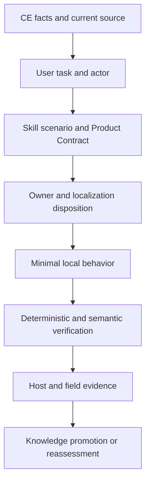

# CE 增量本地化与全量 Skill 研发效能审查方案

## Goal Capsule

- **Objective:** 面向企业研发效能，对 spec-first 全量 Skill 进行 CE 增量本地化审查和必要改造，使每个 Skill 都能更高质量地帮助用户完成需求开发、验证、交付与经验沉淀。
- **Success definition:** 不是 CE 文件覆盖率或行为保真度最大化，而是每个 Skill 都有明确用户任务、唯一本地 owner、冻结的 baseline/target/improvement rule、可验证的质量改善或“已达到目标”的证据、诚实的限制和可持续的反馈到知识闭环。
- **Recommended approach:** 先建立全量 baseline 与统一审查合同，再按研发链和风险分层审查；对每项 CE 能力在 `reuse`、`extend`、`compose`、`evidence-only`、`reject`、`defer` 中做本地价值裁决，最后用代表性真实任务验证增益。
- **Decision authority:** 用户任务和企业研发价值定义 WHAT；当前 spec-first source、contracts、tests 和现场证据约束 HOW；LLM 判断语义适配；脚本准备事实并验证确定性不变量；Project owner 裁决范围、价值权重和高风险取舍。
- **Verification focus:** 分离 `structure_contract`、`behavior_quality`、`runtime_cost`、`field_outcome` 四类 claim，禁止用 source/test green 外推现场价值或“越用越聪明”。
- **Largest risk:** 把“CE 已覆盖”“Skill 文案更长”或“测试通过”误当作用户研发效能提升，导致重复 owner、过重 workflow、隐性 provider 依赖和知识堆积。
- **Stop conditions:** 找不到明确用户任务、唯一 owner 或可验证增益时，不得强行实现；降级为 `evidence-only`、`defer` 或 `reject`，并记录重新评估触发条件。
- **Tail ownership:** 本方案负责审查合同、证据矩阵和价值验证设计；实际 Skill source 修复、focused tests、fresh-source eval、runtime projection 与 closeout 由后续 `spec-work` 按 unit 承接。

---

## Product Contract

### Problem Frame

CE 增量包含 Skill、脚本、references、测试、runtime metadata 和工作流经验，但上游结构与 spec-first 的使命、owner、宿主边界和证据模型并不相同。直接复制会扩大系统表面，遗漏本地价值，或形成第二真相源；只做静态对账又无法证明用户在真实需求开发交付中得到改善。

企业研发效能的目标是让用户更高质量地完成：需求理解、方案设计、任务拆解、代码实施、验证审查、交付协作和经验复用，并让经过验证的经验进入后续 Skill/workflow，形成可失效、可复用、可持续改进的闭环。

### Requirements

#### 范围、场景与本地价值

- **R1. 全量覆盖：** 审查当前 spec-first 全量 Skill 及其直接支撑的 workflow、script、reference、contract、test 和 runtime projection source；不得以抽样结果冒充全量结论。
- **R2. 用户任务绑定：** 每个 Skill 必须绑定至少一个企业研发场景、actor、输入、预期结果和失败成本；只有名称相似或上游存在对应文件不能形成集成理由。
- **R3. 本地 owner：** 每个 implementation-bearing 保留能力必须有唯一 canonical source owner、明确 downstream consumer 和 source/runtime 边界；`evidence-only`/排除项使用独立 evidence owner 和明确终态，不伪造 canonical implementation owner，也不阻断无关 implementation unit；generated runtime mirror 不得成为 owner。
- **R4. 本地化裁决：** 每项 CE 能力必须在 `reuse`、`extend`、`compose`、`evidence-only`、`reject`、`defer` 中选择一个主 disposition，并记录保留、重构、拒绝行为及原因。
- **R5. 质量改善：** 每个 Skill 必须建立 baseline 与 target state，分别评估 `structure_contract`、`behavior_quality`、`runtime_cost` 和 `field_outcome`；缺少 before/after 不能声明“比当前更好”。

#### 权威、证据与产物治理

- **R6. 语义和确定性分工：** 脚本只验证路径、hash、schema、依赖、状态和其他机械不变量；LLM 判断语义充分性、owner 适配和用户结果；不得让任一方伪造另一方的权威。
- **R7. 证据分层：** 机制、语义、宿主和现场证据必须分别记录；缺失证据要输出 `degraded`、`not-run` 或明确 limitation，不得静默放行。
- **R8. 研发链闭环：** 审查结果必须覆盖需求、计划、任务、代码、review、交付和知识沉淀之间的关键 handoff；孤立 Skill 优化不能替代链路质量。
- **R9. 经验沉淀：** 只有带 source refs、适用条件、invalidating condition、owner 和实际 consumer 的经验，才能进入 durable knowledge；“越用越聪明”必须由后续任务复用证据支持。
- **R10. 现场价值：** 机制改善和真实研发价值分开声明；真实价值至少通过代表性任务 before/after 或明确的 `not-run:<reason>` 记录验证边界。
- **R11. 改善判定：** 每个 Skill 在进入行为、成本或现场验证前，必须冻结 `baseline`、`target`、`primary_metric`、`secondary_metrics`、`minimum_detectable_improvement`、`acceptable_regression`、`sample_requirement` 和 `decision_rule`；执行后不得为了得到期望结论改写规则。
- **R12. 成熟 Skill：** 已达到 target 且无超过 `acceptable_regression` 的回归时，可标记 `maintained-confirmed`；该状态证明维持目标，不得被包装成新增 improvement。用户-facing Skill 若既未 `confirmed-improved` 也未 `maintained-confirmed`，不得静默关闭。
- **R13. 审查产物：** 全量审查必须使用冻结的 canonical artifact topology；每个 JSON artifact 有唯一 producer、single-writer/serialized merge owner、schema/version、source snapshot、freshness 和 consumer，Markdown 只作为 derived report。

#### 现场、provider 与运行时边界

- **R14. 现场对照：** field validation 由独立 field owner 在执行前冻结纳入类别与明确 not-run 类别、cohort、配对规则、任务复杂度、宿主/provider facts、排除规则、最小样本和判定方式；每类至少 3 个 baseline/candidate 配对样本只能进入 `exploratory`/`candidate-confirmed` 候选，最终 `confirmed-improved` 还必须满足 effect/不确定性/独立复现门槛。未纳入类别不得被全局报告合并，必须保持 `not-run`/`degraded`。
- **R15. 上游事实版本：** CE path facts 只接受 `ce-upstream-reconciliation/v2` 和当前目标源码快照；legacy v1、未绑定 snapshot、允许旧 `defer`/`regression-only` 语义的输入必须 fail closed。localization disposition 的 `defer` 是本地价值裁决，不能回写上游 v2 producer。
- **R16. Provider/worker 可信边界：** serving receipt 必须声明 schema/version、producer、source binding、freshness/expiry、hash 或最小可信来源；缺失或 mismatch 只能是 `degraded/unverified`。worker 凭据、Git/index lock、cleanup 和跨模型子进程必须有可检测的白名单/最小权限约束；无法强制时输出 loud degraded 和 reason code，并阻断独立完成声明。
- **R17. Prototype 与 runtime 安全：** prototype 只允许 loopback host，响应必须有 CSP/无外发约束，stop 必须校验 owner PID/process identity 后 fail closed；prototype 状态和 U6/U7 runtime 输出必须使用可审查的状态/结果映射，不以命令存在替代行为证据。
- **R18. 旧方案 consumer gate：** `superseded`/非 active 方案不得生成新 task pack、进入 spec-work 或作为 implementation-ready 输入；发现非 active consumer 时退回所属 owner unit。

#### 价值追踪、Setup 与终局审查

- **R19. Product Contract trace：** 每个 package/scenario 必须回指 actor outcome、`R*` requirement、`AE*` acceptance example 和预期研发增益；无法建立价值连接的能力只能进入 evidence-only、reject 或 `defer`（待重估）终态。
- **R20. CE setup 入口边界：** `ce-setup` 不复制为新的 public Skill、CLI、host entry 或配置命名空间；其可保留语义必须由 spec-first 当前 Runtime Setup、CLI、配置 consumer、doctor 或下游 Skill 的既有 owner 选择性吸收。不存在真实 consumer 或 owner 的 CE setup 语义只能标为 `evidence-only`、`defer` 或 `reject`，不得以文件相似、命令同名或上游覆盖率推导集成。
- **R21. CE setup 前置依赖闭合：** 在任何受 `ce-setup` 语义影响的 Skill、Runtime Setup 或 host projection 声称 `mechanism-improved` 以上之前，必须完成入口 identity、registry/schema、mode side-effect、project-local config validity、setup facts、target snapshot/hash、doctor disposition/status projection、host authority/projection、真实下游 consumer/fallback 和 focused tests 的逐项核对；任一依赖缺失、漂移或只有 advisory 证据时，相关 unit 必须保持 `incomplete|degraded|blocked`，输出 `reason_code`，不得生成 runtime mutation 或完成声明。只有经过真实 source/consumer inventory 证明该语义确实没有本地 consumer，才允许将该语义单独标为 `not-applicable|evidence-only|defer|reject`，不得用 `not-applicable` 掩盖依赖未闭合。
- **R22. 三轮全量源码对抗审查：** 在最终 closeout 前，当前 baseline 的 36 个 canonical Skill 及前序修订后刷新得到的最终 Skill inventory `S_final` 必须逐个完成三轮、source-bound 的审查：第一轮由架构/运行时/价值角色建立 findings，第二轮对第一轮决定做 fresh-source fix-landed 与反例复核，第三轮由 OpenAI skill-engineering lens 与 Anthropic skill-craft/safety lens 两个角色视角分别完整重读当前 canonical source。当前 package baseline 为 566 个 path；第三轮运行前必须刷新 Skill/package inventory 为 `S`/`N`，解释相对 36/566 的增删，并另行冻结所有直接支撑的 `src/cli/**`、`templates/**`、contracts 和 focused tests；不得把只读 `SKILL.md`、抽样 support file 或复用另一 lens 的摘要称为逐行覆盖。每个文本 source path 都必须有 `[1, line_count]` 完整行区间、SHA-256 和 reviewer-specific source packet receipt；每个 finding 必须经过 owner 修订、focused verification 和 fresh-source re-review 才能关闭。角色名只代表审查视角，不是公司身份、官方方法论或外部背书；没有可信 provider serving receipt 和可验证上下文隔离时只能标 `role-simulated/provider_unverified/degraded_inherited`，不得声称 OpenAI/Anthropic 独立覆盖。

### Actors

- **A1：** 企业研发人员，使用 Skill 完成需求开发和交付。
- **A2：** 技术负责人或项目 owner，裁决范围、风险和价值优先级。
- **A3：** Skill/workflow owner，负责 canonical source、合同、测试和后续维护。
- **A4：** Review/verification owner，负责确定性验证、语义审查和证据 claim ceiling。
- **A5：** 知识 owner，负责经验沉淀、复用、失效和清理。
- **A6：** Field validation owner，负责冻结 cohort/protocol、收集 paired task evidence、隔离 host/provider 变量和报告现场 claim ceiling。

### Key Flows

- **F1. 需求到实现：** A1 从需求或变更目标进入 Skill 链路，获得可执行计划、任务包和明确的验证入口。
- **F2. 实施到交付：** A1 完成代码变更后，review、测试、运行时和 handoff 结果能够被下游消费，不把 degraded 结果误当 confirmed。
- **F3. 失败与降级：** provider、宿主、权限、上下文或验证能力缺失时，Skill 输出可见 reason code、限制和下一步动作，而不是静默假绿。
- **F4. 经验复用：** A5 从已完成任务中提取带适用边界的经验，后续同类任务能够消费并减少重复诊断或返工。
- **F5. 本地化裁决：** A2/A3 对 CE 能力做 reuse/extend/compose/evidence-only/reject/defer 决策，保留行为意图但不受上游文件结构约束。

### Acceptance Examples

- **AE1.** 给定一个 CE package，审查结果能指出对应用户任务、本地 owner、目标 Skill 场景、保留和拒绝的行为、验证证据以及未证明的 claim；不能只返回“已同步”。
- **AE2.** 给定两个可能重复的 CE 能力，审查能证明是复用现有 owner、扩展现有 owner、组合已有能力，或给出创建新边界的必要理由。
- **AE3.** 给定一个只有 source/test 证据、没有真实宿主或现场任务证据的 Skill，结果将机制状态与 field outcome 分开，并保持价值 claim 为 degraded/not-run。
- **AE4.** 给定一次 Skill 失败或人工纠正，后续经验 artifact 具有 source refs、适用条件、失效条件和实际 consumer；若没有复用证据，不得标记为 proven knowledge。
- **AE5.** 给定一个 CE 行为与 spec-first 本地场景冲突的能力，审查可以拒绝或重构它，但必须记录用户价值保留、放弃行为、替代机制和重评触发条件。
- **AE6.** 给定 CE `ce-setup`，结果不会出现 `spec-setup`、`spec-mcp-setup`、CE `.compound-engineering` 配置命名空间或新的 host entry；每条保留语义都能回指一个现有 spec-first owner，未确认 owner 的 `docs_root`、scratch 目录或 CE Work engine 修复语义保持 evidence-only/defer/reject。
- **AE7.** 给定缺失 optional tool、无效 local config、stale generated runtime、host config conflict、non-Git target 或旧配置文件，Runtime Setup/doctor 能输出区分的状态、`reason_code` 和下一步；下游 Skill 只在自身需要时降级，不因 optional capability 缺失被全局静默阻断。
- **AE8.** 只有当 `spec-runtime-setup → setup facts → doctor → downstream consumer` 链路的 source、test 和 evidence 全部绑定同一 target snapshot，并且 CE 上游 facts 通过当前 `--full-window ... --adjudication` report-only freshness 校验、Runtime Setup 再以 `--verify-only` 刷新其 setup-owned facts 后，`ce-setup` 本地化相关 P24/implementation-ready 才可关闭；旧 CE 计划中“已完成”的文字不能作为关闭证据。
- **AE9.** 给定任一 Skill，三轮审查产物都能回指当前 source snapshot 的精确 `file:line` 证据；第三轮两个角色 lens 分别给出完整 source-read receipt、支持与反方判断、no-finding rationale 或 finding、冲突解决和最终 disposition。若该 Skill 预期 package/support path 与实际完整读取集合不相等、任一文件没有覆盖 `[1, line_count]`、任一 lens 只消费另一 lens 摘要，或缺少 freshness/reviewer isolation/provider receipt，则该 Skill 的 Round 3 状态必须为 `partial|not-run|unverified`，不得把角色标签写成外部公司结论。

### Scope Boundaries

#### In scope

- 当前 spec-first 全量 Skill、相关 workflow、canonical references、Skill-local scripts、contracts、tests 和 source-owned runtime generation 影响。
- CE post-3.20 已形成的 517-path、33-package facts、adjudication 和 reconciliation artifacts 作为事实输入；这些 artifacts 不替代本地价值审查。
- 企业研发链路中的需求、计划、任务、实施、验证、review、交付、handoff 和知识复用场景。
- 统一质量指标、证据等级、审查台账、代表性任务验证和后续重评规则。

#### Outside this plan's identity

- 不以 CE 行为或目录结构作为 spec-first 的新 source-of-truth。
- 不复制 CE 中心 runner、provider topology、generated runtime mirror、独立状态机或第二 ledger。
- 不默认新增 public Skill、agent、CLI、schema、orchestrator 或 provider；只有现有 owner 无法吸收且价值/边界证据充分时才进入单独设计。
- 不把机制就位升级为 field outcome、用户采纳、生产收益或跨宿主完整支持。
- 不在本方案内执行 commit、push、PR、generated runtime apply 或外部 provider 调用。

---

## Planning Contract

### Key Technical Decisions

- **KTD1. 价值优先于 CE 保真。** 本地集成的最高裁判是企业研发任务结果和 Skill 可采纳性；CE 行为只有在能服务本地用户任务、且不破坏 spec-first 边界时才保留。（session-settled: user-directed — chosen over 最大化 CE 行为/目录保真: 用户明确要求以本地企业研发价值为最高裁判，并允许重构或拒绝 CE 行为。）
- **KTD2. 使用两层台账。** 现有 CE path/package reconciliation 继续负责确定性事实；新增 `CE -> spec-first localization value` 语义台账，负责用户任务、owner、场景、价值、复杂度和 claim ceiling，禁止把两个台账混成单一 truth source。
- **KTD3. 以 Skill 场景而非 CE package 作为价值审查主单位。** Package 是导航和聚合；最终判断必须回到用户入口、workflow handoff 和 downstream outcome。一个 package 可服务多个场景，但每个场景必须有独立 evidence。
- **KTD4. 分离 disposition 与 architecture posture。** 每项 CE 能力选择 `reuse`、`extend`、`compose`、`evidence-only`、`reject` 或 `defer` 之一作为主 disposition；`new` 不属于 disposition，而是独立的 `architecture_posture: new-approved`，只有在现有 owner 会混淆职责、扭曲合同或制造错误 truth source 时才能批准。
- **KTD5. 四维质量不合并为单一总分。** `structure_contract` 是机械/结构门；`behavior_quality` 是场景语义门；`runtime_cost` 是成本和可维护性门；`field_outcome` 是真实研发价值门。最终状态使用 `confirmed-improved`、`maintained-confirmed`、`mechanism-improved`、`degraded-or-partial`、`not-improved-or-rejected`，并附维度级证据。
- **KTD6. 先冻结 improvement contract，再判断改善。** 每个 Skill 必须记录当前 baseline、目标行为、保留与有意拒绝的 CE 行为、primary/secondary metrics、最小可检测改善、可接受回归、样本要求、decision rule、证据来源和未证明范围；没有 before/after 或没有可信 consumer 的经验不得声称改善或 proven。
- **KTD7. 先校准再全量执行。** 先选择 workflow orchestration、review、runtime/prototype 三类代表性 Skill，校准审查合同、指标和证据成本；校准结果不能替代其余 Skill 的逐项审查。
- **KTD8. 复杂度是负向价值项。** 新增 prompt/context、步骤、确认、schema、provider、宿主差异和维护入口都计入 runtime_cost；局部收益不足以抵消复杂度时，必须降级、拒绝或延期。
- **KTD9. 经验沉淀采用 promotion gate。** 只有 verified、可复用、带 owner/consumer/invalidation condition 的 artifact 才能进入 durable knowledge；失败样本和 degraded 经验可以保留为 validation evidence，但不能直接提升为最佳实践。
- **KTD10. 失败保持 incomplete。** 任一 required review、关键 source snapshot、场景验证或证据绑定失败时，不生成 runtime mutation，不发布完成声明；记录 failure、reason code、affected Skill 和下一步动作。
- **KTD11. Canonical artifact 单写入。** 全量审查的 JSON artifact 是 canonical；每个 artifact 只有一个 producer 和一个 single-writer/serialized merge owner。并行 owner 只能提交带 `base_hash` 与 source snapshot 的 patch，由聚合步骤顺序合并；derived Markdown 不得反向写回 JSON。
- **KTD12. 现场协议先冻结后执行。** field owner 必须在首个任务执行前冻结 cohort、baseline/candidate 配对、任务复杂度、角色、宿主/provider readiness、排除规则、最小样本、指标和 decision rule；执行中不得按结果改动这些条件，偏离只能新增 protocol amendment 并使原 claim 降级。
- **KTD13. 上游校验与本地价值校验分层。** 复用 `scripts/check-ce-upstream-reconciliation.cjs --full-window --ce-repo <path> --adjudication <path>` 作为 CE v2 facts 的 report-only freshness verifier（当前脚本没有 `--verify-only` 参数）；新建 `scripts/check-ce-localization-review.cjs` 作为本地 inventory/schema/hash/join 和 artifact integrity 的唯一确定性 producer。两者不共享 semantic writer，因为上游 reconciler 不拥有本地 scenario、Product Contract 或价值判断；两者通过 source-bound input refs 组合，不复制 CE 语义或建立第二 truth source。若 producer 尚未实现，相关 artifact 只能 `planned/unverified`，不得作为完成证据。
- **KTD14. `ce-setup` 只做语义吸收，不做入口复制。** `ce-setup` 的 explicit-invocation、health diagnosis、optional capability、project-local config safety、legacy manual-review 和 next-action 语义，按场景映射到现有 owner；不创建 `spec-setup`、`spec-mcp-setup` 兼容入口、CE `.compound-engineering` namespace、CE center runner 或新的 setup state machine。`runtime-setup-identity.js` 的 canonical identity（`spec-runtime-setup` / `runtime-setup`）是入口真相源。
- **KTD15. 先闭合 setup dependency chain，再审查下游 Skill。** `ce-setup` 相关审查必须先完成 `entry identity → registry/schema → mode side-effect contract → setup.cjs/project-config/facts → target snapshot → doctor/status projection → host authority/projection → actual downstream consumer fallback/readiness` 的依赖矩阵；`--verify-only` 只作为 setup-owned facts refresh 的受控写入模式，不是整条链路的最后兜底。U4a 是所有受影响 U4/U5/U6/U7/U8/U9a/U10 批次的硬前置，不允许用某个 Skill 的局部测试替代链路证据。
- **KTD16. 配置和 readiness 语义按本地 consumer 裁决。** CE config cascade、`docs_root`、scratch ignore、CE Work engine block 和 optional tool 清单不得直接成为 spec-first schema；每个 key/事实必须先列出现有真实 consumer、读取位置、作用范围、失效方式和 next action。无 consumer 的 key 保持 evidence-only/defer/reject；optional capability 只能由实际下游 Skill 选择 fallback，不升级为全局 gate。
- **KTD17. 三轮审查的身份与证据分离。** Reviewer role/lens 只规定检查问题，不提供事实权威；每条 finding 必须带 source snapshot、精确行号、source hash、round/role、evidence quote、反方解释、decision 和 claim ceiling。两个 lens 必须各自消费同一冻结 source inventory，但不要求把全量内容塞入一个上下文：每个 lens 是独立 reviewer lane，由确定性 chunk manifest 驱动多个 bounded fresh context，并在 lane 内完成 per-Skill 跨文件综合；不能让第二个 lens 只验证第一个 lens 的结论。共享文件可以每个 lens 各处理一次，但必须为每个消费该文件的 Skill 单独形成语义判断。角色冲突由聚合 owner 回源裁决，不按多数票或模型声望决定。只有 authenticated provider receipt、可验证的 lane/context 隔离和可重放的 per-Skill evidence 才能支持“独立角色/跨模型”措辞；否则使用 `role-simulated`、`provider_unverified`、`degraded_inherited` 或 `not-run`。
- **KTD18. 指标与知识沿用现有 owner。** 可测量 Skill 的 improvement contract 必须引用或哈希 `spec-optimize` 已有 metric/experiment schema（metric type/direction、noise floor、budget、measurement artifact），无优化场景显式 `not-applicable`；不得新建第二个 metric runner。U9 只生成给 `spec-compound` 的 promotion input/receipt，`docs/solutions/**` 仍由 `spec-compound` 唯一写入，`spec-compound-refresh` 负责 stale/consolidation；无真实 consumer 的经验留在 validation evidence。

### `ce-setup` Boundary and Existing-Owner Mapping

本节是后续实现和 review 的入口约束。它不是把 CE `ce-setup` 变成一个待复制的 spec-first package，而是规定哪些语义可以进入现有 owner、哪些语义必须停在证据层。当前源码核对已确认 `spec-runtime-setup` 是唯一公开 Runtime Setup identity：`src/cli/runtime-setup-identity.js` 只允许 `spec-runtime-setup` skill 和 `runtime-setup` command；因此本地化不得再引入 `spec-setup`、`spec-mcp-setup` 或 CE 原命名的兼容 alias。

| CE setup 语义 | spec-first 当前 owner / 事实来源 | 默认 disposition | 本地化边界与关闭条件 |
|---|---|---|---|
| explicit invocation、非 pipeline stage、集中 next action | `src/cli/runtime-setup-identity.js`、`skills/spec-runtime-setup/SKILL.md`、`setup.cjs` | `reuse` | 保持 `spec-runtime-setup` / `runtime-setup`；不新增入口或第二 setup 状态机；identity 与入口 focused test 通过后才算确认 |
| `agent-browser` dependency / execution readiness | `setup-registry.json`、`facts.cjs`、`spec-test-browser` canonical probe | `extend` | 保留 dependency 与 execution readiness 分层；缺失只影响 browser 场景并输出 `report-only`/`degraded`，不得成为普通 workflow 全局阻断 |
| `ast-grep` CLI readiness | `setup-registry.json`、`facts.cjs`、`spec-code-review`/`spec-debug`/`spec-work` | `extend` | 保留 `baseline_blocking=false` 与 `rg` fallback；下游按自身需要选择结构化搜索或 direct-source fallback |
| `ast-grep-skill` guidance | `setup-registry.json`、global-skill readiness facts、结构化搜索相关 Skill | `extend` | 只报告 guidance/安装状态；不得把 global skill 安装误报为结构化搜索语义已验证 |
| `ffmpeg` baseline helper | `setup-registry.json`、`mcp-setup-registry.test.js`、视频/媒体 consumer | `reuse` | 当前 registry 将 `ffmpeg` 标为 `required=true`、`baseline_blocking=true`；必须保留该本地合同，不能沿用 CE optional 标签或无条件降为 advisory |
| `gh` GitHub CLI | `setup-registry.json`、真实 GitHub consumer（当前由 review/workflow 相关路径核对） | `extend`（本地 baseline promotion） | CE 的 optional 标签不能覆盖当前 spec-first `required=true`/`baseline_blocking=true` 合同；只有存在真实 GitHub consumer 时才产生 action-required，并在 ledger 中记录“local-promoted-required”，不能把这次本地提升写回 CE 语义 |
| `jq` helper | `tests/unit/mcp-setup-registry.test.js`（retired inventory） | `reject` | 明确无本地 registry consumer；不得重新加入 setup schema；历史出现只作为 evidence/retired signal，不阻断 setup |
| health check、readiness summary、verify-only | `skills/spec-runtime-setup/scripts/setup.cjs`、`scripts/check-health`、`facts.cjs`、`human-output.cjs`、`src/cli/commands/doctor.js` | `reuse` / `compose` | setup 只产事实，doctor 负责 disposition，LLM/下游 Skill 负责语义 fallback；`--only` 结果必须标 partial scope，不能冒充完整 setup |
| repo config example 刷新、显式创建 local override、local config gitignore | `scripts/lib/project-config.cjs`、`src/cli/gitignore-policy.js`、Runtime Setup project-config contract | `reuse` | 只写 `.spec-first/config.local.example.yaml`、`.spec-first/config.local.yaml` 和 `.spec-first/*.local.yaml` 规则；所有写入经现有 action plan、containment、verify-only；不复制 CE config 文件 |
| CE config cascade（`config.local.yaml → config.yaml`） | 当前 spec-first local config consumers（`spec-plan`、`spec-brainstorm`、`spec-ideate`、`spec-sweep`、`spec-product-pulse`、`spec-promote`、verification profile 与执行偏好） | `reject` 直接复制，必要时 `extend` 现有 consumer | 逐 key 登记读取位置、默认值、范围和失效条件；无真实 consumer 的 key 不进入 schema；`.spec-first/config.local.yaml` 仍是 local-only preference，不成为 team-shared truth |
| `docs_root` 解析/修复 | 当前 source 中未确认存在等价的 active spec-first consumer；artifact root 由各自 contract 管理 | `evidence-only` | 只有发现真实 consumer、owner、source/test refs 后，新增 adjudication 才能把它转交既有 owner；不得因 CE 有该 key 就新增全局 `docs_root` 合同 |
| scratch 目录 gitignore | 当前 spec-first setup contract 未确认有独立 scratch consumer | `evidence-only` | 仅记录事实和 limitation；重评触发条件是出现真实 consumer + source/test contract；不得新增通用 scratch namespace 或静默修改项目 `.gitignore` |
| CE Work engine block 修复 | 当前 spec-first Runtime Setup/CLI 中未确认对应 active consumer | `evidence-only` | 若未来出现真实 owner，必须由该 owner 提交 source-first contract；不得由 `ce-setup` 兼容层代写；当前不进入 implementation-ready |
| legacy config signal、无自动迁移 | `project-config.cjs` 的 `legacy_markdown_config` / `legacy_local_config`、doctor/manual-review 输出 | `reuse` | 保留人工审查、retired 和 explicit cleanup 语义；不得翻译 CE key、自动迁移或把旧文件当 spec-first truth |
| host/runtime config 写入与 generated projection | host authority、`setup.cjs`、各 adapter、`spec-first init` | `compose` | `ce-setup` 只能提供事实/意图；host 写入必须走当前 authority、目标绑定、冲突检查和 post-write verify；generated mirror 不能成为 owner |
| optional install advice / downstream fallback | registry `next_action`、facts reason code、各 Skill 的 readiness adapter | `extend` | 由实际 consumer 选择 fallback；缺 provider 时输出可见 limitation，不由 setup 代替 Skill 做语义判断或自动调用下游 workflow |

明确禁止的集成形态：复制 `skills/ce-setup/` 为 `skills/spec-setup/`；新增 `spec-setup`/`ce-setup` CLI alias；引入 `.compound-engineering/config.yaml` 或同名 config namespace；把 CE docs 作为 Runtime Setup source-of-truth；让 generated host runtime、setup facts cache 或 CE reconciler 生成语义 adjudication；把 optional provider/readiness 变成普通 plan/work/review 的全局前置 gate。

### 当前深度核对结论与前置阻断

这不是“把 CE `ce-setup` 的文件搬到 `spec-first`”的实现清单，而是进入后续 Skill 审查前必须完成的事实核对。以下结论来自当前 checkout 的 canonical source、测试和 CE counterpart；`planned`/`blocked` 不是实现完成状态，不能被旧计划、文件存在或命令可执行替代。

| 核对项 | 当前源码事实 | 当前结论 | 进入后续 Skill 前的必要动作 |
|---|---|---|---|
| 入口 identity | `src/cli/runtime-setup-identity.js` 只允许 `spec-runtime-setup` skill 与 `runtime-setup` command；历史资料仍可能出现 `spec-mcp-setup` | 入口复制已被当前 source 拒绝，但必须区分历史文档引用与 active alias | 对 source、templates、CLI registry、host projection 做 forbidden-surface scan；只要出现可执行 alias，S1 仍为 `blocked` |
| mode / side effect | `skills/spec-runtime-setup/SKILL.md:115` 把 `--verify-only` 与 `--check/--plan` 一起写成“不 mutate”，但 `:145` 又允许 refresh facts；`mode-policy.cjs` 将 verify 映射为 `write-setup-facts`，`runtime-executor.cjs` 会写 facts、scenario fingerprint 和 host ledger | P1 contract contradiction；下游无法判断 verify-only 是纯读还是 setup-owned facts 刷新 | 在 source、schema、tests 中固定三分法（见下表）；未修订前 U4a/S4/S11 不得 `confirmed` |
| target snapshot | 当前 `tool-facts.v2`、`runtime-capabilities.v1`、scenario fingerprint 有 HEAD/status hash 或 target facts，但没有统一 `source_tree_hash`、`inventory_hash` producer/schema | P1 binding gap；仅绑定 HEAD/status 不能证明当前源码树和审查 inventory 未漂移 | 由 localization review producer 生成并版本化 manifest/hash；不得把尚未存在的 hash 当作 Runtime Setup 已有字段；漂移必须使 adjudication 失效 |
| local config validity | `project-config.cjs` 只判断 example 是否 current、local 是否存在、gitignore/legacy signal；不存在 YAML 语法、key/value 范围或 consumer schema 校验 | P1 failure-exit gap；“存在”不等于“有效”，Skill 可能静默回退 | Runtime Setup 只负责轻量语法/结构事实；各 consumer adapter 负责自身 key/value 合同，并统一输出 `invalid|degraded`、key、consumer、reason_code、next_action |
| doctor / status projection | doctor 主要由 `PASS/WARNING/ERROR` 映射 `action_required|optional|known_limitation`；setup facts 另有 `ready|degraded|action-required|missing|stale|not_checked`，执行摘要还有 `partial` | P1 status vocabulary mismatch；不能从现有文字输出推出完整逐宿主状态闭环 | 新增版本化 machine projection，或收窄 acceptance 到现有枚举；为 `ready/action-required/optional/known-limitation/degraded/not-run` 逐项提供 fixture 与 next-action 语义 |
| host authority | `host-authority.cjs` 实际信任调用方提供的合法 `MCP_SETUP_HOST`；没有验证“当前 loaded host surface 是否与 pin 相同”的 receipt | P1 enforcement gap；合法 pin 仍可能被错误宿主伪造 | 增加 adapter-owned invocation receipt/loaded-skill-root 绑定；无法检测时只能 `degraded` 并阻断 mutation/completion claim，不能把 env pin 写成强制安全证明 |
| downstream consumer | 当前确定性读取 `.spec-first/config/tool-facts.json` 的主要位置是 doctor/setup helper；普通 plan/work/review/debug 多数从 direct source 或自身 local config 读取 | P1 consumer over-assumption；不能默认所有 Skill 都消费 setup facts | 先生成 consumer inventory：`consumer-present`（文件、字段、fallback 可定位）、`not-applicable`（direct-source 继续）、`consumer-planned`（尚未完成）；不得新增全局 readiness gate |
| CE tool disposition | CE `check-health` 列出 `agent-browser/gh/jq/ast-grep/ffmpeg`；当前 registry 还有本地 `vhs/silicon/ast-grep-skill` 合同，`jq` 没有 active consumer，`gh` 已被本地提升为 baseline | P2 mapping gap；CE optional 与本地 required 不是同一语义 | `jq` 终态为 `reject`；`gh` 记录 `local-promoted-required`；其余每项逐个绑定 local consumer、fallback 和 reason code，禁止按 CE 清单整体导入 |

#### `--verify-only` / `--check` / mutation side-effect contract

在修订 source contract 前，所有文档和测试只能引用下表，不得继续使用笼统的“verify-only 不写入”表述：

| mode | 允许写入 | 明确禁止 | 对下游的 claim ceiling |
|---|---|---|---|
| `--check` / `--plan` | 不写文件；可产生 stdout/raw log 或临时内存 facts | setup facts、host config、provider、project config、runtime projection | 只能报告 advisory/read-only facts，不能刷新 freshness |
| `--verify-only` / `--refresh-facts` | 仅 setup-owned `.spec-first/config/tool-facts.json`、`runtime-capabilities.json`、setup scenario fingerprint、host readiness ledger；必须原子写且带 source/target snapshot | 安装工具、provider mutation、host config、project-local config、generated runtime projection | 证明“事实已刷新”，不证明 Skill 语义充分或现场价值；写失败必须 `degraded|action-required` |
| `--project-config`、host/provider/apply modes | 仅在显式 capability、target containment、authority、冲突和 post-write verify 全通过时写对应 owner surface | 跨 owner 迁移 CE key、写第二 namespace、静默修改 generated runtime 或未授权 project/host surface | 只能声称对应 owner 的 mutation receipt；不能把 setup 成功外推为 downstream ready |

这三分法必须同时落在 `SKILL.md`、`mode-policy.cjs`、`runtime-executor.cjs`、facts/ledger schema 和 focused tests；否则同一命令在 prose、producer 和测试中会出现不同副作用合同。

#### Snapshot、receipt 与 projection 的最小确定性形状

- `target_repo_head`：由目标 repo 的 `git rev-parse HEAD` 取得；非 Git folder 使用 `repo_status=not-git-repo` 与 target root identity，不能伪造 commit。
- `dirty_path_manifest`：记录 `git status --porcelain=v1 -z` 的完整、排序、POSIX 路径清单和 `status_manifest_sha256`；未知/无法读取 dirty 状态即 `dirty-state-unknown`，不能当作 clean。
- `source_tree_hash`：只对本地 canonical source roots（`skills/`、`src/`、`scripts/`、`templates/`、`docs/contracts/`、根治理文件和受影响 `tests/`）做规范化 manifest 的 SHA-256；排除 `.git/`、`node_modules/`、host generated mirrors、`.spec-first/config/**`、`graphify-out/`、`.codegraph/` 和 derived validation reports，并把排除清单写入 receipt。目录顺序、路径分隔符、文件 mode/symlink 处理和换行规范必须版本化。
- `inventory_hash`：只对 `skill-inventory.json` 的排序后 path-role/owner/consumer/disposition 记录做 SHA-256，不把 source content hash 冒充 inventory hash；inventory 变更即使 HEAD 不变也必须使 adjudication 失效。
- `host_invocation_receipt.v1`：至少包含 `host`、`surface_id`、loaded `skill_root`、canonical entry name、`MCP_SETUP_HOST` pin、target identity、producer、issued/expiry、receipt hash 和 enforcement status。仅有环境变量没有 receipt 时，`mutation_authorized` 只能是 `degraded/unverified`。
- `runtime_status_projection.v1`：machine 层保留 `status`、`reason_code`、`disposition`、`scope`、`artifact_refs`、`next_action`，human 层才映射中文文案；`ready`、`would-change`、`apply-failed`、`degraded`、`not-run` 等不得由退出码或文件存在推导。

上述 producer 不属于 CE `ce-setup`，也不把这些字段塞入现有 `tool-facts.v2`，除非该 schema 的 owner 明确扩展并同步所有 consumer；默认由 localization review / setup dependency artifact 自己持有 source-bound receipt，Runtime Setup 只提供其实际已有的 target/readiness facts。

#### 当前真实 consumer inventory 的最低口径

U4a 不得把“文档中提到的 downstream consumers”当作已存在的读取关系。每条 consumer row 至少记录 `consumer_kind`（`deterministic-source-reader|skill-prose/native-read|consumer-planned|not-applicable`）、精确 `file:line`、读取字段、fallback、是否会阻断、source snapshot 和 test ref。`skill-prose/native-read` 可以证明 Skill 合同要求某个本地 key，但不能被提升为 Runtime Setup facts reader 或全局 readiness gate：

| consumer kind | 当前已确认的 source owner | 可消费的事实 | 当前处理 |
|---|---|---|---|
| confirmed deterministic consumer | `src/cli/commands/doctor.js`、`src/cli/helpers/setup-facts.js` | facts freshness、required action、degraded/skipped/provider counts、host mismatch | 允许进入 S7/S11，但必须按现有枚举投影，不可虚构新状态 |
| confirmed local-config consumer | deterministic reader: `src/verification/profile-loader.js`；skill-prose/native-read consumers: `skills/spec-sweep/**`、`skills/spec-product-pulse/**`、`skills/spec-promote/**`、`skills/spec-plan/**`、`skills/spec-brainstorm/**`、`skills/spec-ideate/**` 等各自 source | 各自声明的 local key；缺失/无效回退由 consumer 自己决定。两类都必须记录精确 `file:line`，但 skill-prose/native-read 不能冒充 setup facts reader | 按 key 建 adapter contract；不把 local config 当 setup readiness，也不把 prose 声明提升为确定性 facts consumer |
| not confirmed as facts consumer | `using-spec-first`、普通 plan/work/review/debug 的 direct-source 路径 | 目前没有可回指的稳定 facts reader；prose 中的建议不等于读取关系 | 标为 `not-applicable` 或 `consumer-planned`，普通任务继续 direct source；禁止全局 gate |

只有第一类或明确的 Skill-local adapter 才能在 ledger 中写 `consumer-present`。未找到读取位置时，保留 CE 语义为 `evidence-only/defer/reject`，不能通过新增一个全局 helper “制造” consumer。

#### 前置执行顺序（修订后的硬依赖）

1. U0/U1 先冻结 target、dirty manifest、source/inventory hash、Skill/path inventory 和真实 consumer inventory。
2. U4a-0 先完成本节六类合同（mode side-effect、snapshot producer、config validity、status projection、host authority receipt、真实 consumer inventory）及 owner/receipt 设计；该阶段只允许写 plan/contract/test fixtures，不得修改 downstream Skill 行为。
3. 只有 U4a-0 通过后，才运行 U4a S1-S11 的 focused tests，生成 source-bound `ce-setup-dependency-matrix.json`，并把每项标为 `confirmed`、`degraded`、`blocked` 或明确 terminal disposition。
4. 仅当受影响的 S1-S11 全部闭合，且不存在 `unowned-ce-setup-capability`、`target-snapshot-drift`、`optional-gate-leak`、`host-pin-enforcement-unavailable` 时，U4 才能对 setup-related path 做 disposition，U5/U6/U7/U8/U9a/U10 才能消费其结果或关闭受影响 claim。
5. 下游 Skill 的 behavior/fresh-source/field 评估仍由各自 owner 负责；setup matrix 只证明“事实可以安全消费”，不替代 Skill 语义或用户价值证据。

### `ce-setup` Prerequisite Dependency Matrix

U4a 必须按下表逐项产出 source/test/evidence refs。矩阵记录的是“能否安全被下游消费”的依赖，不是把所有 setup 能力都强制成 required。`status=confirmed` 需要当前目标仓库 HEAD、dirty-path manifest、source tree hash 和 inventory hash 一致；`degraded`/`blocked` 只能保持 incomplete。基于当前源码核对，S4、S5、S6、S7、S10、S11 尚不能直接标 `confirmed`：它们分别受 side-effect、status projection、host pin、真实 consumer、hash producer 或 focused test 缺口影响；本节新增的当前结论表优先于旧计划中的“已完成”文字。

| Dependency ID | 依赖链 / 必查问题 | canonical owner | 确定性证据 | 下游影响 | 失败出口 / reason code |
|---|---|---|---|---|---|
| S1 | 入口 identity 是否只有 `spec-runtime-setup` / `runtime-setup`，是否出现新 alias | `src/cli/runtime-setup-identity.js`、host command projection | identity helper、入口 contract test、source refs | 所有 setup 路由与 handoff | `duplicate-setup-entrypoint`、`runtime-setup-identity-drift`；阻断 U4a |
| S2 | registry/schema 是否同版本、所有 CE 候选 tool 是否有本地 disposition 和 consumer | `skills/spec-runtime-setup/setup-registry.json` + schema + `registry.cjs` | schema validation、registry test、consumer inventory | readiness、安装建议、`--only` scope | `registry-schema-mismatch`、`unowned-ce-setup-capability`；无 owner 不得入 schema |
| S3 | project-local config 的 example/local/gitignore/legacy 状态是否使用现有路径和显式 action | `project-config.cjs`、`gitignore-policy.js` | project-config tests、contained-path facts、verify-only | `spec-plan`/`spec-sweep` 等 config consumers | `project-config-contract-gap`、`legacy-migration-attempted`、`gitignore-safety-unknown` |
| S4 | facts 是否由 setup-owned producer 生成，是否区分 dependency、configured、execution 和 provider readiness；provider receipt 是否可信、过期和 mismatch 是否可见 | `facts.cjs`、`src/cli/helpers/setup-facts.js`、provider receipt producer | `tool-facts.v2`/`runtime-capabilities.v1` schema、provider-serving-receipt schema、facts/receipt tests | doctor 及实际存在的 Skill-local readiness adapter | `facts-source-untrusted`、`optional-capability-misclassified`、`facts-snapshot-stale`、`provider-receipt-mismatch`；缺 receipt 不得升级为 confirmed |
| S5 | doctor 是否把 ready/action-required/optional/known-limitation/degraded/not-run 分开，而非把 warning 全部当 blocker | `src/cli/commands/doctor.js`、doctor render helpers | doctor contract tests、human output evidence | 用户下一步与完成声明 | `doctor-disposition-collapse`、`doctor-evidence-missing` |
| S6 | host authority、target path、config conflict 和 generated projection 是否走当前 setup/init boundary | `setup.cjs`、host adapters、`spec-first init` | host projection tests、target/authority facts、verify-only | 各支持宿主 runtime readiness | `host-authority-missing`、`host-config-conflict`、`generated-runtime-drift` |
| S7 | 下游 Skill 是否在确有读取关系时消费事实并自行决定 fallback，是否错误依赖 CE 新入口或全局 optional gate | consumer inventory producer、各真实 Skill-local adapter/contract；`using-spec-first` 仅作为路由 owner，不自动成为 facts consumer | consumer search、精确 `file:line` refs、focused Skill tests、fresh-source review | 仅影响实际声明 consumer 的 Skill；普通 direct-source workflow 继续可用 | `downstream-consumer-missing`、`fallback-contract-missing`、`optional-gate-leak` |
| S8 | 配置 key 是否都能回指真实 consumer、读取位置、默认值和失效条件 | 各 config consumer owner；setup 只保护和呈现 | source refs、consumer tests、config inventory | local preference 语义稳定性 | `config-key-no-consumer`、`config-default-unbound`；标 evidence-only/defer |
| S9 | `docs_root`、scratch、CE Work engine 语义是否有现有 owner，而不是仅有 CE 文件 | 目标 owner（若存在）；否则 localization adjudication | bounded source search、scenario/ledger refs | artifact 路径、Work/Plan 行为 | `no-local-consumer`；保持 evidence-only/defer/reject |
| S10 | target 是否为正确 repo/folder，source snapshot 是否干净且与 adjudication 绑定；`source_tree_hash`/`inventory_hash` 是否由已实现 producer 生成 | `project-target.cjs`、inventory producer、localization ledger writer | HEAD、dirty-path manifest、版本化 source/inventory manifest、hash producer test | 所有 setup/implementation-ready claim | `target-snapshot-drift`、`dirty-source-snapshot`、`inventory-hash-producer-missing`、`inventory-hash-mismatch` |
| S11 | focused tests 是否覆盖 missing optional、invalid config（语法/结构/consumer key）、stale runtime、host conflict/pin mismatch、non-Git target、legacy signal、verify-only side effects 和 no-write boundary | 对应 setup/CLI/doctor/consumer test owners | test result、per-case evidence、side-effect diff | U5/U6/U7/U8/U9a/U10 与最终 closeout | `ce-setup-test-gap`、`verify-only-side-effect-mismatch`；保持 incomplete，不生成 runtime mutation |

矩阵不能以“setup 命令可执行”作为闭合条件。至少要能从 S1 追到 S7，再由 S10 证明所有结论绑定同一当前快照；S8/S9 的无 consumer 结论必须作为明确终态而不是遗漏。S11 只证明确定性行为和失败出口，不证明 Skill 现场价值。

当前 gate 口径（本次审查，不代表已实现）如下：

| 依赖 | 当前状态 | 不能关闭的原因 |
|---|---|---|
| S1 | `partial` | canonical identity 已有 source/test，但 active forbidden-surface 全扫描尚未形成 receipt |
| S2 | `degraded` | registry/schema 存在，但 CE 候选的逐项 consumer/disposition inventory 尚未闭合；`gh` 本地 promotion 与 `jq` reject 需落 ledger |
| S3 | `partial` | 路径 containment/gitignore/legacy signal 有证据，但 invalid config 语义尚无 producer/contract |
| S4 | `blocked` | facts schema 没有统一 source/inventory hash，provider receipt 可信边界尚未闭合 |
| S5 | `blocked` | doctor 与 setup machine status 尚无统一 projection；`degraded/not-run` 不能稳定区分 |
| S6 | `degraded` | target/config boundary 较强，但 host pin 与实际调用 surface 的绑定仍是约定 |
| S7 | `blocked` | 尚未完成真实 facts consumer inventory；普通 Skill 不得被猜测性 gate |
| S8 | `partial` | 已有 local key 读取位置，但每个 key 的 invalid/default/fallback 证据需逐项补齐 |
| S9 | `evidence-only` | `docs_root`、scratch、CE Work engine 当前无已确认 active consumer；发现 consumer 前不得转 implementation-bearing |
| S10 | `blocked` | source_tree/inventory hash producer/schema 尚未真实存在；旧 artifact 不能直接复用 |
| S11 | `blocked` | verify-only side-effect、invalid config、host mismatch 和 per-case evidence 尚未形成完整 focused test 集 |

因此，在本方案当前版本中，`ce-setup` 本地化相关的 U4/U5/U6/U7/U8/U9a/U10 不能声称已完成；后续开发入口是 U4a-0，而不是新增 `ce-setup`/`spec-setup` 入口。

### Localization Review Model

每个 Skill 使用以下审查链：



每一层的 authority 不同：Git/source/contracts/tests 提供事实；LLM/ reviewer 判断语义充分性；脚本验证机械不变量；Project owner 判断价值、范围和不可逆取舍。

研发链 handoff 不能只记录 `downstream_consumers` 名称。`skill-scenarios`/ledger 还必须引用 stage-level handoff contract：producer artifact path/hash、freshness、required preconditions、consumer receipt（`observed|declared|rejected`）、claim ceiling、reason code 和 next action。至少覆盖 `spec-prd → spec-plan → spec-write-tasks → spec-work → spec-code-review → spec-compound`；没有 consumer receipt 时只能标 `consumer_declared`/`not-run`，不得声称链路闭合。既有 `docs/contracts/workflows/scenario-capability-matrix.md` 是 scenario/capability/fallback 语义 owner，新 artifact 只扩展其字段，不新造第二套场景真相源。

### Localization Matrix Contract

每个 package/scenario 记录以下字段，机器字段使用稳定英文枚举，解释字段可用中文：

```yaml
schema_version: ce-localization-ledger/v1
artifact_type: semantic_adjudication_ledger
producer:
source_snapshot:
target_repo_head:
dirty_path_manifest:
source_tree_hash:
inventory_hash:
freshness:
base_hash:
patch_scope:
package_id:
ce_record_id:
ce_path:
ce_package_id:
target_repo:
skill:
scenario_id:
scenario_kind:
visibility:
scenario_fingerprint_ref:
primary_user_tasks: []
actors: []
actor_outcomes: []
canonical_owner:
evidence_owner:
source_refs: []
test_refs: []
evidence_role: upstream-fact|local-contract|behavior-eval|field-outcome
ce_behavior_intent: []
localization_disposition: reuse|extend|compose|evidence-only|reject|defer
architecture_posture: reuse|extend|compose|new-approved|not-applicable
implementation_unit:
implementation_targets: []
target_action:
product_contract_refs: []
requirement_refs: []
acceptance_example_refs: []
expected_rnd_gain:
adjudication_status: proposed|confirmed|rejected|deferred|invalidated
before_state:
target_state:
baseline_ref:
improvement_contract_hash:
candidate_snapshot:
candidate_diff_ref:
improvement_contract:
  primary_metric:
  secondary_metrics: []
  minimum_detectable_improvement:
  acceptable_regression:
  sample_requirement:
  decision_rule:
preserved_behavior: []
intentionally_rejected_behavior: []
new_local_behavior: []
downstream_consumers: []
handoff_contract_refs: []
setup_dependency_refs: []
setup_dependency_status: not-applicable|pending|confirmed|degraded|blocked
complexity_cost:
structure_contract:
behavior_quality:
runtime_cost:
field_outcome:
evidence_refs: []
limitations: []
reassessment_trigger: []
final_status: confirmed-improved|maintained-confirmed|mechanism-improved|degraded-or-partial|not-improved-or-rejected
```

四个质量维度均使用同一最小形状：`state: confirmed|partial|degraded|not-run`、`evidence_refs: []`、`limitations: []`。其中 `field_outcome.state` 还必须标注 `not-run|exploratory|confirmed|degraded`，`exploratory` 不得升级为 `confirmed`，除非满足本方案的样本与 protocol gate。

### Canonical Artifact Topology

审查产物统一落在 `docs/validation/ce-localization/`，JSON 是 canonical source，Markdown/HTML 仅是由对应 producer 生成的 derived report：

```text
docs/validation/ce-localization/
  skill-inventory.json
  skill-scenarios.json
  localization-ledger.json
  ce-setup-dependency-matrix.json
  review/round-1-findings.json
  review/round-2-findings.json
  review/round-3-openai-skill-lens.json
  review/round-3-anthropic-skill-lens.json
  review/round-3-findings.json
  baseline/<skill-id>.json
  field-validation/protocol.json
  field-validation/task-pairs.json
  field-validation/results.json
  knowledge-promotion/promotion-ledger.json
  reports/
```

- `skill-inventory.json`：由确定性 inventory producer 生成，记录当前 Skill、source refs、source tree hash、inventory hash 和排除范围；下游是场景与 baseline owner。
- `skill-scenarios.json`：由 Skill owners 提交、由语义 adjudication owner 合并，记录 actor、任务、输入/输出、失败成本、consumer 和 scenario refs；脚本只校验 schema、join key 与 source snapshot。
- `localization-ledger.json`：由唯一 localization adjudication writer 维护，记录 CE path/package 与 scenario 的 join、disposition、architecture posture、owner、improvement contract、状态和 limitations；reconciler 只消费并验证，不生成语义判断。
- `ce-setup-dependency-matrix.json`：由 U4a 的 setup dependency reviewer 生成，记录 S1-S11 的 owner、source/test/evidence refs、target snapshot、status、reason code 和下游影响；它是 `ce-setup` 前置依赖的 confirmed/degraded 边界，不是新的 setup runtime registry，也不生成配置或 runtime mutation。
- `review/round-1-findings.json`、`round-2-findings.json`、`round-3-*-skill-lens.json`、`round-3-findings.json`：由各轮 reviewer producer 以 report-only 方式生成；每条 finding 必须绑定 `review_run_id`、`round_id`、role/lens、source snapshot、精确 `file:line` refs、source hash、evidence quote、counterargument、decision、claim ceiling 和 limitations。round-3 两个角色文件分开写入，聚合步骤才生成 `round-3-findings.json`；没有可信 provider receipt 时 `provider_identity` 只能为 `unverified`，不得合并成外部公司结论。
- `baseline/<skill-id>.json`：每个 Skill review unit 的 source-bound baseline 与 improvement contract；producer 为对应 Skill owner，consumer 为 U4-U8 和最终报告。
- `field-validation/protocol.json`、`task-pairs.json`、`results.json`：由 field validation owner 生成 protocol、paired task evidence 和结果；consumer 为 U10 与 knowledge promotion，三者必须绑定同一 protocol hash。
- `knowledge-promotion/promotion-ledger.json`：由 knowledge owner 生成 promotion/rejection artifact，消费 source-bound findings、field evidence 和后续 consumer task。
- `reports/`：由聚合步骤从上述 JSON 生成，禁止作为输入真相源。

共享 artifact 使用 single-writer 或串行 merge；并行 unit 只能提交带 `base_hash`、`source_snapshot`、`inventory_hash` 和 patch scope 的变更。任何 source snapshot、dirty-path manifest 或 inventory hash 漂移都使相关 adjudication 与 implementation-ready claim 失效，必须重新绑定。

`localization-ledger.json` 同时是独立的 source-bound semantic adjudication artifact，而不是 CE reconciler 的输出。每条 adjudication 的最小 join key 为 `ce_path + target_repo + target_repo_head + source_tree_hash + inventory_hash + scenario_id`；输入是 CE v2 path facts、当前目标仓库快照、Skill scenario 和 Product Contract refs；producer 是授权的 semantic adjudication owner（LLM 产出候选、Project owner/Skill owner 确认），reconciler/validator 只校验 schema、hash、join key、枚举和引用。写入边界仅允许该 writer 的串行合并步骤，禁止下游 Skill 或 generated runtime 直接改写。

所有 canonical JSON 必须有对应版本化 schema：`skill-inventory.schema.json`、`skill-scenarios.schema.json`、`ce-setup-dependency-matrix.schema.json`、`localization-ledger.schema.json`、`baseline.schema.json`、`field-validation-protocol.schema.json`、`field-validation-results.schema.json`、`knowledge-promotion.schema.json` 和 `review-findings.schema.json`。共享定义可以复用，但不能省略每个 artifact family 的 producer、single-writer、snapshot/protocol hash、required fields、status/claim ceiling 和 consumer。schema/producer 尚未存在时，该 artifact 只可标 `planned/unverified`。

Round 3 两个 lens artifact 共享 `ce-localization-round-3-review/v1` 最小形状，但由不同 reviewer producer 独立写入：

```yaml
schema_version: ce-localization-round-3-review/v1
review_run_id:
review_lane_id:
review_lens: openai-skill-engineering|anthropic-skill-craft-safety
role_representation: role-simulated|external-provider
provider_identity: verified|unverified|not-used
provider_receipt_ref:
worker_context_isolation: isolated|degraded_inherited|unknown
source_snapshot:
inventory_hash:
review_input_hash:
chunk_manifest_hash:
expected_skill_count:
reviewed_skill_count:
expected_package_path_count:
expected_direct_support_path_count:
reviewed_package_path_count:
reviewed_direct_support_path_count:
skill_reviews:
  - skill_id:
    coverage_status: full|partial|not-run|invalidated
    expected_paths: []
    source_read_receipts:
      - path:
        path_role: skill-package|direct-support|shared-support
        owning_skill:
        shared_consumers: []
        sha256:
        line_count:
        covered_line_ranges: []
        review_chunk_ids: []
        read_status: full|partial|not-run|mismatch
    supporting_case:
    counter_case:
    no_finding_rationale:
    findings: []
    claim_ceiling:
    limitations: []
```

`coverage_status=full` 只允许在 `expected_paths` 与有效 `source_read_receipts` 集合完全相等、每个文本文件覆盖唯一完整区间 `[1, line_count]`、hash 与冻结 snapshot 一致，并且 supporting/counter case 及 finding/no-finding rationale 均存在时写入。该 receipt 证明完整 source packet 已被输入、绑定并由 reviewer 对应输出引用，不能证明模型对每一行投入相同注意力或语义判断一定正确；语义质量仍由具体 source-line rationale、反例和 fix/reverify 证据支撑。聚合 `round-3-findings.json` 只消费两个 lens artifact 和当前 source，不补造缺失 receipt，也不能把一方的 `full` 传播给另一方。

### Review rounds and source-grounded adversarial protocol

三轮审查是执行合同，不是“多写三份意见”。每轮开始前冻结 `target_repo_head`、dirty-path manifest、source tree hash、inventory hash 和 reviewer input hash；每轮只读 canonical source，不读取 generated runtime 作为事实。每个 Skill 都必须有一条 round coverage row；未执行必须有 `not-run:<reason>`，不得由相邻 Skill 或 package 数补齐。

| 轮次 | 角色 / lens | 必须回答 | 产物与关闭条件 |
|---|---|---|---|
| Round 1 | coherence/architecture、runtime/security、value/product | owner、边界、CE disposition、setup dependency、场景/actor/outcome、证据层级和明显遗漏 | `review/round-1-findings.json`；36/36 Skill 与 direct-support path 有 coverage；P1 进入校准队列 |
| Round 2 | fresh-source fix-landed + adversarial re-review | 对 Round 1 accepted/deferred/rejected finding 做 source-line 复核；确认修复是否落地、拒绝是否有理由、是否有新反例和冲突 | `review/round-2-findings.json`；每条 finding 有 `prior_finding_id`、decision、evidence overlap/contradiction resolution；未解决 P1 不得进入 closeout |
| Round 3 | OpenAI skill-engineering lens、Anthropic skill-craft/safety lens（两个独立 reviewer lane；无法证明隔离时降级） | 两个 lens lane 各自由确定性 chunk manifest 覆盖冻结的 Skill package/direct-support source，使用 bounded fresh context 逐行挑战入口/触发、上下文与 progressive disclosure、工具/权限边界、失败/降级、用户可见结果、handoff、可维护性、反事实价值和有意拒绝行为，再做 per-Skill 跨文件综合 | `review/round-3-openai-skill-lens.json`、`round-3-anthropic-skill-lens.json`、聚合 `round-3-findings.json`；每个 Skill 两个 lens 都有完整 packet/chunk receipt、source refs、支持/反方论证、冲突裁决和 claim ceiling；缺 provider receipt 或隔离证据只能 `role-simulated/provider_unverified/degraded_inherited` |

两个角色 lens 的关注面不同，但共享同一证据门槛；下表不是两家公司的官方标准，也不能由角色标签替代 current source：

| Lens | 主要挑战面 | 最强反方义务 |
|---|---|---|
| OpenAI skill-engineering lens | 用户任务与触发精度、instructions/tool/schema 的可执行性、host/provider 集成、eval/observability、结果 artifact 可消费性、runtime cost 与维护复杂度 | 对每个 finding 说明为什么现有行为可能是合理的局部优化、宿主限制或有意 trade-off，并指出什么证据会推翻 finding |
| Anthropic skill-craft/safety lens | progressive disclosure、上下文卫生、用户 agency、工具/凭据/副作用边界、失败诚实性、拒绝/降级、handoff 与长期可维护性 | 对每个 no-finding 或接受结论主动寻找误触发、过度约束、静默副作用、上下文污染和用户失去控制的反例 |

Round 3 的角色名称是检查视角，不是事实来源、公司认证或公司员工身份。只有 serving receipt 同时满足 schema/version、producer、source binding、freshness/expiry、hash/最小可信来源、跨模型独立性和 cleanup 证据时，报告才允许使用 `external-provider`；否则只能说“OpenAI lens / Anthropic lens 模拟审查”，并把 `provider_identity=unverified` 写入 artifact。任何 reviewer 都不得仅凭 CE counterpart、文件名、测试通过或模型自述推断行为质量；每条事实必须回到当前源码、测试、命令输出或 per-case evidence 的精确行/路径。

#### Round 3 全量逐 Skill source-read contract

当前 source-bound baseline inventory 的 36 个 Skill roster 为：

```text
spec-app-consistency-audit, spec-brainstorm, spec-code-review, spec-commit,
spec-commit-push-pr, spec-compound, spec-compound-refresh, spec-debug,
spec-doc-review, spec-dogfood, spec-explain, spec-handoff, spec-ideate,
spec-lfg, spec-optimize, spec-plan, spec-polish, spec-pov, spec-prd,
spec-product-pulse, spec-promote, spec-prototype, spec-resolve-pr-feedback,
spec-riffrec-feedback-analysis, spec-rule-miner, spec-runtime-setup,
spec-simplify-code, spec-strategy, spec-sweep, spec-test-browser,
spec-test-xcode, spec-work, spec-worktree, spec-write-skill, spec-write-tasks,
using-spec-first
```

当前 `spec-first-current-skill-package-inventory/v2` 的 566 条记录只证明本轮 baseline 下的 `skills/<skill-id>/**` package source 范围，不包含所有 package 外 direct-support source。U0/U1 必须在 Round 3 前刷新 package inventory 为 `N`、解释相对 baseline 的增删，并从显式 Markdown links、`require`/import、script invocation、governance manifest、template projection owner 和 focused test target 生成第二层 direct-support roster；每条记录都要有 `owning_skill` 或 `shared_consumers[]`、纳入原因和 terminal exclusion。禁止把整个 `src/**` 或 `tests/**` 无差别塞进 packet，也禁止因它们不在 package inventory 中而漏掉真实行为 owner。

当前 566 个 package path 合计约 5,756,855 bytes，不能作为一个 prompt/context 注入；单个大 Skill 也可能超过合理上下文预算。Round 3 producer 必须按冻结的 `max_chunk_bytes`/`max_chunk_lines`、Skill owner、文件边界和稳定路径顺序生成 `chunk_manifest_hash`：优先保持文件完整，单文件超限时才按连续行区间切片，且相邻 chunk 必须保留最小 overlap/文件 header identity 以避免断章。每个 chunk 包含 lens prompt、Skill entry contract、当前 chunk source、同一 lens 的 source-bound prior-anchor ledger；禁止注入另一 lens 的结论。每个 Skill 全部 chunk 完成后，再由同一 lens 使用 chunk findings、read receipts、`SKILL.md` 和被 finding 命中的精确源码片段做 cross-file synthesis。chunk receipt 证明输入覆盖，不证明语义结论正确。

Round 3 开始前必须刷新 roster 为 `S`，结束前刷新为 `S_final`；相对当前 36 个 baseline Skill 的新增、退役、改名或 ownership 变化都必须有 source-bound delta 和 terminal disposition。每个 Skill 的 Round 3 packet 必须包含：`SKILL.md` 全文；inventory 列出的全部 `references/**`、`scripts/**`、eval/contract/test source；被其直接支撑的 `src/cli/**`、`templates/**`、`docs/contracts/**` source refs；以及 source-read manifest（禁止路径、当前 HEAD、每文件 SHA-256、byte/line count、完整行区间和读取结果）。对没有 `SKILL.md`、tracked symlink 或 external host-owned source 的项，必须记录 `not-applicable`/`host-owned` 终态与治理 owner，不能用同名 Skill 或 package 聚合代替。`skills/autoresearch` 作为 tracked symlink 单列，不计入当前 36 个 baseline canonical Skill；除非 ownership 正式迁入本仓 source，否则不读取其 host-owned target 冒充本仓 source。

每个 reviewer 对每个 Skill 必须输出至少一条 `supporting_case` 与一条 `counter_case`；若没有发现问题，也必须有 source-line evidence 和 `no-finding rationale`。共享 support file 在同一 reviewer 内只需产生一个 byte/read receipt，但每个消费它的 Skill 都必须有独立的使用语义、失败影响和 claim ceiling。共享测试、CE path ledger、generated runtime、文件名相似和上游文案只能作为导航，不得作为该 Skill 的行为质量证据。任何一条结论缺少当前 source line、source hash 或 evidence role 都降为 `unverified`，不进入 `confirmed-improved`、`maintained-confirmed` 或 knowledge promotion。

#### Round 3 finding resolution protocol

1. Reviewer 只提交 source-bound candidate finding；不能直接修改 Skill，也不能把建议写成已修复事实。
2. 聚合 owner 先校验 path/hash/line anchor，再让另一 lens 针对同一源码寻找最强反例；anchor mismatch 直接 `invalidated`，不进入投票。
3. 聚合 owner 依据角色契约、当前 owner、用户任务、测试和反例做语义裁决；两个 lens 一致只能增加审查信号，不能替代证据。
4. `accepted` finding 返回对应 Skill/CLI/contract/test owner；实现必须修改 canonical source，generated runtime 仅在后续明确授权的 `spec-first init` 中投射。
5. Owner 修复后先运行 focused deterministic tests，再刷新 Skill/package/direct-support inventory 为 `S_final`/`N_final`。新增 Skill/path 或 hash 变化的 path 必须由两个 lens lane 在新 snapshot 重新覆盖，退役 Skill/删除 path 必须有 owner rationale；只有 identity/owner/hash 均未变化的 receipt 才可复用。随后对受影响 Skill 和共享消费者做 fresh-source re-review，原 reviewer 结论不能自动沿用到新 hash。
6. 只有 `fix-landed`、focused evidence、两个 lens 的新 snapshot disposition 和残余 limitation 都存在时 finding 才能 `closed`。拒绝 finding 必须保存反例和 owner rationale；无法判定则 `deferred/incomplete`，不得静默关闭。

#### 当前审查执行状态（非完成声明）

当前 `spec-first-current-skill-package-inventory/v2` 记录 36 个 canonical Skill、570 个 package source path；最终复核时 570/570 路径存在且文件 SHA-256、bytes 与 inventory 一致。另已冻结 184 个 unique direct-support path、390 条 Skill/support relation；这些确定性 receipt 证明输入覆盖与新鲜度，不把逐路径 hash receipt提升为等强度语义注意或 field outcome。

| 轮次 / lens | 已执行事实 | 未闭合项 | 当前 claim ceiling |
|---|---|---|---|
| Round 1 | `round-1-findings.json` 已生成并绑定当前 source snapshot；18 条 finding 均有 terminal source-contract disposition，无 open finding。 | 结构/合同 closure 不证明 runtime adoption、paired behavior improvement 或现场价值。 | `source-contract closure` |
| Round 2 | `round-2-findings.json` 已对同一 18 条 finding 记录 fix-landed/replay 证据与 terminal disposition，无 open finding。 | 独立 provider/context 隔离仍未验证；历史 closure 不外推 field outcome。 | `source-bound replay complete` |
| Round 3 / OpenAI lens | canonical final artifact 覆盖 36 Skill、570 package path、184 direct-support path、390 relations，并有逐路径 hash/bytes/完整行区间 receipt。 | 2 个 P3 保持 `defer-pending-measurement`；无 authenticated provider receipt，context isolation 为 inherited/degraded。 | `role-simulated/provider_unverified/degraded_inherited` |
| Round 3 / Anthropic lens | canonical final artifact 覆盖同一最终 inventory；当前 source 修复与 P1/P2 closure 已回源。 | 静态 full-source coverage 不等于 fixture/runtime/field execution；无 authenticated provider receipt。 | `role-simulated/provider_unverified/degraded_inherited` |
| Round 3 aggregate | 已完成 serialized aggregation、anchor/hash 校验、owner disposition 与 source-bound reverify；P1/P2 open 为 0。 | `spec-code-review`、`spec-plan` 的 2 个 P3 等待 paired token/latency/quality 数据。 | `complete-with-terminal-deferred-measurement` |

上述 Round 1/2/3 artifacts 已写入并通过 schema/source-snapshot/coverage 校验，CE v2 `--full-window` report-only freshness 也已在当前 target snapshot 下通过（517 records、33 packages、9 serialized patches）。workspace graph async worker/lifecycle lease residual 已在 canonical `spec-runtime-setup` source 修复，并由 workspace graph auto-refresh 4/4 与当前 integration suite 29/29 回归确认；这只关闭仓库级 integration residual，不关闭三轮静态 source-bound 审查之外的现场证据义务。`ce-setup` dependency matrix 仍为 `degraded`，field outcome、knowledge reuse、provider identity 和 generated runtime adoption 仍分别为 `not-run`/`unverified`，因此 U10 与方案 lifecycle 保持 active/incomplete。

### Prototype and runtime status contracts

U4/U7 涉及 prototype 或 host runtime 时，必须同时记录用户可见状态、允许动作、写回条件和失败出口。prototype 的最小状态流为：`entry → scoping → awaiting-go-ahead → building → preview-running → awaiting-human-decision → decided|unresolved|abandoned`；`awaiting-human-decision` 只能由 human decision 进入 `decided`，超时或明确放弃进入 `unresolved`/`abandoned`，失败保持 incomplete，不生成 runtime mutation。

逐宿主 runtime 输出至少映射为：`no-change`、`would-change`、`blocked`、`generated-runtime-preview`、`degraded`、`action-required`、`not-run`、`apply-failed`、`ready`。每个状态必须带 `reason_code`、artifact/evidence ref 和下一步语义；命令退出码或文件存在本身不能替代状态判定。

上述状态是报告层 projection，不得被误读为当前所有 machine schema 已存在的枚举。U4a/U7 必须逐项把既有 `PASS|WARNING|ERROR`、`action_required|optional|known_limitation`、`pass|warn|error|missing|stale|not_checked`、`planned|blocked`、`ready|partial|action-required` 映射到报告状态，并保留原始 machine fields。`--verify-only` 的 side effects 必须拆分为：允许刷新 setup-owned facts/ledger；禁止 host config、provider install、project config、host projection 和其他未授权 runtime mutation；每一类写入/禁止写入都要有 per-case evidence。

### Per-Skill Improvement Contract

每个 Skill 在 U2 结束时冻结以下合同，不能在看见 candidate 结果后回写阈值：

```yaml
baseline:
target:
primary_metric:
secondary_metrics: []
minimum_detectable_improvement:
acceptable_regression:
sample_requirement:
decision_rule:
```

判定规则：

- `confirmed-improved`：primary metric 达到 `minimum_detectable_improvement`，且没有超过 `acceptable_regression` 的质量、安全或可信度回归；同时满足该 Skill 的 sample requirement。
- `maintained-confirmed`：baseline 已达到 target，candidate 没有新增可证明收益但没有超过 `acceptable_regression` 的回归；只能声明维持目标，不能称作 improvement。
- `mechanism-improved`：结构合同、局部行为或 runtime cost 已改善，但尚无足够 field evidence 支撑真实研发价值。
- `degraded-or-partial`：局部改善但证据不完整、provider/host 不可信或样本不足；必须附 reason code 和 next action。
- `not-improved-or-rejected`：未达到 decision rule，或 CE 能力被拒绝且没有可归因的本地改善；不得静默关闭。

不同 Skill 可以使用不同数值阈值，但必须在进入 U5-U8 前冻结自己的 rule、任务类别、样本要求和允许回归；不能用单一总分补偿某一维度的失败。

### Measurement Model

#### Structure contract metrics

- 入口触发、输入、输出、边界和 owner 的覆盖率。
- source refs、test refs、downstream consumer 和 limitation 的完整率。
- 重复 owner、重复 schema、重复 runner、generated-runtime 越界数量。
- 无法定位 canonical source 的 Skill 数量。

#### Behavior quality metrics

- 代表性正向、边界、拒绝和 handoff case 的通过率。
- 结果 artifact 可消费率。
- 错误分类、degraded 输出和 next action 的正确率。
- 语义 reviewer 发现的 P0/P1/P2 问题数及修复率。
- 不应触发的场景被错误触发的比例。

#### Runtime cost metrics

- 每类任务的 token/turn、执行时长和人工确认次数。
- 重复读取、重复解释、重复 review 和无效工具调用次数。
- 失败后人工补救步骤数。
- 新增 Skill/reference/schema/provider/host 维护入口数量。
- 复杂度收益记录 `cost_delta`、`value_delta`、`risk_delta` 和 `decision`；不把多维取舍压缩成一个可补偿失败的总分。

#### Field outcome metrics

- 需求到 implementation-ready 的时间。
- 开始修改到 trusted change 的时间。
- 返工次数、断链次数、review reopen 次数和 handoff 重解释次数。
- 验证遗漏、错误降级和交付失败次数。
- 用户复用率、采纳率和对结果可信度的评价。
- 知识 artifact 被后续任务消费并产生改善的比例。

指标不设跨所有 Skill 的机械统一阈值。每个 Skill 先冻结 baseline、任务类别和适用指标，再由同类 before/after 比较判断改善；无足够样本时保持 `not-run` 或 `degraded`。

### Evidence Ladder and Claim Ceiling

| Evidence level | Can claim | Cannot claim |
|---|---|---|
| Source/contract inspection | owner、边界、结构存在 | 行为充分、用户价值 |
| Schema/unit/fixture tests | 确定性合同和局部行为成立 | 真实宿主、真实用户收益 |
| Workflow integration tests | 组合路径和 handoff 可运行 | 长期采纳和普遍收益 |
| Fresh-source evaluation | 当前源 Skill 在代表性场景的行为 | 生产环境价值 |
| Host/runtime verification | 目标宿主投射/readiness | 真实研发增益 |
| Field task before/after | 特定任务 cohort 的研发结果改善 | 所有用户和所有场景的普遍结论 |
| Repeated adoption evidence | 局部持续采纳与复用 | 永久有效，仍需 invalidation condition |

### Existing Capability and Ownership Lens

每个建议的本地改造都必须说明：

- 当前已检查的 source owner、public contract、extension point 和 downstream consumer；
- 选择 `reuse`、`extend` 或 `compose/thin-glue` 的理由；
- thin glue 只负责 representation translation、sequencing、failure propagation 或 evidence aggregation；
- 业务真相、语义判断和确定性校验仍由参与方 owner 负责；
- 若选择 `architecture_posture: new-approved`，必须说明为什么强行复用会混淆职责、扭曲合同或制造第二真相源，并记录新的 canonical owner、consumer、退役条件和不采用复用的证据。

### Evidence and Limitations

- CE path/package facts 由现有 `docs/validation/2026-08-19-ce-post-3-20-full-window-reconciliation-v2.json` 与相关 adjudication artifacts 提供，当前只证明确定性全窗口对账和 package 聚合，不自动证明本地价值。
- 当前 v2 ledger 中 `ce-setup` 相关记录为 6 条：`skills/ce-setup/**` 的 P24 记录仍是 `evidence_status: planned`，`docs/skills/ce-setup.md` 与测试 fixture 为 evidence-only；这只能证明已有 owner mapping 线索，不能证明 P24 已关闭。U4a 必须以当前 source/test/snapshot 证据重新审查，不能沿用旧计划的“已完成”叙述。
- 当前 `docs/validation/2026-08-19-ce-post-3-20-full-window-reconciliation-v2.md` 的 target source snapshot 可能包含 dirty worktree；任何后续 implementation 或 field claim 必须重新绑定当前 snapshot，不能复用过期 receipt。
- 当前 provider serving receipt 为 `provider-serving-receipt/v2`、`degraded/unverified`；没有 authenticated host producer 时不得声称独立 cross-model 或可信 serving identity。
- 当前仓库测试、fresh-source、host 和 field evidence 的覆盖程度可能按 Skill 不同；缺口应记录为 evidence limitation，不用相邻 Skill 的通过结果填补。
- 真实研发价值需要选定任务 cohort、baseline 和采集方式；在这些条件冻结前，field outcome 只能保持 `not-run`。

---

## Implementation Units

### U0. Freeze review scope and source inventory

- **Goal:** 冻结当前 spec-first Skill inventory、CE input artifacts、source/runtime boundary、dirty snapshot 和审查范围。
- **Files:** `docs/plans/2026-08-20-002-review-ce-localization-value-plan.md`；现有 validation artifacts；`docs/validation/ce-localization/` canonical root。
- **Test files:** `tests/unit/ce-localization-review-contracts.test.js`、`tests/unit/spec-work-intake-contracts.test.js`、`tests/unit/task-pack-command.test.js`。
- **Dependencies:** 无。
- **Test scenarios:** 重放 inventory、source tree hash、target snapshot 和 CE v2 ledger；验证 legacy v1、旧 `defer`/`regression-only` 输入、dirty snapshot、generated runtime owner 和非 active plan consumer 均 fail closed。
- **Verification:** 先以当前 source 执行 CE v2 full-window report-only verification，并比较 input SHA/target snapshot；旧 dirty/stale artifact 默认 `stale/unverified`。确认全量 Skill 清单、CE 517 records/33 packages、source refs、snapshot、inventory hash 和排除范围一致；inventory 必须显式记录 `included_roots`、`excluded_paths`、`exclusion_reason`、`path_role`、`owning_skill` 和每条路径的 terminal disposition。当前 `skills/autoresearch` 若因 tracked symlink/host-owned source 被排除，必须在 excluded manifest 中明确说明治理 owner；不能让 36/566 聚合数隐含范围。provider receipt、worker enforcement、prototype/runtime status facts 的缺失只产生 degraded reason code，不得生成完成声明。

### U1. Build the full Skill scenario inventory

- **Goal:** 将全量 Skill 映射到企业研发链路、actor、用户任务、输入、输出、下游 consumer 和失败成本。
- **Dependencies:** U0。
- **Owners:** 各 Skill canonical `SKILL.md`、references、scripts、contracts、tests；确定性 inventory producer 写入 `skill-inventory.json`，scenario/evidence owner 写入 `skill-scenarios.json`；聚合台账只作导航，不成为第二 truth source。
- **Files:** `scripts/check-ce-localization-review.cjs`（只负责 inventory/schema/hash/join 验证与事实准备）；`docs/contracts/verification/skill-inventory.schema.json`；`docs/contracts/verification/skill-scenarios.schema.json`；`docs/validation/ce-localization/skill-inventory.json`；`docs/validation/ce-localization/skill-scenarios.json`；`skills/<skill-id>/SKILL.md`、`skills/<skill-id>/references/**`、`skills/<skill-id>/scripts/**`；直接支撑 source roots `src/cli/**`、`src/cli/contracts/**`、`templates/**`、根 `scripts/**`、相关 `tests/**` 和 `docs/contracts/**`（generated host mirror 明确排除并记录原因）。
- **Test files:** `tests/unit/ce-localization-review-contracts.test.js`、`tests/unit/ce-localization-inventory.test.js`。
- **Test scenarios:** 每个 Skill 至少一个主任务；关键 workflow 另列 handoff、拒绝和失败场景；没有明确任务的 Skill 标记待重估。
- **Verification:** 全量 Skill 和 direct-support path 均有 scenario/path ID、`scenario_kind`（`user-facing|workflow-orchestrator|internal-helper|side-effect|router|provider-adapter|local-only`）、visibility、actor outcome、owner、source refs、consumer、Product Contract `R*`/`AE*` refs、预期研发增益和 limitation；场景字段复用/引用既有 `docs/contracts/workflows/scenario-capability-matrix.md` 的 scenario/capability/fallback 语义，并绑定 `scenario_fingerprint_ref`。每条路径必须有 `path_role`、`owning_skill`、`evidence_role`（`upstream-fact|local-contract|behavior-eval|field-outcome`）和 terminal disposition；共享 upstream test 不能充当多个 Skill 的 behavior evidence。验证 artifact 的 schema/version、join key、producer、single-writer、source tree hash 和 inventory hash；不能以 package 数替代逐 Skill/逐 path 记录。

### U2. Establish per-Skill baseline

- **Goal:** 记录当前 behavior、结构、成本、测试/eval、runtime readiness、已知问题和当前用户补救动作。
- **Dependencies:** U1。
- **Files:** `docs/validation/ce-localization/baseline/<skill-id>.json`；各 Skill 当前 source/test/eval 资产（由 `skill-inventory.json` 展开）。
- **Test files:** `tests/unit/ce-localization-baseline-contracts.test.js`。
- **Test scenarios:** 先以 workflow orchestration、review、runtime/prototype 三类代表性 Skill 校准指标、证据成本和 improvement contract，再对每个 Skill 运行最窄现有 contract/eval；对缺少真实 evidence 的维度明确 `not-run`，不补造 baseline；冻结同类任务与复杂度、baseline 采集窗口和计数方式。校准结果不能替代其余 Skill 的逐项 baseline。
- **Verification:** `baseline/<skill-id>.json` 是审查索引，但不得成为第二个 metric runner；可测量 Skill 的 improvement contract 必须引用/哈希 `spec-optimize` 的现有 metric/experiment contract（否则显式 `metric_owner=not-applicable`），并保留 metric type/direction/noise floor/budget/measurement artifact refs。localization ledger 只引用 `baseline_ref` 与 `improvement_contract_hash`，不得重复覆盖阈值。每个 Skill 具有 before_state、baseline snapshot、known limitations、invalidation condition、candidate snapshot/diff ref 和完整 improvement contract；primary metric 必须绑定 instrumentation/event schema、分子分母、时间窗口、缺失/降级策略和 owner。primary metric、可接受回归、样本要求与 decision rule 在 candidate 结果产生前不可变。

### U3. Perform CE behavior-intent adjudication

- **Goal:** 对 CE 能力判断用户价值意图、可保留行为、有意拒绝行为和与本地场景的冲突。
- **Dependencies:** U1；可与 U2 并行，但不得并行写入同一 ledger，且 U4 必须等待两者完成。
- **Files:** `docs/validation/2026-08-19-ce-post-3-20-full-window-reconciliation-v2.json`（只读 CE facts）；`docs/validation/ce-localization/localization-ledger.json`（semantic adjudication artifact）；`scripts/check-ce-upstream-reconciliation.cjs`（复用 v2 full-window report-only verifier）；`scripts/check-ce-localization-review.cjs`（本地 schema/hash/join validator）。
- **Test files:** `tests/unit/ce-localization-adjudication.test.js`、`tests/unit/ce-upstream-reconciliation-v2.test.js`。
- **Test scenarios:** 覆盖直接 counterpart、无 counterpart、evidence-only、host metadata、prototype、安全和 provider 相关能力；每项有 preserve/reject rationale。
- **Verification:** 写入 source-bound `localization-ledger.json` semantic adjudication artifact；每项使用 `ce_record_id + ce_path + target_repo + target_repo_head + source_tree_hash + inventory_hash + scenario_id` join key，绑定 producer、状态、limitations、evidence role 和 input refs；LLM/Project owner 负责语义判断，reconciler 只验证，不生成 adjudication。没有 CE implementation target 的 local-only Skill（当前需逐项核对 `spec-app-consistency-audit`、`spec-polish`、`spec-prd`、`spec-rule-miner`、`spec-write-tasks`、`using-spec-first`）必须写明 `ce_relation=local-only` 和独立价值证据，不能以 package 聚合覆盖。

### U4. Perform owner and localization architecture review

- **Goal:** 为每项能力选择 `reuse`、`extend`、`compose`、`evidence-only`、`reject` 或 `defer`，并关闭重复 owner、第二 truth source 和过度抽象风险。
- **Dependencies:** U2、U3。
- **Files:** `docs/validation/ce-localization/localization-ledger.json`；受影响 Skill canonical source 与 contracts；必要时新增 `docs/plans/<follow-up-plan>.md` 记录 `architecture_posture: new-approved`。
- **Test files:** `tests/unit/ce-localization-ownership.test.js`。
- **Test scenarios:** 对潜在新 Skill、adapter、runner、schema、context helper 和 ledger writer 执行 existing-capability lens；同构输入输出至少需要两个真实 owner 才考虑抽象。
- **Verification:** 输出 source-bound `localization-ledger.json` patch；每个 disposition 有 `canonical_owner` 或明确的 `evidence_owner`、extension/composition seam、complexity cost、downstream consumer、拒绝备选方案和 `architecture_posture`，并显式列出 `implementation_targets[]`、`target_action`、`source_refs`、`test_refs`。`new` 必须单独有 new-approved architecture decision，不得混进 disposition。

### U4a-0. Freeze `ce-setup` prerequisite contracts before implementation

- **Goal:** 先冻结会影响下游 Skill 行为的 setup 前置合同，避免在事实 producer、状态枚举或 authority 尚未稳定时先改 Skill prose/adapter。
- **Dependencies:** U0、U1；不依赖任何 downstream Skill 的行为改善声明。
- **Owners:** Runtime Setup owner 负责 mode/facts/config；CLI/doctor owner 负责 status projection；host projection owner 负责 invocation/authority receipt；localization review owner 负责 source/inventory snapshot；各 Skill owner 只确认自己的 config/readiness consumer，不承担 setup 语义。
- **Files:** `skills/spec-runtime-setup/SKILL.md`；`skills/spec-runtime-setup/scripts/lib/mode-policy.cjs`；`skills/spec-runtime-setup/scripts/lib/runtime-executor.cjs`；`skills/spec-runtime-setup/scripts/lib/facts.cjs`；`skills/spec-runtime-setup/scripts/lib/project-config.cjs`；`src/cli/commands/doctor.js`；`src/cli/helpers/setup-facts.js`；`skills/spec-runtime-setup/scripts/lib/host-authority.cjs`；`src/cli/runtime-setup-identity.js`；拟新增 `docs/contracts/verification/ce-setup-side-effect.schema.json`、`docs/contracts/verification/ce-setup-snapshot.schema.json`、`docs/contracts/verification/runtime-status-projection.schema.json`、provider-serving-receipt schema；`docs/validation/ce-localization/ce-setup-prerequisite-preflight.json`。
- **Test files:** `tests/unit/mcp-setup-entrypoint.test.js`；`tests/unit/mcp-setup-node-contracts.test.js`；`tests/unit/mcp-setup-mode-target.test.js`；`tests/unit/mcp-setup-project-config.test.js`；`tests/unit/doctor-runtime-assets.test.js`；`tests/unit/host-runtime-projection-contracts.test.js`；新增 side-effect/snapshot/status projection/consumer inventory focused tests。
- **Test scenarios:** (1) `--check/--plan` 写集为零；(2) `--verify-only` 只允许 setup-owned facts、scenario fingerprint 和 host ledger，且用 before/after manifest 证明不写 host/provider/project config/runtime projection；(3) source tree/inventory manifest 缺失、漂移、dirty path 或 target HEAD 变化全部失效；(4) invalid local YAML、未知 key、无效 enum、consumer-specific invalid value 分别得到明确 reason code；(5) doctor 与 setup machine/human projection 不再把 warning、degraded、not-run、optional、action-required 混为一类；(6) 每个 host surface 的 loaded root/host pin mismatch、缺 receipt、伪造合法 pin 都 fail closed 或 loud degraded；(7) tool-facts/Runtime Setup consumer inventory 只记录真实读取位置，缺 consumer 不创建全局 gate。
- **Verification:** 本单元只能产生 contract/schema/test/preflight artifacts；任一六类合同未落地时，U4a matrix 标 `blocked`，不得进入 `implementation-ready`，不得生成 runtime mutation，也不得把 CE P24 的旧“已完成”状态复活。该单元通过后才允许运行 U4a S1-S11 的完整矩阵。

### U4a. Close `ce-setup` localization prerequisites

- **Goal:** 在任何 Runtime Setup、CLI、配置合同、doctor 或下游 Skill 的 CE setup 语义审查前，逐项闭合 S1-S11 dependency matrix，证明 `ce-setup` 已被现有 owner 选择性吸收，或被明确留在 evidence-only/defer/reject 终态；不复制新入口、不复制 CE config namespace、不让旧 P24 文字状态绕过当前证据。
- **Requirements:** R3、R6、R7、R13、R15、R20、R21；Covers AE6、AE7、AE8。
- **Dependencies:** U0、U1、U2、U3；先完成本节的 U4a-0 contract preflight，再逐项关闭 S1-S11。U4a 必须在任何触及 `ce-setup` 的 U4 owner/disposition 裁决前完成或以明确 terminal disposition 结束。U4a 完成后，U4 才能关闭 setup-related rows，U5/U6/U7/U8/U9a/U10 才能关闭受影响批次。U4a 不负责实现下游 Skill 行为，也不把缺失 optional capability 变成全局 gate。
- **Owners:** Runtime Setup owner（registry/schema/setup/project-config/facts）、CLI/doctor owner、host projection owner、各实际 config consumer/Skill owner；U4a reviewer 负责串行合并 dependency matrix，semantic adjudication 仍由 localization ledger owner/Project owner 负责。
- **Files:** `skills/spec-runtime-setup/SKILL.md`；`skills/spec-runtime-setup/setup-registry.json`；`skills/spec-runtime-setup/setup-registry.schema.json`；`skills/spec-runtime-setup/scripts/setup.cjs`；`skills/spec-runtime-setup/scripts/lib/project-config.cjs`；`skills/spec-runtime-setup/scripts/lib/facts.cjs`；`skills/spec-runtime-setup/scripts/lib/registry.cjs`；`skills/spec-runtime-setup/scripts/check-health`；`src/cli/runtime-setup-identity.js`；`src/cli/commands/doctor.js`；`src/cli/helpers/setup-facts.js`；`src/cli/gitignore-policy.js`；`src/cli/helpers/scenario-fingerprint.js`；`docs/contracts/tool-facts.schema.json`；新建 `docs/contracts/runtime-capabilities.schema.json`（若继续要求该 artifact 参与 snapshot join）；新建 `docs/contracts/verification/ce-setup-dependency-matrix.schema.json`；新建 `scripts/check-ce-localization-review.cjs`（inventory/schema/hash/join producer）；`docs/validation/ce-localization/ce-setup-dependency-matrix.json`；exact `docs/validation/2026-08-19-ce-post-3-20-full-window-reconciliation-v2.json`（只读，必须通过当前 CE `--full-window ... --adjudication` report-only freshness 校验）；CE v2 producer/schema/命令输出与 input SHA（只读）。
- **Test files:** `tests/unit/ce-setup-localization-contracts.test.js`；`tests/unit/runtime-setup-identity.test.js`；`tests/unit/mcp-setup-config-consumers.test.js`；`tests/unit/mcp-setup-project-config.test.js`；`tests/unit/mcp-setup-contracts.test.js`；`tests/unit/mcp-setup-registry.test.js`；`tests/unit/mcp-setup-facts-renderer.test.js`；`tests/unit/mcp-setup-entrypoint.test.js`；`tests/unit/doctor-runtime-assets.test.js`；`tests/unit/host-runtime-projection-contracts.test.js`；`tests/unit/ce-setup-dependency-matrix.test.js`；`tests/unit/check-ce-localization-review.test.js`；`tests/unit/tool-facts-snapshot-binding.test.js`；provider receipt/schema tests and per-case evidence fixtures for receipt mismatch, snapshot drift, optional missing, invalid config, host conflict and no-write.
- **Test scenarios:** (1) 入口 identity 只有 `spec-runtime-setup`/`runtime-setup`，并执行 source/templates/CLI registry/host projection 的 forbidden-surface scan，允许历史说明引用但禁止真实 alias；(2) registry/schema mismatch 或未拥有 CE capability fail closed，`ffmpeg`/`gh`/`agent-browser`/`ast-grep`/`ast-grep-skill`/`jq` 逐项有单一 disposition；(3) `.spec-first` example/local/gitignore/legacy signal 的显式 action、路径 containment 和 non-Git 行为；(4) missing optional tool、invalid config、stale runtime、host config conflict、provider receipt mismatch、`--only` partial scope；(5) 下游 config consumer 的 key/default/fallback，只记录真实 source readers，无 reader 的 key 进入 terminal disposition；(6) `docs_root`、scratch、CE Work engine 无 consumer 时保持 evidence-only/defer/reject；(7) dirty source、target HEAD、inventory/source hash 漂移使 matrix 与 ledger 失效；(8) verify-only 允许 setup-owned facts/ledger refresh，但禁止 host config/provider/project-config/runtime projection mutation；(9) 失败只写 facts/log/reason code，不生成未授权 runtime mutation。
- **Verification:** 当前 CE producer 没有 `--verify-only` 参数；必须用现有 report-only invocation `node scripts/check-ce-upstream-reconciliation.cjs --full-window --ce-repo <compound-engineering-plugin> --adjudication docs/validation/2026-08-19-ce-post-3-20-adjudication.json`，比较 exact v2 input SHA、target HEAD、dirty-path manifest；当前 checkout 已实测因 `dirty_path_manifest_sha256` mismatch fail closed。`source_tree_hash` 与 `inventory_hash` 只有在 U4a-0 指定的 producer/schema 已真实存在并写入 receipt 后才可参与 join。历史 v2 JSON 在未重新绑定前是 `stale/unverified`，不得直接消费。再由唯一 `scripts/check-ce-localization-review.cjs` producer 按 `ce-setup-dependency-matrix.schema.json` 写入绑定当前 snapshot 的矩阵；每个 S1-S11 有 owner、source/test/evidence refs、status、terminal disposition、reason code、下游影响和 next action。`status=confirmed` 只允许同一 snapshot、确定性 tests/per-case evidence 和可信 receipt 都存在；`status=degraded|blocked` 必须保持受影响 U4/U5/U6/U7/U8/U9a/U10 incomplete；`not-applicable|evidence-only|defer|reject` 只对明确无本地 consumer 的语义开放，不得借此关闭 implementation-bearing path。只有 S1-S11 全部 `confirmed` 或有明确的非阻断 terminal disposition，且不存在 `unowned-ce-setup-capability`、`target-snapshot-drift`、`legacy-migration-attempted`、`optional-gate-leak`、`host-pin-enforcement-unavailable`，才能让受影响批次进入后续单元。CE 旧计划中 P24 的“已完成”状态在本单元证据闭合前一律视为 `incomplete/reopened`。

### U5. Review structure contracts

- **Goal:** 检查入口、输入、输出、scope、artifact、failure/degraded、owner、source/runtime 和 consumer 合同。
- **Dependencies:** U4、U4a（若批次触及 Runtime Setup、CLI、配置、doctor、host projection 或下游 readiness）；按知识/质量、信号/输出、QA adapters 三个可独立关闭的批次执行，不以单一 U5 结果掩盖某一批次阻塞。
- **Files:** 受影响 `skills/<skill-id>/SKILL.md`、`references/**`、`src/cli/contracts/**`、`tests/unit/**`；`docs/validation/ce-localization/baseline/<skill-id>.json`。
- **Test files:** 各 Skill 既有 contract/eval test；新增或修订的 focused tests 由 ledger `test_refs` 精确列出。
- **Test scenarios:** 触发/不触发、缺输入、provider 不可用、权限不足、dirty source、下游消费和错误 handoff。
- **Verification:** contract tests 和静态检查覆盖确定性字段；缺失项阻断 `mechanism-improved` 以上状态。

### U6. Review behavior quality with fresh source

- **Goal:** 在当前 source 注入的 fresh context 中验证 Skill 是否真正改善语义判断、场景适配和用户可见结果。
- **Dependencies:** U4、U4a（若行为依赖 setup readiness）、U5。
- **Files:** 受影响 `skills/<skill-id>/SKILL.md`、`skills/<skill-id>/references/**`、`docs/validation/ce-localization/baseline/<skill-id>.json`；`docs/contracts/workflows/fresh-source-eval-checklist.md`。
- **Test files:** 各 Skill fresh-source/eval fixture；ledger `test_refs` 与 `evidence_refs` 必须回指实际运行产物。
- **Test scenarios:** 正向、边界、拒绝、上下文缺失、冲突输入、失败降级和 handoff；每个高风险 Skill 至少有一轮 adversarial review。
- **Verification:** fresh-source evidence 与当前 source hash 绑定；未执行或能力不可用时标 `degraded/not-run`，不声称独立 reviewer coverage。

### U7. Review runtime cost and host boundaries

- **Goal:** 证明本地化没有引入不可接受的 token/turn、重复步骤、宿主差异、worker 权限或 generated runtime 越界。
- **Dependencies:** U4、U4a、U5；按受影响宿主和高风险能力分批关闭。U7 必须消费 U4a 的 dependency matrix，不得自行重新发明 CE setup readiness 或入口判断。
- **Files:** 受影响 `src/cli/**`、`skills/<skill-id>/scripts/**`、`templates/**`（仅 source）；`docs/contracts/verification/provider-serving-receipt.schema.json`、`docs/contracts/verification/provider-serving-receipt.md`；`docs/validation/ce-localization/baseline/<skill-id>.json`；host/runtime evidence 只读引用。
- **Test files:** 受影响 CLI/contract tests、`tests/unit/host-runtime-projection-contracts.test.js` 或对应宿主 focused tests；禁止把 generated runtime 路径当作 source test target。
- **Test scenarios:** 当前支持宿主的最窄 projection/readiness 检查；provider/worker unavailable、receipt 过期或 mismatch、凭据缺失、worker Git/index lock、runtime drift、prototype 非 loopback/CSP 缺失、stop identity mismatch 和 no-write boundary。
- **Verification:** 记录 cost baseline/target、`cost_delta/value_delta/risk_delta/decision`、host limitations、degraded reason code 和 source-first remediation；逐宿主/逐操作输出 `no-change`、`would-change`、`blocked`、`generated-runtime-preview`、`degraded`、`action-required`、`not-run`、`apply-failed`、`ready` 等明确语义，并标注其 machine projection 与 human next action；不以 generated runtime mirror 作为修复目标。

### U8. Run representative field task validation

- **Goal:** 用真实企业研发任务比较 baseline 与 candidate，验证 Skill 是否改善需求开发交付和经验复用。
- **Dependencies:** U2、U4、U4a、U5、U6、U7；candidate 必须先通过 source/contract 变更验证，field owner 不得以现场任务替代机制 gate。
- **Files:** `docs/contracts/verification/field-validation-protocol.schema.json`、`docs/contracts/verification/field-validation-results.schema.json`；`docs/validation/ce-localization/field-validation/protocol.json`、`task-pairs.json`、`results.json`；对应任务原始记录和脱敏 evidence refs。
- **Test files:** `tests/unit/ce-localization-field-protocol.test.js`；真实任务执行不以 Jest green 替代 field evidence。
- **Task cohorts:** 需求澄清/PRD、计划/任务拆分、实施/验证、review/修复、prototype/runtime、知识沉淀由 field owner 在 protocol 中明确 `included_categories` 与 `not_run_categories`；只对 included category 计算 category-level claim，跨类别/全局 claim 要求所有纳入类别满足 gate，不能以“至少若干高价值类别”覆盖未测类别。
- **Test scenarios:** field owner 在执行前冻结 cohort、任务选择与排除规则、复杂度分层、用户角色/熟悉度、宿主/provider readiness、baseline/candidate 配对和指标采集方式；每个 task pair 记录 `intervention_unit`、`attribution_mode`（`single-skill|chain|ablation|factorial`）、candidate feature set、顺序/学习效应控制、evaluator blinding、事件 schema、单位/分母、缺失和人工补救策略；组合研发链只能声明 chain-level outcome，除非有 ablation/独立配对证据；记录时间、返工、人工审查、handoff、错误、可信度和人工补救。
- **Verification:** 每类至少 3 个 baseline/candidate 配对样本只能进入 `exploratory` 或 `candidate-confirmed` 候选，不能直接进入 `confirmed-improved`；最终 `confirmed-improved` 还需预声明的最小 effect size、不确定性/区间或功效门槛，以及至少两个独立 cohort/时间窗的复现或明确 ablation 证据，并由 field owner/独立 reviewer 复核。不足门槛只能标 `exploratory`/`degraded`，并记录样本不足 reason code。结果按任务类别、Skill、host/provider、复杂度和用户角色报告；学习效应、选择偏差或外部条件变化写入 limitation，不外推为全局收益。执行中修改 cohort/metrics/decision rule 会使原 field claim 降级。

### U9. Build the learning loop and knowledge promotion

- **Goal:** 将失败、人工修正、review finding 和成功模式沉淀为可复用、可失效、带 consumer 的知识 artifact。
- **Dependencies:** U6、U8；无 field consumer 的 artifact 只能保留 validation evidence。
- **Files:** `docs/contracts/verification/knowledge-promotion.schema.json`；`docs/validation/ce-localization/knowledge-promotion/promotion-ledger.json`（仅 validation/promotion input 与 receipt）；`skills/spec-compound/**`、`skills/spec-compound-refresh/**` 现有 promotion/refresh owner；符合 promotion 条件的 `docs/solutions/**` 只能由 `spec-compound` 写入；对应 Skill/workflow owner source refs。
- **Test files:** `tests/unit/ce-localization-knowledge-promotion.test.js`。
- **Test scenarios:** 新经验创建、后续任务消费、重复问题减少、过期经验拒绝、冲突经验回到 owner、无 consumer 的 artifact 降级。
- **Verification:** U9 只生成 compound-owned promotion input/receipt；`spec-compound` 以现有 frontmatter/promotion validator 唯一写入 durable `docs/solutions/**`，`spec-compound-refresh` 负责 current-source/stale/consolidation。artifact 有 source refs、owner、consumer、适用条件、invalidation condition 和 `reuse_events[]`（consumer task id/hash、pre/post outcome、metric delta、adoption/override、invalidation check）；至少两个独立后续任务消费且结果改善，或明确标 `candidate-only`。没有复用或仅一次引用不标记 proven/adopted。

### U9a. Run the third-round full-source adversarial Skill review

- **Goal:** 在前两轮 finding 决策和实现修订后，对从当前 36-Skill/566-path baseline 刷新得到的完整 Skill/package inventory `S`/`N` 与冻结后的 direct-support paths 做最后一轮逐行、对抗式复核，并把成立的 finding 逐个返回 canonical owner 修复和复验，专门挑战“已改善”“已达到目标”“本地 owner 正确”和“CE 语义已安全吸收”的过度声明。
- **Requirements:** R1、R3、R5、R6、R7、R10-R13、R16、R19、R21、R22；Covers AE1、AE3、AE5、AE8、AE9。
- **Dependencies:** U0-U9；U4a 对 setup-related Skill/路径仍是硬前置；Round 3 不得绕过 snapshot、provider、field 或 knowledge claim ceiling。
- **Owners:** 目标形态是两个 reviewer-isolated lane，分别使用 `OpenAI skill-engineering lens` 与 `Anthropic skill-craft/safety lens` 的角色 prompt；每条 lane 可由多个 bounded fresh context 完成，但共享同一 lens identity、chunk manifest 和 source snapshot。它们是内部审查视角，不代表真实公司人员或外部服务。若 lane/context isolation 或 receipt 无法证明，仍可执行 role-simulated review，但必须降级。两个 lane 只读同一冻结 canonical source inventory，分别写自己的 artifact；聚合 owner 串行校验、裁决和路由 owner fix。
- **Files:** `skills/<skill-id>/SKILL.md`、`references/**`、`scripts/**`、eval source；直接支撑的 `src/cli/**`、`templates/**`、`docs/contracts/**`、focused `tests/**`；`docs/contracts/workflows/fresh-source-eval-checklist.md`；新增 `docs/contracts/verification/ce-localization-round-3-review.schema.json`；Round 1/2 decision primer；`docs/validation/ce-localization/skill-inventory.json`；`docs/validation/ce-localization/review/round-3-openai-skill-lens.json`；`docs/validation/ce-localization/review/round-3-anthropic-skill-lens.json`；`docs/validation/ce-localization/review/round-3-findings.json`；被接受 finding 的 owner source/test refs。
- **Execution batches:** U9a-A 从 36-Skill/566-path baseline 刷新并冻结 Skill/package inventory `S`/`N`、增删解释、direct-support roster、chunk policy/manifest 和 input hash；U9a-B 以多个 bounded context 完成 OpenAI lens lane 的 `S/S` full source-packet coverage与 per-Skill synthesis；U9a-C 从同一 source inventory、独立 chunk contexts 完成 Anthropic lens lane 的 `S/S` coverage与 per-Skill synthesis；U9a-D 校验 anchor、执行交叉反例、逐条裁决并把 accepted finding 返回 owner 修复，随后在 `S_final`/`N_final` 新 snapshot 上复验。任一 batch 可单独报告，但 U9a 只有四批都关闭才能完成。
- **Test files:** `tests/unit/ce-localization-round-3-review-contracts.test.js`、`tests/unit/ce-localization-round-3-source-coverage.test.js`、`tests/unit/ce-localization-round-3-conflict-resolution.test.js`，以及每个 accepted finding 对应 owner 的 focused contract/eval tests。
- **Test scenarios:** (1) 刷新后的 Skill/package inventory `S`/`N` 和冻结的 direct-support roster 均按 reviewer lane 分别精确 join，且相对 36/566 baseline 的增删都有 source-bound explanation；(2) chunk manifest 稳定、无遗漏/重叠歧义，单文件超限按连续行区间切分，全部 chunk 合并后精确覆盖 `[1, line_count]`；缺 Skill/path、额外 path、hash mismatch、部分行区间、重复 receipt、共享 path 无 consumer 语义都 fail closed；(3) 每个 Skill 检查入口/触发与 visibility、上下文边界和 progressive disclosure、工具/凭据/host 权限、source/runtime ownership、正向/边界/拒绝/失败降级、handoff receipt、复杂度/维护成本、CE 行为保留与有意拒绝、用户 outcome 反事实；(4) no-finding 仍需 supporting/counter case 和 rationale；(5) 两个 lens 冲突必须回源裁决，禁止多数票；(6) accepted finding 未修改 canonical owner、只改 generated runtime、未跑 focused tests、沿用旧 hash 或未做双方 fresh-source re-review 时不得关闭；(7) 共享 test、CE ledger、generated runtime 或 transcript 声明不能替代 Skill-specific behavior evidence。
- **Verification:** 两个 lens 对最终 `S_final/S_final` Skill 都返回 `coverage_status=full`，最终各自 `reviewed_package_path_count=expected_package_path_count=N_final`，direct-support reviewed/expected count 相等；相对初始 `S`/`N` 的新增、变更、退役、删除均有双方新 receipt 或 owner rationale。每个 text path 都有最终 snapshot hash 与 `[1, line_count]` 完整行区间，每个 Skill 都有 `supporting_case`、`counter_case`、finding 或 `no_finding_rationale`、`conflict_resolution` 和 `claim_ceiling`。source packet receipt 只证明范围/输入/输出绑定，不证明语义正确；accepted finding 必须具备 owner patch、focused evidence 和新 snapshot 的双方 disposition。缺少 fresh-source、上下文隔离、provider receipt 或源码/测试读取能力时标 `degraded/unverified/not-run`；不得声称 OpenAI/Anthropic 外部独立审查。Round 3 未解决 P1、snapshot drift、无 owner、无 source-line evidence、coverage mismatch 或证据层级冲突时，U10 保持 incomplete。

### U10. Full-scope synthesis and closeout

- **Goal:** 生成全量 Skill 状态表、残余风险、拒绝/defer 清单、价值验证结果、下一轮重评 backlog 和 source-owned change queue。
- **Dependencies:** U0-U9a。
- **Files:** `docs/validation/ce-localization/reports/**`（derived only）；`docs/validation/ce-localization/skill-inventory.json`、`skill-scenarios.json`、`localization-ledger.json`、`ce-setup-dependency-matrix.json`、baseline、field-validation 和 knowledge-promotion artifacts（read-only inputs）。
- **Test files:** `tests/unit/ce-localization-report-contracts.test.js`、`tests/unit/plans-command.test.js`。
- **Verification:** 每个 Skill 有最终状态、证据边界、owner、Product Contract trace、下一步和 claim ceiling；机制完成与 field value 分开；报告逐轮列出 Round 1/2/3 coverage、reviewer/lens、provider identity、冲突裁决和未执行限制；用户-facing Skill 若没有 `confirmed-improved` 或 `maintained-confirmed` 的解释不得静默关闭；CE 被拒绝的能力必须有替代 owner 或明确 no-value 结论；任何未关闭 P1、Round 3 source-line gap、snapshot/owner/evidence 漂移阻断最终 closeout。

### Unit sequencing and write ownership

默认顺序为 `U0 → U1 → (U2 ∥ U3) → U4a-0 → U4a → U4 → U5 → (U6 ∥ U7) → U8 → U9 → U9a → U10`。U4a-0 是 mode/snapshot/config/status/authority/consumer 的合同前置；U4a 是所有 setup-related U4/U5/U6/U7/U8/U9a/U10 批次的硬前置；若某个 Skill 明确不消费 setup 语义，仍需在 ledger 中记录 `setup_dependency_status: not-applicable` 及证据，而不能省略判断。并行只表示读取已冻结输入或提交 patch，不表示可以直接修改共享 JSON、Markdown、evidence 或状态字段；共享 artifact 由 single writer/serialized merge 统一落盘。U2 的 calibration/full-baseline 两个子批次、U5 三个批次、各宿主 U7 batch 和 U9a 四个批次可以分别报告，但只有所有批次都完成或明确 terminal disposition 后，所属 U-ID 才能关闭。

---

## Verification Contract

| Gate | Evidence / command | Proves | Does not prove |
|---|---|---|---|
| V0 Source inventory | current Skill inventory、source tree hash、CE v2 full-window report-only verification | 范围、路径、snapshot 和聚合事实一致 | 语义适配和用户价值 |
| V1 Structure contract | contract tests、schema validation、source/runtime inspection | 入口、owner、artifact、failure 和 consumer 合同成立 | 真实行为质量 |
| V1a CE setup prerequisite | `ce-setup-dependency-matrix.json`、U4a-0 side-effect/snapshot/status/authority contracts、Runtime Setup/CLI/doctor/config focused tests、CE 当前 `--full-window ... --adjudication` report-only freshness 校验 + 同一 target snapshot 的 Runtime Setup `--verify-only` | `ce-setup` 可由现有 owner 安全消费，或每项已有明确 evidence-only/defer/reject 终态；Runtime Setup verify-only 写入面、CE report-only 失败出口、optional/degraded/not-run 边界和真实 consumer 可见 | 下游 Skill 语义充分、现场价值 |
| V2 Behavior quality | fresh-source scenarios、negative cases、semantic review | 当前 source 在代表性场景的语义充分性 | 长期现场收益 |
| V2a Third-round source adversarial review | Round 3 两个 role-lens artifact、每方 final `S_final/S_final` Skill 与 `N_final/N_final` package path、相对 36/566 baseline 和 initial `S`/`N` 的增删解释、direct-support expected/reviewed equality、完整 `[1, line_count]` packet receipt、supporting/counter cases、冲突裁决和 fix-reverify evidence | 最终 canonical Skill/package/direct-support source packet 已由两个角色 lens 分别覆盖，成立 finding 已回到 owner 修复并在新 snapshot 复验 | 每行得到等强度语义注意、OpenAI/Anthropic 公司身份、外部独立性或现场价值（无可信 receipt 时均 unverified） |
| V3 Runtime cost | token/turn/time/manual-step baseline、host readiness、degraded logs | 成本和宿主边界可见且未静默假绿 | 用户愿意采纳 |
| V4 Field outcome | paired baseline/candidate tasks、task evidence、user result | 特定 cohort 的研发结果改善 | 所有项目普遍收益 |
| V5 Knowledge reuse | source-bound knowledge artifact、后续 consumer task | 经验可复用并进入闭环 | 永久有效 |
| V6 Closeout | full Skill matrix、residuals、claim ceiling、diff/status audit | 全量审查完成且每项状态诚实 | commit/landing/release |

### Required command families

- `npm run typecheck`
- focused contract/eval commands owned by each affected Skill
- `npm run test:eval-fixtures`
- `npm run test:jest -- --runInBand`
- `npm run test:jest -- --runInBand tests/unit/ce-setup-localization-contracts.test.js tests/unit/runtime-setup-identity.test.js tests/unit/mcp-setup-config-consumers.test.js tests/unit/mcp-setup-project-config.test.js tests/unit/mcp-setup-contracts.test.js tests/unit/mcp-setup-registry.test.js tests/unit/mcp-setup-facts-renderer.test.js tests/unit/mcp-setup-entrypoint.test.js tests/unit/doctor-runtime-assets.test.js tests/unit/host-runtime-projection-contracts.test.js`
- `node scripts/check-ce-upstream-reconciliation.cjs --full-window --ce-repo <compound-engineering-plugin> --adjudication docs/validation/2026-08-19-ce-post-3-20-adjudication.json`（当前 producer 的 report-only freshness check；先于任何 CE v2 消费；不得把不存在的 `--verify-only` 参数写入执行合同）
- `node scripts/check-ce-localization-review.cjs --verify-only`（本地 localization producer 的 inventory/schema/hash/join 校验模式；不同于 CE upstream command，未实现时只能记录 planned/unverified）
- Round 1/2/3 source-bound review commands and per-case result artifacts；Round 3 必须分别运行两个 fresh-source role-lens context，并验证每方 expected/reviewed path 集合、文件 hash 和完整行区间；不得将同一上下文、另一 lens 摘要或 transcript 自称为双角色独立覆盖
- `git diff --check`
- CE full-window report-only verification with current target source snapshot（当前脚本没有 `--verify-only` 参数）
- fresh-source evaluation according to `docs/contracts/workflows/fresh-source-eval-checklist.md`
- host/runtime verification only when the Skill changes projection or readiness behavior

Commands are evidence producers, not semantic judges. Passing commands never authorize field claims, runtime apply, commit or landing.

---

## Risks and Mitigations

| Risk | Signal | Mitigation | Stop condition |
|---|---|---|---|
| CE coverage substitutes for user value | package green but no task/actor/consumer | require scenario and Product Contract trace | no valid user task |
| Localized behavior loses important CE intent | behavior diff unexplained | preserve/reject behavior ledger and negative cases | unresolved high-impact behavior loss |
| Duplicate owner or truth source | repeated schema/runner/context/ledger | existing-capability lens and owner review | no unique owner |
| Workflow becomes too heavy | token/turn/manual steps rise without outcome gain | runtime cost baseline and simplification pass | cost exceeds agreed value |
| Tests create false confidence | fixtures green, host/field absent | claim ceiling and degraded statuses | evidence layer mismatch |
| Knowledge becomes an archive | artifacts have no consumer or reuse | promotion gate and invalidation condition | no downstream consumer |
| Provider/worker identity is untrusted | self-asserted receipt or missing provenance | `degraded/unverified`, inline fallback, no independent claim | attempted trusted claim without producer |
| 角色标签制造虚假权威 | reviewer 使用 OpenAI/Anthropic 名称但没有 provider/identity/isolation receipt | 固定 `role-simulated/provider_unverified/degraded_inherited`，所有事实回到 current source | 把角色化意见写成公司、员工或跨模型独立结论 |
| Dirty snapshot drift | adjudication/ledger hash mismatch | rebind or invalidate artifact before consumption | drift not resolved |
| Full-scope review becomes unbounded | every low-risk item receives field-level cost | risk-tiered evidence, not risk-tiered coverage | skipped item without terminal disposition |
| 入口审查冒充逐行全量审查 | 36/36 `SKILL.md` 有摘要，但 refreshed package inventory `N` 或 direct-support path 无 packet receipt | reviewer-specific expected/read set equality、`[1, line_count]` 与 hash gate | 任一 reviewer/Skill/path 为 partial、missing、mismatch |
| Finding 只被记录未被解决 | report 有 P1/P2，但 owner source、focused test 或新 snapshot re-review 缺失 | accepted finding 必须走 owner patch → focused evidence → 双 lens fresh-source disposition | 未关闭 P1 或旧 hash 被沿用 |
| 全量源码被塞入单一 reviewer context | package baseline 已约 5.76 MB，导致截断、遗漏或摘要化假覆盖 | 两条独立 reviewer lane、确定性 chunk manifest、bounded fresh context、per-Skill cross-file synthesis | chunk coverage 不完整、context truncation 或跨 lens 摘要复用 |
| CE setup is copied as a shadow entrypoint | `spec-setup`/`ce-setup` alias、CE config namespace 或 host-local runner 出现 | U4a S1/S2 gate；所有语义回到 `spec-runtime-setup` 及现有 consumer | duplicate entrypoint/truth source |
| 下游 Skill 在 setup 依赖未闭合时先行完成 | U5/U7 只看局部 test，未消费 dependency matrix 或 snapshot 漂移 | U4a 作为硬前置；缺依赖保持 incomplete 并回退所属 owner | setup chain gap、stale facts、optional gate leak |
| CE 语义污染本地配置合同 | `docs_root`、scratch、CE Work engine 或无 consumer key 进入 registry/schema | S8/S9 要求 consumer/owner/source/test refs；无证据只保留 evidence-only/defer/reject | config-key-no-consumer、no-local-consumer |
| verify-only 写入边界漂移 | prose 说只读、producer 写 facts/ledger、测试只断言结果存在 | U4a-0 三分法 + side-effect manifest；source/schema/test 同步修改 | verify-only-side-effect-mismatch |
| 配置存在被误判为配置有效 | local file 存在但 YAML/key/value 无法解析，consumer 静默 fallback | setup 做语法/结构事实，consumer 做语义校验并输出 invalid/degraded | invalid-config-unreported |
| 状态枚举跨 owner 漂移 | doctor、setup facts、execution summary 使用不同状态且无 projection | 版本化 machine projection + per-state fixture/next action | status-projection-ambiguous |
| host pin 被当成强制安全 | 合法 `MCP_SETUP_HOST` 可由错误 surface 自行设置 | invocation receipt/loaded-root binding；无法验证则 loud degraded + mutation block | host-pin-enforcement-unavailable |

本轮用户明确不要求回滚设计；失败处理只保留 incomplete、日志、reason code 和不生成 runtime mutation。

---

## Definition of Done

- 全量 Skill 均有 scenario、actor、owner、baseline、target、disposition、evidence refs、limitations 和最终状态。
- Full Skill matrix 必须逐 Skill 输出 `S_final` 行，并解释相对当前 36-Skill baseline 的新增、退役或 ownership 变化；另列 `skills/autoresearch` 等 symlink/host-owned 排除项及治理 owner。聚合 package 数不能替代逐 Skill/逐 support path coverage。
- 全量 package/scenario 均有 actor outcome、`R*` requirement、`AE*` acceptance example 和预期研发增益；无价值连接项有明确 evidence-only/reject/`defer`（待重估）终态。
- 全量 Skill 均有冻结的 improvement contract；每个 `confirmed-improved`/`maintained-confirmed` 状态都可重放 primary metric、decision rule、sample requirement 和 acceptable regression。
- 每个 CE package 都能回溯到一个或多个本地 Skill 场景；没有价值连接的 package 已标为 evidence-only、reject 或 defer。
- 所有新增或修改的本地能力都说明 reuse/extend/compose 的 disposition、`architecture_posture`（如为 `new-approved` 则附独立架构裁决）和 rejected alternatives；没有未解释的第二 owner、第二 truth source 或 generated runtime source。
- `structure_contract`、`behavior_quality`、`runtime_cost`、`field_outcome` 四维证据分别记录，不能用任一维度替代其他维度。
- 高风险 Skill 已执行 fresh-source/negative review；未执行项明确 `not-run:<reason>`，不声称独立覆盖。
- Round 1、Round 2、Round 3 均有可重放 artifact；Round 3 的 OpenAI/Anthropic role-lens 分别覆盖 final `S_final/S_final` Skill、`N_final/N_final` package path（含相对 36/566 baseline 和 initial `S`/`N` 的增删解释）与全部冻结 direct-support path，每个文本文件都有最终 SHA-256 和完整 `[1, line_count]` source packet receipt，并给出 supporting/counter case、finding 或 no-finding rationale 与冲突裁决。receipt 不证明每行得到等强度语义注意；无可信 provider/isolation receipt 时最终报告只写 `role-simulated/provider_unverified/degraded_inherited`，不写外部公司审查或跨模型独立结论。
- Round 3 accepted finding 已逐个返回 canonical owner；每项都有 source fix、focused verification、新 source snapshot 和两个 lens 的 fresh-source disposition。只记录 finding、只改 generated runtime、只由一个 lens 复核或沿用旧 source hash 均不能关闭。
- Round 3 每个 lens 有独立 `review_lane_id` 和 `chunk_manifest_hash`；所有 chunk 合并后精确覆盖 expected path/line ranges，单一上下文截断、跨 lens 摘要复用或缺少 per-Skill cross-file synthesis 均保持 incomplete。
- 代表性真实任务已完成 baseline/candidate 对照，或明确记录 field validation backlog 与阻塞条件。
- field cohort、配对规则、复杂度、最小样本、host/provider facts、排除规则和 exploratory/confirmed 判定在执行前已冻结；样本不足不能升级 field claim。
- `candidate-confirmed` 与 `confirmed-improved` 分离；3 对样本不能单独形成最终 confirmed，必须满足预声明 effect/不确定性/复现门槛。组合链结果只能声明 chain-level，除非有 ablation/独立配对归因。
- 经验沉淀 artifact 只有在具备 consumer、source refs 和 invalidation condition 后才能提升为 proven/adopted。
- `skill-inventory.json`、`skill-scenarios.json`、`localization-ledger.json`、`baseline/<skill-id>.json`、`field-validation/{protocol,task-pairs,results}.json` 和 `knowledge-promotion/promotion-ledger.json` 均位于 canonical topology，producer、single-writer、schema/version、freshness、source snapshot 和 consumer 可追溯；reports 只作 derived。
- `ce-setup-dependency-matrix.json` 已逐项关闭 S1-S11，或为无本地 consumer 的语义记录明确 `evidence-only`/`defer`/`reject` 终态；其 source/test/evidence refs 与其他审查 artifact 绑定同一 target snapshot。
- U4a-0 的 mode side-effect、snapshot hash producer、invalid-config、status projection、host invocation receipt 和真实 consumer inventory 合同均已由 source/schema/focused tests 闭合；在此之前相关 setup/Skill 批次只能是 `blocked|degraded|not-run`，不能称为 `mechanism-improved`。
- `--check/--plan`、`--verify-only`/`--refresh-facts` 与 apply/project-config 的写入面有 before/after manifest 和失败出口证据；`source_tree_hash`、`inventory_hash`、target HEAD、dirty-path manifest 与所有受影响 artifact 使用同一 join key，漂移会失效。
- full-window facts、当前 source snapshot、inventory 和 localization matrix 一致；漂移会使相关裁决失效。
- 最终报告分开声明“机制同步完成”和“真实研发价值已验证”，并列出未验证的 claim ceiling。
- 未授权的 generated runtime apply、commit、push、PR 和 release side effects 均保持 `not-run`。

---

## Appendix: Review Output Shape

最终全量审查报告至少包含：

1. Executive summary：企业研发效能目标、主要改善、主要拒绝项和未验证边界。
2. Full Skill matrix：逐 Skill 的 baseline、target、disposition、owner、四维状态和 evidence refs。
3. CE localization matrix：逐 package/scenario 的保留、重构、拒绝和延期理由。
4. CE setup prerequisite report：S1-S11 owner mapping、consumer 检查、失败出口、未吸收语义和 P24 重开/关闭证据。
5. Scenario findings：按需求、计划、实施、验证、review、prototype/runtime、知识沉淀分组的问题。
6. Complexity report：新增步骤、token/turn、人工确认、provider/host 和维护入口成本。
7. Field outcome report：baseline/candidate 任务、样本、结果、限制和不可外推项。
8. Knowledge loop report：新增、复用、失效、冲突和未消费的经验 artifact。
9. Residual queue：P1/P2、owner、下一步、验证条件和重评触发。
10. Three-round reviewer report：Round 1/2 findings、Round 3 两个 role-lens 的 final Skill inventory `S_final`/package inventory `N_final`/direct-support coverage receipt、相对 36/566 baseline 的增删解释、逐 Skill source-line evidence、provider/isolation limitation、冲突裁决、owner fix/reverify 状态和未解决队列。
11. Honest closeout：机制、语义、宿主、现场和知识 promotion 的独立状态。
