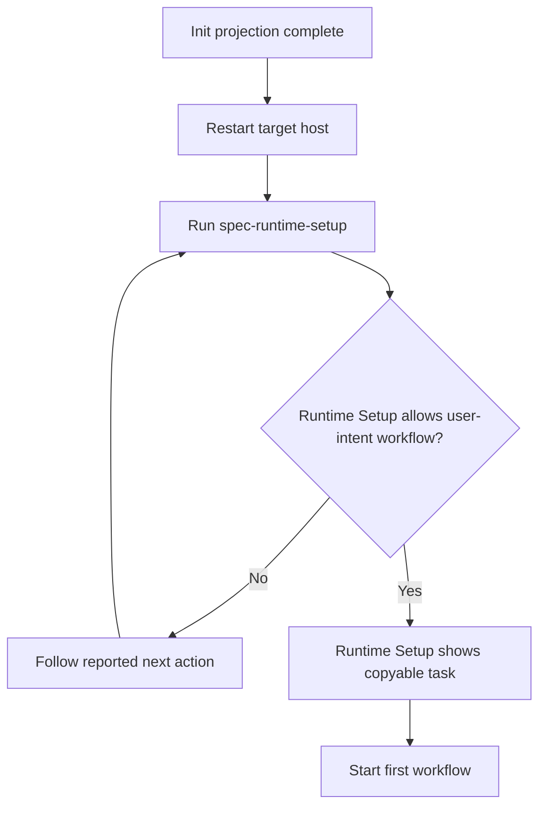

# Init Runtime Readiness Guidance - Plan

## Goal Capsule

- **Objective:** 让 `spec-first init` 的完成提示把用户明确带到运行时就绪，再进入首次工作流。
- **Product authority:** 当前用户确认的初始化后引导范围与 `spec-runtime-setup` 的公开 readiness 合同。
- **Open blockers:** 无；产品范围已确认，可进入实施规划。

---

## Product Contract

### Summary

`spec-first init` 完成后应明确区分“初始化完成”与“运行时已就绪”。
首次 onboarding 的默认路径是重开目标宿主并运行 `spec-runtime-setup`；Runtime Setup 验证通过后，由它提供一条可复制的自然语言任务示例。
这条默认路径不新增 workflow 硬门禁，也不取消 direct source evidence 足够时的既有降级能力。

### Problem Frame

当前初始化收尾同时展示重启宿主、workflow 菜单、Runtime Setup 和项目证据来源，用户难以识别唯一主行动。
“Setup complete”也容易让用户把 runtime projection 已生成误解为必需 MCP、helper 和 Provider 已验证就绪。
结果是用户可能在依赖未准备完成时进入工作流，或为了求稳重复运行与主门槛无关的检查。

### Key Decisions

- **运行时就绪优先。** 初始化完成后先引导 Runtime Setup，验证通过后才进入首次工作流。（session-settled: user-directed — chosen over fastest-first-workflow guidance: workflows should not start before required runtime readiness is verified）
- **复用 Runtime Setup 的完成门槛。** `spec-runtime-setup` 的最终验证是正常路径上的唯一 readiness 判据，不额外要求 `--verify-only` 或 `doctor`。（session-settled: user-directed — chosen over redundant follow-up verification: the canonical workflow already verifies its own completion state）
- **Runtime Setup 拥有首次任务交接。** readiness 通过后的自然语言任务示例由 Runtime Setup 完成输出提供，`init` 不提前展示，也不复制 readiness 判断。（session-settled: user-approved — chosen over init-owned deferred guidance: the example should appear only after canonical verification succeeds）
- **首次任务使用自然语言示例。** readiness 通过后提供一条可复制的任务请求，不要求用户先理解 workflow 分类。（session-settled: user-directed — chosen over a workflow menu: the first successful task should require no taxonomy knowledge）
- **必做是 onboarding 默认路径，不是执行硬门禁。** 完成提示把 Runtime Setup 标为首次使用前的必做动作，但不新增阻断普通 workflow 的 CLI gate；direct source evidence 足够时的既有降级路径保持可用。（session-settled: user-approved — chosen over a new universal hard gate: setup guidance must not contradict the existing direct-evidence fallback）
- **初始化成功不等于运行时就绪。** 收尾文案必须保留这两个状态的边界，不能用一个总括性的成功声明覆盖未验证的 runtime 状态。

### Requirements

**状态与主行动**

- R1. 初始化成功输出必须声明所选宿主的 runtime projection 已写入，同时明确宿主加载状态与 runtime readiness 尚未验证。
- R2. 输出必须把“重开目标宿主并运行 `spec-runtime-setup`”呈现为首次 onboarding 的唯一必做行动。
- R3. `init` 不得重算或复制 readiness；能否继续首次任务只消费 Runtime Setup 基于既有完整合同给出的最终 next step。
- R4. Runtime Setup 返回 action-required、degraded、failed 或其他未就绪状态时，完成输出必须要求用户处理其 next action 并重新运行，不得展示首次任务示例。
- R5. 完成提示可把 `spec-first doctor --<host>` 标为排障或审计 projection health 的可选命令，但不得把它描述成正常成功路径的第二道验证或 Runtime Setup 的替代品。
- R6. “必做”只约束默认首次 onboarding 引导，不新增 CLI、Skill 或 workflow 执行硬门禁。

**首次工作流**

- R7. Runtime Setup 验证通过后，其最终 next step 必须提供一条可直接复制并替换需求内容的自然语言任务示例。
- R8. 中文示例固定为 `请基于当前项目处理这个任务：<描述你的需求或问题>。`，英文提供等价模板。
- R9. 首次任务示例不得要求用户先选择或理解 `brainstorm`、`plan`、`work`、`review`、`debug` 等 workflow 分类。

**一致性与边界**

- R10. 中文与英文输出必须表达相同的状态、必做/可选标签、动作顺序和失败路径。
- R11. 单宿主与多宿主初始化必须使用相同的 readiness 语义；每个宿主只有在自身 Runtime Setup 验证通过后才可被描述为首次 onboarding ready。
- R12. 正常成功路径不得要求额外运行 `spec-runtime-setup --verify-only` 或 `spec-first doctor --<host>`。
- R13. `init` 的 next-steps 区块不得超过 6 行非空输出；Runtime Setup ready 状态的首次任务交接不得超过 3 行非空输出。

### Key Flows

- F1. 初始化后进入 Runtime Setup
  - **Trigger:** `spec-first init` 成功完成目标宿主的 runtime projection。
  - **Actors:** 用户、目标宿主、`spec-runtime-setup`。
  - **Steps:** 输出区分 projection 已写入与 readiness 待验证；用户重开目标宿主；用户运行 `spec-runtime-setup`。
  - **Outcome:** Runtime Setup 成为默认首次 onboarding 的唯一必做行动。
  - **Covered by:** R1-R3、R6、R10-R11。
- F2. Runtime Setup 未就绪
  - **Trigger:** Runtime Setup 返回需要处理、降级或失败状态。
  - **Steps:** 用户读取并执行 Runtime Setup 给出的 next action；随后重新运行 Runtime Setup。
  - **Outcome:** 默认 onboarding 保持在 readiness 修复闭环，不展示首次任务示例。
  - **Covered by:** R3-R4、R12。
- F3. Runtime Setup 已就绪
  - **Trigger:** Runtime Setup 根据自身完整合同给出可继续 user-intent workflow 的最终 next step。
  - **Steps:** Runtime Setup 输出展示一条可复制的自然语言任务示例；用户替换其中的需求内容并提交给宿主。
  - **Outcome:** 用户无需学习 workflow 菜单即可完成首次任务入口验证。
  - **Covered by:** R3、R7-R9、R13。

### Acceptance Examples

- AE1. **Covers R1-R3、R13.** Given `spec-first init` 成功，when CLI 打印不超过 6 行的 next-steps 区块，then 用户先看到 projection 已写入但宿主加载与 readiness 未验证，再看到重开宿主并运行 `spec-runtime-setup` 的唯一必做行动。
- AE2. **Covers R4.** Given Runtime Setup 报告 action-required 或 degraded，when 用户查看其最终输出，then 引导只要求处理 next action 并重新验证，不展示首次任务示例。
- AE3. **Covers R3、R7-R9、R13.** Given Runtime Setup 给出可继续 user-intent workflow 的最终 next step，when 用户到达完成状态，then 不超过 3 行的交接输出包含 `请基于当前项目处理这个任务：<描述你的需求或问题>。`，且不展示 workflow 菜单。
- AE4. **Covers R11.** Given 同时初始化两个宿主且仅一个宿主完成 Runtime Setup，when 用户准备开始任务，then 只有已验证宿主可被描述为首次 onboarding ready，另一个宿主仍需完成自己的 Runtime Setup。
- AE5. **Covers R10.** Given 相同的初始化与 Runtime Setup 状态，when 分别选择中文和英文，then 两种输出具有相同的状态、必做/可选标签、动作顺序与未就绪处理语义。
- AE6. **Covers R5、R12.** Given 正常 Runtime Setup 已就绪，when 用户阅读完成提示，then `doctor` 只作为排障/审计可选命令出现，且不要求额外运行 `--verify-only`。
- AE7. **Covers R6.** Given required Provider 暂未 ready 但目标 workflow 可依赖 direct source evidence 继续，when 用户显式进入该 workflow，then 系统不因本次 onboarding 文案新增硬阻断，也不把降级执行误报为 Runtime Setup complete。

### Success Criteria

- 首次用户可在一个区块内区分 projection 已写入、readiness 待验证、唯一必做行动和可选排障命令。
- 默认成功路径只执行一次 canonical Runtime Setup 验证，不叠加 `--verify-only` 或 `doctor`。
- Runtime Setup ready 输出提供可复制的自然语言任务模板，不要求用户理解 workflow taxonomy。
- 聚焦测试覆盖单宿主、多宿主、中文、英文、未就绪、ready 和 direct-evidence 降级边界。
- 真实六宿主旅程未执行时，只能声明 source/contract 输出通过验证，不得声称首次 onboarding field outcome 已确认。

### Scope Boundaries

- 不调整初始化前的宿主选择、workspace 选择、mutation preview 或确认交互。
- 允许调整 Runtime Setup 的最终 next-steps 文案及其聚焦测试，但不调整其安装、修复、验证逻辑或 machine-readable schema。
- 不调整 `quickstart`、README 或 `doctor` 的行为与输出。
- 不把 `doctor` 提升为正常首次使用路径中的强制步骤。
- 不新增阻断普通 workflow 的 CLI、Skill 或 runtime gate。
- 不在本需求中重新设计 workflow 分类或入口治理。

### Dependencies / Assumptions

- `spec-runtime-setup` 继续拥有 runtime readiness 的权威输出与 next action；本需求只消费该合同，不复制其判断逻辑。
- 用户必须先重开或新开目标宿主会话，才能使用刚生成的 Runtime Setup 入口。
- Runtime Setup 的完成判据继续覆盖完整 required scope，并区分必需依赖 readiness 与 generated runtime manifest freshness。
- direct source evidence 降级能力继续由 Runtime Setup 与下游 workflow 的既有合同拥有；本需求只定义默认 onboarding 的展示优先级。

### Sources / Research

- `src/cli/commands/init-output.js`：当前单宿主与多宿主初始化后引导及首次项目分支；观察版本 `a0946843717bd3424e311414103f7729b48b0ee8`。
- `src/cli/commands/init-args.js`：宿主显示名、workflow 入口标签和 Runtime Setup 入口映射；观察版本同上。
- `skills/spec-runtime-setup/SKILL.md`：三阶段 Runtime Setup、最终 status 与 next action 合同；观察版本同上。
- **Evidence limitation:** 当前 grounding 证明了 source 合同与调用关系，尚未执行真实六宿主终端旅程、任务模板可用性测试或 field outcome 验证。
- **Invalidation condition:** 若 Runtime Setup 的公开完成判据、next-step ownership、入口名称、direct-evidence fallback 或宿主加载方式改变，需重新审查 R2-R12 与全部 Acceptance Examples。

---

## Planning Contract

### Architecture Posture

- **Decision: extend existing owners.** 扩展 `src/cli/commands/init-output.js` 的初始化收尾 owner，以及 `skills/spec-runtime-setup/SKILL.md` 的 readiness 完成态 owner。
- **Do not create:** onboarding 状态机、共享 readiness helper、额外 schema、init-owned readiness probe，或阻断普通 workflow 的新 gate。
- **Reasoning:** `init` 只拥有 projection 写入事实，Runtime Setup 已拥有完整 readiness 判断；改动应收敛展示职责，而不是引入第三个状态 owner。
- **Source/runtime boundary:** 只修改 canonical source 与测试。`.claude/`、`.codex/`、`.agents/skills/`、`.cursor/`、`.kiro/`、`.qoder/`、`.opencode/` 属于 generated runtime，不手改；通过受控 init fixture 验证投影。
- **Script/LLM boundary:** CLI 确定性渲染 projection 状态、必做/可选动作和宿主入口；Runtime Setup agent 根据既有机器事实语义判断是否到达 ready 分支。测试只冻结文案合同与分支边界，不把语义 readiness 迁移到脚本。

### Key Technical Decisions

- KTD1. 用一个共享的 init next-step renderer 服务单宿主与多宿主，仅把宿主显示名和 Runtime Setup 入口作为输入；删除基于 `.spec-first/workflows` 的首次/非首次菜单分支。
- KTD2. init 输出保持最多 6 行非空文本：projection 已写入但加载/readiness 未验证、唯一必做动作、可选 `doctor` 命令；不得提前展示首次任务模板。
- KTD3. 多宿主输出必须逐宿主表达 Runtime Setup ownership，避免一次 setup 被误读为所有宿主 ready；若版面需要合并，仍须明确“在计划使用的每个宿主中”分别执行。
- KTD4. Runtime Setup 的 ready 分支在既有 `Next steps` 合同中展示固定自然语言模板；action-required、degraded、failed 等非 ready 分支只展示修复与重跑动作。
- KTD5. 文案合同测试读取 canonical source 或直接捕获 renderer 输出；不得依赖当前会话可能缓存的 generated Skill mirror。

### Assumptions

- A1. `hostMcpSetupCommand()` 继续返回所有支持宿主统一可识别的 `spec-runtime-setup` 入口；本次不改变宿主命令映射。
- A2. `doctor` 的 host flag 仍与 init platform id 一致，可生成 `spec-first doctor --<host>`；若多个宿主被选中，允许以逗号分隔的多条可选命令保持一行。
- A3. Runtime Setup 的 ready/未就绪区分继续由现有 Stage 3 与完整 setup completion 语义拥有，因此 prose 只约束最终分支输出，不新增 machine-readable 字段。
- A4. CLI/Skill 文案无网页交互，浏览器验证为 `not_applicable`；真实六宿主启动体验属于 field outcome，不以 fixture 绿灯代替。

### Change Surface

- `src/cli/commands/init-output.js`：统一单/多宿主 next-step renderer，移除 workflow history 分支与 taxonomy 菜单。
- `src/cli/commands/init-args.js`：仅在 renderer 需要导出或复用现有 host label/command helper 时做最小调整；不改变 public args。
- `skills/spec-runtime-setup/SKILL.md`：限定 ready 与非 ready 的最终交接文案。
- `tests/unit/init-runtime-readiness-guidance.test.js`：新增 init 输出聚焦合同。
- `tests/unit/runtime-setup-readiness-guidance.test.js`：冻结 Runtime Setup ready/unready 交接合同；既有 `mcp-setup-contracts` 作为回归面。
- `tests/integration/init-six-host-lifecycle.integration.test.js`：仅在现有 fixture 无法覆盖六宿主投影一致性时补充断言。
- `CHANGELOG.md`：把需求阶段记录升级为已实施行为与实际验证，不重复新增冲突条目。

### Risks And Controls

- **文案过长:** 单/多宿主及双语都由测试统计非空行，init ≤ 6、ready handoff ≤ 3。
- **状态越权:** init 测试断言不出现 `ready` 成功声称或首次任务模板；Skill 合同断言模板仅属于 ready 分支。
- **多宿主歧义:** 覆盖六宿主集合与双宿主示例，断言每个目标宿主需独立完成 Runtime Setup。
- **缓存误判:** Skill prose 验证直接读取 `skills/spec-runtime-setup/SKILL.md`；不以当前 `.agents/skills` mirror 为真相源。
- **generated runtime 漂移:** 不修改 checked-out runtime mirror；通过临时 fixture 执行 init 并比较投影内容。

## Implementation Units

### U1 — 收敛 init 完成态引导

- **Owner:** `src/cli/commands/init-output.js`
- **Depends on:** 无
- **Covers:** R1-R6、R9-R13；F1；AE1、AE4-AE7；KTD1-KTD3
- **Work:**
  - 将 `printInitNextSteps()` 与 `printInitNextStepsForPlatforms()` 收敛到同一渲染数据/函数路径。
  - 删除 `.spec-first/workflows` 探测和首次/非首次 workflow 菜单分支。
  - 中英文均输出：projection 已写入但宿主加载/readiness 未验证；重开/新开宿主并运行 `spec-runtime-setup` 为唯一必做；`doctor` 仅为可选 projection 排障/审计。
  - 多宿主明确 readiness 按宿主独立验证，不展示首次任务模板或 taxonomy。
- **Test scenarios:**
  - 单宿主中文与英文内容、标签、顺序和 ≤ 6 行约束。
  - 多宿主中文与英文内容、逐宿主语义和 ≤ 6 行约束。
  - 有/无 `.spec-first/workflows` 时输出相同。
  - 输出不包含 `prd/plan/work` 菜单、首次任务模板、强制 `--verify-only`，也不把 `doctor` 描述为 readiness gate。
- **Exit evidence:** 聚焦 Jest 测试通过，且直接捕获的四种输出满足行数和 forbidden-string 断言。

### U2 — 明确 Runtime Setup 的首次任务交接

- **Owner:** `skills/spec-runtime-setup/SKILL.md`
- **Depends on:** U1 的 ownership 文案已经确定
- **Covers:** R3-R4、R6-R13；F2-F3；AE2-AE3、AE5-AE7；KTD4-KTD5
- **Work:**
  - 在 Stage 3/Default Full Setup/Output Shape 的既有 next-step 合同中明确 ready 与非 ready 分支。
  - ready 分支最多 3 行并包含中文固定模板与英文等价模板。
  - action-required、degraded、failed 等分支只要求执行报告的 next action 后重跑，不得展示任务模板。
  - 保留 direct-evidence fallback，但不得将 degraded workflow 执行描述为完整 Runtime Setup ready。
- **Test scenarios:**
  - canonical Skill source 同时包含双语模板、ready-only ownership、非 ready 禁止模板及重跑语义。
  - 既有 direct-source fallback、完整 setup completion、generated-runtime freshness 合同仍存在。
  - ready handoff 明确 ≤ 3 行，且不新增 `doctor`/`--verify-only` 正常路径要求。
- **Exit evidence:** Runtime Setup 聚焦 contract tests 与既有 `mcp-setup-contracts` 通过。

### U3 — 固化跨 owner 行为合同

- **Owner:** `tests/unit/` 下 init 与 Runtime Setup 聚焦测试
- **Depends on:** U1、U2
- **Covers:** 全部 R/F/AE；KTD1-KTD5
- **Work:**
  - 为 init renderer 建立 console capture fixture，避免必须执行重型真实 init 才能验证文案。
  - 为 Skill source 建立结构化局部断言，冻结 ready-only 模板 ownership 和非 ready 分支，不冻结无关长篇 prose。
  - 在现有六宿主 lifecycle/projection fixture 中补最小断言，证明 canonical Skill 进入全部支持宿主且 init 输出映射覆盖全部 host id。
  - 在 LFG 唯一一次独立只读 code review 中注入当前磁盘的 canonical Skill source，按 fresh-source checklist 同时核验 ready/unready 行为语义；不依赖当前会话缓存的 typed Skill。
- **Test scenarios:** 六宿主、双语、单/多宿主、workflow history 有无、ready/unready、direct-evidence fallback。
- **Exit evidence:** 新增聚焦 suite、受影响既有 suite 和六宿主 integration fixture 全绿；独立 reviewer 返回 fresh-source 行为核验结论与限制。

### U4 — 文档、投影与发布面收尾

- **Owner:** `CHANGELOG.md`、验证命令与计划 lifecycle
- **Depends on:** U1-U3
- **Covers:** Success Criteria、Scope Boundaries、claim ceiling
- **Work:**
  - 更新已有 Changelog 条目为实际行为、source/runtime 边界及验证结果。
  - 运行 source 检查、六宿主临时投影、fresh-source 行为核验、类型检查和 package dry run；不写当前 checkout 的 generated runtime。
  - 将真实宿主重开、真人首次任务完成率明确保留为未执行 field outcome。
- **Exit evidence:** Verification Contract 全部 required gate 通过，计划 closeout 记录真实证据与限制。

## Verification Contract

| Gate | Command / Evidence | Covers | Required result |
| --- | --- | --- | --- |
| V1 聚焦 init 合同 | `npx jest tests/unit/init-runtime-readiness-guidance.test.js --runInBand` | U1、R1-R6、R9-R13 | 单/多宿主与双语全部通过，行数与 forbidden strings 被断言 |
| V2 Runtime Setup 合同 | `npx jest tests/unit/runtime-setup-readiness-guidance.test.js tests/unit/mcp-setup-contracts.test.js --runInBand` | U2、R3-R4、R6-R13 | ready/unready ownership、双语模板与 fallback 边界通过 |
| V3 init 回归 | `npx jest tests/unit/init-module-split.test.js tests/unit/init-workspace-contract.test.js tests/unit/init-apply-failure.test.js --runInBand` | U1、U3 | 调用边界与 workspace/init 既有行为无回归 |
| V4 六宿主投影 | `npx jest tests/integration/init-six-host-lifecycle.integration.test.js tests/integration/workspace-graph-six-host-projection.integration.test.js --runInBand` | U3、R10-R11 | Claude、Codex、Cursor、Kiro、Qoder、OpenCode fixture 一致 |
| V5 fresh-source 行为核验 | LFG 独立只读 code reviewer 读取当前 `skills/spec-runtime-setup/SKILL.md`，按 `docs/contracts/workflows/fresh-source-eval-checklist.md` 核验本计划 AE2/AE3/AE7 | U2-U3、R3-R9 | 未就绪不展示模板、ready 展示模板、direct-source fallback 不被误报为完整 ready；记录 reviewer 与 capability limitation |
| V6 静态与发布检查 | `npm run typecheck && npm run build` | U1-U4 | 语法与 package dry-run 通过 |
| V7 差异卫生 | `git diff --check`；审阅 `git status --short` 与 scoped diff | U4 | 无 whitespace error；无手改 generated runtime；无无关文件纳入 |
| V8 浏览器 | `not_applicable` | A4 | 仅 CLI/Skill 文案，无网页交互面 |

若 V1 的最终测试文件名因现有测试 owner 复用而变化，执行者可使用等价的精确 Jest 路径，但必须在 closeout 记录实际命令。全量 `npm test` 仅在聚焦与 integration 结果提示共享回归风险时追加；不得用已知无关基线失败覆盖本次聚焦结论。

## Definition of Done

- [ ] D1. init 成功输出清楚区分 projection 已写入与 runtime readiness 未验证，并把重开宿主 + `spec-runtime-setup` 标为唯一必做动作。
- [ ] D2. `doctor` 仅作为可选 projection 排障/审计；正常路径不要求 `--verify-only` 或第二次验证。
- [ ] D3. 单/多宿主、中/英文语义一致，init next steps 均不超过 6 行且不展示 workflow taxonomy。
- [ ] D4. Runtime Setup 只在完整 ready 分支展示双语首次任务模板，交接不超过 3 行；所有非 ready 分支只展示修复与重跑。
- [ ] D5. direct-source fallback 继续可用，不新增 CLI/Skill/workflow 硬 gate，也不把 degraded 误报为 setup complete。
- [ ] D6. canonical source、聚焦测试、六宿主临时投影、typecheck、build 与 diff hygiene 按 Verification Contract 通过。
- [ ] D7. `CHANGELOG.md` 记录用户可见行为、source/runtime 边界和实际验证；当前 checkout 的 generated runtime mirror 未被手改。
- [ ] D8. 独立代码审查无未解决 P0/P1；合格修复已回归验证。真实宿主重开与首次任务 field outcome 未执行时被明确标注为 limitation。

## Delivery Strategy

- 以一个 Conventional Commit 交付，建议主题：`feat(init): clarify runtime readiness next steps`。
- 仅在最终 verification、独立 review、fingerprint 和 dirty-scope gate 通过后 push 并创建 PR。
- PR 说明需列出 init CLI、Runtime Setup Skill、测试与 Changelog 变更，明确 generated runtime 仅在临时 fixture 验证、未手改当前 checkout。
- `tracker_deferral_authorization` 缺失；若出现非阻断 residual，只在 PR/计划 closeout 中记录，不创建外部 ticket。
