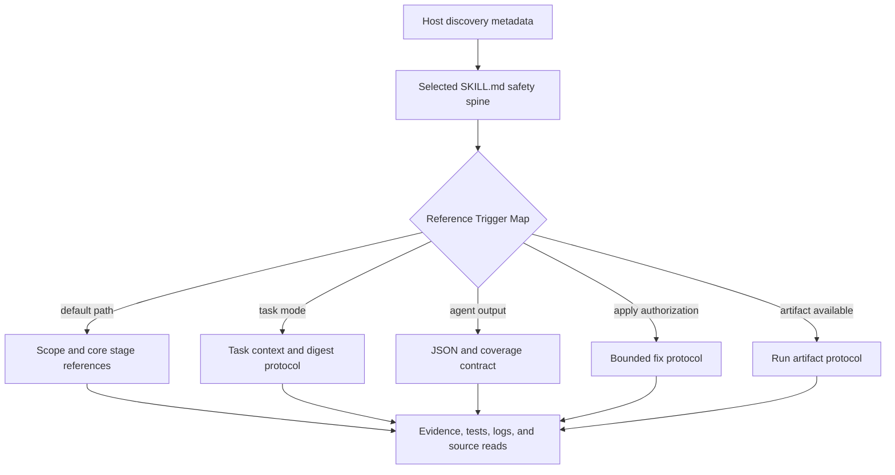

# Skill runtime context pilot - Plan

## Goal Capsule

| 维度 | 决策 |
| --- | --- |
| 目标 | 降低 Skill 被选中后进入运行上下文的内容量，同时不削弱路由、授权、证据、输出、投影和回滚行为。 |
| 推荐方案 | 执行既有渐进披露计划的窄切片：冻结当前 source 基线和不可变 measurement/promotion contract，确认投资门后再把 `spec-code-review` 与 `spec-plan` 重构为带显式 reference 触发条件的安全 front controller，并用 contract tests、隔离 holdout 与 fresh-source 行为评估守门。 |
| 决策焦点 | 哪些文本必须在副作用或完成声明之前留在入口 spine，哪些条件协议可以物理移动到后续 reference 读取。 |
| 验证焦点 | 入口与第一阶段必读上下文下降；受保护行为仍可达；聚焦测试与六宿主投影通过；fresh-source 评估无 P0/P1 回归。 |
| 主要用户价值 | 验证两个优先候选 workflow 是否能在不削弱 hard gate 的前提下降低活跃运行上下文；未达到最小收益时及时停止。 |
| 最大风险 | 承重规则移出入口后，模型在 mutation、完成声明或输出 contract 之前没有读取对应 reference。 |
| 架构姿态 | 扩展现有 Skill package、reference、lint、test、eval 和 runtime projection owner；不新增 universal Skill manifest 或第二套 context router。 |
| Source 边界 | 修改 `skills/`、`scripts/`、`tests/`、`docs/` 和 `CHANGELOG.md`；generated host mirror 只作为验证与交付面。 |
| 推广规则 | 每个 pilot 独立重构、独立评估、独立回退；没有受保护行为证据和明确 claim ceiling 时不得推广模式。 |
| 停止条件 | 出现任一 P0/P1 行为回归、受保护路径未读必需 reference、投影断裂、评估能力缺失，或预算机制开始拥有语义裁决权。 |

---

## Product Contract

### Summary

用户已把优化目标锁定为运行时上下文 token。因此本计划不用 Skill 数量、仓库大小、包体积或删除行数衡量成功，而是目标那些在特定阶段之前可以物理不进入上下文窗口的内容。

当前 skills governance 与 runtime catalog 共同治理 36 个 canonical bundled Skill packages。`skills/autoresearch` 是指向 generated `.agents/skills/autoresearch` 的本地符号链接，不属于 source inventory，也不得被 reporter 跟随或计入 budget。当前确定性 footprint 为：

| 指标 | 当前值 |
| --- | ---: |
| 36 个 canonical `SKILL.md` bytes | 1,037,026 |
| 36 个 canonical `SKILL.md` LF-terminated lines | 9,855 |
| 36 个 canonical packages 的 reference 文件 / bytes | 244 / 2,016,077 |
| 36 个 canonical packages 的 eval 文件 / bytes | 92 / 549,127 |

五个最大入口为（`spec-ideate` 56,351 与 `spec-runtime-setup` 55,233 分列第 6、7 位，`spec-optimize` 51,070 为第 8 位）：

| Skill | 入口 bytes / lines | References | Evals |
| --- | ---: | ---: | ---: |
| `spec-code-review` | 123,834 / 1,035 | 26 files / 187,809 bytes | 21 files / 28,932 bytes |
| `spec-plan` | 115,997 / 864 | 29 files / 323,356 bytes | 31 files / 98,726 bytes |
| `spec-compound` | 74,193 / 773 | 11 files / 65,656 bytes | 1 file / 3,915 bytes |
| `spec-prd` | 65,669 / 340 | 9 files / 167,978 bytes | 11 files / 270,196 bytes |
| `spec-compound-refresh` | 58,862 / 708 | 4 files / 33,609 bytes | 无 |

这些是 source footprint facts，不是 confirmed tokenizer 或 live-host usage。它们只足以把 `spec-code-review` 与 `spec-plan` 选为待确认候选：U1 仍须用预注册的场景边界、可迁出上下文下限、受保护行为覆盖和治理成本门槛证伪或确认每个候选。候选未过门时，本切片记录 `no-change-after-audit` 并停止该 pilot，不为凑足两个 pilot 临时替换目标。

### Problem Frame

昂贵层级不只是公共 Skill catalog。一个被选中的 Skill 至少可能付出：

1. 宿主用于 discovery 的 frontmatter description；
2. 激活后完整读取的 `SKILL.md` body；
3. body 要求在某个阶段前读取的 references；
4. 执行中由 tools 载入的任务证据。

前两项在选择后接近固定成本；第三项应由显式触发条件治理；第四项已由 source reads、tests、logs 和 bounded context helper 拥有。

单纯压缩不能解决问题。只要文本仍在入口，即使当前分支是冷路径，它仍占据上下文。可靠机制是物理分层：`SKILL.md` 保留最小安全 spine，为每个 reference 写明触发条件，并要求在需要该内容的动作之前读取。

本计划是 `docs/plans/2026-07-30-002-refactor-skill-system-progressive-disclosure-plan.md` 的聚焦执行切片。它继承该计划的非补偿式质量门禁，但不尝试迁移全部 Skills、统一全部 prompts，或从单个 pilot 推广全局 authoring pattern。

### Requirements

#### 度量与 claim 边界

- R1. 实现必须在 candidate 变更前冻结 baseline，绑定 source identity，并记录 canonical inventory membership、两个 pilot 的 entry bytes、frontmatter/description bytes、reference bytes、冻结场景边界下的第一阶段声明必读 references、既有 tests 与既有 evals。Canonical membership 来自当前 skills governance / bundled manifest；不得跟随 generated runtime 符号链接。
- R2. 确定性报告只能暴露 bytes、lines、文件数、hash 和 reference trigger facts，不得把这些值转换成 confirmed tokens、语义质量或用户性能结论。
- R3. 只有针对明确 host、model、配置和调用路径记录了 tokenizer 或 host usage 证据，才可声称实际 token 改善；否则 closeout 必须使用 `runtime_cost=proxy`。

#### Pilot 选择与结构

- R4. 第一批待确认 pilot 是 `spec-code-review` 与 `spec-plan`：前者固定入口最大，后者入口加普通路径必读 reference 的组合成本最高。U1 必须在任何 candidate 重写前，按预注册的代表场景、阶段 cutoff、最小可迁出 context、受保护行为覆盖和预期 Governance TCO 分别确认投资门；未达门槛的候选以 `no-change-after-audit` 结束，不进入 U2-U5，也不在本切片替换为第三个 Skill。
- R5. 每个 pilot 入口必须保留 route boundary、workflow contract、可能先于副作用发生的 argument/state boundary、hard exits、phase spine、reference trigger map、保守 fallback、输出 contract 和完成/停止条件。
- R6. 条件协议、schema、presentation template、task-mode 细节、persona dispatch 细节、artifact 细节和长示例必须移动到可达的 package-local references，并写明阶段与触发条件。每个触发条件必须仅凭入口 spine 携带的事实（调用 token、显式参数、输入 artifact metadata、host 可见状态）即可判定；触发信号清单留在入口 spine 或在入口保留完整判定副本，reference 只承载触发后的协议细节。不得出现需要先读取目标 reference 才能判定是否需要读取该 reference 的循环依赖。
- R7. 只有重复、过期、目标模型已可靠内化的通用知识，或已由既有 contract/script/schema 唯一拥有的内容才可删除；删除决策必须记录在 Protected Behavior Map 中，不得由关键词脚本推断。

#### 安全与行为质量

- R8. 两个 pilot 中每个被移动或删除的段落必须分类为 `contract/gate`、`behavioral anchor`、`conditional knowledge/procedure`、`deterministic handoff` 或 `delete`，并记录 source 位置、目标位置、触发条件、fallback 和 test/eval 覆盖。
- R9. Hard exits 必须在它们治理的动作之前可见。特别是 report-only 默认值、dispatch authorization、mutation authority（含 commit authorization 与 landing/push/PR/ticket 禁令——review、local mutation、commit、landing 是独立授权面）、task digest drift、scope expansion、source/runtime ownership、verification claims、handoff 和 knowledge promotion，不能只依赖越界之后才读取的 cold reference。两个 pilot 的入口 spine 保留清单必须逐项覆盖本条全部 hard exit 类别；不适用者须在 Protected Behavior Map 中显式标注 N/A 及理由。
- R10. 每个 pilot 在修改 source 前必须有 Protected Behavior Map。该 map 必须把每个受保护行为连接到旧位置、新位置、触发条件、fallback、deterministic test 和 semantic eval case。
- R11. Fresh-source evaluation 必须从磁盘或已记录 source revision 物化隔离 Skill package，让新的 evaluator context 按需读取 target source；不得调用当前会话缓存的 Skill，也不得把完整 package/references 预注入 prompt 后再声称实现了按需加载。
- R12. 评估必须在相同任务输入、source evidence、可观测 model/configuration、授权姿态和 rubric 下比较 baseline 与 candidate。已暴露 cases 只用于 development；promotion 使用未参与 candidate 调优的 holdout，并在运行前冻结重复次数、交叉或随机顺序、最坏分层和不确定性报告。用于 promotion 的 no-Skill counterfactual 必须排除目标 Skill description、body、references、generated projection 和 surrogate summary；若 treatment 改变 gate、roster、invocation enforcement 或 model routing，再升级为 sealed promotion set。
- R13. 质量回归不可补偿：上下文节省不能抵消 P0/P1 行为回归、未授权 mutation、虚假完成或验证声明、破坏 artifact contract，或遗漏 hard exit。

#### 治理、投影与推广

- R14. Context budgets 与 inventory 必须扩展现有 Skill entrypoint lint/governance owner，不得建立平行 manifest truth。
- R15. Source-only eval fixtures 必须继续排除在每个 generated host projection 之外；runtime references 必须投射到当前 adapter registry 返回的每个 host。
- R16. Generated runtime mirror 只能在 source tests 通过后通过既有 init flow 从 source 刷新；不得手改 mirror 作为 durable fix。
- R17. 每个 pilot 必须可独立回退。一个 pilot 失败不得阻塞或回退另一个 pilot，除非共享 governance/file owner。共享测试文件中的 pilot 断言必须按 pilot 隔离组织（per-pilot describe 块或独立文件），回退一个 pilot 时同步移除其对应断言，不得牵动另一 pilot 的断言。
- R18. 用户可见行为或治理变化必须记录到 `CHANGELOG.md`；docs 必须区分结构上下文节省、observed runtime 节省和行为质量证据。
- R19. U1 必须在其执行期间（任何 candidate 重写工作开始前，而不是见到 candidate 部分结果后）冻结逐 pilot promotion decision table：primary metric、最小有意义 delta、回归容忍区间、dataset split、重复策略、必要 evidence axes、允许 claim 和 follow-up 条件。decision table 中必须分开记录两个数值：默认收益目标（target）与最小有意义 delta（floor，必须低于 target，未达标触发 `no-change-after-audit`）。promotion primary metric 必须是可 observed 的指标（tokenizer 或 live-host usage）；冻结场景下的 first-stage declared context bytes 只是 source-structure 实现门槛 metric，不得充当 promotion primary metric。未授权 usage observation 时 `promote` 不可达，pilot 结果上限为 `source-structure-experiment`。U5 的 `passed` 只表示对应 behavior eval 通过，不等于 pilot promotion；`runtime_cost=proxy`、`not_run`、`concerns`、`revise`、`no-change-after-audit` 或单模型结果不得触发跨 Skill 默认模式推广。

### Scope Boundaries

#### In scope

- 当前 source inventory 与 context budget reporting。
- 每个通过 U1 投资门的 pilot 的 Protected Behavior Map 与 paired evaluation fixtures；未过门候选保留 `no-change-after-audit` 证据。
- `spec-code-review` 入口重构与 package-local reference 组织。
- `spec-plan` 入口重构与 synthesis / plan section 协议的 core/detail 拆分。
- 聚焦 deterministic tests、fresh-source eval 和 supported-host projection checks。
- 文档、changelog 与显式 runtime-refresh impact。

#### Non-goals

- 不删除或合并公共 Skill 入口。
- 不在本切片迁移全部 36 个 bundled Skills。
- 在两个 pilot 通过门槛前，不优化 `spec-optimize`、`spec-compound`、`spec-compound-refresh` 或 `spec-prd`。
- 不新增 universal Skill manifest、lifecycle schema、central context router、embedding router 或动态 system-prompt builder。
- 不在本切片把 references 移到跨 Skill 共享目录。
- 没有 tokenizer 或 live-host usage 证据时，不声称实际 token 降低。
- 不让脚本裁决语义充分性、路由质量或 prose 是否可删除。

#### Deferred to follow-up work

- 将已验证模式应用到 `spec-optimize`、`spec-compound`、`spec-compound-refresh` 和 `spec-prd`。`spec-prd` 是第 4 大入口（65,669 bytes）但 eval 体量最大（11 files / 270,196 bytes），候选重写与 holdout 评估成本最高，在两个 pilot 验证模式前暂缓。
- 去重跨 Skill 的 rendering 与 researcher prompt assets。
- 优化全部 Skills 的 Activation-L1 descriptions。
- 将 authoring pattern 推广到 `spec-write-skill` 或 durable workflow governance。

### Acceptance Examples

- AE1. Given 一个无 task context、无 apply authorization 的普通默认 `spec-code-review` 调用，candidate 加载 review spine 和 scope / reviewer selection 所需 references，保持 report-only，不加载 task-mode、apply 或 artifact-only protocol。
- AE2. Given `mode:agent` 且 task context 的 task-pack digest 与观测 digest 不同，candidate 在 reviewer dispatch 前失败，并以既有语义返回明确 reason。
- AE3. Given 一个没有 commit authorization 的显式 review-and-fix 请求，candidate 只可应用有界 review-owned fixes，不得 commit 或 push，并保留 verification evidence 限制。
- AE4. Given 一个直接 deep `spec-plan` 请求，candidate 加载生成 implementation-ready unified plan 所需的 compact scoping 与 section contracts，但不在 HTML、high-risk、interface、frontend 或 resume 触发前加载对应细节。
- AE5. Given 一个 requirements-only plan artifact，candidate 在 enrichment 中逐字节保留 Product Contract，且产品 blocker 未解决时不提升为 implementation-ready。
- AE6. Given 长会话上下文丢失后的重入，candidate 仍能从入口 spine 或显式必需 reference 恢复 report-only、dispatch、verification、doc-review 和 handoff 边界。
- AE7. Given candidate 修改了 Reference Trigger Map，measurement profile 的代表场景、阶段 cutoff、受保护 obligation 和 primary metric 保持冻结；candidate 只能改变该固定边界下的声明/实际读取集合，不能重定义边界来制造收益。candidate 声明的 first-stage 集合缺失任一 obligation 映射 path 时，reporter 输出 `obligation_relocated` drift fact 并阻断 silent pass。
- AE8. Given 两个 pilot 仅有 source bytes proxy 改善、且独立 fresh-source evaluation 实际运行并通过（`fresh_source_eval=passed`，或带明确限定的 `concerns`；为 `not_run` 时正向 outcome 上限为带 limitation 的 `revise`），closeout 可以保留可逆 source-structure experiment，但不得把 U5 `passed` 写成 `promote`、启用跨 Skill 默认规则或创建默认迁移 wave。

---

## Planning Contract

### Key Technical Decisions

- KTD1. 优化被选中后的运行上下文，而不是 Skill 数量。(session-settled: user-directed — chosen over maintenance cost, routing burden, and package size: 用户明确选择运行时上下文 token 作为主要成本。) 维护成本下降可以作为副作用，但不得为了看起来更轻而合并或退役入口。
- KTD2. 待确认 pilot 选择 `spec-code-review` 与 `spec-plan`：前者是最大固定入口，后者入口加普通路径必读 reference 的组合成本最高。此前对话基于单文件长度曾倾向 `spec-optimize`（当前实测为第 8 大入口，51,070 bytes）；直接指标和 `docs/validation/2026-07-29-spec-skill-footprint-analysis.md` 显示 `spec-plan` 的普通路径 reference 负担与既有 eval 覆盖更适合第一批，因此替换。该选择仍须在 U1 投资门下可证伪；未过门时停止而不替补。
- KTD3. 使用 front controller，而不是 universal schema。`SKILL.md` 拥有 route 与安全 spine；package-local references 拥有条件流程。既有 lint/config 与 tests 仍是 deterministic owner。
- KTD4. Hard gates 留在入口 spine。必须在 mutation、dispatch、verification、handoff 或 promotion 之前知道的规则，不能移动到越界后才首次读取的 reference。
- KTD5. 先语义蒸馏，再拆分。重复和通用文本先删除或合并；只有真正条件化的知识才成为新 reference。把无价值内容拆到另一个文件是伪优化。
- KTD6. 用确定性 bytes 与冻结场景/cutoff 下的 first-stage declared context 作为 source-structure 实现门槛 metric，避免 tokenizer 依赖并保持 claim 诚实；source trigger map 是被测对象，不能反向改写 measurement profile。该实现门槛 metric 与 promotion primary metric 是两个不同的量：后者必须是可 observed 的 tokenizer/live-host usage 指标，在 R19 的 decision table 中单独冻结；未授权 usage observation 时 `promote` 不可达。Fresh-source trace 另记录实际读取；若可取得 live usage，则单独记录为 observed token evidence。
- KTD7. 复用父计划的证据纪律。父渐进披露计划在重新回源前是 advisory，但它的 development/holdout 隔离、非补偿式 promotion gates、representative live-host A/B、retention、correction burden/Governance TCO、strict no-Skill 和 cross-model claim ceiling 对本切片有约束力；缺证据时降级 outcome，不用 U5 eval status 代替 promotion。
- KTD8. Ownership 保持 package-local。跨 Skill 共享会改变 ownership、invalidation、projection 和 drift 边界，超出本目标。
- KTD9. 按 pilot slice 回退。共享 governance 变更与每个 Skill 重写分开落地，避免单个 Skill candidate 失败触发全局回退。

### High-Level Technical Design

目标形态分为四层：

Context class 如下：

| Class | Owner | 示例 | 加载规则 |
| --- | --- | --- | --- |
| Route metadata | frontmatter description | workflow trigger 与 exclusions | 由宿主 discovery 语义决定；不得隐藏会改变路由的边界 |
| Safety spine | `SKILL.md` | hard exits、argument conflicts、phase map | 随被选中的 Skill 加载 |
| Core stage protocol | package-local reference | scoping synthesis 或 plan section core | 只在需要它的阶段读取 |
| Conditional protocol | package-local reference | task mode、apply fixes、HTML output | 只在显式触发条件存在时读取 |
| Deterministic facts | scripts/tests/lint | bytes、paths、schema validity、projection | scripts 报告事实；LLM/human 判断语义 |
| Behavioral evidence | evals 与 validation docs | paired cases 与 limitations | 默认 source-only，除非明确投射 |

对 `spec-code-review`，入口成为 review front controller；scope resolution、task attribution、agent output、run artifacts 与详细 quality gates 移到显式阶段 references。既有 persona、finding schema、apply 和 output references 继续作为权威 owner。

对 `spec-plan`，synthesis 与 section contracts 拆成 core 和条件 detail。core 承载普通 Markdown plan 所需的最小 synthesis 与 implementation-ready section contract；deepening、high-risk、interface、frontend、HTML、resume 和稀有格式分支只在触发后加载。入口保留 planning-only safety、artifact readiness、dispatch、doc-review 与 handoff 边界。

### Existing Capability / Composition / Source Ownership

| 已检查能力 | 当前 owner | 决策 |
| --- | --- | --- |
| Skill source package | `skills/<skill>/SKILL.md` 与 package-local references | Extend |
| Entry lint 与未来 budget facts | `scripts/lint-skill-entrypoints.js` 及其 config（当前为行级 pattern linter，无 frontmatter 解析 / inventory / budget 机制，且无专属 unit test） | Extend（inventory/report/budget 为净新增子系统；先补既有 lint 回归测试） |
| Runtime projection、eval exclusion 与 path rewriting | `src/cli/plugin-sync.js`、`src/cli/skill-path-rewrite-markers.js`、`src/cli/adapters/**` | Reuse and verify |
| 行为 contracts | pilot contract tests 与 source-only evals | Extend |
| 渐进披露政策 | 父计划与 validation docs | Reuse as governing evidence |
| Context bundles | `src/cli/helpers/context-bundle.js` contract family | 仅复用于 bounded evidence delivery |
| Generated host mirrors | `.claude/`、`.codex/`、`.agents/skills/` 等受管 roots | 仅验证；从 source 重建 |

架构姿态是 `reuse + extend`。本计划不新增第二 truth source；新增 durable surface 只包括 package-local references、source-only eval fixtures、三份分工明确的 validation artifacts（baseline、eval、results）和窄 reporter/test 扩展。

### Evidence & Limitations

- 直接 source facts 在 revision `2776a36d93d97c9b05b54fca8cbcc2e2cfec4c88` 测得；测量时 Skill 与实现 source surface 干净。本计划与对应 `CHANGELOG.md` 条目是该 revision 之后的 docs-only 变更，不改变上述 Skill footprint。
- `docs/validation/2026-07-29-spec-skill-footprint-analysis.md` 已有一个月历史并绑定另一个 source revision。它的排名用于校准 pilot 选择，但本计划的当前 byte counts 与当前 tests 优先于其精确数字。
- `docs/validation/2026-07-29-spec-skill-progressive-loading-design.md` 是 advisory，且包含估算 token；这些估算不作为 confirmed evidence 延续。
- 初始 planning run 未请求或授权 worker dispatch。Research 从当前 source、tests、contracts 和 repository learnings inline 完成；后续多 agent 文档审查只产生 report-only findings，未作为行为评估证据。
- 2026-08-27 已执行多 agent 文档审查：四个独立 fresh-source report-only reviewer（架构治理、可执行性与仓库事实、证据纪律、受保护行为与风险）并行审查本 plan。footprint 数字 9 项复核 8 项一致；唯一不一致的「五个最大入口」排名（`spec-prd` 被遗漏）已在本修订更正，其余 findings 以 P1/P2 分级回写为 R6、R9、R17、R19、KTD2、KTD6、AE7、AE8 与 U1-U7 的对应修订。该审查为 advisory，不构成行为评估证据。
- 本 planning turn 未运行行为评估；实现单元拥有该证据。

### Assumptions

- 当前仓库仍是 target repo，两个 pilot 仍是 bundled Skill set 的一部分。
- Host adapters 继续复制 package-local references 并通过既有 projection flow 重写路径。
- Source-only evals 在当前 asset planning rules 下继续排除于 runtime projections。
- 若这些假设在实现中失效，受影响 pilot 必须在 source 重写或 promotion 前停止。

---

## Implementation Units

### U1. Freeze baseline and add context facts

**Goal:** 在不改变 Skill 行为的情况下建立确定性 before/after facts。

**Requirements:** R1、R2、R3、R4、R14、R19。

**Dependencies:** 无。

**Files**

- `scripts/lint-skill-entrypoints.js`
- `scripts/lint-skill-entrypoints.config.json`
- `tests/unit/skill-entrypoint-lint-regression.test.js`
- `tests/unit/skill-entrypoint-context-inventory.test.js`
- `docs/validation/2026-08-27-skill-runtime-context-pilot-baseline.md`
- `CHANGELOG.md`

**Approach**

当前 `scripts/lint-skill-entrypoints.js` 是行级 pattern linter，仓库中不存在其专属 unit test；本单元的 frontmatter 解析、inventory/report 与 budget 能力是净新增子系统而非增量扩展。因此第一个子任务是为既有 lint 行为补聚焦回归测试（pattern 命中、config 字段读取、symlink 不跟随——现有 `walk()` 用 `withFileTypes` 判断，symlink 天然不被跟随），锁定现状后再扩展 inventory/report mode。新增 mode 必须解析 frontmatter，不把 body prose 误认成 description；遍历每个 Skill package；分类 referenced files；报告：

- 由 current skills governance / bundled manifest 枚举的 canonical membership，以及不计入 budget 的 unmanaged/symlink advisory paths；
- entry bytes 与 lines；
- frontmatter 与 description bytes；
- reference 文件数 / bytes；
- eval 文件数 / bytes；
- 两个 pilot 既有 test 文件与 test case inventory；
- 入口声明的 references；
- 已声明 pilot 路径的第一阶段必读 references；
- 两个 pilot package 的 source hashes，以及完整 baseline git revision/tag 与逐 pilot 恢复命令。

第一阶段 measurement profile 在 candidate 重写前冻结，独立于被测 `SKILL.md` 的 Reference Trigger Map。每个 profile 记录 experiment id、pilot path、代表场景、语义 stage cutoff、cutoff 前必须满足的 protected obligations、primary metric、最小有意义 delta、回归容忍区间和 profile revision。profile 同时冻结 obligation→first-stage reference path 的机器可读映射：每个 protected obligation 必须映射到 baseline 声明的 first-stage 集合中的具体 source path。Baseline 与 candidate 分别声明在该固定 cutoff 前所需的 reference set；reporter 验证 path/hash/集合与 source trigger 声明的一致性，并对 candidate 声明的 first-stage 集合做 obligation 覆盖检查——任一 obligation 映射 path 不在 candidate first-stage 集合中时，输出 `obligation_relocated` drift fact 并阻断 silent pass，交由语义审查裁决该迁移是否合法。reporter 不根据关键词裁决语义充分性，也不允许 candidate trigger map 反向改写 profile 或 obligation 映射。

U1 在任何 Skill 重写前为两个候选执行投资门：确认固定场景下存在足够可迁出的 cold context、受保护行为可以被 tests/evals 覆盖，且预期 reference/tool/correction/Governance TCO 不吞掉收益。未过门的候选记录 `no-change-after-audit` 并停止；通过的候选才进入 U2。此处同时冻结逐 pilot promotion decision table（含分开记录的默认收益目标与最小有意义 delta；promotion primary metric 必须为 observed 指标，见 R19），后续 candidate 结果不得修改阈值、dataset split 或允许 claim。

Baseline 捕获后再加入预算配置。第一版预算应阻止明显入口回涨，而不是强制语义行数目标。预算 override 必须写明 reason 和 owner。

**Test scenarios**

- multiline frontmatter fixture 能把 description bytes 与 body bytes 分开报告。
- 缺失 referenced file 报错，或输出明确 unavailable fact。
- Source-only eval files 被 inventory，但不被视为 runtime-required references。
- Generated runtime symlink 不被递归跟随；unmanaged local path 只进入 advisory 列表。
- 既有 tests 与 evals 均绑定 baseline source identity，case 删除或漏列会令 focused test 失败。
- Reporter 不能输出 confirmed token counts、语义质量或 promotion status。
- 临时入口增长超过配置预算时 deterministic validation 失败。
- Measurement-only context profile 引用不存在的 reference，或与入口 Reference Trigger Map 不一致时，inventory contract test 失败。
- Candidate 修改 Reference Trigger Map 时，固定场景、stage cutoff、obligations、primary metric 和阈值不变。
- Candidate 声明的 first-stage 集合缺少任一 obligation 映射 path 时，reporter 输出 `obligation_relocated` drift fact，该结果不得作为 silent pass。
- 既有 lint pattern/config/symlink 行为有回归测试锁定；扩展后旧行为不改变。
- 若确需修改 measurement boundary，必须创建新 experiment/profile revision 并重新冻结 baseline；旧结果不能与新 profile 比较或支持当前 promotion。

**Verification**

- Inventory 输出可从相同 source tree 复现。
- Baseline document 记录 source identity（baseline git revision/tag、逐 pilot package hash 与恢复命令）、canonical membership、当前指标、既有 test/eval inventory、逐 pilot 投资门、冻结的 measurement/promotion table（含 obligation 映射与分开的 target/minimum delta）和 unknown limitations。
- 既有 lint 行为先有聚焦回归测试覆盖（本单元新增），扩展后全部通过。

### U2. Build Protected Behavior Maps and paired fixtures

**Goal:** 在重写任一入口前定义必须存活的行为 contract。

**Requirements:** R8、R9、R10、R11、R12、R13。

**Dependencies:** U1；只为通过投资门的 active candidates 执行。

**Files**

- `skills/spec-code-review/evals/eval.yaml`
- `skills/spec-code-review/evals/eval-context-development.yaml`
- `skills/spec-code-review/evals/eval-context-holdout.yaml`
- `skills/spec-code-review/evals/cases/context-*.yaml`
- `skills/spec-plan/evals/eval.yaml`
- `skills/spec-plan/evals/eval-context-development.yaml`
- `skills/spec-plan/evals/eval-context-holdout.yaml`
- `skills/spec-plan/evals/cases/context-*.yaml`
- `tests/unit/spec-code-review-contracts.test.js`
- `tests/unit/spec-plan-contracts.test.js`
- `tests/unit/skill-runtime-context-eval-contracts.test.js`
- `docs/contracts/workflows/fresh-source-eval-checklist.md`
- `docs/validation/2026-08-27-skill-runtime-context-pilot-eval.md`

**Approach**

复用两个 pilot 既有 `skill-up` local-path eval owner，新增 development 与 holdout manifests/cases，并在 validation document 中记录紧凑 map。对每个实际移动或删除的段落记录原始位置、目标 class、目标位置或删除理由、必需触发条件、fallback、deterministic test 和 semantic case；U3/U4 完成后用最终 diff 逐 hunk 回查 map，不得只覆盖 hard exits 或输出 contracts。

Candidate 重写前只冻结 baseline source identity、共同 case/rubric bundle hash、development/holdout split、重复次数和执行顺序规则。U3/U4 各自完成且 source 稳定后，再冻结对应 candidate package identity；进入 U5 前校验 baseline/candidate identities 不同，而共同 case/rubric bundle hash 相同。

Fixture corpus 必须覆盖 default、task-mode、agent-mode、apply-authorized、artifact-available、deep-plan、requirements-only enrichment、high-risk、HTML 和长会话重入路径，也要覆盖可能改变路由的 near-neighbor non-trigger cases；non-trigger case 必须显式断言触发判定不经过目标 reference 内容（R6）。「暴露」采用操作定义：某 holdout case 的输入、期望输出或失败模式在 candidate 设计、修订、阈值解读或 rubric 调整中被引用，即视为暴露；实施者必须在 eval validation artifact 中逐 case 声明暴露状态并留痕。已暴露或失败的 holdout case 立即转为 development；promotion 需要新来源或轮换 holdout，轮换 case 必须来自新场景来源，不得是已暴露 case 的变体改写。holdout fixtures 与 development 同 package 存放、对实施者机械可见（U2/U5 还要求对 holdout manifest 运行 validate/list-cases），盲性是显式声明未强制的响亮约定：本切片无盲化或第三方持有机制，引入盲化机制列入 follow-up。若 candidate 实际改变 gate、roster、invocation enforcement 或 model routing，则 winner/threshold 冻结后使用一次 sealed promotion set。

两个 manifest family 都要通过 `skill-up validate` 与 `skill-up list-cases`。Skill-local contract test 校验 manifest/case source refs 存在、case id 唯一、dataset split 不重叠、schema 可解析、不含 credential/private-hostname/raw external output，并保持 source-only 排除约束。Exact case paths、split 与共同 bundle hash 在 candidate 重写前冻结到 eval validation artifact。

**Test scenarios**

- 每个受保护行为至少有一个 deterministic 或 semantic case。
- 每个实际移动或删除的段落都进入 Protected Behavior Map；最终 diff 不得出现未归类 hunk。
- 每个语义 case 写明输入、期望动作、禁止动作、必需 reference 和降级 claim。
- 受保护路径声明的每个 reference 存在。
- Source-only eval fixtures 不出现在任何 generated host projection。
- Fixtures 不包含 credentials、private hostnames 或 raw external output。
- Development/holdout case ids 不重叠；holdout 暴露状态按操作定义逐 case 声明并留痕，已暴露 case 转入 development 后不再计入 promotion。
- 新 fixtures 被显式加入对应 `eval-context-*.yaml` manifest；删除或遗漏时 validation/contract test 失败。

**Verification**

- `skill-up validate` 与 `skill-up list-cases` 对四个 context manifests 通过；fixture contract tests 通过。
- 两个 pilot 的 Protected Behavior Maps 覆盖每个实际移动或删除段落，包括全部 hard exits 与输出 contracts。
- Fresh-source evaluation 可从记录的 source revisions 复现，不依赖当前缓存 Skill invocation。

### U3. Refactor `spec-code-review` into a review front controller

**Goal:** 降低固定 selected-run 入口，同时保留 review 安全与证据行为。

**Requirements:** R4、R5、R6、R7、R9、R13、R17。

**Dependencies:** U1、U2 中该 candidate 对应的 baseline/map/fixture gate。

**Files**

- `skills/spec-code-review/SKILL.md`
- `skills/spec-code-review/references/scope-and-base-resolution.md`
- `skills/spec-code-review/references/task-scoped-review.md`
- `skills/spec-code-review/references/agent-output-contract.md`
- `skills/spec-code-review/references/run-artifacts.md`
- `skills/spec-code-review/references/review-quality-gates.md`
- `skills/spec-code-review/evals/eval-context-development.yaml`
- `skills/spec-code-review/evals/eval-context-holdout.yaml`
- `skills/spec-code-review/evals/cases/context-*.yaml`
- `tests/unit/spec-code-review-contracts.test.js`
- `tests/unit/host-runtime-projection-contracts.test.js`

**Approach**

先蒸馏重复与通用 review prose，再移动条件协议：

- base / PR / branch / task scope mechanics 移至 scope resolution；
- task context schema、digest checks、file attribution 和 isolation semantics 移至 task-scoped review；
- 完整 JSON envelope 与 coverage 示例移至 agent output；
- artifact directory 与 metadata 细节移至 run artifacts；
- 详细 finding-quality calibration 移至 review quality gates。

入口 spine 保留：argument conflicts、effective mode freeze、report-only 默认值、dispatch / mutation / commit / landing authorization（review、local mutation、commit、landing 是独立授权面；push、PR、ticket 禁令）、source/repo ambiguity 与 generated runtime mirror 排除（source/runtime ownership）、task digest 与 scope failure semantics、reviewer mutation detection（Stage 5e 失败语义）与 Protected Artifacts 丢弃规则、reviewer selection overview、merge/verification claim ceiling、caller-facing run artifact 与 completion handoff 契约、fallback posture 和 reference trigger map。该清单逐项覆盖 R9 全部 hard exit 类别；不适用项在 Protected Behavior Map 中标注 N/A 及理由。

既有 persona catalog、finding schema、subagent template、apply-findings、cross-model 和 output template 仍是当前 owner，不得在新 references 中重复。

**Test scenarios**

- 普通 report-only review 不加载 task、apply、agent-output 或 artifact-only references。
- 每个条件 reference 的触发条件仅凭入口 spine 可见事实（调用 token、显式参数、artifact metadata）即可判定，无「先读 reference 才能判定触发」的循环依赖。
- `mode:agent` 保持 JSON report-only，不能 apply fixes。
- 缺 dispatch authorization 时保持 inline degraded coverage，不 probe worker capability。
- Task-pack digest 漂移在 reviewer dispatch 前失败。
- Task scope expansion 与 unattributed files 保持 failure/degradation 语义。
- 显式 apply authorization 与 commit authorization 保持分离。
- Artifact path 与 limitations 对每个 consumer 可观测。
- 每个新 reference 以重写后的路径到达每个 supported host。

**Verification**

- 报告 default-path entry 与 first-stage required context 的 before/after delta。U1 冻结时分开记录两个数值：默认收益目标（entry reduction 35%）与最小有意义 delta（必须低于 target，未达标触发 `no-change-after-audit`）；U1 可在 candidate 开始前用 source-backed rationale 冻结另一组数值，candidate 开始后不得修改。目标不是删除承重文本的理由。
- 若 Protected Behavior Map 证明继续压缩会削弱 R9 或 R13，则该 pilot 停止为 `revise` 或 `no-change-after-audit`，不得为达到比例移动 hard gate 或 behavioral anchor。
- Default-path first-stage required context 下降，且没有把旧入口完整转移到第一阶段。
- Candidate package source identity 在改写完成后冻结，并与 U1 baseline identity 不同；measurement profile 与共同 case/rubric bundle hash 保持不变。
- 聚焦 contract tests 与 projection checks 通过。
- 受保护语义 cases 无 P0/P1 回归。

**Rollback gate**

- 任一 hard exit、mutation boundary、task attribution rule、output schema 或 verification claim 回归时，用 U1 baseline document 记录的 git revision/恢复命令恢复该 pilot package，并同步移除共享测试文件中该 pilot 的 per-pilot 断言（describe 块），不影响另一 pilot 的断言。

### U4. Refactor `spec-plan` core synthesis and section loading

**Goal:** 降低普通 deep-plan 必读上下文，同时保留 implementation-ready artifact 与 handoff contracts。

**Requirements:** R4、R5、R6、R7、R9、R13、R17。

**Dependencies:** U1、U2 中该 candidate 对应的 baseline/map/fixture gate；可在 U3 开始后执行，但共享 projection/test files 必须串行落地。

**Files**

- `skills/spec-plan/SKILL.md`
- `skills/spec-plan/references/synthesis-summary.md`
- `skills/spec-plan/references/synthesis-details.md`
- `skills/spec-plan/references/plan-sections.md`
- `skills/spec-plan/references/plan-sections-details.md`
- `skills/spec-plan/references/deepening-workflow.md`
- `skills/spec-plan/references/frontend-engineering-lens.md`
- `skills/spec-plan/references/high-risk-plan-lens.md`
- `skills/spec-plan/references/html-rendering.md`
- `skills/spec-plan/references/interface-and-evolution-lens.md`
- `skills/spec-plan/references/plan-handoff.md`
- `skills/spec-plan/evals/eval-context-development.yaml`
- `skills/spec-plan/evals/eval-context-holdout.yaml`
- `skills/spec-plan/evals/cases/context-*.yaml`
- `tests/unit/spec-plan-contracts.test.js`
- `tests/unit/spec-plan-quality-contracts.test.js`
- `tests/unit/spec-plan-consumer-replay-contracts.test.js`
- `tests/unit/host-runtime-projection-contracts.test.js`

**Approach**

先测量 lightweight、standard、deep、requirements-only enrichment 和 headless 路径实际必读的 references。先蒸馏重复 phase narration，再只拆分真正强制读取的内容：

- 在既有 `synthesis-summary.md` 路径保留可确认的紧凑 scoping synthesis；
- 将 templates、稀有分支、anti-pattern detail 和格式特定路由移入 `synthesis-details.md`;
- 在既有 `plan-sections.md` 路径保留紧凑 implementation-ready section contract；
- 将 high-risk、interface、frontend、deepening、HTML、resume 和可选输出细节保留在既有或窄拆的条件 references。

入口 spine 保留 planning-only safety、product authority boundary、artifact readiness、dispatch authorization、source/runtime exclusion、output format precedence、phase map、mandatory document review、interaction method（不得静默跳过用户问题）、project-level knowledge promotion 禁令（`CONCEPTS.md` 等 durable knowledge surface 不得由本 workflow 写入）、handoff menu 和 pipeline exception。该清单逐项覆盖 R9 全部 hard exit 类别；不适用项在 Protected Behavior Map 中标注 N/A 及理由。Enrichment 必须逐字节保留 requirements-only Product Contract。

本单元不抽取跨 Skill rendering 或 researcher prompts，也不削弱 confidence check、headless doc review 或 final handoff contract。

**Test scenarios**

- Requirements-only enrichment 逐字节保留上游 Product Contract。
- Product blocker 阻止 implementation-ready promotion。
- Deep plans 保留 Goal Capsule、Product Contract、Planning Contract、Implementation Units、Verification Contract 和 Definition of Done。
- Lightweight plans 不加载 deep-only 或 HTML-only details。
- HTML output 只在显式 output-mode resolution 后加载。
- High-risk、interface 和 frontend lenses 只在触发时加载；触发信号清单本身（auth、payments、migrations 等高风险信号）保留在入口 spine，不随 lens detail 移出。
- 缺 research/dispatch authorization 时保留 inline/serial completion 与 limitations。
- 非 pipeline mode 下 doc review 与 post-generation handoff 保持强制。
- Source-only fixtures 不投射到任何 host。

**Verification**

- 报告 entry 与代表性 deep Markdown first-stage required context 的 before/after delta。U1 冻结时分开记录两个数值：默认收益目标（entry 下降 35%、first-stage 下降 25%）与最小有意义 delta（必须低于 target，未达标触发 `no-change-after-audit`）；U1 可在 candidate 开始前用 source-backed rationale 冻结另一组数值，candidate 开始后不得修改。目标不是删除承重文本的理由。
- 若继续压缩会削弱 Product Contract 保真、artifact readiness、doc review 或 handoff 边界，则该 pilot 停止为 `revise` 或 `no-change-after-audit`。
- First-stage required context 未下降或质量证据不足时，不得进入 promotion；entry bytes 本身只是 secondary metric。
- Candidate package source identity 在改写完成后冻结，并与 U1 baseline identity 不同；measurement profile 与共同 case/rubric bundle hash 保持不变。
- 聚焦 plan tests 与 projection checks 通过。
- 受保护语义 cases 无 P0/P1 回归。

**Rollback gate**

- Artifact shape、readiness、evidence boundary、doc review、handoff 或 authority 行为回归时，用 U1 baseline document 记录的 git revision/恢复命令恢复该 pilot package，并同步移除共享测试文件中该 pilot 的 per-pilot 断言（describe 块），不影响另一 pilot 的断言。

### U5. Run fresh-source paired behavioral evaluation

**Goal:** 证明更短入口仍在正确阶段表现正确。

**Requirements:** R10、R11、R12、R13、R19。

**Dependencies:** 每个 active candidate 对应的 U2 与 U3/U4；一个 candidate 的 `no-change-after-audit` 不阻塞另一个 candidate 的 U5。

**Files**

- `docs/validation/2026-08-27-skill-runtime-context-pilot-eval.md`
- `docs/contracts/workflows/fresh-source-eval-checklist.md`
- 两个 pilot 的 `eval-context-development.yaml`、`eval-context-holdout.yaml` 与其注册的 case files
- 当前 verification summary contract 允许的 temporary 或 repo-local evaluation run records

**Approach**

复用现有 `skill-up` local-path Skill loading，而不调用当前会话缓存的 typed-Skill，也不把完整 target package 或全部 references 预注入 evaluator prompt：

1. 在隔离临时目录中，从 U1 记录的 source revision 物化 baseline package，从 U3/U4 冻结的 current-source snapshot 物化 candidate package；两边覆盖同一份已冻结 eval case/rubric bundle，并分别生成 package/source manifest 与 SHA-256。
2. 对 development/holdout manifests 先运行 `skill-up validate` 与 `skill-up list-cases`；validation artifact 记录实际命令、版本、exit code、case list 和结果目录。
3. Development 只用于形成 candidate。Candidate identity、阈值与重复策略冻结后，按预注册的交叉或随机顺序运行未参与调优的 holdout；不可固定随机性时报告中位、分位、最坏分层和不确定性，不选择最佳 run。
4. Evaluator prompt 只携带 case input、rubric、授权姿态和可读取的隔离 package path。Package-local references 仍由 Skill trigger 按需读取。只有 transcript/tool ledger 可确认的 file reads 才记为 actual read；不可观察时记录 `reference_read_status=unobservable`，不得从最终回答反推读取行为。

保持任务输入、source evidence、授权姿态、可观测 model/configuration 和 rubric 一致。记录：

- 实际读取的必需 references；
- 跳过的冷路径 references；
- declared first-stage 集合与 actual reads 的双向对照：declared-required 未读已按 case 失败处理；反向（case 行为依赖未声明 reference 或已移出入口的承重文本）至少作为 advisory drift 输出，交由语义审查判断是否存在隐式知识依赖；
- 路由决策；
- 入口后的第一个动作；
- hard-exit compliance；
- output/artifact compatibility；
- degraded 或 failure behavior；
- 禁止的 mutations 与 claims；
- context proxy，以及可用时的 tokenizer/live usage。

受保护 cases 使用 blind pass/fail 或 pairwise judgment。若使用自动评分，必须用人工标注 anchor cases 校准并报告分歧；不得平均掉 hard regression。

执行前先记录 fresh reviewer dispatch authorization、capability、context isolation、model/config、baseline/candidate package hash、共同 case/rubric bundle hash、rubric revision 和 judge calibration 状态。Fresh reviewer packet 只包含 checklist、隔离 package path、case 输入和 rubric；不得携带当前会话结论或完整预加载 reference 内容。若 dispatch 未授权或能力不可用，按 checklist 记录 `fresh_source_eval: not_run` 与 reason，不得把当前会话自评、普通 contract tests 或 `skill-up` script Judge 提升为独立 fresh-source reviewer passed。

Tokenizer 或 live-host usage observation 是显式 opt-in，不是自动义务。执行前必须记录用户或上游授权、成本上限、运行次数、host/model/config、package hash 和输出证据路径；任一项缺失时记录 `runtime_cost=proxy` 与 `usage_observation=not_run`。不得推广用户价值 claim。若请求将结果提升为默认 authoring pattern，还必须完成父计划要求的 representative live-host fresh-session A/B、retention、correction burden/Governance TCO、new-model + old-skill control、strict no-Skill arm，以及用于 cross-model pattern 的第二模型族或 minimum-supported capability tier 回归；缺第二模型时最多记录 `model-scoped-pilot`。

**Test scenarios**

- Baseline 与 candidate 使用不同 source hashes 和 fresh contexts。
- 两个 package 使用相同的 case/rubric bundle hash；manifest 或 bundle mismatch 令 run invalid。
- Holdout case 未进入 candidate 调优；一旦暴露或失败即转为 development，不再计入 promotion。
- Candidate 跳过必需 reference 时对应 case 失败。
- Candidate 不必要地读取冷 reference 被标为 context regression，但不自动判为 safety failure。
- File-read trace 不可观察时保持 `reference_read_status=unobservable`，不得声称实际按需加载或冷 reference 被跳过。
- 虚假完成、未授权 mutation、缺失 limitation 或 schema 回归阻断 promotion。
- 不可观测 token 或 retention 字段为 `not_run`，不得推断。
- Fresh reviewer packet 的 bundle hash 与 case manifest 声明不一致时，该 case 判为 invalid 并重跑或标记 blocked，不得计入通过。
- Usage observation 未满足授权、预算或配置记录要求时，报告保持 `not_run`。

**Command contract**

- 对 baseline/candidate 隔离 package 中的 `eval-context-development.yaml` 与 `eval-context-holdout.yaml` 分别运行 `skill-up validate <manifest>` 和 `skill-up list-cases <manifest>`。
- 只在 validate/list-cases 与 hash intake 通过后运行 `skill-up run <manifest> --iteration <pre-registered-iteration> --parallelism 1`；实际 engine kwargs、case filter、重复序列与结果目录写入 eval validation artifact，不从历史 run 猜测。

**Verification**

- 两个 pilot 分别记录 paired `behavior_eval_status` 与独立 `fresh_source_eval`，各自为 `passed`、`concerns` 或带 limitations 的 `not_run`；两者均不等于 U7 pilot outcome，也不得互相替代。
- `not_run` 阻断 promotion，并把该 pilot 的正向 outcome 上限压到带 limitation 的 `revise`：独立 fresh reviewer 从未运行时，`skill-up` script Judge、普通 contract tests 或当前会话自评的 paired 结果不得支撑 `source-structure-experiment` 或更高 outcome；`concerns` 只允许修订 candidate 或明确限定 experiment。
- 没有 P0/P1 受保护行为劣于 baseline。

### U6. Validate supported-host projection and runtime rebuild

**Goal:** 确保 package-local references 仍可达且语义可移植。

**Requirements:** R15、R16。

**Dependencies:** 每个 active candidate 对应的 U3/U4；若两个候选都在 U1 结束为 `no-change-after-audit`，U6 为 N/A 并记录 reason。

**Files**

- `src/cli/plugin-sync.js`（current projection owner；默认只读回查，只有现有行为无法满足 contract 时才返回 plan owner 决定是否扩 scope）
- `tests/unit/host-runtime-projection-contracts.test.js`
- `tests/unit/plugin-modules.test.js`
- `tests/integration/init-six-host-lifecycle.integration.test.js`
- `tests/integration/skill-runtime-context-pilot-six-host-projection.integration.test.js`
- generated runtime mirrors，仅在授权 release slice 包含 refresh 时修改

**Approach**

从当前 adapter registry 推导 host matrix。复用 `src/cli/plugin-sync.js` 的 recursive Skill package planning 与 source-only eval exclusion；`tests/integration/doc-review-six-host-projection.integration.test.js` 只覆盖 `spec-doc-review`，不属于本 pilot 的通过证据。Pilot 专用 integration test 对每个 host 验证：

- `SKILL.md` 与每个 runtime-required reference 都被 plan；
- source-only eval fixtures 被排除；
- canonical paths 被重写为 host runtime path；
- semantic source 不泄漏 foreign host path；
- reference trigger map 在 transformation 后仍存在；
- pilot 断言按 pilot 分 describe 块组织（R17），单 pilot 回退时同步移除对应断言。

如果 runtime mirrors 属于授权 landing slice，只在 source tests 通过后重建，并记录确切 init impact；否则记录 `Runtime impact: pending` 和 owning release action。

**Test scenarios**

- 每个 supported host 收到每个新 runtime reference。
- 没有 host 收到 source-only eval fixtures。
- Path rewriting 保留全部受保护 reference links。
- 故意断开的 reference 令 projection validation 失败。
- `spec-doc-review` 专用 projection test 即使为绿，也不能满足两个 pilot 的 U6 gate。
- 除非实际运行 Cursor / OpenCode loader journey，否则相关结论仍只限于 projection evidence。

**Verification**

- 聚焦 projection 与 integration tests 通过。
- Runtime impact 明确，且没有手改 generated mirror 作为 source。

### U7. Close out evidence, budgets, and follow-up routing

**Goal:** 把 pilot 转化为诚实、可维护的项目知识。

**Requirements:** R3、R14、R18、R19。

**Dependencies:** 所有 active candidates 的 U5、U6；仅有 `no-change-after-audit` 的候选直接消费 U1 evidence closeout。

**Files**

- `scripts/lint-skill-entrypoints.config.json`
- `docs/validation/2026-08-27-skill-runtime-context-pilot-results.md`
- `CHANGELOG.md`
- 仅当用户可见行为变化时修改 `README.md`、`README.en.md` 或 `README.zh-CN.md`
- 仅当两个 pilot 通过 promotion gates 时创建 follow-up plan 或 task pack

**Approach**

为每个 pilot 和每个 evidence axis 分开记录结果：

| Axis | 含义 |
| --- | --- |
| `structure_contract` | References、triggers、paths 和 budgets 具备确定性且有覆盖。 |
| `behavior_quality` | Fresh-source 受保护 cases 无 material regression。 |
| `runtime_cost` | Proxy context facts；可用时记录 tokenizer/live usage。 |
| `field_outcome` | 后续真实任务证据；本切片通常为 `not_run`。 |

U7 先分开写 `behavior_eval_status` 与 `pilot_outcome`。`pilot_outcome` 只能是：

- `promote`：逐 pilot promotion decision table 全部通过，包括与 claim 匹配的 observed primary improvement、representative live-host fresh-session A/B、retention、correction burden/Governance TCO、strict no-Skill marginal value 和适用的 cross-model gate；
- `model-scoped-pilot`：在一个明确 model/host/config 下逐 pilot promotion decision table 全部通过（含 observed primary improvement 与 representative live-host fresh-session A/B），仅第二模型族或 portability gate 未完成；不可由 proxy-only 证据产生；
- `source-structure-experiment`：proxy context 改善、fresh-source behavior 通过（`fresh_source_eval=passed`，或带明确限定的 `concerns`；`not_run` 不可达本档），但 live usage、retention 或其他 promotion evidence 不足；
- `revise`：candidate 或 evaluation 有可修订 concerns；
- `rollback`：发生任一非补偿式 hard regression；
- `no-change-after-audit`：投资门或最小有意义收益未达标，不保留 candidate 行为改造。

只为已被 tests 覆盖的 source surfaces 启用 durable anti-regression budget；该 budget 只阻止入口回涨，不代表模式已 promotion。本计划的 U7 只做 pilot evidence closeout，不执行父计划的跨 Skill pattern-promotion U7。只有两个 pilot 均为 `promote` 且第二模型族/minimum-capability gate 通过时，才为 `spec-optimize`、`spec-compound`、`spec-compound-refresh` 和 `spec-prd` 创建窄 follow-up proposal；其他 outcome 只保留证据、限制和 rollback rationale，不生成默认迁移 wave。

**Test scenarios**

- 任一 pilot entry 超过 accepted override 时 budget checks 失败。
- 文档不得把 byte reduction 包装成未观测的 token improvement。
- U5 `passed`、proxy-only 或 `model-scoped-pilot` 不得被序列化为 `pilot_outcome=promote`。
- Follow-up 只由两个 `promote` outcome 与 cross-model gate 驱动，不能由单纯文件大小或 behavior eval status 驱动。

**Verification**

- Changelog 与 validation artifacts 记录实现、tests、eval status、runtime impact、limitations 和 invalidation conditions。
- 最终 diff 不保留废弃实验 reference 或 fixture。

---

## Verification Contract

| Gate | 适用性 | Evidence |
| --- | --- | --- |
| `npm run lint:skill-entrypoints` | U1、U3、U4、U7 | Entry governance 与 context budget facts。 |
| `npm run typecheck` | 涉及 script 或 CLI 的 units | 变更 JavaScript 的语法检查。 |
| Focused Jest contract run | U1-U4、U7 | Pilot contracts、fixtures、lint/reporter 行为和 projection transformations。 |
| `skill-up validate` + `skill-up list-cases` | U2、U5 | 四个 context eval manifests 的 schema、case discovery 与 split 可执行性。 |
| Isolated `skill-up run` baseline/candidate | U5 | 记录 package/case/rubric hashes、development/holdout 顺序、transcript 与 per-case Judge evidence。 |
| `npm run test:unit` | closeout 前 | 广域 unit regression coverage。 |
| Focused six-host integration run | U6 | Projection 与 lifecycle compatibility。 |
| `npm run test:integration` | 共享 projection/governance 变更 | 聚焦 tests 未覆盖 changed owner 时使用。 |
| `npm run test:ai-dev:gate` | release-facing closeout | 既有 workflow/runtime contract gate。 |
| Fresh-source eval | U5 | 来自记录 source 的 baseline/candidate 行为证据。 |
| `npm run build` | package file set 变化 | Package-content proof。 |

具体 focused Jest path list 不是测试 ownership 的替代品。每个 unit 必须在其 diff 中命名它修改的 tests，并为新 reference triggers、budget facts 和 claim boundaries 增加覆盖。

验证必须区分：

- deterministic source proxy 通过；
- contract/projection tests 通过；
- fresh-source behavior 通过；
- live host loader 已观测；
- tokenizer/runtime usage 已观测；
- field outcome 已观测。

低层证据不得被报告为高层证据。

---

## Definition of Done

- U1 baseline 绑定 source identity、36 个 canonical package membership、既有 test/eval inventory、冻结的 measurement profiles 和逐 pilot promotion decision tables，并可作为 before/after 比较。
- 每个通过 U1 投资门的 candidate 在重写前已有 Protected Behavior Map，且最终 diff 回查确认每个实际移动或删除段落均已归类；未过门候选已有可回源的 `no-change-after-audit` 记录。
- `spec-code-review` 与 `spec-plan` 达到预注册最小有意义 delta（默认收益目标为参考上限），或记录有依据的 `source-structure-experiment` / `model-scoped-pilot` / `revise` / `no-change-after-audit` / `rollback` outcome；不得以删除承重行为换取数字达标。
- 全部聚焦 contract、lint、typecheck 和适用 projection/integration tests 通过，且 closeout 前 `npm run test:unit` 通过。
- Fresh-source evaluation 已完成，或以 `not_run` 明确阻断 promotion。
- 没有 P0/P1 受保护行为、mutation boundary、verification boundary、artifact contract 或 handoff boundary 回归。
- 实际 token claim 同时绑定明确 host、model、配置、调用路径、package hash 与 tokenizer 或 host usage evidence；否则记录 `runtime_cost=proxy`，不声称实际 token 改善。
- U5 behavior eval status 与 U7 pilot outcome 分开记录；只有逐 pilot promotion table 全部通过才能写 `promote`，只有两个 `promote` 加 cross-model gate 才能创建后续 proposal。
- Generated runtime impact 明确，且任何 mirror refresh 都来自 source init flow。
- `CHANGELOG.md` 与 baseline/eval/results 三份 validation artifacts 记录 evidence、limitations、rollback state 和 invalidation conditions。
- 最终 diff 不包含无关 Skill、shared-reference refactor 或废弃实验。

---

## Risks and Mitigations

| 风险 | 信号 | 缓解 |
| --- | --- | --- |
| 必需 reference 未读取 | 受保护 case 在阶段失败 | R6 要求触发条件仅凭入口可见事实判定，触发信号清单留在 spine；trigger map 写明需要读取的动作；hard failure semantics 留在 spine；eval 阻断 promotion。 |
| 入口变短但第一阶段膨胀 | U1 first-stage metric 未改善 | 度量 first-stage required context，而不是只看 `SKILL.md` bytes。 |
| Candidate 通过重写 trigger map 美化指标 | 固定场景/cutoff 被 candidate 改写、旧 baseline 被跨 profile 比较，或 obligation 映射 path 被移出 first-stage 声明 | Measurement profile 与 obligation→path 映射独立于被测 source；candidate 缺失 obligation path 时输出 `obligation_relocated` 并阻断 silent pass；边界变化创建新 experiment 并重新冻结 baseline。 |
| Hard gate 移得过晚 | 未授权动作或虚假完成 | Protected Behavior Map 要求 gate 在被治理动作前可见。 |
| 语义 prose 被过度删除 | 行为 case 回归 | Segment classification、ablation cases 和 pilot rollback 保留最短有效 anchor。 |
| Tests 绑定旧文本位置而非行为 | 文本移动通过但语义遗漏 | Tests 改为断言 hot-path pointer 加 reference-owned rule。 |
| Holdout 泄漏或单次波动被当作收益 | Candidate 调优读取 holdout，或只报告最佳 run | Development/holdout 分离；暴露 case 转 development；预注册重复次数、交叉顺序和最坏分层。 |
| Projection path 断裂 | Host 无法加载新 reference | Six-host projection tests 与 runtime path rewrite checks。 |
| 无关 projection test 假绿 | `spec-doc-review` 专用测试通过但两个 pilot 未被断言 | Pilot 专用 integration test 直接覆盖两个 Skill 与 current `plugin-sync` owner。 |
| Source-only eval 泄漏到 runtime | Package 膨胀且私有 fixtures 被发布 | Projection tests 显式断言 eval exclusion。 |
| Budget 变成伪精确 | Bytes 被描述成 tokens | Reporter vocabulary 区分 bytes 与 observed usage。 |
| Pilot outcome 被过度泛化 | 一个 archetype 被到处套用 | Follow-up wave 要求两个 pilot 通过，并保留逐 Skill audit。 |

---

## Invalidations and Re-evaluation Triggers

- Host Skill loader 的 body 或 reference loading 行为变化。
- 任一冻结 measurement profile 的场景、stage cutoff、protected obligations、primary metric 或阈值变化。
- Adapter-supported platforms 或 projection path rewriting 变化。
- 任一 pilot 的 protected contract 或 schema 变化。
- Fresh-source eval 暴露受保护路径 skipped reference。
- 新 tokenizer/host usage evidence 与 source-proxy 排序矛盾。
- 后续模型回归显示被删除 behavioral anchor 仍承重。
- 引入跨 Skill shared references，改变 ownership 与 invalidation boundaries。

触发失效条件时，只重跑受影响 pilot 和 evidence tier；若共享 projection/governance owner 也变化，才扩大重验范围。
