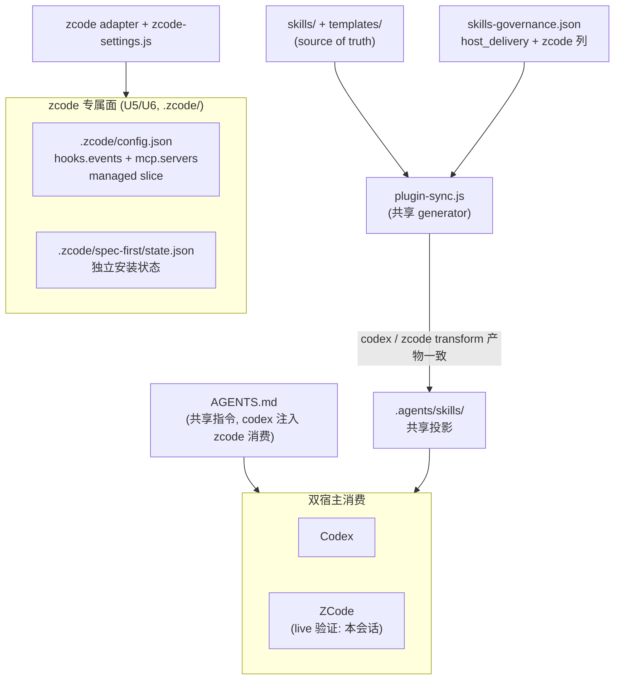

# zcode Host Support - Plan

## Goal Capsule

- **目标：** 把 zcode 接入为第七个受支持宿主（`getSupportedPlatforms()` 新增 `zcode`），skills 与指令层复用既有共享投影，专属面按 qoder 模式新建，P0+P1 在本计划内一次交付。
- **推荐路径：** zcode 原生消费 AGENTS.md 生态标准路径（`.agents/skills/`、`AGENTS.md`），不建 `.zcode/skills/` 镜像；CLI 管理面经 platform registry 注册后自动扩展；SessionStart hook 与 MCP 配置注入 `.zcode/config.json` managed slice，激活证据到位前标 degraded。
- **决策焦点：** 共享 runtime root 的所有权与 transform 一致性；`hooks.enabled` 注入的用户所有权边界；MCP 配置的 workspace scope 选择。
- **验证焦点：** 七宿主测试链全绿；codex 与 zcode 投影产物逐字节一致的 contract 测试；hooks 行为经 fresh-source eval + 真机激活验证。
- **最大风险/边界：** zcode 无版本化公开契约，客户端升级可能漂移；共享目录存在「最后写入者」风险，由 transform 一致性契约守住。
- **停止条件：** zcode hooks/MCP 真机激活失败且无修复路径时，U5/U6 保持 degraded 并记录失败证据，不虚假升级为 confirmed；不得为迁就现状放宽 source/runtime 纪律。

---

## Product Contract

### Summary

把 zcode 作为第七个受支持宿主接入 spec-first：skills 与指令层零成本复用既有共享投影，CLI 管理面（init/doctor/clean/update）与治理矩阵（host_delivery）纳入 zcode，SessionStart hook 与 MCP setup 按 `.zcode/` 专属面交付。zcode 不进入 init 默认勾选，由用户显式 opt-in。

### Problem Frame

zcode 是 AGENTS.md 生态原生宿主（直接消费 `.agents/skills/`、`.agents/commands/`、`.agents/mcp.json`、`AGENTS.md`），并刻意兼容 Claude hooks 生态（同名事件、`${CLAUDE_PROJECT_DIR}` 变量族、exit-code 语义）。它已经在消费本仓库为 codex 生成的 `.agents/skills/` 投影——当前会话即运行在 zcode 上，全部 spec-* skills 从该路径加载成功，`AGENTS.md` 注入成功。

这一消费关系是隐式的：spec-first 的平台注册表、治理矩阵、init/doctor/clean、MCP setup 均不感知 zcode。后果是共享面的所有权判断失真（`clean --codex` 可能删除 zcode 正在消费的 skills）、宿主指引错误（共享内容中的 `MCP_SETUP_HOST=codex` pin 会误导 zcode 用户把 MCP 配到 codex 配置面）、doctor 无法诊断 zcode。集成不是从零投影，而是把已发生的隐式共享变成显式治理。

### Requirements

**入口与投影**

- R1. zcode 宿主可发现并调用全部受治理的 spec-* workflow 与 standalone skills，经共享 `.agents/skills/` 投影，不新建 `.zcode/skills/` 镜像。
- R2. `AGENTS.md` 指令层（语言治理、workflow 入口硬规则）在 zcode 会话生效，零额外投影。
- R3. skill 交付形态与 codex 一致：governance 的 `host_delivery.zcode` 取 codex 同值。

**CLI 管理面**

- R4. `spec-first init --zcode` 幂等安装/刷新 zcode 面；zcode 不进入默认勾选与 `-y` 默认宿主（显式 opt-in）。
- R5. `spec-first doctor --zcode` 输出 zcode 的 support/readiness 视图：skills loader 按本会话 live 证据标 confirmed；hooks/MCP 状态随证据等级演进——P0 未投影时 not-supported，投影后激活验证前 degraded，各带 reason code。
- R6. `spec-first clean --zcode` 移除 zcode 专属面；共享面（`.agents/skills/`、`AGENTS.md`）仅在无其他宿主消费者时移除。
- R7. `spec-first update` 按独立 state file 检测 zcode 已安装面。

**zcode 专属能力（P1）**

- R8. SessionStart startup-reminder 经 `.zcode/config.json` 的 hooks managed slice 注入；用户显式禁用 hooks 时不越权覆盖，降级为警告。
- R9. `spec-runtime-setup` 支持 `MCP_SETUP_HOST=zcode`，MCP 配置写入项目级 `.zcode/config.json` 的 `mcp.servers`。

**治理与一致性**

- R10. codex 与 zcode 对共享目录的投影产物内容一致（contract 测试锁定）；共享内容中的宿主指引（`MCP_SETUP_HOST` pin）宿主中立，覆盖两个宿主各自的配置面。
- R11. 多宿主影响同步：runtime capability catalog 重生成、三份 README、CHANGELOG、CLAUDE.md/AGENTS.md 宿主清单更新。

### Scope Boundaries

**非目标：**

- 不重建 zcode 已覆盖的宿主能力（skills 发现、hooks 引擎、MCP 连接、插件体系）——差异化锚点保持在治理、source/runtime 纪律与证据闭环。
- 不修改既有六宿主的投影行为（regression 风险面；codex pin 文案中立化除外，它是共享语义的一部分）。
- 不做 zcode 插件包（`.zcode-plugin/`）marketplace 分发——当前无 consumer。

**Deferred to Follow-Up Work:**

- `.agents/commands/` command 交付形态评估——触发条件：zcode 上 skill 入口路由实测不准。
- `when_to_use` frontmatter 增强——触发条件：transform 差异问题先解决（见 KTD3 限制）。
- `PreToolUse`/`Stop` gate hooks 评估——触发条件：zcode hooks 激活证据（U5）落地后按需启动。

---

## Planning Contract

### Key Technical Decisions

- KTD1. **skills 共享投影，不建 `.zcode/skills/` 镜像**（architecture posture: `reuse`——复用 `.agents/` 开放标准面与既有 codex 投影产物）。zcode adapter 的 `skillsRoot`/`workflowsRoot` 与 codex 同指 `.agents/skills/`。已检查的替代 owner：独立镜像（qoder 模式）被否决——同一份 skills 双份磁盘与刷新，且与 zcode 遵循开放标准的设计意图相悖。(session-settled: user-approved — chosen over 独立 `.zcode/skills/` 镜像: 零重复投影且与本会话 live 验证的消费路径一致)。被否决的第三选项：零 adapter 纯靠天然共享——registry/clean/doctor/governance 均无法感知 zcode，`clean --codex` 会误删 zcode 正在消费的共享 skills，该治理缺口正是本计划要消除的对象。
- KTD2. **zcode 专属面按 qoder-settings 模式新建**（posture: `extend`——既有 settings managed-slice 模式扩展出 `src/cli/zcode-settings.js` 与 `templates/zcode/hooks/`）。zcode 不读 `.codex/hooks/hooks.json`，只认 `.zcode/config.json` 的 `hooks.events.<Event>` 结构，codex hooks 文件无法复用。(session-settled: user-approved — chosen over 复用 codex hooks 文件: zcode 的 hooks 配置结构不同，复用会静默失效)
- KTD3. **workflow 交付形态 = skill，governance 复制 codex 列**。zcode 的 skill 同样有 `/` 显式入口加 description 语义路由，与入口治理模型一致。已知继承限制：codex transform 把 agents 引用改写为 `.codex/agents/`，zcode 无项目级 agents 目录，消费时继承该 lossy——doctor 视图如实标注，不在共享内容里做宿主分支。
- KTD4. **codex host pin 文案宿主中立化**。`src/cli/adapters/codex.js` 的 `addCodexSetupHostPin` 注入的 prose（「设 `MCP_SETUP_HOST=codex`」）改为按实际宿主区分指引（codex → 用户级 config，zcode → 项目级 `.zcode/config.json` 的 `mcp.servers`）。pin 是 prose 不是逻辑，一次改动同时服务两个宿主；对纯 codex 用户是几行可接受噪音。
- KTD5. **zcode 不进 init 默认**（posture: `reuse`——`INIT_PLATFORM_DEFAULTS` 已有未配置宿主的 `defaultForYes: false` 兜底，显式加条目保持清单完整）。(session-settled: user-directed — chosen over 加入默认勾选: 支持等级尚新、激活证据有限，与 qoder/cursor 等非默认宿主一致)
- KTD6. **P0+P1 一个计划交付**。(session-settled: user-directed — chosen over 只做 P0: P1 面小且完全依赖 P0 注册，拆分徒增计划开销)
- KTD7. **hooks/MCP 初始 degraded: activation-unverified**（qoder 先例的 reason code 模式）。zcode-guide 文档契约清晰，但 spec-first 的 hook 资产在真机上的激活未经证实；U5 的 fresh-source eval + 真机激活验证通过后才升 confirmed，并在 registry 里体现。
- KTD8. **`hooks.enabled` 注入的所有权规则**。managed slice 写入 SessionStart entry 时：`hooks.enabled` 缺失 → 设 `true`（spec-first 激活所需，doctor 可见）；显式 `false` → 不覆盖，init 输出 degraded 警告。不越过用户对其全局 hooks 开关的所有权。
- KTD9. **MCP host_config 以 workspace `.zcode/config.json` 为 target**。与 hooks managed slice 同文件内聚；不动用户级 `~/.zcode/cli/config.json`（避免污染用户全局配置）。与 codex 的 user-scope（`$HOME/.codex/config.toml`）不同，是刻意的 scope 选择。
- KTD10. **共享 root 的多消费者语义**（posture: `extend`——复用 `AGENTS.md` 双宿主共享的既有先例，扩展 `classifySharedInstructionConsumers` 与共享面删除判断）。registry 中 `.agents/skills/` 条目标注 codex+zcode 共享；clean 决策按「其他消费者在场则保留」。

### Interface Contracts

| Interface / mode | Consumers | Canonical artifact | Contract summary | Compatibility | Verification |
| --- | --- | --- | --- | --- | --- |
| governance `host_delivery` 列 / evolution | `plugin-manifest.js` 载入校验、`plugin-governance.js` 过滤、投影与测试 | `src/cli/contracts/dual-host-governance/skills-governance.json` + `skills-governance.schema.json` | `host_delivery` 键集必须恰等于 `getSupportedPlatforms()` 集合 | additive，但 `additionalProperties: false` 使半更新即 load fail（刻意防半更新设计） | `npm run test:unit`（`plugin-modules.test.js` 的 governance 校验） |
| CLI flag 面 `--zcode` / greenfield (additive) | init/doctor/clean 参数解析、smoke、集成测试 | `src/cli/adapters/platform-registry.js`（`INIT_PLATFORM_CHOICES`/`DOCTOR_HOST_FLAGS`/`CLEAN_HOST_FLAGS` 均派生） | 新增 `--zcode` flag；不影响既有 flag | additive | `tests/unit/host-flag-registry-derivation.test.js`、`npm run test:smoke` |
| MCP setup host 契约 / evolution | `setup.cjs`、`scripts/lib/registry.cjs`、`scripts/lib/host-authority.cjs` | `skills/spec-runtime-setup/setup-registry.json` + schema（v9） | `hosts.zcode` 的 `host_config`（targets/fallback_order/uninstall_targets） | additive；`HOST_IDS`/`CANONICAL_HOSTS` 加 `zcode` | `npm run test:mcp-setup` |
| 共享投影内容 / evolution（宿主中立化） | codex 与 zcode 两个消费宿主 | `skills/` 源 + adapter transform | codex/zcode 投影产物逐字节一致；pin 文案双宿主中立 | pin 文案变更是 codex 用户可见的行为变化（指引内容扩展） | U2 的 transform 一致性 contract 测试 |

### High-Level Technical Design

要点：generator 只向共享目录投影一次（codex/zcode transform 一致），zcode 的差异全部落在 `.zcode/` 专属面；治理矩阵决定每个 skill 在每个宿主的交付形态。

### Evidence & Limitations

- **zcode 官方指南（advisory）**：zcode-guide 插件 v0.1.0（2026-09-04 读取），提供 skills/commands 发现顺序、7 个 hooks 事件与 `hooks.enabled` 语义、MCP `mcp.servers` 嵌套结构、AGENTS.md 双层合并规则。其中 skills 发现与 AGENTS.md 注入已由当前 zcode 会话 live 验证 re-ground；hooks 激活与 MCP 写入路径**未**经真机验证——这是 KTD7 degraded 标注的直接依据。
- **架构调研（advisory，已部分复核）**：Explore subagent 的行号级调研覆盖 adapter/registry/governance/命令分发/测试面；落笔前直接源码复核修正两处——`qoder-settings.js` 实际位于 `src/cli/qoder-settings.js`（非 `src/cli/adapters/`），`init-args.js` 对未配置宿主有 `defaultForYes: false` 兜底（KTD5 因此只需显式条目）。本计划以复核后事实为准。
- **限制与失效条件**：zcode 无版本化公开契约文档，客户端升级可能改变发现顺序或 hooks 行为；invalidation condition 为 zcode 客户端重大版本变更或 zcode-guide 指南语义变更，届时重评 KTD1/KTD7/KTD8。
- **`.agents/skills/` 是 generated runtime**：本任务正是 projection 任务，该路径在 scope 内仅作 observed evidence（live 消费验证），所有 durable 修改落回 `skills/` 源、adapter 与 generator 逻辑。

---

## Implementation Units

### U1. zcode adapter 与平台注册（原子核心）

- **Goal:** zcode 进入 `getSupportedPlatforms()`，具备投影与专属面声明，governance 矩阵同步扩列——三者互相锁死，必须同提交落地。
- **Requirements:** R1, R2, R3, R7
- **Dependencies:** 无
- **Files:**
  - `src/cli/adapters/zcode.js`（新建）
  - `src/cli/adapters/index.js`（注册实例）
  - `src/cli/adapters/platform-registry.js`（`PLATFORM_REGISTRY.zcode`）
  - `src/cli/contracts/dual-host-governance/skills-governance.json` + `skills-governance.schema.json`（全量记录加 `zcode` 列）
  - `tests/unit/zcode-adapter.test.js`（新建）
- **Approach:** `zcode.js` 继承 `PlatformAdapter`（非 PointerBased——zcode 无宿主原生规则文件，指令走共享 `AGENTS.md`）。关键配置照抄 codex：`skillsRoot = workflowsRoot = '.agents/skills'`、`hasCommands = false`、`instructionFile = 'AGENTS.md'`；差异配置：`runtimeRoot = '.zcode'`、`stateFile = '.zcode/spec-first/state.json'`、`managedRoot = '.zcode/spec-first/'`。`transformSkillContent` 委托与 codex 同源的实现（复用其导出或将共享逻辑提为共用函数，避免复制第二份改写规则）。registry 条目：surfaces 含共享 skillsRoot（`crossRuntimeRoot: true`，标注 codex 共享）、`.zcode/spec-first/` managedRoot、`.zcode/config.json` managed-slice（U5 启用）；P0 阶段 `capabilities.hooks` 各项标 `not-supported` + `reasonCode: 'spec-first-scope'`（U5 引入 sessionStart 后改 degraded）。governance 全量 skill 记录加 `"zcode": <codex 同值>`，schema 的 `host_delivery` 定义同步——以 `loadSkillsGovernance` 校验通过为准（键集恰等于平台集）。
- **Patterns to follow:** `src/cli/adapters/codex.js`（结构）、`src/cli/adapters/kiro.js`（轻量 adapter 先例）、governance 现有六列记录。
- **Test scenarios:**
  - `getSupportedPlatforms()` 含 `zcode`，`getAdapter('zcode')` 返回新实例；registry 键集与 adapter 实例表一致（既有锁死测试自动覆盖）。
  - governance load：`host_delivery` 键集恰等于七平台集；每条记录的 `zcode` 值等于 `codex` 值。
  - `inspect()` 正确报告 runtime/skills/state 存在性（含共享 skills 路径）。
  - `planRuntimeFilesSync` 计划包含 `.zcode/spec-first/` 创建与 state 写入；不重复 ensure 已存在的共享面。
  - `planRuntimeFilesRemoval` 只计划 zcode 专属面移除；`.agents/skills/` 不在其列（共享面清理走消费者判断，U3）。
- **Verification:** `npm run test:unit` 全绿；governance load 校验通过；zcode adapter 单测覆盖上述场景。

### U2. 共享投影宿主中立化与 transform 一致性契约

- **Goal:** 消除共享目录的宿主冲突源，并用 contract 测试把「codex/zcode 投影产物一致」固化为不变量。
- **Requirements:** R10
- **Dependencies:** U1
- **Files:**
  - `src/cli/adapters/codex.js`（`addCodexSetupHostPin` 文案中立化）
  - `src/cli/adapters/zcode.js`（如需对齐共享 transform 入口）
  - `tests/unit/host-runtime-projection-contracts.test.js` 或新文件（一致性 contract 测试）
- **Approach:** pin 文案改为「按实际宿主设置 `MCP_SETUP_HOST`：codex → 用户级 Codex config；zcode → 项目级 `.zcode/config.json` 的 `mcp.servers`」，保留「勿依赖 PATH 自动探测」警告。新增 contract 测试：对同一 skill 源（至少覆盖 spec-runtime-setup 入口与一个 workflow skill），断言 codex 与 zcode 的 `transformSkillContent` 产物逐字节一致。`.codex/agents/` 引用的 lossy 继承（KTD3）在测试中以已知限制注释，不作断言。
- **Patterns to follow:** 既有 `host-runtime-projection-contracts.test.js` 的 ADAPTER_CASES 结构。
- **Test scenarios:**
  - codex/zcode transform 输出 diff 为空（spec-runtime-setup surface 与普通 workflow skill 各一）。
  - pin 段落包含双宿主指引，不再单指 codex。
  - codex 既有投影测试不回归（pin 变更只扩文案不改结构）。
- **Verification:** `npm run test:unit`；一致性 contract 测试入列常跑。

### U3. CLI 分发面：init / doctor / clean / update

- **Goal:** 四个命令的 zcode 分发、显式 opt-in 策略、共享面消费者保护。
- **Requirements:** R4, R5, R6, R7
- **Dependencies:** U1
- **Files:**
  - `src/cli/commands/init-args.js`（显式 `zcode: { defaultChecked: false, defaultForYes: false }` 条目）
  - `src/cli/commands/init.js`、`src/cli/commands/init-output.js`（help 与 after-init 文案的宿主清单）
  - `src/cli/commands/doctor.js`（`checkPlatformCli` 三元链加 zcode；`detectPlatforms` 判据）
  - `src/cli/commands/clean.js`（共享面消费者判断扩展）
  - `src/cli/commands/update.js`（按 state file 枚举自动覆盖，核对即可）
- **Approach:** doctor 的 CLI 探测命令名用 `zcode`，not-found 仅警告不阻断（参照 `checkPlatformCli` 对 codex 的 MVP 先例注释；zcode 桌面客户端可能无 PATH 可执行）。`detectPlatforms` 判据：`.zcode/spec-first/state.json` 存在或 `.zcode/config.json` 含 managed 标记。clean 的 `classifySharedInstructionConsumers` 与共享 skills 删除决策把 zcode 计入消费者（KTD10）。help 文案宿主列表更新。
- **Patterns to follow:** 既有宿主在三命令中的分发路径；`src/cli/commands/clean.js:622` 附近的共享指令消费者判断。
- **Test scenarios:**
  - `init --zcode`（dry-run 与真实）：计划含专属面创建与共享面幂等 ensure；`-y` 默认宿主集不含 zcode；交互默认勾选不含 zcode。
  - `doctor --zcode`：support 视图输出（skills loader confirmed；hooks not-supported/degraded 如实）；CLI 不在 PATH 时警告不失败。
  - `clean --zcode`：仅移除 `.zcode/` 专属面；codex state 存在时 `.agents/skills/` 与 `AGENTS.md` 保留。
  - `clean --codex`（zcode state 存在时）：`.agents/skills/` 保留（共享消费者保护的反向用例）。
  - `update` 检测：仅 `.zcode/spec-first/state.json` 存在时报告 zcode 已安装。
- **Verification:** `npm run test:unit`、`npm run test:smoke`。

### U4. 测试体系扩展与七宿主集成

- **Goal:** 既有测试面全量覆盖 zcode，硬编码断言解锁，集成测试扩为七宿主。
- **Requirements:** R1, R3（测试侧固化）
- **Dependencies:** U1, U2, U3
- **Files:**
  - `tests/unit/host-runtime-projection-contracts.test.js`（ADAPTER_CASES 加 zcode）
  - `tests/smoke/cli-smoke.test.js`（`--zcode` flag）
  - `tests/unit/doctor-platform-cli.test.js`（zcode 探测）
  - `tests/integration/init-six-host-lifecycle.integration.test.js`（枚举已派生，核对文件名与断言）
  - `tests/integration/workspace-graph-six-host-projection.integration.test.js`（`toHaveLength(6)` → 7）
  - `tests/unit/host-flag-registry-derivation.test.js`（P0 阶段 zcode 无 sessionStart，49 行 startup 断言**不动**；U5 解锁）
- **Approach:** 集成测试宿主枚举多为 `getSupportedPlatforms()` 派生，注册后自动扩展——逐个核对 `toHaveLength`/硬编码宿主数；`init-six-host-lifecycle` 文件名保留（枚举派生使其天然七宿主），在 CHANGELOG 说明命名沿革，不做纯改名 churn。
- **Test scenarios:**
  - 七宿主 init lifecycle 集成用例对 zcode 通过（真实 spawn CLI）。
  - zcode 的 ADAPTER_CASES：投影契约（共享 root、state、无 commands/agents 投影）。
  - smoke：`spec-first init --zcode` 路径与 help 输出含 zcode。
- **Verification:** `npm run test:integration`、`npm run test:smoke`、`npm run test:unit` 全绿。

### U5. P1：SessionStart hook 与 `.zcode/config.json` managed slice

- **Goal:** zcode 会话启动注入 startup reminder，配置经 managed slice 管理，激活证据到位前 degraded。
- **Requirements:** R8
- **Dependencies:** U1, U3
- **Files:**
  - `src/cli/zcode-settings.js`（新建，对齐 `src/cli/qoder-settings.js` 位置）
  - `src/cli/adapters/zcode.js`（`planRuntimeFilesSync`/`planRuntimeFilesRemoval` 挂接）
  - `templates/zcode/hooks/session-start`（新建，自 `templates/codex/hooks/session-start` 派生）
  - `src/cli/adapters/platform-registry.js`（`capabilities.hooks.sessionStart` → degraded）
  - `tests/unit/zcode-settings.test.js`（新建）
  - `tests/unit/host-flag-registry-derivation.test.js`（startup 断言解锁为 `['claude', 'codex', 'qoder', 'zcode']`）
- **Approach:** hook 脚本复用 codex 模板逻辑（读 stdin、解析 `AGENTS.md` 的 lang/workflow-entry anchors、调 `spec-first startup-reminder`），projectDir 解析优先 `ZCODE_PROJECT_DIR`/`CLAUDE_PROJECT_DIR`，fallback 文案中 doctor 命令改 `--zcode`。zcode 对 hook stdout 按严格 JSON schema 解析——执行期核对 codex 模板的 `writeHookOutput` 输出形状与 zcode 契约（`additionalContext`）逐字段兼容，不兼容则适配输出层。settings 注入按 KTD8 所有权规则。registry 的 sessionStart 状态改 `degraded` + `reasonCode: 'zcode_activation_unverified'`，doctor 视图与 qoder 先例同构展示。
- **Execution note:** 行为验证走 fresh-source eval（把渲染后的 hook 资产注入全新只读 reviewer 评估注入语义）+ 真机 zcode 会话启动观察 `additionalContext` 注入；两者通过后才把 registry 升 confirmed，eval 资产归档 `docs/validation/`。验证不通过则保持 degraded 并记录失败证据——这是本 unit 的合法终态之一。
- **Test scenarios:**
  - managed slice 注入：`.zcode/config.json` 不存在 / 存在无 hooks / 存在含 user-owned hooks 三态下的合并结果；user-owned keys 与条目保留。
  - `hooks.enabled` 缺失 → 注入后为 true；显式 false → 不覆盖且 init 输出 degraded 警告。
  - hooks 结构合法：`events.SessionStart` 数组、matcher、`type: command` 字段组合、模板变量 `${ZCODE_PROJECT_DIR}` 使用正确。
  - `.zcode/config.json` 存在但 JSON 解析失败：注入中止并输出警告，不强行写入或重建文件。
  - 移除：`clean --zcode` 后 managed 条目消失、user-owned 内容保留。
  - startup reminder 宿主集含 zcode（解锁断言）。
- **Verification:** `npm run test:unit`；`npm run lint:skill-entrypoints`；fresh-source eval + 真机激活记录。

### U6. P1：MCP setup 支持 hosts.zcode

- **Goal:** `spec-runtime-setup` 以 `MCP_SETUP_HOST=zcode` 把 MCP 配置写入项目级 `.zcode/config.json` 的 `mcp.servers`。
- **Requirements:** R9
- **Dependencies:** U2（pin 中立化后指引正确）、U5（同一 `.zcode/config.json` 的 hooks 与 MCP 是双写入面，managed slice 基础与合并语义需先就位）
- **Files:**
  - `skills/spec-runtime-setup/setup-registry.json` + `setup-registry.schema.json`（`hosts.zcode`）
  - `skills/spec-runtime-setup/scripts/lib/registry.cjs`（`HOST_IDS` 加 `zcode`）
  - `skills/spec-runtime-setup/scripts/lib/host-authority.cjs`（`CANONICAL_HOSTS` 加 `zcode`；`HOST_SKILL_SURFACES` 加 `zcode: '.agents/skills'`——与 codex 同值的共享路径，核对查重逻辑可容忍重复值）
  - `tests/unit/mcp-setup-registry.test.js`（hosts 键集断言解锁）
  - 相关 `mcp-setup-*` 测试（config consumers 等）
- **Approach:** `host_config` 按 KTD9：workspace target `.zcode/config.json`（JSON，嵌套路径 `mcp.servers`）、fallback_order 与 uninstall_targets 对应 workspace 单一 scope。执行期核对现有写入器对 JSON 嵌套 key 的支持（既有格式含 toml/`mcpServers` 顶层两种；zcode 是嵌套 `mcp.servers`，若写入器不支持则做最小扩展并在 schema 的 config_format 枚举中登记）。`mcp-setup-entrypoint` 的 `advisoryHostCandidates` 默认探测集（`['claude', 'codex']`）不动——zcode 无稳定的 PATH 可执行探测面。
- **Test scenarios:**
  - hosts 键集断言解锁后含 zcode（七宿主）；`host_config` 三要素（targets/fallback_order/uninstall_targets）校验通过。
  - `MCP_SETUP_HOST=zcode` 的 setup 冒烟：verify-only 模式不写任何宿主/provider 配置（既有 invariant）。
  - 写入路径单测：嵌套 `mcp.servers` 合并保留 user-owned servers 条目。
- **Verification:** `npm run test:mcp-setup`、`npm run test:integration`。

### U7. 文档、能力目录与宿主清单

- **Goal:** 派生文档重生成，人读文档与指令文件的宿主清单同步。
- **Requirements:** R11
- **Dependencies:** U1–U6
- **Files:**
  - `docs/catalog/runtime-capabilities.md`（`scripts/generate-runtime-capability-catalog.js` 重生成）
  - `README.md`、`README.en.md`、`README.zh-CN.md`（受支持宿主清单与安装示例）
  - `CHANGELOG.md`（本变更条目，含 `init-six-host-lifecycle` 命名沿革说明）
  - `CLAUDE.md` 与 `AGENTS.md`（「当前 Claude、Codex、Cursor、Kiro、Qoder」类宿主清单更新为含 zcode；改 CLAUDE.md 后跑 `npm run sync:instructions` 同步派生区）
  - `skills/spec-runtime-setup/SKILL.md`（如宿主清单硬编码则同步）
- **Approach:** 宿主清单文案统一收敛为「以 `getSupportedPlatforms()` 为准」的表述，减少未来新增宿主时的文档漂移面；zcode 的 hooks/MCP 状态按 KTD7 如实标注（degraded 直到证据升级）。
- **Test expectation:** none — 文档与派生目录变更；catalog 生成脚本自带 registry 同源校验。
- **Verification:** `npm run build`（pack 内容核对，确认 `templates/zcode/` 入包）；`npm run sync:instructions` 校验通过。

---

## Verification Contract

| 验证 | 命令/方式 | 覆盖 units | 说明 |
| --- | --- | --- | --- |
| 语法 | `npm run typecheck` | 全部 | CLI 与关键脚本 `node --check` |
| 单测 | `npm run test:unit` | U1–U6 | 含 governance 校验、adapter 契约、settings 注入、transform 一致性 |
| 冒烟 | `npm run test:smoke` | U3, U4 | CLI help/init 路径含 zcode |
| 集成 | `npm run test:integration` | U4, U6 | 七宿主 lifecycle 与投影 |
| MCP setup | `npm run test:mcp-setup` | U6 | setup 契约与宿主配置 |
| 入口治理 | `npm run lint:skill-entrypoints` | U5, U6 | skill 资产变更后的入口校验 |
| 打包 | `npm run build` | U7 | `templates/zcode/` 等新资产入包 |
| 行为（hooks） | fresh-source eval + 真机 zcode 激活 | U5 | degraded→confirmed 的唯一升级依据；资产归档 `docs/validation/` |
| 行为（skills） | zcode 会话 skills 发现与调用 | U1 | 本会话已 live 验证；落地后回归一次 |
| 一致性 | transform 产物逐字节一致 contract | U2 | 共享目录「最后写入者」风险的守门 |

**Product Contract confirmation：** R1/R2 已有 live 证据；R8/R9 的行为证据在 U5/U6 的执行期验证产生，验证失败时以 degraded 终态满足「如实标注」而非虚假满足功能面。

**Largest unproven risk：** zcode hooks 激活与 MCP 写入（advisory 文档 → 真机未验证）。缓解：KTD7 degraded + U5 执行期验证路径。

---

## Definition of Done

**全局：**

- 七宿主的 init/doctor/clean/update 行为全部有测试覆盖且 `npm test`（unit/smoke/integration）与 `npm run test:mcp-setup` 全绿。
- governance load 校验通过（`host_delivery` 键集恰等于七平台集）。
- `docs/catalog/runtime-capabilities.md` 与 registry 同源重生成；README×3、CHANGELOG、CLAUDE.md/AGENTS.md 宿主清单更新且 `npm run sync:instructions` 通过。
- zcode 的 hooks/MCP 能力状态与证据等级一致（degraded 或 confirmed，无未标注的声称）。
- 既有六宿主无行为回归（集成测试证明；codex pin 文案中立化是唯一有意变更）。
- 清理 criterion：不留 dead-end 代码与实验性 hook 变体；验证未采用的适配路径从 diff 移除。

**Per-unit：** 各 unit 的 Verification 字段所列命令/证据通过即该 unit 完成；U5 的 degraded 终态（激活验证失败但有记录）同样构成完成——完成claim必须与证据等级一致。
