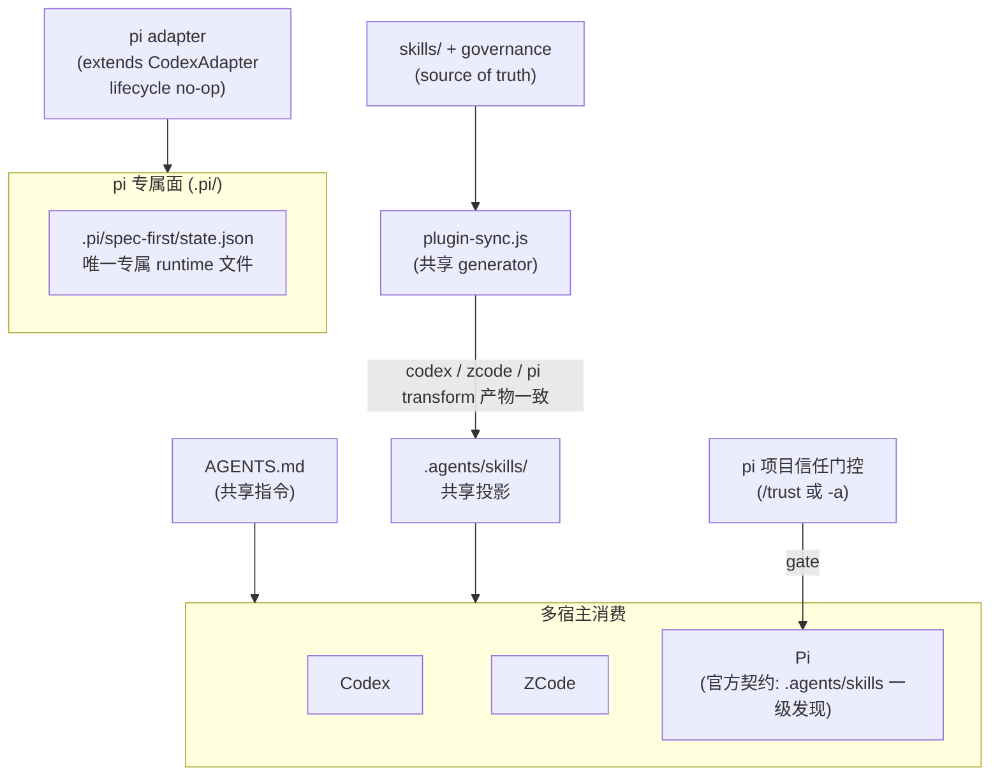

# pi Host Support - Plan

## Goal Capsule

- **目标：** 把 pi（`@earendil-works/pi-coding-agent`）接入为第八个受支持宿主（`getSupportedPlatforms()` 新增 `pi`），skills 与指令层零成本复用既有共享投影，专属面收敛到单个 state file，本计划一次交付 P0 全量。
- **推荐路径：** pi 是 AGENTS.md 生态原生宿主，官方文档明确项目级 skills 自动发现 `.agents/skills/`（向上搜至 git 根）、启动加载 `AGENTS.md`——走 zcode 模式（`PiAdapter extends CodexAdapter`）且进一步简化：无 settings managed slice、无 hook 模板、无 per-host settings helper。
- **决策焦点：** 继承 CodexAdapter 时 lifecycle 方法必须显式 no-op 覆盖（防误写 `.codex/` 面）；pi 特有 trust 激活门槛的显式引导；hooks/extension 与 prompt templates 能力面的显式不交付边界。
- **验证焦点：** 八宿主测试链全绿；pi 与 codex 投影产物逐字节一致的 contract 测试；真机 pi 会话的 skills 发现与 `/skill:` 调用验证（preview→active 的唯一升级依据）。
- **最大风险/边界：** pi 文档仅 latest 档、无版本锚定，且迭代快（6k+ commits），skills 发现/trust 语义可能漂移——registry reasonCode 携带验证依据，doctor 暴露 drift。
- **停止条件：** 真机验证（U4）失败且无修复路径时，pi 保持 `preview` + docs-verified 证据等级如实标注，不虚假升级为 active；不得为迁就现状放宽 source/runtime 纪律。

---

## Product Contract

### Summary

把 pi 作为第八个受支持宿主接入 spec-first：skills 与指令层经共享 `.agents/skills/` 投影与共享 `AGENTS.md` 零成本生效（pi 官方文档化的一级发现机制），CLI 管理面（init/doctor/clean/update）与治理矩阵（host_delivery）纳入 pi，专属 runtime 面收敛到 `.pi/spec-first/state.json` 单文件。pi 不进入 init 默认勾选，由用户显式 opt-in。

### Problem Frame

pi（earendil-works/pi，MIT，101k+ stars）是自扩展 coding agent CLI，定位 "self extensible coding agent"。它的扩展机制与 spec-first 的共享投影高度同构：

- **Skills**：原生实现 Agent Skills 标准（agentskills.io），项目级自动发现 `.pi/skills/` 与 `.agents/skills/`（从当前目录向上搜索至 git 根），同名冲突保留先找到的，有意允许 `name` 与父目录名不一致（为跨宿主共享 skill 目录优化）。
- **指令层**：启动时加载 `AGENTS.md` 或 `CLAUDE.md`（cwd 向上遍历 + 全局 `~/.pi/agent/AGENTS.md`），与 codex/zcode 共享同一指令文件语义。
- **扩展**：prompt templates（`.pi/prompts/*.md`，文件名即 `/` 命令）、TypeScript extensions（`.pi/extensions/*.ts`，含 `session_start`/`before_tool_call` 等完整事件系统）、settings（`.pi/settings.json`，JSON 嵌套合并）。
- **信任门控**：项目级 `.pi/` 资源与项目 `.agents/skills` 仅在项目受信任（`/trust`、`defaultProjectTrust`、一次性 `-a`）后加载。

这意味着 pi 今天就能直接消费本仓库为 codex 生成的 `.agents/skills/` 投影与 `AGENTS.md` 指令层，且该消费关系是官方文档化契约（比 zcode 集成时的「本会话 live 验证」证据更强）。但该消费对 spec-first 是隐式的：平台注册表、治理矩阵、init/doctor/clean 均不感知 pi。后果与 zcode 集成前同构——`clean --codex` 可能删除 pi 正在消费的共享 skills、doctor 无法诊断 pi、governance 键集校验无法为 pi 分配交付形态。集成不是从零投影，而是把官方契约背书的隐式共享变成显式治理。

### Requirements

**入口与投影**

- R1. pi 可发现并调用全部受治理的 spec-* workflow 与 standalone skills，经共享 `.agents/skills/` 投影（利用 pi 从任意子目录向上搜至 git 根的发现语义），不新建 `.pi/skills/` 镜像。
- R2. `AGENTS.md` 指令层（语言治理、workflow 入口硬规则）在 pi 会话生效，零额外投影。
- R3. skill 交付形态与 codex 一致：governance 的 `host_delivery.pi` 取 codex 同值，workflow 入口为 `/skill:spec-*`（pi 的 skill commands 默认启用，官方 settings 表 `enableSkillCommands` 默认 `true`）。

**CLI 管理面**

- R4. `spec-first init --pi` 幂等安装/刷新 pi 面；pi 不进入默认勾选与 `-y` 默认宿主（显式 opt-in）。
- R5. `spec-first doctor --pi` 输出 pi 的 support/readiness 视图：初始 `preview` + `pi_official_docs_verified` 证据等级如实展示；CLI 探测 `pi --version`，不在 PATH 时警告不阻断；提示 trust 激活门槛。
- R6. `spec-first clean --pi` 仅移除 `.pi/spec-first/` 专属面；共享面（`.agents/skills/`、`AGENTS.md`）仅在无其他宿主消费者时移除。
- R7. `spec-first update` 按独立 state file（`.pi/spec-first/state.json`）检测 pi 已安装面。

**pi 特有激活门槛**

- R8. trust 引导显式化：init 完成输出、init 预览诊断与 doctor 视图均写明「pi 首次启动需信任项目（`/trust` 或 `pi -a`），否则项目级 skills 不加载」。

**治理与一致性**

- R9. 多宿主影响同步：runtime capability catalog 重生成、三份 README、CHANGELOG、CLAUDE.md/AGENTS.md 宿主清单更新；既有七宿主零回归。

### Scope Boundaries

**非目标：**

- 不交付 prompt templates 投射（`.pi/prompts/spec-*.md`）——与 `/skill:spec-*` 构成双入口路由歧义，且模板发现非递归、frontmatter 需转换。Deferred 触发条件：pi 真机实测 skill 入口路由不准。
- 不交付 session-start extension——pi 无 shell hooks，等价机制是 TypeScript extension 的 `session_start` 事件，但 extensions 以全系统权限执行任意代码，信任面大于 startup reminder 的 advisory 收益；入口治理已在 `AGENTS.md` 指令层覆盖。Deferred 触发条件：pi 上 startup reminder 需求经实测确认强烈。
- 不支持 `MCP_SETUP_HOST=pi`——pi MCP 非原生（官方 `pi-mcp-adapter` extension，作者对 MCP 持保留态度）。Deferred 触发条件：pi MCP 生态官方化且有用户需求；届时一并评估 Setup Host Pin 三宿主中立化。
- 不重建 pi 已覆盖的宿主能力（skills 发现、extension 引擎、包体系）；不修改既有七宿主的投影行为。

---

## Planning Contract

### Key Technical Decisions

- KTD1. **skills 共享投影，不建 `.pi/skills/` 镜像**（posture: `reuse`）。pi adapter 的 `skillsRoot`/`workflowsRoot` 与 codex/zcode 同指 `.agents/skills/`。依据强度：pi 官方文档明确列出项目级 `.agents/skills/` 是一级发现来源（向上搜至 git 根）——这是文档化契约，强于 zcode 集成时的 live 会话验证。被否决的替代：独立 `.pi/skills/` 镜像（qoder 模式）——同一份 skills 双份磁盘与刷新，且 pi 已原生消费共享路径，镜像徒增漂移面；零 adapter 纯天然共享——registry/clean/doctor/governance 无法感知 pi，`clean --codex` 会误删 pi 正在消费的共享面，该治理缺口正是本计划要消除的对象。
- KTD2. **继承 CodexAdapter，lifecycle 方法显式 no-op 覆盖**（posture: `extend` + `constrain`）。pi 继承 codex 的 `transformSkillContent`（共享路径重写、Setup Host Pin 注入）与 `instructionFile = 'AGENTS.md'`，但**必须**以基类空语义显式覆盖 `planRuntimeFilesSync`/`planRuntimeFilesRemoval`/`inspectRuntimeFiles`/`removeRuntimeFiles` 四个方法——CodexAdapter 的实现会写 `.codex/hooks/*` 与 `.codex/hooks.json`，对 pi 是错误的副作用面。覆盖后 pi 专属 runtime 面收敛到 `.pi/spec-first/state.json`（由 init 共享逻辑写入，`init-project-plan.js` 的 plan operations，不经 adapter lifecycle）。不需要 `pi-settings.js`、不需要 `templates/pi/`。
- KTD3. **指令层共享 `AGENTS.md`，governance 复制 codex 列**。pi 原生加载 cwd 及父目录的 `AGENTS.md`；`instructionFile` 继承 codex 值，`clean` 的 `classifySharedInstructionConsumers` 自动把 pi 计入共享指令消费者。governance 全量记录 `host_delivery.pi` 取 codex 同值（codex 列仅 34 skill + 4 internal，全 dual_host scope，无过度交付风险）。
- KTD4. **hooks capabilities 全 `not-supported`，附 pi 专属 reasonCode**。pi 无 shell hooks；`sessionStart`/`preToolUse`/`stopBlocking` 的等价机制（extension 事件 `session_start`/`before_tool_call`/`before_agent_stop`）存在但本计划不交付 extension，标 `not-supported` + `reasonCode: 'pi_extension_not_shipped'`（机制在、未交付，区别于 `spec-first-scope` 的能力范围外）；`shellCommand` 标 `not-supported` + `reasonCode: 'spec-first-scope'`。`getStartupReminderHosts()` 从 registry 派生，pi 自动不进 startup reminder 宿主集——相关测试断言无需解锁。
- KTD5. **MCP 面 degraded 外置，不动 Setup Host Pin**。共享投影中的 `MCP_SETUP_HOST` pin 文案（codex/zcode 双宿主指引）保持不动；pi 用户读到该 pin 属已知限制（pi 不在支持列表），doctor 视图与 README 说明 pi 下 MCP provider 需自装官方 `pi-mcp-adapter`、`spec-runtime-setup` 不支持 `MCP_SETUP_HOST=pi`。中立化改写会连带 codex/zcode contract 测试与 setup-registry，超出本计划最小范围。
- KTD6. **`supportState: 'preview'` + `evidenceClaim: 'pi_official_docs_verified'`（初始）**。官方文档已验证 skills 发现路径、AGENTS.md 加载与 trust 门控语义，但本机未经 pi 会话实证。U4 真机验证（skills 发现 + `/skill:` 调用 + trust 流程走通）通过后才升 `active` 并更新 evidenceClaim 为 live 验证等级。能力声明与证据等级一致，不虚标。
- KTD7. **trust 激活门槛是 pi 特有的安装后一步，必须三处显式引导**：init after-install 指引（`pi` 启动后确认信任提示，或以 `pi -a` 一次性信任）、init 预览诊断（warn 级，含 preview 声明）、doctor 视图。缺失引导的后果是「装完没效果」——pi 因项目未信任而静默不加载 `.agents/skills`。
- KTD8. **pi 不进 init 默认**（posture: `reuse`）。`INIT_PLATFORM_DEFAULTS` 显式加 `pi: { defaultChecked: false, defaultForYes: false }`（未配置宿主有 `defaultForYes: false` 兜底，显式条目保持清单完整）。
- KTD9. **运行时检测按 stateFile，不按 runtimeRoot**。用户可能自行创建 `.pi/settings.json`（host-local），不能以 `.pi/` 存在推断 spec-first 已安装；检测判据为 `.pi/spec-first/state.json`，与 zcode 同模式。

### Interface Contracts

| Interface / mode | Consumers | Canonical artifact | Contract summary | Compatibility | Verification |
| --- | --- | --- | --- | --- | --- |
| governance `host_delivery` 列 / evolution | `plugin-manifest.js` 载入校验、`plugin-governance.js` 过滤、投影与测试 | `src/cli/contracts/dual-host-governance/skills-governance.json` + `skills-governance.schema.json` | `host_delivery` 键集必须恰等于 `getSupportedPlatforms()` 集合 | additive，但 `additionalProperties: false` 使半更新即 load fail（刻意防半更新设计） | `npm run test:unit`（governance 校验） |
| CLI flag 面 `--pi` / greenfield (additive) | init/doctor/clean 参数解析、smoke、集成测试 | `src/cli/adapters/platform-registry.js`（`INIT_PLATFORM_CHOICES`/`DOCTOR_HOST_FLAGS`/`CLEAN_HOST_FLAGS` 均派生） | 新增 `--pi` flag；不影响既有 flag | additive | `tests/unit/host-flag-registry-derivation.test.js`、`npm run test:smoke` |
| 共享投影内容 / evolution（transform 一致性） | codex/zcode/pi 三个消费宿主 | `skills/` 源 + adapter transform | pi 与 codex 投影产物逐字节一致（pi 继承 codex transform，contract 测试锁定）；Setup Host Pin 双宿主文案为已知限制 | pi 侧无新改写；三宿主共享目录由一致性契约守门 | U1/U3 的 transform 一致性 contract 测试 |
| registry capabilities / evidence 等级 | doctor support 视图、`getStartupReminderHosts()` 派生 | `src/cli/adapters/platform-registry.js`（pi 条目 capabilities + adapter `supportState`/`evidenceClaim`/`testedVersions`） | hooks 全 not-supported + reasonCode；preview/docs-verified 初始等级 | additive；U4 证据落地后按级演进 | `tests/unit/pi-adapter.test.js`、doctor 输出 |

### High-Level Technical Design

要点：generator 只向共享目录投影一次（codex/zcode/pi transform 一致），pi 的差异全部收敛到 `.pi/spec-first/state.json` 单文件；trust 门控是 pi 消费路径上的激活开关，属宿主安全语义，spec-first 只做引导不改写。

### Evidence & Limitations

- **pi 官方文档（advisory，2026-09-04 读取，latest 档）**：skills 发现来源清单（`~/.pi/agent/skills/`、`~/.agents/skills/`、`.pi/skills/`、项目 `.agents/skills/` 向上至 git 根）与渐进披露/`/skill:name` 语义；`enableSkillCommands` 默认 `true`（settings 配置表二次核验）；`AGENTS.md`/`CLAUDE.md` 加载与 override 规则；`.pi/settings.json` 格式（JSON、嵌套合并、数组替换、路径相对 `.pi/` 解析）；prompt templates 机制（非递归、文件名即命令、`$ARGUMENTS`/`${1:-default}`）；extensions 事件系统与全权限警示；trust 门控覆盖面（`.pi/` 资源与项目 `.agents/skills`）。其中 **skills 发现与 AGENTS.md 加载为文档化契约但未经本机实证**——KTD6 degraded 起点的直接依据。
- **MCP 调研（advisory）**：pi 无原生 MCP；官方 `pi-mcp-adapter` extension（pi.dev/packages）；GitHub issue #563 为 extension 集成 MCP 的参考模式（`~/.pi/agent/mcp.json` + 项目级）。KTD5 的依据。
- **架构调研（advisory，已复核）**：adapter/registry/governance/命令分发/测试面的行号级调研经直接源码复核——zcode registry 条目结构（`platform-registry.js`）、doctor `checkPlatformCli` 三元链与 `isPlatformRuntimeDetected` 双名单、init per-host 诊断块、基类 lifecycle 空默认实现（`base.js`）、clean `hasManagedRuntimeSurface` 无守卫消费点均已直接读取确认。
- **限制与失效条件**：pi 文档仅 latest 档、无版本锚定，仓库 6k+ commits 迭代快；invalidation condition 为 pi 重大版本变更或 skills 发现/trust 语义变更，届时重评 KTD1/KTD4/KTD6/KTD7。
- **同名 skill 遮蔽（已知边界）**：按官方文档的目录列举顺序推断，全局 `~/.pi/agent/skills/`、`~/.agents/skills/` 先于项目源加载，同名冲突保留先找到的——用户全局安装同名 skill 可能遮蔽项目投影（方向以 U4 实测为准）。doctor 提示即可，不做检测机制（低频、收益有限）。
- **`.agents/skills/` 是 generated runtime**：本任务正是 projection 任务，该路径在 scope 内仅作 observed evidence，所有 durable 修改落回 `skills/` 源、adapter 与 generator 逻辑。

---

## Implementation Units

### U1. pi adapter 与平台注册（原子核心）

- **Goal:** pi 进入 `getSupportedPlatforms()`，具备投影与专属面声明，governance 矩阵同步扩列——三者互相锁死，必须同提交落地。
- **Requirements:** R1, R2, R3, R7
- **Dependencies:** 无
- **Files:**
  - `src/cli/adapters/pi.js`（新建）
  - `src/cli/adapters/index.js`（注册实例）
  - `src/cli/adapters/platform-registry.js`（`PLATFORM_REGISTRY.pi`）
  - `src/cli/contracts/dual-host-governance/skills-governance.json` + `skills-governance.schema.json`（全量记录加 `pi` 列）
  - `tests/unit/pi-adapter.test.js`（新建）
- **Approach:** `pi.js` 为 `class PiAdapter extends CodexAdapter`。继承面：`skillsRoot = workflowsRoot = '.agents/skills'`、`hasCommands = false`、`instructionFile = 'AGENTS.md'`、`transformSkillContent`（与 codex 逐字节一致）。覆盖 getters：`id = 'pi'`、`runtimeRoot = '.pi'`、`managedRoot = '.pi/spec-first'`、`stateFile = '.pi/spec-first/state.json'`、`commandRoot = '.pi/spec-first/commands'`（占位语义：基类要求非空；收在 managedRoot 命名空间内，不占用 pi 用户原生的 `.pi/prompts/`——`clean.js` 的 `hasManagedRuntimeSurface` 无 `hasCommands` 守卫地检查 commandRoot 存在性，用户自建 pi prompts 会误报「已安装」；`hasCommands = false` 下不参与任何写路径）、`agentsRoot = '.pi/agents'`（永不写入）、`supportsAgents = false`、`supportState = 'preview'`、`evidenceClaim = 'pi_official_docs_verified'`。**lifecycle 四方法显式 no-op 覆盖**（KTD2）：`planRuntimeFilesSync`/`planRuntimeFilesRemoval` 返回 `{ operations: [], summary: {} }`、`inspectRuntimeFiles` 返回 `[]`、`removeRuntimeFiles` 为空——不继承 CodexAdapter 的 `.codex/hooks` 副作用。registry 条目照 zcode 结构：`displayName: 'Pi'`、`runtimeRoot: '.pi'`、surfaces 含 `managedRoot: { kind: 'dir', path: '.pi/spec-first/', ownership: 'generated-runtime' }` 与共享 `skillsRoot`/`workflowsRoot`（`crossRuntimeRoot: true`）；capabilities 按 KTD4（shellCommand `spec-first-scope`；sessionStart/preToolUse/stopBlocking `pi_extension_not_shipped`）。governance 全量 skill 记录加 `"pi": <codex 同值>`，schema 的 `host_delivery` required/properties 同步加 `pi`——以 `loadSkillsGovernance` 键集恰等校验通过为准。
- **Patterns to follow:** `src/cli/adapters/zcode.js`（继承 CodexAdapter 的最薄先例，含类头注释风格）、`tests/unit/zcode-adapter.test.js`（测试结构）。
- **Test scenarios:**
  - `getSupportedPlatforms()` 含 `pi`，`getAdapter('pi').id === 'pi'`，displayName 为 `'Pi'`；registry 键集与 adapter 实例表一致（既有锁死测试自动覆盖）。
  - governance load：`host_delivery` 键集恰等于八平台集；每条记录 `pi` 值等于 `codex` 值（直接 JSON.parse 断言）。
  - 共享投影契约：`skillsRoot`/`workflowsRoot` 为 `.agents/skills`、`hasCommands === false`、`instructionFile === 'AGENTS.md'`、`supportsAgents === false`、`supportState === 'preview'`。
  - commandRoot 命名空间纪律：占位值位于 `.pi/spec-first/` 受管命名空间内，不与 pi 用户原生 `.pi/prompts/` 冲突（防 `clean.js` 无守卫存在性检查的误报回归）。
  - lifecycle 无副作用：`planRuntimeFilesSync` 在临时目录返回空 operations（**尤其不得出现 `.codex/` 或 `.pi/` 写计划**——state 由 init 共享逻辑写入，非 adapter lifecycle）；`planRuntimeFilesRemoval` 同理。
  - `inspect()`（mkdtempSync 临时目录手建 `.agents/skills/spec-work` 与 `.pi/spec-first/state.json`）正确报告 runtime/skills/state 存在性。
  - transform 一致性：`test.each` 两个 fixture 源断言 `pi.transformSkillContent === codex.transformSkillContent` 产物逐字节一致。
- **Verification:** `npm run test:unit` 全绿；governance load 校验通过。

### U2. CLI 分发面：init / doctor / clean / update

- **Goal:** 四个命令的 pi 分发、显式 opt-in 策略、trust 引导与共享面消费者保护。
- **Requirements:** R4, R5, R6, R7, R8
- **Dependencies:** U1
- **Files:**
  - `src/cli/commands/init-args.js`（显式 `pi: { defaultChecked: false, defaultForYes: false }` 条目）
  - `src/cli/commands/init-project-plan.js`（pi 预览诊断 warn 块）
  - `src/cli/commands/init.js`、`src/cli/commands/init-output.js`（help/usage 与 after-init 指引宿主清单）
  - `src/cli/commands/doctor.js`（`checkPlatformCli` 三元链加 pi；`detectPlatforms` 判据）
  - `src/cli/commands/clean.js`（usage 文案；消费者判断为共享逻辑自动覆盖，核对即可）
  - `src/cli/commands/update.js`（按 state file 枚举自动覆盖，核对即可）
  - `src/cli/index.js`（顶层 help 宿主清单文案）
- **Approach:** doctor 的 CLI 探测命令名 `pi`、displayName `Pi`（`checkPlatformCli` 三元链，照 zcode 分支模式），not-found 仅警告不阻断。`detectPlatforms`/`isPlatformRuntimeDetected` 按 `.pi/spec-first/state.json` 存在判据（KTD9）：把 pi 加入 `doctor.js` `isPlatformRuntimeDetected` 的**两处**名单——runtimeRoot 豁免名单与 stateFile 直判链，与 zcode 完全同路径；只改一处会落入 kiro 式多路径分支（`stateFile || skillsRoot || agentsRoot`），共享 `.agents/skills/` 的存在会使仅装 codex 的项目误报 pi 在场。init 预览诊断块（warn 级）：声明 preview + docs-verified 证据等级，写明 trust 激活步骤（`pi` 启动后确认信任提示或 `pi -a`，未信任则项目 `.agents/skills` 不加载）。after-init 指引 pi 条目：restart 语义改为「运行 `pi` 并完成项目信任」，并注明支持保持 preview 直到 live skills-discovery 证据记录。
- **Patterns to follow:** `init-project-plan.js` 既有 per-host 诊断块（cursor/opencode/qoder/zcode）；`init-output.js` after-init 指引 zcode 条目。
- **Test scenarios:**
  - `init --pi`（dry-run 与真实）：计划含 state 写入与共享面幂等 ensure；`-y` 默认宿主集不含 pi；交互默认勾选不含 pi。
  - `doctor --pi`：support 视图输出（preview/docs-verified 如实）；CLI 不在 PATH 时警告不失败。
  - `clean --pi`：仅移除 `.pi/spec-first/`；codex/zcode state 存在时 `.agents/skills/` 与 `AGENTS.md` 保留（共享消费者保护）。
  - `clean --codex`（pi state 存在时）：`.agents/skills/` 保留（反向用例）。
  - `update` 检测：仅 `.pi/spec-first/state.json` 存在时报告 pi 已安装。
- **Verification:** `npm run test:unit`、`npm run test:smoke`。

### U3. 测试体系扩展与八宿主集成

- **Goal:** 既有测试面全量覆盖 pi，硬编码断言解锁，集成测试扩为八宿主。
- **Requirements:** R1, R3, R9（测试侧固化）
- **Dependencies:** U1, U2
- **Files:**
  - `tests/unit/pi-adapter.test.js`（U1 已建，此处补齐分发面用例或并位）
  - `tests/unit/host-flag-registry-derivation.test.js`（**startup hosts 断言不动**——pi 无 sessionStart；核对 readSource 扫描无硬编码宿主清单回流告警）
  - `tests/unit/opencode-adapter.test.js`（平台数组断言解锁，L47 附近）
  - `tests/integration/`（`toHaveLength(7)` → 8 类硬编码逐个核对——当前仅 `workspace-graph-six-host-projection.integration.test.js:119` 一处；`init-six-host-lifecycle` 文件名沿用，枚举派生天然八宿主，沿用 zcode 计划的命名沿革处理）
  - `tests/unit/host-runtime-projection-contracts.test.js`（评估 ADAPTER_CASES 加 pi 或由 pi-adapter.test.js 的 transform 一致性覆盖，二者取一避免重复）
- **Approach:** 集成测试宿主枚举多为 `getSupportedPlatforms()` 派生，注册后自动扩展——逐个核对 `toHaveLength`/硬编码宿主数；不做纯改名 churn。smoke 无宿主 flag 枚举（六宿主 tarball 用例显式传 6 个 flag），pi 注册不触发其断言——核对即可，预期无变更。
- **Test scenarios:**
  - 八宿主 init lifecycle 集成用例对 pi 通过（真实 spawn CLI）。
  - smoke：`npm run test:smoke` 全绿（pi 注册不改变 smoke 断言）。
- **Verification:** `npm run test:integration`、`npm run test:smoke`、`npm run test:unit` 全绿。

### U4. 真机验证与证据等级演进（preview→active 的唯一升级路径）

- **Goal:** 用本机 pi 会话实证官方文档契约：skills 发现、`/skill:` 调用、trust 流程。
- **Requirements:** R1, R2, R8（行为侧确认）
- **Dependencies:** U1, U2
- **Files:**
  - `docs/validation/`（验证记录归档，命名照 skill-evals 惯例）
  - `src/cli/adapters/pi.js` + `src/cli/adapters/platform-registry.js`（证据落地后按级更新 `supportState`/`evidenceClaim`/`testedVersions`）
- **Approach:** `npm install -g --ignore-scripts @earendil-works/pi-coding-agent` → 在一次性 sandbox 项目（临时目录；不在本仓库跑，避免给工作树添共享面重写 diff；全局安装 pi 属系统级变更，在验证环境执行）跑 `spec-first init --pi` → 启动 `pi` 完成项目信任（`/trust` 或 `pi -a`）→ 核对启动头部列出 spec skills → `pi -p` 或交互会话调用 `/skill:using-spec-first` 确认加载与内容注入 → 记录验证证据（命令、输出摘录、pi 版本）。附加核对两项：同名 skill 遮蔽方向（全局 vs 项目）与文档列举顺序推断一致；非交互模式（`pi -p`）下项目信任的落地行为（`defaultProjectTrust=ask` 时）。验证通过：`supportState` 升 `active`、`evidenceClaim` 更新为 live 验证等级、实测 pi 版本写入 `testedVersions`（doctor 的 `loader_evidence` 以其非空为必要条件）、README/doctor 文案同步。验证不通过或环境不具备：保持 `preview` + docs-verified，记录失败/未执行原因——这是本 unit 的合法终态之一，不构成阻塞。
- **Test expectation:** none——行为验证 unit，产出为证据记录与（条件性）等级更新。
- **Verification:** 验证记录归档 `docs/validation/`；等级更新后 `npm run test:unit` 回归。

### U5. 文档、能力目录与宿主清单

- **Goal:** 派生文档重生成，人读文档与指令文件的宿主清单同步。
- **Requirements:** R9
- **Dependencies:** U1–U4
- **Files:**
  - `docs/catalog/runtime-capabilities.md`（`scripts/generate-runtime-capability-catalog.js` 重生成）
  - `README.md`、`README.en.md`、`README.zh-CN.md`（受支持宿主清单与安装示例）
  - `CHANGELOG.md`（本变更条目）
  - `CLAUDE.md` 与 `AGENTS.md`（宿主清单更新为含 pi；改 CLAUDE.md 后跑 `npm run sync:instructions` 同步派生区）
- **Approach:** 宿主清单文案统一收敛为「以 `getSupportedPlatforms()` 为准」的表述，减少未来新增宿主时的文档漂移面；pi 的能力状态按 KTD6 如实标注（preview + docs-verified / 或 U4 后的 active + live-verified），hooks/extension/prompt-templates/MCP 的不交付边界在 README 支持矩阵中一行说清。
- **Test expectation:** none——文档与派生目录变更。
- **Verification:** `npm run build`（pack 内容核对——无 `templates/pi/` 新资产，确认不改变包面）；`npm run sync:instructions` 校验通过。

---

## Verification Contract

| 验证 | 命令/方式 | 覆盖 units | 说明 |
| --- | --- | --- | --- |
| 语法 | `npm run typecheck` | 全部 | CLI 与关键脚本 `node --check` |
| 单测 | `npm run test:unit` | U1–U3 | 含 governance 校验、adapter 契约、lifecycle 无副作用、transform 一致性 |
| 冒烟 | `npm run test:smoke` | U2, U3 | CLI 冒烟不回归（pi 注册不触发 smoke 断言） |
| 集成 | `npm run test:integration` | U3 | 八宿主 lifecycle 与投影 |
| 入口治理 | `npm run lint:skill-entrypoints` | U1 | governance 变更后的入口校验 |
| 打包 | `npm run build` | U5 | pack 内容核对（无新增模板资产） |
| 指令同步 | `npm run sync:instructions` | U5 | CLAUDE.md/AGENTS.md 派生区一致 |
| 行为（skills/trust） | 真机 pi 会话验证 | U4 | preview→active 的唯一升级依据；证据归档 `docs/validation/` |
| 一致性 | transform 产物逐字节一致 contract | U1, U3 | 共享目录三宿主「最后写入者」风险的守门 |

**Product Contract confirmation：** R1/R2 的行为证据由 U4 产生（文档契约已具备、live 实证待做）；U4 验证失败时以 preview/docs-verified 终态满足「如实标注」而非虚假满足功能面。

**Largest unproven risk：** pi 真机 skills 发现与 trust 流程（官方文档 → 本机未实证）。缓解：KTD6 证据等级纪律 + U4 验证路径 + preview 终态合法性。

---

## Definition of Done

**全局：**

- 八宿主的 init/doctor/clean/update 行为全部有测试覆盖且 `npm test`（unit/smoke/integration）全绿。
- governance load 校验通过（`host_delivery` 键集恰等于八平台集）。
- pi 的 lifecycle 对 `.codex/`、`.pi/` 均无越权写副作用（专属面仅 `.pi/spec-first/state.json`，且由 init 共享逻辑写入）。
- pi 的能力状态与证据等级一致（preview/docs-verified 或 active/live-verified，无未标注的声称）。
- 既有七宿主无行为回归（集成测试证明；无共享语义变更——Setup Host Pin 文案不动）。
- `docs/catalog/runtime-capabilities.md` 与 registry 同源重生成；README×3、CHANGELOG、CLAUDE.md/AGENTS.md 宿主清单更新且 `npm run sync:instructions` 通过。
- 清理 criterion：不留 dead-end 代码与实验变体；验证未采用的路径从 diff 移除。

**Per-unit：** 各 unit 的 Verification 字段所列命令/证据通过即该 unit 完成；U4 的 preview 终态（验证失败或环境不具备但有记录）同样构成完成——完成 claim 必须与证据等级一致。
