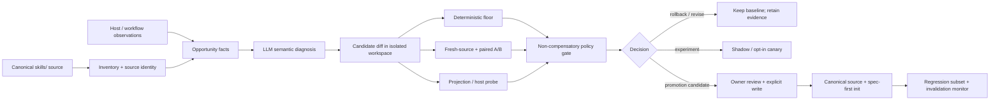

# Skill 自动观测、候选生成与受控进化闭环技术方案 - Plan

## Goal Capsule

| 维度 | 决策 |
| --- | --- |
| Objective | 建立一个能够持续观测 Skill 使用事实、发现可优化机会、生成候选 source diff、在隔离环境中完成确定性与语义评测、自动阻断回归并产生可审查 promotion candidate 的 Skill evolution loop。 |
| User value | 让 Skill 优化从一次性人工重构变成有证据、可回退、可持续重跑的维护能力；降低无效上下文、误触发、重复工具调用和纠正负担，同时守住授权、验证、source/runtime 与 handoff 边界。 |
| Recommended approach | 复用现有 `context-bundle.v1`、`verification-run-summary.v1`、`honest-closeout`、`spec-optimize` 的 measurement/experiment 资产、Skill validator、projection integrity 和 `getSupportedPlatforms()`；新增一个只面向 Skill 进化的 run-local controller 与窄记录合同，不新增中央运行时路由器或通用 Skill schema。 |
| Automation posture | 默认自动执行 observe、inventory、候选诊断、candidate 生成、sandbox A/B、硬门禁、回退预览和报告；canonical source 写入、宿主 runtime 投射、外部模型付费调用、默认行为推广和 field-outcome 声明仍由显式策略/owner 控制。 |
| Success | 连续运行能为每个候选留下 source identity、controlled variables、protected behavior、raw evidence、四轴证据、决策和 rollback ref；P0/P1、错误 mutation、错误 completion、source/runtime 越界能自动阻断；至少一个 pilot 在 observed primary objective 改善且总成本未吞收益时产生可审查 promotion candidate。 |
| Largest risk | 把代理指标或 LLM 自评当成真实收益，并让自动循环绕过 owner、直接改写 canonical source 或把 generated runtime 当作 source。 |
| Claim ceiling | 只有 `structure_contract` 能证明 source 结构与路径事实；`behavior_quality` 需要 fresh-source/paired evidence；`runtime_cost` 只有真实 usage 才能称 observed；`field_outcome` 需要真实任务与用户/业务结果。 |

## Product Contract

### Problem Frame

当前 Skill 体系的优化依赖人工阅读、人工挑选段落、人工运行回归和人工判断是否值得推广。该模式有三个结构性缺口：

1. **没有持续的事实层。** 只看到 source bytes、文件行数或一次运行结果，无法知道哪些 reference 实际被读取、哪些路径经常误触发、哪些 hard exit 被纠正。
2. **候选生成与验证耦合。** 大段人工重写容易同时改变语义、reference topology、触发条件和输出合同，失败时无法归因或局部回退。
3. **推广边界不稳定。** token 下降、文件变短、模型自评或 projection 通过都可能被误说成质量或用户效率改善。

本方案把自动化范围限定为一个**候选进化控制环**：它可以自动收集事实、提出候选、运行受控评测、阻断坏候选和生成 promotion candidate，但默认不自改 canonical source、不自动发布到用户宿主、不自动扩大权限。

### Requirements

#### Source identity and observation

- R1. 每次 run 必须绑定 canonical Skill root、source hash、inventory hash、host/model/config、corpus、rubric、预算、授权范围和 run id。
- R2. 观测事件必须带 provenance、freshness、source identity 和 limitation；不可观测项必须标记 `unavailable`、`not-run` 或 `degraded`，不得补写。
- R3. inventory、trace、projection 和 generated runtime 必须保持 source/runtime 分层；generated mirror 不能成为 candidate 或 source owner。

#### Candidate generation

- R4. candidate 只能写入隔离 workspace，必须有 before/after hash、exact write-set、Protected Behavior Map、treatment kind 和 rollback ref。
- R5. candidate generation 必须把每个改变的段落标记为 `keep`、`distill`、`move`、`script` 或 `delete`，并能回指具体行为、失败或决策影响。
- R6. candidate generation 不得读取 holdout expected outcome，不得声明 semantic pass、runtime loaded、field benefit 或 promotion。

#### Evaluation and promotion

- R7. deterministic floor 必须先于昂贵语义评测执行，并能阻断路径越界、断链、schema/frontmatter 错误、secret、eval 投射和 source/runtime 混淆。
- R8. comparative evaluation 至少区分 new-model old-skill、new-model candidate 和 strict new-model no-skill；模型升级 claim 另需 old-model arm，跨模型 claim 另需第二模型族/能力层。
- R9. promotion 采用安全与授权、正确性、兼容性、触发/留存、主要目标、净价值/TCO 的非补偿式顺序；前一层失败时不得由后续成本收益抵消。
- R10. `structure_contract`、`behavior_quality`、`runtime_cost` 和 `field_outcome` 必须分项记录，不能从一轴自动推导另一轴。
- R11. 没有 fresh-source、代表性 live host 或真实 usage 时，相关 claim 必须保持 `not-run`、`proxy` 或受限 scope；不得以 structural pass 冒充运行或现场证据。

#### Safety, rollout and learning

- R12. canonical source、generated runtime、外部模型调用、外部通信、commit/push/PR 和生产 mutation 必须分别受真实 owner 授权；自动 run 不扩大权限。
- R13. 任一 P0/P1、错误 mutation、错误 completion、错误 source/runtime claim 或关键 hard exit 漏失必须自动阻断并生成 rollback preview。
- R14. 每个 promotion candidate 必须绑定最小 regression subset、host/model/contract/consumer invalidation trigger、rollback source hash 和未验证范围。
- R15. feedback 只有在最小脱敏复现、expected behavior、source refs 和 eval-source mutation authorization 齐备后，才能进入 durable regression；否则保持 observation。

#### Observation and measurement admission

- R16. 每个可观测 event kind 必须登记真实 producer、输入格式、source identity 绑定、可观测范围和 fallback；没有 producer receipt 时只能标记 `not-observable`，不得宣称自动观测已启用。
- R17. 每次 comparative run 必须在 admission 阶段冻结 objective contract：objective owner、metric source、方向、baseline identity、A/A noise calibration、minimum meaningful effect、broken-run policy、budget、stop condition 和 threshold hash。
- R18. A/A calibration 未通过、样本不足或 primary metric source 不可回源时，不得进入 candidate A/B 或 promotion；只能返回 `blocked`、`not-run` 或 `experiment`。

#### Protected behavior and provider boundary

- R19. candidate 生成前必须存在 baseline Protected Behavior Map，且每个承重行为映射到 source carrier、contract assertion、semantic case 和 owner；没有 baseline map 时只能生成 `map-required`，不得生成 promotion candidate。
- R20. candidate 只能提出 Protected Behavior Map 的新增或定位变更建议；删除、降级或扩大 claim ceiling 的建议必须由独立 fresh-source reviewer 或 Project owner 裁决，并保留 before/after map。
- R21. 外部模型或第三方 provider 调用前必须生成并验证 egress receipt，包含 provider/model/endpoint、allowed paths、redaction、retention、预算、owner authorization 和实际返回身份；receipt 缺失或不匹配时阻断该 arm。
- R22. run record、objective contract、egress receipt、observation event 和 decision 必须由明确 writer/validator 维护；事件必须可幂等去重，raw evidence 必须有 retention、过期和 claim 降级规则。

### Goals

- G1. 为每次 Skill evolution run 固定 canonical source identity、host/model/config、授权范围、输入 corpus 和 candidate hash。
- G2. 自动收集可回源的 inventory、trigger、reference read/non-read、tool fan-out、验证和纠正事实；不可观测项显式记录 `unavailable` 或 `not_run`。
- G3. 自动把观测聚合为 advisory opportunity，不让脚本自行判断“这段语义可以删除”。
- G4. 自动生成可隔离、可比较、可回退的 candidate source diff，并保留每一段的 `keep`、`distill`、`move`、`script`、`delete` rationale。
- G5. 自动运行 deterministic floor、fresh-source semantic eval、paired A/B、holdout、长会话/重调用/compaction（可观察时）和 supported-host projection 检查。
- G6. 采用非补偿式 policy gate：安全与授权、正确性、兼容性、触发/留存任何一层失败，后续成本收益不得覆盖失败。
- G7. 自动生成 rollback preview、最小 regression subset 和 invalidation trigger，支持只回退当前 Skill slice。
- G8. 将 model gain、prompt gain、Skill marginal value 和 runtime/field outcome 分开记录。
- G9. 让自动循环能在缺少真实模型、live host、usage telemetry 或外部权限时诚实降级，而不是用 structural pass 填充缺失证据。
- G10. 在两个不同 archetype pilot 通过后，才把最小 authoring pattern 提升为默认治理建议；未通过时保留 experiment 或 `no-change-after-audit`。

### Non-goals

- NG1. 不创建中央 runtime Context Router、动态 system-prompt builder、embedding router 或宿主 loader 替代层。
- NG2. 不创建 universal Skill IR、per-skill lifecycle manifest、全局 Skill registry 或强状态机。
- NG3. 不让自动循环直接修改 `skills/` canonical source；默认只在临时 worktree/隔离目录生成 candidate。
- NG4. 不手改 `.claude/`、`.codex/`、`.agents/skills/`、`.cursor/`、`.kiro/`、`.qoder/`、`.opencode/` 等 generated runtime mirror。
- NG5. 不把 `bytes/lines/reference count` 换算成 confirmed token、延迟或用户效率。
- NG6. 不把 LLM judge、自检、候选与 baseline 持平或 projection pass 当成 field outcome。
- NG7. 不默认进行外部模型付费调用、真实 commit/push/PR、外部通信或生产 mutation。
- NG8. 不自动从失败 transcript 生成 regression case；必须先有最小可复现、expected behavior、脱敏和 eval-source mutation authorization。
- NG9. 不为每个宿主追求 feature parity；宿主 listing、invocation、compaction 和 retention 能力未知时保持 limitation。
- NG10. 不以单一综合分数自动决定 promotion；分项证据由 policy gate 准备，语义推广仍由 owner/明确策略裁决。

### Scope Boundaries

**In scope**

- Skill source inventory、运行事实采集、机会报告、隔离 candidate 生成、确定性验证、paired A/B、holdout、projection、policy gate、rollback preview 和 pilot closeout。
- `spec-code-review` 与 `spec-plan` 两个 pilot，以及 `using-spec-first` 或 `spec-work` preserve control。
- run-local artifacts、最小 regression subset 和 invalidation trigger。

**Out of scope**

- 修改宿主 loader、缓存、token accounting 或外部模型平台。
- 自动迁移全部 Skill、自动生成 shared reference registry 或自动改变 `skills-governance` universal schema。
- 自动 commit、push、创建 PR、部署、外部通信或生产回滚。
- 仅凭 source footprint、一次 demo、自检或模型名称声明用户效率、现场质量或跨宿主收益。

### Actors and Consumers

| Actor / consumer | 责任边界 |
| --- | --- |
| Evolution operator | 触发 run、选择 Skill/corpus/profile、提供 budget 和是否允许 candidate generation；不因运行启动而获得 canonical write 或外部通信授权。 |
| Inventory/trace scripts | 读取 source、hash、路径、日志和 machine-readable facts；不判断语义充分性。 |
| Candidate generator LLM | 依据 source、Protected Behavior Map、失败样例和 authoring guidance 生成候选 diff 与理由；不声明候选已通过。 |
| Fresh-source reviewer / judge | 判断 route、hard exit、输出、fallback、自由度和语义等价性；输出仍是 evidence，不等于 owner promotion。 |
| Evolution controller | 编排 run-local artifacts、隔离候选、测试、证据汇总、policy gate 和 rollback preview；不成为 Skill runtime router。 |
| Project owner / policy | 授权 canonical write、host rollout、外部成本、默认推广和 field claim。 |
| Host adapter | 提供实际 loader/invocation/retention/usage 事实；不能由 canonical Skill 猜测宿主能力。 |
| Downstream workflows | 消费 candidate report、verification summary、promotion candidate 或 regression subset；不消费运行时内部状态机。 |

## Planning Contract

### Key Technical Decisions

- **KTD1. 采用 run-local controller，而不是中央 runtime orchestrator。** Controller 只编排 inventory、candidate、evaluation、evidence 和 policy gate；Skill route、source ownership 和宿主加载仍由现有 owner 负责。
- **KTD2. 采用 source-first candidate promotion。** Candidate 可以在隔离 workspace 生成和评测；只有 explicit promotion 才能写 `skills/`，之后才允许由 `spec-first init` 投射 generated runtime。
- **KTD3. 采用“脚本准备事实，LLM 判断语义”的双层边界。** 脚本负责 hash、path、schema、trace 聚合、命令状态和 gate 比较；LLM/human 判断删除、迁移、等价性、风险和是否值得推广。
- **KTD4. 采用非补偿式 promotion。** 安全、授权、正确性和兼容性不能被 token、时延或维护成本改善抵消。
- **KTD5. 采用 treatment isolation。** semantic distillation、reference extraction、description change、model-arm 和 host projection 分开 hash、分开评测；一次 candidate 不混合无法归因的高风险变化。
- **KTD6. 采用 preserve control 与 no-change-after-audit。** 保持现有 Skill 不动是正式结果，自动循环不能为了产生 diff 而改写短、单路径或没有可证实收益的 Skill。

### Authority and Evidence Boundary

- canonical source：`skills/`、必要的 `src/cli/`、`tests/`、`docs/contracts/` 和 `docs/validation/`；generated runtime 只作投射和宿主观察面。
- deterministic owner：现有 Skill validator、plugin manifest/governance、context bundle、verification summary、projection integrity 和 test runner。
- semantic owner：candidate reviewer、fresh-source evaluator 和 Project owner；它们消费 source-backed evidence，不把 provider self-report 当 confirmed truth。
- external provider：只提供带 provenance/freshness/limitations 的 advisory 或 observed facts；不可调用时保留 `not_run`。
- promotion owner：当前任务的真实 source owner/Project owner；本方案不把 controller 的运行权限解释为 canonical write authorization。

### Admission Contracts

#### Observation capability matrix

自动循环将“可以导入事件”和“系统能够自动产生事件”分开记录。首期 capability matrix 至少覆盖：

| Event kind | Required producer | Producer receipt | 没有 producer 时的 fallback | 可支持的 claim |
| --- | --- | --- | --- | --- |
| `activation` / `trigger` | workflow/host invocation trace 或现有 route fixture runner | trace ref 或 fixture run identity | `not-observable`；只能做结构性 route audit | trigger structure |
| `reference_read` / `reference_skip` | host loader trace 或显式 context-bundle read log | host trace ref / bundle artifact hash | 不统计真实 read rate；只做 source reachability | source structure，不能称 lazy-loading observed |
| `tool_call` / `retry` | workflow execution log | verification/run artifact ref | 只记录 command-level facts，不推导模型选择质量 | command/runtime facts |
| `verification` / `completion_claim` | workflow-owned result artifact | `verification-run-summary` / closeout ref | `not-run` 或 `unavailable` | command evidence / claim ceiling |
| `correction` / `reopen` | confirmed user or workflow feedback | sanitized repro + expected behavior + source ref | observation only，不进入 regression | advisory feedback |
| `compaction` / `retention` | host retention probe | host-specific probe receipt | `not-observable` | 不得宣称 retention/compaction outcome |

U1 只能接收已登记 producer 的输入；manual observation 不得伪装成 host-observed。每个 run 的 `observation_capability` 必须列出 `available | unavailable | not-run`、producer identity、freshness 和 limitation。

#### Objective admission contract

每个 candidate run 在生成前冻结一个 run-local `objective.json`，最小字段为：

```json
{
  "objective_id": "review-hot-path-context-cost",
  "owner": "spec-code-review-maintainer",
  "primary_metric": {"name": "effective_context_tokens", "direction": "minimize", "source": "host_usage_receipt"},
  "baseline_identity": "<source-hash>:<corpus-hash>:<host>:<model>:<config>",
  "aa_calibration": {"attempts": 3, "noise_floor": null, "status": "not-run"},
  "minimum_meaningful_effect": null,
  "broken_run_policy": "exclude_with_reason_code",
  "budget": {"max_runs": 0, "max_wall_clock_seconds": 0, "max_provider_cost_usd": 0},
  "threshold_hash": "<sha256>",
  "status": "admission-pending"
}
```

`primary_metric.source` 必须可回源；真实 usage 不可得时可以继续做 source-structure experiment，但不能写 `observed_and_improved`。A/A 只用于校准噪声和运行稳定性，不是质量结论；A/A 未通过时禁止进入昂贵 A/B。

#### Protected Behavior Map admission

baseline map 必须在 candidate prompt 生成前冻结，至少包含 `behavior_id`、protected behavior、content class/freedom、before source carrier、contract assertion、semantic case、owner、failure cost 和 invalidation。candidate generator 只能输出 `map_delta_proposal`；不能删除 baseline behavior、把 hard exit 改成 optional，或用新 map 替代旧 map。map 变更与 candidate diff 分开 hash、分开评审。

#### External model egress receipt

当 candidate generator、judge 或 fresh-source runner 使用外部 provider 时，run-local workspace 必须先产生 `egress-receipt.json`。receipt 至少包含 provider、requested model、actual returned model（可得时）、endpoint、allowed repo-relative paths、redaction status、retention/deletion policy、cost/timeout budget、authorization ref 和 call status。receipt 与 candidate input manifest 不一致时，该 arm 为 `blocked`；本地 deterministic inventory 可以继续。

### Evidence and Limitations

- 当前工作树已有未提交变更；本计划只新增本计划文件，不把其他 dirty paths 当本任务证据或写集。
- 现有 contracts 已证明 context bundle、verification summary、validator、projection 和 optimize log 可复用；尚未证明它们已经提供每 Skill 的真实 usage、reference read、compaction 或 field outcome telemetry。
- 当前方案未运行外部模型、live host probe 或 candidate A/B；所有 runtime cost、behavior quality 和 field outcome 结论需在 U5-U8 重新取得。
- worker dispatch authorization 当前缺失；实施可先走单线程/隔离 runner，不得声明独立 reviewer coverage。

### Sequencing

```text
U0 → U1 → U2 → U3 → U4 → U5 → U6 → U7
                    ↘ U8 → U9
```

U0-U2 先建立事实与 scope；U3-U4 先验证候选和确定性底线；U5-U8 才运行语义/比较 pilot；U9 只在两个 archetype 共同通过后沉淀 authoring pattern。

## Architecture Decision

### Reuse / Extend / Compose / New

| Need | Posture | Existing owner | Decision |
| --- | --- | --- | --- |
| Skill inventory、frontmatter、reference topology | Reuse + extend | `skills/spec-write-skill/scripts/validate-skill.cjs`、`src/cli/plugin-manifest.js`、`src/cli/plugin-governance.js` | 扩展为只读 inventory/fingerprint 输出；不把 validator 变成语义 judge。 |
| Dynamic current context | Reuse | `src/cli/helpers/context-bundle.js`、`docs/contracts/context-bundle.md` | candidate/eval 只携带最小 source、diff、evidence paths；不新增第二套 context envelope。 |
| Command/test evidence | Reuse | `verification-run-summary.v1`、`honest-closeout` | 所有实际命令状态、日志、reason code 和 claim 引用沿用现有合同。 |
| Measured optimization loop | Compose + constrain | `skills/spec-optimize/` 的 optimize spec、experiment log、measurement calibration | 复用 baseline/A-A/A-B/experiment 持久化思路；Skill evolution 的 hard exits、protected behavior、host matrix 和 promotion gate 由本方案拥有。若现有 `spec-optimize` 无法表达完整 treatment arms，保持 `not promotable`，不旁路建设第二个通用 optimizer。 |
| Candidate write-set safety | Reuse | `skills/spec-write-skill/scripts/validate-authoring-preview.cjs`、authoring preview contract | candidate 仍使用 source snapshot、expected hash、containment 和 write-set binding；默认只写临时目录。 |
| Runtime projection | Reuse | `src/cli/plugin-sync.js`、`getSupportedPlatforms()`、projection tests | 只对隔离 candidate project 做 projection smoke；canonical runtime refresh 仍需要 explicit promotion。 |
| Evolution run record | New, narrow | 无现成 Skill-specific consumer | 新增 `docs/contracts/verification/skill-evolution-record.schema.json`、唯一 writer/reader 和 contract tests；只服务该 controller/closeout，不表达 Skill 内容 schema、lifecycle metadata 或 runtime 状态机。 |
| User-facing command | Defer / internal only | `src/cli/commands/internal.js` | 首期提供带 `--target-repo`、`--skill`、`--mode`、`--objective`、`--corpus`、`--budget`、`--provider` 和 `--json` 合同的 internal command；不增加 public workflow 入口，确认真实 consumer 后再决定是否暴露独立 skill。 |

### Core Design



### Automation Modes

| Mode | 自动动作 | 是否改 canonical source | 允许的 claim |
| --- | --- | --- | --- |
| `observe` | inventory、trace 汇总、机会检测、报告 | 否 | advisory facts、结构性问题线索 |
| `suggest` | LLM 生成 candidate diff、Protected Behavior Map 更新建议、回归用例建议 | 否 | candidate proposal，不代表语义通过 |
| `experiment` | 隔离 candidate、确定性检查、fresh-source、paired A/B、projection、holdout | 否 | 在当前 corpus/host/model scope 内的 comparative evidence |
| `shadow` | 在隔离临时项目或只读路径运行 candidate，收集 runtime/retention 事实 | 否 | observed runtime evidence，不能外推 field outcome |
| `promotion-candidate` | 生成 owner 可审查的 write-set、decision、rollback 和 rollout proposal | 否 | 满足 promotion gate 的候选，不是已发布 |
| `promote` | 仅在明确授权和 policy 允许时写 canonical source，再由 `spec-first init` 投射 | 是，受控 | 仅声明 source/runtime 已更新；用户价值 claim 仍需独立证据 |

默认调度策略是 `observe → suggest → experiment → promotion-candidate`。`promote` 不由普通定时任务自动进入；即便未来允许低风险自动 promote，也必须限定在已验证的 prose-only treatment、精确 write-set、原子 conditional patch 和可立即回退的范围内。

## Contracts and Artifacts

### Run-local Record

新增窄合同 `spec-first.skill-evolution-record.v1`，只作为 controller、reporter、policy gate 和 closeout 的交接 envelope。它不描述 Skill 内容、不取代 `SKILL.md`、不成为 runtime source。

合同的 ownership 必须固定，避免多个阶段各自拼装“看起来完整”的记录：

- **唯一 writer：** `src/cli/helpers/skill-evolution/run-record.cjs` 由 evolution controller 调用；其他 helper、CLI 输出和 LLM 只能提交 typed update，不能直接改写 `run.json`、`objective.json`、`egress-receipt.json` 或 `observations.jsonl`。
- **只读 readers：** opportunity reporter、candidate generator、eval runner、policy gate、rollout/invalidation 和 closeout 只能读取已验证的 record，并通过 `artifact_refs` 回源；它们不能把推断结果回写成 observation 或 objective fact。
- **唯一 validator：** `skill-evolution-record.schema.json` 加 deterministic admission/transition validator；schema 负责字段、枚举、引用和 hash 形状，validator 负责 source identity、objective/map/egress receipt 一致性、状态转移和 claim ceiling。LLM judge 不得充当 record validator。
- **冻结规则：** objective、baseline Protected Behavior Map、producer capability 和 egress receipt 在 admission 通过后不可原地修改；变化必须新建 run 或新版本 artifact，并保留旧 hash。run status 可以追加更新，但每次更新必须保留前一状态、reason code 和 evidence ref。

建议存放在：

```text
.spec-first/workflows/skill-evolution/<skill-id>/<run-id>/
├── run.json
├── objective.json
├── observation-capability.json
├── egress-receipt.json       # 仅使用外部 provider 时存在
├── observations.jsonl
├── source-inventory.json
├── protected-behavior-map.md
├── protected-behavior-map.before.sha256
├── candidate/
│   ├── source.diff
│   ├── candidate-manifest.json
│   └── projected-hosts/
├── eval/
│   ├── deterministic.json
│   ├── paired-ab.json
│   ├── holdout.json
│   └── raw/          # 脱敏后，按 retention policy 保存
├── verification-run-summary.json
├── decision.json
└── rollback-preview.md
```

`run.json` 最小字段：

```json
{
  "schema_version": "spec-first.skill-evolution-record.v1",
  "run_id": "skill-evolution-20260909-001",
  "skill_id": "spec-code-review",
  "mode": "experiment",
  "source_identity": {
    "repo_relative_root": "skills/spec-code-review",
    "source_hash": "<sha256>",
    "inventory_hash": "<sha256>",
    "generated_runtime_status": "not-touched"
  },
  "admission": {
    "objective_ref": "objective.json",
    "objective_hash": "<sha256>",
    "protected_behavior_map_status": "baseline-frozen",
    "protected_behavior_map_hash": "<sha256>",
    "observation_capability_ref": "observation-capability.json",
    "egress_receipt_ref": null,
    "egress_receipt_status": "not-required"
  },
  "observation_capability": {
    "status": "available",
    "artifact_ref": "observation-capability.json",
    "producer_ids": ["workflow-trace-v1"],
    "limitations": []
  },
  "treatment": {
    "kind": "semantic-distillation-and-reference-extraction",
    "candidate_hash": "<sha256>",
    "controlled_variables": ["host", "model", "reasoning", "tools", "corpus", "rubric"]
  },
  "evidence": {
    "structure_contract": "passed",
    "behavior_quality": "not-run",
    "runtime_cost": "proxy",
    "field_outcome": "unavailable"
  },
  "decision": "experiment",
  "claim_ceiling": "candidate source structure only",
  "artifact_refs": ["source-inventory.json", "verification-run-summary.json"]
}
```

`skill-evolution-record.v1` 的 required top-level fields 为 `schema_version`、`run_id`、`skill_id`、`mode`、`source_identity`、`admission`、`observation_capability`、`treatment`、`evidence`、`decision`、`claim_ceiling` 和 `artifact_refs`；`decision` 枚举至少包括 `blocked`、`not-run`、`map-required`、`experiment`、`revise`、`rollback`、`no-change-after-audit`、`promotion-candidate` 和 `promote`。`decision_history` 采用追加式记录，包含前值、后值、reason code、actor、时间和 evidence ref；它记录决策变化，但不把 controller 变成强制 workflow 状态机。

validator 必须拒绝以下情况：artifact ref 不存在或越界、hash 与被引用 artifact 不匹配、`egress_receipt_status=not-required` 却存在外部 provider arm、外部 arm 缺匹配 receipt、A/A 未通过却出现 A/B/sealed evidence、`decision=promote` 但任一 hard gate 未通过，或 claim ceiling 高于四轴 evidence 的最低状态。

约束：

- `decision` 是结果标签，不是强制 runtime 状态机；controller 可以重新运行、暂停或另建 run。
- `source_identity` 必须能回到 canonical source；candidate hash、objective hash、protected behavior map hash 与 raw output hash 不得省略。
- `generated_runtime_status` 只能来自真实 projection/inspect，不得由 candidate 生成器填写“已同步”。
- 没有真实 usage 时 `runtime_cost` 只能是 `proxy` 或 `unavailable`。
- `field_outcome` 默认 `unavailable`，不能从 A/B 或 judge 自动升级。
- `decision` 只有在 objective admission、baseline map 和适用的 egress receipt 均有效时才允许进入 candidate evaluation；否则为 `blocked`、`not-run` 或 `map-required`。

### Observation Event

`observations.jsonl` 采用追加式事件，每行至少包含：

| 字段 | 含义 |
| --- | --- |
| `observed_at` | 事件时间 |
| `source_hash` / `skill_id` | 绑定的 Skill source identity |
| `host` / `model` / `config` | 可得时记录；未知显式为 `unknown` |
| `event_kind` | `activation`、`reference_read`、`reference_skip`、`tool_call`、`verification`、`correction`、`reopen`、`completion_claim` 等 |
| `path_or_case` | repo-relative path 或 case id；敏感内容不直接写入 |
| `result` | `observed`、`failed`、`not-observable`、`redacted` |
| `provenance` | host trace、workflow artifact、test log 或 manual observation |
| `source_kind` | `host-observed`、`workflow-artifact` 或 `manual-observation`；不得互相伪装 |
| `limitations` | 采集缺口、采样、脱敏和时效限制 |

事件还必须包含 `event_id`、`producer_id`、`input_hash`、`source_hash` 和可选 `raw_ref`。`event_id` 默认由 producer、source identity、事件类型、观察时间桶和 input hash 规范化生成；重复导入同一 event 必须幂等，冲突事件保留两条并标记 `conflict`，不得静默覆盖。raw evidence 的 `retention_until` 到期后删除原文、保留脱敏 summary 和 hash；引用已过期 raw 的 claim 自动降级为 `unavailable` 或 `degraded`。

脚本可以产生事件，LLM 可以解释事件；事件本身不携带“可删除”“已改善”等语义结论。

### Candidate Manifest

candidate manifest 复用 authoring preview 的 snapshot/write-set 语义，并增加：

- `treatment_kind`：`delete-generic`、`distill-anchor`、`move-conditional`、`deterministic-handoff`、`description-revise` 等；
- `protected_behavior_map_ref`；
- `before_source_hash`、`after_candidate_hash`；
- `changed_paths`、`preserve_paths`、`generated_paths_not_touched`；
- `expected_primary_objective` 和预注册阈值；
- `rollback_ref`；
- `candidate_claim_ceiling`；
- `not_run` / `blocked` 原因。

它只描述候选和验证边界，不能作为 canonical source 的替代物。

## End-to-End Flow

### F1. Admission and baseline

**触发：** operator、定时任务或收到已确认的 feedback。

**步骤：**

1. 解析 target repo、Skill root、当前 dirty set 和 source owner。
2. 运行 inventory、frontmatter、reference topology、source hash 和 supported-host matrix。
3. 读取并冻结 baseline Protected Behavior Map；不存在、过期或无法回源时返回 `map-required`，不生成 candidate。
4. 解析并冻结 objective contract，运行 A/A calibration；metric source、baseline、noise floor、threshold 或 budget 不完整时返回 `blocked` / `not-run`。
5. 登记 observation capability matrix，确认每类事件的 producer receipt；没有 producer 时只标记 `not-observable`。
6. 冻结 model、host、tool roster、reasoning、corpus、rubric、预算、停止条件和 rollback 规则。
7. 若需要外部 provider，先生成并验证 egress receipt；缺少 owner authorization、allowed paths、redaction 或 retention 时阻断该 arm。
8. 缺少 source owner、目标 Skill、受控 corpus 或必要 runner 时返回 `blocked` / `not-run`，不生成 candidate。

**输出：** run record、source inventory、objective contract、baseline Protected Behavior Map、observation capability、适用的 egress receipt 和 admission decision。

### F2. Observation collection

**触发：** baseline、objective、Protected Behavior Map 和 observation capability admission 已通过；host/workflow 可提供已登记 producer 的 trace 或本地 artifact。

**自动事实：**

- description 是否被选中、should-trigger/should-not-trigger case 结果；
- reference 实际 read/non-read 和 fan-out；
- tool-call、重复搜索、重试和命令耗时；
- verification、completion、reopen、人工纠正和 rollback 记录；
- compaction/retention 观测（仅宿主可观察时）；
- model/host/config/source hash 和 evidence provenance。

**隐私边界：** 默认保存 path、case、hash、reason、统计和脱敏摘要；不保存完整 prompt、secret、用户内容或 raw provider dump。需要 raw output 时必须有 egress receipt 或本地 retention receipt，写入 run-local `raw/`，先过现有 secret-deny/脱敏检查，并记录 `retention_until`；到期后只保留 summary/hash。

### F3. Opportunity diagnosis

脚本先生成 advisory facts：

- 大段正文从未在代表性路径读取；
- 多个 reference 长期共同读取；
- 同一规则重复出现；
- route 近邻误触发或漏触发；
- correction/reopen 反复落在同一 hard exit；
- 确定性流程被重复 prose 化；
- new-model old-skill 与 no-skill 的项目特有差异变小。

LLM/reviewer 再判断：

- 该事实是否代表真实 decision cost；
- 是否属于同一 owning boundary；
- 是 `no-change-after-audit`、继续观测、candidate treatment 还是需要先补 eval；
- 是否会改变授权、输出、验证或 consumer。

禁止脚本根据“低频”“长文本”直接输出 `delete` 或 `promote`。

### F4. Candidate generation

candidate generator 只在 baseline map、objective admission 和适用的 egress receipt 均有效时接收：

- canonical source snapshot；
- source/runtime/authority contracts；
- frozen baseline Protected Behavior Map；
- opportunity facts 和已确认 failure；
- treatment-specific authoring guidance；
- development cases，不接收 holdout expected outcome。

生成顺序固定为：

1. `delete`：重复教学、历史叙事、模型稳定掌握且无项目特有边界的内容；
2. `distill`：合并重复 behavioral anchor；
3. `script`：将 deterministic path 改为既有 CLI/schema/tool handoff；
4. `move`：只把真正条件化的协议放入 package-local reference，并写明 trigger、fallback、owner、反向链接；
5. `keep`：authorization、hard exit、claim ceiling、exception、output contract、repo-specific gotcha。

每个改变的段落必须有 rationale、before/after carrier、protected behavior 影响和 ablation case。候选生成器不得直接写 canonical source，也不得直接删除或降级 baseline Protected Behavior Map 的条目；只能输出 `map_delta_proposal`。

### F5. Candidate sandbox and deterministic floor

controller 在临时 worktree 或 `0700` run-local workspace 构建 candidate：

- 检查 repo containment、symlink、path traversal、source/runtime boundary；
- 运行 `validate-skill.cjs`；
- 检查 reference link、frontmatter、description ceiling、eval exclusion 和 package inventory；
- 运行 focused contract tests；
- 运行 projection plan/inspect 到隔离项目；
- 记录每条命令的 `verification-run-summary`。

任何 path、hash、schema、projection、syntax 或 secret scan 失败都直接阻断，不进入昂贵语义评测。

### F6. Semantic and comparative evaluation

评测至少包含：

- positive、negative/near-neighbor、degraded、hard-exit、output compatibility；
- baseline/candidate fresh session paired A/B；
- candidate 不读取 holdout expected outcome；
- long-session、other-skill-interleaving、re-invocation、compaction（可观察时）；
- new-model + old-skill、new-model + candidate、strict new-model + no-skill；
- old-model + old-skill 仅在模型升级 claim 需要且可调用时运行；
- 至少一个代表性 live host；其余 host 记录 `not_run` 和理由。

自动 judge 只输出结构化评分与 evidence refs；关键 case 使用人工锚点校准。A/B 顺序交叉或随机化；无法固定随机性时按预注册重复次数运行并报告中位、分位、最坏分层。

### F6.1. Improvement decision protocol

每个 candidate 必须在运行前注册 `primary_metric`、方向、minimum meaningful effect（MME）、guardrail、样本量/重复次数、统计方法、broken-run policy 和 threshold hash。结果不得由“文件变短”“单次 demo”“模型自评”或单一综合分数决定。

对每个配对 case 计算候选相对 baseline 的差值；对于“越低越好”的指标使用 `(baseline - candidate) / baseline`，对于“越高越好”的指标使用 `(candidate - baseline) / baseline`。先用 A/A 结果估计噪声地板，再用预注册的 paired bootstrap 或等价方法给出区间和最坏分层。只有同时满足以下条件，primary objective 才能标记为 `observed_and_improved`：

1. A/A calibration 通过，且样本数、重复次数和 threshold hash 与 objective contract 一致；
2. 点估计达到或超过 MME，统计区间没有跨过预注册改善阈值；
3. `structure_contract`、`behavior_quality`、`runtime_cost` 和适用的 `field_outcome` 分别有与 claim 匹配的证据；
4. 所有非补偿式 guardrail 通过：P0/P1 为 0，protected behavior 100% mapped/reachable，无授权、输出、consumer、trigger、retention 或 source/runtime 回归；
5. correction burden、重试、tool fan-out、wall-clock 和 Governance TCO 没有抵消主要收益。

结果枚举固定为：

| 结果 | 判定条件 | 后续动作 |
| --- | --- | --- |
| `improved` | primary objective 达到 MME，guardrail 全通过，证据覆盖匹配 claim | 允许生成 `promotion-candidate` |
| `regressed` | 任一 P0/P1、hard-exit、授权、兼容性、trigger/retention 或 source/runtime 回归 | `rollback` 或 `revise`，不得由成本收益抵消 |
| `mixed` | 主要指标改善但 guardrail 或 TCO 恶化，或不同轴方向冲突 | `revise` / `experiment`，禁止 promotion |
| `inconclusive` | A/A 未通过、区间跨阈值、样本不足、broken run 过多或关键 evidence 缺失 | `blocked` / `not-run`，补校准或补采集 |
| `no-change-after-audit` | 达到样本与证据要求但未达到 MME，且没有 material regression | 保留 baseline，不为制造 diff 而继续改写 |

`runtime_cost=proxy` 只能支持 proxy/experiment 结论；没有真实 usage receipt 时不得标记 `observed_and_improved`。`field_outcome` 永远不能从 A/B 或 judge 自动升级。

### F7. Policy gate and decision

按以下顺序 fail closed：

| Gate | 必须满足 | 失败结果 |
| --- | --- | --- |
| Safety / authority | mutation、dispatch、external action、source/runtime、claim ceiling 均守边界 | `rollback` 或 `blocked` |
| Correctness | protected behavior 100% mapped/reachable；P0/P1 = 0 | `rollback` |
| Compatibility | output/artifact、downstream consumer、entry surface 和 projection 无 material regression | `revise` 或 `rollback` |
| Trigger / retention | trigger precision 不降；可观察 retention/compaction 无 hard regression | `revise` 或 `rollback` |
| Primary objective | 预注册主要目标有 observed improvement | `experiment` 或 `no-change-after-audit` |
| Net value / TCO | reference/tool fan-out、latency、纠正、维护和回退成本未吞掉收益 | `revise` 或 `experiment` |

Policy engine 只执行确定性比较、缺证据阻断和结果汇总；LLM/human 仍判断 protected behavior 是否语义充分、结果是否可推广。

### F8. Rollout and rollback

默认 rollout 顺序：

```text
candidate-only → isolated projection → shadow/read-only → opt-in canary → explicit promotion
```

每个 promoted slice 必须记录：

- baseline/candidate source hash；
- 最小 regression subset；
- host/model/contract/consumer invalidation trigger；
- rollback source diff 和 expected hash；
- runtime projection command 与 inspect evidence；
- claim ceiling 和未运行宿主。

canonical write 只能使用现有 authoring preview 的 exact write-set、expected-old-hash/expected-nonexistence 和原子 patch primitive；写后逐 path 核对 after hash。partial failure 只输出 rollback preview，不自动覆盖用户 dirty changes。

## Implementation Units

### U0. Freeze admission, inventory and source identity

**Goal:** 为自动循环建立不可伪造的 baseline 和 scope。

**Files:**

- `src/cli/helpers/skill-evolution/`（新增 deterministic helper owner）
- `src/cli/helpers/skill-evolution/run-record.cjs`（唯一 writer/reader adapter）
- `docs/contracts/verification/skill-evolution-record.schema.json`
- `src/cli/commands/internal.js`
- `skills/spec-write-skill/scripts/validate-skill.cjs`
- `src/cli/plugin-manifest.js`
- `src/cli/plugin-governance.js`
- `tests/unit/skill-evolution-admission.test.js`
- `tests/unit/skill-evolution-inventory.test.js`
- `tests/unit/skill-evolution-record-contract.test.js`

**Work:**

- 从 canonical `skills/` 发现 Skill，排除 tests/eval 临时目录和 generated runtime；
- 输出 package paths、bytes、lines、frontmatter、description、references、scripts、hash、entry surface、supported-host delivery；
- 捕获 dirty paths，拒绝覆盖未覆盖的 dirty source；
- 通过唯一 writer 生成 run-local `run.json`、`objective.json`、`source-inventory.json`、`protected-behavior-map.before.sha256` 和适用的 `egress-receipt.json`；
- 用 schema/validator 校验 writer 输出、artifact refs、hash 绑定和 admission 状态；reader 只能消费通过 validator 的记录；
- 对 objective、baseline map、producer capability 和 egress receipt 执行 admission：缺 owner、metric source、A/A calibration、threshold、map、producer receipt 或授权时分别返回 `objective_admission_failed`、`map_required`、`producer_unavailable` 或 `egress_not_authorized`；
- 将 external provider/model 状态分为 advertised、callable、behavior-observed，不从 enum 推导 availability。

**Acceptance:** 35/35（或当时 inventory 的全部）canonical Skill 可回源；runtime mirror 不被误标 source；fixture/test 目录不进入正式 inventory；缺少 target/owner/corpus 时 fail closed；`skill-evolution-record.schema.json`、唯一 writer、reader 和 validator 有合同测试；objective、baseline map、capability matrix 和（适用外部 provider 时）egress receipt 缺一不可时不能进入 A/B；A/A 未通过时只能输出 `blocked` / `not-run`，不得创建可推广的 candidate evaluation。

**Stop if:** 需要改变 `skills-governance` 的 universal schema、将 generated runtime 当 source，或无法绑定 source hash。

### U1. Add run-local observation and trace ingestion

**Goal:** 将 host/workflow 事实转成可审查的 observation events。

**Files:**

- `src/cli/helpers/skill-evolution/observation.cjs`
- `src/cli/helpers/skill-evolution/producer-receipt.cjs`
- `src/cli/helpers/skill-evolution/redaction.cjs`
- `src/cli/commands/internal.js`
- `tests/unit/skill-evolution-observation.test.js`
- `tests/fixtures/skill-evolution/`（置于 `skills/` 外）

**Work:**

- 支持显式 trace input、verification summary、workflow artifact 和 manual observation 的分层导入；
- 只接收 capability matrix 中已登记 producer 的 receipt；receipt 必须绑定 producer identity、source identity、时间窗、输入格式、freshness、采样和 limitation；
- 为每条事件绑定 `event_id`、`producer_id`、`input_hash`、source/host/model/config/provenance，并区分 `host-observed`、`workflow-artifact`、`manual-observation`；
- 复用 secret-deny/redaction 能力，拒绝未脱敏 raw log；
- 将不可观测、采样、超时、provider unavailable 记录为 limitation；
- 使用 append-only JSONL，运行中断后可恢复，不覆盖已有事件；按 producer/source/event kind/time bucket/input hash 幂等去重，冲突保留两条并标记 `conflict`；
- 为 raw evidence 写入 `retention_until`、删除策略和 `raw_ref`，到期后仅保留脱敏 summary/hash，过期 raw 被引用时自动降级 claim。

**Acceptance:** 每种 event kind 都有 producer receipt 输入合同；重复导入保持幂等，冲突可回源且不静默覆盖；`host-observed`、`workflow-artifact`、`manual-observation` 不可互相伪装；过期 raw 会使相关 claim 变为 `degraded` / `unavailable`；跨 chunk secret 能被拒绝；缺 host telemetry 时不伪造 `retention_observed`；只读 observation 不修改 source。

**Stop if:** 需要长期保存完整 prompt/provider dump，或事件无法携带 source identity 和 provenance。

### U2. Build deterministic opportunity reporter

**Goal:** 从 observation 生成候选机会事实，不做语义删除决策。

**Files:**

- `src/cli/helpers/skill-evolution/opportunities.cjs`
- `tests/unit/skill-evolution-opportunities.test.js`
- `docs/contracts/workflows/skill-agent-quality-governance.md`（仅补 owner/claim 边界）

**Work:**

- 计算 reference read rate、共同 fan-out、route hit/miss、tool retry、correction/reopen 聚合；
- 在聚合前校验 objective ref/hash、Protected Behavior Map ref/hash、source identity 和 observation freshness；缺任一项只输出 `blocked`、`map-required` 或 `not-run`，不输出机会结论；
- 生成带 reason code、sample size、freshness、source refs 的 advisory report；
- 识别需要 LLM/human 判断的语义问题并标记 `semantic_review_required`；
- 支持 `no-change-after-audit` 作为正式输出。

**Acceptance:** reporter 不输出 `delete`、`promote` 或 `quality_improved` 语义结论；bytes/lines 不转换成 confirmed tokens；objective/map/source identity 缺失、样本不足、source hash 不一致和 stale evidence 都有确定性 reason code；过期 raw 不得继续支撑 observed claim。

### U3. Generate isolated candidates with protected behavior map

**Goal:** 自动提出可归因、可回退的 candidate source diff。

**Files:**

- `src/cli/helpers/skill-evolution/candidate.cjs`
- `skills/spec-write-skill/references/authoring-method.md`
- `skills/spec-write-skill/references/evaluation-design.md`
- `tests/unit/skill-evolution-candidate.test.js`
- `tests/fixtures/skill-evolution/candidates/`

**Work:**

- 构造 candidate prompt：source snapshot、contracts、Protected Behavior Map、advisory facts、development cases；
- 没有冻结 baseline map 时只输出 `map-required`；objective admission 或 egress receipt 不通过时只输出 `blocked`，不调用 candidate provider；
- 将每个变更分类为 keep/distill/move/script/delete；
- 生成 source diff、candidate manifest、before/after carrier 和 ablation proposal；`candidate.diff_hash`、`map_delta_proposal.hash` 与 baseline map hash 分开计算、分开审查；
- `map_delta_proposal` 只能提出新增、定位或 owner 变更建议；删除、降级或扩大 claim ceiling 必须由独立 fresh-source reviewer/Project owner 裁决，并不能作为 candidate 自证；
- 使用临时 workspace，禁止直接写 canonical path；
- 将 holdout expected outcomes 与 candidate generation 输入隔离。

**Acceptance:** 每个 changed path 可绑定 rationale 和 protected behavior；候选 manifest 有 before/after hash、write-set、rollback ref；candidate diff 与 map delta 有独立 hash、独立 review 状态；缺 baseline map 时结果严格为 `map-required`；生成器不能声明 semantic pass、runtime loaded 或 field benefit。

**Stop if:** 候选需要新增 universal schema、跨 Skill hidden shared reference、或无法生成最小 rollback。

### U4. Run deterministic floor and projection checks

**Goal:** 低成本阻断坏 candidate，避免语义评测浪费成本。

**Files:**

- `src/cli/helpers/skill-evolution/evaluate.cjs`
- `src/cli/plugin-sync.js`
- `skills/spec-write-skill/scripts/validate-skill.cjs`
- `tests/unit/skill-evolution-deterministic.test.js`
- `tests/unit/plugin-modules.test.js`
- `tests/unit/host-runtime-projection-contracts.test.js`

**Work:**

- 运行 package validator、path/reachability、frontmatter、syntax、secret、eval exclusion 和 focused contracts；
- 在隔离临时项目运行 source-first projection/inspect；
- 生成 `verification-run-summary.v1`；
- 将 source_projected、host_loaded、lazy_loading_observed 分开记录；
- 任何 deterministic failure 直接进入 rollback/revise，不进入 expensive semantic arm。

**Acceptance:** route map/reference 缺失、canonical path 泄漏、eval 被投射、generated runtime source 被写、hash mismatch 均能阻断；projection pass 不会写成 lazy-load pass。

### U5. Compose semantic, comparative and retention evaluation

**Goal:** 在同一控制变量下证明 candidate 的行为和成本变化。

**Files:**

- `src/cli/helpers/skill-evolution/eval-runner.cjs`
- `skills/spec-optimize/references/experiment-log-schema.yaml`（复用记录原则，不修改通用 schema 除非有独立 consumer）
- `skills/spec-write-skill/references/evaluation-design.md`
- `tests/unit/skill-evolution-eval-runner.test.js`
- `tests/integration/skill-evolution-pilot.integration.test.js`
- `docs/validation/` 下的 pilot result artifact（执行时生成）

**Work:**

- 运行 new-model old-skill、new-model candidate、strict no-skill，必要时补 old-model old-skill 和第二模型族；
- 固定 corpus、授权、tools、reasoning、host/config、rubric 和 candidate/source hashes；
- 实现 development/holdout/sealed 分离；候选升级高风险策略时冻结 winner/threshold 后再跑 sealed；
- 将 objective contract、A/A calibration、minimum meaningful effect、broken-run policy、budget、stop condition 和 threshold hash 写入每个 arm；A/A 未通过或 threshold 未冻结时不得启动 A/B/sealed；
- 记录 trigger、outcome、cost、retention 四轴以及 correction burden、fan-out 和 TCO；
- 输出每个 case 的 paired delta、A/A noise floor、置信区间、最坏分层、MME 比较、guardrail 状态和最终结果枚举；
- 自动 judge 先用人工锚点校准，输出 raw evidence refs 和不确定性；
- 外部 provider arm 必须匹配已验证的 egress receipt；receipt 缺失、过期、路径/脱敏/预算不匹配时该 arm 为 `blocked`，其余本地 deterministic arm 可以继续；
- 不可用真实模型或外部付费授权时记录 `not_run`，不得以 proxy closeout。

**Acceptance:** 关键 case 有 baseline/candidate 对照；A/A 通过且 threshold hash 冻结后才进入 A/B；每个 case 有 paired delta、噪声地板、区间、MME 和 guardrail 结果；`improved`、`regressed`、`mixed`、`inconclusive`、`no-change-after-audit` 可由 record 重建；holdout 不进入 candidate prompt；顺序偏差和随机性有预注册处理；外部 arm 的 receipt、provider/model returned identity、retention 和 budget 可回源；model gain/prompt gain/Skill marginal value 可分别解释；缺证据的 arm 明确为 `blocked` / `not-run`。

### U6. Implement non-compensatory policy gate and rollback preview

**Goal:** 自动阻断不可接受 candidate，并生成可审查的下一步。

**Files:**

- `src/cli/helpers/skill-evolution/policy.cjs`
- `src/cli/helpers/skill-evolution/rollback.cjs`
- `src/cli/helpers/honest-closeout.js`
- `tests/unit/skill-evolution-policy.test.js`
- `tests/unit/skill-evolution-rollback.test.js`

**Work:**

- 固化 safety → correctness → compatibility → trigger/retention → objective → net-value 顺序；
- 对缺 evidence、P0/P1、错误 mutation/completion/source-runtime claim fail closed；固定 reason code 至少包括 `objective_admission_failed`、`aa_calibration_failed`、`threshold_unfrozen`、`map_required`、`map_delta_unreviewed`、`egress_not_authorized`、`producer_unavailable`、`raw_evidence_expired` 和 `claim_ceiling_exceeded`；
- policy gate 只读取 validator 已确认的 record，不接受 transcript 声明或 LLM 自评作为 gate input；
- 生成 `promote | revise | rollback | experiment | no-change-after-audit | blocked`；
- 生成 expected hash、changed/unchanged paths、恢复命令和最小 regression subset；
- 与 `honest-closeout` 对接，禁止将 not-run 变成 passed。

**Acceptance:** token/proxy improvement 不能覆盖 hard regression；objective admission、A/A、threshold、baseline map 或 egress receipt 任一失败都不能得到 `promote`；partial failure 不自动删除用户 dirty changes；每个 decision 都能由 schema-valid record、source、test、log 和 reason code 回源。

### U7. Add shadow/canary and invalidation monitor

**Goal:** 让通过 pilot 的 candidate 在真实可观察宿主上以低影响方式积累 runtime evidence。

**Files:**

- `src/cli/helpers/skill-evolution/rollout.cjs`
- `src/cli/helpers/skill-evolution/invalidation.cjs`
- `tests/integration/skill-evolution-rollout.integration.test.js`
- `tests/unit/skill-evolution-invalidation.test.js`
- `docs/contracts/workflows/skill-agent-quality-governance.md`（仅补 promotion/invalidation 边界）

**Work:**

- 支持 isolated projection、shadow/read-only 和 opt-in canary；默认不改变用户 runtime；
- 每个 shadow/canary 必须绑定 producer identity、producer receipt、egress receipt（如适用）、retention policy、source/candidate hash 和 stop condition；缺 receipt 时只能运行不依赖该证据的 read-only path；
- 根据 host/model/contract/consumer/source topology 变化计算最小 regression subset；
- 记录 workflow_convention、host_enforced、retention_observed、compaction_observed 的差异；
- 对未观察宿主保留 `not_run`，不外推。

**Acceptance:** canary 不能执行 commit/push/外部通信；shadow/canary 的 producer、receipt、retention 和 stop condition 可回源；invalidation 能使过期 promotion 降级为需要重验；host loader 变化不会静默继续旧 claim。

### U8. Pilot `spec-code-review` 与 `spec-plan`

**Goal:** 用两个不同 archetype 验证自动循环，而非凭结构设计推广。

**Files:**

- `skills/spec-code-review/evals/`
- `skills/spec-plan/evals/`
- `tests/unit/spec-code-review-contracts.test.js`
- `tests/unit/spec-plan-contracts.test.js`
- `tests/unit/spec-plan-quality-contracts.test.js`
- `tests/unit/spec-plan-consumer-replay-contracts.test.js`
- `docs/validation/` 下新增 pilot result artifacts

**Work:**

- `spec-code-review` 保护 report-only、mutation authorization、dispatch/degraded、finding/output、verification-required 和 honest limitation；
- `spec-plan` 保护 WHAT/HOW、artifact readiness、research boundary、plan depth、verification、handoff 和 consumer replay；
- 两个 pilot 都先做 semantic distillation，再做 reference extraction；
- 用 `using-spec-first` 或 `spec-work` 作为 preserve control；
- 每个 pilot 先通过 baseline map、objective admission、A/A calibration、egress boundary 和四轴 evidence completeness，再独立得出 promote/revise/rollback/no-change-after-audit；任一 admission 缺失只能 closeout 为 `blocked` / `not-run`。

**Acceptance:** 两个 pilot 各有 source hash、冻结 baseline Protected Behavior Map、objective/threshold hash、producer capability receipt、适用的 egress receipt、paired A/B、fresh-source、projection、四轴证据和 rollback evidence；至少一个代表性 live host 完成 fresh-session 对照；没有 observed primary-objective improvement 时不推广默认 pattern；任何缺失都在 closeout 中保留 reason code。

### U9. Promote only the proven authoring pattern

**Goal:** 将两个 pilot 共同验证的最小机制写入 authoring/governance，而不是复制 pilot 特例。

**Files:**

- `skills/spec-write-skill/references/authoring-method.md`
- `skills/spec-write-skill/references/evaluation-design.md`
- `docs/contracts/workflows/skill-agent-quality-governance.md`
- `README.md` / `README.zh-CN.md`（仅用户可见行为发生变化时）
- `CHANGELOG.md`

**Work:**

- 写入 observe/suggest/experiment/promotion-candidate 的边界；
- 写入五问萃取、Protected Behavior Map、非补偿式门禁和 invalidation 最小规则；
- 明确 `no-change-after-audit`、`not_run`、`proxy` 和 `field_outcome` 的 claim ceiling；
- 生成后续 Wave 2 候选，但不在本单元迁移剩余 Skill；
- 将 promotion pattern 的最小 regression subset 与 host/model/contract/consumer trigger 绑定。

**Stop if:** 只能证明结构/可维护性，无法证明 primary objective；第二模型族或能力层未完成且文档想声明 cross-model pattern；治理规则开始复制某个 pilot 的私有字段。

## Evaluation and Verification Contract

### Deterministic floor

必须可机械验证：

- source/candidate/inventory hash 和 repo-relative containment；
- dirty path ownership、expected-old-hash、write-set 和 symlink 防护；
- Skill frontmatter、description ceiling、reference link、package inventory；
- eval/fixture 不进入 canonical runtime projection；
- supported-host matrix 来自 `getSupportedPlatforms()`；
- verification 命令的真实 exit code、log ref、status、reason code；
- raw evidence 的 secret scan/redaction；
- candidate 生成未写 canonical source；
- `skill-evolution-record.v1` 的唯一 writer、reader、validator、状态转移和引用 hash；
- objective/map/capability/egress admission、A/A 和 threshold freeze；
- observation event 幂等、冲突保留、raw retention 和过期 claim 降级；
- hard gate fail 时 decision 不得为 `promote`。

### Semantic verification

LLM/human 必须判断：

- trigger/non-trigger 是否覆盖真实相邻路径；
- hard exit、authority、fallback、done signal 是否仍然可达；
- 删除/压缩是否丢失 repo-specific truth；
- reference trigger 是否具体、可达、在动作前发生；
- 自由度是否与任务脆弱度匹配；
- output/artifact/consumer 是否保持语义兼容；
- correction burden/TCO 是否抵消 source/runtime 优势；
- candidate 是否仍相对 strict no-skill 保留项目特有边际价值。

### Evidence axes

| Axis | 可证明内容 | 不能证明 |
| --- | --- | --- |
| `structure_contract` | source shape、hash、链接、projection、脚本和合同 | 语义充分、用户更快 |
| `behavior_quality` | 当前 fresh-source、paired corpus 和 host/model scope 内无 material regression | 所有模型、所有宿主、生产质量 |
| `runtime_cost` | 真实 telemetry 下的 token、tool-call、wall-clock、cache 或 TCO | 现场效率，除非有 field task |
| `field_outcome` | 真实任务中的纠正、重跑、交付效率或业务结果 | 可从一次 demo 或模型自评推导 |

### Promotion thresholds

- Protected behavior 100% mapped/reachable。
- P0/P1 regression = 0。
- 错误 mutation、错误 completion、错误 source/runtime claim = 0。
- 每个迁出 reference 至少一个 positive trigger、一个 non-trigger；高风险 reference 有 conservative fallback。
- focused、projection、applicable integration tests 通过。
- 至少一个代表性 live host 完成 fresh-session paired A/B；其余 host 明确 `not_run`。
- fresh-source status 为 `passed` 才能进入 promotion candidate；`not_run` 只能保持 experiment/degraded。
- 预注册 primary objective 为 `observed_and_improved`；只有 proxy 时不能 promotion 为默认模式。
- correction burden、reference/tool fan-out、wall-clock 和 Governance TCO 未吞掉收益。
- new-model candidate 相对 new-model old-skill 达到预注册目标，且相对 strict no-skill 仍有 repo-specific correctness/safety/evidence/artifact 边际价值。
- cross-model authoring claim 需要第二模型族/能力层最小回归；否则保留 model-scoped limitation。

## Failure Modes and Recovery

| Failure | Detection | Recovery |
| --- | --- | --- |
| source hash 在 run 中变化 | admission/late hash check | 停止 candidate，重建 baseline，不覆盖新改动 |
| dirty path 未授权 | write-set/ownership check | `blocked`，输出具体 path，不自动 stash/reset |
| candidate 断链或投射不完整 | validator/projection test | 不进入语义评测；保留 candidate diff，标 `revise` |
| LLM 删除 hard exit | Protected Behavior Map + adversarial case | `rollback`；恢复最短有效 anchor，不恢复无关教学 prose |
| reference fan-out 增加 wall-clock | trace/TCO | `revise` 或 `no-change-after-audit` |
| judge 与人工锚点不一致 | calibration check | 暂停 promotion，重新校准 rubric 或改为 human review |
| host 不可观察 | capability probe/trace absence | `not_run`；收缩 claim，不伪造 retention/field evidence |
| no-skill arm 不纯 | treatment manifest review | 该对照无效，重跑或撤销 Skill marginal value claim |
| 外部模型调用超预算/超时 | budget/timeout | 终止该 arm，保留 partial evidence，不把未完成当失败质量结论 |
| runtime projection 失败 | init/inspect evidence | 保持 canonical source 不变，修复 projection 或回退 candidate |
| candidate 通过但 field correction 增加 | canary feedback/reopen | 自动降级 promotion、回退 candidate，保留 post-mortem |
| model/host/contract 变化 | invalidation trigger | 只重跑受影响的 regression subset，冻结旧 claim |

## Security, Privacy and Cost Boundaries

- 默认只读 canonical source；候选生成使用临时目录和最小 path scope。
- 外部模型调用必须显式选择 provider/model、数据范围、预算、超时、脱敏和 retention；不能从“自动运行”推导外部通信授权。
- raw prompt/output 不是默认持久 artifact；默认存 hash、case id、路径和脱敏摘要。
- run-local artifacts 位于 `.spec-first/workflows/skill-evolution/**`，普通 context 默认排除；需要读取时通过 `context-bundle.v1` 精确列出。
- 任何向 canonical source 的写入必须绑定 expected hash、exact write-set 和当前授权；不支持原子 conditional patch 时保持 `not-ready`。
- 自动 loop 必须有 max runs、max wall-clock、max provider cost、max candidate files 和 stop-on-regression；达到预算只产生 `degraded/not-run`，不延长预算自行继续。
- 不允许 candidate 脚本执行来源不明的 package code、外部 shell、commit/push/deploy 或 secrets 读取。

## Rollout Waves

### Wave 0 — Contract and observation only

- U0-U2。
- 只输出 inventory、observations、opportunity report。
- 不生成 canonical diff，不调用外部模型也能完成结构性 baseline。

### Wave 1 — Candidate and deterministic sandbox

- U3-U4。
- 只允许 `delete-generic`、`distill-anchor`、`deterministic-handoff` 三种低风险 treatment。
- 所有 candidate 只在临时 workspace 运行；未通过 deterministic floor 不消耗 semantic eval 预算。

### Wave 2 — Two archetype comparative pilots

- U5-U8。
- 先 `spec-code-review`，再 `spec-plan`；共享 governance/projection 文件串行修改。
- 至少一个 live host；其他 host 保持 not_run。
- 任一 pilot 出现 P0/P1 或 hard-exit regression，独立回退，不阻塞另一 pilot 的 baseline 归档。

### Wave 3 — Controlled promotion

- U9。
- 只有两个 pilot 都通过 outcome gate，且第二模型族/能力层最小回归满足时，才推广 authoring pattern。
- 后续 Skill wave 仍需单独生成 task pack 和 acceptance，不由本方案自动迁移。

## Dependencies and Sequencing

```text
U0 → U1 → U2 → U3 → U4 → U5 → U6 → U7
                    ↘ U8 → U9
```

- U0/U1/U2 必须先完成，因为没有 source identity、provenance 和 opportunity facts，candidate 不能安全生成。
- U3 与 U4 可以在不同 Skill fixture 上并行开发，但 shared `spec-write-skill`、projection 和 governance 文件必须串行落地。
- U5 依赖真实 runner、受控 model/host 或明确的 `not_run`；不能用测试 fixture代替 live claim。
- U7 依赖至少一个可观察 host；没有 retention/loader observation 时只保留 shadow/source claims。
- U9 依赖 U6 的两个 pilot outcome，不允许提前把 pilot prose 写入通用治理。

## Definition of Done

- [ ] U0-U2 生成可回源的 inventory、observation 和 opportunity artifacts，且不修改 canonical source。
- [ ] `skill-evolution-record.v1` schema、唯一 writer、只读 readers、validator 和 contract tests 已落地；run-local record 不允许多 helper 直接写入或静默覆盖。
- [ ] objective.json、baseline Protected Behavior Map、producer capability matrix 和适用的 egress receipt 在 admission 阶段冻结；A/A 未通过或 threshold 未冻结不得进入 A/B。
- [ ] U3 candidate 生成具备 source hash、Protected Behavior Map、write-set、rollback 和 holdout 隔离。
- [ ] observation event 具备 event_id、producer receipt、幂等/冲突处理、retention_until 和过期 claim 降级规则；host-observed、workflow-artifact、manual-observation 可区分。
- [ ] U4 deterministic floor 能阻断断链、path 越界、projection 不完整、secret 和 source/runtime 混淆。
- [ ] U5 的 objective/A-A/threshold 合同、development/holdout/sealed 边界、model arms、egress receipts、host limitations 和四轴 evidence 可审查；不完整 external arm 为 `blocked`。
- [ ] U5 能按预注册 MME、A/A 噪声、统计区间和非补偿式 guardrail 区分 `improved`、`regressed`、`mixed`、`inconclusive` 与 `no-change-after-audit`；结果可由 run record 和 evidence refs 重建。
- [ ] U6 的非补偿式 policy gate 能以固定 reason code 在 hard regression、admission 失败、map 未审查或 egress 未授权时阻断 promotion，并生成 rollback preview。
- [ ] U7 的 shadow/canary 绑定 producer/receipt/retention，不写用户 runtime、不执行外部副作用，invalidation 能降级过期 claim。
- [ ] `spec-code-review` 和 `spec-plan` 各完成一套 Protected Behavior Map、paired A/B、fresh-source、projection 和 closeout。
- [ ] 两个 pilot 只有在 baseline map、objective admission、egress boundary 和四轴证据齐备后才能 closeout；否则保留 `blocked` / `not-run`，不得冒充 negative 或 success。
- [ ] 至少一个代表性 live host 有 fresh-session paired evidence；未运行宿主明确 `not_run`。
- [ ] 只有 observed primary-objective improvement 且 correction burden/TCO 未吞收益时，才产生 promotion candidate。
- [ ] 两个 pilot 通过前没有新增 universal Skill schema、中央 router、runtime truth source 或自动全量迁移。
- [ ] source/runtime、CHANGELOG、必要 docs、tests/evals 与 validation artifacts 按实际改动同步；generated mirror 只由 `spec-first init` 生成。

## Implementation-time Unknowns

- 当前可获取的 Claude/Codex/Gemini/Kiro 等宿主 trace 是否包含 per-Skill reference read、compaction 和 retention；若不包含，哪些字段只能保持 `not_run`。
- 外部模型 runner 是否能在不外发敏感 repo 内容的条件下提供 fresh-source、paired A/B 和 model-arm 对照。
- 当前 `spec-optimize` experiment log 是否足以表达 Skill-specific treatment/holdout；若不足，是否只在 evolution controller 中添加窄 envelope，而不扩展通用 optimizer。
- `spec-first internal` 是否应长期承载该 helper，还是在 pilot 后由真实 consumer 证明需要独立 public workflow。
- 低风险 prose-only candidate 是否存在足够可回退的原子 patch primitive，使未来可评估有限自动 promote；本计划不预先假设存在。

## Sources and Evidence Boundary

- `docs/plans/2026-07-30-002-refactor-skill-system-progressive-disclosure-plan.md`：渐进披露、两个 pilot、四轴 evidence、非补偿式门禁和 source/runtime 边界。
- `docs/contracts/context-bundle.md`：最小充分 context、path-backed evidence、degraded bundle 和 generated/runtime exclusion。
- `docs/contracts/workflows/skill-agent-quality-governance.md`：Skill minimum contract、high-risk execution boundary、script/LLM ownership。
- `docs/contracts/verification/verification-run-summary.md`：实际命令状态、日志、reason code 和 not-run 边界。
- `skills/spec-write-skill/references/evaluation-design.md`：Protected Behavior Map、fresh-source、model-family adaptation 和 comparative evidence。
- `skills/spec-write-skill/references/optimization-and-lifecycle.md`：measured optimization handoff、baseline、treatment、rollback/invalidation 和不可 promotion 边界。
- `skills/spec-write-skill/references/authoring-workbench.md` / `delivery-gates.md`：preview、write-set、原子 patch、validator 与五轴 readiness。
- `skills/spec-optimize/references/experiment-log-schema.yaml`：实验记录、measurement calibration、A/A/A-B 和 resume 资产；仅作为复用输入，不自动提升为 Skill evolution 的完整质量合同。
- `src/cli/plugin-sync.js`、`src/cli/plugin-governance.js`、`src/cli/plugin-manifest.js`：source-first projection、host delivery 和 supported platform owner。
- `scripts/lint-skill-entrypoints.js`、`skills/spec-write-skill/scripts/validate-skill.cjs`：现有 deterministic inventory、入口和 package validator。

本方案是技术设计与实施边界，不是运行结果。完成方案不等于已经运行 observation、模型评测、live host probe、canonical promotion 或 field outcome；这些必须由后续 `spec-work` 和真实 evidence closeout 产生。
