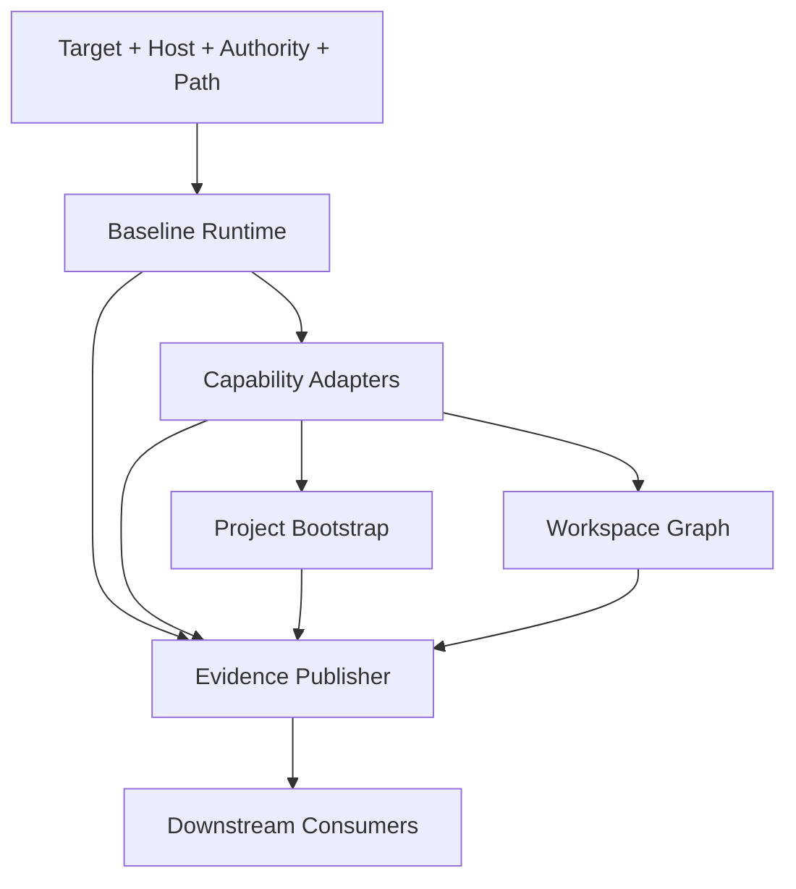

> **2026-09-20 契约勘误：** FSA2 F-16/F-17 后，bare 已恢复为 registry baseline 自主收敛；只读诊断使用 `--check`，`--plan` 只读预览，`--verify-only` 可写 setup-owned facts。以下 Goal/KTD2/U1/U4 已按当前 source 校正，旧“bare 只读”决定失效。其余单元不因此整体作废，保留 `status: active` / `implementation_status: partial-with-evidence`；此改动只修计划，不宣称本轮重新执行 setup。

## Goal Capsule

- **目标：** 在保留 spec-first 跨宿主 runtime 能力的前提下，修复 `spec-runtime-setup` 的契约漂移，降低无需求用户的 setup 成本，并把 Provider、workspace graph 和证据状态拆成可维护、可验证的边界。
- **推荐方案：** 统一入口不变，内部按 L0-L5 分层；先修 P1 的事实与阻断策略，再做 P2 的模块化和 freshness，最后补 P3 的真实宿主与故障恢复验证。
- **决策焦点：** 保留 bare baseline 自主收敛与 `--check` 只读诊断的区分；按需阻断与 Provider 分层必须连同真实 consumer 一起落地。CE 采用配置安全、可选工具、失效提示和诊断表达机制；保留本地固定 artifact 路径，不引入 CE 配置命名空间或执行引擎。
- **验证焦点：** 每项 readiness 必须能追溯到 source、host、provider、artifact 和 freshness 证据；缺能力时只能降级或阻断受影响 scope，不能把局部成功写成完整 setup。
- **最大边界：** 不把 CE 的轻量健康检查机械复制到 spec-first，也不把 setup 扩展成语义判断、业务策略或完整交付编排系统。

## Product Contract

### Problem Frame

CE `ce-setup` 是轻量健康检查与 repo-local 配置修复器，负责插件版本、可选工具、`.compound-engineering` 配置、`docs_root`、legacy config 和 gitignore。当前本地 `spec-runtime-setup` 已扩展为跨宿主 runtime 控制面，增加 registry、host authority、MCP 配置、CodeGraph/Graphify Provider、workspace graph、setup facts 和证据发布。这种扩展符合 spec-first 的跨宿主定位，但当前存在 bare 文案与实现不一致、registry required 与 demand 不一致、schema v9/v10 metadata 漂移，以及安装 readiness 与 artifact currentness 混合的问题。

### Requirements

#### Contract correctness

- R1. bare invocation 的用户可见契约必须与实现一致，并明确是否只读诊断或执行 plan、确认、apply、verify 的完整 setup。
- R2. `setup-registry` 的 schema version、`$id`、title、引用文档和测试元数据必须保持同一版本。
- R3. 每个 setup 结果必须分别表达依赖、host 配置、Provider 安装、artifact 和 freshness；consumer usability 由下游根据当前任务判断，禁止由单个 `setup complete` 推断全部成立。

#### Demand-aware readiness

- R4. `always-required`、`workflow-required` 和 `advisory` 能力必须有明确的 registry 表达和统一判定函数。
- R5. `gh`、`ffmpeg`、`agent-browser`、`ast-grep` 等能力只有在需求命中或显式选择时才阻断对应 scope；未命中需求时保留 unavailable/degraded 事实。
- R6. CodeGraph/Graphify 的 package/host readiness 与 artifact generation/currentness 必须可分别完成和消费。

#### Layered runtime architecture

- R7. Runtime Setup 必须按 target/authority、baseline、capability adapter、project bootstrap、workspace graph、evidence publisher 分层，层间只通过 machine-readable facts 连接。
- R8. workspace graph 必须保持显式高级 capability，不得成为普通单仓 setup 的隐含构建任务。
- R9. Provider、workspace graph 和 host integration 不得复制业务语义、替代 LLM 判断或建立第二份 durable truth。

#### Reproducibility and evidence

- R10. required dependency 的安装必须可复现，记录 resolved version、source、installer 和可验证的 hash/digest；`latest` 只能出现在显式升级路径或兼容性允许的 advisory 能力中。
- R11. setup facts 和 provider receipts 必须带 source snapshot、registry/host/provider identity、生成时间和失效条件，并可确定性降级为 `unknown`、`stale` 或 `degraded`。
- R12. 下游 consumer 必须按 status、reason_code、scope、freshness 和 limitations 消费 facts，不得只按 artifact 文件存在判断 readiness。

#### Verification and operations

- R13. 所有 feature-bearing unit 必须有针对性测试，覆盖成功、真实失败、降级、回滚、无 Git folder、路径不安全和并发/中断场景。
- R14. 支持的宿主必须通过隔离 HOME/config 的 smoke 验证；Windows、offline/mirror、全局 package collision 和中断恢复必须有明确结果或已记录限制。
- R15. 每次 source 变更必须同步必要文档、schema、测试和 CHANGELOG；generated runtime 只通过 `spec-first init` 更新。
- R16. CE 机制按真实 consumer 采纳；已有配置治理优先完善，禁止无人读取的配置、隐式 CE namespace 和全局 artifact-root 迁移。
- R17. setup 的 producer、normalizer、doctor 和核心 skill 消费路径必须联调；脚本读取、prose 约定与未实现声明分别记录，不以注册名单代替集成证据。

### Scope Boundaries

- **包含：** `skills/spec-runtime-setup/` 的 source、registry/schema、contracts、测试、用户文档和必要的 runtime generation 影响评估；包含 U11/U12 明确列出的下游读取段和 CLI facts normalizer，不扩大为相关 skill 全文重构。
- **不包含：** CE 全量能力复制、业务项目配置迁移、语义代码理解、Graphify 图内容正确性的自动裁决、完整 CI/CD 或发布编排。
- **保留的 CE 边界：** CE 的 compounding/noslop directive 继续由 `AGENTS.md`、角色契约和各 skill owner 承担；setup 只记录 legacy signal，不自动迁移旧配置。
- **兼容策略：** 保留现有 CLI 入口和已发布 JSON 字段；新增状态字段只向后兼容扩展，旧 artifact 缺少新 freshness 字段时返回 `unknown`，不伪造 `ready`。

## Planning Contract

### Evidence & Limitations

- CE source evidence：CE 仓库中的 `skills/ce-setup/SKILL.md` 定义轻量 health check、artifact root、逐项 repo-local remediation 和 optional tool posture；`skills/ce-setup/scripts/check-health` 实际只做诊断和配置事实读取。
- Local source evidence：`skills/spec-runtime-setup/SKILL.md`、`scripts/setup.cjs`、`scripts/lib/mode-policy.cjs`、`scripts/lib/runtime-executor.cjs`、`setup-registry.json`、`setup-registry.schema.json`、providers 和 workspace lib。
- 历史漂移（2026-09-11，当时只读实现已被后续修复取代）：`SKILL.md:170-178` 描述 bare 走 plan/确认/apply，而 `mode-policy.cjs:5-10` 与 `setup.cjs:542-547` 将 bare 作为 read-only diagnostic；现有 `tests/unit/mcp-setup-mode-target.test.js` 和 `tests/unit/mcp-setup-entrypoint.test.js` 支持当前只读实现。
- 已确认 registry 问题：`setup-registry.json:893-905` 将 `gh` 标为 `required` 和 `baseline_blocking`，但只声明 GitHub workflow 需求；`setup-registry.json:1110-1122` 将没有 `required_for` 的 `ffmpeg` 标为 baseline blocker；`runtime-executor.cjs:296-319` 对 baseline-blocking 条目执行全局阻断。
- 已确认 schema metadata 漂移：`setup-registry.json` 为 `setup-registry.v10`，但 `setup-registry.schema.json:3-4` 和 `references/supported-mcp-tools.md:3` 仍写 v9，部分测试标题也写 v9。
- 当前工作树在计划生成前存在其他未提交 skill 改动；本计划只描述 `spec-runtime-setup` owning source，不吸收其他 skill 的变更。
- 未执行真实 Windows、跨宿主隔离 HOME、offline/mirror、SIGINT 恢复和 field outcome 验证；这些进入 P3 验证单元。

### Key Technical Decisions

- KTD1. **统一入口，分层内部 owner。** 保留 `spec-runtime-setup` 作为 public entrypoint；通过内部模块边界拆分 L0-L5，不新增第二个公开 setup 产品。这样保留 CE 的可发现性和 spec-first 的跨宿主能力，同时避免 `setup.cjs` 继续吸收所有领域逻辑。
- KTD2. **Bare baseline 与只读入口分离。** 以当前 `skills/spec-runtime-setup/SKILL.md`、`scripts/lib/mode-policy.cjs` 和 `scripts/setup.cjs` 为准：bare 按 registry baseline 安装/验证 required 能力并刷新 setup-owned facts；`--check` 与 `--plan` 只读，`--verify-only` 仅 facts mutation。写入必须具有显式 host authority，并通过路径、冲突与验证检查；不自动追加 `--repair-host-config` / `--project-config`。禁止按旧计划把 bare 回退为只读或另造 `--full` 入口。
- KTD3. **Demand-aware blocking。** 将阻断条件定义为 `always_required || demand_matched || explicit_selection`。未命中需求的 helper/provider 保留 `missing/degraded` 事实，但不阻断无关 workflow；显式 `--only` 仍表示用户选择了该 capability scope。
- KTD4. **安装与 artifact 两级 readiness。** Provider package/launcher/host integration 是 installation readiness；首次生成、query probe、refresh、hook steady state 是 artifact/currentness readiness。普通 setup 默认验证安装和 host 接线，按需 capability 才生成图或刷新图。
- KTD5. **证据状态四维化。** 机器结果分别维护 dependency、configuration、artifact、freshness；`consumer_usable` 由下游结合任务 scope 判断，setup 不宣称语义充分。
- KTD6. **Registry 是唯一配置事实源。** setup-owned required/demand/profile/safety/version policy 进入 `setup-registry.json`；schema 和 generated projections 消费 registry；各 skill 的配置值验证、fallback、业务决策仍由 consumer owner 管理。不得将所有 workflow 配置集中到 setup registry。
- KTD7. **Workspace graph 保持高级域。** workspace manifest、child graph、merge、lease、hook、clean、status 继续由独立内部 capability owner 承担；普通单仓路径不加载其构建逻辑，不自动发现或构建多仓图。
- KTD8. **可复现优先于 latest 便利。** required dependency 固定版本；advisory capability 可保留 latest，但结果必须记录 resolved identity，升级必须由显式 refresh 或升级动作触发。
- KTD9. **Source-first。** 只改 `skills/spec-runtime-setup/`、`docs/contracts/`、`docs/`、`tests/` 等 source；不手改 `.claude/`、`.codex/`、`.agents/skills/` 等 generated runtime，必要时通过 `spec-first init` 重新生成并验证 drift。

### Target Architecture



- **L0 Resolver：** 解析 repo/folder/workspace、host、platform、authority、config target、containment 和 runtime projection target。
- **L1 Baseline Runtime：** 只管理真正 always-required 的 Node/npm/npx、宿主基础接线和 registry/schema 可用性。
- **L2 Capability Adapters：** 管理 gh、ffmpeg、agent-browser、ast-grep、CodeGraph、Graphify 的安装、版本、host integration 和按需 probe。
- **L3 Project Bootstrap：** 管理 `.spec-first/config*`、gitignore、legacy signal 和 setup-owned project facts。
- **L4 Workspace Graph：** 管理显式 workspace build/status/clean、child artifacts、merge、hook、lease 和恢复。
- **L5 Evidence Publisher：** 发布 facts、receipts、fingerprints、status、reason_code、scope、freshness 和 limitations；不判断语义正确性。

### Compatibility And Migration

- U2 的 metadata 修复不改变 v10 数据结构；后续 U3 的语义扩展另行版本化，旧 v10 保持兼容读取。
- 旧 facts/receipts 缺少新字段时保留读取兼容，状态降为 `unknown`；不重写历史 artifact 以制造 freshness。
- `bare` 的当前只读行为保持兼容，改动只收敛文案和 help；完整 setup 使用显式 plan/apply 或现有 subset flags。
- U2 仅纠正 v10 metadata。U3 改变阻断语义时升级 registry 契约版本并同步 loader/schema/fixtures；为已知 entry ID 编写显式迁移表及审查理由，不从 `required_for` 为空推断核心能力。兼容读取未知旧条目时保留旧阻断语义并报告 migration warning，不静默降为 advisory；当前 canonical registry 全量迁移，不允许新条目继续写旧字段。旧版本读取器保留到单独批准的 breaking migration，不能在本批次擅自删除。
- `latest` 到 pinned dependency 的切换先覆盖 required dependency；advisory helper 的 pin 作为后续小批次，避免一次迁移扩大供应链风险。


### CE 机制采纳与下游交付（本次修订的核心）

本计划以使用中的磁盘 source 为基线：本地 HEAD `b8bc700a`、CE HEAD `25468408`，不把 HEAD 当作 dirty 文件的精确快照。实施前重新记录 owning paths 的 diff/hash。下述“必须”指本地所需机制，不表示必须重新实现已有能力。目标是缩短后续 skill 获得可信输入的时间，不以产物或模块数量衡量价值。

| CE 机制 | 本地裁决 | 本地 owner 与实际收益 | 单元 |
|---|---|---|---|
| optional tools 不阻断无关 workflow，不批量安装所有工具 | 必须采用，扩展为按请求 scope 判定 | baseline policy 与能力消费者；缺 gh 不影响本地规划，发布流程自行检查 gh/auth | U3 |
| config example、local override、ignore 保护与配置层来源 | 必须保留并完善已有实现 | `project-config.cjs`；用户偏好可持久化，缺配置继续使用默认值 | U11 |
| 配置只服务真实 consumer；注释不是设置；非法值按 owner 规则处理 | 必须落实闭环 | `LOCAL_CONFIG_CONSUMERS` 与各 workflow reader；消除无人读取的配置 | U11 |
| artifact root 唯一归属、路径 containment、无静默双读双写 | 必须保留安全原则；本批次不引入 `docs_root` | 本地 `spec-plan/references/output-mode.md` 明确保留 `docs/plans/` 与 `docs/solutions/` | U11 |
| legacy key/config 诊断、针对性修复、重复执行无额外破坏 | 必须采用已有机制并验证 | setup 仅报旧配置 signal；当前 owner 决定迁移，不复制 CE key | U11 |
| 分组 health report、可选缺失提示、具体 next action | 必须采用呈现原则 | renderer 消费机器结果，不能拥有第二套 readiness 判定 | U1/U3/U12 |
| CE work engine、model elevation、auto babysit、compounding/noslop 指令 | 不作为 setup 配置迁入 | 宿主及对应 work/review/landing/knowledge owner 负责；需要时单独评估 | 不实施 |
| CE tracked config 全集和可配置 artifact root | 暂缓 | 无全消费者迁移需求；保持当前固定路径与 local-only config，避免创建第二套配置体系 | 不实施 |

**源码依据：** CE `skills/ce-setup/SKILL.md`、`scripts/check-health`、`references/config-template.yaml`（以上均相对 CE 仓库）；本地 `skills/spec-runtime-setup/scripts/lib/project-config.cjs`、`references/config-template.yaml`、`scripts/lib/facts.cjs`、`src/cli/helpers/setup-facts.js`、`src/cli/commands/doctor.js`、`docs/contracts/project-graph-consumption.md` 及下表 consumer references。CE 只读对照；不修改其仓库。

### 产物与读取闭环

| 产物 | 当前证据与接入状态 | 后续 skill 所需信息与边界 |
|---|---|---|
| `tool-facts.v2` / `runtime-capabilities.v1` | facts 模块产出；`setup-facts.js` 与 doctor 有确定性读取；registry 的 skill consumers 是声明，需逐个核实 | 按当前 target/host 读取能力、时间、失败原因；不能把 setup overall ready 当任务可完成 |
| `provider-readiness.v2`（嵌入 tool facts） | project-graph contract 已规定读取流程；不能由注册名单推断每个 skill 已执行 | graph 类能力按 scope 与 freshness 选择；unknown 时 direct source fallback；安装成功不等于 query 或图语义正确 |
| `.spec-first/config.local.yaml` 与 example | `LOCAL_CONFIG_CONSUMERS` 已区分脚本 reader 和 prose/native-read | plan/brainstorm/ideate 渲染偏好；verification profile 本地路径；sweep/pulse/promote 自有配置，验证与授权由各 owner 负责 |
| host config、readiness ledger、runtime manifest | host runtime / doctor / setup 管理与读取 | 提供 host 可用性与修复线索；generated runtime 由 init 管理，不向所有 skill 注入完整 ledger |
| scenario fingerprint、parent setup/verify summary | scenario helper、parent diagnostic；work strategy 有 advisory 消费约定 | 只在已有且当前任务相关时读取；不为普通任务新建 fingerprint，不将拓扑识别当授权 |
| `.codegraph/codegraph.db`、`graphify-out/graph.json`、scope receipt | Provider/native API、scope verifier 与 workspace status 消费 | 导航候选通过原生查询进入上下文；不整图注入，不转为 confirmed knowledge |
| workspace state、lease、async status、quarantine/backup | workspace lifecycle、status、clean 的内部恢复产物 | 普通 skill 只接收有范围的状态摘要；不消费锁/备份内部格式，不触发刷新 |
| stdout health report / preview | 用户和当前 workflow 解释结果 | 不解析 human summary 代替 JSON；next action 是建议，不是执行授权 |

**不得把所有产物纳入每次 skill 上下文。** 采用“任务相关时读最小事实，必要时按引用回源”的方式，复用现有 facts normalizer 和 project-graph contract，不新增中央流程引擎或第三份聚合 facts 文件。

### 核心 consumer 接入矩阵

| Consumer | 触发点 | 必需读取与 fallback | 可验证的实际效果 |
|---|---|---|---|
| `using-spec-first` | 环境问题或相关能力路由 | host/target、具体缺口与结构化 next action；缺 facts 不阻断普通需求路由 | 不因未安装 optional graph 将所有任务导向 setup |
| `spec-plan` / `spec-brainstorm` / `spec-ideate` | 输出格式解析；确需项目导航时 | 各自 active local key 与默认值；图 facts 只按需读取 | 注释/非法配置不改变输出；无图仍能基于源码形成方案 |
| `spec-work` | 验证策略与任务所需工具选择 | verification profile loader、当前工具 probe；已有 scenario facts 仅 advisory | setup 不替代项目测试配置；测试未运行不能完成任务 |
| `spec-debug` / `spec-code-review` | 需要外部导航或环境证据时 | provider scope/freshness/reason；缺失转 direct source/test/log | 导航不可用不伪造 root cause 或审查通过 |
| `spec-rule-miner` | 用户要求规则挖掘时 | 候选导航后回源确认 | setup 可推荐但不自动写规则；规则由 miner owner 输出 |
| `spec-test-browser` / `spec-dogfood` | 实际浏览器操作前 | 安装事实只是线索，仍检查当前 exact-origin/runtime 能力及授权 | CLI 已安装但 origin 不可执行时不报告浏览器通过 |
| `spec-commit-push-pr` / `spec-lfg` | 发布相关步骤 | 当前 gh、auth、repo/remote/PR scope 与任务授权 | setup 中 gh ready 不等于可推送或已有 PR 权限 |
| `spec-sweep` / `spec-product-pulse` / `spec-promote` | 对应 workflow 自己启动 | 只读各自配置块，凭据/外发权限单独判断 | setup 不生成业务策略，不触发外部数据访问或消息发送 |

其中 consumer_usable 是 LLM/consumer 针对当前任务的判断；不新增全局 `consumer_usable=true`，也不新增含糊的 `consumer_constraints` 字段。本批次优先复用 scope、reason、limitations；确需新增字段时必须列出 reader、validator、旧版降级和测试。

## Implementation Units

### U1. 修复 bare invocation 契约

- **Goal：** 让入口文案、help、mode policy、测试和实际副作用保持一致。
- **Files：** `skills/spec-runtime-setup/SKILL.md`、`skills/spec-runtime-setup/scripts/lib/mode-policy.cjs`（仅补充契约注释或兼容字段时）、`skills/spec-runtime-setup/scripts/setup.cjs`、`tests/unit/mcp-setup-mode-target.test.js`、`tests/unit/mcp-setup-entrypoint.test.js`、`tests/unit/runtime-setup-readiness-guidance.test.js`。
- **Pattern：** 复用当前 bare baseline、`--check`、`--plan`、`--verify-only` 路径；不新增隐式 confirmation 状态机。
- **Test scenarios：**
  - `--check` / `--plan` 在 Git repo 中只读；bare 仅在显式 host authority 与 guard 通过后收敛 baseline，检查安装、host-config 和 facts 各自的真实副作用。
  - 非 Git folder 保留 folder target 边界；只读模式不写入，bare 不因缺 Git 绕过 host/path/conflict guard，也不执行 Git-only mutation。
  - help、SKILL 和 human summary 明确 bare 为 baseline convergence、`--check` 为 diagnostic、`--plan` 为 preview、`--verify-only` 为 facts-only mutation。
  - host config conflict 在 bare 中只报告，不自动 repair；显式 repair 路径仍保留原授权边界。
- **Verification：** 运行入口、mode-target、facts renderer 和 runtime guidance 契约测试；检查 generated runtime drift。

### U2. 统一 registry schema metadata

- **Goal：** 消除 v9/v10 metadata 漂移，避免外部 consumer 误识别 registry。
- **Files：** `skills/spec-runtime-setup/setup-registry.schema.json`、`skills/spec-runtime-setup/references/supported-mcp-tools.md`、`tests/unit/mcp-setup-node-contracts.test.js`、`tests/unit/mcp-setup-config-consumers.test.js`、新增 `tests/unit/runtime-setup-registry-metadata.test.js`。
- **Pattern：** 以 `setup-registry.json:schema_version` 为 source；schema `$id`、title、文档和测试标题统一 v10。
- **Test scenarios：**
  - registry version、schema const、schema `$id`、title 和文档版本完全一致。
  - schema validator 仍接受当前 registry，拒绝错误版本。
  - 外部引用只看到 v10，不残留 v9 metadata。
- **Verification：** registry/schema validation、consumer tests、`npm run typecheck`、`npm run lint:skill-entrypoints`。

### U3. 引入 demand-aware readiness policy

- **Goal：** 让 required、baseline blocking、workflow demand 和 explicit selection 语义一致。
- **Files：** `skills/spec-runtime-setup/setup-registry.json`、`skills/spec-runtime-setup/setup-registry.schema.json`、`skills/spec-runtime-setup/scripts/lib/baseline-policy.cjs`、`skills/spec-runtime-setup/scripts/lib/preflight.cjs`、`skills/spec-runtime-setup/scripts/lib/runtime-executor.cjs`、相关 `mcp-setup-*` tests。
- **Pattern：** registry 增加或规范化 `always_required`、`required_for`、`recommended_for`、`demand_signals`；由单一 predicate 计算 `blocking`，不要在 renderer/provider 各自复制。Demand signal 只接受确定性输入，按优先级使用显式 CLI 选择、结构化 workflow/profile 参数和 registry 静态 scope 与本次显式输入的匹配结果（条目声明自己服务某 workflow 不等于本次命中）；未提供结构化 signal 时不得从自然语言或 LLM 输出自动推断，返回 `not_requested` 或 `advisory`。结果必须记录 `demand_source`、`matched_rule` 和对应 `reason_code`。
- **Test scenarios：**
  - 无 GitHub/PR 需求时缺少 gh 不阻断基础 setup，但 facts 记录 optional unavailable。
  - 视频 workflow demand 命中时缺少 ffmpeg 返回 action-required。
  - ast-grep 缺失时保持 rg fallback，并且不把 fallback 表述成 ast-grep ready。
  - `--only gh` 或等价显式选择时，即使无自动 demand 也只对选定 scope 阻断。
  - 多仓 batch 中一个 child 的 optional 缺失不污染其他 child 的 baseline 状态。
- **Verification：** baseline policy 单测、preflight renderer、entrypoint integration；对现有 required provider 行为做兼容回归。

### U4. 分离 Provider installation 与 artifact/currentness

- **Goal：** 避免普通 setup 为无消费者项目支付图生成和 query 成本。
- **Files：** `skills/spec-runtime-setup/scripts/providers/codegraph.cjs`、`skills/spec-runtime-setup/scripts/providers/graphify.cjs`、`skills/spec-runtime-setup/scripts/lib/runtime-executor.cjs`、`skills/spec-runtime-setup/scripts/lib/provider-display.cjs`、`skills/spec-runtime-setup/SKILL.md`、相关 provider/entrypoint tests。
- **Pattern：** 复用现有 provider plan/apply/verify/refresh；新增 readiness scope 或等价结构区分 `installation` 与 `artifact`，不新增平行 Provider 状态机。
- **Test scenarios：**
  - package/launcher/version/host integration 成功但 artifact 未生成时返回 installation ready、artifact unknown。
  - 显式 Graphify first generation 生成非空图并完成 query probe 时，artifact/currentness 才可标记 fresh。
  - query probe 失败保留现有 artifact，返回 degraded/actionable，不删除已有图。
  - `--refresh` 只更新现有图，仍保留 protected artifact backup 和 scope receipt。
  - 普通 setup 不触发 first generation；首次构图、query 和 refresh 的 CLI/help/facts/退出码行为与行为矩阵一致。
  - provider 输出仍标为 advisory/provider_untrusted，不被 setup 升级成语义 confirmed。
  - 行为矩阵固定为：`--check` 只读探测且不构图；bare baseline 按 registry 收敛安装、host 接线与 setup-owned facts；显式 graph capability 才构图/query；`--refresh` 只更新既有 artifact 并刷新 freshness。旧默认行为若不保留，必须在 CHANGELOG 和迁移说明中标记。
- **Verification：** provider unit tests、entrypoint integration、artifact integrity tests；补一条“普通 setup 不触发 first generation”的调用断言。

### U5. 重构 setup orchestrator 为 L0-L5 thin glue

- **Goal：** 减少 `setup.cjs` 的跨域控制流，让模块边界可独立测试和替换。
- **Files：** `skills/spec-runtime-setup/scripts/setup.cjs`、`scripts/lib/runtime-executor.cjs`、`scripts/lib/project-target.cjs`、`scripts/lib/host-authority.cjs`、`scripts/lib/installation-executor.cjs`、`scripts/lib/evidence-publisher.cjs`（如现有 facts owner 无法承载则新增；优先复用 `facts.cjs`）、`scripts/lib/workspace-*`。
- **Pattern：** 优先 `compose / thin-glue`：`setup.cjs` 只负责选择 action plan、调用已有 owner、合并结果和退出码；不把业务规则复制到 orchestrator。
- **Test scenarios：**
  - 每层输入输出可独立构造，失败 reason_code 原样传播。
  - L0 path/authority 失败不会触发 L1-L5 mutation。
  - L2 provider failure 不改写 L1 baseline success。
  - L4 workspace failure 不污染单仓 L3 facts。
  - L5 发布失败不会伪造 apply success，并保留原始 action result。
- **Verification：** 模块 contract tests、entrypoint tests、coverage of failure propagation；不以文件数量或拆分数量作为完成标准。

### U6. 将 workspace graph 设为显式高级 capability

- **Goal：** 隔离多仓图生命周期，控制普通 setup 的复杂度和运行成本。
- **Files：** `skills/spec-runtime-setup/scripts/lib/workspace-*.cjs`、`scripts/lib/mode-policy.cjs`、`scripts/setup.cjs`、`skills/spec-runtime-setup/SKILL.md`、workspace graph tests。
- **Pattern：** 保留 `--workspace-graph`、`--workspace-graph-status`、`--workspace-graph-clean`；默认单仓路径只做 bounded discovery，不自动 build/merge。
- **Test scenarios：**
  - 单仓 bare/check 不加载 workspace build，不创建 workspace state。
  - parent workspace 只有在显式 action 和 confirmed repo set 下 build。
  - 自动发现只作为 candidate，重复 alias、嵌套 root、超出 scope 时阻断。
  - lifecycle lock、lease、cleanup pending、SIGINT 后恢复保持原子状态。
  - 最大 repo 数、总超时和取消策略在超限时返回结构化 reason_code。
- **Verification：** workspace build/status/clean/async-refresh suites；隔离临时 workspace 做并发和恢复测试。

### U7. 固化依赖版本与 provenance

- **Goal：** 让 required runtime setup 可复现并可审计。
- **Files：** `skills/spec-runtime-setup/setup-registry.json`、`setup-registry.schema.json`、`scripts/lib/installation-executor.cjs`、`scripts/lib/configured-dependencies.cjs`、`scripts/lib/facts.cjs`、references 和 dependency tests。
- **Pattern：** required dependency 采用 pinned version；每次 probe/install 记录 resolved version、source、installer、digest/identity；latest 仅保留为显式 refresh 或 advisory path。
- **Test scenarios：**
  - registry 中 required dependency 没有 `latest` 安装命令或明确 exception。
  - resolved version 与 pin 不一致时返回 version mismatch。
  - offline/mirror 下失败输出 source、mirror、retry/next action，不伪造 ready。
  - 重跑 setup 不因相同 pinned identity 重复破坏 host config。
- **Verification：** registry schema、installation executor、offline fixture 和 package collision tests。

### U8. 增强 freshness 与 consumer-liveness

- **Goal：** 防止 stale/unknown facts 被长期误消费。
- **Files：** `skills/spec-runtime-setup/scripts/lib/facts.cjs`、`provider-display.cjs`、`preflight.cjs`、`workspace-graph-status.cjs`、`docs/contracts/verification/` 相关 schema、新增 freshness/consumer tests。
- **Pattern：** freshness 由 source snapshot、registry hash、host config hash、provider identity、artifact receipt 和 TTL 共同计算；消费者读取 status/reason_code/scope/limitations。
- **Test scenarios：**
  - source HEAD、registry、host config、provider version 任一变化使 freshness 降级。
  - TTL 过期返回 stale，不返回 ready。
  - 缺少旧 receipt 字段返回 unknown，并保留 limitation。
  - artifact 存在但 source snapshot 不匹配时不可作为 current。
  - 仅对声明消费 setup facts 的 registry consumer 执行 contract-level 检查，并按 capability scope 定义最小必读字段；不要求所有 consumer 读取全部字段。未纳入 registry 的外部 consumer 只提供 advisory lint。
- **Verification：** facts schema、consumer contract tests、静态 linter；确认 Graphify/CodeGraph 输出仍是 advisory。

### U9. 补跨宿主、故障和供应链验证

- **Goal：** 把高风险 runtime 行为从静态契约提升为可复现实验。
- **Files：** `tests/integration/`、`tests/smoke/`、`skills/spec-runtime-setup/evals/`、必要的 fixture scripts 和验证报告。
- **Pattern：** 使用临时 HOME、临时 host config、临时 repo/folder 和固定 launcher stub；不污染用户 runtime，不依赖当前会话缓存。
- **Test scenarios：**
  - Claude/Codex/Cursor/Kiro/Qoder/OpenCode/ZCode/Pi 的 config scope、precedence、rollback。
  - Windows path、权限、`.git` file worktree、PATHEXT 和 non-symlink containment。
  - Provider package collision、global incumbent cleanup、protected backup。
  - offline/mirror install、SIGINT/kill、lifecycle lease、并发 build、stale lock。
  - non-Git folder、nested folder、parent workspace、zero-code/zero-node 图。
- **Verification：** 分层运行最窄 smoke，再按影响面运行 setup integration；真实宿主未覆盖时记录 degraded coverage，不提升为通过。

### U10. 文档、迁移和运行时收口

- **Goal：** 保持 source、schema、consumer、用户文档和 generated runtime 的同源。
- **Files：** `skills/spec-runtime-setup/SKILL.md`、`skills/spec-runtime-setup/references/supported-mcp-tools.md`、`docs/contracts/`、`README.md`、`README.zh-CN.md`、`CHANGELOG.md`、相关 runtime generation tests。
- **Pattern：** source-first；schema/contract 变化带版本说明；只在 source 变更稳定后执行 `spec-first init`，再运行 doctor/drift checks。
- **Test scenarios：**
  - SKILL、help、schema、registry、README 对 bare、required/demand、readiness scope 使用一致词汇。
  - generated host projection 与 source hash 一致。
  - 旧 v9 metadata 不再出现在当前 source；历史 artifact 仍可读取并降级。
  - CHANGELOG 明确 user-visible 行为、runtime impact、未验证宿主。
- **Verification：** `npm run lint:skill-entrypoints`、`npm run typecheck`、runtime setup tests、`spec-first init`、`spec-first doctor --claude --codex`（按可用宿主）。

### U11. 吸收 CE 配置治理并验证真实 consumer

- **Goal：** 完善已有 project bootstrap，确保可配置项确实服务后续 skill，保留固定 artifact 布局。
- **Files：** `skills/spec-runtime-setup/scripts/lib/project-config.cjs`、`references/project-config.md`、`references/config-template.yaml`、`src/verification/profile-loader.js`、`skills/spec-plan/references/output-mode.md`、`skills/spec-brainstorm/references/output-mode.md`、`skills/spec-ideate/references/output-mode.md`、`skills/spec-sweep/`、`skills/spec-product-pulse/`、`skills/spec-promote/` 相关读取段与 `tests/unit/mcp-setup-config-consumers.test.js`、`tests/unit/mcp-setup-project-config.test.js`。
- **Pattern：** extend 现有 `LOCAL_CONFIG_CONSUMERS`。登记 key、owner、读取种类、读取位置、值验证/fallback owner；不新建通用配置框架，不盲目要求所有 reader 都脚本化。新增 key 必须有真实消费需求。
- **Tests：** 注释/空/非法/有效值；explicit request 与 pipeline override；缺 local config 保持默认；刷新 example 不覆盖用户 override；重复 bootstrap 幂等；symlink escape 阻断；ignore 范围仅覆盖指定本地文件；CE legacy key 不自动生效；固定 docs 路径不受 CE `docs_root` 影响。
- **验收：** 模板 active-key surface 与注册表一致；每个声明 reader 有 current source 证据。脚本 consumer 用行为测试；prose consumer 用 fresh-source 场景评测，缺执行能力时如实记录而不计为通过。

### U12. 接通 setup facts 与核心 skill 的最小消费面

- **Goal：** 把 registry 中的 consumer 声明转为可核对的实际读取/降级行为，优先完成已有机制。
- **Files：** `src/cli/helpers/setup-facts.js`、`src/cli/commands/doctor.js`、`src/cli/helpers/scenario-fingerprint.js`、`skills/spec-runtime-setup/scripts/lib/facts.cjs`、`setup-registry.json`、`docs/contracts/project-graph-consumption.md`、`docs/contracts/workflows/scenario-capability-matrix.md`、上方矩阵对应 skill 的 owning references、聚焦 consumer tests。
- **Pattern：** 先冻结现有字段及 reader，再做 U3/U4 的兼容变更；复用 normalizer 和既有合同。在 project-graph 合同中保留唯一图消费规则，各 skill 仅引用并保留必要 claim ceiling。不要求无关 skill 先运行 setup。
- **Tests：** host/target 不匹配、缺时间/旧版本、stale/unknown、安装 ready 但 query 未验证、可选工具缺失、有安全 fallback 与真正任务能力阻断分别覆盖；doctor 与 workflow 不因不同词汇产生相反结论；新旧 facts fixture 对同一消费 scope 可解释。
- **验收：** 每个 registry consumer 标明脚本读取、prose 读取或待实现；待实现不能计入已集成。至少为 plan、work、review/debug、browser、shipping 五类消费场景提供具体输入和预期动作；未执行的语义评测与真实宿主结果单独记录。

## Verification Contract

| Gate | Scope | Unit IDs | Done signal |
|---|---|---|---|
| Contract baseline | bare、schema metadata、registry semantics | U1-U3 | 文案、实现、schema、registry 和测试版本一致；旧用例保持兼容 |
| Readiness behavior | demand-aware blocker、Provider 两级 readiness | U3-U4 | 无关 optional 缺失不阻断；显式 scope 和真实失败仍被发现；demand 来源与匹配规则可追溯；默认 Provider 行为矩阵通过 |
| Architecture seams | L0-L5 failure propagation、workspace isolation | U5-U6 | 层间只传 facts；失败不跨层伪装；单仓不触发 workspace build |
| Reproducibility | pinned dependencies、offline/mirror、collision | U7 | required identity 可重现，安装结果可审计 |
| Evidence freshness | TTL、snapshot/hash、consumer liveness | U8 | stale/unknown 被保留；声明过的 consumer 按 scope 读取最小状态字段；外部 consumer 仅 advisory |
| Runtime operation | cross-host、Windows、SIGINT、lease、rollback | U9 | 已覆盖场景有真实结果，未覆盖范围显式 degraded |
| 配置消费闭环 | CE 机制与 active key 的真实 reader | U11 | 默认/有效/非法/注释/越界/重复运行均有证据；无 CE namespace 混入 |
| Workflow 消费闭环 | facts、scope、fallback、当前能力 | U12 | 核心场景不把注册声明或历史 ready 当真实执行通过 |
| Source/runtime closure | docs、schema、generated projections | U10 | source 先改，runtime 由 init 生成，drift checks 通过 |

Recommended validation commands after implementation:

```bash
npm run typecheck
npm run lint:skill-entrypoints
npm run test:jest -- --runInBand --runTestsByPath \
  tests/unit/mcp-setup-mode-target.test.js \
  tests/unit/mcp-setup-entrypoint.test.js \
  tests/unit/mcp-setup-node-contracts.test.js \
  tests/unit/mcp-setup-config-consumers.test.js \
  tests/unit/mcp-setup-preflight.test.js \
  tests/unit/mcp-setup-facts-renderer.test.js \
  tests/unit/mcp-setup-project-config.test.js \
  tests/unit/mcp-setup-host-config.test.js \
  tests/unit/graphify-defensive-probes.test.js
npm run test:integration
npm run test:smoke
spec-first init
spec-first doctor --claude --codex
```

真实宿主、Windows、offline/mirror、SIGINT 和 field outcome 验证必须在具备对应环境时执行；静态测试通过不能替代这些证据。

## Definition of Done

- R1-R3：bare、schema metadata、readiness scope 在 source、实现、文档、测试和 consumer 中一致。
- R4-R6：demand-aware predicate 生效，demand provenance 可追溯，optional 缺失不再无条件阻断，Provider 安装与 artifact/currentness 可分开报告；默认与显式 Provider 行为符合矩阵。
- R7-R9：setup orchestrator 只做 thin glue，workspace graph 作为显式高级 capability，层间失败和权限边界可追踪。
- R10-R12：required dependency 有 pinned identity，facts 有 freshness/limitations，consumer 不以文件存在冒充 ready。
- R13-R15：针对性测试、跨宿主/故障验证和 source/runtime 文档收口完成；未覆盖环境明确标为 degraded。
- U11/U12：CE 采纳表逐项有采用/保留/暂缓依据，核心消费者的输入、读取位置、fallback 和验证记录齐备；注册声明不能冒充已实现。
- 所有新增 schema/enum/action/status 均有 producer、consumer、validator、兼容策略和版本说明；旧 `baseline_blocking` 的兼容映射、告警和退出条件均有测试。
- `spec-runtime-setup` 仍是唯一 public entrypoint；CE `ce-setup` 是只读健康探针加受控 repo-local 配置修复 owner，不产生第二份 setup truth。
- 计划实施不修改 CE 仓库；任何 CE source 只作为只读对照证据。

## Appendix

### Priority and sequencing

1. **P1：** U1 → U2 → U11 → U12 消费基线 → U3 → U4 → U12 联调；先验证真实 reader，再改变 producer，禁止仅修改 setup 输出后宣称全链路完成。
2. **P2：** U5 → U6 → U7 → U8；在行为稳定后拆模块、收敛 workspace 和证据 freshness。
3. **P3：** U9 → U10；补真实环境验证并完成收口。每个行为单元必须同步自己的文档、CHANGELOG 和聚焦测试，U10 仅负责最终全链路核对，不能把所有文档更新推迟到最后。

每个阶段完成后都要从当前 source 重新审查一次，确认修复没有引入新的 consumer 漂移；本地已授权实施范围内不重复确认；新增外发、发布、费用或破坏性后果按真实 owner 授权处理。
