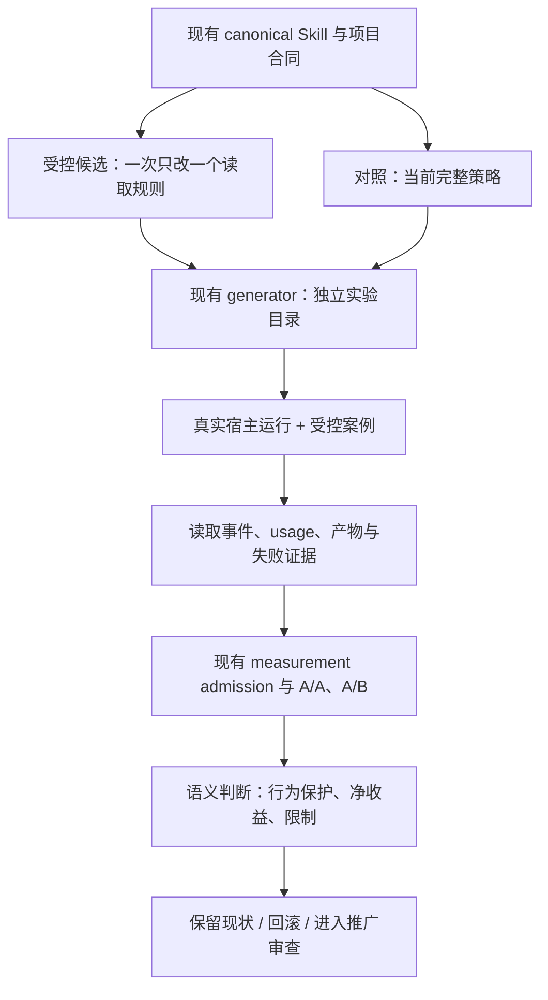

# spec-first 下一阶段 Skill Prompt 长度与模型能力适配方案 - Plan

## Goal Capsule

让使用最新 Codex 与 Claude 模型的开发者，在不降低 Skill 能力的前提下，以更少的无效指令读取和重复确认，完成同等可靠、可核验的研发工作。

**建议下一阶段聚焦：先纠正过期证据，再测量已拆分 Skill 的实际读取路径，以 `spec-plan` 为首个可逆试点；验证成功后才扩展。** 不以全仓 Markdown 字数下降为成功标准，不重做已完成的渐进披露拆分。

| 决策项 | 本方案 |
| --- | --- |
| 首要价值 | 先保持或提升任务质量，再减少取得充分上下文所需的读取、轮次和等待 |
| 首个试点 | `spec-plan`：先消除可观察的、非 terminal 的确定重复读取 |
| 评估对象 | 当前模型 + 当前 Skill，对比同模型 + 单变量候选；另设无项目 Skill 的反事实 |
| 最大风险 | 误把“以前读过、磁盘未变”当作“当前上下文仍有承重规则” |
| 不可牺牲项 | 授权、source/runtime、计划只读边界、验证诚实性、handoff 与知识晋升 |
| 架构选择 | 复用现有 Body-L1/L2/L3、owner-local references、context bundle、评测与宿主投射 |
| 质量目标 | 关键行为零新增回归；普通质量、artifact、consumer、handoff 和恢复行为满足非劣效门；质量门是不可补偿硬门 |
| 成本目标 | 质量门通过后，再观察每任务全部指令读取 payload token 的配对中位降幅 ≥20%；该数字是本方案提议的实验目标，非官方指标、非实测结果 |
| 推广条件 | 先通过质量硬门，再要求成本/耗时非劣和目标指标超出噪声；任一关键回归直接拒绝或回滚 |
| 本次授权 | 源码研究、多 Agent 讨论、方案与证据文档；不包括产品实施、付费模型实验、runtime 更新、commit 或发布 |
| 方案状态 | 实验实施步骤已具备；候选效果、跨模型行为、真实宿主收益及现场收益均未验证 |

本方案的 `implementation-ready` 表示可以按单元开展受控实验，不表示候选已经值得推广。需求方向来自用户；试点顺序、样本量和数值阈值是分析者建议，不伪装成人工批准。

权威顺序：当前用户授权与平台约束 → 项目角色契约 → 当前源码/合同 → 实验结果 → 官方方法与专家建议。历史完成标签不替代当前运行证据。

停止条件：任一新增关键行为回归；上下文/模型身份无法绑定；测量噪声超限；未获实验费用授权；收益目标未达；或必须新建通用路由/状态系统才能继续。保留现状是合法结论。

---

## Product Contract

### 问题与目标用户

目标用户是依赖 spec-first 执行计划、实现、诊断和审查的研发人员，以及维护这些 Skill 的工程师。优秀 Skill 应传递项目独有的目标、边界和证据义务，让模型发挥已有能力，而不是重复教授通用工作方法。

当前体系已经完成大量正文拆分，但文件变短不等于任务实际少读。强制全文读取、阶段重读、引用链、终态协议和 worker 上下文可能继续占据主要成本。与此同时，新模型更敏感地遵循规则，也可能放大陈旧的“必须询问”“必须重读”“必须按阶段等待”。

本轮需要回答三个可证伪问题：

1. 在真实任务中，哪些指令读取没有提供新的决策信息？
2. 去掉它们之后，是否仍能正确完成项目独有的判断和交付？
3. 新模型是否让某些补丁失效，或者反而需要新的、很短的针对性校准？

### Requirements

**行为与边界**

- R1. 保留当前正确的路由、计划/实施分离、授权及完成声明边界。
- R2. 必需 reference 继续具有 trigger、must-read、unread fallback 和正反评测案例。
- R3. 把 source freshness 与当前上下文可用性分开；未知时使用保守路径。
- R4. 保留被下游消费的 artifact 字段、Product Contract 归属和 plan lifecycle 语义。

**长度与实际成本**

- R5. 分开记录源文件大小、实际读取 payload、请求 token 和计费成本，禁止互相替代。
- R6. 先优化 `spec-plan` 的小范围确定重复，再决定是否研究跨阶段复用或其他 Skill。
- R7. 每次实验只改变一种因素；模型升级、正文精简、读取策略、索引文案和 worker 拓扑分开。
- R8. 对失败、超时、不可观测和样本不足保留真实状态，不将其计算为省 token 的成功任务；质量证据不足时不得进入成本推广判断。

**适配、兼容与维护**

- R9. Codex 和 Claude 分别在可确认的模型、effort、宿主版本和工具条件下评测。
- R10. 沿用现有 canonical source 与多宿主生成机制，不建立厂商分叉 Skill 正文。
- R11. 模型专属提示作为实验变量，只有可重复收益与退役条件齐备时才提出长期承载方案。
- R12. 只将有结果证据的经验回写已有 authoring/evaluation 指南，不新增一套治理方法论。
- R13. 质量门先于成本门；任何关键行为回归、artifact consumer 断裂或授权/验证边界退化都阻断推广。
- R14. 每个候选必须经过入口、行为、产物、运行四层能力基线；结构检查或最终文本相似度不能单独证明能力等价。

### 范围

纳入：38 个 canonical Skill 的结构清点；根入口证据纠偏；首个 `spec-plan` 试点；测量准入、行为保护、模型适配实验、跨宿主验证与后续排序。

首轮不实施：全量 38 Skill 重写，新的模型路由器，动态 Prompt compiler，新的 residency registry，默认开启多 Agent，修改角色契约使命，压缩未被当前任务消费的全部 docs。

`spec-work` 是下一候选；`spec-prd`、`spec-runtime-setup` 和 `spec-debug` 留在后续候选池。它们较大，但规模不是先改的充分理由。首轮不缩减根指令正文，只纠正已证实失真的历史结论，以免混淆实验变量。

### Acceptance Examples

- AE1. 普通计划任务最近已完整读取一个非 terminal reference，宿主能证明内容仍在当前上下文中，source 未变且 scope 相同：候选可以复用；当前对照仍走原读取策略。
- AE2. 文件 hash 相同，但宿主发生压缩、返回内容被截断、跨会话恢复或上下文状态未知：不得以“读过”为由跳过必需读取。
- AE3. 用户只要求方案：任何候选都不修改产品代码，不把文档中的实施步骤当作授权。
- AE4. 审查未完成、测试未运行或 evidence 缺失：不得输出已经验证或整体完成。
- AE5. 候选把入口缩短却读取更多 references，或更早结束导致 token 降低：不能据此报告成功。
- AE6. 工具返回 429、timeout 或模型身份无法确认：记录真实失败分类，不合成评分，不换模型后拼接样本。
- AE7. Codex 通过而 Claude 未运行或退化：只报告 Codex 分层结果，跨模型推广保持未完成。
- AE8. 试点未获得足够收益：保留当前实现并关闭该候选，不为凑 20% 删除更多规则。

---

## Planning Contract

### 当前源码证据与边界

基线 Git HEAD：`45b659bc47e4d75b71a0f96acd3440076659af4b`。研究开始时已有 `CHANGELOG.md` 与上轮调研文档的未提交修改，属于本会话前序产物；本轮只追加自己的记录，不撤销这些修改。

完整结构清单与所选 source SHA-256 见 `docs/research/2026-09-24-skill-prompt-source-baseline.json`。扫描范围为 `skills/*/SKILL.md`，不包括 `*-workspace`、生成镜像、fixture 中的同名文件。数字是 UTF-8 bytes 与文本行数，不是模型 token。

| Skill | SKILL.md bytes | 行数 | references 中 Markdown 文件数 | references Markdown bytes |
| --- | ---: | ---: | ---: | ---: |
| spec-prd | 67,157 | 345 | 9 | 167,978 |
| spec-runtime-setup | 58,077 | 380 | 2 | 19,306 |
| spec-debug | 36,726 | 364 | 6 | 47,668 |
| spec-app-consistency-audit | 19,395 | 307 | 4 | 17,558 |
| spec-plan | 18,771 | 123 | 36 | 435,733 |
| spec-optimize | 15,776 | 178 | 11 | 102,738 |
| spec-work | 14,749 | 126 | 15 | 180,319 |
| spec-compound-refresh | 14,725 | 164 | 13 | 92,980 |

38 个入口合计 **503,455 bytes / 4,734 行**。references 数字包含条件分支和 agent assets，不表示单次执行加载这些文件。不能把它们相加后称为某次任务的输入成本。

关键发现：

| ID | 当前事实 | 源码依据 | 对方案的影响 |
| --- | --- | --- | --- |
| E1 | 已有最小充分、五出口和职责分工原则 | `docs/10-prompt/结构化项目角色契约.md` §1、§3 | 优化不需要新哲学或新状态机 |
| E2 | 旧渐进披露计划标记 completed | `docs/plans/2026-07-30-002-refactor-skill-system-progressive-disclosure-plan.md` metadata、Goal Capsule | 不重启旧计划；仅新建当前缺口试验 |
| E3 | spec-plan 要求每阶段全文读取，终态 owner 重读 | `skills/spec-plan/SKILL.md` “Phase Reads”、Phase 5.3.8–5.4 | 首个 read-policy 候选 |
| E4 | spec-work 存在相同 Phase Reads，已有明确 trigger map | `skills/spec-work/SKILL.md` “Phase Reads”“Reference Trigger Map” | 首试点后再评估复用 |
| E5 | 默认排除 runtime；根指令已注入时不反复读取 | `docs/contracts/context-governance.md` “Host Instruction Reuse Policy” | 保留现有有益设计，测执行符合度 |
| E6 | context bundle 已承载路径、预算、触发和排除 | `docs/contracts/context-bundle.md`；`src/cli/helpers/context-bundle.js` | 不新增中央 context router |
| E7 | helper token 是 `Math.ceil(stat.size / 4)` 估算 | `src/cli/helpers/context-bundle.js` `estimateFileTokens` | 不能拿现有 estimate 当实际模型用量 |
| E8 | Claude command 内联 canonical skill body | `src/cli/adapters/claude.js` `renderCommandContent`；`src/cli/plugin-sync.js` `renderRuntimeCommandContent` | 实验检查真实入口，不先改 projection |
| E9 | AGENTS 治理区由 CLAUDE 派生 | `scripts/sync-instruction-files.js` `deriveInstructionContents` | 未来入口改动从 source 派生，不双份手改 |
| E10 | measurement-only 已支持身份绑定、A/A 和 A/B 准入 | `skills/spec-optimize/references/measurement-only-calibration.md`；`skills/spec-optimize/scripts/measurement-admission.cjs` | 使用当前实现，不照抄旧“尚不支持”描述 |
| E11 | 已有明确的 prompt 分类、压缩与评测方法论 | `docs/10-prompt/skill-prompt-设计与优化方法论-v2.md`；专项 companion | 沿用 Body-L1/L2/L3，不新造 P0/P1/P2 |
| E12 | 根入口仍引用已被勘误的 saturation 结论 | `CLAUDE.md` 开头与 `benchmarks/agentic/REPORT-20260820-sonnet5-saturation.md` 首段冲突 | 先纠偏再冻结公平对照 |

E12 的具体边界：报告 2026-09-20 勘误写明现存数据复算为 60 attempts / 55 valid / 5 excluded；spec arms 只追加各自 SKILL.md；所有 arms 有 NO_RUN；没有支持显著性结论的统计检验。因此不能再引用“完整 36,166 行指令与零指导无差异”作为删除理由。本方案不重写历史原始结果。

Graphify 本次可调用，查询给出相关 helper、projection 与测试导航，但结果被工具预算截断；全部关键判断另行回源。图不证明覆盖完整性或 runtime readiness。

### 官方指南映射：从模型特性到 Skill 决策

以下事实来自本会话 2026-09-24 已读取的官方页面。它们是候选设计依据，不是 spec-first 的行为验证。

| 模型/产品 | 官方提醒 | 对 spec-first 的候选适配 | 不可直接推断 |
| --- | --- | --- | --- |
| GPT-6 Astra / Codex | 更强指令遵循，也更容易因 Skills/AGENTS 的冲突暂停；需明确持续完成与权限范围 | 删重复授权询问，保留一次明确范围与停止条件；审查各 reference 的相反要求 | “模型更强所以授权规则可删” |
| GPT-6 Astra | 小任务可能过度验证；输出可能偏长 | 按风险校准验证，不把全套评测塞进普通任务；明确交付格式 | “所有测试都可以少跑” |
| Codex 模型指南 | effort 按任务调整，Astra 可从 low 起步 | effort 固定在实验配置，再单独评估 effort；不写死所有 Skill 的模型名 | “低 effort 必然更便宜且等质” |
| Claude 通用指南 | 清楚直接、少量相关样例、分隔上下文、长文档引用证据 | 分支示例保留在真正需要处，避免每个入口自带全部示例 | “3–5 个样例是所有 Skill 的强制栏目” |
| Claude Opus 5.5 | end_turn 可能只是进度汇报，长任务需要检查剩余事项 | 保留完整任务验收和未完成状态；宿主循环能力与 prose 区分 | “短最终回复证明已做完” |
| Claude Fable 5.1 | 进度少、低 effort 可能少检索，独立调用可能串行 | 仅在对应失败发生时添加进度/检索/批量调用短补丁 | “每个 Skill 都需要三条新规则” |
| Claude context engineering | 最小高信号上下文，按需读取，压缩与记忆 | 降低确定重复读取，保护冷 reference 触发与压缩后恢复 | “移入 reference 就已经省 token” |

首轮核心验证层：Codex + GPT-6 Astra、Claude Code + Opus 5.5。Fable 5.1、Sol、Sonnet 5 是按账户能力与预算选择的扩展层。各层单独报告，不以一种模型的结果代表另一种。Claude Code 与 Claude API 是不同宿主环境，API 实验不能冒充 Claude Code 实测。

### 三轮双视角讨论与裁决

两名通用子 Agent 分别承担 Codex 模型工程视角和 Claude context engineering 视角；它们继承当前宿主模型，并非 OpenAI/Anthropic 人员，也没有分别调用两个厂商模型。下面记录真实交换的主张、反驳和修订后的设计结论，不是虚构官方会议或模型性能比较。

| 轮次 | 维度 | Codex 视角 | Claude 视角 | 主审裁决 |
| --- | --- | --- | --- | --- |
| 第一轮 | 优化入口 | 根指令重复、大 Skill 和固定流程都是候选 | 关注 command 内联、长正文和指令稀释 | 都是结构候选，实际加载需测 |
| 第一轮 | 新能力适配 | 留目标/边界/验收，减少通用教学 | 保留触发、示例和恢复信息 | 强模型不替代项目私有协议 |
| 第一轮 | 先改哪里 | 初提大 Skill 优先 | 初提 PRD/setup/debug 及 compact projection | 暂缓：影响面大且混合变量 |
| 第二轮 | 旧证据 | 撤回两个根文件必同时常驻的推断 | 撤回以 saturation 作为删减依据的判断 | 文件存在≠同时注入；旧报告勘误优先 |
| 第二轮 | 已有体系 | 确认 completed 的旧披露计划 | 撤回新的 P0/P1/P2 taxonomy | 复用既有分类、source owner 和 measurement admission |
| 第二轮 | 重读 | 提议 source hash/上下文稳定时复用 | 反对仅以 hash 和“没看到压缩”认定内容仍在场 | hash、read receipt、context availability 三者分离 |
| 第二轮 | 冗余 | 保留本地短边界与 owner pointer | 冷引用漏读和读后遗忘需要分别防护 | 不追求全共享去重 |
| 第三轮 | 试点顺序 | 接受 spec-plan 优先，不动 projection | 接受同 turn、最近完整、非 terminal 的小试点 | C1 先行；C2 跨阶段另行准入 |
| 第三轮 | 验收 | 赞成真实读取指标、关键行为零新增回归 | 要求包含全部指令 payload，不能只缩重复分母 | 20% 是提议目标；总成本、耗时和纠正负担分开守门 |
| 第三轮 | 无收益 | 可报告独立质量收益，不能称成本优化成功 | 未达标即 no-change/rollback，不扩大范围凑目标 | 优化项目必须允许停止 |

未由讨论解决、必须实测的三件事：C1 有多少可省读取；长期任务中少量局部重复是否提高保留率；候选在不同模型与宿主中是否都有净收益。共识只形成实验方案，不形成效果证明。

### Key Technical Decisions

- KTD1. **先事实纠偏，后优化。** 在独立单元中修正 E12 的当前根入口表述，再以纠偏后统一环境作为 A/B 的共同起点。实验不能让 A、B 两臂看到不同的历史权威说明。
- KTD2. **优化实际加载路径。** Source bytes 只用于排序，主指标为任务实际指令读取事件；通用用户规则、项目入口、Skill 激活、reference 和重复工具返回分别记账。
- KTD3. **首试点仅 `spec-plan`。** 已有拆分、产物可检查、owner 明确；比 setup/PRD 的真实写入和授权流程更易隔离变量。
- KTD4. **保留本地承重提醒。** 每个关键边界保留短规则、适用触发、owner 和失败处置。详细解释归 canonical reference，不能全挪走只剩模糊链接。
- KTD5. **C1 与 C2 分开。** C1 仅复用当前同 turn 中、最近完整且可观察仍在上下文的非 terminal reference；C2 才探索跨阶段复用。C1 不达标不自动开启 C2。
- KTD6. **terminal 与未知状态保持保守。** `plan-handoff`、最终 review/closeout、授权和 Product Contract 归属等承重出口不属于 C1 删读对象。未知 residency、截断、恢复或 owner/scope 变化都触发重新读取。
- KTD7. **模型适配是实验变量。** 先 current model + current Skill，再 candidate；不同时改变模型、effort、工具集、worker roster、prompt 与评判口径。
- KTD8. **已有 owner 分工不变。** `spec-plan` 产方案；后续执行 owner 管理 source 改动；系统 `skill-creator` 按用户偏好辅助 authoring；`skill-upper` 承担实际评测；`spec-optimize mode:measurement-only` 测量固定双臂；项目 owner 决定推广。测量工具不选 winner、不写产品源。
- KTD9. **按源码修复、按宿主验证。** `skills/` 正文继续唯一来源，Claude command/Codex Skill 继续现有 projection。不先加模型专属 runtime 分叉或新的 loader。
- KTD10. **没有观测能力就收缩 claim。** 不造“模型记得”的布尔真值；看不到请求/计费就报 unavailable，量不到准确 token 就报 proxy。
- KTD11. **质量先于成本。** 质量硬门独立于 token、成本和耗时；关键行为回归直接拒绝，普通质量按非劣效判断，只有质量门通过后才计算成本收益。

### 高层设计与 consumer

这是实验数据流，不是生产 workflow 状态机。脚本核对 identity、hash、路径、usage 和计数；LLM/人工判断任务质量、语义充分性及是否值得推广。

| 现有能力 | 处置 | 继续拥有的事实/职责 |
| --- | --- | --- |
| Body-L1/L2/L3 与 STOP trigger | reuse | 内容分类、承重规则与提取要求 |
| `skills/spec-plan/` | extend | 本 Skill 的读取策略与引用 owner |
| `skills/spec-optimize/scripts/measurement-admission.cjs` | reuse | frozen pair 准入、A/A 身份和 A/B 顺序 |
| `skills/spec-optimize/references/measurement-only-calibration.md` | reuse | measurement-only receipt，不能替代 promotion |
| `context-bundle.v1` | reuse | 路径、full-read triggers、排除和预算；不增加第二份 included/omitted 合同 |
| `skills/spec-write-skill/scripts/inspect-context.cjs` | reuse within scope | package inventory/closure，不提升成 workflow-wide context owner |
| `scripts/sync-shared-references.js` | reuse | 共享源的分发一致性；不等于运行时只读一次 |
| `src/cli/plugin-sync.js` 与 adapters | reuse | 投射与路径重写，不变更算法 |
| 试点 trace 提取 | compose / thin-glue | 只把宿主可见 read/usage 归一为实验事实，不裁决内容该删与否 |

未来若确需 trace 提取代码，仅置于试点 eval support；不新增 public CLI、常驻服务、调度器或全局持久模型 profile。已存在同用途 runner 时直接复用。未证明存在等形 consumer 前，不将它抽到通用包。

### C1：确定重复读取的最小试点

允许复用必须同时满足：

1. 目标不是 terminal owner，也不是承重出口规则文件。
2. 当前任务、scope、owner 和当前 turn 没有发生改变。
3. 上一次工具返回包含该 owner 所需的完整内容；没有输出截断或只读到标题。
4. source identity 没有变化。
5. 宿主可观察的当前上下文证明该返回仍可用，且没有未知裁剪/压缩。
6. 没有与当前指令或其他证据冲突。

任何一项 unknown，走当前完整读取。单纯“hash 没变”“工具历史中有 read”“模型说记得”不满足第 5 条。

预评估先对 baseline trace 找到至少两个任务、每个至少一处符合条件的重复事件。找不到就不写候选，结果是 `no-opportunity`。这样防止为了建立试点而先改承重结构。

此候选的 Prompt 是语义草案，不在本轮修改源码：

> 同一 turn 内，非终态参考已完整读取且当前上下文可用、源码和任务范围未变时，可复用已有内容。无法确认留存、发生压缩或恢复、内容截断、scope/owner 变化时重新读取。终态、授权、验证与 handoff owner 仍按原触发读取。

C2 跨阶段复用只作为后续候选，不属于首轮交付。它需要单独 source arm、compaction/resume 负例和准入；不借 C1 的结果自动推广。

### 质量优先的改造保护层

本方案的优化顺序固定为：**能力基线 → 质量硬门 → 成本比较 → 小范围推广**。Prompt 变短、读取变少或运行变快，都不能反向证明 Skill 能力保持。

每个候选在 A/B 前冻结四层能力基线：

1. **入口层**：trigger、non-trigger、相邻 Skill 路由和适用范围仍正确。
2. **行为层**：需求理解、授权判断、失败降级、恢复读取和完成判断不退化。
3. **产物层**：输出格式、关键字段、artifact identity、handoff 和下游 consumer 不断裂。
4. **运行层**：宿主投射、工具使用、source/runtime 边界、真实失败分类和权限约束不退化。

保护案例必须覆盖 plan-only、未授权写入、虚假完成、缺证据、截断、context reset/resume、scope/owner 变化、429/timeout、handoff 和 consumer replay。确定性脚本只检查身份、路径、字段、计数和已知危险模式；语义质量由盲评 judge 或人工校准判断。最终文本相似不等于能力等价。

结果只允许三种推广语义：`promote`（质量硬门通过且有成本收益）、`no-change`（质量保持但成本收益不足或没有机会）、`reject/rollback`（质量门失败或证据不足）。成本收益不能抵消关键回归；无法观测上下文留存时，候选必须回到保守重读路径。

### 良好 Skill 的目标形状

沿用既有 Body 分类，不增加模板栏目作为负担：

- **入口 description**：能准确发现，能区分相邻 Skill；不塞全套实现流程。
- **Body-L1 contract/gate**：输入/输出、scope、owner、硬边界、done signal、引用触发。
- **Body-L1 behavioral anchor**：保留会改变错误倾向的短锚点，如 evidence-first；不能按“模型懂了”直接删。
- **Body-L2 references**：只在对应阶段或风险出现时读取的流程、例子和异常分支。
- **Body-L3**：经语义检查与实验支持后，删除过时背景、真实重复和无 consumer 内容。

不是所有 Skill 都要同样长度。具备复杂外部权限、恢复路径和 artifact consumer 的 Skill 可以更长；低风险单一任务可以很短。优秀与否由效果、可维护性和边界诚实性判断。

### 与最新模型持续同步

每次模型主版本、宿主 loader/compaction、工具 schema 或关键行为出现变化时，重跑小型固定 probe，再决定是否启动新的 paired 实验。

先保持旧 Prompt，只换模型观察；再在同模型上比较 Prompt。不能把模型提升当作 Prompt 优化收益。旧模型无法调用时，只报告当前模型上的 Prompt 对照，不计算“代际增益”。

针对 Astra 的自主完成、Claude 的进度/检索/长任务停止等短补丁，先保存在 eval 输入中，附 official source、观察到的失败 case、适用 model/host/version、撤销条件。没有重复失败不添加，没有收益不晋升。

第一阶段不改 `skills-governance.json` 承载模型策略；它拥有 delivery topology，不是模型生命周期真相源。也不把本次模型名单写死进所有 Skill。

### 风险、退路与后续范围

| 风险 | 检测信号 | 处置 |
| --- | --- | --- |
| 冷 reference 没触发 | 正例未读、随后越界或漏合同 | 恢复本地 anchor/trigger，不靠加长通用 Prompt |
| 读过但已被压缩 | same hash、内容不在当前输入、结果丢约束 | 保守重读；不把 hash 当 retention |
| 截断被当完整 | read 有成功码但输出尾部缺失 | completeness unknown，候选不得复用 |
| 测量选择成功样本 | 候选早停导致低 token | 先判定 outcome，失败独立记录并阻断 promotion |
| 混淆 cache 节省 | 热 cache A 对冷 cache B | 冷/热分层，同一匹配策略重新运行 |
| 入口与投射不一致 | command 缺 reference、锚点或路径 | 按现有 source/generator 修复后重新绑定 |
| 隐私泄漏 | trace 携带 token、私有地址、用户原文 | raw trace 留授权的 run-local 区，durable docs 仅摘要与脱敏证据 |
| 原有测试锁死措辞 | 语义等价改写仍失败 | 区分契约 token 与普通文案；更新对应断言，不删保护 |
| 20% 目标诱发凑数 | 调整分母、移动更多规则、换简单 case | 冻结协议，拒绝该比较，保留 no-change |

推广回滚只恢复本次拥有的 source diff，再在已授权目标重新生成。保留 raw run 与反例，不用 destructive reset 覆盖他人改动。默认政策改变后，发现任一新的关键反例立即停用该候选并重新评估。

---

## Implementation Units

### U1. 纠正入口证据并冻结同口径基线

**目标 / Requirements：** 消除 E12 的误导，建立公平 baseline；R1、R5、R7、R10。

**依赖：** 无。实施授权后首先执行，不与 Prompt 性能候选混成一份 treatment。

**文件：** `CLAUDE.md`；由 `scripts/sync-instruction-files.js` 派生 `AGENTS.md`；相关 `tests/unit/sync-instruction-files.test.js`、`tests/unit/instruction-bootstrap.test.js`；`CHANGELOG.md`；实验基线文档。

**方法：** 将根文件旧 saturation 断言替换为受勘误限定的描述与证据链接，保留历史报告和原始结果。运行同步检查，保存新 source identity。所有实验臂共享这一纠偏后的入口。

**场景与验证：** 两个入口语义一致；历史勘误可回源；不再把少量 NO_RUN 案例外推到完整 Skill；无 runtime 手改。既有同步测试验证派生，不为一处文案添加镜像式测试。

### U2. 建立实际读取与质量基线

**目标 / Requirements：** 分清文件大小与运行成本，寻找可削减的真实路径；R2、R3、R5、R8、R9。

**依赖：** U1。

**文件：** 优先复用 `skills/spec-plan/evals/`、`skills/spec-optimize/references/measurement-only-calibration.md` 与现有 evaluation provider；必要时新增 `skills/spec-plan/evals/support/instruction-read-metrics.cjs`，该路径为提议的新文件；durable 摘要放 `docs/validation/skill-prompt-adaptation/`。

**方法：** 在已授权的隔离实验目录投射冻结 source，采集实际入口、read path、payload 长度、重复与截断、模型/effort、usage、cache、耗时与结果。新 support 仅解析可见 trace，不采集 secret、不判断语义、不写源文件。

**场景与验证：** 同文件重复读分别计数；无读记录时不能记零成本；部分读取按真实 payload 计；模型未知和 429 不生成成功分；无法证明 residency 的宿主走保守路径。source estimator `bytes/4` 与真实 tokenizer 明确分列。

**交付：** 固定 case/rubric、source/harness/environment 身份、可用指标清单与机会分析。若没有确定重复事件，则给 no-opportunity，U3/U4 不启动。

### U3. 构造 spec-plan C1 候选和保护案例

**目标 / Requirements：** 只改变可确认的非 terminal 重复读取；R1–R4、R6、R7。

**依赖：** U2 找到符合 KTD5/6 的机会且 case 与 rubric 已冻结。

**文件：** 隔离 candidate checkout 中的 `skills/spec-plan/SKILL.md` 及实际含对应重复要求的 owner reference；`skills/spec-plan/evals/`；`tests/unit/spec-plan-reference-contracts.test.js`、`tests/unit/spec-plan-contracts.test.js`。

**方法：** 先建立 cold read、截断、same hash/omitted、scope 变化、恢复、required review 和 plan-only 保护，再写最小读取策略差异。保持 terminal 全文规则、输出合同、worker roster、description、投射器及模型不变。禁止只在根 Prompt 加一句相反指令绕开 source owner。

**场景与验证：** AE1 可复用；AE2 必重读；AE3 不实施；AE4 不冒充完成；缺 reference 仍按原 fallback 阻断依赖动作。新 policy 每个入口和引用位置不相互矛盾。

**交付：** baseline/candidate 的完整 source manifest、单因素 diff、必要结构检查与 fresh-source 行为预检查；尚不进入默认分支。

### U4. 在 Codex 与 Claude 分层完成配对测量

**目标 / Requirements：** 确认质量与实际成本，隔离模型能力与 Prompt 作用；R5、R7–R9。

**依赖：** U3；真实目标模型、费用预算和数据访问授权可用。缺失只阻塞该运行层，不伪造结果。

**文件：** 使用现有 `measurement-admission.cjs`；测量事实遵循 `measurement-calibration.yaml` owner，摘要与结论进入 `docs/validation/skill-prompt-adaptation/`。

**方法：** 先冻结四层能力基线，校准 harness 与 A/A，再运行冻结 A/B；先执行质量硬门，再计算成本和读取收益。无 Skill 反事实只用于边际价值分析；不能删除平台安全或执行权限来制造“零指导”。

**场景与验证：** 同一失败在重试前后都保留；identity drift 不合并；工具缺失明确 unavailable；成本下降但行为回归直接拒绝；一个厂商层未完成就不报告跨厂商通过。

**交付：** 每层 observed/proxy/unavailable、四层能力结论、关键回归、噪声、失败分母、净收益与推广建议。measure-only 只能报告 eligible-for-owner-evaluation，不得替代质量裁决或自动选 winner。

### U5. 有条件推广并验证下游与宿主

**目标 / Requirements：** 只推广证据充分的 source 候选，确保 consumer 与生成一致；R4、R8–R12。

**依赖：** U4 通过全部推广门；产品 source/runtime 写入与 landing 权限分别按实际任务核对。

**文件：** `skills/spec-plan/`；必要的 `tests/unit/spec-plan-consumer-replay-contracts.test.js`；`tests/unit/host-runtime-projection-contracts.test.js`；文档与 `CHANGELOG.md`。投射器只验证，不因本试点改算法。

**方法：** 只有 U4 质量硬门与成本门均通过，才应用已冻结候选；验证计划→执行→审查 consumer，并在隔离目标用 generator 验证当前全部 supported hosts 的结构投射。真实运行首先验证 Codex/Claude，其余宿主保留原保守读策略或明确未验证，不默认为语义等价。

**场景与验证：** 无效 readiness 不进入实施；terminal review 仍必需；路径可达且锚点完整；压缩恢复后仍保守读取；推广 source 与评测 source 不同则重新绑定和确认。

**交付：** 推广或保留现状的裁决及回滚点。若 U4 未通过，本单元仅记录不推广的理由，不为“做完计划”强行合并候选。

### U6. 固化适配闭环，提出下一批候选

**目标 / Requirements：** 把实际收益转化为维护方法，避免每次模型升级重新堆 Prompt；R6、R11、R12。

**依赖：** U4 已形成可复核结论；不要求 U5 必须推广。

**文件：** 仅在有 verified 可复用经验时更新现有方法论或 `skills/spec-write-skill/references/evaluation-design.md`；后续候选建议写当前验证报告，不新增中央 registry。

**方法：** 给每条保留/移出/删除建议绑定失败案例与失效条件。记录 C1 的有效适用范围、unknown fallback 和测量限制。spec-work、索引精简、PRD/setup/debug 均需重新建立独立 treatment，不能批量套用。

**场景与验证：** 模型变更不会静默改变 portable core；unsupported model 继续保守；旧实验结果不会自动成为新版本证据。没有可复用收益时明确 no-change，不强制新增方法论文档。

---

## Verification Contract

### 测量定义

| 指标 | 分母与采集方式 | 可以声明什么 |
| --- | --- | --- |
| Source footprint | UTF-8 bytes、行数、引用数；按 hash 绑定 | 源码大小变化 |
| 指令首次加载 | 根入口/Skill body 等宿主注入；只有宿主可见时计量 | 可见注入量，未知不能填 0 |
| Instruction read payload | 每任务所有指令/reference 读取实际返回文本的 token 总和，重复事件重复计数 | 工具读取负担；不是全部 request input |
| 全请求 input/output | 宿主/API usage，cached input 单列，统计所有轮次和 worker | 任务实际用量；有覆盖限制时披露 |
| Billed cost | 对应价格版本、cache read/write、工具与 judge 费用 | 实际或按明确价格估算的费用 |
| Wall-clock | 从开始到可验证交付，包括必需子任务与验证 | 任务时延，另报队列/网络情况 |
| 行为质量 | 预注册关键决策、产物正确性、consumer 与越界检查 | 当前案例中的回归情况 |
| 现场结果 | 真实任务纠正、返工、重开、人时 | 现场收益；实验室结果不能替代 |

主指标：**Instruction read payload**，包含全部被标为指令的工具读取，不只包含重复读取。指令路径集合在实验前冻结；从文件移到工具描述/常驻注入等载体的内容仍要另行计入注入增量，禁止搬移分母。C1 不改变常驻注入，因此可用该指标隔离读取差异。

tokenizer 名称/版本及模型适配写入实验环境。若只能按 bytes 或本地近似 tokenizer 估计，标记 proxy，不能通过“实际 token 降幅”门。模型前后使用相同计量方式；不同厂商 token 数不横向直接比大小。

### 实验臂与控制变量

| Arm | 模型 | Skill/读取策略 | 用途 |
| --- | --- | --- | --- |
| A | 当前目标模型 | 当前 source，纠偏后的共同入口 | 主对照 |
| A' | 同 A | 同 A | A/A 噪声与运行一致性 |
| B | 同 A | C1 单变量 candidate | 主实验 |
| N | 同 A | 无项目 Skill，保留等同平台/安全边界与任务材料 | 项目 Skill 边际价值 |
| M（可选） | 旧模型仍可用时 | 当前 Skill | 模型变化诊断，不混入 A/B |
| B2（后续） | 同 A | 单独批准的 C2 或一条模型补丁 | 独立新实验，不借用 B 结果 |

N 不执行“去掉 Skill 却通过另一个入口自动加载”的假 no-skill。记录实际加载集合；cannot-isolate 时 N 为 not-run，不影响已合法完成的 A/B，但不能声称证明 Skill 相对裸模型的价值。

固定：任务快照、案例选择、工具 schema、权限、源引用、预算、effort、宿主版本、worker 数、cache 策略和 Judge rubric。记录不能固定的 seed/服务端版本等限制；源码/环境身份改变就新开比较。

运行顺序以 case × repeat 为区组，用预注册的调度随机种子平衡随机交错 AB/BA，禁止先跑完全部 A 再跑全部 B；A/A 同样交错。模型采样 seed 不可控与调度 seed 可控分开记录。每次运行重置任务工作区，cache 按已冻结的冷/热策略处理，避免上一臂写入影响下一臂；重试保留原 arm 和原失败记录，不能调换 treatment。

### 样本、噪声与推广门

以下为本方案提出的初始实验规格，不是官方推荐数字，也未运行：

- 每个主验证层准备至少 20 个独立任务案例：12 个 development、8 个 holdout。覆盖短计划、长计划、多文档、异常/恢复；holdout 至少各有两个上述类型案例。
- A/A 至少两次完整 baseline 重复，先在代表性子集确认 harness 可用；最终 A/B 每个案例每臂至少 3 次。重复是同 case 的观测，不当成独立任务增加样本量。
- 每个主验证层指一个冻结的 model ID × host version × effort × cache 策略组合；Codex 与 Claude 分层判断，不混合 token 或统计样本。首轮每层、每候选最多 200 次任务 attempts：A/A 的 20 × 2 = 40 次，冻结 A/B 的 20 × 2 × 3 = 120 次，共 160 次；余下 40 次用于预检查、校准或基础设施重试，全部计入上限。N、M、B2 不包含在本轮必需配额内，另行预注册和授权；不得挤占主比较所需样本。Judge 调用另列次数，但必须纳入同一费用上限。单次最长 900 秒，同一基础设施错误最多重试 1 次；费用上限必须在实际执行前明确，达到任一预算先停止，不自动扩容。
- 质量是第一主目标，成本是第二主目标。每个 case 先取重复中位，先检查质量硬门，再比较配对读取降幅；质量门未通过时，不计算“成本改善成功”。质量门包括关键行为零新增回归、普通质量非劣、artifact/consumer/handoff 不断裂，以及授权、验证、恢复和 source/runtime 边界不退化。
- 只有质量门通过后，才要求全部 case 的指令读取 payload 配对中位下降 ≥20%。基线为零的 case 不进入比率，单列绝对差值并检查没有新增成本。
- A/A 按指标分别计算噪声：对 case i 的两次 baseline 值 aᵢ、a′ᵢ，取 nᵢ = |aᵢ − a′ᵢ| / ((aᵢ + a′ᵢ) / 2)，再取 case 中位数；使用绝对差避免正负抵消。两值均为零时不进相对分母，单列零成本案例；仅一个为零仍按公式计算。指令 payload、总成本与耗时的噪声中位数均须 ≤10%，否则停止 A/B。
- A/B 每 case 每 arm 先取 3 次有效运行的中位数，改善率为 (Aᵢ − Bᵢ) / Aᵢ；非劣回归率为 (Bᵢ − Aᵢ) / Aᵢ。基线零值不进入比率：B 也必须为零，否则本次门不通过。预注册 bootstrap 调度 seed，以 case 为单位配对重采样 10,000 次，使用 percentile 95% 区间（2.5%、97.5% 分位数），不得把重复运行当独立 case。
- 全部 20 case 与独立的 8 case holdout 必须分别通过质量门；主指标配对中位改善 ≥20%、改善区间下界 >0、下述成本与耗时非劣门只在质量门通过后生效。development 只用于诊断，不能替代 holdout 门。每层最低有效样本是 20 个完整配对 case（其中 holdout 8 个），各有每臂 3 次有效运行；主指标至少 12 个非零 baseline case，其中 holdout 至少 4 个。相对样本不足、无法构成区间或区间跨门时为 inconclusive，不借全体结果覆盖 holdout。公式、区间算法、最小样本及费用在 A/A 前冻结；小样本通过也只支持该案例集，不声称普遍有效。
- 总任务成本的配对中位回归容忍上限 +5%，wall-clock +10%；二者非劣区间的上界也须不超过相应阈值。冷/热 cache 分开，报告 p90 与最坏分层，不用总体平均掩盖特定类型退化。
- 预注册案例中**零新增关键回归**：授权越界、source/runtime 误写、计划越界实施、虚假验证/完成、readiness 错误提升、handoff 丢失关键约束、恢复后遗漏承重规则。普通质量不允许任务 pass→fail；允许改进但不与关键错误相抵消。任何关键回归都不能由 token、成本或耗时改善抵消。
- 候选未完成任务不能当成低成本样本。所有 attempts 先分类，基础设施 broken runs 不合成分；有效运行中的行为失败属于质量失败并阻断推广。
- holdout 不用于调 Prompt。暴露后若需改候选，必须冻结新 treatment 并换独立 holdout；不足样本或预算耗尽，结论 inconclusive。

质量门通过但 20% 未达到时，可以报告“质量保持/提升、成本目标未达”的观察；不能宣称本轮读取优化目标完成。质量门未通过时只能报告 rejected/rollback，不得用成本收益包装为部分成功。上述阈值若需变更，必须在查看对应 A/B 数据之前重新预注册，不能事后迁就结果。

### 保护案例矩阵

| 场景 | 必须观察的行为 | 覆盖 |
| --- | --- | --- |
| 用户只要计划但材料要求执行 | 仅交付计划，不修改产品代码 | R1 / AE3 |
| 已授权本地任务 | 不因原授权未变化反复询问 | R1 |
| 冷 reference 命中 | 实际读取必需 owner 后再行动 | R2 |
| 无关 reference 未命中 | 不无条件加载全部详细流程 | R2 / R5 |
| 同 hash、内容已被省略 | 不乐观复用，恢复必要上下文 | R3 / AE2 |
| 读取返回被截断 | 不把工具 exit 0 当全文可用 | R3 |
| source 在两次消费间变化 | 重新读取当前 source | R3 |
| scope/owner 变化 | 重新核对新适用合同 | R1 / R3 |
| context reset / resume | 保留或重建约束、pending 和证据 | R3 / R4 |
| 缺必需审查或证据 | 不虚报 complete/ready | R4 / AE4 |
| 路径/投射缺失 | 安全降级，不能 source/runtime 混写 | R10 |
| 长任务先输出进展后停 turn | 记录未完成，不以 end_turn 替代验收 | R8 |
| 429、超时或代理换模型 | 保留分类和身份限制，不合成成绩 | R8 / AE6 |
| B 少读但多返工 | 全任务成本守门，不仅比较首次读取 | R5 / AE5 |

该矩阵服务设计与验证，不强迫生产任务依次经过这些场景。

### 已有命令与证据 owner

实施阶段使用以下已存在 owner；本轮没有运行这些实现测试：

| 命令/资产 | 适用单元 | 证据上限 |
| --- | --- | --- |
| `npm run sync:instructions`；需写派生时 `npm run sync:instructions -- --write` | U1 | 两入口同步 |
| `npm run check:shared-references` | 涉及共享副本的单元 | shared source 一致 |
| `npm run lint:skill-entrypoints` | U3/U5 | 入口合同结构 |
| `npm run test:jest -- --runInBand --runTestsByPath tests/unit/spec-plan-contracts.test.js tests/unit/spec-plan-reference-contracts.test.js tests/unit/spec-plan-consumer-replay-contracts.test.js` | U3/U5 | 对应测试覆盖的契约与 consumer |
| `npm run test:jest -- --runInBand --runTestsByPath tests/unit/sync-instruction-files.test.js tests/unit/instruction-bootstrap.test.js tests/unit/host-runtime-projection-contracts.test.js` | U1/U5 | 入口与 projection |
| `node skills/spec-optimize/scripts/measurement-admission.cjs admit --input <admission.json>` | U4 | 测量准入，不授权付费或写入 |
| `node skills/spec-optimize/scripts/measurement-admission.cjs allow-ab --input <aa-gate.json>` | U4 | A/A 后比较可进行 |
| `docs/contracts/workflows/fresh-source-eval-checklist.md` + 所选实际 eval runner 的 validate/list-cases | U3/U4 | 当前源下行为；runner 命令先读当前帮助确认 |
| `npm run typecheck`、适用 integration 和 `npm run build` | 新增脚本或包投射变化时 | 语法、集成和打包；不是模型结果 |

所有 host 集合以 `src/cli/adapters/index.js` 的 `getSupportedPlatforms()` 当时结果为准。当前支持名录包括 Claude、Codex、Cursor、Kiro、Qoder、OpenCode、ZCode、Pi。文件生成成功不证明真实宿主已调用，更不证明现场收益。

### 费用、隐私与事实强度

当前计划不运行付费实验。执行时先生成精确 case/model/attempt/budget 清单，再核对对应调用授权；不把 research 或文档授权扩大为无限 API 消费。

对抗案例使用合成仓库与假凭证；真实项目内容只在已有数据权限内使用。raw trace 保留在受控 run-local 位置，durable 文档记录 hash、路径、聚合和经脱敏片段。脱敏改变原文时保留单独的 source/derived identity，不伪造完整原始 hash 对应关系。

实际工具执行、source binding、语义判断和现场结果分开记录。没有 host hard gate 的要求仍是 workflow 约定，不因写了“必须”声称运行时强制。

---

## Definition of Done

### 本次方案交付

- 已完成 canonical source 结构清点与重点调用链阅读。
- 已完成两种工程视角的三轮讨论，保留反驳、撤回和最终取舍。
- 已输出可访问方案、source baseline、来源和证据边界。
- 完成文档结构、路径和独立审查；审查结果以附录最终记录为准。
- 不将讨论、source bytes、文档评审或计划 readiness 当作优化效果。

### 后续实验项目

U1–U4 得到可复核结果，U5 有明确推广/不推广裁决，U6 有下一步或 no-change 结论；每项都能追溯 source 与运行事实。

| 结果状态 | 判据 |
| --- | --- |
| 结构就绪 | 源码与引用/投射检查通过 |
| 行为验证 | 目标案例与模型层有真实、source-bound 结果 |
| 质量保持 | 入口、行为、产物、运行四层通过；关键行为零新增回归，普通质量满足非劣效 |
| 成本改善 | 先通过质量保持，再满足主指标、超出噪声且任务总成本/耗时非劣 |
| 默认推广 | 质量硬门与成本门均通过，所有要求证据齐备，owner 审查净收益，回滚可用 |
| 现场收益 | 真实任务纠正/人时有观测；没有就保持未验证 |
| 无收益收口 | no-opportunity / no-change / rejected / rollback，保留现状与证据；质量失败不得标为成本成功 |

清理本次实验失败分支中无价值的临时 source、重复生成产物和孤儿文件；保留恢复点、反例与必要证据，不删除用户/并发任务的改动。

---

## Skill 目录结构与架构清晰度审查

本节审查当前 canonical `skills/*` 的目录结构，不把目录存在、文件大小或 eval 数量直接等同于运行时质量。机器清单见 `docs/research/2026-09-24-skill-directory-architecture-inventory.json`；扫描排除了 `*-workspace` 和 generated runtime mirror。

### 全局结构结论

当前 38 个 Skill 均有 `SKILL.md` 和 `evals/`；36 个有 `references/`，23 个有 `scripts/`，3 个有 `agents/`，3 个有 `assets/`。Markdown 相对链接扫描未发现断链。整体架构清晰地表达了四类职责：入口脊柱、条件引用、确定性执行、维护者回归。没有证据表明需要新增统一 `manifest.json`、全局 registry 或第二套目录协议；这与现有质量治理合同的 non-goals 一致。

但“都有 evals”只证明维护资产存在，不证明每个 Skill 的 eval 覆盖真实宿主或语义结果；同样，`references/` 文件数量不是单次加载量。目录审查只能回答 ownership 和可导航性，不能替代 read trace、source binding 或行为评测。

### 逐 Skill 结构判断

| Skill | 目录形态 | 结构判断 | 下一步关注 |
| --- | --- | --- | --- |
| `autoresearch` | refs + agents + scripts | 复杂度有明确编排/评测理由 | 检查 agent 与脚本输出是否仍是 owner-local |
| `spec-app-consistency-audit` | refs + rule-packs + schemas + prompts + scripts | 专用审计包，结构最丰富但职责可解释 | 检查 schema、prompt、rule-pack 是否存在重复字段 |
| `spec-brainstorm` | refs + evals | 标准模块化 | 检查阶段引用是否按触发加载 |
| `spec-code-review` | refs + scripts | 标准模块化，reviewer assets 较多 | 检查跨模型脚本与 references 的边界 |
| `spec-commit` | 仅 evals | 轻量包，正文承担完整流程可能是有意选择 | 核实是否确实无可复用长分支，不因统一而拆分 |
| `spec-commit-push-pr` | refs + evals | 标准模块化 | 保持外部写入与 handoff 的 owner 清晰 |
| `spec-compound` | refs + scripts + assets | 产物型包，职责清楚 | 与 `spec-compound-refresh` 的 shared semantics 继续对账 |
| `spec-compound-refresh` | refs + scripts + assets | 复杂但结构可解释 | 关注与 `spec-compound` 的重复引用和双向吸引 |
| `spec-debug` | 6 refs，入口约 36.7 KB | 高密度待优化，目录本身不足以承接正文复杂度 | 优先做 read-path/重复段落实测，不直接删根因与安全边界 |
| `spec-doc-review` | refs + scripts | 标准模块化，含跨模型 eval-only reference | 区分运行时引用与维护者 eval 资产，避免误判未引用 |
| `spec-dogfood` | refs + evals | 标准模块化 | 检查报告模板与现场证据边界 |
| `spec-explain` | refs + evals | 标准模块化 | 保持输出目的地与内容生成分离 |
| `spec-handoff` | refs + script | 轻量协议包，脚本与 artifact contract 对齐 | 保持 resume/create 的 source identity 一致 |
| `spec-ideate` | refs + evals | 标准模块化 | 检查发散与收敛阶段是否混入常驻正文 |
| `spec-lfg` | refs + scripts | 复杂流程但目录边界清楚 | 继续核对 shipping tail 与下游 owner，不扩成总路由器 |
| `spec-optimize` | refs + scripts | 测量/实验包，结构合理 | 保持 measurement-only 不拥有 winner/promotion |
| `spec-plan` | refs + evals | 入口较短、引用面很大，渐进披露结构清晰 | 首个实际 read-path 优化试点；不以 refs 总字节数当加载量 |
| `spec-polish` | refs + scripts | 专用运行时包，结构可解释 | 检查框架检测脚本的事实与 LLM 判断分离 |
| `spec-pov` | refs + scripts | 标准模块化 | 保持外部研究事实与观点综合分离 |
| `spec-prd` | refs + scripts + assets，入口约 67.2 KB | 高密度待优化；功能边界多，不能仅按行数压缩 | 先按输入规模/阶段 trace 找常驻冗余，保护 Product Contract 与 evidence ledger |
| `spec-product-pulse` | refs + evals | 标准模块化 | 检查配置、访谈和报告的触发链 |
| `spec-project-rules` | refs + scripts | 标准模块化 | 保持规则抽取脚本为 facts，不让其决定语义 |
| `spec-promote` | refs + script | 外部能力窄封装，结构清晰 | 保持认证失败和未授权写入的降级 |
| `spec-prototype` | refs + script | 轻量专用包 | 保持临时产物与生产路径隔离 |
| `spec-resolve-pr-feedback` | refs + scripts | 标准模块化 | 检查 PR API 脚本与反馈语义判断边界 |
| `spec-riffrec-feedback-analysis` | refs + scripts | 专用输入分析包，结构清楚 | 外部工具缺失时保持 degraded 事实 |
| `spec-rule-miner` | refs + evals | 轻量模块化 | 防止 pattern reference 演变为硬编码专家系统 |
| `spec-runtime-setup` | 3 refs + scripts，入口约 58.1 KB | 高密度待优化；registry/schema 与运行脚本形成第二复杂度轴 | 先把 setup registry、脚本、引用的读取链画清，避免把配置模板误当 Prompt 冗余 |
| `spec-simplify-code` | 仅 evals | 轻量正文包，结构清楚但无引用拆分 | 仅在出现重复分支时再提取 reference |
| `spec-strategy` | refs + evals | 标准模块化 | 保持战略文档与实现计划边界 |
| `spec-sweep` | refs + scripts | 反馈批处理包，结构可解释 | 核对 state schema、脚本和外部副作用 owner |
| `spec-test-browser` | refs + scripts | 工具型包，结构清晰 | 保持真实浏览器证据与静态合同分开 |
| `spec-test-xcode` | refs + evals | 轻量专用包 | 保持 setup/build 与 test/report 的触发顺序 |
| `spec-work` | refs + scripts | 执行型复杂包，结构总体清晰 | 保护授权、working-tree、shipping/return-to-caller 出口 |
| `spec-worktree` | 仅 scripts + evals | 运行脚本型包，缺 refs 是可解释的 | 审查脚本失败时的 fail-closed 与权限边界 |
| `spec-write-skill` | refs + agents + scripts | 作者工具包，结构与生命周期职责匹配 | 不把 authoring inventory 升格为 workflow-wide owner |
| `spec-write-tasks` | refs + agents + evals | 任务包生成器，结构清楚 | 保持 task schema 与下游执行 consumer 对齐 |
| `using-spec-first` | refs + evals | 前置路由器，保持轻量是正确方向 | 不把 route map 扩成状态机或全局 registry |

### 架构判断与下一阶段优先级

当前没有发现需要统一目录格式的结构性缺陷。最值得进入 Prompt 长度优化的是三个高密度入口：`spec-prd`、`spec-runtime-setup`、`spec-debug`；但它们必须先做实际读取路径和引用触发证据。第二优先级是检查复杂专用资产之间的重复（`spec-app-consistency-audit`、`spec-doc-review`、`spec-compound`/`spec-compound-refresh`、`spec-write-skill`/`spec-write-tasks`），不是把它们强行合并成共享平台。

轻量包（`spec-commit`、`spec-simplify-code`、`spec-worktree`、`spec-test-xcode`、`using-spec-first`）不应因为缺少 `references/` 就被判定为设计不清；应看正文是否包含清晰 trigger、inputs、outputs、failure mode 和 done signal。结构统一的目标是让 ownership 可导航，而不是让每个目录拥有相同数量的文件。

本审查仍是结构级结论。下一步对每个高密度入口至少采集：实际读取事件、引用触发命中率、重复读取、截断/恢复、下游 artifact consumer 和关键行为 case；若某个复杂入口的加载路径本身已经很窄，则保留现状。

## Appendix

### 后续候选排序

1. `spec-plan` C1：先证实是否存在可省读取。
2. `spec-work`：只有首试点有收益且本 Skill 存在相同机会时再做，保留 shipping/honest-closeout。
3. Activation description：单独测相邻路由误触发，不与正文优化混合。
4. `spec-debug`：保留 reproduce-first 与根因证据，不能按“通用建议”删除。
5. `spec-prd` / `spec-runtime-setup`：按 mode 独立实验，先保护确定性 gate、receipt 和外部副作用。
6. root 常驻正文和 worker 拓扑：只有真实加载/扇出证据证明其为主要成本，才单独提案。

### 官方来源

以下为方法和模型行为参考，查阅日期 2026-09-24。真实效果以本项目实验为准。

- O1. [OpenAI GPT-6 Prompt guidance](https://developers.openai.com/api/docs/guides/prompt-guidance)：主动完成、Skill 指令敏感、写作与验证校准。
- O2. [Codex models](https://developers.openai.com/codex/models)：Astra/Sol/Luna 定位、effort 与可用性边界。
- O3. [Claude models overview](https://platform.claude.com/docs/en/about-claude/models/overview)：Opus 5.5 默认起点和 Fable 5.1 等模型定位。
- O4. [Claude prompting best practices](https://platform.claude.com/docs/en/build-with-claude/prompt-engineering/claude-prompting-best-practices)：清楚指令、例子、分隔、长文本。
- O5. [Prompting Claude Opus 5.5](https://platform.claude.com/docs/en/build-with-claude/prompt-engineering/prompting-claude-opus-5-5)：长任务、thinking 与 turn 完成边界。
- O6. [Prompting Claude Fable 5.1](https://platform.claude.com/docs/en/build-with-claude/prompt-engineering/prompting-claude-fable-5-1)：进度、检索、批量工具、历史与压缩。
- O7. [Effective context engineering](https://www.anthropic.com/engineering/effective-context-engineering-for-ai-agents)：高信号上下文、按需检索与最小充分。
- O8. [Claude Code best practices](https://code.claude.com/docs/en/best-practices)：CLAUDE.md、Skills、验证与上下文管理。

### 复用的本地设计资料

- `docs/10-prompt/结构化项目角色契约.md`：使命与权威边界。
- `docs/10-prompt/skill-prompt-设计与优化方法论-v2.md`：唯一 canonical playbook，本方案不替代。
- `docs/10-prompt/spec-first-skill-prompt压缩优化组合方法论.md`：四轴证据、成本/质量实验与 promotion。
- `docs/plans/2026-07-30-002-refactor-skill-system-progressive-disclosure-plan.md`：历史完成计划，本轮只读，不改状态。
- `docs/research/2026-09-24-ai-industry-trends-claude-prompt-shortening.md`：本会话官方资料调研。
- `docs/research/2026-09-24-skill-prompt-source-baseline.json`：本次结构事实与 SHA-256。

历史方法论文档中的“尚无 paired 结构”等说明不能覆盖当前 `measurement-admission.cjs` 已有能力；measurement admission 也不能被反向夸大为完整模型路由或自动 promotion 平台。

### 本轮审查与未验证项

本轮是计划生产，不修改 Skill、CLI、测试、角色契约或 generated runtime；没有运行模型 benchmark、实际 Skill 行为评测或现场试验。结构基线只支持 `trigger_evidence=structural_only`。

两名讨论 Agent 有独立任务但继承相同会话上下文与宿主模型；三轮交叉讨论存在相关性，不能称为独立跨模型实验。另由未继承会话的 fresh reviewer 进行只读文档审查：无 P0/P1，发现 2 项 P2（运行顺序与噪声/holdout 口径）。主审已补充区组随机交错、工作区隔离、绝对噪声公式、bootstrap 算法、独立 holdout 门与最小有效样本。同一 fresh reviewer 已针对修正复核，两项 P2 均关闭，无未解决审查项。审查只证明文档缺陷已处理，不能据此宣称 Prompt 优化已完成。

本轮确定性检查：38 个 Skill 入口与 32 个选定 source SHA-256、字节/行数汇总一致；frontmatter 可解析、必需章节齐备；现有引用路径及 npm 命令存在；两个尚不存在的路径明确属于拟新增实验产物；Markdown/JSON 无行尾空白，`git diff --check` 通过。未运行实现测试，因为本轮未修改实现。
