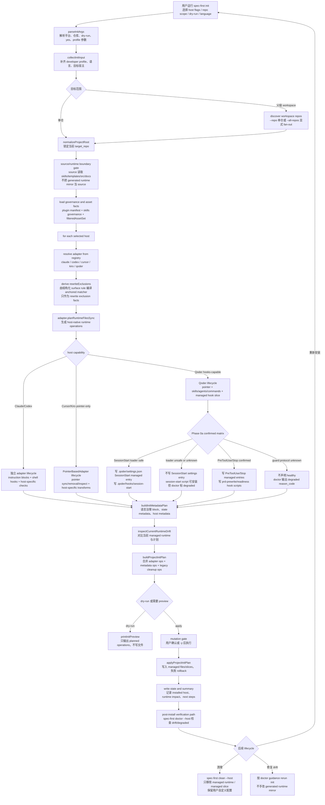

# spec-first init 优化技术方案

## 一、战略论证

### 1.1 为什么现在做

**驱动信号：**

1. **扩展性维护负债（推测性驱动，待需求信号确认）** — 当前 5 宿主已使 UNREWRITTEN_PATH_PATTERNS 达到 O(n²) 维护负债。Kiro 刚接入时已触发全部 4 个现有 adapter 的修改。社区已有 Windsurf、Augment 等新 IDE 采用 AGENTS.md 标准，但**目前尚无 confirmed 的第 6 个宿主接入需求（无用户请求、无 roadmap 承诺、无 POC）**。O(n²) 是内部维护指标，用户不可见；因此本驱动信号属推测性，扩展性投资（Phase 1/3）应待真实接入需求或 POC 承诺出现后再启动（见 1.2 与 5.2 的证据触发约定）。
2. **Qoder hooks 功能缺口** — spec-first 本身运行在 Qoder 环境中，但 Qoder CLI 的 shell-command hooks 仍未覆盖；其事件、matcher、stdout 与配置兼容性需按 Qoder CLI 协议单独验证，这意味着 spec-first 在自己的宿主上缺少 confirmed governance injection。
3. **init.js 3055 行已成维护瓶颈** — 任何 init 逻辑的修改（如上述 Qoder hooks 添加）都需要导航 3000+ 行文件，增加回归风险。
4. **对齐核心链路** — 重构使 pointer-only 新宿主的 adapter 接入从 3-5 天收敛到约 1 天；hooks-capable 宿主仍需额外 protocol/runtime lifecycle spike。更低的 pointer 接入成本直接提升 `Codebase → Spec → Plan → Tasks → Code → Review → Knowledge` 链路的覆盖面（更多宿主 = 更多用户可触达 workflow）。

**核心判断对齐（AGENTS.md）：**
> 这次改动是否让 AI coding 从一次性对话，进一步走向可治理、可验证、可复用、可沉淀的工程闭环？

答：是（限定于工程质量层）。本方案通过降低宿主扩展成本 + 补齐 Qoder governance hooks + 提升可维护性，改善的是 harness 的**内部工程质量与可治理性**。

**价值链诚实声明**：本方案不直接提升 harness 价值的**用户识别度与采纳率**——降低扩展成本、提升可维护性、增加宿主覆盖对最终用户与决策者不可见，不会自动转化为采纳。「价值可被识别/采纳」是断裂因果链下游，属本方案的显式非目标（见 1.2），需另立方案（价值演示、发现性、决策者可见证据）。此处不以采纳目标为纯内部工程改造背书。

### 1.2 非目标（Non-Goals）

本方案明确 **不做** 以下事项：

| 不做 | 原因 |
|------|------|
| 引入外部 adapter 插件系统 | 当前 5+1 宿主规模不需要插件发现机制 |
| 改变 CLI flags、退出码或既有语义 | 允许新增 Qoder CLI hooks 相关 dry-run operation、doctor checks 和 clean cleanup；这是用户可见增强但不是 breaking change |
| 重构 state.json schema | state 模型正确，保持稳定 |
| 修改 skills-governance.json 格式 | governance 合约稳定，只扩展 scope |
| 触碰 dual-host governance contract schema | 契约由独立 schema 管理 |
| 替代宿主即将商品化的能力 | 不重建 session resume、MCP discovery 等 |
| 自动更新用户 CLI 版本 | 保持 read-only 提醒策略 |
| 提升 harness 价值的用户识别度 / 采纳率 | 本方案只解决内部工程质量（扩展成本、可维护性、governance 覆盖）；采纳/价值识别（演示、发现性、决策者可见证据）另立方案 |

### 1.3 用户体验影响承诺

除明确声明的新增能力外，每个 Phase 的行为不变量：

| 不变量 | 验证方式 |
|--------|----------|
| `spec-first init --dry-run` 既有 operation 的 kind/path/reason 不变 | golden snapshot 对比；Phase 0 只允许新增 Qoder CLI hook operations |
| `spec-first doctor` 既有诊断项和 level 不变 | 回归测试断言；Phase 0 只允许新增 Qoder CLI hook checks |
| `spec-first clean` 能处理旧版本安装的产物 | legacy state 测试 |
| 错误消息、退出码保持不变 | CLI smoke test |
| state.json 格式向后兼容 | schema validation test |

### 1.4 Source/Runtime 边界声明

本方案所有变更均为 **source 变更**（`src/cli/`、`templates/`、必要的 `docs/contracts/`、`.gitignore` / context-runtime path rules）。不手改 generated runtime assets（`.claude/`、`.codex/`、`.agents/skills/` 等）。Qoder 的 `.qoder/settings.json` 与 `.qoder/hooks/**` 当前是 Qoder/user-owned surface；Phase 0 若写入它们，必须先把边界修订为“user-owned 文件中的 spec-first managed slice”，并确保 clean 只处理 managed slice。

---

## 二、现状诊断

### 2.1 架构概览

```text
CLI Entry (bin/spec-first.js)
  → dispatch (src/cli/index.js, 225L)
    → runInit (src/cli/commands/init.js, 3055L)
      → parseInitArgs()          -- CLI 参数解析
      → collectInitInput()       -- 交互式输入收集
      → buildInitPlans()         -- per-platform plan 构建
      → applyInitPlan()          -- plan 执行 + rollback
      依赖:
        plugin.js (1467L)        -- Governance-based asset filtering
        state.js (769L)          -- Operation plan model + safety
        developer.js (264L)      -- Global identity management
        claude-settings.js (521L) -- Claude hook matcher management
        atomic-write.js (85L)    -- Windows-aware atomic writes
      平台适配 (adapters/):
        claude.js (425L), codex.js (845L), cursor.js (675L),
        kiro.js (435L), qoder.js (553L)
        总计 ~2930 行
```

### 2.2 核心优势（应保留）

| 能力 | 实现 | 评价 |
|------|------|------|
| Operation Plan 声明式模型 | state.js: plan→preview→apply | 优秀 |
| Atomic Write + Windows EPERM Retry | atomic-write.js: tmp→rename + 10x retry | 优秀 |
| Rollback Backup | init.js: destructive reset 前备份+恢复 | 良好 |
| Adapter 抽象接口 | base.js PlatformAdapter | 良好 |
| Runtime Drift Detection | inspectCurrentRuntimeDrift() | 良好 |
| Path 安全校验 | state.js: symlink escape, Windows reserved, containment | 优秀 |
| Governance 分层过滤 | plugin.js: dual_host/host_exclusive/delivery mode | 良好 |
| Hook merge non-destructive | 保留用户自定义 hooks，只替换 managed entries | 优秀 |

### 2.3 核心问题

| 编号 | 问题 | 严重度 | 影响 |
|------|------|--------|------|
| P0 | init.js 3055L 混合 6+ 职责 | 高 | 任何修改需导航全文，回归风险大 |
| P1 | Adapter O(n²) 排除列表 | 高 | 新宿主接入需修改所有现有 adapter |
| P2 | Plugin.js 1467L 无分层 | 中 | 理解成本高，修改影响面大 |
| P3 | Qoder hooks 完全缺失 | 中 | 功能缺口，spec-first 在自身宿主无 governance |
| P4 | 平台兼容性缺口（UNC、WSL） | 低 | 企业环境特定场景 |
| P5 | 多宿主串行执行 | 低 | 性能浪费但实际 ~2s |

### 2.4 生命周期对称性

```text
┌──────────────────────────────────────────────────────────────────┐
│                    spec-first CLI Lifecycle                       │
├────────────┬──────────────┬─────────────┬────────────────────────┤
│  init      │  update      │  clean      │  doctor                │
│  (安装)    │  (更新)      │  (卸载)     │  (诊断)                │
├────────────┼──────────────┼─────────────┼────────────────────────┤
│ Plan-based │ 委托 init    │ Plan-based  │ Adapter-driven 检查     │
│ dry-run ✓  │ dry-run ✗    │ dry-run ✓   │ JSON report ✓          │
│ rollback ✓ │ npm 幂等     │ 不可逆      │ host-specific checks   │
│ 多宿主 ✓   │ 自动检测     │ 单宿主限制  │ 自动检测已装宿主        │
└────────────┴──────────────┴─────────────┴────────────────────────┘
```

安装核心流程：
```text
收集输入 → 加载manifest → governance过滤 → 构建plan → preview → apply → 写state
```

### 2.5 最佳实践对标

| 原则 | 业界实践 | spec-first 现状 | 评价 |
|------|---------|-----------------|------|
| 幂等性 | init 多次结果一致 | drift detection + hard reset | 良好 |
| Dry-run | 安装前预览 | `--dry-run` 全覆盖 | 优秀 |
| 原子性 | 失败可回滚 | rollback backup | 良好 |
| 声明式 | 描述目标而非步骤 | Operation Plan 模型 | 优秀 |
| 状态追踪 | 知道管理了什么 | state.json per-host | 良好 |
| 安全卸载 | 只删自己管理的 | state-driven removal | 优秀 |
| 跨平台 | 单一实现跨 OS | 纯 Node.js | 优秀 |
| O(1) 扩展 | 新插件不改已有 | ❌ O(n²) 排除列表 | **需改进** |

---

## 三、各宿主合规性分析

### 3.1 产物目录 vs 官方最佳实践

#### Claude Code（2025.07 确认）

| 官方规范 | spec-first 使用 | 符合 |
|---------|----------------|------|
| `CLAUDE.md` — 项目指令 | ✅ instructionFile | 符合 |
| `.claude/settings.json` — hooks/权限 | ✅ hooks 写入此处 | 符合 |
| `.claude/skills/` — 可复用 prompt | ✅ skillsRoot | 完全符合 |
| `.claude/commands/` — 单文件命令 | ✅ commandRoot（官方标注 skills 优先） | 符合 |
| `.claude/agents/` — 子 agent | ✅ agentsRoot | 符合 |
| `.claude/hooks/` — Hook 脚本 | ✅ 4 个 managed hook | 完全符合 |
| `.claude/workflows/` — JS workflow | ❌ 用 `.claude/spec-first/workflows/`（SKILL.md 格式非 JS） | 合理偏离 |

**结论：高度符合**。workflows 路径偏离是合理隔离（格式不同）。

#### Codex

| 官方规范 | spec-first 使用 | 符合 |
|---------|----------------|------|
| `AGENTS.md` — 项目指令 | ✅ instructionFile | 符合 |
| `.codex/hooks/` + `hooks.json` | ✅ SessionStart hook | 符合 |
| `.agents/skills/` — 共享 skills | ✅ skillsRoot（非 `.codex/skills`） | 完全符合 |
| `.codex/agents/` | ✅ agentsRoot | 符合 |

**结论：完全符合**。

#### Cursor

| 官方规范 | spec-first 使用 | 符合 |
|---------|----------------|------|
| `.cursor/rules/` — path-scoped 规则 | ✅ pointer 文件 | 符合 |
| `.cursor/skills/` — SKILL.md + frontmatter | ✅ skillsRoot | 符合 |
| Hooks | ❌ **Cursor 不支持 hooks** | ⛔ 正确跳过 |

**结论：完全符合**。

#### Kiro

| 官方规范 | spec-first 使用 | 符合 |
|---------|----------------|------|
| `.kiro/steering/` — 核心 context | ✅ pointer 文件 | 符合 |
| `.kiro/skills/` | ✅ skillsRoot | 符合 |
| `.kiro/hooks/` — agent-prompt hooks | ❌ 未安装（模型不兼容） | ⚠️ 合理 |

**结论：基本符合**。Kiro hooks 是 agent-prompt 模型（非 shell），适配成本高收益低。

#### Qoder

| 官方规范 | spec-first 使用 | 符合 |
|---------|----------------|------|
| `.qoder/rules/` | ✅ pointer 文件 | 符合 |
| `.qoder/skills/` | ✅ skillsRoot | 符合 |
| `.qoder/commands/` | ✅ commandRoot | 符合 |
| `.qoder/settings.json` → hooks | ❌ **未安装** | ⚠️ **可行缺口** |

**结论：产物目录符合，hooks 是可行增强项。**

#### 总结对照

| 宿主 | 目录合规 | Hooks 平台支持 | spec-first hooks 覆盖 | 差距 |
|------|---------|--------------|---------------------|------|
| Claude | ✅ 完全 | ✅ Shell hooks | ✅ 4 hooks（最完整） | 无 |
| Codex | ✅ 完全 | ✅ Shell hooks | ⚠️ SessionStart only | 缺 guard hooks |
| Cursor | ✅ 完全 | ❌ 不支持 | ⛔ 正确跳过 | 无 |
| Kiro | ✅ 基本 | ⚠️ Agent-prompt（非 shell） | ❌ 未覆盖 | 模型不兼容 |
| Qoder CLI | ✅ 完全 | ✅ Shell hooks（需按 Qoder CLI 文档确认配置形态） | ❌ **未覆盖** | **本轮可修复** |
| Qoder IDE/JB plugin | ✅ 基本 | ⚠️ Hooks surface 存在但配置/exec-form/协议需单独验证 | ❌ **未覆盖** | follow-up，不纳入本轮 confirmed scope |

### 3.2 Hook 设计深度分析

#### 当前 Hook 清单

| Hook | 事件 | 宿主 | 功能 |
|------|------|------|------|
| session-start | SessionStart | Claude/Codex | workflow entry governance + version reminder |
| spec-plan-guard | UserPromptExpansion | Claude | `/spec-plan` 命令展开时注入约束 |
| prd-prewrite-guard | PreToolUse | Claude | Write/Edit 前检查 PRD 上下文 |
| prd-readiness-guard | Stop | Claude | 任务结束时检查 PRD readiness |

#### 设计优点

1. **Cross-platform Node.js** — `#!/usr/bin/env node`，macOS/Linux/Windows 均可运行
2. **Exec-form hooks** — Claude 使用 `{command: "node", args: [path]}` 避免 shell 差异
3. **Degraded-mode safe** — try/catch 包裹 I/O，失败注入 fallback 而非 abort
4. **幂等覆盖** — 每次 init 覆盖写入 + drift detection
5. **Merge non-destructive** — Codex hooks.json 合并保留用户自定义
6. **Global pollution detection** — Codex 检测 CODEX_HOME 级全局 hook 污染

#### Qoder 支持范围与事件模型兼容性分析

**本轮支持范围**：Phase 0 只把 **Qoder CLI hooks** 纳入 confirmed scope。Qoder IDE/JB plugin hooks 作为 follow-up compatibility spike，不在本轮写入 confirmed runtime contract，也不把 IDE/JB 的 hooks 行为当作 `spec-first init --qoder` 成功标准。

理由：
- `spec-first init` 是 CLI 分发的 runtime projection，先覆盖 Qoder CLI 能最小闭环验证 init/doctor/clean/drift。
- Qoder CLI hooks 与 IDE/JB plugin hooks 属于不同宿主 surface；二者共享项目级 `.qoder/settings.json` 等配置文件，但不能直接假设 exec-form `{ command, args }`、matcher 与 stdout 控制协议在所有 surface 上完全一致。
- IDE/JB plugin 支持需要单独产出 confirmed evidence 后再从 degraded/follow-up 升级为 confirmed capability。

**价值锚点（对齐 AGENTS.md「不重建商品化 primitive」）**：hook 机制（事件、matcher、stdin/stdout 管道）本身是宿主正在商品化的底座，本方案的差异化价值不在重建这套 plumbing，而在其上注入的 **spec-first governance 内容**（PRD prewrite/readiness 约束、workflow entry governance）。因此 Phase 0 的价值必须钉在 governance injection 上；hook plumbing 只是达成它的必要管道，若某宿主未来原生提供等价 governance 注入点，应优先复用而非自建。

| Claude 事件 | Qoder 事件 | stdin/stdout 协议 | 兼容性 |
|------------|-----------|------------------|--------|
| SessionStart | SessionStart（Qoder CLI only） | ⚠️ 事件存在，但 IDE/JB 当前未列出该事件 | 需按 Qoder CLI 协议投影 |
| UserPromptExpansion | 无等价事件；UserPromptSubmit 只能做 prompt-content inspection | ⚠️ Qoder 无独立 expansion 事件；Phase 0 不迁移 spec-plan-guard | 不兼容 |
| PreToolUse | PreToolUse | ⚠️ 事件存在，payload/tool name/output/env/path 需投影验证 | 可迁移语义，不直接移植 |
| PostToolUse | PostToolUse | ⚠️ 事件存在，Phase 0 不需要 | 非本轮目标 |
| Stop | Stop | ⚠️ 事件存在，但阻断协议需改为 Qoder `exit 2`/stderr | 可迁移语义，不直接移植 |

**关键差异**：
- Qoder CLI 当前文档列出 `SessionStart`，matcher 对应 `startup/resume/clear/compact/new` 等 session source；IDE/JB plugin 文档当前只列 `UserPromptSubmit/PreToolUse/PostToolUse/PostToolUseFailure/Stop`，未列 `SessionStart`。
- `UserPromptSubmit` 与 `UserPromptExpansion` 都在 prompt 到达模型前触发，但 Qoder 的是统一 prompt 事件，不能按 tool/command name matcher 等价迁移 Claude 的 command expansion guard。
- Qoder CLI hooks 配置写入 `.qoder/settings.json` 的 `hooks` key；该项目级文件会被 Qoder CLI 与 IDE/JB plugin 共同读取，因此 Phase 0 需要验证 shared settings 对 CLI-only event（如 `SessionStart`）的 loader 容忍度。该验证只证明“不破坏 IDE/JB 加载”，不等于声明 IDE/JB hooks support。
- Qoder CLI 的 `Stop` 阻断路径是 `exit 2` + stderr 注入；Claude 现有 `decision: "block"` + `exit 0` 输出不能直接移植。

**Qoder hooks 适配策略**：

| Claude hook | Qoder 映射 | 可行性 | 优先级 |
|------------|-----------|--------|--------|
| session-start → SessionStart | SessionStart（Qoder CLI native） | ⚠️ 需验证 shared `.qoder/settings.json` 对 IDE/JB loader 安全；失败则不写 session-start settings entry | 高 |
| spec-plan-guard → UserPromptExpansion | 不迁移；未来若需要只能做 prompt-content inspection hook | ⛔ Phase 0 不安装 | 低 |
| prd-prewrite-guard → PreToolUse | PreToolUse | ⚠️ 投影 Claude 语义，改用 Qoder payload/env/path/output 协议 | 高 |
| prd-readiness-guard → Stop | Stop | ⚠️ 投影 Claude 语义，阻断改为 `exit 2` + stderr，并检查 `stop_hook_active` 防循环 | 高 |

### 3.3 更新感知机制（已有，需小幅增强）

当前已实现完整版本提醒体系（version-reminder.js, 790L）：
- CLI 命令触发 + session hook 触发双通道
- 24h 冷却 + per-version-pair 冷却
- CI/非 TTY 自动跳过
- 严格 read-only（只提示不安装）

**唯一增强建议**：增加 `--skip <version>` 精确跳过某版本提醒（0.5 天工作量）。

**路线图归属**：本轮**不做** `--skip <version>`。它未纳入第五章任何 Phase、优先级表或 7-12 天总工期；作为独立小任务待有需求再单列，不在本方案的分阶段验收范围内。此处显式声明以免它在路线图中悬空。

---

## 四、优化方案

### 4.1 设计哲学

```text
目标状态 = f(source_skills, governance_rules, platform_registry)
当前状态 = read(state.json) + scan(disk)
操作计划 = diff(目标状态, 当前状态)
执行 = apply(操作计划) with rollback
```

优化不是重新设计，而是让实现与设计意图对齐：拆分职责、消除重复、数据驱动。

### 4.2 Platform Registry（消除 O(n²) 的关键）

Platform Registry 不应是“把各 adapter 的正则搬到一个对象里”。最佳方案是把它定义为 **结构化 host surface declaration**：registry 只描述一个编程工具的 runtime surface、ownership、能力与 path rule；regex/glob 编译、锚定、legacy 兼容 delta 由 compiler 和 tests 负责。这样后续接入 Windsurf、Augment 或其他 AGENTS.md-native 编程工具时，新增工作集中在“声明该工具拥有哪些 surface”和“选择 pointer/hooks 能力模块”，而不是修改所有既有 adapter 的排除规则。

设计原则：
- **Declarative, not regex snippets**：配置作者声明 `file` / `dir` / `glob` / `managed-slice`，不直接写 `suffixPattern`。
- **Ownership first**：每条 path rule 必须声明 `ownership`，区分 `generated-runtime`、`host-local`、`host-user-owned`、`managed-slice`。
- **Anchored compiler**：默认对 repo-relative normalized path 做 anchored match；legacy 未锚定行为只能通过显式 `compatibilityDelta` 保留。
- **Capability granularity**：hooks 能力不是一个 `shellHooks: true` 布尔值，而是按事件/阻断/loader safety 表达 confirmed/degraded 状态。
- **Host-specific escape hatch**：Codex cross-root、Qoder managed slice、Claude settings merge 等特殊性保留在结构化字段里，不塞进通用 adapter 抽象。

**新增编程工具接入合同**：
1. 新增工具必须先声明 `runtimeRoot`、`surfaces`、`rewriteExclusions`、`capabilities`，每条 path rule 必须带 ownership。
2. pointer-only 工具只能实现 pointer lifecycle + skill/agent text transform；不得新增 hooks/doctor/clean 行为的隐式假设。
3. hooks-capable 工具必须先走 protocol spike，确认 settings schema、command execution form、event payload、blocking output 和 cross-surface loader safety 后，才能把 hook capability 标为 confirmed。
4. 任何 host-user-owned 文件只能通过 `managed-slice` 声明；clean/doctor/drift 不得把整文件或整目录当 spec-first-owned generated runtime。
5. 新工具接入验收的核心是“不修改既有 adapter 且 existing host output 不变”，不是 LOC 下降。

```javascript
// src/cli/adapters/platform-registry.js (~180L)
const PLATFORM_REGISTRY = {
  claude: {
    runtimeRoot: '.claude',
    surfaces: {
      managedRoot: { kind: 'dir', path: '.claude/spec-first/', ownership: 'generated-runtime' },
      skillsRoot: { kind: 'dir', path: '.claude/skills/', ownership: 'generated-runtime' },
      workflowsRoot: { kind: 'dir', path: '.claude/spec-first/workflows/', ownership: 'generated-runtime' },
      agentsRoot: { kind: 'dir', path: '.claude/agents/', ownership: 'generated-runtime' },
      commandRoot: { kind: 'dir', path: '.claude/commands/', ownership: 'generated-runtime' },
      hooksDir: { kind: 'dir', path: '.claude/hooks/', ownership: 'generated-runtime' },
      settingsFile: { kind: 'managed-slice', path: '.claude/settings.json', ownership: 'host-user-owned', managedKeys: ['hooks'] },
    },
    capabilities: {
      hooks: {
        shellCommand: 'confirmed',
        sessionStart: 'confirmed',
        preToolUse: 'confirmed',
        stopBlocking: 'confirmed',
      },
    },
    rewriteExclusions: [
      { kind: 'glob', path: '.claude/commands/spec/*.md', ownership: 'generated-runtime' },
      { kind: 'glob', path: '.claude/commands/spec-*.md', ownership: 'generated-runtime' },
      { kind: 'dir', path: '.claude/spec-first/workflows/', ownership: 'generated-runtime' },
      { kind: 'dir', path: '.claude/skills/', ownership: 'generated-runtime' },
      { kind: 'dir', path: '.claude/agents/', ownership: 'generated-runtime' },
    ],
  },
  codex: {
    runtimeRoot: '.codex',
    surfaces: {
      managedRoot: { kind: 'dir', path: '.codex/spec-first/', ownership: 'generated-runtime' },
      skillsRoot: { kind: 'dir', path: '.agents/skills/', ownership: 'generated-runtime', crossRuntimeRoot: true },
      workflowsRoot: { kind: 'dir', path: '.agents/skills/', ownership: 'generated-runtime', crossRuntimeRoot: true },
      agentsRoot: { kind: 'dir', path: '.codex/agents/', ownership: 'generated-runtime' },
      commandRoot: { kind: 'dir', path: '.codex/commands/spec/', ownership: 'generated-runtime' },
      hooksDir: { kind: 'dir', path: '.codex/hooks/', ownership: 'generated-runtime' },
      hooksJsonFile: { kind: 'file', path: '.codex/hooks.json', ownership: 'generated-runtime' },
    },
    capabilities: {
      hooks: {
        shellCommand: 'confirmed',
        sessionStart: 'confirmed',
        preToolUse: 'not-supported-by-spec-first',
        stopBlocking: 'not-supported-by-spec-first',
      },
    },
    rewriteExclusions: [
      { kind: 'glob', path: '.codex/commands/spec/*.md', ownership: 'generated-runtime' },
      { kind: 'glob', path: '.codex/commands/spec-*.md', ownership: 'generated-runtime' },
      { kind: 'dir', path: '.codex/skills/', ownership: 'generated-runtime' },
      { kind: 'dir', path: '.codex/agents/', ownership: 'generated-runtime' },
      { kind: 'dir', path: '.agents/skills/', ownership: 'generated-runtime', crossRuntimeRoot: true },
    ],
  },
  cursor: {
    runtimeRoot: '.cursor',
    surfaces: {
      managedRoot: { kind: 'dir', path: '.cursor/spec-first/', ownership: 'generated-runtime' },
      skillsRoot: { kind: 'dir', path: '.cursor/skills/', ownership: 'generated-runtime' },
      agentsRoot: { kind: 'dir', path: '.cursor/agents/', ownership: 'generated-runtime' },
      pointerPath: { kind: 'managed-slice', path: '.cursor/rules/spec-first.mdc', ownership: 'host-user-owned' },
      mcpConfig: { kind: 'file', path: '.cursor/mcp.json', ownership: 'host-local' },
    },
    capabilities: { hooks: { shellCommand: 'not-supported' } },
    rewriteExclusions: [
      { kind: 'dir', path: '.cursor/skills/', ownership: 'generated-runtime' },
      { kind: 'dir', path: '.cursor/spec-first/', ownership: 'generated-runtime' },
      { kind: 'file', path: '.cursor/mcp.json', ownership: 'host-local' },
      { kind: 'dir', path: '.cursor/agents/', ownership: 'generated-runtime' },
    ],
  },
  kiro: {
    runtimeRoot: '.kiro',
    surfaces: {
      managedRoot: { kind: 'dir', path: '.kiro/spec-first/', ownership: 'generated-runtime' },
      skillsRoot: { kind: 'dir', path: '.kiro/skills/', ownership: 'generated-runtime' },
      agentsRoot: { kind: 'dir', path: '.kiro/agents/', ownership: 'generated-runtime' },
      pointerPath: { kind: 'managed-slice', path: '.kiro/steering/spec-first.md', ownership: 'host-user-owned' },
      settingsDir: { kind: 'dir', path: '.kiro/settings/', ownership: 'host-local' },
    },
    capabilities: { hooks: { shellCommand: 'not-supported' } },
    rewriteExclusions: [
      { kind: 'glob', path: '.kiro/commands/spec/*.md', ownership: 'generated-runtime' },
      { kind: 'glob', path: '.kiro/commands/spec-*.md', ownership: 'generated-runtime' },
      { kind: 'dir', path: '.kiro/skills/', ownership: 'generated-runtime' },
      { kind: 'dir', path: '.kiro/agents/', ownership: 'generated-runtime' },
      { kind: 'dir', path: '.kiro/spec-first/', ownership: 'generated-runtime' },
      { kind: 'dir', path: '.kiro/settings/', ownership: 'host-local' },
    ],
  },
  qoder: {
    runtimeRoot: '.qoder',
    surfaces: {
      managedRoot: { kind: 'dir', path: '.qoder/spec-first/', ownership: 'generated-runtime' },
      skillsRoot: { kind: 'dir', path: '.qoder/skills/', ownership: 'generated-runtime' },
      agentsRoot: { kind: 'dir', path: '.qoder/agents/', ownership: 'generated-runtime' },
      commandRoot: { kind: 'dir', path: '.qoder/commands/', ownership: 'generated-runtime' },
      pointerPath: { kind: 'managed-slice', path: '.qoder/rules/spec-first.md', ownership: 'host-user-owned' },
      settingsFile: { kind: 'managed-slice', path: '.qoder/settings.json', ownership: 'host-user-owned', managedKeys: ['hooks'] },
      settingsLocalFile: { kind: 'file', path: '.qoder/settings.local.json', ownership: 'host-local' },
      hooksDir: { kind: 'managed-slice-dir', path: '.qoder/hooks/', ownership: 'host-user-owned', managedFilesOnly: true },
    },
    capabilities: {
      hooks: {
        shellCommand: 'confirmed-after-phase-0a',
        sessionStart: 'degraded-until-shared-loader-safe',
        preToolUse: 'confirmed-after-phase-0a',
        stopBlocking: 'confirmed-after-phase-0a',
      },
    },
    rewriteExclusions: [
      { kind: 'glob', path: '.qoder/commands/spec/*.md', ownership: 'generated-runtime' },
      { kind: 'glob', path: '.qoder/commands/spec-*.md', ownership: 'generated-runtime' },
      { kind: 'dir', path: '.qoder/skills/', ownership: 'generated-runtime' },
      { kind: 'dir', path: '.qoder/agents/', ownership: 'generated-runtime' },
      { kind: 'dir', path: '.qoder/spec-first/', ownership: 'generated-runtime' },
      { kind: 'file', path: '.qoder/settings.local.json', ownership: 'host-local' },
      { kind: 'managed-slice', path: '.qoder/settings.json', ownership: 'host-user-owned', managedKeys: ['hooks'] },
    ],
  },
};
```

### 4.3 自动派生 UNREWRITTEN_PATH_PATTERNS（修正版）

**关键改进**：当前 patterns 不是简单前缀，且 legacy set 彼此不一致。新方案不再让 registry 作者手写 regex 片段，而是用结构化 rule 编译为 anchored matcher。legacy 未锚定行为只作为 migration delta 处理。

```javascript
/**
 * 为指定 platformId 生成排除其他所有宿主的路径模式。
 * 从 PLATFORM_REGISTRY.rewriteExclusions 自动构建 anchored regex。
 */
function deriveUnrewrittenPatterns(platformId) {
  const registry = require('./platform-registry');
  return Object.entries(registry.PLATFORM_REGISTRY)
    .filter(([id]) => id !== platformId)
    .flatMap(([, config]) => config.rewriteExclusions || [])
    .filter(rule => rule.ownership !== 'host-user-owned' || rule.kind === 'managed-slice')
    .map(compilePathRule);
}

function compilePathRule(rule) {
  const normalized = normalizeRepoRelativePath(rule.path);
  if (rule.kind === 'file' || rule.kind === 'managed-slice') {
    return new RegExp(`^${escapeForRegex(normalized)}$`);
  }
  if (rule.kind === 'dir' || rule.kind === 'managed-slice-dir') {
    return new RegExp(`^${escapeForRegex(normalized)}(?:.*)?$`);
  }
  if (rule.kind === 'glob') {
    return new RegExp(`^${globToRegexSource(normalized)}$`);
  }
  throw new Error(`Unsupported platform registry path rule kind: ${rule.kind}`);
}
```

**锚定策略**：生成的 regex 默认添加 `^...$`，输入必须先转换为 repo-relative normalized path（统一 `/`，去掉 leading `./`）。这是目标态最佳实践。与当前未锚定 legacy pattern 的差异不应隐藏在 compiler 里，而应写入 `compatibilityDelta` / fixture / changelog。

**ownership 策略**：
- `generated-runtime`：可由 init/clean/doctor 管理整文件或整目录。
- `host-local`：可排除 rewrite，可由 doctor 读取 advisory facts；clean 默认不删除，除非已有明确 managed marker。
- `host-user-owned`：不能视为 generated runtime；只能在显式 managed slice 下 upsert/remove。
- `managed-slice` / `managed-slice-dir`：registry 只声明 slice 边界，具体 upsert/removal 必须由 host-specific module 保证 non-destructive merge。

**验证策略**：**「双向等价」在现状下不可达**——已核实 cursor/kiro/codex/qoder 四个 legacy 排除列表彼此并不一致（例如 `kiro.js` 缺少 `.claude/commands/spec-[a-z-]+\.md` 与 `.cursor/agents/`，却独有一条 bare `/\.qoder\/commands\/spec\//`），单一 registry 派生结果对某些宿主必然同时「更宽」和「更窄」。因此 Phase 1 必须：
1. **前置步骤**：对四个 legacy set 做两两 diff，产出一张**完整 delta 表**（每条注明 registry 取宽还是取窄、影响哪个宿主、用户可见影响、ownership 归类）。
2. **验收标准改写**：从「与硬编码双向等价」改为「**等价 modulo 一张显式枚举的 delta 表**」——即除 delta 表列出的 intentional 差异外，匹配集合不变。每条 delta 用独立 fixture 与 changelog 说明。
3. **compiler contract tests**：覆盖 `file`、`dir`、`glob`、`managed-slice`、路径归一化、锚定行为、unsupported kind 报错。
4. **ownership contract tests**：证明 `host-user-owned` path 不会被误当 generated runtime clean，Qoder `.qoder/settings.json` 只能通过 managed hook slice 修改。

golden snapshot + negative fixture 验证的是「等价 modulo delta 表」，而非无差别双向等价。

```javascript
// tests/unit/platform-registry-patterns.test.js
for (const platformId of ['cursor', 'kiro', 'qoder']) {
  it(`derived patterns for ${platformId} match legacy hardcoded set`, () => {
    const derived = deriveUnrewrittenPatterns(platformId);
    const legacy = loadLegacyPatterns(platformId);
    // 验证 1: 每个 legacy pattern 匹配的字符串，derived 也匹配
    for (const testCase of generateTestStringsFromLegacy(legacy)) {
      expect(derived.some(d => d.test(testCase))).toBe(true);
    }
    // 验证 2: derived 不匹配 legacy 未匹配的 representative negatives
    for (const negative of generateRepresentativeNegatives(platformId)) {
      expect(derived.some(d => d.test(negative))).toBe(false);
    }
  });
}
```

**已知需显式处理的差异（非穷举——Phase 1 前置 diff 需补全）**：
- `.qoder/settings.json` 与 `.qoder/settings.local.json` 是否都应被其他宿主视为 non-target runtime path；当前 Kiro hardcoded pattern 只覆盖 `.qoder/settings.local.json`。若纳入 `rewriteExclusions`，`.qoder/settings.json` 必须是 `managed-slice`，含义仅是“其他宿主内容改写时排除该 Qoder surface”，不改变 Qoder/user-owned ownership；spec-first 仍只能管理其中的 hook slice。
- `.cursor/mcp.json` 应保持精确 `file` rule；不得用 `.cursor/mcp` + regex suffix 这类过宽表达。
- **kiro legacy 缺 `.claude/commands/spec-[a-z-]+\.md`**（cursor/qoder 都有）：registry 派生会让 kiro 变**更宽**——需确认这是可接受的收敛。
- **kiro legacy 缺 `.cursor/agents/`**（qoder 有）：registry 派生会让 kiro 变**更宽**。
- **kiro legacy 独有 bare `/\.qoder\/commands\/spec\//`**：registry 只生成 `.qoder/commands/spec/[a-z-]+\.md` 等具体形态，派生会让 kiro 变**更窄**——需确认是否补一条等价 rule 或接受收窄。
- 以上仅为已发现项；Phase 1 前置 diff 必须枚举 cursor/kiro/codex/qoder 的全部结构性差异，逐条落入 delta 表。

**收益**：
- 添加新的 pointer-only 编程工具时，adapter runtime path rewrite 只需在 registry 添加 `surfaces` / `rewriteExclusions`，0 行现有 adapter 代码修改
- adapter path-rewrite 维护从 O(n²) → O(1)；完整新增工具接入仍需注册、governance scope、gitignore/context/task-pack 等消费者检查
- 对支持 shell hooks 的新宿主，额外工作限于新增 hooks 模块和 settings/doctor/clean/drift 闭环，仍不修改其他 adapter

**新增工具最小声明模板**：

```javascript
newTool: {
  runtimeRoot: '.new-tool',
  surfaces: {
    pointerPath: { kind: 'managed-slice', path: '.new-tool/rules/spec-first.md', ownership: 'host-user-owned' },
    skillsRoot: { kind: 'dir', path: '.new-tool/skills/', ownership: 'generated-runtime' },
    agentsRoot: { kind: 'dir', path: '.new-tool/agents/', ownership: 'generated-runtime' },
  },
  capabilities: { hooks: { shellCommand: 'not-supported' } },
  rewriteExclusions: [
    { kind: 'dir', path: '.new-tool/skills/', ownership: 'generated-runtime' },
    { kind: 'dir', path: '.new-tool/agents/', ownership: 'generated-runtime' },
  ],
}
```

该模板是 pointer-only 默认路径。若新工具支持 hooks，不在这个声明里直接假设可用，而是在 Phase 0 风格的 protocol spike 后补充 `settingsFile`、`hooksDir`、managed hook slice 和 confirmed/degraded capability。

### 4.4 PointerBasedAdapter 基类

```text
PlatformAdapter (base.js, 177L — 不变)
├── ClaudeAdapter (独立, ~425L) — hooks×4, settings.json, CLAUDE.md, workflows 独立
├── CodexAdapter (独立, ~845L) — .agents/ 跨域, hooks.json, legacy×4, pollution
└── PointerBasedAdapter (新, ~150L) — pointer sync/removal/inspect + auto-derive patterns
    ├── CursorAdapter (~120L) — .mdc frontmatter, nested scan
    ├── KiroAdapter (~80L) — steering 目录, agent tool list injection
    └── QoderAdapter (~220-260L) — hasCommands + pointer, agent tool pinning + Qoder CLI hook lifecycle
```

PointerBasedAdapter 封装：
- `planRuntimeFilesSync()` → 统一 `planHostNativePointerSync`，但子类可追加 hook 或 host-specific runtime file operations
- `planRuntimeFilesRemoval()` → 统一 `planHostNativePointerRemoval`，但子类可追加 legacy command namespace、hook file、settings cleanup
- `inspectRuntimeFiles()` → 统一 `inspectHostNativePointer`，但子类必须保留现有 frontmatter、agent tool pinning、workflow skill name rewrite、runtime path rewrite 等 host-specific drift checks
- `getUnrewrittenPathPatterns()` → 从 registry 自动派生

**抽象边界**：PointerBasedAdapter 只封装 pointer lifecycle 和 cross-host runtime path exclusion，不吞并 Cursor/Kiro/Qoder 的 `transformSkillContent`、`transformAgentContent`、frontmatter validation、host pin injection、agent tools policy 或 Qoder hook lifecycle。LOC 下降是副产物，不是硬 gate；Phase 3 的验收必须证明现有 warning/error 不减少，除非某项减少被单独记录为 intentional behavior change。

**命名/契合度说明**：Qoder 既是 pointer-based 又是 hooks-capable，与 Cursor/Kiro 的纯 pointer 形态不完全同轴——基类名「PointerBased」只描述其**共享的 pointer lifecycle**，不代表 Qoder 的 hook lifecycle 被基类接管。若后续再出现第 2 个 hooks-capable 的 pointer 宿主，应重新评估是否抽出独立的 hook lifecycle mixin，而不是继续往本基类塞 hook 逻辑。另注：degraded 情形下 `templates/qoder/hooks/session-start` 脚本会被安装但不被 settings 引用，成为 managed-but-unreferenced 文件；doctor 须能识别该「degraded-by-design 死文件」状态，clean 也须能移除它，不得误判为 drift。

### 4.5 init.js 模块拆分

```text
src/cli/commands/
  init.js              (~250L) 编排入口: parse→collect→build→preview→apply
  init-args.js         (~120L) 参数解析: parseInitArgs, INIT_PLATFORM_CHOICES
  init-input.js        (~200L) 交互收集: collectInitInput, prompts
  init-plan.js         (~400L) Plan 构建: buildProjectInitPlan, drift, state
  init-apply.js        (~200L) Plan 执行: applyProjectInitPlan, rollback
  init-output.js       (~250L) 输出格式: preview, success, next-steps
  init-workspace.js    (~250L) Multi-repo: discover, workspace plan, summary
  init-developer.js    (~150L) Profile: global developer, legacy cleanup
```

拆分原则：
1. 按职责拆分，保持 exports 兼容（init.js re-export）
2. 无行为变更——纯代码组织
3. 现有 `require('./init')` 继续工作

### 4.6 Plugin 模块分层

```text
src/cli/
  plugin.js            (~200L) 外部 API: loadPluginManifest, buildFilteredAssetSet (thin facade)
  plugin-manifest.js   (~400L) Manifest 构建: governance JSON 解析, 资产发现
  plugin-governance.js (~300L) Governance 过滤: scope, delivery, anchor 验证
  plugin-sync.js       (~400L) Asset sync planning: planBundledAssetSync, inspectInstalledAssets
```

### 4.7 Qoder Hooks 补齐

> **⚠️ 待验证假设声明（advisory, 非 confirmed contract）**：本节出现的 `.qoder/settings.json` schema、`QODER_PROJECT_DIR`、`additionalContext`、`exit 2` + stderr 阻断协议、`stop_hook_active` 防循环、`Write|Edit|MultiEdit` matcher 等协议细节，均为 **Phase 0a spike 待验证的假设**，正文示例仅表达预期形态。Phase 0a 的实测结果可推翻其中任意一项；在 0a 产出 confirmed/degraded matrix 前，不得将本节示例当作 confirmed runtime contract 直接固化实现。

#### 4.7.0 Scope: Qoder CLI first

Phase 0 只把 Qoder CLI hooks 行为纳入 confirmed runtime contract。由于项目级 `.qoder/settings.json` 会被 Qoder CLI 与 IDE/JB plugin 共同读取，本轮必须同时做 **cross-surface loader safety** 验证：确认 IDE/JB 对 CLI 需要的配置（尤其 `SessionStart` 事件、command shell form、无 matcher group）不会拒绝加载或破坏既有 IDE/JB hooks。该验证只证明 shared config 安全，不声明 IDE/JB hook 行为受 spec-first 支持；IDE/JB 行为支持仍是 follow-up compatibility spike。

若 cross-surface loader safety 无法确认或验证失败，Phase 0 不写入 CLI-only `SessionStart` settings entry；只安装已验证且 IDE/JB 也支持的 `PreToolUse`/`Stop` managed entries，doctor 报告 `qoder_session_start_degraded`。若本地环境或官方文档后续证明 IDE/JB settings schema、事件和 stdout 协议与 CLI 完全兼容，可作为后续 Phase 0c 增强。

**Managed slice boundary**：`.qoder/settings.json` 和 `.qoder/hooks/**` 当前是 Qoder/user-owned surface，不是完整 generated runtime mirror。Phase 0 必须先更新 source/runtime customization contract、gitignore/context-runtime path rules 和 clean/doctor wording，把 spec-first 写入范围限定为 managed hook groups + managed hook script files；禁止把整个 `.qoder/settings.json` 或整个 `.qoder/hooks/` 目录当成 spec-first-owned runtime。

#### 4.7.1 实现方案

基于代码分析，Qoder hooks 的添加涉及以下联动：

**init 联动**（init.js `buildInitMetadataPlan`）：
```javascript
// 类比 Claude 的 hook upsert（init.js L2846-L2854）
if (platform === 'qoder') {
  const rendered = renderManagedQoderHooksUpsert(projectRoot);
  operations.push(buildPlanFileOperation(
    projectRoot,
    '.qoder/settings.json',
    rendered.contents,
    'managed_qoder_hooks',
  ));
}
```

**clean 联动**（clean.js `buildRuntimeCleanupPreview`）：
```javascript
// 类比 Claude 的 hook removal（clean.js L419-L435）
if (adapter.id === 'qoder') {
  const rendered = renderManagedQoderHooksRemoval(projectRoot);
  if (rendered) {
    operations.push(rendered.existsAfter
      ? buildRelativeOperation('update_file', '.qoder/settings.json', 'managed_qoder_hook_cleanup', { contents: rendered.contents })
      : buildRelativeOperation('remove_file', '.qoder/settings.json', 'managed_qoder_hook_cleanup'));
  }
}
```

**清理契约**：`renderManagedQoderHooksRemoval()` 只能移除 spec-first managed hook groups 和 managed hook script references；若 `.qoder/settings.json` 不存在或不含 managed slice，必须返回 null/no-op，clean 不得删除文件。若 `.qoder/settings.json` 中存在用户自定义 hooks、非 managed group、其他 settings key，必须原样保留。只有当 removal 后文件不再包含任何用户配置或非 managed hooks 时，clean 才能删除 `.qoder/settings.json`。

**doctor 联动**（doctor.js `buildHostSpecificChecks`）：
```javascript
// 类比 Claude 的 hook inspection（doctor.js L963）
if (adapter.id === 'qoder') {
  return [
    checkQoderLocalMcpConfig(projectRoot),
    ...inspectManagedQoderHooks(projectRoot).map(status => ({
      level: status.status === 'installed' ? 'PASS' : 'WARNING',
      name: `.qoder/settings.json ${status.displayName}`,
      message: status.message,
      fix: status.status !== 'installed'
        ? formatInitGuidance('qoder', `to restore the managed ${status.displayName} hook entry`)
        : undefined,
    })),
  ];
}
```

**drift detection 联动**（init.js `inspectCurrentRuntimeDrift`）：
```javascript
// 类比 Claude 的 drift check（init.js L2441-L2450）
if (adapter.id === 'qoder') {
  for (const status of inspectManagedQoderHooks(projectRoot)) {
    if (status.status !== 'installed') {
      reasons.push(`qoder_settings_${status.eventName}_${status.status}`);
    }
  }
}
```

#### 4.7.2 新增文件

| 文件 | 内容 | 行数估计 |
|------|------|---------|
| `src/cli/qoder-settings.js` | hook upsert/removal/inspect；`renderManagedQoderHooksRemoval` 返回 `{filePath, existsAfter, contents}` 或 null/no-op（与 claude-settings.js 的 non-destructive removal 契约一致） | ~220L |
| `templates/qoder/hooks/session-start` | Node.js hook 脚本；读 `AGENTS.md`，使用 `QODER_PROJECT_DIR` / stdin `cwd` / `process.cwd()` 定位项目，输出 Qoder `SessionStart` 支持的 `additionalContext` | ~170L |
| `templates/qoder/hooks/prd-prewrite-guard` | Node.js hook 脚本；Qoder CLI `PreToolUse` 下投影 Claude prewrite guard 语义，使用 Qoder payload/env/path/output 协议 | ~170L |
| `templates/qoder/hooks/prd-readiness-guard` | Node.js hook 脚本；Qoder CLI `Stop` 下投影 Claude readiness guard 语义，阻断必须走 `exit 2` + stderr，并在 `stop_hook_active` 为 true 时放行防循环 | ~180L |

**安装闭环要求**：`QoderAdapter.planRuntimeFilesSync()` 必须写入 `.qoder/hooks/*` managed hook scripts，并设置可执行 mode；`planRuntimeFilesRemoval()`/clean 必须移除这些 managed hook scripts；doctor 与 init drift detection 必须同时检查 settings managed hook entry 和 hook script 文件是否存在、内容是否为 managed current version。只写 `.qoder/settings.json` 不算完成 Phase 0。

#### 4.7.3 Qoder hooks JSON schema

`spec-first init --qoder` 写入的是项目级 `.qoder/settings.json`，会被 Qoder CLI 与 IDE/JB plugin 共同读取。为避免 CLI-only `args` exec-form 泄漏到未验证的 IDE/JB surface，本轮使用保守的 shell command string；若后续确认所有目标 surface 都支持 exec-form，再单独评估 `{ command, args }` 迁移。`UserPromptSubmit` 与 `Stop` 这类无 matcher 事件必须省略 `matcher`；`SessionStart` 只有 Qoder CLI 文档当前列出，写入前必须验证 IDE/JB loader safety。`PreToolUse` 的 `"Write|Edit|MultiEdit"` matcher 必须由本地 smoke 验证 Qoder CLI 接受，并确认 IDE/JB 对 compatible tool names 的映射不会拒绝加载。

```json
{
  "hooks": {
    "SessionStart": [
      { "hooks": [{ "type": "command", "command": "node .qoder/hooks/session-start" }] }
    ],
    "PreToolUse": [
      { "matcher": "Write|Edit|MultiEdit", "hooks": [{ "type": "command", "command": "node .qoder/hooks/prd-prewrite-guard" }] }
    ],
    "Stop": [
      { "hooks": [{ "type": "command", "command": "node .qoder/hooks/prd-readiness-guard" }] }
    ]
  }
}
```

**Degraded schema**：若 `SessionStart` shared-loader safety 未确认或失败，`.qoder/settings.json` 不写入 `SessionStart` group；可以仍安装 `.qoder/hooks/session-start` 脚本作为 managed file，但 doctor 必须把 settings entry 标为 degraded/missing-by-design，init dry-run 也不得把 session-start settings entry 当作必需 operation。

**Windows 执行风险（必须在 Phase 0a 验证）**：`"command": "node .qoder/hooks/session-start"` 是相对路径 shell command string。`claude-settings.js` 当初专门从 shell-form 迁到 exec-form `{command, args}`，正是为规避 Windows 上宿主经 Git Bash/PowerShell 执行 + 相对路径解析导致的失败。此处选用 shell-string 仅为 IDE/JB loader safety，但引入两个未声明假设：(1) Qoder CLI 在 Windows 上如何执行该串（用什么 shell、`node` 的 PATH 解析）；(2) 相对 hook 路径基于哪个 cwd 解析（本 schema 隐含 cwd = 项目根）。若 Phase 0a 证明 Qoder 支持 exec-form 或绝对/占位路径，**优先采用以保住 Windows 安全性**；否则必须在本节显式记录 Windows shell 约束与 cwd 假设，不能只以 IDE/JB loader safety 作为选型理由。

### 4.8 平台兼容性加固（按需）

| 加固项 | 实现位置 | 方案 |
|--------|---------|------|
| Windows UNC 路径 | state.js `isSafeManagedStatePath` | 增加 `value.startsWith('\\\\')` 检测 |
| WSL Profile 互通 | developer.js `getGlobalDeveloperPath` | 检测 WSL + WSLENV → 读 Windows 侧 |
| 错误语言一致性 | 全局 | 按 profile lang 统一错误消息语言 |

---

## 五、实施路线

### 5.1 Phase 依赖图

```text
Phase 0: Qoder Hooks ──────────────── 独立，先协议 spike 再安装闭环
                                        │
Phase 1: Platform Registry ──────────── 独立基础设施
         │                              │
         ├── Phase 3: PointerBasedAdapter（依赖 Phase 1 的 deriveUnrewrittenPatterns；其 Qoder 部分另依赖 Phase 0 的 hook lifecycle）
         │
Phase 2: init.js 拆分 ──────────────── 依赖 Phase 0/1 稳定后启动
                                        │
Phase 4: Plugin 分层 ───────────────── 独立，与其他 Phase 无依赖
                                        │
Phase 5: 平台兼容性 ───────────────── 独立，按需
```

**关键结论**：
- Phase 0 和 Phase 1 可并行启动
- Phase 3 硬依赖 Phase 1；**Phase 3 的 Qoder adapter 重构额外硬依赖 Phase 0**（step 4 要求「保留 Qoder hook lifecycle」，而该 lifecycle 只在 Phase 0 创建——若 Phase 3 先于 Phase 0 执行，将无 lifecycle 可保留，且两个 Phase 会在 qoder.js 上双改冲突，等同 init.js 的 Phase 0/2 迁移隐患）
- Phase 2/4/5 在代码依赖上可独立，但建议 Phase 0/1 稳定后再启动 Phase 2，避免在 `init.js` 上并行迁移同一逻辑
- **Phase 0 与 Phase 2 的代码迁移约定**：Phase 0 在 `init.js` 中新增的 Qoder hook 调用，将在 Phase 2 拆分 `init.js` 时同步迁移到 `init-plan.js`，避免同一逻辑被修改两次
- **Phase 2 滑期 contingency（消除隐性时序依赖）**：Phase 2 只是优先级 3、非必做；不能让它成为 Phase 0 成果的隐藏前提。因此 Phase 0 应**直接把 Qoder hook 逻辑写成一个自包含函数/模块**（即未来 `init-plan.js` 将承载的形态，`init.js` 仅薄调用），使 Phase 2 迁移退化为「移动一个已隔离的函数」。若 Phase 2 长期不做，该逻辑仍以隔离形态留在 `init.js`，不额外恶化 3055 行瓶颈，也不阻塞 Phase 0 交付

#### 最小交付基线（do-minimal baseline）

方案自评当前架构为「优秀/良好」，且 Phase 1/2/3/4 均标注「无 runtime 变化 / 纯 source 重构」——合计约 4-8 天投入产出**零用户可见变化**。为避免把工程精力过度投向 contributor 便利而非用户价值，采用如下交付基线：

| 批次 | 内容 | 触发条件 |
|------|------|---------|
| 第一批（现在做） | Phase 0（Qoder Hooks，唯一有 dogfooding 证据的真实缺口） | 无条件 |
| 需求触发 | Phase 1 / Phase 3（Platform Registry + PointerBasedAdapter） | 出现明确的第 6 宿主接入需求或 POC 承诺 |
| 证据触发 | Phase 2（init.js 拆分）/ Phase 4（Plugin 分层） | 出现具体维护痛点或回归事件（沿用 Phase 5 的证据触发模型），而非「文件大即瓶颈」的一般假设 |
| 按需 | Phase 5（平台兼容性） | 见 5.2 Phase 5 触发条件 |

如此第一批只交付有真实证据支撑的 Phase 0，其余 Phase 在收益兑现条件出现后再启动，避免为内部整洁投入不成比例的工期。

#### 优化后完整安装执行流程图

下图描述优化完成后的 `spec-first init` 安装/刷新路径。它只描述 CLI 可确定执行的 install lifecycle；Qoder CLI hooks 的 behavior support 由 Phase 0a confirmed/degraded matrix 驱动，IDE/JB 只进入 shared-loader safety gate，不作为本轮 hook behavior success 标准。



**图中边界**：
- `parse/collect/discover/load/derive/inspect/plan/apply` 是 script-owned deterministic work，必须产生可审计 operation、path、reason_code 或 degraded status。
- 选择宿主、解释 degraded 风险和决定是否推进 IDE/JB follow-up 是 LLM/owner judgment，不由 install 脚本伪装成 confirmed support。
- `.qoder/settings.json` 与 `.qoder/hooks/**` 是 Qoder/user-owned surface 中的 spec-first managed slice；`clean` 与 drift 检查只能触碰 managed hook groups 和 managed hook scripts。

### 5.2 各 Phase 详细计划

#### Phase 0: Qoder Hooks 补齐（3-5 天）

Phase 0 拆成两个交付片段，避免在协议未确认前固化错误 runtime：

| 片段 | 内容 | 出口 |
|------|------|------|
| Phase 0a: Qoder protocol spike | 验证 Qoder CLI `SessionStart/PreToolUse/Stop` 事件、matcher、stdin/stdout、`QODER_PROJECT_DIR`、`stop_hook_active`、shared `.qoder/settings.json` 对 IDE/JB loader safety、**Windows 上 `command` 串的 shell/PATH 执行方式与相对 hook 路径的 cwd 解析（决定 shell-string vs exec-form/绝对路径选型）** | 产出 confirmed/degraded matrix；决定是否写入 `SessionStart` settings entry 及 hook command 形态 |
| Phase 0b: Runtime lifecycle | 基于 0a confirmed matrix 实现 settings upsert/removal/inspect、hook scripts、adapter plan/clean/doctor/drift、focused tests | init/doctor/clean/drift 闭环通过；degraded 项显式报告 |

| 步骤 | 内容 | 验收标准 |
|------|------|---------|
| 1 | 更新 source/runtime customization boundary、gitignore/context-runtime path rules | `.qoder/settings.json` 与 `.qoder/hooks/**` 被声明为 Qoder/user-owned surface 中的 spec-first managed slice；普通 context 排除和 clean 只处理 managed slice |
| 2 | 验证 Qoder CLI `SessionStart` | 确认 `SessionStart` source matcher、plain text/JSON `additionalContext`、`QODER_PROJECT_DIR`、stdin `cwd` 行为；若 shared-loader safety 未确认，不写入 settings entry |
| 3 | 验证 Qoder CLI `PreToolUse` 与 `Stop` | `PreToolUse` matcher 命中 `Write/Edit/MultiEdit` 或官方支持的等价 tool names；`Stop` 阻断必须用 `exit 2` + stderr，且 `stop_hook_active` 防循环 |
| 4 | 验证 IDE/JB shared-loader safety | 使用项目级 `.qoder/settings.json` 验证 IDE/JB 对 CLI 所需 config 不拒绝加载；只记录 loader safety，不声明 IDE/JB hook behavior support |
| 5 | 新建 `src/cli/qoder-settings.js` | exports: renderManagedQoderHooksUpsert, renderManagedQoderHooksRemoval, inspectManagedQoderHooks；inspect 能区分 installed/missing/degraded-by-design |
| 6 | 新建 `templates/qoder/hooks/session-start` | Node.js script，读 `AGENTS.md`，按 Qoder `SessionStart` 协议注入 governance context；若 settings entry degraded，脚本可安装但不被引用 |
| 7 | 新建 `templates/qoder/hooks/prd-prewrite-guard` 与 `prd-readiness-guard` | `.qoder/settings.json` 引用的每个 managed hook script 都必须实际安装；脚本使用 Qoder env/payload/output，不复用 Claude hardcoded path |
| 8 | 修改 Qoder adapter `planRuntimeFilesSync/Removal/inspectRuntimeFiles` | 写入/清理/检查 `.qoder/hooks/*` managed scripts，保持 pointer lifecycle 不变 |
| 9 | 修改 init.js `buildInitMetadataPlan` | Qoder 平台写入 confirmed `.qoder/settings.json` hooks；该函数在 Phase 2 将迁移至 `init-plan.js` |
| 10 | 修改 clean.js `buildRuntimeCleanupPreview` | Qoder 平台清理 managed settings groups 与 managed hook scripts，保留用户 hooks/settings |
| 11 | 修改 doctor.js `buildHostSpecificChecks` | Qoder hook settings + script inspection；degraded-by-design 使用 WARNING/INFO，不伪报 PASS |
| 12 | 修改 init.js `inspectCurrentRuntimeDrift` | Qoder hook drift 检测；degraded-by-design 不触发 hard drift，但必须出现在 doctor |
| 13 | 新建 `tests/unit/qoder-settings.test.js` 与 hook file plan tests | 覆盖 upsert/removal/inspect、script write/remove、settings 引用的脚本均存在、degraded schema 不要求 session-start settings entry |

**验收标准**：
- `spec-first init --qoder --dry-run` 输出包含 `.qoder/settings.json` hook 写入
- `spec-first init --qoder --dry-run` 输出包含 `.qoder/hooks/prd-prewrite-guard`、`.qoder/hooks/prd-readiness-guard` 写入；`.qoder/hooks/session-start` 可写入，但只有 0a confirmed 时 `.qoder/settings.json` 才引用它
- `spec-first doctor --qoder` 报告 hook 状态
- `spec-first clean --qoder` 正确移除 hooks
- **价值级验收（区分 confirmed 交付与空壳通过）**：至少一个 managed hook（session-start 或 guard）在**真实 Qoder CLI 会话**中被触发并成功注入 governance context / 执行预期约束。仅结构性检查（dry-run/doctor/clean）全过、但无任何 hook 在真实会话生效，**不算 Phase 0 成功交付**，必须显式标记为 degraded 交付并记录未兑现的 governance injection 及原因——避免「验收全绿但存在理由（补齐自身宿主 governance）未兑现」的空壳通过。
- 若 IDE/JB plugin hook behavior 未验证，文档和 doctor 文案不得声称支持 IDE/JB plugin hooks；若 shared-loader safety 未验证或失败，doctor 必须报告 Qoder CLI session-start degraded
- `npm test` 全通过

#### Phase 1: Platform Registry + 排除列表自动化（1-2 天）

| 步骤 | 内容 | 验收标准 |
|------|------|---------|
| 1 | 对现有 adapter legacy exclusion sets 做完整 diff | 产出 delta 表：每条注明取宽/取窄、影响宿主、ownership、用户可见影响 |
| 2 | 新建 `src/cli/adapters/platform-registry.js` | 5 宿主完整 surface declaration：`surfaces`、`rewriteExclusions`、`capabilities`、ownership |
| 3 | 新建 path-rule compiler | 支持 `file`/`dir`/`glob`/`managed-slice`/`managed-slice-dir`，默认 anchored + repo-relative normalized path |
| 4 | 新建 compiler / golden / negative / ownership fixture 测试 | 证明除显式 delta 外匹配集合不变；host-user-owned 不会被 clean 当 generated runtime |
| 5 | 逐一替换 cursor/kiro/qoder 排除列表 | 改用 `deriveUnrewrittenPatterns(this.id)`，不改 host-specific transform/doctor 语义 |
| 6 | 移除硬编码 patterns 常量 | 清理旧代码；新增编程工具接入只需新增 registry declaration + adapter 注册 |

**验收标准**：
- golden snapshot 测试证明覆盖不变 modulo delta 表，negative fixture 证明未新增未声明误匹配
- path-rule compiler 对 unsupported kind、未声明 ownership、非 normalized path 报错
- 新增一个 pointer-only fixture host，证明新增工具只需 registry declaration + adapter 注册，不修改既有 adapter exclusion code
- `spec-first init --dry-run` 输出对 cursor/kiro/qoder 无差异
- `npm test` 全通过

#### Phase 2: init.js 模块拆分（2-3 天）

| 步骤 | 内容 | 验收标准 |
|------|------|---------|
| 1 | 提取 init-args.js | INIT_PLATFORM_CHOICES + parseInitArgs |
| 2 | 提取 init-input.js | collectInitInput + prompts |
| 3 | 提取 init-plan.js | buildProjectInitPlan + 辅助函数 |
| 4 | 提取 init-apply.js | applyProjectInitPlan + rollback |
| 5 | 提取 init-output.js | printInitPreview + success/next-steps |
| 6 | 提取 init-workspace.js | workspace plan + summary |
| 7 | 提取 init-developer.js | global developer + legacy |
| 8 | init.js 瘦身为编排入口 + re-export | ~250 行 |

**验收标准**：
- init.js 主文件 ≤300 行
- 全量测试通过（unit + smoke + integration）
- 所有 `require('../commands/init')` 调用点不变

#### Phase 3: PointerBasedAdapter 基类（1-2 天，依赖 Phase 1；Qoder 部分另依赖 Phase 0）

| 步骤 | 内容 | 验收标准 |
|------|------|---------|
| 1 | 新建 `pointer-based-adapter.js` | 封装 pointer sync/removal/inspect |
| 2 | cursor.js 继承重构 | 从 675L 降至 ~120L |
| 3 | kiro.js 继承重构 | 从 435L 降至 ~80L |
| 4 | qoder.js 继承重构 | 从 553L 降至 ~220-260L（保留 Qoder hook lifecycle） |

**验收标准**：
- 三个 adapter 总行数预计降至 ~420-460L；LOC 仅作趋势指标，不作为硬 gate
- `spec-first init --dry-run` 对三宿主输出不变
- `spec-first doctor` 对三宿主诊断不变
- Cursor/Kiro/Qoder 现有 host-specific warning/error 数量和语义不减少；任何减少必须列入 intentional delta

#### Phase 4: Plugin 模块分层（1 天）

**验收标准**：
- plugin.js ≤200 行
- `npm run lint:skill-entrypoints` 通过
- governance 逻辑行为不变
- focused tests 覆盖 `loadPluginManifest`、`buildFilteredAssetSet`、scope/delivery mode filtering、anchor validation、asset sync planning、`inspectInstalledAssets` 和 facade exports

#### Phase 5: 平台兼容性（按需，1-2 天）

**触发条件**（满足任一即启动）：

| 条件 | 来源 |
|------|------|
| 收到 Windows UNC 路径导致 init/clean 失败的 issue | 用户反馈 |
| 收到 WSL 与 Windows 侧 profile 不一致的 issue | 用户反馈 |
| 启动企业环境 POC，明确要求 Windows/WSL 支持 | 业务需求 |

**验收标准**：

| 加固项 | 验证方式 |
|--------|---------|
| UNC 路径被 `isSafeManagedStatePath` 拒绝或正确归一化 | 新增 unit test |
| WSL 互通通过显式 flag（如 `--wsl-profile`）启用，默认关闭 | CLI smoke test |
| 显式 opt-in 路径的错误消息语言与 profile lang 一致；默认错误消息 golden 不变 | 回归测试 |

**默认行为**：Phase 5 不修改默认 CLI 行为；所有加固项均为 opt-in，错误消息语言一致性只覆盖 opt-in 路径。

### 5.3 新增编程工具接入理想流程（优化后）

```text
1. 在 platform-registry.js 添加 surface declaration
   - runtimeRoot
   - surfaces + ownership
   - rewriteExclusions
   - capabilities
2. 新建 adapters/new-tool.js 继承 PointerBasedAdapter
3. 在 adapters/index.js 注册
4. 在 skills-governance.json 添加 scope
5. 写 focused tests
   - registry schema / compiler fixtures
   - init dry-run output
   - doctor / clean ownership behavior
   - existing hosts output unchanged

总计: ~430L 新增/修改，其中现有非 adapter 注册/governance 约 7L；0 行现有 adapter 代码修改
预估: 1 天（pointer-only 且不触碰其他 runtime consumers）
```

**适用范围**：上述流程适用于 pointer-only 编程工具（Cursor/Kiro 类型），且只承诺 adapter path-rewrite O(1)。完整新增工具接入仍需检查 gitignore/context-bundle/task-pack/target-repo/plugin 等 runtime-path consumers。若新工具支持 shell hooks，则需额外增加 hooks 模块（类似 Qoder Hooks 的 Phase 0），参考成本为额外 +2-4 天、+300-600L source/tests，取决于 settings schema、hook script 数量、doctor/clean/drift 闭环和跨 surface 兼容验证；但仍不修改现有 adapter。

**新增工具接入不变量**：
- 不修改任何既有 adapter 的 rewrite exclusion 常量；若必须修改，说明 registry 抽象失败或发现了旧 host bug，需作为 intentional behavior change 记录。
- 不把新工具的 host-user-owned 文件加入 generated runtime clean 范围；只能通过 managed-slice module 操作。
- 不以 `capabilities.hooks.shellCommand` 代替协议验证；hooks-capable 工具必须有 confirmed/degraded matrix。
- 不把 IDE plugin、CLI、JetBrains plugin 等同名不同 surface 默认视为同一 runtime contract；共享配置文件必须单独做 loader safety。

vs 当前: ~400L 新代码 + ~250L 修改现有 5 个 adapter = ~650L, 3-5 天

---

## 六、测试策略

### 6.1 测试矩阵

| 测试类型 | 覆盖范围 | 运行命令 |
|---------|---------|---------|
| Unit | platform-registry path-rule compiler / ownership contracts, qoder-settings, init module exports | `npm run test:unit` |
| Smoke | CLI help, init dry-run, doctor JSON, clean dry-run | `npm run test:smoke` |
| Integration | init→doctor→clean 全链路 per-host | `npm run test:integration` |
| Golden snapshot | init --dry-run 输出 before/after 对比 | 新增测试脚本 |
| Typecheck | Node --check 语法检查 | `npm run typecheck` |

### 6.2 Golden Snapshot 策略

Phase 1/2/3 的核心验收基于输出不变；Phase 0 允许新增 Qoder CLI hook operations，但既有 operations 不得变化。策略：

1. **重构前**：对 5 宿主运行 `spec-first init --dry-run --{host}`（`--claude`、`--codex`、`--cursor`、`--kiro`、`--qoder` 均为当前 CLI 已支持的 flags）并保存输出为 golden file
2. **重构后**：运行相同命令，对比 golden file
3. **允许的差异**：文件修改时间戳、绝对路径中的用户名
4. **不允许的差异**：既有 operation 的 kind/path/reason 变化；Phase 0 之外不得新增或删除 operation，除非列入 intentional delta

### 6.3 跨平台 CI

当前状态：macOS/Linux CI 覆盖。Windows 依赖 atomic-write.js 的 EPERM retry。

建议（按需）：
- GitHub Actions 增加 `windows-latest` matrix entry
- 重点覆盖：path separator handling, hook mode permissions, UNC path detection

---

## 七、风险与约束

### 7.1 技术风险

| 风险 | 影响 | 缓解 |
|------|------|------|
| init.js 拆分破坏 module.exports | 所有 test require 失效 | init.js 保持 re-export |
| Adapter 声明式化遗漏 Codex 特殊逻辑 | Codex 功能回归 | Codex 不纳入 PointerBasedAdapter |
| deriveUnrewrittenPatterns 遗漏 edge case | 路径误改写 | golden snapshot + 全量 test case |
| Qoder CLI `SessionStart` 与 IDE/JB event set 不一致 | shared `.qoder/settings.json` 中的 CLI-only event 可能让 IDE/JB loader 拒绝配置，或 session-start 被错误降级 | Phase 0a 验证 shared-loader safety；失败则不写 `SessionStart` settings entry，doctor 报 `qoder_session_start_degraded` |
| Qoder hook output 协议被当成 Claude 等价 | `Stop` guard 看似安装但不能阻断，PRD readiness closeout 失效 | Qoder hook templates 使用 Qoder `exit 2`/stderr、`hookSpecificOutput.hookEventName`、`QODER_PROJECT_DIR` 和 `stop_hook_active` 协议 |
| Qoder CLI 与 IDE/JB hooks surface 被误认为完全一致 | 误报 IDE/JB support 或生成 IDE/JB 不识别的 `.qoder/settings.json` | Phase 0 只声明 Qoder CLI behavior confirmed；IDE/JB 只做 loader safety，不做 behavior support |
| `.qoder/settings.json` 引用的 hook script 未实际安装 | hook matcher 存在但运行时报 ENOENT，doctor 误判健康 | Qoder adapter plan/clean/doctor/drift 同时覆盖 settings managed groups 与 `.qoder/hooks/*` managed scripts |
| `.qoder/settings.json` / `.qoder/hooks/**` ownership 未声明清楚 | clean/drift 误删用户配置或把 Qoder/user-owned 文件当整目录 generated runtime | Phase 0 先更新 source/runtime customization boundary 和 context/gitignore rules，明确 managed slice-only contract |
| Platform Registry 派生 matchers 比 legacy 更宽 | runtime path rewrite 误报或误改写非目标路径 | anchored compiler + representative negative fixtures；intentional delta 单独记录 |
| 新增编程工具声明遗漏 ownership | clean/doctor/drift 把 host-user-owned 文件误当 generated runtime | registry schema/contract test 要求每条 surface/rewriteExclusion 声明 ownership；host-user-owned 只能 managed-slice 修改 |
| PointerBasedAdapter 抽象吞掉 host-specific checks | doctor 回归漏报 frontmatter、agent tool pin、runtime path rewrite 问题 | Phase 3 验收比较 refactor 前后 Cursor/Kiro/Qoder warning/error 集合 |
| Plugin 拆分破坏 skill-entrypoints lint | governance 校验失败 | `npm run lint:skill-entrypoints` 作为门禁 |

### 7.2 Dual-Host Governance 影响

`skills-governance.json` 管理 per-platform skill delivery（command vs skill）。影响分析：

| 重构项 | 对 governance 影响 | 需修改 governance? |
|--------|-------------------|-------------------|
| Platform Registry | 不影响（声明 host surface / rewrite exclusions，不涉及 delivery） | 否 |
| init.js 拆分 | 不影响（governance 由 plugin.js 管理） | 否 |
| PointerBasedAdapter | 不影响（delivery 由 plugin.js 决定） | 否 |
| Plugin 分层 | ⚠️ 内部拆分需保持 `buildFilteredAssetSet` API 不变 | 否（接口不变） |
| Qoder CLI hooks | 不影响（hooks 独立于 skill delivery） | 否 |

**结论**：所有 Phase 均不修改 governance schema 或 delivery 逻辑。`npm run lint:skill-entrypoints` 作为每个 Phase 的 gate check。

### 7.3 Source/Runtime 边界

| Phase | Source 变更 | Runtime 影响 | 边界正确性 |
|-------|-----------|-------------|-----------|
| Phase 0 | src/cli/ + templates/qoder/ + docs/contracts/context/gitignore rules | `.qoder/settings.json` managed hook groups + `.qoder/hooks/*` managed scripts（via init） | ⚠️ Qoder/user-owned surface 中的 managed slice，必须先更新边界契约；不是整目录 generated runtime |
| Phase 1 | src/cli/adapters/ | 无 runtime 变化 | ✅ 纯 source 重构 |
| Phase 2 | src/cli/commands/ | 无 runtime 变化 | ✅ 纯 source 重构 |
| Phase 3 | src/cli/adapters/ | 无 runtime 变化 | ✅ 纯 source 重构 |
| Phase 4 | src/cli/ | 无 runtime 变化 | ✅ 纯 source 重构 |

---

## 八、总结

### 核心判断

| 维度 | 评价 |
|------|------|
| 架构设计 | **优秀** — Plan→Apply + Adapter + State 是业界高端实践 |
| 多平台支持 | **良好** — 5 宿主覆盖主流，macOS/Linux/Windows 兼容 |
| 多平台扩展 | **中等** — Adapter 模式正确但 O(n²) 是瓶颈 |
| 实现复杂度 | **偏高** — 单文件过大、重复代码多、缺少数据驱动 |
| 产物目录合规性 | **优秀** — 所有宿主均符合官方最佳实践 |
| Hook 覆盖度 | **中等** — Claude 完整、Codex 部分、Qoder 缺失 |
| 生命周期对称性 | **良好** — 少数缺口是设计权衡 |

### 优化优先级排序（按战略重要性）

> 注：本表按**战略重要性**排序，不是纯收益/成本比。Qoder Hooks 成本最高（3-5 天）且需协议 spike（可能只能降级交付），在纯收益/成本比维度上**低于** Platform Registry（1-2 天、确定）；它排首位是因为同时解决 spec-first 自身的 dogfooding 缺口与当前最大用户可见功能缺口这一战略权重。

| 优先级 | Phase | 收益 | 成本 | 依赖 |
|--------|-------|------|------|------|
| 1 | Qoder Hooks | 补齐自身宿主最大功能缺口，直接影响 dogfooding 与 Qoder 用户体验；先用 0a 协议 spike 防止固化错误 hook contract | 3-5 天 | 无 |
| 2 | Platform Registry | 消除 adapter path-rewrite O(n²)，新宿主无需修改既有 adapter | 1-2 天 | 无 |
| 3 | init.js 拆分 | 可维护性瓶颈解除 | 2-3 天 | 无 |
| 4 | PointerBasedAdapter | 收敛 pointer lifecycle 重复；LOC 下降为趋势指标，诊断等价优先 | 1-2 天 | Phase 1（Qoder 部分另依赖 Phase 0） |
| 5 | Plugin 分层 | 降低 contributor 理解成本 | 1 天 | 无 |
| 6 | 平台兼容性 | 企业场景覆盖 | 1-2 天 | 无 |

**优先级说明**：Qoder Hooks 与 Platform Registry 成本相近且均可独立交付；Qoder Hooks 排在首位因为它同时解决 spec-first 自身的 dogfooding 缺口和当前最大用户可见功能缺口。实际执行时两者可并行启动。

**总工期**：7-12 天，渐进执行，每个 Phase 独立交付验证。

### 与业界对标

| 最佳实践 | spec-first 优化后 | 对标 |
|----------|-----------------|------|
| 声明式目标状态 | Operation Plan（已有） | Terraform |
| 插件式 O(1) 扩展 | Platform Registry + auto-derive | Terraform provider protocol |
| 状态追踪 | state.json（已有） | Terraform state |
| Dry-run / Preview | --dry-run（已有） | Terraform plan |
| 单一职责文件 | ~250L 入口 | SRP |
| 配置即代码 | platform-registry.js | Nx workspace.json |
