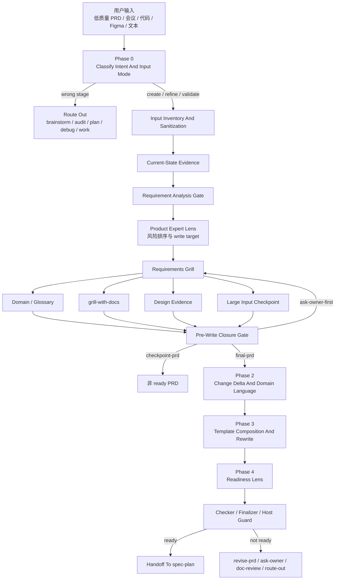
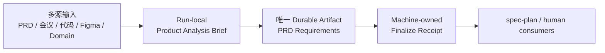
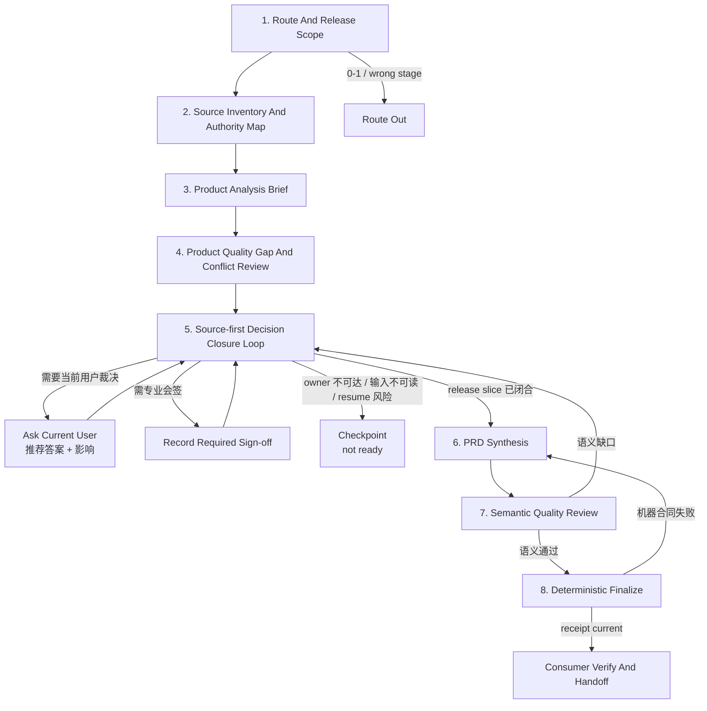
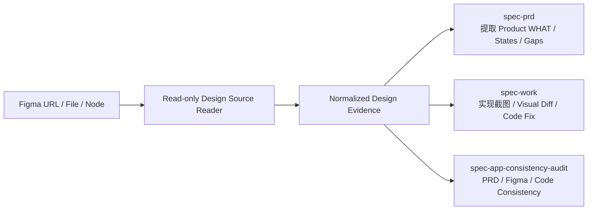

# spec-prd Skill 目标与整体重构审查

**日期：** 2026-07-11

**状态：** source-grounded architecture review；建议整体重构，尚未修改 `skills/spec-prd/**`

**审查对象：** `skills/spec-prd/`、PRD 模板、checker/finalizer、Claude/Qoder hooks、现有 tests/evals、`spec-plan` handoff

**目标读者：** spec-first maintainer、产品负责人、workflow / contract 设计者

**性质：** validation / architecture decision input；不是 PRD artifact，不是实施计划，不是 runtime contract

## 1. 结论先行

建议停止在当前 `spec-prd` 上继续叠加局部 prose 和新字段，改为执行一次有兼容边界的整体重构。

当前 skill 的战略方向是正确的：brownfield first、多源证据分级、代码只确认 current state、会议决策清洗、Figma 降级、owner answer fidelity、R/AE 追溯、checker/finalize 确定性出口，都直接服务高质量 PRD。

但当前实现已经出现三个根本问题：

1. **目标发生偏移。** 主流程逐渐围绕“让 checker 接受”和“让 planning 不发明 WHAT”组织，产品价值、用户问题、预期结果、成功证据和优先级 authority 没有成为同等强度的核心合同。
2. **同一概念存在多套合同。** Requirement Analysis Gate、Product Expert Lens、Decision Card、Requirements Grill、Outstanding Questions、Readiness Self-Check 和 host guard 分别维护重叠状态，且已经出现互相矛盾的枚举、模板和出口条件。
3. **质量证明不足。** 现有 111 个 eval case 不运行 PRD 生成、不调用 LLM、不评价最终 PRD 语义；现有 tests 全绿时，ready 状态迁移死锁、Stop fail-open、核心章节缺失仍可 finalize 等问题依然可稳定复现。

因此，目标态不应是“给当前流程再补几条规则”，而应把 `spec-prd` 重置为：

> **多源产品决策合成器：读取低质量 PRD、会议记录、代码、Figma 和专业领域证据，按问题类型建立 authority，分析并闭合当前 release slice 内的产品决策，输出产品价值清晰、行为完整、证据可追溯、可验收的高质量 PRD。**

“让 `spec-plan` 不发明 WHAT”仍然重要，但它应是结果质量判据之一，不是 skill 的唯一终局。

## 2. 原始背景与 Skill 目的

### 2.1 原始背景

真实 brownfield 场景中的输入通常不是一份完整 PRD，而是分散且质量不一的材料：

- 低质量需求文档只写了功能名称或局部方案；
- 会议记录混合正式决策、提案、争论、过期结论和未解决问题；
- 代码、测试和运行事实只能证明当前行为，不能自动代表目标产品决策；
- Figma 可能是探索稿、proposal、approved target 或仅作示意；
- 专业领域知识可能涉及合规、资金、隐私、安全、运营和数据口径，但模型知识不能自动成为 confirmed requirement；
- 当前执行对话的用户可能掌握产品裁决权，也可能需要专业会签，二者不能混为一谈。

`spec-prd` 的价值不是把这些材料“整理成格式正确的 Markdown”，而是完成以下产品工作：

1. 判断每条关键主张属于 current fact、target decision、design proposal、domain constraint 还是 assumption；
2. 发现材料之间的遗漏、矛盾、过期关系和 authority 冲突；
3. 优先读取 source，减少把可查事实转嫁给用户；
4. 把真正会改变 WHAT、scope、priority、acceptance 或 rollout 的决定交给当前用户或所需专业 authority；
5. 将闭合后的结果写成清晰、完整、一致、可验收、可追溯的 PRD；
6. 对无法闭合的内容诚实保留 blocker、checkpoint、sign-off 或 non-goal，不伪造 ready。

### 2.2 成功定义

高质量 `spec-prd` 输出至少应满足：

- 明确谁遇到什么问题或受到什么强制性约束；
- 明确期望产生什么可观察结果，以及为何现在做；
- 区分当前系统、目标增量和明确不做的范围；
- 原子化描述行为、权限、状态、异常、降级、兼容和运营边界；
- 每个重要 Requirement 都有可观察的 Acceptance Example；
- priority 有来源或裁决 authority，模型不自行发明 P0/P1；
- 关键结论能够回到 source、用户决定或专业会签；
- 当前 release slice 内不存在未闭合的 load-bearing WHAT；
- 文档 right-sized，产品、设计、工程、测试和运营均能快速消费。

### 2.3 Non-Goals

`spec-prd` 不负责：

- 0-1 市场机会探索或产品形态尚未收敛的 brainstorm；
- 实现架构、API/schema 设计、任务拆解和排期；
- 代码实现、调试或 PR review；
- PRD/Figma/code 的实现一致性审计；
- 由模型自动裁决法规、专业口径、优先级或业务风险接受；
- 默认创建或修改 `CONTEXT.md`、ADR、第二套 PRD packet 或持久化流程状态；
- 手改 `.claude/`、`.codex/`、`.agents/skills/`、`.cursor/`、`.kiro/`、`.qoder/` generated runtime mirrors。

## 3. 当前执行流程

当前 source 的宏观 Phase 是 `Phase 0 -> Phase 1 -> Phase 2 -> Phase 3 -> Phase 4`，但真实热路径在 Phase 1 内又嵌套了多套分析、澄清和写前 gate。



### 3.1 当前热路径规模

典型输入“低质量 App PRD + 会议记录 + 代码 + Figma”按当前 trigger 会读取：

- `SKILL.md`；
- evidence / domain / grill-with-docs / product-expert；
- design-source / large-input；
- output contract / generic template / App template / readiness lens。

当前磁盘统计为：

| 指标 | 数值 |
| --- | ---: |
| 文件数 | 11 |
| 行数 | 2,607 |
| 词数 | 31,123 |
| 字节数 | 241,636 |

这还未包含用户提供的 PRD、会议记录、源码、Figma 内容和项目本地 overlay。多源本来是此 skill 的正常输入，却会同时触发 large-input 路径，进一步增加 ceremony。

### 3.2 当前流程中值得保留的能力

- Brownfield current-state first；
- `confirmed-source / user-stated / source-candidate / external-research / assumption` 证据边界；
- 会议 transcript 与正式 ratified decision 分离；
- 代码、测试和运行事实只确认 current state；
- Current System Snapshot、Change Delta、Scope / Non-Goals；
- R/AE 稳定 ID、负向验收、权限/状态/异常覆盖；
- Figma read/unread/degraded inventory 与 owner-answer fidelity；
- surface template 和 project-local/domain overlay；
- `docs/brainstorms/*-requirements.md` 单一 durable PRD topology；
- checker/finalize receipt 和 source/runtime 边界；
- checkpoint 明确不能作为 planning handoff。

这些能力应迁移到新合同中，而不是随重构一并丢弃。

## 4. 关键 Findings

### 4.1 P0：合同自相矛盾，影响正确执行

#### P0-1：模板组合会生成两个 Outstanding Questions

证据：

- `assets/templates/00-generic.md:310` 定义 5 列 `Outstanding Questions`；
- `references/prd-output-template.md:214` 又要求追加 9 列 machine-owned `Outstanding Questions`；
- `scripts/check-prd-artifact.js:473` 使用首个匹配 section，后面的合法 machine table 会被忽略。

只读合成探针已复现：严格按当前组合规则生成两个同名 section 后，checker 忽略后一个 machine table，并产生 `outstanding_question_closure_undeclared`。

**目标决策：** durable PRD 只保留一个 OQ section、一个 schema 和一个 parser owner；surface template 只能贡献问题候选，不再各自生成 OQ section。

#### P0-2：ready 状态迁移同时存在“合规路径卡死”和“无 receipt 放行”

合规路径卡死：

- output template 要求正文包含空 machine receipt 字段；
- Claude prewrite guard 只要发现 `readiness_*` 字段，即使为空也会阻断；
- finalizer 要求文件预先存在 `write_mode=final-prd + can_enter_spec_plan=yes`；
- prewrite guard 又阻止普通文件工具写入这组 ready intent；
- finalizer 自身只写 `status` 和 receipt，不写 ready intent。

反向 fail-open：

- `finalize-prd-artifact.js --check-only` 只有在 frontmatter `status` 已 ready 时才把缺 receipt 变成 closeout blocker；
- checker 又把 `write_mode=final-prd` 或 `can_enter_spec_plan=yes` 视为 ready claim；
- 因此 `status=draft + final-prd + can_enter=yes + 无 receipt` 可返回 `can_closeout=true`。

**目标决策：**

- receipt 只存在于 frontmatter 单一 machine-owned source；
- LLM 负责显式 ready intent，finalizer 原子写 receipt；
- `can_finalize` 与 `can_closeout` 分离；
- 任意 ready claim 且 receipt 缺失或 stale，check-only closeout 必须阻断；
- 用真实 `checkpoint -> final intent -> finalize -> verified -> consumer verify` 状态迁移测试保护出口。

#### P0-3：缺失核心 PRD 章节仍可写 ready receipt

output contract 声明 Summary、Change Delta、Requirements、Acceptance Examples、Scope、Evidence 是 core section，但 checker 只生成 advisory `template_structure_hint`，不进入 blocker 集合。

只读合成探针已复现：

- 删除 Summary，`can_finalize=true`；
- 删除 Requirements 和 Acceptance Examples，仍 `can_finalize=true`；
- 仅保留 ready intent、OQ 和 Readiness Self-Check 的空壳，也可 finalizable。

**目标决策：** 对新式 `artifact_kind: prd-requirements`，core section 可定位、Requirements/Acceptance 至少有合法结构、R/AE ID/trace 可解析属于 deterministic hard floor；内容是否充分仍由 LLM 判断。

#### P0-4：closure 与 outcome 使用多套冲突词汇

当前至少存在：

- Product Expert Lens 的 `closed / narrowed / accepted-assumption / owner-capped / outstanding-question / blocker / route-out`；
- output contract 的 `open / closed / deferred / blocked`；
- `how-pushdown -> route-out` 的分支级复用；
- workflow outcome 也使用 `route-out`。

这导致分支进展、关闭依据、artifact 残留状态和整个 workflow 结果互相污染。

**目标决策：** 每个字段只表达一个轴，`route-out` 只允许出现在 workflow outcome。

#### P0-5：`validate` 的只读语义与强制重写语义冲突

- `SKILL.md:38` 允许 validate 输出 validation report；
- `SKILL.md:298` 与 `prd-output-template.md:303` 又要求 refine/validate 最终都重写 durable PRD。

用户仅要求检查 planning-readiness 时，当前合同可能直接修改文件并 finalize。

**目标决策：**

- `validate` 默认 report-only、无 mutation、无 finalize；
- `refine` 才负责重写；
- “validate 并修复”在 preview 后显式转为 refine。

#### P0-6：当前没有证据证明最终 PRD 质量已达标

- `scripts/run-evals.js` 明确不运行 PRD 生成、不调用 LLM、不评价语义质量；
- 111 个 case 证明 fixture contract，不证明输出质量；
- 五个 `2026-06-30` clarified sample 经当前 checker 复验，均存在至少一个 Requirement 未被 Acceptance 覆盖；
- 但既有 fresh-source validation 又声称 `traceability_gap_count=0`，证据之间存在漂移。

**目标决策：** 停止用 fixture 数量代替 outcome evidence；建立当前 skill 快照与重构版的真实 end-to-end 盲评。

### 4.2 P1：架构与产品质量风险

| Finding | 当前风险 | 目标处理 |
| --- | --- | --- |
| `source_inputs` 已声明但未扫描仍可 final | receipt 可对 empty input hash 盖章；`--refresh-inputs-hash` 可能把“hash 已更新”误写成“语义已吸收” | final-ready 时 source inventory 必须完成；receipt 只证明输入快照，不证明语义吸收；refresh 需 LLM review declaration 与 limitation |
| WHAT/HOW hard blocker 使用关键词 | 纯 HOW 因含 `interface` 被误阻断，真实权限 WHAT 又可漏过 | 关键词只输出 advisory candidate；语义边界归 LLM，脚本只阻断显式确定性矛盾 |
| relentless stop rule 自相矛盾 | 一处要求“不影响本期也不能停止”，另一处要求跳过只扩展范围的问题 | 改为 release-bounded closure；本期外问题可进入 Non-Goals，并记录重新开启条件 |
| 默认自动写 `CONTEXT.md` / ADR | PRD workflow 产生用户未请求的旁路副作用 | 默认只读；只有用户显式 opt-in 才 preview-first 更新 |
| priority 没有 authority contract | 模型可能自行填写 P0/P1 | Requirement 记录 priority source / decision authority / rationale；未知则保留未决 |
| Figma authority 不完整 | 无法区分探索稿和 approved target | 增加 `design_role / approval_status / version / authority_scope`，但不新增持久状态机 |
| domain expertise 主要依赖 optional overlay | 合规、隐私、资金、安全遗漏可能被模型常识掩盖 | 轻量 Domain Expertise Gate；区分 question recipient、decision authority、required specialist sign-off |
| 多宿主保障漂移 | Claude、Codex、Cursor、Kiro、Qoder 的 guard 能力不同；Claude 还有 git failure fail-open 和 rename 漏检 | host-neutral readiness helper + 五宿主 capability matrix + 同 fixture matrix |
| consumer handoff 不复验新式 receipt | PRD finalize 后被修改或 stale artifact 仍可进入 planning | 仅对新式 `artifact_kind: prd-requirements` 做 consumer-side receipt/freshness 检查；legacy 保持兼容并允许响亮 degraded override |
| test floor 被大幅删除 | checker/finalizer/hooks 约束缺乏完整状态迁移回归 | 恢复最小 checker、reason-code parity、finalize、Claude/Qoder hook、consumer handoff suites，不恢复 52K 行历史快照 |
| hot path 2,607 行 / 31K 词 | 模型把注意力花在 ceremony 和字段填充，而不是产品分析 | front controller 收敛到约 150–220 行；reference 单一 ownership、trigger-only 加载 |

## 5. 根因判断

这些问题不是独立 bug，而是同一个架构根因的不同表现：

```text
为了防止一次失败
  -> 新增一个 gate / 字段 / reference / observed-failure prose
  -> 同一概念在多个 surface 重复维护
  -> 模板、checker、finalizer、hook、eval 分别演化
  -> ownership 漂移与状态语义冲突
  -> agent 更倾向于完成 ceremony，而非深入分析需求
  -> 继续新增 prose 试图修复
```

应从“增加规则”切换为“重置合同、减少状态、单一 ownership、用真实 outcome 验证”。

## 6. 目标态架构

### 6.1 三个核心对象



- **多源输入**：事实、决策、提案和约束的原材料；不能按文件类型设置全局 authority 排名。
- **Product Analysis Brief**：run-local 分析对象，不新增持久文件，不成为第二 PRD topology。
- **PRD artifact**：唯一 durable 产品需求文档。
- **Finalize receipt**：只证明 deterministic contract 和输入快照，不冒充语义质量证明。

### 6.2 目标执行流程



### 6.3 各阶段合同

#### 1. Route And Release Scope

确认：

- brownfield target surface；
- 当前 release slice；
- `create / refine / validate`；
- mutation intent；
- 是否应路由 brainstorm、consistency audit、plan、debug、work 或 doc review。

`validate` 默认只读。产品形态、核心用户和价值主张尚未收敛时路由 `spec-brainstorm`；已有明确系统增量但文档质量差时留在 `spec-prd`。

#### 2. Source Inventory And Authority Map

对实际读取成功的输入记录：

```text
source_id
source_type
read_status
date_or_version
decision_status
authority_for
authority_scope
freshness
supersedes
limitations
```

不可访问的远程文档、会议链接、Figma 节点或二进制输入必须 loud degraded，不能记为已消费。

#### 3. Product Analysis Brief

唯一 run-local 分析对象：

```yaml
product_frame:
  actor:
  problem_or_mandate:
  expected_outcome:
  why_now:
  success_evidence:

current_and_target:
  current_state:
  target_state:
  change_delta:
  release_slice:

source_authority:
  material_claims:
  conflicts:
  freshness_limits:

requirements:
  candidate_behaviors:
  scenarios:
  priority_authority:
  acceptance_gaps:

decisions:
  source_resolvable:
  user_owned:
  specialist_signoff:
  out_of_scope:

next_action:
  next_source_or_decision:
```

它替代当前重叠的 Requirement Analysis Gate map、Preliminary Diagnosis、Product Expert Lens map 和大部分 Decision Card ceremony；闭合结果只写入 PRD，不持久化该 brief。

#### 4. Product Quality Gap And Conflict Review

产品专家视角至少覆盖：

- 用户/受益人：问题、价值、预期结果、为何现在做；
- 业务/数据：成功证据、priority authority、指标 baseline 和目标值来源；
- 运营/支持：人工处置、客服、补偿、异常结束态；
- 设计：入口、状态、交互、可访问性、设计覆盖和 approved authority；
- 工程：接口可用性、权限、source-of-truth、兼容和 fallback 中会改变 WHAT 的缺口；
- 测试：每个 Requirement 是否有可观察 pass/fail 和关键负向场景；
- 领域专家：监管、资金、隐私、安全、地域和专业会签触发。

排序依据是产品影响、不可逆性、证据不确定性和 downstream invention risk。它只决定下一步先处理什么，不产生数值质量分或第二套状态机。

#### 5. Source-first Decision Closure Loop

- 先查 source 能回答的事实；
- 当前执行对话的用户只处理真正的产品决策；
- 每个问题提供推荐答案、理由和不同答案的影响；
- 高风险或强依赖决定一次处理一个；独立低风险项可逐项列明后批量确认，但每项保留独立 trace；
- question recipient、decision authority 和 specialist sign-off 分离；
- 当前 release 之外的问题可以合法停止，但必须进入 Non-Goals，证明不影响本期 acceptance、compatibility、rollout 和 data authority，并记录重新开启条件；
- owner 不可达、输入不可读或 context resume 风险时才写 checkpoint。

#### 6. PRD Synthesis

输出 shape 只保留：

- `compact`：低风险、单 surface、release slice 已闭合；闭合来源可以是 source 或少量用户决定；
- `normal`：默认；
- design / topology / domain / large 作为 modifier，而不是新的主流程；
- split 只有当前用户确认边界、优先级和 release sequencing 后才执行。

#### 7. Semantic Quality Review

LLM 或独立 reviewer 判断：

- 产品价值是否清晰；
- authority 是否用对；
- current/target 是否混淆；
- 场景、状态、异常、权限、降级是否完整；
- priority 是否有来源；
- R -> AE 是否真正可验收；
- 是否遗漏专业领域约束或 required sign-off；
- planning 是否仍需补问或发明 WHAT；
- 文档是否 right-sized、可读且无重复 ceremony。

#### 8. Deterministic Finalize And Handoff

脚本只检查可确定的结构与证据地板：

- artifact identity / path / frontmatter；
- core section presence；
- R/AE ID 和可解析 trace；
- source inventory、read status、raw input hash；
- blocking OQ 的显式状态和引用一致性；
- LLM-owned ready intent 与 machine-owned receipt 分离；
- receipt currentness；
- generated runtime / host capability facts。

只有 semantic review 和 deterministic floor 都通过，才允许 handoff。`spec-plan` 对新式 `artifact_kind: prd-requirements` 复验 receipt/freshness；legacy requirements 保持兼容，并在无法复验时响亮记录 degraded override。

### 6.4 Figma 读取能力复用决策

结论：**不能把 [`skills/spec-work/references/agents/figma-design-sync.md`](../../../skills/spec-work/references/agents/figma-design-sync.md) 整体复用到 `spec-prd`，但应复用并抽取其中的 Design Capture 能力。**

当前 `spec-work` 在 UI/Figma 实现阶段会读取该 prompt，并 dispatch generic subagent 执行设计同步：

- 通过 Figma MCP 访问指定 Figma URL 和 node/component；
- 抽取颜色、字体、间距、布局、阴影、边框等设计规格；
- 获取设计截图；
- 再用 browser 截取当前实现，执行视觉差异分析、修改代码并迭代验证。

其中前半段“读取设计源”是跨 workflow 可复用能力，后半段“实现对比与修复”是 `spec-work` 专属能力。

| 能力 | `spec-prd` 是否复用 | 原因 |
| --- | --- | --- |
| 解析 Figma URL、file/node/component 定位信息 | 是 | 建立 design source identity 和读取范围 |
| 使用当前 host 可用的 Figma provider 获取节点上下文 | 是 | 获得直接设计证据；workflow contract 不绑定具体 provider 内部 API |
| 获取设计截图或 provider 返回的视觉预览 | 是 | 用于理解页面结构、状态和用户可见交互 |
| 抽取页面、组件、文本、布局、交互和状态 | 是，但只消费 PRD-relevant WHAT | 支撑 Requirements、Acceptance、Design Coverage 和 gap analysis |
| 记录无法访问、权限失败、partial read 和 missing node | 是 | 形成 loud degraded evidence，不伪造已读取 |
| 启动本地页面并截图当前实现 | 否 | 属于实现或一致性审计，不是 PRD authoring |
| 像素级 Figma-vs-code comparison | 否 | 属于 `spec-work` 或 `spec-app-consistency-audit` |
| 直接修改 CSS/Tailwind/component code | 否 | 违反 `spec-prd` 的 no implementation 边界 |
| `w-full`、ERB wrapper、Tailwind spacing 等项目特定规则 | 否 | 不是通用 Figma 读取合同，且可能污染其它技术栈 |
| “Yes, I did it.” 等实现完成口令 | 否 | 不是 evidence，也不能证明设计读取或 PRD 质量 |

建议把能力拆成两层：



Read-only reader 的最小输出合同建议为：

```yaml
design_source_read_result:
  source_ref:
  file_or_node_id:
  read_status: read | partial | unread
  source_version_or_updated_at:
  design_role: current-reference | target-proposal | approved-target | illustrative | unknown
  approval_status:
  authority_scope:
  screens_and_components:
  interaction_and_states:
  extracted_product_what:
  visual_specs:
  missing_or_unread_states:
  evidence_refs:
  limitations:
```

消费边界：

- `spec-prd` 主要消费 `screens_and_components`、`interaction_and_states`、`extracted_product_what`、缺失状态和 authority；视觉数值只有在它们构成产品 acceptance 或品牌硬约束时才进入 PRD。
- `spec-work` 消费完整 visual specs，并在实现存在后执行 browser capture、diff、code fix 和 repeat verification。
- `spec-app-consistency-audit` 可以继续消费 materialized Figma context 和 normalized contract 做跨源一致性审计；`spec-prd` 不复用其 run artifact topology。

Source ownership 建议：

1. 不让 `spec-prd` 直接调用现有 full-sync prompt，因为其中包含代码 mutation 权限和 implementation-only 规则。
2. 在实施计划中把通用 Design Capture 抽成一个 provider-neutral、read-only 的内部 prompt/contract；`spec-prd`、`spec-work` 和 consistency audit 通过各自 adapter 消费。
3. 如果当前架构尚无合适的 cross-skill prompt owner，第一阶段可在 `spec-prd` 写一个最小 read-only adapter，并用 contract test 锁定与 `spec-work` Design Capture 的共同字段；不要为了复用立即新增公开 workflow 或第二 artifact。
4. 可参考 `spec-app-consistency-audit` 已有的 `has_figma_reference` / `has_figma_materialized_context` 分离、redaction 和 `extract-figma-contract.js` 规范化方式，但复用其事实/库之前必须先解除 app-audit path 和 artifact schema 耦合。
5. Figma provider、MCP tool 名称和内部调用参数是 capability 实现细节，不进入 `spec-prd` durable workflow contract；contract 只要求读取结果、证据引用和 degraded reason。

## 7. Source Authority 模型

Authority 必须按问题类型判断，不能设置一个全局“某来源永远最高”的排序。

| 来源 | 可以决定 | 不可以决定 |
| --- | --- | --- |
| 代码、测试、运行事实 | 当前行为、接口存在性、当前状态和已实现约束 | 目标产品行为、价值、范围、优先级 |
| 已批准 PRD / 当前用户决定 | 目标 WHAT、scope、priority、acceptance | 伪造当前代码事实或替代专业法规 |
| 原始会议 transcript | 提案、分歧、问题线索、待确认事项 | 自动成为正式需求 |
| 已会签会议结论 | 其明确 scope 内的目标决策 | 超出会签范围的推断 |
| Figma approved target | 已批准节点范围内的目标 UI/交互 | 后端规则、未覆盖状态、产品优先级 |
| Figma draft / proposal | 设计候选和 gap 线索 | confirmed target behavior |
| 官方规则 / 项目政策 / SME 会签 | 对应辖区、有效期和 authority scope 内的专业约束 | 产品取舍和实现方案 |
| 模型专业知识 | 发现遗漏、提出问题、推荐默认 | confirmed requirement、法规结论或 priority |
| Analytics / 用户反馈 | 问题证据、baseline、使用结果 | 自动决定目标值和 release priority |

冲突处理固定为：

```text
区分 current-state / target-state
  -> 确认双方 authority scope 与 freshness
  -> 按来源职责可以解决则解决
  -> 否则交当前用户或专业 authority 裁决
  -> 记录 chosen answer、被覆盖来源、影响和 supersedes
```

Figma 补充字段：

```text
design_role: current-reference | target-proposal | approved-target | illustrative
approval_status
version_or_updated_at
authority_scope
```

会议补充字段：

```text
speaker_or_decision_owner
decision_status: proposal | rejected | open | ratified | superseded
meeting_date
supersedes
```

专业领域补充字段：

```text
domain_and_jurisdiction
effective_date
source_or_specialist
freshness
invalidation_condition
required_signoff
```

## 8. 最小 PRD 质量合同

每份 PRD 必须回答八件事：

| 维度 | 最小内容 |
| --- | --- |
| Product Frame | 谁、什么问题或强制性原因、期望结果、为何现在做 |
| Success Evidence | 指标、可观察信号或强制性完成标准；不得编造目标值 |
| Source Authority | 关键输入、authority、freshness、冲突和 limitations |
| Current / Delta | 当前行为以及 keep / extend / replace / remove |
| Requirements | 原子、必要、可观察、WHAT-only，并带 priority authority |
| Scenarios / Acceptance | 主流程和关键异常；R -> AE 可追溯 |
| Scope / Release | 本期、Non-Goals、可降级项、延后后果和 reopen condition |
| Decisions / Residue | 用户决定、专业会签、假设、blocking OQ、HOW-only recheck |

条件触发项：

- UI/Figma -> Design Coverage；
- 监管/资金/隐私/安全 -> Domain / Sign-off Coverage；
- mixed/contract/migration -> topology、producer/consumer、source-of-truth；
- 高风险运行 -> independent product review。

Ready 的语义定义：

> 当前 release slice 内不存在未闭合的 load-bearing WHAT；显式 out-of-scope、证据闭合的非阻断问题、required sign-off residue 和 HOW-only recheck 可以保留，但必须准确表达其 handoff 影响。

## 9. 统一词汇与最小状态

建议只保留四个互不重叠的轴：

| 字段 | 值 | 只表达 |
| --- | --- | --- |
| `artifact_mode` | `checkpoint` / `final` | 是否为可继续恢复的 PRD，或候选最终 PRD |
| `decision_state` | `open` / `closed` / `blocked` | 单个决定当前是否闭合 |
| `closure_disposition` | `source-resolved` / `user-answered` / `user-capped` / `accepted-assumption` / `out-of-release` / `implementation-how` | 为什么该决定可以关闭、延期或下推 |
| `workflow_outcome` | `ask-user` / `revise-prd` / `ready-for-planning` / `route-out` | 整个 workflow 的下一步 |

约束：

- `route-out` 只用于 workflow；
- `implementation-how` 不能触碰权限、scope、interface availability、source-of-truth、fallback、analytics acceptance 等 WHAT；
- `out-of-release` 必须有 Non-Goal、影响证明和 reopen condition；
- machine receipt 不复用任何 LLM-owned 状态字段。

兼容期 checker 可以读取旧 alias，但新 skill 和模板只生成新字段。不要继续在 prose 中暴露旧字段。

## 10. Scripts 与 LLM 的职责边界

| Scripts / tools 负责 | LLM / reviewers 负责 |
| --- | --- |
| 文件发现、路径、frontmatter 和 section 定位 | 用户、问题、价值和预期结果判断 |
| source inventory、read status、raw binary/text hash | source authority、freshness 影响和冲突解释 |
| ID、表结构、显式引用、receipt currentness | Requirement 的语义完整性与 priority authority |
| 明确的字段矛盾和 machine enum | WHAT/HOW、gap 风险和问题排序 |
| generated runtime drift 和 host capability facts | 是否需要用户裁决或专业会签 |
| blocking OQ 是否存在显式状态/引用 | OQ 是否真的 load-bearing、用户回答是否被忠实使用 |
| closeout 的 deterministic reason codes | 产品语义 readiness 与 handoff 风险 |

禁止：

- 用关键词表硬判 WHAT/HOW；
- 用脚本给产品质量打语义分；
- 用 receipt 表达“输入已被正确理解”；
- 用 LLM 声称测试、hash、receipt 或 runtime projection 已通过；
- 把 advisory provider facts 当 confirmed truth。

## 11. 建议的 Source 结构

```text
skills/spec-prd/
├── SKILL.md                       # 150–220 行 front controller
├── references/
│   ├── evidence-protocol.md       # 多源 authority、freshness、conflict
│   ├── clarification-protocol.md  # gap review、release-bounded closure、stop rules
│   ├── prd-contract.md            # 唯一 PRD / OQ / trace / readiness 合同
│   ├── readiness.md               # semantic gate 与 deterministic floor 边界
│   ├── design-evidence.md         # trigger-only
│   └── large-input.md             # trigger-only，仅真实 context risk 时读取
├── assets/
│   ├── templates/                 # generic + surface templates
│   └── overlays/                  # trigger-only domain overlays
└── scripts/
    ├── check-prd-artifact.js      # 薄 CLI
    ├── finalize-prd-artifact.js
    └── lib/
        ├── markdown-structure.js
        ├── readiness-facts.js
        └── reason-codes.js
```

原则：

- 一个 purpose；
- 一个 evidence authority model；
- 一个 Product Analysis Brief；
- 一个 gap/closure vocabulary；
- 一个 PRD template contract；
- 一个 OQ schema；
- 一个 semantic readiness lens；
- checker 只守 deterministic floor；
- 不增加 workflow engine、持久进度 schema 或第二 PRD artifact。

Figma prompt 资产需要额外满足：Design Source Reader 是 read-only；Implementation Sync 只由 `spec-work` 消费。二者不能继续混在一个可被 `spec-prd` 直接复用的 prompt 中。

## 12. 保留 / 合并 / 删除 / 重写

| 动作 | 当前能力 | 目标 |
| --- | --- | --- |
| 保留 | Brownfield first、证据标签、Current Snapshot、Change Delta、R/AE、Figma degraded、owner fidelity、surface templates、final receipt | 迁入单一合同，保持现有用户价值 |
| 合并 | Requirement Analysis Gate + Preliminary Diagnosis + Product Expert Lens | 一个 run-local Product Analysis Brief |
| 合并 | Pre-PRD Clarification + Domain Grill + grill-with-docs | 一个 release-bounded Decision Closure Loop |
| 合并 | Evidence Plan + Supporting Evidence Refs + Design Inventory | 一个可按 source type 扩展的 Source Authority Ledger |
| 合并 | Output Template + P0/P1 packs + Readiness Lens | 一个 canonical PRD Quality Contract |
| 删除 | relentless “不影响本期也不能停止” hard rule | 用 release slice、risk 和 reopen condition 判断 |
| 删除 | runtime hot path 中的 upstream `grill-with-docs` 历史快照 | 历史 provenance 留在 docs，不进入执行 prompt |
| 删除 | 默认 inline 修改 `CONTEXT.md` / ADR | 只保留显式 opt-in 的 knowledge-promotion 候选 |
| 删除 | 重叠 Decision Card / phase map / closeout ceremony | 只保留会驱动下一动作的最小字段 |
| 删除 | surface template 自带 OQ section | surface 只贡献 requirement/question candidates |
| 重写 | `validate` | 默认 report-only；修复需显式 refine |
| 重写 | checker/finalizer/hooks | host-neutral facts、可靠状态迁移、fail-closed closeout |
| 重写 | eval | 真实生成、旧版/新版配对、独立盲评 |

## 13. 安全迁移顺序

整体重构可以大胆，但迁移必须保护当前可用能力和五宿主边界。

### Phase 1：P0 Exit Safety

- 固化当前 skill 快照作为 baseline；
- 修复 duplicate OQ；
- 修复 ready intent / finalizer / Stop 双向故障；
- 把 core section presence 纳入 deterministic floor；
- 增加真实 checkpoint-to-finalize 状态迁移测试。

这一阶段先保证“不会错误阻断，也不会错误放行”，再动大段 prose。

### Phase 2：Contract Reset

- 定义新的产品中心 purpose、success definition 和 Non-Goals；
- 统一 `artifact_mode / decision_state / closure_disposition / workflow_outcome`；
- 明确 `validate` report-only；
- 定义唯一 PRD、OQ、trace 和 receipt ownership；
- 旧字段只在 checker compatibility layer 读取。

### Phase 3：Source Authority Foundation

- 引入 run-local Source Authority Ledger；
- 定义 meeting/code/Figma/domain authority adapter；
- 从 `spec-work` 的 `figma-design-sync.md` 抽取 read-only Design Capture 合同；不复用实现截图、视觉 diff 或代码修改部分；
- 修复 source input、binary hash、design enum 和 freshness 语义；
- 不新增 durable artifact。

### Phase 4：Product Analysis And Clarification Rewrite

- 用 Product Analysis Brief 替代多个 run-local map；
- 用 release-bounded Decision Closure Loop 替代 relentless grill；
- 分离当前用户、decision authority 和 specialist sign-off；
- 移除默认 `CONTEXT.md` / ADR mutation 和 upstream snapshot。

### Phase 5：PRD Contract And Runtime Projection

- 重写 canonical PRD contract 和模板组合；
- 保持 product-bundled templates 与 project-local overlay 边界；
- 提取 host-neutral readiness helper；
- 同步 Claude、Codex、Cursor、Kiro、Qoder source projection；
- 使用 `spec-first init` 生成 runtime，不手改 mirrors；
- 为新式 PRD 增加 consumer-side receipt/freshness verification。

### Phase 6：Semantic Validation And Rollout

- 用固定 brownfield 案例做旧版/新版 paired runs；
- 独立 blind product review；
- 先 shadow rollout，再删除旧 reference 和 alias；
- 只有 outcome 证据稳定后，才宣称新 skill 提升了 PRD 质量或效率。

## 14. Outcome Eval 方案

最新版 `skill-creator` 的有效方法是：先 snapshot 旧 skill，再让旧版和新版在同一批真实任务上分别生成产物，最后进行独立盲评。不能只检查 prompt 中是否出现某段字符串。

### 14.1 固定案例

建议选择 6–10 个匿名 brownfield case，至少覆盖：

1. create：低质量单 surface PRD；
2. refine：已有 PRD 与会议结论冲突；
3. validate：只读审查，不允许 mutation；
4. Figma degraded：设计链接不可读或只读到 partial nodes；
5. large multi-source：PRD + 会议 + 代码 + Figma + 项目规则；
6. domain：隐私、资金、安全或监管 sign-off；
7. mixed surface / source-of-truth；
8. current code 与 approved target 明确冲突。

### 14.2 输入构成

每个 case 固定包含：

- 低质量 PRD 或 rough note；
- 会议记录；
- code/test facts；
- Figma export、截图或明确 degraded condition；
- 专业领域约束；
- 至少一个 source conflict；
- 可供 reviewer 使用、但不泄漏给生成 agent 的 adjudication notes。

### 14.3 盲评维度

每个维度使用 `pass / concern / fail + evidence`，不建设 runtime 0–100 自动评分器：

- 用户、问题、价值和预期结果；
- source fidelity 与 authority；
- current/target 分离；
- 冲突发现和裁决忠实度；
- Requirements 完整性与场景覆盖；
- R -> AE 可验收性；
- priority authority；
- 专业领域遗漏和 required sign-off；
- planning 仍需补问或发明的 WHAT 数量；
- owner 交互轮次、重复问题和 source-resolvable 问题比例；
- readability、right-size 和 ceremony 噪声；
- token / latency 只作为效率辅助指标，不替代质量。

### 14.4 通过规则

- P0 deterministic cases 100% 通过；
- 新版不得增加 confirmed-fact hallucination、owner answer reversal 或 load-bearing WHAT 漏洞；
- 核心产品质量维度总体优于或不劣于旧版；
- owner 重复问题和无效 ceremony 明显下降；
- 出现质量回归时，先撤销对应删除/合并块，不用新增更多补丁 prose 掩盖。

## 15. 与现有优化方案的关系

现有 [`docs/plans/spec-prd-optimization-proposal.md`](../../plans/spec-prd-optimization-proposal.md) 建立在“当前 Phase spine 不重排、主要按失败样本做局部激活”的前提上。

本次审查发现：

- OQ、closure、ready 状态迁移和 validate 语义已经是 cross-contract 问题；
- P0 故障不能由单个 H1-H4 局部单元完整覆盖；
- 当前热路径和 ownership 漂移已达到整体收敛阈值。

因此建议：

1. 将本审查作为新的 architecture decision input；
2. 另起整体重构 implementation plan；
3. 新 plan 获确认后，将旧优化方案标记为 `superseded`，其中已完成且仍正确的模板 ownership 能力迁入新 plan；
4. 不直接在旧 plan 上继续追加更多 U 单元。

本报告本身不修改旧 plan 状态，也不授权立即删除旧合同。

## 16. Risks 与 Guardrails

| 风险 | Guardrail |
| --- | --- |
| 过度精简导致安全能力丢失 | 先 snapshot baseline；为 owner fidelity、design degraded、source accounting、R/AE、checkpoint 建 parity cases |
| 一次性 rewrite 难以定位回归 | 六阶段迁移，每阶段可独立验证和回退；P0 exit safety 先行 |
| 新 schema 变成另一套重型状态机 | 只保留互不重叠的四个轴；run-local brief 不持久化 |
| semantic review 结果有模型方差 | paired runs、匿名输出、独立 reviewer、pass/concern/fail + evidence |
| domain knowledge 被误当 confirmed | 模型知识只发现遗漏；confirmed constraint 必须有官方 source、项目 policy、当前用户或 SME sign-off |
| generated runtime 漂移 | source-first 修改；五宿主 temp init / drift / package checks；禁止手改 mirrors |
| consumer verify 破坏 legacy 输入 | 只对新式 `artifact_kind: prd-requirements` 强制；legacy 保持显式兼容 |
| 重构长期停留在 aspirational | 每阶段绑定激活条件、tests/eval artifact、owner 和退出标准 |

## 17. 审查证据与限制

### 17.1 已执行

- 阅读项目角色契约、`spec-prd` source、references、templates、scripts、hooks、tests、eval governance 和 `spec-plan` handoff；
- 使用 Graphify 做 advisory 导航，关键判断均回到 source/test/script 确认；
- 三个独立 bounded reviewer 分别从产品专家、workflow UX、deterministic contract 视角审查；
- 当前 spec-prd focused suites 在审查期间保持通过，但不能覆盖本文复现的 P0/P1；
- `check-prd-artifact.js` / `finalize-prd-artifact.js` syntax checks 通过；
- `run-evals.js --json` 返回 111 cases fixture contract 通过；
- 合成复现 duplicate OQ、缺 core section 可 finalize、ready claim 无 receipt 可 closeout、source input empty hash 和 WHAT/HOW 关键词误判；
- 五个 clarified sample 使用当前 checker 复验，均发现至少一个 Requirement 缺 Acceptance trace；
- `skill-creator@claude-plugins-official` 已刷新，marketplace 无更新快照，继续使用当前最新版的 paired-run / blind-review 方法。

### 17.2 未执行

- 未修改 `skills/spec-prd/**`、templates、scripts、hooks、tests 或 generated runtime mirrors；
- 未运行新旧 skill 的真实 PRD 生成对照；
- 未完成独立 human product-owner review；
- 未生成新的 implementation plan；
- 未执行 `spec-first init`，因为本次没有 runtime source 变更；
- 未把本文建议当作已通过的 runtime contract。

## 18. 最终建议

批准整体重构方向，并以以下顺序继续：

1. 先写新的 implementation plan，明确 contract reset、兼容层、五宿主影响和 eval fixture；
2. 先修 P0 出口安全并建立状态迁移测试；
3. 再重写 Product Analysis Brief、authority model、clarification loop 和 PRD contract；
4. 最后执行真实旧版/新版盲评，依据 outcome 删除无效规则；
5. 只有验证稳定后，才删除旧 fields/references、刷新 runtime 并宣称质量提升。

期望终态不是“更复杂但更严谨的 prompt”，而是：

> **更短的执行热路径、更清晰的 authority、更少的重复状态、更可靠的机器出口，以及能被真实 PRD 产物证明的产品质量提升。**

## 19. 主要 Source Refs

- [`skills/spec-prd/SKILL.md`](../../../skills/spec-prd/SKILL.md)
- [`skills/spec-prd/references/evidence-and-topology.md`](../../../skills/spec-prd/references/evidence-and-topology.md)
- [`skills/spec-prd/references/domain-language-and-decision-ledger.md`](../../../skills/spec-prd/references/domain-language-and-decision-ledger.md)
- [`skills/spec-prd/references/grill-with-docs-integration.md`](../../../skills/spec-prd/references/grill-with-docs-integration.md)
- [`skills/spec-prd/references/product-expert-lens.md`](../../../skills/spec-prd/references/product-expert-lens.md)
- [`skills/spec-prd/references/design-source-evidence.md`](../../../skills/spec-prd/references/design-source-evidence.md)
- [`skills/spec-prd/references/large-input-checkpoint.md`](../../../skills/spec-prd/references/large-input-checkpoint.md)
- [`skills/spec-prd/references/prd-output-template.md`](../../../skills/spec-prd/references/prd-output-template.md)
- [`skills/spec-prd/references/prd-readiness-lens.md`](../../../skills/spec-prd/references/prd-readiness-lens.md)
- [`skills/spec-prd/scripts/check-prd-artifact.js`](../../../skills/spec-prd/scripts/check-prd-artifact.js)
- [`skills/spec-prd/scripts/finalize-prd-artifact.js`](../../../skills/spec-prd/scripts/finalize-prd-artifact.js)
- [`skills/spec-prd/scripts/lib/reason-codes.js`](../../../skills/spec-prd/scripts/lib/reason-codes.js)
- [`templates/claude/hooks/prd-prewrite-guard`](../../../templates/claude/hooks/prd-prewrite-guard)
- [`templates/claude/hooks/prd-readiness-guard`](../../../templates/claude/hooks/prd-readiness-guard)
- [`skills/spec-plan/SKILL.md`](../../../skills/spec-plan/SKILL.md)
- [`skills/spec-work/SKILL.md`](../../../skills/spec-work/SKILL.md)
- [`skills/spec-work/references/agents/figma-design-sync.md`](../../../skills/spec-work/references/agents/figma-design-sync.md)
- [`skills/spec-app-consistency-audit/SKILL.md`](../../../skills/spec-app-consistency-audit/SKILL.md)
- [`skills/spec-app-consistency-audit/scripts/extract-figma-contract.js`](../../../skills/spec-app-consistency-audit/scripts/extract-figma-contract.js)
- [`docs/10-prompt/结构化项目角色契约.md`](../../10-prompt/结构化项目角色契约.md)
- [`docs/plans/spec-prd-optimization-proposal.md`](../../plans/spec-prd-optimization-proposal.md)
