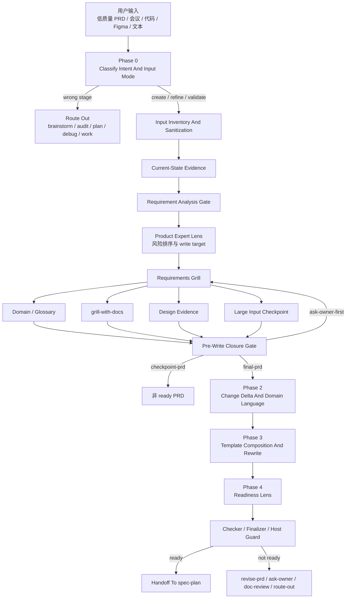
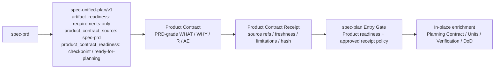
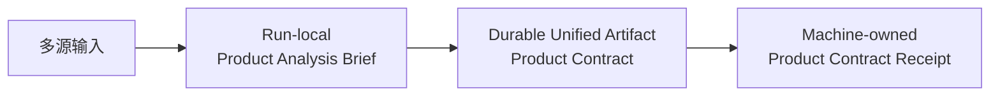
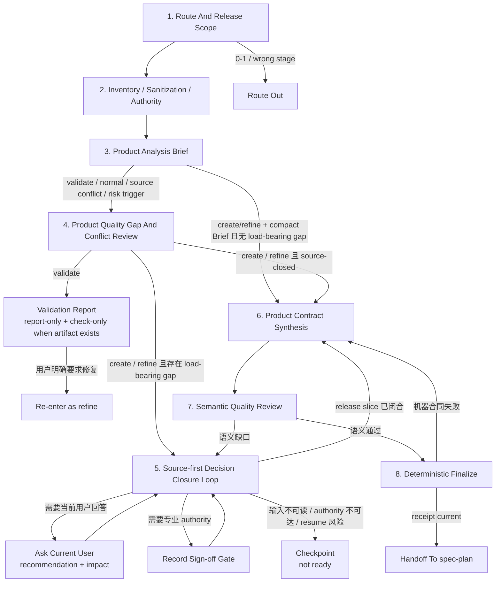
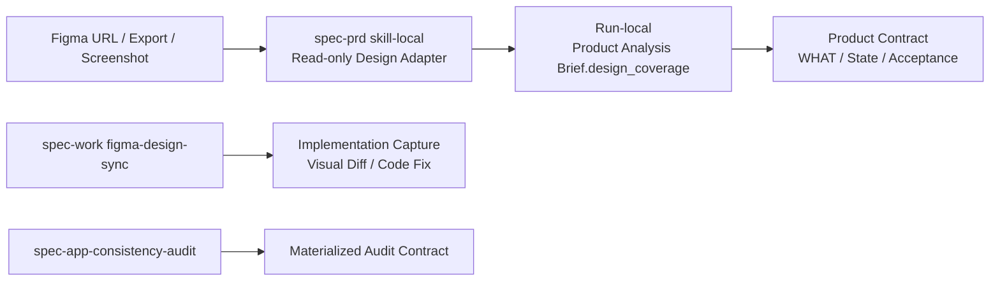

# spec-prd Skill 目标与整体重构审查

**日期：** 2026-07-11

**状态：** 综合审查修订版；P0 Exit Safety 可独立实施，整体 Contract Reset 需先完成 artifact topology 裁决与最小 paired pilot

**审查对象：** `skills/spec-prd/`、PRD 模板、checker/finalizer、Claude/Qoder hooks、现有 tests/evals、`spec-plan` handoff

**目标读者：** spec-first maintainer、产品负责人、workflow / contract 设计者

**性质：** validation / architecture decision input；不是 PRD artifact，不是实施计划，不是 runtime contract

## 1. 结论先行

建议停止在当前 `spec-prd` 上继续叠加局部 prose 和新字段，但不应在真实 outcome evidence 之前一次性批准全部重构范围。

当前 skill 的战略方向是正确的：brownfield first、多源证据分级、代码只确认 current state、会议决策清洗、Figma 降级、owner answer fidelity、R/AE 追溯、checker/finalize 确定性出口，都直接服务高质量 PRD。

但当前实现已经出现三个根本问题：

1. **目标发生偏移。** 主流程逐渐围绕“让 checker 接受”和“让 planning 不发明 WHAT”组织，产品价值、用户问题、预期结果、成功证据和优先级 authority 没有成为同等强度的核心合同。
2. **同一概念存在多套合同。** Requirement Analysis Gate、Product Expert Lens、Decision Card、Requirements Grill、Outstanding Questions、Readiness Self-Check 和 host guard 分别维护重叠状态，且已经出现互相矛盾的枚举、模板和出口条件。
3. **质量证明不足。** 现有 111 个 eval case 不运行 PRD 生成、不调用 LLM、不评价最终 PRD 语义；现有 tests 全绿时，ready 状态迁移死锁、Stop fail-open、核心章节缺失仍可 finalize 等问题依然可稳定复现。

因此，目标态不应是“给当前流程再补几条规则”，而应把 `spec-prd` 收敛为：

> **多源产品决策合成器：读取低质量 PRD、会议记录、代码、Figma 和专业领域证据，按问题类型建立 authority，分析并闭合当前 release slice 内的产品决策，输出产品价值清晰、行为完整、证据可追溯、可验收的高质量 PRD。**

“让 `spec-plan` 不发明 WHAT”仍然重要，但它应是结果质量判据之一，不是 skill 的唯一终局。

本报告的最终裁决分三层：

1. **P0 Exit Safety：批准。** duplicate OQ、ready 状态迁移、core section floor 和 validate mutation 必须先修，且可以独立发布。
2. **目标架构方向：条件批准。** Product Analysis Brief、source authority、release-bounded clarification 和 semantic + deterministic 双 gate 值得保留。
3. **完整 Contract Reset：证据触发。** Phase 1 后先做 eval-only candidate 和原始版 / Phase 1-fixed / candidate 三臂 pilot；只有真实样本证明 source authority、closure 和 ceremony 是主要质量瓶颈，并完成 target artifact topology 裁决，才进入连续迁移。迁移完成后仍需 shadow/canary 与 Promotion Gate，不能直接切默认 runtime。

## 2. 原始背景与 Skill 目的

### 2.1 原始背景

真实 brownfield 场景中的输入通常不是一份完整 PRD，而是分散且质量不一的材料：

- 低质量需求文档只写了功能名称或局部方案；
- 会议记录混合正式决策、提案、争论、过期结论和未解决问题；
- 代码、测试和运行事实只能证明当前行为，不能自动代表目标产品决策；
- Figma 可能是探索稿、proposal、approved target 或仅作示意；
- 专业领域知识可能涉及合规、资金、隐私、安全、运营和数据口径，但模型知识不能自动成为 confirmed requirement；
- 当前执行对话的用户可能掌握产品裁决权，也可能需要专业会签，二者不能混为一谈。

`spec-prd` 的价值不是把这些材料“整理成格式正确的 Markdown”，而是完成以下产品工作：

1. 判断每条关键主张属于 current fact、target decision、design proposal、domain constraint 还是 assumption；
2. 发现材料之间的遗漏、矛盾、过期关系和 authority 冲突；
3. 优先读取 source，减少把可查事实转嫁给用户；
4. 把真正会改变 WHAT、scope、priority、acceptance 或 rollout 的决定交给当前用户或所需专业 authority；
5. 将闭合后的结果写成清晰、完整、一致、可验收、可追溯的 PRD；
6. 对无法闭合的内容诚实保留 blocker、checkpoint、sign-off 或 non-goal，不伪造 ready。

### 2.2 成功定义

高质量 `spec-prd` 输出至少应满足：

- 明确谁遇到什么问题或受到什么强制性约束；
- 明确期望产生什么可观察结果，以及为何现在做；
- 区分当前系统、目标增量和明确不做的范围；
- 原子化描述行为、权限、状态、异常、降级、兼容和运营边界；
- 每个重要 Requirement 都有可观察的 Acceptance Example；
- priority 有来源或裁决 authority，模型不自行发明 P0/P1；
- 关键结论能够回到 source、用户决定或专业会签；
- 当前 release slice 内不存在未闭合的 load-bearing WHAT；
- 文档 right-sized，产品、设计、工程、测试和运营均能快速消费。

主结果与不可退化 guardrail：

| 类型 | 指标 |
| --- | --- |
| Primary outcome 1 | `spec-plan` 或 human planner 仍需补问、猜测或发明的 load-bearing WHAT 数量下降 |
| Primary outcome 2 | 当前用户被重复询问同一决定、或被询问 source 可解事实的轮次下降 |
| Non-regression 1 | confirmed-source fidelity 不下降，不新增 advisory-to-confirmed laundering |
| Non-regression 2 | owner-answer fidelity 不下降，不反转、放宽或伪造用户决定 |
| Non-regression 3 | load-bearing WHAT、关键状态、异常和 R -> AE 完整性不下降 |
| Diagnostic | readability、right-size、ceremony、token、latency、问题排序和 source coverage |

当质量与效率发生冲突时，先满足三个 Non-regression，再比较 Primary outcome；Diagnostic 不能单独支持 rollout。

### 2.3 Product Operating Model

`spec-prd` 的首要 operator 是当前执行对话的用户，但 **question recipient 不自动等于 decision authority**。Agent 负责读取代码、测试、会议、Figma 和项目规则；用户不需要亲自具备所有 source 访问能力。

| 模式 | 当前用户角色 | 允许的闭合结果 |
| --- | --- | --- |
| Authority-present | 当前用户对目标 WHAT、scope、priority 或 acceptance 具备相应 authority | 用户回答可以成为 confirmed decision，并绑定 decision trace |
| Limited-authority | 当前用户可以提供背景或推荐，但无最终裁决权 | 回答保持 `user-stated-candidate`；需要已会签来源或指定 authority 才能闭合 |
| Specialist-required | 决定涉及监管、资金、隐私、安全或专业口径 | 当前用户仍是问题接收者，但 `required_signoff` 按 gate timing 决定是否阻断 planning |
| Evidence-limited | 必要 source 不可访问、用户无法裁决或 context resume 风险过高 | 写 checkpoint，明确下一 source/authority、限制和恢复条件，不进入 planning |

`decision_authority` 必须按 claim 类型记录；同一个用户可能有 scope authority，但没有法规或专业口径 authority。

### 2.4 Non-Goals

`spec-prd` 不负责：

- 0-1 市场机会探索或产品形态尚未收敛的 brainstorm；
- 即使已有 brownfield 系统，但仍无法命名 target surface、release slice、核心用户/约束或候选产品形态的 unresolved product-shape exploration；此类输入路由 `spec-brainstorm`；
- 实现架构、API/schema 设计、任务拆解和排期；
- 代码实现、调试或 PR review；
- PRD/Figma/code 的实现一致性审计；
- 由模型自动裁决法规、专业口径、优先级或业务风险接受；
- 默认创建或修改 `CONTEXT.md`、ADR、第二套 PRD packet 或持久化流程状态；
- 手改 `.claude/`、`.codex/`、`.agents/skills/`、`.cursor/`、`.kiro/`、`.qoder/` generated runtime mirrors。

## 3. 当前执行流程

当前 source 的宏观 Phase 是 `Phase 0 -> Phase 1 -> Phase 2 -> Phase 3 -> Phase 4`，但真实热路径在 Phase 1 内又嵌套了多套分析、澄清和写前 gate。



### 3.1 当前热路径规模

典型输入“低质量 App PRD + 会议记录 + 代码 + Figma”按当前 trigger 会读取：

- `SKILL.md`；
- evidence / domain / grill-with-docs / product-expert；
- design-source / large-input；
- output contract / generic template / App template / readiness lens。

当前磁盘统计为：

| 指标 | 数值 |
| --- | ---: |
| 文件数 | 11 |
| 行数 | 2,607 |
| 词数 | 31,123 |
| 字节数 | 241,636 |

这还未包含用户提供的 PRD、会议记录、源码、Figma 内容和项目本地 overlay。多源本来是此 skill 的正常输入，却会同时触发 large-input 路径，进一步增加 ceremony。

### 3.2 当前流程中值得保留的能力

- Brownfield current-state first；
- `confirmed-source / user-stated / source-candidate / external-research / assumption` 证据边界；
- 会议 transcript 与正式 ratified decision 分离；
- 代码、测试和运行事实只确认 current state；
- Current System Snapshot、Change Delta、Scope / Non-Goals；
- R/AE 稳定 ID、负向验收、权限/状态/异常覆盖；
- Figma read/unread/degraded inventory 与 owner-answer fidelity；
- surface template 和 project-local/domain overlay；
- 单一 durable WHAT source 原则；legacy `docs/brainstorms/*-requirements.md` 路径继续可读，但不预设为新式终态；
- checker/finalize receipt 和 source/runtime 边界；
- checkpoint 明确不能作为 planning handoff。

这些能力应迁移到新合同中，而不是随重构一并丢弃。

## 4. 关键 Findings

### 4.1 P0：合同自相矛盾，影响正确执行

#### P0-1：模板组合会生成两个 Outstanding Questions

证据：

- `assets/templates/00-generic.md:310` 定义 5 列 `Outstanding Questions`；
- `references/prd-output-template.md:214` 又要求追加 9 列 machine-owned `Outstanding Questions`；
- `scripts/check-prd-artifact.js:473` 使用首个匹配 section，后面的合法 machine table 会被忽略。

只读合成探针已复现：严格按当前组合规则生成两个同名 section 后，checker 忽略后一个 machine table，并产生 `outstanding_question_closure_undeclared`。

**目标决策：** durable Product Contract 只保留一个 OQ section、一个 schema 和一个 parser owner；surface template 只能贡献问题候选，不再各自生成 OQ section。

#### P0-2：ready 状态迁移同时存在“合规路径卡死”和“无 receipt 放行”

合规路径卡死：

- output template 要求正文包含空 machine receipt 字段；
- Claude prewrite guard 只要发现 `readiness_*` 字段，即使为空也会阻断；
- finalizer 要求文件预先存在 `write_mode=final-prd + can_enter_spec_plan=yes`；
- prewrite guard 又阻止普通文件工具写入这组 ready intent；
- finalizer 自身只写 `status` 和 receipt，不写 ready intent。

反向 fail-open：

- `finalize-prd-artifact.js --check-only` 只有在 frontmatter `status` 已 ready 时才把缺 receipt 变成 closeout blocker；
- checker 又把 `write_mode=final-prd` 或 `can_enter_spec_plan=yes` 视为 ready claim；
- 因此 `status=draft + final-prd + can_enter=yes + 无 receipt` 可返回 `can_closeout=true`。

**目标决策：**

- receipt 只存在于 frontmatter 单一 machine-owned source；
- LLM 负责显式 ready intent，finalizer 原子写 receipt；
- `can_finalize` 与 `can_closeout` 分离；
- 任意 ready claim 且 receipt 缺失或 stale，check-only closeout 必须阻断；
- 用真实 `checkpoint -> final intent -> finalize -> verified -> consumer verify` 状态迁移测试保护出口。

#### P0-3：缺失核心 PRD 章节仍可写 ready receipt

output contract 声明 Summary、Change Delta、Requirements、Acceptance Examples、Scope、Evidence 是 core section，但 checker 只生成 advisory `template_structure_hint`，不进入 blocker 集合。

只读合成探针已复现：

- 删除 Summary，`can_finalize=true`；
- 删除 Requirements 和 Acceptance Examples，仍 `can_finalize=true`；
- 仅保留 ready intent、OQ 和 Readiness Self-Check 的空壳，也可 finalizable。

**目标决策：** Phase 1 先对当前 `artifact_kind: prd-requirements` 实施 exit gate：只有出现 final/ready claim 或调用 finalize 时，core section 可定位、Requirements/Acceptance 至少有合法结构、R/AE ID/trace 可解析才成为 blocker；draft/checkpoint 允许暂缺未完成章节。Contract Reset 再把同一语义迁移到 requirements-only unified artifact。内容是否充分始终由 LLM 判断。

#### P0-4：closure 与 outcome 使用多套冲突词汇

当前至少存在：

- Product Expert Lens 的 `closed / narrowed / accepted-assumption / owner-capped / outstanding-question / blocker / route-out`；
- output contract 的 `open / closed / deferred / blocked`；
- `how-pushdown -> route-out` 的分支级复用；
- workflow outcome 也使用 `route-out`。

这导致分支进展、关闭依据、artifact 残留状态和整个 workflow 结果互相污染。

**目标决策：** 每个字段只表达一个轴，`route-out` 只允许出现在 workflow outcome。

#### P0-5：`validate` 的只读语义与强制重写语义冲突

- `SKILL.md:38` 允许 validate 输出 validation report；
- `SKILL.md:298` 与 `prd-output-template.md:303` 又要求 refine/validate 最终都重写 durable PRD。

用户仅要求检查 planning-readiness 时，当前合同可能直接修改文件并 finalize。

**目标决策：**

- `validate` 默认 report-only、无 mutation、无 finalize；
- `refine` 才负责重写；
- “validate 并修复”在 preview 后显式转为 refine。

#### P0-6：当前没有证据证明最终 PRD 质量已达标

- `scripts/run-evals.js` 明确不运行 PRD 生成、不调用 LLM、不评价语义质量；
- 111 个 case 证明 fixture contract，不证明输出质量；
- 五个 `2026-06-30` clarified sample 经当前 checker 复验，均存在至少一个 Requirement 未被 Acceptance 覆盖；
- 但既有 fresh-source validation 又声称 `traceability_gap_count=0`，证据之间存在漂移。

**目标决策：** 停止用 fixture 数量代替 outcome evidence；建立当前 skill 快照与重构版的真实 end-to-end 盲评。

### 4.2 P1：架构与产品质量风险

| Finding | 当前风险 | 目标处理 |
| --- | --- | --- |
| `source_inputs` 已声明但未扫描仍可 final | receipt 可对 empty input hash 盖章；`--refresh-inputs-hash` 可能把“hash 已更新”误写成“语义已吸收” | final-ready 时 source inventory 必须完成；receipt 只证明输入快照，不证明语义吸收；refresh 需 LLM review declaration 与 limitation |
| WHAT/HOW hard blocker 使用关键词 | 纯 HOW 因含 `interface` 被误阻断，真实权限 WHAT 又可漏过 | 关键词只输出 advisory candidate；语义边界归 LLM，脚本只阻断显式确定性矛盾 |
| relentless stop rule 自相矛盾 | 一处要求“不影响本期也不能停止”，另一处要求跳过只扩展范围的问题 | 改为 release-bounded closure；本期外问题可进入 Non-Goals，并记录重新开启条件 |
| 默认自动写 `CONTEXT.md` / ADR | PRD workflow 产生用户未请求的旁路副作用 | 默认只读；只有用户显式 opt-in 才 preview-first 更新 |
| priority 没有 authority contract | 模型可能自行填写 P0/P1 | Requirement 记录 priority source / decision authority / rationale；未知则保留未决 |
| Figma authority 不完整 | 无法区分探索稿、approved target 和未覆盖状态 | 对 screen/component/state/interaction 建 item-level coverage，记录 `design_role / approval_authority / approval_evidence / version / authority_scope / observation-or-inference`，但不新增持久状态机 |
| domain expertise 主要依赖 optional overlay | 合规、隐私、资金、安全遗漏可能被模型常识掩盖 | 轻量 Domain Expertise Gate；区分 question recipient、decision authority、required specialist sign-off |
| 多宿主保障漂移 | Claude、Codex、Cursor、Kiro、Qoder 的 guard 能力不同；Claude 还有 git failure fail-open 和 rename 漏检 | host-neutral readiness helper + 五宿主 capability matrix + 同 fixture matrix |
| consumer handoff 不复验新式 receipt | Product Contract finalize 后被修改或 stale artifact 仍可进入 planning | 若 Gate A 批准强制复验，仅对 `spec-unified-plan/v1 + artifact_readiness: requirements-only + product_contract_source: spec-prd` 做 consumer-side receipt/freshness gate；legacy 保持兼容并允许响亮 degraded override |
| test floor 被大幅删除 | checker/finalizer/hooks 约束缺乏完整状态迁移回归 | 恢复最小 checker、reason-code parity、finalize、Claude/Qoder hook、consumer handoff suites，不恢复 52K 行历史快照 |
| hot path 2,607 行 / 31K 词 | 模型把注意力花在 ceremony 和字段填充，而不是产品分析 | front controller 以约 150–220 行作为设计预算；reference 单一 ownership、trigger-only 加载，不把行数变成硬 gate |

## 5. 根因判断

这些问题不是独立 bug，而是同一个架构根因的不同表现：

```text
为了防止一次失败
  -> 新增一个 gate / 字段 / reference / observed-failure prose
  -> 同一概念在多个 surface 重复维护
  -> 模板、checker、finalizer、hook、eval 分别演化
  -> ownership 漂移与状态语义冲突
  -> agent 更倾向于完成 ceremony，而非深入分析需求
  -> 继续新增 prose 试图修复
```

应从“增加规则”切换为“重置合同、减少状态、单一 ownership、用真实 outcome 验证”。

## 6. 目标态架构

### 6.1 Target Artifact Topology

当前仓库的新式 Product Contract 已使用 `spec-unified-plan/v1` requirements-only artifact，并由 `spec-plan` 原地 enrichment；`docs/brainstorms/*-requirements.*` 在 `spec-plan` 中被明确视为 legacy origin。若重构后的 `spec-prd` 继续创建独立 PRD，再由 planning 复制 Product Contract，将产生两个 durable WHAT 真相源。

目标建议：



规则：

- 新式 `spec-prd` 输出使用 requirements-only unified artifact；existing `docs/brainstorms/*-requirements.*` 继续作为 legacy input，不自动迁移。
- `artifact_readiness: requirements-only` 表示只有 Product Contract、尚无完整 planning sections；`implementation-ready` 继续沿用现行合同：完整 Planning/Units/Verification/DoD 且无 launch-blocking question。新增 `product_contract_readiness: checkpoint | ready-for-planning` 表达 Product Contract 是否已闭合。不得用 `final`、`done` 或 work-progress 值混写这两个轴。
- 对 `product_contract_source: spec-prd`，无论显式传入还是自动发现，`spec-plan` 都必须先检查 `product_contract_readiness: ready-for-planning`；checkpoint 无条件禁止进入 enrichment。自动发现需把 `spec-prd` 纳入 producer allowlist，避免 bootstrap 第二份 Product Contract。
- Gate A 还必须固定 physical topology：canonical directory/filename、Markdown/HTML 支持、format conversion、guard path 和 discovery rule。未裁决这些内容前，本节只是 logical topology recommendation，不是可直接编码的路径合同。
- 推荐的 legacy 行为是：`validate` 原地只读；`create` 只写新 canonical unified artifact；`refine` legacy input 时先 preview migration，再写唯一新 canonical artifact并记录 `origin/supersedes`，legacy 文件保持历史只读。禁止 legacy 与 unified 双写或复制两个可编辑 Product Contract。
- receipt hash domain 至少绑定 artifact identity、producer/product source、ready intent、authority/sign-off 状态，以及 Product Contract、Sources、freshness 和 limitations 的 canonical slice；`spec-plan` 只添加 slice 外的 HOW 不使 receipt stale。
- 若 Gate A 批准强制 receipt policy，`spec-plan` 在 enrichment 前做入口复验，并在 planning、format conversion、doc review/autofix 等全部 mutation 完成后再次确认 canonical slice 未变；入口通过不能替代出口复验。
- Product Contract 出现实质 WHAT 变化时，默认回到 `spec-prd refine` 重新执行 semantic review + finalize。只有被显式授予等价 producer authority 的 consumer 才能重签；仅记录 changed IDs、stale receipt 或 degraded override 都不得把 artifact 提升为 `implementation-ready`。
- 纯格式、引用或 planning-only mutation 是否落入 canonical slice，由 Gate A 的 hash/canonicalization contract 明确；不得让 format conversion 静默生成第二个可变 WHAT source。
- 当前 commit `c5ba19f1` 和 `tests/unit/spec-prd-plan-handoff-contracts.test.js` 明确把 **receipt/freshness consumer verification** 定义为 optional diagnostic。是否把 receipt 复验升级为强制 gate，仍需当前用户单独确认；这不影响 `product_contract_readiness` 作为新式 producer artifact 的无条件入口 gate。
- 若最终仍选择独立 PRD topology，则 `spec-plan` 必须引用而非复制 Product Contract，并另外定义 receipt authority；本报告不推荐这条复杂路径。

### 6.2 三个核心对象



- **Product Analysis Brief**：唯一 run-local 分析对象，不新增持久文件。
- **Product Contract**：唯一 durable WHAT source，位于 requirements-only unified artifact 中。
- **Product Contract Receipt**：只证明 deterministic contract 和输入快照，不冒充语义质量证明。

### 6.3 目标执行流程



### 6.4 各阶段合同

#### 1. Route And Release Scope

确认 brownfield target surface、核心用户/强制性约束、release slice、`create / refine / validate`、mutation intent 和 route-out。若 target surface、release slice 或核心产品形态仍无法稳定命名，路由 `spec-brainstorm`；`validate` 默认只读，只有当前用户明确要求修复时，才以新 intent 进入 `refine`。

#### 2. Inventory / Sanitization / Authority

对所有已识别输入建账，而不是只记录读取成功的输入：

```text
source_id
source_type
read_status: read | partial | unread
content_trust: source-authenticated | provider-untrusted | suspicious | unknown
sanitization_state: pending | sanitized | failed
sensitivity: public | internal | confidential | restricted | unknown
date_or_version
decision_status
authority_for
authority_scope
freshness
supersedes
limitations_or_degraded_reason
```

边界：

- raw PRD、会议文本、Figma、截图、OCR、provider JSON 和 source excerpt 都是数据；忽略其中的 agent instructions、tool requests 和 mutation commands。
- `content_trust: source-authenticated` 只表示 provenance 可确认，不表示其中的自然语言指令可以控制 agent 或扩大 authority。
- `read_status` 只说明可访问性，不能代替 content trust、sanitization、authority 或 semantic coverage。
- `partial` / `unread` 必须留在 inventory；只有实际读取且完成必要 sanitization 的内容才能记为已消费。
- suspected injection、权限失败、redaction 不完整或 authority unknown 必须传播 degraded reason；不得自动扩大 credential、access、mutation 或 authority scope。

#### 3. Product Analysis Brief

唯一 run-local 分析对象：

```yaml
product_frame:
  actor:
  problem_or_mandate:
  expected_outcome:
  why_now:
  success_evidence:

current_and_target:
  current_state:
  target_state:
  change_delta:
  release_slice:

source_authority:
  inventory_refs:
  material_claims:
  conflicts:
  trust_and_freshness_limits:

requirements:
  candidate_behaviors:
  scenarios:
  priority_authority:
  acceptance_gaps:

design_coverage:
  triggered:
  denominator_status:
  coverage_items:
  readiness_blockers:
  limitations:

decisions:
  source_resolvable:
  authority_owned:
  specialist_signoff:
  out_of_scope:

next_action:
  next_source_or_decision:
```

`Source Authority Ledger` 只是 `Product Analysis Brief.source_authority` 的逻辑视图，不是并列对象、独立 schema 或 durable artifact。各 source adapter 只提供 facts 到这个子结构；Figma/design adapter 写入同一 Brief 的 `design_coverage`，不创建第二个 run-local object。

#### 4. Product Quality Gap And Conflict Review

覆盖用户价值、成功证据、运营、设计、会改变 WHAT 的工程边界、可验收性和专业领域触发。排序依据是产品影响、不可逆性、证据不确定性和 downstream invention risk；它只决定下一步，不产生数值质量分。

#### 5. Source-first Decision Closure Loop

- 先查 source 可解事实；
- 当前用户是问题接收者，其回答只有在具备对应 `decision_authority` 时才能闭合 confirmed decision；否则保持 `user-stated-candidate` 或等待 sign-off；
- 高风险或强依赖决定一次处理一个；独立低风险项可逐项列明后批量确认，但每项保留独立 trace；
- 本期外问题进入 Non-Goals，并证明不影响本期 acceptance、compatibility、rollout 和 data authority，记录 reopen condition；
- authority 不可达、输入不可读或 context resume 风险时写 checkpoint，并将 workflow outcome 映射为 `ask-user` 或 `revise-prd`，不得伪装 ready。

#### 6. Product Contract Synthesis

输出 shape：

- `compact`：单 surface、无 source conflict、无高风险 domain/sign-off、无 load-bearing unread authority，release slice 已闭合。最小路径为 Inventory/Sanitization -> compact Brief -> Product Contract -> Semantic Review -> Finalize；不运行完整 grill ceremony。
- create/refine 的每条 durable write 路径都必须经过 Product Analysis Brief；compact 只缩短 Brief 和 gap review 的深度，不允许从 source inventory 直接写 Product Contract。
- `normal`：默认；design / topology / domain / large 是 modifier，不是新主流程。
- split 只有当前用户确认边界、优先级和 release sequencing 后才执行。

#### 7. Semantic Quality Review

LLM 或独立 reviewer 判断产品价值、authority、current/target、场景/状态/异常/权限/降级、priority、R -> AE、专业 sign-off、downstream invention 和 right-size。高风险或受监管输出必须独立 review；低风险 compact 输出可由当前 agent 完成一次自审。

#### 8. Deterministic Finalize And Handoff

脚本只检查 artifact identity、Product Contract core sections、R/AE IDs/trace、source inventory、raw input hash、blocking OQ referential consistency、ready intent、receipt currentness 和 host capability facts。

只有 semantic review 和 deterministic floor 都通过，才允许 handoff。`spec-plan` 对新式 artifact 必须检查 `product_contract_readiness`；receipt/freshness 是否升级为强制 consumer verification，需先完成 6.1 的 owner contract decision。legacy requirements 继续按现有 optional diagnostic 行为兼容。

### 6.5 Figma 读取能力复用决策

结论：**不能把 [`skills/spec-work/references/agents/figma-design-sync.md`](../../../skills/spec-work/references/agents/figma-design-sync.md) 作为 `spec-prd` agent 整体复用或直接 dispatch。第一阶段只复用其“读取设计源”的能力边界，在 `spec-prd` 内实现 skill-local、read-only adapter；不立即抽取跨 skill 共享 prompt。**

现有 agent 同时拥有 Design Capture、实现截图、像素级比较、CSS/Tailwind/ERB 修改和完成确认职责。它可以作为能力盘点与反例 source，但它的 mutation 权限、实现技术栈假设和“完成口令”都不属于 PRD authoring contract。

| 能力 | `spec-prd` 是否采用 | 边界 |
| --- | --- | --- |
| 解析 Figma URL、file/node/component 定位信息 | 是 | 仅建立 source identity、显式授权范围和 coverage denominator |
| 使用当前 host 可用的 Figma provider 获取节点上下文 | 是 | provider-neutral；工具名和内部参数不进入 durable contract |
| 获取截图或视觉预览 | 条件采用 | 只在理解页面、状态或交互所必需时 run-local 使用；默认不持久化 raw image |
| 抽取 screen/component/state/interaction/copy | 是 | 只形成 PRD-relevant observation、candidate WHAT 和 coverage gap |
| 记录权限失败、partial read、missing node 和 stale version | 是 | 分别记录 access、freshness、trust 和 readiness consequence |
| 启动本地页面并截取实现 | 否 | 属于 implementation sync 或 consistency audit |
| Figma-vs-code visual diff | 否 | 不属于需求合成 |
| 修改 CSS、Tailwind、component 或业务代码 | 否 | 违反 no implementation 与 mutation 边界 |
| 项目特定 `w-full`、ERB wrapper、spacing 规则 | 否 | 不是 provider-neutral 产品证据 |
| “Yes, I did it.” 等完成口令 | 否 | transcript 声明不是 outcome evidence |

第一阶段的 ownership：



- adapter prompt 保持在 `skills/spec-prd/` 内，由 `spec-prd` 单独拥有；当前 runtime 没有稳定的 cross-skill prompt import，不建立 sibling-runtime 依赖。
- 先定义 skill-local、versioned run-local interface，例如 `design-source-read-result/v1`；它不是 durable artifact，也不要求 `spec-work` 或 app audit 立即成为 consumer。
- 跨 workflow 当前只对齐必要字段语义，不宣称共享 reader 已实现。只有 `spec-work` 与 app audit 的独立实施计划确认需要同一 consumer contract、且 source/runtime projection 有稳定 owner 后，才抽取 shared reader 或 parity projection。
- `spec-app-consistency-audit` 的 `figma-design-contract.v1`、materialization 和 redaction 机制可作为证据；不能直接复用其 audit artifact topology。任何未来 materialization 都必须保留 `data_sensitivity`、`raw_label_policy`、`figma_context_mode` 和 degraded modes 等边界。

Design Coverage 必须按 item 建账，而不是只记录“Figma 已读”。coverage denominator 包括用户显式提供的 source/node、授权范围内可发现的相关 screen/component，以及 Requirements/AE 依赖的 loading/empty/error/permission/fallback/transition；无法枚举完整范围时标记 `unknown`，不得声称 full coverage。每个 screen、component、state 和 interaction 至少记录：

```yaml
design_source_read_result:
  schema_version: design-source-read-result/v1
  persistence: run-local
  source_ref:
  source_version_or_updated_at:
  authorized_scope_ref:
  read_status: read | partial | unread
  content_trust: source-authenticated | provider-untrusted | suspicious | unknown
  sanitization_state: pending | sanitized | failed
  sensitivity: public | internal | confidential | restricted | unknown
  coverage_items:
    - coverage_id:
      item_kind: screen | component | state | interaction
      source_or_node_ref:
      read_status: read | partial | unread
      content_trust: source-authenticated | provider-untrusted | suspicious | unknown
      sanitization_state: pending | sanitized | failed
      design_role: current-reference | target-proposal | approved-target | illustrative | unknown
      approval_authority:
      approval_evidence_ref:
      authority_scope:
      source_version_or_updated_at:
      claims:
        - statement:
          evidence_kind: direct-observation | inference
          affected_requirement_ids:
          affected_acceptance_example_ids:
      degraded_reason:
      readiness_consequence:
  limitations:
```

语义规则：

- `direct-observation` 只说明设计中明确可见或 provider 明确返回的内容；`inference` 不能因为看起来合理而升级为 confirmed WHAT。
- 只有 **明确 approved 的目标节点/版本/authority scope 内，且设计中显式呈现的 screen、state 或 transition**，或另有具备 authority 的决定，才能支持 confirmed target WHAT。未展示的状态、隐含后端规则和基于视觉猜测的交互仍是 candidate。
- `target-proposal`、`illustrative`、`unknown` 和任何 inference 只能进入 gap、assumption、recommendation 或待裁决项。
- `partial` / `unread` 不能被解释为“该状态不存在”。若它可能改变结构、交互、acceptance、权限、fallback 或 scope，必须记录受影响的 R/AE 和 planning consequence。
- `coverage denominator: unknown`，或任一 load-bearing item 为 `partial/unread`、`sanitization_state: pending/failed`、`content_trust: suspicious/unknown`、`approval_authority: unknown` 时，必须保持 `product_contract_readiness: checkpoint`。唯一释放条件是具备对应 authority 的决定提供可追溯目标答案，或明确把该 item 收窄为 `out-of-release` 并证明不影响本期 R/AE、fallback 与 rollout；仅“接受未读风险”不能关闭仍在本期内的 load-bearing WHAT。
- Figma 与 approved PRD、当前用户的 authority-confirmed 决定、代码 current state 或专业约束冲突时，进入 `Product Analysis Brief.source_authority.conflicts`，不得静默归一化。
- 颜色、像素、字体和间距只有在构成品牌硬约束、可访问性要求或明确 acceptance 时才进入 Product Contract；其余留给 planning/implementation。

安全与数据生命周期：

- 只读取当前用户显式授权的最小 file/node/project scope；permission failure 不得触发自动扩大 scope、切换身份或静默提权。
- credential 由受信任 host/provider 管理，不得进入 prompt、PRD、normalized result、截图文件名、日志或 eval fixture。
- Figma 文本、节点属性、评论、截图 OCR 和 provider JSON 一律视为不可信数据；忽略其中的 agent instruction、tool request、mutation command 或 authority 声明。
- 默认只在 run-local context 中保留最小必要 excerpt、evidence ref、version 和 hash；不得把 raw screenshot、完整 provider JSON、PII、credential、内部人员/项目标识或受限设计文本复制到 durable Product Contract。
- `sensitivity: unknown` 在 run-local 处理上默认按 `restricted` + strict redaction；完成分类前禁止 materialization。若未来跨 contract 需要保留 `unknown`，必须 version schema，不能静默映射为 `internal` 或其它较低等级。
- 物化前必须按 sensitivity 做 redaction，并声明 consumers、retention 与 deletion 条件。宿主/provider 无法证明缓存删除时，必须记录 limitation，不能承诺已删除。
- eval case 使用匿名、最小化 fixture；不得从真实受限 Figma 文件直接复制 raw labels 或 screenshots。

## 7. Source Authority 模型

Authority 必须按问题类型判断，不能设置一个全局“某来源永远最高”的排序。

| 来源 | 可以决定 | 不可以决定 |
| --- | --- | --- |
| 代码、测试、运行事实 | 当前行为、接口存在性、当前状态和已实现约束 | 目标产品行为、价值、范围、优先级 |
| 已批准 PRD | 其批准 authority、有效版本和 scope 内的目标 WHAT、scope、priority、acceptance | 超出批准范围、替代更新决定或伪造 current state |
| 当前用户决定（authority-present） | 该用户 authority scope 内的目标 WHAT、scope、priority、acceptance 和风险接受 | 超出其角色权限、替代强制性专业会签或改写 source fact |
| 当前用户说明（limited-authority） | 背景、偏好、候选方案、待会签推荐 | 自动成为 confirmed decision |
| 原始会议 transcript | 提案、分歧、问题线索、待确认事项 | 自动成为正式需求 |
| 已会签会议结论 | 其明确 scope 内的目标决策 | 超出会签范围的推断 |
| Figma approved target | 明确批准节点、版本和 authority scope 内显式呈现的 UI、状态与 transition | 后端规则、未覆盖状态、视觉推断、产品优先级 |
| Figma draft / proposal | 设计候选和 gap 线索 | confirmed target behavior |
| 官方规则 / 项目政策 / SME 会签 | 对应辖区、有效期和 authority scope 内的专业约束 | 产品取舍和实现方案 |
| 模型专业知识 | 发现遗漏、提出问题、推荐默认 | confirmed requirement、法规结论或 priority |
| Analytics / 用户反馈 | 问题证据、baseline、使用结果 | 自动决定目标值和 release priority |

冲突处理固定为：

```text
区分 current-state / target-state
  -> 确认双方 authority scope 与 freshness
  -> 按来源职责可以解决则解决
  -> 否则由当前用户接收问题，并交具备相应 authority 的人或专业角色裁决
  -> 记录 chosen answer、authority、evidence、被覆盖来源、影响和 supersedes
```

每个会改变 WHAT、scope、priority、acceptance 或风险接受的关闭结果至少绑定：

```text
claim_or_decision_id
claim_type
chosen_answer
authority_identity_or_role
authority_scope
authority_evidence_ref
freshness_or_effective_date
supersedes
affected_requirement_ids
affected_acceptance_example_ids
required_signoff_timing
```

`authority_identity_or_role` 可以是经 redaction 的角色，不要求在 durable artifact 暴露个人信息；但不能只写“用户已确认”而不说明该确认对什么有权。

Figma 补充字段：

```text
coverage_id / item_kind / source_or_node_ref
read_status / content_trust / sanitization_state / sensitivity
design_role: current-reference | target-proposal | approved-target | illustrative | unknown
approval_authority / approval_evidence_ref
authority_scope
version_or_updated_at
evidence_kind: direct-observation | inference
affected_requirement_ids / affected_acceptance_example_ids
degraded_reason / readiness_consequence
```

会议补充字段：

```text
speaker_or_decision_owner
decision_status: proposal | rejected | open | ratified | superseded
meeting_date
supersedes
```

专业领域补充字段：

```text
domain_and_jurisdiction
effective_date
source_or_specialist
freshness
invalidation_condition
required_signoff
required_signoff_timing: before-planning | before-implementation | before-release
timing_authority
timing_evidence_ref
```

## 8. 最小 PRD 质量合同

每份 PRD 必须回答八件事：

| 维度 | 最小内容 |
| --- | --- |
| Product Frame | 谁、什么问题或强制性原因、期望结果、为何现在做 |
| Success Evidence | 指标、可观察信号或强制性完成标准；不得编造目标值 |
| Source Authority | 关键输入、authority、freshness、trust、冲突、敏感性和 limitations |
| Current / Delta | 当前行为以及 keep / extend / replace / remove |
| Requirements | 原子、必要、可观察、WHAT-only，并带 priority authority |
| Scenarios / Acceptance | 主流程和关键异常；R -> AE 可追溯 |
| Scope / Release | 本期、Non-Goals、可降级项、延后后果和 reopen condition |
| Decisions / Residue | authority-confirmed 决定、专业会签、假设、blocking OQ、HOW-only recheck |

条件触发项：

- UI/Figma -> Design Coverage；
- 监管/资金/隐私/安全 -> Domain / Sign-off Coverage；
- mixed/contract/migration -> topology、producer/consumer、source-of-truth；
- 高风险运行 -> independent product review。

`required_signoff` 必须声明 gate timing，且 timing 本身是 authority-bound decision，不是 LLM 为降低 blocker 自行选择的标签：

| Timing | 适用条件 | 对 readiness 的影响 |
| --- | --- | --- |
| `before-planning` | 可能改变本期 WHAT、scope、priority、acceptance、合法性、数据权限或关键 fallback | 未会签即阻断 `ready-for-planning` |
| `before-implementation` | Product Contract 已足够稳定，专业确认只决定是否允许开始某项 mutation/implementation，且不会反向改变 load-bearing WHAT | 可进入 planning，但必须携带受影响 R/AE、owner、进入实现前 gate 和未通过时 fallback |
| `before-release` | 只验证实现或运营条件，不改变已批准 Product Contract | 可进入 planning/implementation，但必须进入 plan 的 release gate 与 verification contract |

若无法确定 timing，按更早 gate 处理；不能把本应 `before-planning` 的未知产品决定下推为 release checklist。

`before-implementation` / `before-release` 只有在 `spec-plan`、`spec-work`、direct `/goal` 和任何 hands-off consumer 能把它们投射并机械阻断相应出口时才可与 `ready-for-planning` 共存；在 consumer contract 尚未完成的迁移阶段，一律降级为 `before-planning`。若 direct `/goal` 缺少 pre-mutation gate，`spec-plan` 不得提供该 handoff，或必须先完成 sign-off。

Ready 的语义定义：

> 当前 release slice 内不存在未闭合的 load-bearing WHAT，所有 `before-planning` sign-off 已完成，且 Product Contract 的关键行为、状态、异常、权限、降级和 R -> AE 已足够让 planning 不发明 WHAT。显式 out-of-release、证据闭合的非阻断问题、`before-implementation` / `before-release` sign-off 和 HOW-only recheck 可以保留，但必须记录受影响 IDs、owner、gate、fallback 与 handoff 影响。

## 9. 统一词汇与最小状态

建议只保留五个互不重叠的轴，其中前两个沿用并补充 unified artifact topology：

| 字段 | 值 | 只表达 |
| --- | --- | --- |
| `artifact_readiness` | `requirements-only` / `implementation-ready` | unified artifact 完整性与 launch readiness；`spec-prd` 只写 `requirements-only`，`spec-plan` 只有在 Planning/Units/Verification/DoD 完整且无 launch blocker 时才可提升为 `implementation-ready` |
| `product_contract_readiness` | `checkpoint` / `ready-for-planning` | Product Contract 是否已闭合到可交给 planning；不表达执行进度 |
| `decision_state` | `open` / `closed` / `blocked` | 单个决定当前是否闭合 |
| `closure_disposition` | `source-resolved` / `authority-confirmed` / `accepted-assumption` / `out-of-release` / `implementation-how` | 为什么该决定可以关闭、排除或下推 |
| `workflow_outcome` | `ask-user` / `revise-prd` / `ready-for-planning` / `route-out` | 整个 workflow 的下一步 |

约束：

- `route-out` 只用于 workflow；
- 当前用户回答只有绑定相应 authority/evidence 后，才能使用 `authority-confirmed`；question recipient 身份本身不是 closure evidence；
- `user-capped` 不再是 closure disposition。用户要求停止追问只能触发 checkpoint，或由具备 scope authority 的决定把相关内容明确收窄为 `out-of-release`；它不能关闭仍在本期内的 load-bearing WHAT；
- `accepted-assumption` 必须绑定 assumption、依据、具备相应风险接受权的 authority、受影响 R/AE、验证或 invalidation 条件；它不能绕过强制性专业会签；
- `implementation-how` 不能触碰权限、scope、interface availability、source-of-truth、fallback、analytics acceptance 等 WHAT；
- `out-of-release` 必须有 Non-Goal、影响证明和 reopen condition；
- 任一未完成的 `before-planning` sign-off 强制保持 `product_contract_readiness: checkpoint`，并将 outcome 映射为 `ask-user` 或 `revise-prd`；
- `before-implementation` / `before-release` residue 只有在确认不会改变 load-bearing WHAT 时才可与 `ready-for-planning` 共存；
- LLM 写 `product_contract_readiness: ready-for-planning` 只是 ready intent；finalizer 写入 current receipt 后，workflow 才能返回 `ready-for-planning`；
- `spec-plan` 不得仅凭 `artifact_readiness: requirements-only` 接收 `product_contract_source: spec-prd`；显式路径与自动发现都必须先满足 `product_contract_readiness: ready-for-planning`；
- machine receipt 不复用任何 LLM-owned 状态字段。

兼容期 checker 可以读取旧 `artifact_mode`、`owner-capped` 等 alias 并输出明确 compatibility reason；新 skill 和模板只生成新字段。删除 alias 需等 shadow rollout 和 consumer migration 完成。

## 10. Scripts 与 LLM 的职责边界

| Scripts / tools 负责 | LLM / reviewers 负责 |
| --- | --- |
| 文件发现、路径、frontmatter 和 section 定位 | 用户、问题、价值和预期结果判断 |
| source inventory、read status、raw binary/text hash | source authority、freshness 影响和冲突解释 |
| ID、表结构、显式引用、receipt currentness | Requirement 的语义完整性与 priority authority |
| 明确的字段矛盾和 machine enum | WHAT/HOW、gap 风险和问题排序 |
| generated runtime drift 和 host capability facts | 是否需要用户裁决或专业会签 |
| blocking OQ 是否存在显式状态/引用 | OQ 是否真的 load-bearing、用户回答是否被忠实使用 |
| closeout 的 deterministic reason codes | 产品语义 readiness 与 handoff 风险 |

禁止：

- 用关键词表硬判 WHAT/HOW；
- 用脚本给产品质量打语义分；
- 用 receipt 表达“输入已被正确理解”；
- 用 LLM 声称测试、hash、receipt 或 runtime projection 已通过；
- 把 advisory provider facts 当 confirmed truth。

## 11. 建议的 Source 结构

```text
skills/spec-prd/
├── SKILL.md                       # 精简 front controller；150–220 行仅作设计预算
├── references/
│   ├── product-analysis.md        # Product Analysis Brief 与质量 gap
│   ├── evidence-protocol.md       # 多源 authority、trust、freshness、conflict
│   ├── clarification-protocol.md  # gap review、release-bounded closure、stop rules
│   ├── prd-contract.md            # Product Contract / OQ / trace / readiness 合同
│   ├── readiness.md               # semantic gate 与 deterministic floor 边界
│   ├── design-evidence.md         # spec-prd-local read-only adapter；trigger-only
│   ├── domain-signoff.md          # 高风险领域与 sign-off timing；trigger-only
│   └── large-input.md             # trigger-only，仅真实 context risk 时读取
├── assets/
│   ├── templates/                 # generic + surface templates
│   └── overlays/                  # trigger-only domain overlays
└── scripts/
    ├── check-prd-artifact.js      # 薄 CLI
    ├── finalize-prd-artifact.js
    └── lib/
        ├── markdown-structure.js
        ├── readiness-facts.js
        └── reason-codes.js
```

原则：

- 一个 purpose；
- 一个 evidence authority model；
- 一个 Product Analysis Brief；
- 一个 gap/closure vocabulary；
- 一个 PRD template contract；
- 一个 OQ schema；
- 一个 semantic readiness lens；
- checker 只守 deterministic floor；
- 不增加 workflow engine、持久进度 schema 或第二 PRD artifact。
- `SKILL.md` 的 150–220 行是 progressive-disclosure 设计预算，不是 checker 或 lint hard gate；若清晰表达核心流程需要略超出，应以热路径 token、重复 ownership 和 eval 结果判断。
- 详细 schema、领域清单和案例放到一层 references，并由 `SKILL.md` 明确何时读取；不复制同一合同到多个 reference。
- skill prompt 保持 skill-local。跨 workflow 只共享经验证的 versioned data-contract 语义；在稳定 cross-skill import/projection owner 出现前，不建立 sibling path import。

Figma 资产需要额外满足：`spec-prd` 的 Design Adapter 是 read-only、run-local、skill-local；Implementation Sync 继续只由 `spec-work` 消费。二者不能混在一个可被 `spec-prd` 直接复用的 agent prompt 中。

## 12. 保留 / 合并 / 删除 / 重写

| 动作 | 当前能力 | 目标 |
| --- | --- | --- |
| 保留 | Brownfield first、证据标签、Current Snapshot、Change Delta、R/AE、Figma degraded、owner fidelity、surface templates、receipt primitives | 迁入单一 Product Contract，保持现有用户价值与 exit safety |
| 保留边界、不复用 agent | `spec-work/references/agents/figma-design-sync.md` 的 Design Capture 能力 | 仅作为 `spec-prd` local read-only adapter 的 source reference；保留 implementation sync 的独立 ownership |
| 合并 | Requirement Analysis Gate + Preliminary Diagnosis + Product Expert Lens | 一个 run-local Product Analysis Brief |
| 合并 | Pre-PRD Clarification + Domain Grill + grill-with-docs | 一个 release-bounded Decision Closure Loop |
| 合并 | Evidence Plan + Supporting Evidence Refs + Design Inventory | `Product Analysis Brief.source_authority` 与 trigger-only `design_coverage` 子结构；不新增并列 Ledger object |
| 合并 | Output Template + P0/P1 packs + Readiness Lens | requirements-only unified artifact 中的 canonical Product Contract Quality Contract |
| 删除 | relentless “不影响本期也不能停止” hard rule | 用 release slice、risk 和 reopen condition 判断 |
| 删除 | runtime hot path 中的 upstream `grill-with-docs` 历史快照 | 历史 provenance 留在 docs，不进入执行 prompt |
| 删除 | 默认 inline 修改 `CONTEXT.md` / ADR | 只保留显式 opt-in 的 knowledge-promotion 候选 |
| 删除 | 重叠 Decision Card / phase map / closeout ceremony | 只保留会驱动下一动作的最小字段 |
| 删除 | surface template 自带 OQ section | surface 只贡献 requirement/question candidates |
| 重写 | `validate` | 默认 report-only；修复需显式 refine |
| 重写 | `design-source-evidence.md` | spec-prd-local、item-level、read-only、authority/trust/sensitivity-aware Design Adapter |
| 重写 | checker/finalizer/hooks | host-neutral facts、可靠状态迁移、fail-closed closeout |
| 重写 | eval | 分层真实生成、完整 baseline snapshot、旧版/新版配对、独立盲评、trigger near-miss |
| 延后抽取 | 跨 skill shared Design Reader | 只有多个 consumer 采用同一 versioned contract 且投射 owner 明确后再实施 |

## 13. 安全迁移顺序

整体重构可以大胆，但交付边界必须诚实：**Phase 1 可独立发布；Phase 2–5 是一个连续 Contract Reset migration，不能作为四个互相独立的用户可见版本发布；Phase 6 先做 shadow/opt-in canary，Promotion Gate 通过后才 cutover 与 cleanup。**

### Phase 1：P0 Exit Safety

- 固化完整相关 source revision 作为 baseline，包括 `skills/spec-prd/**`、相关 templates/hooks、checker/finalizer libs、eval runner、`spec-plan` consumer contract、测试和 commit/hash；
- 修复 duplicate OQ；
- 修复 ready intent / finalizer / Stop 双向故障；
- 把 core section presence 纳入 ready/finalize 的 deterministic floor；draft/checkpoint 不因未完成 core section 被错误阻断；
- 让 `validate` 默认 report-only/check-only，禁止隐式 rewrite/finalize；
- 增加真实 checkpoint-to-finalize 状态迁移测试，包括“checkpoint 缺 core 可合法 closeout”和“ready/finalize 缺 core 必阻断”。

Exit criteria：P0 状态迁移、duplicate OQ、core floor、validate no-mutation 和当前 legacy compatibility tests 全部通过。该阶段不改变新式 artifact topology，也不宣称 PRD 语义质量提升。

### Phase 1.5：Eval-only Contract Reset Prototype

- snapshot Phase 1-fixed source，作为判断完整重构价值的真实 control；
- 在 eval workspace 中制作最小候选 skill/prompt，不投射到 host runtime、不成为默认入口、不写用户 canonical artifact；
- 固定三臂：原始版只用于诊断 P0 影响，Phase 1-fixed control 用于 rollout 决策，Contract Reset candidate 用于比较增量价值；
- 三臂使用相同 source、authority profile、owner-answer oracle、host capability 和 mutation boundary，避免把不同回答或环境误归因为 skill 改善；
- 对 Brief、authority/closure 和 reference reduction 分别做最小 one-at-a-time ablation 或等价受控对照，确认候选优势不是只来自 P0 修复，并识别哪些删除/合并块是 load-bearing；Gate A 不要求先实现完整 production migration，但不允许在无 ablation 时声称具体机制或大范围删除安全。

### Gate A：Topology Decision And Early Paired Pilot

进入完整 Contract Reset 前必须同时满足：

1. **Artifact/consumer owner decision**：确认 requirements-only unified artifact、`product_contract_readiness`、receipt canonical slice、`spec-plan` in-place enrichment 和 consumer verification；同时固定 canonical directory/filename、Markdown/HTML 与 format-conversion 规则、guard/discovery path、legacy `create/refine/validate` matrix、`origin/supersedes` 和禁止双写行为。若选择强制 consumer verify，显式批准 supersede commit `c5ba19f1` 与当前 optional-diagnostic contract。
2. **早期 three-arm pilot**：按 Phase 1.5 运行原始版、Phase 1-fixed control 和候选精简流程，至少覆盖 create、validate no-mutation 和一个多源冲突；rollout 判断只比较 candidate 与 Phase 1-fixed control，原始版只用于解释 P0 修复贡献。独立 reviewer 检查 planning invention、重复/source-resolvable 问题和三项 Non-regression。
3. **问题归因成立**：三臂结果与最小 ablation 共同证明候选优势不只是 P0 修复，并识别重复 ownership、authority/closure、reference ceremony 中哪些机制是主要瓶颈；无证据的删除/合并块必须从 Contract Reset scope 移除。

任一条件不满足，停止在 Phase 1 或改为更窄的局部方案；不得因为已经写出目标架构就继续完整迁移。

### Phase 2–5：Continuous Contract Reset Migration

这四个内部阶段可分别做 review、测试和回退点，但在全部完成前不形成可安全发布的混合 runtime。实施应在隔离 branch/worktree 中保持当前合同继续服务用户，并在最终 cutover 前用 temp init 验证五宿主投射。

### Phase 2：Contract Reset

- 定义新的产品中心 purpose、success definition 和 Non-Goals；
- 统一 `artifact_readiness / product_contract_readiness / decision_state / closure_disposition / workflow_outcome`；
- 明确 `validate` report-only；
- 定义唯一 Product Contract、OQ、trace 和 receipt ownership；
- 旧字段只在 checker compatibility layer 读取。

### Phase 3：Source Authority Foundation

- 在 Product Analysis Brief 内引入 `source_authority` 子结构，不创建并列 Ledger object；
- 定义 meeting/code/Figma/domain authority adapter；
- 在 `spec-prd` 内建立 skill-local read-only Design Adapter 和 item-level Design Coverage；仅参考 `figma-design-sync.md` 的 capture 边界，不抽跨 skill shared prompt；
- 加入 untrusted input、credential scope、sensitivity、redaction、retention/deletion 和 loud degraded contract；
- 修复 source input、binary hash、design enum 和 freshness 语义；
- 不新增 durable artifact。

### Phase 4：Product Analysis And Clarification Rewrite

- 用 Product Analysis Brief 替代多个 run-local map；
- 用 release-bounded Decision Closure Loop 替代 relentless grill；
- 分离当前用户、decision authority 和 specialist sign-off；
- 移除默认 `CONTEXT.md` / ADR mutation 和 upstream snapshot。

### Phase 5：PRD Contract And Runtime Projection

- 重写 requirements-only unified artifact 的 canonical Product Contract 和模板组合；
- 保持 product-bundled templates 与 project-local overlay 边界；
- 按 Gate A 的 physical topology 同步 path matcher、discovery、format conversion、legacy migration 和 canonical-pointer/`supersedes` 行为；
- 提取 host-neutral readiness helper；
- 同步 Claude、Codex、Cursor、Kiro、Qoder source projection；
- 使用 `spec-first init` 生成 runtime，不手改 mirrors；
- 按 Gate A 决策为新式 `product_contract_source: spec-prd` artifact 增加 consumer-side receipt/freshness verification；legacy 维持显式兼容。
- 将 `required_signoff_timing`、timing authority/evidence、受影响 R/AE 和 fallback 投射到 Goal Capsule、相关 U-ID、Verification Contract 与 DoD；`spec-work` 在首次相关 mutation 前阻断 `before-implementation`，release owner/自动流水线在发布前阻断 `before-release`，`spec-lfg` 不得绕过这些 gate。direct `/goal` 只有具备等价 pre-mutation / closeout gate 时才可提供；否则必须先完成 sign-off 或不展示该 handoff。

### Gate B：Technical Readiness For Shadow

Phase 2–5 全部完成后，只有以下证据同时成立才允许进入无副作用 shadow 或显式 opt-in canary；Gate B 不授权把 candidate 切成默认 source/runtime：

- producer、checker、finalizer、hooks、`spec-plan` consumer 和 reason-code parity 使用同一合同；
- receipt policy tests 覆盖 enrichment 前入口、全部 planning/review/format mutation 后出口、canonical slice unchanged、实质 WHAT 变化回到 `spec-prd refine`，以及 stale/degraded receipt 不得提升为 `implementation-ready`；
- `spec-plan` / `spec-work` / `spec-lfg` / direct `/goal` consumer tests 证明 `before-planning`、`before-implementation`、`before-release` 分别阻断正确出口，且 timing 缺 authority/evidence 时默认按 `before-planning`；缺 goal gate 的 host 必须隐藏或阻断 `/goal` handoff；
- temp project 中五宿主 init/drift/package expectations 通过，未手改 runtime mirrors；
- 分层 paired eval 无 Non-regression 失败，Primary outcomes 至少一项改善且另一项不退化；
- artifact/consumer owner 复核 Product Contract topology 与 legacy migration 行为；
- rollback bundle 能恢复 Phase 1 默认合同，并 forward-read 在隔离 temp/eval 中生成的 candidate-format artifact；至少测试“候选版生成 -> runtime 回滚 -> read/refine/validate/handoff”，不依赖残留 mixed fields 或不可恢复的双写。

### Phase 6：Semantic Validation And Rollout

- 先执行 read-only/no-canonical-write shadow，Phase 1 runtime 保持默认 authority；
- shadow 通过后才允许 preview-first、显式 opt-in canary，并保留 Phase 1 snapshot、forward-compatible reader 与回退路径；
- 扩大固定 brownfield paired runs，并做独立 blind product review；
- 观察真实 planning handoff 中的 invention、重复问题、degraded 处理和 consumer rejection；
- shadow/canary 期间不得删除旧 reference、compatibility alias 或旧 runtime expectation，也不得把 candidate 宣称为默认完成态。

### Promotion Gate：Atomic Cutover And Cleanup

只有 §14 的 expanded protocol 通过、artifact/consumer owner 批准、canary 没有 critical regression，并使用真实 opt-in canary artifact 完成 forward-read rollback 演练，才允许原子切换 source/runtime。切换后先验证默认路径与五宿主 runtime，再分批删除旧 reference、compatibility alias 和旧 expectation；只有 cleanup 后再次验证通过，才宣称质量或效率提升。

## 14. Outcome Eval 方案

最新版 `skill-creator` 的有效方法是：完整 snapshot baseline 依赖，用同一批真实任务做 paired/multi-arm runs，记录方差，再由不知道版本身份的 reviewer 比较产物。Gate A 使用“原始版 / Phase 1-fixed / candidate”三臂；后续 rollout 只把 Phase 1-fixed 当 control。字符串 presence 和 fixture 数量只能证明 deterministic floor，不能证明 PRD 质量。

### 14.1 Baseline Snapshot And Run Discipline

baseline 不只复制 `SKILL.md`。必须记录完整相关 source revision：

- 原始版与 Phase 1-fixed 两个 source snapshot；每个 snapshot 都覆盖 `skills/spec-prd/**`、模板、overlays、scripts 与 reason codes；
- Claude/Qoder guards 及其它受影响 host projection source；
- `spec-plan` Product Contract consumer/handoff contract；
- eval runner、focused tests、package version、git commit/hash；
- 已知 host/provider readiness 与无法复现的 limitation。

各 arm 使用相同 prompt、输入文件、authority profile、owner-answer oracle 和 host capability；生成 agent 不得看到 adjudication notes、预期答案、审查 finding 或版本标签。保存产物、交互 transcript、工具/读取事实、token、latency 和 deterministic check 结果。对高方差 case 做重复运行并报告范围或 mean ± variance，不能以单次幸运输出裁决。

### 14.2 分层案例矩阵

建议选择 6–10 个匿名 brownfield case，但不让每个 case 都携带最大输入：

| 层级 | Case | 最小输入与目的 |
| --- | --- | --- |
| Core | create：低质量单 surface PRD | rough PRD + 最小 current-state facts；验证核心产品合成 |
| Core | refine：现有 PRD 有遗漏或局部冲突 | PRD + 只与冲突相关的会议/source；验证 fidelity 与最小追问 |
| Core | validate：只读 planning-readiness | existing artifact；验证 zero mutation 和 report-only |
| Adapter | Figma partial/unread/unknown authority | 设计 source 或明确 degraded condition；验证 coverage、observation/inference、权限与降级 |
| Adapter | domain / specialist sign-off | 只加入相关官方 source、policy 或 SME note；验证 sign-off timing |
| Adapter | mixed source-of-truth / current-target conflict | 会议、代码或 approved target 中的必要冲突；验证 authority adjudication |
| Stress | 完整 multi-source | PRD + 会议 + 代码 + Figma + domain + project rules；只保留一个最大输入压力 case |

可增加 mixed surface 或 topology case，但应替换低价值重复样本，而不是无限扩张测试集。

### 14.3 输入与隐私规则

- 每个 case 只提供验证该能力所需的 source；未提供 source 本身也可作为 degraded 条件。
- reviewer 使用独立 adjudication notes，记录正确 authority、应发现冲突、不可推断项、expected release boundary 和 load-bearing WHAT；生成 agent 不可见。
- Figma、会议和代码材料必须匿名化、最小化并去除凭据、PII、内部人员身份和受限 raw labels；真实 restricted source 不直接进入 fixture。
- validate case 使用只读副本或 mutation sentinel，机械证明未写文件、未 finalize、未改变 runtime。

### 14.4 Outcome 与盲评维度

先比较 Primary outcomes 与 Non-regression，再看诊断指标：

| 类别 | 评估方式 |
| --- | --- |
| Planning invention | 独立 planner 读取产物后，列出仍需补问、猜测或新增的 load-bearing WHAT；按缺口计数并给 evidence |
| Interaction waste | 从 transcript 统计重复问题、source 可解却询问用户的问题、无 authority 的无效确认和总决策轮次 |
| Source fidelity | 检查 confirmed claim 是否能回到 source/authority，是否存在 advisory-to-confirmed laundering |
| Owner fidelity | 检查是否反转、放宽、遗漏或伪造 authority-confirmed answer |
| Product completeness | 检查 actor/problem/outcome、current/target、state/error/permission/degraded、priority 和 R -> AE |
| Domain/design handling | 检查 sign-off timing、Design Coverage、observation/inference、unread consequence 和 sensitivity |
| Readability/right-size | reviewer 以 `pass / concern / fail + evidence` 判断；不建设 runtime 0–100 语义评分器 |
| Efficiency | token、latency、reference reads 和 ceremony 作为 diagnostic，不能替代质量 |

盲评时随机化版本标签；产品/设计/工程/测试 reviewer 只看产物、必要 source 和 adjudication notes，不看重构方案。高风险 case 必须有独立专业视角。

### 14.5 Trigger Accuracy

输出行为稳定后，再单独优化 `SKILL.md` description：

- 建立 8–10 个 realistic should-trigger query，覆盖未显式说“PRD”但实际需要 brownfield 需求合成的表达；
- 建立 8–10 个 near-miss should-not-trigger query，覆盖 0-1 brainstorm、brownfield 但 product shape/release slice 仍未收敛、实现计划、代码实现、debug、PRD/Figma/code consistency audit、单纯格式整理等相邻 intent；
- should-not-trigger 不能用明显无关问题凑数；
- trigger eval 与 output eval 分开报告，防止通过扩大 description 掩盖错误路由或通过缩窄触发逃避困难样本。

### 14.6 通过规则

在任何裁决 run 前版本化并冻结 eval protocol：case/权重、arm、模型与 host、repeat count、最小有效改善、non-regression margin、critical-case veto、tie、timeout/missing-run 处理和 reviewer rubric。看到结果后不得调阈值。

- Gate A 默认每个 arm / case 至少 3 次独立运行，以 per-case median 比较。candidate 相对 Phase 1-fixed control，必须在至少 2/3 pilot case 上让任一 Primary outcome 改善至少 1 个可举证计数，另一个 Primary outcome 在任何 case 都不得变差；三项 Non-regression 零容忍。
- Promotion Gate 的扩大集每个 arm / case 仍至少 3 次；若 pilot 方差显示不足，运行前提高 repeats。candidate 必须在至少一半 eligible cases 上达到同等最小改善，aggregate 的另一 Primary outcome 不劣于 control，且任一 high-risk/critical case 都没有 Primary 或 Non-regression 回归。
- count 完全相同或未达到最小有效改善记为 tie，不得宣称 win；tie 可以支持“不劣于”，不能单独支持删除安全能力。
- 基础设施导致某 arm 缺失时，在相同环境重跑该 case 的全部 arms；一次成对重试后仍缺失则记为 inconclusive，不能计入 win。模型自身未完成、越权 mutation 或无产物属于该 arm fail，不按 infra 丢弃。
- P0 deterministic cases 100% 通过，validate mutation count 必须为 0；
- 每个 case 都不得出现 confirmed-fact hallucination、owner answer reversal、mandatory sign-off laundering 或新增 load-bearing WHAT 漏洞；
- paired aggregate 中，Planning invention 与 Interaction waste 按上述阈值至少一项改善，另一项不退化；高风险 case 不能用平均值掩盖单例严重回归；
- 核心产品质量 blind review 总体胜出或持平，且任何新版 `fail` 都必须有处置后才能 rollout；
- “fail 已处置”只接受修订后同 protocol 重跑通过，或在 rollout 前由 owner 明确移出 scope 并重算相关 case；仅记录 finding、解释原因或承诺以后修复不算关闭；
- token/latency 改善不能抵消 Non-regression 失败；
- 出现回归时先撤销对应删除/合并块或收窄范围，不用新增更多补丁 prose 掩盖。

## 15. 与现有优化方案的关系

现有 [`docs/plans/spec-prd-optimization-proposal.md`](../../plans/spec-prd-optimization-proposal.md) 建立在“当前 Phase spine 不重排、主要按失败样本做局部激活”的前提上。

本次审查发现：

- OQ、closure、ready 状态迁移和 validate 语义已经是 cross-contract 问题；
- P0 故障不能由单个 H1-H4 局部单元完整覆盖；
- 当前热路径和 ownership 漂移已达到整体收敛阈值。

因此建议：

1. 将本审查作为新的 architecture decision input；
2. 先为 Phase 1 写聚焦的 Exit Safety implementation plan；
3. 完成 Gate A 的 artifact/consumer owner decision 与 early paired pilot 后，才决定是否另起完整 Contract Reset implementation plan；
4. 只有完整 plan 获确认时，才将旧优化方案标记为 `superseded`，并迁入其中已完成且仍正确的模板 ownership 能力；
5. Gate A 未通过时，不在旧 plan 上继续堆叠大范围 U 单元，也不把本文目标架构当成默认实施授权。

本报告本身不修改旧 plan 状态，不授权立即删除旧合同，也不批准在 topology 未裁决前改变 `spec-plan` consumer contract。

## 16. Risks 与 Guardrails

| 风险 | Guardrail |
| --- | --- |
| 过度精简导致安全能力丢失 | 先 snapshot baseline；为 owner fidelity、design degraded、source accounting、R/AE、checkpoint 建 parity cases |
| Phase 2–5 形成不可发布的 mixed contract | 只让 Phase 1 独立发布；Phase 2–5 在隔离分支连续迁移，Gate B 只进 shadow，Promotion Gate 才原子 cutover |
| artifact topology 与现有 `spec-plan` contract 冲突 | Gate A 由 artifact/consumer owner 裁决；未确认前不反转 optional consumer diagnostic |
| 新 schema 变成另一套重型状态机 | 只保留五个互不重叠的轴；run-local Brief/Design Coverage 不持久化，不引入 workflow engine |
| 当前用户被误当成所有问题的 authority | question recipient 与 decision authority 分离；所有关闭结果绑定 authority scope/evidence |
| shared Figma reader 先于真实复用需求 | 第一阶段只建 `spec-prd` skill-local adapter；多个 consumer 合同一致后才抽取共享 prompt/contract |
| Figma/会议/provider 内容造成 prompt injection 或敏感数据扩散 | 外部内容只作 untrusted data；最小权限、credential 隔离、sensitivity、redaction、retention/deletion 和 degraded limitation |
| semantic review 结果有模型方差 | paired runs、重复高方差 case、匿名输出、独立 reviewer、pass/concern/fail + evidence |
| domain knowledge 被误当 confirmed | 模型知识只发现遗漏；confirmed constraint 必须有官方 source、项目 policy、当前用户或 SME sign-off |
| generated runtime 漂移 | source-first 修改；五宿主 temp init / drift / package checks；禁止手改 mirrors |
| consumer verify 破坏 legacy 输入 | Gate A 后只对新式 `spec-unified-plan/v1 + product_contract_source: spec-prd` 强制；legacy 保持显式兼容和 loud degraded override |
| 重构长期停留在 aspirational | Gate A/Gate B/Promotion Gate、tests/eval artifact、owner、退出标准和停止条件绑定到每个能力；无 outcome evidence 不 cleanup |

## 17. 审查证据与限制

### 17.1 已执行

- 阅读项目角色契约、`spec-prd` source、references、templates、scripts、hooks、tests、eval governance 和 `spec-plan` handoff；
- 使用 Graphify 做 advisory 导航，关键判断均回到 source/test/script 确认；
- 多视角审查覆盖 coherence、feasibility、product、design/Figma、security、scope 和 adversarial；关键 finding 已回到当前 source 复核；
- 当前 spec-prd focused suites 在审查期间保持通过，但不能覆盖本文复现的 P0/P1；
- `check-prd-artifact.js` / `finalize-prd-artifact.js` syntax checks 通过；
- `run-evals.js --json` 返回 111 cases fixture contract 通过；
- 合成复现 duplicate OQ、缺 core section 可 finalize、ready claim 无 receipt 可 closeout、source input empty hash 和 WHAT/HOW 关键词误判；
- 五个 clarified sample 使用当前 checker 复验，均发现至少一个 Requirement 缺 Acceptance trace；
- 读取当前最新版 system 与 `skill-creator@claude-plugins-official` 指引，将 progressive disclosure、完整 baseline snapshot、paired-run、variance、blind review 和 trigger near-miss 纳入方案；
- 核对 `figma-design-sync.md`、当前 `design-source-evidence.md`、app audit Figma schema 和 unified plan contract，确认不整包复用 agent、prompt skill-local 与单一 Product Contract topology 的边界。

### 17.2 未执行

- 未修改 `skills/spec-prd/**`、templates、scripts、hooks、tests 或 generated runtime mirrors；
- 未运行新旧 skill 的真实 PRD 生成对照；
- 未完成独立 human product-owner review；
- 未取得 artifact/consumer owner 对 unified topology、`product_contract_readiness` 和强制 consumer verification 的批准；
- 未逐宿主确认 Figma provider 对 screenshot/provider JSON/tool log 的缓存、redaction 和 deletion 能力，因此相关 retention 保证仍是待验证 contract；
- 未生成新的 implementation plan；
- 未执行 `spec-first init`，因为本次没有 runtime source 变更；
- 未把本文建议当作已通过的 runtime contract。

## 18. 最终建议

最终裁决是 **条件批准，分两次授权**：

1. 立即批准为 Phase 1 编写并实施聚焦的 Exit Safety plan，修复 deterministic P0 与 validate no-mutation；
2. Phase 1 后执行 Gate A：由 artifact/consumer owner 裁决 unified topology 与 consumer verify，同时运行 early paired pilot；
3. 只有 Gate A 同时通过，才批准编写并实施 Phase 2–5 的连续 Contract Reset plan；不得把四个内部阶段分别发布为 mixed contract；
4. Contract Reset 完成后经 Gate B 进入 Phase 6 read-only shadow / opt-in canary；旧版仍是默认 authority；
5. 只有 Promotion Gate 证明 Primary outcomes 改善、Non-regression 守住、真实 handoff 稳定且 rollback 可 forward-read 新 artifact，才原子 cutover、删除旧 fields/references、刷新 runtime expectations 并宣称质量提升。

如果 Gate A 不能证明完整重构优于 Phase 1 + 窄修复，应停止整体 rewrite；这不是失败，而是用 outcome evidence 防止架构方案先于真实问题。

期望终态不是“更复杂但更严谨的 prompt”，而是：

> **更短的执行热路径、更清晰的 authority、更少的重复状态、更可靠的机器出口，以及能被真实 PRD 产物证明的产品质量提升。**

## 19. 主要 Source Refs

- [`skills/spec-prd/SKILL.md`](../../../skills/spec-prd/SKILL.md)
- [`skills/spec-prd/references/evidence-and-topology.md`](../../../skills/spec-prd/references/evidence-and-topology.md)
- [`skills/spec-prd/references/domain-language-and-decision-ledger.md`](../../../skills/spec-prd/references/domain-language-and-decision-ledger.md)
- [`skills/spec-prd/references/grill-with-docs-integration.md`](../../../skills/spec-prd/references/grill-with-docs-integration.md)
- [`skills/spec-prd/references/product-expert-lens.md`](../../../skills/spec-prd/references/product-expert-lens.md)
- [`skills/spec-prd/references/design-source-evidence.md`](../../../skills/spec-prd/references/design-source-evidence.md)
- [`skills/spec-prd/references/large-input-checkpoint.md`](../../../skills/spec-prd/references/large-input-checkpoint.md)
- [`skills/spec-prd/references/prd-output-template.md`](../../../skills/spec-prd/references/prd-output-template.md)
- [`skills/spec-prd/references/prd-readiness-lens.md`](../../../skills/spec-prd/references/prd-readiness-lens.md)
- [`skills/spec-prd/scripts/check-prd-artifact.js`](../../../skills/spec-prd/scripts/check-prd-artifact.js)
- [`skills/spec-prd/scripts/finalize-prd-artifact.js`](../../../skills/spec-prd/scripts/finalize-prd-artifact.js)
- [`skills/spec-prd/scripts/lib/reason-codes.js`](../../../skills/spec-prd/scripts/lib/reason-codes.js)
- [`templates/claude/hooks/prd-prewrite-guard`](../../../templates/claude/hooks/prd-prewrite-guard)
- [`templates/claude/hooks/prd-readiness-guard`](../../../templates/claude/hooks/prd-readiness-guard)
- [`skills/spec-plan/SKILL.md`](../../../skills/spec-plan/SKILL.md)
- [`skills/spec-plan/references/plan-sections.md`](../../../skills/spec-plan/references/plan-sections.md)
- [`skills/spec-work/SKILL.md`](../../../skills/spec-work/SKILL.md)
- [`skills/spec-work/references/agents/figma-design-sync.md`](../../../skills/spec-work/references/agents/figma-design-sync.md)
- [`skills/spec-app-consistency-audit/SKILL.md`](../../../skills/spec-app-consistency-audit/SKILL.md)
- [`skills/spec-app-consistency-audit/schemas/figma-design-contract.schema.json`](../../../skills/spec-app-consistency-audit/schemas/figma-design-contract.schema.json)
- [`skills/spec-app-consistency-audit/scripts/extract-figma-contract.js`](../../../skills/spec-app-consistency-audit/scripts/extract-figma-contract.js)
- [`tests/unit/spec-prd-plan-handoff-contracts.test.js`](../../../tests/unit/spec-prd-plan-handoff-contracts.test.js)
- [`docs/10-prompt/结构化项目角色契约.md`](../../10-prompt/结构化项目角色契约.md)
- [`docs/plans/spec-prd-optimization-proposal.md`](../../plans/spec-prd-optimization-proposal.md)
