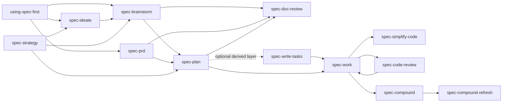
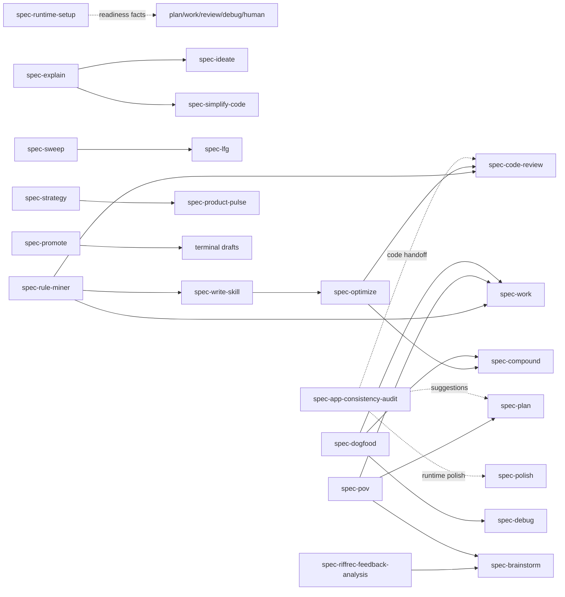
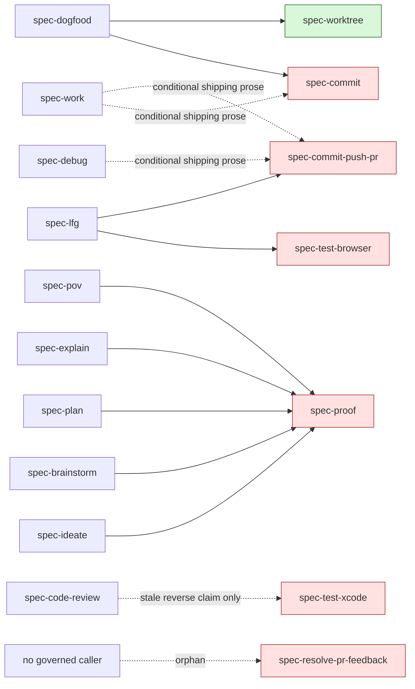

# Skill 关系图与节点总账

## 结论先行

- Governance 冻结 roster 共 35 个节点：17 个 `workflow_command`、11 个 `standalone_skill`、7 个 `internal_only`。本文已逐节点登记 35/35，无缺失、无额外、无重复。
- 28 个 public 节点的 source package 均被投射到 Claude、Codex、Cursor、Kiro、Qoder；workflow 在 Claude/Qoder 以 command 为公开入口，在 Codex/Cursor/Kiro 以 skill 为公开入口，standalone 在五宿主均以 skill 为公开入口。
- 35/35 dispatch-authority 对账显示：18 个 package 会直接或条件性派发 generic worker，只有 6 个完整继承显式 authorization + missing-auth/capability fallback，12 个存在缺口。节点可投射不等于其内部 dispatch authority 已闭合；详见 `edge-ledger.md` §9 与 SF-27。
- 7 个 internal helper 虽然在 governance 中的五宿主 `host_delivery` 都标为 `internal`，但实际过滤和同步实现只交付 `spec-worktree`。因此当前真实 runtime 是 **1/7 delivered**；另 6 个 helper 的 public caller 边在 source 图中可见，但在五宿主生成 runtime 中不可通过 Skill discovery/invocation 到达。
- `spec-resolve-pr-feedback` 和 `spec-test-xcode` 没有当前 governed public Skill 的真实 forward caller，且未投射，属于 runtime orphan；`spec-worktree` 只有 `spec-dogfood` 的 forward edge 已证实，它对 `spec-work` / `spec-code-review` 的 reverse integration 声明当前没有 caller-side 实现。

## 证据边界与记号

本总账以以下 current source 为权威：

1. 节点 roster 与入口分类：`src/cli/contracts/dual-host-governance/skills-governance.json`。
2. 实际 runtime 过滤：`src/cli/plugin-governance.js:11-16,29-88,99-107`。`DELIVERED_INTERNAL_SKILLS` 仅含 `spec-worktree`。
3. 实际 runtime 复制/计划：`src/cli/plugin-sync.js:187-228,231-299`。只有 filtered asset set 中的 `internalSkills` 会进入宿主 skill root。
4. 聚焦测试：`tests/unit/plugin-modules.test.js:39-58` 锁定 workflow command/skill 分流并明确断言 Cursor `internalSkills` 包含 `spec-worktree`；`tests/unit/using-spec-first-contracts.test.js:121-128` 锁定 internal-only 不出现在 public route；`tests/unit/low-findings-cleanup-contracts.test.js:12-21` 锁定 `spec-test-browser` 的 internal-only 分类。
5. 节点职责、artifact、handoff、failure/return/stop：三份 275/275 逐文件审查台账：`file-review-ledger-planning.md`、`file-review-ledger-execution.md`、`file-review-ledger-sidepaths.md`。

Graphify/CodeGraph 只用于导航，不作为节点、caller 或 runtime reachability 的最终权威。

### Side-effect class

| 记号 | 含义 |
| --- | --- |
| `R` | 只读、语义判断或 report-only；不改 project source |
| `D` | 写 durable document、workflow artifact、local state 或计划类 source |
| `C` | 修改 product/code/Skill/rule source |
| `T` | 启动 server、browser、simulator、benchmark 或其他临时执行环境 |
| `H` | 修改 host runtime、MCP/provider config 或 setup facts |
| `X` | Git commit/branch/worktree、push/PR、tracker、Proof 或其他外部写操作 |
| `?` 后缀 | 该类副作用只在显式 mode、用户选择或独立授权成立时发生 |

### Runtime delivery / reachability

| 记号 | 含义 |
| --- | --- |
| `WF5` | 五宿主可达：Claude/Qoder 公开 command，Codex/Cursor/Kiro 公开 skill；source package 随 runtime 投射 |
| `S5` | 五宿主均以 standalone skill 可达 |
| `IH5` | internal-only，但五宿主都实际投射到 skill root；当前仅 `spec-worktree` |
| `IH0` | governance 称 internal，但实际被五宿主 filtered asset set 排除；source 可读，runtime Skill 不可发现/调用 |

`reachable` 只表示 Skill package 在 `spec-first init` 后可被宿主发现，不代表其外部工具、凭据或 provider 已 ready。

## 最小关系图

### 主链与治理支点

边界：`using-spec-first` 只选择一个入口并 yield，不自动执行整条链，也不因 routing 自动授权 target 内部 subagent dispatch；`spec-write-tasks` 是可选 derived layer，不取代 plan 的 scope authority；`spec-code-review` 默认 report-only，修复和 landing 仍由 caller 或当前用户授权。

### Side paths

图中虚线表示 suggestion/advisory consumer，不是自动 handoff。`spec-polish`、`spec-product-pulse`、`spec-promote` 等用户驱动终点不因为处于 side path 而获得额外 mutation 或 landing 授权。

### Internal helper source 图与 runtime 断点

绿色节点为五宿主实际投射；红色节点只存在于 source/governance，不在当前五宿主 runtime Skill asset set 中。

## 35/35 节点总账

### Workflow commands（17）

| ID | Skill | entry_surface | Primary intent | Input | Output / artifact | Side-effect class | Terminal / handoff | Owner source | Runtime delivery / reachability |
| --- | --- | --- | --- | --- | --- | --- | --- | --- | --- |
| W01 | `spec-app-consistency-audit` | `workflow_command`; `app-consistency-audit` | 审计 App PRD/Figma/source 的静态一致性 | PRD、Figma/source refs、diff/base、mode | `.spec-first/app-audit/runs/<run-id>/` 结构化证据链与 preview-only writeback | `R,D` | 返回 audit envelope；只建议 `spec-plan` / `spec-code-review` / `spec-polish` / `spec-compound`，不自动运行 | `skills/spec-app-consistency-audit/SKILL.md` | `WF5` |
| W02 | `spec-brainstorm` | `workflow_command`; `brainstorm` | 把模糊方向收敛为 WHAT/WHY Product Contract | 用户 idea、ideate seed、STRATEGY.md、repo grounding | 新输出为 `docs/plans/*-plan.{md,html}` requirements-only unified plan；简短对齐可不写文档 | `R,D` | blocker 清空后可交 `spec-plan` / `spec-doc-review` / `spec-lfg`；external verdict 可交 `spec-pov` | `skills/spec-brainstorm/SKILL.md` | `WF5` |
| W03 | `spec-code-review` | `workflow_command`; `code-review` | 对 diff/branch/PR/task delta 做结构化代码审查 | diff/base/PR/task bundle、optional plan/context | Markdown report 或 `mode:agent` JSON，可写 run-scoped review artifacts | `R,D,C?` | 默认和 `mode:agent` report-only；仅 default + 显式 `apply-fixes` 可修，commit 另需授权 | `skills/spec-code-review/SKILL.md` | `WF5` |
| W04 | `spec-compound` | `workflow_command`; `compound` | 将已解决问题或耐久词汇沉淀为项目知识 | solved/verified problem、source evidence、mode | `docs/solutions/*.md` 或 `CONCEPTS.md` 更新 | `R,D` | 写入一条 learning 后停止；有明确 drift 时可建议/调用 `spec-compound-refresh` | `skills/spec-compound/SKILL.md` | `WF5` |
| W05 | `spec-compound-refresh` | `workflow_command`; `compound-refresh` | 维护已有 durable learnings 的新鲜度、重叠与可发现性 | `docs/solutions/**`、current code、scope/mode | Keep/Update/Consolidate/Replace/Delete/Stale 结果，并修改 solutions/CONCEPTS/discoverability | `R,D` | 报告 applied/skipped/blocked；新问题回 `spec-compound` | `skills/spec-compound-refresh/SKILL.md` | `WF5` |
| W06 | `spec-debug` | `workflow_command`; `debug` | 建立 reproduce → causal chain → 可选 fix → verification 诊断闭环 | bug/error/failed test/issue、target repo/scenario | Debug Summary、可选 code fix、`verification-run-summary`、honest-closeout verdict | `R,C,D,X?` | 设计问题交 `spec-brainstorm`并结束；post-fix 可交 simplify/review；用户接受后可 compound/landing | `skills/spec-debug/SKILL.md` | `WF5` |
| W07 | `spec-dogfood` | `workflow_command`; `dogfood` | 对当前 branch/PR 做 diff-scoped hands-off browser QA | branch/PR target、diff、app runtime | `docs/dogfood-reports/*-dogfood.md`、场景矩阵、可选小修复/回归测试/commit | `R,T,C,D,X` | 小问题自主修；复杂根因交 `spec-debug`，大修复交 `spec-work`，学习交 `spec-compound` | `skills/spec-dogfood/SKILL.md` | `WF5` |
| W08 | `spec-doc-review` | `workflow_command`; `doc-review` | 用角色化 lenses 审查 requirements/plan/spec | 本地 planning document、roster/mode | findings/envelope；Markdown 可按 policy 改原文，HTML 仅 report-only | `R,D` | requirements 通常回 `spec-plan`，plan 通常交 `spec-work`；不自动 landing | `skills/spec-doc-review/SKILL.md` | `WF5` |
| W09 | `spec-ideate` | `workflow_command`; `ideate` | 生成、比较并筛选有 grounding 的候选方向 | focus/constraint、STRATEGY.md、repo/external evidence | `docs/ideation/` 中 ranked ideation artifact，目录不存在时使用 spec-first temp path | `R,D` | 只将已选 idea 交 `spec-brainstorm`；不直跳 `spec-plan` | `skills/spec-ideate/SKILL.md` | `WF5` |
| W10 | `spec-runtime-setup` | `workflow_command`; `runtime-setup` | 安装/配置/验证五宿主 harness runtime、MCP/helper/provider readiness | host/target repo/subset/refresh/config | host config、runtime assets/facts、provider readiness envelope、action-required reasons | `R,H,D` | 修复完只建议继续原 intent 或单独 `spec-rule-miner`，不自动调用 downstream | `skills/spec-runtime-setup/SKILL.md` | `WF5` |
| W11 | `spec-optimize` | `workflow_command`; `optimize` | 用硬指标/LLM judge 运行 bounded experiment loop | metric goal、baseline、approved spec、budget | `.spec-first/workflows/spec-optimize/<spec-name>/experiment-log.yaml`、strategy digest、实验结果和可选 winner code | `R,T,C,D,X` | 目标/预算/平台期停止；可选 `spec-code-review` / `spec-compound` / PR | `skills/spec-optimize/SKILL.md` | `WF5` |
| W12 | `spec-plan` | `workflow_command`; `plan` | 把已定 WHAT 深化为 HOW 和 implementation-ready plan | requirements-only plan、PRD、direct brief、universal/answer-seeking goal | 原地 enrichment 或新 `docs/plans/*-plan.{md,html}`；software 设为 implementation-ready | `R,D` | WHAT 未定返 brainstorm/PRD；必须 doc-review；最后用户选 `spec-work` / goal / issue / Proof | `skills/spec-plan/SKILL.md` | `WF5` |
| W13 | `spec-polish` | `workflow_command`; `polish` | 启动 dev server，与用户协作迭代 UI/UX polish | current branch/feature、browser feedback | source edits、临时 server log/视觉证据、循环结束时可选 commit | `R,T,C,X` | 深层实现交 `spec-work`；browser helper 缺失交 `spec-runtime-setup`；用户 done 时结束 | `skills/spec-polish/SKILL.md` | `WF5` |
| W14 | `spec-prd` | `workflow_command`; `prd` | brownfield PRD-grade requirements 的 create/refine/validate | 既有系统、requirements/design/source evidence、mode | `docs/brainstorms/*-requirements.md` PRD-grade WHAT authority 与 readiness receipt/checkpoint | `R,D` | 0-1 或 scope 未定交 brainstorm；ready 交 plan；独立 critique 交 doc-review；一致性交 app audit | `skills/spec-prd/SKILL.md` | `WF5` |
| W15 | `spec-work` | `workflow_command`; `work` | 执行 settled plan、validated task pack 或 bounded implementation request | plan/task pack/spec/prompt、mode、authorization | code/tests、verification summary、可选 spec-work run artifact、lifecycle/landing handoff | `R,C,D,X?` | open-ended bug 交 debug；WHAT/plan 修复交 brainstorm/plan；return-to-caller 返结构化 envelope；standalone 按授权 landing | `skills/spec-work/SKILL.md` | `WF5` |
| W16 | `spec-write-skill` | `workflow_command`; `write-skill` | 创建/修订/迁移 project-owned Skill，或 validate-only readiness | target repo/Skill root、goal/package/findings、effect/modifier | previewed source patch 或零写 readiness report，及稳定 closeout envelope | `R,C,D` | source owner/授权不清即 blocked；安装交 skill-installer；可度量优化可交 `spec-optimize` | `skills/spec-write-skill/SKILL.md` | `WF5` |
| W17 | `spec-write-tasks` | `workflow_command`; `write-tasks` | 把 settled plan 可选编译为 derived task pack，或验证现有 pack | source plan 或 task-pack path、compile/validate intent | `docs/tasks/**` task pack，plan 仍是唯一 scope SoT | `R,D` | compile/skip/return-to-plan/draft-only/validate-only；validated pack 交 `spec-work`；high-risk 声明可交 doc-review | `skills/spec-write-tasks/SKILL.md` | `WF5` |

### Standalone skills（11）

| ID | Skill | entry_surface | Primary intent | Input | Output / artifact | Side-effect class | Terminal / handoff | Owner source | Runtime delivery / reachability |
| --- | --- | --- | --- | --- | --- | --- | --- | --- | --- |
| S01 | `using-spec-first` | `standalone_skill` | 在实质工作前选择唯一 public entrypoint 或 Direct Lane | current user intent、active workflow/context | 无 artifact；一次 route decision | `R` | 选定后 yield；active worker 直接继续；不自动串联 workflow | `skills/using-spec-first/SKILL.md` | `S5` |
| S02 | `spec-explain` | `standalone_skill` | 为当前用户制作 concept/diff/idea/recap 可视化解说 | concept/diff/recent-work window、optional check-in | run-dir explainer，可复制 local file 或发布 destination | `R,D,X?` | 改进观察须用户接受后才交 ideate/simplify；UI 只提示用户运行 polish | `skills/spec-explain/SKILL.md` | `S5` |
| S03 | `spec-lfg` | `standalone_skill` | 编排 plan 到 green PR 的 hands-off pipeline | goal/requirements/plan path、pipeline context | implementation-ready plan、code/tests/review/residual sink、browser result、completed lifecycle、commit/PR/CI state | `R,T,C,D,X` | 任一 hard gate 失败即停；完成后返 PR/CI/DONE，`spec-explain` 只作建议 | `skills/spec-lfg/SKILL.md` | `S5` |
| S04 | `spec-pov` | `standalone_skill` | 对外部技术/模式/变化给出 project-grounded 采纳裁决 | named candidate、decision intent、project/external evidence | 默认 chat verdict；可选 full report/Proof/compound decision history | `R,D,X?` | Adopt 交 plan/brainstorm；Trial 交 work；Hold/Reject 无 handoff；warm invocation 返还 caller | `skills/spec-pov/SKILL.md` | `S5` |
| S05 | `spec-product-pulse` | `standalone_skill` | 按时间窗聚合 product signals | lookback、`.spec-first/config.local.yaml`、read-only data sources、optional STRATEGY.md | `docs/pulse-reports/YYYY-MM-DD_HH-MM.md` 和 machine-local pulse config | `R,D` | 输出报告后结束；schedule 必须另行确认并交 host primitive | `skills/spec-product-pulse/SKILL.md` | `S5` |
| S06 | `spec-promote` | `standalone_skill` | 为已 shipped feature 起草 launch/promotion copy | user description 或 PR/diff/changelog/commits、channels | chat 中的 copy-pasteable drafts；可选 local opt-out config | `R,D?` | terminal drafts；永不 post/publish/commit/open PR；Spiral 失败回 direct drafting | `skills/spec-promote/SKILL.md` | `S5` |
| S07 | `spec-riffrec-feedback-analysis` | `standalone_skill` | 解析 Riffrec bundle/录屏/音视频/笔记 feedback | media/bundle/notes、quick/extensive/setup cues | quick bug report 或 extensive text/manifest/problem artifacts；raw media 保持 local-only | `R,T,D` | extensive 在用户需要 product scoping 时交 `spec-brainstorm`；quick 直接结束 | `skills/spec-riffrec-feedback-analysis/SKILL.md` | `S5` |
| S08 | `spec-rule-miner` | `standalone_skill` | 从当前源码挖掘真实 coding conventions 并生成 AI rules | target repo/source evidence、tool target、mode | 默认 `docs/ai/project-rules.md` 与 AGENTS/CLAUDE/tool pointers，或 preview-only | `R,C,D` | current diff 质量交 code-review；实现交 work；source Skill 改动交 write-skill；runtime drift 交 `spec-first init` | `skills/spec-rule-miner/SKILL.md` | `S5` |
| S09 | `spec-simplify-code` | `standalone_skill` | 对近期改动做 behavior-preserving tidy/refactor | user scope 或 branch diff、optional plan hint | 经验证的 code simplification，无独立 durable report contract | `R,C` | 不能证明等价则跳过/回退；真正 bug 交 `spec-debug` | `skills/spec-simplify-code/SKILL.md` | `S5` |
| S10 | `spec-sweep` | `standalone_skill` | 扫描 feedback sources、ack、分析 media、验证 fix 并滚动维护 plan | configured Slack/GitHub/email sources、state、mode | state file、`docs/plans/feedback-sweep-plan.md`、run record/summary，可选 commit/push | `R,T,D,X` | 总是输出 `spec-lfg docs/plans/feedback-sweep-plan.md` handoff line，但不自动调用 | `skills/spec-sweep/SKILL.md` | `S5` |
| S11 | `spec-strategy` | `standalone_skill` | 创建或定向更新 product strategy anchor | owner answers、existing STRATEGY.md、optional focus | repo root `STRATEGY.md` | `R,D` | 结束后可建议 ideate/brainstorm；产物被 ideate/brainstorm/plan/product-pulse 只读消费 | `skills/spec-strategy/SKILL.md` | `S5` |

### Internal-only helpers（7）

| ID | Skill | entry_surface | Primary intent | Input | Output / artifact | Side-effect class | Terminal / handoff | Owner source | Runtime delivery / reachability |
| --- | --- | --- | --- | --- | --- | --- | --- | --- | --- |
| I01 | `spec-commit` | `internal_only`; no command | 把当前 working tree 拆成一个或少量逻辑 commit | git status/diff/branch/log、repo commit conventions | local commit hash(es) 与 post-commit status | `R,X` | clean tree 或无法安全组织 commit 时停；不负责 push/PR | `skills/spec-commit/SKILL.md` | `IH0` |
| I02 | `spec-commit-push-pr` | `internal_only`; no command | commit/push/open PR，或只生成/更新 PR 描述 | working tree/branch/base/PR context、mode | commits、pushed branch、PR URL/body，可选 `New concepts` trailer | `R,D,X` | detached/no feature work/base unresolved 等停；pipeline 返 PR/commit outcome | `skills/spec-commit-push-pr/SKILL.md` | `IH0` |
| I03 | `spec-worktree` | `internal_only`; no command | 为 public workflow 创建或附着隔离 worktree | caller-selected `detect` / `create` / `isolate` mode、branch/PR/ref | `spec-worktree-detect.v1` verdict、worktree path/branch，可选 env-copy audit | `R,X` | linked-worktree 就地继续；unknown/non-zero 停；caller 消费 ready/already-checked-out verdict | `skills/spec-worktree/SKILL.md` | `IH5` |
| I04 | `spec-proof` | `internal_only`; no command | 通过 Proof 发布/共享/评论/编辑 Markdown 并运行 HITL | existing local Markdown path、title、identity 或 Proof URL | share URL、Proof state/comments/ops；显式 end-sync 时可原子写回 local file | `R,D,X` | local Markdown 始终 canonical；返 `localSynced`/revision/open-thread 状态；失败不丢 local source | `skills/spec-proof/SKILL.md` | `IH0` |
| I05 | `spec-resolve-pr-feedback` | `internal_only`; no command | 评估、修复、回复并 resolve PR review threads | PR/comment URL/current PR、full/targeted mode | code fixes、validation、commit/push、thread replies/resolution summary | `R,C,X` | `needs-human` 保持 open；dispatch 不可用时可在已进入 helper 后串行处理 | `skills/spec-resolve-pr-feedback/SKILL.md` | `IH0` |
| I06 | `spec-test-browser` | `internal_only`; no command | 根据 branch/PR changed files 映射并验证页面流程 | PR/branch/current、port、manual 或 `mode:pipeline` | rendered evidence/screenshots 与 PASS/FAIL/PARTIAL summary | `R,T,D?` | `agent-browser` 缺失则建议 runtime-setup 并停；pipeline server failure 退出 | `skills/spec-test-browser/SKILL.md` | `IH0` |
| I07 | `spec-test-xcode` | `internal_only`; no command | 用 XcodeBuildMCP 在 simulator 上 build/install/launch/verify iOS app | scheme/current、Xcode project/workspace、MCP/simulator | build/log/screenshot 证据与 PASS/FAIL/PARTIAL summary | `R,T,D?` | MCP/build 不可用即停；人工交互暂停等待确认 | `skills/spec-test-xcode/SKILL.md` | `IH0` |

## 7 个 internal helper 的 caller → target → runtime reachability

表内五宿主单元格式为 `projected/reachable`。`yes/yes` 表示 package 会被同步且 caller 可通过宿主 Skill primitive 发现；`no/no` 表示 package 被 filtered asset set 排除。

| Helper target | Current caller → target 边 | Claude | Codex | Cursor | Kiro | Qoder | Target-unavailable fallback / return | Orphan 判定 |
| --- | --- | --- | --- | --- | --- | --- | --- | --- | --- |
| `spec-commit` | 真实 forward edge：`spec-dogfood → spec-commit`；`spec-work` shipping reference 提到 no-PR `spec-commit` path，但最终执行用语是泛化的 repo commit workflow；source description 还声明 direct user trigger，与 internal-only governance 不一致 | `no/no` | `no/no` | `no/no` | `no/no` | `no/no` | dogfood 没有 helper-unavailable inline fallback；work 可在已有 commit authorization 下使用项目 commit workflow，但这不修复 dogfood 的显式 target edge | 否；source-connected，但 runtime-disconnected |
| `spec-commit-push-pr` | 强 forward edge：`spec-lfg → spec-commit-push-pr mode:pipeline`；`spec-work` / `spec-debug` 的授权 shipping 文案也将 Known Residuals 交给该 target | `no/no` | `no/no` | `no/no` | `no/no` | `no/no` | LFG 仅在 **无 remote** 时有明确 inline local-commit fallback；对“有 remote 但 helper 未安装”无等价 fallback。work/debug 可按“requested landing workflow”使用 host/git 能力，但显式 helper invocation 仍不可达 | 否；source-connected，但 LFG runtime 主链断开 |
| `spec-worktree` | 已证实 forward edge：`spec-dogfood → spec-worktree isolate`；helper 自述 `spec-work` / `spec-code-review` caller，但两个 public package 均无 forward invocation，且 code-review 禁止 checkout/branch mutation | `yes/yes` | `yes/yes` | `yes/yes` | `yes/yes` | `yes/yes` | dogfood 用户拒绝 isolation 时可确认后 in-place checkout；helper `unknown`/non-zero 时 fail closed，不 raw fallback | 否；当前唯一 delivered internal helper；只有 dogfood edge 闭合 |
| `spec-proof` | 已证实 callers：`spec-ideate`、`spec-brainstorm`、`spec-plan`、`spec-explain`、`spec-pov` → `spec-proof`；helper source 还将用户点名 Proof 视为 first-class direct trigger，与 internal-only + 未投射不一致 | `no/no` | `no/no` | `no/no` | `no/no` | `no/no` | ideate/brainstorm/plan 保留 local canonical 并报 upload failure；`spec-explain` 有明确 Proof Web API fallback；pov 可回 local/other report destination。功能可降级，但 Skill 边本身不可达 | 否；source-connected/runtime-disconnected |
| `spec-resolve-pr-feedback` | 对其他 34 个 governed package 的全量账本无 forward caller；只有 helper 自己的 direct-use description | `no/no` | `no/no` | `no/no` | `no/no` | `no/no` | 进入 helper 后 dispatch 不可用可 inline/serial，但没有入口可达性 fallback；public review 也明确不处理 thread filing/resolution | **是**；governed runtime orphan |
| `spec-test-browser` | 强 forward edge：`spec-lfg → spec-test-browser mode:pipeline`；`spec-dogfood` 仅将它列为被排除的“ordinary browser smoke test”近邻，不是 caller；helper source 又保留 manual direct usage | `no/no` | `no/no` | `no/no` | `no/no` | `no/no` | LFG 对 missing/failed/indeterminate browser result fail closed，无 target-unavailable inline fallback；只有 helper 已进入后才能在 `agent-browser` 缺失时建议 `spec-runtime-setup` | 否；source-connected，但 LFG runtime 完成 gate 断开 |
| `spec-test-xcode` | 无 public forward caller。helper 反向宣称 `spec-code-review` 可 spawn，但 code-review 只 dispatch static `swift-ios-reviewer`，leaf 又被禁止调用其他 Skill | `no/no` | `no/no` | `no/no` | `no/no` | `no/no` | MCP 不可用时 helper 停止并给 setup 指引，但没有 caller/entry fallback；static iOS reviewer 不等价于 simulator verification | **是**；governed runtime orphan，reverse claim 过时 |

## Runtime delivery 确定性核对

`buildFilteredAssetSet()` 对五宿主的 current output 一致：

| Host | `internalSkills` | 被跳过的 internal helpers |
| --- | --- | --- |
| Claude | `spec-worktree` | `spec-commit`, `spec-commit-push-pr`, `spec-proof`, `spec-resolve-pr-feedback`, `spec-test-browser`, `spec-test-xcode` |
| Codex | `spec-worktree` | 同上 |
| Cursor | `spec-worktree` | 同上 |
| Kiro | `spec-worktree` | 同上 |
| Qoder | `spec-worktree` | 同上 |

这不是“governance 已表示 internal，所以宿主会自动拥有它们”。实际实现使用额外 allowlist：只有同时满足 `entry_surface=internal_only`、`host_delivery.<host>=internal`、`DELIVERED_INTERNAL_SKILLS.has(skill_name)` 的节点才会进入 `internalSkills`，然后 `plugin-sync.js` 才会复制 package。

## 自校验

| 检查项 | 结果 |
| --- | ---: |
| Governance expected nodes | 35 |
| 本文 registry actual rows | 35 |
| `workflow_command` expected / actual | 17 / 17 |
| `standalone_skill` expected / actual | 11 / 11 |
| `internal_only` expected / actual | 7 / 7 |
| Missing | 0 |
| Extra | 0 |
| Duplicate | 0 |
| Internal governed / actually delivered | 7 / 1 |

自校验口径：从 governance 读取 `skill_name + entry_surface`，与本文 `W01..W17`、`S01..S11`、`I01..I07` 三张 registry 的 Skill 名单做集合及重复对账；再对五个 `getSupportedPlatforms()` 结果运行 `buildFilteredAssetSet()`，核对 `internalSkills` 与 skipped internal roster。

已执行的聚焦验证：

- 节点对账脚本：`expected=35, actual=35, workflow=17, standalone=11, internal=7, missing=0, extra=0, duplicate=0, entry_surface_mismatch=0`。
- `npx jest tests/unit/plugin-modules.test.js tests/unit/using-spec-first-contracts.test.js tests/unit/low-findings-cleanup-contracts.test.js --runInBand`：3 suites / 20 tests 全部通过。
- `git diff --no-index --check /dev/null docs/项目审查/2026-07-17-skill-flow-system-audit/evidence/skill-graph.md`：无 whitespace-error 输出（新文件与 `/dev/null` 存在内容 diff，因此 no-index 返回码为 1）。
