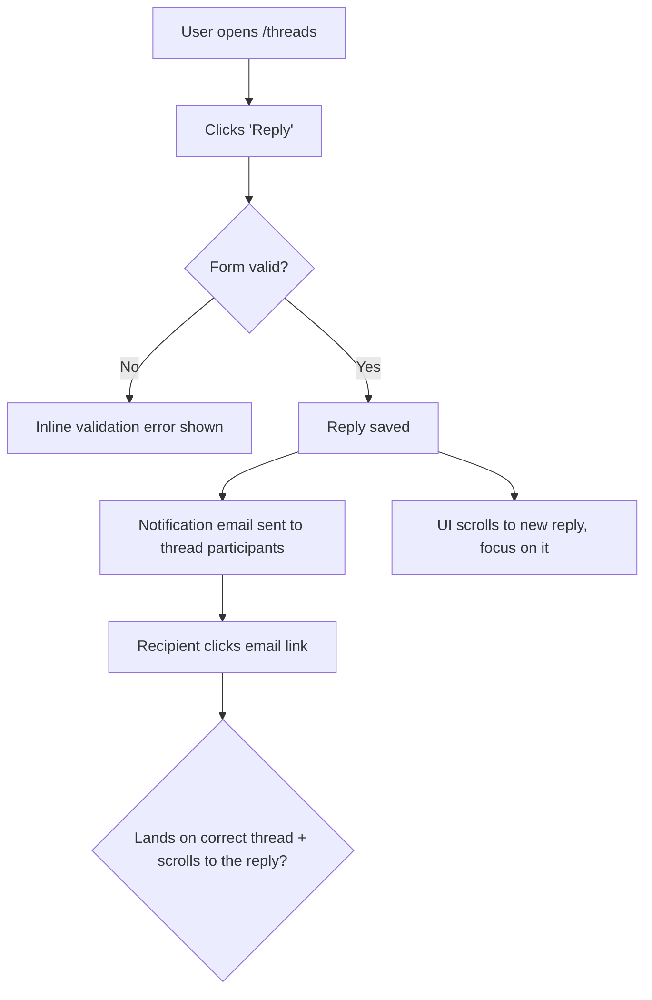

# Dogfood phases

### Phase 0: Scope and Get on the Right Branch

Parse the invocation arguments supplied by the current host: a PR number, a branch name, or blank (use current branch). Preserve quoted paths/tokens while stripping a recognized `--port PORT` pair if present.

1. **Identify the target — keep PR identity; do not switch the working tree yet.**
   - **PR number:** the target *is the PR* — carry the number through every later step (trunk check, isolation, checkout). Read its head only for display (`gh pr view <number> --json headRefName,isCrossRepository`), but do **not** reduce it to a bare branch name: a fork PR's head can even be named `main`/`master`. Do not check out yet.
   - **Branch name:** the target is that branch.
   - **Blank:** the target is the current branch.
2. **Refuse to run on the trunk — branch/blank targets only.** If a *branch-name or blank* target resolves to the trunk (`main`/`master`/the detected default), stop — there is no diff to dogfood. A **PR is always diffable** (it has a base), so this check never applies to a PR target; never refuse `spec-dogfood <number>` just because the PR's head branch happens to be named `main`.
3. **Decide isolation by what you're testing; let `spec-worktree` own the worktree mechanics.** Do not re-derive worktree detection or creation here — `spec-worktree` handles existing-isolation detection, attaching to a ref, and the "already checked out" constraint, and reports its decision back. The target remains scope until branch mutation is authorized:
   - **Blank / current-branch target:** do **not** isolate — dogfood in place. You are already on the branch under test, any separately authorized fixes belong in this checkout, and git cannot check the same branch out in a second worktree anyway. (If you happen to already be in a worktree, that is fine — you are simply dogfooding here.)
   - **A PR or a different named branch:** offer the concrete isolation/checkout choices with their side effects. Choosing an option is the authorization source for that exact action. On authorized isolation, invoke `spec-worktree` existing-ref mode through its bundled script: `isolate pr:<number>` for PR targets, or `isolate <branch>` for branch targets. It may return `already_checked_out branch=<name> path=<path>`; use that existing checkout and never switch the primary checkout. On an explicitly authorized in-place switch, use `gh pr checkout <number>` or `git checkout <branch>` after dirty-state safety checks. If no blocking interaction exists or the user declines both mutations, stop with `branch_mutation_authorization_missing`; do not silently switch the primary checkout.
4. **Resume if a prior run exists.** Look for an existing report at `docs/dogfood-reports/*-<branch-slug>-dogfood.md` (see the branch-slug rule under Resumability). If one is found with unfinished scenarios, ask whether to resume it or start fresh. To resume, re-hydrate the task list from its matrix: `Pass`/`Fixed`/`Skipped` stay done; `Pending` and `in_progress` become the remaining auto-runnable work. The three `Blocked` states are **not** auto-runnable — `Blocked (fix authorization)`, `Blocked (needs human verify)`, and `Blocked (human decision)` all wait on a person, so surface them and ask how to proceed rather than silently re-queuing them.

### Resumability (stop and return at any point)

This workflow is designed to be interrupted and resumed. Two pieces of state make that safe:

- **The scenario ledger** maintained by the active workflow host is the live progress record — one entry per matrix scenario. Mark each `in_progress` when you start it and `completed` only when it genuinely passes.
- **The report doc** at `docs/dogfood-reports/<YYYY-MM-DD>-<branch-slug>-dogfood.md` is the durable checkpoint that survives across sessions. `<branch-slug>` is the branch name lowercased with every run of non-alphanumeric characters (slashes included) collapsed to a single `-` (e.g. `feature/Foo_Bar` -> `feature-foo-bar`). **Create it as soon as the matrix exists (end of Phase 2) by instantiating `references/dogfood-report-template.md`** (read that template now if you haven't) so the checkpoint carries the template-owned section shape from the start — then fill in every scenario at `Pending`, and **update it incrementally** after each scenario judgment and each verified fix/commit-status change, not only at the end. An interrupted run must leave a template-shaped checkpoint, not a bare matrix.

Because tasks are session-scoped but the report doc is on disk, the report is the source of truth for resuming. Always keep the two in sync so a later run (or a teammate) can pick up exactly where this one stopped.

### Phase 1: Analyze Changes

Derive the trunk ref once, then pull the full diff against it and read it. Do not hard-code `main` — a repo whose default branch is `master` (or anything else) would fail with `fatal: ambiguous argument 'main...HEAD'`.

```bash
# Resolve the trunk to a ref that actually exists. Start from the detected
# default name (origin/HEAD, then gh), then fall back to common names. For each
# candidate prefer a local branch; else use the remote-tracking ref QUALIFIED as
# origin/<branch> — an unqualified name resolves via refs/remotes/<name>, NOT
# refs/remotes/origin/<name>, so a remote-only trunk would otherwise miss. This
# qualification applies to the detected default too (PR/CI checkouts often have
# only origin/main, no local main).
DEFAULT=$(git symbolic-ref --quiet --short refs/remotes/origin/HEAD 2>/dev/null | sed 's@^origin/@@')
DEFAULT=${DEFAULT:-$(gh repo view --json defaultBranchRef -q .defaultBranchRef.name 2>/dev/null)}
TRUNK=""
for cand in "$DEFAULT" main master; do
  [ -n "$cand" ] || continue
  if git show-ref --verify --quiet "refs/heads/$cand"; then
    TRUNK=$cand; break
  elif git show-ref --verify --quiet "refs/remotes/origin/$cand"; then
    TRUNK="origin/$cand"; break
  fi
done
TRUNK=${TRUNK:-main}

git diff --name-only "$TRUNK...HEAD"   # what changed
git diff "$TRUNK...HEAD"               # how it changed
```

Build a mental model of every change: new features, modified behavior, new routes/views/components, touched data flows. Note anything that produces user-visible behavior — that is what the matrix must cover.

**Ground in the product's personas and vision.** Look for persona and vision context so flows can be judged from real users' eyes, not just "does it work." Check, in order: `STRATEGY.md` (its "Who it's for" section names the primary persona and their job-to-be-done), `VISION.md`, and any persona docs (e.g. `docs/personas/`, `PERSONAS.md`). Capture the 1-3 primary personas and what each cares about. If none exist, infer a reasonable primary persona from the product and the diff, and say so in the report.

### Phase 2: Map the Flows, Then Build the Matrix

Do not jump straight to a flat list of pages. First **understand the user flows the diff touches**, then derive the matrix from them. A matrix built without a flow model tests pages in isolation and misses the journey — the email that "sends" but lands in the wrong thread.

#### 2a. Map the user flows (required)

For every user-visible change, trace the **complete journey** end to end and draw it. Map each flow as a **Mermaid `flowchart`** so the journey is explicit and reviewable before any testing happens — entry point, each user action, branch points (success / validation error / empty / permission-denied), side effects (emails, jobs, notifications), and the true end state.

> Email example: it's not enough that "an email sends." Does it go to the *right* recipient? When the user clicks through, does the app land on and scroll to the *right* message? Does the content make sense? Does the whole flow align with the product's vision and UX? The flowchart must carry the click-through and its destination, not stop at "email sent."



Produce one flowchart per distinct journey, scaled to the diff: a one-route or copy-only change gets a single small flowchart, a multi-step feature gets several. Cover the happy path **and** the branch points (error, empty, boundary, permission). Mapping the flows before the matrix is never skipped — these diagrams ARE the understanding; they become the spine of the matrix and belong in the final report.

#### 2b. Derive the matrix from the flows

Walk each flowchart and turn every node and branch into one or more test scenarios. Read `references/test-matrix-taxonomy.md` for the full set of dimensions (journeys, functional checks, experiential checks, edge/error/empty states, accessibility, responsiveness). Cover both **functional** ("does it work?") and **experiential** ("does it feel right and align with the product?").

Map changed files to concrete routes (views -> their pages, components -> pages rendering them, layouts -> all pages, stylesheets -> visual regression on key pages) and attach those routes to the flows that exercise them.

**Load the matrix as a scenario ledger** in the active workflow host, one entry per scenario, so progress is tracked and nothing is skipped. Order entries by flow, following the flowcharts, not by file.

### Phase 3: Detect Port and Start the Dev Server

Determine the port (priority: explicit `--port` > a port explicitly stated in your in-context project instructions > `package.json` dev script > `.env*` `PORT=` > default `3000`). If a server is already listening on it, reuse it. Otherwise start the project's dev command (`bin/dev`, `rails server`, `npm run dev`, etc.) in the background and poll the port until it accepts connections. This skill is hands-off, so start the server automatically without asking. Freeze a credential-free exact loopback origin such as `http://127.0.0.1:${PORT}` for the owner call; do not open the browser here, accept redirects as a replacement origin, or infer browser readiness from the listener alone.

### Phase 4: Execute the Matrix

Work the task list **one item at a time**. For each scenario, mark the task `in_progress`, then:

1. **Document** what you're testing (the journey, expected outcome, exact target origin, and expected-effect classification).
2. **Execute through the owner** by invoking `spec-test-browser` with `mode:pipeline`, the current branch/PR selector, and `target-origin:<exact-loopback-origin>`. Supply only routes and expected-safe synthetic interactions derived from the flow. If the owner returns `target-origin-*`, exact-origin/conformance failure, `browser-mutation-authorization-required`, cleanup failure, or another `not_run` / `not_supported` result, preserve that reason and do not fall back to a direct browser command. Keep transient screenshots in owner-private temp evidence; copy one into the report only when intentionally embedding it.

3. **Judge** both correctness and experience: right data, right destination, sensible content, no console errors, and does it feel aligned with the product?
4. **Walk it as each persona.** Re-run the journey in your head from each primary persona's perspective (from Phase 1) and ask where they'd feel a **paper cut** — a small friction that wouldn't fail a functional test but degrades the experience: a confusing label, an extra click, an unexpected jump, a slow-feeling step, missing feedback, copy that doesn't match how that persona thinks. A scenario can be functionally `Pass` yet still carry paper cuts. Note each paper cut, which persona feels it, and its severity.
5. **Record** pass/fail plus any paper cuts, with specifics. Mark the task `completed` only when it genuinely passes. Paper cuts do not block a `Pass`, but a **sharp** paper cut (one severe enough to fix now) is routed into the Phase 5 fix loop just like a failure — apply the same auto-fix-vs-escalate judgment to it. Log the rest in the report.

**External-interaction flows** (OAuth, real email delivery, payments, SMS) can't be fully driven headlessly — pause, ask the user to verify that leg, and mark the scenario `Blocked (needs human verify)` until they confirm. Then continue.

### Phase 5: Fix Loop (Authorization-Aware)

When a scenario fails — or a passing scenario carries a sharp paper cut worth fixing now — first decide whether local fix authority exists and whether the change is small enough for this workflow.

**Judge the size of the fix before touching code.** A fix is eligible only when separately authorized and small, well-understood, and low-risk: a clear bug with an obvious correct fix, contained to a few files, with no schema/architecture/product trade-off. Even with local fix authority, do not implement a large or ambiguous change that requires an architectural, schema, product, or UX decision; record it for a human instead.

**For authorized fixes:**

When `local_fix_authorization: missing`, do not touch product source. Record the issue and `fix_authorization_missing`, mark the scenario `Blocked (fix authorization)`, and continue with other independent scenarios. Do not relabel an unfixed failure as `Pass`.

1. Investigate the root cause. If it's non-obvious, use `spec-debug`.
2. Apply the fix in the code.
3. **Add an automated regression test** that fails before the fix and passes after, so the bug can't return. This is the default for behavioral and code bugs. When an automated test is genuinely impractical — a pure copy, spacing, or visual fix with no behavioral assertion to make — substitute a documented browser-replay or screenshot check and **state in the report why no automated test was meaningful**. Do not invent a hollow test just to satisfy the step.
4. If `commit_authorization: authorized`, commit the fix with a clear message using `spec-commit`, one logical fix per commit. Otherwise leave the verified fix uncommitted, record `commit_authorization_missing`, and use `uncommitted` in the report's Commit field.
5. Re-run the failing scenario in the browser to confirm it now passes; then continue the matrix.
6. If the bug carried a reusable lesson, capture it with `spec-compound`.

**For changes too big to make autonomously:** do not implement. Record it in the report's **Decisions for a human** section with: what's broken, why it's not a safe autonomous fix, the options you see (with trade-offs), and your recommendation. Mark the scenario `Blocked (human decision)` in the matrix, then continue with the rest. Never make a large, irreversible, or product-altering change just to clear a matrix item.

Keep iterating until every task is `completed` or in a terminal `Blocked` state — `Blocked (fix authorization)`, `Blocked (human decision)`, or `Blocked (needs human verify)`. All three wait on a person, so do not re-queue them. Re-test anything a fix might have affected.

**Before declaring the branch ready, run the project's automated test suite once** (the new regression tests plus everything that already exists). Discover the test command from the project's active instructions and conventions already in your context — do not assume a specific runner. Record the result in the report; a green matrix with a red suite is not "ready."

### Phase 6: Write the Report Artifact

The report doc was created at the end of Phase 2 and updated incrementally throughout (see Resumability). When the matrix is green (or every remaining item is explicitly blocked), **finalize** it at `docs/dogfood-reports/<YYYY-MM-DD>-<branch-slug>-dogfood.md` in the repo under test, then surface a short summary in chat with the file path.

**Finalize against `references/dogfood-report-template.md`** — the same template the Phase 2 checkpoint was instantiated from, which owns the required sections and what each must carry. Confirm every template-owned section is present and complete; do not reconstruct the section list from memory, as that drifts from the template. Carry forward the cross-phase obligations this skill produced: the Mermaid flowcharts from Phase 2a, a matrix row per scenario with its commit SHA or `uncommitted`, each fix's root cause and the regression test added (or why none was meaningful), authorization blockers, paper cuts attributed by persona, learnings worth feeding to `spec-compound`, and a final readiness verdict that records the Phase 5 automated-suite result. Without landing authorization, do not push and do not open a PR.
