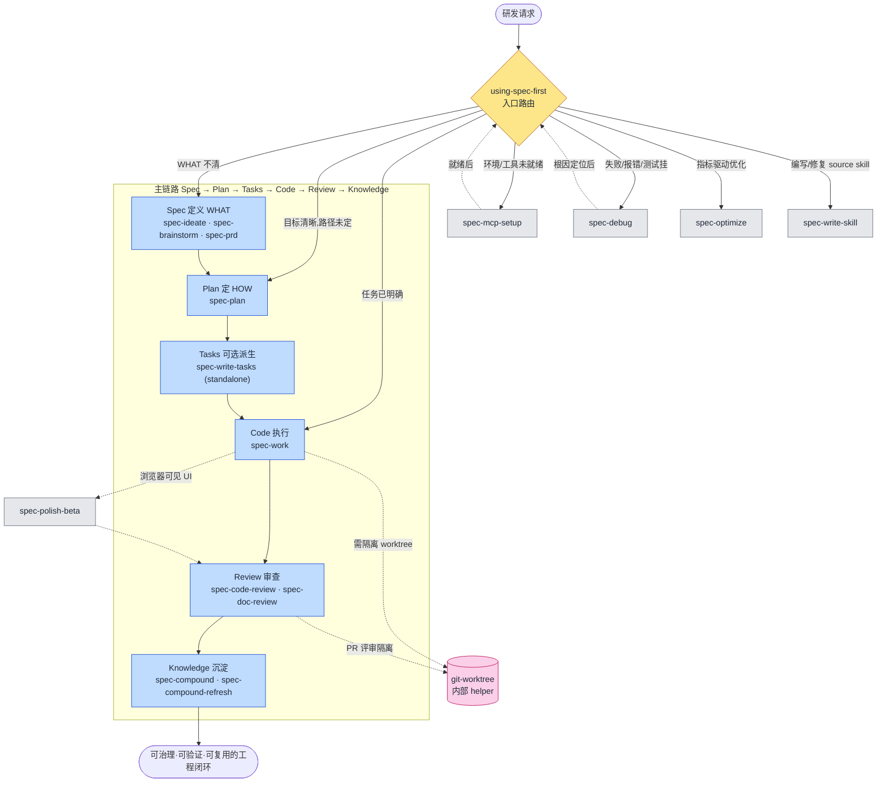

# 研发场景:spec-first workflow 执行链路

> 本文是会话生成的参考笔记,不是项目 source 资产;路由权威来源是 `skills/using-spec-first/SKILL.md`。

研发场景的核心 workflow 执行链路为:

```
Codebase → Spec → Plan → Tasks → Code → Review → Knowledge
```

围绕这条链路,skill 分四层:**入口治理 → 主链路 workflow → 旁路/支撑 workflow → 内部 helper**。

## 一、入口治理(不是命令,先于一切)

| Skill | 角色 |
| --- | --- |
| `using-spec-first` | meta 路由 governor。判断当前请求是否进入某个公开 workflow,只选一个入口。本身不是命令入口,不产 artifact。 |

## 二、主链路 workflow(研发执行流程骨架)

| 阶段 | Skill / 命令 | 说明 |
| --- | --- | --- |
| Spec(定义 WHAT) | `spec-ideate` | 0-1 找点子、要选项 |
| | `spec-brainstorm` | WHAT 还不清、问题框架未定 |
| | `spec-prd` | 已有系统形态的 brownfield PRD 编写/校验 |
| Plan(定 HOW) | `spec-plan` | 目标清晰但实现路径未定 → 出计划 |
| Tasks(可选派生) | `spec-write-tasks` | standalone skill,非公开 workflow 命令。把已定稿 plan 拆成可执行 task pack;plan 仍是唯一 source of truth,task 是派生且可选 |
| Code(执行) | `spec-work` | 已有 plan/task/明确任务 → 实施 |
| Review(审查) | `spec-code-review` | diff/PR/实现质量 |
| | `spec-doc-review` | 需求/计划/markdown 文档评审 |
| Knowledge(沉淀) | `spec-compound` | 沉淀刚解决的问题 |
| | `spec-compound-refresh` | 修正/合并/退役已有 durable 知识 |

## 三、研发流程旁路 / 支撑 workflow

| Skill / 命令 | 触发场景 |
| --- | --- |
| `spec-debug` | 失败、报错、测试挂、异常行为(诊断优先于 work) |
| `spec-optimize` | 指标驱动的实验式优化 |
| `spec-mcp-setup` | 环境/host/MCP/工具就绪(执行前置) |
| `spec-polish-beta` | 跑起 app 迭代浏览器可见 UI |
| `spec-write-skill` | 编写、改写、迁移或按 audit findings 修复 spec-first source skill |

## 四、内部 helper(执行流程内部被调用,非用户入口)

| Skill | 说明 |
| --- | --- |
| `git-worktree` | 仅由 `spec-work`/`spec-code-review` 等公开 workflow 在需要隔离 worktree 做并行/PR 评审时委派,不暴露给用户直接调用 |

## 边界提示

- 公开 workflow 用户入口统一为 `spec-*`;`using-spec-first` 和 `spec-write-tasks` 是 standalone skill,不是命令;`git-worktree` 是隐藏 helper。
- 不属于研发执行流程(可排除):团队治理类 `spec-team-standards-governance`;上下文检索类 `spec-sessions`、`spec-slack-research`、`spec-release-notes`;以及与研发流程无关的 `baoyu-*`、`lark-*`、图像/视频类 skill。
- `spec-skill-audit`、`spec-app-consistency-audit` 和 `spec-write-skill` 现在是公开 workflow 入口,但属于治理/支撑链路,不是 Codebase → Spec → Plan → Tasks → Code → Review → Knowledge 主链路节点。
- 路由原则:意图优先于关键词,只选一个入口、给一个理由,不自动串联多个 workflow——除非某 workflow 显式 handoff。

## 流程图


